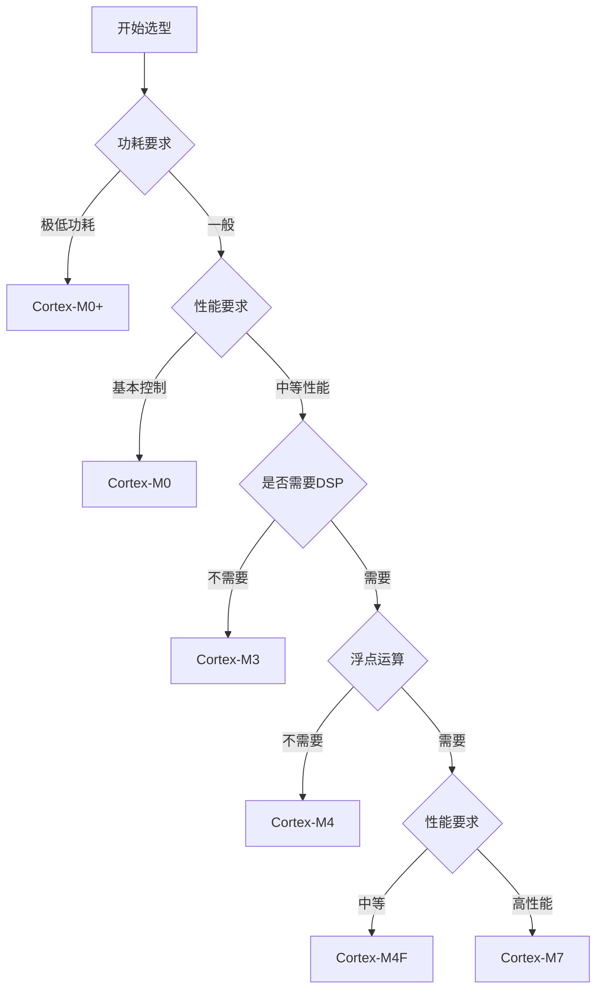

---
# 基础信息
title: "ARM Cortex-M系列处理器架构入门"
description: "本文全面介绍ARM Cortex-M系列处理器的架构特点、寄存器组织、指令集基础和内存映射机制，帮助初学者系统掌握ARM Cortex-M处理器的核心概念和应用场景"
slug: "arm-cortex-m-intro"

# 分类信息
domain: "01-hardware-layer"
module: "01-chip-architecture"
content_type: "article"
skill_level: "beginner"

# 标签和关联
tags:
  - ARM
  - Cortex-M
  - 微控制器
  - 处理器架构
  - 嵌入式系统
prerequisites: []
related_contents: []

# 学习信息
estimated_time: 30
difficulty_score: 2

# 作者和版本
author: "嵌入式知识平台内容团队"
author_id: ""
created_at: "2026-03-07"
updated_at: "2026-03-07"
version: "1.0.0"

# 语言和本地化
language: "zh-CN"
translations: []

# 状态和可见性
status: "draft"
is_featured: false
is_premium: false

# SEO和元数据
keywords:
  - ARM Cortex-M
  - 微控制器架构
  - 嵌入式处理器
  - STM32
  - 寄存器
cover_image: ""
---

# ARM Cortex-M系列处理器架构入门


## 概述

ARM Cortex-M系列处理器是ARM公司专门为嵌入式应用设计的32位RISC处理器内核，广泛应用于微控制器(MCU)领域。从智能家居到工业控制，从可穿戴设备到汽车电子，Cortex-M处理器凭借其低功耗、高性能和易用性成为嵌入式系统的首选方案。

### 学习目标

通过本文的学习，你将能够：

- 理解ARM Cortex-M系列处理器的整体架构和设计理念
- 掌握不同Cortex-M型号（M0/M0+/M3/M4/M7）的特点和应用场景
- 了解Cortex-M处理器的寄存器组织结构和功能
- 理解Thumb和Thumb-2指令集的基本概念
- 掌握内存映射和地址空间的组织方式

## 背景知识

### 什么是ARM

ARM（Advanced RISC Machines）是一家英国公司，专注于设计高性能、低功耗的处理器架构。与Intel、AMD等公司不同，ARM不直接生产芯片，而是将处理器核心的设计授权给其他半导体厂商，如STMicroelectronics（STM32系列）、NXP（LPC系列）、Texas Instruments（MSP432系列）等。

### RISC架构

RISC（Reduced Instruction Set Computer，精简指令集计算机）是一种处理器设计理念，其特点是：

- 指令数量少，每条指令功能简单
- 指令长度固定，便于流水线处理
- 大多数指令在一个时钟周期内完成
- 采用加载/存储架构，只有专门的指令访问内存

这种设计使得RISC处理器在功耗和性能上达到良好的平衡，特别适合嵌入式应用。


## ARM Cortex-M系列概述

ARM Cortex-M系列包含多个型号，每个型号针对不同的应用场景进行了优化。

### Cortex-M0/M0+

**Cortex-M0** 是Cortex-M系列中最小、最节能的处理器核心。

**主要特点**：
- 32位ARMv6-M架构
- 2级流水线
- 56条Thumb指令
- 最小门数约12,000个
- 功耗极低，适合电池供电设备

**Cortex-M0+** 是M0的增强版本，进一步降低了功耗。

**改进之处**：
- 更低的功耗（比M0降低约30%）
- 更小的面积
- 增加了单周期I/O接口
- 支持更多的低功耗模式

**典型应用**：
- 简单的传感器节点
- 低成本消费电子
- 物联网边缘设备
- 电池供电的可穿戴设备

### Cortex-M3

**Cortex-M3** 是第一个基于ARMv7-M架构的处理器，提供了更强的性能和功能。

**主要特点**：
- 32位ARMv7-M架构
- 3级流水线
- 完整的Thumb-2指令集
- 硬件除法指令
- 嵌套向量中断控制器(NVIC)
- 可选的内存保护单元(MPU)

**性能指标**：
- 1.25 DMIPS/MHz（Dhrystone性能）
- 支持位带操作
- 单周期乘法指令

**典型应用**：
- 工业控制系统
- 电机控制
- 智能家居设备
- 医疗设备


### Cortex-M4

**Cortex-M4** 在M3的基础上增加了数字信号处理(DSP)功能。

**主要特点**：
- 基于ARMv7E-M架构
- DSP扩展指令集
- 可选的浮点运算单元(FPU)
- 单指令多数据(SIMD)操作
- 饱和运算指令

**DSP功能**：
- 单周期MAC（乘加）指令
- 优化的16位和8位SIMD指令
- 硬件除法指令（2-12周期）

**典型应用**：
- 音频处理
- 电机控制（FOC算法）
- 数字滤波器
- 传感器融合
- 语音识别

### Cortex-M7

**Cortex-M7** 是Cortex-M系列中性能最强的处理器。

**主要特点**：
- 基于ARMv7E-M架构
- 6级超标量流水线
- 分支预测
- 指令和数据缓存（I-Cache和D-Cache）
- 双精度浮点运算单元
- 紧耦合内存(TCM)

**性能指标**：
- 5.01 CoreMark/MHz
- 2.14 DMIPS/MHz
- 支持高达600MHz的时钟频率

**典型应用**：
- 高性能嵌入式系统
- 实时图像处理
- 高级电机控制
- 工业机器人
- 汽车ADAS系统

### 型号对比

| 特性 | M0/M0+ | M3 | M4 | M7 |
|------|--------|----|----|-----|
| 架构 | ARMv6-M | ARMv7-M | ARMv7E-M | ARMv7E-M |
| 流水线 | 2级 | 3级 | 3级 | 6级 |
| 指令集 | Thumb | Thumb-2 | Thumb-2 + DSP | Thumb-2 + DSP |
| 硬件除法 | 否 | 是 | 是 | 是 |
| FPU | 否 | 否 | 可选 | 是（双精度） |
| DSP | 否 | 否 | 是 | 是 |
| Cache | 否 | 否 | 否 | 是 |
| 性能 | 0.9 DMIPS/MHz | 1.25 DMIPS/MHz | 1.25 DMIPS/MHz | 2.14 DMIPS/MHz |
| 功耗 | 极低 | 低 | 低 | 中 |
| 典型应用 | IoT节点 | 工业控制 | 信号处理 | 高性能应用 |


## 寄存器组织结构

Cortex-M处理器包含一组通用寄存器和特殊功能寄存器，理解这些寄存器是编程的基础。

### 通用寄存器（R0-R15）

Cortex-M处理器有16个32位通用寄存器：

**R0-R12**: 通用数据寄存器
- 用于存储数据和地址
- 可以在大多数指令中使用
- R0-R7称为低寄存器，所有Thumb指令都可以访问
- R8-R12称为高寄存器，只有部分Thumb-2指令可以访问

**R13 (SP)**: 堆栈指针
- 指向当前堆栈的顶部
- 实际上有两个堆栈指针：
  - MSP（Main Stack Pointer）：主堆栈指针
  - PSP（Process Stack Pointer）：进程堆栈指针
- 用于函数调用和中断处理

**R14 (LR)**: 链接寄存器
- 存储函数返回地址
- 在函数调用时自动保存返回地址
- 中断发生时保存特殊的返回值

**R15 (PC)**: 程序计数器
- 指向下一条要执行的指令
- 由于流水线的存在，PC的值通常是当前指令地址+4

### 程序状态寄存器（PSR）

PSR包含三个部分，可以单独或组合访问：

**APSR（Application Program Status Register）**：应用程序状态寄存器
- N（Negative）：结果为负
- Z（Zero）：结果为零
- C（Carry）：进位标志
- V（Overflow）：溢出标志
- Q（Saturation）：饱和标志（仅M4/M7）

**IPSR（Interrupt Program Status Register）**：中断程序状态寄存器
- 包含当前正在执行的异常号
- 0表示线程模式，非0表示处理器模式

**EPSR（Execution Program Status Register）**：执行程序状态寄存器
- T位：Thumb状态位（Cortex-M中始终为1）
- ICI/IT位：用于中断和条件执行

### 特殊寄存器

**PRIMASK**：中断屏蔽寄存器
- 用于禁用所有可屏蔽中断
- 只有NMI和硬件故障异常不受影响

**FAULTMASK**：故障屏蔽寄存器
- 禁用所有异常，除了NMI
- 仅在M3/M4/M7中可用

**BASEPRI**：基础优先级寄存器
- 屏蔽优先级低于或等于指定值的中断
- 仅在M3/M4/M7中可用

**CONTROL**：控制寄存器
- nPRIV：特权级别控制（0=特权，1=非特权）
- SPSEL：堆栈指针选择（0=MSP，1=PSP）
- FPCA：浮点上下文活动（仅M4/M7）


### 寄存器访问示例

```c
/**
 * @brief  读取和修改通用寄存器示例
 * @note   这些操作通常由编译器自动处理
 */

// 示例1：使用寄存器进行简单运算
void register_example1(void) {
    uint32_t a = 10;  // 编译器会分配到R0-R12中的某个寄存器
    uint32_t b = 20;  // 分配到另一个寄存器
    uint32_t c = a + b;  // 结果存储在寄存器中
}

// 示例2：读取程序状态寄存器
uint32_t read_psr(void) {
    uint32_t psr;
    __asm volatile ("MRS %0, PSR" : "=r" (psr));  // 读取PSR到变量
    return psr;
}

// 示例3：禁用中断（使用PRIMASK）
void disable_interrupts(void) {
    __asm volatile ("CPSID I");  // 设置PRIMASK，禁用中断
}

// 示例4：使能中断
void enable_interrupts(void) {
    __asm volatile ("CPSIE I");  // 清除PRIMASK，使能中断
}

// 示例5：切换堆栈指针（使用CONTROL寄存器）
void switch_to_psp(void) {
    __asm volatile (
        "MRS R0, CONTROL\n"  // 读取CONTROL寄存器
        "ORR R0, R0, #2\n"   // 设置SPSEL位（bit 1）
        "MSR CONTROL, R0\n"  // 写回CONTROL寄存器
        "ISB"                // 指令同步屏障
    );
}
```

## 指令集基础

Cortex-M处理器使用Thumb和Thumb-2指令集，这是ARM架构的一个重要特性。

### Thumb指令集

**Thumb** 是ARM的16位指令集，设计目标是提高代码密度。

**特点**：
- 指令长度为16位
- 代码密度高，节省存储空间
- 性能略低于32位ARM指令
- Cortex-M0/M0+主要使用Thumb指令

**常用Thumb指令**：
```asm
; 数据传送指令
MOVS R0, #10        ; 将立即数10加载到R0
MOVS R1, R0         ; 将R0的值复制到R1

; 算术运算指令
ADDS R0, R1, R2     ; R0 = R1 + R2
SUBS R0, R1, R2     ; R0 = R1 - R2

; 逻辑运算指令
ANDS R0, R1         ; R0 = R0 AND R1
ORRS R0, R1         ; R0 = R0 OR R1

; 加载/存储指令
LDR R0, [R1]        ; 从R1指向的地址加载数据到R0
STR R0, [R1]        ; 将R0的数据存储到R1指向的地址

; 分支指令
B label             ; 无条件跳转到label
BEQ label           ; 如果相等则跳转
BL function         ; 调用函数（保存返回地址到LR）
```


### Thumb-2指令集

**Thumb-2** 是Thumb指令集的扩展，混合使用16位和32位指令。

**特点**：
- 同时支持16位和32位指令
- 代码密度接近Thumb
- 性能接近32位ARM指令
- Cortex-M3/M4/M7使用Thumb-2指令集

**Thumb-2的优势**：
- 更丰富的指令集
- 支持更大的立即数
- 更灵活的寻址模式
- 更好的性能

**Thumb-2扩展指令示例**：
```asm
; 32位立即数加载
MOVW R0, #0x1234    ; 加载低16位
MOVT R0, #0x5678    ; 加载高16位，R0 = 0x56781234

; 位域操作
BFI R0, R1, #8, #4  ; 将R1的低4位插入到R0的bit 8-11

; 条件执行（IT指令）
CMP R0, #10         ; 比较R0和10
ITE GT              ; If-Then-Else，GT（大于）
MOVGT R1, #1        ; 如果R0 > 10，R1 = 1
MOVLE R1, #0        ; 否则，R1 = 0

; 硬件除法（M3/M4/M7）
SDIV R0, R1, R2     ; R0 = R1 / R2（有符号除法）
UDIV R0, R1, R2     ; R0 = R1 / R2（无符号除法）
```

### 指令集选择建议

| 应用场景 | 推荐指令集 | 原因 |
|---------|-----------|------|
| 代码空间受限 | Thumb | 代码密度最高 |
| 性能要求高 | Thumb-2 | 性能更好 |
| 简单控制 | Thumb | 足够使用 |
| 复杂算法 | Thumb-2 | 指令更丰富 |

**注意**：在Cortex-M处理器中，你不需要手动选择指令集，编译器会自动选择最优的指令。


## 内存映射与地址空间

Cortex-M处理器使用统一的4GB地址空间，采用固定的内存映射方案。

### 内存映射布局

Cortex-M的4GB地址空间被划分为多个区域：

```
0xFFFFFFFF  ┌─────────────────────┐
            │   系统区域          │  0xE0000000 - 0xFFFFFFFF (512MB)
            │   (System)          │  包含：NVIC、SysTick、调试组件
0xE0000000  ├─────────────────────┤
            │   外部设备          │  0xA0000000 - 0xDFFFFFFF (1GB)
            │   (External Device) │  外部存储器和外设
0xA0000000  ├─────────────────────┤
            │   外部RAM           │  0x60000000 - 0x9FFFFFFF (1GB)
            │   (External RAM)    │  外部SRAM
0x60000000  ├─────────────────────┤
            │   外设区域          │  0x40000000 - 0x5FFFFFFF (512MB)
            │   (Peripheral)      │  片上外设寄存器
0x40000000  ├─────────────────────┤
            │   SRAM区域          │  0x20000000 - 0x3FFFFFFF (512MB)
            │   (SRAM)            │  片上SRAM和位带区
0x20000000  ├─────────────────────┤
            │   代码区域          │  0x00000000 - 0x1FFFFFFF (512MB)
            │   (Code)            │  Flash、ROM和位带区
0x00000000  └─────────────────────┘
```

### 各区域详解

**代码区域（0x00000000 - 0x1FFFFFFF）**
- 主要存放程序代码（Flash）
- 启动时，向量表位于0x00000000
- 支持位带操作（0x00000000 - 0x000FFFFF）
- 可执行代码

**SRAM区域（0x20000000 - 0x3FFFFFFF）**
- 存放运行时数据（变量、堆栈）
- 支持位带操作（0x20000000 - 0x200FFFFF）
- 读写速度快
- 掉电数据丢失

**外设区域（0x40000000 - 0x5FFFFFFF）**
- 映射所有片上外设寄存器
- 通过地址访问外设
- 支持位带操作（0x40000000 - 0x400FFFFF）
- 典型外设：GPIO、UART、SPI、I2C、定时器等

**系统区域（0xE0000000 - 0xFFFFFFFF）**
- NVIC（嵌套向量中断控制器）
- SysTick（系统滴答定时器）
- MPU（内存保护单元）
- FPU（浮点运算单元）
- 调试组件

### 位带操作

位带（Bit-banding）是Cortex-M的一个特殊功能，允许原子地访问单个位。

**位带区域**：
- SRAM位带区：0x20000000 - 0x200FFFFF（1MB）
- 外设位带区：0x40000000 - 0x400FFFFF（1MB）

**位带别名区**：
- SRAM位带别名：0x22000000 - 0x23FFFFFF（32MB）
- 外设位带别名：0x42000000 - 0x43FFFFFF（32MB）

**位带地址计算公式**：
```
位带别名地址 = 位带别名区基址 + (字节偏移 × 32) + (位号 × 4)
```

**位带操作示例**：
```c
/**
 * @brief  位带操作宏定义
 * @param  addr: 位带区地址
 * @param  bit: 位号（0-31）
 */
#define BITBAND_SRAM(addr, bit) \
    (*(volatile uint32_t*)(0x22000000 + ((addr - 0x20000000) << 5) + (bit << 2)))

#define BITBAND_PERI(addr, bit) \
    (*(volatile uint32_t*)(0x42000000 + ((addr - 0x40000000) << 5) + (bit << 2)))

// 示例：使用位带操作控制GPIO
#define GPIOA_ODR_ADDR  0x40020014  // GPIOA输出数据寄存器地址
#define PA5_OUT         BITBAND_PERI(GPIOA_ODR_ADDR, 5)  // PA5输出位

void led_control(void) {
    PA5_OUT = 1;  // 原子操作，设置PA5为高电平
    PA5_OUT = 0;  // 原子操作，设置PA5为低电平
}
```


## 应用场景与选型建议

选择合适的Cortex-M处理器需要综合考虑性能、功耗、成本和应用需求。

### 选型决策树



### 典型应用场景

**Cortex-M0/M0+ 应用场景**：
- 智能传感器节点
- 简单的LED控制器
- 低成本消费电子
- 电池供电的IoT设备
- 简单的人机界面

**示例产品**：
- STM32F0系列
- NXP LPC800系列
- Silicon Labs EFM32 Zero Gecko

**Cortex-M3 应用场景**：
- 工业控制系统
- 智能家居中枢
- 电机驱动控制
- 数据采集系统
- 通信网关

**示例产品**：
- STM32F1系列
- STM32L1系列
- NXP LPC1700系列

**Cortex-M4/M4F 应用场景**：
- 音频处理设备
- 无刷电机控制（FOC）
- 传感器融合
- 数字滤波器
- 语音识别

**示例产品**：
- STM32F4系列
- STM32L4系列
- NXP Kinetis K系列

**Cortex-M7 应用场景**：
- 高性能工业控制
- 实时图像处理
- 高级电机控制
- 汽车ADAS
- 高速数据采集

**示例产品**：
- STM32F7系列
- STM32H7系列
- NXP i.MX RT系列

### 选型考虑因素

| 因素 | 权重 | 考虑要点 |
|------|------|---------|
| 性能需求 | 高 | 计算复杂度、实时性要求 |
| 功耗限制 | 高 | 电池寿命、散热要求 |
| 成本预算 | 中 | 芯片价格、开发成本 |
| 外设需求 | 中 | GPIO数量、通信接口 |
| 存储容量 | 中 | Flash和RAM大小 |
| 开发生态 | 低 | 工具链、库支持 |
| 供货稳定性 | 低 | 长期供货保证 |


## 实践示例：简单的GPIO控制

让我们通过一个实际的例子来理解Cortex-M处理器的工作方式。

### 示例：LED闪烁程序

```c
/**
 * @file    main.c
 * @brief   STM32F4 LED闪烁示例
 * @note    适用于STM32F407开发板，LED连接到PA5
 * 
 * 硬件连接：
 * - LED正极 -> PA5
 * - LED负极 -> GND（通过限流电阻）
 * 
 * 编译环境：
 * - 工具链：ARM GCC
 * - HAL库版本：STM32F4 HAL V1.27.0
 */

#include "stm32f4xx_hal.h"

// 延时函数（简单的软件延时）
void delay_ms(uint32_t ms) {
    // 假设系统时钟为168MHz
    // 每次循环约需要4个时钟周期
    uint32_t count = ms * (168000000 / 4000);
    while(count--) {
        __NOP();  // 空操作，防止编译器优化
    }
}

int main(void) {
    // 1. 初始化HAL库
    HAL_Init();
    
    // 2. 配置系统时钟（168MHz）
    SystemClock_Config();
    
    // 3. 使能GPIOA时钟
    __HAL_RCC_GPIOA_CLK_ENABLE();
    
    // 4. 配置PA5为输出模式
    GPIO_InitTypeDef GPIO_InitStruct = {0};
    GPIO_InitStruct.Pin = GPIO_PIN_5;           // 选择PA5
    GPIO_InitStruct.Mode = GPIO_MODE_OUTPUT_PP; // 推挽输出模式
    GPIO_InitStruct.Pull = GPIO_NOPULL;         // 无上下拉
    GPIO_InitStruct.Speed = GPIO_SPEED_FREQ_LOW;// 低速
    HAL_GPIO_Init(GPIOA, &GPIO_InitStruct);
    
    // 5. 主循环：LED闪烁
    while(1) {
        // 点亮LED（PA5输出高电平）
        HAL_GPIO_WritePin(GPIOA, GPIO_PIN_5, GPIO_PIN_SET);
        delay_ms(500);  // 延时500ms
        
        // 熄灭LED（PA5输出低电平）
        HAL_GPIO_WritePin(GPIOA, GPIO_PIN_5, GPIO_PIN_RESET);
        delay_ms(500);  // 延时500ms
    }
}

/**
 * @brief  系统时钟配置
 * @note   配置系统时钟为168MHz
 */
void SystemClock_Config(void) {
    RCC_OscInitTypeDef RCC_OscInitStruct = {0};
    RCC_ClkInitTypeDef RCC_ClkInitStruct = {0};
    
    // 配置电源控制器
    __HAL_RCC_PWR_CLK_ENABLE();
    __HAL_PWR_VOLTAGESCALING_CONFIG(PWR_REGULATOR_VOLTAGE_SCALE1);
    
    // 配置HSE和PLL
    RCC_OscInitStruct.OscillatorType = RCC_OSCILLATORTYPE_HSE;
    RCC_OscInitStruct.HSEState = RCC_HSE_ON;
    RCC_OscInitStruct.PLL.PLLState = RCC_PLL_ON;
    RCC_OscInitStruct.PLL.PLLSource = RCC_PLLSOURCE_HSE;
    RCC_OscInitStruct.PLL.PLLM = 8;   // 8MHz / 8 = 1MHz
    RCC_OscInitStruct.PLL.PLLN = 336; // 1MHz * 336 = 336MHz
    RCC_OscInitStruct.PLL.PLLP = RCC_PLLP_DIV2; // 336MHz / 2 = 168MHz
    RCC_OscInitStruct.PLL.PLLQ = 7;
    HAL_RCC_OscConfig(&RCC_OscInitStruct);
    
    // 配置系统时钟
    RCC_ClkInitStruct.ClockType = RCC_CLOCKTYPE_HCLK | RCC_CLOCKTYPE_SYSCLK
                                | RCC_CLOCKTYPE_PCLK1 | RCC_CLOCKTYPE_PCLK2;
    RCC_ClkInitStruct.SYSCLKSource = RCC_SYSCLKSOURCE_PLLCLK;
    RCC_ClkInitStruct.AHBCLKDivider = RCC_SYSCLK_DIV1;   // 168MHz
    RCC_ClkInitStruct.APB1CLKDivider = RCC_HCLK_DIV4;    // 42MHz
    RCC_ClkInitStruct.APB2CLKDivider = RCC_HCLK_DIV2;    // 84MHz
    HAL_RCC_ClockConfig(&RCC_ClkInitStruct, FLASH_LATENCY_5);
}
```

### 代码解析

**步骤1：初始化HAL库**
- 配置系统滴答定时器
- 初始化Flash接口
- 配置NVIC优先级分组

**步骤2：配置系统时钟**
- 使能外部高速时钟（HSE）
- 配置PLL倍频器
- 设置系统时钟为168MHz

**步骤3：使能GPIO时钟**
- Cortex-M的外设默认是关闭的
- 必须先使能时钟才能使用外设
- 这是为了降低功耗

**步骤4：配置GPIO**
- 设置引脚模式（输入/输出）
- 配置输出类型（推挽/开漏）
- 设置上下拉电阻
- 配置输出速度

**步骤5：控制GPIO**
- 使用HAL库函数控制引脚电平
- 通过延时实现闪烁效果

### 编译和运行

```bash
# 编译命令（使用ARM GCC）
arm-none-eabi-gcc -mcpu=cortex-m4 -mthumb -mfloat-abi=hard -mfpu=fpv4-sp-d16 \
    -DSTM32F407xx -DUSE_HAL_DRIVER \
    -I./Inc -I./Drivers/STM32F4xx_HAL_Driver/Inc \
    -I./Drivers/CMSIS/Device/ST/STM32F4xx/Include \
    -I./Drivers/CMSIS/Include \
    -O0 -g3 -Wall -fdata-sections -ffunction-sections \
    -c main.c -o main.o

# 链接
arm-none-eabi-gcc main.o startup_stm32f407xx.o system_stm32f4xx.o \
    -mcpu=cortex-m4 -mthumb -mfloat-abi=hard -mfpu=fpv4-sp-d16 \
    -specs=nosys.specs -T STM32F407VGTx_FLASH.ld \
    -Wl,--gc-sections -o led_blink.elf

# 生成二进制文件
arm-none-eabi-objcopy -O binary led_blink.elf led_blink.bin

# 下载到开发板（使用ST-Link）
st-flash write led_blink.bin 0x08000000
```

**预期结果**：
- LED以1Hz的频率闪烁（亮500ms，灭500ms）
- 如果LED不闪烁，检查硬件连接和时钟配置


## 常见问题

### Q1: Cortex-M和ARM7/ARM9有什么区别？

**A**: 主要区别包括：

1. **指令集**：
   - ARM7/ARM9：使用32位ARM指令集和16位Thumb指令集
   - Cortex-M：只使用Thumb/Thumb-2指令集

2. **架构**：
   - ARM7/ARM9：基于ARMv4/ARMv5架构
   - Cortex-M：基于ARMv6-M/ARMv7-M/ARMv7E-M架构

3. **中断处理**：
   - ARM7/ARM9：使用VIC（向量中断控制器）
   - Cortex-M：使用NVIC（嵌套向量中断控制器），支持更多中断和优先级

4. **功耗**：
   - Cortex-M：专门为低功耗设计，功耗更低

5. **应用领域**：
   - ARM7/ARM9：主要用于较老的嵌入式系统
   - Cortex-M：现代微控制器的主流选择

### Q2: 为什么Cortex-M只支持Thumb指令？

**A**: 原因包括：

1. **代码密度**：Thumb指令长度为16位，相比32位ARM指令可以节省约30%的代码空间
2. **性能**：Thumb-2指令集混合使用16位和32位指令，性能接近32位ARM指令
3. **简化设计**：只支持一种指令集可以简化处理器设计，降低功耗
4. **成本**：更小的芯片面积意味着更低的成本

### Q3: 如何选择合适的Cortex-M型号？

**A**: 选择建议：

1. **从需求出发**：
   - 简单控制 → M0/M0+
   - 一般应用 → M3
   - 信号处理 → M4
   - 高性能 → M7

2. **考虑功耗**：
   - 电池供电 → M0+
   - 市电供电 → M3/M4/M7

3. **评估性能**：
   - 计算DMIPS需求
   - 考虑是否需要FPU
   - 是否需要DSP指令

4. **预留余量**：
   - 选择性能略高于需求的型号
   - 为未来功能扩展留空间

### Q4: Cortex-M的中断响应速度如何？

**A**: Cortex-M的中断响应非常快：

- **M0/M0+**：16个时钟周期
- **M3/M4**：12个时钟周期
- **M7**：最快可达6个时钟周期（使用TCM）

这比传统的ARM7/ARM9快得多（通常需要30+个时钟周期）。

快速响应的原因：
- 硬件自动保存上下文
- 尾链中断优化
- 延迟到达优化

### Q5: 什么是位带操作，为什么要使用它？

**A**: 位带操作的优势：

1. **原子性**：单个位的读-改-写操作是原子的，不会被中断打断
2. **简化代码**：不需要手动进行位掩码操作
3. **提高效率**：硬件实现，比软件位操作更快

**使用场景**：
- GPIO控制
- 标志位设置
- 外设寄存器位操作
- 多任务环境下的共享变量

**注意**：并非所有Cortex-M都支持位带操作，M23/M33等新型号已移除此功能。

### Q6: Cortex-M支持哪些调试方式？

**A**: 主要调试接口：

1. **SWD（Serial Wire Debug）**：
   - 只需2根线（SWDIO和SWCLK）
   - 节省引脚
   - 推荐使用

2. **JTAG**：
   - 需要4-5根线
   - 兼容性好
   - 支持边界扫描

3. **SWO（Serial Wire Output）**：
   - 单线输出
   - 用于printf调试
   - 实时跟踪

**调试工具**：
- ST-Link（STM32）
- J-Link（Segger）
- CMSIS-DAP（开源）
- OpenOCD（开源软件）


## 总结

本文全面介绍了ARM Cortex-M系列处理器的核心概念和架构特点。让我们回顾一下关键要点：

### 核心知识点

1. **Cortex-M系列型号**：
   - M0/M0+：超低功耗，适合简单应用
   - M3：平衡性能和功耗，工业控制首选
   - M4：增加DSP功能，适合信号处理
   - M7：高性能，适合复杂应用

2. **寄存器组织**：
   - 16个通用寄存器（R0-R15）
   - 程序状态寄存器（PSR）
   - 特殊功能寄存器（PRIMASK、CONTROL等）

3. **指令集**：
   - Thumb：16位指令，代码密度高
   - Thumb-2：混合16/32位指令，性能更好

4. **内存映射**：
   - 统一的4GB地址空间
   - 固定的内存区域划分
   - 支持位带操作

5. **选型建议**：
   - 根据性能、功耗、成本综合考虑
   - 预留一定的性能余量
   - 考虑开发生态和供货稳定性

### 学习建议

**下一步学习方向**：

1. **深入学习**：
   - 中断和异常处理机制
   - 时钟系统配置
   - 电源管理模式
   - 调试技术

2. **实践项目**：
   - 搭建开发环境
   - 编写简单的GPIO程序
   - 学习使用HAL库或LL库
   - 尝试使用RTOS

3. **参考资料**：
   - ARM官方文档：Cortex-M技术参考手册
   - 芯片厂商数据手册：如STM32参考手册
   - 在线课程和教程
   - 开源项目代码

### 实用技巧

1. **开发工具选择**：
   - IDE：Keil MDK、IAR、STM32CubeIDE
   - 调试器：ST-Link、J-Link
   - 仿真器：QEMU（用于学习）

2. **学习资源**：
   - ARM官网：developer.arm.com
   - 芯片厂商官网：st.com、nxp.com
   - 开发者社区：Stack Overflow、GitHub
   - 中文论坛：CSDN、电子发烧友

3. **最佳实践**：
   - 从简单项目开始
   - 多看数据手册和参考手册
   - 多动手实践
   - 参与开源项目

## 延伸阅读

### 官方文档

1. **ARM官方文档**：
   - [ARM Cortex-M0 Technical Reference Manual](https://developer.arm.com/documentation/ddi0432/latest/)
   - [ARM Cortex-M3 Technical Reference Manual](https://developer.arm.com/documentation/ddi0337/latest/)
   - [ARM Cortex-M4 Technical Reference Manual](https://developer.arm.com/documentation/ddi0439/latest/)
   - [ARM Cortex-M7 Technical Reference Manual](https://developer.arm.com/documentation/ddi0489/latest/)

2. **架构参考手册**：
   - [ARMv6-M Architecture Reference Manual](https://developer.arm.com/documentation/ddi0419/latest/)
   - [ARMv7-M Architecture Reference Manual](https://developer.arm.com/documentation/ddi0403/latest/)

### 芯片厂商资料

1. **STMicroelectronics**：
   - STM32F0系列参考手册（Cortex-M0）
   - STM32F1/F3系列参考手册（Cortex-M3）
   - STM32F4系列参考手册（Cortex-M4）
   - STM32F7/H7系列参考手册（Cortex-M7）

2. **NXP**：
   - LPC800系列用户手册（Cortex-M0+）
   - LPC1700系列用户手册（Cortex-M3）
   - Kinetis K系列参考手册（Cortex-M4）

### 推荐书籍

1. **《The Definitive Guide to ARM Cortex-M3 and Cortex-M4 Processors》** - Joseph Yiu
   - ARM Cortex-M权威指南
   - 详细讲解架构和编程

2. **《嵌入式系统设计：基于ARM Cortex-M微控制器》**
   - 中文教材
   - 适合初学者

3. **《ARM Cortex-M3权威指南》** - Joseph Yiu（中文版）
   - 经典教材的中文翻译
   - 系统全面

### 在线资源

1. **视频教程**：
   - [ARM官方YouTube频道](https://www.youtube.com/user/ARMflix)
   - [STM32中文社区视频教程](https://www.stmcu.org.cn/)

2. **开发者社区**：
   - [ARM Community](https://community.arm.com/)
   - [STM32中文论坛](https://www.stmcu.org.cn/)
   - [电子发烧友论坛](https://bbs.elecfans.com/)

3. **开源项目**：
   - [CMSIS](https://github.com/ARM-software/CMSIS_5) - ARM官方软件接口标准
   - [FreeRTOS](https://www.freertos.org/) - 流行的RTOS
   - [Zephyr](https://www.zephyrproject.org/) - 现代RTOS

---

**版权声明**：本文为原创内容，遵循CC BY-NC-SA 4.0协议。

**更新日志**：
- 2026-03-07：初始版本发布

**反馈与建议**：如果您发现文章中的错误或有改进建议，欢迎通过平台反馈功能告诉我们。
