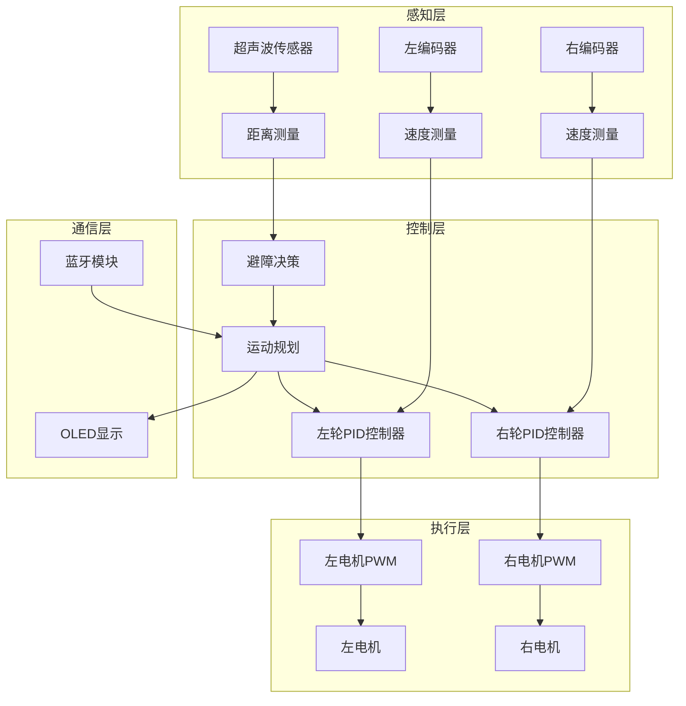
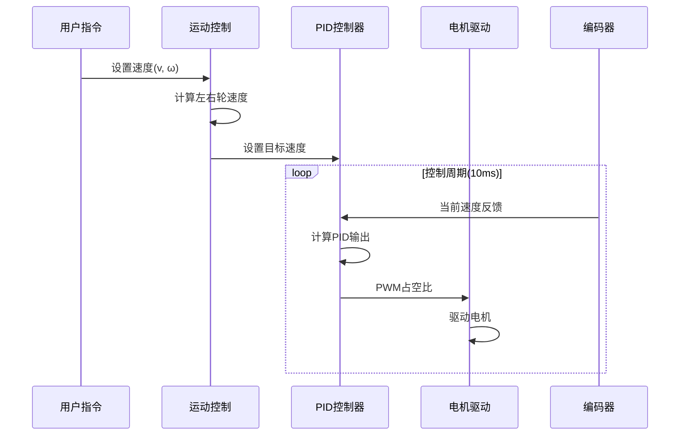

# 智能小车运动控制系统实战项目

## 项目概述


### 项目简介

本项目将带你从零开始构建一个完整的智能小车运动控制系统。通过本项目，你将学习如何整合多个子系统（电机驱动、编码器反馈、传感器检测、控制算法）来实现一个具有自主运动能力的智能小车。

**项目特点**：
- 🚗 **差速驱动**：双电机独立控制，实现灵活转向
- 📊 **闭环控制**：编码器反馈+PID算法，精确速度控制
- 🎯 **路径规划**：实现直线、转弯、圆弧等复杂运动
- 🚧 **智能避障**：超声波传感器检测障碍物，自动规避
- 📡 **无线控制**：蓝牙/WiFi远程控制和参数调试
- 🔧 **模块化设计**：清晰的代码架构，易于扩展

### 学习目标

完成本项目后，你将能够：

- [ ] 理解差速驱动机器人的运动学原理
- [ ] 掌握编码器测速和里程计算方法
- [ ] 实现双电机的PID速度闭环控制
- [ ] 设计和实现基本的路径规划算法
- [ ] 集成超声波传感器实现避障功能
- [ ] 构建完整的嵌入式控制系统架构
- [ ] 调试和优化复杂的多传感器系统

### 适用人群

本项目适合以下学习者：

- ✅ 已完成直流电机控制和PID控制基础教程
- ✅ 熟悉C/C++编程和基本的数据结构
- ✅ 了解基本的控制理论（PID、反馈控制）
- ✅ 有一定的硬件调试经验
- ✅ 希望深入学习机器人控制系统


## 技术栈

### 硬件清单

| 类别 | 名称 | 数量 | 规格说明 | 参考价格 |
|------|------|------|----------|----------|
| **主控** | STM32F103C8T6开发板 | 1 | 或Arduino Mega 2560 | ¥15-50 |
| **电机驱动** | L298N双H桥驱动模块 | 1 | 支持2路电机 | ¥8-15 |
| **电机** | 直流减速电机（带编码器） | 2 | 6V，1:48减速比，AB相编码器 | ¥25-40/个 |
| **传感器** | HC-SR04超声波模块 | 3 | 测距范围2cm-4m | ¥3-5/个 |
| **电源** | 7.4V锂电池 | 1 | 2S 18650，2000mAh以上 | ¥20-40 |
| **电源管理** | DC-DC降压模块 | 1 | 输出5V/3A | ¥3-5 |
| **通信** | HC-05蓝牙模块 | 1 | 或ESP8266 WiFi模块 | ¥10-20 |
| **显示** | OLED显示屏 | 1 | 0.96寸，I2C接口（可选） | ¥8-15 |
| **机械** | 小车底盘套件 | 1 | 含车轮、支架、螺丝 | ¥30-60 |
| **其他** | 杜邦线、面包板 | 若干 | 连接线材 | ¥10 |

**总预算**：约 ¥200-350


### 软件要求

**开发环境**：
- STM32平台：STM32CubeIDE 或 Keil MDK
- Arduino平台：Arduino IDE 2.x
- 串口调试工具：Serial Monitor 或 PuTTY
- 蓝牙调试：Serial Bluetooth Terminal（Android）

**必需库**：
- PID控制库（自实现或使用Arduino PID Library）
- 编码器库（自实现或使用Encoder Library）
- 超声波库（NewPing或自实现）
- OLED显示库（Adafruit_SSD1306，可选）

### 技术选型说明

**为什么选择STM32F103？**
- 72MHz主频，足够的计算能力
- 丰富的定时器资源（编码器接口、PWM输出）
- 多个硬件中断，支持高频编码器
- 成本低，生态成熟

**为什么选择带编码器的减速电机？**
- 编码器提供速度和位置反馈
- 减速器提供足够的扭矩
- AB相编码器可判断方向
- 常见规格，易于采购


## 系统架构

### 整体架构设计




### 模块划分

**1. 电机驱动模块（motor_driver.c/h）**
- 功能：控制电机方向和速度
- 接口：`Motor_SetSpeed(motor_id, speed, direction)`
- 依赖：PWM定时器、GPIO

**2. 编码器模块（encoder.c/h）**
- 功能：读取编码器脉冲，计算速度
- 接口：`Encoder_GetSpeed(encoder_id)`
- 依赖：定时器编码器模式或外部中断

**3. PID控制模块（pid.c/h）**
- 功能：实现PID算法
- 接口：`PID_Compute(pid, setpoint, input)`
- 依赖：无

**4. 运动控制模块（motion_control.c/h）**
- 功能：差速驱动运动学计算
- 接口：`Motion_SetVelocity(linear, angular)`
- 依赖：电机驱动、PID控制

**5. 避障模块（obstacle_avoidance.c/h）**
- 功能：超声波测距和避障决策
- 接口：`Obstacle_Detect()`, `Obstacle_Avoid()`
- 依赖：超声波传感器

**6. 通信模块（communication.c/h）**
- 功能：蓝牙/串口通信
- 接口：`Comm_SendData()`, `Comm_ReceiveCommand()`
- 依赖：UART


### 数据流图



### 接口定义

**运动控制接口**：
```c
// 设置线速度和角速度
void Motion_SetVelocity(float linear_vel, float angular_vel);

// 设置左右轮速度
void Motion_SetWheelSpeed(float left_speed, float right_speed);

// 停止运动
void Motion_Stop(void);

// 获取当前速度
void Motion_GetVelocity(float *linear_vel, float *angular_vel);
```


## 理论基础

### 差速驱动运动学

差速驱动机器人通过控制左右两个轮子的速度来实现运动。

**基本参数**：
- `L`：两轮间距（轮距）
- `R`：车轮半径
- `v_l`：左轮线速度
- `v_r`：右轮线速度
- `v`：小车线速度（前进速度）
- `ω`：小车角速度（转向速度）

**正向运动学**（已知轮速，求小车速度）：
```
v = (v_l + v_r) / 2
ω = (v_r - v_l) / L
```

**逆向运动学**（已知小车速度，求轮速）：
```
v_l = v - (ω * L) / 2
v_r = v + (ω * L) / 2
```

**运动模式**：
1. **直线前进**：`v_l = v_r > 0`
2. **直线后退**：`v_l = v_r < 0`
3. **原地左转**：`v_l = -v_r < 0`
4. **原地右转**：`v_l = -v_r > 0`
5. **弧线运动**：`v_l ≠ v_r`


### 编码器测速原理

**编码器类型**：
- **增量式编码器**：输出脉冲信号，计数脉冲数
- **AB相编码器**：两路相位差90°的信号，可判断方向

**测速方法**：

**方法1：M法（测频法）**
- 固定时间内计数脉冲数
- 速度 = (脉冲数 / 编码器线数) / 时间
- 适用于高速测量

**方法2：T法（测周法）**
- 测量固定脉冲数的时间
- 速度 = 脉冲数 / (时间 * 编码器线数)
- 适用于低速测量

**方法3：M/T法（混合法）**
- 同时测量脉冲数和时间
- 速度 = 脉冲数 / (时间 * 编码器线数)
- 全速度范围适用（推荐）

**速度计算公式**：
```
RPM = (脉冲数 * 60) / (编码器线数 * 减速比 * 时间)
线速度(m/s) = (RPM * 2π * 车轮半径) / 60
```


### PID速度控制

**PID控制器结构**：
```
输出 = Kp * 误差 + Ki * 积分 + Kd * 微分
```

**参数调节方法**：

1. **先调Kp**：
   - 从小到大增加Kp
   - 观察响应速度和超调
   - 出现持续振荡时减小Kp

2. **再调Ki**：
   - 从小到大增加Ki
   - 消除稳态误差
   - 过大会导致振荡

3. **最后调Kd**：
   - 从小到大增加Kd
   - 减小超调和振荡
   - 过大会放大噪声

**推荐初始值**（需根据实际调整）：
- Kp = 2.0
- Ki = 0.5
- Kd = 0.1

**抗积分饱和**：
```c
// 限制积分项
if (integral > integral_max) integral = integral_max;
if (integral < -integral_max) integral = -integral_max;
```


## 硬件连接

### 引脚分配表

**STM32F103C8T6引脚分配**：

| 功能 | 引脚 | 说明 |
|------|------|------|
| **左电机** | | |
| 左电机PWM | PA0 (TIM2_CH1) | PWM输出 |
| 左电机IN1 | PA1 | 方向控制 |
| 左电机IN2 | PA2 | 方向控制 |
| **右电机** | | |
| 右电机PWM | PA3 (TIM2_CH4) | PWM输出 |
| 右电机IN3 | PA4 | 方向控制 |
| 右电机IN4 | PA5 | 方向控制 |
| **左编码器** | | |
| 左编码器A | PB6 (TIM4_CH1) | 编码器A相 |
| 左编码器B | PB7 (TIM4_CH2) | 编码器B相 |
| **右编码器** | | |
| 右编码器A | PA6 (TIM3_CH1) | 编码器A相 |
| 右编码器B | PA7 (TIM3_CH2) | 编码器B相 |
| **超声波** | | |
| 前超声波Trig | PB0 | 触发信号 |
| 前超声波Echo | PB1 | 回波信号 |
| 左超声波Trig | PB10 | 触发信号 |
| 左超声波Echo | PB11 | 回波信号 |
| 右超声波Trig | PB12 | 触发信号 |
| 右超声波Echo | PB13 | 回波信号 |
| **通信** | | |
| 蓝牙TX | PA9 (USART1_TX) | 串口发送 |
| 蓝牙RX | PA10 (USART1_RX) | 串口接收 |
| **显示（可选）** | | |
| OLED SCL | PB8 (I2C1_SCL) | I2C时钟 |
| OLED SDA | PB9 (I2C1_SDA) | I2C数据 |


### 电路连接图

```
STM32F103          L298N           电机+编码器
                                   
PA0(PWM) -------> ENA              
PA1 ----------> IN1                
PA2 ----------> IN2                
                  OUT1 ---------> 左电机+
                  OUT2 ---------> 左电机-
                  
PA3(PWM) -------> ENB              
PA4 ----------> IN3                
PA5 ----------> IN4                
                  OUT3 ---------> 右电机+
                  OUT4 ---------> 右电机-

PB6 <---------- 左编码器A相
PB7 <---------- 左编码器B相
PA6 <---------- 右编码器A相
PA7 <---------- 右编码器B相

GND ----------> GND
                  +12V <--------- 7.4V电池+
                  GND  <--------- 电池-

5V <---------- DC-DC降压模块输出
GND <---------- DC-DC降压模块GND
```

### 电源设计

**电源方案**：
1. **主电源**：7.4V锂电池（2S 18650）
2. **电机电源**：直接使用7.4V
3. **MCU电源**：DC-DC降压到5V
4. **逻辑电平**：STM32内部3.3V

**注意事项**：
- ⚠️ 所有模块必须共地
- ⚠️ 电机电源和MCU电源建议分开
- ⚠️ 在电源输入端添加100μF电解电容
- ⚠️ 在MCU电源输入端添加10μF+0.1μF电容


## 实现步骤

### 阶段1：基础搭建（预计60分钟）

#### 步骤1.1：机械组装

**任务**：组装小车底盘和安装电机

**操作步骤**：
1. 将两个减速电机固定在底盘两侧
2. 安装车轮到电机输出轴
3. 安装万向轮到底盘前部或后部
4. 固定电池仓和电路板安装位置
5. 确保车轮转动顺畅，无卡顿

**检查要点**：
- [ ] 电机安装牢固，不松动
- [ ] 车轮与地面接触良好
- [ ] 万向轮转动灵活
- [ ] 底盘平衡，不倾斜

#### 步骤1.2：硬件连接

**任务**：按照引脚分配表连接所有硬件

**连接顺序**：
1. 先连接电源系统（不上电）
2. 连接电机驱动模块
3. 连接编码器信号线
4. 连接超声波传感器
5. 连接蓝牙模块
6. 最后连接电源

**测试方法**：
```c
// 简单的硬件测试代码
void Hardware_Test(void) {
    // 测试左电机
    Motor_SetSpeed(MOTOR_LEFT, 100, FORWARD);
    HAL_Delay(2000);
    Motor_Stop(MOTOR_LEFT);
    
    // 测试右电机
    Motor_SetSpeed(MOTOR_RIGHT, 100, FORWARD);
    HAL_Delay(2000);
    Motor_Stop(MOTOR_RIGHT);
    
    // 测试编码器
    printf("Left Encoder: %d\n", Encoder_GetCount(ENCODER_LEFT));
    printf("Right Encoder: %d\n", Encoder_GetCount(ENCODER_RIGHT));
}
```


### 阶段2：功能实现（预计100分钟）

#### 步骤2.1：电机驱动模块

**文件**：`motor_driver.c` / `motor_driver.h`

**头文件定义**：
```c
// motor_driver.h
#ifndef MOTOR_DRIVER_H
#define MOTOR_DRIVER_H

#include "stm32f1xx_hal.h"

// 电机ID
typedef enum {
    MOTOR_LEFT = 0,
    MOTOR_RIGHT = 1
} Motor_ID;

// 电机方向
typedef enum {
    MOTOR_FORWARD = 1,
    MOTOR_BACKWARD = -1,
    MOTOR_STOP = 0
} Motor_Direction;

// 初始化电机驱动
void Motor_Init(void);

// 设置电机速度和方向
void Motor_SetSpeed(Motor_ID motor, int16_t speed, Motor_Direction dir);

// 停止电机
void Motor_Stop(Motor_ID motor);

// 停止所有电机
void Motor_StopAll(void);

#endif
```


**实现代码**：
```c
// motor_driver.c
#include "motor_driver.h"

// 外部定时器句柄（在main.c中定义）
extern TIM_HandleTypeDef htim2;

// 电机引脚定义
#define MOTOR_LEFT_IN1_PIN   GPIO_PIN_1
#define MOTOR_LEFT_IN2_PIN   GPIO_PIN_2
#define MOTOR_LEFT_PORT      GPIOA

#define MOTOR_RIGHT_IN3_PIN  GPIO_PIN_4
#define MOTOR_RIGHT_IN4_PIN  GPIO_PIN_5
#define MOTOR_RIGHT_PORT     GPIOA

// PWM最大值
#define PWM_MAX 1000

void Motor_Init(void) {
    // 启动PWM
    HAL_TIM_PWM_Start(&htim2, TIM_CHANNEL_1);  // 左电机
    HAL_TIM_PWM_Start(&htim2, TIM_CHANNEL_4);  // 右电机
    
    // 初始化为停止状态
    Motor_StopAll();
}

void Motor_SetSpeed(Motor_ID motor, int16_t speed, Motor_Direction dir) {
    // 限制速度范围
    if (speed > PWM_MAX) speed = PWM_MAX;
    if (speed < 0) speed = 0;
    
    if (motor == MOTOR_LEFT) {
        // 设置方向
        if (dir == MOTOR_FORWARD) {
            HAL_GPIO_WritePin(MOTOR_LEFT_PORT, MOTOR_LEFT_IN1_PIN, GPIO_PIN_SET);
            HAL_GPIO_WritePin(MOTOR_LEFT_PORT, MOTOR_LEFT_IN2_PIN, GPIO_PIN_RESET);
        } else if (dir == MOTOR_BACKWARD) {
            HAL_GPIO_WritePin(MOTOR_LEFT_PORT, MOTOR_LEFT_IN1_PIN, GPIO_PIN_RESET);
            HAL_GPIO_WritePin(MOTOR_LEFT_PORT, MOTOR_LEFT_IN2_PIN, GPIO_PIN_SET);
        } else {
            HAL_GPIO_WritePin(MOTOR_LEFT_PORT, MOTOR_LEFT_IN1_PIN, GPIO_PIN_RESET);
            HAL_GPIO_WritePin(MOTOR_LEFT_PORT, MOTOR_LEFT_IN2_PIN, GPIO_PIN_RESET);
        }
        // 设置PWM
        __HAL_TIM_SET_COMPARE(&htim2, TIM_CHANNEL_1, speed);
        
    } else if (motor == MOTOR_RIGHT) {
        // 设置方向
        if (dir == MOTOR_FORWARD) {
            HAL_GPIO_WritePin(MOTOR_RIGHT_PORT, MOTOR_RIGHT_IN3_PIN, GPIO_PIN_SET);
            HAL_GPIO_WritePin(MOTOR_RIGHT_PORT, MOTOR_RIGHT_IN4_PIN, GPIO_PIN_RESET);
        } else if (dir == MOTOR_BACKWARD) {
            HAL_GPIO_WritePin(MOTOR_RIGHT_PORT, MOTOR_RIGHT_IN3_PIN, GPIO_PIN_RESET);
            HAL_GPIO_WritePin(MOTOR_RIGHT_PORT, MOTOR_RIGHT_IN4_PIN, GPIO_PIN_SET);
        } else {
            HAL_GPIO_WritePin(MOTOR_RIGHT_PORT, MOTOR_RIGHT_IN3_PIN, GPIO_PIN_RESET);
            HAL_GPIO_WritePin(MOTOR_RIGHT_PORT, MOTOR_RIGHT_IN4_PIN, GPIO_PIN_RESET);
        }
        // 设置PWM
        __HAL_TIM_SET_COMPARE(&htim2, TIM_CHANNEL_4, speed);
    }
}

void Motor_Stop(Motor_ID motor) {
    Motor_SetSpeed(motor, 0, MOTOR_STOP);
}

void Motor_StopAll(void) {
    Motor_Stop(MOTOR_LEFT);
    Motor_Stop(MOTOR_RIGHT);
}
```


#### 步骤2.2：编码器模块

**文件**：`encoder.c` / `encoder.h`

**头文件定义**：
```c
// encoder.h
#ifndef ENCODER_H
#define ENCODER_H

#include "stm32f1xx_hal.h"

// 编码器ID
typedef enum {
    ENCODER_LEFT = 0,
    ENCODER_RIGHT = 1
} Encoder_ID;

// 编码器参数
#define ENCODER_RESOLUTION 11    // 编码器线数（单相）
#define GEAR_RATIO 48            // 减速比
#define WHEEL_DIAMETER 0.065     // 车轮直径(m)
#define WHEEL_PERIMETER (WHEEL_DIAMETER * 3.14159)

// 初始化编码器
void Encoder_Init(void);

// 获取编码器计数值
int32_t Encoder_GetCount(Encoder_ID encoder);

// 清零编码器计数
void Encoder_ResetCount(Encoder_ID encoder);

// 获取速度(m/s)
float Encoder_GetSpeed(Encoder_ID encoder);

// 定时器更新（在定时器中断中调用）
void Encoder_Update(void);

#endif
```


**实现代码**：
```c
// encoder.c
#include "encoder.h"

// 外部定时器句柄
extern TIM_HandleTypeDef htim3;  // 右编码器
extern TIM_HandleTypeDef htim4;  // 左编码器

// 速度计算变量
static int32_t last_count_left = 0;
static int32_t last_count_right = 0;
static float speed_left = 0.0f;
static float speed_right = 0.0f;

// 更新周期(秒)
#define UPDATE_PERIOD 0.01f  // 10ms

void Encoder_Init(void) {
    // 启动编码器模式
    HAL_TIM_Encoder_Start(&htim4, TIM_CHANNEL_ALL);  // 左编码器
    HAL_TIM_Encoder_Start(&htim3, TIM_CHANNEL_ALL);  // 右编码器
    
    // 清零计数器
    __HAL_TIM_SET_COUNTER(&htim4, 0);
    __HAL_TIM_SET_COUNTER(&htim3, 0);
}

int32_t Encoder_GetCount(Encoder_ID encoder) {
    if (encoder == ENCODER_LEFT) {
        return (int32_t)__HAL_TIM_GET_COUNTER(&htim4);
    } else {
        return (int32_t)__HAL_TIM_GET_COUNTER(&htim3);
    }
}

void Encoder_ResetCount(Encoder_ID encoder) {
    if (encoder == ENCODER_LEFT) {
        __HAL_TIM_SET_COUNTER(&htim4, 0);
        last_count_left = 0;
    } else {
        __HAL_TIM_SET_COUNTER(&htim3, 0);
        last_count_right = 0;
    }
}

float Encoder_GetSpeed(Encoder_ID encoder) {
    if (encoder == ENCODER_LEFT) {
        return speed_left;
    } else {
        return speed_right;
    }
}

void Encoder_Update(void) {
    // 获取当前计数
    int32_t current_count_left = Encoder_GetCount(ENCODER_LEFT);
    int32_t current_count_right = Encoder_GetCount(ENCODER_RIGHT);
    
    // 计算脉冲差
    int32_t delta_left = current_count_left - last_count_left;
    int32_t delta_right = current_count_right - last_count_right;
    
    // 计算转数
    float revolutions_left = (float)delta_left / (ENCODER_RESOLUTION * 4 * GEAR_RATIO);
    float revolutions_right = (float)delta_right / (ENCODER_RESOLUTION * 4 * GEAR_RATIO);
    
    // 计算线速度 (m/s)
    speed_left = (revolutions_left * WHEEL_PERIMETER) / UPDATE_PERIOD;
    speed_right = (revolutions_right * WHEEL_PERIMETER) / UPDATE_PERIOD;
    
    // 更新上次计数
    last_count_left = current_count_left;
    last_count_right = current_count_right;
}
```

**注意**：编码器线数和减速比需要根据实际电机参数调整。


#### 步骤2.3：PID控制模块

**文件**：`pid.c` / `pid.h`

**头文件定义**：
```c
// pid.h
#ifndef PID_H
#define PID_H

#include <stdint.h>

// PID控制器结构体
typedef struct {
    float Kp;              // 比例系数
    float Ki;              // 积分系数
    float Kd;              // 微分系数
    
    float setpoint;        // 目标值
    float integral;        // 积分累积
    float prev_error;      // 上次误差
    
    float output_min;      // 输出最小值
    float output_max;      // 输出最大值
    float integral_max;    // 积分限幅
} PID_Controller;

// 初始化PID控制器
void PID_Init(PID_Controller *pid, float kp, float ki, float kd);

// 设置输出限幅
void PID_SetOutputLimits(PID_Controller *pid, float min, float max);

// 设置积分限幅
void PID_SetIntegralLimit(PID_Controller *pid, float limit);

// 设置目标值
void PID_SetSetpoint(PID_Controller *pid, float setpoint);

// 计算PID输出
float PID_Compute(PID_Controller *pid, float input);

// 重置PID控制器
void PID_Reset(PID_Controller *pid);

#endif
```


**实现代码**：
```c
// pid.c
#include "pid.h"

void PID_Init(PID_Controller *pid, float kp, float ki, float kd) {
    pid->Kp = kp;
    pid->Ki = ki;
    pid->Kd = kd;
    
    pid->setpoint = 0.0f;
    pid->integral = 0.0f;
    pid->prev_error = 0.0f;
    
    pid->output_min = -1000.0f;
    pid->output_max = 1000.0f;
    pid->integral_max = 500.0f;
}

void PID_SetOutputLimits(PID_Controller *pid, float min, float max) {
    pid->output_min = min;
    pid->output_max = max;
}

void PID_SetIntegralLimit(PID_Controller *pid, float limit) {
    pid->integral_max = limit;
}

void PID_SetSetpoint(PID_Controller *pid, float setpoint) {
    pid->setpoint = setpoint;
}

float PID_Compute(PID_Controller *pid, float input) {
    // 计算误差
    float error = pid->setpoint - input;
    
    // 积分项
    pid->integral += error;
    
    // 积分限幅（抗积分饱和）
    if (pid->integral > pid->integral_max) {
        pid->integral = pid->integral_max;
    } else if (pid->integral < -pid->integral_max) {
        pid->integral = -pid->integral_max;
    }
    
    // 微分项
    float derivative = error - pid->prev_error;
    
    // PID输出
    float output = pid->Kp * error + 
                   pid->Ki * pid->integral + 
                   pid->Kd * derivative;
    
    // 输出限幅
    if (output > pid->output_max) {
        output = pid->output_max;
    } else if (output < pid->output_min) {
        output = pid->output_min;
    }
    
    // 保存当前误差
    pid->prev_error = error;
    
    return output;
}

void PID_Reset(PID_Controller *pid) {
    pid->integral = 0.0f;
    pid->prev_error = 0.0f;
}
```


#### 步骤2.4：运动控制模块

**文件**：`motion_control.c` / `motion_control.h`

**头文件定义**：
```c
// motion_control.h
#ifndef MOTION_CONTROL_H
#define MOTION_CONTROL_H

#include "pid.h"

// 小车参数
#define WHEEL_BASE 0.15f        // 轮距(m)
#define MAX_LINEAR_SPEED 0.5f   // 最大线速度(m/s)
#define MAX_ANGULAR_SPEED 2.0f  // 最大角速度(rad/s)

// 初始化运动控制
void Motion_Init(void);

// 设置线速度和角速度
void Motion_SetVelocity(float linear_vel, float angular_vel);

// 设置左右轮速度
void Motion_SetWheelSpeed(float left_speed, float right_speed);

// 停止运动
void Motion_Stop(void);

// 获取当前速度
void Motion_GetVelocity(float *linear_vel, float *angular_vel);

// 控制循环更新（在定时器中断中调用）
void Motion_Update(void);

#endif
```


**实现代码**：
```c
// motion_control.c
#include "motion_control.h"
#include "motor_driver.h"
#include "encoder.h"
#include <math.h>

// PID控制器
static PID_Controller pid_left;
static PID_Controller pid_right;

// 目标速度
static float target_speed_left = 0.0f;
static float target_speed_right = 0.0f;

void Motion_Init(void) {
    // 初始化PID控制器（参数需要根据实际调整）
    PID_Init(&pid_left, 200.0f, 50.0f, 10.0f);
    PID_Init(&pid_right, 200.0f, 50.0f, 10.0f);
    
    // 设置输出限幅
    PID_SetOutputLimits(&pid_left, -1000.0f, 1000.0f);
    PID_SetOutputLimits(&pid_right, -1000.0f, 1000.0f);
    
    // 设置积分限幅
    PID_SetIntegralLimit(&pid_left, 300.0f);
    PID_SetIntegralLimit(&pid_right, 300.0f);
}

void Motion_SetVelocity(float linear_vel, float angular_vel) {
    // 限制速度范围
    if (linear_vel > MAX_LINEAR_SPEED) linear_vel = MAX_LINEAR_SPEED;
    if (linear_vel < -MAX_LINEAR_SPEED) linear_vel = -MAX_LINEAR_SPEED;
    if (angular_vel > MAX_ANGULAR_SPEED) angular_vel = MAX_ANGULAR_SPEED;
    if (angular_vel < -MAX_ANGULAR_SPEED) angular_vel = -MAX_ANGULAR_SPEED;
    
    // 逆向运动学：计算左右轮速度
    target_speed_left = linear_vel - (angular_vel * WHEEL_BASE) / 2.0f;
    target_speed_right = linear_vel + (angular_vel * WHEEL_BASE) / 2.0f;
    
    // 设置PID目标值
    PID_SetSetpoint(&pid_left, target_speed_left);
    PID_SetSetpoint(&pid_right, target_speed_right);
}

void Motion_SetWheelSpeed(float left_speed, float right_speed) {
    target_speed_left = left_speed;
    target_speed_right = right_speed;
    
    PID_SetSetpoint(&pid_left, target_speed_left);
    PID_SetSetpoint(&pid_right, target_speed_right);
}

void Motion_Stop(void) {
    target_speed_left = 0.0f;
    target_speed_right = 0.0f;
    
    PID_SetSetpoint(&pid_left, 0.0f);
    PID_SetSetpoint(&pid_right, 0.0f);
    
    Motor_StopAll();
    
    // 重置PID
    PID_Reset(&pid_left);
    PID_Reset(&pid_right);
}

void Motion_GetVelocity(float *linear_vel, float *angular_vel) {
    // 获取当前轮速
    float speed_left = Encoder_GetSpeed(ENCODER_LEFT);
    float speed_right = Encoder_GetSpeed(ENCODER_RIGHT);
    
    // 正向运动学：计算线速度和角速度
    *linear_vel = (speed_left + speed_right) / 2.0f;
    *angular_vel = (speed_right - speed_left) / WHEEL_BASE;
}

void Motion_Update(void) {
    // 获取当前速度
    float current_speed_left = Encoder_GetSpeed(ENCODER_LEFT);
    float current_speed_right = Encoder_GetSpeed(ENCODER_RIGHT);
    
    // PID计算
    float output_left = PID_Compute(&pid_left, current_speed_left);
    float output_right = PID_Compute(&pid_right, current_speed_right);
    
    // 确定方向
    Motor_Direction dir_left = (output_left >= 0) ? MOTOR_FORWARD : MOTOR_BACKWARD;
    Motor_Direction dir_right = (output_right >= 0) ? MOTOR_FORWARD : MOTOR_BACKWARD;
    
    // 设置电机速度
    Motor_SetSpeed(MOTOR_LEFT, (int16_t)fabs(output_left), dir_left);
    Motor_SetSpeed(MOTOR_RIGHT, (int16_t)fabs(output_right), dir_right);
}
```


### 阶段3：测试优化（预计60分钟）

#### 步骤3.1：基础运动测试

**测试代码**：
```c
// 在main.c中的测试函数
void Test_BasicMotion(void) {
    printf("=== Basic Motion Test ===\n");
    
    // 测试1：直线前进
    printf("Test 1: Forward\n");
    Motion_SetVelocity(0.2f, 0.0f);  // 0.2m/s前进
    HAL_Delay(3000);
    Motion_Stop();
    HAL_Delay(1000);
    
    // 测试2：直线后退
    printf("Test 2: Backward\n");
    Motion_SetVelocity(-0.2f, 0.0f);  // 0.2m/s后退
    HAL_Delay(3000);
    Motion_Stop();
    HAL_Delay(1000);
    
    // 测试3：原地左转
    printf("Test 3: Turn Left\n");
    Motion_SetVelocity(0.0f, 1.0f);  // 1.0rad/s左转
    HAL_Delay(2000);
    Motion_Stop();
    HAL_Delay(1000);
    
    // 测试4：原地右转
    printf("Test 4: Turn Right\n");
    Motion_SetVelocity(0.0f, -1.0f);  // 1.0rad/s右转
    HAL_Delay(2000);
    Motion_Stop();
    HAL_Delay(1000);
    
    // 测试5：弧线运动
    printf("Test 5: Arc Motion\n");
    Motion_SetVelocity(0.2f, 0.5f);  // 前进+左转
    HAL_Delay(3000);
    Motion_Stop();
    
    printf("Test Complete!\n");
}
```


#### 步骤3.2：PID参数调优

**调优步骤**：

1. **设置初始参数**：
```c
// 从保守的参数开始
Kp = 100.0f;
Ki = 0.0f;
Kd = 0.0f;
```

2. **调整Kp**：
   - 逐渐增加Kp，观察响应速度
   - 如果出现振荡，减小Kp
   - 目标：快速响应，轻微超调

3. **调整Ki**：
   - 逐渐增加Ki，消除稳态误差
   - 如果出现振荡，减小Ki
   - 目标：无稳态误差

4. **调整Kd**：
   - 逐渐增加Kd，减小超调
   - 如果噪声放大，减小Kd
   - 目标：平滑响应

**调试工具**：
```c
// PID调试输出
void PID_Debug_Print(void) {
    float speed_left = Encoder_GetSpeed(ENCODER_LEFT);
    float speed_right = Encoder_GetSpeed(ENCODER_RIGHT);
    
    printf("Target: L=%.3f R=%.3f | ", 
           target_speed_left, target_speed_right);
    printf("Current: L=%.3f R=%.3f | ", 
           speed_left, speed_right);
    printf("Error: L=%.3f R=%.3f\n", 
           target_speed_left - speed_left,
           target_speed_right - speed_right);
}
```

**推荐参数范围**（需根据实际调整）：
- Kp: 100 - 300
- Ki: 20 - 100
- Kd: 5 - 20


#### 步骤3.3：超声波避障实现

**文件**：`obstacle_avoidance.c` / `obstacle_avoidance.h`

**简化实现**：
```c
// obstacle_avoidance.h
#ifndef OBSTACLE_AVOIDANCE_H
#define OBSTACLE_AVOIDANCE_H

#include <stdint.h>
#include <stdbool.h>

// 安全距离阈值(cm)
#define SAFE_DISTANCE 30
#define DANGER_DISTANCE 15

// 初始化避障模块
void Obstacle_Init(void);

// 测量距离(cm)
uint16_t Obstacle_MeasureDistance(uint8_t sensor_id);

// 检测障碍物
bool Obstacle_Detect(void);

// 避障决策
void Obstacle_Avoid(void);

#endif
```

```c
// obstacle_avoidance.c
#include "obstacle_avoidance.h"
#include "motion_control.h"
#include "stm32f1xx_hal.h"

// 超声波引脚定义
#define TRIG_PIN GPIO_PIN_0
#define ECHO_PIN GPIO_PIN_1
#define TRIG_PORT GPIOB
#define ECHO_PORT GPIOB

void Obstacle_Init(void) {
    // GPIO已在CubeMX中配置
}

uint16_t Obstacle_MeasureDistance(uint8_t sensor_id) {
    uint32_t time_start, time_end, time_diff;
    
    // 发送触发信号
    HAL_GPIO_WritePin(TRIG_PORT, TRIG_PIN, GPIO_PIN_SET);
    HAL_Delay(0);  // 10us延时（使用微秒延时更精确）
    HAL_GPIO_WritePin(TRIG_PORT, TRIG_PIN, GPIO_PIN_RESET);
    
    // 等待回波信号
    time_start = HAL_GetTick();
    while (HAL_GPIO_ReadPin(ECHO_PORT, ECHO_PIN) == GPIO_PIN_RESET) {
        if (HAL_GetTick() - time_start > 50) return 400;  // 超时
    }
    
    time_start = HAL_GetTick();
    while (HAL_GPIO_ReadPin(ECHO_PORT, ECHO_PIN) == GPIO_PIN_SET) {
        if (HAL_GetTick() - time_start > 50) return 400;  // 超时
    }
    time_end = HAL_GetTick();
    
    // 计算距离 (cm)
    time_diff = time_end - time_start;
    uint16_t distance = (time_diff * 34) / 2;  // 声速340m/s
    
    return distance;
}

bool Obstacle_Detect(void) {
    uint16_t distance = Obstacle_MeasureDistance(0);
    return (distance < SAFE_DISTANCE);
}

void Obstacle_Avoid(void) {
    uint16_t distance = Obstacle_MeasureDistance(0);
    
    if (distance < DANGER_DISTANCE) {
        // 紧急停止
        Motion_Stop();
        HAL_Delay(500);
        
        // 后退
        Motion_SetVelocity(-0.15f, 0.0f);
        HAL_Delay(1000);
        
        // 转向
        Motion_SetVelocity(0.0f, 1.0f);
        HAL_Delay(1000);
        
    } else if (distance < SAFE_DISTANCE) {
        // 减速前进
        Motion_SetVelocity(0.1f, 0.0f);
    } else {
        // 正常前进
        Motion_SetVelocity(0.2f, 0.0f);
    }
}
```


#### 步骤3.4：主程序集成

**完整的main.c示例**：
```c
// main.c
#include "main.h"
#include "motor_driver.h"
#include "encoder.h"
#include "motion_control.h"
#include "obstacle_avoidance.h"
#include <stdio.h>

// 定时器句柄
TIM_HandleTypeDef htim2;  // PWM
TIM_HandleTypeDef htim3;  // 右编码器
TIM_HandleTypeDef htim4;  // 左编码器
TIM_HandleTypeDef htim6;  // 控制周期定时器

// 系统初始化
void SystemClock_Config(void);
static void MX_GPIO_Init(void);
static void MX_TIM2_Init(void);
static void MX_TIM3_Init(void);
static void MX_TIM4_Init(void);
static void MX_TIM6_Init(void);
static void MX_USART1_UART_Init(void);

int main(void) {
    // HAL库初始化
    HAL_Init();
    SystemClock_Config();
    
    // 外设初始化
    MX_GPIO_Init();
    MX_TIM2_Init();
    MX_TIM3_Init();
    MX_TIM4_Init();
    MX_TIM6_Init();
    MX_USART1_UART_Init();
    
    // 模块初始化
    Motor_Init();
    Encoder_Init();
    Motion_Init();
    Obstacle_Init();
    
    printf("Smart Car Control System Started!\n");
    
    // 启动控制周期定时器（10ms中断）
    HAL_TIM_Base_Start_IT(&htim6);
    
    // 主循环
    while (1) {
        // 避障逻辑
        if (Obstacle_Detect()) {
            Obstacle_Avoid();
        }
        
        HAL_Delay(100);
    }
}

// 定时器中断回调（10ms）
void HAL_TIM_PeriodElapsedCallback(TIM_HandleTypeDef *htim) {
    if (htim->Instance == TIM6) {
        // 更新编码器速度
        Encoder_Update();
        
        // 更新运动控制
        Motion_Update();
    }
}

// printf重定向到UART
int fputc(int ch, FILE *f) {
    HAL_UART_Transmit(&huart1, (uint8_t *)&ch, 1, 0xFFFF);
    return ch;
}
```


## 完整代码

### 项目文件结构

```
SmartCar/
├── Core/
│   ├── Inc/
│   │   ├── main.h
│   │   ├── motor_driver.h
│   │   ├── encoder.h
│   │   ├── pid.h
│   │   ├── motion_control.h
│   │   └── obstacle_avoidance.h
│   └── Src/
│       ├── main.c
│       ├── motor_driver.c
│       ├── encoder.c
│       ├── pid.c
│       ├── motion_control.c
│       └── obstacle_avoidance.c
├── Drivers/
│   └── STM32F1xx_HAL_Driver/
└── README.md
```

### STM32CubeMX配置要点

**1. 时钟配置**：
- 系统时钟：72MHz
- APB1时钟：36MHz
- APB2时钟：72MHz

**2. TIM2配置（PWM）**：
- 模式：PWM Generation CH1, CH4
- 预分频器：71（1MHz计数频率）
- 自动重装载值：999（1kHz PWM频率）
- 占空比：0-1000

**3. TIM3/TIM4配置（编码器）**：
- 模式：Encoder Mode
- 编码器模式：TI1 and TI2
- 极性：Rising Edge
- 自动重装载值：65535

**4. TIM6配置（控制周期）**：
- 模式：Internal Clock
- 预分频器：7199（10kHz计数频率）
- 自动重装载值：99（10ms中断周期）
- 中断：Update interrupt enabled

**5. GPIO配置**：
- 电机方向控制：Output Push Pull
- 超声波Trig：Output Push Pull
- 超声波Echo：Input

**6. USART1配置**：
- 波特率：115200
- 数据位：8
- 停止位：1
- 校验：None


## 测试验证

### 测试清单

#### 硬件测试
- [ ] 电源系统正常，电压稳定
- [ ] 电机单独测试正常（正转、反转、停止）
- [ ] 编码器计数正常，方向正确
- [ ] 超声波测距准确（误差<5cm）
- [ ] 蓝牙通信正常

#### 功能测试
- [ ] 直线前进，轨迹直线度良好
- [ ] 直线后退，轨迹直线度良好
- [ ] 原地左转90度，角度误差<10度
- [ ] 原地右转90度，角度误差<10度
- [ ] 弧线运动，轨迹平滑

#### 性能测试
- [ ] 速度控制精度：误差<5%
- [ ] 速度响应时间：<1秒
- [ ] 避障反应时间：<0.5秒
- [ ] 连续运行时间：>30分钟

### 性能指标

| 指标 | 目标值 | 实测值 | 备注 |
|------|--------|--------|------|
| 最大速度 | 0.5 m/s | ___ | 平地测试 |
| 速度精度 | ±5% | ___ | 稳态误差 |
| 转向精度 | ±10° | ___ | 90度转弯 |
| 避障距离 | 30 cm | ___ | 前方障碍物 |
| 反应时间 | <0.5s | ___ | 检测到停止 |
| 电池续航 | >30min | ___ | 连续运行 |


### 调试技巧

**问题1：小车不走直线**
- 检查两个电机是否一致
- 检查轮子直径是否相同
- 调整PID参数，使左右轮速度一致
- 检查编码器计数是否准确

**问题2：速度控制不稳定**
- 检查编码器连接是否牢固
- 检查PID参数是否合理
- 检查控制周期是否稳定（10ms）
- 增加积分限幅，防止积分饱和

**问题3：避障不灵敏**
- 检查超声波传感器安装位置
- 检查测距是否准确
- 调整安全距离阈值
- 增加多个传感器提高覆盖范围

**问题4：电机抖动**
- 检查PWM频率是否合适
- 检查电源是否稳定
- 检查PID参数，减小Kd
- 增加低通滤波

**问题5：编码器计数异常**
- 检查编码器供电（通常5V）
- 检查信号线是否接触良好
- 检查定时器配置是否正确
- 使用示波器查看编码器信号


## 扩展思路

### 扩展1：路径规划 ⭐⭐

**功能**：实现预定义路径的自动行驶

**实现思路**：
```c
// 路径点结构
typedef struct {
    float x;
    float y;
    float theta;
} Waypoint;

// 路径规划
Waypoint path[] = {
    {0.0f, 0.0f, 0.0f},
    {1.0f, 0.0f, 0.0f},
    {1.0f, 1.0f, 1.57f},
    {0.0f, 1.0f, 3.14f},
    {0.0f, 0.0f, 0.0f}
};

void Path_Follow(Waypoint *path, int num_points) {
    for (int i = 0; i < num_points; i++) {
        // 计算到目标点的距离和角度
        // 使用PID控制跟踪路径
        // 到达目标点后进入下一个点
    }
}
```

### 扩展2：SLAM建图 ⭐⭐⭐⭐

**功能**：使用激光雷达或摄像头进行环境建图

**所需硬件**：
- 激光雷达（如RPLIDAR A1）
- 或深度摄像头（如Intel RealSense）

**技术要点**：
- 传感器数据采集
- 里程计融合
- 地图构建算法
- 定位算法

### 扩展3：视觉识别 ⭐⭐⭐⭐

**功能**：识别特定物体或标记

**所需硬件**：
- 摄像头模块（如OV7670或树莓派摄像头）
- 更强大的处理器（如树莓派或Jetson Nano）

**技术要点**：
- 图像采集
- 颜色识别
- 形状识别
- 深度学习模型部署


### 扩展4：多传感器融合 ⭐⭐⭐

**功能**：融合多种传感器数据提高定位精度

**传感器组合**：
- 编码器（里程计）
- IMU（加速度计+陀螺仪）
- 超声波/激光雷达
- GPS（室外）

**融合算法**：
- 卡尔曼滤波
- 扩展卡尔曼滤波（EKF）
- 粒子滤波

**实现示例**：
```c
// 简化的传感器融合
typedef struct {
    float x;
    float y;
    float theta;
    float v;
    float omega;
} RobotState;

void Sensor_Fusion_Update(RobotState *state) {
    // 1. 预测步骤（使用运动模型）
    float dt = 0.01f;  // 10ms
    state->x += state->v * cos(state->theta) * dt;
    state->y += state->v * sin(state->theta) * dt;
    state->theta += state->omega * dt;
    
    // 2. 更新步骤（使用传感器测量）
    float measured_v = (Encoder_GetSpeed(ENCODER_LEFT) + 
                        Encoder_GetSpeed(ENCODER_RIGHT)) / 2.0f;
    float measured_omega = (Encoder_GetSpeed(ENCODER_RIGHT) - 
                            Encoder_GetSpeed(ENCODER_LEFT)) / WHEEL_BASE;
    
    // 简单的加权融合
    state->v = 0.7f * state->v + 0.3f * measured_v;
    state->omega = 0.7f * state->omega + 0.3f * measured_omega;
}
```

### 扩展5：远程监控 ⭐⭐

**功能**：通过WiFi实时查看小车状态

**所需硬件**：
- ESP8266或ESP32 WiFi模块

**功能特性**：
- 实时视频传输
- 状态数据上传（速度、位置、电量）
- 远程控制指令
- 轨迹记录和回放

**Web界面示例**：
```html
<!DOCTYPE html>
<html>
<head>
    <title>Smart Car Monitor</title>
</head>
<body>
    <h1>Smart Car Control Panel</h1>
    <div id="status">
        <p>Speed: <span id="speed">0.00</span> m/s</p>
        <p>Position: (<span id="x">0.00</span>, <span id="y">0.00</span>)</p>
        <p>Battery: <span id="battery">100</span>%</p>
    </div>
    <div id="control">
        <button onclick="sendCommand('forward')">Forward</button>
        <button onclick="sendCommand('backward')">Backward</button>
        <button onclick="sendCommand('left')">Left</button>
        <button onclick="sendCommand('right')">Right</button>
        <button onclick="sendCommand('stop')">Stop</button>
    </div>
</body>
</html>
```


## 项目总结

### 技术难点

1. **PID参数调优**
   - 难点：不同负载和速度下参数不同
   - 解决：分段PID或自适应PID

2. **编码器噪声**
   - 难点：低速时编码器信号不稳定
   - 解决：低通滤波或M/T法测速

3. **直线度控制**
   - 难点：两个电机特性不完全一致
   - 解决：独立PID控制+校准

4. **实时性保证**
   - 难点：多任务调度和中断优先级
   - 解决：使用RTOS或合理的中断设计

### 学习收获

通过本项目，你应该掌握了：

- ✅ 差速驱动机器人的运动学原理
- ✅ 编码器测速和里程计算方法
- ✅ PID控制器的设计和调优
- ✅ 多模块系统的架构设计
- ✅ 传感器数据处理和融合
- ✅ 嵌入式系统的调试技巧

### 关键经验

1. **模块化设计**：清晰的模块划分便于开发和调试
2. **增量开发**：从简单到复杂，逐步验证
3. **参数调优**：PID参数需要耐心调试
4. **硬件质量**：好的硬件是成功的一半
5. **文档记录**：记录调试过程和参数


## 常见应用场景

### 1. 教育机器人
- 编程教学
- 算法验证
- 竞赛平台
- STEM教育

### 2. 服务机器人
- 室内配送
- 巡检机器人
- 导览机器人
- 清洁机器人

### 3. 研究平台
- 算法研究
- 传感器测试
- 控制理论验证
- 多机器人协作

### 4. 竞赛项目
- 智能车竞赛
- 机器人足球
- 迷宫寻路
- 物流搬运

## 下一步学习

### 推荐学习路径

**基础巩固**：
- [无刷电机控制](../intermediate/02-bldc-motor-control.html) - 学习更高效的电机控制
- [步进电机控制](../beginner/02-stepper-motor-control.html) - 学习精确位置控制

**进阶学习**：
- [传感器数据融合](../../04-sensor-technology/intermediate/02-sensor-fusion.html) - 多传感器融合技术
- RTOS应用 - 实时操作系统

**高级主题**：
- SLAM算法 - 同步定位与建图
- 路径规划 - 智能路径规划算法


## 参考资料

### 技术文档
1. [STM32F103 Reference Manual](https://www.st.com/resource/en/reference_manual/cd00171190.pdf) - ST官方参考手册
2. [L298N Datasheet](https://www.st.com/resource/en/datasheet/l298.pdf) - 电机驱动芯片数据手册
3. [PID Control Theory](https://en.wikipedia.org/wiki/PID_controller) - PID控制理论

### 开源项目
1. [ROS Navigation Stack](https://github.com/ros-planning/navigation) - ROS导航功能包
2. [Arduino Robot Library](https://github.com/arduino-libraries/Robot_Control) - Arduino机器人库
3. [MicroROS](https://micro.ros.org/) - 嵌入式ROS

### 学习资源
1. "Mobile Robotics" - 移动机器人学教材
2. "Modern Robotics" - 现代机器人学
3. "Probabilistic Robotics" - 概率机器人学

### 视频教程
1. "Differential Drive Robot Kinematics" - YouTube教程
2. "PID Control Explained" - PID控制详解
3. "Encoder Speed Measurement" - 编码器测速教程

## 附录

### A. 常用公式

**差速驱动运动学**：
```
v = (v_l + v_r) / 2
ω = (v_r - v_l) / L
v_l = v - (ω * L) / 2
v_r = v + (ω * L) / 2
```

**编码器测速**：
```
RPM = (脉冲数 * 60) / (编码器线数 * 4 * 减速比 * 时间)
线速度 = (RPM * π * 轮径) / 60
```

**PID控制**：
```
输出 = Kp * e(t) + Ki * ∫e(t)dt + Kd * de(t)/dt
```

### B. 硬件选型建议

**电机选择**：
- 小型车（<1kg）：130/180电机
- 中型车（1-3kg）：280/380电机
- 大型车（>3kg）：775电机或无刷电机

**编码器选择**：
- 低精度：11线AB相编码器
- 中精度：20线AB相编码器
- 高精度：100线以上编码器

**电池选择**：
- 7.4V 2S锂电池（推荐）
- 11.1V 3S锂电池（大功率）
- 容量：2000mAh以上

### C. 调试检查清单

**硬件检查**：
- [ ] 电源电压正常
- [ ] 所有模块共地
- [ ] 电机转向正确
- [ ] 编码器计数正常
- [ ] 传感器工作正常

**软件检查**：
- [ ] 定时器配置正确
- [ ] 中断优先级合理
- [ ] PID参数已调优
- [ ] 速度单位统一
- [ ] 无死循环和阻塞

**性能检查**：
- [ ] 速度控制精度达标
- [ ] 直线度良好
- [ ] 转向精度达标
- [ ] 避障灵敏
- [ ] 续航时间满足要求

---

**项目完成标志**：
- ✅ 硬件组装完成，连接正确
- ✅ 基础运动功能正常（前进、后退、转向）
- ✅ PID速度控制稳定
- ✅ 避障功能可靠
- ✅ 代码结构清晰，注释完整

**恭喜你完成了智能小车运动控制系统项目！**

这是一个综合性很强的项目，涉及硬件、软件、控制算法等多个方面。通过这个项目，你已经具备了开发更复杂机器人系统的基础。继续探索，将你的小车打造得更加智能！

---

**反馈与支持**：
- 遇到问题？查看故障排除章节或在评论区提问
- 有改进建议？欢迎分享你的优化方案
- 完成项目？分享你的成果照片和视频

**版权声明**：本项目教程采用 CC BY-SA 4.0 协议，欢迎分享和改编，但请注明出处。

---

## 深入原理：差速驱动运动学与转弯半径

### 差速驱动完整运动学模型

差速驱动（Differential Drive）是移动机器人最常见的底盘结构，通过独立控制左右两轮速度实现全方向运动（除横向平移外）。

#### 坐标系定义

```
         前方 (x轴正方向)
           ↑
           |
  左轮 ←--+--→ 右轮
           |
           ↓
       (机器人坐标系)

世界坐标系 (World Frame):
  Y
  ↑
  |
  +----→ X
  
机器人位姿: (x, y, θ)
  x: 世界坐标系X位置
  y: 世界坐标系Y位置
  θ: 机器人朝向角（相对X轴，逆时针为正）
```

#### 运动学方程推导

**基本参数**：
- `L`：轮距（两轮中心距离，单位 m）
- `R`：车轮半径（单位 m）
- `v_L`：左轮线速度（m/s）
- `v_R`：右轮线速度（m/s）
- `ω_L`：左轮角速度（rad/s），`v_L = ω_L × R`
- `ω_R`：右轮角速度（rad/s），`v_R = ω_R × R`

**正向运动学（Forward Kinematics）**：

机器人质心线速度 v 和角速度 ω：
```
v = (v_R + v_L) / 2          // 两轮平均速度
ω = (v_R - v_L) / L          // 速度差除以轮距
```

**逆向运动学（Inverse Kinematics）**：

已知期望的 v 和 ω，求各轮速度：
```
v_L = v - (ω × L) / 2
v_R = v + (ω × L) / 2
```

#### 转弯半径计算

当 `v_L ≠ v_R` 时，机器人沿圆弧运动，转弯半径 R_turn：

```
R_turn = L/2 × (v_R + v_L) / (v_R - v_L)
```

**特殊情况分析**：

| 运动模式 | 条件 | 转弯半径 |
|----------|------|----------|
| 直线前进 | v_L = v_R > 0 | ∞（无穷大） |
| 直线后退 | v_L = v_R < 0 | ∞（无穷大） |
| 原地左转 | v_L = -v_R < 0 | 0（原地旋转） |
| 原地右转 | v_L = -v_R > 0 | 0（原地旋转） |
| 左弧线 | v_R > v_L > 0 | R_turn > 0 |
| 右弧线 | v_L > v_R > 0 | R_turn < 0 |
| 左轮停止 | v_L = 0, v_R > 0 | L/2（绕左轮） |
| 右轮停止 | v_R = 0, v_L > 0 | L/2（绕右轮） |

**转弯半径与角速度关系**：
```
R_turn = v / ω    （当 ω ≠ 0 时）
```

**圆弧运动时间计算**：
```c
// 转过角度 angle_rad 所需时间
float Arc_TurnTime(float angle_rad, float angular_vel) {
    return fabs(angle_rad / angular_vel);
}

// 走过弧长 arc_length 所需时间
float Arc_TravelTime(float arc_length, float linear_vel) {
    return fabs(arc_length / linear_vel);
}

// 示例：以 v=0.2m/s, ω=0.5rad/s 转90度
// 时间 = (π/2) / 0.5 = 3.14s
// 弧长 = 0.2 × 3.14 = 0.628m
// 转弯半径 = 0.2 / 0.5 = 0.4m
```

#### 运动学仿真代码

```c
// kinematics.h - 差速驱动运动学
#ifndef KINEMATICS_H
#define KINEMATICS_H

#include <math.h>

// 机器人物理参数
#define WHEEL_BASE_M    0.15f   // 轮距 (m)
#define WHEEL_RADIUS_M  0.0325f // 车轮半径 (m)

// 机器人位姿
typedef struct {
    float x;       // 世界坐标X (m)
    float y;       // 世界坐标Y (m)
    float theta;   // 朝向角 (rad)，逆时针为正
} RobotPose;

// 机器人速度
typedef struct {
    float v;       // 线速度 (m/s)
    float omega;   // 角速度 (rad/s)
} RobotVelocity;

// 正向运动学：轮速 → 机器人速度
RobotVelocity Kinematics_Forward(float v_left, float v_right);

// 逆向运动学：机器人速度 → 轮速
void Kinematics_Inverse(RobotVelocity vel, float *v_left, float *v_right);

// 位姿更新（积分）
void Kinematics_UpdatePose(RobotPose *pose, RobotVelocity vel, float dt);

// 计算转弯半径
float Kinematics_TurnRadius(float v_left, float v_right);

#endif

// kinematics.c
#include "kinematics.h"

RobotVelocity Kinematics_Forward(float v_left, float v_right) {
    RobotVelocity vel;
    vel.v     = (v_right + v_left) / 2.0f;
    vel.omega = (v_right - v_left) / WHEEL_BASE_M;
    return vel;
}

void Kinematics_Inverse(RobotVelocity vel, float *v_left, float *v_right) {
    *v_left  = vel.v - (vel.omega * WHEEL_BASE_M) / 2.0f;
    *v_right = vel.v + (vel.omega * WHEEL_BASE_M) / 2.0f;
}

void Kinematics_UpdatePose(RobotPose *pose, RobotVelocity vel, float dt) {
    // 使用中点积分（Runge-Kutta 2阶）提高精度
    float theta_mid = pose->theta + vel.omega * dt / 2.0f;
    pose->x     += vel.v * cosf(theta_mid) * dt;
    pose->y     += vel.v * sinf(theta_mid) * dt;
    pose->theta += vel.omega * dt;
    
    // 角度归一化到 [-π, π]
    while (pose->theta >  M_PI) pose->theta -= 2.0f * M_PI;
    while (pose->theta < -M_PI) pose->theta += 2.0f * M_PI;
}

float Kinematics_TurnRadius(float v_left, float v_right) {
    float diff = v_right - v_left;
    if (fabsf(diff) < 1e-6f) return 1e9f;  // 近似无穷大
    return (WHEEL_BASE_M / 2.0f) * (v_right + v_left) / diff;
}
```

### 巡线传感器阵列（IR 反射传感器）

#### 传感器原理

红外反射传感器（IR Reflectance Sensor）利用红外光在不同颜色表面的反射率差异来检测黑线：

```
        IR LED          光电晶体管
          ↓                ↑
    ┌─────────────────────────┐
    │  ~~~~ 红外光 ~~~~       │
    │                         │
    └─────────────────────────┘
         白色地面（高反射）→ 输出低电压
         黑色线条（低反射）→ 输出高电压
```

**常用传感器型号**：
- TCRT5000：模拟输出，灵敏度可调
- QTR-8A/8RC：Pololu 8路传感器阵列
- 自制阵列：5路或8路 TCRT5000

#### 5路传感器阵列布局

```
传感器编号:  S0   S1   S2   S3   S4
位置:       最左  左   中   右  最右
            ↓    ↓    ↓    ↓    ↓
         ┌────────────────────────┐
         │  ○    ○    ○    ○    ○ │  ← 传感器阵列
         └────────────────────────┘
                    ↓
              ═══════════          ← 黑色引导线（宽约15-20mm）
```

**传感器间距**：相邻传感器间距约 12-15mm，总宽度约 60mm，略宽于引导线。

#### ADC 采样与归一化

```c
// line_sensor.h
#ifndef LINE_SENSOR_H
#define LINE_SENSOR_H

#include "stm32f1xx_hal.h"
#include <stdint.h>
#include <stdbool.h>

#define LINE_SENSOR_COUNT  5       // 传感器数量
#define LINE_THRESHOLD     2048    // 黑白判断阈值（12位ADC，0-4095）
#define LINE_SENSOR_WEIGHT_MAX  2  // 最大权重（传感器索引偏移量）

// 传感器读数结构
typedef struct {
    uint16_t raw[LINE_SENSOR_COUNT];    // 原始ADC值
    bool     on_line[LINE_SENSOR_COUNT]; // 是否在线上
    float    position;                   // 线位置 [-1.0, +1.0]，0为中心
    bool     line_detected;              // 是否检测到线
} LineSensor_Data;

// 初始化
void LineSensor_Init(void);

// 校准（在白色和黑色表面上分别调用）
void LineSensor_Calibrate(void);

// 读取传感器数据
void LineSensor_Read(LineSensor_Data *data);

// 获取线位置 [-1.0, +1.0]
float LineSensor_GetPosition(void);

#endif

// line_sensor.c
#include "line_sensor.h"
#include <string.h>

extern ADC_HandleTypeDef hadc1;

// 校准值
static uint16_t cal_min[LINE_SENSOR_COUNT];  // 白色表面最小值
static uint16_t cal_max[LINE_SENSOR_COUNT];  // 黑色表面最大值

// 传感器权重（用于计算加权位置）
// 传感器0在最左，权重最负；传感器4在最右，权重最正
static const float sensor_weights[LINE_SENSOR_COUNT] = {-2.0f, -1.0f, 0.0f, 1.0f, 2.0f};

void LineSensor_Init(void) {
    // 初始化校准值为默认
    for (int i = 0; i < LINE_SENSOR_COUNT; i++) {
        cal_min[i] = 0;
        cal_max[i] = 4095;
    }
}

void LineSensor_Calibrate(void) {
    uint16_t samples[LINE_SENSOR_COUNT][10];
    
    // 采集10次样本
    for (int s = 0; s < 10; s++) {
        for (int i = 0; i < LINE_SENSOR_COUNT; i++) {
            // 选择ADC通道并采样（实际需配置ADC多通道扫描）
            HAL_ADC_Start(&hadc1);
            HAL_ADC_PollForConversion(&hadc1, 10);
            samples[i][s] = HAL_ADC_GetValue(&hadc1);
        }
        HAL_Delay(10);
    }
    
    // 计算最小/最大值
    for (int i = 0; i < LINE_SENSOR_COUNT; i++) {
        cal_min[i] = samples[i][0];
        cal_max[i] = samples[i][0];
        for (int s = 1; s < 10; s++) {
            if (samples[i][s] < cal_min[i]) cal_min[i] = samples[i][s];
            if (samples[i][s] > cal_max[i]) cal_max[i] = samples[i][s];
        }
    }
}

void LineSensor_Read(LineSensor_Data *data) {
    // 读取所有传感器ADC值
    for (int i = 0; i < LINE_SENSOR_COUNT; i++) {
        HAL_ADC_Start(&hadc1);
        HAL_ADC_PollForConversion(&hadc1, 10);
        data->raw[i] = HAL_ADC_GetValue(&hadc1);
        
        // 归一化到 [0, 1000]
        uint16_t range = cal_max[i] - cal_min[i];
        if (range == 0) range = 1;
        uint16_t normalized = (uint16_t)(((int32_t)(data->raw[i] - cal_min[i]) * 1000) / range);
        if (normalized > 1000) normalized = 1000;
        
        // 判断是否在线上（归一化值 > 500 表示黑线）
        data->on_line[i] = (normalized > 500);
    }
    
    // 计算加权位置
    float weighted_sum = 0.0f;
    float total_weight = 0.0f;
    data->line_detected = false;
    
    for (int i = 0; i < LINE_SENSOR_COUNT; i++) {
        if (data->on_line[i]) {
            weighted_sum += sensor_weights[i];
            total_weight += 1.0f;
            data->line_detected = true;
        }
    }
    
    if (data->line_detected && total_weight > 0.0f) {
        // 位置范围 [-2.0, +2.0]，归一化到 [-1.0, +1.0]
        data->position = (weighted_sum / total_weight) / 2.0f;
    } else {
        data->position = 0.0f;  // 未检测到线时保持上次位置
    }
}

float LineSensor_GetPosition(void) {
    LineSensor_Data data;
    LineSensor_Read(&data);
    return data.position;
}
```

#### 传感器安装要点

```
安装高度：距地面 3-8mm（过高灵敏度下降，过低易碰地）
安装位置：车头前方，位于驱动轮前约 5-10cm
倾斜角度：垂直向下，或略向前倾 5-10°

          ┌──────────────────┐
          │    STM32 主控    │
          └────────┬─────────┘
                   │
          ┌────────┴─────────┐
          │   传感器阵列      │  ← 安装在车头底部
          └──────────────────┘
                   ↓ 3-8mm
          ══════════════════════  ← 地面/引导线
```


---

## 核心算法扩展：PID 巡线、超声波避障与蓝牙控制

### PID 巡线算法（横向偏差控制）

#### 横向偏差（Cross-Track Error）定义

横向偏差（CTE，Cross-Track Error）是机器人当前位置与期望路径之间的垂直距离。对于巡线任务，CTE 直接由传感器阵列的位置读数给出：

```
期望路径（黑线中心）
        ↓
════════╪════════════════  ← 黑线
        │
        │← CTE（横向偏差）
        │
       [车]  ← 机器人当前位置（偏右）
```

**CTE 与传感器位置的关系**：
- 传感器位置 = 0.0：机器人在线中心，CTE = 0
- 传感器位置 = +1.0：机器人偏右，需要左转（负角速度）
- 传感器位置 = -1.0：机器人偏左，需要右转（正角速度）

#### PID 巡线控制器实现

```c
// line_follower.h
#ifndef LINE_FOLLOWER_H
#define LINE_FOLLOWER_H

#include "pid.h"
#include "line_sensor.h"
#include "motion_control.h"

// 巡线参数
typedef struct {
    float base_speed;       // 基础前进速度 (m/s)
    float max_turn_speed;   // 最大转向角速度 (rad/s)
    PID_Controller pid;     // PID控制器（输入CTE，输出角速度）
} LineFollower_Config;

// 初始化巡线控制器
void LineFollower_Init(LineFollower_Config *cfg,
                       float base_speed,
                       float kp, float ki, float kd);

// 执行一次巡线控制（在控制周期中调用）
void LineFollower_Update(LineFollower_Config *cfg);

// 停止巡线
void LineFollower_Stop(LineFollower_Config *cfg);

#endif

// line_follower.c
#include "line_follower.h"
#include <math.h>

void LineFollower_Init(LineFollower_Config *cfg,
                       float base_speed,
                       float kp, float ki, float kd) {
    cfg->base_speed = base_speed;
    cfg->max_turn_speed = 2.0f;  // 最大 2 rad/s 转向
    
    PID_Init(&cfg->pid, kp, ki, kd);
    PID_SetOutputLimits(&cfg->pid, -cfg->max_turn_speed, cfg->max_turn_speed);
    PID_SetIntegralLimit(&cfg->pid, 1.0f);
    PID_SetSetpoint(&cfg->pid, 0.0f);  // 目标：CTE = 0
}

void LineFollower_Update(LineFollower_Config *cfg) {
    LineSensor_Data sensor_data;
    LineSensor_Read(&sensor_data);
    
    if (!sensor_data.line_detected) {
        // 丢线处理：停止或执行搜索策略
        Motion_Stop();
        return;
    }
    
    // CTE = 传感器位置（正值表示偏右，需要左转）
    float cte = sensor_data.position;
    
    // PID 计算转向角速度
    // 注意：偏右（cte > 0）需要左转（omega < 0），所以取负号
    float omega = -PID_Compute(&cfg->pid, cte);
    
    // 速度自适应：弯道减速
    // 弯道越急（|omega|越大），前进速度越慢
    float speed_factor = 1.0f - 0.5f * fabsf(omega) / cfg->max_turn_speed;
    if (speed_factor < 0.3f) speed_factor = 0.3f;  // 最低保持30%速度
    float linear_vel = cfg->base_speed * speed_factor;
    
    // 设置运动
    Motion_SetVelocity(linear_vel, omega);
}

void LineFollower_Stop(LineFollower_Config *cfg) {
    Motion_Stop();
    PID_Reset(&cfg->pid);
}
```

#### PID 参数调优指南（巡线专用）

```
巡线 PID 调优步骤：

1. 先调 Kp（比例项）：
   - 从 Kp=0.5 开始，Ki=0, Kd=0
   - 增大 Kp 直到小车能跟线但有轻微振荡
   - 典型值：Kp = 1.0 ~ 3.0

2. 再调 Kd（微分项）：
   - 增大 Kd 抑制振荡
   - 典型值：Kd = 0.1 ~ 0.5
   - 过大会导致对噪声过敏

3. 最后调 Ki（积分项）：
   - 巡线通常不需要 Ki，或设置很小的值
   - 典型值：Ki = 0 ~ 0.05
   - 过大会导致积分饱和，转向过度

推荐初始参数（0.2m/s 速度）：
  Kp = 2.0, Ki = 0.0, Kd = 0.2
```

**巡线效果评估**：

```c
// 巡线性能监控
typedef struct {
    float max_cte;          // 最大横向偏差
    float avg_cte;          // 平均横向偏差
    uint32_t lost_count;    // 丢线次数
    uint32_t sample_count;  // 采样次数
} LineFollower_Stats;

void LineFollower_UpdateStats(LineFollower_Stats *stats, float cte) {
    stats->sample_count++;
    float abs_cte = fabsf(cte);
    if (abs_cte > stats->max_cte) stats->max_cte = abs_cte;
    // 指数移动平均
    stats->avg_cte = 0.99f * stats->avg_cte + 0.01f * abs_cte;
}
```

### 超声波避障（HC-SR04 精确实现）

#### HC-SR04 时序图

```
Trig 引脚：
  ___     ___________________________________________
     |___|  10μs 触发脉冲  |________________________

Echo 引脚：
  _____________     ___________________________________
               |___|  回波脉冲（宽度 = 飞行时间）  |___

距离计算：
  distance_cm = echo_pulse_width_us / 58
  （声速 340m/s，往返除以2，单位换算）
```

#### 精确微秒定时实现

```c
// ultrasonic.h
#ifndef ULTRASONIC_H
#define ULTRASONIC_H

#include "stm32f1xx_hal.h"
#include <stdint.h>

// HC-SR04 传感器配置
typedef struct {
    GPIO_TypeDef *trig_port;
    uint16_t      trig_pin;
    GPIO_TypeDef *echo_port;
    uint16_t      echo_pin;
} Ultrasonic_Config;

// 传感器ID（前、左、右）
typedef enum {
    ULTRASONIC_FRONT = 0,
    ULTRASONIC_LEFT  = 1,
    ULTRASONIC_RIGHT = 2,
    ULTRASONIC_COUNT = 3
} Ultrasonic_ID;

// 初始化
void Ultrasonic_Init(void);

// 测量距离（单位：cm），超时返回 400
uint16_t Ultrasonic_Measure(Ultrasonic_ID id);

// 获取所有传感器距离
void Ultrasonic_MeasureAll(uint16_t distances[ULTRASONIC_COUNT]);

#endif

// ultrasonic.c
#include "ultrasonic.h"

// 使用 TIM1 作为微秒计时器（72MHz / 72 = 1MHz）
extern TIM_HandleTypeDef htim1;

// 传感器引脚配置
static const Ultrasonic_Config sensors[ULTRASONIC_COUNT] = {
    {GPIOB, GPIO_PIN_0,  GPIOB, GPIO_PIN_1},   // 前方
    {GPIOB, GPIO_PIN_10, GPIOB, GPIO_PIN_11},  // 左侧
    {GPIOB, GPIO_PIN_12, GPIOB, GPIO_PIN_13},  // 右侧
};

// 微秒延时（使用硬件定时器）
static void delay_us(uint32_t us) {
    __HAL_TIM_SET_COUNTER(&htim1, 0);
    while (__HAL_TIM_GET_COUNTER(&htim1) < us);
}

void Ultrasonic_Init(void) {
    // 启动微秒计时器
    HAL_TIM_Base_Start(&htim1);
}

uint16_t Ultrasonic_Measure(Ultrasonic_ID id) {
    const Ultrasonic_Config *cfg = &sensors[id];
    uint32_t t_start, t_end;
    
    // 发送 10μs 触发脉冲
    HAL_GPIO_WritePin(cfg->trig_port, cfg->trig_pin, GPIO_PIN_SET);
    delay_us(10);
    HAL_GPIO_WritePin(cfg->trig_port, cfg->trig_pin, GPIO_PIN_RESET);
    
    // 等待 Echo 上升沿（超时 30ms）
    t_start = HAL_GetTick();
    while (HAL_GPIO_ReadPin(cfg->echo_port, cfg->echo_pin) == GPIO_PIN_RESET) {
        if (HAL_GetTick() - t_start > 30) return 400;
    }
    
    // 记录上升沿时间（微秒精度）
    uint32_t echo_start = __HAL_TIM_GET_COUNTER(&htim1);
    
    // 等待 Echo 下降沿（超时 30ms）
    t_start = HAL_GetTick();
    while (HAL_GPIO_ReadPin(cfg->echo_port, cfg->echo_pin) == GPIO_PIN_SET) {
        if (HAL_GetTick() - t_start > 30) return 400;
    }
    
    // 记录下降沿时间
    uint32_t echo_end = __HAL_TIM_GET_COUNTER(&htim1);
    
    // 计算脉冲宽度（微秒）
    uint32_t pulse_us;
    if (echo_end >= echo_start) {
        pulse_us = echo_end - echo_start;
    } else {
        // 定时器溢出处理（65535 计数器）
        pulse_us = (65535 - echo_start) + echo_end;
    }
    
    // 距离 = 脉冲时间(μs) / 58（声速 340m/s 往返）
    uint16_t distance_cm = (uint16_t)(pulse_us / 58);
    
    // 限制有效范围 2-400cm
    if (distance_cm < 2)   return 2;
    if (distance_cm > 400) return 400;
    
    return distance_cm;
}

void Ultrasonic_MeasureAll(uint16_t distances[ULTRASONIC_COUNT]) {
    for (int i = 0; i < ULTRASONIC_COUNT; i++) {
        distances[i] = Ultrasonic_Measure((Ultrasonic_ID)i);
        HAL_Delay(10);  // 传感器间隔，避免串扰
    }
}
```

#### 多传感器避障决策

```c
// obstacle_avoidance_v2.c - 改进版避障算法
#include "obstacle_avoidance.h"
#include "ultrasonic.h"
#include "motion_control.h"

// 距离阈值
#define DIST_STOP    15   // cm：紧急停止
#define DIST_SLOW    30   // cm：减速
#define DIST_SAFE    50   // cm：安全距离

// 避障状态机
typedef enum {
    AVOID_NORMAL = 0,   // 正常行驶
    AVOID_SLOW,         // 减速
    AVOID_STOP,         // 停止
    AVOID_BACKUP,       // 后退
    AVOID_TURN,         // 转向
} AvoidState;

static AvoidState avoid_state = AVOID_NORMAL;
static uint32_t   state_timer = 0;

void Obstacle_AvoidV2(float base_speed) {
    uint16_t dist[ULTRASONIC_COUNT];
    Ultrasonic_MeasureAll(dist);
    
    uint16_t front = dist[ULTRASONIC_FRONT];
    uint16_t left  = dist[ULTRASONIC_LEFT];
    uint16_t right = dist[ULTRASONIC_RIGHT];
    
    switch (avoid_state) {
        case AVOID_NORMAL:
            if (front < DIST_STOP) {
                Motion_Stop();
                avoid_state = AVOID_BACKUP;
                state_timer = HAL_GetTick();
            } else if (front < DIST_SLOW) {
                // 减速，根据左右距离微调方向
                float omega = 0.0f;
                if (left > right) omega = 0.3f;   // 左边空间大，左转
                else              omega = -0.3f;  // 右边空间大，右转
                Motion_SetVelocity(base_speed * 0.4f, omega);
                avoid_state = AVOID_SLOW;
            } else {
                Motion_SetVelocity(base_speed, 0.0f);
            }
            break;
            
        case AVOID_SLOW:
            if (front >= DIST_SAFE) {
                avoid_state = AVOID_NORMAL;
            } else if (front < DIST_STOP) {
                Motion_Stop();
                avoid_state = AVOID_BACKUP;
                state_timer = HAL_GetTick();
            }
            break;
            
        case AVOID_BACKUP:
            // 后退 0.8 秒
            Motion_SetVelocity(-0.15f, 0.0f);
            if (HAL_GetTick() - state_timer > 800) {
                // 选择转向方向（向空间更大的一侧）
                avoid_state = AVOID_TURN;
                state_timer = HAL_GetTick();
            }
            break;
            
        case AVOID_TURN:
            // 转向 1.2 秒（约转 90°）
            if (left > right) {
                Motion_SetVelocity(0.0f, 1.2f);   // 左转
            } else {
                Motion_SetVelocity(0.0f, -1.2f);  // 右转
            }
            if (HAL_GetTick() - state_timer > 1200) {
                avoid_state = AVOID_NORMAL;
            }
            break;
            
        default:
            avoid_state = AVOID_NORMAL;
            break;
    }
}
```

### 蓝牙远程控制（HC-05 AT 指令配置）

#### HC-05 模块介绍

HC-05 是常用的串口蓝牙模块（SPP，Serial Port Profile），支持主从模式切换，通过 AT 指令配置参数。

**模块引脚**：
```
HC-05 引脚说明：
  VCC  → 3.3V 或 5V（模块内部有稳压）
  GND  → 地
  TXD  → 连接 MCU RXD（PA10）
  RXD  → 连接 MCU TXD（PA9），注意电平：5V MCU 需串联 1kΩ 分压
  KEY  → AT 模式控制（上电前拉高进入 AT 模式）
  STATE → 连接状态指示（已配对时高电平）
```

#### AT 指令配置流程

```
进入 AT 模式：
  1. 断电
  2. 按住 KEY 按钮（或将 KEY 引脚拉高）
  3. 上电，LED 慢闪（2秒一次）表示进入 AT 模式
  4. 串口设置：38400 baud, 8N1（AT 模式固定波特率）

常用 AT 指令：
  AT              → 测试通信，返回 OK
  AT+VERSION?     → 查询固件版本
  AT+NAME=SmartCar → 设置蓝牙名称
  AT+PSWD=1234    → 设置配对密码（默认 1234）
  AT+UART=115200,0,0 → 设置工作波特率为 115200
  AT+ROLE=0       → 设置为从机模式（手机连接）
  AT+RESET        → 重启模块（退出 AT 模式）

配置完成后：
  - 断电重启，KEY 不拉高
  - LED 快闪（0.5秒一次）表示等待配对
  - 配对成功后 LED 慢闪（2秒一次）
```

#### 蓝牙通信协议设计

```c
// bluetooth.h
#ifndef BLUETOOTH_H
#define BLUETOOTH_H

#include "stm32f1xx_hal.h"
#include <stdint.h>
#include <stdbool.h>

// 控制命令结构（简单文本协议）
// 格式：CMD:param1,param2\n
// 示例：
//   MOVE:0.2,0.0\n    → 线速度0.2m/s，角速度0.0rad/s
//   STOP:\n           → 停止
//   MODE:LINE\n       → 切换到巡线模式
//   MODE:AVOID\n      → 切换到避障模式
//   MODE:MANUAL\n     → 切换到手动控制模式
//   STATUS:\n         → 请求状态信息

typedef enum {
    CMD_MOVE   = 0,
    CMD_STOP   = 1,
    CMD_MODE   = 2,
    CMD_STATUS = 3,
    CMD_UNKNOWN = 255
} BT_CommandType;

typedef struct {
    BT_CommandType type;
    float param1;
    float param2;
    char  str_param[16];
} BT_Command;

// 工作模式
typedef enum {
    MODE_MANUAL  = 0,
    MODE_LINE    = 1,
    MODE_AVOID   = 2,
} CarMode;

// 初始化蓝牙模块
void BT_Init(void);

// 解析接收到的命令
bool BT_ParseCommand(const char *buf, BT_Command *cmd);

// 发送状态信息
void BT_SendStatus(float speed, float omega, uint16_t front_dist, CarMode mode);

// 处理接收中断
void BT_UART_RxCallback(void);

#endif

// bluetooth.c
#include "bluetooth.h"
#include <string.h>
#include <stdio.h>
#include <stdlib.h>

extern UART_HandleTypeDef huart1;

// 接收缓冲区
#define BT_RX_BUF_SIZE 64
static char rx_buf[BT_RX_BUF_SIZE];
static uint8_t rx_byte;
static uint8_t rx_idx = 0;
static bool    cmd_ready = false;

void BT_Init(void) {
    // 启动 UART 接收中断（逐字节接收）
    HAL_UART_Receive_IT(&huart1, &rx_byte, 1);
}

// UART 接收中断回调（在 HAL_UART_RxCpltCallback 中调用）
void BT_UART_RxCallback(void) {
    if (rx_byte == '\n' || rx_byte == '\r') {
        if (rx_idx > 0) {
            rx_buf[rx_idx] = '\0';
            cmd_ready = true;
            rx_idx = 0;
        }
    } else if (rx_idx < BT_RX_BUF_SIZE - 1) {
        rx_buf[rx_idx++] = (char)rx_byte;
    }
    // 继续接收下一字节
    HAL_UART_Receive_IT(&huart1, &rx_byte, 1);
}

bool BT_ParseCommand(const char *buf, BT_Command *cmd) {
    cmd->type   = CMD_UNKNOWN;
    cmd->param1 = 0.0f;
    cmd->param2 = 0.0f;
    
    if (strncmp(buf, "MOVE:", 5) == 0) {
        cmd->type = CMD_MOVE;
        sscanf(buf + 5, "%f,%f", &cmd->param1, &cmd->param2);
        return true;
    } else if (strncmp(buf, "STOP:", 5) == 0) {
        cmd->type = CMD_STOP;
        return true;
    } else if (strncmp(buf, "MODE:", 5) == 0) {
        cmd->type = CMD_MODE;
        strncpy(cmd->str_param, buf + 5, sizeof(cmd->str_param) - 1);
        return true;
    } else if (strncmp(buf, "STATUS:", 7) == 0) {
        cmd->type = CMD_STATUS;
        return true;
    }
    return false;
}

void BT_SendStatus(float speed, float omega, uint16_t front_dist, CarMode mode) {
    char buf[128];
    const char *mode_str = (mode == MODE_LINE) ? "LINE" :
                           (mode == MODE_AVOID) ? "AVOID" : "MANUAL";
    snprintf(buf, sizeof(buf),
             "STATUS:v=%.2f,w=%.2f,dist=%d,mode=%s\n",
             speed, omega, front_dist, mode_str);
    HAL_UART_Transmit(&huart1, (uint8_t *)buf, strlen(buf), 100);
}
```

#### 手机 APP 控制界面

推荐使用 **Serial Bluetooth Terminal**（Android）或 **LightBlue**（iOS）进行调试。

自定义按钮配置（Serial Bluetooth Terminal 宏）：
```
前进：MOVE:0.20,0.00\n
后退：MOVE:-0.20,0.00\n
左转：MOVE:0.00,1.00\n
右转：MOVE:0.00,-1.00\n
停止：STOP:\n
巡线：MODE:LINE\n
避障：MODE:AVOID\n
手动：MODE:MANUAL\n
状态：STATUS:\n
```


---

## 深入原理：里程计航位推算与坐标系变换

### 里程计航位推算（Odometry Dead Reckoning）

航位推算（Dead Reckoning）是一种通过累积运动增量来估计当前位置的方法。对于差速驱动机器人，使用编码器数据进行里程计推算是最基础的定位方式。

#### 推算原理

```
已知：
  - 上一时刻位姿：(x_k, y_k, θ_k)
  - 左轮行驶距离：ΔS_L（由编码器计算）
  - 右轮行驶距离：ΔS_R（由编码器计算）

计算：
  ΔS = (ΔS_R + ΔS_L) / 2        // 机器人质心行驶距离
  Δθ = (ΔS_R - ΔS_L) / L        // 朝向角变化量

更新位姿（使用中点角度提高精度）：
  θ_mid = θ_k + Δθ / 2
  x_{k+1} = x_k + ΔS × cos(θ_mid)
  y_{k+1} = y_k + ΔS × sin(θ_mid)
  θ_{k+1} = θ_k + Δθ
```

**编码器脉冲到距离的转换**：
```
每转脉冲数 = 编码器线数 × 4（四倍频） × 减速比
每脉冲距离 = 车轮周长 / 每转脉冲数
           = (π × 轮径) / (编码器线数 × 4 × 减速比)

示例（11线编码器，48:1减速，65mm轮径）：
  每转脉冲数 = 11 × 4 × 48 = 2112 脉冲/转
  每脉冲距离 = (π × 0.065) / 2112 ≈ 9.67 × 10⁻⁵ m/脉冲
```

#### 完整里程计实现

```c
// odometry.h
#ifndef ODOMETRY_H
#define ODOMETRY_H

#include <math.h>
#include <stdint.h>

// 里程计参数
#define ODOM_ENCODER_LINES   11      // 编码器线数（单相）
#define ODOM_GEAR_RATIO      48      // 减速比
#define ODOM_WHEEL_DIAM_M    0.065f  // 车轮直径 (m)
#define ODOM_WHEEL_BASE_M    0.150f  // 轮距 (m)

// 每脉冲行驶距离 (m)
#define ODOM_DIST_PER_PULSE  \
    ((float)(M_PI * ODOM_WHEEL_DIAM_M) / \
     (ODOM_ENCODER_LINES * 4 * ODOM_GEAR_RATIO))

// 机器人位姿
typedef struct {
    float x;        // 世界坐标 X (m)
    float y;        // 世界坐标 Y (m)
    float theta;    // 朝向角 (rad)，逆时针为正
    float v;        // 当前线速度 (m/s)
    float omega;    // 当前角速度 (rad/s)
    float dist;     // 累计行驶距离 (m)
} Odometry_State;

// 初始化里程计
void Odometry_Init(Odometry_State *odom);

// 重置位姿
void Odometry_Reset(Odometry_State *odom);

// 更新里程计（在控制周期中调用）
// left_pulses, right_pulses: 本周期内的编码器脉冲增量（带符号）
void Odometry_Update(Odometry_State *odom,
                     int32_t left_pulses,
                     int32_t right_pulses,
                     float dt);

// 打印当前位姿（调试用）
void Odometry_Print(const Odometry_State *odom);

#endif

// odometry.c
#include "odometry.h"
#include <stdio.h>

void Odometry_Init(Odometry_State *odom) {
    Odometry_Reset(odom);
}

void Odometry_Reset(Odometry_State *odom) {
    odom->x     = 0.0f;
    odom->y     = 0.0f;
    odom->theta = 0.0f;
    odom->v     = 0.0f;
    odom->omega = 0.0f;
    odom->dist  = 0.0f;
}

void Odometry_Update(Odometry_State *odom,
                     int32_t left_pulses,
                     int32_t right_pulses,
                     float dt) {
    // 脉冲数转换为距离
    float ds_left  = (float)left_pulses  * ODOM_DIST_PER_PULSE;
    float ds_right = (float)right_pulses * ODOM_DIST_PER_PULSE;
    
    // 质心行驶距离和朝向变化
    float ds    = (ds_right + ds_left) / 2.0f;
    float dtheta = (ds_right - ds_left) / ODOM_WHEEL_BASE_M;
    
    // 使用中点角度积分（提高曲线精度）
    float theta_mid = odom->theta + dtheta / 2.0f;
    
    // 更新位姿
    odom->x     += ds * cosf(theta_mid);
    odom->y     += ds * sinf(theta_mid);
    odom->theta += dtheta;
    odom->dist  += fabsf(ds);
    
    // 角度归一化
    while (odom->theta >  (float)M_PI) odom->theta -= 2.0f * (float)M_PI;
    while (odom->theta < -(float)M_PI) odom->theta += 2.0f * (float)M_PI;
    
    // 计算速度（用于状态估计）
    if (dt > 1e-6f) {
        odom->v     = ds / dt;
        odom->omega = dtheta / dt;
    }
}

void Odometry_Print(const Odometry_State *odom) {
    printf("Odom: x=%.3f y=%.3f θ=%.2f° v=%.3f ω=%.3f dist=%.3f\n",
           odom->x, odom->y,
           odom->theta * 180.0f / (float)M_PI,
           odom->v, odom->omega, odom->dist);
}
```

#### 里程计误差分析

```
里程计误差来源：

1. 系统误差（可校准）：
   ├── 轮径测量误差：轮径偏差 1mm → 速度误差 ~3%
   ├── 轮距测量误差：轮距偏差 1mm → 转向误差 ~0.7%
   └── 编码器分辨率：11线×4倍频×48减速 = 2112脉冲/转

2. 随机误差（不可消除）：
   ├── 轮胎打滑：急加速/急转弯时
   ├── 地面不平：颠簸导致轮子离地
   └── 编码器噪声：低速时脉冲不稳定

3. 累积误差：
   └── 误差随行驶距离线性增长
   └── 典型值：行驶 1m 后位置误差 ~1-3cm，角度误差 ~1-3°

校准方法：
  1. 直线校准：命令前进 1m，测量实际距离，调整 ODOM_WHEEL_DIAM_M
  2. 转向校准：命令原地转 360°，测量实际角度，调整 ODOM_WHEEL_BASE_M
```

### 坐标系变换

#### 坐标系层次结构

```
世界坐标系 (World Frame, W)
    │
    └── 机器人坐标系 (Robot Frame, R)
            │
            └── 传感器坐标系 (Sensor Frame, S)
                    │
                    └── 目标坐标系 (Target Frame, T)
```

#### 齐次变换矩阵（2D）

2D 坐标变换使用 3×3 齐次变换矩阵：

```
从机器人坐标系到世界坐标系的变换矩阵 T_WR：

T_WR = | cos(θ)  -sin(θ)  x |
       | sin(θ)   cos(θ)  y |
       |    0        0    1 |

其中 (x, y, θ) 是机器人在世界坐标系中的位姿。

点变换：
  P_world = T_WR × P_robot

  | x_w |   | cos(θ)  -sin(θ)  x |   | x_r |
  | y_w | = | sin(θ)   cos(θ)  y | × | y_r |
  |  1  |   |    0        0    1 |   |  1  |
```

#### 坐标变换实现

```c
// coordinate_transform.h
#ifndef COORD_TRANSFORM_H
#define COORD_TRANSFORM_H

#include <math.h>

// 2D 点
typedef struct { float x, y; } Point2D;

// 2D 位姿
typedef struct { float x, y, theta; } Pose2D;

// 将机器人坐标系中的点变换到世界坐标系
Point2D Transform_RobotToWorld(const Pose2D *robot_pose, Point2D p_robot);

// 将世界坐标系中的点变换到机器人坐标系
Point2D Transform_WorldToRobot(const Pose2D *robot_pose, Point2D p_world);

// 计算从当前位姿到目标位姿的相对位姿
Pose2D Transform_RelativePose(const Pose2D *current, const Pose2D *target);

// 计算到目标点的距离和角度（机器人坐标系）
void Transform_TargetBearing(const Pose2D *robot_pose,
                              Point2D target,
                              float *distance,
                              float *bearing_rad);

#endif

// coordinate_transform.c
#include "coordinate_transform.h"

Point2D Transform_RobotToWorld(const Pose2D *pose, Point2D p_robot) {
    float c = cosf(pose->theta);
    float s = sinf(pose->theta);
    Point2D p_world;
    p_world.x = c * p_robot.x - s * p_robot.y + pose->x;
    p_world.y = s * p_robot.x + c * p_robot.y + pose->y;
    return p_world;
}

Point2D Transform_WorldToRobot(const Pose2D *pose, Point2D p_world) {
    float c = cosf(pose->theta);
    float s = sinf(pose->theta);
    float dx = p_world.x - pose->x;
    float dy = p_world.y - pose->y;
    Point2D p_robot;
    p_robot.x =  c * dx + s * dy;
    p_robot.y = -s * dx + c * dy;
    return p_robot;
}

Pose2D Transform_RelativePose(const Pose2D *current, const Pose2D *target) {
    // 目标在当前机器人坐标系中的位姿
    Point2D target_pt = {target->x, target->y};
    Point2D rel_pt = Transform_WorldToRobot(current, target_pt);
    Pose2D rel;
    rel.x = rel_pt.x;
    rel.y = rel_pt.y;
    rel.theta = target->theta - current->theta;
    // 角度归一化
    while (rel.theta >  (float)M_PI) rel.theta -= 2.0f * (float)M_PI;
    while (rel.theta < -(float)M_PI) rel.theta += 2.0f * (float)M_PI;
    return rel;
}

void Transform_TargetBearing(const Pose2D *robot_pose,
                              Point2D target,
                              float *distance,
                              float *bearing_rad) {
    float dx = target.x - robot_pose->x;
    float dy = target.y - robot_pose->y;
    *distance    = sqrtf(dx * dx + dy * dy);
    *bearing_rad = atan2f(dy, dx) - robot_pose->theta;
    // 归一化到 [-π, π]
    while (*bearing_rad >  (float)M_PI) *bearing_rad -= 2.0f * (float)M_PI;
    while (*bearing_rad < -(float)M_PI) *bearing_rad += 2.0f * (float)M_PI;
}
```

#### 路径点导航示例

```c
// 基于里程计的路径点导航
typedef struct {
    float x, y;         // 目标位置 (m)
    float tolerance;    // 到达容差 (m)
} Waypoint;

// 导航到目标路径点
bool Navigate_ToWaypoint(const Odometry_State *odom,
                          const Waypoint *wp,
                          float *linear_vel,
                          float *angular_vel) {
    Pose2D robot_pose = {odom->x, odom->y, odom->theta};
    Point2D target    = {wp->x, wp->y};
    
    float distance, bearing;
    Transform_TargetBearing(&robot_pose, target, &distance, &bearing);
    
    // 到达判断
    if (distance < wp->tolerance) {
        *linear_vel  = 0.0f;
        *angular_vel = 0.0f;
        return true;  // 已到达
    }
    
    // 先转向目标方向，再前进
    if (fabsf(bearing) > 0.2f) {
        // 转向阶段：原地转向
        *linear_vel  = 0.0f;
        *angular_vel = (bearing > 0) ? 0.8f : -0.8f;
    } else {
        // 前进阶段：速度与距离成正比（接近时减速）
        float speed = fminf(0.3f, distance * 0.5f);
        *linear_vel  = speed;
        *angular_vel = bearing * 1.5f;  // 比例转向修正
    }
    return false;  // 未到达
}
```


---

## 完整项目实战：多功能智能小车

### 项目概述

本节实现一个集成巡线、避障和蓝牙遥控三种模式的完整智能小车系统，支持模式切换和实时状态上报。

#### 系统架构图

```
┌─────────────────────────────────────────────────────────┐
│                    STM32F103C8T6                         │
│                                                         │
│  ┌──────────┐  ┌──────────┐  ┌──────────┐             │
│  │ 巡线模块  │  │ 避障模块  │  │ 遥控模块  │             │
│  │LineFollow│  │Obstacle  │  │Bluetooth │             │
│  └────┬─────┘  └────┬─────┘  └────┬─────┘             │
│       │              │              │                   │
│  ┌────▼──────────────▼──────────────▼────┐             │
│  │           运动控制层 (Motion Control)   │             │
│  │    Motion_SetVelocity(v, ω)           │             │
│  └────────────────────┬──────────────────┘             │
│                        │                               │
│  ┌─────────────────────▼──────────────────┐            │
│  │         PID 速度控制器 (左/右轮)         │            │
│  └──────────┬──────────────────┬──────────┘            │
│             │                  │                       │
│  ┌──────────▼──┐          ┌────▼──────────┐            │
│  │  左电机驱动  │          │  右电机驱动   │            │
│  │  L298N CH1  │          │  L298N CH2   │            │
│  └─────────────┘          └──────────────┘            │
│                                                         │
│  传感器输入：                                            │
│  ├── 5路IR传感器 → ADC1 (PA0-PA4)                      │
│  ├── 前超声波   → PB0(Trig)/PB1(Echo)                  │
│  ├── 左超声波   → PB10(Trig)/PB11(Echo)                │
│  ├── 右超声波   → PB12(Trig)/PB13(Echo)                │
│  ├── 左编码器   → TIM4 (PB6/PB7)                       │
│  ├── 右编码器   → TIM3 (PA6/PA7)                       │
│  └── 蓝牙HC-05 → USART1 (PA9/PA10)                    │
└─────────────────────────────────────────────────────────┘
```

#### 完整物料清单（BOM）

| 序号 | 名称 | 型号/规格 | 数量 | 参考价 | 采购建议 |
|------|------|-----------|------|--------|----------|
| 1 | 主控板 | STM32F103C8T6（蓝色药丸） | 1 | ¥15 | 淘宝/立创 |
| 2 | 电机驱动 | L298N 双H桥模块 | 1 | ¥10 | 淘宝 |
| 3 | 直流减速电机 | 6V 1:48 带AB相编码器 | 2 | ¥35/个 | 淘宝 |
| 4 | 超声波模块 | HC-SR04 | 3 | ¥4/个 | 淘宝 |
| 5 | 红外传感器 | TCRT5000 5路模块 | 1 | ¥8 | 淘宝 |
| 6 | 蓝牙模块 | HC-05 | 1 | ¥15 | 淘宝 |
| 7 | 锂电池 | 7.4V 2S 2000mAh | 1 | ¥30 | 淘宝 |
| 8 | 降压模块 | MP1584 5V/3A | 1 | ¥5 | 立创 |
| 9 | 小车底盘 | 双层亚克力+铜柱 | 1 | ¥40 | 淘宝 |
| 10 | OLED显示屏 | 0.96寸 I2C SSD1306 | 1 | ¥10 | 淘宝（可选） |
| 11 | 杜邦线 | 20cm 公母各一包 | 若干 | ¥5 | 淘宝 |
| 12 | 电源开关 | 船型开关 | 1 | ¥1 | 淘宝 |
| **合计** | | | | **≈¥200** | |

### 完整主程序

```c
// main_smart_car.c - 完整智能小车主程序
// STM32F103C8T6, HAL库, 系统时钟72MHz
// 版本：v2.0，日期：2026-03-10

#include "main.h"
#include "motor_driver.h"
#include "encoder.h"
#include "pid.h"
#include "motion_control.h"
#include "line_sensor.h"
#include "line_follower.h"
#include "ultrasonic.h"
#include "obstacle_avoidance.h"
#include "bluetooth.h"
#include "odometry.h"
#include <stdio.h>
#include <string.h>

// ============================================================
// 全局变量
// ============================================================
TIM_HandleTypeDef htim1;   // 微秒计时器（超声波）
TIM_HandleTypeDef htim2;   // PWM（电机）
TIM_HandleTypeDef htim3;   // 编码器（右轮）
TIM_HandleTypeDef htim4;   // 编码器（左轮）
TIM_HandleTypeDef htim6;   // 控制周期（10ms）
UART_HandleTypeDef huart1; // 蓝牙/调试串口
ADC_HandleTypeDef hadc1;   // 巡线传感器ADC

// 系统状态
static CarMode    current_mode = MODE_MANUAL;
static Odometry_State odom;
static LineFollower_Config line_cfg;

// 编码器脉冲计数（用于里程计）
static int32_t encoder_left_last  = 0;
static int32_t encoder_right_last = 0;

// 控制周期标志
static volatile bool control_tick = false;

// ============================================================
// 初始化函数
// ============================================================
void SmartCar_Init(void) {
    // 硬件初始化（由CubeMX生成）
    HAL_Init();
    SystemClock_Config();
    MX_GPIO_Init();
    MX_TIM1_Init();   // 微秒计时
    MX_TIM2_Init();   // PWM
    MX_TIM3_Init();   // 右编码器
    MX_TIM4_Init();   // 左编码器
    MX_TIM6_Init();   // 控制周期
    MX_USART1_UART_Init();
    MX_ADC1_Init();
    
    // 模块初始化
    Motor_Init();
    Encoder_Init();
    Motion_Init();
    Ultrasonic_Init();
    LineSensor_Init();
    BT_Init();
    Odometry_Init(&odom);
    
    // 巡线PID参数（需根据实际调整）
    LineFollower_Init(&line_cfg, 0.20f, 2.0f, 0.0f, 0.2f);
    
    printf("SmartCar v2.0 Ready!\r\n");
    printf("Mode: MANUAL | BT: HC-05 @ 115200\r\n");
}

// ============================================================
// 蓝牙命令处理
// ============================================================
extern char rx_buf[];
extern bool cmd_ready;

void SmartCar_ProcessBTCommand(void) {
    if (!cmd_ready) return;
    cmd_ready = false;
    
    BT_Command cmd;
    if (!BT_ParseCommand(rx_buf, &cmd)) return;
    
    switch (cmd.type) {
        case CMD_MOVE:
            if (current_mode == MODE_MANUAL) {
                Motion_SetVelocity(cmd.param1, cmd.param2);
            }
            break;
            
        case CMD_STOP:
            Motion_Stop();
            current_mode = MODE_MANUAL;
            break;
            
        case CMD_MODE:
            if (strcmp(cmd.str_param, "LINE") == 0) {
                current_mode = MODE_LINE;
                printf("Mode: LINE FOLLOWING\r\n");
            } else if (strcmp(cmd.str_param, "AVOID") == 0) {
                current_mode = MODE_AVOID;
                printf("Mode: OBSTACLE AVOID\r\n");
            } else if (strcmp(cmd.str_param, "MANUAL") == 0) {
                current_mode = MODE_MANUAL;
                Motion_Stop();
                printf("Mode: MANUAL\r\n");
            }
            break;
            
        case CMD_STATUS: {
            float v, w;
            Motion_GetVelocity(&v, &w);
            uint16_t front_dist = Ultrasonic_Measure(ULTRASONIC_FRONT);
            BT_SendStatus(v, w, front_dist, current_mode);
            break;
        }
        default: break;
    }
}

// ============================================================
// 主循环
// ============================================================
int main(void) {
    SmartCar_Init();
    
    // 启动控制周期定时器（10ms中断）
    HAL_TIM_Base_Start_IT(&htim6);
    
    uint32_t status_timer = 0;
    
    while (1) {
        // 处理蓝牙命令
        SmartCar_ProcessBTCommand();
        
        // 控制周期任务（由定时器中断触发）
        if (control_tick) {
            control_tick = false;
            
            // 更新编码器和里程计
            int32_t left_now  = Encoder_GetCount(ENCODER_LEFT);
            int32_t right_now = Encoder_GetCount(ENCODER_RIGHT);
            int32_t dl = left_now  - encoder_left_last;
            int32_t dr = right_now - encoder_right_last;
            encoder_left_last  = left_now;
            encoder_right_last = right_now;
            
            Encoder_Update();
            Odometry_Update(&odom, dl, dr, 0.01f);
            
            // 根据模式执行控制
            switch (current_mode) {
                case MODE_LINE:
                    LineFollower_Update(&line_cfg);
                    break;
                    
                case MODE_AVOID: {
                    uint16_t dists[ULTRASONIC_COUNT];
                    Ultrasonic_MeasureAll(dists);
                    float v = 0.2f, w = 0.0f;
                    if (dists[ULTRASONIC_FRONT] < 20) {
                        v = 0.0f;
                        w = (dists[ULTRASONIC_LEFT] > dists[ULTRASONIC_RIGHT]) ? 1.0f : -1.0f;
                    } else if (dists[ULTRASONIC_FRONT] < 40) {
                        v = 0.1f;
                    }
                    Motion_SetVelocity(v, w);
                    break;
                }
                    
                case MODE_MANUAL:
                default:
                    // 手动模式：由蓝牙命令控制，此处只更新PID
                    break;
            }
            
            // 运动控制PID更新
            Motion_Update();
        }
        
        // 每500ms发送一次状态（调试用）
        if (HAL_GetTick() - status_timer > 500) {
            status_timer = HAL_GetTick();
            Odometry_Print(&odom);
        }
    }
}

// ============================================================
// 中断回调
// ============================================================
void HAL_TIM_PeriodElapsedCallback(TIM_HandleTypeDef *htim) {
    if (htim->Instance == TIM6) {
        control_tick = true;  // 设置控制周期标志
    }
}

void HAL_UART_RxCpltCallback(UART_HandleTypeDef *huart) {
    if (huart->Instance == USART1) {
        BT_UART_RxCallback();
    }
}

// printf 重定向到 USART1
int fputc(int ch, FILE *f) {
    HAL_UART_Transmit(&huart1, (uint8_t *)&ch, 1, 0xFFFF);
    return ch;
}
```

### CubeMX 配置摘要

```yaml
# STM32CubeMX 关键配置

时钟树：
  HSE: 8MHz 外部晶振
  PLL: ×9 → 72MHz 系统时钟
  APB1: 36MHz（TIM2/3/4/6）
  APB2: 72MHz（TIM1, USART1, ADC1）

TIM1（微秒计时器）：
  时钟源: Internal Clock (72MHz)
  预分频: 71 → 1MHz 计数频率
  自动重装载: 65535
  模式: 向上计数，不开中断

TIM2（PWM 电机驱动）：
  时钟源: Internal Clock (72MHz)
  预分频: 71 → 1MHz
  自动重装载: 999 → 1kHz PWM
  CH1: PWM Generation（左电机）
  CH4: PWM Generation（右电机）

TIM3（右轮编码器）：
  模式: Encoder Mode TI1 and TI2
  极性: Rising Edge
  自动重装载: 65535

TIM4（左轮编码器）：
  模式: Encoder Mode TI1 and TI2
  极性: Rising Edge
  自动重装载: 65535

TIM6（控制周期）：
  时钟源: Internal Clock (36MHz)
  预分频: 3599 → 10kHz
  自动重装载: 99 → 10ms 中断
  中断: Update interrupt 使能

USART1（蓝牙）：
  波特率: 115200
  数据位: 8, 停止位: 1, 无校验
  模式: 异步，接收中断使能

ADC1（巡线传感器）：
  通道: IN0~IN4（PA0~PA4）
  扫描模式: 使能
  连续转换: 使能
  分辨率: 12位
```

### 调试与验证流程

```
阶段1：硬件验证（上电前检查）
  □ 用万用表测量电源电压（7.4V电池，5V降压输出）
  □ 检查所有模块共地
  □ 检查电机驱动模块方向控制引脚
  □ 检查编码器供电（5V）

阶段2：单模块测试
  □ 电机测试：左右电机分别正转/反转
  □ 编码器测试：手动转动轮子，观察计数变化
  □ 超声波测试：用手遮挡，观察距离读数
  □ 巡线传感器测试：在黑线上移动，观察位置输出
  □ 蓝牙测试：发送 STATUS: 命令，观察响应

阶段3：集成测试
  □ PID速度控制：设置目标速度，观察实际速度跟踪
  □ 直线行驶：前进1m，测量偏差（目标<5cm）
  □ 巡线测试：在标准赛道上测试，调整PID参数
  □ 避障测试：放置障碍物，验证避障行为
  □ 蓝牙遥控：测试所有命令响应

阶段4：性能优化
  □ 调整巡线PID参数（Kp/Ki/Kd）
  □ 调整速度PID参数
  □ 优化避障阈值
  □ 测试电池续航
```


---

## 常见问题与调试指南（扩展版）

### 问题1：左右电机速度不匹配，小车跑偏

**现象**：设置相同速度，小车向一侧偏转，无法直线行驶。

**根本原因分析**：
```
原因层次：
  硬件层：
    ├── 两个电机特性不一致（死区电压不同）
    ├── 减速比存在微小差异（±5%）
    ├── 车轮直径不完全相同
    └── 编码器安装位置影响计数精度

  软件层：
    ├── PID参数左右不对称
    ├── PWM死区补偿未实现
    └── 编码器方向配置错误
```

**诊断步骤**：
```c
// 诊断代码：测量两轮在相同PWM下的实际速度
void Diagnose_MotorMismatch(void) {
    // 设置相同PWM，不使用PID
    Motor_SetSpeed(MOTOR_LEFT,  500, MOTOR_FORWARD);
    Motor_SetSpeed(MOTOR_RIGHT, 500, MOTOR_FORWARD);
    
    HAL_Delay(2000);  // 等待稳定
    
    float v_left  = Encoder_GetSpeed(ENCODER_LEFT);
    float v_right = Encoder_GetSpeed(ENCODER_RIGHT);
    float mismatch = (v_right - v_left) / ((v_right + v_left) / 2.0f) * 100.0f;
    
    printf("Left: %.3f m/s, Right: %.3f m/s, Mismatch: %.1f%%\n",
           v_left, v_right, mismatch);
    // 正常范围：不匹配度 < 5%
    
    Motor_StopAll();
}
```

**解决方案**：

方案A：独立PID（推荐）
```c
// 左右轮使用独立PID控制器，各自补偿
// 已在 motion_control.c 中实现
// 关键：确保两个PID参数相同，让反馈自动补偿差异
```

方案B：PWM 死区补偿
```c
// 测量每个电机的最小启动PWM（死区）
#define MOTOR_LEFT_DEADBAND   120  // 左电机死区PWM值
#define MOTOR_RIGHT_DEADBAND  135  // 右电机死区PWM值（通常略大）

int16_t Motor_CompensateDeadband(Motor_ID motor, int16_t pwm) {
    int16_t deadband = (motor == MOTOR_LEFT) ? 
                        MOTOR_LEFT_DEADBAND : MOTOR_RIGHT_DEADBAND;
    if (pwm == 0) return 0;
    // 在死区值基础上叠加控制量
    return (pwm > 0) ? (deadband + pwm) : -(deadband - pwm);
}
```

---

### 问题2：巡线传感器噪声，小车抖动

**现象**：在直线段小车左右抖动，传感器读数不稳定。

**原因分析**：
```
噪声来源：
  1. 电机PWM干扰：电机开关噪声通过电源线耦合到传感器
  2. 地面反射不均匀：地面光泽度变化导致读数波动
  3. 传感器安装高度不一致：各传感器距地面高度差异
  4. ADC采样时序：在PWM高频切换时采样
```

**软件滤波方案**：
```c
// 移动平均滤波器（对每个传感器独立滤波）
#define FILTER_SIZE 4

typedef struct {
    uint16_t buf[LINE_SENSOR_COUNT][FILTER_SIZE];
    uint8_t  idx;
} SensorFilter;

static SensorFilter sensor_filter = {0};

void SensorFilter_Update(SensorFilter *f, uint16_t raw[LINE_SENSOR_COUNT]) {
    for (int i = 0; i < LINE_SENSOR_COUNT; i++) {
        f->buf[i][f->idx] = raw[i];
    }
    f->idx = (f->idx + 1) % FILTER_SIZE;
}

void SensorFilter_GetFiltered(SensorFilter *f, uint16_t out[LINE_SENSOR_COUNT]) {
    for (int i = 0; i < LINE_SENSOR_COUNT; i++) {
        uint32_t sum = 0;
        for (int j = 0; j < FILTER_SIZE; j++) {
            sum += f->buf[i][j];
        }
        out[i] = (uint16_t)(sum / FILTER_SIZE);
    }
}
```

**硬件改善措施**：
```
1. 电源去耦：在传感器电源引脚附近添加 100nF 陶瓷电容
2. 采样时序：在 PWM 低电平期间采样 ADC（避开开关噪声）
3. 传感器高度：统一调整到 5mm，用固定支架保证一致性
4. 屏蔽：传感器信号线使用屏蔽线或远离电机驱动线
```

---

### 问题3：PID 控制振荡

**现象**：速度控制或巡线控制出现持续振荡，无法稳定。

**振荡类型诊断**：
```
类型1：高频振荡（>5Hz）
  原因：Kd 过大，放大了传感器噪声
  解决：减小 Kd，或在微分项加低通滤波

类型2：低频振荡（<2Hz）
  原因：Kp 过大，系统增益过高
  解决：减小 Kp

类型3：积分饱和振荡
  原因：Ki 过大，积分项累积过多
  解决：减小 Ki，增大积分限幅

类型4：死区振荡
  原因：电机死区导致小信号无响应，大信号过冲
  解决：实现死区补偿
```

**带微分滤波的改进 PID**：
```c
// 改进版 PID：微分项低通滤波
typedef struct {
    float Kp, Ki, Kd;
    float setpoint;
    float integral;
    float prev_error;
    float prev_derivative;  // 上次微分值（用于滤波）
    float output_min, output_max;
    float integral_max;
    float d_filter_coeff;   // 微分滤波系数 [0,1]，越小滤波越强
} PID_Improved;

float PID_Improved_Compute(PID_Improved *pid, float input) {
    float error = pid->setpoint - input;
    
    // 积分项（带限幅）
    pid->integral += error;
    if (pid->integral >  pid->integral_max) pid->integral =  pid->integral_max;
    if (pid->integral < -pid->integral_max) pid->integral = -pid->integral_max;
    
    // 微分项（低通滤波，减少噪声放大）
    float raw_derivative = error - pid->prev_error;
    float derivative = pid->d_filter_coeff * raw_derivative +
                       (1.0f - pid->d_filter_coeff) * pid->prev_derivative;
    pid->prev_derivative = derivative;
    
    float output = pid->Kp * error +
                   pid->Ki * pid->integral +
                   pid->Kd * derivative;
    
    // 输出限幅
    if (output >  pid->output_max) output =  pid->output_max;
    if (output < -pid->output_min) output = -pid->output_min;
    
    pid->prev_error = error;
    return output;
}
```

---

### 问题4：超声波测距不稳定

**现象**：距离读数跳变，偶尔返回 400cm（超时）。

**原因与解决**：

```
原因1：多个传感器同时触发，回波串扰
  解决：错开触发时序，每个传感器间隔 ≥10ms

原因2：障碍物表面吸声（布料、泡沫）
  解决：使用多次测量取中位数

原因3：测量角度过大（>15°）
  解决：确保传感器正对障碍物

原因4：温度变化影响声速
  解决：声速补偿（可选）
```

**中位数滤波实现**：
```c
// 对超声波测距进行3次采样取中位数
uint16_t Ultrasonic_MeasureFiltered(Ultrasonic_ID id) {
    uint16_t samples[3];
    for (int i = 0; i < 3; i++) {
        samples[i] = Ultrasonic_Measure(id);
        HAL_Delay(15);  // 传感器恢复时间
    }
    
    // 冒泡排序取中位数
    for (int i = 0; i < 2; i++) {
        for (int j = 0; j < 2 - i; j++) {
            if (samples[j] > samples[j+1]) {
                uint16_t tmp = samples[j];
                samples[j] = samples[j+1];
                samples[j+1] = tmp;
            }
        }
    }
    return samples[1];  // 中位数
}
```

---

### 问题5：蓝牙连接不稳定，命令丢失

**现象**：蓝牙偶尔断连，或命令执行不完整。

**诊断与解决**：
```
原因1：波特率不匹配
  检查：AT+UART? 查询HC-05当前波特率
  解决：确保MCU USART1 波特率与HC-05一致（115200）

原因2：电源干扰
  现象：电机启动时蓝牙断连
  解决：HC-05 使用独立 3.3V LDO 供电，与电机电源隔离

原因3：接收缓冲区溢出
  现象：快速发送多条命令时丢失
  解决：实现命令队列，或在命令处理完成后再发送下一条

原因4：命令格式错误
  解决：在解析函数中添加校验和或帧头帧尾
```

**带校验的通信协议**：
```c
// 增强版协议：帧头 + 数据 + 校验和
// 格式：$CMD:param1,param2*XX\n
// XX = 从 $ 到 * 之间所有字符的异或校验

uint8_t BT_CalcChecksum(const char *data, int len) {
    uint8_t cs = 0;
    for (int i = 0; i < len; i++) cs ^= (uint8_t)data[i];
    return cs;
}

bool BT_ParseWithChecksum(const char *buf, BT_Command *cmd) {
    // 查找帧头 '$' 和校验分隔符 '*'
    const char *start = strchr(buf, '$');
    const char *star  = strchr(buf, '*');
    if (!start || !star || star <= start) return false;
    
    // 提取校验和
    uint8_t received_cs = (uint8_t)strtol(star + 1, NULL, 16);
    
    // 计算校验和（从 $ 后到 * 前）
    uint8_t calc_cs = BT_CalcChecksum(start + 1, (int)(star - start - 1));
    
    if (received_cs != calc_cs) {
        printf("Checksum error: got %02X, expected %02X\n",
               received_cs, calc_cs);
        return false;
    }
    
    // 解析命令（去掉帧头和校验）
    return BT_ParseCommand(start + 1, cmd);
}
```

---

### 问题6：里程计累积误差过大

**现象**：行驶一段距离后，里程计位置与实际位置偏差明显。

**误差来源与量化**：
```
误差类型          典型值          影响
轮径误差 1mm    → 速度误差 3%   → 1m后位置误差 3cm
轮距误差 1mm    → 角度误差 0.7% → 转90°后角度误差 0.6°
打滑（急加速）  → 随机误差      → 不可预测
地面不平        → 随机误差      → 不可预测
```

**校准程序**：
```c
// 里程计校准：直线行驶1m，测量实际距离
void Odometry_CalibrateLinear(void) {
    Odometry_Reset(&odom);
    
    // 以固定速度前进，直到里程计显示1m
    Motion_SetVelocity(0.2f, 0.0f);
    while (odom.dist < 1.0f) {
        HAL_Delay(10);
    }
    Motion_Stop();
    
    printf("Odometry says: %.3f m\n", odom.dist);
    printf("Measure actual distance and adjust ODOM_WHEEL_DIAM_M\n");
    // 如果实际距离是 0.98m，则：
    // 新轮径 = 旧轮径 × (实际距离 / 里程计距离)
    //        = 0.065 × (0.98 / 1.0) = 0.0637m
}
```

---

### 性能调优总结

| 问题 | 快速诊断 | 主要解决方案 |
|------|----------|--------------|
| 跑偏 | 测量两轮速度差 | 独立PID + 死区补偿 |
| 巡线抖动 | 观察传感器原始值 | 移动平均滤波 + 降低Kd |
| 速度振荡 | 观察速度波形 | 减小Kp/Kd，加微分滤波 |
| 超声波跳变 | 连续打印距离值 | 中位数滤波 + 错开触发 |
| 蓝牙断连 | 检查电源纹波 | 独立供电 + 命令队列 |
| 里程计漂移 | 直线行驶测量 | 校准轮径/轮距参数 |

---

## 延伸阅读

### 相关文章

- [编码器接口与测速](../../../02-driver-bsp-layer/04-interrupt-exception-handling/intermediate/04-encoder-interface.html) — 编码器硬件接口和 STM32 定时器编码器模式详解
- [加速度计与陀螺仪](../../04-sensor-technology/intermediate/04-accelerometer-gyroscope.html) — IMU 传感器融合，提升里程计精度
- [运动控制算法](./02-motion-control-algorithms.html) — 梯形/S曲线加速度规划
- [多轴同步控制](./03-multi-axis-sync.html) — 多电机协调控制

### 外部参考资料

1. [Probabilistic Robotics - Thrun et al.](http://www.probabilistic-robotics.org/) — 里程计误差模型和卡尔曼滤波
2. [STM32F103 Reference Manual RM0008](https://www.st.com/resource/en/reference_manual/cd00171190.pdf) — 定时器编码器模式配置
3. [HC-SR04 Datasheet](https://cdn.sparkfun.com/datasheets/Sensors/Proximity/HCSR04.pdf) — 超声波传感器时序规格
4. [HC-05 AT Command Set](http://www.electronicaestudio.com/docs/istd016A.pdf) — 蓝牙模块 AT 指令完整列表
5. [PID Without a PhD - Tim Wescott](http://www.wescottdesign.com/articles/pid/pidWithoutAPhd.pdf) — PID 调参实用指南

