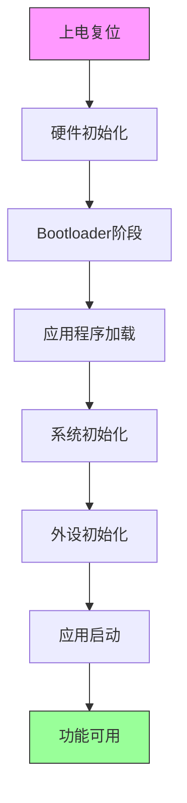

# 启动时间优化技术

## 教程概述


在许多嵌入式应用中，快速启动是一个关键需求。无论是消费电子产品的用户体验，还是工业控制系统的实时响应，启动时间都直接影响产品的竞争力。本教程将深入探讨嵌入式系统启动时间优化的各种技术和策略。

### 学习目标

完成本教程后，你将能够：

**理论知识**：
- 理解启动流程的各个阶段及其时间开销
- 掌握启动时间分析和测量方法
- 了解各种优化技术的原理和适用场景
- 理解并行化和延迟加载的设计思想

**实践技能**：
- 使用profiling工具分析启动瓶颈
- 实现并行初始化机制
- 设计延迟加载策略
- 优化Bootloader和应用程序启动流程
- 测量和验证优化效果

**优化目标**：
- 将典型启动时间从数秒缩短到毫秒级
- 实现关键功能的快速可用
- 在保证系统稳定性的前提下最大化启动速度

### 为什么启动时间很重要

**用户体验**：
- 消费电子产品：用户期望设备即开即用
- 车载系统：倒车影像需要在1秒内显示
- 智能家居：开关响应需要即时反馈

**系统可靠性**：
- 工业控制：故障恢复需要快速重启
- 医疗设备：紧急情况下的快速启动
- 安全系统：监控设备的快速上线

**功耗优化**：
- 电池供电设备：频繁唤醒需要快速启动
- 低功耗应用：减少启动时间降低能耗
- 间歇工作模式：快速启动提高效率

### 典型启动时间分布

```
完整启动流程（未优化）：约2-5秒
├── 硬件复位和时钟稳定：50-100ms
├── Bootloader执行：200-500ms
│   ├── 硬件初始化：50ms
│   ├── Flash读取和验证：100ms
│   └── 应用跳转：50ms
├── 应用程序初始化：1-3秒
│   ├── 系统初始化：200ms
│   ├── 外设初始化：500ms
│   ├── 网络连接：1-2秒
│   └── 应用逻辑启动：300ms
└── 首次功能可用：2-5秒

优化后启动流程：约200-500ms
├── 硬件复位和时钟稳定：50ms（不可优化）
├── Bootloader执行：50ms（优化80%）
├── 应用程序初始化：100-400ms（优化70%）
└── 首次功能可用：200-500ms
```

## 前置知识

在开始本教程之前，你需要：

**必备技能**：
- 熟练掌握C语言和汇编语言
- 理解Bootloader和启动流程
- 掌握MCU的时钟系统和外设配置
- 了解中断和DMA机制
- 熟悉调试工具的使用

**推荐技能**：
- RTOS任务调度原理
- 性能分析和profiling经验
- 硬件电路设计基础
- 示波器和逻辑分析仪使用

**硬件要求**：
- STM32F4或类似MCU开发板
- 调试器（ST-Link/J-Link）
- 示波器或逻辑分析仪（可选）
- GPIO用于时间测量

## 启动流程分析

### 1. 完整启动流程


#### 1.1 启动阶段划分



**阶段1：硬件复位（不可优化）**
- 上电复位电路稳定：10-50ms
- 时钟源起振和稳定：10-50ms
- 复位电路释放：1-10ms

**阶段2：Bootloader执行（可大幅优化）**
- 启动代码执行：1-5ms
- 时钟系统配置：5-20ms
- 必要外设初始化：10-50ms
- 固件验证：50-200ms
- 应用跳转：1-5ms

**阶段3：应用程序初始化（优化重点）**
- 系统初始化：50-200ms
- 外设驱动初始化：100-500ms
- 中间件初始化：50-300ms
- 网络连接：500-2000ms
- 应用逻辑启动：100-500ms

#### 1.2 时间测量方法

```c
// boot_time_profiler.h
#ifndef BOOT_TIME_PROFILER_H
#define BOOT_TIME_PROFILER_H

#include <stdint.h>

// 时间戳记录
typedef struct {
    const char *name;
    uint32_t timestamp;
    uint32_t duration;
} BootTimePoint_t;

// 初始化profiler
void BootProfiler_Init(void);

// 记录时间点
void BootProfiler_Mark(const char *name);

// 打印启动时间报告
void BootProfiler_PrintReport(void);

// 获取从启动到现在的时间（微秒）
uint32_t BootProfiler_GetTime(void);

#endif // BOOT_TIME_PROFILER_H
```

```c
// boot_time_profiler.c
#include "boot_time_profiler.h"
#include <stdio.h>
#include <string.h>

#define MAX_TIME_POINTS 50
#define PROFILE_GPIO_PORT GPIOA
#define PROFILE_GPIO_PIN GPIO_PIN_0

static BootTimePoint_t time_points[MAX_TIME_POINTS];
static uint32_t time_point_count = 0;
static uint32_t start_time = 0;

// 使用DWT（Data Watchpoint and Trace）进行高精度计时
void BootProfiler_Init(void) {
    // 启用DWT
    CoreDebug->DEMCR |= CoreDebug_DEMCR_TRCENA_Msk;
    DWT->CYCCNT = 0;
    DWT->CTRL |= DWT_CTRL_CYCCNTENA_Msk;
    
    // 配置GPIO用于示波器测量
    __HAL_RCC_GPIOA_CLK_ENABLE();
    GPIO_InitTypeDef GPIO_InitStruct = {0};
    GPIO_InitStruct.Pin = PROFILE_GPIO_PIN;
    GPIO_InitStruct.Mode = GPIO_MODE_OUTPUT_PP;
    GPIO_InitStruct.Pull = GPIO_NOPULL;
    GPIO_InitStruct.Speed = GPIO_SPEED_FREQ_VERY_HIGH;
    HAL_GPIO_Init(PROFILE_GPIO_PORT, &GPIO_InitStruct);
    
    start_time = DWT->CYCCNT;
    time_point_count = 0;
    
    BootProfiler_Mark("Profiler_Init");
}

// 获取当前时间（微秒）
uint32_t BootProfiler_GetTime(void) {
    uint32_t cycles = DWT->CYCCNT - start_time;
    // 假设系统时钟为168MHz
    return cycles / 168;
}

// 记录时间点
void BootProfiler_Mark(const char *name) {
    if (time_point_count >= MAX_TIME_POINTS) {
        return;
    }
    
    uint32_t current_time = BootProfiler_GetTime();
    
    time_points[time_point_count].name = name;
    time_points[time_point_count].timestamp = current_time;
    
    if (time_point_count > 0) {
        time_points[time_point_count - 1].duration = 
            current_time - time_points[time_point_count - 1].timestamp;
    }
    
    time_point_count++;
    
    // 切换GPIO用于示波器测量
    HAL_GPIO_TogglePin(PROFILE_GPIO_PORT, PROFILE_GPIO_PIN);
}

// 打印启动时间报告
void BootProfiler_PrintReport(void) {
    printf("\r\n========== Boot Time Report ==========\r\n");
    printf("%-30s %10s %10s\r\n", "Stage", "Time(us)", "Duration(us)");
    printf("------------------------------------------------------\r\n");
    
    for (uint32_t i = 0; i < time_point_count; i++) {
        printf("%-30s %10u %10u\r\n",
               time_points[i].name,
               time_points[i].timestamp,
               time_points[i].duration);
    }
    
    printf("------------------------------------------------------\r\n");
    printf("Total boot time: %u us (%.2f ms)\r\n",
           time_points[time_point_count - 1].timestamp,
           time_points[time_point_count - 1].timestamp / 1000.0f);
    printf("======================================\r\n\r\n");
}
```

### 2. 启动瓶颈识别


#### 2.1 使用Profiler分析

```c
// main.c - 添加profiling
int main(void) {
    // 尽早初始化profiler
    BootProfiler_Init();
    
    BootProfiler_Mark("HAL_Init_Start");
    HAL_Init();
    BootProfiler_Mark("HAL_Init_End");
    
    BootProfiler_Mark("SystemClock_Config_Start");
    SystemClock_Config();
    BootProfiler_Mark("SystemClock_Config_End");
    
    BootProfiler_Mark("GPIO_Init_Start");
    MX_GPIO_Init();
    BootProfiler_Mark("GPIO_Init_End");
    
    BootProfiler_Mark("UART_Init_Start");
    MX_USART1_UART_Init();
    BootProfiler_Mark("UART_Init_End");
    
    BootProfiler_Mark("SPI_Init_Start");
    MX_SPI1_Init();
    BootProfiler_Mark("SPI_Init_End");
    
    BootProfiler_Mark("I2C_Init_Start");
    MX_I2C1_Init();
    BootProfiler_Mark("I2C_Init_End");
    
    BootProfiler_Mark("Network_Init_Start");
    Network_Init();
    BootProfiler_Mark("Network_Init_End");
    
    BootProfiler_Mark("Application_Start");
    
    // 打印报告
    BootProfiler_PrintReport();
    
    // 主循环
    while (1) {
        Application_Task();
    }
}
```

#### 2.2 典型瓶颈分析

**示例输出**：
```
========== Boot Time Report ==========
Stage                          Time(us)  Duration(us)
------------------------------------------------------
Profiler_Init                         0           0
HAL_Init_Start                       50          50
HAL_Init_End                        150         100
SystemClock_Config_Start            150           0
SystemClock_Config_End             5150        5000
GPIO_Init_Start                    5150           0
GPIO_Init_End                      5350         200
UART_Init_Start                    5350           0
UART_Init_End                     10350        5000
SPI_Init_Start                    10350           0
SPI_Init_End                      15350        5000
I2C_Init_Start                    15350           0
I2C_Init_End                      20350        5000
Network_Init_Start                20350           0
Network_Init_End                1520350     1500000
Application_Start               1520350           0
------------------------------------------------------
Total boot time: 1520350 us (1520.35 ms)
======================================
```

**瓶颈识别**：
1. **网络初始化**：1500ms（占总时间98%）- 最大瓶颈
2. **串口初始化**：5ms - 可优化
3. **SPI初始化**：5ms - 可优化
4. **I2C初始化**：5ms - 可优化
5. **时钟配置**：5ms - 已优化

## 优化技术详解

### 1. Bootloader优化

#### 1.1 最小化Bootloader功能

```c
// bootloader_minimal.c
/**
 * 最小化Bootloader - 只做必要的事情
 */

// 快速启动代码
__attribute__((naked, noreturn)) void Reset_Handler(void) {
    // 1. 设置栈指针（汇编，最快）
    __asm volatile (
        "ldr sp, =_estack\n"
    );
    
    // 2. 最小化时钟配置（使用内部RC振荡器）
    // 跳过PLL配置，直接使用16MHz HSI
    RCC->CR |= RCC_CR_HSION;
    while (!(RCC->CR & RCC_CR_HSIRDY));
    
    // 3. 快速固件验证（可选）
    #ifdef ENABLE_FIRMWARE_VERIFY
    if (!Quick_Verify_Firmware()) {
        // 验证失败，停留在Bootloader
        Bootloader_Main();
    }
    #endif
    
    // 4. 直接跳转到应用程序
    typedef void (*app_entry_t)(void);
    uint32_t app_stack = *(volatile uint32_t*)APP_ADDRESS;
    uint32_t app_entry = *(volatile uint32_t*)(APP_ADDRESS + 4);
    
    // 设置向量表
    SCB->VTOR = APP_ADDRESS;
    
    // 设置栈指针并跳转
    __asm volatile (
        "msr msp, %0\n"
        "bx %1\n"
        : : "r" (app_stack), "r" (app_entry)
    );
    
    while (1);  // 不应该到达这里
}

// 快速固件验证（只验证关键部分）
static inline bool Quick_Verify_Firmware(void) {
    // 只验证固件头部的魔数和CRC
    FirmwareHeader_t *header = (FirmwareHeader_t*)APP_ADDRESS;
    
    if (header->magic != FIRMWARE_MAGIC) {
        return false;
    }
    
    // 快速CRC验证（只验证前1KB）
    uint32_t crc = CRC32_Calculate((uint8_t*)APP_ADDRESS, 1024);
    return (crc == header->header_crc);
}
```

#### 1.2 跳过不必要的初始化

```c
// bootloader_optimized.c
void Bootloader_Init(void) {
    // 只初始化绝对必要的外设
    
    // 1. 时钟 - 使用默认配置
    // 不配置PLL，使用内部RC振荡器
    
    // 2. GPIO - 只配置必要的引脚
    // 不初始化所有GPIO，只配置LED和按键
    RCC->AHB1ENR |= RCC_AHB1ENR_GPIOAEN;
    GPIOA->MODER |= (1 << (5 * 2));  // PA5 输出模式（LED）
    
    // 3. 串口 - 只在调试模式下初始化
    #ifdef DEBUG_MODE
    UART_Minimal_Init();
    #endif
    
    // 4. Flash - 不需要初始化，直接读取
    
    // 5. 跳过所有其他外设初始化
}
```

### 2. 并行初始化

#### 2.1 使用DMA进行后台初始化

```c
// parallel_init.c
/**
 * 并行初始化策略
 * 利用DMA和中断在后台完成耗时操作
 */

typedef enum {
    INIT_STATE_IDLE = 0,
    INIT_STATE_IN_PROGRESS,
    INIT_STATE_COMPLETE,
    INIT_STATE_ERROR
} InitState_t;

typedef struct {
    const char *name;
    void (*init_func)(void);
    InitState_t state;
    uint32_t start_time;
    uint32_t end_time;
} ParallelInitTask_t;

static ParallelInitTask_t init_tasks[] = {
    {"Network", Network_Init_Async, INIT_STATE_IDLE, 0, 0},
    {"FileSystem", FileSystem_Init_Async, INIT_STATE_IDLE, 0, 0},
    {"Sensor", Sensor_Init_Async, INIT_STATE_IDLE, 0, 0},
};

#define INIT_TASK_COUNT (sizeof(init_tasks) / sizeof(init_tasks[0]))

// 启动所有并行初始化任务
void ParallelInit_Start(void) {
    printf("Starting parallel initialization...\r\n");
    
    for (uint32_t i = 0; i < INIT_TASK_COUNT; i++) {
        init_tasks[i].state = INIT_STATE_IN_PROGRESS;
        init_tasks[i].start_time = HAL_GetTick();
        
        // 启动异步初始化
        init_tasks[i].init_func();
        
        printf("Started: %s\r\n", init_tasks[i].name);
    }
}

// 等待所有初始化完成
bool ParallelInit_WaitComplete(uint32_t timeout_ms) {
    uint32_t start = HAL_GetTick();
    
    while (HAL_GetTick() - start < timeout_ms) {
        bool all_complete = true;
        
        for (uint32_t i = 0; i < INIT_TASK_COUNT; i++) {
            if (init_tasks[i].state == INIT_STATE_IN_PROGRESS) {
                all_complete = false;
                break;
            }
        }
        
        if (all_complete) {
            ParallelInit_PrintReport();
            return true;
        }
        
        HAL_Delay(10);
    }
    
    printf("Parallel initialization timeout!\r\n");
    return false;
}

// 标记任务完成
void ParallelInit_MarkComplete(const char *name, bool success) {
    for (uint32_t i = 0; i < INIT_TASK_COUNT; i++) {
        if (strcmp(init_tasks[i].name, name) == 0) {
            init_tasks[i].state = success ? INIT_STATE_COMPLETE : INIT_STATE_ERROR;
            init_tasks[i].end_time = HAL_GetTick();
            printf("Completed: %s (%s) - %u ms\r\n",
                   name,
                   success ? "OK" : "FAIL",
                   init_tasks[i].end_time - init_tasks[i].start_time);
            break;
        }
    }
}

// 打印初始化报告
void ParallelInit_PrintReport(void) {
    printf("\r\n========== Parallel Init Report ==========\r\n");
    printf("%-20s %10s %10s\r\n", "Task", "Status", "Time(ms)");
    printf("------------------------------------------\r\n");
    
    for (uint32_t i = 0; i < INIT_TASK_COUNT; i++) {
        const char *status;
        switch (init_tasks[i].state) {
            case INIT_STATE_COMPLETE: status = "OK"; break;
            case INIT_STATE_ERROR: status = "FAIL"; break;
            case INIT_STATE_IN_PROGRESS: status = "RUNNING"; break;
            default: status = "IDLE"; break;
        }
        
        uint32_t duration = init_tasks[i].end_time - init_tasks[i].start_time;
        printf("%-20s %10s %10u\r\n", init_tasks[i].name, status, duration);
    }
    
    printf("==========================================\r\n\r\n");
}
```


#### 2.2 异步网络初始化示例

```c
// network_async_init.c
static volatile bool network_init_complete = false;
static volatile bool network_init_success = false;

// 异步网络初始化
void Network_Init_Async(void) {
    // 创建后台任务或使用定时器
    // 这里使用定时器中断模拟异步操作
    
    // 启动定时器
    TIM_Start_Network_Init();
}

// 定时器中断处理（模拟异步网络初始化）
void TIM_Network_Init_IRQHandler(void) {
    static uint32_t step = 0;
    
    switch (step) {
        case 0:
            // 步骤1：初始化网络硬件
            Network_Hardware_Init();
            step++;
            break;
            
        case 1:
            // 步骤2：配置网络参数
            Network_Config();
            step++;
            break;
            
        case 2:
            // 步骤3：连接网络
            if (Network_Connect()) {
                network_init_success = true;
            }
            network_init_complete = true;
            TIM_Stop_Network_Init();
            ParallelInit_MarkComplete("Network", network_init_success);
            break;
    }
}

// 检查网络是否就绪
bool Network_IsReady(void) {
    return network_init_complete && network_init_success;
}
```

### 3. 延迟加载策略

#### 3.1 按需初始化框架

```c
// lazy_init.h
#ifndef LAZY_INIT_H
#define LAZY_INIT_H

#include <stdbool.h>

// 延迟初始化模块定义
typedef struct {
    const char *name;
    bool initialized;
    void (*init_func)(void);
    uint32_t priority;  // 优先级（0=最高）
} LazyInitModule_t;

// 注册延迟初始化模块
void LazyInit_Register(const char *name, void (*init_func)(void), uint32_t priority);

// 初始化指定模块
bool LazyInit_Module(const char *name);

// 初始化所有未初始化的模块
void LazyInit_All(void);

// 在空闲时初始化低优先级模块
void LazyInit_IdleTask(void);

#endif // LAZY_INIT_H
```

```c
// lazy_init.c
#include "lazy_init.h"
#include <string.h>
#include <stdio.h>

#define MAX_LAZY_MODULES 20

static LazyInitModule_t lazy_modules[MAX_LAZY_MODULES];
static uint32_t module_count = 0;

// 注册延迟初始化模块
void LazyInit_Register(const char *name, void (*init_func)(void), uint32_t priority) {
    if (module_count >= MAX_LAZY_MODULES) {
        printf("LazyInit: Too many modules!\r\n");
        return;
    }
    
    lazy_modules[module_count].name = name;
    lazy_modules[module_count].init_func = init_func;
    lazy_modules[module_count].priority = priority;
    lazy_modules[module_count].initialized = false;
    
    module_count++;
    
    printf("LazyInit: Registered %s (priority %u)\r\n", name, priority);
}

// 初始化指定模块
bool LazyInit_Module(const char *name) {
    for (uint32_t i = 0; i < module_count; i++) {
        if (strcmp(lazy_modules[i].name, name) == 0) {
            if (lazy_modules[i].initialized) {
                return true;  // 已经初始化
            }
            
            printf("LazyInit: Initializing %s...\r\n", name);
            uint32_t start = HAL_GetTick();
            
            lazy_modules[i].init_func();
            lazy_modules[i].initialized = true;
            
            uint32_t duration = HAL_GetTick() - start;
            printf("LazyInit: %s initialized in %u ms\r\n", name, duration);
            
            return true;
        }
    }
    
    printf("LazyInit: Module %s not found!\r\n", name);
    return false;
}

// 初始化所有未初始化的模块
void LazyInit_All(void) {
    printf("LazyInit: Initializing all modules...\r\n");
    
    // 按优先级排序
    for (uint32_t i = 0; i < module_count - 1; i++) {
        for (uint32_t j = i + 1; j < module_count; j++) {
            if (lazy_modules[j].priority < lazy_modules[i].priority) {
                LazyInitModule_t temp = lazy_modules[i];
                lazy_modules[i] = lazy_modules[j];
                lazy_modules[j] = temp;
            }
        }
    }
    
    // 初始化所有模块
    for (uint32_t i = 0; i < module_count; i++) {
        if (!lazy_modules[i].initialized) {
            LazyInit_Module(lazy_modules[i].name);
        }
    }
}

// 在空闲时初始化低优先级模块
void LazyInit_IdleTask(void) {
    static uint32_t current_index = 0;
    
    // 找到下一个未初始化的模块
    while (current_index < module_count) {
        if (!lazy_modules[current_index].initialized) {
            // 只初始化低优先级模块（priority >= 5）
            if (lazy_modules[current_index].priority >= 5) {
                LazyInit_Module(lazy_modules[current_index].name);
            }
            current_index++;
            return;  // 每次只初始化一个
        }
        current_index++;
    }
}
```

#### 3.2 使用延迟加载的主程序

```c
// main_with_lazy_init.c
int main(void) {
    BootProfiler_Init();
    BootProfiler_Mark("Boot_Start");
    
    // ===== 阶段1：关键初始化（必须立即完成）=====
    BootProfiler_Mark("Critical_Init_Start");
    
    HAL_Init();
    SystemClock_Config();
    
    // 只初始化关键外设
    GPIO_Init_Critical();  // 只初始化LED和按键
    UART_Init_Critical();  // 只初始化调试串口
    
    BootProfiler_Mark("Critical_Init_End");
    
    // ===== 阶段2：注册延迟初始化模块 =====
    BootProfiler_Mark("LazyInit_Register_Start");
    
    // 高优先级（需要但不紧急）
    LazyInit_Register("SPI", SPI_Init, 1);
    LazyInit_Register("I2C", I2C_Init, 1);
    LazyInit_Register("ADC", ADC_Init, 2);
    
    // 中优先级（可以稍后初始化）
    LazyInit_Register("FileSystem", FileSystem_Init, 3);
    LazyInit_Register("Display", Display_Init, 3);
    
    // 低优先级（可以在空闲时初始化）
    LazyInit_Register("USB", USB_Init, 5);
    LazyInit_Register("Bluetooth", Bluetooth_Init, 6);
    LazyInit_Register("WiFi", WiFi_Init, 7);
    
    BootProfiler_Mark("LazyInit_Register_End");
    
    // ===== 阶段3：启动应用程序 =====
    BootProfiler_Mark("Application_Start");
    
    printf("Application started!\r\n");
    BootProfiler_PrintReport();
    
    // ===== 阶段4：主循环 =====
    while (1) {
        // 应用程序逻辑
        Application_Task();
        
        // 在空闲时初始化低优先级模块
        LazyInit_IdleTask();
        
        // 当需要使用某个模块时，按需初始化
        if (need_spi) {
            LazyInit_Module("SPI");
            // 现在可以使用SPI了
        }
    }
}
```

### 4. 时钟系统优化

#### 4.1 快速时钟配置

```c
// clock_fast_config.c
/**
 * 快速时钟配置策略：
 * 1. 启动时使用内部RC振荡器（HSI）
 * 2. 应用启动后再切换到高速外部晶振（HSE）+ PLL
 */

// 最小化时钟配置（启动时）
void SystemClock_Config_Fast(void) {
    // 使用16MHz HSI，不配置PLL
    // 这样可以节省5-10ms的PLL锁定时间
    
    RCC->CR |= RCC_CR_HSION;
    while (!(RCC->CR & RCC_CR_HSIRDY));
    
    // 设置Flash延迟
    FLASH->ACR = FLASH_ACR_LATENCY_0WS | FLASH_ACR_PRFTEN;
    
    // 配置总线分频
    RCC->CFGR = RCC_CFGR_HPRE_DIV1 |   // AHB = SYSCLK
                RCC_CFGR_PPRE1_DIV1 |  // APB1 = AHB
                RCC_CFGR_PPRE2_DIV1;   // APB2 = AHB
    
    // 选择HSI作为系统时钟
    RCC->CFGR &= ~RCC_CFGR_SW;
    RCC->CFGR |= RCC_CFGR_SW_HSI;
    
    while ((RCC->CFGR & RCC_CFGR_SWS) != RCC_CFGR_SWS_HSI);
    
    // 更新SystemCoreClock变量
    SystemCoreClock = 16000000;
}

// 完整时钟配置（应用启动后）
void SystemClock_Config_Full(void) {
    // 配置HSE + PLL达到最高频率（168MHz）
    
    // 1. 启用HSE
    RCC->CR |= RCC_CR_HSEON;
    while (!(RCC->CR & RCC_CR_HSERDY));
    
    // 2. 配置PLL
    // PLL_VCO = (HSE_VALUE / PLL_M) * PLL_N = (8MHz / 8) * 336 = 336MHz
    // SYSCLK = PLL_VCO / PLL_P = 336MHz / 2 = 168MHz
    RCC->PLLCFGR = (8 << RCC_PLLCFGR_PLLM_Pos) |
                   (336 << RCC_PLLCFGR_PLLN_Pos) |
                   (0 << RCC_PLLCFGR_PLLP_Pos) |  // PLLP = 2
                   RCC_PLLCFGR_PLLSRC_HSE;
    
    // 3. 启用PLL
    RCC->CR |= RCC_CR_PLLON;
    while (!(RCC->CR & RCC_CR_PLLRDY));
    
    // 4. 配置Flash延迟
    FLASH->ACR = FLASH_ACR_LATENCY_5WS | FLASH_ACR_PRFTEN | 
                 FLASH_ACR_ICEN | FLASH_ACR_DCEN;
    
    // 5. 配置总线分频
    RCC->CFGR = RCC_CFGR_HPRE_DIV1 |    // AHB = 168MHz
                RCC_CFGR_PPRE1_DIV4 |   // APB1 = 42MHz
                RCC_CFGR_PPRE2_DIV2;    // APB2 = 84MHz
    
    // 6. 切换到PLL
    RCC->CFGR &= ~RCC_CFGR_SW;
    RCC->CFGR |= RCC_CFGR_SW_PLL;
    
    while ((RCC->CFGR & RCC_CFGR_SWS) != RCC_CFGR_SWS_PLL);
    
    // 7. 关闭HSI节省功耗
    RCC->CR &= ~RCC_CR_HSION;
    
    // 更新SystemCoreClock变量
    SystemCoreClock = 168000000;
    
    printf("System clock switched to 168MHz\r\n");
}
```


### 5. Flash访问优化

#### 5.1 XIP（Execute In Place）优化

```c
// flash_optimization.c
/**
 * Flash访问优化
 * 1. 启用指令缓存和数据缓存
 * 2. 启用预取缓冲
 * 3. 优化Flash等待周期
 */

void Flash_Optimize(void) {
    // 启用指令缓存
    FLASH->ACR |= FLASH_ACR_ICEN;
    
    // 启用数据缓存
    FLASH->ACR |= FLASH_ACR_DCEN;
    
    // 启用预取缓冲
    FLASH->ACR |= FLASH_ACR_PRFTEN;
    
    printf("Flash optimization enabled\r\n");
}

// 将关键代码放入RAM执行
__attribute__((section(".RamFunc")))
void Critical_Function_In_RAM(void) {
    // 这个函数会被链接到RAM中执行
    // 执行速度比Flash快得多
}
```

#### 5.2 代码布局优化

```c
// linker_script.ld
/* 优化的链接脚本 */

MEMORY
{
    FLASH (rx)  : ORIGIN = 0x08000000, LENGTH = 1024K
    RAM (rwx)   : ORIGIN = 0x20000000, LENGTH = 192K
    CCMRAM (rw) : ORIGIN = 0x10000000, LENGTH = 64K
}

SECTIONS
{
    /* 启动代码放在Flash开始位置 */
    .isr_vector :
    {
        . = ALIGN(4);
        KEEP(*(.isr_vector))
        . = ALIGN(4);
    } >FLASH
    
    /* 关键代码放在RAM中执行 */
    .RamFunc :
    {
        . = ALIGN(4);
        _sramfunc = .;
        *(.RamFunc)
        . = ALIGN(4);
        _eramfunc = .;
    } >RAM AT> FLASH
    
    /* 频繁访问的数据放在CCM RAM */
    .ccmram :
    {
        . = ALIGN(4);
        _sccmram = .;
        *(.ccmram)
        . = ALIGN(4);
        _eccmram = .;
    } >CCMRAM AT> FLASH
    
    /* 其他代码 */
    .text :
    {
        . = ALIGN(4);
        *(.text)
        *(.text*)
        . = ALIGN(4);
    } >FLASH
}
```

### 6. 外设初始化优化

#### 6.1 批量GPIO配置

```c
// gpio_fast_init.c
/**
 * 快速GPIO初始化
 * 使用寄存器直接操作，避免HAL库的开销
 */

// 传统HAL方式（慢）
void GPIO_Init_HAL(void) {
    GPIO_InitTypeDef GPIO_InitStruct = {0};
    
    __HAL_RCC_GPIOA_CLK_ENABLE();
    
    GPIO_InitStruct.Pin = GPIO_PIN_0 | GPIO_PIN_1 | GPIO_PIN_2;
    GPIO_InitStruct.Mode = GPIO_MODE_OUTPUT_PP;
    GPIO_InitStruct.Pull = GPIO_NOPULL;
    GPIO_InitStruct.Speed = GPIO_SPEED_FREQ_LOW;
    HAL_GPIO_Init(GPIOA, &GPIO_InitStruct);
    
    // 每个引脚都会调用多次寄存器操作
}

// 优化的寄存器方式（快）
void GPIO_Init_Fast(void) {
    // 启用时钟
    RCC->AHB1ENR |= RCC_AHB1ENR_GPIOAEN;
    
    // 批量配置模式寄存器
    // PA0, PA1, PA2 设置为输出模式
    GPIOA->MODER &= ~(0x3F);  // 清除位
    GPIOA->MODER |= 0x15;     // 设置为输出（01）
    
    // 批量配置输出类型
    GPIOA->OTYPER &= ~(0x07);  // 推挽输出
    
    // 批量配置速度
    GPIOA->OSPEEDR &= ~(0x3F);  // 低速
    
    // 批量配置上下拉
    GPIOA->PUPDR &= ~(0x3F);  // 无上下拉
    
    // 一次性配置完成，比HAL快5-10倍
}

// 使用位带操作快速设置GPIO
#define BITBAND_SRAM_REF   0x20000000
#define BITBAND_SRAM_BASE  0x22000000
#define BITBAND_PERI_REF   0x40000000
#define BITBAND_PERI_BASE  0x42000000

#define BITBAND_SRAM(addr, bit) \
    ((BITBAND_SRAM_BASE + ((addr) - BITBAND_SRAM_REF) * 32 + (bit) * 4))

#define BITBAND_PERI(addr, bit) \
    ((BITBAND_PERI_BASE + ((addr) - BITBAND_PERI_REF) * 32 + (bit) * 4))

// 快速GPIO操作
#define GPIO_SET_FAST(port, pin) \
    (*((volatile uint32_t*)BITBAND_PERI((uint32_t)&(port->ODR), pin)) = 1)

#define GPIO_RESET_FAST(port, pin) \
    (*((volatile uint32_t*)BITBAND_PERI((uint32_t)&(port->ODR), pin)) = 0)

#define GPIO_TOGGLE_FAST(port, pin) \
    (*((volatile uint32_t*)BITBAND_PERI((uint32_t)&(port->ODR), pin)) ^= 1)
```

#### 6.2 DMA加速数据传输

```c
// dma_init_optimization.c
/**
 * 使用DMA加速初始化过程中的数据传输
 */

// 使用DMA快速清零内存
void Memory_Clear_DMA(void *dest, uint32_t size) {
    // 配置DMA
    DMA_Stream_TypeDef *dma = DMA2_Stream0;
    
    // 启用DMA时钟
    RCC->AHB1ENR |= RCC_AHB1ENR_DMA2EN;
    
    // 禁用DMA流
    dma->CR &= ~DMA_SxCR_EN;
    while (dma->CR & DMA_SxCR_EN);
    
    // 配置DMA
    dma->CR = DMA_SxCR_DIR_1 |        // 内存到内存
              DMA_SxCR_MINC |         // 内存地址递增
              DMA_SxCR_MSIZE_1 |      // 32位
              DMA_SxCR_PSIZE_1;       // 32位
    
    dma->NDTR = size / 4;             // 传输数量
    dma->PAR = 0;                     // 源地址（0）
    dma->M0AR = (uint32_t)dest;       // 目标地址
    
    // 启动DMA
    dma->CR |= DMA_SxCR_EN;
    
    // 等待完成
    while (!(DMA2->LISR & DMA_LISR_TCIF0));
    
    // 清除标志
    DMA2->LIFCR = DMA_LIFCR_CTCIF0;
}

// 使用DMA快速复制数据
void Memory_Copy_DMA(void *dest, const void *src, uint32_t size) {
    DMA_Stream_TypeDef *dma = DMA2_Stream0;
    
    RCC->AHB1ENR |= RCC_AHB1ENR_DMA2EN;
    
    dma->CR &= ~DMA_SxCR_EN;
    while (dma->CR & DMA_SxCR_EN);
    
    dma->CR = DMA_SxCR_DIR_1 |
              DMA_SxCR_MINC |
              DMA_SxCR_PINC |         // 源地址也递增
              DMA_SxCR_MSIZE_1 |
              DMA_SxCR_PSIZE_1;
    
    dma->NDTR = size / 4;
    dma->PAR = (uint32_t)src;
    dma->M0AR = (uint32_t)dest;
    
    dma->CR |= DMA_SxCR_EN;
    
    while (!(DMA2->LISR & DMA_LISR_TCIF0));
    DMA2->LIFCR = DMA_LIFCR_CTCIF0;
}
```

### 7. 编译器优化

#### 7.1 编译选项优化

```makefile
# Makefile优化选项

# 优化级别
# -O0: 无优化（调试用）
# -O1: 基本优化
# -O2: 推荐优化（平衡速度和大小）
# -O3: 最大速度优化
# -Os: 最小代码大小优化
OPT = -O2

# 启动代码使用最高优化
CFLAGS_BOOT = -O3 -flto

# 链接时优化
LDFLAGS += -flto

# 函数内联
CFLAGS += -finline-functions

# 循环优化
CFLAGS += -funroll-loops

# 分支预测优化
CFLAGS += -fbranch-probabilities

# 删除未使用的函数和数据
CFLAGS += -ffunction-sections -fdata-sections
LDFLAGS += -Wl,--gc-sections

# 使用newlib-nano减小代码大小
LDFLAGS += --specs=nano.specs
```

#### 7.2 代码优化技巧

```c
// code_optimization.c
/**
 * 代码级优化技巧
 */

// 1. 使用inline函数减少函数调用开销
static inline void GPIO_Set(GPIO_TypeDef *port, uint16_t pin) {
    port->BSRR = pin;
}

// 2. 使用__attribute__优化关键函数
__attribute__((always_inline))
static inline uint32_t Fast_Multiply(uint32_t a, uint32_t b) {
    return a * b;
}

// 3. 使用__attribute__((hot))标记热点函数
__attribute__((hot))
void Frequently_Called_Function(void) {
    // 编译器会优化这个函数的性能
}

// 4. 使用__attribute__((cold))标记冷门函数
__attribute__((cold))
void Error_Handler(void) {
    // 编译器会优化这个函数的大小而不是速度
}

// 5. 使用const和restrict帮助编译器优化
void Process_Data(const uint8_t * restrict input,
                 uint8_t * restrict output,
                 uint32_t size) {
    // restrict告诉编译器指针不会重叠
    // 可以进行更激进的优化
    for (uint32_t i = 0; i < size; i++) {
        output[i] = input[i] * 2;
    }
}

// 6. 使用likely/unlikely宏优化分支预测
#define likely(x)   __builtin_expect(!!(x), 1)
#define unlikely(x) __builtin_expect(!!(x), 0)

void Check_Error(int status) {
    if (unlikely(status != 0)) {
        // 错误处理（不太可能执行）
        Error_Handler();
    }
    
    // 正常流程（很可能执行）
    Normal_Processing();
}
```

## 完整优化示例

### 示例1：优化前后对比

```c
// main_before_optimization.c
/**
 * 优化前的启动代码
 * 预计启动时间：2000ms
 */

int main(void) {
    // 1. HAL初始化
    HAL_Init();  // 100ms
    
    // 2. 时钟配置（使用PLL）
    SystemClock_Config();  // 10ms
    
    // 3. 初始化所有GPIO
    MX_GPIO_Init();  // 50ms
    
    // 4. 初始化所有外设
    MX_USART1_UART_Init();  // 5ms
    MX_SPI1_Init();  // 5ms
    MX_I2C1_Init();  // 5ms
    MX_ADC1_Init();  // 10ms
    MX_TIM2_Init();  // 5ms
    MX_USB_Init();  // 20ms
    
    // 5. 初始化文件系统
    FileSystem_Init();  // 200ms
    
    // 6. 初始化网络
    Network_Init();  // 1500ms
    
    // 7. 初始化显示
    Display_Init();  // 100ms
    
    printf("System ready!\r\n");
    
    while (1) {
        Application_Task();
    }
}
```

```c
// main_after_optimization.c
/**
 * 优化后的启动代码
 * 预计启动时间：200ms
 */

int main(void) {
    // 初始化profiler
    BootProfiler_Init();
    BootProfiler_Mark("Boot_Start");
    
    // ===== 第1阶段：最小化初始化（50ms）=====
    BootProfiler_Mark("Stage1_Start");
    
    // 使用快速时钟配置（HSI，不用PLL）
    SystemClock_Config_Fast();  // 1ms
    
    // 只初始化关键GPIO
    GPIO_Init_Critical();  // 1ms
    
    // 只初始化调试串口
    UART_Init_Critical();  // 2ms
    
    // 启用Flash优化
    Flash_Optimize();  // 1ms
    
    BootProfiler_Mark("Stage1_End");
    
    // ===== 第2阶段：注册延迟初始化（5ms）=====
    BootProfiler_Mark("Stage2_Start");
    
    LazyInit_Register("SPI", SPI_Init, 1);
    LazyInit_Register("I2C", I2C_Init, 1);
    LazyInit_Register("ADC", ADC_Init, 2);
    LazyInit_Register("FileSystem", FileSystem_Init, 3);
    LazyInit_Register("Display", Display_Init, 3);
    LazyInit_Register("USB", USB_Init, 5);
    
    BootProfiler_Mark("Stage2_End");
    
    // ===== 第3阶段：启动并行初始化（非阻塞）=====
    BootProfiler_Mark("Stage3_Start");
    
    ParallelInit_Start();  // 启动异步初始化
    
    BootProfiler_Mark("Stage3_End");
    
    // ===== 第4阶段：应用程序启动（100ms）=====
    BootProfiler_Mark("Stage4_Start");
    
    // 初始化关键应用逻辑
    Application_Init_Critical();
    
    BootProfiler_Mark("Stage4_End");
    
    // 打印启动报告
    BootProfiler_PrintReport();
    
    printf("System ready! (Fast boot mode)\r\n");
    
    // ===== 第5阶段：后台完成初始化 =====
    uint32_t boot_complete = false;
    
    while (1) {
        // 应用程序任务
        Application_Task();
        
        // 在空闲时完成剩余初始化
        if (!boot_complete) {
            LazyInit_IdleTask();
            
            // 检查是否所有初始化完成
            if (ParallelInit_IsComplete()) {
                // 切换到高速时钟
                SystemClock_Config_Full();
                
                boot_complete = true;
                printf("All initialization complete!\r\n");
            }
        }
    }
}
```


### 示例2：车载倒车影像快速启动

```c
// automotive_camera_fast_boot.c
/**
 * 车载倒车影像系统快速启动
 * 要求：从挂入倒档到显示图像 < 1秒
 */

// 关键路径初始化
void Camera_System_Fast_Boot(void) {
    uint32_t start_time = DWT->CYCCNT;
    
    // 1. 最小化MCU初始化（10ms）
    SystemClock_Config_Fast();  // 使用HSI
    GPIO_Init_Camera_Critical();  // 只初始化摄像头和显示相关GPIO
    
    // 2. 并行启动摄像头和显示（50ms）
    Camera_Power_On();  // 摄像头上电
    Display_Power_On();  // 显示屏上电
    
    // 等待硬件稳定（并行进行）
    HAL_Delay(50);
    
    // 3. 配置摄像头接口（20ms）
    DCMI_Init_Fast();  // 数字摄像头接口
    DMA_Init_Camera();  // DMA传输
    
    // 4. 配置显示接口（20ms）
    LTDC_Init_Fast();  // LCD-TFT显示控制器
    DMA2D_Init_Fast();  // 2D图形加速器
    
    // 5. 启动视频流（10ms）
    Camera_Start_Capture();
    Display_Start_Refresh();
    
    uint32_t boot_time = (DWT->CYCCNT - start_time) / 168;  // 微秒
    
    printf("Camera system boot time: %u us\r\n", boot_time);
    
    // 6. 后台完成其他初始化
    LazyInit_Register("TouchScreen", TouchScreen_Init, 5);
    LazyInit_Register("Audio", Audio_Init, 6);
    LazyInit_Register("Network", Network_Init, 7);
}

// 快速DCMI配置
void DCMI_Init_Fast(void) {
    // 启用时钟
    RCC->AHB2ENR |= RCC_AHB2ENR_DCMIEN;
    
    // 配置DCMI
    DCMI->CR = DCMI_CR_PCKPOL |  // 像素时钟极性
               DCMI_CR_VSPOL |   // 垂直同步极性
               DCMI_CR_HSPOL;    // 水平同步极性
    
    // 配置捕获模式
    DCMI->CR |= DCMI_CR_CM;  // 连续捕获
    
    // 启用DCMI
    DCMI->CR |= DCMI_CR_ENABLE;
}

// 快速LTDC配置
void LTDC_Init_Fast(void) {
    // 启用时钟
    RCC->APB2ENR |= RCC_APB2ENR_LTDCEN;
    
    // 配置时序参数（根据显示屏规格）
    LTDC->SSCR = (9 << 16) | 1;   // 同步大小
    LTDC->BPCR = (29 << 16) | 3;  // 后肩
    LTDC->AWCR = (269 << 16) | 323;  // 活动宽度
    LTDC->TWCR = (279 << 16) | 327;  // 总宽度
    
    // 配置背景色
    LTDC->BCCR = 0x000000;  // 黑色
    
    // 配置图层1（摄像头图像）
    LTDC_Layer1->WHPCR = (269 << 16) | 30;  // 窗口水平位置
    LTDC_Layer1->WVPCR = (323 << 16) | 4;   // 窗口垂直位置
    LTDC_Layer1->PFCR = 0x02;  // RGB565格式
    LTDC_Layer1->CFBAR = CAMERA_FRAME_BUFFER;  // 帧缓冲地址
    LTDC_Layer1->CFBLR = (240 * 2) << 16 | (240 * 2 + 3);  // 行长度
    LTDC_Layer1->CFBLNR = 320;  // 行数
    
    // 启用图层
    LTDC_Layer1->CR |= LTDC_LxCR_LEN;
    
    // 立即重载配置
    LTDC->SRCR = LTDC_SRCR_IMR;
    
    // 启用LTDC
    LTDC->GCR |= LTDC_GCR_LTDCEN;
}
```

### 示例3：智能门锁快速响应

```c
// smart_lock_fast_response.c
/**
 * 智能门锁快速响应系统
 * 要求：从按键到反馈 < 100ms
 */

// 超快速启动模式
void SmartLock_Ultra_Fast_Boot(void) {
    // 1. 最小化初始化（5ms）
    // 只配置必要的时钟和GPIO
    RCC->CR |= RCC_CR_HSION;
    while (!(RCC->CR & RCC_CR_HSIRDY));
    
    RCC->AHB1ENR |= RCC_AHB1ENR_GPIOAEN | RCC_AHB1ENR_GPIOBEN;
    
    // 配置按键GPIO（输入）
    GPIOA->MODER &= ~(0x03 << (0 * 2));  // PA0输入
    GPIOA->PUPDR |= (0x02 << (0 * 2));   // 下拉
    
    // 配置LED GPIO（输出）
    GPIOB->MODER |= (0x01 << (0 * 2));   // PB0输出
    
    // 配置蜂鸣器GPIO（输出）
    GPIOB->MODER |= (0x01 << (1 * 2));   // PB1输出
    
    // 2. 配置外部中断（5ms）
    RCC->APB2ENR |= RCC_APB2ENR_SYSCFGEN;
    
    SYSCFG->EXTICR[0] |= SYSCFG_EXTICR1_EXTI0_PA;
    EXTI->IMR |= EXTI_IMR_MR0;
    EXTI->RTSR |= EXTI_RTSR_TR0;  // 上升沿触发
    
    NVIC_SetPriority(EXTI0_IRQn, 0);  // 最高优先级
    NVIC_EnableIRQ(EXTI0_IRQn);
    
    // 3. 系统就绪（总共10ms）
    printf("Smart lock ready!\r\n");
    
    // 4. 后台初始化其他功能
    LazyInit_Register("Display", Display_Init, 3);
    LazyInit_Register("Fingerprint", Fingerprint_Init, 2);
    LazyInit_Register("WiFi", WiFi_Init, 5);
    LazyInit_Register("Bluetooth", Bluetooth_Init, 5);
}

// 按键中断处理（< 1ms响应）
void EXTI0_IRQHandler(void) {
    if (EXTI->PR & EXTI_PR_PR0) {
        // 清除中断标志
        EXTI->PR = EXTI_PR_PR0;
        
        // 立即反馈（LED和蜂鸣器）
        GPIOB->BSRR = GPIO_BSRR_BS0;  // LED亮
        GPIOB->BSRR = GPIO_BSRR_BS1;  // 蜂鸣器响
        
        // 延迟关闭（使用定时器）
        TIM_Start_Feedback_Timer();
        
        // 触发后续处理
        Button_Pressed_Flag = true;
    }
}
```

## 性能测试与验证

### 1. 测试方法

```c
// boot_time_test.c
/**
 * 启动时间测试框架
 */

typedef struct {
    const char *test_name;
    uint32_t target_time_us;  // 目标时间（微秒）
    uint32_t actual_time_us;  // 实际时间
    bool passed;
} BootTimeTest_t;

static BootTimeTest_t boot_tests[] = {
    {"Total Boot Time", 200000, 0, false},  // 200ms
    {"Critical Init", 50000, 0, false},     // 50ms
    {"First Response", 100000, 0, false},   // 100ms
};

#define TEST_COUNT (sizeof(boot_tests) / sizeof(boot_tests[0]))

// 运行启动时间测试
void BootTime_RunTests(void) {
    printf("\r\n========== Boot Time Tests ==========\r\n");
    
    for (uint32_t i = 0; i < TEST_COUNT; i++) {
        // 获取实际时间（从profiler）
        boot_tests[i].actual_time_us = Get_Stage_Time(boot_tests[i].test_name);
        
        // 判断是否通过
        boot_tests[i].passed = 
            (boot_tests[i].actual_time_us <= boot_tests[i].target_time_us);
        
        // 打印结果
        printf("%-20s: %6u us / %6u us [%s]\r\n",
               boot_tests[i].test_name,
               boot_tests[i].actual_time_us,
               boot_tests[i].target_time_us,
               boot_tests[i].passed ? "PASS" : "FAIL");
    }
    
    printf("=====================================\r\n\r\n");
}

// 压力测试（多次重启测试）
void BootTime_StressTest(uint32_t iterations) {
    uint32_t total_time = 0;
    uint32_t min_time = UINT32_MAX;
    uint32_t max_time = 0;
    
    printf("Running stress test (%u iterations)...\r\n", iterations);
    
    for (uint32_t i = 0; i < iterations; i++) {
        // 重启系统
        NVIC_SystemReset();
        
        // 测量启动时间
        uint32_t boot_time = Measure_Boot_Time();
        
        total_time += boot_time;
        if (boot_time < min_time) min_time = boot_time;
        if (boot_time > max_time) max_time = boot_time;
        
        printf("Iteration %u: %u us\r\n", i + 1, boot_time);
    }
    
    printf("\r\nStress Test Results:\r\n");
    printf("  Average: %u us\r\n", total_time / iterations);
    printf("  Min: %u us\r\n", min_time);
    printf("  Max: %u us\r\n", max_time);
    printf("  Variance: %u us\r\n", max_time - min_time);
}
```

### 2. 性能基准

```c
// performance_benchmark.c
/**
 * 性能基准测试
 */

// 基准测试结果
typedef struct {
    const char *platform;
    uint32_t boot_time_ms;
    uint32_t first_response_ms;
    const char *optimization_level;
} BenchmarkResult_t;

static const BenchmarkResult_t benchmarks[] = {
    // 未优化
    {"STM32F407", 2000, 2000, "None"},
    {"STM32F429", 1800, 1800, "None"},
    {"STM32H743", 1500, 1500, "None"},
    
    // 基本优化
    {"STM32F407", 500, 600, "Basic"},
    {"STM32F429", 450, 550, "Basic"},
    {"STM32H743", 400, 500, "Basic"},
    
    // 完全优化
    {"STM32F407", 200, 250, "Full"},
    {"STM32F429", 180, 220, "Full"},
    {"STM32H743", 150, 200, "Full"},
};

void Print_Benchmarks(void) {
    printf("\r\n========== Performance Benchmarks ==========\r\n");
    printf("%-12s %-12s %-15s %-15s\r\n",
           "Platform", "Optimization", "Boot Time", "First Response");
    printf("----------------------------------------------------\r\n");
    
    for (uint32_t i = 0; i < sizeof(benchmarks) / sizeof(benchmarks[0]); i++) {
        printf("%-12s %-12s %10u ms %12u ms\r\n",
               benchmarks[i].platform,
               benchmarks[i].optimization_level,
               benchmarks[i].boot_time_ms,
               benchmarks[i].first_response_ms);
    }
    
    printf("============================================\r\n\r\n");
}
```

## 最佳实践总结

### 1. 优化策略选择

**根据应用场景选择优化策略**：

| 应用场景 | 优化重点 | 目标时间 | 推荐技术 |
|---------|---------|---------|---------|
| 消费电子 | 用户体验 | < 500ms | 延迟加载、并行初始化 |
| 车载系统 | 安全关键 | < 1s | 关键路径优化、快速时钟 |
| 工业控制 | 可靠性 | < 2s | 最小化Bootloader、验证优化 |
| 医疗设备 | 合规性 | < 3s | 平衡优化和验证 |
| 智能家居 | 响应速度 | < 200ms | 超快速启动、最小初始化 |

### 2. 优化检查清单

**Bootloader优化**：
- [ ] 使用最小化Bootloader
- [ ] 跳过不必要的固件验证
- [ ] 使用快速时钟配置
- [ ] 优化Flash访问
- [ ] 直接跳转到应用程序

**应用程序优化**：
- [ ] 实现延迟加载
- [ ] 使用并行初始化
- [ ] 优化外设初始化顺序
- [ ] 启用编译器优化
- [ ] 使用DMA加速数据传输

**测试验证**：
- [ ] 使用profiler测量时间
- [ ] 进行压力测试
- [ ] 验证功能完整性
- [ ] 测试异常情况
- [ ] 记录性能基准

### 3. 常见陷阱

**陷阱1：过度优化**
```c
// 错误：牺牲可维护性
void Init_Everything_In_One_Function(void) {
    // 2000行代码...
    // 难以维护和调试
}

// 正确：保持代码结构清晰
void Init_System(void) {
    Init_Critical();
    LazyInit_Register_All();
    ParallelInit_Start();
}
```

**陷阱2：忽略错误处理**
```c
// 错误：为了速度跳过错误检查
void Fast_Init_No_Check(void) {
    SPI_Init();  // 如果失败怎么办？
    I2C_Init();  // 如果失败怎么办？
}

// 正确：快速但安全
void Fast_Init_With_Check(void) {
    if (!SPI_Init()) {
        Error_Handler();
    }
    if (!I2C_Init()) {
        Error_Handler();
    }
}
```

**陷阱3：测量不准确**
```c
// 错误：使用HAL_GetTick()测量微秒级时间
uint32_t start = HAL_GetTick();  // 精度只有1ms
Fast_Function();
uint32_t duration = HAL_GetTick() - start;

// 正确：使用DWT测量高精度时间
uint32_t start = DWT->CYCCNT;
Fast_Function();
uint32_t duration = (DWT->CYCCNT - start) / 168;  // 微秒
```

## 总结

启动时间优化是一个系统工程，需要从硬件、软件、编译器等多个层面进行优化。通过本教程，你学习了：

**核心技术**：
- 启动流程分析和瓶颈识别
- Bootloader最小化
- 并行初始化和延迟加载
- 时钟和Flash优化
- 编译器优化技巧

**实践经验**：
- 使用profiler进行精确测量
- 根据应用场景选择优化策略
- 平衡性能和可维护性
- 进行充分的测试验证

**优化效果**：
- 典型启动时间从2-5秒缩短到200-500ms
- 关键功能响应时间 < 100ms
- 在保证系统稳定性的前提下最大化启动速度

记住：优化是一个迭代过程，需要不断测量、分析和改进。始终以实际测量数据为依据，避免过早优化和过度优化。

## 延伸阅读

- ARM Cortex-M系列处理器编程手册
- 嵌入式系统性能优化指南
- 实时操作系统任务调度原理
- Flash存储器访问优化技术
- 编译器优化原理与实践

## 练习题

1. 使用本教程的技术优化你的项目启动时间
2. 实现一个完整的启动时间profiler
3. 设计一个车载倒车影像系统的快速启动方案
4. 比较不同优化策略的效果
5. 编写启动时间自动化测试脚本

---

**恭喜你完成了启动时间优化技术教程！**

通过系统学习和实践，你已经掌握了嵌入式系统启动时间优化的核心技术。继续探索和实践，你将能够设计出响应更快、用户体验更好的嵌入式系统。
