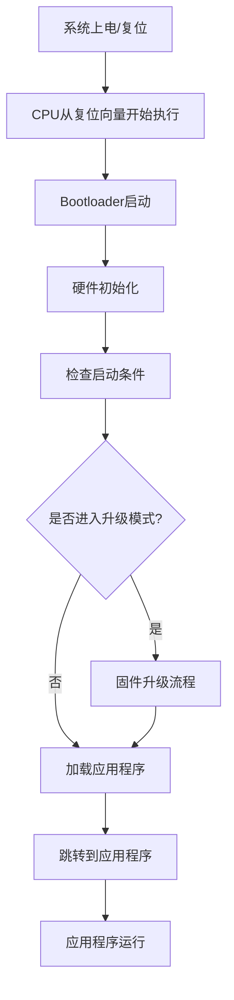
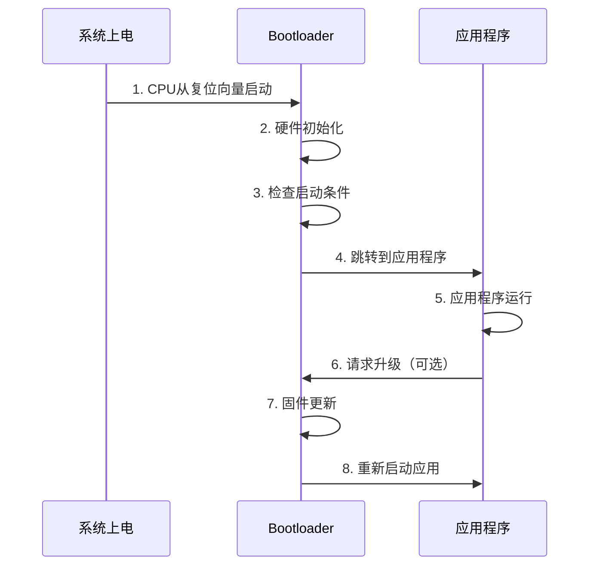
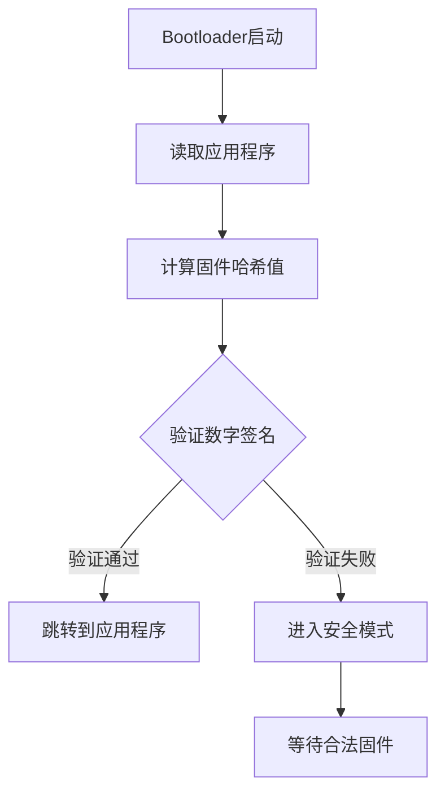

# Bootloader基础概念与工作原理

## 概述

Bootloader（引导加载程序）是嵌入式系统中至关重要的底层软件，它是系统上电后第一个运行的程序，负责初始化硬件、加载应用程序并将控制权转交给应用程序。理解Bootloader的工作原理是深入学习嵌入式系统的重要一步。

完成本文学习后，你将能够：

- 理解Bootloader的基本概念和作用
- 掌握嵌入式系统的启动流程
- 了解常见的Bootloader类型和特点
- 理解Bootloader的设计要点和应用场景
- 为后续开发自己的Bootloader打下基础

## 背景知识

### 什么是Bootloader

Bootloader是"Boot Loader"的缩写，中文译为"引导加载程序"或"启动加载程序"。它是嵌入式系统启动过程中的第一个软件程序，运行在操作系统或应用程序之前。

在PC机中，BIOS和GRUB就是典型的Bootloader。在嵌入式系统中，Bootloader的功能类似，但通常更加精简和定制化。

### 为什么需要Bootloader

在嵌入式系统中，Bootloader扮演着多个重要角色：

1. **硬件初始化**：配置CPU、内存、时钟等基本硬件
2. **程序加载**：从存储器中加载应用程序到内存
3. **固件更新**：支持在线升级（IAP/OTA）
4. **系统诊断**：提供调试和故障恢复功能
5. **安全验证**：验证应用程序的完整性和合法性


## 核心内容

### Bootloader的工作流程

典型的嵌入式系统启动流程可以分为以下几个阶段：



#### 阶段1：复位与启动

当系统上电或复位后，CPU会从预定义的复位向量地址开始执行。对于ARM Cortex-M系列，这个地址通常是Flash的起始地址（0x08000000）。

#### 阶段2：硬件初始化

Bootloader首先需要初始化必要的硬件资源：

- **时钟配置**：设置系统时钟频率
- **内存初始化**：配置RAM、Flash等存储器
- **外设初始化**：初始化串口、LED等基本外设
- **中断向量表**：设置中断向量表位置

#### 阶段3：启动条件判断

Bootloader需要判断系统应该进入哪种模式：

- **正常启动模式**：直接跳转到应用程序
- **升级模式**：进入固件更新流程
- **恢复模式**：系统故障时的恢复处理

判断依据可能包括：
- 特定按键是否按下
- 特定GPIO引脚的电平状态
- Flash中的标志位
- 串口接收到的特定命令

#### 阶段4：应用程序加载与跳转

如果判断需要启动应用程序，Bootloader会：

1. 验证应用程序的完整性（CRC校验）
2. 重新配置中断向量表指向应用程序
3. 设置堆栈指针（SP）
4. 跳转到应用程序的入口地址


### 常见的Bootloader类型

根据功能和复杂度，Bootloader可以分为以下几类：

#### 1. 简单跳转型Bootloader

**特点**：
- 功能最简单，代码量小（通常几百字节）
- 仅完成基本硬件初始化和程序跳转
- 不支持固件更新功能

**适用场景**：
- 不需要在线升级的简单应用
- 作为学习Bootloader原理的入门示例

**典型代码结构**：
```c
int main(void) {
    // 1. 基本硬件初始化
    SystemInit();
    
    // 2. 跳转到应用程序
    JumpToApplication(APP_ADDRESS);
    
    // 永远不会执行到这里
    while(1);
}
```

#### 2. IAP型Bootloader

**特点**：
- 支持在应用编程（In-Application Programming）
- 可以通过串口、USB、网络等接口接收新固件
- 包含固件下载、Flash擦写、校验等功能

**适用场景**：
- 需要现场升级的产品
- 开发调试阶段频繁更新固件
- 远程维护和功能更新

**核心功能**：
- 固件接收（UART、USB、CAN等）
- Flash擦除和编程
- CRC校验
- 固件备份和恢复

#### 3. 多级Bootloader

**特点**：
- 分为多个阶段（如一级Bootloader + 二级Bootloader）
- 一级Bootloader体积小，功能简单，负责加载二级Bootloader
- 二级Bootloader功能完整，支持复杂的升级和恢复机制

**适用场景**：
- 复杂的嵌入式Linux系统
- 需要高可靠性的工业设备
- 支持多种启动方式的系统

**典型结构**：
```
Flash布局：
├── 一级Bootloader (16KB)
├── 二级Bootloader (64KB)
├── 应用程序 (512KB)
└── 备份区域 (512KB)
```


### Bootloader的设计要点

#### 1. 内存布局规划

合理的内存布局是Bootloader设计的基础：

```
典型Flash布局示例（STM32F4，1MB Flash）：

0x08000000  ┌─────────────────────┐
            │  Bootloader         │  32KB
0x08008000  ├─────────────────────┤
            │  应用程序           │  480KB
0x08080000  ├─────────────────────┤
            │  备份区/升级缓存    │  480KB
0x080F8000  ├─────────────────────┤
            │  配置参数区         │  32KB
0x08100000  └─────────────────────┘
```

**设计原则**：
- Bootloader区域要足够大，预留扩展空间
- 应用程序起始地址要对齐（通常4KB或更大）
- 预留参数存储区用于保存配置和标志
- 考虑是否需要备份区用于固件恢复

#### 2. 中断向量表重定位

ARM Cortex-M系列支持中断向量表重定位，这是实现Bootloader的关键技术：

```c
// 设置中断向量表偏移
#define APP_ADDRESS 0x08008000

void JumpToApplication(uint32_t app_addr) {
    // 1. 检查应用程序栈指针是否有效
    if (((*(__IO uint32_t*)app_addr) & 0x2FFE0000) == 0x20000000) {
        // 2. 获取应用程序的栈指针和复位向量
        uint32_t app_sp = *(__IO uint32_t*)app_addr;
        uint32_t app_entry = *(__IO uint32_t*)(app_addr + 4);
        
        // 3. 关闭所有中断
        __disable_irq();
        
        // 4. 重新设置中断向量表偏移
        SCB->VTOR = app_addr;
        
        // 5. 设置栈指针
        __set_MSP(app_sp);
        
        // 6. 跳转到应用程序
        void (*app_reset_handler)(void) = (void*)app_entry;
        app_reset_handler();
    }
}
```

**关键点说明**：
- 栈指针（SP）通常指向RAM区域（0x20000000开始）
- 复位向量是应用程序的入口地址
- 跳转前必须关闭中断，避免冲突
- VTOR寄存器用于设置向量表偏移


#### 3. 通信接口选择

Bootloader需要选择合适的通信接口接收固件：

| 接口类型 | 优点 | 缺点 | 适用场景 |
|---------|------|------|---------|
| UART | 简单可靠，调试方便 | 速度较慢 | 开发调试，小容量固件 |
| USB | 速度快，即插即用 | 需要USB协议栈 | PC端升级，大容量固件 |
| CAN | 抗干扰强，支持多节点 | 需要CAN收发器 | 汽车电子，工业控制 |
| 以太网 | 速度快，远程升级 | 硬件成本高 | 网络设备，IoT产品 |
| SPI/I2C | 硬件简单 | 需要主机配合 | 模块间升级 |

#### 4. 固件校验机制

确保固件完整性和安全性的关键措施：

**CRC校验**：
```c
// 简单的CRC32校验示例
uint32_t CalculateCRC32(uint32_t *data, uint32_t length) {
    uint32_t crc = 0xFFFFFFFF;
    
    for (uint32_t i = 0; i < length; i++) {
        crc ^= data[i];
        for (int j = 0; j < 32; j++) {
            if (crc & 0x80000000) {
                crc = (crc << 1) ^ 0x04C11DB7;
            } else {
                crc = crc << 1;
            }
        }
    }
    
    return crc;
}

// 验证应用程序
bool VerifyApplication(uint32_t app_addr, uint32_t app_size) {
    uint32_t calculated_crc = CalculateCRC32((uint32_t*)app_addr, app_size/4);
    uint32_t stored_crc = *(__IO uint32_t*)(app_addr + app_size);
    
    return (calculated_crc == stored_crc);
}
```

**其他校验方法**：
- **MD5/SHA256**：更安全，但计算量大
- **数字签名**：最高安全级别，防止固件篡改
- **版本号检查**：防止降级攻击

#### 5. 容错与恢复机制

提高系统可靠性的设计：

**双区备份**：
- 维护两份固件（当前版本和备份版本）
- 升级失败时自动回滚到备份版本
- 适用于关键应用场景

**看门狗保护**：
```c
void Bootloader_Main(void) {
    // 初始化看门狗
    IWDG_Init(IWDG_PRESCALER_64, 4095);  // 约10秒超时
    
    while(1) {
        // 喂狗
        IWDG_ReloadCounter();
        
        // Bootloader主循环
        if (CheckUpgradeRequest()) {
            FirmwareUpgrade();
        } else {
            JumpToApplication(APP_ADDRESS);
        }
    }
}
```

**启动计数器**：
- 记录应用程序启动失败次数
- 连续失败超过阈值时进入恢复模式
- 防止错误固件导致系统无法启动


## 实践示例

### 示例1：最简单的Bootloader框架

这是一个最基础的Bootloader示例，展示核心概念：

```c
#include "stm32f4xx.h"

// 应用程序起始地址
#define APP_ADDRESS 0x08008000

// 跳转到应用程序
void JumpToApplication(uint32_t app_addr) {
    // 检查栈指针是否有效
    if (((*(__IO uint32_t*)app_addr) & 0x2FFE0000) == 0x20000000) {
        // 定义函数指针类型
        typedef void (*pFunction)(void);
        
        // 获取应用程序的栈指针和入口地址
        uint32_t app_sp = *(__IO uint32_t*)app_addr;
        uint32_t app_entry = *(__IO uint32_t*)(app_addr + 4);
        pFunction app_reset_handler = (pFunction)app_entry;
        
        // 关闭所有中断
        __disable_irq();
        
        // 关闭SysTick
        SysTick->CTRL = 0;
        SysTick->LOAD = 0;
        SysTick->VAL = 0;
        
        // 重新设置中断向量表
        SCB->VTOR = app_addr;
        
        // 设置主堆栈指针
        __set_MSP(app_sp);
        
        // 跳转到应用程序
        app_reset_handler();
    }
}

int main(void) {
    // 1. 系统初始化
    SystemInit();
    
    // 2. 初始化LED（用于指示）
    RCC->AHB1ENR |= RCC_AHB1ENR_GPIODEN;
    GPIOD->MODER |= GPIO_MODER_MODER12_0;  // PD12输出模式
    
    // 3. LED闪烁，表示Bootloader运行
    for (int i = 0; i < 3; i++) {
        GPIOD->BSRR = GPIO_BSRR_BS_12;  // LED亮
        for (volatile int j = 0; j < 1000000; j++);
        GPIOD->BSRR = GPIO_BSRR_BR_12;  // LED灭
        for (volatile int j = 0; j < 1000000; j++);
    }
    
    // 4. 跳转到应用程序
    JumpToApplication(APP_ADDRESS);
    
    // 如果跳转失败，LED常亮表示错误
    GPIOD->BSRR = GPIO_BSRR_BS_12;
    while(1);
}
```

**代码说明**：
- 第7-31行：`JumpToApplication`函数实现应用程序跳转
- 第10行：检查栈指针是否指向有效的RAM区域
- 第20行：关闭所有中断，避免冲突
- 第23-25行：关闭SysTick定时器
- 第28行：重新设置中断向量表偏移
- 第31行：设置堆栈指针并跳转

**运行结果**：
- 系统上电后，LED闪烁3次（表示Bootloader运行）
- 然后跳转到应用程序
- 如果应用程序无效，LED常亮


### 示例2：带按键检测的Bootloader

增加按键检测功能，支持进入升级模式：

```c
#include "stm32f4xx.h"

#define APP_ADDRESS 0x08008000
#define BUTTON_PIN  0  // PA0

// 初始化按键
void Button_Init(void) {
    RCC->AHB1ENR |= RCC_AHB1ENR_GPIOAEN;
    GPIOA->MODER &= ~GPIO_MODER_MODER0;  // 输入模式
    GPIOA->PUPDR |= GPIO_PUPDR_PUPDR0_1;  // 下拉
}

// 检测按键是否按下
bool Button_IsPressed(void) {
    return (GPIOA->IDR & GPIO_IDR_IDR_0) != 0;
}

// 延时函数
void Delay_Ms(uint32_t ms) {
    for (volatile uint32_t i = 0; i < ms * 4000; i++);
}

// 升级模式（简化版）
void UpgradeMode(void) {
    // 初始化串口等通信接口
    // UART_Init();
    
    // LED快速闪烁表示进入升级模式
    while(1) {
        GPIOD->ODR ^= GPIO_ODR_ODR_12;
        Delay_Ms(100);
        
        // 这里应该实现固件接收和烧写逻辑
        // 实际项目中需要完整的升级协议
    }
}

int main(void) {
    SystemInit();
    
    // 初始化LED和按键
    RCC->AHB1ENR |= RCC_AHB1ENR_GPIODEN;
    GPIOD->MODER |= GPIO_MODER_MODER12_0;
    Button_Init();
    
    // 检查按键状态
    if (Button_IsPressed()) {
        // 按键按下，进入升级模式
        UpgradeMode();
    }
    
    // 正常启动，跳转到应用程序
    JumpToApplication(APP_ADDRESS);
    
    // 跳转失败，LED常亮
    GPIOD->BSRR = GPIO_BSRR_BS_12;
    while(1);
}
```

**代码说明**：
- 第7-11行：初始化按键GPIO为输入模式，配置下拉
- 第14-16行：读取按键状态
- 第24-35行：升级模式的简化实现
- 第46-49行：检测按键，决定是否进入升级模式

**使用方法**：
1. 上电时按住按键，进入升级模式（LED快速闪烁）
2. 不按按键，正常启动应用程序


## 深入理解

### Bootloader与应用程序的关系

Bootloader和应用程序是两个独立的程序，但它们需要协同工作：



**关键点**：
- Bootloader和应用程序使用不同的Flash区域
- 两者的链接脚本需要配置不同的起始地址
- 应用程序的中断向量表需要重定位
- 两者可以通过共享RAM区域传递参数

### 链接脚本配置

Bootloader和应用程序需要不同的链接脚本配置：

**Bootloader链接脚本（部分）**：
```ld
MEMORY
{
  FLASH (rx)  : ORIGIN = 0x08000000, LENGTH = 32K
  RAM (rwx)   : ORIGIN = 0x20000000, LENGTH = 128K
}
```

**应用程序链接脚本（部分）**：
```ld
MEMORY
{
  FLASH (rx)  : ORIGIN = 0x08008000, LENGTH = 480K
  RAM (rwx)   : ORIGIN = 0x20000000, LENGTH = 128K
}
```

**注意事项**：
- Flash起始地址不同（Bootloader: 0x08000000, App: 0x08008000）
- RAM可以共享，但要注意数据不被覆盖
- 应用程序需要在启动代码中重新设置VTOR

### 性能考虑

Bootloader的性能影响系统启动时间：

**启动时间优化**：
1. **最小化初始化**：只初始化必要的硬件
2. **快速判断**：尽快决定是否跳转到应用程序
3. **并行处理**：在等待按键时可以进行其他初始化
4. **代码优化**：使用-O2或-O3优化级别编译

**典型启动时间**：
- 简单Bootloader：< 10ms
- 带校验的Bootloader：50-100ms
- 完整IAP Bootloader：100-500ms

### 安全性考虑

Bootloader是系统安全的第一道防线：

**安全措施**：
1. **固件签名验证**：使用数字签名防止固件篡改
2. **安全启动**：验证固件的合法性
3. **读保护**：启用Flash读保护，防止固件被读取
4. **写保护**：保护Bootloader区域不被意外擦除
5. **防回滚**：记录固件版本，防止降级攻击

**安全启动流程**：



### 最佳实践

基于实际项目经验，总结以下Bootloader开发最佳实践：

1. **预留足够空间**
   - Bootloader区域至少预留32KB
   - 为未来功能扩展留出余地
   - 考虑使用压缩算法减小代码体积

2. **完善的错误处理**
   - 所有关键操作都要有错误检查
   - 提供清晰的错误指示（LED、串口输出）
   - 实现故障恢复机制

3. **详细的日志输出**
   - 通过串口输出启动过程信息
   - 记录关键操作和错误信息
   - 便于现场调试和问题定位

4. **版本管理**
   - Bootloader和应用程序都要有版本号
   - 记录编译时间和Git提交号
   - 支持版本查询命令

5. **充分测试**
   - 测试各种启动场景
   - 测试固件升级的各种情况
   - 测试异常情况的处理
   - 进行长时间稳定性测试

## 常见问题

### Q1: Bootloader和应用程序可以共享外设吗？

**A**: 可以，但需要注意以下几点：
- Bootloader使用外设后，跳转前要完全关闭和复位
- 应用程序启动时要重新初始化所有使用的外设
- 避免在Bootloader中启用中断，或者跳转前完全关闭
- 如果必须共享，建议通过共享RAM区域传递状态信息

### Q2: 如何调试Bootloader？

**A**: Bootloader调试有以下几种方法：
1. **串口输出**：最常用，输出关键信息和状态
2. **LED指示**：用不同的闪烁模式表示不同状态
3. **JTAG/SWD调试**：使用调试器单步调试
4. **逻辑分析仪**：分析GPIO、串口等信号
5. **仿真器**：在PC上模拟Bootloader逻辑

### Q3: Bootloader升级失败怎么办？

**A**: 预防和恢复措施：
1. **双区备份**：保留旧版本固件，升级失败时回滚
2. **分段传输**：将固件分成多个包，每包都校验
3. **断点续传**：支持从中断处继续传输
4. **看门狗保护**：升级超时自动复位
5. **硬件恢复**：预留JTAG接口用于紧急恢复

### Q4: 如何实现安全的固件更新？

**A**: 安全固件更新的关键措施：
1. **加密传输**：使用AES等算法加密固件数据
2. **数字签名**：使用RSA等算法验证固件来源
3. **版本控制**：防止降级到有漏洞的旧版本
4. **完整性校验**：使用CRC、MD5或SHA256校验
5. **安全存储**：密钥存储在安全区域，防止泄露

### Q5: Bootloader占用多大空间合适？

**A**: 根据功能复杂度选择：
- **简单跳转型**：4-8KB足够
- **基础IAP型**：16-32KB
- **完整功能型**：32-64KB
- **带安全验证**：64-128KB

建议预留比实际需要大50%的空间，为未来扩展留出余地。


## 总结

本文全面介绍了Bootloader的基础知识，让我们回顾一下核心要点：

- **Bootloader的作用**：系统启动的第一个程序，负责硬件初始化、程序加载和固件更新
- **工作流程**：复位启动 → 硬件初始化 → 启动条件判断 → 应用程序加载与跳转
- **常见类型**：简单跳转型、IAP型、多级Bootloader，各有适用场景
- **设计要点**：内存布局规划、中断向量表重定位、通信接口选择、固件校验、容错恢复
- **实践技巧**：合理的Flash分区、完善的错误处理、详细的日志输出、充分的测试

掌握Bootloader的原理和设计方法，是深入学习嵌入式系统的重要一步。在实际项目中，Bootloader的可靠性直接影响产品的稳定性和可维护性。

## 延伸阅读

推荐进一步学习的资源：

- [从零实现一个简单的Bootloader](02-simple-bootloader.html) - 动手实践教程
- [U-Boot架构与移植概述](03-uboot-overview.html) - 学习专业Bootloader
- [IAP在线升级功能实现](../intermediate/01-iap-implementation.html) - 实现固件更新
- [安全启动(Secure Boot)技术详解](../intermediate/02-secure-boot.html) - 提升系统安全性

**官方文档**：
- [ARM Cortex-M编程手册](https://developer.arm.com/documentation/) - ARM官方文档
- [STM32参考手册](https://www.st.com/resource/en/reference_manual/) - STM32系列芯片手册
- [U-Boot官方文档](https://u-boot.readthedocs.io/) - 开源Bootloader项目

## 参考资料

1. ARM Cortex-M3权威指南 - Joseph Yiu
2. STM32F4xx参考手册 - STMicroelectronics
3. 嵌入式系统设计与实践 - Elecia White
4. U-Boot源码分析 - 开源社区
5. 嵌入式Linux系统开发完全手册 - 韦东山

---

**练习题**：

1. 解释Bootloader在嵌入式系统中的作用，并说明为什么需要Bootloader？
2. 画出一个典型的Flash内存布局图，标注Bootloader、应用程序和参数区的位置。
3. 编写一个简单的函数，实现从Bootloader跳转到应用程序的功能。
4. 思考：如果应用程序损坏，Bootloader应该如何处理？设计一个恢复方案。
5. 对比UART、USB和CAN三种通信接口在Bootloader中的优缺点。

**下一步**：建议学习 [从零实现一个简单的Bootloader](02-simple-bootloader.html)，通过实践加深理解。

