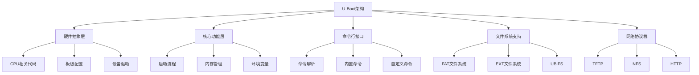
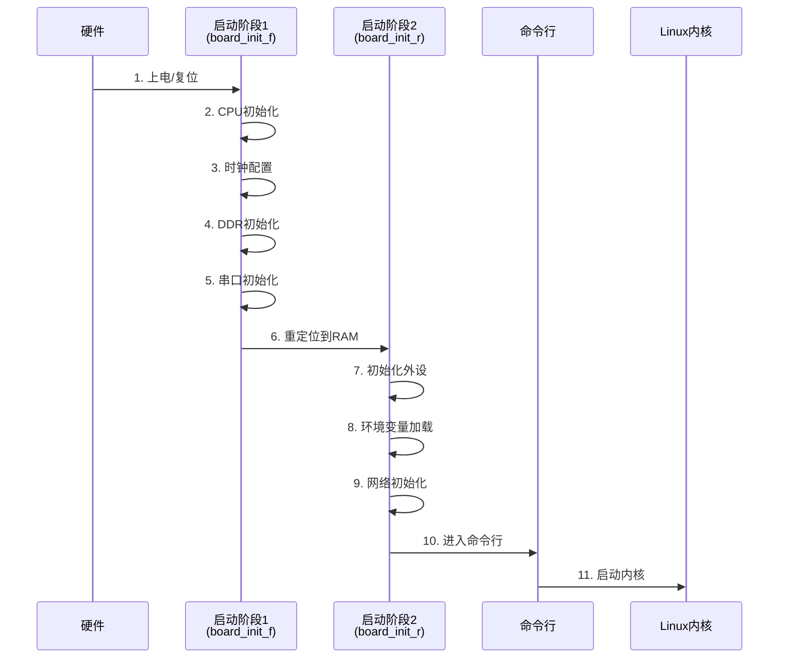
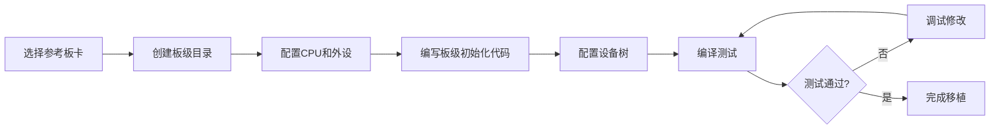

# U-Boot架构与移植概述

## 概述

U-Boot（Universal Boot Loader）是目前最流行的开源Bootloader之一，广泛应用于ARM、MIPS、PowerPC等多种架构的嵌入式Linux系统。它功能强大、可配置性强、支持的硬件平台众多，是嵌入式Linux开发的重要基础组件。

完成本文学习后，你将能够：

- 理解U-Boot的整体架构和设计思想
- 掌握U-Boot的配置系统和编译流程
- 熟悉U-Boot命令行接口的使用
- 了解U-Boot的移植流程和关键步骤
- 掌握常用的U-Boot命令和环境变量

## 背景知识

### 什么是U-Boot

U-Boot（Universal Boot Loader）是一个开源的、通用的Bootloader，最初由Wolfgang Denk开发，现在由DENX Software Engineering维护。它支持多种处理器架构和数百种开发板。

**主要特点**：

- **开源免费**：遵循GPL许可证，代码完全开放
- **跨平台支持**：支持ARM、MIPS、PowerPC、x86等多种架构
- **功能丰富**：支持网络启动、USB启动、SD卡启动等多种方式
- **可配置性强**：通过配置文件可以灵活定制功能
- **社区活跃**：有大量的文档和社区支持

### U-Boot的应用场景

U-Boot主要应用于以下场景：

1. **嵌入式Linux系统**：作为Linux内核的引导程序
2. **开发调试**：提供丰富的调试命令和网络下载功能
3. **系统恢复**：支持多种启动方式，便于系统恢复
4. **产品升级**：支持网络和USB等多种固件升级方式


## 核心内容

### U-Boot的整体架构

U-Boot采用分层设计，主要包括以下几个层次：



**目录结构**：

```
u-boot/
├── arch/                    # 架构相关代码
│   ├── arm/                # ARM架构
│   │   ├── cpu/           # CPU相关
│   │   ├── dts/           # 设备树
│   │   └── mach-*/        # 芯片厂商相关
│   ├── mips/              # MIPS架构
│   └── x86/               # x86架构
├── board/                  # 板级配置
│   ├── vendor/            # 厂商目录
│   └── board_name/        # 具体板卡
├── common/                 # 通用代码
│   ├── board_f.c          # 启动第一阶段
│   ├── board_r.c          # 启动第二阶段
│   └── cli.c              # 命令行接口
├── cmd/                    # 命令实现
│   ├── bootm.c            # boot命令
│   ├── net.c              # 网络命令
│   └── ...
├── drivers/                # 设备驱动
│   ├── serial/            # 串口驱动
│   ├── net/               # 网络驱动
│   ├── mmc/               # MMC/SD驱动
│   └── ...
├── fs/                     # 文件系统
│   ├── fat/               # FAT文件系统
│   ├── ext4/              # EXT4文件系统
│   └── ...
├── include/                # 头文件
│   └── configs/           # 板级配置头文件
├── net/                    # 网络协议栈
│   ├── tftp.c             # TFTP协议
│   └── nfs.c              # NFS协议
└── tools/                  # 工具程序
    ├── mkimage            # 镜像制作工具
    └── ...
```


### U-Boot的启动流程

U-Boot的启动过程分为两个主要阶段：



**阶段1：board_init_f（在Flash中执行）**

这个阶段在Flash中执行，主要完成最基本的硬件初始化：

1. **CPU初始化**：设置CPU工作模式、关闭缓存和MMU
2. **时钟配置**：配置系统时钟和外设时钟
3. **DDR初始化**：初始化DDR内存控制器
4. **串口初始化**：初始化调试串口，输出启动信息
5. **准备重定位**：计算重定位地址，准备将U-Boot复制到RAM

**阶段2：board_init_r（在RAM中执行）**

U-Boot重定位到RAM后，进入第二阶段：

1. **初始化BSS段**：清零BSS段
2. **初始化外设**：初始化网络、存储等外设
3. **加载环境变量**：从Flash或其他存储介质加载环境变量
4. **初始化命令行**：准备命令行接口
5. **执行自动启动**：如果设置了自动启动，执行bootcmd命令
6. **进入命令行**：等待用户输入命令

**关键代码片段**：

```c
// common/board_f.c - 启动阶段1
void board_init_f(ulong boot_flags)
{
    gd->flags = boot_flags;
    
    if (initcall_run_list(init_sequence_f))
        hang();
}

// common/board_r.c - 启动阶段2
void board_init_r(gd_t *new_gd, ulong dest_addr)
{
    gd = new_gd;
    
    if (initcall_run_list(init_sequence_r))
        hang();
    
    /* 进入主循环 */
    run_main_loop();
}
```


### U-Boot的配置系统

U-Boot使用Kconfig配置系统（类似Linux内核），提供灵活的配置方式。

**配置文件层次**：

```
配置层次结构：
├── Kconfig                          # 顶层配置文件
├── arch/arm/Kconfig                 # ARM架构配置
├── arch/arm/mach-stm32/Kconfig      # STM32系列配置
├── board/st/stm32f4/Kconfig         # 板级配置
└── configs/stm32f429-disco_defconfig # 默认配置
```

**配置方法**：

1. **使用默认配置**：
```bash
# 列出所有支持的板卡
make list_defconfigs

# 使用默认配置
make stm32f429-disco_defconfig
```

2. **图形化配置**：
```bash
# 使用menuconfig进行配置
make menuconfig
```

3. **修改配置文件**：
```bash
# 直接编辑.config文件
vi .config

# 或编辑板级配置头文件
vi include/configs/stm32f429-discovery.h
```

**常用配置选项**：

```c
// include/configs/stm32f429-discovery.h

/* 系统配置 */
#define CONFIG_SYS_ARCH         "arm"
#define CONFIG_SYS_CPU          "armv7m"
#define CONFIG_SYS_BOARD        "stm32f429-discovery"

/* 内存配置 */
#define CONFIG_SYS_SDRAM_BASE   0xD0000000
#define CONFIG_SYS_SDRAM_SIZE   (8 * 1024 * 1024)  /* 8MB */
#define CONFIG_SYS_LOAD_ADDR    0xD0400000

/* Flash配置 */
#define CONFIG_SYS_FLASH_BASE   0x08000000
#define CONFIG_SYS_MAX_FLASH_SECT   12

/* 串口配置 */
#define CONFIG_BAUDRATE         115200
#define CONFIG_SYS_SERIAL1      1

/* 网络配置 */
#define CONFIG_IPADDR           192.168.1.100
#define CONFIG_SERVERIP         192.168.1.1
#define CONFIG_NETMASK          255.255.255.0

/* 启动配置 */
#define CONFIG_BOOTDELAY        3
#define CONFIG_BOOTCOMMAND      "run bootcmd_mmc"

/* 环境变量配置 */
#define CONFIG_ENV_SIZE         (16 * 1024)
#define CONFIG_ENV_OFFSET       0x40000
```


### U-Boot命令行接口

U-Boot提供了强大的命令行接口，支持丰富的命令集。

**命令分类**：

| 类别 | 命令示例 | 功能说明 |
|------|---------|---------|
| 信息查看 | `bdinfo`, `version`, `printenv` | 查看板卡信息、版本、环境变量 |
| 内存操作 | `md`, `mm`, `mw`, `cp` | 内存显示、修改、写入、复制 |
| Flash操作 | `erase`, `cp.b`, `protect` | Flash擦除、编程、保护 |
| 网络操作 | `ping`, `tftp`, `nfs` | 网络测试、文件下载 |
| 存储操作 | `mmc`, `fatload`, `ext4load` | MMC/SD卡、文件系统操作 |
| 启动命令 | `boot`, `bootm`, `bootz` | 启动内核 |
| 环境变量 | `setenv`, `saveenv`, `run` | 设置、保存、执行环境变量 |

**常用命令详解**：

**1. 信息查看命令**

```bash
# 查看版本信息
U-Boot> version
U-Boot 2023.01 (Jan 15 2024 - 10:00:00 +0800)

# 查看板卡信息
U-Boot> bdinfo
arch_number = 0x00000000
boot_params = 0xD0000100
DRAM bank   = 0x00000000
-> start    = 0xD0000000
-> size     = 0x00800000
baudrate    = 115200 bps

# 查看环境变量
U-Boot> printenv
bootdelay=3
baudrate=115200
ipaddr=192.168.1.100
serverip=192.168.1.1
bootcmd=run bootcmd_mmc
```

**2. 内存操作命令**

```bash
# 显示内存内容（md = memory display）
U-Boot> md 0xD0000000 10
d0000000: 00000000 00000000 00000000 00000000    ................
d0000010: 00000000 00000000 00000000 00000000    ................
d0000020: 00000000 00000000 00000000 00000000    ................
d0000030: 00000000 00000000 00000000 00000000    ................

# 修改内存（mm = memory modify）
U-Boot> mm 0xD0000000
d0000000: 00000000 ? 12345678
d0000004: 00000000 ? q

# 写入内存（mw = memory write）
U-Boot> mw 0xD0000000 0xAABBCCDD 4

# 复制内存（cp = copy）
U-Boot> cp.b 0xD0000000 0xD0001000 100
```

**3. 网络操作命令**

```bash
# 测试网络连接
U-Boot> ping 192.168.1.1
Using ethernet@40028000 device
host 192.168.1.1 is alive

# 通过TFTP下载文件
U-Boot> tftp 0xD0400000 zImage
Using ethernet@40028000 device
TFTP from server 192.168.1.1; our IP address is 192.168.1.100
Filename 'zImage'.
Load address: 0xd0400000
Loading: #################################################################
         4.2 MiB/s
done
Bytes transferred = 4567890 (45b252 hex)

# 设置网络参数
U-Boot> setenv ipaddr 192.168.1.100
U-Boot> setenv serverip 192.168.1.1
U-Boot> setenv netmask 255.255.255.0
U-Boot> saveenv
```

**4. 存储操作命令**

```bash
# 列出MMC设备
U-Boot> mmc list
STM32 SD/MMC: 0

# 选择MMC设备
U-Boot> mmc dev 0
switch to partitions #0, OK
mmc0 is current device

# 查看MMC信息
U-Boot> mmc info
Device: STM32 SD/MMC
Manufacturer ID: 3
OEM: 5344
Name: SC16G
Bus Speed: 50000000
Mode: SD High Speed (50MHz)
Rd Block Len: 512
SD version 3.0
High Capacity: Yes
Capacity: 14.8 GiB

# 从FAT文件系统加载文件
U-Boot> fatload mmc 0:1 0xD0400000 zImage
reading zImage
4567890 bytes read in 234 ms (18.6 MiB/s)

# 从EXT4文件系统加载文件
U-Boot> ext4load mmc 0:2 0xD0400000 /boot/zImage
4567890 bytes read in 234 ms (18.6 MiB/s)
```

**5. 启动命令**

```bash
# 启动内核（bootm用于uImage格式）
U-Boot> bootm 0xD0400000

# 启动内核（bootz用于zImage格式）
U-Boot> bootz 0xD0400000 - 0xD0800000
## Flattened Device Tree blob at d0800000
   Booting using the fdt blob at 0xd0800000
   Loading Device Tree to 0fff4000, end 0ffff123 ... OK

Starting kernel ...
```


### U-Boot环境变量

环境变量是U-Boot的重要特性，用于配置启动参数和行为。

**常用环境变量**：

| 变量名 | 说明 | 示例值 |
|--------|------|--------|
| `bootdelay` | 启动延时（秒） | `3` |
| `bootcmd` | 自动启动命令 | `run bootcmd_mmc` |
| `bootargs` | 内核启动参数 | `console=ttyS0,115200 root=/dev/mmcblk0p2` |
| `ipaddr` | 本机IP地址 | `192.168.1.100` |
| `serverip` | 服务器IP地址 | `192.168.1.1` |
| `netmask` | 子网掩码 | `255.255.255.0` |
| `ethaddr` | MAC地址 | `00:11:22:33:44:55` |
| `loadaddr` | 加载地址 | `0xD0400000` |

**环境变量操作**：

```bash
# 查看所有环境变量
U-Boot> printenv

# 查看特定环境变量
U-Boot> printenv bootcmd
bootcmd=run bootcmd_mmc

# 设置环境变量
U-Boot> setenv myvar "hello world"

# 删除环境变量
U-Boot> setenv myvar

# 保存环境变量到Flash
U-Boot> saveenv
Saving Environment to Flash...
. done

# 执行环境变量中的命令
U-Boot> run bootcmd
```

**复杂启动脚本示例**：

```bash
# 设置从MMC启动的完整脚本
U-Boot> setenv bootcmd_mmc 'mmc dev 0; fatload mmc 0:1 ${loadaddr} zImage; fatload mmc 0:1 ${fdtaddr} stm32f429.dtb; bootz ${loadaddr} - ${fdtaddr}'

# 设置从网络启动的脚本
U-Boot> setenv bootcmd_net 'tftp ${loadaddr} zImage; tftp ${fdtaddr} stm32f429.dtb; bootz ${loadaddr} - ${fdtaddr}'

# 设置内核启动参数
U-Boot> setenv bootargs 'console=ttyS0,115200 root=/dev/mmcblk0p2 rootwait rw'

# 设置默认启动命令
U-Boot> setenv bootcmd 'run bootcmd_mmc'

# 保存配置
U-Boot> saveenv
```


### U-Boot移植流程

将U-Boot移植到新的硬件平台需要以下步骤：

**移植流程图**：



**详细步骤**：

**步骤1：选择参考板卡**

选择一个与目标板卡相似的已支持板卡作为参考：

```bash
# 查找相似的板卡
cd u-boot
find board/ -name "*stm32*"

# 假设选择stm32f429-discovery作为参考
ls board/st/stm32f429-discovery/
```

**步骤2：创建板级目录**

```bash
# 创建新板卡目录
mkdir -p board/mycompany/myboard

# 复制参考板卡的文件
cp board/st/stm32f429-discovery/* board/mycompany/myboard/

# 创建配置文件
touch configs/myboard_defconfig
```

**步骤3：修改板级配置**

编辑`board/mycompany/myboard/Kconfig`：

```kconfig
if TARGET_MYBOARD

config SYS_BOARD
    default "myboard"

config SYS_VENDOR
    default "mycompany"

config SYS_CONFIG_NAME
    default "myboard"

endif
```

编辑`include/configs/myboard.h`：

```c
#ifndef __CONFIG_H
#define __CONFIG_H

/* CPU配置 */
#define CONFIG_STM32F4
#define CONFIG_SYS_CPU              "armv7m"

/* 内存配置 */
#define CONFIG_SYS_SDRAM_BASE       0xD0000000
#define CONFIG_SYS_SDRAM_SIZE       (16 * 1024 * 1024)  /* 16MB */
#define CONFIG_SYS_LOAD_ADDR        0xD0400000
#define CONFIG_SYS_INIT_SP_ADDR     0x20030000

/* Flash配置 */
#define CONFIG_SYS_FLASH_BASE       0x08000000
#define CONFIG_SYS_MAX_FLASH_SECT   12

/* 串口配置 */
#define CONFIG_BAUDRATE             115200

/* 环境变量配置 */
#define CONFIG_ENV_SIZE             (16 * 1024)
#define CONFIG_ENV_OFFSET           0x40000

/* 启动配置 */
#define CONFIG_BOOTDELAY            3
#define CONFIG_BOOTCOMMAND          "run bootcmd_mmc"

#endif /* __CONFIG_H */
```

**步骤4：编写板级初始化代码**

编辑`board/mycompany/myboard/myboard.c`：

```c
#include <common.h>
#include <dm.h>
#include <asm/io.h>
#include <asm/arch/stm32.h>

DECLARE_GLOBAL_DATA_PTR;

int board_early_init_f(void)
{
    /* 早期初始化：时钟、GPIO等 */
    return 0;
}

int board_init(void)
{
    /* 板级初始化 */
    gd->bd->bi_boot_params = CONFIG_SYS_SDRAM_BASE + 0x100;
    
    return 0;
}

int dram_init(void)
{
    /* DDR初始化 */
    gd->ram_size = CONFIG_SYS_SDRAM_SIZE;
    
    return 0;
}

int dram_init_banksize(void)
{
    /* 设置内存bank */
    gd->bd->bi_dram[0].start = CONFIG_SYS_SDRAM_BASE;
    gd->bd->bi_dram[0].size = CONFIG_SYS_SDRAM_SIZE;
    
    return 0;
}

#ifdef CONFIG_MISC_INIT_R
int misc_init_r(void)
{
    /* 其他初始化 */
    return 0;
}
#endif
```

**步骤5：配置设备树**

创建或修改设备树文件`arch/arm/dts/myboard.dts`：

```dts
/dts-v1/;
#include "stm32f429.dtsi"

/ {
    model = "MyCompany MyBoard";
    compatible = "mycompany,myboard", "st,stm32f429";

    chosen {
        bootargs = "console=ttyS0,115200 root=/dev/mmcblk0p2";
        stdout-path = "serial0:115200n8";
    };

    memory@d0000000 {
        device_type = "memory";
        reg = <0xd0000000 0x1000000>;  /* 16MB */
    };

    aliases {
        serial0 = &usart1;
    };
};

&usart1 {
    status = "okay";
};

&sdio {
    status = "okay";
    cd-gpios = <&gpioc 13 0>;
};
```

**步骤6：编译和测试**

```bash
# 配置
make myboard_defconfig

# 编译
make -j8

# 生成的文件
ls -lh u-boot.bin u-boot.elf

# 下载到板卡测试
st-flash write u-boot.bin 0x08000000
```


## 实践示例

### 示例1：编译U-Boot

**环境准备**：

```bash
# 安装交叉编译工具链
sudo apt-get install gcc-arm-linux-gnueabihf

# 下载U-Boot源码
git clone https://github.com/u-boot/u-boot.git
cd u-boot

# 查看版本
git tag | tail -n 10
git checkout v2023.01
```

**编译步骤**：

```bash
# 设置交叉编译工具链
export CROSS_COMPILE=arm-linux-gnueabihf-
export ARCH=arm

# 查看支持的板卡
make list_defconfigs | grep stm32

# 配置（以stm32f429-discovery为例）
make stm32f429-disco_defconfig

# 可选：图形化配置
make menuconfig

# 编译
make -j$(nproc)

# 查看生成的文件
ls -lh u-boot.bin u-boot.elf u-boot.map
```

**输出文件说明**：

- `u-boot.bin`：二进制镜像，用于烧录到Flash
- `u-boot.elf`：ELF格式，包含调试信息
- `u-boot.map`：符号表，用于调试
- `u-boot.srec`：S-Record格式
- `u-boot.img`：带头部的镜像（mkimage生成）

### 示例2：通过TFTP下载内核

**服务器端配置**（Ubuntu）：

```bash
# 安装TFTP服务器
sudo apt-get install tftpd-hpa

# 配置TFTP服务器
sudo vi /etc/default/tftpd-hpa
# 内容：
# TFTP_USERNAME="tftp"
# TFTP_DIRECTORY="/var/lib/tftpboot"
# TFTP_ADDRESS=":69"
# TFTP_OPTIONS="--secure"

# 创建TFTP目录
sudo mkdir -p /var/lib/tftpboot
sudo chmod 777 /var/lib/tftpboot

# 复制内核和设备树到TFTP目录
sudo cp zImage /var/lib/tftpboot/
sudo cp stm32f429.dtb /var/lib/tftpboot/

# 重启TFTP服务
sudo systemctl restart tftpd-hpa
```

**U-Boot端操作**：

```bash
# 设置网络参数
U-Boot> setenv ipaddr 192.168.1.100
U-Boot> setenv serverip 192.168.1.1
U-Boot> setenv netmask 255.255.255.0

# 测试网络连接
U-Boot> ping 192.168.1.1
host 192.168.1.1 is alive

# 下载内核
U-Boot> tftp ${loadaddr} zImage
Using ethernet@40028000 device
TFTP from server 192.168.1.1; our IP address is 192.168.1.100
Filename 'zImage'.
Load address: 0xd0400000
Loading: #################################################################
         4.2 MiB/s
done

# 下载设备树
U-Boot> tftp ${fdtaddr} stm32f429.dtb
Using ethernet@40028000 device
TFTP from server 192.168.1.1; our IP address is 192.168.1.100
Filename 'stm32f429.dtb'.
Load address: 0xd0800000
Loading: ##
         1.5 MiB/s
done

# 启动内核
U-Boot> bootz ${loadaddr} - ${fdtaddr}

# 保存为自动启动脚本
U-Boot> setenv bootcmd_net 'tftp ${loadaddr} zImage; tftp ${fdtaddr} stm32f429.dtb; bootz ${loadaddr} - ${fdtaddr}'
U-Boot> setenv bootcmd 'run bootcmd_net'
U-Boot> saveenv
```

### 示例3：从SD卡启动Linux

**准备SD卡**：

```bash
# 分区（在Linux主机上）
sudo fdisk /dev/sdX

# 创建两个分区：
# 分区1：FAT32，100MB，用于存放内核和设备树
# 分区2：EXT4，剩余空间，用于根文件系统

# 格式化分区
sudo mkfs.vfat -F 32 /dev/sdX1
sudo mkfs.ext4 /dev/sdX2

# 挂载分区
sudo mkdir -p /mnt/boot /mnt/rootfs
sudo mount /dev/sdX1 /mnt/boot
sudo mount /dev/sdX2 /mnt/rootfs

# 复制内核和设备树到boot分区
sudo cp zImage /mnt/boot/
sudo cp stm32f429.dtb /mnt/boot/

# 解压根文件系统到rootfs分区
sudo tar -xvf rootfs.tar.gz -C /mnt/rootfs/

# 卸载
sudo umount /mnt/boot /mnt/rootfs
```

**U-Boot配置**：

```bash
# 设置从SD卡启动
U-Boot> setenv bootargs 'console=ttyS0,115200 root=/dev/mmcblk0p2 rootwait rw'
U-Boot> setenv bootcmd_mmc 'mmc dev 0; fatload mmc 0:1 ${loadaddr} zImage; fatload mmc 0:1 ${fdtaddr} stm32f429.dtb; bootz ${loadaddr} - ${fdtaddr}'
U-Boot> setenv bootcmd 'run bootcmd_mmc'
U-Boot> saveenv

# 重启测试
U-Boot> reset
```


## 深入理解

### U-Boot与设备树

设备树（Device Tree）是描述硬件信息的数据结构，U-Boot和Linux内核都使用它来识别硬件。

**设备树的作用**：

1. **硬件描述**：描述CPU、内存、外设等硬件信息
2. **驱动匹配**：内核根据设备树加载相应的驱动
3. **参数传递**：U-Boot可以修改设备树，传递参数给内核
4. **平台无关**：同一份内核可以支持多个硬件平台

**设备树文件格式**：

```dts
/dts-v1/;

/ {
    model = "STM32F429 Discovery";
    compatible = "st,stm32f429i-disco", "st,stm32f429";
    
    #address-cells = <1>;
    #size-cells = <1>;
    
    chosen {
        bootargs = "console=ttyS0,115200";
        stdout-path = "serial0:115200n8";
    };
    
    memory@d0000000 {
        device_type = "memory";
        reg = <0xd0000000 0x800000>;  /* 8MB SDRAM */
    };
    
    aliases {
        serial0 = &usart1;
        ethernet0 = &mac;
    };
    
    soc {
        usart1: serial@40011000 {
            compatible = "st,stm32-uart";
            reg = <0x40011000 0x400>;
            interrupts = <37>;
            clocks = <&rcc 0 164>;
            status = "okay";
        };
    };
};
```

**U-Boot中操作设备树**：

```bash
# 查看设备树
U-Boot> fdt addr ${fdtaddr}
U-Boot> fdt print /

# 修改设备树节点
U-Boot> fdt set /chosen bootargs "console=ttyS0,115200 root=/dev/mmcblk0p2"

# 添加节点
U-Boot> fdt mknode / mynode
U-Boot> fdt set /mynode myprop "myvalue"
```

### U-Boot的内存布局

理解U-Boot的内存布局对于调试和优化非常重要：

```
典型ARM系统内存布局：

Flash (0x08000000)
├── U-Boot (256KB)
├── 环境变量 (64KB)
├── Linux内核 (4MB)
└── 根文件系统 (剩余)

RAM (0xD0000000)
├── U-Boot重定位区 (顶部)
├── 堆栈 (向下增长)
├── 全局数据 (gd)
├── 板级数据 (bd)
├── 内核加载区 (loadaddr)
├── 设备树加载区 (fdtaddr)
└── 初始RAM盘 (ramdisk_addr)
```

**关键地址定义**：

```c
// include/configs/myboard.h

/* RAM地址 */
#define CONFIG_SYS_SDRAM_BASE       0xD0000000
#define CONFIG_SYS_SDRAM_SIZE       0x00800000  /* 8MB */

/* 加载地址 */
#define CONFIG_SYS_LOAD_ADDR        0xD0400000  /* 内核加载地址 */
#define CONFIG_SYS_FDT_ADDR         0xD0800000  /* 设备树加载地址 */
#define CONFIG_SYS_RAMDISK_ADDR     0xD0900000  /* RAM盘加载地址 */

/* U-Boot重定位地址（自动计算） */
#define CONFIG_SYS_TEXT_BASE        0xD0000000
```

### U-Boot的启动参数

U-Boot通过`bootargs`环境变量向Linux内核传递启动参数：

**常用启动参数**：

```bash
# 基本参数
console=ttyS0,115200          # 控制台设备和波特率
root=/dev/mmcblk0p2           # 根文件系统设备
rootwait                      # 等待根设备就绪
rw                            # 以读写方式挂载根文件系统

# 调试参数
loglevel=7                    # 内核日志级别（0-7）
debug                         # 启用调试输出
earlyprintk                   # 早期打印

# 网络参数
ip=192.168.1.100:192.168.1.1:192.168.1.1:255.255.255.0:myboard:eth0:off
# 格式：ip:server:gateway:netmask:hostname:device:autoconf

# NFS根文件系统
root=/dev/nfs
nfsroot=192.168.1.1:/nfs/rootfs,v3,tcp
ip=dhcp

# 完整示例
setenv bootargs 'console=ttyS0,115200 root=/dev/mmcblk0p2 rootwait rw loglevel=7'
```

### U-Boot的调试技巧

**1. 串口调试**

最基本的调试方法，通过串口输出信息：

```c
// 在代码中添加调试输出
printf("Debug: value = 0x%08x\n", value);
debug("Debug info: %s\n", str);  // 只在DEBUG模式下输出
```

**2. 使用JTAG调试器**

```bash
# 使用GDB调试U-Boot
arm-linux-gnueabihf-gdb u-boot

# 连接到目标板
(gdb) target remote localhost:3333

# 设置断点
(gdb) break board_init_f
(gdb) break board_init_r

# 运行
(gdb) continue

# 查看变量
(gdb) print gd
(gdb) print *gd
```

**3. 内存转储**

```bash
# 转储内存内容
U-Boot> md 0xD0000000 100

# 转储到文件（通过TFTP）
U-Boot> mw.b 0xD0000000 0xAA 1000
U-Boot> tftp 192.168.1.1:dump.bin 0xD0000000 1000
```

**4. 性能分析**

```bash
# 测量启动时间
U-Boot> setenv bootdelay 0
U-Boot> time run bootcmd

# 查看各阶段耗时
# 在代码中添加时间戳
printf("Time: %lu ms\n", get_timer(0));
```


## 常见问题

### Q1: U-Boot和Bootloader有什么区别？

**A**: Bootloader是一个通用概念，指系统启动时运行的第一个程序。U-Boot是Bootloader的一种具体实现，是一个开源的、功能强大的Bootloader项目。其他常见的Bootloader还包括：
- **GRUB**：主要用于PC和服务器
- **Barebox**：U-Boot的一个分支，更现代化
- **RedBoot**：较老的开源Bootloader
- **厂商专有Bootloader**：如高通的LK、MTK的LittleKernel等

### Q2: U-Boot支持哪些文件系统？

**A**: U-Boot支持多种文件系统，主要包括：
- **FAT/FAT32**：最常用，兼容性好
- **EXT2/EXT3/EXT4**：Linux原生文件系统
- **UBIFS**：专为Flash设计的文件系统
- **JFFS2**：较老的Flash文件系统
- **SquashFS**：只读压缩文件系统
- **CRAMFS**：只读压缩文件系统

选择文件系统时需要考虑：
- 存储介质类型（SD卡、eMMC、NOR Flash、NAND Flash）
- 读写需求（只读还是读写）
- 性能要求
- 空间限制

### Q3: 如何在U-Boot中添加自定义命令？

**A**: 添加自定义命令的步骤：

1. 在`cmd/`目录下创建新文件，例如`cmd/mycmd.c`：

```c
#include <common.h>
#include <command.h>

static int do_mycmd(struct cmd_tbl *cmdtp, int flag, int argc, char *const argv[])
{
    printf("My custom command executed!\n");
    
    if (argc > 1) {
        printf("Argument: %s\n", argv[1]);
    }
    
    return 0;
}

U_BOOT_CMD(
    mycmd,      /* 命令名 */
    2,          /* 最大参数数量 */
    1,          /* 可重复执行 */
    do_mycmd,   /* 实现函数 */
    "my custom command",  /* 简短描述 */
    "mycmd [arg]\n"       /* 详细帮助 */
    "    - Execute my custom command\n"
    "    - Optional argument can be provided"
);
```

2. 在`cmd/Makefile`中添加：

```makefile
obj-y += mycmd.o
```

3. 重新编译U-Boot：

```bash
make clean
make
```

### Q4: U-Boot启动很慢，如何优化？

**A**: 优化U-Boot启动时间的方法：

1. **减少启动延时**：
```bash
setenv bootdelay 0
```

2. **禁用不需要的功能**：
```bash
# 在配置中禁用不需要的功能
make menuconfig
# 取消不需要的驱动和命令
```

3. **优化DDR初始化**：
- 使用更快的DDR配置
- 减少DDR训练时间

4. **使用压缩内核**：
- 使用zImage而不是uImage
- 启用内核压缩

5. **并行初始化**：
- 在可能的情况下并行初始化外设

6. **使用Falcon模式**：
- 跳过U-Boot命令行，直接启动内核
- 适用于不需要交互的产品

### Q5: 如何备份和恢复U-Boot？

**A**: 备份和恢复U-Boot的方法：

**备份**：

```bash
# 方法1：使用st-flash（STM32）
st-flash read uboot_backup.bin 0x08000000 0x40000

# 方法2：在U-Boot中通过TFTP上传
U-Boot> tftp 192.168.1.1:uboot_backup.bin 0x08000000 0x40000

# 方法3：使用J-Link
JLinkExe -device STM32F429ZI -if SWD -speed 4000
J-Link> savebin uboot_backup.bin 0x08000000 0x40000
```

**恢复**：

```bash
# 方法1：使用st-flash
st-flash write uboot_backup.bin 0x08000000

# 方法2：使用J-Link
JLinkExe -device STM32F429ZI -if SWD -speed 4000
J-Link> loadbin uboot_backup.bin 0x08000000
J-Link> verifybin uboot_backup.bin 0x08000000

# 方法3：在U-Boot中（如果U-Boot还能运行）
U-Boot> tftp ${loadaddr} u-boot.bin
U-Boot> protect off 0x08000000 +${filesize}
U-Boot> erase 0x08000000 +${filesize}
U-Boot> cp.b ${loadaddr} 0x08000000 ${filesize}
```

**注意事项**：
- 备份前确认U-Boot工作正常
- 恢复时要小心，错误的操作可能导致板卡无法启动
- 建议保留JTAG/SWD接口用于紧急恢复
- 定期备份U-Boot和环境变量

### Q6: U-Boot环境变量存储在哪里？

**A**: U-Boot环境变量可以存储在多个位置：

1. **Flash**：最常用，掉电不丢失
```c
#define CONFIG_ENV_IS_IN_FLASH
#define CONFIG_ENV_OFFSET       0x40000
#define CONFIG_ENV_SIZE         0x10000
```

2. **EEPROM**：适合小容量存储
```c
#define CONFIG_ENV_IS_IN_EEPROM
#define CONFIG_ENV_OFFSET       0x0
#define CONFIG_ENV_SIZE         0x1000
```

3. **MMC/SD卡**：灵活，易于修改
```c
#define CONFIG_ENV_IS_IN_MMC
#define CONFIG_SYS_MMC_ENV_DEV  0
#define CONFIG_ENV_OFFSET       0x100000
```

4. **NAND Flash**：大容量Flash
```c
#define CONFIG_ENV_IS_IN_NAND
#define CONFIG_ENV_OFFSET       0x100000
```

5. **RAM**：临时存储，掉电丢失（用于测试）
```c
#define CONFIG_ENV_IS_NOWHERE
```

选择存储位置时考虑：
- 可靠性（Flash > EEPROM > SD卡）
- 容量需求
- 读写速度
- 成本


## 总结

本文全面介绍了U-Boot这一强大的开源Bootloader，让我们回顾一下核心要点：

- **U-Boot架构**：分层设计，包括硬件抽象层、核心功能层、命令行接口、文件系统和网络协议栈
- **启动流程**：分为两个阶段，第一阶段在Flash中执行基本初始化，第二阶段在RAM中完成完整初始化
- **配置系统**：使用Kconfig配置系统，支持灵活的功能定制
- **命令行接口**：提供丰富的命令集，支持内存操作、网络下载、文件系统访问等
- **环境变量**：通过环境变量配置启动参数和行为，支持复杂的启动脚本
- **移植流程**：选择参考板卡、创建板级目录、配置硬件、编写初始化代码、配置设备树

U-Boot作为嵌入式Linux系统的重要组成部分，其强大的功能和灵活的配置使其成为开发和调试的得力工具。掌握U-Boot的使用和移植，是深入学习嵌入式Linux开发的必经之路。

**关键收获**：

1. U-Boot不仅是一个Bootloader，更是一个功能完整的开发和调试平台
2. 理解U-Boot的架构和启动流程，有助于快速定位和解决问题
3. 熟练使用U-Boot命令和环境变量，可以大大提高开发效率
4. U-Boot的移植需要对硬件有深入了解，但有丰富的参考资料可以借鉴
5. 设备树是连接U-Boot和Linux内核的重要桥梁

## 延伸阅读

推荐进一步学习的资源：

**相关文章**：
- [Bootloader基础概念与工作原理](01-bootloader-basics.html) - 回顾基础知识
- [从零实现一个简单的Bootloader](02-simple-bootloader.html) - 实践简单Bootloader
- [固件分区与内存布局设计](04-firmware-partition.html) - 深入理解内存布局
- [板级支持包(BSP)开发](../../06-device-tree-bsp/intermediate/02-bsp-development.html) - 学习BSP开发

**官方文档**：
- [U-Boot官方文档](https://u-boot.readthedocs.io/) - 最权威的参考资料
- [U-Boot源码](https://github.com/u-boot/u-boot) - 学习源码是最好的方式
- [Device Tree规范](https://www.devicetree.org/) - 了解设备树标准

**推荐书籍**：
- 《嵌入式Linux系统开发完全手册》 - 韦东山
- 《Building Embedded Linux Systems》 - Karim Yaghmour
- 《Mastering Embedded Linux Programming》 - Chris Simmonds

**在线资源**：
- [U-Boot邮件列表](https://lists.denx.de/pipermail/u-boot/) - 社区讨论
- [DENX U-Boot Wiki](https://www.denx.de/wiki/U-Boot) - 官方Wiki
- [Bootlin培训资料](https://bootlin.com/training/) - 免费的嵌入式Linux培训资料

## 参考资料

1. U-Boot官方文档 - DENX Software Engineering
2. U-Boot源码分析 - 开源社区
3. 嵌入式Linux系统开发完全手册 - 韦东山
4. Building Embedded Linux Systems - Karim Yaghmour
5. Device Tree规范 - devicetree.org
6. ARM Cortex-A系列编程手册 - ARM Ltd.
7. STM32MP1系列参考手册 - STMicroelectronics

---

**练习题**：

1. 解释U-Boot的两阶段启动流程，说明每个阶段的主要任务和执行位置。
2. 列举至少5个常用的U-Boot命令，并说明它们的用途。
3. 编写一个U-Boot启动脚本，实现从SD卡启动Linux内核，包括加载内核和设备树。
4. 说明U-Boot环境变量的作用，并解释`bootargs`、`bootcmd`、`bootdelay`这三个变量的含义。
5. 描述将U-Boot移植到新硬件平台的主要步骤，并说明每个步骤的关键点。
6. 解释设备树在U-Boot和Linux内核中的作用，以及U-Boot如何将设备树传递给内核。
7. 设计一个Flash分区方案，包括U-Boot、环境变量、内核和根文件系统，并说明每个分区的大小和位置。

**实践任务**：

1. **编译U-Boot**：下载U-Boot源码，选择一个支持的开发板，完成编译过程。
2. **配置网络启动**：在U-Boot中配置网络参数，通过TFTP下载并启动Linux内核。
3. **自定义命令**：在U-Boot中添加一个自定义命令，实现特定功能（如LED控制）。
4. **环境变量脚本**：编写复杂的启动脚本，支持多种启动方式（SD卡、网络、USB）。
5. **移植练习**：选择一个相似的参考板卡，尝试移植U-Boot到你的目标硬件。

**下一步**：建议学习 [固件分区与内存布局设计](04-firmware-partition.html)，深入理解嵌入式系统的内存管理。
