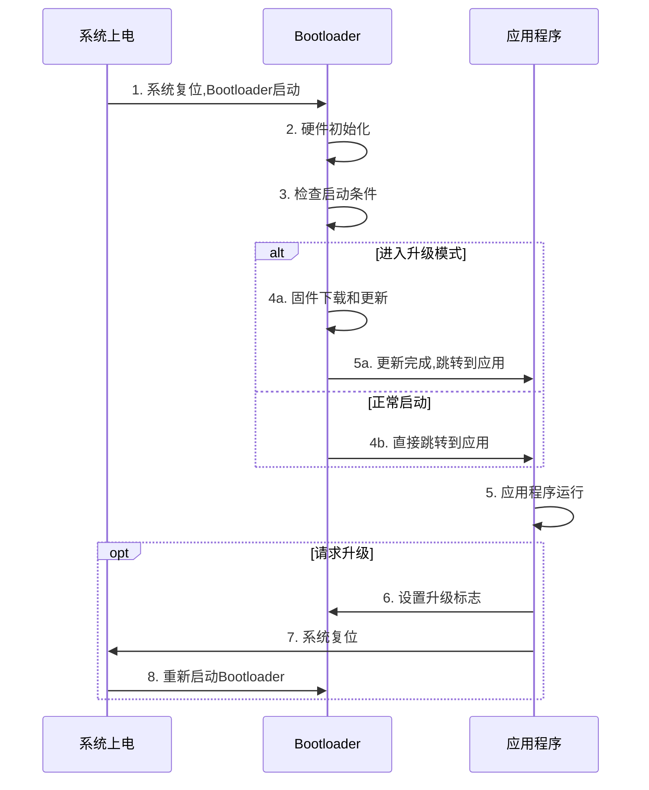

# Bootloader与应用程序通信机制

## 概述

在嵌入式系统中,Bootloader和应用程序是两个独立运行的程序,但它们需要协同工作以实现固件更新、启动模式选择、参数传递等功能。理解两者之间的通信机制是开发可靠嵌入式系统的关键。本文将深入讲解Bootloader与应用程序之间的各种通信方法和最佳实践。

完成本文学习后,你将能够:

- 理解Bootloader与应用程序的关系和交互时机
- 掌握多种参数传递方法及其适用场景
- 学会使用共享内存进行数据交换
- 设计可靠的启动模式选择机制
- 实现标志位和状态管理
- 解决通信过程中的常见问题

## 背景知识

### Bootloader与应用程序的关系

Bootloader和应用程序是嵌入式系统中的两个独立程序,它们在不同的时间段运行:



**关键特点**:

1. **时间隔离**: Bootloader和应用程序不会同时运行
2. **空间隔离**: 两者占用不同的Flash区域
3. **单向跳转**: Bootloader可以跳转到应用程序,应用程序通过复位返回Bootloader
4. **数据共享**: 通过特定机制在两者之间传递信息

### 为什么需要通信

Bootloader与应用程序需要通信的典型场景:

1. **启动模式选择**: 应用程序告诉Bootloader下次启动时进入升级模式
2. **参数传递**: 传递设备信息、配置参数等
3. **状态同步**: 记录启动次数、运行状态等
4. **固件信息**: 传递固件版本、CRC校验值等
5. **错误恢复**: 应用程序崩溃时,Bootloader需要知道原因

## 核心内容

### 方法一: 共享RAM区域

#### 1.1 基本原理

使用RAM的特定区域作为Bootloader和应用程序之间的数据交换区。这是最直接的通信方式。

**内存布局**:

```
RAM布局 (STM32F407):

0x2001 FFFF ┌──────────────┐
            │   堆栈       │
            ├──────────────┤
            │   堆         │
            ├──────────────┤
            │   BSS段      │
            ├──────────────┤
            │   Data段     │
            ├──────────────┤
            │  共享数据区  │ ← 通信区域
0x2000 0000 └──────────────┘
```

**优点**:
- 实现简单,读写速度快
- 不需要Flash擦写操作
- 适合传递临时数据

**缺点**:
- 掉电后数据丢失
- 需要在链接脚本中预留空间
- 两个程序必须约定相同的地址

#### 1.2 实现方法

**步骤1: 定义共享数据结构**

```c
/* shared_data.h - 两个程序都包含此头文件 */
#ifndef __SHARED_DATA_H
#define __SHARED_DATA_H

#include <stdint.h>

/* 共享数据区地址 - 必须在RAM的固定位置 */
#define SHARED_DATA_ADDR    0x2001F000

/* 魔数用于验证数据有效性 */
#define SHARED_DATA_MAGIC   0x5AA5C33C

/* 启动模式定义 */
typedef enum {
    BOOT_MODE_NORMAL = 0,       /* 正常启动 */
    BOOT_MODE_UPGRADE,          /* 固件升级模式 */
    BOOT_MODE_RECOVERY,         /* 恢复模式 */
    BOOT_MODE_TEST              /* 测试模式 */
} BootMode;

/* 共享数据结构 */
typedef struct {
    uint32_t magic;             /* 魔数,用于验证 */
    uint32_t version;           /* 数据结构版本 */
    
    /* 启动控制 */
    BootMode boot_mode;         /* 启动模式 */
    uint32_t boot_count;        /* 启动计数 */
    uint32_t reset_reason;      /* 复位原因 */
    
    /* 固件信息 */
    uint32_t app_version;       /* 应用程序版本 */
    uint32_t app_crc;           /* 应用程序CRC */
    uint32_t app_size;          /* 应用程序大小 */
    
    /* 升级控制 */
    uint32_t upgrade_flag;      /* 升级标志 */
    uint32_t upgrade_progress;  /* 升级进度 */
    
    /* 错误信息 */
    uint32_t error_code;        /* 错误代码 */
    uint32_t error_count;       /* 错误计数 */
    
    /* 用户数据 */
    uint8_t user_data[64];      /* 用户自定义数据 */
    
    /* 校验 */
    uint32_t checksum;          /* 简单校验和 */
} SharedData;

/* 获取共享数据指针 */
#define GET_SHARED_DATA()   ((SharedData*)SHARED_DATA_ADDR)

/* 函数声明 */
void SharedData_Init(void);
uint8_t SharedData_IsValid(void);
void SharedData_Clear(void);
uint32_t SharedData_CalcChecksum(const SharedData *data);

#endif /* __SHARED_DATA_H */
```

**步骤2: 修改链接脚本**

```ld
/* Bootloader和应用程序的链接脚本都需要修改 */

MEMORY
{
    FLASH (rx)      : ORIGIN = 0x08000000, LENGTH = 32K
    RAM (xrw)       : ORIGIN = 0x20000000, LENGTH = 124K
    SHARED (rw)     : ORIGIN = 0x2001F000, LENGTH = 4K    /* 共享区域 */
}

SECTIONS
{
    /* ... 其他段定义 ... */
    
    /* 共享数据段 - 不初始化,不清零 */
    .shared_data (NOLOAD) :
    {
        . = ALIGN(4);
        *(.shared_data)
        . = ALIGN(4);
    } > SHARED
}
```

**步骤3: 实现共享数据管理**

```c
/* shared_data.c */
#include "shared_data.h"
#include <string.h>

/* 初始化共享数据 */
void SharedData_Init(void)
{
    SharedData *shared = GET_SHARED_DATA();
    
    /* 检查数据是否有效 */
    if (!SharedData_IsValid()) {
        /* 数据无效,初始化为默认值 */
        memset(shared, 0, sizeof(SharedData));
        shared->magic = SHARED_DATA_MAGIC;
        shared->version = 0x0100;  /* v1.0 */
        shared->boot_mode = BOOT_MODE_NORMAL;
        shared->checksum = SharedData_CalcChecksum(shared);
    }
}

/* 验证共享数据 */
uint8_t SharedData_IsValid(void)
{
    SharedData *shared = GET_SHARED_DATA();
    
    /* 检查魔数 */
    if (shared->magic != SHARED_DATA_MAGIC) {
        return 0;
    }
    
    /* 检查校验和 */
    uint32_t calc_checksum = SharedData_CalcChecksum(shared);
    if (calc_checksum != shared->checksum) {
        return 0;
    }
    
    return 1;
}

/* 清除共享数据 */
void SharedData_Clear(void)
{
    SharedData *shared = GET_SHARED_DATA();
    memset(shared, 0, sizeof(SharedData));
}

/* 计算校验和 */
uint32_t SharedData_CalcChecksum(const SharedData *data)
{
    uint32_t sum = 0;
    const uint32_t *ptr = (const uint32_t*)data;
    
    /* 计算除checksum字段外的所有数据 */
    for (int i = 0; i < (sizeof(SharedData) - 4) / 4; i++) {
        sum += ptr[i];
    }
    
    return sum;
}
```

**步骤4: 在Bootloader中使用**

```c
/* bootloader_main.c */
#include "shared_data.h"

int main(void)
{
    SystemInit();
    
    /* 初始化共享数据 */
    SharedData_Init();
    
    /* 获取共享数据 */
    SharedData *shared = GET_SHARED_DATA();
    
    /* 增加启动计数 */
    shared->boot_count++;
    
    /* 检查启动模式 */
    if (shared->boot_mode == BOOT_MODE_UPGRADE) {
        /* 进入升级模式 */
        printf("Entering upgrade mode...\n");
        
        /* 执行固件升级 */
        FirmwareUpgrade();
        
        /* 升级完成,清除标志 */
        shared->boot_mode = BOOT_MODE_NORMAL;
        shared->checksum = SharedData_CalcChecksum(shared);
    }
    
    /* 正常启动 */
    printf("Booting application...\n");
    printf("Boot count: %d\n", shared->boot_count);
    
    /* 更新校验和 */
    shared->checksum = SharedData_CalcChecksum(shared);
    
    /* 跳转到应用程序 */
    JumpToApplication(APP_START_ADDR);
    
    while(1);
}
```

**步骤5: 在应用程序中使用**

```c
/* application_main.c */
#include "shared_data.h"

/* 请求进入升级模式 */
void RequestUpgrade(void)
{
    SharedData *shared = GET_SHARED_DATA();
    
    /* 设置升级标志 */
    shared->boot_mode = BOOT_MODE_UPGRADE;
    shared->upgrade_flag = 1;
    
    /* 更新校验和 */
    shared->checksum = SharedData_CalcChecksum(shared);
    
    printf("Upgrade requested, rebooting...\n");
    
    /* 延时确保消息输出 */
    HAL_Delay(100);
    
    /* 系统复位 */
    NVIC_SystemReset();
}

int main(void)
{
    HAL_Init();
    SystemClock_Config();
    
    /* 初始化共享数据 */
    SharedData_Init();
    
    SharedData *shared = GET_SHARED_DATA();
    
    /* 显示启动信息 */
    printf("Application started\n");
    printf("Boot count: %d\n", shared->boot_count);
    printf("App version: %d.%d\n", 
           shared->app_version >> 16, 
           shared->app_version & 0xFFFF);
    
    /* 主循环 */
    while(1) {
        /* 应用程序逻辑 */
        
        /* 检查是否需要升级 */
        if (CheckUpgradeButton()) {
            RequestUpgrade();
        }
    }
}
```

### 方法二: Flash参数区

#### 2.1 基本原理

使用Flash的特定扇区存储参数和标志,这种方法的数据在掉电后不会丢失。

**Flash布局**:

```
Flash布局:

0x08000000 ┌──────────────┐
           │ Bootloader   │
0x08008000 ├──────────────┤
           │ Application  │
0x08080000 ├──────────────┤
           │ Upgrade      │
0x080F8000 ├──────────────┤
           │ Parameters   │ ← 参数存储区
0x08100000 └──────────────┘
```

**优点**:
- 掉电不丢失
- 不占用RAM空间
- 适合存储配置参数

**缺点**:
- 写入速度慢(需要擦除)
- Flash有擦写次数限制
- 实现相对复杂

#### 2.2 实现方法

**参数结构定义**:

```c
/* flash_params.h */
#ifndef __FLASH_PARAMS_H
#define __FLASH_PARAMS_H

#include <stdint.h>

/* 参数区地址 */
#define PARAM_FLASH_ADDR    0x080F8000
#define PARAM_FLASH_SIZE    0x00008000  /* 32KB */

/* 参数魔数 */
#define PARAM_MAGIC         0x50415241  /* "PARA" */

/* 启动标志定义 */
#define BOOT_FLAG_NORMAL    0x00000000
#define BOOT_FLAG_UPGRADE   0x5AA5A55A
#define BOOT_FLAG_RECOVERY  0xA55A5AA5

/* 参数结构 */
typedef struct {
    uint32_t magic;             /* 魔数 */
    uint32_t version;           /* 版本号 */
    
    /* 启动控制 */
    uint32_t boot_flag;         /* 启动标志 */
    uint32_t boot_count;        /* 启动次数 */
    uint32_t last_boot_time;    /* 上次启动时间 */
    
    /* 固件信息 */
    uint32_t app_version;       /* 应用版本 */
    uint32_t app_crc;           /* 应用CRC */
    uint32_t app_size;          /* 应用大小 */
    
    /* 系统配置 */
    uint8_t  device_id[16];     /* 设备ID */
    uint8_t  mac_addr[6];       /* MAC地址 */
    uint16_t reserved1;
    
    /* 网络配置 */
    uint32_t ip_addr;           /* IP地址 */
    uint32_t netmask;           /* 子网掩码 */
    uint32_t gateway;           /* 网关 */
    uint16_t port;              /* 端口 */
    uint16_t reserved2;
    
    /* 用户数据 */
    uint8_t user_data[128];     /* 用户数据 */
    
    /* 校验 */
    uint32_t crc32;             /* CRC32校验 */
} FlashParams;

/* 函数声明 */
void FlashParams_Init(void);
uint8_t FlashParams_Load(FlashParams *params);
uint8_t FlashParams_Save(const FlashParams *params);
uint8_t FlashParams_IsValid(const FlashParams *params);
void FlashParams_SetDefault(FlashParams *params);

#endif /* __FLASH_PARAMS_H */
```


**参数管理实现**:

```c
/* flash_params.c */
#include "flash_params.h"
#include "flash.h"
#include <string.h>

/* 默认参数 */
static const FlashParams default_params = {
    .magic = PARAM_MAGIC,
    .version = 0x0100,
    .boot_flag = BOOT_FLAG_NORMAL,
    .boot_count = 0,
    /* ... 其他默认值 ... */
};

/* 初始化参数 */
void FlashParams_Init(void)
{
    FlashParams params;
    
    /* 尝试从Flash加载 */
    if (!FlashParams_Load(&params)) {
        /* 加载失败,使用默认值并保存 */
        FlashParams_SetDefault(&params);
        FlashParams_Save(&params);
    }
}

/* 从Flash加载参数 */
uint8_t FlashParams_Load(FlashParams *params)
{
    /* 从Flash读取 */
    memcpy(params, (void*)PARAM_FLASH_ADDR, sizeof(FlashParams));
    
    /* 验证参数 */
    return FlashParams_IsValid(params);
}

/* 保存参数到Flash */
uint8_t FlashParams_Save(const FlashParams *params)
{
    uint8_t sector;
    
    /* 解锁Flash */
    Flash_Unlock();
    
    /* 擦除参数扇区 */
    sector = Flash_GetSector(PARAM_FLASH_ADDR);
    if (Flash_EraseSector(sector) != 0) {
        Flash_Lock();
        return 0;
    }
    
    /* 写入参数 */
    if (Flash_WriteBuffer(PARAM_FLASH_ADDR, 
                         (uint8_t*)params, 
                         sizeof(FlashParams)) != 0) {
        Flash_Lock();
        return 0;
    }
    
    /* 锁定Flash */
    Flash_Lock();
    
    return 1;
}

/* 验证参数 */
uint8_t FlashParams_IsValid(const FlashParams *params)
{
    /* 检查魔数 */
    if (params->magic != PARAM_MAGIC) {
        return 0;
    }
    
    /* 检查CRC */
    uint32_t calc_crc = CalculateCRC32((uint8_t*)params, 
                                       sizeof(FlashParams) - 4);
    if (calc_crc != params->crc32) {
        return 0;
    }
    
    return 1;
}

/* 设置默认参数 */
void FlashParams_SetDefault(FlashParams *params)
{
    memcpy(params, &default_params, sizeof(FlashParams));
    
    /* 计算CRC */
    params->crc32 = CalculateCRC32((uint8_t*)params, 
                                   sizeof(FlashParams) - 4);
}
```

**在Bootloader中使用**:

```c
/* bootloader_main.c */
#include "flash_params.h"

int main(void)
{
    FlashParams params;
    
    SystemInit();
    
    /* 加载参数 */
    FlashParams_Load(&params);
    
    /* 增加启动计数 */
    params.boot_count++;
    
    /* 检查启动标志 */
    if (params.boot_flag == BOOT_FLAG_UPGRADE) {
        printf("Upgrade mode requested\n");
        
        /* 清除升级标志 */
        params.boot_flag = BOOT_FLAG_NORMAL;
        params.crc32 = CalculateCRC32((uint8_t*)&params, 
                                     sizeof(FlashParams) - 4);
        FlashParams_Save(&params);
        
        /* 执行升级 */
        FirmwareUpgrade();
    }
    
    /* 保存更新后的参数 */
    params.crc32 = CalculateCRC32((uint8_t*)&params, 
                                 sizeof(FlashParams) - 4);
    FlashParams_Save(&params);
    
    /* 跳转到应用程序 */
    JumpToApplication(APP_START_ADDR);
    
    while(1);
}
```

**在应用程序中请求升级**:

```c
/* application.c */
#include "flash_params.h"

void RequestUpgrade(void)
{
    FlashParams params;
    
    /* 加载当前参数 */
    FlashParams_Load(&params);
    
    /* 设置升级标志 */
    params.boot_flag = BOOT_FLAG_UPGRADE;
    
    /* 计算CRC */
    params.crc32 = CalculateCRC32((uint8_t*)&params, 
                                 sizeof(FlashParams) - 4);
    
    /* 保存参数 */
    if (FlashParams_Save(&params)) {
        printf("Upgrade flag set, rebooting...\n");
        HAL_Delay(100);
        NVIC_SystemReset();
    } else {
        printf("Failed to set upgrade flag\n");
    }
}
```

### 方法三: 备份寄存器

#### 3.1 基本原理

STM32等MCU提供备份寄存器(Backup Register),这些寄存器在主电源掉电后,由备用电池或超级电容供电,数据不会丢失。

**特点**:
- 数据在主电源掉电后保持
- 读写速度快
- 容量有限(STM32F4有20个32位寄存器)
- 需要RTC电源域供电

#### 3.2 实现方法

**备份寄存器定义**:

```c
/* backup_regs.h */
#ifndef __BACKUP_REGS_H
#define __BACKUP_REGS_H

#include "stm32f4xx.h"

/* 备份寄存器分配 */
#define BKP_REG_MAGIC       RTC->BKP0R  /* 魔数 */
#define BKP_REG_BOOT_FLAG   RTC->BKP1R  /* 启动标志 */
#define BKP_REG_BOOT_COUNT  RTC->BKP2R  /* 启动次数 */
#define BKP_REG_APP_VERSION RTC->BKP3R  /* 应用版本 */
#define BKP_REG_ERROR_CODE  RTC->BKP4R  /* 错误代码 */
#define BKP_REG_USER_DATA1  RTC->BKP5R  /* 用户数据1 */
#define BKP_REG_USER_DATA2  RTC->BKP6R  /* 用户数据2 */

/* 魔数和标志 */
#define BKP_MAGIC           0x5AA5C33C
#define BKP_FLAG_UPGRADE    0x55AA55AA
#define BKP_FLAG_RECOVERY   0xAA55AA55

/* 函数声明 */
void BackupRegs_Init(void);
void BackupRegs_Enable(void);
void BackupRegs_Disable(void);
uint8_t BackupRegs_IsValid(void);
void BackupRegs_Clear(void);

#endif /* __BACKUP_REGS_H */
```

**备份寄存器操作**:

```c
/* backup_regs.c */
#include "backup_regs.h"

/* 初始化备份寄存器 */
void BackupRegs_Init(void)
{
    /* 使能PWR时钟 */
    RCC->APB1ENR |= RCC_APB1ENR_PWREN;
    
    /* 使能备份域访问 */
    PWR->CR |= PWR_CR_DBP;
    
    /* 检查数据是否有效 */
    if (!BackupRegs_IsValid()) {
        /* 数据无效,初始化 */
        BKP_REG_MAGIC = BKP_MAGIC;
        BKP_REG_BOOT_FLAG = 0;
        BKP_REG_BOOT_COUNT = 0;
    }
}

/* 使能备份域写访问 */
void BackupRegs_Enable(void)
{
    PWR->CR |= PWR_CR_DBP;
}

/* 禁用备份域写访问 */
void BackupRegs_Disable(void)
{
    PWR->CR &= ~PWR_CR_DBP;
}

/* 验证备份寄存器数据 */
uint8_t BackupRegs_IsValid(void)
{
    return (BKP_REG_MAGIC == BKP_MAGIC);
}

/* 清除备份寄存器 */
void BackupRegs_Clear(void)
{
    BackupRegs_Enable();
    
    for (int i = 0; i < 20; i++) {
        *(&RTC->BKP0R + i) = 0;
    }
    
    BackupRegs_Disable();
}
```

**使用示例**:

```c
/* 在Bootloader中 */
void Bootloader_Main(void)
{
    BackupRegs_Init();
    
    /* 增加启动计数 */
    BackupRegs_Enable();
    BKP_REG_BOOT_COUNT++;
    BackupRegs_Disable();
    
    /* 检查启动标志 */
    if (BKP_REG_BOOT_FLAG == BKP_FLAG_UPGRADE) {
        printf("Upgrade mode\n");
        
        /* 清除标志 */
        BackupRegs_Enable();
        BKP_REG_BOOT_FLAG = 0;
        BackupRegs_Disable();
        
        /* 执行升级 */
        FirmwareUpgrade();
    }
    
    /* 跳转到应用 */
    JumpToApplication(APP_START_ADDR);
}

/* 在应用程序中 */
void App_RequestUpgrade(void)
{
    /* 设置升级标志 */
    BackupRegs_Enable();
    BKP_REG_BOOT_FLAG = BKP_FLAG_UPGRADE;
    BackupRegs_Disable();
    
    /* 复位系统 */
    NVIC_SystemReset();
}
```

### 方法四: GPIO引脚状态

#### 4.1 基本原理

使用GPIO引脚的电平状态作为启动模式选择信号,这是最简单直接的方法。

**典型应用**:
- 按键检测: 按住按键启动进入升级模式
- 跳线帽: 通过跳线选择启动模式
- 外部信号: 其他设备控制启动模式

**优点**:
- 实现简单
- 硬件直观
- 可靠性高

**缺点**:
- 需要额外的硬件
- 应用程序无法动态控制
- 占用GPIO资源

#### 4.2 实现方法

**硬件连接**:

```
硬件连接示例:

MCU                     按键/跳线
PA0 ────────┬────────── KEY
            │
           ─┴─ 10K
           ─┬─ 下拉电阻
            │
           GND

按键按下: PA0 = 高电平 → 进入升级模式
按键松开: PA0 = 低电平 → 正常启动
```

**代码实现**:

```c
/* boot_mode.h */
#ifndef __BOOT_MODE_H
#define __BOOT_MODE_H

#include "stm32f4xx.h"

/* 启动模式引脚定义 */
#define BOOT_MODE_GPIO      GPIOA
#define BOOT_MODE_PIN       GPIO_PIN_0
#define BOOT_MODE_RCC       RCC_AHB1ENR_GPIOAEN

/* 启动模式 */
typedef enum {
    BOOT_MODE_NORMAL = 0,
    BOOT_MODE_UPGRADE,
    BOOT_MODE_RECOVERY
} BootModeType;

/* 函数声明 */
void BootMode_Init(void);
BootModeType BootMode_Get(void);
uint8_t BootMode_IsUpgradeRequested(void);

#endif /* __BOOT_MODE_H */
```

```c
/* boot_mode.c */
#include "boot_mode.h"

/* 初始化启动模式检测 */
void BootMode_Init(void)
{
    /* 使能GPIO时钟 */
    RCC->AHB1ENR |= BOOT_MODE_RCC;
    
    /* 配置为输入模式 */
    BOOT_MODE_GPIO->MODER &= ~(3 << (0 * 2));
    
    /* 配置下拉 */
    BOOT_MODE_GPIO->PUPDR &= ~(3 << (0 * 2));
    BOOT_MODE_GPIO->PUPDR |= (2 << (0 * 2));  /* 下拉 */
}

/* 获取启动模式 */
BootModeType BootMode_Get(void)
{
    /* 读取引脚状态 */
    if (BOOT_MODE_GPIO->IDR & BOOT_MODE_PIN) {
        return BOOT_MODE_UPGRADE;
    }
    
    return BOOT_MODE_NORMAL;
}

/* 检查是否请求升级 */
uint8_t BootMode_IsUpgradeRequested(void)
{
    return (BootMode_Get() == BOOT_MODE_UPGRADE);
}
```

**在Bootloader中使用**:

```c
/* bootloader_main.c */
int main(void)
{
    SystemInit();
    
    /* 初始化启动模式检测 */
    BootMode_Init();
    
    /* 延时消抖 */
    HAL_Delay(50);
    
    /* 检查启动模式 */
    if (BootMode_IsUpgradeRequested()) {
        printf("Upgrade mode (button pressed)\n");
        
        /* LED指示 */
        LED_On();
        
        /* 进入升级模式 */
        FirmwareUpgrade();
    }
    
    /* 正常启动 */
    printf("Normal boot\n");
    JumpToApplication(APP_START_ADDR);
    
    while(1);
}
```

### 方法五: 复位原因检测

#### 5.1 基本原理

通过检测MCU的复位原因寄存器,判断是软件复位还是硬件复位,从而决定启动模式。

**STM32复位原因**:
- 上电复位(POR)
- 引脚复位(NRST)
- 软件复位(NVIC_SystemReset)
- 看门狗复位(IWDG/WWDG)
- 低功耗复位

#### 5.2 实现方法

```c
/* reset_reason.h */
#ifndef __RESET_REASON_H
#define __RESET_REASON_H

#include "stm32f4xx.h"

/* 复位原因 */
typedef enum {
    RESET_REASON_UNKNOWN = 0,
    RESET_REASON_POR,           /* 上电复位 */
    RESET_REASON_PIN,           /* 引脚复位 */
    RESET_REASON_SOFTWARE,      /* 软件复位 */
    RESET_REASON_IWDG,          /* 独立看门狗 */
    RESET_REASON_WWDG,          /* 窗口看门狗 */
    RESET_REASON_LOWPOWER       /* 低功耗复位 */
} ResetReasonType;

/* 函数声明 */
ResetReasonType ResetReason_Get(void);
void ResetReason_Clear(void);
const char* ResetReason_GetString(ResetReasonType reason);

#endif /* __RESET_REASON_H */
```


```c
/* reset_reason.c */
#include "reset_reason.h"

/* 获取复位原因 */
ResetReasonType ResetReason_Get(void)
{
    uint32_t rcc_csr = RCC->CSR;
    ResetReasonType reason = RESET_REASON_UNKNOWN;
    
    /* 检查各种复位标志 */
    if (rcc_csr & RCC_CSR_PORRSTF) {
        reason = RESET_REASON_POR;
    } else if (rcc_csr & RCC_CSR_PINRSTF) {
        reason = RESET_REASON_PIN;
    } else if (rcc_csr & RCC_CSR_SFTRSTF) {
        reason = RESET_REASON_SOFTWARE;
    } else if (rcc_csr & RCC_CSR_IWDGRSTF) {
        reason = RESET_REASON_IWDG;
    } else if (rcc_csr & RCC_CSR_WWDGRSTF) {
        reason = RESET_REASON_WWDG;
    } else if (rcc_csr & RCC_CSR_LPWRRSTF) {
        reason = RESET_REASON_LOWPOWER;
    }
    
    return reason;
}

/* 清除复位标志 */
void ResetReason_Clear(void)
{
    RCC->CSR |= RCC_CSR_RMVF;
}

/* 获取复位原因字符串 */
const char* ResetReason_GetString(ResetReasonType reason)
{
    switch (reason) {
        case RESET_REASON_POR:       return "Power-On Reset";
        case RESET_REASON_PIN:       return "Pin Reset";
        case RESET_REASON_SOFTWARE:  return "Software Reset";
        case RESET_REASON_IWDG:      return "IWDG Reset";
        case RESET_REASON_WWDG:      return "WWDG Reset";
        case RESET_REASON_LOWPOWER:  return "Low Power Reset";
        default:                     return "Unknown";
    }
}
```

**使用示例**:

```c
/* bootloader_main.c */
int main(void)
{
    ResetReasonType reset_reason;
    
    SystemInit();
    
    /* 获取复位原因 */
    reset_reason = ResetReason_Get();
    printf("Reset reason: %s\n", ResetReason_GetString(reset_reason));
    
    /* 清除复位标志 */
    ResetReason_Clear();
    
    /* 根据复位原因决定启动模式 */
    if (reset_reason == RESET_REASON_IWDG) {
        /* 看门狗复位,可能是应用程序崩溃 */
        printf("Watchdog reset detected, entering recovery mode\n");
        RecoveryMode();
    }
    
    /* 正常启动 */
    JumpToApplication(APP_START_ADDR);
    
    while(1);
}
```

## 实践示例

### 示例1: 完整的通信系统

结合多种方法实现一个完整的通信系统:

```c
/* boot_comm.h - 统一的通信接口 */
#ifndef __BOOT_COMM_H
#define __BOOT_COMM_H

#include <stdint.h>

/* 启动模式 */
typedef enum {
    BOOT_MODE_NORMAL = 0,
    BOOT_MODE_UPGRADE,
    BOOT_MODE_RECOVERY,
    BOOT_MODE_TEST
} BootMode_t;

/* 通信数据结构 */
typedef struct {
    /* 启动控制 */
    BootMode_t boot_mode;
    uint32_t boot_count;
    
    /* 固件信息 */
    uint32_t app_version;
    uint32_t app_crc;
    
    /* 错误信息 */
    uint32_t error_code;
    uint32_t reset_reason;
} BootCommData_t;

/* 函数声明 */
void BootComm_Init(void);
void BootComm_Load(BootCommData_t *data);
void BootComm_Save(const BootCommData_t *data);
void BootComm_SetBootMode(BootMode_t mode);
BootMode_t BootComm_GetBootMode(void);

#endif /* __BOOT_COMM_H */
```

```c
/* boot_comm.c */
#include "boot_comm.h"
#include "shared_data.h"
#include "flash_params.h"
#include "backup_regs.h"

/* 初始化通信系统 */
void BootComm_Init(void)
{
    /* 初始化各种通信方式 */
    SharedData_Init();
    FlashParams_Init();
    BackupRegs_Init();
}

/* 加载通信数据 - 优先级: 备份寄存器 > 共享RAM > Flash */
void BootComm_Load(BootCommData_t *data)
{
    /* 1. 尝试从备份寄存器读取 */
    if (BackupRegs_IsValid()) {
        data->boot_mode = BKP_REG_BOOT_FLAG;
        data->boot_count = BKP_REG_BOOT_COUNT;
        return;
    }
    
    /* 2. 尝试从共享RAM读取 */
    if (SharedData_IsValid()) {
        SharedData *shared = GET_SHARED_DATA();
        data->boot_mode = shared->boot_mode;
        data->boot_count = shared->boot_count;
        data->app_version = shared->app_version;
        return;
    }
    
    /* 3. 从Flash读取 */
    FlashParams params;
    if (FlashParams_Load(&params)) {
        data->boot_mode = (params.boot_flag == BOOT_FLAG_UPGRADE) ? 
                          BOOT_MODE_UPGRADE : BOOT_MODE_NORMAL;
        data->boot_count = params.boot_count;
        data->app_version = params.app_version;
    }
}

/* 保存通信数据 - 同时保存到多个位置 */
void BootComm_Save(const BootCommData_t *data)
{
    /* 1. 保存到备份寄存器 */
    BackupRegs_Enable();
    BKP_REG_BOOT_FLAG = data->boot_mode;
    BKP_REG_BOOT_COUNT = data->boot_count;
    BackupRegs_Disable();
    
    /* 2. 保存到共享RAM */
    SharedData *shared = GET_SHARED_DATA();
    shared->boot_mode = data->boot_mode;
    shared->boot_count = data->boot_count;
    shared->app_version = data->app_version;
    shared->checksum = SharedData_CalcChecksum(shared);
    
    /* 3. 保存到Flash(可选,减少Flash擦写) */
    /* FlashParams params;
       FlashParams_Load(&params);
       params.boot_flag = (data->boot_mode == BOOT_MODE_UPGRADE) ? 
                          BOOT_FLAG_UPGRADE : BOOT_FLAG_NORMAL;
       params.boot_count = data->boot_count;
       FlashParams_Save(&params); */
}

/* 设置启动模式 */
void BootComm_SetBootMode(BootMode_t mode)
{
    BootCommData_t data;
    BootComm_Load(&data);
    data.boot_mode = mode;
    BootComm_Save(&data);
}

/* 获取启动模式 */
BootMode_t BootComm_GetBootMode(void)
{
    BootCommData_t data;
    BootComm_Load(&data);
    return data.boot_mode;
}
```

**在Bootloader中使用**:

```c
/* bootloader_main.c */
#include "boot_comm.h"

int main(void)
{
    BootCommData_t comm_data;
    
    SystemInit();
    
    /* 初始化通信系统 */
    BootComm_Init();
    
    /* 加载通信数据 */
    BootComm_Load(&comm_data);
    
    /* 增加启动计数 */
    comm_data.boot_count++;
    
    /* 显示信息 */
    printf("Boot count: %d\n", comm_data.boot_count);
    printf("Boot mode: %d\n", comm_data.boot_mode);
    
    /* 检查启动模式 */
    if (comm_data.boot_mode == BOOT_MODE_UPGRADE) {
        printf("Entering upgrade mode...\n");
        
        /* 清除升级标志 */
        comm_data.boot_mode = BOOT_MODE_NORMAL;
        BootComm_Save(&comm_data);
        
        /* 执行升级 */
        FirmwareUpgrade();
    }
    
    /* 保存更新后的数据 */
    BootComm_Save(&comm_data);
    
    /* 跳转到应用程序 */
    JumpToApplication(APP_START_ADDR);
    
    while(1);
}
```

**在应用程序中使用**:

```c
/* application_main.c */
#include "boot_comm.h"

/* 请求升级 */
void RequestUpgrade(void)
{
    printf("Requesting upgrade...\n");
    
    /* 设置升级模式 */
    BootComm_SetBootMode(BOOT_MODE_UPGRADE);
    
    /* 延时确保数据写入 */
    HAL_Delay(100);
    
    /* 系统复位 */
    NVIC_SystemReset();
}

int main(void)
{
    BootCommData_t comm_data;
    
    HAL_Init();
    SystemClock_Config();
    
    /* 初始化通信系统 */
    BootComm_Init();
    
    /* 加载通信数据 */
    BootComm_Load(&comm_data);
    
    /* 显示启动信息 */
    printf("Application started\n");
    printf("Boot count: %d\n", comm_data.boot_count);
    printf("App version: 0x%08X\n", comm_data.app_version);
    
    /* 主循环 */
    while(1) {
        /* 应用程序逻辑 */
        
        /* 检查升级请求 */
        if (CheckUpgradeButton()) {
            RequestUpgrade();
        }
    }
}
```

### 示例2: 错误恢复机制

实现一个基于启动计数的错误恢复机制:

```c
/* error_recovery.h */
#ifndef __ERROR_RECOVERY_H
#define __ERROR_RECOVERY_H

#include <stdint.h>

/* 最大连续启动失败次数 */
#define MAX_BOOT_FAIL_COUNT  3

/* 错误代码 */
#define ERROR_CODE_NONE         0x00000000
#define ERROR_CODE_APP_INVALID  0x00000001
#define ERROR_CODE_APP_CRASH    0x00000002
#define ERROR_CODE_WATCHDOG     0x00000003

/* 函数声明 */
void ErrorRecovery_Init(void);
uint8_t ErrorRecovery_CheckBootFailure(void);
void ErrorRecovery_MarkBootSuccess(void);
void ErrorRecovery_MarkBootFailure(uint32_t error_code);
void ErrorRecovery_EnterRecoveryMode(void);

#endif /* __ERROR_RECOVERY_H */
```

```c
/* error_recovery.c */
#include "error_recovery.h"
#include "boot_comm.h"

/* 启动失败计数器 */
static uint32_t boot_fail_count = 0;

/* 初始化错误恢复 */
void ErrorRecovery_Init(void)
{
    BootCommData_t data;
    BootComm_Load(&data);
    
    /* 读取启动失败计数 */
    boot_fail_count = data.error_code & 0xFF;
}

/* 检查启动失败 */
uint8_t ErrorRecovery_CheckBootFailure(void)
{
    return (boot_fail_count >= MAX_BOOT_FAIL_COUNT);
}

/* 标记启动成功 */
void ErrorRecovery_MarkBootSuccess(void)
{
    BootCommData_t data;
    BootComm_Load(&data);
    
    /* 清除失败计数 */
    boot_fail_count = 0;
    data.error_code = ERROR_CODE_NONE;
    
    BootComm_Save(&data);
}

/* 标记启动失败 */
void ErrorRecovery_MarkBootFailure(uint32_t error_code)
{
    BootCommData_t data;
    BootComm_Load(&data);
    
    /* 增加失败计数 */
    boot_fail_count++;
    data.error_code = (error_code << 8) | boot_fail_count;
    
    BootComm_Save(&data);
}

/* 进入恢复模式 */
void ErrorRecovery_EnterRecoveryMode(void)
{
    printf("Entering recovery mode...\n");
    printf("Boot failures: %d\n", boot_fail_count);
    
    /* 清除失败计数 */
    boot_fail_count = 0;
    
    /* 尝试恢复固件 */
    /* ... 恢复逻辑 ... */
}
```

**在Bootloader中使用**:

```c
/* bootloader_main.c */
int main(void)
{
    SystemInit();
    
    /* 初始化错误恢复 */
    ErrorRecovery_Init();
    
    /* 检查连续启动失败 */
    if (ErrorRecovery_CheckBootFailure()) {
        printf("Too many boot failures!\n");
        ErrorRecovery_EnterRecoveryMode();
    }
    
    /* 标记本次启动尝试 */
    ErrorRecovery_MarkBootFailure(ERROR_CODE_NONE);
    
    /* 跳转到应用程序 */
    JumpToApplication(APP_START_ADDR);
    
    while(1);
}
```

**在应用程序中使用**:

```c
/* application_main.c */
int main(void)
{
    HAL_Init();
    SystemClock_Config();
    
    /* 初始化错误恢复 */
    ErrorRecovery_Init();
    
    /* 标记启动成功 */
    ErrorRecovery_MarkBootSuccess();
    
    printf("Application started successfully\n");
    
    /* 主循环 */
    while(1) {
        /* 应用程序逻辑 */
    }
}
```

## 深入理解

### 通信方法对比

| 方法 | 优点 | 缺点 | 适用场景 |
|------|------|------|---------|
| 共享RAM | 速度快,实现简单 | 掉电丢失 | 临时数据传递 |
| Flash参数区 | 掉电保持 | 写入慢,有擦写限制 | 配置参数存储 |
| 备份寄存器 | 速度快,掉电保持 | 容量小,需要备用电源 | 启动标志 |
| GPIO引脚 | 硬件直观,可靠 | 需要额外硬件 | 手动模式选择 |
| 复位原因 | 无需额外资源 | 信息有限 | 错误诊断 |

### 数据一致性保证

在通信过程中,需要保证数据的一致性:

**1. 使用魔数验证**:

```c
#define DATA_MAGIC  0x5AA5C33C

typedef struct {
    uint32_t magic;  /* 魔数 */
    /* ... 其他数据 ... */
} CommData;

/* 验证数据 */
uint8_t IsDataValid(const CommData *data)
{
    return (data->magic == DATA_MAGIC);
}
```

**2. 使用校验和**:

```c
typedef struct {
    /* ... 数据字段 ... */
    uint32_t checksum;  /* 校验和 */
} CommData;

/* 计算校验和 */
uint32_t CalcChecksum(const CommData *data)
{
    uint32_t sum = 0;
    const uint32_t *ptr = (const uint32_t*)data;
    
    for (int i = 0; i < (sizeof(CommData) - 4) / 4; i++) {
        sum += ptr[i];
    }
    
    return sum;
}
```

**3. 使用CRC校验**:

```c
typedef struct {
    /* ... 数据字段 ... */
    uint32_t crc32;  /* CRC32校验 */
} CommData;

/* 计算CRC32 */
uint32_t CalcCRC32(const uint8_t *data, uint32_t len)
{
    uint32_t crc = 0xFFFFFFFF;
    
    for (uint32_t i = 0; i < len; i++) {
        crc ^= data[i];
        for (int j = 0; j < 8; j++) {
            if (crc & 1) {
                crc = (crc >> 1) ^ 0xEDB88320;
            } else {
                crc = crc >> 1;
            }
        }
    }
    
    return ~crc;
}
```

### 版本兼容性

当通信数据结构需要升级时,要考虑版本兼容性:

```c
typedef struct {
    uint32_t magic;
    uint16_t version;  /* 版本号 */
    uint16_t length;   /* 数据长度 */
    
    /* v1.0 字段 */
    uint32_t boot_mode;
    uint32_t boot_count;
    
    /* v1.1 新增字段 */
    uint32_t app_version;
    uint32_t app_crc;
    
    /* v1.2 新增字段 */
    uint32_t error_code;
    uint32_t reset_reason;
} CommData;

/* 加载数据时处理版本 */
void LoadData(CommData *data)
{
    /* 读取数据 */
    memcpy(data, (void*)DATA_ADDR, sizeof(CommData));
    
    /* 检查版本 */
    if (data->version == 0x0100) {
        /* v1.0 数据,设置默认值 */
        data->app_version = 0;
        data->app_crc = 0;
        data->error_code = 0;
        data->reset_reason = 0;
    } else if (data->version == 0x0101) {
        /* v1.1 数据,设置v1.2新增字段默认值 */
        data->error_code = 0;
        data->reset_reason = 0;
    }
    
    /* 更新到最新版本 */
    data->version = 0x0102;
}
```

## 常见问题

### Q1: 共享RAM数据在复位后丢失怎么办?

**A**: 这是共享RAM的固有特性。解决方法:

1. **使用Flash参数区**: 将重要数据保存到Flash
2. **使用备份寄存器**: 如果MCU支持且有备用电源
3. **组合使用**: 临时数据用RAM,重要数据用Flash

```c
/* 组合使用示例 */
void SaveImportantData(void)
{
    /* 临时数据保存到RAM */
    SharedData *shared = GET_SHARED_DATA();
    shared->boot_mode = BOOT_MODE_UPGRADE;
    
    /* 重要数据同时保存到Flash */
    FlashParams params;
    FlashParams_Load(&params);
    params.boot_flag = BOOT_FLAG_UPGRADE;
    FlashParams_Save(&params);
}
```

### Q2: Flash参数区频繁擦写会损坏吗?

**A**: 是的,Flash有擦写次数限制(通常10万次)。优化方法:

1. **减少写入频率**: 只在必要时写入
2. **使用磨损均衡**: 轮流使用多个扇区
3. **使用RAM缓存**: 先写RAM,定期同步到Flash

```c
/* 磨损均衡示例 */
#define PARAM_SECTOR_COUNT  2
#define PARAM_SECTOR_BASE   11

uint8_t current_sector = 0;

void SaveParamsWithWearLeveling(const FlashParams *params)
{
    uint32_t addr = PARAM_FLASH_ADDR + 
                    (current_sector * PARAM_SECTOR_SIZE);
    
    /* 写入当前扇区 */
    Flash_WriteBuffer(addr, (uint8_t*)params, sizeof(FlashParams));
    
    /* 切换到下一个扇区 */
    current_sector = (current_sector + 1) % PARAM_SECTOR_COUNT;
}
```

### Q3: 如何确保Bootloader和应用程序使用相同的数据结构?

**A**: 最佳实践:

1. **共享头文件**: 两个工程包含相同的头文件
2. **版本控制**: 使用版本号标识数据结构
3. **编译时检查**: 使用静态断言检查结构大小

```c
/* 共享头文件 shared_data.h */
#define SHARED_DATA_VERSION  0x0100

typedef struct {
    uint32_t version;
    /* ... 数据字段 ... */
} SharedData;

/* 编译时检查 */
_Static_assert(sizeof(SharedData) == 256, 
               "SharedData size mismatch!");
```

### Q4: 应用程序如何知道Bootloader的版本?

**A**: 可以在固定地址存储Bootloader信息:

```c
/* 在Bootloader中定义版本信息 */
const BootloaderInfo __attribute__((section(".bootloader_info"))) 
bootloader_info = {
    .magic = 0x424F4F54,  /* "BOOT" */
    .version = 0x010000,  /* v1.0.0 */
    .build_date = __DATE__,
    .build_time = __TIME__
};

/* 在应用程序中读取 */
#define BOOTLOADER_INFO_ADDR  0x08000100

const BootloaderInfo* GetBootloaderInfo(void)
{
    return (const BootloaderInfo*)BOOTLOADER_INFO_ADDR;
}
```

### Q5: 如何防止通信数据被意外破坏?

**A**: 多重保护措施:

1. **魔数验证**: 检查数据有效性
2. **CRC校验**: 检测数据损坏
3. **多份备份**: 在多个位置保存
4. **写保护**: 对关键区域设置写保护

```c
/* 多重保护示例 */
typedef struct {
    uint32_t magic;      /* 魔数 */
    uint32_t version;    /* 版本 */
    /* ... 数据 ... */
    uint32_t crc32;      /* CRC校验 */
} ProtectedData;

uint8_t ValidateData(const ProtectedData *data)
{
    /* 1. 检查魔数 */
    if (data->magic != DATA_MAGIC) {
        return 0;
    }
    
    /* 2. 检查版本 */
    if (data->version > CURRENT_VERSION) {
        return 0;
    }
    
    /* 3. 检查CRC */
    uint32_t calc_crc = CalcCRC32((uint8_t*)data, 
                                  sizeof(ProtectedData) - 4);
    if (calc_crc != data->crc32) {
        return 0;
    }
    
    return 1;
}
```

## 总结

本文全面介绍了Bootloader与应用程序之间的通信机制,让我们回顾核心要点:

- **通信方法**: 共享RAM、Flash参数区、备份寄存器、GPIO引脚、复位原因检测
- **数据结构**: 使用魔数、版本号、校验和保证数据完整性
- **启动模式**: 通过多种方式实现灵活的启动模式选择
- **错误恢复**: 基于启动计数的自动恢复机制
- **最佳实践**: 组合使用多种方法,提高系统可靠性

掌握这些通信机制,能够设计出更加灵活和可靠的嵌入式系统,为固件升级、错误恢复等高级功能打下坚实基础。

## 延伸阅读

推荐进一步学习的资源:

**相关文章**:
- [Bootloader基础概念与工作原理](01-bootloader-basics.html) - 回顾基础知识
- [从零实现一个简单的Bootloader](02-simple-bootloader.html) - 实践基础
- [固件分区与内存布局设计](04-firmware-partition.html) - 内存管理
- [IAP在线升级功能实现](../intermediate/01-iap-implementation.html) - 升级实现

**参考资料**:
- STM32F4xx参考手册 - STMicroelectronics
- ARM Cortex-M编程手册 - ARM Ltd.
- 嵌入式系统设计与实践 - Elecia White

---

**练习题**:

1. 解释共享RAM和Flash参数区两种通信方式的优缺点,并说明各自的适用场景。
2. 设计一个数据结构,用于在Bootloader和应用程序之间传递固件版本、CRC校验值和升级标志。
3. 实现一个函数,检查共享数据的完整性(包括魔数和CRC校验)。
4. 设计一个错误恢复机制,当应用程序连续启动失败3次后自动进入恢复模式。
5. 如何在不增加Flash擦写次数的情况下,实现频繁的参数更新?

**实践任务**:

1. 实现一个完整的共享RAM通信系统,包括数据结构定义、初始化、读写函数。
2. 修改链接脚本,为共享数据预留固定的RAM区域。
3. 在Bootloader和应用程序中实现启动模式选择功能。
4. 实现基于备份寄存器的快速启动标志传递。
5. 设计并实现一个组合多种通信方式的统一接口。

**下一步**: 建议学习 [IAP在线升级功能实现](../intermediate/01-iap-implementation.html),将通信机制应用到实际的固件升级中。
