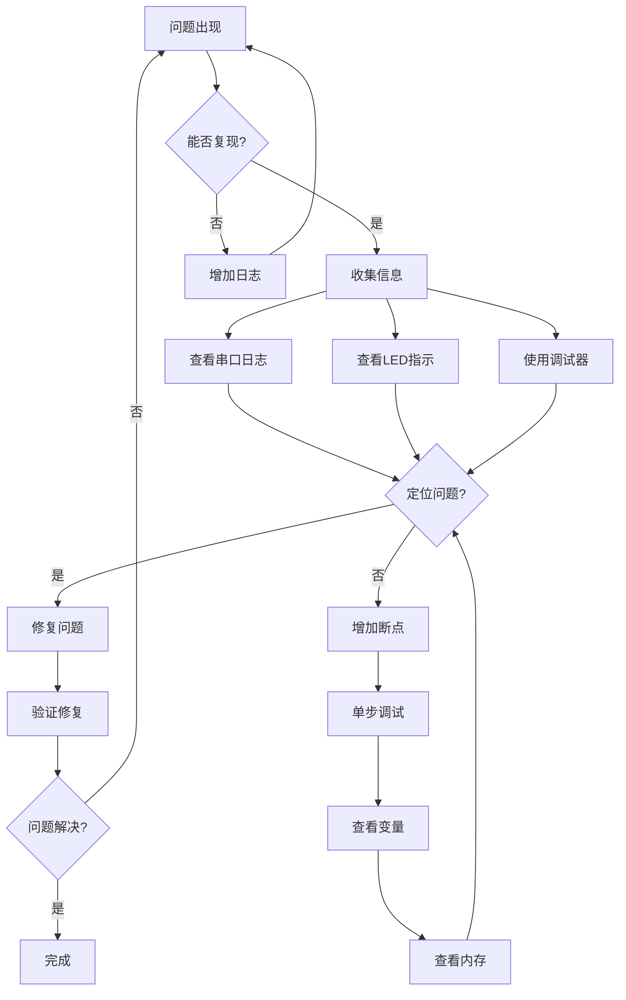

# Bootloader调试技巧与常见问题

## 概述

Bootloader作为嵌入式系统启动的第一个程序,其稳定性和可靠性至关重要。然而,在开发过程中,我们经常会遇到各种问题:启动失败、跳转异常、固件更新失败等。掌握有效的调试方法和故障排查技巧,能够大大提高开发效率,快速定位和解决问题。

完成本教程后,你将能够:

- 掌握多种Bootloader调试方法和工具
- 学会使用串口日志进行问题诊断
- 理解常见的启动失败原因及解决方案
- 实现完善的错误指示和日志系统
- 使用调试器进行深度调试
- 建立系统化的调试流程

## 准备工作

### 硬件要求

- **开发板**: STM32F4系列或其他ARM Cortex-M开发板
- **调试器**: ST-Link V2、J-Link或DAP-Link
- **串口工具**: USB转TTL模块
- **LED指示灯**: 用于状态指示
- **逻辑分析仪**: (可选)用于信号分析

### 软件要求

- **开发环境**: Keil MDK、IAR或STM32CubeIDE
- **串口助手**: SecureCRT、Xshell或PuTTY
- **调试工具**: OpenOCD、GDB或IDE内置调试器
- **日志分析工具**: 文本编辑器或专用日志分析软件

### 调试环境搭建

**硬件连接**:

```
开发板连接:

1. 调试器连接:
   ST-Link    开发板
   SWDIO  ->  SWDIO
   SWCLK  ->  SWCLK
   GND    ->  GND
   3.3V   ->  3.3V (可选)

2. 串口连接:
   USB-TTL    开发板
   TX     ->  RX (PA10)
   RX     ->  TX (PA9)
   GND    ->  GND

3. LED指示:
   LED1   ->  PD12 (状态指示)
   LED2   ->  PD13 (错误指示)
   LED3   ->  PD14 (调试指示)
```

## 核心内容

### 方法一: 串口日志调试

#### 1.1 基本原理

串口日志是Bootloader调试最常用、最有效的方法。通过串口输出关键信息,可以实时了解程序运行状态。

**优点**:
- 实现简单,成本低
- 不影响程序时序
- 可以记录历史信息
- 适合现场调试

**缺点**:
- 需要额外的串口资源
- 输出会占用一定时间
- 波特率限制信息量

#### 1.2 实现完善的日志系统

**日志级别定义**:

```c
/* debug_log.h */
#ifndef __DEBUG_LOG_H
#define __DEBUG_LOG_H

#include <stdint.h>
#include <stdio.h>

/* 日志级别 */
typedef enum {
    LOG_LEVEL_NONE = 0,     /* 不输出 */
    LOG_LEVEL_ERROR,        /* 错误 */
    LOG_LEVEL_WARN,         /* 警告 */
    LOG_LEVEL_INFO,         /* 信息 */
    LOG_LEVEL_DEBUG,        /* 调试 */
    LOG_LEVEL_VERBOSE       /* 详细 */
} LogLevel;

/* 当前日志级别 */
#ifndef LOG_LEVEL
#define LOG_LEVEL   LOG_LEVEL_DEBUG
#endif

/* 日志输出宏 */
#define LOG_ERROR(fmt, ...)   do { \
    if (LOG_LEVEL >= LOG_LEVEL_ERROR) { \
        printf("[ERROR] %s:%d " fmt "\r\n", __FUNCTION__, __LINE__, ##__VA_ARGS__); \
    } \
} while(0)

#define LOG_WARN(fmt, ...)    do { \
    if (LOG_LEVEL >= LOG_LEVEL_WARN) { \
        printf("[WARN]  %s:%d " fmt "\r\n", __FUNCTION__, __LINE__, ##__VA_ARGS__); \
    } \
} while(0)

#define LOG_INFO(fmt, ...)    do { \
    if (LOG_LEVEL >= LOG_LEVEL_INFO) { \
        printf("[INFO]  " fmt "\r\n", ##__VA_ARGS__); \
    } \
} while(0)

#define LOG_DEBUG(fmt, ...)   do { \
    if (LOG_LEVEL >= LOG_LEVEL_DEBUG) { \
        printf("[DEBUG] %s:%d " fmt "\r\n", __FUNCTION__, __LINE__, ##__VA_ARGS__); \
    } \
} while(0)

#define LOG_VERBOSE(fmt, ...) do { \
    if (LOG_LEVEL >= LOG_LEVEL_VERBOSE) { \
        printf("[VERB]  %s:%d " fmt "\r\n", __FUNCTION__, __LINE__, ##__VA_ARGS__); \
    } \
} while(0)

/* 十六进制数据打印 */
void LOG_HEX(const char *title, const uint8_t *data, uint32_t len);

/* 系统状态打印 */
void LOG_SystemInfo(void);

#endif /* __DEBUG_LOG_H */
```

**日志系统实现**:

```c
/* debug_log.c */
#include "debug_log.h"
#include "uart.h"
#include <string.h>

/* 打印十六进制数据 */
void LOG_HEX(const char *title, const uint8_t *data, uint32_t len)
{
    if (LOG_LEVEL < LOG_LEVEL_DEBUG) {
        return;
    }
    
    printf("[HEX]   %s (%d bytes):\r\n", title, len);
    
    for (uint32_t i = 0; i < len; i++) {
        printf("%02X ", data[i]);
        
        if ((i + 1) % 16 == 0) {
            printf("\r\n");
        }
    }
    
    if (len % 16 != 0) {
        printf("\r\n");
    }
}

/* 打印系统信息 */
void LOG_SystemInfo(void)
{
    printf("\r\n");
    printf("========================================\r\n");
    printf("  System Information\r\n");
    printf("========================================\r\n");
    printf("Build Date: %s %s\r\n", __DATE__, __TIME__);
    printf("Compiler:   %s\r\n", __VERSION__);
    printf("CPU:        %d MHz\r\n", SystemCoreClock / 1000000);
    
    /* 打印复位原因 */
    uint32_t rcc_csr = RCC->CSR;
    printf("Reset:      ");
    if (rcc_csr & RCC_CSR_PORRSTF)    printf("POR ");
    if (rcc_csr & RCC_CSR_PINRSTF)    printf("PIN ");
    if (rcc_csr & RCC_CSR_SFTRSTF)    printf("SW ");
    if (rcc_csr & RCC_CSR_IWDGRSTF)   printf("IWDG ");
    if (rcc_csr & RCC_CSR_WWDGRSTF)   printf("WWDG ");
    if (rcc_csr & RCC_CSR_LPWRRSTF)   printf("LPWR ");
    printf("\r\n");
    
    /* 清除复位标志 */
    RCC->CSR |= RCC_CSR_RMVF;
    
    printf("========================================\r\n\r\n");
}
```

**使用示例**:

```c
/* bootloader_main.c */
#include "debug_log.h"

int main(void)
{
    SystemInit();
    UART_Init();
    
    /* 打印系统信息 */
    LOG_SystemInfo();
    
    LOG_INFO("Bootloader starting...");
    LOG_DEBUG("Flash size: %d KB", FLASH_SIZE);
    LOG_DEBUG("RAM size: %d KB", RAM_SIZE);
    
    /* 检查应用程序 */
    uint32_t app_sp = *(__IO uint32_t*)APP_START_ADDR;
    LOG_DEBUG("App stack pointer: 0x%08X", app_sp);
    
    if ((app_sp & 0x2FFE0000) == 0x20000000) {
        LOG_INFO("Application valid");
    } else {
        LOG_ERROR("Application invalid! SP=0x%08X", app_sp);
        while(1);
    }
    
    /* 跳转到应用程序 */
    LOG_INFO("Jumping to application at 0x%08X", APP_START_ADDR);
    JumpToApplication(APP_START_ADDR);
    
    /* 不应该执行到这里 */
    LOG_ERROR("Jump failed!");
    while(1);
}
```

### 方法二: LED状态指示

#### 2.1 基本原理

使用LED的不同闪烁模式表示不同的状态和错误,这是最直观的调试方法,特别适合没有串口的情况。

**LED指示方案**:

```
LED状态定义:

1. 正常启动:
   - LED快速闪烁3次 → 进入应用程序

2. 升级模式:
   - LED慢速闪烁(500ms) → 等待固件

3. 错误状态:
   - LED常亮 → 应用程序无效
   - LED快速闪烁(100ms) → Flash操作失败
   - LED闪烁N次后暂停 → 错误代码N

4. 调试模式:
   - LED1: 主状态指示
   - LED2: 错误指示
   - LED3: 通信指示
```

#### 2.2 实现LED指示系统

```c
/* led_debug.h */
#ifndef __LED_DEBUG_H
#define __LED_DEBUG_H

#include "stm32f4xx.h"

/* LED定义 */
#define LED1_GPIO       GPIOD
#define LED1_PIN        GPIO_PIN_12
#define LED1_RCC        RCC_AHB1ENR_GPIODEN

#define LED2_GPIO       GPIOD
#define LED2_PIN        GPIO_PIN_13
#define LED2_RCC        RCC_AHB1ENR_GPIODEN

#define LED3_GPIO       GPIOD
#define LED3_PIN        GPIO_PIN_14
#define LED3_RCC        RCC_AHB1ENR_GPIODEN

/* LED操作宏 */
#define LED1_ON()       HAL_GPIO_WritePin(LED1_GPIO, LED1_PIN, GPIO_PIN_SET)
#define LED1_OFF()      HAL_GPIO_WritePin(LED1_GPIO, LED1_PIN, GPIO_PIN_RESET)
#define LED1_TOGGLE()   HAL_GPIO_TogglePin(LED1_GPIO, LED1_PIN)

#define LED2_ON()       HAL_GPIO_WritePin(LED2_GPIO, LED2_PIN, GPIO_PIN_SET)
#define LED2_OFF()      HAL_GPIO_WritePin(LED2_GPIO, LED2_PIN, GPIO_PIN_RESET)
#define LED2_TOGGLE()   HAL_GPIO_TogglePin(LED2_GPIO, LED2_PIN)

#define LED3_ON()       HAL_GPIO_WritePin(LED3_GPIO, LED3_PIN, GPIO_PIN_SET)
#define LED3_OFF()      HAL_GPIO_WritePin(LED3_GPIO, LED3_PIN, GPIO_PIN_RESET)
#define LED3_TOGGLE()   HAL_GPIO_TogglePin(LED3_GPIO, LED3_PIN)

/* 错误代码 */
typedef enum {
    LED_ERROR_NONE = 0,
    LED_ERROR_APP_INVALID,      /* 应用程序无效 */
    LED_ERROR_FLASH_ERASE,      /* Flash擦除失败 */
    LED_ERROR_FLASH_WRITE,      /* Flash写入失败 */
    LED_ERROR_CRC_FAIL,         /* CRC校验失败 */
    LED_ERROR_TIMEOUT,          /* 超时 */
    LED_ERROR_COMM_FAIL,        /* 通信失败 */
    LED_ERROR_UNKNOWN           /* 未知错误 */
} LEDErrorCode;

/* 函数声明 */
void LED_Init(void);
void LED_Blink(uint8_t led, uint32_t times, uint32_t delay_ms);
void LED_ShowError(LEDErrorCode error);
void LED_ShowProgress(uint8_t percent);

#endif /* __LED_DEBUG_H */
```

```c
/* led_debug.c */
#include "led_debug.h"

/* 延时函数 */
static void LED_Delay(uint32_t ms)
{
    for (volatile uint32_t i = 0; i < ms * 4000; i++);
}

/* 初始化LED */
void LED_Init(void)
{
    GPIO_InitTypeDef GPIO_InitStruct = {0};
    
    /* 使能时钟 */
    __HAL_RCC_GPIOD_CLK_ENABLE();
    
    /* 配置GPIO */
    GPIO_InitStruct.Pin = LED1_PIN | LED2_PIN | LED3_PIN;
    GPIO_InitStruct.Mode = GPIO_MODE_OUTPUT_PP;
    GPIO_InitStruct.Pull = GPIO_NOPULL;
    GPIO_InitStruct.Speed = GPIO_SPEED_FREQ_LOW;
    HAL_GPIO_Init(GPIOD, &GPIO_InitStruct);
    
    /* 关闭所有LED */
    LED1_OFF();
    LED2_OFF();
    LED3_OFF();
}

/* LED闪烁 */
void LED_Blink(uint8_t led, uint32_t times, uint32_t delay_ms)
{
    for (uint32_t i = 0; i < times; i++) {
        switch (led) {
            case 1: LED1_ON(); break;
            case 2: LED2_ON(); break;
            case 3: LED3_ON(); break;
        }
        LED_Delay(delay_ms);
        
        switch (led) {
            case 1: LED1_OFF(); break;
            case 2: LED2_OFF(); break;
            case 3: LED3_OFF(); break;
        }
        LED_Delay(delay_ms);
    }
}

/* 显示错误代码 */
void LED_ShowError(LEDErrorCode error)
{
    /* LED2常亮表示错误 */
    LED2_ON();
    LED_Delay(1000);
    LED2_OFF();
    LED_Delay(500);
    
    /* 闪烁次数表示错误代码 */
    LED_Blink(2, error, 200);
    
    LED_Delay(2000);
}

/* 显示进度 */
void LED_ShowProgress(uint8_t percent)
{
    /* LED3闪烁表示进度 */
    if (percent % 10 == 0) {
        LED3_TOGGLE();
    }
}
```

**使用示例**:

```c
/* bootloader_main.c */
#include "led_debug.h"

int main(void)
{
    SystemInit();
    LED_Init();
    
    /* 启动指示: LED1快速闪烁3次 */
    LED_Blink(1, 3, 100);
    
    /* 检查应用程序 */
    uint32_t app_sp = *(__IO uint32_t*)APP_START_ADDR;
    if ((app_sp & 0x2FFE0000) != 0x20000000) {
        /* 应用程序无效 */
        LED_ShowError(LED_ERROR_APP_INVALID);
        while(1) {
            LED_Blink(2, 1, 500);  /* LED2慢速闪烁 */
        }
    }
    
    /* 跳转到应用程序 */
    LED1_ON();  /* LED1常亮表示即将跳转 */
    HAL_Delay(100);
    LED1_OFF();
    
    JumpToApplication(APP_START_ADDR);
    
    /* 跳转失败 */
    LED_ShowError(LED_ERROR_UNKNOWN);
    while(1);
}
```

### 方法三: 调试器断点调试

#### 3.1 基本原理

使用JTAG/SWD调试器进行单步调试,可以查看寄存器、内存、变量等详细信息,是深度调试的最佳方法。

**调试器功能**:
- 单步执行
- 断点设置
- 变量查看
- 内存查看
- 寄存器查看
- 调用栈分析

#### 3.2 关键调试点

**1. 启动代码调试**:

```c
/* startup_stm32f4xx.s */
Reset_Handler:
    /* 设置断点1: 复位向量 */
    ldr   sp, =_estack          /* 设置栈指针 */
    
    /* 设置断点2: 数据段初始化前 */
    bl    SystemInit            /* 系统初始化 */
    
    /* 设置断点3: 跳转到main前 */
    bl    main                  /* 跳转到main */
```

**2. 跳转函数调试**:

```c
void JumpToApplication(uint32_t app_addr)
{
    /* 断点1: 检查栈指针 */
    uint32_t app_sp = *(__IO uint32_t*)app_addr;
    uint32_t app_entry = *(__IO uint32_t*)(app_addr + 4);
    
    /* 断点2: 检查地址有效性 */
    if ((app_sp & 0x2FFE0000) != 0x20000000) {
        return;  /* 无效地址 */
    }
    
    /* 断点3: 关闭中断前 */
    __disable_irq();
    
    /* 断点4: 设置VTOR前 */
    SCB->VTOR = app_addr;
    
    /* 断点5: 设置栈指针前 */
    __set_MSP(app_sp);
    
    /* 断点6: 跳转前 */
    void (*app_reset_handler)(void) = (void*)app_entry;
    app_reset_handler();  /* 这里不会返回 */
}
```

**3. Flash操作调试**:

```c
uint8_t Flash_WriteWord(uint32_t addr, uint32_t data)
{
    /* 断点1: 检查地址 */
    if (addr < FLASH_BASE || addr >= FLASH_END) {
        return 1;  /* 地址无效 */
    }
    
    /* 断点2: 等待Flash就绪 */
    while (FLASH->SR & FLASH_SR_BSY);
    
    /* 断点3: 配置编程操作 */
    FLASH->CR |= FLASH_CR_PG;
    
    /* 断点4: 写入数据 */
    *(__IO uint32_t*)addr = data;
    
    /* 断点5: 等待完成 */
    while (FLASH->SR & FLASH_SR_BSY);
    
    /* 断点6: 检查错误 */
    if (FLASH->SR & FLASH_SR_PGSERR) {
        return 2;  /* 编程错误 */
    }
    
    return 0;
}
```

#### 3.3 调试技巧

**查看关键寄存器**:

```
调试时需要关注的寄存器:

1. 栈指针 (SP/MSP):
   - 检查是否指向有效RAM区域
   - 检查是否栈溢出

2. 程序计数器 (PC):
   - 检查当前执行位置
   - 检查是否跳转到无效地址

3. 中断向量表偏移 (SCB->VTOR):
   - 检查是否正确设置
   - 应用程序应该是0x08008000

4. Flash控制寄存器 (FLASH->CR, FLASH->SR):
   - 检查Flash操作状态
   - 检查错误标志

5. 复位控制寄存器 (RCC->CSR):
   - 检查复位原因
   - 帮助诊断启动问题
```

### 方法四: 内存转储分析

#### 4.1 基本原理

将Flash或RAM的内容读取出来进行分析,可以检查固件是否正确烧写、数据是否正确存储等。

**内存转储方法**:
1. 使用调试器读取内存
2. 使用ST-LINK Utility读取Flash
3. 通过串口输出内存内容
4. 使用OpenOCD命令行工具

#### 4.2 实现内存转储功能

```c
/* memory_dump.h */
#ifndef __MEMORY_DUMP_H
#define __MEMORY_DUMP_H

#include <stdint.h>

void MemDump_Flash(uint32_t addr, uint32_t len);
void MemDump_RAM(uint32_t addr, uint32_t len);
void MemDump_Registers(void);

#endif /* __MEMORY_DUMP_H */
```

```c
/* memory_dump.c */
#include "memory_dump.h"
#include <stdio.h>

/* 转储Flash内容 */
void MemDump_Flash(uint32_t addr, uint32_t len)
{
    printf("\r\n=== Flash Dump: 0x%08X (%d bytes) ===\r\n", addr, len);
    
    uint8_t *ptr = (uint8_t*)addr;
    
    for (uint32_t i = 0; i < len; i += 16) {
        printf("%08X: ", addr + i);
        
        /* 打印十六进制 */
        for (uint32_t j = 0; j < 16 && (i + j) < len; j++) {
            printf("%02X ", ptr[i + j]);
        }
        
        /* 对齐 */
        for (uint32_t j = (len - i) < 16 ? (len - i) : 16; j < 16; j++) {
            printf("   ");
        }
        
        printf(" | ");
        
        /* 打印ASCII */
        for (uint32_t j = 0; j < 16 && (i + j) < len; j++) {
            uint8_t c = ptr[i + j];
            printf("%c", (c >= 32 && c <= 126) ? c : '.');
        }
        
        printf("\r\n");
    }
    
    printf("\r\n");
}

/* 转储RAM内容 */
void MemDump_RAM(uint32_t addr, uint32_t len)
{
    printf("\r\n=== RAM Dump: 0x%08X (%d bytes) ===\r\n", addr, len);
    MemDump_Flash(addr, len);  /* 实现相同 */
}

/* 转储关键寄存器 */
void MemDump_Registers(void)
{
    printf("\r\n=== Register Dump ===\r\n");
    printf("SP (MSP):    0x%08X\r\n", __get_MSP());
    printf("PC:          0x%08X\r\n", __get_PC());
    printf("LR:          0x%08X\r\n", __get_LR());
    printf("PRIMASK:     0x%08X\r\n", __get_PRIMASK());
    printf("CONTROL:     0x%08X\r\n", __get_CONTROL());
    printf("SCB->VTOR:   0x%08X\r\n", SCB->VTOR);
    printf("RCC->CSR:    0x%08X\r\n", RCC->CSR);
    printf("FLASH->SR:   0x%08X\r\n", FLASH->SR);
    printf("FLASH->CR:   0x%08X\r\n", FLASH->CR);
    printf("\r\n");
}
```

**使用示例**:

```c
/* 调试应用程序区域 */
void DebugApplication(void)
{
    printf("Checking application...\r\n");
    
    /* 转储应用程序起始部分 */
    MemDump_Flash(APP_START_ADDR, 256);
    
    /* 检查向量表 */
    uint32_t app_sp = *(__IO uint32_t*)APP_START_ADDR;
    uint32_t app_entry = *(__IO uint32_t*)(APP_START_ADDR + 4);
    
    printf("Stack Pointer: 0x%08X\r\n", app_sp);
    printf("Reset Vector:  0x%08X\r\n", app_entry);
    
    /* 验证地址 */
    if ((app_sp & 0x2FFE0000) == 0x20000000) {
        printf("Stack pointer valid (RAM)\r\n");
    } else {
        printf("ERROR: Invalid stack pointer!\r\n");
    }
    
    if (app_entry >= APP_START_ADDR && app_entry < (APP_START_ADDR + APP_SIZE)) {
        printf("Reset vector valid (Flash)\r\n");
    } else {
        printf("ERROR: Invalid reset vector!\r\n");
    }
}
```

## 常见问题与解决方案

### 问题1: 跳转到应用程序失败

**现象**:
- Bootloader执行跳转后,程序没有响应
- LED不亮,串口无输出
- 调试器显示PC跳转到无效地址

**可能原因**:

1. **应用程序地址错误**
```c
/* 检查应用程序起始地址 */
#define APP_START_ADDR  0x08008000  /* 确保与链接脚本一致 */

/* 验证地址 */
uint32_t app_sp = *(__IO uint32_t*)APP_START_ADDR;
if ((app_sp & 0x2FFE0000) != 0x20000000) {
    LOG_ERROR("Invalid app address: SP=0x%08X", app_sp);
}
```

2. **中断向量表未重定位**
```c
/* 在跳转前必须设置VTOR */
SCB->VTOR = APP_START_ADDR;

/* 在应用程序的SystemInit()中也要设置 */
void SystemInit(void)
{
    SCB->VTOR = 0x08008000;  /* 应用程序地址 */
    /* ... 其他初始化 ... */
}
```

3. **链接脚本配置错误**
```ld
/* 应用程序链接脚本 */
MEMORY
{
    /* 起始地址必须与APP_START_ADDR一致 */
    FLASH (rx) : ORIGIN = 0x08008000, LENGTH = 480K
    RAM (rwx)  : ORIGIN = 0x20000000, LENGTH = 128K
}
```

4. **栈指针未正确设置**
```c
/* 跳转前必须设置栈指针 */
uint32_t app_sp = *(__IO uint32_t*)APP_START_ADDR;
__set_MSP(app_sp);

/* 检查栈指针是否在RAM范围内 */
if (app_sp < 0x20000000 || app_sp > 0x20020000) {
    LOG_ERROR("Invalid stack pointer: 0x%08X", app_sp);
}
```

**解决步骤**:

```c
/* 完整的跳转函数,带详细检查 */
void JumpToApplication(uint32_t app_addr)
{
    LOG_INFO("Attempting to jump to 0x%08X", app_addr);
    
    /* 1. 读取栈指针和复位向量 */
    uint32_t app_sp = *(__IO uint32_t*)app_addr;
    uint32_t app_entry = *(__IO uint32_t*)(app_addr + 4);
    
    LOG_DEBUG("Stack Pointer: 0x%08X", app_sp);
    LOG_DEBUG("Reset Vector:  0x%08X", app_entry);
    
    /* 2. 验证栈指针 */
    if ((app_sp & 0x2FFE0000) != 0x20000000) {
        LOG_ERROR("Invalid stack pointer!");
        LED_ShowError(LED_ERROR_APP_INVALID);
        return;
    }
    
    /* 3. 验证复位向量 */
    if (app_entry < app_addr || app_entry >= (app_addr + 0x80000)) {
        LOG_ERROR("Invalid reset vector!");
        LED_ShowError(LED_ERROR_APP_INVALID);
        return;
    }
    
    /* 4. 关闭所有中断 */
    __disable_irq();
    
    /* 5. 关闭SysTick */
    SysTick->CTRL = 0;
    SysTick->LOAD = 0;
    SysTick->VAL = 0;
    
    /* 6. 关闭所有外设(可选) */
    /* HAL_DeInit(); */
    
    /* 7. 设置中断向量表 */
    SCB->VTOR = app_addr;
    
    /* 8. 设置栈指针 */
    __set_MSP(app_sp);
    
    /* 9. 跳转 */
    LOG_INFO("Jumping now...");
    HAL_Delay(10);  /* 等待串口输出 */
    
    void (*app_reset_handler)(void) = (void*)app_entry;
    app_reset_handler();
    
    /* 不应该执行到这里 */
    LOG_ERROR("Jump failed!");
    LED_ShowError(LED_ERROR_UNKNOWN);
}
```

### 问题2: Flash擦除或写入失败

**现象**:
- Flash操作返回错误
- 写入的数据读取不正确
- 程序卡在Flash操作中

**可能原因**:

1. **Flash未解锁**
```c
/* 操作Flash前必须解锁 */
void Flash_Unlock(void)
{
    if (FLASH->CR & FLASH_CR_LOCK) {
        FLASH->KEYR = 0x45670123;
        FLASH->KEYR = 0xCDEF89AB;
    }
}

/* 操作完成后锁定 */
void Flash_Lock(void)
{
    FLASH->CR |= FLASH_CR_LOCK;
}
```

2. **Flash忙状态未检查**
```c
/* 等待Flash操作完成 */
uint8_t Flash_WaitReady(uint32_t timeout)
{
    uint32_t start = HAL_GetTick();
    
    while (FLASH->SR & FLASH_SR_BSY) {
        if ((HAL_GetTick() - start) > timeout) {
            LOG_ERROR("Flash timeout!");
            return 1;
        }
    }
    
    /* 检查错误标志 */
    if (FLASH->SR & (FLASH_SR_PGSERR | FLASH_SR_PGPERR | FLASH_SR_PGAERR)) {
        LOG_ERROR("Flash error: SR=0x%08X", FLASH->SR);
        /* 清除错误标志 */
        FLASH->SR = FLASH_SR_PGSERR | FLASH_SR_PGPERR | FLASH_SR_PGAERR;
        return 2;
    }
    
    return 0;
}
```

3. **扇区号错误**
```c
/* 获取正确的扇区号 */
uint8_t Flash_GetSector(uint32_t addr)
{
    uint8_t sector = 0;
    
    if (addr < 0x08004000) {
        sector = 0;
    } else if (addr < 0x08008000) {
        sector = 1;
    } else if (addr < 0x0800C000) {
        sector = 2;
    } else if (addr < 0x08010000) {
        sector = 3;
    } else if (addr < 0x08020000) {
        sector = 4;
    } else if (addr < 0x08040000) {
        sector = 5;
    } else if (addr < 0x08060000) {
        sector = 6;
    } else if (addr < 0x08080000) {
        sector = 7;
    } else if (addr < 0x080A0000) {
        sector = 8;
    } else if (addr < 0x080C0000) {
        sector = 9;
    } else if (addr < 0x080E0000) {
        sector = 10;
    } else {
        sector = 11;
    }
    
    LOG_DEBUG("Address 0x%08X -> Sector %d", addr, sector);
    return sector;
}
```

4. **写入地址未对齐**
```c
/* Flash写入必须字对齐 */
uint8_t Flash_WriteBuffer(uint32_t addr, uint8_t *buf, uint32_t len)
{
    /* 检查地址对齐 */
    if (addr % 4 != 0) {
        LOG_ERROR("Address not aligned: 0x%08X", addr);
        return 1;
    }
    
    /* 检查长度对齐 */
    if (len % 4 != 0) {
        LOG_WARN("Length not aligned, padding: %d", len);
        len = (len + 3) & ~3;  /* 向上对齐到4字节 */
    }
    
    /* 写入数据 */
    for (uint32_t i = 0; i < len; i += 4) {
        uint32_t word = buf[i] | (buf[i+1] << 8) | 
                        (buf[i+2] << 16) | (buf[i+3] << 24);
        
        if (Flash_WriteWord(addr + i, word) != 0) {
            LOG_ERROR("Write failed at 0x%08X", addr + i);
            return 2;
        }
    }
    
    return 0;
}
```

**调试Flash操作**:

```c
/* 带详细日志的Flash擦除 */
uint8_t Flash_EraseSectorDebug(uint8_t sector)
{
    LOG_INFO("Erasing sector %d...", sector);
    
    /* 解锁 */
    Flash_Unlock();
    
    /* 等待就绪 */
    if (Flash_WaitReady(5000) != 0) {
        LOG_ERROR("Flash not ready");
        Flash_Lock();
        return 1;
    }
    
    /* 配置擦除 */
    FLASH->CR &= ~FLASH_CR_PSIZE;
    FLASH->CR |= FLASH_CR_PSIZE_1;  /* 32位 */
    FLASH->CR &= ~FLASH_CR_SNB;
    FLASH->CR |= (sector << FLASH_CR_SNB_Pos);
    FLASH->CR |= FLASH_CR_SER;
    
    LOG_DEBUG("FLASH->CR = 0x%08X", FLASH->CR);
    
    /* 开始擦除 */
    FLASH->CR |= FLASH_CR_STRT;
    
    /* 等待完成 */
    uint8_t result = Flash_WaitReady(50000);
    
    /* 清除标志 */
    FLASH->CR &= ~FLASH_CR_SER;
    FLASH->CR &= ~FLASH_CR_SNB;
    
    /* 锁定 */
    Flash_Lock();
    
    if (result == 0) {
        LOG_INFO("Sector %d erased successfully", sector);
    } else {
        LOG_ERROR("Sector %d erase failed: %d", sector, result);
    }
    
    return result;
}
```

### 问题3: 串口无输出

**现象**:
- 串口助手收不到数据
- printf没有输出

**可能原因**:

1. **串口未初始化**
```c
/* 确保串口正确初始化 */
void UART_Init(void)
{
    /* 使能时钟 */
    __HAL_RCC_GPIOA_CLK_ENABLE();
    __HAL_RCC_USART1_CLK_ENABLE();
    
    /* 配置GPIO */
    GPIO_InitTypeDef GPIO_InitStruct = {0};
    GPIO_InitStruct.Pin = GPIO_PIN_9 | GPIO_PIN_10;
    GPIO_InitStruct.Mode = GPIO_MODE_AF_PP;
    GPIO_InitStruct.Pull = GPIO_NOPULL;
    GPIO_InitStruct.Speed = GPIO_SPEED_FREQ_HIGH;
    GPIO_InitStruct.Alternate = GPIO_AF7_USART1;
    HAL_GPIO_Init(GPIOA, &GPIO_InitStruct);
    
    /* 配置UART */
    huart1.Instance = USART1;
    huart1.Init.BaudRate = 115200;
    huart1.Init.WordLength = UART_WORDLENGTH_8B;
    huart1.Init.StopBits = UART_STOPBITS_1;
    huart1.Init.Parity = UART_PARITY_NONE;
    huart1.Init.Mode = UART_MODE_TX_RX;
    huart1.Init.HwFlowCtl = UART_HWCONTROL_NONE;
    
    if (HAL_UART_Init(&huart1) != HAL_OK) {
        /* 初始化失败,LED指示 */
        LED_ShowError(LED_ERROR_COMM_FAIL);
    }
}
```

2. **printf重定向未实现**
```c
/* 重定向printf到UART */
#ifdef __GNUC__
int _write(int file, char *ptr, int len)
{
    HAL_UART_Transmit(&huart1, (uint8_t*)ptr, len, 1000);
    return len;
}
#else
int fputc(int ch, FILE *f)
{
    HAL_UART_Transmit(&huart1, (uint8_t*)&ch, 1, 1000);
    return ch;
}
#endif
```

3. **波特率不匹配**
```c
/* 计算正确的波特率 */
/* BRR = PCLK / BaudRate */
/* 例如: 84MHz / 115200 = 729 (0x2D9) */

void UART_CheckBaudRate(void)
{
    uint32_t pclk = HAL_RCC_GetPCLK2Freq();
    uint32_t brr = USART1->BRR;
    uint32_t actual_baud = pclk / brr;
    
    LOG_DEBUG("PCLK2: %d Hz", pclk);
    LOG_DEBUG("BRR: 0x%04X (%d)", brr, brr);
    LOG_DEBUG("Actual baud: %d", actual_baud);
}
```

4. **缓冲区问题**
```c
/* 使用无缓冲输出 */
setvbuf(stdout, NULL, _IONBF, 0);

/* 或者手动刷新 */
printf("Hello\r\n");
fflush(stdout);
```

### 问题4: 看门狗复位

**现象**:
- 系统不断复位
- 复位原因寄存器显示IWDG复位

**解决方案**:

```c
/* 检查复位原因 */
void CheckResetReason(void)
{
    uint32_t rcc_csr = RCC->CSR;
    
    if (rcc_csr & RCC_CSR_IWDGRSTF) {
        LOG_WARN("Watchdog reset detected!");
        
        /* 清除标志 */
        RCC->CSR |= RCC_CSR_RMVF;
        
        /* 在Bootloader中禁用看门狗 */
        /* 或者定期喂狗 */
    }
}

/* 在Bootloader中喂狗 */
void Bootloader_FeedWatchdog(void)
{
    if (IWDG->SR == 0) {  /* 看门狗已启动 */
        IWDG->KR = 0xAAAA;  /* 喂狗 */
    }
}
```

### 问题5: 固件下载超时

**现象**:
- 固件下载过程中断
- 串口接收超时

**解决方案**:

```c
/* 实现超时重传机制 */
uint8_t FirmwareDownload_WithRetry(void)
{
    uint8_t retry = 0;
    const uint8_t MAX_RETRY = 3;
    
    while (retry < MAX_RETRY) {
        LOG_INFO("Download attempt %d/%d", retry + 1, MAX_RETRY);
        
        if (FirmwareDownload() == 0) {
            LOG_INFO("Download successful");
            return 0;
        }
        
        LOG_WARN("Download failed, retrying...");
        retry++;
        HAL_Delay(1000);
    }
    
    LOG_ERROR("Download failed after %d attempts", MAX_RETRY);
    return 1;
}

/* 增加超时时间 */
uint8_t UART_ReceiveByteTimeout(uint32_t timeout_ms)
{
    uint32_t start = HAL_GetTick();
    
    while (!(USART1->SR & USART_SR_RXNE)) {
        if ((HAL_GetTick() - start) > timeout_ms) {
            LOG_WARN("UART receive timeout");
            return 0xFF;
        }
        
        /* 喂狗 */
        Bootloader_FeedWatchdog();
    }
    
    return (uint8_t)(USART1->DR & 0xFF);
}
```

## 实践示例

### 示例1: 完整的调试Bootloader

创建一个带完整调试功能的Bootloader:

```c
/* debug_bootloader.c */
#include "stm32f4xx_hal.h"
#include "debug_log.h"
#include "led_debug.h"
#include "memory_dump.h"

#define APP_START_ADDR  0x08008000

/* 跳转到应用程序 */
void JumpToApplication(uint32_t app_addr)
{
    LOG_INFO("=== Jump to Application ===");
    
    /* 读取向量表 */
    uint32_t app_sp = *(__IO uint32_t*)app_addr;
    uint32_t app_entry = *(__IO uint32_t*)(app_addr + 4);
    
    LOG_DEBUG("App Address:   0x%08X", app_addr);
    LOG_DEBUG("Stack Pointer: 0x%08X", app_sp);
    LOG_DEBUG("Reset Vector:  0x%08X", app_entry);
    
    /* 验证栈指针 */
    if ((app_sp & 0x2FFE0000) != 0x20000000) {
        LOG_ERROR("Invalid stack pointer!");
        LOG_ERROR("Expected: 0x2000xxxx, Got: 0x%08X", app_sp);
        LED_ShowError(LED_ERROR_APP_INVALID);
        return;
    }
    LOG_INFO("Stack pointer valid");
    
    /* 验证复位向量 */
    if (app_entry < app_addr || app_entry >= (app_addr + 0x80000)) {
        LOG_ERROR("Invalid reset vector!");
        LOG_ERROR("Expected: 0x%08X-0x%08X, Got: 0x%08X", 
                  app_addr, app_addr + 0x80000, app_entry);
        LED_ShowError(LED_ERROR_APP_INVALID);
        return;
    }
    LOG_INFO("Reset vector valid");
    
    /* 转储应用程序起始部分 */
    LOG_DEBUG("Application header:");
    MemDump_Flash(app_addr, 64);
    
    /* 关闭外设 */
    LOG_DEBUG("Disabling peripherals...");
    __disable_irq();
    SysTick->CTRL = 0;
    SysTick->LOAD = 0;
    SysTick->VAL = 0;
    
    /* 设置向量表 */
    LOG_DEBUG("Setting VTOR to 0x%08X", app_addr);
    SCB->VTOR = app_addr;
    
    /* 设置栈指针 */
    LOG_DEBUG("Setting MSP to 0x%08X", app_sp);
    __set_MSP(app_sp);
    
    /* LED指示即将跳转 */
    LED1_ON();
    HAL_Delay(100);
    LED1_OFF();
    
    /* 跳转 */
    LOG_INFO("Jumping to 0x%08X...", app_entry);
    LOG_INFO("=========================");
    HAL_Delay(50);  /* 等待串口输出 */
    
    void (*app_reset_handler)(void) = (void*)app_entry;
    app_reset_handler();
    
    /* 不应该执行到这里 */
    LOG_ERROR("Jump failed!");
    LED_ShowError(LED_ERROR_UNKNOWN);
    while(1);
}

/* 检查应用程序 */
uint8_t CheckApplication(uint32_t app_addr)
{
    LOG_INFO("=== Check Application ===");
    
    /* 读取向量表 */
    uint32_t app_sp = *(__IO uint32_t*)app_addr;
    uint32_t app_entry = *(__IO uint32_t*)(app_addr + 4);
    
    LOG_INFO("Address:       0x%08X", app_addr);
    LOG_INFO("Stack Pointer: 0x%08X", app_sp);
    LOG_INFO("Reset Vector:  0x%08X", app_entry);
    
    /* 检查栈指针 */
    if ((app_sp & 0x2FFE0000) != 0x20000000) {
        LOG_ERROR("Invalid stack pointer!");
        return 0;
    }
    
    /* 检查复位向量 */
    if (app_entry < app_addr || app_entry >= (app_addr + 0x80000)) {
        LOG_ERROR("Invalid reset vector!");
        return 0;
    }
    
    /* 检查Flash内容 */
    uint32_t *flash_ptr = (uint32_t*)app_addr;
    uint8_t all_ff = 1;
    uint8_t all_00 = 1;
    
    for (int i = 0; i < 64; i++) {
        if (flash_ptr[i] != 0xFFFFFFFF) all_ff = 0;
        if (flash_ptr[i] != 0x00000000) all_00 = 0;
    }
    
    if (all_ff) {
        LOG_WARN("Application area is empty (all 0xFF)");
        return 0;
    }
    
    if (all_00) {
        LOG_WARN("Application area is empty (all 0x00)");
        return 0;
    }
    
    LOG_INFO("Application valid");
    LOG_INFO("========================");
    return 1;
}

int main(void)
{
    /* 系统初始化 */
    HAL_Init();
    SystemClock_Config();
    
    /* 初始化调试功能 */
    LED_Init();
    UART_Init();
    
    /* 启动指示 */
    LED_Blink(1, 3, 100);
    
    /* 打印系统信息 */
    LOG_SystemInfo();
    
    LOG_INFO("=== Bootloader Started ===");
    LOG_INFO("Version: 1.0.0");
    LOG_INFO("Build:   %s %s", __DATE__, __TIME__);
    LOG_INFO("==========================");
    
    /* 打印寄存器状态 */
    MemDump_Registers();
    
    /* 检查应用程序 */
    if (!CheckApplication(APP_START_ADDR)) {
        LOG_ERROR("Application check failed!");
        LED_ShowError(LED_ERROR_APP_INVALID);
        
        /* 进入升级模式 */
        LOG_INFO("Entering upgrade mode...");
        while(1) {
            LED_Blink(2, 1, 500);
            /* 等待固件下载 */
        }
    }
    
    /* 跳转到应用程序 */
    JumpToApplication(APP_START_ADDR);
    
    /* 不应该执行到这里 */
    while(1);
}
```

### 示例2: 调试命令行接口

实现一个简单的命令行接口用于调试:

```c
/* debug_cli.h */
#ifndef __DEBUG_CLI_H
#define __DEBUG_CLI_H

#include <stdint.h>

void CLI_Init(void);
void CLI_Process(void);

#endif /* __DEBUG_CLI_H */
```

```c
/* debug_cli.c */
#include "debug_cli.h"
#include "debug_log.h"
#include "memory_dump.h"
#include <string.h>
#include <stdio.h>

#define CMD_BUFFER_SIZE  128

static char cmd_buffer[CMD_BUFFER_SIZE];
static uint8_t cmd_index = 0;

/* 初始化CLI */
void CLI_Init(void)
{
    printf("\r\n");
    printf("========================================\r\n");
    printf("  Bootloader Debug CLI\r\n");
    printf("========================================\r\n");
    printf("Commands:\r\n");
    printf("  help       - Show this help\r\n");
    printf("  info       - Show system info\r\n");
    printf("  check      - Check application\r\n");
    printf("  dump <addr> <len> - Dump memory\r\n");
    printf("  jump       - Jump to application\r\n");
    printf("  reset      - System reset\r\n");
    printf("  regs       - Show registers\r\n");
    printf("========================================\r\n");
    printf("\r\n> ");
}

/* 处理命令 */
static void CLI_HandleCommand(char *cmd)
{
    if (strcmp(cmd, "help") == 0) {
        CLI_Init();
        
    } else if (strcmp(cmd, "info") == 0) {
        LOG_SystemInfo();
        
    } else if (strcmp(cmd, "check") == 0) {
        CheckApplication(APP_START_ADDR);
        
    } else if (strncmp(cmd, "dump ", 5) == 0) {
        uint32_t addr, len;
        if (sscanf(cmd + 5, "%x %d", &addr, &len) == 2) {
            MemDump_Flash(addr, len);
        } else {
            printf("Usage: dump <addr> <len>\r\n");
        }
        
    } else if (strcmp(cmd, "jump") == 0) {
        JumpToApplication(APP_START_ADDR);
        
    } else if (strcmp(cmd, "reset") == 0) {
        printf("Resetting...\r\n");
        HAL_Delay(100);
        NVIC_SystemReset();
        
    } else if (strcmp(cmd, "regs") == 0) {
        MemDump_Registers();
        
    } else if (strlen(cmd) > 0) {
        printf("Unknown command: %s\r\n", cmd);
        printf("Type 'help' for available commands\r\n");
    }
    
    printf("\r\n> ");
}

/* 处理CLI输入 */
void CLI_Process(void)
{
    /* 检查是否有数据 */
    if (!(USART1->SR & USART_SR_RXNE)) {
        return;
    }
    
    /* 读取字符 */
    char ch = USART1->DR & 0xFF;
    
    /* 回显 */
    printf("%c", ch);
    
    /* 处理字符 */
    if (ch == '\r' || ch == '\n') {
        printf("\r\n");
        
        /* 处理命令 */
        cmd_buffer[cmd_index] = '\0';
        CLI_HandleCommand(cmd_buffer);
        
        /* 清空缓冲区 */
        cmd_index = 0;
        memset(cmd_buffer, 0, CMD_BUFFER_SIZE);
        
    } else if (ch == '\b' || ch == 0x7F) {
        /* 退格 */
        if (cmd_index > 0) {
            cmd_index--;
            printf(" \b");  /* 清除字符 */
        }
        
    } else if (cmd_index < CMD_BUFFER_SIZE - 1) {
        /* 添加到缓冲区 */
        cmd_buffer[cmd_index++] = ch;
    }
}
```

**在主程序中使用**:

```c
int main(void)
{
    HAL_Init();
    SystemClock_Config();
    
    LED_Init();
    UART_Init();
    
    /* 初始化CLI */
    CLI_Init();
    
    /* 主循环 */
    while(1) {
        /* 处理CLI命令 */
        CLI_Process();
        
        /* LED闪烁表示运行 */
        static uint32_t last_blink = 0;
        if (HAL_GetTick() - last_blink > 1000) {
            LED3_TOGGLE();
            last_blink = HAL_GetTick();
        }
    }
}
```

## 深入理解

### 调试流程图



### 调试优先级

根据问题的严重程度和调试难度,建议按以下优先级进行:

1. **高优先级** (影响启动):
   - 跳转失败
   - Flash操作失败
   - 硬件故障

2. **中优先级** (影响功能):
   - 固件下载失败
   - 通信错误
   - 校验失败

3. **低优先级** (不影响核心功能):
   - 日志输出问题
   - LED指示问题
   - 性能优化

### 调试工具对比

| 工具 | 优点 | 缺点 | 适用场景 |
|------|------|------|---------|
| 串口日志 | 简单,实时 | 速度慢,信息有限 | 日常调试,现场问题 |
| LED指示 | 直观,无需工具 | 信息量小 | 快速状态检查 |
| 调试器 | 功能强大,详细 | 需要硬件连接 | 深度调试,复杂问题 |
| 内存转储 | 完整信息 | 需要分析 | 数据验证,事后分析 |
| 逻辑分析仪 | 精确时序 | 成本高 | 硬件接口问题 |

## 常见问题

### Q1: 如何在没有调试器的情况下调试?

**A**: 使用串口日志和LED指示的组合:

```c
/* 关键位置添加日志 */
LOG_DEBUG("Checkpoint 1");
LED1_TOGGLE();

/* 关键变量输出 */
LOG_DEBUG("Variable x = %d", x);

/* 错误时LED指示 */
if (error) {
    LED_ShowError(error_code);
}
```

### Q2: 如何调试启动代码?

**A**: 启动代码调试比较困难,建议:

1. 使用调试器设置断点
2. 在启动代码中添加LED闪烁
3. 检查链接脚本配置
4. 验证栈指针设置

### Q3: 如何记录历史日志?

**A**: 可以将日志保存到Flash或外部存储:

```c
/* 日志环形缓冲区 */
#define LOG_BUFFER_SIZE  4096
static char log_buffer[LOG_BUFFER_SIZE];
static uint32_t log_index = 0;

void LOG_Save(const char *msg)
{
    uint32_t len = strlen(msg);
    
    for (uint32_t i = 0; i < len; i++) {
        log_buffer[log_index] = msg[i];
        log_index = (log_index + 1) % LOG_BUFFER_SIZE;
    }
}

/* 定期保存到Flash */
void LOG_FlushToFlash(void)
{
    Flash_WriteBuffer(LOG_FLASH_ADDR, 
                     (uint8_t*)log_buffer, 
                     LOG_BUFFER_SIZE);
}
```

### Q4: 如何测试Bootloader的可靠性?

**A**: 进行压力测试和边界测试:

```c
/* 测试用例 */
void Bootloader_Test(void)
{
    /* 1. 多次跳转测试 */
    for (int i = 0; i < 100; i++) {
        JumpToApplication(APP_START_ADDR);
    }
    
    /* 2. Flash擦写测试 */
    for (int i = 0; i < 1000; i++) {
        Flash_EraseSector(8);
        Flash_WriteBuffer(0x08080000, test_data, 1024);
    }
    
    /* 3. 通信压力测试 */
    for (int i = 0; i < 10000; i++) {
        UART_SendByte(0x55);
        UART_ReceiveByte(1000);
    }
}
```

### Q5: 如何优化调试输出的性能?

**A**: 使用条件编译和日志级别:

```c
/* 发布版本关闭调试 */
#ifdef DEBUG
    #define LOG_LEVEL  LOG_LEVEL_DEBUG
#else
    #define LOG_LEVEL  LOG_LEVEL_ERROR
#endif

/* 关键路径减少日志 */
void CriticalFunction(void)
{
    /* 只在调试时输出 */
    #ifdef DEBUG
    LOG_DEBUG("Entering critical function");
    #endif
    
    /* 关键代码 */
    
    #ifdef DEBUG
    LOG_DEBUG("Exiting critical function");
    #endif
}
```

## 总结

本教程全面介绍了Bootloader的调试方法和常见问题解决方案。让我们回顾核心要点:

- **调试方法**: 串口日志、LED指示、调试器断点、内存转储等多种方法结合使用
- **日志系统**: 实现分级日志系统,提供详细的运行信息
- **LED指示**: 使用不同的闪烁模式表示不同状态和错误
- **常见问题**: 跳转失败、Flash操作失败、串口无输出等问题的排查和解决
- **调试工具**: 合理选择和使用各种调试工具
- **系统化流程**: 建立系统化的调试流程,提高效率

掌握这些调试技巧,能够大大提高Bootloader开发效率,快速定位和解决问题。在实际项目中,建议从一开始就建立完善的调试系统,而不是等到出现问题再添加。

## 延伸阅读

推荐进一步学习的资源:

- [IAP在线升级功能实现](../intermediate/01-iap-implementation.html) - 实现固件更新功能
- [安全启动(Secure Boot)技术详解](../intermediate/02-secure-boot.html) - 提升系统安全性
- [固件加密与防护技术实战](../intermediate/03-firmware-encryption.html) - 固件保护技术

**调试工具文档**:
- [OpenOCD用户手册](http://openocd.org/documentation/) - 开源调试工具
- [GDB调试指南](https://sourceware.org/gdb/documentation/) - GNU调试器
- [ST-LINK Utility](https://www.st.com/en/development-tools/stsw-link004.html) - STM32烧录工具

## 参考资料

1. ARM Cortex-M调试接口规范 - ARM Ltd.
2. STM32F4xx参考手册 - STMicroelectronics
3. 嵌入式系统调试技术 - 行业最佳实践
4. OpenOCD开发者指南 - 开源社区
5. 嵌入式软件调试与测试 - 专业书籍

---

**练习题**:

1. 实现一个完整的日志系统,支持多级日志输出和日志保存。
2. 设计一套LED指示方案,能够表示至少8种不同的状态。
3. 编写一个内存转储函数,能够以十六进制和ASCII格式显示内存内容。
4. 实现一个简单的命令行接口,支持常用的调试命令。
5. 分析一个跳转失败的案例,找出原因并提出解决方案。

**下一步**: 建议学习 [IAP在线升级功能实现](../intermediate/01-iap-implementation.html),掌握固件更新的完整流程。
