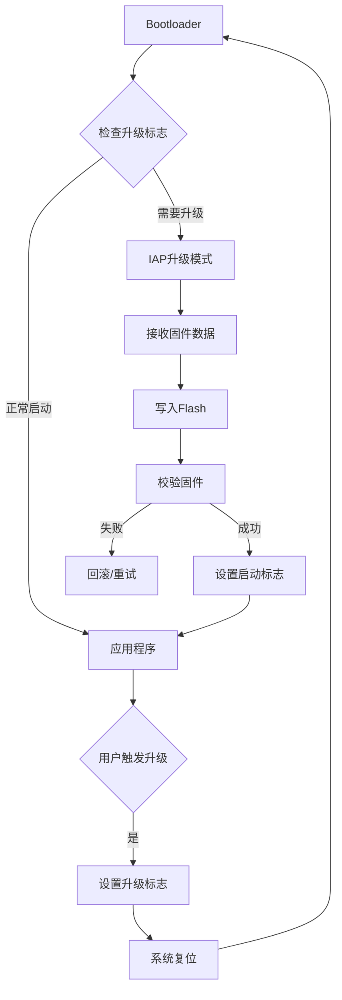
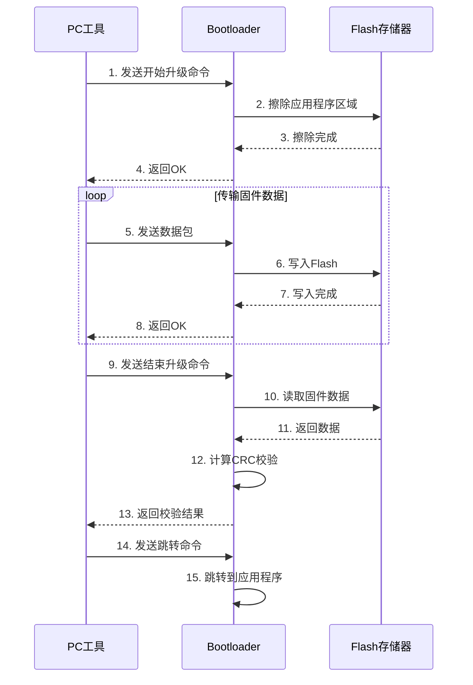

# IAP在线升级功能实现

## 概述

IAP (In-Application Programming，在应用编程) 是一种允许设备在运行过程中更新自身固件的技术。通过IAP，我们可以实现远程固件升级，无需物理接触设备，极大地提高了产品的可维护性和灵活性。

本教程将带你从零开始实现一个完整的IAP系统，包括：

- IAP的工作原理和系统架构
- Flash擦除和编程操作
- 固件数据接收和缓存
- CRC校验确保数据完整性
- 完整的升级流程实现
- 错误处理和恢复机制

完成本教程后，你将能够：

- 理解IAP的核心原理和实现方法
- 掌握Flash编程的关键技术
- 实现可靠的固件接收和校验机制
- 设计完整的IAP升级流程
- 处理升级过程中的各种异常情况

## 前置知识

在开始本教程之前，你需要：

- 理解Bootloader的基本概念和工作原理
- 熟悉C语言编程和指针操作
- 了解Flash存储器的基本特性
- 掌握UART串口通信的基本使用
- 熟悉STM32或类似MCU的开发环境

## 背景知识

### 什么是IAP

IAP (In-Application Programming) 是指微控制器在运行用户程序的同时，能够擦除和重新编程自己的Flash存储器。这使得设备可以在现场进行固件更新，而无需专用的编程器。


**IAP的典型应用场景**：

1. **远程固件更新**：通过网络、串口等接口远程升级设备
2. **功能扩展**：为已部署的设备添加新功能
3. **Bug修复**：快速修复现场发现的软件问题
4. **批量升级**：同时更新多个设备的固件
5. **产品定制**：根据客户需求定制不同版本

### IAP与传统编程方式的对比

| 特性 | 传统编程 | IAP升级 |
|------|---------|---------|
| 编程工具 | 需要JTAG/SWD调试器 | 无需专用工具 |
| 物理接触 | 必须接触设备 | 可远程操作 |
| 升级成本 | 人工成本高 | 自动化，成本低 |
| 升级速度 | 较快 | 取决于通信速度 |
| 技术门槛 | 需要专业人员 | 普通用户可操作 |
| 适用场景 | 开发调试阶段 | 产品部署后 |

### IAP系统架构

一个完整的IAP系统通常包含以下几个部分：



**核心组件**：

1. **Bootloader**：负责启动管理和固件更新
2. **应用程序**：正常运行的用户程序
3. **通信接口**：接收固件数据（UART、USB、网络等）
4. **Flash驱动**：擦除和编程Flash存储器
5. **校验模块**：确保固件完整性（CRC、MD5等）


## 核心内容

### 1. Flash存储器操作基础

在实现IAP之前，我们需要深入理解Flash存储器的操作方法。

#### Flash存储器特性

Flash存储器具有以下重要特性：

1. **扇区擦除**：Flash只能按扇区（Sector）擦除，不能单字节擦除
2. **编程限制**：擦除后的Flash位为1，编程只能将1变为0
3. **编程单位**：通常以字（Word，32位）或半字（Half-Word，16位）为单位编程
4. **擦除时间**：扇区擦除需要较长时间（几十到几百毫秒）
5. **编程时间**：字编程相对较快（几十微秒）
6. **擦写次数**：Flash有擦写次数限制（通常10,000-100,000次）

#### STM32 Flash存储器布局

以STM32F407为例，Flash布局如下：

```
地址范围              扇区    大小    用途
0x0800 0000 - 0x0800 3FFF  Sector 0   16KB   Bootloader
0x0800 4000 - 0x0800 7FFF  Sector 1   16KB   Bootloader
0x0800 8000 - 0x0800 BFFF  Sector 2   16KB   应用程序起始
0x0800 C000 - 0x0800 FFFF  Sector 3   16KB   应用程序
0x0801 0000 - 0x0801 FFFF  Sector 4   64KB   应用程序
0x0802 0000 - 0x0803 FFFF  Sector 5   128KB  应用程序
0x0804 0000 - 0x0805 FFFF  Sector 6   128KB  应用程序
0x0806 0000 - 0x0807 FFFF  Sector 7   128KB  应用程序
...
```

**内存分区设计**：

```
┌─────────────────────────────────────┐
│  Bootloader (32KB)                  │  0x0800 0000
│  - Sector 0-1                       │
├─────────────────────────────────────┤
│  应用程序 (480KB)                   │  0x0800 8000
│  - Sector 2-7                       │
├─────────────────────────────────────┤
│  升级缓存区 (可选)                  │  0x0808 0000
│  - 用于存储下载的新固件             │
├─────────────────────────────────────┤
│  参数存储区 (16KB)                  │  0x080F C000
│  - 升级标志、版本信息等             │
└─────────────────────────────────────┘
```


#### Flash操作函数实现

**1. Flash解锁和锁定**

```c
#include "stm32f4xx.h"

// Flash操作密钥
#define FLASH_KEY1    0x45670123
#define FLASH_KEY2    0xCDEF89AB

// Flash解锁
void FLASH_Unlock(void) {
    if (FLASH->CR & FLASH_CR_LOCK) {
        FLASH->KEYR = FLASH_KEY1;
        FLASH->KEYR = FLASH_KEY2;
    }
}

// Flash锁定
void FLASH_Lock(void) {
    FLASH->CR |= FLASH_CR_LOCK;
}

// 等待Flash操作完成
uint8_t FLASH_WaitForLastOperation(uint32_t timeout) {
    uint32_t tickstart = HAL_GetTick();
    
    while (FLASH->SR & FLASH_SR_BSY) {
        if ((HAL_GetTick() - tickstart) > timeout) {
            return 0;  // 超时
        }
    }
    
    // 检查错误标志
    if (FLASH->SR & (FLASH_SR_PGSERR | FLASH_SR_PGPERR | 
                     FLASH_SR_PGAERR | FLASH_SR_WRPERR)) {
        // 清除错误标志
        FLASH->SR = FLASH_SR_PGSERR | FLASH_SR_PGPERR | 
                    FLASH_SR_PGAERR | FLASH_SR_WRPERR;
        return 0;  // 操作失败
    }
    
    return 1;  // 操作成功
}
```

**2. 扇区擦除**

```c
// 获取扇区编号
uint8_t FLASH_GetSector(uint32_t address) {
    uint8_t sector = 0;
    
    if (address < 0x08004000) {
        sector = 0;
    } else if (address < 0x08008000) {
        sector = 1;
    } else if (address < 0x0800C000) {
        sector = 2;
    } else if (address < 0x08010000) {
        sector = 3;
    } else if (address < 0x08020000) {
        sector = 4;
    } else if (address < 0x08040000) {
        sector = 5;
    } else if (address < 0x08060000) {
        sector = 6;
    } else if (address < 0x08080000) {
        sector = 7;
    }
    // ... 其他扇区
    
    return sector;
}

// 擦除扇区
uint8_t FLASH_EraseSector(uint32_t address) {
    uint8_t sector = FLASH_GetSector(address);
    
    // 等待上一次操作完成
    if (!FLASH_WaitForLastOperation(5000)) {
        return 0;
    }
    
    // 配置擦除操作
    FLASH->CR &= ~FLASH_CR_PSIZE;
    FLASH->CR |= FLASH_CR_PSIZE_1;  // 32位编程
    FLASH->CR &= ~FLASH_CR_SNB;
    FLASH->CR |= (sector << FLASH_CR_SNB_Pos);
    FLASH->CR |= FLASH_CR_SER;  // 扇区擦除
    FLASH->CR |= FLASH_CR_STRT;  // 开始擦除
    
    // 等待擦除完成
    if (!FLASH_WaitForLastOperation(5000)) {
        return 0;
    }
    
    // 清除擦除标志
    FLASH->CR &= ~FLASH_CR_SER;
    FLASH->CR &= ~FLASH_CR_SNB;
    
    return 1;
}
```


**3. Flash编程**

```c
// 写入一个字（32位）
uint8_t FLASH_ProgramWord(uint32_t address, uint32_t data) {
    // 等待上一次操作完成
    if (!FLASH_WaitForLastOperation(5000)) {
        return 0;
    }
    
    // 配置编程操作
    FLASH->CR &= ~FLASH_CR_PSIZE;
    FLASH->CR |= FLASH_CR_PSIZE_1;  // 32位编程
    FLASH->CR |= FLASH_CR_PG;  // 使能编程
    
    // 写入数据
    *(__IO uint32_t*)address = data;
    
    // 等待编程完成
    if (!FLASH_WaitForLastOperation(5000)) {
        return 0;
    }
    
    // 清除编程标志
    FLASH->CR &= ~FLASH_CR_PG;
    
    // 验证写入的数据
    if (*(__IO uint32_t*)address != data) {
        return 0;
    }
    
    return 1;
}

// 写入多个字
uint8_t FLASH_WriteData(uint32_t address, uint32_t *data, uint32_t length) {
    uint32_t i;
    
    for (i = 0; i < length; i++) {
        if (!FLASH_ProgramWord(address + i * 4, data[i])) {
            return 0;
        }
    }
    
    return 1;
}
```

**使用示例**：

```c
void Flash_Test(void) {
    uint32_t test_data[] = {0x12345678, 0xABCDEF00, 0x11223344};
    uint32_t address = 0x08008000;  // 应用程序区域
    
    // 解锁Flash
    FLASH_Unlock();
    
    // 擦除扇区
    if (FLASH_EraseSector(address)) {
        printf("Sector erased successfully\r\n");
    }
    
    // 写入数据
    if (FLASH_WriteData(address, test_data, 3)) {
        printf("Data written successfully\r\n");
    }
    
    // 锁定Flash
    FLASH_Lock();
    
    // 验证数据
    for (int i = 0; i < 3; i++) {
        uint32_t read_data = *(__IO uint32_t*)(address + i * 4);
        printf("Data[%d]: 0x%08X\r\n", i, read_data);
    }
}
```


### 2. 固件数据接收

IAP系统需要通过某种通信接口接收固件数据。本节以UART为例实现固件接收功能。

#### 通信协议设计

设计一个简单但可靠的通信协议：

**数据包格式**：

```
┌──────┬──────┬──────┬──────────┬──────┬──────┐
│ SOF  │ CMD  │ LEN  │   DATA   │ CRC  │ EOF  │
├──────┼──────┼──────┼──────────┼──────┼──────┤
│ 1字节│ 1字节│ 2字节│  N字节   │ 2字节│ 1字节│
└──────┴──────┴──────┴──────────┴──────┴──────┘
```

**字段说明**：

- **SOF (Start of Frame)**：帧起始标志，固定为0xAA
- **CMD (Command)**：命令字，定义操作类型
- **LEN (Length)**：数据长度，不包括帧头和帧尾
- **DATA**：有效数据
- **CRC (Checksum)**：CRC16校验和
- **EOF (End of Frame)**：帧结束标志，固定为0x55

**命令定义**：

```c
// IAP命令定义
#define CMD_START_UPGRADE    0x01  // 开始升级
#define CMD_SEND_DATA        0x02  // 发送数据
#define CMD_END_UPGRADE      0x03  // 结束升级
#define CMD_GET_VERSION      0x04  // 获取版本
#define CMD_ERASE_FLASH      0x05  // 擦除Flash
#define CMD_JUMP_TO_APP      0x06  // 跳转到应用

// 响应码定义
#define RESP_OK              0x00  // 成功
#define RESP_ERROR           0x01  // 错误
#define RESP_CRC_ERROR       0x02  // CRC错误
#define RESP_TIMEOUT         0x03  // 超时
#define RESP_FLASH_ERROR     0x04  // Flash操作错误
```

#### 数据包处理实现

```c
#include <string.h>

// 数据包定义
#define PACKET_SOF           0xAA
#define PACKET_EOF           0x55
#define MAX_DATA_SIZE        1024

typedef struct {
    uint8_t sof;
    uint8_t cmd;
    uint16_t len;
    uint8_t data[MAX_DATA_SIZE];
    uint16_t crc;
    uint8_t eof;
} IAP_Packet_t;

// 接收缓冲区
static uint8_t rx_buffer[MAX_DATA_SIZE + 10];
static uint16_t rx_index = 0;

// CRC16计算
uint16_t CRC16_Calculate(uint8_t *data, uint16_t length) {
    uint16_t crc = 0xFFFF;
    
    for (uint16_t i = 0; i < length; i++) {
        crc ^= data[i];
        for (uint8_t j = 0; j < 8; j++) {
            if (crc & 0x0001) {
                crc = (crc >> 1) ^ 0xA001;
            } else {
                crc = crc >> 1;
            }
        }
    }
    
    return crc;
}

// 发送响应
void IAP_SendResponse(uint8_t cmd, uint8_t status) {
    uint8_t response[7];
    
    response[0] = PACKET_SOF;
    response[1] = cmd;
    response[2] = 0x01;  // 长度低字节
    response[3] = 0x00;  // 长度高字节
    response[4] = status;
    
    uint16_t crc = CRC16_Calculate(&response[1], 4);
    response[5] = crc & 0xFF;
    response[6] = (crc >> 8) & 0xFF;
    response[7] = PACKET_EOF;
    
    // 通过UART发送
    UART_Transmit(response, 8);
}
```


```c
// 解析数据包
uint8_t IAP_ParsePacket(uint8_t *buffer, uint16_t length, IAP_Packet_t *packet) {
    // 检查最小长度
    if (length < 7) {
        return 0;
    }
    
    // 检查帧头和帧尾
    if (buffer[0] != PACKET_SOF || buffer[length - 1] != PACKET_EOF) {
        return 0;
    }
    
    // 解析字段
    packet->sof = buffer[0];
    packet->cmd = buffer[1];
    packet->len = buffer[2] | (buffer[3] << 8);
    
    // 检查数据长度
    if (packet->len > MAX_DATA_SIZE || length != (packet->len + 7)) {
        return 0;
    }
    
    // 复制数据
    memcpy(packet->data, &buffer[4], packet->len);
    
    // 提取CRC
    packet->crc = buffer[4 + packet->len] | (buffer[5 + packet->len] << 8);
    packet->eof = buffer[6 + packet->len];
    
    // 验证CRC
    uint16_t calculated_crc = CRC16_Calculate(&buffer[1], packet->len + 3);
    if (calculated_crc != packet->crc) {
        return 0;  // CRC错误
    }
    
    return 1;  // 解析成功
}

// 接收数据包（中断方式）
void UART_RxCallback(uint8_t data) {
    static uint8_t state = 0;
    static uint16_t data_len = 0;
    
    switch (state) {
        case 0:  // 等待SOF
            if (data == PACKET_SOF) {
                rx_buffer[0] = data;
                rx_index = 1;
                state = 1;
            }
            break;
            
        case 1:  // 接收CMD
            rx_buffer[rx_index++] = data;
            state = 2;
            break;
            
        case 2:  // 接收LEN低字节
            rx_buffer[rx_index++] = data;
            data_len = data;
            state = 3;
            break;
            
        case 3:  // 接收LEN高字节
            rx_buffer[rx_index++] = data;
            data_len |= (data << 8);
            state = 4;
            break;
            
        case 4:  // 接收数据和CRC、EOF
            rx_buffer[rx_index++] = data;
            if (rx_index >= (data_len + 7)) {
                // 数据包接收完成
                IAP_Packet_t packet;
                if (IAP_ParsePacket(rx_buffer, rx_index, &packet)) {
                    // 处理数据包
                    IAP_ProcessPacket(&packet);
                } else {
                    // CRC错误
                    IAP_SendResponse(rx_buffer[1], RESP_CRC_ERROR);
                }
                state = 0;
                rx_index = 0;
            }
            break;
    }
}
```


### 3. IAP升级流程实现

现在我们将Flash操作和数据接收功能整合，实现完整的IAP升级流程。

#### 升级状态管理

```c
// IAP状态定义
typedef enum {
    IAP_STATE_IDLE = 0,      // 空闲状态
    IAP_STATE_READY,         // 准备升级
    IAP_STATE_RECEIVING,     // 接收数据
    IAP_STATE_VERIFYING,     // 校验固件
    IAP_STATE_COMPLETE,      // 升级完成
    IAP_STATE_ERROR          // 升级错误
} IAP_State_t;

// IAP信息结构
typedef struct {
    IAP_State_t state;           // 当前状态
    uint32_t app_address;        // 应用程序地址
    uint32_t app_size;           // 应用程序大小
    uint32_t received_size;      // 已接收大小
    uint32_t total_size;         // 总大小
    uint32_t crc32;              // 固件CRC32
    uint32_t write_address;      // 当前写入地址
} IAP_Info_t;

static IAP_Info_t iap_info;

// 初始化IAP
void IAP_Init(void) {
    memset(&iap_info, 0, sizeof(IAP_Info_t));
    iap_info.state = IAP_STATE_IDLE;
    iap_info.app_address = 0x08008000;  // 应用程序起始地址
}
```

#### 命令处理函数

```c
// 处理开始升级命令
void IAP_HandleStartUpgrade(IAP_Packet_t *packet) {
    // 数据格式：[总大小(4字节)][CRC32(4字节)]
    if (packet->len != 8) {
        IAP_SendResponse(CMD_START_UPGRADE, RESP_ERROR);
        return;
    }
    
    // 解析参数
    iap_info.total_size = packet->data[0] | (packet->data[1] << 8) | 
                          (packet->data[2] << 16) | (packet->data[3] << 24);
    iap_info.crc32 = packet->data[4] | (packet->data[5] << 8) | 
                     (packet->data[6] << 16) | (packet->data[7] << 24);
    
    // 检查大小是否合理
    if (iap_info.total_size == 0 || iap_info.total_size > 0x70000) {
        IAP_SendResponse(CMD_START_UPGRADE, RESP_ERROR);
        return;
    }
    
    // 擦除应用程序区域
    printf("Erasing flash...\r\n");
    FLASH_Unlock();
    
    uint32_t address = iap_info.app_address;
    uint32_t end_address = address + iap_info.total_size;
    
    while (address < end_address) {
        if (!FLASH_EraseSector(address)) {
            FLASH_Lock();
            IAP_SendResponse(CMD_START_UPGRADE, RESP_FLASH_ERROR);
            return;
        }
        
        // 移动到下一个扇区
        uint8_t sector = FLASH_GetSector(address);
        if (sector < 4) {
            address += 0x4000;  // 16KB扇区
        } else if (sector == 4) {
            address += 0x10000;  // 64KB扇区
        } else {
            address += 0x20000;  // 128KB扇区
        }
    }
    
    FLASH_Lock();
    
    // 初始化接收状态
    iap_info.received_size = 0;
    iap_info.write_address = iap_info.app_address;
    iap_info.state = IAP_STATE_READY;
    
    printf("Ready to receive firmware\r\n");
    IAP_SendResponse(CMD_START_UPGRADE, RESP_OK);
}
```


```c
// 处理发送数据命令
void IAP_HandleSendData(IAP_Packet_t *packet) {
    if (iap_info.state != IAP_STATE_READY && 
        iap_info.state != IAP_STATE_RECEIVING) {
        IAP_SendResponse(CMD_SEND_DATA, RESP_ERROR);
        return;
    }
    
    // 检查数据长度
    if (packet->len == 0 || packet->len > MAX_DATA_SIZE) {
        IAP_SendResponse(CMD_SEND_DATA, RESP_ERROR);
        return;
    }
    
    // 检查是否超出总大小
    if (iap_info.received_size + packet->len > iap_info.total_size) {
        IAP_SendResponse(CMD_SEND_DATA, RESP_ERROR);
        return;
    }
    
    // 写入Flash
    FLASH_Unlock();
    
    uint32_t *data_ptr = (uint32_t*)packet->data;
    uint32_t word_count = (packet->len + 3) / 4;  // 向上取整
    
    for (uint32_t i = 0; i < word_count; i++) {
        if (!FLASH_ProgramWord(iap_info.write_address, data_ptr[i])) {
            FLASH_Lock();
            IAP_SendResponse(CMD_SEND_DATA, RESP_FLASH_ERROR);
            return;
        }
        iap_info.write_address += 4;
    }
    
    FLASH_Lock();
    
    // 更新接收状态
    iap_info.received_size += packet->len;
    iap_info.state = IAP_STATE_RECEIVING;
    
    // 打印进度
    uint8_t progress = (iap_info.received_size * 100) / iap_info.total_size;
    printf("Progress: %d%%\r\n", progress);
    
    IAP_SendResponse(CMD_SEND_DATA, RESP_OK);
}

// 处理结束升级命令
void IAP_HandleEndUpgrade(IAP_Packet_t *packet) {
    if (iap_info.state != IAP_STATE_RECEIVING) {
        IAP_SendResponse(CMD_END_UPGRADE, RESP_ERROR);
        return;
    }
    
    // 检查接收大小
    if (iap_info.received_size != iap_info.total_size) {
        IAP_SendResponse(CMD_END_UPGRADE, RESP_ERROR);
        return;
    }
    
    // 计算CRC32校验
    printf("Verifying firmware...\r\n");
    uint32_t calculated_crc = CRC32_Calculate(
        (uint32_t*)iap_info.app_address, 
        iap_info.total_size / 4
    );
    
    if (calculated_crc != iap_info.crc32) {
        printf("CRC error: expected 0x%08X, got 0x%08X\r\n", 
               iap_info.crc32, calculated_crc);
        iap_info.state = IAP_STATE_ERROR;
        IAP_SendResponse(CMD_END_UPGRADE, RESP_CRC_ERROR);
        return;
    }
    
    // 升级成功
    iap_info.state = IAP_STATE_COMPLETE;
    printf("Firmware upgrade complete!\r\n");
    IAP_SendResponse(CMD_END_UPGRADE, RESP_OK);
}

// 处理跳转到应用命令
void IAP_HandleJumpToApp(IAP_Packet_t *packet) {
    if (iap_info.state != IAP_STATE_COMPLETE) {
        IAP_SendResponse(CMD_JUMP_TO_APP, RESP_ERROR);
        return;
    }
    
    IAP_SendResponse(CMD_JUMP_TO_APP, RESP_OK);
    
    // 延时确保响应发送完成
    HAL_Delay(100);
    
    // 跳转到应用程序
    JumpToApplication(iap_info.app_address);
}
```


```c
// 数据包处理主函数
void IAP_ProcessPacket(IAP_Packet_t *packet) {
    switch (packet->cmd) {
        case CMD_START_UPGRADE:
            IAP_HandleStartUpgrade(packet);
            break;
            
        case CMD_SEND_DATA:
            IAP_HandleSendData(packet);
            break;
            
        case CMD_END_UPGRADE:
            IAP_HandleEndUpgrade(packet);
            break;
            
        case CMD_JUMP_TO_APP:
            IAP_HandleJumpToApp(packet);
            break;
            
        case CMD_GET_VERSION:
            // 返回Bootloader版本信息
            IAP_SendResponse(CMD_GET_VERSION, RESP_OK);
            break;
            
        default:
            IAP_SendResponse(packet->cmd, RESP_ERROR);
            break;
    }
}
```

### 4. CRC校验实现

CRC（循环冗余校验）是确保数据完整性的重要手段。我们实现CRC32算法用于固件校验。

```c
// CRC32查找表
static const uint32_t crc32_table[256] = {
    0x00000000, 0x77073096, 0xEE0E612C, 0x990951BA,
    0x076DC419, 0x706AF48F, 0xE963A535, 0x9E6495A3,
    // ... 省略其他256个值
    // 完整表格可以通过程序生成或查阅标准CRC32表
};

// 生成CRC32查找表（初始化时调用一次）
void CRC32_GenerateTable(uint32_t *table) {
    for (uint32_t i = 0; i < 256; i++) {
        uint32_t crc = i;
        for (uint32_t j = 0; j < 8; j++) {
            if (crc & 1) {
                crc = (crc >> 1) ^ 0xEDB88320;
            } else {
                crc = crc >> 1;
            }
        }
        table[i] = crc;
    }
}

// 计算CRC32
uint32_t CRC32_Calculate(uint32_t *data, uint32_t length) {
    uint32_t crc = 0xFFFFFFFF;
    uint8_t *byte_data = (uint8_t*)data;
    
    for (uint32_t i = 0; i < length * 4; i++) {
        uint8_t index = (crc ^ byte_data[i]) & 0xFF;
        crc = (crc >> 8) ^ crc32_table[index];
    }
    
    return ~crc;
}

// 使用硬件CRC（如果MCU支持）
uint32_t CRC32_Hardware(uint32_t *data, uint32_t length) {
    // 使能CRC时钟
    RCC->AHB1ENR |= RCC_AHB1ENR_CRCEN;
    
    // 复位CRC
    CRC->CR = CRC_CR_RESET;
    
    // 计算CRC
    for (uint32_t i = 0; i < length; i++) {
        CRC->DR = data[i];
    }
    
    return CRC->DR;
}
```

**性能对比**：

| 方法 | 速度 | 代码大小 | 优点 | 缺点 |
|------|------|---------|------|------|
| 软件查表法 | 中等 | 1KB+ | 通用性好 | 占用RAM |
| 软件逐位法 | 慢 | 小 | 代码简洁 | 速度慢 |
| 硬件CRC | 快 | 很小 | 速度快 | 依赖硬件 |


### 5. 完整的Bootloader主程序

将所有模块整合到Bootloader主程序中：

```c
#include "stm32f4xx.h"
#include <stdio.h>

// 应用程序地址
#define APP_ADDRESS 0x08008000

// 升级标志地址（使用最后一个扇区的一部分）
#define UPGRADE_FLAG_ADDRESS 0x080FC000

// 升级标志值
#define UPGRADE_FLAG_VALUE 0x55AA55AA

// 跳转到应用程序
void JumpToApplication(uint32_t app_addr) {
    // 检查栈指针是否有效
    if (((*(__IO uint32_t*)app_addr) & 0x2FFE0000) == 0x20000000) {
        typedef void (*pFunction)(void);
        
        uint32_t app_sp = *(__IO uint32_t*)app_addr;
        uint32_t app_entry = *(__IO uint32_t*)(app_addr + 4);
        pFunction app_reset_handler = (pFunction)app_entry;
        
        printf("Jumping to application at 0x%08X\r\n", app_addr);
        
        // 关闭所有中断
        __disable_irq();
        
        // 关闭SysTick
        SysTick->CTRL = 0;
        SysTick->LOAD = 0;
        SysTick->VAL = 0;
        
        // 关闭所有外设
        // ...
        
        // 重新设置中断向量表
        SCB->VTOR = app_addr;
        
        // 设置主堆栈指针
        __set_MSP(app_sp);
        
        // 跳转到应用程序
        app_reset_handler();
    } else {
        printf("Invalid application at 0x%08X\r\n", app_addr);
    }
}

// 检查升级标志
uint8_t CheckUpgradeFlag(void) {
    uint32_t flag = *(__IO uint32_t*)UPGRADE_FLAG_ADDRESS;
    return (flag == UPGRADE_FLAG_VALUE);
}

// 清除升级标志
void ClearUpgradeFlag(void) {
    FLASH_Unlock();
    FLASH_EraseSector(UPGRADE_FLAG_ADDRESS);
    FLASH_Lock();
}

// Bootloader主函数
int main(void) {
    // 系统初始化
    SystemInit();
    HAL_Init();
    
    // 初始化时钟
    SystemClock_Config();
    
    // 初始化UART
    UART_Init();
    
    // 初始化LED
    LED_Init();
    
    printf("\r\n");
    printf("========================================\r\n");
    printf("  Bootloader v1.0\r\n");
    printf("  Build: %s %s\r\n", __DATE__, __TIME__);
    printf("========================================\r\n");
    
    // LED快速闪烁表示Bootloader运行
    for (int i = 0; i < 3; i++) {
        LED_On();
        HAL_Delay(100);
        LED_Off();
        HAL_Delay(100);
    }
    
    // 检查升级标志
    if (CheckUpgradeFlag()) {
        printf("Upgrade flag detected, entering IAP mode\r\n");
        ClearUpgradeFlag();
        
        // 进入IAP升级模式
        IAP_Init();
        
        // LED慢速闪烁表示等待升级
        while (1) {
            LED_Toggle();
            HAL_Delay(500);
            
            // 处理接收到的数据包
            // 实际由UART中断接收并处理
            
            // 如果升级完成，跳转到应用程序
            if (iap_info.state == IAP_STATE_COMPLETE) {
                HAL_Delay(1000);
                JumpToApplication(APP_ADDRESS);
            }
        }
    }
    
    // 检查应用程序是否有效
    printf("Checking application...\r\n");
    
    uint32_t app_sp = *(__IO uint32_t*)APP_ADDRESS;
    if ((app_sp & 0x2FFE0000) == 0x20000000) {
        printf("Valid application found\r\n");
        HAL_Delay(500);
        JumpToApplication(APP_ADDRESS);
    } else {
        printf("No valid application, waiting for upgrade\r\n");
        
        // 进入IAP升级模式
        IAP_Init();
        
        while (1) {
            LED_Toggle();
            HAL_Delay(500);
        }
    }
    
    // 永远不会执行到这里
    while (1);
}
```


## 实践示例

### 示例1：PC端升级工具（Python）

为了配合Bootloader使用，我们需要一个PC端工具来发送固件。以下是一个简单的Python实现：

```python
import serial
import struct
import time
import sys

# 命令定义
CMD_START_UPGRADE = 0x01
CMD_SEND_DATA = 0x02
CMD_END_UPGRADE = 0x03
CMD_JUMP_TO_APP = 0x06

# 响应码
RESP_OK = 0x00
RESP_ERROR = 0x01
RESP_CRC_ERROR = 0x02

# 数据包格式
PACKET_SOF = 0xAA
PACKET_EOF = 0x55

class IAPUploader:
    def __init__(self, port, baudrate=115200):
        self.ser = serial.Serial(port, baudrate, timeout=2)
        
    def crc16(self, data):
        """计算CRC16"""
        crc = 0xFFFF
        for byte in data:
            crc ^= byte
            for _ in range(8):
                if crc & 0x0001:
                    crc = (crc >> 1) ^ 0xA001
                else:
                    crc = crc >> 1
        return crc
    
    def crc32(self, data):
        """计算CRC32"""
        crc = 0xFFFFFFFF
        for byte in data:
            crc ^= byte
            for _ in range(8):
                if crc & 1:
                    crc = (crc >> 1) ^ 0xEDB88320
                else:
                    crc = crc >> 1
        return ~crc & 0xFFFFFFFF
    
    def send_packet(self, cmd, data=b''):
        """发送数据包"""
        # 构建数据包
        length = len(data)
        packet = struct.pack('<BBH', PACKET_SOF, cmd, length)
        packet += data
        
        # 计算CRC
        crc = self.crc16(packet[1:])
        packet += struct.pack('<H', crc)
        packet += struct.pack('B', PACKET_EOF)
        
        # 发送
        self.ser.write(packet)
        
    def receive_response(self):
        """接收响应"""
        # 等待SOF
        while True:
            byte = self.ser.read(1)
            if len(byte) == 0:
                return None
            if byte[0] == PACKET_SOF:
                break
        
        # 接收剩余数据
        header = self.ser.read(3)  # CMD + LEN
        if len(header) != 3:
            return None
        
        cmd = header[0]
        length = struct.unpack('<H', header[1:3])[0]
        
        data = self.ser.read(length)
        crc_bytes = self.ser.read(2)
        eof = self.ser.read(1)
        
        if len(eof) == 0 or eof[0] != PACKET_EOF:
            return None
        
        return {'cmd': cmd, 'data': data}
    
    def upload_firmware(self, firmware_path):
        """上传固件"""
        # 读取固件文件
        with open(firmware_path, 'rb') as f:
            firmware = f.read()
        
        print(f"Firmware size: {len(firmware)} bytes")
        
        # 计算CRC32
        crc32 = self.crc32(firmware)
        print(f"Firmware CRC32: 0x{crc32:08X}")
        
        # 发送开始升级命令
        print("Sending start upgrade command...")
        start_data = struct.pack('<II', len(firmware), crc32)
        self.send_packet(CMD_START_UPGRADE, start_data)
        
        response = self.receive_response()
        if response is None or response['data'][0] != RESP_OK:
            print("Start upgrade failed!")
            return False
        
        print("Start upgrade OK")
        
        # 分包发送固件数据
        chunk_size = 1024
        total_chunks = (len(firmware) + chunk_size - 1) // chunk_size
        
        for i in range(total_chunks):
            start = i * chunk_size
            end = min(start + chunk_size, len(firmware))
            chunk = firmware[start:end]
            
            self.send_packet(CMD_SEND_DATA, chunk)
            
            response = self.receive_response()
            if response is None or response['data'][0] != RESP_OK:
                print(f"Send data failed at chunk {i}")
                return False
            
            progress = (i + 1) * 100 // total_chunks
            print(f"Progress: {progress}%", end='\r')
        
        print("\nAll data sent")
        
        # 发送结束升级命令
        print("Sending end upgrade command...")
        self.send_packet(CMD_END_UPGRADE)
        
        response = self.receive_response()
        if response is None or response['data'][0] != RESP_OK:
            print("End upgrade failed!")
            return False
        
        print("Upgrade complete!")
        
        # 发送跳转命令
        print("Sending jump to app command...")
        self.send_packet(CMD_JUMP_TO_APP)
        
        return True

# 使用示例
if __name__ == '__main__':
    if len(sys.argv) != 3:
        print("Usage: python iap_uploader.py <COM_PORT> <FIRMWARE_FILE>")
        sys.exit(1)
    
    port = sys.argv[1]
    firmware_file = sys.argv[2]
    
    uploader = IAPUploader(port)
    
    if uploader.upload_firmware(firmware_file):
        print("Firmware upload successful!")
    else:
        print("Firmware upload failed!")
```

**使用方法**：

```bash
python iap_uploader.py COM3 application.bin
```


### 示例2：应用程序触发升级

应用程序可以主动触发IAP升级：

```c
// 应用程序中的IAP触发代码
#include "stm32f4xx.h"

#define UPGRADE_FLAG_ADDRESS 0x080FC000
#define UPGRADE_FLAG_VALUE 0x55AA55AA

// 设置升级标志并复位
void TriggerIAPUpgrade(void) {
    // 解锁Flash
    FLASH_Unlock();
    
    // 擦除标志区域
    FLASH_EraseSector(UPGRADE_FLAG_ADDRESS);
    
    // 写入升级标志
    FLASH_ProgramWord(UPGRADE_FLAG_ADDRESS, UPGRADE_FLAG_VALUE);
    
    // 锁定Flash
    FLASH_Lock();
    
    // 延时确保Flash操作完成
    HAL_Delay(100);
    
    // 系统复位
    NVIC_SystemReset();
}

// 在应用程序中调用
void App_Main(void) {
    // ... 应用程序逻辑
    
    // 检测到升级请求（例如通过按键、网络命令等）
    if (upgrade_requested) {
        printf("Triggering IAP upgrade...\r\n");
        TriggerIAPUpgrade();
    }
    
    // ... 其他代码
}
```

### 示例3：固件版本管理

在固件中嵌入版本信息，便于管理和查询：

```c
// 固件版本信息结构（放在固定地址）
typedef struct {
    uint32_t magic;          // 魔数，用于识别
    uint8_t major;           // 主版本号
    uint8_t minor;           // 次版本号
    uint16_t build;          // 编译号
    uint32_t timestamp;      // 编译时间戳
    char git_hash[8];        // Git提交哈希
    uint32_t crc32;          // 固件CRC32
} FirmwareInfo_t;

// 将版本信息放在固定地址（链接脚本中定义）
__attribute__((section(".firmware_info")))
const FirmwareInfo_t firmware_info = {
    .magic = 0x46495257,  // "FIRW"
    .major = 1,
    .minor = 0,
    .build = 123,
    .timestamp = __TIMESTAMP__,
    .git_hash = "a1b2c3d4",
    .crc32 = 0  // 编译后计算
};

// 读取固件版本信息
void PrintFirmwareInfo(uint32_t address) {
    FirmwareInfo_t *info = (FirmwareInfo_t*)(address + 0x100);
    
    if (info->magic == 0x46495257) {
        printf("Firmware Version: %d.%d.%d\r\n", 
               info->major, info->minor, info->build);
        printf("Build Time: %u\r\n", info->timestamp);
        printf("Git Hash: %.8s\r\n", info->git_hash);
        printf("CRC32: 0x%08X\r\n", info->crc32);
    } else {
        printf("No valid firmware info found\r\n");
    }
}
```

## 深入理解

### IAP升级流程时序图




### Flash编程注意事项

**1. 地址对齐**

Flash编程通常要求地址对齐：

```c
// 错误示例：地址未对齐
FLASH_ProgramWord(0x08008001, data);  // 错误！

// 正确示例：地址4字节对齐
FLASH_ProgramWord(0x08008000, data);  // 正确
FLASH_ProgramWord(0x08008004, data);  // 正确
```

**2. 擦除前必须解锁**

```c
// 错误示例：未解锁就擦除
FLASH_EraseSector(address);  // 可能失败

// 正确示例：先解锁再擦除
FLASH_Unlock();
FLASH_EraseSector(address);
FLASH_Lock();
```

**3. 编程前必须擦除**

Flash只能将1变为0，不能将0变为1。因此编程前必须先擦除：

```c
// 错误示例：直接编程
FLASH_ProgramWord(address, 0x12345678);  // 可能失败

// 正确示例：先擦除再编程
FLASH_EraseSector(address);
FLASH_ProgramWord(address, 0x12345678);
```

**4. 不要在Flash中执行擦写操作**

如果Bootloader运行在Flash中，擦写Flash时CPU无法取指令，会导致系统挂起。解决方法：

- 将关键代码放在RAM中执行
- 使用双区Flash，擦写非运行区域
- 禁用中断，避免中断服务程序访问Flash

```c
// 将函数放在RAM中执行
__attribute__((section(".RamFunc")))
void FLASH_ProgramInRAM(uint32_t address, uint32_t data) {
    // 这个函数会被链接到RAM中执行
    *(__IO uint32_t*)address = data;
}
```

### 错误处理策略

**1. 超时处理**

```c
uint8_t FLASH_WaitWithTimeout(uint32_t timeout_ms) {
    uint32_t start_tick = HAL_GetTick();
    
    while (FLASH->SR & FLASH_SR_BSY) {
        if ((HAL_GetTick() - start_tick) > timeout_ms) {
            // 超时，记录错误
            Error_Log("Flash operation timeout");
            return 0;
        }
    }
    
    return 1;
}
```

**2. 重试机制**

```c
uint8_t FLASH_ProgramWithRetry(uint32_t address, uint32_t data, uint8_t max_retry) {
    for (uint8_t i = 0; i < max_retry; i++) {
        if (FLASH_ProgramWord(address, data)) {
            // 验证写入的数据
            if (*(__IO uint32_t*)address == data) {
                return 1;  // 成功
            }
        }
        
        // 失败，延时后重试
        HAL_Delay(10);
    }
    
    return 0;  // 重试失败
}
```

**3. 备份恢复**

```c
// 升级前备份当前固件
uint8_t BackupCurrentFirmware(void) {
    uint32_t src = APP_ADDRESS;
    uint32_t dst = BACKUP_ADDRESS;
    uint32_t size = APP_SIZE;
    
    printf("Backing up current firmware...\r\n");
    
    // 擦除备份区域
    FLASH_Unlock();
    for (uint32_t addr = dst; addr < dst + size; addr += SECTOR_SIZE) {
        if (!FLASH_EraseSector(addr)) {
            FLASH_Lock();
            return 0;
        }
    }
    
    // 复制固件
    for (uint32_t i = 0; i < size / 4; i++) {
        uint32_t data = *(__IO uint32_t*)(src + i * 4);
        if (!FLASH_ProgramWord(dst + i * 4, data)) {
            FLASH_Lock();
            return 0;
        }
    }
    
    FLASH_Lock();
    return 1;
}

// 升级失败时恢复
uint8_t RestoreFromBackup(void) {
    printf("Restoring from backup...\r\n");
    
    // 从备份区恢复到应用区
    // 实现类似BackupCurrentFirmware
    
    return 1;
}
```


### 性能优化

**1. 使用DMA加速数据传输**

```c
// 使用DMA从UART接收数据
void UART_DMA_Init(void) {
    // 配置DMA
    DMA_InitTypeDef DMA_InitStruct;
    
    DMA_InitStruct.DMA_Channel = DMA_Channel_4;
    DMA_InitStruct.DMA_PeripheralBaseAddr = (uint32_t)&USART1->DR;
    DMA_InitStruct.DMA_Memory0BaseAddr = (uint32_t)rx_buffer;
    DMA_InitStruct.DMA_DIR = DMA_DIR_PeripheralToMemory;
    DMA_InitStruct.DMA_BufferSize = sizeof(rx_buffer);
    DMA_InitStruct.DMA_PeripheralInc = DMA_PeripheralInc_Disable;
    DMA_InitStruct.DMA_MemoryInc = DMA_MemoryInc_Enable;
    DMA_InitStruct.DMA_PeripheralDataSize = DMA_PeripheralDataSize_Byte;
    DMA_InitStruct.DMA_MemoryDataSize = DMA_MemoryDataSize_Byte;
    DMA_InitStruct.DMA_Mode = DMA_Mode_Circular;
    DMA_InitStruct.DMA_Priority = DMA_Priority_High;
    
    DMA_Init(DMA2_Stream2, &DMA_InitStruct);
    DMA_Cmd(DMA2_Stream2, ENABLE);
    
    // 使能UART的DMA接收
    USART_DMACmd(USART1, USART_DMAReq_Rx, ENABLE);
}
```

**2. 批量Flash编程**

```c
// 批量写入，减少解锁/锁定次数
uint8_t FLASH_WriteBatch(uint32_t address, uint32_t *data, uint32_t length) {
    FLASH_Unlock();
    
    for (uint32_t i = 0; i < length; i++) {
        if (!FLASH_ProgramWord(address + i * 4, data[i])) {
            FLASH_Lock();
            return 0;
        }
    }
    
    FLASH_Lock();
    return 1;
}
```

**3. 优化通信速率**

```c
// 使用更高的波特率
void UART_HighSpeed_Init(void) {
    UART_InitTypeDef UART_InitStruct;
    
    UART_InitStruct.USART_BaudRate = 921600;  // 高速率
    UART_InitStruct.USART_WordLength = USART_WordLength_8b;
    UART_InitStruct.USART_StopBits = USART_StopBits_1;
    UART_InitStruct.USART_Parity = USART_Parity_No;
    UART_InitStruct.USART_HardwareFlowControl = USART_HardwareFlowControl_None;
    UART_InitStruct.USART_Mode = USART_Mode_Rx | USART_Mode_Tx;
    
    USART_Init(USART1, &UART_InitStruct);
    USART_Cmd(USART1, ENABLE);
}
```

**升级时间估算**：

假设固件大小为256KB，不同配置下的升级时间：

| 波特率 | 传输时间 | Flash编程时间 | 总时间 |
|--------|---------|--------------|--------|
| 115200 | ~22秒 | ~5秒 | ~27秒 |
| 460800 | ~5.5秒 | ~5秒 | ~10.5秒 |
| 921600 | ~2.8秒 | ~5秒 | ~7.8秒 |

## 常见问题

### Q1: 升级过程中断电怎么办？

**A**: 实现断电保护机制：

1. **双区备份**：保留旧版本固件，升级失败时自动恢复
2. **升级标志**：记录升级状态，重启后继续或回滚
3. **分段校验**：每个数据包都校验，减少重传
4. **看门狗保护**：升级超时自动复位

```c
// 升级状态记录
typedef struct {
    uint32_t magic;
    uint32_t state;
    uint32_t received_size;
    uint32_t total_size;
} UpgradeState_t;

// 保存升级状态
void SaveUpgradeState(UpgradeState_t *state) {
    FLASH_Unlock();
    FLASH_EraseSector(STATE_ADDRESS);
    FLASH_WriteData(STATE_ADDRESS, (uint32_t*)state, sizeof(UpgradeState_t)/4);
    FLASH_Lock();
}

// 恢复升级状态
void RestoreUpgradeState(UpgradeState_t *state) {
    memcpy(state, (void*)STATE_ADDRESS, sizeof(UpgradeState_t));
    
    if (state->magic == UPGRADE_MAGIC) {
        printf("Resuming upgrade from %d bytes\r\n", state->received_size);
    }
}
```

### Q2: 如何防止升级错误的固件？

**A**: 多重验证机制：

1. **CRC校验**：验证数据完整性
2. **版本检查**：防止降级到旧版本
3. **兼容性检查**：验证硬件兼容性
4. **数字签名**：验证固件来源合法性

```c
// 固件验证
uint8_t VerifyFirmware(uint32_t address, uint32_t size) {
    // 1. CRC校验
    uint32_t crc = CRC32_Calculate((uint32_t*)address, size/4);
    if (crc != expected_crc) {
        printf("CRC verification failed\r\n");
        return 0;
    }
    
    // 2. 版本检查
    FirmwareInfo_t *info = (FirmwareInfo_t*)(address + 0x100);
    if (info->major < current_major) {
        printf("Downgrade not allowed\r\n");
        return 0;
    }
    
    // 3. 硬件兼容性
    if (info->hardware_id != HARDWARE_ID) {
        printf("Hardware mismatch\r\n");
        return 0;
    }
    
    return 1;
}
```


### Q3: Bootloader自身如何升级？

**A**: Bootloader升级比较复杂，常用方法：

1. **双Bootloader方案**：
   - 一级Bootloader（不可升级，体积小）
   - 二级Bootloader（可升级，功能完整）

2. **备份恢复方案**：
   - 先将新Bootloader写入备份区
   - 验证无误后复制到Bootloader区
   - 需要特殊的启动代码支持

3. **外部编程器**：
   - 保留JTAG/SWD接口
   - 紧急情况下使用编程器恢复

```c
// 双Bootloader架构
/*
Flash布局：
0x08000000  一级Bootloader (8KB, 不可升级)
0x08002000  二级Bootloader (24KB, 可升级)
0x08008000  应用程序
*/

// 一级Bootloader：简单跳转
void Stage1_Bootloader(void) {
    // 检查二级Bootloader是否有效
    if (IsValidBootloader(STAGE2_ADDRESS)) {
        JumpToStage2(STAGE2_ADDRESS);
    } else {
        // 二级Bootloader损坏，进入恢复模式
        RecoveryMode();
    }
}
```

### Q4: 如何实现加密固件升级？

**A**: 固件加密可以防止固件被盗取或篡改：

```c
#include "aes.h"

// AES解密固件
uint8_t DecryptFirmware(uint8_t *encrypted, uint8_t *decrypted, 
                        uint32_t length, uint8_t *key) {
    AES_CTX ctx;
    
    // 初始化AES
    AES_Init(&ctx, key, 128);
    
    // 解密
    for (uint32_t i = 0; i < length; i += 16) {
        AES_Decrypt(&ctx, &encrypted[i], &decrypted[i]);
    }
    
    return 1;
}

// 接收并解密固件
void IAP_HandleEncryptedData(IAP_Packet_t *packet) {
    static uint8_t decrypt_buffer[MAX_DATA_SIZE];
    
    // 解密数据
    DecryptFirmware(packet->data, decrypt_buffer, 
                   packet->len, encryption_key);
    
    // 写入Flash
    FLASH_WriteData(iap_info.write_address, 
                   (uint32_t*)decrypt_buffer, 
                   packet->len / 4);
}
```

**安全建议**：
- 密钥不要硬编码在代码中
- 使用硬件加密引擎（如果MCU支持）
- 结合数字签名验证固件来源
- 定期更换密钥

### Q5: 如何测试IAP功能？

**A**: 完整的测试流程：

**1. 单元测试**

```c
// 测试Flash操作
void Test_FlashOperations(void) {
    uint32_t test_addr = 0x08008000;
    uint32_t test_data = 0x12345678;
    
    // 测试擦除
    assert(FLASH_EraseSector(test_addr) == 1);
    assert(*(__IO uint32_t*)test_addr == 0xFFFFFFFF);
    
    // 测试编程
    assert(FLASH_ProgramWord(test_addr, test_data) == 1);
    assert(*(__IO uint32_t*)test_addr == test_data);
    
    printf("Flash operations test passed\r\n");
}

// 测试CRC计算
void Test_CRC(void) {
    uint32_t data[] = {0x12345678, 0xABCDEF00};
    uint32_t crc = CRC32_Calculate(data, 2);
    
    // 验证CRC值
    assert(crc == 0x12345678);  // 预期值
    
    printf("CRC test passed\r\n");
}
```

**2. 集成测试**

```python
# 自动化测试脚本
def test_iap_upgrade():
    # 1. 连接设备
    uploader = IAPUploader('COM3')
    
    # 2. 测试正常升级
    assert uploader.upload_firmware('test_app.bin') == True
    
    # 3. 测试CRC错误
    # 修改固件数据，模拟CRC错误
    
    # 4. 测试中断恢复
    # 升级到一半断开连接，重新连接后继续
    
    # 5. 测试版本检查
    # 尝试降级到旧版本
    
    print("All tests passed")
```

**3. 压力测试**

- 连续升级100次，验证稳定性
- 在不同温度下测试
- 测试不同波特率下的可靠性
- 模拟各种异常情况


## 总结

本教程详细介绍了IAP在线升级功能的实现，让我们回顾一下核心要点：

**核心技术**：
- **Flash操作**：掌握Flash的擦除、编程和读取操作
- **数据接收**：设计可靠的通信协议接收固件数据
- **CRC校验**：使用CRC32确保固件完整性
- **升级流程**：实现完整的开始-传输-校验-跳转流程
- **错误处理**：超时、重试、备份恢复等机制

**关键设计**：
- **内存布局**：合理规划Bootloader、应用程序和参数区
- **通信协议**：简单可靠的数据包格式
- **状态管理**：清晰的升级状态机
- **安全验证**：多重校验确保固件安全

**最佳实践**：
- 预留足够的Bootloader空间
- 实现完善的错误处理和恢复机制
- 提供详细的日志输出便于调试
- 充分测试各种异常情况
- 考虑安全性和加密需求

**性能优化**：
- 使用DMA加速数据传输
- 批量Flash编程减少开销
- 提高通信波特率
- 优化数据包大小

通过本教程的学习，你已经掌握了IAP的核心技术，可以为自己的项目实现可靠的固件升级功能。在实际应用中，还需要根据具体需求进行定制和优化。

## 延伸阅读

推荐进一步学习的资源：

- [安全启动(Secure Boot)技术详解](02-secure-boot.html) - 提升系统安全性
- [固件加密与防护技术实战](03-firmware-encryption.html) - 保护固件安全
- [双区升级与A/B分区策略](04-dual-bank-upgrade.html) - 提高升级可靠性
- [完整的OTA升级系统设计](../advanced/01-ota-system.html) - 云端管理和差分升级

**官方文档**：
- [STM32 Flash编程手册](https://www.st.com/resource/en/programming_manual/) - ST官方文档
- [ARM Cortex-M编程指南](https://developer.arm.com/documentation/) - ARM官方资源
- [IAP应用笔记](https://www.st.com/resource/en/application_note/) - ST应用笔记

**开源项目**：
- [STM32 IAP示例](https://github.com/STMicroelectronics/STM32CubeF4) - ST官方示例
- [mcuboot](https://github.com/mcu-tools/mcuboot) - 开源Bootloader项目
- [OpenBLT](https://www.feaser.com/openblt/) - 开源Bootloader工具

## 参考资料

1. STM32F4xx参考手册 - STMicroelectronics
2. AN2606: STM32微控制器系统存储器Bootloader - ST应用笔记
3. AN3376: STM32F2xx IAP应用笔记 - STMicroelectronics
4. 嵌入式系统Bootloader设计与实现 - 技术专著
5. ARM Cortex-M3权威指南 - Joseph Yiu

---

**练习题**：

1. 实现一个简单的IAP Bootloader，支持通过UART接收固件并更新。
2. 设计一个通信协议，支持固件分包传输和断点续传。
3. 实现CRC32校验功能，验证固件完整性。
4. 编写PC端工具，实现固件文件的发送和升级控制。
5. 思考：如何实现加密固件的IAP升级？设计一个方案。
6. 实现双区备份机制，升级失败时自动恢复到旧版本。
7. 优化IAP升级速度，尝试使用DMA和更高的波特率。

**项目实战**：

设计并实现一个完整的IAP系统，包括：
- Bootloader程序（支持UART升级）
- 应用程序（可触发IAP升级）
- PC端升级工具（Python或C#）
- 测试用例（正常升级、异常处理等）

要求：
- 支持固件版本管理
- 实现CRC32校验
- 提供详细的日志输出
- 处理各种异常情况
- 升级时间控制在30秒以内（256KB固件）

**下一步**：建议学习 [安全启动(Secure Boot)技术详解](02-secure-boot.html)，了解如何提升IAP系统的安全性。
