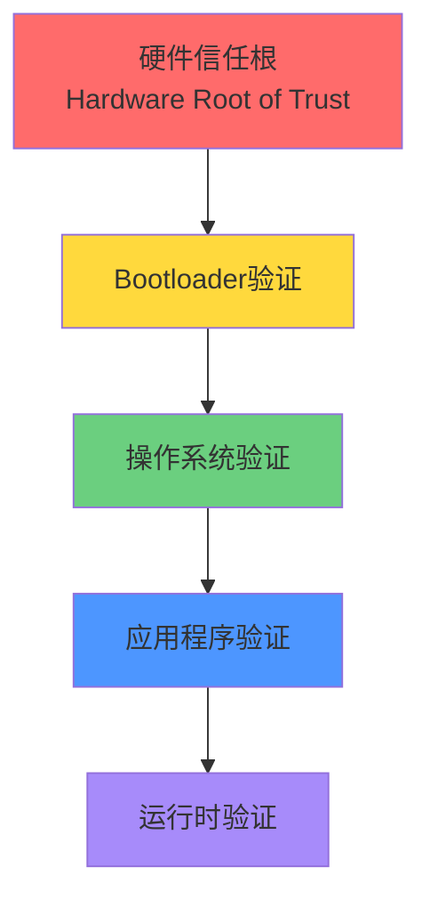
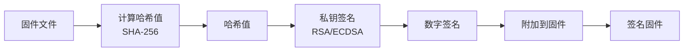
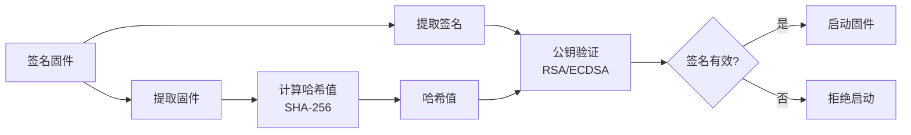
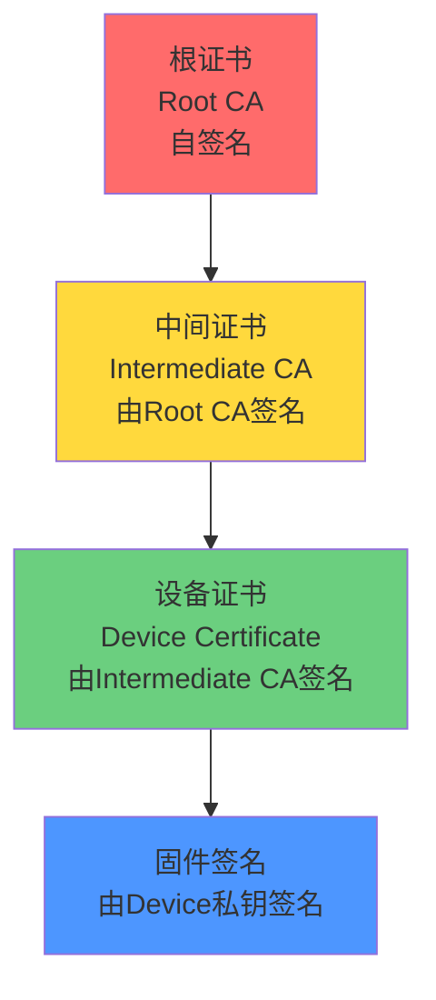

# 安全启动(Secure Boot)技术详解

## 概述

安全启动(Secure Boot)是一种确保设备只运行经过授权和验证的固件的安全机制。在当今网络安全威胁日益严峻的环境下，安全启动已成为嵌入式系统安全的基石，它通过建立从硬件到软件的完整信任链，防止恶意代码在系统启动阶段被加载和执行。

本文将深入探讨安全启动的核心技术，包括：

- 安全启动的基本原理和工作流程
- 数字签名与公钥基础设施(PKI)
- 证书链和信任根的建立
- 安全芯片(TPM/TEE)的应用
- 防篡改和防回滚机制
- 实际项目中的安全启动实现

完成本文学习后，你将能够：

- 理解安全启动的核心概念和重要性
- 掌握数字签名和证书验证的原理
- 了解如何建立完整的信任链
- 学会使用安全芯片增强系统安全
- 设计和实现基本的安全启动方案
- 识别和防范常见的安全威胁

## 前置知识

在开始本文学习之前，你需要：

- 理解Bootloader的基本概念和工作原理
- 熟悉C语言编程和指针操作
- 了解基本的密码学概念（对称加密、非对称加密）
- 掌握Flash存储器的操作方法
- 了解IAP在线升级的实现原理


## 背景知识

### 为什么需要安全启动

在传统的嵌入式系统中，Bootloader通常只验证固件的完整性（如CRC校验），但不验证固件的来源和合法性。这带来了严重的安全隐患：

**常见安全威胁**：

1. **固件篡改**：攻击者修改固件，植入恶意代码
2. **固件替换**：用未授权的固件替换合法固件
3. **降级攻击**：将固件降级到存在漏洞的旧版本
4. **中间人攻击**：在固件传输过程中拦截和修改
5. **调试接口攻击**：通过JTAG等接口读取或修改固件

**安全启动的价值**：

- **保护知识产权**：防止固件被非法复制和逆向
- **确保系统完整性**：保证运行的是未被篡改的合法固件
- **满足合规要求**：符合行业安全标准（如汽车AUTOSAR、医疗IEC 62304）
- **建立信任基础**：为整个系统安全提供可信根
- **防止供应链攻击**：确保从生产到部署的全流程安全

### 安全启动的核心概念

**信任链(Chain of Trust)**：

安全启动的核心是建立一条从硬件到软件的信任链，每一级都验证下一级的合法性：



**关键原则**：

1. **信任根不可变**：硬件信任根必须是不可修改的
2. **逐级验证**：每一级在启动前验证下一级
3. **验证失败即停止**：任何验证失败都应停止启动
4. **密钥安全存储**：验证密钥必须安全存储，防止泄露


## 核心内容

### 1. 数字签名基础

数字签名是安全启动的核心技术，它使用非对称加密算法确保固件的完整性和来源可信。

#### 非对称加密原理

非对称加密使用一对密钥：公钥(Public Key)和私钥(Private Key)。

**基本特性**：

- **私钥签名，公钥验证**：用私钥对数据签名，用公钥验证签名
- **私钥保密**：私钥必须严格保密，只有授权方持有
- **公钥公开**：公钥可以公开分发，嵌入到设备中
- **不可伪造**：没有私钥无法伪造有效签名

**常用算法**：

| 算法 | 密钥长度 | 签名长度 | 安全性 | 性能 | 适用场景 |
|------|---------|---------|--------|------|---------|
| RSA-2048 | 2048位 | 256字节 | 高 | 中等 | 通用场景 |
| RSA-4096 | 4096位 | 512字节 | 很高 | 较慢 | 高安全要求 |
| ECDSA-256 | 256位 | 64字节 | 高 | 快 | 资源受限设备 |
| Ed25519 | 256位 | 64字节 | 很高 | 很快 | 现代推荐 |

#### 数字签名流程

**签名生成（开发端）**：



**签名验证（设备端）**：



#### 哈希算法

哈希算法将任意长度的数据转换为固定长度的摘要，用于快速验证数据完整性。

**常用哈希算法**：

- **SHA-256**：256位输出，安全性高，广泛使用
- **SHA-384/512**：更长输出，更高安全性
- **SHA-3**：最新标准，抗量子计算攻击
- **SM3**：中国国密标准，256位输出

**哈希特性**：

1. **确定性**：相同输入总是产生相同输出
2. **单向性**：无法从哈希值反推原始数据
3. **雪崩效应**：输入微小变化导致输出巨大变化
4. **抗碰撞**：极难找到两个不同输入产生相同哈希值


### 2. 证书链与信任根

在复杂的系统中，通常使用证书链来管理多个密钥和信任关系。

#### 证书的概念

数字证书是一个包含公钥和身份信息的数据结构，由可信的证书颁发机构(CA)签名。

**X.509证书结构**：

```
证书内容：
├── 版本号
├── 序列号
├── 签名算法
├── 颁发者(Issuer)
├── 有效期
│   ├── 起始时间
│   └── 结束时间
├── 主体(Subject)
├── 公钥信息
│   ├── 算法
│   └── 公钥值
├── 扩展字段
└── CA签名
```

#### 证书链结构

证书链建立了从根证书到终端实体证书的信任路径：



**证书链验证流程**：

1. 从固件中提取签名和证书链
2. 验证设备证书是否由中间CA签名
3. 验证中间证书是否由根CA签名
4. 验证根证书是否是预置的可信根
5. 使用设备证书的公钥验证固件签名

**优势**：

- **密钥分层管理**：根密钥可以离线保存，更安全
- **灵活的信任模型**：可以撤销或更新中间证书
- **支持多个签名者**：不同部门可以有自己的中间证书
- **便于密钥轮换**：可以更新设备证书而不影响根证书

#### 信任根的建立

信任根是整个安全系统的基础，必须以安全的方式建立和保护。

**信任根的类型**：

1. **硬件信任根**：
   - 芯片内置的不可变ROM代码
   - 熔丝(eFuse)中烧录的密钥哈希
   - 安全芯片(TPM/TEE)中的密钥

2. **软件信任根**：
   - Bootloader中嵌入的公钥
   - 只读Flash区域中的证书
   - 加密存储的密钥材料

**最佳实践**：

- 使用硬件信任根作为第一级验证
- 根密钥应在安全环境中生成和存储
- 根证书应有足够长的有效期（10-20年）
- 建立密钥备份和恢复机制
- 定期审计密钥使用情况


### 3. 安全芯片技术

安全芯片提供硬件级的安全保护，是实现高安全性系统的重要组件。

#### TPM (Trusted Platform Module)

TPM是一个独立的安全芯片，提供密码学功能和安全存储。

**TPM核心功能**：

1. **密钥生成和存储**：
   - 生成RSA/ECC密钥对
   - 密钥永不离开TPM
   - 支持密钥层次结构

2. **平台配置寄存器(PCR)**：
   - 存储系统状态的哈希值
   - 支持扩展操作（不可回退）
   - 用于度量启动过程

3. **密封(Sealing)**：
   - 将数据绑定到特定PCR值
   - 只有在相同系统状态下才能解封
   - 保护敏感数据

4. **远程证明(Remote Attestation)**：
   - 向远程服务器证明系统状态
   - 验证设备是否运行合法固件
   - 支持零知识证明

**TPM在安全启动中的应用**：

```c
// TPM度量启动过程示例（伪代码）
void SecureBoot_WithTPM(void) {
    // 1. 初始化TPM
    TPM_Init();
    
    // 2. 度量Bootloader
    uint8_t bootloader_hash[32];
    SHA256_Calculate(BOOTLOADER_ADDR, BOOTLOADER_SIZE, bootloader_hash);
    TPM_PCR_Extend(PCR_0, bootloader_hash);
    
    // 3. 度量固件
    uint8_t firmware_hash[32];
    SHA256_Calculate(FIRMWARE_ADDR, FIRMWARE_SIZE, firmware_hash);
    TPM_PCR_Extend(PCR_1, firmware_hash);
    
    // 4. 验证签名
    if (VerifyFirmwareSignature()) {
        // 5. 记录验证成功
        TPM_PCR_Extend(PCR_2, "VERIFIED");
        
        // 6. 启动固件
        JumpToFirmware();
    } else {
        // 验证失败，记录并停止
        TPM_PCR_Extend(PCR_2, "FAILED");
        SystemHalt();
    }
}
```

#### TEE (Trusted Execution Environment)

TEE是一个隔离的执行环境，与普通操作系统并行运行，提供更高的安全性。

**TEE架构**：

```
┌─────────────────────────────────────┐
│         Normal World                │
│  ┌──────────────────────────────┐   │
│  │   Rich OS (Linux/Android)    │   │
│  │   - 应用程序                 │   │
│  │   - 系统服务                 │   │
│  └──────────────────────────────┘   │
├─────────────────────────────────────┤
│         Secure World                │
│  ┌──────────────────────────────┐   │
│  │   Trusted OS                 │   │
│  │   - 安全服务                 │   │
│  │   - 密钥管理                 │   │
│  │   - 签名验证                 │   │
│  └──────────────────────────────┘   │
└─────────────────────────────────────┘
         Hardware (ARM TrustZone)
```

**TEE的优势**：

- **硬件隔离**：使用CPU的安全扩展（如ARM TrustZone）
- **独立内存**：安全世界的内存无法从普通世界访问
- **安全启动**：TEE本身通过安全启动加载
- **丰富的API**：提供密码学、存储、时间等安全服务

**常见TEE实现**：

- **ARM TrustZone**：ARM处理器的硬件安全扩展
- **Intel SGX**：Intel的安全飞地技术
- **OP-TEE**：开源的TEE实现
- **Trusty**：Google开发的TEE系统

#### 安全元件(Secure Element)

安全元件是一个防篡改的芯片，通常用于存储密钥和执行密码学操作。

**特点**：

- **物理防护**：抗物理攻击（探针、激光等）
- **侧信道防护**：抗功耗分析、时序分析
- **认证标准**：通过CC EAL5+等安全认证
- **独立处理器**：有自己的CPU和内存

**应用场景**：

- 支付终端（POS机）
- 智能卡和SIM卡
- 汽车电子（车钥匙、ECU）
- 工业控制系统


### 4. 安全启动实现

现在我们将理论知识应用到实际的安全启动实现中。

#### 固件签名工具

首先需要一个工具来生成密钥对和签名固件。以下是使用Python和cryptography库的实现：

```python
#!/usr/bin/env python3
"""
固件签名工具
使用RSA-2048或ECDSA-256对固件进行签名
"""

from cryptography.hazmat.primitives import hashes, serialization
from cryptography.hazmat.primitives.asymmetric import rsa, ec, padding
from cryptography.hazmat.backends import default_backend
import struct
import sys

class FirmwareSigner:
    def __init__(self, algorithm='RSA'):
        self.algorithm = algorithm
        self.private_key = None
        self.public_key = None
    
    def generate_keypair(self):
        """生成密钥对"""
        if self.algorithm == 'RSA':
            # 生成RSA-2048密钥对
            self.private_key = rsa.generate_private_key(
                public_exponent=65537,
                key_size=2048,
                backend=default_backend()
            )
        elif self.algorithm == 'ECDSA':
            # 生成ECDSA-256密钥对
            self.private_key = ec.generate_private_key(
                ec.SECP256R1(), 
                default_backend()
            )
        
        self.public_key = self.private_key.public_key()
    
    def save_keys(self, private_path, public_path):
        """保存密钥到文件"""
        # 保存私钥（PEM格式，加密）
        private_pem = self.private_key.private_bytes(
            encoding=serialization.Encoding.PEM,
            format=serialization.PrivateFormat.PKCS8,
            encryption_algorithm=serialization.BestAvailableEncryption(b'password')
        )
        with open(private_path, 'wb') as f:
            f.write(private_pem)
        
        # 保存公钥（PEM格式）
        public_pem = self.public_key.public_bytes(
            encoding=serialization.Encoding.PEM,
            format=serialization.PublicFormat.SubjectPublicKeyInfo
        )
        with open(public_path, 'wb') as f:
            f.write(public_pem)
    
    def load_private_key(self, path, password=b'password'):
        """加载私钥"""
        with open(path, 'rb') as f:
            self.private_key = serialization.load_pem_private_key(
                f.read(),
                password=password,
                backend=default_backend()
            )
    
    def sign_firmware(self, firmware_path, output_path):
        """签名固件"""
        # 读取固件
        with open(firmware_path, 'rb') as f:
            firmware_data = f.read()
        
        # 计算固件哈希
        from cryptography.hazmat.primitives import hashes
        digest = hashes.Hash(hashes.SHA256(), backend=default_backend())
        digest.update(firmware_data)
        firmware_hash = digest.finalize()
        
        # 生成签名
        if self.algorithm == 'RSA':
            signature = self.private_key.sign(
                firmware_hash,
                padding.PSS(
                    mgf=padding.MGF1(hashes.SHA256()),
                    salt_length=padding.PSS.MAX_LENGTH
                ),
                hashes.SHA256()
            )
        elif self.algorithm == 'ECDSA':
            signature = self.private_key.sign(
                firmware_hash,
                ec.ECDSA(hashes.SHA256())
            )
        
        # 构建签名固件格式
        # [固件大小(4字节)][固件数据][签名长度(2字节)][签名数据]
        signed_firmware = struct.pack('<I', len(firmware_data))
        signed_firmware += firmware_data
        signed_firmware += struct.pack('<H', len(signature))
        signed_firmware += signature
        
        # 保存签名固件
        with open(output_path, 'wb') as f:
            f.write(signed_firmware)
        
        print(f"Firmware signed successfully!")
        print(f"Firmware size: {len(firmware_data)} bytes")
        print(f"Signature size: {len(signature)} bytes")
        print(f"Total size: {len(signed_firmware)} bytes")

# 使用示例
if __name__ == '__main__':
    signer = FirmwareSigner(algorithm='RSA')
    
    # 生成密钥对
    signer.generate_keypair()
    signer.save_keys('private_key.pem', 'public_key.pem')
    
    # 签名固件
    signer.sign_firmware('firmware.bin', 'firmware_signed.bin')
```

#### 公钥提取工具

将公钥转换为C数组，嵌入到Bootloader中：

```python
#!/usr/bin/env python3
"""
公钥提取工具
将PEM格式的公钥转换为C数组
"""

from cryptography.hazmat.primitives import serialization
from cryptography.hazmat.backends import default_backend

def extract_public_key_to_c_array(pem_path, output_path):
    """提取公钥并转换为C数组"""
    # 读取公钥
    with open(pem_path, 'rb') as f:
        public_key = serialization.load_pem_public_key(
            f.read(),
            backend=default_backend()
        )
    
    # 导出为DER格式（二进制）
    public_key_der = public_key.public_bytes(
        encoding=serialization.Encoding.DER,
        format=serialization.PublicFormat.SubjectPublicKeyInfo
    )
    
    # 转换为C数组
    c_array = "const uint8_t public_key[] = {\n    "
    for i, byte in enumerate(public_key_der):
        c_array += f"0x{byte:02X}"
        if i < len(public_key_der) - 1:
            c_array += ", "
        if (i + 1) % 12 == 0:
            c_array += "\n    "
    c_array += "\n};\n"
    c_array += f"const uint32_t public_key_len = {len(public_key_der)};\n"
    
    # 保存到文件
    with open(output_path, 'w') as f:
        f.write(c_array)
    
    print(f"Public key extracted to {output_path}")
    print(f"Key size: {len(public_key_der)} bytes")

# 使用示例
if __name__ == '__main__':
    extract_public_key_to_c_array('public_key.pem', 'public_key.h')
```


#### Bootloader签名验证实现

在Bootloader中实现签名验证功能。这里使用mbedTLS库作为密码学库：

```c
#include "mbedtls/sha256.h"
#include "mbedtls/rsa.h"
#include "mbedtls/pk.h"
#include <string.h>

// 嵌入的公钥（由工具生成）
#include "public_key.h"

// 固件信息结构
typedef struct {
    uint32_t firmware_size;
    uint8_t *firmware_data;
    uint16_t signature_size;
    uint8_t *signature_data;
} FirmwareInfo_t;

/**
 * @brief 解析签名固件
 * @param signed_firmware 签名固件数据
 * @param info 输出的固件信息
 * @return 0成功，-1失败
 */
int ParseSignedFirmware(uint8_t *signed_firmware, FirmwareInfo_t *info) {
    uint32_t offset = 0;
    
    // 读取固件大小
    memcpy(&info->firmware_size, signed_firmware + offset, 4);
    offset += 4;
    
    // 检查固件大小是否合理
    if (info->firmware_size == 0 || info->firmware_size > 0x100000) {
        return -1;
    }
    
    // 固件数据指针
    info->firmware_data = signed_firmware + offset;
    offset += info->firmware_size;
    
    // 读取签名大小
    memcpy(&info->signature_size, signed_firmware + offset, 2);
    offset += 2;
    
    // 检查签名大小
    if (info->signature_size == 0 || info->signature_size > 512) {
        return -1;
    }
    
    // 签名数据指针
    info->signature_data = signed_firmware + offset;
    
    return 0;
}

/**
 * @brief 计算固件SHA-256哈希
 * @param firmware 固件数据
 * @param size 固件大小
 * @param hash 输出的哈希值（32字节）
 * @return 0成功，-1失败
 */
int CalculateFirmwareHash(uint8_t *firmware, uint32_t size, uint8_t *hash) {
    mbedtls_sha256_context sha256_ctx;
    
    mbedtls_sha256_init(&sha256_ctx);
    
    if (mbedtls_sha256_starts_ret(&sha256_ctx, 0) != 0) {
        return -1;
    }
    
    if (mbedtls_sha256_update_ret(&sha256_ctx, firmware, size) != 0) {
        return -1;
    }
    
    if (mbedtls_sha256_finish_ret(&sha256_ctx, hash) != 0) {
        return -1;
    }
    
    mbedtls_sha256_free(&sha256_ctx);
    
    return 0;
}

/**
 * @brief 验证RSA签名
 * @param hash 固件哈希值
 * @param signature 签名数据
 * @param signature_len 签名长度
 * @return 0验证成功，-1验证失败
 */
int VerifyRSASignature(uint8_t *hash, uint8_t *signature, uint16_t signature_len) {
    mbedtls_pk_context pk_ctx;
    int ret;
    
    // 初始化公钥上下文
    mbedtls_pk_init(&pk_ctx);
    
    // 解析公钥
    ret = mbedtls_pk_parse_public_key(&pk_ctx, public_key, public_key_len);
    if (ret != 0) {
        printf("Failed to parse public key: -0x%04X\r\n", -ret);
        mbedtls_pk_free(&pk_ctx);
        return -1;
    }
    
    // 验证签名
    ret = mbedtls_pk_verify(
        &pk_ctx,
        MBEDTLS_MD_SHA256,
        hash,
        32,
        signature,
        signature_len
    );
    
    mbedtls_pk_free(&pk_ctx);
    
    if (ret != 0) {
        printf("Signature verification failed: -0x%04X\r\n", -ret);
        return -1;
    }
    
    return 0;
}

/**
 * @brief 安全启动主函数
 * @param firmware_address 固件地址
 * @return 0验证成功，-1验证失败
 */
int SecureBoot_Verify(uint32_t firmware_address) {
    FirmwareInfo_t firmware_info;
    uint8_t firmware_hash[32];
    int ret;
    
    printf("=== Secure Boot Verification ===\r\n");
    
    // 1. 解析签名固件
    printf("Parsing signed firmware...\r\n");
    ret = ParseSignedFirmware((uint8_t*)firmware_address, &firmware_info);
    if (ret != 0) {
        printf("Failed to parse firmware\r\n");
        return -1;
    }
    
    printf("Firmware size: %u bytes\r\n", firmware_info.firmware_size);
    printf("Signature size: %u bytes\r\n", firmware_info.signature_size);
    
    // 2. 计算固件哈希
    printf("Calculating firmware hash...\r\n");
    ret = CalculateFirmwareHash(
        firmware_info.firmware_data,
        firmware_info.firmware_size,
        firmware_hash
    );
    if (ret != 0) {
        printf("Failed to calculate hash\r\n");
        return -1;
    }
    
    // 打印哈希值（调试用）
    printf("Firmware hash: ");
    for (int i = 0; i < 32; i++) {
        printf("%02X", firmware_hash[i]);
    }
    printf("\r\n");
    
    // 3. 验证签名
    printf("Verifying signature...\r\n");
    ret = VerifyRSASignature(
        firmware_hash,
        firmware_info.signature_data,
        firmware_info.signature_size
    );
    if (ret != 0) {
        printf("Signature verification FAILED!\r\n");
        return -1;
    }
    
    printf("Signature verification SUCCESS!\r\n");
    return 0;
}
```

#### 完整的安全启动流程

将签名验证集成到Bootloader主流程中：

```c
#include "stm32f4xx.h"
#include "secure_boot.h"

#define APP_ADDRESS 0x08010000  // 应用程序地址（签名固件）

// 跳转到应用程序
void JumpToApplication(uint32_t app_addr) {
    // 检查栈指针是否有效
    if (((*(__IO uint32_t*)app_addr) & 0x2FFE0000) == 0x20000000) {
        typedef void (*pFunction)(void);
        
        uint32_t app_sp = *(__IO uint32_t*)app_addr;
        uint32_t app_entry = *(__IO uint32_t*)(app_addr + 4);
        pFunction app_reset_handler = (pFunction)app_entry;
        
        printf("Jumping to application at 0x%08X\r\n", app_addr);
        
        // 关闭所有中断
        __disable_irq();
        
        // 关闭SysTick
        SysTick->CTRL = 0;
        SysTick->LOAD = 0;
        SysTick->VAL = 0;
        
        // 重新设置中断向量表
        SCB->VTOR = app_addr;
        
        // 设置主堆栈指针
        __set_MSP(app_sp);
        
        // 跳转到应用程序
        app_reset_handler();
    } else {
        printf("Invalid application at 0x%08X\r\n", app_addr);
    }
}

int main(void) {
    // 系统初始化
    SystemInit();
    HAL_Init();
    SystemClock_Config();
    
    // 初始化UART（用于调试输出）
    UART_Init();
    
    // 初始化LED
    LED_Init();
    
    printf("\r\n");
    printf("========================================\r\n");
    printf("  Secure Bootloader v1.0\r\n");
    printf("  Build: %s %s\r\n", __DATE__, __TIME__);
    printf("========================================\r\n");
    
    // LED快速闪烁表示Bootloader运行
    for (int i = 0; i < 3; i++) {
        LED_On();
        HAL_Delay(100);
        LED_Off();
        HAL_Delay(100);
    }
    
    // 执行安全启动验证
    printf("\r\nStarting secure boot verification...\r\n");
    
    int verify_result = SecureBoot_Verify(APP_ADDRESS);
    
    if (verify_result == 0) {
        // 验证成功，LED常亮2秒
        printf("\r\nSecure boot verification PASSED!\r\n");
        LED_On();
        HAL_Delay(2000);
        LED_Off();
        
        // 解析固件信息，获取实际固件地址
        FirmwareInfo_t firmware_info;
        ParseSignedFirmware((uint8_t*)APP_ADDRESS, &firmware_info);
        
        // 跳转到应用程序
        JumpToApplication((uint32_t)firmware_info.firmware_data);
    } else {
        // 验证失败，LED快速闪烁表示错误
        printf("\r\nSecure boot verification FAILED!\r\n");
        printf("System halted for security.\r\n");
        
        while (1) {
            LED_Toggle();
            HAL_Delay(200);
        }
    }
    
    // 永远不会执行到这里
    while (1);
}
```


### 5. 防篡改与防回滚机制

除了验证签名，还需要防止其他类型的攻击。

#### 防回滚机制

防回滚机制防止攻击者将固件降级到存在漏洞的旧版本。

**版本号管理**：

```c
// 固件版本信息
typedef struct {
    uint32_t magic;          // 魔数：0x46495257 ("FIRW")
    uint16_t major;          // 主版本号
    uint16_t minor;          // 次版本号
    uint32_t build;          // 编译号
    uint32_t timestamp;      // 时间戳
    uint32_t min_bootloader; // 最低Bootloader版本要求
} FirmwareVersion_t;

// 在Flash中存储最低允许版本
#define MIN_VERSION_ADDRESS 0x080FC000

/**
 * @brief 检查固件版本是否允许
 * @param firmware_version 固件版本信息
 * @return 0允许，-1拒绝
 */
int CheckFirmwareVersion(FirmwareVersion_t *firmware_version) {
    // 读取存储的最低版本
    uint32_t min_major = *(__IO uint32_t*)(MIN_VERSION_ADDRESS);
    uint32_t min_minor = *(__IO uint32_t*)(MIN_VERSION_ADDRESS + 4);
    uint32_t min_build = *(__IO uint32_t*)(MIN_VERSION_ADDRESS + 8);
    
    // 检查魔数
    if (firmware_version->magic != 0x46495257) {
        printf("Invalid firmware magic\r\n");
        return -1;
    }
    
    // 比较版本号
    if (firmware_version->major < min_major) {
        printf("Firmware major version too old\r\n");
        return -1;
    }
    
    if (firmware_version->major == min_major && 
        firmware_version->minor < min_minor) {
        printf("Firmware minor version too old\r\n");
        return -1;
    }
    
    if (firmware_version->major == min_major && 
        firmware_version->minor == min_minor &&
        firmware_version->build < min_build) {
        printf("Firmware build too old\r\n");
        return -1;
    }
    
    printf("Firmware version check passed\r\n");
    printf("Version: %u.%u.%u\r\n", 
           firmware_version->major,
           firmware_version->minor,
           firmware_version->build);
    
    return 0;
}

/**
 * @brief 更新最低允许版本
 * @param version 新的最低版本
 */
void UpdateMinimumVersion(FirmwareVersion_t *version) {
    FLASH_Unlock();
    
    // 擦除版本存储区
    FLASH_EraseSector(MIN_VERSION_ADDRESS);
    
    // 写入新版本
    FLASH_ProgramWord(MIN_VERSION_ADDRESS, version->major);
    FLASH_ProgramWord(MIN_VERSION_ADDRESS + 4, version->minor);
    FLASH_ProgramWord(MIN_VERSION_ADDRESS + 8, version->build);
    
    FLASH_Lock();
    
    printf("Minimum version updated to %u.%u.%u\r\n",
           version->major, version->minor, version->build);
}
```

#### 单调计数器

使用单调递增的计数器防止重放攻击：

```c
// 单调计数器地址（使用OTP区域或eFuse）
#define MONOTONIC_COUNTER_ADDRESS 0x1FFF7800

/**
 * @brief 读取单调计数器
 * @return 当前计数器值
 */
uint32_t ReadMonotonicCounter(void) {
    return *(__IO uint32_t*)MONOTONIC_COUNTER_ADDRESS;
}

/**
 * @brief 递增单调计数器
 * @note 这个操作是不可逆的！
 */
void IncrementMonotonicCounter(void) {
    uint32_t current = ReadMonotonicCounter();
    
    // 写入新值（OTP只能从0变1）
    // 实际实现取决于具体硬件
    OTP_Program(MONOTONIC_COUNTER_ADDRESS, current + 1);
}

/**
 * @brief 验证固件的单调计数器
 * @param firmware_counter 固件中的计数器值
 * @return 0验证成功，-1验证失败
 */
int VerifyMonotonicCounter(uint32_t firmware_counter) {
    uint32_t device_counter = ReadMonotonicCounter();
    
    if (firmware_counter < device_counter) {
        printf("Firmware counter too old: %u < %u\r\n",
               firmware_counter, device_counter);
        return -1;
    }
    
    // 如果固件计数器更新，递增设备计数器
    if (firmware_counter > device_counter) {
        IncrementMonotonicCounter();
    }
    
    return 0;
}
```

#### 读保护与写保护

使用Flash保护机制防止固件被读取或修改：

```c
/**
 * @brief 启用Flash读保护
 * @note 启用后无法通过JTAG读取Flash内容
 */
void EnableReadProtection(void) {
    FLASH_Unlock();
    FLASH_OB_Unlock();
    
    // 设置读保护级别1
    FLASH_OB_RDPConfig(OB_RDP_LEVEL_1);
    
    // 启动选项字节编程
    FLASH_OB_Launch();
    
    FLASH_OB_Lock();
    FLASH_Lock();
    
    printf("Read protection enabled\r\n");
}

/**
 * @brief 启用Bootloader区域写保护
 * @note 防止Bootloader被意外擦除
 */
void EnableBootloaderWriteProtection(void) {
    FLASH_Unlock();
    FLASH_OB_Unlock();
    
    // 保护Sector 0-1（Bootloader区域）
    FLASH_OB_WRPConfig(OB_WRP_SECTOR_0 | OB_WRP_SECTOR_1, ENABLE);
    
    // 启动选项字节编程
    FLASH_OB_Launch();
    
    FLASH_OB_Lock();
    FLASH_Lock();
    
    printf("Bootloader write protection enabled\r\n");
}
```

#### 调试接口禁用

在生产环境中禁用调试接口：

```c
/**
 * @brief 禁用JTAG/SWD调试接口
 * @note 生产环境中应该禁用，开发时保持启用
 */
void DisableDebugInterface(void) {
    #ifdef PRODUCTION_BUILD
    // 禁用JTAG和SWD
    DBGMCU->CR = 0;
    
    // 禁用调试时钟
    RCC->APB2ENR &= ~RCC_APB2ENR_DBGMCUEN;
    
    printf("Debug interface disabled\r\n");
    #else
    printf("Debug interface kept enabled (development build)\r\n");
    #endif
}
```


## 实践示例

### 示例1：完整的安全启动工作流程

从密钥生成到固件部署的完整流程：

**步骤1：生成密钥对**

```bash
# 使用OpenSSL生成RSA密钥对
openssl genrsa -out private_key.pem 2048
openssl rsa -in private_key.pem -pubout -out public_key.pem

# 或使用Python脚本
python firmware_signer.py --generate-keys
```

**步骤2：将公钥嵌入Bootloader**

```bash
# 提取公钥为C数组
python extract_public_key.py public_key.pem public_key.h

# 将public_key.h包含到Bootloader项目中
```

**步骤3：编译Bootloader**

```bash
# 编译Bootloader（包含公钥）
cd bootloader
make clean
make

# 烧录Bootloader到设备
st-flash write bootloader.bin 0x08000000
```

**步骤4：签名应用程序固件**

```bash
# 编译应用程序
cd application
make clean
make

# 签名固件
python firmware_signer.py --sign \
    --private-key ../private_key.pem \
    --firmware application.bin \
    --output application_signed.bin
```

**步骤5：部署签名固件**

```bash
# 通过IAP升级或直接烧录
st-flash write application_signed.bin 0x08010000

# 或通过串口IAP升级
python iap_uploader.py COM3 application_signed.bin
```

**步骤6：验证启动**

设备上电后，Bootloader会：
1. 解析签名固件
2. 计算固件哈希
3. 验证数字签名
4. 检查版本号
5. 如果验证通过，跳转到应用程序
6. 如果验证失败，停止启动并报警

### 示例2：使用证书链的安全启动

在更复杂的场景中，使用证书链管理多个签名者：

```c
// 证书链验证
typedef struct {
    uint8_t *cert_data;
    uint32_t cert_len;
} Certificate_t;

/**
 * @brief 验证证书链
 * @param root_cert 根证书（预置在Bootloader中）
 * @param device_cert 设备证书（从固件中提取）
 * @return 0验证成功，-1验证失败
 */
int VerifyCertificateChain(Certificate_t *root_cert, Certificate_t *device_cert) {
    mbedtls_x509_crt root, device;
    int ret;
    
    // 初始化证书结构
    mbedtls_x509_crt_init(&root);
    mbedtls_x509_crt_init(&device);
    
    // 解析根证书
    ret = mbedtls_x509_crt_parse(&root, root_cert->cert_data, root_cert->cert_len);
    if (ret != 0) {
        printf("Failed to parse root certificate\r\n");
        goto cleanup;
    }
    
    // 解析设备证书
    ret = mbedtls_x509_crt_parse(&device, device_cert->cert_data, device_cert->cert_len);
    if (ret != 0) {
        printf("Failed to parse device certificate\r\n");
        goto cleanup;
    }
    
    // 验证证书链
    uint32_t flags;
    ret = mbedtls_x509_crt_verify(&device, &root, NULL, NULL, &flags, NULL, NULL);
    if (ret != 0) {
        printf("Certificate chain verification failed: 0x%08X\r\n", flags);
        goto cleanup;
    }
    
    printf("Certificate chain verified successfully\r\n");
    ret = 0;
    
cleanup:
    mbedtls_x509_crt_free(&root);
    mbedtls_x509_crt_free(&device);
    return ret;
}

/**
 * @brief 带证书链的安全启动
 */
int SecureBoot_WithCertChain(uint32_t firmware_address) {
    // 1. 解析固件包（包含证书和签名）
    FirmwarePackage_t package;
    ParseFirmwarePackage((uint8_t*)firmware_address, &package);
    
    // 2. 验证证书链
    Certificate_t root_cert = {root_cert_data, root_cert_len};
    Certificate_t device_cert = {package.cert_data, package.cert_len};
    
    if (VerifyCertificateChain(&root_cert, &device_cert) != 0) {
        printf("Certificate chain verification failed\r\n");
        return -1;
    }
    
    // 3. 使用设备证书的公钥验证固件签名
    if (VerifyFirmwareSignature(&package) != 0) {
        printf("Firmware signature verification failed\r\n");
        return -1;
    }
    
    // 4. 检查版本和单调计数器
    if (CheckFirmwareVersion(&package.version) != 0) {
        printf("Firmware version check failed\r\n");
        return -1;
    }
    
    printf("All security checks passed\r\n");
    return 0;
}
```

### 示例3：安全启动失败处理

当安全启动失败时的处理策略：

```c
// 安全启动失败计数器
#define BOOT_FAIL_COUNTER_ADDRESS 0x080FC010
#define MAX_BOOT_FAILURES 3

/**
 * @brief 处理安全启动失败
 */
void HandleSecureBootFailure(void) {
    // 读取失败计数器
    uint32_t fail_count = *(__IO uint32_t*)BOOT_FAIL_COUNTER_ADDRESS;
    fail_count++;
    
    // 更新失败计数器
    FLASH_Unlock();
    FLASH_EraseSector(BOOT_FAIL_COUNTER_ADDRESS);
    FLASH_ProgramWord(BOOT_FAIL_COUNTER_ADDRESS, fail_count);
    FLASH_Lock();
    
    printf("Boot failure count: %u\r\n", fail_count);
    
    if (fail_count >= MAX_BOOT_FAILURES) {
        // 连续失败次数过多，进入恢复模式
        printf("Too many boot failures, entering recovery mode\r\n");
        EnterRecoveryMode();
    } else {
        // 尝试从备份区域启动
        printf("Attempting to boot from backup firmware\r\n");
        if (SecureBoot_Verify(BACKUP_FIRMWARE_ADDRESS) == 0) {
            // 备份固件验证成功，恢复到主区域
            RestoreFirmwareFromBackup();
            NVIC_SystemReset();
        } else {
            // 备份固件也失败，进入恢复模式
            printf("Backup firmware also failed\r\n");
            EnterRecoveryMode();
        }
    }
}

/**
 * @brief 进入恢复模式
 */
void EnterRecoveryMode(void) {
    printf("\r\n");
    printf("========================================\r\n");
    printf("  RECOVERY MODE\r\n");
    printf("  Waiting for firmware upload...\r\n");
    printf("========================================\r\n");
    
    // 初始化IAP升级接口
    IAP_Init();
    
    // LED特殊闪烁模式表示恢复模式
    while (1) {
        // 快速闪烁3次
        for (int i = 0; i < 3; i++) {
            LED_On();
            HAL_Delay(100);
            LED_Off();
            HAL_Delay(100);
        }
        
        // 暂停1秒
        HAL_Delay(1000);
        
        // 处理IAP升级请求
        // 如果收到新固件并验证成功，重置失败计数器并重启
    }
}

/**
 * @brief 清除启动失败计数器
 */
void ClearBootFailureCounter(void) {
    FLASH_Unlock();
    FLASH_EraseSector(BOOT_FAIL_COUNTER_ADDRESS);
    FLASH_ProgramWord(BOOT_FAIL_COUNTER_ADDRESS, 0);
    FLASH_Lock();
    
    printf("Boot failure counter cleared\r\n");
}
```


## 深入理解

### 安全启动的性能影响

安全启动会增加系统启动时间，需要在安全性和性能之间权衡。

**典型启动时间分析**：

| 操作 | 时间（RSA-2048） | 时间（ECDSA-256） | 说明 |
|------|-----------------|------------------|------|
| 读取固件 | 50-200ms | 50-200ms | 取决于固件大小和Flash速度 |
| 计算SHA-256 | 10-50ms | 10-50ms | 取决于固件大小和CPU速度 |
| 验证签名 | 100-500ms | 20-50ms | ECDSA明显更快 |
| 证书链验证 | 50-200ms | 20-80ms | 取决于证书链长度 |
| 总计 | 210-950ms | 100-380ms | ECDSA性能优势明显 |

**优化策略**：

1. **使用硬件加速**：
   - 使用硬件SHA加速器
   - 使用硬件RSA/ECC加速器
   - 可将验证时间减少50-80%

2. **选择合适的算法**：
   - ECDSA比RSA快3-5倍
   - Ed25519是最快的签名算法
   - 但要考虑兼容性和库支持

3. **并行处理**：
   - 在验证签名的同时初始化其他硬件
   - 使用DMA读取固件数据

4. **缓存验证结果**：
   - 如果固件未变化，可以跳过验证
   - 使用快速哈希检查固件是否变化

### 安全启动的安全级别

根据应用场景选择合适的安全级别：

**级别1：基础安全**
- 固件签名验证
- CRC完整性检查
- 适用场景：一般消费电子产品

**级别2：增强安全**
- 固件签名验证
- 版本号检查（防回滚）
- 读保护
- 适用场景：工业控制、智能家居

**级别3：高级安全**
- 证书链验证
- 单调计数器
- 安全芯片（TPM/TEE）
- 调试接口禁用
- 适用场景：汽车电子、医疗设备

**级别4：军工级安全**
- 完整的PKI基础设施
- 硬件信任根
- 防物理攻击
- 侧信道防护
- 适用场景：军事、航空航天、金融

### 常见攻击方式与防护

**1. 固件替换攻击**

攻击方式：用恶意固件替换合法固件

防护措施：
- 数字签名验证
- 证书链验证
- 读保护防止固件被读取

**2. 降级攻击**

攻击方式：将固件降级到存在漏洞的旧版本

防护措施：
- 版本号检查
- 单调计数器
- 时间戳验证

**3. 中间人攻击**

攻击方式：在固件传输过程中拦截和修改

防护措施：
- 端到端加密
- 签名验证
- 安全通道（TLS）

**4. 侧信道攻击**

攻击方式：通过功耗、时序、电磁辐射等侧信道泄露密钥

防护措施：
- 使用安全芯片
- 常量时间算法
- 功耗随机化
- 屏蔽和滤波

**5. 物理攻击**

攻击方式：通过探针、激光、X射线等物理手段攻击芯片

防护措施：
- 使用安全元件
- 防篡改封装
- 主动防护电路
- 传感器检测

### 密钥管理最佳实践

**密钥生成**：
- 使用密码学安全的随机数生成器
- 在安全环境中生成（离线、隔离网络）
- 记录密钥生成的审计日志

**密钥存储**：
- 私钥永不离开安全环境
- 使用硬件安全模块(HSM)存储根密钥
- 多重备份，异地存储
- 加密存储备份

**密钥使用**：
- 最小权限原则
- 密钥分离（签名密钥、加密密钥）
- 定期轮换密钥
- 记录所有密钥使用

**密钥销毁**：
- 安全擦除（多次覆写）
- 物理销毁存储介质
- 记录销毁过程
- 撤销相关证书

### 合规性考虑

不同行业对安全启动有不同的标准要求：

**汽车行业（AUTOSAR）**：
- 必须实现安全启动
- 支持安全固件更新
- 符合ISO 26262功能安全标准
- 通过EVITA安全等级认证

**医疗行业（IEC 62304）**：
- 软件完整性验证
- 可追溯性要求
- 风险管理
- FDA认证要求

**工业控制（IEC 62443）**：
- 安全启动和完整性验证
- 访问控制
- 审计日志
- 安全通信

**物联网（IoT）**：
- ETSI EN 303 645标准
- 安全启动
- 安全更新
- 默认密码禁用


## 常见问题

### Q1: 安全启动会显著增加启动时间吗？

**A**: 会有一定影响，但可以优化：

- **RSA-2048**：增加200-500ms启动时间
- **ECDSA-256**：增加50-150ms启动时间
- **使用硬件加速**：可减少50-80%的验证时间
- **优化建议**：
  - 选择ECDSA而非RSA（更快）
  - 使用硬件加速器
  - 并行处理其他初始化任务
  - 对于启动时间敏感的应用，可以在后台验证

### Q2: 如果私钥泄露怎么办？

**A**: 这是严重的安全事件，需要立即响应：

1. **立即撤销**：
   - 撤销相关证书
   - 更新证书撤销列表(CRL)
   - 通知所有相关方

2. **密钥轮换**：
   - 生成新的密钥对
   - 使用新密钥签名固件
   - 推送固件更新到所有设备

3. **设备更新**：
   - 通过安全通道推送新公钥
   - 更新设备的信任根
   - 验证更新成功

4. **事后分析**：
   - 调查泄露原因
   - 改进密钥管理流程
   - 加强安全措施

### Q3: 如何在开发阶段使用安全启动？

**A**: 开发和生产使用不同的密钥：

```c
#ifdef DEVELOPMENT_BUILD
    // 开发环境：使用开发密钥，允许调试
    const uint8_t public_key[] = {/* 开发公钥 */};
    #define ALLOW_DEBUG 1
#else
    // 生产环境：使用生产密钥，禁用调试
    const uint8_t public_key[] = {/* 生产公钥 */};
    #define ALLOW_DEBUG 0
#endif

void SecureBoot_Init(void) {
    #if ALLOW_DEBUG
        printf("Development build - debug enabled\r\n");
    #else
        // 禁用调试接口
        DisableDebugInterface();
        printf("Production build - debug disabled\r\n");
    #endif
}
```

**开发流程**：
1. 开发阶段使用开发密钥，保持调试功能
2. 测试阶段使用测试密钥，模拟生产环境
3. 生产阶段使用生产密钥，完全锁定
4. 使用不同的编译配置管理密钥

### Q4: 安全启动能防止所有攻击吗？

**A**: 不能，但能显著提高安全性：

**可以防护**：
- 固件篡改
- 未授权固件
- 降级攻击
- 简单的逆向工程

**无法完全防护**：
- 高级物理攻击（需要安全元件）
- 侧信道攻击（需要专门防护）
- 零日漏洞（需要及时更新）
- 社会工程学攻击

**安全是多层次的**：
- 安全启动是基础层
- 还需要运行时保护
- 安全通信
- 访问控制
- 审计日志

### Q5: 如何选择签名算法？

**A**: 根据需求权衡：

| 因素 | RSA-2048 | ECDSA-256 | Ed25519 |
|------|----------|-----------|---------|
| 安全性 | 高 | 高 | 很高 |
| 签名速度 | 慢 | 快 | 很快 |
| 验证速度 | 中等 | 快 | 很快 |
| 签名大小 | 256字节 | 64字节 | 64字节 |
| 库支持 | 广泛 | 广泛 | 较新 |
| 硬件加速 | 常见 | 常见 | 较少 |

**推荐**：
- **资源受限设备**：ECDSA-256或Ed25519
- **需要硬件加速**：RSA-2048或ECDSA-256
- **追求最高性能**：Ed25519
- **兼容性优先**：RSA-2048

### Q6: 如何测试安全启动功能？

**A**: 全面的测试策略：

**功能测试**：
```c
// 测试用例1：合法固件应该通过验证
void Test_ValidFirmware(void) {
    int result = SecureBoot_Verify(VALID_FIRMWARE_ADDRESS);
    assert(result == 0);
}

// 测试用例2：篡改的固件应该被拒绝
void Test_TamperedFirmware(void) {
    // 修改固件的一个字节
    uint8_t *firmware = (uint8_t*)FIRMWARE_ADDRESS;
    firmware[100] ^= 0xFF;
    
    int result = SecureBoot_Verify(FIRMWARE_ADDRESS);
    assert(result != 0);
}

// 测试用例3：错误的签名应该被拒绝
void Test_InvalidSignature(void) {
    // 使用错误的私钥签名的固件
    int result = SecureBoot_Verify(INVALID_SIGNED_FIRMWARE);
    assert(result != 0);
}

// 测试用例4：旧版本固件应该被拒绝
void Test_OldVersionFirmware(void) {
    int result = SecureBoot_Verify(OLD_VERSION_FIRMWARE);
    assert(result != 0);
}
```

**性能测试**：
- 测量启动时间
- 测量验证时间
- 测量内存使用
- 压力测试

**安全测试**：
- 模糊测试（Fuzzing）
- 渗透测试
- 侧信道分析
- 故障注入测试


## 总结

本文全面介绍了安全启动技术，让我们回顾核心要点：

**核心概念**：
- **信任链**：从硬件到软件的逐级验证
- **数字签名**：使用非对称加密确保固件来源可信
- **证书链**：建立灵活的信任模型
- **安全芯片**：提供硬件级安全保护

**关键技术**：
- **签名算法**：RSA、ECDSA、Ed25519各有优劣
- **哈希算法**：SHA-256是当前主流选择
- **防回滚**：版本号检查和单调计数器
- **防篡改**：读保护、写保护、调试接口禁用

**实现要点**：
- 合理的密钥管理流程
- 完善的错误处理机制
- 性能与安全的平衡
- 开发和生产环境分离

**安全是一个持续的过程**，不是一次性的实现。需要：
- 定期更新密钥
- 及时修补漏洞
- 持续监控威胁
- 改进安全措施

安全启动是嵌入式系统安全的基石，掌握这项技术对于开发安全可靠的产品至关重要。

## 延伸阅读

推荐进一步学习的资源：

**相关文章**：
- [固件加密与防护技术实战](03-firmware-encryption.html) - 固件加密技术
- [双区升级与A/B分区策略](04-dual-bank-upgrade.html) - 可靠的升级方案
- [IAP在线升级功能实现](01-iap-implementation.html) - 固件更新基础

**技术标准**：
- [NIST SP 800-147B](https://csrc.nist.gov/publications/detail/sp/800-147b/final) - BIOS保护指南
- [UEFI Secure Boot](https://uefi.org/specifications) - UEFI安全启动规范
- [ARM Platform Security Architecture](https://www.arm.com/architecture/security-features/platform-security) - ARM安全架构

**开源项目**：
- [U-Boot Verified Boot](https://u-boot.readthedocs.io/en/latest/usage/fit/verified-boot.html) - U-Boot安全启动
- [MCUboot](https://github.com/mcu-tools/mcuboot) - 嵌入式安全Bootloader
- [OP-TEE](https://www.op-tee.org/) - 开源可信执行环境

**密码学库**：
- [mbedTLS](https://github.com/Mbed-TLS/mbedtls) - 轻量级密码学库
- [WolfSSL](https://www.wolfssl.com/) - 嵌入式SSL/TLS库
- [BearSSL](https://bearssl.org/) - 小型SSL/TLS库

## 参考资料

1. "Applied Cryptography" - Bruce Schneier
2. "Cryptography Engineering" - Niels Ferguson, Bruce Schneier, Tadayoshi Kohno
3. "Security Engineering" - Ross Anderson
4. ARM TrustZone Technology - ARM官方文档
5. TPM 2.0 Library Specification - Trusted Computing Group
6. NIST Cryptographic Standards and Guidelines - NIST官方文档
7. "Embedded Systems Security" - David Kleidermacher, Mike Kleidermacher

---

**练习题**：

1. 解释数字签名的工作原理，说明为什么私钥必须保密而公钥可以公开？

2. 设计一个三级证书链结构（根CA → 中间CA → 设备证书），并说明每一级的作用。

3. 比较RSA-2048和ECDSA-256两种签名算法的优缺点，在什么场景下应该选择哪种？

4. 实现一个简单的版本号检查函数，防止固件降级攻击。

5. 思考：如果攻击者获得了设备的物理访问权限，安全启动还能提供哪些保护？有哪些局限性？

6. 设计一个密钥管理流程，包括密钥生成、存储、使用、轮换和销毁的完整生命周期。

**实践项目**：

1. 使用OpenSSL生成RSA密钥对，并手动签名一个文件
2. 实现一个简单的固件签名工具（Python）
3. 在STM32上实现基础的安全启动功能
4. 测试不同签名算法的性能差异
5. 实现一个带证书链验证的安全启动系统

**下一步**：建议学习 [固件加密与防护技术实战](03-firmware-encryption.html)，进一步提升系统安全性。
