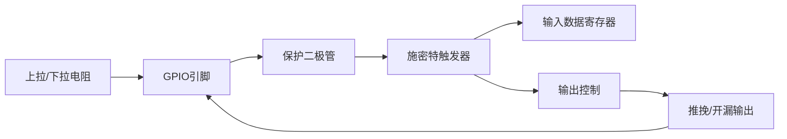
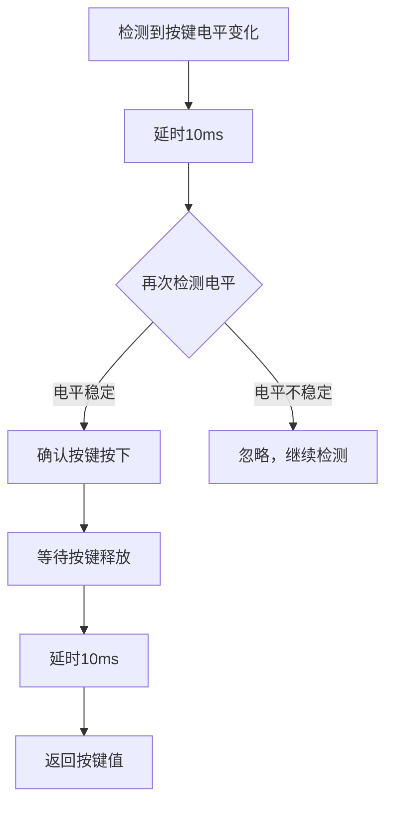
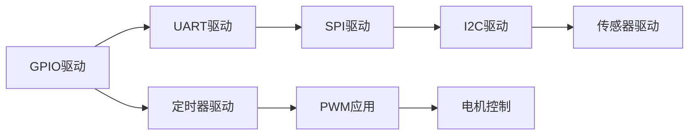

# GPIO驱动开发：LED控制实战

## 概述

GPIO（General Purpose Input/Output，通用输入输出）是嵌入式系统中最基础也是最重要的外设之一。几乎所有的嵌入式应用都需要使用GPIO来控制LED、读取按键、驱动继电器等。掌握GPIO驱动开发是学习嵌入式系统的第一步。

本教程将通过LED控制和按键检测的实战项目，带你深入理解GPIO的工作原理和驱动开发方法。

完成本教程后，你将能够：

- 理解GPIO的硬件结构和工作原理
- 掌握GPIO寄存器的配置方法
- 实现LED的点亮、闪烁和呼吸灯效果
- 实现按键检测和防抖处理
- 配置GPIO外部中断
- 编写可复用的GPIO驱动代码

## 背景知识

### GPIO的硬件结构

GPIO是微控制器与外部世界交互的桥梁。每个GPIO引脚都可以配置为输入或输出模式，并具有多种工作模式。

以STM32F4系列为例，GPIO的硬件结构包括：



**关键组件说明**：

1. **保护二极管**：防止引脚电压超出安全范围
2. **施密特触发器**：提供输入信号的滞回特性，增强抗干扰能力
3. **上拉/下拉电阻**：可配置的内部电阻（通常30-50kΩ）
4. **输出驱动**：支持推挽和开漏两种输出模式
5. **复用功能**：GPIO可以复用为其他外设功能（UART、SPI等）

### GPIO的工作模式

STM32的GPIO支持多种工作模式：

| 模式 | 说明 | 应用场景 |
|------|------|---------|
| 输入浮空 | 引脚悬空，不接上拉/下拉 | 外部有明确电平驱动 |
| 输入上拉 | 内部上拉电阻，默认高电平 | 按键检测（按下接地） |
| 输入下拉 | 内部下拉电阻，默认低电平 | 按键检测（按下接VCC） |
| 模拟输入 | 用于ADC等模拟功能 | 模拟信号采集 |
| 推挽输出 | 可输出高/低电平，驱动能力强 | LED控制、驱动数字信号 |
| 开漏输出 | 只能输出低电平或高阻态 | I2C总线、需要外部上拉 |
| 复用推挽 | 推挽输出，由外设控制 | UART TX、SPI MOSI |
| 复用开漏 | 开漏输出，由外设控制 | I2C SCL/SDA |

### GPIO寄存器概览

STM32 GPIO的主要寄存器：


| 寄存器 | 全称 | 功能 |
|--------|------|------|
| MODER | Mode Register | 配置引脚模式（输入/输出/复用/模拟） |
| OTYPER | Output Type Register | 配置输出类型（推挽/开漏） |
| OSPEEDR | Output Speed Register | 配置输出速度 |
| PUPDR | Pull-up/Pull-down Register | 配置上拉/下拉电阻 |
| IDR | Input Data Register | 读取输入数据 |
| ODR | Output Data Register | 读写输出数据 |
| BSRR | Bit Set/Reset Register | 原子操作设置/清除输出 |
| LCKR | Lock Register | 锁定引脚配置 |
| AFR | Alternate Function Register | 配置复用功能 |

## 环境准备

### 硬件要求

- STM32F4系列开发板（如STM32F407VET6）
- LED × 4（或使用板载LED）
- 按键 × 2（或使用板载按键）
- 面包板和杜邦线
- USB转串口模块（用于调试输出）

### 软件要求

- Keil MDK 5.x 或 STM32CubeIDE
- STM32F4 HAL库或标准外设库
- 串口调试工具（如PuTTY、SecureCRT）

### 硬件连接

```
STM32F407VET6 开发板连接：

LED连接（推挽输出）：
- LED1 -> PD12（板载LED）
- LED2 -> PD13（板载LED）
- LED3 -> PD14（板载LED）
- LED4 -> PD15（板载LED）

按键连接（输入上拉）：
- KEY1 -> PA0（板载按键，按下为高电平）
- KEY2 -> PE4（外接按键，按下接地）

注意：LED需要串联限流电阻（通常330Ω-1kΩ）
```

## 核心内容

### 步骤1：GPIO时钟使能

在使用GPIO之前，必须先使能对应端口的时钟。STM32的外设时钟默认是关闭的，以降低功耗。

```c
#include "stm32f4xx.h"

/**
 * @brief  使能GPIO端口时钟
 * @param  无
 * @retval 无
 */
void GPIO_ClockEnable(void) {
    // 使能GPIOA时钟（用于按键）
    RCC->AHB1ENR |= RCC_AHB1ENR_GPIOAEN;
    
    // 使能GPIOD时钟（用于LED）
    RCC->AHB1ENR |= RCC_AHB1ENR_GPIODEN;
    
    // 使能GPIOE时钟（用于按键）
    RCC->AHB1ENR |= RCC_AHB1ENR_GPIOEEN;
}
```

**代码说明**：
- `RCC->AHB1ENR`：AHB1总线外设时钟使能寄存器
- 通过位或操作（`|=`）使能对应位，不影响其他位
- GPIOA-GPIOK的时钟使能位分别对应bit0-bit10

**时钟树简图**：
```
HSE/HSI -> PLL -> AHB -> AHB1 -> GPIOA/B/C/D/E/F/G/H/I/J/K
```


### 步骤2：配置GPIO为输出模式（LED控制）

将GPIO配置为推挽输出模式，用于控制LED。

```c
/**
 * @brief  初始化LED对应的GPIO
 * @param  无
 * @retval 无
 */
void LED_GPIO_Init(void) {
    // 配置PD12-PD15为输出模式
    // MODER寄存器：00=输入，01=输出，10=复用，11=模拟
    GPIOD->MODER &= ~(0xFF << 24);  // 清除bit24-31
    GPIOD->MODER |= (0x55 << 24);   // 设置为输出模式（01010101）
    
    // 配置为推挽输出
    // OTYPER寄存器：0=推挽，1=开漏
    GPIOD->OTYPER &= ~(0x0F << 12); // 清除bit12-15，设置为推挽
    
    // 配置输出速度为高速
    // OSPEEDR寄存器：00=低速，01=中速，10=高速，11=超高速
    GPIOD->OSPEEDR &= ~(0xFF << 24); // 清除bit24-31
    GPIOD->OSPEEDR |= (0xAA << 24);  // 设置为高速（10101010）
    
    // 配置为无上拉下拉
    // PUPDR寄存器：00=无，01=上拉，10=下拉，11=保留
    GPIOD->PUPDR &= ~(0xFF << 24);   // 清除bit24-31，设置为无上拉下拉
    
    // 初始化LED为熄灭状态（输出低电平）
    GPIOD->ODR &= ~(0x0F << 12);     // PD12-15输出低电平
}
```

**寄存器配置详解**：

1. **MODER（模式寄存器）**：
   - 每个引脚占用2位
   - PD12对应bit24-25，PD13对应bit26-27，以此类推
   - `0x55 << 24` = `0101 0101`，表示4个引脚都配置为输出模式

2. **OTYPER（输出类型寄存器）**：
   - 每个引脚占用1位
   - 0表示推挽输出，1表示开漏输出
   - 推挽输出可以输出高低电平，驱动能力强

3. **OSPEEDR（输出速度寄存器）**：
   - 每个引脚占用2位
   - 速度越高，边沿越陡峭，但EMI干扰也越大
   - LED控制不需要很高速度，中速即可

4. **PUPDR（上拉下拉寄存器）**：
   - 每个引脚占用2位
   - 输出模式下通常不需要上拉下拉

### 步骤3：LED控制函数实现

实现LED的基本控制函数：点亮、熄灭、翻转。

```c
// LED编号定义
#define LED1  12  // PD12
#define LED2  13  // PD13
#define LED3  14  // PD14
#define LED4  15  // PD15

/**
 * @brief  点亮指定LED
 * @param  led_num: LED编号（12-15）
 * @retval 无
 */
void LED_On(uint8_t led_num) {
    GPIOD->BSRR = (1 << led_num);  // 使用BSRR寄存器设置对应位
}

/**
 * @brief  熄灭指定LED
 * @param  led_num: LED编号（12-15）
 * @retval 无
 */
void LED_Off(uint8_t led_num) {
    GPIOD->BSRR = (1 << (led_num + 16));  // BSRR高16位用于复位
}

/**
 * @brief  翻转指定LED状态
 * @param  led_num: LED编号（12-15）
 * @retval 无
 */
void LED_Toggle(uint8_t led_num) {
    GPIOD->ODR ^= (1 << led_num);  // 使用异或操作翻转
}

/**
 * @brief  设置LED状态
 * @param  led_num: LED编号（12-15）
 * @param  state: 0=熄灭，1=点亮
 * @retval 无
 */
void LED_Set(uint8_t led_num, uint8_t state) {
    if (state) {
        LED_On(led_num);
    } else {
        LED_Off(led_num);
    }
}
```

**为什么使用BSRR而不是ODR？**

BSRR（Bit Set/Reset Register）相比ODR有以下优势：

1. **原子操作**：BSRR是硬件原子操作，不会被中断打断
2. **更安全**：多个任务同时操作不同引脚时不会冲突
3. **更高效**：单次写操作即可完成，不需要读-改-写

BSRR寄存器结构：
```
Bit 31-16: 复位位（写1复位对应引脚）
Bit 15-0:  设置位（写1设置对应引脚）
```


### 步骤4：配置GPIO为输入模式（按键检测）

将GPIO配置为输入模式，用于检测按键状态。

```c
/**
 * @brief  初始化按键对应的GPIO
 * @param  无
 * @retval 无
 */
void KEY_GPIO_Init(void) {
    // 配置PA0为输入模式（板载按键，按下为高电平）
    GPIOA->MODER &= ~(0x03 << 0);   // 清除bit0-1，设置为输入模式（00）
    GPIOA->PUPDR &= ~(0x03 << 0);   // 清除bit0-1
    GPIOA->PUPDR |= (0x02 << 0);    // 设置为下拉（10）
    
    // 配置PE4为输入模式（外接按键，按下接地）
    GPIOE->MODER &= ~(0x03 << 8);   // 清除bit8-9，设置为输入模式
    GPIOE->PUPDR &= ~(0x03 << 8);   // 清除bit8-9
    GPIOE->PUPDR |= (0x01 << 8);    // 设置为上拉（01）
}

/**
 * @brief  读取按键状态
 * @param  key_num: 按键编号（0=KEY1, 4=KEY2）
 * @param  port: GPIO端口（GPIOA或GPIOE）
 * @retval 按键状态：1=按下，0=未按下
 */
uint8_t KEY_Read(GPIO_TypeDef *port, uint8_t key_num) {
    // 读取IDR寄存器对应位
    if (port->IDR & (1 << key_num)) {
        return 1;  // 引脚为高电平
    } else {
        return 0;  // 引脚为低电平
    }
}
```

**输入模式配置要点**：

1. **上拉/下拉选择**：
   - 按键按下接地 → 使用上拉，未按下为高电平，按下为低电平
   - 按键按下接VCC → 使用下拉，未按下为低电平，按下为高电平

2. **IDR寄存器**：
   - Input Data Register，只读寄存器
   - 每个引脚占用1位，反映引脚的实时电平状态

### 步骤5：按键防抖处理

机械按键在按下和释放时会产生抖动，需要进行防抖处理。

```c
/**
 * @brief  延时函数（简单实现）
 * @param  ms: 延时毫秒数
 * @retval 无
 */
void Delay_Ms(uint32_t ms) {
    // 假设系统时钟168MHz，粗略延时
    for (volatile uint32_t i = 0; i < ms * 21000; i++);
}

/**
 * @brief  读取按键状态（带防抖）
 * @param  port: GPIO端口
 * @param  key_num: 按键引脚编号
 * @param  active_level: 按下时的有效电平（0或1）
 * @retval 按键状态：1=按下，0=未按下
 */
uint8_t KEY_ReadWithDebounce(GPIO_TypeDef *port, uint8_t key_num, uint8_t active_level) {
    // 第一次检测
    if (KEY_Read(port, key_num) == active_level) {
        Delay_Ms(10);  // 延时10ms消抖
        
        // 第二次检测
        if (KEY_Read(port, key_num) == active_level) {
            // 等待按键释放
            while (KEY_Read(port, key_num) == active_level);
            Delay_Ms(10);  // 释放后再延时10ms
            return 1;
        }
    }
    return 0;
}

/**
 * @brief  扫描所有按键
 * @param  无
 * @retval 按键值：1=KEY1按下，2=KEY2按下，0=无按键
 */
uint8_t KEY_Scan(void) {
    // 检测KEY1（PA0，按下为高电平）
    if (KEY_ReadWithDebounce(GPIOA, 0, 1)) {
        return 1;
    }
    
    // 检测KEY2（PE4，按下为低电平）
    if (KEY_ReadWithDebounce(GPIOE, 4, 0)) {
        return 2;
    }
    
    return 0;  // 无按键按下
}
```

**防抖原理**：



**防抖方法对比**：

| 方法 | 优点 | 缺点 | 适用场景 |
|------|------|------|---------|
| 延时防抖 | 简单易实现 | 阻塞CPU | 简单应用 |
| 定时器防抖 | 不阻塞CPU | 需要定时器资源 | 实时性要求高 |
| 状态机防抖 | 灵活可靠 | 代码复杂 | 复杂应用 |
| 硬件防抖 | 最可靠 | 增加硬件成本 | 工业应用 |


### 步骤6：GPIO外部中断配置

使用外部中断方式检测按键，避免轮询占用CPU资源。

```c
/**
 * @brief  配置GPIO外部中断
 * @param  无
 * @retval 无
 */
void KEY_EXTI_Init(void) {
    // 1. 使能SYSCFG时钟（EXTI配置需要）
    RCC->APB2ENR |= RCC_APB2ENR_SYSCFGEN;
    
    // 2. 配置EXTI线路映射
    // PA0 -> EXTI0
    SYSCFG->EXTICR[0] &= ~SYSCFG_EXTICR1_EXTI0;  // 清除
    SYSCFG->EXTICR[0] |= SYSCFG_EXTICR1_EXTI0_PA; // 映射到PA
    
    // PE4 -> EXTI4
    SYSCFG->EXTICR[1] &= ~SYSCFG_EXTICR2_EXTI4;  // 清除
    SYSCFG->EXTICR[1] |= SYSCFG_EXTICR2_EXTI4_PE; // 映射到PE
    
    // 3. 配置EXTI触发方式
    EXTI->RTSR |= EXTI_RTSR_TR0;   // EXTI0上升沿触发（KEY1按下）
    EXTI->FTSR |= EXTI_FTSR_TR4;   // EXTI4下降沿触发（KEY2按下）
    
    // 4. 使能EXTI中断
    EXTI->IMR |= EXTI_IMR_MR0;     // 使能EXTI0中断
    EXTI->IMR |= EXTI_IMR_MR4;     // 使能EXTI4中断
    
    // 5. 配置NVIC中断优先级
    NVIC_SetPriority(EXTI0_IRQn, 2);
    NVIC_EnableIRQ(EXTI0_IRQn);
    
    NVIC_SetPriority(EXTI4_IRQn, 2);
    NVIC_EnableIRQ(EXTI4_IRQn);
}

/**
 * @brief  EXTI0中断服务函数
 * @param  无
 * @retval 无
 */
void EXTI0_IRQHandler(void) {
    // 检查中断标志
    if (EXTI->PR & EXTI_PR_PR0) {
        // 清除中断标志（写1清除）
        EXTI->PR = EXTI_PR_PR0;
        
        // 按键处理（翻转LED1）
        LED_Toggle(LED1);
    }
}

/**
 * @brief  EXTI4中断服务函数
 * @param  无
 * @retval 无
 */
void EXTI4_IRQHandler(void) {
    // 检查中断标志
    if (EXTI->PR & EXTI_PR_PR4) {
        // 清除中断标志
        EXTI->PR = EXTI_PR_PR4;
        
        // 按键处理（翻转LED2）
        LED_Toggle(LED2);
    }
}
```

**EXTI配置步骤详解**：

1. **使能SYSCFG时钟**：
   - EXTI配置需要通过SYSCFG模块
   - SYSCFG在APB2总线上

2. **配置EXTI线路映射**：
   - 每个EXTI线路可以映射到不同GPIO端口的同一引脚
   - 例如：EXTI0可以映射到PA0、PB0、PC0等

3. **配置触发方式**：
   - RTSR：上升沿触发寄存器
   - FTSR：下降沿触发寄存器
   - 可以同时使能上升沿和下降沿

4. **使能中断**：
   - IMR：中断屏蔽寄存器，1=使能，0=屏蔽
   - EMR：事件屏蔽寄存器，用于事件模式

5. **配置NVIC**：
   - 设置中断优先级
   - 使能NVIC中断通道

**EXTI中断向量表**：

| EXTI线路 | 中断向量 | 说明 |
|---------|---------|------|
| EXTI0 | EXTI0_IRQn | 单独中断 |
| EXTI1 | EXTI1_IRQn | 单独中断 |
| EXTI2 | EXTI2_IRQn | 单独中断 |
| EXTI3 | EXTI3_IRQn | 单独中断 |
| EXTI4 | EXTI4_IRQn | 单独中断 |
| EXTI5-9 | EXTI9_5_IRQn | 共享中断 |
| EXTI10-15 | EXTI15_10_IRQn | 共享中断 |


## 实践示例

### 示例1：LED流水灯

实现经典的LED流水灯效果。

```c
/**
 * @brief  LED流水灯效果
 * @param  delay_ms: 每个LED点亮的延时时间
 * @retval 无
 */
void LED_RunningLight(uint32_t delay_ms) {
    uint8_t leds[] = {LED1, LED2, LED3, LED4};
    
    for (int i = 0; i < 4; i++) {
        // 点亮当前LED
        LED_On(leds[i]);
        Delay_Ms(delay_ms);
        
        // 熄灭当前LED
        LED_Off(leds[i]);
    }
}

/**
 * @brief  主函数 - 流水灯演示
 */
int main(void) {
    // 系统初始化
    SystemInit();
    
    // GPIO初始化
    GPIO_ClockEnable();
    LED_GPIO_Init();
    
    // 主循环
    while (1) {
        LED_RunningLight(200);  // 200ms间隔的流水灯
    }
}
```

**运行效果**：LED1 → LED2 → LED3 → LED4 依次点亮，循环往复。

### 示例2：LED呼吸灯

通过快速开关LED实现呼吸灯效果（PWM原理）。

```c
/**
 * @brief  LED呼吸灯效果
 * @param  led_num: LED编号
 * @retval 无
 */
void LED_Breathing(uint8_t led_num) {
    uint16_t brightness;
    
    // 亮度递增（渐亮）
    for (brightness = 0; brightness < 100; brightness++) {
        for (int i = 0; i < 20; i++) {
            LED_On(led_num);
            for (volatile int j = 0; j < brightness; j++);
            
            LED_Off(led_num);
            for (volatile int j = 0; j < (100 - brightness); j++);
        }
    }
    
    // 亮度递减（渐暗）
    for (brightness = 100; brightness > 0; brightness--) {
        for (int i = 0; i < 20; i++) {
            LED_On(led_num);
            for (volatile int j = 0; j < brightness; j++);
            
            LED_Off(led_num);
            for (volatile int j = 0; j < (100 - brightness); j++);
        }
    }
}

/**
 * @brief  主函数 - 呼吸灯演示
 */
int main(void) {
    SystemInit();
    GPIO_ClockEnable();
    LED_GPIO_Init();
    
    while (1) {
        LED_Breathing(LED1);  // LED1呼吸灯效果
    }
}
```

**原理说明**：
- 通过快速开关LED，利用人眼的视觉暂留效应
- 占空比越大，LED看起来越亮
- 这是软件PWM的基本原理
- 更好的方法是使用硬件PWM（定时器）

### 示例3：按键控制LED

使用按键控制LED的开关状态。

```c
/**
 * @brief  主函数 - 按键控制LED
 */
int main(void) {
    uint8_t key_value;
    uint8_t led_state[4] = {0, 0, 0, 0};  // LED状态数组
    
    // 系统初始化
    SystemInit();
    GPIO_ClockEnable();
    LED_GPIO_Init();
    KEY_GPIO_Init();
    
    // 主循环
    while (1) {
        // 扫描按键
        key_value = KEY_Scan();
        
        if (key_value == 1) {
            // KEY1按下，翻转LED1
            led_state[0] = !led_state[0];
            LED_Set(LED1, led_state[0]);
        }
        else if (key_value == 2) {
            // KEY2按下，翻转所有LED
            for (int i = 0; i < 4; i++) {
                led_state[i] = !led_state[i];
                LED_Set(LED1 + i, led_state[i]);
            }
        }
    }
}
```

### 示例4：中断方式按键控制

使用外部中断方式实现按键控制，提高系统响应速度。

```c
// 全局变量
volatile uint8_t g_led_state[4] = {0, 0, 0, 0};

/**
 * @brief  EXTI0中断服务函数（KEY1）
 */
void EXTI0_IRQHandler(void) {
    if (EXTI->PR & EXTI_PR_PR0) {
        EXTI->PR = EXTI_PR_PR0;  // 清除中断标志
        
        // 简单防抖（中断中不宜延时太久）
        for (volatile int i = 0; i < 100000; i++);
        
        // 再次检测按键状态
        if (KEY_Read(GPIOA, 0) == 1) {
            // 翻转LED1
            g_led_state[0] = !g_led_state[0];
            LED_Set(LED1, g_led_state[0]);
        }
    }
}

/**
 * @brief  EXTI4中断服务函数（KEY2）
 */
void EXTI4_IRQHandler(void) {
    if (EXTI->PR & EXTI_PR_PR4) {
        EXTI->PR = EXTI_PR_PR4;  // 清除中断标志
        
        // 简单防抖
        for (volatile int i = 0; i < 100000; i++);
        
        // 再次检测按键状态
        if (KEY_Read(GPIOE, 4) == 0) {
            // 流水灯效果
            LED_RunningLight(100);
        }
    }
}

/**
 * @brief  主函数 - 中断方式按键控制
 */
int main(void) {
    SystemInit();
    GPIO_ClockEnable();
    LED_GPIO_Init();
    KEY_GPIO_Init();
    KEY_EXTI_Init();  // 配置外部中断
    
    // 主循环可以做其他事情
    while (1) {
        // CPU空闲，可以进入低功耗模式
        __WFI();  // Wait For Interrupt
    }
}
```

**中断方式的优势**：
- CPU不需要轮询，可以做其他任务
- 响应速度快，实时性好
- 可以进入低功耗模式，降低功耗


## 深入理解

### GPIO驱动的抽象与封装

在实际项目中，我们需要将GPIO驱动进行抽象和封装，提高代码的可复用性和可维护性。

```c
// gpio_driver.h
#ifndef __GPIO_DRIVER_H
#define __GPIO_DRIVER_H

#include "stm32f4xx.h"

// GPIO模式定义
typedef enum {
    GPIO_MODE_INPUT  = 0x00,  // 输入模式
    GPIO_MODE_OUTPUT = 0x01,  // 输出模式
    GPIO_MODE_AF     = 0x02,  // 复用功能
    GPIO_MODE_ANALOG = 0x03   // 模拟模式
} GPIO_Mode_t;

// GPIO输出类型
typedef enum {
    GPIO_OTYPE_PP = 0x00,  // 推挽输出
    GPIO_OTYPE_OD = 0x01   // 开漏输出
} GPIO_OType_t;

// GPIO速度
typedef enum {
    GPIO_SPEED_LOW    = 0x00,  // 低速
    GPIO_SPEED_MEDIUM = 0x01,  // 中速
    GPIO_SPEED_HIGH   = 0x02,  // 高速
    GPIO_SPEED_VHIGH  = 0x03   // 超高速
} GPIO_Speed_t;

// GPIO上拉下拉
typedef enum {
    GPIO_PUPD_NONE = 0x00,  // 无上拉下拉
    GPIO_PUPD_UP   = 0x01,  // 上拉
    GPIO_PUPD_DOWN = 0x02   // 下拉
} GPIO_PuPd_t;

// GPIO配置结构体
typedef struct {
    GPIO_TypeDef  *port;      // GPIO端口
    uint16_t       pin;       // 引脚编号（0-15）
    GPIO_Mode_t    mode;      // 模式
    GPIO_OType_t   otype;     // 输出类型
    GPIO_Speed_t   speed;     // 速度
    GPIO_PuPd_t    pupd;      // 上拉下拉
} GPIO_Config_t;

// 函数声明
void GPIO_Init(GPIO_Config_t *config);
void GPIO_Write(GPIO_TypeDef *port, uint16_t pin, uint8_t value);
uint8_t GPIO_Read(GPIO_TypeDef *port, uint16_t pin);
void GPIO_Toggle(GPIO_TypeDef *port, uint16_t pin);

#endif
```

```c
// gpio_driver.c
#include "gpio_driver.h"

/**
 * @brief  初始化GPIO
 * @param  config: GPIO配置结构体指针
 * @retval 无
 */
void GPIO_Init(GPIO_Config_t *config) {
    uint32_t position = config->pin;
    
    // 1. 使能时钟（简化处理，实际应根据端口判断）
    if (config->port == GPIOA) {
        RCC->AHB1ENR |= RCC_AHB1ENR_GPIOAEN;
    } else if (config->port == GPIOD) {
        RCC->AHB1ENR |= RCC_AHB1ENR_GPIODEN;
    } else if (config->port == GPIOE) {
        RCC->AHB1ENR |= RCC_AHB1ENR_GPIOEEN;
    }
    
    // 2. 配置模式
    config->port->MODER &= ~(0x03 << (position * 2));
    config->port->MODER |= (config->mode << (position * 2));
    
    // 3. 配置输出类型（仅输出模式有效）
    if (config->mode == GPIO_MODE_OUTPUT || config->mode == GPIO_MODE_AF) {
        config->port->OTYPER &= ~(0x01 << position);
        config->port->OTYPER |= (config->otype << position);
    }
    
    // 4. 配置速度
    config->port->OSPEEDR &= ~(0x03 << (position * 2));
    config->port->OSPEEDR |= (config->speed << (position * 2));
    
    // 5. 配置上拉下拉
    config->port->PUPDR &= ~(0x03 << (position * 2));
    config->port->PUPDR |= (config->pupd << (position * 2));
}

/**
 * @brief  写GPIO输出
 * @param  port: GPIO端口
 * @param  pin: 引脚编号
 * @param  value: 输出值（0或1）
 * @retval 无
 */
void GPIO_Write(GPIO_TypeDef *port, uint16_t pin, uint8_t value) {
    if (value) {
        port->BSRR = (1 << pin);  // 设置
    } else {
        port->BSRR = (1 << (pin + 16));  // 复位
    }
}

/**
 * @brief  读GPIO输入
 * @param  port: GPIO端口
 * @param  pin: 引脚编号
 * @retval 输入值（0或1）
 */
uint8_t GPIO_Read(GPIO_TypeDef *port, uint16_t pin) {
    return (port->IDR & (1 << pin)) ? 1 : 0;
}

/**
 * @brief  翻转GPIO输出
 * @param  port: GPIO端口
 * @param  pin: 引脚编号
 * @retval 无
 */
void GPIO_Toggle(GPIO_TypeDef *port, uint16_t pin) {
    port->ODR ^= (1 << pin);
}
```

**使用封装后的驱动**：

```c
int main(void) {
    SystemInit();
    
    // 配置LED1（PD12）
    GPIO_Config_t led1_config = {
        .port  = GPIOD,
        .pin   = 12,
        .mode  = GPIO_MODE_OUTPUT,
        .otype = GPIO_OTYPE_PP,
        .speed = GPIO_SPEED_MEDIUM,
        .pupd  = GPIO_PUPD_NONE
    };
    GPIO_Init(&led1_config);
    
    // 配置KEY1（PA0）
    GPIO_Config_t key1_config = {
        .port  = GPIOA,
        .pin   = 0,
        .mode  = GPIO_MODE_INPUT,
        .otype = GPIO_OTYPE_PP,  // 输入模式此项无效
        .speed = GPIO_SPEED_LOW,
        .pupd  = GPIO_PUPD_DOWN
    };
    GPIO_Init(&key1_config);
    
    // 使用驱动
    while (1) {
        if (GPIO_Read(GPIOA, 0)) {
            GPIO_Write(GPIOD, 12, 1);  // 点亮LED
        } else {
            GPIO_Write(GPIOD, 12, 0);  // 熄灭LED
        }
    }
}
```

### GPIO性能优化

在对性能要求较高的场合，可以采用以下优化方法：

**1. 使用位带操作**

STM32支持位带操作，可以将位操作转换为字操作，提高效率。

```c
// 位带操作宏定义
#define BITBAND(addr, bitnum) \
    ((addr & 0xF0000000) + 0x2000000 + ((addr & 0xFFFFF) << 5) + (bitnum << 2))

#define MEM_ADDR(addr) *((volatile unsigned long *)(addr))

// GPIO位带操作宏
#define GPIOD_ODR_Addr (GPIOD_BASE + 0x14)  // ODR寄存器地址
#define PD12_OUT MEM_ADDR(BITBAND(GPIOD_ODR_Addr, 12))

// 使用位带操作
PD12_OUT = 1;  // 点亮LED
PD12_OUT = 0;  // 熄灭LED
```

**2. 批量操作多个引脚**

```c
// 同时控制多个LED
void LED_SetAll(uint8_t pattern) {
    // pattern的bit0-3对应LED1-LED4
    uint32_t value = (pattern & 0x0F) << 12;  // 移位到PD12-15
    
    // 清除PD12-15，然后设置新值
    GPIOD->ODR = (GPIOD->ODR & ~(0x0F << 12)) | value;
}

// 使用示例
LED_SetAll(0b1010);  // LED1和LED3亮，LED2和LED4灭
```

**3. 使用DMA传输GPIO数据**

对于需要高速切换GPIO的场合（如驱动LED矩阵），可以使用DMA。


### GPIO的电气特性

了解GPIO的电气特性对于正确使用GPIO非常重要。

**STM32F4 GPIO电气参数**：

| 参数 | 最小值 | 典型值 | 最大值 | 单位 |
|------|--------|--------|--------|------|
| 输入低电平 | -0.3 | - | 0.8 | V |
| 输入高电平 | 2.0 | - | 3.6 | V |
| 输出低电平 | - | - | 0.4 | V |
| 输出高电平 | 2.4 | - | - | V |
| 输出电流（单引脚） | - | - | 25 | mA |
| 输出电流（所有引脚） | - | - | 120 | mA |
| 上拉/下拉电阻 | 30 | 40 | 50 | kΩ |

**注意事项**：

1. **电流限制**：
   - 单个引脚最大输出电流25mA
   - 所有引脚总电流不超过120mA
   - 驱动大电流负载需要外加驱动电路

2. **电压范围**：
   - 输入电压不能超过VDD+0.3V
   - 5V容忍引脚可以接受5V输入
   - 输出电压范围：0V - VDD

3. **LED驱动**：
   - 典型LED电流：5-20mA
   - 需要串联限流电阻
   - 电阻计算：R = (VDD - VLED) / ILED

**LED限流电阻计算示例**：

```
已知条件：
- VDD = 3.3V
- VLED = 2.0V（红色LED典型压降）
- ILED = 10mA（期望电流）

计算：
R = (VDD - VLED) / ILED
  = (3.3V - 2.0V) / 0.01A
  = 130Ω

选择标准阻值：150Ω或330Ω
```

### GPIO的复用功能

STM32的GPIO可以复用为其他外设功能，这是一个重要特性。

```c
/**
 * @brief  配置GPIO复用功能
 * @param  port: GPIO端口
 * @param  pin: 引脚编号
 * @param  af: 复用功能编号（0-15）
 * @retval 无
 */
void GPIO_SetAF(GPIO_TypeDef *port, uint16_t pin, uint8_t af) {
    // AFR寄存器分为AFRL（pin 0-7）和AFRH（pin 8-15）
    if (pin < 8) {
        port->AFR[0] &= ~(0x0F << (pin * 4));
        port->AFR[0] |= (af << (pin * 4));
    } else {
        port->AFR[1] &= ~(0x0F << ((pin - 8) * 4));
        port->AFR[1] |= (af << ((pin - 8) * 4));
    }
}

// 使用示例：配置PA9为USART1_TX
void USART1_GPIO_Init(void) {
    GPIO_Config_t uart_tx = {
        .port  = GPIOA,
        .pin   = 9,
        .mode  = GPIO_MODE_AF,      // 复用功能模式
        .otype = GPIO_OTYPE_PP,
        .speed = GPIO_SPEED_HIGH,
        .pupd  = GPIO_PUPD_UP
    };
    GPIO_Init(&uart_tx);
    GPIO_SetAF(GPIOA, 9, 7);  // AF7 = USART1
}
```

**常用复用功能**：

| 复用编号 | 功能 | 示例引脚 |
|---------|------|---------|
| AF0 | 系统功能 | - |
| AF1 | TIM1/TIM2 | PA0-PA3 |
| AF2 | TIM3/TIM4/TIM5 | PA0-PA3 |
| AF4 | I2C1/I2C2/I2C3 | PB6-PB9 |
| AF5 | SPI1/SPI2 | PA5-PA7 |
| AF7 | USART1/USART2/USART3 | PA9-PA10 |
| AF12 | SDIO | PC8-PC12 |

## 常见问题

### Q1: GPIO输出无效，LED不亮？

**可能原因**：
1. 未使能GPIO时钟
2. 引脚模式配置错误
3. 硬件连接问题
4. LED极性接反

**排查步骤**：
```c
// 1. 检查时钟是否使能
if (!(RCC->AHB1ENR & RCC_AHB1ENR_GPIODEN)) {
    // 时钟未使能
}

// 2. 检查引脚模式
uint32_t mode = (GPIOD->MODER >> (12 * 2)) & 0x03;
if (mode != 0x01) {
    // 不是输出模式
}

// 3. 直接操作寄存器测试
GPIOD->ODR |= (1 << 12);  // 强制输出高电平

// 4. 使用万用表测量引脚电压
```

### Q2: 按键检测不稳定，有时无响应？

**可能原因**：
1. 未配置上拉/下拉电阻
2. 防抖处理不当
3. 按键硬件问题

**解决方案**：
```c
// 1. 确保配置了上拉或下拉
GPIOA->PUPDR |= (0x02 << 0);  // 下拉

// 2. 增加防抖延时
Delay_Ms(20);  // 增加到20ms

// 3. 使用状态机防抖
typedef enum {
    KEY_STATE_IDLE,
    KEY_STATE_DEBOUNCE,
    KEY_STATE_PRESSED,
    KEY_STATE_RELEASE
} KeyState_t;

KeyState_t key_state = KEY_STATE_IDLE;
uint32_t debounce_count = 0;

void KEY_StateMachine(void) {
    switch (key_state) {
        case KEY_STATE_IDLE:
            if (GPIO_Read(GPIOA, 0)) {
                key_state = KEY_STATE_DEBOUNCE;
                debounce_count = 0;
            }
            break;
            
        case KEY_STATE_DEBOUNCE:
            if (GPIO_Read(GPIOA, 0)) {
                debounce_count++;
                if (debounce_count > 5) {  // 5次采样都为高
                    key_state = KEY_STATE_PRESSED;
                    // 按键按下处理
                }
            } else {
                key_state = KEY_STATE_IDLE;
            }
            break;
            
        case KEY_STATE_PRESSED:
            if (!GPIO_Read(GPIOA, 0)) {
                key_state = KEY_STATE_RELEASE;
                debounce_count = 0;
            }
            break;
            
        case KEY_STATE_RELEASE:
            if (!GPIO_Read(GPIOA, 0)) {
                debounce_count++;
                if (debounce_count > 5) {
                    key_state = KEY_STATE_IDLE;
                }
            } else {
                key_state = KEY_STATE_PRESSED;
            }
            break;
    }
}
```

### Q3: 外部中断触发频繁，系统卡死？

**可能原因**：
1. 中断标志未清除
2. 按键抖动导致多次触发
3. 中断服务函数执行时间过长

**解决方案**：
```c
void EXTI0_IRQHandler(void) {
    // 1. 立即清除中断标志
    EXTI->PR = EXTI_PR_PR0;
    
    // 2. 临时禁用中断，防止抖动
    EXTI->IMR &= ~EXTI_IMR_MR0;
    
    // 3. 简短处理，复杂逻辑放主循环
    g_key_pressed = 1;  // 设置标志
    
    // 4. 延时后重新使能中断（可以用定时器实现）
    // 这里简化处理
    for (volatile int i = 0; i < 100000; i++);
    EXTI->IMR |= EXTI_IMR_MR0;
}
```

### Q4: 如何提高GPIO翻转速度？

**优化方法**：

1. **使用BSRR寄存器**：
```c
// 慢速方法（读-改-写）
GPIOD->ODR ^= (1 << 12);

// 快速方法（直接写）
GPIOD->BSRR = (1 << 12);  // 设置
GPIOD->BSRR = (1 << 28);  // 复位
```

2. **使用位带操作**：
```c
#define PD12_OUT MEM_ADDR(BITBAND(GPIOD_ODR_Addr, 12))
PD12_OUT = 1;  // 单周期操作
```

3. **优化编译选项**：
```c
// 在Keil中设置优化级别为-O2或-O3
// 使用内联函数
__STATIC_INLINE void GPIO_Fast_Toggle(void) {
    GPIOD->ODR ^= (1 << 12);
}
```

4. **使用汇编优化关键代码**：
```c
__asm void GPIO_Toggle_ASM(void) {
    LDR  R0, =GPIOD_BASE
    LDR  R1, [R0, #0x14]  ; 读ODR
    EOR  R1, R1, #0x1000  ; 翻转bit12
    STR  R1, [R0, #0x14]  ; 写回ODR
    BX   LR
}
```

### Q5: GPIO能驱动多大的负载？

**驱动能力分析**：

1. **直接驱动LED**：
   - 单个LED（10-20mA）：可以直接驱动
   - 多个LED：注意总电流限制

2. **驱动继电器**：
   - 小型继电器（<50mA）：需要三极管驱动
   - 大型继电器：需要专用驱动芯片

3. **驱动电机**：
   - 不能直接驱动
   - 需要H桥驱动电路或电机驱动芯片

**驱动电路示例**：

```
GPIO驱动继电器：

STM32 GPIO -----> 1kΩ -----> NPN三极管基极
                              |
                              集电极 -----> 继电器线圈 -----> VCC
                              |
                              发射极 -----> GND
                              
续流二极管（1N4148）反向并联在继电器线圈两端
```


## 总结

本教程通过LED控制和按键检测的实战项目，全面介绍了GPIO驱动开发的核心知识。让我们回顾一下要点：

**核心知识点**：
- GPIO的硬件结构和工作模式
- GPIO寄存器的配置方法（MODER、OTYPER、OSPEEDR、PUPDR等）
- 输出控制：使用BSRR寄存器实现原子操作
- 输入检测：读取IDR寄存器，实现防抖处理
- 外部中断：配置EXTI和NVIC，实现事件驱动

**实践技能**：
- LED控制：点亮、闪烁、流水灯、呼吸灯
- 按键检测：轮询方式、中断方式、防抖处理
- 驱动封装：结构化设计，提高代码复用性
- 性能优化：位带操作、批量操作、DMA传输

**最佳实践**：
- 使用BSRR而不是ODR进行输出控制
- 配置合适的上拉/下拉电阻
- 实现可靠的防抖机制
- 中断服务函数要简短高效
- 注意GPIO的电气特性和驱动能力

**调试技巧**：
- 检查时钟是否使能
- 验证寄存器配置是否正确
- 使用万用表测量引脚电压
- 使用逻辑分析仪观察波形
- 添加串口调试输出

GPIO是嵌入式系统最基础的外设，掌握GPIO驱动开发是学习其他外设驱动的基础。通过本教程的学习和实践，你应该能够独立完成GPIO相关的开发任务。

## 延伸阅读

推荐进一步学习的内容：

**同模块内容**：
- [UART串口驱动开发与调试](02-uart-driver.html) - 学习串口通信
- [定时器驱动基础与应用](05-timer-driver.html) - 学习硬件PWM
- [DMA驱动开发：高效数据传输](../intermediate/01-dma-driver.html) - 提高GPIO性能

**相关主题**：
- 中断系统基础概念 - 深入理解中断
- [时钟系统架构与配置](../../05-clock-timer-management/beginner/01-clock-system.html) - 理解时钟配置

**官方文档**：
- [STM32F4xx参考手册](https://www.st.com/resource/en/reference_manual/dm00031020.pdf) - GPIO章节
- [STM32F4xx数据手册](https://www.st.com/resource/en/datasheet/stm32f407vg.pdf) - 电气特性
- [ARM Cortex-M4编程手册](https://developer.arm.com/documentation/dui0553/latest/) - NVIC配置

**开源项目**：
- [STM32 HAL库](https://github.com/STMicroelectronics/STM32CubeF4) - 官方HAL库GPIO驱动
- [libopencm3](https://github.com/libopencm3/libopencm3) - 开源STM32库
- [RT-Thread](https://github.com/RT-Thread/rt-thread) - 国产RTOS的GPIO驱动实现

## 参考资料

1. STM32F4xx参考手册 - STMicroelectronics
2. ARM Cortex-M4权威指南 - Joseph Yiu
3. 嵌入式系统设计与实践 - Elecia White
4. STM32库开发实战指南 - 野火团队
5. 深入浅出STM32 - 刘军

## 练习题

### 基础练习

1. **LED控制练习**：
   - 实现4个LED的二进制计数显示（0000-1111循环）
   - 实现双向流水灯效果
   - 实现LED闪烁频率可调（通过按键调节）

2. **按键检测练习**：
   - 实现长按和短按检测
   - 实现组合按键检测（两个按键同时按下）
   - 实现按键计数功能（显示按键次数）

3. **综合练习**：
   - 实现一个简单的交通灯系统
   - 实现一个电子骰子（按键触发，LED显示1-6点）
   - 实现一个简单的密码锁（按键输入，LED指示）

### 进阶练习

4. **性能优化**：
   - 测量GPIO翻转的最高频率
   - 对比不同操作方法的性能差异
   - 使用示波器观察GPIO输出波形

5. **驱动封装**：
   - 设计一个通用的GPIO驱动框架
   - 实现GPIO驱动的设备树配置
   - 添加GPIO驱动的调试接口

6. **实际应用**：
   - 使用GPIO驱动一个8x8 LED点阵
   - 实现一个简单的键盘扫描程序
   - 设计一个GPIO扩展芯片的驱动（如74HC595）

### 思考题

1. 为什么推挽输出比开漏输出驱动能力强？在什么情况下必须使用开漏输出？

2. GPIO的上拉/下拉电阻为什么是30-50kΩ？如果需要更小的电阻值应该怎么办？

3. 外部中断和GPIO轮询各有什么优缺点？在实际项目中如何选择？

4. 如何使用GPIO模拟I2C、SPI等通信协议？有什么优缺点？

5. 在多任务系统（RTOS）中，如何保证GPIO操作的线程安全？

## 实验任务

### 任务1：LED流水灯（必做）

**要求**：
- 使用4个LED实现流水灯效果
- 支持正向和反向流水
- 通过按键切换流水方向
- 流水速度可调

**提示**：
```c
// 流水灯数组
uint8_t led_pattern[] = {
    0b0001, 0b0010, 0b0100, 0b1000,  // 正向
    0b0100, 0b0010                    // 反向
};
```

### 任务2：按键控制系统（必做）

**要求**：
- 使用2个按键控制4个LED
- KEY1：单击翻转LED1，双击翻转LED2
- KEY2：长按（>2秒）全部LED闪烁
- 实现可靠的防抖和按键识别

### 任务3：呼吸灯效果（选做）

**要求**：
- 实现平滑的呼吸灯效果
- 支持多个LED同步或异步呼吸
- 呼吸周期可调
- 尝试使用定时器PWM实现更好的效果

### 任务4：GPIO驱动框架（选做）

**要求**：
- 设计一个通用的GPIO驱动框架
- 支持配置文件或宏定义配置
- 提供统一的API接口
- 支持多种MCU平台（至少2种）

**评分标准**：
- 代码规范性（20分）
- 功能完整性（30分）
- 可靠性和稳定性（30分）
- 创新性和扩展性（20分）

---

**下一步学习建议**：

完成本教程后，建议按以下顺序继续学习：

1. [UART串口驱动开发与调试](02-uart-driver.html) - 学习串口通信，为后续调试打基础
2. [定时器驱动基础与应用](05-timer-driver.html) - 学习定时器，实现精确延时和PWM
3. 中断系统基础概念 - 深入理解中断机制

**学习路线图**：



祝你学习顺利！如有问题，欢迎在社区讨论。

---

**文档信息**：
- 最后更新：2024-01-15
- 版本：v1.0
- 作者：嵌入式知识平台
- 许可：CC BY-NC-SA 4.0
