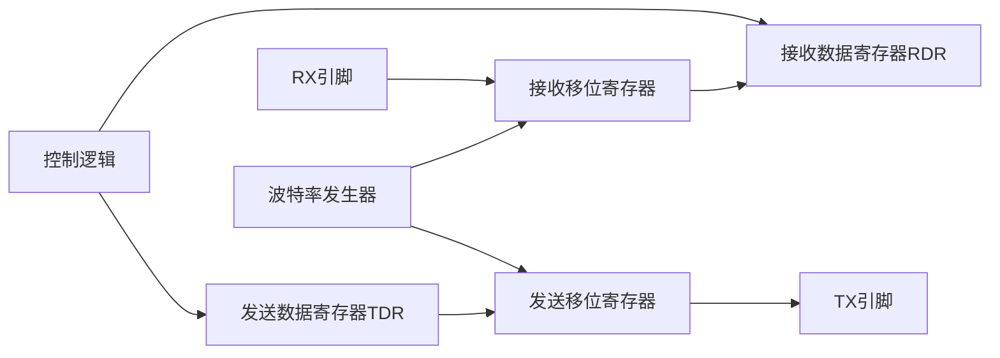
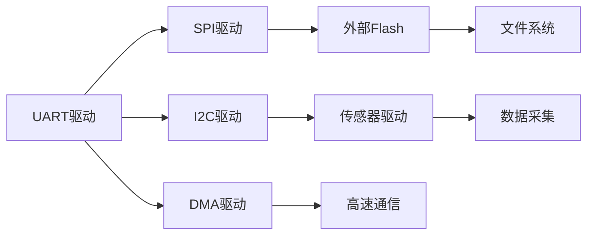

# UART串口驱动开发与调试

## 概述

UART（Universal Asynchronous Receiver/Transmitter，通用异步收发器）是嵌入式系统中最常用的通信接口之一。无论是调试输出、与PC通信、还是与其他设备交互，UART都扮演着重要角色。掌握UART驱动开发是每个嵌入式工程师的必备技能。

本教程将带你从零开始实现一个完整的UART驱动，包括基本收发、中断处理、环形缓冲区设计和printf重定向等高级功能。

完成本教程后，你将能够：

- 理解UART的工作原理和通信协议
- 掌握UART寄存器的配置方法
- 实现UART的轮询和中断收发
- 设计高效的环形缓冲区
- 实现printf重定向到串口
- 调试和优化UART通信

## 背景知识

### UART通信原理

UART是一种异步串行通信协议，数据以字节为单位进行传输。

**UART数据帧格式**：

```
起始位 | 数据位(5-9位) | 校验位(可选) | 停止位(1-2位)
  0    |   D0-D7/D8   |    P(可选)   |    1/1.5/2
```

**典型的UART数据帧（8N1）**：
```
  起始  D0  D1  D2  D3  D4  D5  D6  D7  停止
   0    1   0   1   0   0   1   1   0    1
   
传输字符'A' (ASCII: 0x41 = 0b01000001)
实际传输顺序：0 1 0 0 0 0 0 1 0 1 (LSB先传)
```

**关键参数说明**：

1. **波特率（Baud Rate）**：
   - 每秒传输的符号数
   - 常用波特率：9600、19200、38400、57600、115200
   - 波特率越高，传输速度越快，但抗干扰能力越弱

2. **数据位（Data Bits）**：
   - 通常为8位，也可以是5、6、7、9位
   - 8位可以传输完整的ASCII字符

3. **校验位（Parity）**：
   - 无校验（None）、奇校验（Odd）、偶校验（Even）
   - 用于简单的错误检测

4. **停止位（Stop Bits）**：
   - 1位、1.5位或2位
   - 用于标识数据帧结束

### UART硬件结构

STM32的UART/USART硬件结构：



**主要组件**：

1. **发送器**：
   - TDR（Transmit Data Register）：发送数据寄存器
   - 发送移位寄存器：将并行数据转换为串行数据
   - TX引脚：串行数据输出

2. **接收器**：
   - RX引脚：串行数据输入
   - 接收移位寄存器：将串行数据转换为并行数据
   - RDR（Receive Data Register）：接收数据寄存器

3. **波特率发生器**：
   - 根据系统时钟和配置生成波特率时钟
   - 支持分数波特率，提高精度

4. **控制逻辑**：
   - 状态标志管理
   - 中断控制
   - DMA控制

### UART vs USART

| 特性 | UART | USART |
|------|------|-------|
| 全称 | 通用异步收发器 | 通用同步异步收发器 |
| 同步模式 | 不支持 | 支持 |
| 时钟线 | 无 | 有（同步模式） |
| 硬件流控 | 部分支持 | 支持 |
| 应用场景 | 简单通信 | 复杂通信 |

STM32的USART可以工作在UART模式，本教程主要讲解UART异步模式。

### UART寄存器概览

STM32 UART/USART的主要寄存器：

| 寄存器 | 全称 | 功能 |
|--------|------|------|
| CR1 | Control Register 1 | 使能、字长、校验、中断控制 |
| CR2 | Control Register 2 | 停止位、时钟配置 |
| CR3 | Control Register 3 | DMA、硬件流控 |
| BRR | Baud Rate Register | 波特率配置 |
| SR | Status Register | 状态标志 |
| DR | Data Register | 数据收发 |
| GTPR | Guard Time and Prescaler | 保护时间和预分频 |


## 环境准备

### 硬件要求

- STM32F4系列开发板（如STM32F407VET6）
- USB转TTL串口模块（如CP2102、CH340）
- 杜邦线若干
- PC电脑（用于串口调试）

### 软件要求

- Keil MDK 5.x 或 STM32CubeIDE
- STM32F4 HAL库或标准外设库
- 串口调试工具：
  - Windows：SecureCRT、Xshell、PuTTY、串口助手
  - Linux/Mac：minicom、screen、CoolTerm

### 硬件连接

```
STM32F407 <---> USB转TTL模块 <---> PC

USART1连接（推荐用于调试）：
- PA9  (USART1_TX) ---> RX
- PA10 (USART1_RX) ---> TX
- GND              ---> GND

注意：
1. TX连RX，RX连TX（交叉连接）
2. 电平匹配：STM32是3.3V，确保USB转TTL模块也是3.3V
3. 不要连接VCC，避免供电冲突
```

**串口调试工具配置**：
```
波特率：115200
数据位：8
校验位：无
停止位：1
流控：无
```

## 核心内容

### 步骤1：UART时钟和GPIO配置

首先需要使能UART外设时钟和配置GPIO引脚。

```c
#include "stm32f4xx.h"

/**
 * @brief  UART1时钟和GPIO初始化
 * @param  无
 * @retval 无
 */
void UART1_GPIO_Init(void) {
    // 1. 使能GPIOA和USART1时钟
    RCC->AHB1ENR |= RCC_AHB1ENR_GPIOAEN;   // GPIOA时钟
    RCC->APB2ENR |= RCC_APB2ENR_USART1EN;  // USART1时钟（在APB2总线上）
    
    // 2. 配置PA9（TX）和PA10（RX）为复用功能
    // PA9: TX
    GPIOA->MODER &= ~(0x03 << (9 * 2));    // 清除
    GPIOA->MODER |= (0x02 << (9 * 2));     // 复用功能模式
    GPIOA->OTYPER &= ~(1 << 9);            // 推挽输出
    GPIOA->OSPEEDR |= (0x03 << (9 * 2));   // 高速
    GPIOA->PUPDR |= (0x01 << (9 * 2));     // 上拉
    
    // PA10: RX
    GPIOA->MODER &= ~(0x03 << (10 * 2));   // 清除
    GPIOA->MODER |= (0x02 << (10 * 2));    // 复用功能模式
    GPIOA->PUPDR |= (0x01 << (10 * 2));    // 上拉
    
    // 3. 配置GPIO复用功能为USART1（AF7）
    // PA9和PA10都在AFRH寄存器中
    GPIOA->AFR[1] &= ~(0x0F << ((9 - 8) * 4));   // 清除PA9
    GPIOA->AFR[1] |= (0x07 << ((9 - 8) * 4));    // AF7
    
    GPIOA->AFR[1] &= ~(0x0F << ((10 - 8) * 4));  // 清除PA10
    GPIOA->AFR[1] |= (0x07 << ((10 - 8) * 4));   // AF7
}
```

**代码说明**：

1. **时钟使能**：
   - USART1在APB2总线上，需要使能APB2ENR
   - USART2/3在APB1总线上，需要使能APB1ENR

2. **GPIO配置**：
   - TX引脚：复用推挽输出，上拉
   - RX引脚：复用输入，上拉
   - 上拉电阻可以防止引脚悬空时的干扰

3. **复用功能**：
   - STM32F4的USART1复用功能编号是AF7
   - 不同引脚的复用功能编号可能不同，需查阅数据手册

### 步骤2：UART基本配置

配置UART的波特率、数据位、停止位等参数。

```c
/**
 * @brief  UART1基本配置
 * @param  baudrate: 波特率（如115200）
 * @retval 无
 */
void UART1_Config(uint32_t baudrate) {
    // 1. 禁用UART（配置前必须禁用）
    USART1->CR1 &= ~USART_CR1_UE;
    
    // 2. 配置字长：8位数据位
    USART1->CR1 &= ~USART_CR1_M;  // 0=8位数据
    
    // 3. 配置停止位：1位停止位
    USART1->CR2 &= ~USART_CR2_STOP;  // 00=1位停止位
    
    // 4. 配置校验：无校验
    USART1->CR1 &= ~USART_CR1_PCE;  // 禁用校验
    
    // 5. 配置波特率
    // 波特率计算公式：Baudrate = fCK / (16 * USARTDIV)
    // USARTDIV = fCK / (16 * Baudrate)
    // 假设APB2时钟为84MHz
    uint32_t apb2_clock = 84000000;  // 84MHz
    uint32_t usartdiv = (apb2_clock + (baudrate / 2)) / baudrate;
    USART1->BRR = usartdiv;
    
    // 6. 使能发送器和接收器
    USART1->CR1 |= USART_CR1_TE;  // 使能发送
    USART1->CR1 |= USART_CR1_RE;  // 使能接收
    
    // 7. 使能UART
    USART1->CR1 |= USART_CR1_UE;
}

/**
 * @brief  UART1完整初始化
 * @param  baudrate: 波特率
 * @retval 无
 */
void UART1_Init(uint32_t baudrate) {
    UART1_GPIO_Init();
    UART1_Config(baudrate);
}
```

**波特率计算详解**：

```
波特率公式：Baudrate = fCK / (16 * USARTDIV)

其中：
- fCK：UART时钟频率（APB1或APB2时钟）
- USARTDIV：分频系数（可以是小数）

BRR寄存器格式：
- Bit 15-4：整数部分（DIV_Mantissa）
- Bit 3-0：小数部分（DIV_Fraction，0-15对应0/16-15/16）

示例：115200波特率，84MHz时钟
USARTDIV = 84000000 / (16 * 115200) = 45.5729
整数部分 = 45 = 0x2D
小数部分 = 0.5729 * 16 = 9.1664 ≈ 9 = 0x9
BRR = 0x2D9
```

**精确波特率计算函数**：

```c
/**
 * @brief  计算BRR寄存器值
 * @param  pclk: 外设时钟频率
 * @param  baudrate: 目标波特率
 * @retval BRR寄存器值
 */
uint32_t UART_CalcBRR(uint32_t pclk, uint32_t baudrate) {
    uint32_t usartdiv = (pclk * 25) / (4 * baudrate);  // 放大100倍
    uint32_t mantissa = usartdiv / 100;
    uint32_t fraction = ((usartdiv - (mantissa * 100)) * 16 + 50) / 100;
    
    // 处理进位
    if (fraction >= 16) {
        mantissa++;
        fraction = 0;
    }
    
    return (mantissa << 4) | fraction;
}
```

### 步骤3：UART轮询方式收发

实现最基本的轮询方式数据收发。

```c
/**
 * @brief  UART发送一个字节（轮询方式）
 * @param  data: 要发送的字节
 * @retval 无
 */
void UART1_SendByte(uint8_t data) {
    // 等待发送数据寄存器为空
    while (!(USART1->SR & USART_SR_TXE));
    
    // 写入数据到DR寄存器
    USART1->DR = data;
    
    // 等待发送完成（可选，确保数据完全发送）
    while (!(USART1->SR & USART_SR_TC));
}

/**
 * @brief  UART接收一个字节（轮询方式）
 * @param  无
 * @retval 接收到的字节
 */
uint8_t UART1_ReceiveByte(void) {
    // 等待接收数据寄存器非空
    while (!(USART1->SR & USART_SR_RXNE));
    
    // 读取数据
    return (uint8_t)(USART1->DR & 0xFF);
}

/**
 * @brief  UART发送字符串
 * @param  str: 字符串指针
 * @retval 无
 */
void UART1_SendString(const char *str) {
    while (*str) {
        UART1_SendByte(*str++);
    }
}

/**
 * @brief  UART发送数据缓冲区
 * @param  buf: 数据缓冲区指针
 * @param  len: 数据长度
 * @retval 无
 */
void UART1_SendBuffer(const uint8_t *buf, uint32_t len) {
    for (uint32_t i = 0; i < len; i++) {
        UART1_SendByte(buf[i]);
    }
}
```

**状态标志说明**：

| 标志位 | 名称 | 说明 |
|--------|------|------|
| TXE | Transmit Data Register Empty | 发送数据寄存器为空 |
| TC | Transmission Complete | 发送完成 |
| RXNE | Read Data Register Not Empty | 接收数据寄存器非空 |
| IDLE | IDLE Line Detected | 检测到空闲线路 |
| ORE | Overrun Error | 溢出错误 |
| NE | Noise Error | 噪声错误 |
| FE | Framing Error | 帧错误 |
| PE | Parity Error | 校验错误 |

**TXE vs TC的区别**：

```
TXE：数据从DR寄存器移到移位寄存器时置位
TC：数据完全从移位寄存器发送出去时置位

时序：
写DR -> TXE=0 -> 数据移到移位寄存器 -> TXE=1 -> 发送完成 -> TC=1

通常：
- 连续发送：只需检查TXE
- 最后一个字节：需要检查TC，确保完全发送
```


### 步骤4：UART中断配置

使用中断方式可以提高CPU效率，避免轮询等待。

```c
/**
 * @brief  UART1中断配置
 * @param  无
 * @retval 无
 */
void UART1_NVIC_Config(void) {
    // 配置NVIC优先级
    NVIC_SetPriority(USART1_IRQn, 3);
    
    // 使能USART1中断
    NVIC_EnableIRQ(USART1_IRQn);
    
    // 使能UART接收中断
    USART1->CR1 |= USART_CR1_RXNEIE;  // 接收数据寄存器非空中断
    
    // 可选：使能其他中断
    // USART1->CR1 |= USART_CR1_TXEIE;   // 发送数据寄存器空中断
    // USART1->CR1 |= USART_CR1_TCIE;    // 发送完成中断
    // USART1->CR1 |= USART_CR1_IDLEIE;  // 空闲线路中断
}

// 全局变量（用于中断和主程序通信）
volatile uint8_t g_uart_rx_data;
volatile uint8_t g_uart_rx_flag = 0;

/**
 * @brief  USART1中断服务函数
 * @param  无
 * @retval 无
 */
void USART1_IRQHandler(void) {
    // 检查接收中断标志
    if (USART1->SR & USART_SR_RXNE) {
        // 读取数据（读DR会自动清除RXNE标志）
        g_uart_rx_data = USART1->DR;
        g_uart_rx_flag = 1;
    }
    
    // 检查溢出错误
    if (USART1->SR & USART_SR_ORE) {
        // 读SR和DR清除ORE标志
        volatile uint32_t temp = USART1->SR;
        temp = USART1->DR;
        (void)temp;  // 避免编译器警告
    }
}
```

**中断使能位说明**：

| 中断使能位 | 对应标志 | 说明 |
|-----------|---------|------|
| RXNEIE | RXNE | 接收数据寄存器非空中断 |
| TXEIE | TXE | 发送数据寄存器空中断 |
| TCIE | TC | 发送完成中断 |
| IDLEIE | IDLE | 空闲线路中断 |
| PEIE | PE | 校验错误中断 |
| EIE | FE/NE/ORE | 错误中断 |

**中断服务函数注意事项**：

1. **标志清除**：
   - RXNE：读DR自动清除
   - TXE：写DR自动清除
   - TC：读SR后写DR清除，或软件清零
   - ORE：读SR后读DR清除

2. **中断优先级**：
   - 根据系统需求设置合理的优先级
   - 避免中断嵌套导致的问题

3. **中断处理时间**：
   - 中断服务函数应尽量简短
   - 复杂处理放在主循环中

### 步骤5：环形缓冲区设计

环形缓冲区（Ring Buffer）是UART驱动中常用的数据结构，用于缓存收发数据。

```c
/**
 * @brief  环形缓冲区结构体
 */
typedef struct {
    uint8_t *buffer;      // 缓冲区指针
    uint32_t size;        // 缓冲区大小
    volatile uint32_t head;  // 写指针（生产者）
    volatile uint32_t tail;  // 读指针（消费者）
} RingBuffer_t;

/**
 * @brief  初始化环形缓冲区
 * @param  rb: 环形缓冲区指针
 * @param  buffer: 缓冲区数组
 * @param  size: 缓冲区大小
 * @retval 无
 */
void RingBuffer_Init(RingBuffer_t *rb, uint8_t *buffer, uint32_t size) {
    rb->buffer = buffer;
    rb->size = size;
    rb->head = 0;
    rb->tail = 0;
}

/**
 * @brief  向环形缓冲区写入一个字节
 * @param  rb: 环形缓冲区指针
 * @param  data: 要写入的数据
 * @retval 0=成功，1=缓冲区满
 */
uint8_t RingBuffer_Write(RingBuffer_t *rb, uint8_t data) {
    uint32_t next_head = (rb->head + 1) % rb->size;
    
    // 检查缓冲区是否满
    if (next_head == rb->tail) {
        return 1;  // 缓冲区满
    }
    
    // 写入数据
    rb->buffer[rb->head] = data;
    rb->head = next_head;
    
    return 0;  // 成功
}

/**
 * @brief  从环形缓冲区读取一个字节
 * @param  rb: 环形缓冲区指针
 * @param  data: 读取数据的指针
 * @retval 0=成功，1=缓冲区空
 */
uint8_t RingBuffer_Read(RingBuffer_t *rb, uint8_t *data) {
    // 检查缓冲区是否空
    if (rb->head == rb->tail) {
        return 1;  // 缓冲区空
    }
    
    // 读取数据
    *data = rb->buffer[rb->tail];
    rb->tail = (rb->tail + 1) % rb->size;
    
    return 0;  // 成功
}

/**
 * @brief  获取环形缓冲区中的数据量
 * @param  rb: 环形缓冲区指针
 * @retval 数据量
 */
uint32_t RingBuffer_Available(RingBuffer_t *rb) {
    if (rb->head >= rb->tail) {
        return rb->head - rb->tail;
    } else {
        return rb->size - rb->tail + rb->head;
    }
}

/**
 * @brief  清空环形缓冲区
 * @param  rb: 环形缓冲区指针
 * @retval 无
 */
void RingBuffer_Clear(RingBuffer_t *rb) {
    rb->head = 0;
    rb->tail = 0;
}
```

**环形缓冲区原理**：

```
空缓冲区：head == tail
满缓冲区：(head + 1) % size == tail

示例（size=8）：
初始状态：head=0, tail=0
写入3个字节：head=3, tail=0
读取1个字节：head=3, tail=1
写入6个字节：head=1, tail=1（满，实际只能写5个）

缓冲区状态：
[0][1][2][3][4][5][6][7]
 ^tail          ^head
```

**使用环形缓冲区的UART驱动**：

```c
// 定义接收和发送缓冲区
#define UART_RX_BUFFER_SIZE 256
#define UART_TX_BUFFER_SIZE 256

uint8_t uart_rx_buffer[UART_RX_BUFFER_SIZE];
uint8_t uart_tx_buffer[UART_TX_BUFFER_SIZE];

RingBuffer_t uart_rx_rb;
RingBuffer_t uart_tx_rb;

/**
 * @brief  UART驱动初始化（带缓冲区）
 * @param  baudrate: 波特率
 * @retval 无
 */
void UART_Driver_Init(uint32_t baudrate) {
    // 初始化硬件
    UART1_Init(baudrate);
    UART1_NVIC_Config();
    
    // 初始化环形缓冲区
    RingBuffer_Init(&uart_rx_rb, uart_rx_buffer, UART_RX_BUFFER_SIZE);
    RingBuffer_Init(&uart_tx_rb, uart_tx_buffer, UART_TX_BUFFER_SIZE);
}

/**
 * @brief  USART1中断服务函数（使用环形缓冲区）
 * @param  无
 * @retval 无
 */
void USART1_IRQHandler(void) {
    // 接收中断
    if (USART1->SR & USART_SR_RXNE) {
        uint8_t data = USART1->DR;
        RingBuffer_Write(&uart_rx_rb, data);
    }
    
    // 发送中断
    if (USART1->SR & USART_SR_TXE) {
        if (USART1->CR1 & USART_CR1_TXEIE) {  // 检查中断是否使能
            uint8_t data;
            if (RingBuffer_Read(&uart_tx_rb, &data) == 0) {
                USART1->DR = data;
            } else {
                // 缓冲区空，禁用发送中断
                USART1->CR1 &= ~USART_CR1_TXEIE;
            }
        }
    }
    
    // 溢出错误处理
    if (USART1->SR & USART_SR_ORE) {
        volatile uint32_t temp = USART1->SR;
        temp = USART1->DR;
        (void)temp;
    }
}

/**
 * @brief  从UART读取数据
 * @param  data: 数据指针
 * @retval 0=成功，1=无数据
 */
uint8_t UART_Read(uint8_t *data) {
    return RingBuffer_Read(&uart_rx_rb, data);
}

/**
 * @brief  向UART写入数据
 * @param  data: 要写入的数据
 * @retval 0=成功，1=缓冲区满
 */
uint8_t UART_Write(uint8_t data) {
    uint8_t result = RingBuffer_Write(&uart_tx_rb, data);
    
    // 使能发送中断，启动发送
    USART1->CR1 |= USART_CR1_TXEIE;
    
    return result;
}

/**
 * @brief  获取可读数据量
 * @param  无
 * @retval 可读字节数
 */
uint32_t UART_Available(void) {
    return RingBuffer_Available(&uart_rx_rb);
}
```

### 步骤6：printf重定向

将printf输出重定向到UART，方便调试。

```c
#include <stdio.h>

/**
 * @brief  重定向fputc函数（printf底层调用）
 * @param  ch: 要输出的字符
 * @param  f: 文件指针（通常是stdout）
 * @retval 输出的字符
 */
int fputc(int ch, FILE *f) {
    // 发送字符到UART
    UART1_SendByte((uint8_t)ch);
    return ch;
}

/**
 * @brief  重定向fgetc函数（scanf底层调用）
 * @param  f: 文件指针（通常是stdin）
 * @retval 接收到的字符
 */
int fgetc(FILE *f) {
    // 从UART接收字符
    return (int)UART1_ReceiveByte();
}

// 使用示例
int main(void) {
    SystemInit();
    UART1_Init(115200);
    
    printf("Hello, UART!\r\n");
    printf("System Clock: %d Hz\r\n", SystemCoreClock);
    
    int value = 42;
    printf("Value = %d, Hex = 0x%X\r\n", value, value);
    
    while (1) {
        // 主循环
    }
}
```

**注意事项**：

1. **换行符**：
   - Windows：`\r\n`（回车+换行）
   - Linux/Mac：`\n`（换行）
   - 串口通信通常使用`\r\n`

2. **Keil配置**：
   - 需要在工程选项中勾选"Use MicroLIB"
   - 或者实现完整的stdio库函数

3. **性能考虑**：
   - printf是阻塞函数，会等待发送完成
   - 频繁使用printf会影响实时性
   - 调试时使用，发布版本建议关闭

**高级printf重定向（使用缓冲区）**：

```c
/**
 * @brief  重定向fputc（使用缓冲区，非阻塞）
 * @param  ch: 要输出的字符
 * @param  f: 文件指针
 * @retval 输出的字符，-1表示失败
 */
int fputc(int ch, FILE *f) {
    // 尝试写入缓冲区
    if (UART_Write((uint8_t)ch) == 0) {
        return ch;
    } else {
        // 缓冲区满，等待或返回错误
        return -1;
    }
}
```


## 实践示例

### 示例1：简单的回显程序

接收串口数据并原样发送回去。

```c
/**
 * @brief  主函数 - 回显程序
 */
int main(void) {
    uint8_t data;
    
    // 系统初始化
    SystemInit();
    UART1_Init(115200);
    
    // 发送欢迎信息
    UART1_SendString("UART Echo Test\r\n");
    UART1_SendString("Type something...\r\n");
    
    // 主循环
    while (1) {
        // 接收数据
        data = UART1_ReceiveByte();
        
        // 回显数据
        UART1_SendByte(data);
        
        // 如果是回车，发送换行
        if (data == '\r') {
            UART1_SendByte('\n');
        }
    }
}
```

### 示例2：命令行解析器

实现一个简单的命令行接口。

```c
#define CMD_BUFFER_SIZE 64

char cmd_buffer[CMD_BUFFER_SIZE];
uint8_t cmd_index = 0;

/**
 * @brief  处理命令
 * @param  cmd: 命令字符串
 * @retval 无
 */
void ProcessCommand(char *cmd) {
    if (strcmp(cmd, "help") == 0) {
        printf("Available commands:\r\n");
        printf("  help  - Show this help\r\n");
        printf("  led   - Toggle LED\r\n");
        printf("  info  - Show system info\r\n");
    }
    else if (strcmp(cmd, "led") == 0) {
        // 翻转LED
        GPIOD->ODR ^= (1 << 12);
        printf("LED toggled\r\n");
    }
    else if (strcmp(cmd, "info") == 0) {
        printf("System Information:\r\n");
        printf("  MCU: STM32F407VET6\r\n");
        printf("  Clock: %d Hz\r\n", SystemCoreClock);
        printf("  Compiler: %s\r\n", __VERSION__);
    }
    else {
        printf("Unknown command: %s\r\n", cmd);
        printf("Type 'help' for available commands\r\n");
    }
}

/**
 * @brief  主函数 - 命令行解析
 */
int main(void) {
    uint8_t data;
    
    SystemInit();
    UART1_Init(115200);
    
    printf("\r\n=== STM32 Command Line ===\r\n");
    printf("Type 'help' for available commands\r\n");
    printf("> ");
    
    while (1) {
        data = UART1_ReceiveByte();
        
        // 回显字符
        UART1_SendByte(data);
        
        if (data == '\r' || data == '\n') {
            // 命令结束
            printf("\r\n");
            
            if (cmd_index > 0) {
                cmd_buffer[cmd_index] = '\0';
                ProcessCommand(cmd_buffer);
                cmd_index = 0;
            }
            
            printf("> ");
        }
        else if (data == '\b' || data == 0x7F) {
            // 退格键
            if (cmd_index > 0) {
                cmd_index--;
                printf(" \b");  // 擦除字符
            }
        }
        else if (cmd_index < CMD_BUFFER_SIZE - 1) {
            // 添加字符到缓冲区
            cmd_buffer[cmd_index++] = data;
        }
    }
}
```

### 示例3：数据包协议

实现一个简单的数据包协议，用于可靠通信。

```c
/**
 * @brief  数据包结构
 */
typedef struct {
    uint8_t header;      // 包头（0xAA）
    uint8_t cmd;         // 命令
    uint8_t length;      // 数据长度
    uint8_t data[32];    // 数据
    uint8_t checksum;    // 校验和
} Packet_t;

/**
 * @brief  计算校验和
 * @param  packet: 数据包指针
 * @retval 校验和
 */
uint8_t CalcChecksum(Packet_t *packet) {
    uint8_t sum = 0;
    sum += packet->header;
    sum += packet->cmd;
    sum += packet->length;
    for (int i = 0; i < packet->length; i++) {
        sum += packet->data[i];
    }
    return sum;
}

/**
 * @brief  发送数据包
 * @param  packet: 数据包指针
 * @retval 无
 */
void SendPacket(Packet_t *packet) {
    packet->header = 0xAA;
    packet->checksum = CalcChecksum(packet);
    
    UART1_SendByte(packet->header);
    UART1_SendByte(packet->cmd);
    UART1_SendByte(packet->length);
    UART1_SendBuffer(packet->data, packet->length);
    UART1_SendByte(packet->checksum);
}

/**
 * @brief  接收数据包
 * @param  packet: 数据包指针
 * @retval 0=成功，1=失败
 */
uint8_t ReceivePacket(Packet_t *packet) {
    // 等待包头
    while (UART1_ReceiveByte() != 0xAA);
    
    packet->header = 0xAA;
    packet->cmd = UART1_ReceiveByte();
    packet->length = UART1_ReceiveByte();
    
    // 检查长度
    if (packet->length > 32) {
        return 1;  // 长度错误
    }
    
    // 接收数据
    for (int i = 0; i < packet->length; i++) {
        packet->data[i] = UART1_ReceiveByte();
    }
    
    packet->checksum = UART1_ReceiveByte();
    
    // 校验
    if (packet->checksum != CalcChecksum(packet)) {
        return 1;  // 校验错误
    }
    
    return 0;  // 成功
}

/**
 * @brief  主函数 - 数据包通信
 */
int main(void) {
    Packet_t tx_packet, rx_packet;
    
    SystemInit();
    UART1_Init(115200);
    
    while (1) {
        // 接收数据包
        if (ReceivePacket(&rx_packet) == 0) {
            // 处理命令
            switch (rx_packet.cmd) {
                case 0x01:  // LED控制
                    if (rx_packet.data[0]) {
                        GPIOD->ODR |= (1 << 12);  // LED ON
                    } else {
                        GPIOD->ODR &= ~(1 << 12);  // LED OFF
                    }
                    
                    // 发送响应
                    tx_packet.cmd = 0x81;  // 响应命令
                    tx_packet.length = 1;
                    tx_packet.data[0] = 0x00;  // 成功
                    SendPacket(&tx_packet);
                    break;
                    
                case 0x02:  // 读取ADC
                    tx_packet.cmd = 0x82;
                    tx_packet.length = 2;
                    // 读取ADC值（示例）
                    uint16_t adc_value = 1234;
                    tx_packet.data[0] = adc_value >> 8;
                    tx_packet.data[1] = adc_value & 0xFF;
                    SendPacket(&tx_packet);
                    break;
                    
                default:
                    // 未知命令
                    tx_packet.cmd = 0xFF;
                    tx_packet.length = 1;
                    tx_packet.data[0] = 0x01;  // 错误码
                    SendPacket(&tx_packet);
                    break;
            }
        }
    }
}
```

### 示例4：UART空闲中断接收不定长数据

使用IDLE中断接收不定长数据包。

```c
#define RX_BUFFER_SIZE 256

uint8_t rx_buffer[RX_BUFFER_SIZE];
volatile uint16_t rx_length = 0;
volatile uint8_t rx_complete = 0;

/**
 * @brief  UART1中断配置（带IDLE中断）
 * @param  无
 * @retval 无
 */
void UART1_IDLE_Config(void) {
    UART1_NVIC_Config();
    
    // 使能IDLE中断
    USART1->CR1 |= USART_CR1_IDLEIE;
}

/**
 * @brief  USART1中断服务函数（IDLE中断）
 * @param  无
 * @retval 无
 */
void USART1_IRQHandler(void) {
    // 接收中断
    if (USART1->SR & USART_SR_RXNE) {
        if (rx_length < RX_BUFFER_SIZE) {
            rx_buffer[rx_length++] = USART1->DR;
        } else {
            // 缓冲区溢出，丢弃数据
            volatile uint8_t temp = USART1->DR;
            (void)temp;
        }
    }
    
    // IDLE中断（一帧数据接收完成）
    if (USART1->SR & USART_SR_IDLE) {
        // 清除IDLE标志（读SR后读DR）
        volatile uint32_t temp = USART1->SR;
        temp = USART1->DR;
        (void)temp;
        
        // 标记接收完成
        rx_complete = 1;
    }
}

/**
 * @brief  主函数 - IDLE中断接收
 */
int main(void) {
    SystemInit();
    UART1_Init(115200);
    UART1_IDLE_Config();
    
    printf("UART IDLE Interrupt Test\r\n");
    printf("Send data...\r\n");
    
    while (1) {
        if (rx_complete) {
            // 处理接收到的数据
            printf("Received %d bytes: ", rx_length);
            for (int i = 0; i < rx_length; i++) {
                printf("%02X ", rx_buffer[i]);
            }
            printf("\r\n");
            
            // 重置标志
            rx_length = 0;
            rx_complete = 0;
        }
    }
}
```

**IDLE中断原理**：

```
IDLE中断在检测到RX线路空闲时触发（一个字节时间内无数据）

时序：
数据1 | 数据2 | 数据3 | 空闲(1字节时间) -> IDLE中断

优点：
- 自动检测数据帧结束
- 适合不定长数据包
- 不需要特殊的结束符

应用场景：
- Modbus协议
- 自定义协议
- 透传模式
```


## 深入理解

### UART与DMA结合

使用DMA可以进一步提高UART的效率，实现真正的零CPU占用数据传输。

```c
/**
 * @brief  配置UART1的DMA发送
 * @param  无
 * @retval 无
 */
void UART1_DMA_TX_Config(void) {
    // 使能DMA2时钟（USART1的DMA在DMA2上）
    RCC->AHB1ENR |= RCC_AHB1ENR_DMA2EN;
    
    // 配置DMA2 Stream7 Channel4（USART1_TX）
    DMA2_Stream7->CR = 0;  // 先禁用
    while (DMA2_Stream7->CR & DMA_SxCR_EN);  // 等待禁用完成
    
    // 配置DMA
    DMA2_Stream7->PAR = (uint32_t)&USART1->DR;  // 外设地址
    DMA2_Stream7->M0AR = 0;  // 内存地址（稍后设置）
    DMA2_Stream7->NDTR = 0;  // 数据量（稍后设置）
    
    DMA2_Stream7->CR = (4 << 25) |  // Channel 4
                       (0 << 16) |  // 优先级：低
                       (0 << 13) |  // 内存数据大小：字节
                       (0 << 11) |  // 外设数据大小：字节
                       (1 << 10) |  // 内存地址递增
                       (0 << 9) |   // 外设地址不递增
                       (0 << 8) |   // 非循环模式
                       (1 << 6);    // 内存到外设
    
    // 使能USART1的DMA发送
    USART1->CR3 |= USART_CR3_DMAT;
}

/**
 * @brief  使用DMA发送数据
 * @param  data: 数据指针
 * @param  length: 数据长度
 * @retval 无
 */
void UART1_DMA_Send(uint8_t *data, uint16_t length) {
    // 等待上一次传输完成
    while (DMA2_Stream7->CR & DMA_SxCR_EN);
    
    // 配置传输
    DMA2_Stream7->M0AR = (uint32_t)data;
    DMA2_Stream7->NDTR = length;
    
    // 清除标志
    DMA2->HIFCR = DMA_HIFCR_CTCIF7 | DMA_HIFCR_CHTIF7 | 
                  DMA_HIFCR_CTEIF7 | DMA_HIFCR_CDMEIF7 | 
                  DMA_HIFCR_CFEIF7;
    
    // 启动DMA
    DMA2_Stream7->CR |= DMA_SxCR_EN;
}

/**
 * @brief  配置UART1的DMA接收
 * @param  buffer: 接收缓冲区
 * @param  size: 缓冲区大小
 * @retval 无
 */
void UART1_DMA_RX_Config(uint8_t *buffer, uint16_t size) {
    // 使能DMA2时钟
    RCC->AHB1ENR |= RCC_AHB1ENR_DMA2EN;
    
    // 配置DMA2 Stream5 Channel4（USART1_RX）
    DMA2_Stream5->CR = 0;
    while (DMA2_Stream5->CR & DMA_SxCR_EN);
    
    DMA2_Stream5->PAR = (uint32_t)&USART1->DR;
    DMA2_Stream5->M0AR = (uint32_t)buffer;
    DMA2_Stream5->NDTR = size;
    
    DMA2_Stream5->CR = (4 << 25) |  // Channel 4
                       (0 << 16) |  // 优先级：低
                       (0 << 13) |  // 内存数据大小：字节
                       (0 << 11) |  // 外设数据大小：字节
                       (1 << 10) |  // 内存地址递增
                       (0 << 9) |   // 外设地址不递增
                       (1 << 8) |   // 循环模式
                       (0 << 6);    // 外设到内存
    
    // 使能USART1的DMA接收
    USART1->CR3 |= USART_CR3_DMAR;
    
    // 启动DMA
    DMA2_Stream5->CR |= DMA_SxCR_EN;
}
```

**DMA+IDLE中断接收不定长数据**：

```c
#define DMA_RX_BUFFER_SIZE 256

uint8_t dma_rx_buffer[DMA_RX_BUFFER_SIZE];
volatile uint16_t last_rx_length = 0;

/**
 * @brief  初始化DMA+IDLE接收
 * @param  无
 * @retval 无
 */
void UART1_DMA_IDLE_Init(void) {
    UART1_Init(115200);
    UART1_DMA_RX_Config(dma_rx_buffer, DMA_RX_BUFFER_SIZE);
    
    // 使能IDLE中断
    USART1->CR1 |= USART_CR1_IDLEIE;
    NVIC_EnableIRQ(USART1_IRQn);
}

/**
 * @brief  USART1中断服务函数（DMA+IDLE）
 * @param  无
 * @retval 无
 */
void USART1_IRQHandler(void) {
    if (USART1->SR & USART_SR_IDLE) {
        // 清除IDLE标志
        volatile uint32_t temp = USART1->SR;
        temp = USART1->DR;
        (void)temp;
        
        // 计算接收到的数据量
        uint16_t current_count = DMA_RX_BUFFER_SIZE - DMA2_Stream5->NDTR;
        uint16_t received = current_count - last_rx_length;
        
        if (received > 0) {
            // 处理接收到的数据
            printf("Received %d bytes\r\n", received);
            
            // 更新位置
            last_rx_length = current_count;
            
            // 如果缓冲区快满，重置
            if (last_rx_length >= DMA_RX_BUFFER_SIZE - 10) {
                DMA2_Stream5->CR &= ~DMA_SxCR_EN;
                while (DMA2_Stream5->CR & DMA_SxCR_EN);
                DMA2_Stream5->NDTR = DMA_RX_BUFFER_SIZE;
                DMA2_Stream5->CR |= DMA_SxCR_EN;
                last_rx_length = 0;
            }
        }
    }
}
```

### UART错误处理

完善的UART驱动需要处理各种错误情况。

```c
/**
 * @brief  UART错误处理
 * @param  无
 * @retval 错误码
 */
uint32_t UART_ErrorHandler(void) {
    uint32_t errors = 0;
    uint32_t sr = USART1->SR;
    
    // 溢出错误（ORE）
    if (sr & USART_SR_ORE) {
        errors |= (1 << 0);
        // 清除：读SR后读DR
        volatile uint32_t temp = USART1->DR;
        (void)temp;
    }
    
    // 噪声错误（NE）
    if (sr & USART_SR_NE) {
        errors |= (1 << 1);
        // 清除：读SR后读DR
        volatile uint32_t temp = USART1->DR;
        (void)temp;
    }
    
    // 帧错误（FE）
    if (sr & USART_SR_FE) {
        errors |= (1 << 2);
        // 清除：读SR后读DR
        volatile uint32_t temp = USART1->DR;
        (void)temp;
    }
    
    // 校验错误（PE）
    if (sr & USART_SR_PE) {
        errors |= (1 << 3);
        // 清除：读SR后读DR
        volatile uint32_t temp = USART1->DR;
        (void)temp;
    }
    
    return errors;
}

/**
 * @brief  增强的中断服务函数（带错误处理）
 * @param  无
 * @retval 无
 */
void USART1_IRQHandler(void) {
    uint32_t sr = USART1->SR;
    
    // 检查错误
    if (sr & (USART_SR_ORE | USART_SR_NE | USART_SR_FE | USART_SR_PE)) {
        uint32_t errors = UART_ErrorHandler();
        // 记录错误或采取措施
        // ...
    }
    
    // 接收中断
    if (sr & USART_SR_RXNE) {
        uint8_t data = USART1->DR;
        RingBuffer_Write(&uart_rx_rb, data);
    }
    
    // 发送中断
    if (sr & USART_SR_TXE) {
        if (USART1->CR1 & USART_CR1_TXEIE) {
            uint8_t data;
            if (RingBuffer_Read(&uart_tx_rb, &data) == 0) {
                USART1->DR = data;
            } else {
                USART1->CR1 &= ~USART_CR1_TXEIE;
            }
        }
    }
}
```

**错误类型说明**：

| 错误 | 原因 | 解决方法 |
|------|------|---------|
| ORE（溢出） | 接收速度慢于发送速度 | 增加缓冲区、使用DMA、提高处理速度 |
| NE（噪声） | 线路干扰、波特率不匹配 | 检查硬件连接、降低波特率、加滤波 |
| FE（帧错误） | 波特率不匹配、停止位错误 | 检查波特率配置、检查停止位设置 |
| PE（校验错误） | 数据传输错误 | 检查硬件、降低波特率、重传机制 |

### UART性能优化

**1. 波特率选择**：

```c
/**
 * @brief  测试波特率误差
 * @param  pclk: 外设时钟
 * @param  baudrate: 目标波特率
 * @retval 误差百分比（×100）
 */
int32_t UART_TestBaudError(uint32_t pclk, uint32_t baudrate) {
    uint32_t brr = UART_CalcBRR(pclk, baudrate);
    uint32_t actual_baud = pclk / (16 * (brr >> 4) + (brr & 0x0F));
    int32_t error = ((int32_t)actual_baud - (int32_t)baudrate) * 10000 / baudrate;
    return error;  // 误差×100（百分比）
}

// 常用波特率误差测试
void TestCommonBaudrates(void) {
    uint32_t pclk = 84000000;  // 84MHz
    uint32_t baudrates[] = {9600, 19200, 38400, 57600, 115200, 230400, 460800};
    
    printf("Baudrate Error Test (PCLK=%d Hz)\r\n", pclk);
    for (int i = 0; i < 7; i++) {
        int32_t error = UART_TestBaudError(pclk, baudrates[i]);
        printf("%6d: %d.%02d%%\r\n", baudrates[i], error/100, abs(error%100));
    }
}
```

**2. 中断优化**：

```c
/**
 * @brief  优化的中断服务函数
 * @param  无
 * @retval 无
 */
void USART1_IRQHandler(void) {
    uint32_t sr = USART1->SR;
    uint32_t cr1 = USART1->CR1;
    
    // 只处理使能的中断
    if ((sr & USART_SR_RXNE) && (cr1 & USART_CR1_RXNEIE)) {
        // 接收处理
        uint8_t data = USART1->DR;
        
        // 快速路径：直接写入缓冲区
        uint32_t next_head = (uart_rx_rb.head + 1) % uart_rx_rb.size;
        if (next_head != uart_rx_rb.tail) {
            uart_rx_rb.buffer[uart_rx_rb.head] = data;
            uart_rx_rb.head = next_head;
        }
    }
    
    if ((sr & USART_SR_TXE) && (cr1 & USART_CR1_TXEIE)) {
        // 发送处理
        if (uart_tx_rb.head != uart_tx_rb.tail) {
            USART1->DR = uart_tx_rb.buffer[uart_tx_rb.tail];
            uart_tx_rb.tail = (uart_tx_rb.tail + 1) % uart_tx_rb.size;
        } else {
            USART1->CR1 &= ~USART_CR1_TXEIE;
        }
    }
}
```

**3. 批量发送优化**：

```c
/**
 * @brief  批量发送（使用DMA）
 * @param  data: 数据指针
 * @param  length: 数据长度
 * @retval 0=成功，1=忙
 */
uint8_t UART_SendBatch(const uint8_t *data, uint16_t length) {
    // 检查DMA是否空闲
    if (DMA2_Stream7->CR & DMA_SxCR_EN) {
        return 1;  // DMA忙
    }
    
    // 启动DMA传输
    UART1_DMA_Send((uint8_t*)data, length);
    return 0;
}
```


## 常见问题

### Q1: 串口无输出，发送函数卡死？

**可能原因**：
1. 时钟未使能
2. GPIO配置错误
3. 波特率配置错误
4. TX引脚未配置为复用功能

**排查步骤**：

```c
// 1. 检查时钟
if (!(RCC->APB2ENR & RCC_APB2ENR_USART1EN)) {
    printf("USART1 clock not enabled!\r\n");
}

// 2. 检查GPIO模式
uint32_t mode = (GPIOA->MODER >> (9 * 2)) & 0x03;
if (mode != 0x02) {
    printf("PA9 not in AF mode!\r\n");
}

// 3. 检查复用功能
uint32_t af = (GPIOA->AFR[1] >> ((9 - 8) * 4)) & 0x0F;
if (af != 0x07) {
    printf("PA9 AF not set to USART1!\r\n");
}

// 4. 检查UART使能
if (!(USART1->CR1 & USART_CR1_UE)) {
    printf("USART1 not enabled!\r\n");
}

// 5. 检查发送器使能
if (!(USART1->CR1 & USART_CR1_TE)) {
    printf("USART1 TX not enabled!\r\n");
}
```

### Q2: 接收数据乱码？

**可能原因**：
1. 波特率不匹配
2. 数据位/停止位/校验位配置不一致
3. 时钟频率配置错误
4. 硬件连接问题

**解决方案**：

```c
// 1. 验证波特率配置
uint32_t brr = USART1->BRR;
uint32_t actual_baud = 84000000 / (16 * brr);
printf("BRR=0x%X, Actual Baudrate=%d\r\n", brr, actual_baud);

// 2. 检查配置
printf("CR1=0x%X, CR2=0x%X\r\n", USART1->CR1, USART1->CR2);

// 3. 测试回环
// 将TX和RX短接，发送数据应该能收到
UART1_SendByte(0x55);
uint8_t data = UART1_ReceiveByte();
if (data == 0x55) {
    printf("Loopback test OK\r\n");
} else {
    printf("Loopback test FAIL: 0x%02X\r\n", data);
}
```

### Q3: 接收数据丢失？

**可能原因**：
1. 缓冲区溢出
2. 中断优先级过低
3. 中断服务函数执行时间过长
4. 未及时读取数据

**解决方案**：

```c
// 1. 增加缓冲区大小
#define UART_RX_BUFFER_SIZE 512  // 增大缓冲区

// 2. 提高中断优先级
NVIC_SetPriority(USART1_IRQn, 1);  // 更高优先级

// 3. 使用DMA接收
UART1_DMA_RX_Config(dma_rx_buffer, DMA_RX_BUFFER_SIZE);

// 4. 监控缓冲区使用情况
uint32_t available = RingBuffer_Available(&uart_rx_rb);
if (available > UART_RX_BUFFER_SIZE * 0.8) {
    printf("Warning: RX buffer nearly full!\r\n");
}
```

### Q4: printf输出不完整？

**可能原因**：
1. 缓冲区满
2. 发送速度慢
3. 中断冲突

**解决方案**：

```c
// 1. 使用阻塞式发送
int fputc(int ch, FILE *f) {
    // 等待发送完成
    while (!(USART1->SR & USART_SR_TXE));
    USART1->DR = ch;
    while (!(USART1->SR & USART_SR_TC));  // 等待发送完成
    return ch;
}

// 2. 增加发送缓冲区
#define UART_TX_BUFFER_SIZE 1024

// 3. 使用DMA发送
void printf_dma(const char *format, ...) {
    char buffer[256];
    va_list args;
    va_start(args, format);
    int len = vsnprintf(buffer, sizeof(buffer), format, args);
    va_end(args);
    
    UART1_DMA_Send((uint8_t*)buffer, len);
}
```

### Q5: 如何实现多个UART？

**解决方案**：

```c
/**
 * @brief  UART驱动结构体
 */
typedef struct {
    USART_TypeDef *uart;
    RingBuffer_t rx_rb;
    RingBuffer_t tx_rb;
    uint8_t *rx_buffer;
    uint8_t *tx_buffer;
} UART_Driver_t;

// 定义多个UART实例
UART_Driver_t uart1_driver;
UART_Driver_t uart2_driver;

/**
 * @brief  初始化UART驱动
 * @param  driver: 驱动结构体指针
 * @param  uart: UART外设指针
 * @param  rx_buf: 接收缓冲区
 * @param  rx_size: 接收缓冲区大小
 * @param  tx_buf: 发送缓冲区
 * @param  tx_size: 发送缓冲区大小
 * @retval 无
 */
void UART_Driver_Init(UART_Driver_t *driver, USART_TypeDef *uart,
                      uint8_t *rx_buf, uint32_t rx_size,
                      uint8_t *tx_buf, uint32_t tx_size) {
    driver->uart = uart;
    driver->rx_buffer = rx_buf;
    driver->tx_buffer = tx_buf;
    
    RingBuffer_Init(&driver->rx_rb, rx_buf, rx_size);
    RingBuffer_Init(&driver->tx_rb, tx_buf, tx_size);
}

/**
 * @brief  通用UART中断处理函数
 * @param  driver: 驱动结构体指针
 * @retval 无
 */
void UART_IRQ_Handler(UART_Driver_t *driver) {
    USART_TypeDef *uart = driver->uart;
    
    if (uart->SR & USART_SR_RXNE) {
        uint8_t data = uart->DR;
        RingBuffer_Write(&driver->rx_rb, data);
    }
    
    if (uart->SR & USART_SR_TXE) {
        if (uart->CR1 & USART_CR1_TXEIE) {
            uint8_t data;
            if (RingBuffer_Read(&driver->tx_rb, &data) == 0) {
                uart->DR = data;
            } else {
                uart->CR1 &= ~USART_CR1_TXEIE;
            }
        }
    }
}

// 中断服务函数
void USART1_IRQHandler(void) {
    UART_IRQ_Handler(&uart1_driver);
}

void USART2_IRQHandler(void) {
    UART_IRQ_Handler(&uart2_driver);
}
```

## 总结

本教程全面介绍了UART串口驱动开发的核心知识和实践技能。让我们回顾一下要点：

**核心知识点**：
- UART通信原理：异步串行通信、数据帧格式、波特率计算
- UART寄存器配置：CR1、CR2、CR3、BRR、SR、DR
- GPIO复用功能：配置TX/RX引脚为USART复用功能
- 中断处理：RXNE、TXE、TC、IDLE中断的使用
- 环形缓冲区：高效的数据缓存机制

**实践技能**：
- 轮询方式收发：简单但效率低
- 中断方式收发：提高CPU效率
- DMA方式收发：零CPU占用，最高效
- printf重定向：方便调试输出
- 数据包协议：可靠的通信机制

**最佳实践**：
- 使用环形缓冲区缓存数据
- 使用IDLE中断接收不定长数据
- 使用DMA提高传输效率
- 完善的错误处理机制
- 合理的中断优先级配置

**调试技巧**：
- 检查时钟和GPIO配置
- 验证波特率计算
- 使用回环测试
- 监控缓冲区状态
- 处理各种错误情况

UART是嵌入式系统中最常用的通信接口，掌握UART驱动开发对于嵌入式工程师至关重要。通过本教程的学习和实践，你应该能够独立完成UART驱动的开发和调试工作。

## 延伸阅读

推荐进一步学习的内容：

**同模块内容**：
- [SPI驱动开发：外部Flash读写](03-spi-driver.html) - 学习SPI通信
- [I2C驱动开发：传感器数据读取](04-i2c-driver.html) - 学习I2C通信
- [DMA驱动开发：高效数据传输](../intermediate/01-dma-driver.html) - 深入学习DMA

**相关主题**：
- 中断系统基础概念 - 深入理解中断
- [定时器驱动基础与应用](05-timer-driver.html) - 学习定时器
- [USB驱动开发基础](../intermediate/02-usb-driver-basics.html) - 学习USB通信

**通信协议**：
- Modbus协议实现
- AT命令解析器
- JSON数据传输
- 二进制协议设计

**官方文档**：
- [STM32F4xx参考手册](https://www.st.com/resource/en/reference_manual/dm00031020.pdf) - USART章节
- [STM32F4xx数据手册](https://www.st.com/resource/en/datasheet/stm32f407vg.pdf) - 电气特性
- [ARM Cortex-M4编程手册](https://developer.arm.com/documentation/dui0553/latest/) - NVIC和DMA

**开源项目**：
- [STM32 HAL库](https://github.com/STMicroelectronics/STM32CubeF4) - 官方UART驱动
- [RT-Thread](https://github.com/RT-Thread/rt-thread) - RTOS的串口驱动
- [FreeRTOS](https://github.com/FreeRTOS/FreeRTOS) - UART示例

## 参考资料

1. STM32F4xx参考手册 - STMicroelectronics
2. ARM Cortex-M4权威指南 - Joseph Yiu
3. 嵌入式系统设计与实践 - Elecia White
4. STM32库开发实战指南 - 野火团队
5. 串行通信技术 - 清华大学出版社

## 练习题

### 基础练习

1. **基本收发练习**：
   - 实现一个简单的回显程序
   - 实现字符串发送和接收
   - 实现十六进制数据显示

2. **中断练习**：
   - 使用中断方式实现数据收发
   - 实现接收超时检测
   - 实现发送完成回调

3. **缓冲区练习**：
   - 实现环形缓冲区
   - 测试缓冲区满和空的情况
   - 实现缓冲区统计功能

### 进阶练习

4. **协议实现**：
   - 实现一个简单的命令行解析器
   - 实现数据包协议（带校验）
   - 实现Modbus RTU协议

5. **DMA练习**：
   - 使用DMA实现UART发送
   - 使用DMA+IDLE实现不定长接收
   - 实现双缓冲DMA接收

6. **性能优化**：
   - 测量不同方式的传输速度
   - 优化中断服务函数
   - 实现零拷贝传输

### 综合项目

7. **串口调试助手**：
   - 实现数据收发显示
   - 支持多种数据格式（ASCII、HEX）
   - 实现数据统计和保存

8. **无线透传模块**：
   - 实现UART到WiFi/蓝牙的透传
   - 支持AT命令配置
   - 实现数据缓存和重传

9. **多机通信系统**：
   - 实现主从通信协议
   - 支持多个从机
   - 实现地址识别和数据路由

### 思考题

1. 为什么UART是异步通信？如何保证收发双方的时钟同步？

2. 环形缓冲区为什么要浪费一个字节的空间？有没有不浪费空间的实现方法？

3. DMA传输相比中断传输有什么优势？在什么情况下不适合使用DMA？

4. 如何设计一个可靠的串口通信协议？需要考虑哪些因素？

5. 在RTOS环境下，如何保证UART驱动的线程安全？

## 实验任务

### 任务1：回显程序（必做）

**要求**：
- 实现基本的字符回显
- 支持退格键
- 支持回车换行
- 显示输入字符数

### 任务2：命令行解析器（必做）

**要求**：
- 实现至少3个命令
- 支持命令参数
- 支持命令历史（上下键）
- 支持Tab自动补全

### 任务3：数据包通信（选做）

**要求**：
- 设计数据包格式（包头、长度、数据、校验）
- 实现数据包发送和接收
- 实现错误检测和重传
- 测试通信可靠性

### 任务4：性能测试（选做）

**要求**：
- 测试不同波特率的传输速度
- 对比轮询、中断、DMA的性能
- 测试最大吞吐量
- 分析性能瓶颈

**评分标准**：
- 代码规范性（20分）
- 功能完整性（30分）
- 可靠性和稳定性（30分）
- 性能和效率（20分）

---

**下一步学习建议**：

完成本教程后，建议按以下顺序继续学习：

1. [SPI驱动开发：外部Flash读写](03-spi-driver.html) - 学习同步串行通信
2. [I2C驱动开发：传感器数据读取](04-i2c-driver.html) - 学习两线制通信
3. [DMA驱动开发：高效数据传输](../intermediate/01-dma-driver.html) - 提高传输效率

**学习路线图**：



祝你学习顺利！如有问题，欢迎在社区讨论。

---

**文档信息**：
- 最后更新：2024-01-15
- 版本：v1.0
- 作者：嵌入式知识平台
- 许可：CC BY-NC-SA 4.0
