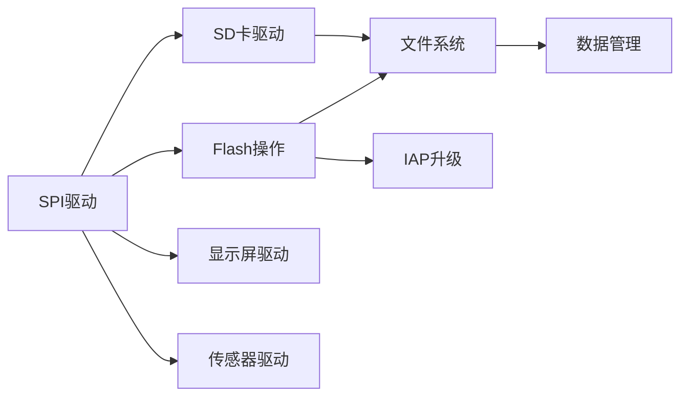

# SPI驱动开发：外部Flash读写

## 概述

SPI（Serial Peripheral Interface，串行外设接口）是一种高速、全双工、同步的串行通信总线。它广泛应用于微控制器与外部设备（如Flash存储器、SD卡、显示屏、传感器等）之间的通信。相比I2C和UART，SPI具有更高的传输速度和更简单的协议。

本教程将通过W25Q128 Flash存储器的读写操作，带你深入理解SPI驱动开发的核心技术。W25Q128是一款常用的16MB SPI Flash芯片，广泛应用于嵌入式系统中的程序存储、数据记录和文件系统。

完成本教程后，你将能够：

- 理解SPI的工作原理和通信协议
- 掌握SPI寄存器的配置方法
- 实现SPI的主从模式通信
- 掌握Flash存储器的读写操作
- 实现扇区擦除和页编程
- 为文件系统提供底层接口
- 调试和优化SPI通信

## 背景知识

### SPI通信原理

SPI是一种主从架构的同步串行通信协议，由一个主设备和一个或多个从设备组成。

**SPI信号线**：

```
主设备(Master)                从设备(Slave)
    |                              |
    |-------- SCLK --------------->|  时钟线（主设备输出）
    |-------- MOSI --------------->|  主出从入（数据输出）
    |<------- MISO ----------------|  主入从出（数据输入）
    |-------- CS/SS -------------->|  片选信号（低电平有效）
```

| 信号 | 全称 | 方向 | 说明 |
|------|------|------|------|
| SCLK | Serial Clock | Master → Slave | 时钟信号，由主设备产生 |
| MOSI | Master Out Slave In | Master → Slave | 主设备发送数据 |
| MISO | Master In Slave Out | Slave → Master | 从设备发送数据 |
| CS/SS | Chip Select / Slave Select | Master → Slave | 片选信号，选中从设备 |

**SPI通信特点**：

1. **全双工通信**：可以同时发送和接收数据
2. **同步通信**：有时钟信号，收发双方同步
3. **高速传输**：速度可达几十MHz
4. **主从模式**：主设备控制通信时序
5. **多从设备**：通过不同的CS信号选择从设备


### SPI工作模式

SPI有4种工作模式，由时钟极性（CPOL）和时钟相位（CPHA）决定：

| 模式 | CPOL | CPHA | 空闲时钟 | 采样边沿 | 说明 |
|------|------|------|---------|---------|------|
| 0 | 0 | 0 | 低电平 | 上升沿 | 最常用 |
| 1 | 0 | 1 | 低电平 | 下降沿 | |
| 2 | 1 | 0 | 高电平 | 下降沿 | |
| 3 | 1 | 1 | 高电平 | 上升沿 | |

**CPOL（Clock Polarity，时钟极性）**：
- CPOL=0：空闲时SCLK为低电平
- CPOL=1：空闲时SCLK为高电平

**CPHA（Clock Phase，时钟相位）**：
- CPHA=0：第一个时钟边沿采样数据
- CPHA=1：第二个时钟边沿采样数据

**W25Q128支持模式0和模式3**，本教程使用模式0（CPOL=0, CPHA=0）。

### W25Q128 Flash存储器

W25Q128是Winbond公司生产的128Mbit（16MB）SPI Flash芯片。

**主要特性**：
- 容量：16MB（128Mbit）
- 电压：2.7V-3.6V
- 速度：最高104MHz（标准读取）
- 擦除单位：4KB扇区、32KB块、64KB块
- 编程单位：256字节页
- 擦写次数：100,000次
- 数据保持：20年

**存储器组织**：
```
16MB = 256个块(64KB) = 4096个扇区(4KB) = 65536个页(256B)

地址范围：0x000000 - 0xFFFFFF（24位地址）
```

**常用命令**：

| 命令 | 指令码 | 说明 |
|------|--------|------|
| Read Data | 0x03 | 读取数据 |
| Page Program | 0x02 | 页编程（写入） |
| Sector Erase | 0x20 | 扇区擦除（4KB） |
| Block Erase 32KB | 0x52 | 块擦除（32KB） |
| Block Erase 64KB | 0xD8 | 块擦除（64KB） |
| Chip Erase | 0xC7 | 整片擦除 |
| Write Enable | 0x06 | 写使能 |
| Write Disable | 0x04 | 写禁止 |
| Read Status Register | 0x05 | 读状态寄存器 |
| Read JEDEC ID | 0x9F | 读取厂商ID |


### STM32 SPI寄存器

STM32 SPI的主要寄存器：

| 寄存器 | 全称 | 功能 |
|--------|------|------|
| CR1 | Control Register 1 | 使能、模式、波特率、数据格式 |
| CR2 | Control Register 2 | DMA、中断控制 |
| SR | Status Register | 状态标志 |
| DR | Data Register | 数据收发 |
| CRCPR | CRC Polynomial Register | CRC多项式 |
| RXCRCR | RX CRC Register | 接收CRC |
| TXCRCR | TX CRC Register | 发送CRC |

## 环境准备

### 硬件要求

- STM32F4系列开发板（如STM32F407VET6）
- W25Q128 SPI Flash模块
- 杜邦线若干
- 逻辑分析仪（可选，用于调试）

### 软件要求

- Keil MDK 5.x 或 STM32CubeIDE
- STM32F4 HAL库或标准外设库
- 串口调试工具（用于输出调试信息）

### 硬件连接

```
STM32F407 <---> W25Q128 Flash

SPI1连接：
- PA5 (SPI1_SCK)  ---> CLK
- PA6 (SPI1_MISO) ---> DO (MISO)
- PA7 (SPI1_MOSI) ---> DI (MOSI)
- PA4 (GPIO)      ---> CS (片选)
- 3.3V            ---> VCC
- GND             ---> GND

注意：
1. W25Q128工作电压为3.3V
2. CS片选由GPIO控制，低电平有效
3. 确保连线尽量短，减少干扰
```

## 核心内容

### 步骤1：SPI GPIO和时钟配置

首先配置SPI相关的GPIO引脚和时钟。

```c
#include "stm32f4xx.h"

// W25Q128 CS引脚定义
#define W25Q_CS_PORT    GPIOA
#define W25Q_CS_PIN     4

// CS控制宏
#define W25Q_CS_LOW()   (W25Q_CS_PORT->BSRR = (1 << (W25Q_CS_PIN + 16)))
#define W25Q_CS_HIGH()  (W25Q_CS_PORT->BSRR = (1 << W25Q_CS_PIN))

/**
 * @brief  SPI1 GPIO初始化
 * @param  无
 * @retval 无
 */
void SPI1_GPIO_Init(void) {
    // 使能GPIOA时钟
    RCC->AHB1ENR |= RCC_AHB1ENR_GPIOAEN;
    
    // 配置PA5/PA6/PA7为复用功能（SPI1）
    // PA5: SCK, PA6: MISO, PA7: MOSI
    GPIOA->MODER &= ~((0x03 << (5*2)) | (0x03 << (6*2)) | (0x03 << (7*2)));
    GPIOA->MODER |= (0x02 << (5*2)) | (0x02 << (6*2)) | (0x02 << (7*2));
    
    // 配置为推挽输出、高速、上拉
    GPIOA->OTYPER &= ~((1 << 5) | (1 << 6) | (1 << 7));
    GPIOA->OSPEEDR |= (0x03 << (5*2)) | (0x03 << (6*2)) | (0x03 << (7*2));
    GPIOA->PUPDR &= ~((0x03 << (5*2)) | (0x03 << (6*2)) | (0x03 << (7*2)));
    GPIOA->PUPDR |= (0x01 << (5*2)) | (0x01 << (6*2)) | (0x01 << (7*2));
    
    // 配置复用功能为SPI1（AF5）
    GPIOA->AFR[0] &= ~((0x0F << (5*4)) | (0x0F << (6*4)) | (0x0F << (7*4)));
    GPIOA->AFR[0] |= (0x05 << (5*4)) | (0x05 << (6*4)) | (0x05 << (7*4));
    
    // 配置PA4为GPIO输出（CS片选）
    GPIOA->MODER &= ~(0x03 << (4*2));
    GPIOA->MODER |= (0x01 << (4*2));  // 输出模式
    GPIOA->OTYPER &= ~(1 << 4);       // 推挽输出
    GPIOA->OSPEEDR |= (0x03 << (4*2)); // 高速
    GPIOA->PUPDR |= (0x01 << (4*2));   // 上拉
    
    // CS默认为高电平（未选中）
    W25Q_CS_HIGH();
}
```


### 步骤2：SPI基本配置

配置SPI的工作模式、波特率等参数。

```c
/**
 * @brief  SPI1基本配置
 * @param  无
 * @retval 无
 */
void SPI1_Config(void) {
    // 使能SPI1时钟（在APB2总线上）
    RCC->APB2ENR |= RCC_APB2ENR_SPI1EN;
    
    // 禁用SPI（配置前必须禁用）
    SPI1->CR1 &= ~SPI_CR1_SPE;
    
    // 配置CR1寄存器
    SPI1->CR1 = 0;  // 清零
    
    // 1. 设置为主模式
    SPI1->CR1 |= SPI_CR1_MSTR;
    
    // 2. 设置波特率：APB2/4 = 84MHz/4 = 21MHz
    // BR[2:0]: 000=/2, 001=/4, 010=/8, 011=/16, 100=/32, 101=/64, 110=/128, 111=/256
    SPI1->CR1 |= (0x01 << 3);  // 001 = /4
    
    // 3. 设置时钟极性和相位（模式0）
    SPI1->CR1 &= ~SPI_CR1_CPOL;  // CPOL=0：空闲时低电平
    SPI1->CR1 &= ~SPI_CR1_CPHA;  // CPHA=0：第一个边沿采样
    
    // 4. 设置数据帧格式：8位
    SPI1->CR1 &= ~SPI_CR1_DFF;   // 0=8位数据帧
    
    // 5. 设置MSB先传输
    SPI1->CR1 &= ~SPI_CR1_LSBFIRST;
    
    // 6. 软件管理NSS（片选）
    SPI1->CR1 |= SPI_CR1_SSM;    // 软件NSS管理
    SPI1->CR1 |= SPI_CR1_SSI;    // 内部NSS信号为高
    
    // 7. 配置为全双工模式
    SPI1->CR1 &= ~SPI_CR1_RXONLY;  // 全双工模式
    SPI1->CR1 &= ~SPI_CR1_BIDIMODE; // 双线双向模式
    
    // 使能SPI
    SPI1->CR1 |= SPI_CR1_SPE;
}

/**
 * @brief  SPI1完整初始化
 * @param  无
 * @retval 无
 */
void SPI1_Init(void) {
    SPI1_GPIO_Init();
    SPI1_Config();
}
```

**波特率计算**：
```
SPI1在APB2总线上，APB2时钟为84MHz
波特率 = APB2时钟 / 分频系数

分频系数选择：
- /2   = 42MHz（太快，可能不稳定）
- /4   = 21MHz（推荐）
- /8   = 10.5MHz
- /16  = 5.25MHz
- /32  = 2.625MHz
- /64  = 1.3125MHz
- /128 = 656.25KHz
- /256 = 328.125KHz

W25Q128最高支持104MHz，但实际使用建议不超过30MHz
```


### 步骤3：SPI数据收发函数

实现SPI的基本数据收发功能。

```c
/**
 * @brief  SPI发送并接收一个字节
 * @param  data: 要发送的字节
 * @retval 接收到的字节
 */
uint8_t SPI1_TransferByte(uint8_t data) {
    // 等待发送缓冲区为空
    while (!(SPI1->SR & SPI_SR_TXE));
    
    // 发送数据
    SPI1->DR = data;
    
    // 等待接收缓冲区非空
    while (!(SPI1->SR & SPI_SR_RXNE));
    
    // 读取并返回接收到的数据
    return (uint8_t)SPI1->DR;
}

/**
 * @brief  SPI发送一个字节（不关心接收）
 * @param  data: 要发送的字节
 * @retval 无
 */
void SPI1_SendByte(uint8_t data) {
    SPI1_TransferByte(data);
}

/**
 * @brief  SPI接收一个字节（发送0xFF）
 * @param  无
 * @retval 接收到的字节
 */
uint8_t SPI1_ReceiveByte(void) {
    return SPI1_TransferByte(0xFF);
}

/**
 * @brief  SPI发送多个字节
 * @param  buf: 数据缓冲区
 * @param  len: 数据长度
 * @retval 无
 */
void SPI1_SendBuffer(const uint8_t *buf, uint32_t len) {
    for (uint32_t i = 0; i < len; i++) {
        SPI1_TransferByte(buf[i]);
    }
}

/**
 * @brief  SPI接收多个字节
 * @param  buf: 数据缓冲区
 * @param  len: 数据长度
 * @retval 无
 */
void SPI1_ReceiveBuffer(uint8_t *buf, uint32_t len) {
    for (uint32_t i = 0; i < len; i++) {
        buf[i] = SPI1_ReceiveByte();
    }
}
```

**SPI状态标志说明**：

| 标志位 | 名称 | 说明 |
|--------|------|------|
| TXE | Transmit Buffer Empty | 发送缓冲区为空 |
| RXNE | Receive Buffer Not Empty | 接收缓冲区非空 |
| BSY | Busy Flag | SPI忙标志 |
| OVR | Overrun Flag | 溢出错误 |
| MODF | Mode Fault | 模式错误 |
| CRCERR | CRC Error | CRC错误 |


### 步骤4：W25Q128基本操作

实现Flash的基本操作函数。

```c
// W25Q128命令定义
#define W25Q_CMD_WRITE_ENABLE       0x06
#define W25Q_CMD_WRITE_DISABLE      0x04
#define W25Q_CMD_READ_STATUS_REG    0x05
#define W25Q_CMD_WRITE_STATUS_REG   0x01
#define W25Q_CMD_READ_DATA          0x03
#define W25Q_CMD_PAGE_PROGRAM       0x02
#define W25Q_CMD_SECTOR_ERASE       0x20
#define W25Q_CMD_BLOCK_ERASE_32K    0x52
#define W25Q_CMD_BLOCK_ERASE_64K    0xD8
#define W25Q_CMD_CHIP_ERASE         0xC7
#define W25Q_CMD_READ_JEDEC_ID      0x9F
#define W25Q_CMD_POWER_DOWN         0xB9
#define W25Q_CMD_RELEASE_POWER_DOWN 0xAB

// 状态寄存器位定义
#define W25Q_STATUS_BUSY            0x01  // 忙标志
#define W25Q_STATUS_WEL             0x02  // 写使能标志

/**
 * @brief  读取W25Q128状态寄存器
 * @param  无
 * @retval 状态寄存器值
 */
uint8_t W25Q_ReadStatusReg(void) {
    uint8_t status;
    
    W25Q_CS_LOW();
    SPI1_SendByte(W25Q_CMD_READ_STATUS_REG);
    status = SPI1_ReceiveByte();
    W25Q_CS_HIGH();
    
    return status;
}

/**
 * @brief  等待W25Q128空闲
 * @param  无
 * @retval 无
 */
void W25Q_WaitBusy(void) {
    while (W25Q_ReadStatusReg() & W25Q_STATUS_BUSY);
}

/**
 * @brief  写使能
 * @param  无
 * @retval 无
 */
void W25Q_WriteEnable(void) {
    W25Q_CS_LOW();
    SPI1_SendByte(W25Q_CMD_WRITE_ENABLE);
    W25Q_CS_HIGH();
}

/**
 * @brief  写禁止
 * @param  无
 * @retval 无
 */
void W25Q_WriteDisable(void) {
    W25Q_CS_LOW();
    SPI1_SendByte(W25Q_CMD_WRITE_DISABLE);
    W25Q_CS_HIGH();
}

/**
 * @brief  读取JEDEC ID（厂商ID和设备ID）
 * @param  无
 * @retval 24位ID（高8位：厂商，中8位：类型，低8位：容量）
 */
uint32_t W25Q_ReadJedecID(void) {
    uint32_t id = 0;
    
    W25Q_CS_LOW();
    SPI1_SendByte(W25Q_CMD_READ_JEDEC_ID);
    id |= (SPI1_ReceiveByte() << 16);  // 厂商ID
    id |= (SPI1_ReceiveByte() << 8);   // 设备类型
    id |= SPI1_ReceiveByte();          // 设备容量
    W25Q_CS_HIGH();
    
    return id;
}

/**
 * @brief  W25Q128初始化
 * @param  无
 * @retval 0=成功，1=失败
 */
uint8_t W25Q_Init(void) {
    uint32_t id;
    
    // 初始化SPI
    SPI1_Init();
    
    // 读取ID验证
    id = W25Q_ReadJedecID();
    
    // W25Q128的ID：0xEF4018
    // 0xEF: Winbond厂商ID
    // 0x40: 设备类型
    // 0x18: 容量（2^24 = 16MB）
    if (id == 0xEF4018) {
        return 0;  // 成功
    }
    
    return 1;  // 失败
}
```


### 步骤5：Flash读取操作

实现Flash的数据读取功能。

```c
/**
 * @brief  读取Flash数据
 * @param  addr: 读取地址（24位，0x000000-0xFFFFFF）
 * @param  buf: 数据缓冲区
 * @param  len: 读取长度
 * @retval 无
 */
void W25Q_ReadData(uint32_t addr, uint8_t *buf, uint32_t len) {
    W25Q_CS_LOW();
    
    // 发送读命令
    SPI1_SendByte(W25Q_CMD_READ_DATA);
    
    // 发送24位地址
    SPI1_SendByte((addr >> 16) & 0xFF);  // A23-A16
    SPI1_SendByte((addr >> 8) & 0xFF);   // A15-A8
    SPI1_SendByte(addr & 0xFF);          // A7-A0
    
    // 读取数据
    for (uint32_t i = 0; i < len; i++) {
        buf[i] = SPI1_ReceiveByte();
    }
    
    W25Q_CS_HIGH();
}

/**
 * @brief  读取一个字节
 * @param  addr: 读取地址
 * @retval 读取的字节
 */
uint8_t W25Q_ReadByte(uint32_t addr) {
    uint8_t data;
    W25Q_ReadData(addr, &data, 1);
    return data;
}
```

### 步骤6：Flash擦除操作

Flash必须先擦除后才能写入。擦除操作将数据变为0xFF。

```c
/**
 * @brief  扇区擦除（4KB）
 * @param  addr: 扇区地址（必须是4KB对齐）
 * @retval 无
 */
void W25Q_EraseSector(uint32_t addr) {
    // 写使能
    W25Q_WriteEnable();
    
    // 等待写使能完成
    while (!(W25Q_ReadStatusReg() & W25Q_STATUS_WEL));
    
    W25Q_CS_LOW();
    
    // 发送擦除命令
    SPI1_SendByte(W25Q_CMD_SECTOR_ERASE);
    
    // 发送24位地址
    SPI1_SendByte((addr >> 16) & 0xFF);
    SPI1_SendByte((addr >> 8) & 0xFF);
    SPI1_SendByte(addr & 0xFF);
    
    W25Q_CS_HIGH();
    
    // 等待擦除完成
    W25Q_WaitBusy();
}

/**
 * @brief  块擦除（64KB）
 * @param  addr: 块地址（必须是64KB对齐）
 * @retval 无
 */
void W25Q_EraseBlock64K(uint32_t addr) {
    W25Q_WriteEnable();
    while (!(W25Q_ReadStatusReg() & W25Q_STATUS_WEL));
    
    W25Q_CS_LOW();
    SPI1_SendByte(W25Q_CMD_BLOCK_ERASE_64K);
    SPI1_SendByte((addr >> 16) & 0xFF);
    SPI1_SendByte((addr >> 8) & 0xFF);
    SPI1_SendByte(addr & 0xFF);
    W25Q_CS_HIGH();
    
    W25Q_WaitBusy();
}

/**
 * @brief  整片擦除
 * @param  无
 * @retval 无
 * @note   擦除时间较长（约20-100秒）
 */
void W25Q_EraseChip(void) {
    W25Q_WriteEnable();
    while (!(W25Q_ReadStatusReg() & W25Q_STATUS_WEL));
    
    W25Q_CS_LOW();
    SPI1_SendByte(W25Q_CMD_CHIP_ERASE);
    W25Q_CS_HIGH();
    
    W25Q_WaitBusy();
}
```

**擦除时间参考**：
- 扇区擦除（4KB）：约45ms
- 块擦除（32KB）：约120ms
- 块擦除（64KB）：约150ms
- 整片擦除（16MB）：约20-100秒


### 步骤7：Flash写入操作

实现Flash的页编程（写入）功能。

```c
/**
 * @brief  页编程（最多256字节）
 * @param  addr: 写入地址
 * @param  buf: 数据缓冲区
 * @param  len: 写入长度（不超过256字节）
 * @retval 无
 * @note   写入地址必须在同一页内，不能跨页
 */
void W25Q_PageProgram(uint32_t addr, const uint8_t *buf, uint32_t len) {
    // 限制长度不超过256字节
    if (len > 256) {
        len = 256;
    }
    
    // 写使能
    W25Q_WriteEnable();
    while (!(W25Q_ReadStatusReg() & W25Q_STATUS_WEL));
    
    W25Q_CS_LOW();
    
    // 发送页编程命令
    SPI1_SendByte(W25Q_CMD_PAGE_PROGRAM);
    
    // 发送24位地址
    SPI1_SendByte((addr >> 16) & 0xFF);
    SPI1_SendByte((addr >> 8) & 0xFF);
    SPI1_SendByte(addr & 0xFF);
    
    // 发送数据
    for (uint32_t i = 0; i < len; i++) {
        SPI1_SendByte(buf[i]);
    }
    
    W25Q_CS_HIGH();
    
    // 等待编程完成
    W25Q_WaitBusy();
}

/**
 * @brief  写入数据（自动处理跨页）
 * @param  addr: 写入地址
 * @param  buf: 数据缓冲区
 * @param  len: 写入长度
 * @retval 无
 */
void W25Q_WriteData(uint32_t addr, const uint8_t *buf, uint32_t len) {
    uint32_t page_remain;  // 当前页剩余字节数
    uint32_t write_len;    // 本次写入长度
    
    page_remain = 256 - (addr % 256);  // 计算当前页剩余空间
    
    if (len <= page_remain) {
        // 数据在同一页内
        W25Q_PageProgram(addr, buf, len);
    } else {
        // 数据跨页
        // 先写满当前页
        W25Q_PageProgram(addr, buf, page_remain);
        addr += page_remain;
        buf += page_remain;
        len -= page_remain;
        
        // 写入剩余数据
        while (len > 0) {
            write_len = (len > 256) ? 256 : len;
            W25Q_PageProgram(addr, buf, write_len);
            addr += write_len;
            buf += write_len;
            len -= write_len;
        }
    }
}

/**
 * @brief  写入一个字节
 * @param  addr: 写入地址
 * @param  data: 要写入的字节
 * @retval 无
 */
void W25Q_WriteByte(uint32_t addr, uint8_t data) {
    W25Q_WriteData(addr, &data, 1);
}
```

**页编程注意事项**：

1. **页对齐**：
   - Flash以256字节为一页
   - 页地址：0x000000, 0x000100, 0x000200, ...
   - 写入不能跨页，否则会回卷到页首

2. **写入前必须擦除**：
   - Flash只能从1写成0，不能从0写成1
   - 擦除操作将所有位设置为1（0xFF）
   - 写入操作将部分位从1变为0

3. **写入时间**：
   - 页编程时间：约0.7ms
   - 写使能时间：约几微秒


## 实践示例

### 示例1：Flash读写测试

基本的Flash读写功能测试。

```c
#include <stdio.h>

/**
 * @brief  主函数 - Flash读写测试
 */
int main(void) {
    uint8_t write_buf[256];
    uint8_t read_buf[256];
    uint32_t test_addr = 0x000000;
    
    // 系统初始化
    SystemInit();
    UART1_Init(115200);  // 用于调试输出
    
    // 初始化W25Q128
    if (W25Q_Init() == 0) {
        printf("W25Q128 Init OK\r\n");
        printf("JEDEC ID: 0x%06X\r\n", W25Q_ReadJedecID());
    } else {
        printf("W25Q128 Init Failed!\r\n");
        while (1);
    }
    
    // 准备测试数据
    for (int i = 0; i < 256; i++) {
        write_buf[i] = i;
    }
    
    printf("\r\n=== Flash Write Test ===\r\n");
    
    // 擦除扇区
    printf("Erasing sector at 0x%06X...\r\n", test_addr);
    W25Q_EraseSector(test_addr);
    printf("Erase done\r\n");
    
    // 写入数据
    printf("Writing data...\r\n");
    W25Q_WriteData(test_addr, write_buf, 256);
    printf("Write done\r\n");
    
    // 读取数据
    printf("Reading data...\r\n");
    W25Q_ReadData(test_addr, read_buf, 256);
    printf("Read done\r\n");
    
    // 验证数据
    printf("\r\n=== Data Verification ===\r\n");
    uint32_t errors = 0;
    for (int i = 0; i < 256; i++) {
        if (write_buf[i] != read_buf[i]) {
            printf("Error at offset %d: wrote 0x%02X, read 0x%02X\r\n",
                   i, write_buf[i], read_buf[i]);
            errors++;
        }
    }
    
    if (errors == 0) {
        printf("Verification PASSED!\r\n");
    } else {
        printf("Verification FAILED! %d errors\r\n", errors);
    }
    
    // 显示部分数据
    printf("\r\n=== First 16 bytes ===\r\n");
    for (int i = 0; i < 16; i++) {
        printf("%02X ", read_buf[i]);
    }
    printf("\r\n");
    
    while (1) {
        // 主循环
    }
}
```

### 示例2：Flash性能测试

测试Flash的读写速度。

```c
/**
 * @brief  简单延时函数（用于计时）
 * @param  ms: 延时毫秒数
 * @retval 无
 */
void Delay_Ms(uint32_t ms) {
    for (volatile uint32_t i = 0; i < ms * 21000; i++);
}

/**
 * @brief  获取系统滴答计数（假设SysTick已配置为1ms）
 * @param  无
 * @retval 当前计数值
 */
extern volatile uint32_t g_systick_count;

/**
 * @brief  Flash性能测试
 */
void FlashPerformanceTest(void) {
    uint8_t buffer[4096];  // 4KB缓冲区
    uint32_t start_time, end_time;
    uint32_t test_addr = 0x010000;  // 测试地址
    
    printf("\r\n=== Flash Performance Test ===\r\n");
    
    // 准备测试数据
    for (int i = 0; i < 4096; i++) {
        buffer[i] = i & 0xFF;
    }
    
    // 测试扇区擦除速度
    printf("\r\n1. Sector Erase Test (4KB)\r\n");
    start_time = g_systick_count;
    W25Q_EraseSector(test_addr);
    end_time = g_systick_count;
    printf("   Time: %d ms\r\n", end_time - start_time);
    
    // 测试写入速度
    printf("\r\n2. Write Test (4KB)\r\n");
    start_time = g_systick_count;
    W25Q_WriteData(test_addr, buffer, 4096);
    end_time = g_systick_count;
    printf("   Time: %d ms\r\n", end_time - start_time);
    printf("   Speed: %d KB/s\r\n", 4000 / (end_time - start_time));
    
    // 测试读取速度
    printf("\r\n3. Read Test (4KB)\r\n");
    start_time = g_systick_count;
    W25Q_ReadData(test_addr, buffer, 4096);
    end_time = g_systick_count;
    printf("   Time: %d ms\r\n", end_time - start_time);
    printf("   Speed: %d KB/s\r\n", 4000 / (end_time - start_time));
}
```


### 示例3：文件系统接口

为FATFS文件系统提供底层接口。

```c
/**
 * @brief  Flash扇区读取（FATFS接口）
 * @param  sector: 扇区号
 * @param  buffer: 数据缓冲区
 * @param  count: 扇区数量
 * @retval 0=成功，其他=失败
 */
uint8_t Flash_ReadSectors(uint32_t sector, uint8_t *buffer, uint32_t count) {
    uint32_t addr = sector * 4096;  // 扇区大小4KB
    W25Q_ReadData(addr, buffer, count * 4096);
    return 0;
}

/**
 * @brief  Flash扇区写入（FATFS接口）
 * @param  sector: 扇区号
 * @param  buffer: 数据缓冲区
 * @param  count: 扇区数量
 * @retval 0=成功，其他=失败
 */
uint8_t Flash_WriteSectors(uint32_t sector, const uint8_t *buffer, uint32_t count) {
    uint32_t addr;
    
    for (uint32_t i = 0; i < count; i++) {
        addr = (sector + i) * 4096;
        
        // 擦除扇区
        W25Q_EraseSector(addr);
        
        // 写入数据
        W25Q_WriteData(addr, buffer + i * 4096, 4096);
    }
    
    return 0;
}

/**
 * @brief  获取Flash信息（FATFS接口）
 * @param  无
 * @retval 扇区数量
 */
uint32_t Flash_GetSectorCount(void) {
    // 16MB / 4KB = 4096个扇区
    return 4096;
}
```

### 示例4：数据记录应用

实现一个简单的数据记录功能。

```c
#define LOG_START_ADDR  0x100000  // 日志起始地址（1MB）
#define LOG_SECTOR_SIZE 4096
#define LOG_MAX_RECORDS 1000

typedef struct {
    uint32_t timestamp;
    uint16_t temperature;
    uint16_t humidity;
    uint8_t  status;
    uint8_t  reserved[3];
} LogRecord_t;  // 12字节

/**
 * @brief  写入一条日志记录
 * @param  record: 日志记录指针
 * @retval 0=成功，1=失败（存储满）
 */
uint8_t Log_WriteRecord(LogRecord_t *record) {
    static uint32_t record_count = 0;
    uint32_t addr;
    
    if (record_count >= LOG_MAX_RECORDS) {
        return 1;  // 存储满
    }
    
    addr = LOG_START_ADDR + record_count * sizeof(LogRecord_t);
    
    // 检查是否需要擦除新扇区
    if ((addr % LOG_SECTOR_SIZE) == 0) {
        W25Q_EraseSector(addr);
    }
    
    // 写入记录
    W25Q_WriteData(addr, (uint8_t*)record, sizeof(LogRecord_t));
    
    record_count++;
    return 0;
}

/**
 * @brief  读取日志记录
 * @param  index: 记录索引
 * @param  record: 日志记录指针
 * @retval 0=成功，1=失败
 */
uint8_t Log_ReadRecord(uint32_t index, LogRecord_t *record) {
    uint32_t addr;
    
    if (index >= LOG_MAX_RECORDS) {
        return 1;
    }
    
    addr = LOG_START_ADDR + index * sizeof(LogRecord_t);
    W25Q_ReadData(addr, (uint8_t*)record, sizeof(LogRecord_t));
    
    return 0;
}

/**
 * @brief  清空日志
 * @param  无
 * @retval 无
 */
void Log_Clear(void) {
    uint32_t sectors = (LOG_MAX_RECORDS * sizeof(LogRecord_t) + LOG_SECTOR_SIZE - 1) / LOG_SECTOR_SIZE;
    
    for (uint32_t i = 0; i < sectors; i++) {
        W25Q_EraseSector(LOG_START_ADDR + i * LOG_SECTOR_SIZE);
    }
}

/**
 * @brief  主函数 - 数据记录示例
 */
int main(void) {
    LogRecord_t record;
    
    SystemInit();
    UART1_Init(115200);
    W25Q_Init();
    
    printf("Data Logger Example\r\n");
    
    // 写入测试数据
    for (int i = 0; i < 10; i++) {
        record.timestamp = i * 1000;
        record.temperature = 2500 + i * 10;  // 25.00°C
        record.humidity = 6000 + i * 5;      // 60.00%
        record.status = 0x01;
        
        if (Log_WriteRecord(&record) == 0) {
            printf("Record %d written\r\n", i);
        }
    }
    
    // 读取并显示数据
    printf("\r\n=== Stored Records ===\r\n");
    for (int i = 0; i < 10; i++) {
        if (Log_ReadRecord(i, &record) == 0) {
            printf("Record %d: Time=%d, Temp=%d.%02d°C, Hum=%d.%02d%%\r\n",
                   i, record.timestamp,
                   record.temperature / 100, record.temperature % 100,
                   record.humidity / 100, record.humidity % 100);
        }
    }
    
    while (1);
}
```


## 深入理解

### SPI与DMA结合

使用DMA可以大幅提高SPI的传输效率。

```c
/**
 * @brief  配置SPI1的DMA发送
 * @param  无
 * @retval 无
 */
void SPI1_DMA_TX_Config(void) {
    // 使能DMA2时钟
    RCC->AHB1ENR |= RCC_AHB1ENR_DMA2EN;
    
    // 配置DMA2 Stream3 Channel3（SPI1_TX）
    DMA2_Stream3->CR = 0;
    while (DMA2_Stream3->CR & DMA_SxCR_EN);
    
    DMA2_Stream3->PAR = (uint32_t)&SPI1->DR;
    DMA2_Stream3->CR = (3 << 25) |  // Channel 3
                       (1 << 16) |  // 中等优先级
                       (0 << 13) |  // 内存：字节
                       (0 << 11) |  // 外设：字节
                       (1 << 10) |  // 内存地址递增
                       (1 << 6);    // 内存到外设
    
    // 使能SPI1的DMA发送
    SPI1->CR2 |= SPI_CR2_TXDMAEN;
}

/**
 * @brief  使用DMA发送数据
 * @param  data: 数据指针
 * @param  length: 数据长度
 * @retval 无
 */
void SPI1_DMA_Send(const uint8_t *data, uint16_t length) {
    while (DMA2_Stream3->CR & DMA_SxCR_EN);
    
    DMA2_Stream3->M0AR = (uint32_t)data;
    DMA2_Stream3->NDTR = length;
    
    DMA2->LIFCR = 0x3F << 22;  // 清除标志
    DMA2_Stream3->CR |= DMA_SxCR_EN;
    
    // 等待传输完成
    while (DMA2_Stream3->CR & DMA_SxCR_EN);
    while (SPI1->SR & SPI_SR_BSY);
}
```

### Flash磨损均衡

Flash有擦写次数限制，需要实现磨损均衡。

```c
#define WEAR_LEVEL_BLOCKS 16  // 磨损均衡块数

typedef struct {
    uint32_t erase_count;  // 擦除次数
    uint32_t block_addr;   // 块地址
} WearLevelInfo_t;

WearLevelInfo_t wear_level_table[WEAR_LEVEL_BLOCKS];

/**
 * @brief  选择擦除次数最少的块
 * @param  无
 * @retval 块索引
 */
uint32_t WearLevel_SelectBlock(void) {
    uint32_t min_index = 0;
    uint32_t min_count = wear_level_table[0].erase_count;
    
    for (uint32_t i = 1; i < WEAR_LEVEL_BLOCKS; i++) {
        if (wear_level_table[i].erase_count < min_count) {
            min_count = wear_level_table[i].erase_count;
            min_index = i;
        }
    }
    
    return min_index;
}

/**
 * @brief  擦除块（带磨损均衡）
 * @param  block_index: 块索引
 * @retval 无
 */
void WearLevel_EraseBlock(uint32_t block_index) {
    uint32_t addr = wear_level_table[block_index].block_addr;
    
    W25Q_EraseBlock64K(addr);
    wear_level_table[block_index].erase_count++;
    
    // 保存磨损信息到Flash
    // ...
}
```

### Flash坏块管理

实现简单的坏块管理机制。

```c
#define BAD_BLOCK_MARKER 0xBAD0

typedef struct {
    uint16_t marker;       // 坏块标记
    uint16_t block_num;    // 块号
    uint32_t reserved;
} BadBlockInfo_t;

/**
 * @brief  标记坏块
 * @param  block_addr: 块地址
 * @retval 无
 */
void MarkBadBlock(uint32_t block_addr) {
    BadBlockInfo_t info;
    
    info.marker = BAD_BLOCK_MARKER;
    info.block_num = block_addr / (64 * 1024);
    info.reserved = 0;
    
    // 写入坏块标记到块的第一页
    W25Q_WriteData(block_addr, (uint8_t*)&info, sizeof(BadBlockInfo_t));
}

/**
 * @brief  检查是否为坏块
 * @param  block_addr: 块地址
 * @retval 1=坏块，0=好块
 */
uint8_t IsBadBlock(uint32_t block_addr) {
    BadBlockInfo_t info;
    
    W25Q_ReadData(block_addr, (uint8_t*)&info, sizeof(BadBlockInfo_t));
    
    return (info.marker == BAD_BLOCK_MARKER) ? 1 : 0;
}
```


## 常见问题

### Q1: SPI通信失败，读取的数据全是0xFF或0x00？

**可能原因**：
1. 硬件连接错误
2. SPI配置错误
3. 片选信号未正确控制
4. 时钟极性/相位不匹配

**排查步骤**：

```c
// 1. 检查硬件连接
// 使用万用表测量引脚电压
// 使用逻辑分析仪观察波形

// 2. 验证SPI配置
printf("SPI1 CR1: 0x%04X\r\n", SPI1->CR1);
printf("SPI1 CR2: 0x%04X\r\n", SPI1->CR2);

// 3. 测试回环
// 将MOSI和MISO短接
uint8_t test_data = 0xA5;
uint8_t recv_data;

W25Q_CS_LOW();
recv_data = SPI1_TransferByte(test_data);
W25Q_CS_HIGH();

if (recv_data == test_data) {
    printf("SPI loopback test OK\r\n");
} else {
    printf("SPI loopback test FAIL: sent 0x%02X, received 0x%02X\r\n",
           test_data, recv_data);
}

// 4. 检查Flash ID
uint32_t id = W25Q_ReadJedecID();
printf("Flash ID: 0x%06X\r\n", id);
if (id == 0xFFFFFF || id == 0x000000) {
    printf("Flash not responding!\r\n");
}
```

### Q2: Flash写入后读取数据不正确？

**可能原因**：
1. 写入前未擦除
2. 跨页写入
3. 写使能未生效
4. 地址计算错误

**解决方案**：

```c
// 1. 确保写入前擦除
void SafeWrite(uint32_t addr, const uint8_t *data, uint32_t len) {
    // 计算需要擦除的扇区
    uint32_t start_sector = addr / 4096;
    uint32_t end_sector = (addr + len - 1) / 4096;
    
    // 擦除所有相关扇区
    for (uint32_t sector = start_sector; sector <= end_sector; sector++) {
        W25Q_EraseSector(sector * 4096);
    }
    
    // 写入数据
    W25Q_WriteData(addr, data, len);
}

// 2. 验证写入
void VerifyWrite(uint32_t addr, const uint8_t *data, uint32_t len) {
    uint8_t *read_buf = malloc(len);
    
    W25Q_ReadData(addr, read_buf, len);
    
    for (uint32_t i = 0; i < len; i++) {
        if (read_buf[i] != data[i]) {
            printf("Verify failed at 0x%06X: wrote 0x%02X, read 0x%02X\r\n",
                   addr + i, data[i], read_buf[i]);
        }
    }
    
    free(read_buf);
}
```

### Q3: Flash擦除或写入时间过长？

**可能原因**：
1. 波特率设置过低
2. 未使用DMA
3. 频繁的小数据写入

**优化方案**：

```c
// 1. 提高SPI波特率
// 将分频系数从/8改为/4
SPI1->CR1 &= ~(0x07 << 3);
SPI1->CR1 |= (0x01 << 3);  // /4 = 21MHz

// 2. 批量写入
void BatchWrite(uint32_t addr, const uint8_t *data, uint32_t len) {
    // 一次擦除整个扇区，然后批量写入
    uint32_t sector_addr = (addr / 4096) * 4096;
    W25Q_EraseSector(sector_addr);
    
    // 使用DMA批量写入
    W25Q_WriteData(addr, data, len);
}

// 3. 使用缓存
#define CACHE_SIZE 4096
uint8_t write_cache[CACHE_SIZE];
uint32_t cache_addr = 0;
uint32_t cache_len = 0;

void CachedWrite(uint32_t addr, const uint8_t *data, uint32_t len) {
    // 如果地址连续，添加到缓存
    if (addr == cache_addr + cache_len && cache_len + len <= CACHE_SIZE) {
        memcpy(write_cache + cache_len, data, len);
        cache_len += len;
    } else {
        // 刷新缓存
        if (cache_len > 0) {
            W25Q_WriteData(cache_addr, write_cache, cache_len);
        }
        
        // 开始新缓存
        cache_addr = addr;
        memcpy(write_cache, data, len);
        cache_len = len;
    }
}

void FlushCache(void) {
    if (cache_len > 0) {
        W25Q_WriteData(cache_addr, write_cache, cache_len);
        cache_len = 0;
    }
}
```

### Q4: 如何实现Flash的掉电保护？

**解决方案**：

```c
#define MAGIC_NUMBER 0x12345678

typedef struct {
    uint32_t magic;
    uint32_t data_len;
    uint32_t crc32;
    uint8_t  data[256];
} SafeData_t;

/**
 * @brief  计算CRC32
 * @param  data: 数据指针
 * @param  len: 数据长度
 * @retval CRC32值
 */
uint32_t CalcCRC32(const uint8_t *data, uint32_t len) {
    uint32_t crc = 0xFFFFFFFF;
    
    for (uint32_t i = 0; i < len; i++) {
        crc ^= data[i];
        for (int j = 0; j < 8; j++) {
            if (crc & 1) {
                crc = (crc >> 1) ^ 0xEDB88320;
            } else {
                crc >>= 1;
            }
        }
    }
    
    return ~crc;
}

/**
 * @brief  安全写入数据
 * @param  addr: 写入地址
 * @param  data: 数据指针
 * @param  len: 数据长度
 * @retval 0=成功，1=失败
 */
uint8_t SafeDataWrite(uint32_t addr, const uint8_t *data, uint32_t len) {
    SafeData_t safe_data;
    
    if (len > 256) {
        return 1;
    }
    
    // 准备数据
    safe_data.magic = MAGIC_NUMBER;
    safe_data.data_len = len;
    memcpy(safe_data.data, data, len);
    safe_data.crc32 = CalcCRC32(safe_data.data, len);
    
    // 擦除并写入
    W25Q_EraseSector(addr);
    W25Q_WriteData(addr, (uint8_t*)&safe_data, sizeof(SafeData_t));
    
    return 0;
}

/**
 * @brief  安全读取数据
 * @param  addr: 读取地址
 * @param  data: 数据缓冲区
 * @param  len: 缓冲区大小
 * @retval 实际读取长度，0=失败
 */
uint32_t SafeDataRead(uint32_t addr, uint8_t *data, uint32_t len) {
    SafeData_t safe_data;
    uint32_t crc;
    
    // 读取数据
    W25Q_ReadData(addr, (uint8_t*)&safe_data, sizeof(SafeData_t));
    
    // 验证魔数
    if (safe_data.magic != MAGIC_NUMBER) {
        return 0;
    }
    
    // 验证CRC
    crc = CalcCRC32(safe_data.data, safe_data.data_len);
    if (crc != safe_data.crc32) {
        return 0;
    }
    
    // 复制数据
    uint32_t copy_len = (safe_data.data_len < len) ? safe_data.data_len : len;
    memcpy(data, safe_data.data, copy_len);
    
    return copy_len;
}
```


## 总结

本教程通过W25Q128 Flash存储器的读写操作，全面介绍了SPI驱动开发的核心知识。让我们回顾一下要点：

**核心知识点**：
- SPI通信原理：全双工、同步、主从模式
- SPI工作模式：CPOL和CPHA的4种组合
- SPI寄存器配置：CR1、CR2、SR、DR
- Flash存储器特性：擦除单位、编程单位、地址组织

**实践技能**：
- GPIO和SPI初始化配置
- SPI数据收发函数实现
- Flash读取、擦除、写入操作
- 页编程和跨页处理
- 文件系统底层接口

**最佳实践**：
- 写入前必须先擦除
- 注意页对齐和跨页问题
- 使用DMA提高传输效率
- 实现磨损均衡延长寿命
- 添加CRC校验保证数据完整性

**调试技巧**：
- 使用逻辑分析仪观察波形
- 验证Flash ID确认通信正常
- 回环测试验证SPI功能
- 读写验证确保数据正确

SPI是嵌入式系统中非常重要的通信接口，掌握SPI驱动开发对于使用各种外部设备至关重要。通过本教程的学习和实践，你应该能够独立完成SPI驱动的开发和调试工作。

## 延伸阅读

推荐进一步学习的内容：

**同模块内容**：
- [I2C驱动开发：传感器数据读取](04-i2c-driver.html) - 学习I2C通信
- [DMA驱动开发：高效数据传输](../intermediate/01-dma-driver.html) - 提高SPI效率
- [SDIO驱动开发：SD卡接口](../intermediate/05-sdio-driver.html) - 学习SD卡通信

**相关主题**：
- [GPIO驱动开发：LED控制实战](01-gpio-driver.html) - 复习GPIO基础
- [定时器驱动基础与应用](05-timer-driver.html) - 学习定时器
- 文件系统移植与应用 - FATFS文件系统

**Flash应用**：
- 程序在线升级（IAP）
- 参数存储和配置管理
- 数据记录和日志系统
- 文件系统实现

**官方文档**：
- [STM32F4xx参考手册](https://www.st.com/resource/en/reference_manual/dm00031020.pdf) - SPI章节
- [W25Q128数据手册](https://www.winbond.com/resource-files/w25q128jv%20revf%2003272018%20plus.pdf)
- [SPI协议规范](https://www.nxp.com/docs/en/data-sheet/SPI.pdf)

**开源项目**：
- [STM32 HAL库](https://github.com/STMicroelectronics/STM32CubeF4) - 官方SPI驱动
- [SFUD](https://github.com/armink/SFUD) - 串行Flash通用驱动库
- [LittleFS](https://github.com/littlefs-project/littlefs) - 嵌入式文件系统

## 参考资料

1. STM32F4xx参考手册 - STMicroelectronics
2. W25Q128JV数据手册 - Winbond
3. SPI协议规范 - Motorola/NXP
4. 嵌入式系统设计与实践 - Elecia White
5. STM32库开发实战指南 - 野火团队

## 练习题

### 基础练习

1. **SPI通信练习**：
   - 实现SPI回环测试
   - 测试不同波特率的通信
   - 验证4种SPI模式

2. **Flash基本操作**：
   - 读取Flash ID
   - 实现扇区擦除和读写
   - 验证数据完整性

3. **跨页写入**：
   - 实现跨页写入功能
   - 测试边界条件
   - 优化写入性能

### 进阶练习

4. **DMA传输**：
   - 使用DMA实现SPI发送
   - 使用DMA实现SPI接收
   - 测试DMA传输性能

5. **磨损均衡**：
   - 实现简单的磨损均衡算法
   - 统计擦除次数
   - 测试均衡效果

6. **文件系统**：
   - 移植FATFS到Flash
   - 实现文件读写
   - 测试文件系统性能

### 综合项目

7. **数据记录系统**：
   - 实现循环缓冲区记录
   - 支持掉电保护
   - 实现数据导出功能

8. **配置管理系统**：
   - 实现参数存储
   - 支持默认值恢复
   - 实现参数版本管理

9. **固件升级系统**：
   - 实现IAP功能
   - 支持固件备份
   - 实现升级失败回滚

### 思考题

1. SPI相比I2C和UART有什么优缺点？在什么场景下选择SPI？

2. 为什么Flash必须先擦除后写入？这对软件设计有什么影响？

3. 如何设计一个高效的Flash缓存机制？需要考虑哪些因素？

4. 磨损均衡算法有哪些？各有什么优缺点？

5. 在RTOS环境下，如何保证Flash操作的线程安全？

## 实验任务

### 任务1：Flash读写测试（必做）

**要求**：
- 实现Flash的基本读写功能
- 验证数据完整性
- 测试不同大小的数据块
- 统计读写时间

### 任务2：数据记录功能（必做）

**要求**：
- 实现循环记录功能
- 支持记录查询
- 实现记录导出
- 添加时间戳

### 任务3：文件系统移植（选做）

**要求**：
- 移植FATFS到Flash
- 实现文件创建、读写、删除
- 测试文件系统性能
- 实现目录管理

### 任务4：固件升级（选做）

**要求**：
- 实现IAP功能
- 支持固件校验
- 实现升级进度显示
- 支持升级失败恢复

**评分标准**：
- 代码规范性（20分）
- 功能完整性（30分）
- 可靠性和稳定性（30分）
- 性能和效率（20分）

---

**下一步学习建议**：

完成本教程后，建议按以下顺序继续学习：

1. [I2C驱动开发：传感器数据读取](04-i2c-driver.html) - 学习另一种常用总线
2. [DMA驱动开发：高效数据传输](../intermediate/01-dma-driver.html) - 提高传输效率
3. 文件系统移植与应用 - 实现文件管理

**学习路线图**：



祝你学习顺利！如有问题，欢迎在社区讨论。

---

**文档信息**：
- 最后更新：2024-01-15
- 版本：v1.0
- 作者：嵌入式知识平台
- 许可：CC BY-NC-SA 4.0
