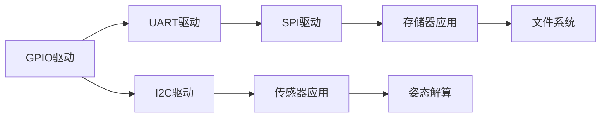

# I2C驱动开发：传感器数据读取

## 概述

I2C（Inter-Integrated Circuit，内部集成电路总线）是由Philips公司开发的一种两线式串行通信协议。它只需要两根信号线（SCL和SDA）就可以实现多个设备之间的通信，广泛应用于传感器、EEPROM、RTC、LCD等外设的连接。相比SPI，I2C使用更少的引脚，但速度较慢；相比UART，I2C支持多主多从架构。

本教程将通过MPU6050六轴传感器（三轴加速度计+三轴陀螺仪）的数据读取，带你深入理解I2C驱动开发的核心技术。MPU6050是一款常用的运动传感器，广泛应用于无人机、平衡车、手机等设备中。

完成本教程后，你将能够：

- 理解I2C的工作原理和通信协议
- 掌握I2C寄存器的配置方法
- 实现I2C的读写时序
- 掌握I2C设备扫描和地址检测
- 实现传感器数据的读取和处理
- 处理I2C通信错误和总线恢复
- 调试和优化I2C通信

## 背景知识

### I2C通信原理

I2C是一种主从架构的同步串行通信协议，支持多主多从模式。

**I2C信号线**：

```
主设备(Master)                从设备(Slave)
    |                              |
    |-------- SCL --------------->|  时钟线（双向，开漏）
    |<------- SDA --------------->|  数据线（双向，开漏）
    |                              |
   上拉电阻                      上拉电阻
    |                              |
   VCC                            VCC
```

| 信号 | 全称 | 方向 | 说明 |
|------|------|------|------|
| SCL | Serial Clock | 双向 | 时钟信号，由主设备产生 |
| SDA | Serial Data | 双向 | 数据信号，双向传输 |

**I2C通信特点**：

1. **两线式通信**：只需SCL和SDA两根线
2. **开漏输出**：需要外部上拉电阻（通常4.7kΩ）
3. **多主多从**：支持多个主设备和从设备
4. **地址寻址**：每个从设备有唯一的7位或10位地址
5. **应答机制**：每个字节传输后需要应答
6. **速度可选**：标准模式100kHz，快速模式400kHz，高速模式3.4MHz

### I2C通信时序

**起始条件（Start Condition）**：
```
SCL保持高电平时，SDA从高电平变为低电平

SCL: ‾‾‾‾‾‾‾‾‾‾‾‾‾‾‾‾
SDA: ‾‾‾‾‾‾‾‾‾‾‾‾‾‾‾‾
     ‾‾‾‾‾‾‾‾‾‾‾‾‾‾‾‾
```

**停止条件（Stop Condition）**：
```
SCL保持高电平时，SDA从低电平变为高电平

SCL: ‾‾‾‾‾‾‾‾‾‾‾‾‾‾‾‾
SDA: ________________
     ‾‾‾‾‾‾‾‾‾‾‾‾‾‾‾‾
```

**数据传输**：
```
SCL为低电平时，SDA可以改变
SCL为高电平时，SDA必须稳定（采样时刻）

SCL: _‾‾_‾‾_‾‾_‾‾_‾‾_‾‾_‾‾_‾‾_
SDA: ‾‾‾‾‾‾‾‾‾‾‾‾‾‾‾‾‾‾‾‾‾‾‾‾
     D7  D6  D5  D4  D3  D2  D1  D0  ACK
```

**应答信号（ACK/NACK）**：
- ACK（应答）：SDA为低电平
- NACK（非应答）：SDA为高电平
- 接收方在第9个时钟周期发送应答

### I2C设备地址

I2C设备地址分为7位地址和10位地址两种，常用7位地址。

**7位地址格式**：
```
[A6 A5 A4 A3 A2 A1 A0 R/W]
 |________________|  |
    7位设备地址    读写位

R/W位：0=写，1=读
```

**常见I2C设备地址**：

| 设备 | 地址 | 说明 |
|------|------|------|
| MPU6050 | 0x68/0x69 | AD0引脚决定 |
| AT24C02 | 0x50-0x57 | A0-A2引脚决定 |
| PCF8563 | 0x51 | RTC芯片 |
| OLED SSD1306 | 0x3C/0x3D | 显示屏 |
| BMP280 | 0x76/0x77 | 气压传感器 |

### MPU6050传感器

MPU6050是InvenSense公司生产的六轴运动传感器。

**主要特性**：
- 三轴加速度计：±2g/±4g/±8g/±16g可选
- 三轴陀螺仪：±250°/s/±500°/s/±1000°/s/±2000°/s可选
- 16位ADC
- 内置DMP（数字运动处理器）
- I2C接口，最高400kHz
- 工作电压：2.375V-3.46V
- 内置温度传感器

**引脚定义**：
```
VCC  - 电源（3.3V）
GND  - 地
SCL  - I2C时钟
SDA  - I2C数据
XDA  - 辅助I2C数据（可选）
XCL  - 辅助I2C时钟（可选）
AD0  - 地址选择（0=0x68, 1=0x69）
INT  - 中断输出（可选）
```

**常用寄存器**：

| 寄存器地址 | 名称 | 说明 |
|-----------|------|------|
| 0x75 | WHO_AM_I | 设备ID（0x68） |
| 0x6B | PWR_MGMT_1 | 电源管理1 |
| 0x1B | GYRO_CONFIG | 陀螺仪配置 |
| 0x1C | ACCEL_CONFIG | 加速度计配置 |
| 0x3B-0x40 | ACCEL_XOUT_H/L | 加速度数据 |
| 0x41-0x42 | TEMP_OUT_H/L | 温度数据 |
| 0x43-0x48 | GYRO_XOUT_H/L | 陀螺仪数据 |


### STM32 I2C寄存器

STM32 I2C的主要寄存器：

| 寄存器 | 全称 | 功能 |
|--------|------|------|
| CR1 | Control Register 1 | 使能、起始/停止、应答控制 |
| CR2 | Control Register 2 | 频率、DMA、中断控制 |
| OAR1 | Own Address Register 1 | 自身地址1 |
| OAR2 | Own Address Register 2 | 自身地址2 |
| DR | Data Register | 数据收发 |
| SR1 | Status Register 1 | 状态标志1 |
| SR2 | Status Register 2 | 状态标志2 |
| CCR | Clock Control Register | 时钟控制 |
| TRISE | TRISE Register | 上升时间配置 |

## 环境准备

### 硬件要求

- STM32F4系列开发板（如STM32F407VET6）
- MPU6050模块
- 杜邦线若干
- 逻辑分析仪（可选，用于调试）

### 软件要求

- Keil MDK 5.x 或 STM32CubeIDE
- STM32F4 HAL库或标准外设库
- 串口调试工具（用于输出调试信息）

### 硬件连接

```
STM32F407 <---> MPU6050

I2C1连接：
- PB6 (I2C1_SCL) ---> SCL
- PB7 (I2C1_SDA) ---> SDA
- 3.3V           ---> VCC
- GND            ---> GND
- (可选) PA0     ---> INT

注意：
1. MPU6050工作电压为3.3V
2. I2C总线需要上拉电阻（MPU6050模块通常已集成）
3. 如果没有上拉电阻，需要外接4.7kΩ电阻到3.3V
4. AD0引脚接GND，设备地址为0x68
```

## 核心内容

### 步骤1：I2C GPIO和时钟配置

首先配置I2C相关的GPIO引脚和时钟。

```c
#include "stm32f4xx.h"

// MPU6050设备地址（AD0接GND）
#define MPU6050_ADDR    0x68

/**
 * @brief  I2C1 GPIO初始化
 * @param  无
 * @retval 无
 */
void I2C1_GPIO_Init(void) {
    // 使能GPIOB时钟
    RCC->AHB1ENR |= RCC_AHB1ENR_GPIOBEN;
    
    // 配置PB6/PB7为复用功能（I2C1）
    // PB6: SCL, PB7: SDA
    GPIOB->MODER &= ~((0x03 << (6*2)) | (0x03 << (7*2)));
    GPIOB->MODER |= (0x02 << (6*2)) | (0x02 << (7*2));  // 复用功能
    
    // 配置为开漏输出、高速、上拉
    GPIOB->OTYPER |= (1 << 6) | (1 << 7);  // 开漏输出
    GPIOB->OSPEEDR |= (0x03 << (6*2)) | (0x03 << (7*2));  // 高速
    GPIOB->PUPDR &= ~((0x03 << (6*2)) | (0x03 << (7*2)));
    GPIOB->PUPDR |= (0x01 << (6*2)) | (0x01 << (7*2));  // 上拉
    
    // 配置复用功能为I2C1（AF4）
    GPIOB->AFR[0] &= ~((0x0F << (6*4)) | (0x0F << (7*4)));
    GPIOB->AFR[0] |= (0x04 << (6*4)) | (0x04 << (7*4));  // AF4
}
```

**GPIO配置要点**：

1. **开漏输出**：I2C必须使用开漏输出
2. **上拉电阻**：内部上拉或外部上拉（4.7kΩ）
3. **复用功能**：STM32F4的I2C1复用功能编号是AF4

### 步骤2：I2C基本配置

配置I2C的时钟频率、应答等参数。

```c
/**
 * @brief  I2C1基本配置
 * @param  无
 * @retval 无
 */
void I2C1_Config(void) {
    // 使能I2C1时钟（在APB1总线上）
    RCC->APB1ENR |= RCC_APB1ENR_I2C1EN;
    
    // 复位I2C1
    I2C1->CR1 |= I2C_CR1_SWRST;
    I2C1->CR1 &= ~I2C_CR1_SWRST;
    
    // 禁用I2C（配置前必须禁用）
    I2C1->CR1 &= ~I2C_CR1_PE;
    
    // 配置CR2寄存器：设置APB1时钟频率
    // APB1时钟为42MHz
    I2C1->CR2 = 0;
    I2C1->CR2 |= 42;  // 42MHz
    
    // 配置CCR寄存器：设置I2C时钟频率
    // 标准模式（100kHz）：CCR = APB1_CLK / (2 * I2C_CLK)
    // 快速模式（400kHz）：CCR = APB1_CLK / (3 * I2C_CLK)
    
    // 使用标准模式100kHz
    I2C1->CCR = 0;
    I2C1->CCR &= ~I2C_CCR_FS;  // 标准模式
    I2C1->CCR |= 210;  // CCR = 42MHz / (2 * 100kHz) = 210
    
    // 配置TRISE寄存器：设置最大上升时间
    // 标准模式：TRISE = (1000ns / APB1_period) + 1
    // APB1_period = 1/42MHz = 23.8ns
    // TRISE = (1000 / 23.8) + 1 = 43
    I2C1->TRISE = 43;
    
    // 配置CR1寄存器
    I2C1->CR1 = 0;
    I2C1->CR1 |= I2C_CR1_ACK;  // 使能应答
    
    // 使能I2C
    I2C1->CR1 |= I2C_CR1_PE;
}

/**
 * @brief  I2C1完整初始化
 * @param  无
 * @retval 无
 */
void I2C1_Init(void) {
    I2C1_GPIO_Init();
    I2C1_Config();
}
```

**时钟配置详解**：

```
标准模式（100kHz）：
CCR = APB1_CLK / (2 * I2C_CLK)
    = 42MHz / (2 * 100kHz)
    = 42000000 / 200000
    = 210

快速模式（400kHz）：
CCR = APB1_CLK / (3 * I2C_CLK)  // DUTY=0时
    = 42MHz / (3 * 400kHz)
    = 42000000 / 1200000
    = 35

TRISE（上升时间）：
标准模式：最大1000ns
快速模式：最大300ns
TRISE = (max_rise_time / APB1_period) + 1
```

### 步骤3：I2C起始和停止条件

实现I2C的起始和停止条件。

```c
/**
 * @brief  产生I2C起始条件
 * @param  无
 * @retval 0=成功，1=超时
 */
uint8_t I2C_Start(void) {
    uint32_t timeout = 10000;
    
    // 产生起始条件
    I2C1->CR1 |= I2C_CR1_START;
    
    // 等待起始条件发送完成（SB标志置位）
    while (!(I2C1->SR1 & I2C_SR1_SB)) {
        if (--timeout == 0) {
            return 1;  // 超时
        }
    }
    
    return 0;  // 成功
}

/**
 * @brief  产生I2C停止条件
 * @param  无
 * @retval 无
 */
void I2C_Stop(void) {
    // 产生停止条件
    I2C1->CR1 |= I2C_CR1_STOP;
}

/**
 * @brief  发送I2C设备地址
 * @param  addr: 7位设备地址
 * @param  direction: 0=写，1=读
 * @retval 0=成功，1=无应答，2=超时
 */
uint8_t I2C_SendAddress(uint8_t addr, uint8_t direction) {
    uint32_t timeout = 10000;
    
    // 发送地址和读写位
    I2C1->DR = (addr << 1) | direction;
    
    // 等待地址发送完成（ADDR标志置位）
    while (!(I2C1->SR1 & I2C_SR1_ADDR)) {
        // 检查是否收到NACK
        if (I2C1->SR1 & I2C_SR1_AF) {
            I2C1->SR1 &= ~I2C_SR1_AF;  // 清除AF标志
            I2C_Stop();
            return 1;  // 无应答
        }
        
        if (--timeout == 0) {
            return 2;  // 超时
        }
    }
    
    // 读取SR1和SR2清除ADDR标志
    (void)I2C1->SR1;
    (void)I2C1->SR2;
    
    return 0;  // 成功
}
```

**状态标志说明**：

| 标志位 | 名称 | 说明 |
|--------|------|------|
| SB | Start Bit | 起始条件已发送 |
| ADDR | Address Sent | 地址已发送 |
| BTF | Byte Transfer Finished | 字节传输完成 |
| TXE | Transmit Data Register Empty | 发送数据寄存器为空 |
| RXNE | Receive Data Register Not Empty | 接收数据寄存器非空 |
| AF | Acknowledge Failure | 应答失败 |
| ARLO | Arbitration Lost | 仲裁丢失 |
| BERR | Bus Error | 总线错误 |


### 步骤4：I2C数据发送

实现I2C的数据发送功能。

```c
/**
 * @brief  发送一个字节
 * @param  data: 要发送的字节
 * @retval 0=成功，1=超时
 */
uint8_t I2C_SendByte(uint8_t data) {
    uint32_t timeout = 10000;
    
    // 等待发送数据寄存器为空
    while (!(I2C1->SR1 & I2C_SR1_TXE)) {
        if (--timeout == 0) {
            return 1;  // 超时
        }
    }
    
    // 发送数据
    I2C1->DR = data;
    
    // 等待字节传输完成
    timeout = 10000;
    while (!(I2C1->SR1 & I2C_SR1_BTF)) {
        if (--timeout == 0) {
            return 1;  // 超时
        }
    }
    
    return 0;  // 成功
}

/**
 * @brief  写入单个寄存器
 * @param  dev_addr: 设备地址
 * @param  reg_addr: 寄存器地址
 * @param  data: 要写入的数据
 * @retval 0=成功，非0=失败
 */
uint8_t I2C_WriteReg(uint8_t dev_addr, uint8_t reg_addr, uint8_t data) {
    uint8_t result;
    
    // 1. 发送起始条件
    result = I2C_Start();
    if (result != 0) {
        return result;
    }
    
    // 2. 发送设备地址（写）
    result = I2C_SendAddress(dev_addr, 0);
    if (result != 0) {
        return result;
    }
    
    // 3. 发送寄存器地址
    result = I2C_SendByte(reg_addr);
    if (result != 0) {
        I2C_Stop();
        return result;
    }
    
    // 4. 发送数据
    result = I2C_SendByte(data);
    if (result != 0) {
        I2C_Stop();
        return result;
    }
    
    // 5. 发送停止条件
    I2C_Stop();
    
    return 0;  // 成功
}

/**
 * @brief  写入多个字节
 * @param  dev_addr: 设备地址
 * @param  reg_addr: 起始寄存器地址
 * @param  buf: 数据缓冲区
 * @param  len: 数据长度
 * @retval 0=成功，非0=失败
 */
uint8_t I2C_WriteBuffer(uint8_t dev_addr, uint8_t reg_addr, 
                        const uint8_t *buf, uint16_t len) {
    uint8_t result;
    
    // 发送起始条件
    result = I2C_Start();
    if (result != 0) {
        return result;
    }
    
    // 发送设备地址（写）
    result = I2C_SendAddress(dev_addr, 0);
    if (result != 0) {
        return result;
    }
    
    // 发送寄存器地址
    result = I2C_SendByte(reg_addr);
    if (result != 0) {
        I2C_Stop();
        return result;
    }
    
    // 发送数据
    for (uint16_t i = 0; i < len; i++) {
        result = I2C_SendByte(buf[i]);
        if (result != 0) {
            I2C_Stop();
            return result;
        }
    }
    
    // 发送停止条件
    I2C_Stop();
    
    return 0;
}
```

### 步骤5：I2C数据接收

实现I2C的数据接收功能。

```c
/**
 * @brief  接收一个字节
 * @param  ack: 1=发送ACK，0=发送NACK
 * @retval 接收到的字节
 */
uint8_t I2C_ReceiveByte(uint8_t ack) {
    uint32_t timeout = 10000;
    uint8_t data;
    
    // 配置应答
    if (ack) {
        I2C1->CR1 |= I2C_CR1_ACK;   // 发送ACK
    } else {
        I2C1->CR1 &= ~I2C_CR1_ACK;  // 发送NACK
    }
    
    // 等待接收数据寄存器非空
    while (!(I2C1->SR1 & I2C_SR1_RXNE)) {
        if (--timeout == 0) {
            return 0xFF;  // 超时
        }
    }
    
    // 读取数据
    data = I2C1->DR;
    
    return data;
}

/**
 * @brief  读取单个寄存器
 * @param  dev_addr: 设备地址
 * @param  reg_addr: 寄存器地址
 * @param  data: 数据指针
 * @retval 0=成功，非0=失败
 */
uint8_t I2C_ReadReg(uint8_t dev_addr, uint8_t reg_addr, uint8_t *data) {
    uint8_t result;
    
    // 1. 发送起始条件
    result = I2C_Start();
    if (result != 0) {
        return result;
    }
    
    // 2. 发送设备地址（写）
    result = I2C_SendAddress(dev_addr, 0);
    if (result != 0) {
        return result;
    }
    
    // 3. 发送寄存器地址
    result = I2C_SendByte(reg_addr);
    if (result != 0) {
        I2C_Stop();
        return result;
    }
    
    // 4. 重新发送起始条件（重复起始）
    result = I2C_Start();
    if (result != 0) {
        return result;
    }
    
    // 5. 发送设备地址（读）
    result = I2C_SendAddress(dev_addr, 1);
    if (result != 0) {
        return result;
    }
    
    // 6. 接收数据（发送NACK）
    *data = I2C_ReceiveByte(0);
    
    // 7. 发送停止条件
    I2C_Stop();
    
    return 0;  // 成功
}

/**
 * @brief  读取多个字节
 * @param  dev_addr: 设备地址
 * @param  reg_addr: 起始寄存器地址
 * @param  buf: 数据缓冲区
 * @param  len: 数据长度
 * @retval 0=成功，非0=失败
 */
uint8_t I2C_ReadBuffer(uint8_t dev_addr, uint8_t reg_addr, 
                       uint8_t *buf, uint16_t len) {
    uint8_t result;
    
    // 发送起始条件
    result = I2C_Start();
    if (result != 0) {
        return result;
    }
    
    // 发送设备地址（写）
    result = I2C_SendAddress(dev_addr, 0);
    if (result != 0) {
        return result;
    }
    
    // 发送寄存器地址
    result = I2C_SendByte(reg_addr);
    if (result != 0) {
        I2C_Stop();
        return result;
    }
    
    // 重新发送起始条件
    result = I2C_Start();
    if (result != 0) {
        return result;
    }
    
    // 发送设备地址（读）
    result = I2C_SendAddress(dev_addr, 1);
    if (result != 0) {
        return result;
    }
    
    // 接收数据
    for (uint16_t i = 0; i < len; i++) {
        if (i == len - 1) {
            // 最后一个字节发送NACK
            buf[i] = I2C_ReceiveByte(0);
        } else {
            // 其他字节发送ACK
            buf[i] = I2C_ReceiveByte(1);
        }
    }
    
    // 发送停止条件
    I2C_Stop();
    
    return 0;
}
```

**读写时序说明**：

```
写操作时序：
S - [Addr+W] - A - [Reg] - A - [Data] - A - P

读操作时序：
S - [Addr+W] - A - [Reg] - A - Sr - [Addr+R] - A - [Data] - N - P

其中：
S  = Start（起始条件）
Sr = Repeated Start（重复起始）
P  = Stop（停止条件）
A  = ACK（应答）
N  = NACK（非应答）
```

### 步骤6：I2C设备扫描

实现I2C总线上设备的扫描功能。

```c
/**
 * @brief  检测I2C设备是否存在
 * @param  addr: 设备地址
 * @retval 1=存在，0=不存在
 */
uint8_t I2C_CheckDevice(uint8_t addr) {
    uint8_t result;
    
    // 发送起始条件
    result = I2C_Start();
    if (result != 0) {
        return 0;
    }
    
    // 发送设备地址（写）
    result = I2C_SendAddress(addr, 0);
    
    // 发送停止条件
    I2C_Stop();
    
    // 如果收到应答，说明设备存在
    return (result == 0) ? 1 : 0;
}

/**
 * @brief  扫描I2C总线上的所有设备
 * @param  无
 * @retval 无
 */
void I2C_ScanDevices(void) {
    uint8_t addr;
    uint8_t count = 0;
    
    printf("Scanning I2C bus...\r\n");
    printf("     0  1  2  3  4  5  6  7  8  9  A  B  C  D  E  F\r\n");
    
    for (addr = 0; addr < 128; addr++) {
        if (addr % 16 == 0) {
            printf("%02X: ", addr);
        }
        
        if (I2C_CheckDevice(addr)) {
            printf("%02X ", addr);
            count++;
        } else {
            printf("-- ");
        }
        
        if ((addr + 1) % 16 == 0) {
            printf("\r\n");
        }
        
        // 延时，避免扫描过快
        for (volatile int i = 0; i < 1000; i++);
    }
    
    printf("\r\nFound %d device(s)\r\n", count);
}
```

### 步骤7：MPU6050驱动实现

实现MPU6050传感器的初始化和数据读取。

```c
// MPU6050寄存器地址
#define MPU6050_REG_PWR_MGMT_1      0x6B
#define MPU6050_REG_SMPLRT_DIV      0x19
#define MPU6050_REG_CONFIG          0x1A
#define MPU6050_REG_GYRO_CONFIG     0x1B
#define MPU6050_REG_ACCEL_CONFIG    0x1C
#define MPU6050_REG_WHO_AM_I        0x75
#define MPU6050_REG_ACCEL_XOUT_H    0x3B
#define MPU6050_REG_TEMP_OUT_H      0x41
#define MPU6050_REG_GYRO_XOUT_H     0x43

/**
 * @brief  MPU6050初始化
 * @param  无
 * @retval 0=成功，非0=失败
 */
uint8_t MPU6050_Init(void) {
    uint8_t who_am_i;
    uint8_t result;
    
    // 初始化I2C
    I2C1_Init();
    
    // 延时，等待MPU6050上电稳定
    for (volatile int i = 0; i < 1000000; i++);
    
    // 读取WHO_AM_I寄存器，验证设备
    result = I2C_ReadReg(MPU6050_ADDR, MPU6050_REG_WHO_AM_I, &who_am_i);
    if (result != 0 || who_am_i != 0x68) {
        return 1;  // 设备不存在或ID错误
    }
    
    // 复位设备
    I2C_WriteReg(MPU6050_ADDR, MPU6050_REG_PWR_MGMT_1, 0x80);
    for (volatile int i = 0; i < 1000000; i++);  // 延时100ms
    
    // 唤醒设备（退出睡眠模式）
    I2C_WriteReg(MPU6050_ADDR, MPU6050_REG_PWR_MGMT_1, 0x00);
    
    // 配置采样率分频：1kHz / (1 + 9) = 100Hz
    I2C_WriteReg(MPU6050_ADDR, MPU6050_REG_SMPLRT_DIV, 9);
    
    // 配置数字低通滤波器：94Hz
    I2C_WriteReg(MPU6050_ADDR, MPU6050_REG_CONFIG, 0x02);
    
    // 配置陀螺仪量程：±2000°/s
    I2C_WriteReg(MPU6050_ADDR, MPU6050_REG_GYRO_CONFIG, 0x18);
    
    // 配置加速度计量程：±2g
    I2C_WriteReg(MPU6050_ADDR, MPU6050_REG_ACCEL_CONFIG, 0x00);
    
    return 0;  // 成功
}

/**
 * @brief  读取MPU6050原始数据
 * @param  accel: 加速度数据数组（3个int16_t）
 * @param  gyro: 陀螺仪数据数组（3个int16_t）
 * @param  temp: 温度数据指针
 * @retval 0=成功，非0=失败
 */
uint8_t MPU6050_ReadRawData(int16_t *accel, int16_t *gyro, int16_t *temp) {
    uint8_t buf[14];
    uint8_t result;
    
    // 从0x3B开始连续读取14个字节
    result = I2C_ReadBuffer(MPU6050_ADDR, MPU6050_REG_ACCEL_XOUT_H, buf, 14);
    if (result != 0) {
        return result;
    }
    
    // 解析加速度数据（大端序）
    accel[0] = (int16_t)((buf[0] << 8) | buf[1]);   // X轴
    accel[1] = (int16_t)((buf[2] << 8) | buf[3]);   // Y轴
    accel[2] = (int16_t)((buf[4] << 8) | buf[5]);   // Z轴
    
    // 解析温度数据
    *temp = (int16_t)((buf[6] << 8) | buf[7]);
    
    // 解析陀螺仪数据（大端序）
    gyro[0] = (int16_t)((buf[8] << 8) | buf[9]);    // X轴
    gyro[1] = (int16_t)((buf[10] << 8) | buf[11]);  // Y轴
    gyro[2] = (int16_t)((buf[12] << 8) | buf[13]);  // Z轴
    
    return 0;
}

/**
 * @brief  读取MPU6050物理量数据
 * @param  accel: 加速度数据（g）
 * @param  gyro: 陀螺仪数据（°/s）
 * @param  temp: 温度数据（°C）
 * @retval 0=成功，非0=失败
 */
uint8_t MPU6050_ReadData(float *accel, float *gyro, float *temp) {
    int16_t accel_raw[3];
    int16_t gyro_raw[3];
    int16_t temp_raw;
    uint8_t result;
    
    // 读取原始数据
    result = MPU6050_ReadRawData(accel_raw, gyro_raw, &temp_raw);
    if (result != 0) {
        return result;
    }
    
    // 转换加速度数据（±2g量程）
    // LSB灵敏度：16384 LSB/g
    accel[0] = accel_raw[0] / 16384.0f;
    accel[1] = accel_raw[1] / 16384.0f;
    accel[2] = accel_raw[2] / 16384.0f;
    
    // 转换陀螺仪数据（±2000°/s量程）
    // LSB灵敏度：16.4 LSB/(°/s)
    gyro[0] = gyro_raw[0] / 16.4f;
    gyro[1] = gyro_raw[1] / 16.4f;
    gyro[2] = gyro_raw[2] / 16.4f;
    
    // 转换温度数据
    // 温度 = (TEMP_OUT / 340) + 36.53
    *temp = (temp_raw / 340.0f) + 36.53f;
    
    return 0;
}
```

**量程和灵敏度对照表**：

加速度计：

| 量程 | 配置值 | 灵敏度 |
|------|--------|--------|
| ±2g | 0x00 | 16384 LSB/g |
| ±4g | 0x08 | 8192 LSB/g |
| ±8g | 0x10 | 4096 LSB/g |
| ±16g | 0x18 | 2048 LSB/g |

陀螺仪：

| 量程 | 配置值 | 灵敏度 |
|------|--------|--------|
| ±250°/s | 0x00 | 131 LSB/(°/s) |
| ±500°/s | 0x08 | 65.5 LSB/(°/s) |
| ±1000°/s | 0x10 | 32.8 LSB/(°/s) |
| ±2000°/s | 0x18 | 16.4 LSB/(°/s) |


## 实践示例

### 示例1：MPU6050数据读取

基本的MPU6050数据读取和显示。

```c
#include <stdio.h>

/**
 * @brief  主函数 - MPU6050数据读取
 */
int main(void) {
    float accel[3], gyro[3], temp;
    uint8_t result;
    
    // 系统初始化
    SystemInit();
    UART1_Init(115200);  // 用于调试输出
    
    printf("MPU6050 Test\r\n");
    
    // 初始化MPU6050
    result = MPU6050_Init();
    if (result == 0) {
        printf("MPU6050 Init OK\r\n");
    } else {
        printf("MPU6050 Init Failed!\r\n");
        while (1);
    }
    
    // 主循环
    while (1) {
        // 读取数据
        result = MPU6050_ReadData(accel, gyro, &temp);
        
        if (result == 0) {
            // 显示加速度数据
            printf("Accel: X=%.2fg, Y=%.2fg, Z=%.2fg  ",
                   accel[0], accel[1], accel[2]);
            
            // 显示陀螺仪数据
            printf("Gyro: X=%.1f°/s, Y=%.1f°/s, Z=%.1f°/s  ",
                   gyro[0], gyro[1], gyro[2]);
            
            // 显示温度
            printf("Temp: %.1f°C\r\n", temp);
        } else {
            printf("Read Error!\r\n");
        }
        
        // 延时100ms
        for (volatile int i = 0; i < 2100000; i++);
    }
}
```

### 示例2：I2C设备扫描

扫描I2C总线上的所有设备。

```c
/**
 * @brief  主函数 - I2C设备扫描
 */
int main(void) {
    SystemInit();
    UART1_Init(115200);
    I2C1_Init();
    
    printf("I2C Device Scanner\r\n");
    printf("==================\r\n\r\n");
    
    while (1) {
        I2C_ScanDevices();
        
        printf("\r\nPress any key to scan again...\r\n");
        getchar();
    }
}
```

### 示例3：姿态角计算

使用加速度计和陀螺仪数据计算姿态角。

```c
#include <math.h>

// 姿态角结构体
typedef struct {
    float roll;   // 横滚角
    float pitch;  // 俯仰角
    float yaw;    // 偏航角
} Attitude_t;

/**
 * @brief  计算姿态角（简化版）
 * @param  accel: 加速度数据
 * @param  gyro: 陀螺仪数据
 * @param  attitude: 姿态角指针
 * @param  dt: 时间间隔（秒）
 * @retval 无
 */
void CalculateAttitude(float *accel, float *gyro, Attitude_t *attitude, float dt) {
    // 使用加速度计计算角度（静态）
    float accel_roll = atan2(accel[1], accel[2]) * 180.0f / M_PI;
    float accel_pitch = atan2(-accel[0], sqrt(accel[1]*accel[1] + accel[2]*accel[2])) * 180.0f / M_PI;
    
    // 使用陀螺仪积分（动态）
    attitude->roll += gyro[0] * dt;
    attitude->pitch += gyro[1] * dt;
    attitude->yaw += gyro[2] * dt;
    
    // 互补滤波（融合加速度计和陀螺仪）
    float alpha = 0.98f;  // 互补滤波系数
    attitude->roll = alpha * attitude->roll + (1 - alpha) * accel_roll;
    attitude->pitch = alpha * attitude->pitch + (1 - alpha) * accel_pitch;
}

/**
 * @brief  主函数 - 姿态角计算
 */
int main(void) {
    float accel[3], gyro[3], temp;
    Attitude_t attitude = {0, 0, 0};
    uint32_t last_time, current_time;
    float dt;
    
    SystemInit();
    UART1_Init(115200);
    MPU6050_Init();
    
    // 初始化SysTick（1ms）
    SysTick_Config(SystemCoreClock / 1000);
    
    printf("Attitude Calculation\r\n");
    
    last_time = g_systick_count;
    
    while (1) {
        // 读取传感器数据
        if (MPU6050_ReadData(accel, gyro, &temp) == 0) {
            // 计算时间间隔
            current_time = g_systick_count;
            dt = (current_time - last_time) / 1000.0f;
            last_time = current_time;
            
            // 计算姿态角
            CalculateAttitude(accel, gyro, &attitude, dt);
            
            // 显示姿态角
            printf("Roll: %.1f°, Pitch: %.1f°, Yaw: %.1f°\r\n",
                   attitude.roll, attitude.pitch, attitude.yaw);
        }
        
        // 延时10ms
        for (volatile int i = 0; i < 210000; i++);
    }
}
```

### 示例4：运动检测

检测设备的运动状态。

```c
#define MOTION_THRESHOLD 0.5f  // 运动阈值（g）

/**
 * @brief  检测运动状态
 * @param  accel: 加速度数据
 * @retval 1=运动，0=静止
 */
uint8_t DetectMotion(float *accel) {
    // 计算加速度幅值
    float magnitude = sqrt(accel[0]*accel[0] + 
                          accel[1]*accel[1] + 
                          accel[2]*accel[2]);
    
    // 减去重力加速度（1g）
    float motion = fabs(magnitude - 1.0f);
    
    // 判断是否超过阈值
    return (motion > MOTION_THRESHOLD) ? 1 : 0;
}

/**
 * @brief  主函数 - 运动检测
 */
int main(void) {
    float accel[3], gyro[3], temp;
    uint8_t motion_state = 0;
    uint8_t last_state = 0;
    
    SystemInit();
    UART1_Init(115200);
    MPU6050_Init();
    
    printf("Motion Detection\r\n");
    
    while (1) {
        if (MPU6050_ReadData(accel, gyro, &temp) == 0) {
            motion_state = DetectMotion(accel);
            
            // 状态改变时输出
            if (motion_state != last_state) {
                if (motion_state) {
                    printf("Motion detected!\r\n");
                } else {
                    printf("Device is still\r\n");
                }
                last_state = motion_state;
            }
        }
        
        // 延时50ms
        for (volatile int i = 0; i < 1050000; i++);
    }
}
```

## 深入理解

### I2C总线仲裁

I2C支持多主模式，当多个主设备同时发送起始条件时，需要进行总线仲裁。

```c
/**
 * @brief  检查总线仲裁丢失
 * @param  无
 * @retval 1=仲裁丢失，0=正常
 */
uint8_t I2C_CheckArbitrationLost(void) {
    if (I2C1->SR1 & I2C_SR1_ARLO) {
        // 清除ARLO标志
        I2C1->SR1 &= ~I2C_SR1_ARLO;
        return 1;
    }
    return 0;
}

/**
 * @brief  总线仲裁恢复
 * @param  无
 * @retval 无
 */
void I2C_RecoverFromArbitration(void) {
    // 禁用I2C
    I2C1->CR1 &= ~I2C_CR1_PE;
    
    // 延时
    for (volatile int i = 0; i < 10000; i++);
    
    // 重新使能I2C
    I2C1->CR1 |= I2C_CR1_PE;
}
```

**仲裁规则**：
- 当多个主设备同时发送数据时，发送0的设备获胜
- 发送1的设备检测到总线为0时，立即停止发送
- 仲裁丢失的设备等待总线空闲后重试

### I2C总线恢复

当I2C总线卡死时，需要进行总线恢复。

```c
/**
 * @brief  I2C总线恢复
 * @param  无
 * @retval 无
 */
void I2C_BusRecover(void) {
    // 1. 禁用I2C外设
    I2C1->CR1 &= ~I2C_CR1_PE;
    
    // 2. 配置SCL和SDA为GPIO输出
    GPIOB->MODER &= ~((0x03 << (6*2)) | (0x03 << (7*2)));
    GPIOB->MODER |= (0x01 << (6*2)) | (0x01 << (7*2));
    
    // 3. 产生9个时钟脉冲
    for (int i = 0; i < 9; i++) {
        // SCL低电平
        GPIOB->BSRR = (1 << (6 + 16));
        for (volatile int j = 0; j < 100; j++);
        
        // SCL高电平
        GPIOB->BSRR = (1 << 6);
        for (volatile int j = 0; j < 100; j++);
    }
    
    // 4. 产生停止条件
    // SDA低电平
    GPIOB->BSRR = (1 << (7 + 16));
    for (volatile int j = 0; j < 100; j++);
    
    // SCL高电平
    GPIOB->BSRR = (1 << 6);
    for (volatile int j = 0; j < 100; j++);
    
    // SDA高电平
    GPIOB->BSRR = (1 << 7);
    for (volatile int j = 0; j < 100; j++);
    
    // 5. 恢复I2C配置
    I2C1_GPIO_Init();
    I2C1_Config();
}
```

**总线卡死的原因**：
- 从设备在传输过程中掉电
- 主设备在传输过程中复位
- 干扰导致时序错误
- 从设备拉低SDA不释放

### I2C与DMA结合

使用DMA可以提高I2C的传输效率。

```c
/**
 * @brief  配置I2C1的DMA发送
 * @param  无
 * @retval 无
 */
void I2C1_DMA_TX_Config(void) {
    // 使能DMA1时钟
    RCC->AHB1ENR |= RCC_AHB1ENR_DMA1EN;
    
    // 配置DMA1 Stream6 Channel1（I2C1_TX）
    DMA1_Stream6->CR = 0;
    while (DMA1_Stream6->CR & DMA_SxCR_EN);
    
    DMA1_Stream6->PAR = (uint32_t)&I2C1->DR;
    DMA1_Stream6->CR = (1 << 25) |  // Channel 1
                       (1 << 16) |  // 中等优先级
                       (0 << 13) |  // 内存：字节
                       (0 << 11) |  // 外设：字节
                       (1 << 10) |  // 内存地址递增
                       (1 << 6);    // 内存到外设
    
    // 使能I2C1的DMA发送
    I2C1->CR2 |= I2C_CR2_DMAEN;
}

/**
 * @brief  使用DMA发送数据
 * @param  data: 数据指针
 * @param  length: 数据长度
 * @retval 无
 */
void I2C1_DMA_Send(const uint8_t *data, uint16_t length) {
    while (DMA1_Stream6->CR & DMA_SxCR_EN);
    
    DMA1_Stream6->M0AR = (uint32_t)data;
    DMA1_Stream6->NDTR = length;
    
    DMA1->HIFCR = 0x3F << 16;  // 清除标志
    DMA1_Stream6->CR |= DMA_SxCR_EN;
    
    // 等待传输完成
    while (DMA1_Stream6->CR & DMA_SxCR_EN);
}
```

### MPU6050高级功能

MPU6050还有许多高级功能可以使用。

```c
/**
 * @brief  配置MPU6050中断
 * @param  无
 * @retval 无
 */
void MPU6050_ConfigInterrupt(void) {
    // 使能数据就绪中断
    I2C_WriteReg(MPU6050_ADDR, 0x38, 0x01);
    
    // 配置中断引脚：低电平有效，推挽输出，保持到清除
    I2C_WriteReg(MPU6050_ADDR, 0x37, 0x30);
}

/**
 * @brief  读取中断状态
 * @param  无
 * @retval 中断状态
 */
uint8_t MPU6050_GetIntStatus(void) {
    uint8_t status;
    I2C_ReadReg(MPU6050_ADDR, 0x3A, &status);
    return status;
}

/**
 * @brief  配置MPU6050 FIFO
 * @param  无
 * @retval 无
 */
void MPU6050_ConfigFIFO(void) {
    // 使能FIFO
    I2C_WriteReg(MPU6050_ADDR, 0x6A, 0x40);
    
    // 配置FIFO：加速度和陀螺仪数据
    I2C_WriteReg(MPU6050_ADDR, 0x23, 0x78);
}

/**
 * @brief  读取FIFO数据量
 * @param  无
 * @retval FIFO中的字节数
 */
uint16_t MPU6050_GetFIFOCount(void) {
    uint8_t buf[2];
    I2C_ReadBuffer(MPU6050_ADDR, 0x72, buf, 2);
    return (buf[0] << 8) | buf[1];
}
```

## 常见问题

### Q1: I2C通信失败，无法读取数据？

**可能原因**：
1. 硬件连接错误
2. 上拉电阻缺失或阻值不合适
3. I2C配置错误
4. 设备地址错误

**排查步骤**：

```c
// 1. 检查硬件连接
// 使用万用表测量SCL和SDA的电压（应该接近VCC）

// 2. 扫描I2C总线
I2C_ScanDevices();

// 3. 检查设备地址
uint8_t addr = 0x68;
if (I2C_CheckDevice(addr)) {
    printf("Device 0x%02X found\r\n", addr);
} else {
    printf("Device 0x%02X not found\r\n", addr);
    // 尝试另一个地址
    addr = 0x69;
    if (I2C_CheckDevice(addr)) {
        printf("Device 0x%02X found\r\n", addr);
    }
}

// 4. 检查I2C配置
printf("I2C1 CR1: 0x%04X\r\n", I2C1->CR1);
printf("I2C1 CR2: 0x%04X\r\n", I2C1->CR2);
printf("I2C1 CCR: 0x%04X\r\n", I2C1->CCR);
```

### Q2: I2C通信速度慢，如何优化？

**优化方案**：

```c
// 1. 提高I2C时钟频率到400kHz（快速模式）
void I2C1_FastMode_Config(void) {
    I2C1->CR1 &= ~I2C_CR1_PE;
    
    // 快速模式
    I2C1->CCR = 0;
    I2C1->CCR |= I2C_CCR_FS;  // 快速模式
    I2C1->CCR |= 35;  // CCR = 42MHz / (3 * 400kHz) = 35
    
    // TRISE = (300ns / 23.8ns) + 1 = 14
    I2C1->TRISE = 14;
    
    I2C1->CR1 |= I2C_CR1_PE;
}

// 2. 使用DMA传输
// 见前面的DMA配置代码

// 3. 批量读取
// 一次读取多个寄存器，减少起始/停止条件的开销
uint8_t buf[14];
I2C_ReadBuffer(MPU6050_ADDR, 0x3B, buf, 14);
```

### Q3: MPU6050数据不稳定，有噪声？

**解决方案**：

```c
// 1. 配置数字低通滤波器
void MPU6050_ConfigLPF(void) {
    // DLPF_CFG = 3: 带宽44Hz，延迟4.9ms
    I2C_WriteReg(MPU6050_ADDR, MPU6050_REG_CONFIG, 0x03);
}

// 2. 降低采样率
void MPU6050_SetSampleRate(uint16_t rate) {
    // 采样率 = 1kHz / (1 + SMPLRT_DIV)
    uint8_t div = (1000 / rate) - 1;
    I2C_WriteReg(MPU6050_ADDR, MPU6050_REG_SMPLRT_DIV, div);
}

// 3. 软件滤波
#define FILTER_SIZE 10

float FilterData(float new_data) {
    static float buffer[FILTER_SIZE] = {0};
    static uint8_t index = 0;
    float sum = 0;
    
    // 添加新数据
    buffer[index] = new_data;
    index = (index + 1) % FILTER_SIZE;
    
    // 计算平均值
    for (int i = 0; i < FILTER_SIZE; i++) {
        sum += buffer[i];
    }
    
    return sum / FILTER_SIZE;
}

// 4. 卡尔曼滤波（更高级）
typedef struct {
    float Q;  // 过程噪声协方差
    float R;  // 测量噪声协方差
    float P;  // 估计误差协方差
    float K;  // 卡尔曼增益
    float X;  // 估计值
} KalmanFilter_t;

void KalmanFilter_Init(KalmanFilter_t *kf, float Q, float R) {
    kf->Q = Q;
    kf->R = R;
    kf->P = 1.0f;
    kf->K = 0.0f;
    kf->X = 0.0f;
}

float KalmanFilter_Update(KalmanFilter_t *kf, float measurement) {
    // 预测
    kf->P = kf->P + kf->Q;
    
    // 更新
    kf->K = kf->P / (kf->P + kf->R);
    kf->X = kf->X + kf->K * (measurement - kf->X);
    kf->P = (1 - kf->K) * kf->P;
    
    return kf->X;
}
```

### Q4: 如何校准MPU6050？

**校准方法**：

```c
// 零点校准结构体
typedef struct {
    int16_t accel_offset[3];
    int16_t gyro_offset[3];
} MPU6050_Calibration_t;

/**
 * @brief  MPU6050零点校准
 * @param  calib: 校准数据指针
 * @param  samples: 采样次数
 * @retval 无
 */
void MPU6050_Calibrate(MPU6050_Calibration_t *calib, uint16_t samples) {
    int32_t accel_sum[3] = {0, 0, 0};
    int32_t gyro_sum[3] = {0, 0, 0};
    int16_t accel[3], gyro[3], temp;
    
    printf("Calibrating... Keep device still!\r\n");
    
    // 采集数据
    for (uint16_t i = 0; i < samples; i++) {
        MPU6050_ReadRawData(accel, gyro, &temp);
        
        accel_sum[0] += accel[0];
        accel_sum[1] += accel[1];
        accel_sum[2] += accel[2];
        
        gyro_sum[0] += gyro[0];
        gyro_sum[1] += gyro[1];
        gyro_sum[2] += gyro[2];
        
        // 延时
        for (volatile int j = 0; j < 210000; j++);
    }
    
    // 计算平均值
    calib->accel_offset[0] = accel_sum[0] / samples;
    calib->accel_offset[1] = accel_sum[1] / samples;
    calib->accel_offset[2] = accel_sum[2] / samples - 16384;  // Z轴减去1g
    
    calib->gyro_offset[0] = gyro_sum[0] / samples;
    calib->gyro_offset[1] = gyro_sum[1] / samples;
    calib->gyro_offset[2] = gyro_sum[2] / samples;
    
    printf("Calibration done!\r\n");
    printf("Accel offset: %d, %d, %d\r\n",
           calib->accel_offset[0], calib->accel_offset[1], calib->accel_offset[2]);
    printf("Gyro offset: %d, %d, %d\r\n",
           calib->gyro_offset[0], calib->gyro_offset[1], calib->gyro_offset[2]);
}

/**
 * @brief  应用校准数据
 * @param  accel: 加速度原始数据
 * @param  gyro: 陀螺仪原始数据
 * @param  calib: 校准数据
 * @retval 无
 */
void MPU6050_ApplyCalibration(int16_t *accel, int16_t *gyro, 
                               MPU6050_Calibration_t *calib) {
    accel[0] -= calib->accel_offset[0];
    accel[1] -= calib->accel_offset[1];
    accel[2] -= calib->accel_offset[2];
    
    gyro[0] -= calib->gyro_offset[0];
    gyro[1] -= calib->gyro_offset[1];
    gyro[2] -= calib->gyro_offset[2];
}
```


## 总结

本教程通过MPU6050传感器的数据读取，全面介绍了I2C驱动开发的核心知识。让我们回顾一下要点：

**核心知识点**：
- I2C的硬件结构和通信协议
- I2C寄存器的配置方法（CR1、CR2、CCR、TRISE等）
- 起始/停止条件的产生
- 数据发送和接收的实现
- 设备地址和应答机制
- I2C设备扫描和检测

**实践技能**：
- MPU6050传感器初始化
- 加速度和陀螺仪数据读取
- 数据转换和物理量计算
- 姿态角计算和运动检测
- 数据滤波和校准

**最佳实践**：
- 使用开漏输出和上拉电阻
- 实现超时机制防止死锁
- 正确处理应答和错误
- 批量读取提高效率
- 实现总线恢复机制

**调试技巧**：
- 使用设备扫描检测连接
- 检查时钟配置是否正确
- 验证设备地址
- 使用逻辑分析仪观察波形
- 添加串口调试输出

I2C是嵌入式系统中非常重要的通信接口，掌握I2C驱动开发对于连接各种传感器和外设至关重要。通过本教程的学习和实践，你应该能够独立完成I2C相关的开发任务。

## 延伸阅读

推荐进一步学习的内容：

**同模块内容**：
- [GPIO驱动开发：LED控制实战](01-gpio-driver.html) - 学习GPIO基础
- [UART串口驱动开发与调试](02-uart-driver.html) - 学习串口通信
- [SPI驱动开发：外部Flash读写](03-spi-driver.html) - 学习SPI通信
- [定时器驱动基础与应用](05-timer-driver.html) - 学习定时器

**相关主题**：
- 中断系统基础概念 - 深入理解中断
- [DMA驱动开发：高效数据传输](../intermediate/01-dma-driver.html) - 提高I2C性能

**官方文档**：
- [STM32F4xx参考手册](https://www.st.com/resource/en/reference_manual/dm00031020.pdf) - I2C章节
- [MPU6050数据手册](https://invensense.tdk.com/wp-content/uploads/2015/02/MPU-6000-Datasheet1.pdf)
- [MPU6050寄存器手册](https://invensense.tdk.com/wp-content/uploads/2015/02/MPU-6000-Register-Map1.pdf)
- [I2C总线规范](https://www.nxp.com/docs/en/user-guide/UM10204.pdf) - NXP官方文档

**开源项目**：
- [STM32 HAL库](https://github.com/STMicroelectronics/STM32CubeF4) - 官方HAL库I2C驱动
- [MPU6050 DMP库](https://github.com/jrowberg/i2cdevlib) - Jeff Rowberg的MPU6050库
- [RT-Thread](https://github.com/RT-Thread/rt-thread) - 国产RTOS的I2C驱动实现

## 参考资料

1. STM32F4xx参考手册 - STMicroelectronics
2. MPU-6000/MPU-6050产品规格书 - InvenSense
3. MPU-6000/MPU-6050寄存器映射和描述 - InvenSense
4. I2C-bus规范和用户手册 - NXP Semiconductors
5. 嵌入式系统设计与实践 - Elecia White
6. ARM Cortex-M4权威指南 - Joseph Yiu

## 练习题

### 基础练习

1. **I2C通信练习**：
   - 实现I2C读写EEPROM（如AT24C02）
   - 实现I2C读写RTC芯片（如PCF8563）
   - 实现I2C驱动OLED显示屏（如SSD1306）

2. **MPU6050应用练习**：
   - 实现加速度计的倾角测量
   - 实现陀螺仪的角速度测量
   - 实现温度传感器的温度测量

3. **数据处理练习**：
   - 实现移动平均滤波
   - 实现卡尔曼滤波
   - 实现互补滤波

### 进阶练习

4. **姿态解算**：
   - 实现四元数姿态解算
   - 实现欧拉角姿态解算
   - 实现Mahony滤波算法

5. **高级功能**：
   - 使用MPU6050的DMP功能
   - 实现MPU6050的FIFO功能
   - 实现MPU6050的中断功能

6. **系统集成**：
   - 实现多个I2C设备的管理
   - 实现I2C设备的热插拔检测
   - 设计一个I2C设备驱动框架

### 思考题

1. I2C和SPI各有什么优缺点？在什么场景下选择I2C？

2. 为什么I2C需要上拉电阻？上拉电阻的阻值如何选择？

3. I2C的时钟拉伸（Clock Stretching）是什么？有什么作用？

4. 如何实现I2C的多主模式？需要注意什么问题？

5. MPU6050的DMP（数字运动处理器）有什么作用？如何使用？

## 实验任务

### 任务1：MPU6050数据采集（必做）

**要求**：
- 初始化MPU6050传感器
- 实时读取加速度、陀螺仪和温度数据
- 通过串口输出数据
- 数据更新频率不低于50Hz

**提示**：
```c
// 数据采集循环
while (1) {
    MPU6050_ReadData(accel, gyro, &temp);
    printf("%.2f,%.2f,%.2f,%.1f,%.1f,%.1f,%.1f\r\n",
           accel[0], accel[1], accel[2],
           gyro[0], gyro[1], gyro[2], temp);
    Delay_Ms(20);  // 50Hz
}
```

### 任务2：姿态角计算（必做）

**要求**：
- 使用互补滤波融合加速度计和陀螺仪数据
- 计算横滚角（Roll）和俯仰角（Pitch）
- 实时输出姿态角
- 姿态角精度在±2°以内

### 任务3：运动识别（选做）

**要求**：
- 识别设备的运动状态（静止、移动、震动）
- 识别设备的姿态（水平、倾斜、倒置）
- 实现简单的手势识别（摇一摇、翻转等）
- 通过LED或蜂鸣器指示状态

### 任务4：I2C驱动框架（选做）

**要求**：
- 设计一个通用的I2C驱动框架
- 支持多个I2C设备的管理
- 提供统一的API接口
- 实现设备注册和自动扫描

**评分标准**：
- 代码规范性（20分）
- 功能完整性（30分）
- 数据准确性（30分）
- 创新性和扩展性（20分）

---

**下一步学习建议**：

完成本教程后，建议按以下顺序继续学习：

1. [定时器驱动基础与应用](05-timer-driver.html) - 学习定时器，实现精确延时
2. [ADC驱动开发：模拟信号采集](06-adc-driver.html) - 学习模拟信号采集
3. [DMA驱动开发：高效数据传输](../intermediate/01-dma-driver.html) - 提高数据传输效率

**学习路线图**：



祝你学习顺利！如有问题，欢迎在社区讨论。

---

**文档信息**：
- 最后更新：2024-01-15
- 版本：v1.0
- 作者：嵌入式知识平台
- 许可：CC BY-NC-SA 4.0
