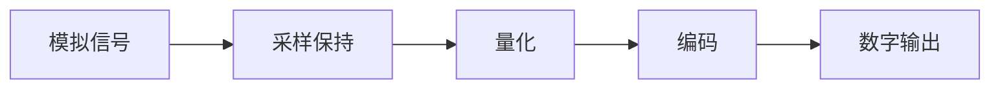
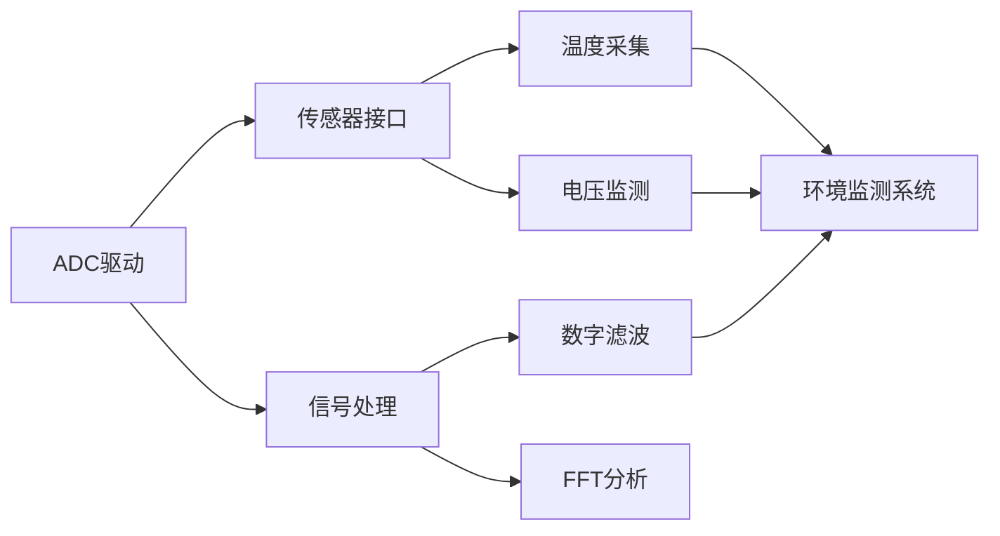

# ADC驱动开发：模拟信号采集

## 概述

ADC（Analog-to-Digital Converter，模数转换器）是嵌入式系统中连接模拟世界和数字世界的桥梁。通过ADC，微控制器可以采集温度、电压、电流、光照等模拟信号，并将其转换为数字值进行处理。掌握ADC驱动开发是实现传感器数据采集和信号处理的基础。

本教程将通过实战项目，带你深入理解ADC的工作原理和驱动开发方法，包括单通道采集、多通道扫描、DMA传输和数据处理等核心技术。

完成本教程后，你将能够：

- 理解ADC的工作原理和关键参数
- 掌握ADC的配置方法和采样模式
- 实现单通道和多通道ADC采集
- 使用DMA实现高效的数据传输
- 进行ADC数据的校准和滤波处理
- 设计可靠的ADC驱动程序

## 背景知识

### ADC的工作原理

ADC将连续的模拟信号转换为离散的数字信号，这个过程包括采样、量化和编码三个步骤。

**ADC转换过程**：



1. **采样（Sampling）**：
   - 在特定时刻对模拟信号进行采样
   - 采样频率决定了能够捕获的信号频率范围
   - 根据奈奎斯特定理，采样频率应至少是信号最高频率的2倍

2. **量化（Quantization）**：
   - 将采样值映射到最接近的离散电平
   - 量化精度由ADC位数决定（8位、10位、12位等）
   - 量化误差是ADC固有误差

3. **编码（Encoding）**：
   - 将量化后的值转换为二进制数字
   - 输出到数据寄存器供CPU读取

**ADC分辨率与精度**：

```
12位ADC：
- 分辨率：2^12 = 4096个离散值
- 参考电压3.3V时，最小分辨电压：3.3V / 4096 ≈ 0.8mV
- 输入电压1.65V时，数字输出：1.65 / 3.3 × 4096 = 2048

10位ADC：
- 分辨率：2^10 = 1024个离散值
- 参考电压3.3V时，最小分辨电压：3.3V / 1024 ≈ 3.2mV
```

### STM32 ADC特性

STM32F4系列的ADC具有以下特性：

**硬件特性**：
- 12位逐次逼近型ADC
- 转换速度：最高2.4 MSPS（每秒百万次采样）
- 多达3个ADC控制器（ADC1、ADC2、ADC3）
- 每个ADC最多19个通道（16个外部通道 + 3个内部通道）
- 支持单次、连续、扫描和间断模式
- 支持DMA传输
- 可编程采样时间
- 模拟看门狗功能

**ADC通道映射**：

| 通道 | ADC1 | ADC2 | ADC3 | 说明 |
|------|------|------|------|------|
| CH0 | PA0 | PA0 | PA0 | 外部通道 |
| CH1 | PA1 | PA1 | PA1 | 外部通道 |
| CH2 | PA2 | PA2 | PA2 | 外部通道 |
| CH3 | PA3 | PA3 | PA3 | 外部通道 |
| CH4 | PA4 | PA4 | PF6 | 外部通道 |
| CH5 | PA5 | PA5 | PF7 | 外部通道 |
| CH6 | PA6 | PA6 | PF8 | 外部通道 |
| CH7 | PA7 | PA7 | PF9 | 外部通道 |
| CH8 | PB0 | PB0 | PF10 | 外部通道 |
| CH9 | PB1 | PB1 | PF3 | 外部通道 |
| CH10 | PC0 | PC0 | PC0 | 外部通道 |
| CH11 | PC1 | PC1 | PC1 | 外部通道 |
| CH12 | PC2 | PC2 | PC2 | 外部通道 |
| CH13 | PC3 | PC3 | PC3 | 外部通道 |
| CH14 | PC4 | PC4 | PF4 | 外部通道 |
| CH15 | PC5 | PC5 | PF5 | 外部通道 |
| CH16 | - | - | - | 温度传感器 |
| CH17 | - | - | - | VREFINT |
| CH18 | - | - | - | VBAT |

**内部通道说明**：
- **CH16（温度传感器）**：测量芯片内部温度
- **CH17（VREFINT）**：内部参考电压（约1.2V）
- **CH18（VBAT）**：电池电压监测

### ADC采样模式

STM32 ADC支持多种采样模式：

**1. 单次转换模式（Single Conversion）**
- 触发一次转换后停止
- 适合偶尔采样的场景
- 功耗最低

**2. 连续转换模式（Continuous Conversion）**
- 转换完成后自动开始下一次转换
- 适合持续监测的场景
- 可配合DMA使用

**3. 扫描模式（Scan Mode）**
- 自动转换多个通道
- 转换结果存储在数据寄存器中
- 通常配合DMA使用

**4. 间断模式（Discontinuous Mode）**
- 将通道序列分组转换
- 每次触发转换一组通道
- 适合分时采样

### ADC关键参数

**1. 采样时间（Sampling Time）**

采样时间决定了ADC采样保持电路充电的时间，影响转换精度和速度。

```
总转换时间 = 采样时间 + 12.5个ADC时钟周期

例如：
ADC时钟 = 21MHz
采样时间 = 3个周期
总转换时间 = (3 + 12.5) / 21MHz ≈ 0.74μs
转换速率 = 1 / 0.74μs ≈ 1.35 MSPS
```

**采样时间选择原则**：
- 源阻抗越大，需要越长的采样时间
- 精度要求越高，需要越长的采样时间
- 速度要求越高，可以选择较短的采样时间

**2. ADC时钟频率**

ADC时钟由APB2时钟分频得到：

```
ADC时钟 = APB2时钟 / 分频系数
分频系数：2、4、6、8

例如：APB2 = 84MHz
分频系数 = 4
ADC时钟 = 84MHz / 4 = 21MHz（推荐）
```

**注意**：ADC时钟不应超过36MHz（STM32F4）

**3. 参考电压**

ADC的参考电压决定了测量范围：

- **VREF+**：正参考电压（通常连接到VDDA）
- **VREF-**：负参考电压（通常连接到VSSA/GND）
- **测量范围**：VREF- 到 VREF+

**数字输出计算**：

```
数字输出 = (输入电压 / VREF+) × (2^分辨率 - 1)

例如：12位ADC，VREF+ = 3.3V
输入电压 = 1.65V
数字输出 = (1.65 / 3.3) × 4095 = 2047.5 ≈ 2048

反向计算：
输入电压 = (数字输出 / 4095) × 3.3V
```

### ADC寄存器概览

STM32 ADC的主要寄存器：

| 寄存器 | 全称 | 功能 |
|--------|------|------|
| SR | Status Register | 状态寄存器 |
| CR1 | Control Register 1 | 控制寄存器1：分辨率、扫描模式 |
| CR2 | Control Register 2 | 控制寄存器2：使能、触发、连续模式 |
| SMPR1/2 | Sample Time Register | 采样时间配置 |
| SQR1/2/3 | Regular Sequence Register | 规则通道序列配置 |
| DR | Data Register | 数据寄存器 |
| CCR | Common Control Register | 公共控制寄存器：时钟、模式 |

## 环境准备

### 硬件要求

- STM32F4系列开发板（如STM32F407VET6）
- 可调电位器（10kΩ）
- 温度传感器（如LM35、DS18B20）
- 光敏电阻或光敏二极管
- 面包板和杜邦线
- 万用表（用于测量电压）

### 软件要求

- Keil MDK 5.x 或 STM32CubeIDE
- STM32F4 HAL库或标准外设库
- 串口调试工具（用于输出ADC值）

### 硬件连接

```
STM32F407VET6 ADC连接：

单通道采集（电位器）：
- 电位器一端 -> 3.3V
- 电位器另一端 -> GND
- 电位器中间 -> PA0（ADC1_IN0）

多通道采集：
- PA0（ADC1_IN0） -> 电位器
- PA1（ADC1_IN1） -> 光敏电阻分压
- PA2（ADC1_IN2） -> 温度传感器输出
- PA3（ADC1_IN3） -> 电压检测电路

注意：
1. 输入电压不能超过VDDA（通常3.3V）
2. 高阻抗信号源需要加缓冲电路
3. 模拟地（VSSA）和数字地（VSS）应良好连接
```

## 核心内容

### 步骤1：ADC时钟和GPIO配置

首先需要使能ADC时钟和配置GPIO引脚为模拟输入模式。

```c
#include "stm32f4xx.h"

/**
 * @brief  ADC1时钟和GPIO初始化
 * @param  无
 * @retval 无
 */
void ADC1_GPIO_Init(void) {
    // 1. 使能GPIOA和ADC1时钟
    RCC->AHB1ENR |= RCC_AHB1ENR_GPIOAEN;   // GPIOA时钟
    RCC->APB2ENR |= RCC_APB2ENR_ADC1EN;    // ADC1时钟（在APB2总线上）
    
    // 2. 配置PA0为模拟输入模式
    // MODER寄存器：11=模拟模式
    GPIOA->MODER |= (0x03 << (0 * 2));     // PA0模拟模式
    
    // 3. 模拟输入不需要配置上拉下拉
    GPIOA->PUPDR &= ~(0x03 << (0 * 2));    // 无上拉下拉
}
```

**代码说明**：

1. **时钟使能**：
   - ADC1在APB2总线上，需要使能APB2ENR
   - GPIO也需要使能对应的时钟

2. **GPIO配置**：
   - 模拟输入模式：MODER = 11
   - 不需要配置输出类型、速度
   - 不需要上拉下拉电阻

3. **多通道配置**：
   ```c
   // 配置PA0-PA3为模拟输入
   GPIOA->MODER |= (0x03 << 0) | (0x03 << 2) | 
                   (0x03 << 4) | (0x03 << 6);
   ```

### 步骤2：ADC基本配置

配置ADC的分辨率、采样时间和转换模式。

```c
/**
 * @brief  ADC1基本配置
 * @param  无
 * @retval 无
 */
void ADC1_Config(void) {
    // 1. 配置ADC公共寄存器
    // 设置ADC时钟分频：PCLK2 / 4 = 84MHz / 4 = 21MHz
    ADC->CCR &= ~ADC_CCR_ADCPRE;
    ADC->CCR |= ADC_CCR_ADCPRE_0;  // 分频系数 = 4
    
    // 2. 禁用ADC（配置前）
    ADC1->CR2 &= ~ADC_CR2_ADON;
    
    // 3. 配置分辨率：12位
    ADC1->CR1 &= ~ADC_CR1_RES;     // 00 = 12位分辨率
    
    // 4. 配置扫描模式：禁用（单通道）
    ADC1->CR1 &= ~ADC_CR1_SCAN;
    
    // 5. 配置连续转换模式：禁用（单次转换）
    ADC1->CR2 &= ~ADC_CR2_CONT;
    
    // 6. 配置数据对齐：右对齐
    ADC1->CR2 &= ~ADC_CR2_ALIGN;
    
    // 7. 配置外部触发：软件触发
    ADC1->CR2 &= ~ADC_CR2_EXTEN;   // 禁用外部触发
    
    // 8. 配置通道0的采样时间：15个周期
    // SMPR2寄存器控制通道0-9
    ADC1->SMPR2 &= ~ADC_SMPR2_SMP0;
    ADC1->SMPR2 |= (0x02 << 0);    // 010 = 15个周期
    
    // 9. 配置规则序列：1个转换，通道0
    ADC1->SQR1 &= ~ADC_SQR1_L;     // 序列长度 = 1
    ADC1->SQR3 &= ~ADC_SQR3_SQ1;
    ADC1->SQR3 |= (0 << 0);        // 第1个转换：通道0
    
    // 10. 使能ADC
    ADC1->CR2 |= ADC_CR2_ADON;
    
    // 11. 等待ADC稳定（建议延时）
    for (volatile int i = 0; i < 10000; i++);
}
```

**采样时间配置表**：

| 配置值 | 采样周期 | 总转换时间@21MHz | 转换速率 |
|--------|---------|-----------------|---------|
| 000 | 3 | 0.74μs | 1.35 MSPS |
| 001 | 15 | 1.31μs | 0.76 MSPS |
| 010 | 28 | 1.93μs | 0.52 MSPS |
| 011 | 56 | 3.26μs | 0.31 MSPS |
| 100 | 84 | 4.60μs | 0.22 MSPS |
| 101 | 112 | 5.93μs | 0.17 MSPS |
| 110 | 144 | 7.45μs | 0.13 MSPS |
| 111 | 480 | 23.45μs | 0.04 MSPS |

**配置要点**：

1. **ADC时钟分频**：
   - 通过CCR寄存器的ADCPRE位配置
   - 确保ADC时钟不超过36MHz

2. **分辨率选择**：
   - 12位：最高精度，转换时间最长
   - 10位：平衡精度和速度
   - 8位：速度最快，精度较低
   - 6位：特殊应用

3. **数据对齐**：
   - 右对齐：数据在低位，高位补0
   - 左对齐：数据在高位，低位补0

### 步骤3：单次转换模式

实现最基本的单次ADC转换。

```c
/**
 * @brief  读取ADC单次转换结果
 * @param  channel: ADC通道号（0-18）
 * @retval ADC转换结果（0-4095）
 */
uint16_t ADC1_ReadChannel(uint8_t channel) {
    // 1. 配置要转换的通道
    ADC1->SQR3 &= ~ADC_SQR3_SQ1;
    ADC1->SQR3 |= (channel << 0);
    
    // 2. 启动转换
    ADC1->CR2 |= ADC_CR2_SWSTART;
    
    // 3. 等待转换完成
    while (!(ADC1->SR & ADC_SR_EOC));
    
    // 4. 读取转换结果
    return ADC1->DR;
}

/**
 * @brief  将ADC值转换为电压（mV）
 * @param  adc_value: ADC转换结果
 * @retval 电压值（mV）
 */
uint32_t ADC_ToVoltage(uint16_t adc_value) {
    // VREF+ = 3300mV, 12位ADC
    return (uint32_t)adc_value * 3300 / 4095;
}

/**
 * @brief  读取电压值
 * @param  channel: ADC通道号
 * @retval 电压值（mV）
 */
uint32_t ADC1_ReadVoltage(uint8_t channel) {
    uint16_t adc_value = ADC1_ReadChannel(channel);
    return ADC_ToVoltage(adc_value);
}
```

**使用示例**：

```c
int main(void) {
    uint16_t adc_value;
    uint32_t voltage;
    
    // 系统初始化
    SystemInit();
    UART1_Init(115200);  // 用于输出结果
    
    // ADC初始化
    ADC1_GPIO_Init();
    ADC1_Config();
    
    printf("ADC Single Conversion Test\r\n");
    
    while (1) {
        // 读取通道0
        adc_value = ADC1_ReadChannel(0);
        voltage = ADC_ToVoltage(adc_value);
        
        printf("ADC Value: %d, Voltage: %d mV\r\n", 
               adc_value, voltage);
        
        // 延时1秒
        for (volatile int i = 0; i < 2100000; i++);
    }
}
```

### 步骤4：连续转换模式

使用连续转换模式可以持续采集数据，无需每次手动启动。

```c
/**
 * @brief  配置ADC连续转换模式
 * @param  channel: ADC通道号
 * @retval 无
 */
void ADC1_ContinuousMode_Init(uint8_t channel) {
    ADC1_GPIO_Init();
    
    // 基本配置
    ADC->CCR |= ADC_CCR_ADCPRE_0;  // 分频系数 = 4
    ADC1->CR2 &= ~ADC_CR2_ADON;
    
    ADC1->CR1 &= ~ADC_CR1_RES;     // 12位分辨率
    ADC1->CR1 &= ~ADC_CR1_SCAN;    // 禁用扫描模式
    
    // 使能连续转换模式
    ADC1->CR2 |= ADC_CR2_CONT;     // 连续转换
    
    ADC1->CR2 &= ~ADC_CR2_ALIGN;   // 右对齐
    ADC1->CR2 &= ~ADC_CR2_EXTEN;   // 软件触发
    
    // 配置采样时间
    ADC1->SMPR2 &= ~(0x07 << (channel * 3));
    ADC1->SMPR2 |= (0x02 << (channel * 3));  // 15个周期
    
    // 配置转换序列
    ADC1->SQR1 &= ~ADC_SQR1_L;     // 1个转换
    ADC1->SQR3 &= ~ADC_SQR3_SQ1;
    ADC1->SQR3 |= (channel << 0);
    
    // 使能ADC
    ADC1->CR2 |= ADC_CR2_ADON;
    for (volatile int i = 0; i < 10000; i++);
    
    // 启动第一次转换
    ADC1->CR2 |= ADC_CR2_SWSTART;
}

/**
 * @brief  读取连续转换结果
 * @param  无
 * @retval ADC转换结果
 */
uint16_t ADC1_ReadContinuous(void) {
    // 等待转换完成
    while (!(ADC1->SR & ADC_SR_EOC));
    
    // 读取结果（读取后自动开始下一次转换）
    return ADC1->DR;
}
```

**连续模式优势**：
- 无需每次手动启动转换
- 转换间隔最短，采样率最高
- 适合实时监测应用

### 步骤5：多通道扫描模式

扫描模式可以自动转换多个通道，配合DMA使用效率更高。

```c
#define ADC_CHANNEL_NUM 4

uint16_t adc_values[ADC_CHANNEL_NUM];

/**
 * @brief  配置ADC多通道扫描模式
 * @param  无
 * @retval 无
 */
void ADC1_ScanMode_Init(void) {
    // 1. GPIO初始化（PA0-PA3）
    RCC->AHB1ENR |= RCC_AHB1ENR_GPIOAEN;
    RCC->APB2ENR |= RCC_APB2ENR_ADC1EN;
    
    // 配置PA0-PA3为模拟输入
    GPIOA->MODER |= (0x03 << 0) | (0x03 << 2) | 
                    (0x03 << 4) | (0x03 << 6);
    
    // 2. ADC配置
    ADC->CCR |= ADC_CCR_ADCPRE_0;
    ADC1->CR2 &= ~ADC_CR2_ADON;
    
    ADC1->CR1 &= ~ADC_CR1_RES;     // 12位
    ADC1->CR1 |= ADC_CR1_SCAN;     // 使能扫描模式
    ADC1->CR2 |= ADC_CR2_CONT;     // 连续转换
    ADC1->CR2 &= ~ADC_CR2_ALIGN;   // 右对齐
    
    // 3. 配置采样时间（通道0-3）
    ADC1->SMPR2 = (0x02 << 0) | (0x02 << 3) | 
                  (0x02 << 6) | (0x02 << 9);
    
    // 4. 配置转换序列（4个通道）
    ADC1->SQR1 &= ~ADC_SQR1_L;
    ADC1->SQR1 |= (3 << 20);       // 序列长度 = 4
    
    ADC1->SQR3 = (0 << 0) |        // SQ1 = CH0
                 (1 << 5) |        // SQ2 = CH1
                 (2 << 10) |       // SQ3 = CH2
                 (3 << 15);        // SQ4 = CH3
    
    // 5. 使能ADC
    ADC1->CR2 |= ADC_CR2_ADON;
    for (volatile int i = 0; i < 10000; i++);
}

/**
 * @brief  读取多通道扫描结果（轮询方式）
 * @param  values: 存储结果的数组
 * @param  num: 通道数量
 * @retval 无
 */
void ADC1_ReadScan(uint16_t *values, uint8_t num) {
    // 启动转换
    ADC1->CR2 |= ADC_CR2_SWSTART;
    
    // 读取每个通道的结果
    for (uint8_t i = 0; i < num; i++) {
        // 等待转换完成
        while (!(ADC1->SR & ADC_SR_EOC));
        values[i] = ADC1->DR;
    }
}
```

### 步骤6：DMA传输配置

使用DMA可以实现ADC数据的自动传输，完全不占用CPU资源。

```c
/**
 * @brief  配置DMA2用于ADC1数据传输
 * @param  buffer: 数据缓冲区
 * @param  size: 缓冲区大小
 * @retval 无
 */
void ADC1_DMA_Config(uint16_t *buffer, uint16_t size) {
    // 1. 使能DMA2时钟（ADC1使用DMA2）
    RCC->AHB1ENR |= RCC_AHB1ENR_DMA2EN;
    
    // 2. 配置DMA2 Stream0 Channel0（ADC1）
    DMA2_Stream0->CR = 0;  // 先禁用
    while (DMA2_Stream0->CR & DMA_SxCR_EN);  // 等待禁用完成
    
    // 3. 配置DMA参数
    DMA2_Stream0->PAR = (uint32_t)&ADC1->DR;  // 外设地址
    DMA2_Stream0->M0AR = (uint32_t)buffer;    // 内存地址
    DMA2_Stream0->NDTR = size;                // 数据量
    
    DMA2_Stream0->CR = (0 << 25) |  // Channel 0
                       (1 << 16) |  // 优先级：中
                       (1 << 13) |  // 内存数据大小：半字（16位）
                       (1 << 11) |  // 外设数据大小：半字
                       (1 << 10) |  // 内存地址递增
                       (0 << 9) |   // 外设地址不递增
                       (1 << 8) |   // 循环模式
                       (0 << 6);    // 外设到内存
    
    // 4. 清除DMA标志
    DMA2->LIFCR = DMA_LIFCR_CTCIF0 | DMA_LIFCR_CHTIF0 | 
                  DMA_LIFCR_CTEIF0 | DMA_LIFCR_CDMEIF0 | 
                  DMA_LIFCR_CFEIF0;
    
    // 5. 使能DMA
    DMA2_Stream0->CR |= DMA_SxCR_EN;
}

/**
 * @brief  配置ADC1 + DMA多通道采集
 * @param  buffer: 数据缓冲区
 * @param  channels: 通道数量
 * @retval 无
 */
void ADC1_DMA_Init(uint16_t *buffer, uint8_t channels) {
    // 1. GPIO和ADC基本配置
    ADC1_ScanMode_Init();
    
    // 2. 使能DMA模式
    ADC1->CR2 |= ADC_CR2_DMA;      // 使能DMA请求
    ADC1->CR2 |= ADC_CR2_DDS;      // DMA连续请求
    
    // 3. 配置DMA
    ADC1_DMA_Config(buffer, channels);
    
    // 4. 启动ADC转换
    ADC1->CR2 |= ADC_CR2_SWSTART;
}

/**
 * @brief  使用示例
 */
int main(void) {
    uint16_t adc_buffer[4];
    
    SystemInit();
    UART1_Init(115200);
    
    // 初始化ADC + DMA
    ADC1_DMA_Init(adc_buffer, 4);
    
    printf("ADC DMA Multi-Channel Test\r\n");
    
    while (1) {
        // DMA自动更新adc_buffer，直接读取即可
        printf("CH0: %4d (%4d mV)  ", 
               adc_buffer[0], ADC_ToVoltage(adc_buffer[0]));
        printf("CH1: %4d (%4d mV)  ", 
               adc_buffer[1], ADC_ToVoltage(adc_buffer[1]));
        printf("CH2: %4d (%4d mV)  ", 
               adc_buffer[2], ADC_ToVoltage(adc_buffer[2]));
        printf("CH3: %4d (%4d mV)\r\n", 
               adc_buffer[3], ADC_ToVoltage(adc_buffer[3]));
        
        // 延时
        for (volatile int i = 0; i < 2100000; i++);
    }
}
```

**DMA优势**：
- 完全不占用CPU资源
- 数据自动传输到内存
- 支持循环模式，适合连续采集
- 可以配合定时器触发实现定时采样

## 实践示例

### 示例1：电位器电压测量

使用ADC测量电位器的电压值，并通过串口输出。

```c
/**
 * @brief  主函数 - 电位器电压测量
 */
int main(void) {
    uint16_t adc_value;
    uint32_t voltage;
    float percentage;
    
    SystemInit();
    UART1_Init(115200);
    ADC1_GPIO_Init();
    ADC1_Config();
    
    printf("\r\n=== Potentiometer Voltage Measurement ===\r\n");
    printf("Turn the potentiometer to see voltage changes\r\n\r\n");
    
    while (1) {
        // 读取ADC值
        adc_value = ADC1_ReadChannel(0);
        voltage = ADC_ToVoltage(adc_value);
        percentage = (float)adc_value / 4095.0f * 100.0f;
        
        // 输出结果
        printf("ADC: %4d  Voltage: %4d mV  Position: %5.1f%%\r\n", 
               adc_value, voltage, percentage);
        
        // 延时500ms
        for (volatile int i = 0; i < 1050000; i++);
    }
}
```

**运行效果**：
```
=== Potentiometer Voltage Measurement ===
Turn the potentiometer to see voltage changes

ADC: 0     Voltage: 0    mV  Position:   0.0%
ADC: 512   Voltage: 412  mV  Position:  12.5%
ADC: 2048  Voltage: 1650 mV  Position:  50.0%
ADC: 4095  Voltage: 3300 mV  Position: 100.0%
```

### 示例2：温度传感器读取

使用ADC读取芯片内部温度传感器。

```c
/**
 * @brief  读取芯片内部温度
 * @param  无
 * @retval 温度值（℃）
 */
float ADC_ReadTemperature(void) {
    uint16_t adc_value;
    float voltage;
    float temperature;
    
    // 使能温度传感器
    ADC->CCR |= ADC_CCR_TSVREFE;
    
    // 读取温度传感器通道（CH16）
    adc_value = ADC1_ReadChannel(16);
    
    // 转换为电压（mV）
    voltage = (float)adc_value * 3300.0f / 4095.0f;
    
    // 根据数据手册公式计算温度
    // Temp = (V25 - Vsense) / Avg_Slope + 25
    // V25 ≈ 760mV, Avg_Slope ≈ 2.5mV/℃
    temperature = (760.0f - voltage) / 2.5f + 25.0f;
    
    return temperature;
}

/**
 * @brief  主函数 - 温度监测
 */
int main(void) {
    float temperature;
    
    SystemInit();
    UART1_Init(115200);
    ADC1_GPIO_Init();
    ADC1_Config();
    
    printf("\r\n=== Internal Temperature Sensor ===\r\n\r\n");
    
    while (1) {
        temperature = ADC_ReadTemperature();
        printf("Temperature: %.1f °C\r\n", temperature);
        
        // 延时1秒
        for (volatile int i = 0; i < 2100000; i++);
    }
}
```

### 示例3：多通道数据采集

同时采集多个模拟信号，如电压、温度、光照等。

```c
/**
 * @brief  主函数 - 多通道数据采集
 */
int main(void) {
    uint16_t adc_buffer[4];
    
    SystemInit();
    UART1_Init(115200);
    
    // 初始化ADC + DMA
    ADC1_DMA_Init(adc_buffer, 4);
    
    printf("\r\n=== Multi-Channel Data Acquisition ===\r\n");
    printf("CH0: Potentiometer\r\n");
    printf("CH1: Light Sensor\r\n");
    printf("CH2: Temperature Sensor\r\n");
    printf("CH3: Voltage Monitor\r\n\r\n");
    
    while (1) {
        // 显示表头
        printf("┌─────────┬─────────┬─────────┬─────────┐\r\n");
        printf("│   CH0   │   CH1   │   CH2   │   CH3   │\r\n");
        printf("├─────────┼─────────┼─────────┼─────────┤\r\n");
        
        // 显示ADC原始值
        printf("│  %4d   │  %4d   │  %4d   │  %4d   │\r\n",
               adc_buffer[0], adc_buffer[1], 
               adc_buffer[2], adc_buffer[3]);
        
        // 显示电压值
        printf("│ %4dmV  │ %4dmV  │ %4dmV  │ %4dmV  │\r\n",
               ADC_ToVoltage(adc_buffer[0]),
               ADC_ToVoltage(adc_buffer[1]),
               ADC_ToVoltage(adc_buffer[2]),
               ADC_ToVoltage(adc_buffer[3]));
        
        printf("└─────────┴─────────┴─────────┴─────────┘\r\n\r\n");
        
        // 延时1秒
        for (volatile int i = 0; i < 2100000; i++);
    }
}
```

### 示例4：ADC数据滤波

使用滑动平均滤波提高ADC采样精度。

```c
#define FILTER_SIZE 10

/**
 * @brief  滑动平均滤波
 * @param  new_value: 新采样值
 * @retval 滤波后的值
 */
uint16_t ADC_MovingAverage(uint16_t new_value) {
    static uint16_t buffer[FILTER_SIZE] = {0};
    static uint8_t index = 0;
    static uint32_t sum = 0;
    
    // 减去最旧的值
    sum -= buffer[index];
    
    // 添加新值
    buffer[index] = new_value;
    sum += new_value;
    
    // 更新索引
    index = (index + 1) % FILTER_SIZE;
    
    // 返回平均值
    return sum / FILTER_SIZE;
}

/**
 * @brief  中位值滤波
 * @param  values: 采样值数组
 * @param  size: 数组大小
 * @retval 中位值
 */
uint16_t ADC_MedianFilter(uint16_t *values, uint8_t size) {
    uint16_t temp[size];
    
    // 复制数组
    for (uint8_t i = 0; i < size; i++) {
        temp[i] = values[i];
    }
    
    // 冒泡排序
    for (uint8_t i = 0; i < size - 1; i++) {
        for (uint8_t j = 0; j < size - i - 1; j++) {
            if (temp[j] > temp[j + 1]) {
                uint16_t swap = temp[j];
                temp[j] = temp[j + 1];
                temp[j + 1] = swap;
            }
        }
    }
    
    // 返回中位值
    return temp[size / 2];
}

/**
 * @brief  主函数 - 滤波示例
 */
int main(void) {
    uint16_t raw_value, filtered_value;
    
    SystemInit();
    UART1_Init(115200);
    ADC1_GPIO_Init();
    ADC1_ContinuousMode_Init(0);
    
    printf("\r\n=== ADC Filtering Example ===\r\n\r\n");
    
    while (1) {
        // 读取原始值
        raw_value = ADC1_ReadContinuous();
        
        // 滤波处理
        filtered_value = ADC_MovingAverage(raw_value);
        
        // 输出对比
        printf("Raw: %4d  Filtered: %4d  Diff: %4d\r\n",
               raw_value, filtered_value, 
               (int16_t)raw_value - (int16_t)filtered_value);
        
        // 延时100ms
        for (volatile int i = 0; i < 210000; i++);
    }
}
```

## 深入理解

### ADC校准

ADC在使用前应进行校准以提高精度。

```c
/**
 * @brief  ADC校准
 * @param  无
 * @retval 无
 */
void ADC1_Calibration(void) {
    // 1. 确保ADC已使能
    if (!(ADC1->CR2 & ADC_CR2_ADON)) {
        ADC1->CR2 |= ADC_CR2_ADON;
        for (volatile int i = 0; i < 10000; i++);
    }
    
    // 2. 复位校准
    ADC1->CR2 |= ADC_CR2_RSTCAL;
    while (ADC1->CR2 & ADC_CR2_RSTCAL);
    
    // 3. 启动校准
    ADC1->CR2 |= ADC_CR2_CAL;
    while (ADC1->CR2 & ADC_CR2_CAL);
    
    // 4. 校准完成
    printf("ADC Calibration Complete\r\n");
}
```

**注意**：STM32F4的ADC不需要手动校准，但STM32F1系列需要。

### ADC精度优化

提高ADC测量精度的方法：

**1. 硬件优化**：

```c
// 使用内部参考电压校准
float ADC_GetVREF(void) {
    uint16_t vrefint_data;
    
    // 读取内部参考电压（CH17）
    vrefint_data = ADC1_ReadChannel(17);
    
    // VREFINT典型值：1.21V
    // 实际VDDA = 1.21V × 4095 / vrefint_data
    return 1.21f * 4095.0f / (float)vrefint_data;
}

// 使用校准后的VREF计算电压
uint32_t ADC_ToVoltage_Calibrated(uint16_t adc_value) {
    float vref = ADC_GetVREF();
    return (uint32_t)(adc_value * vref * 1000.0f / 4095.0f);
}
```

**2. 软件优化**：

```c
// 多次采样取平均
uint16_t ADC_ReadAverage(uint8_t channel, uint8_t samples) {
    uint32_t sum = 0;
    
    for (uint8_t i = 0; i < samples; i++) {
        sum += ADC1_ReadChannel(channel);
    }
    
    return sum / samples;
}

// 去除最大最小值后取平均
uint16_t ADC_ReadTrimmedAverage(uint8_t channel, uint8_t samples) {
    uint16_t values[samples];
    uint32_t sum = 0;
    uint16_t max = 0, min = 4095;
    
    // 采样
    for (uint8_t i = 0; i < samples; i++) {
        values[i] = ADC1_ReadChannel(channel);
        sum += values[i];
        if (values[i] > max) max = values[i];
        if (values[i] < min) min = values[i];
    }
    
    // 去除最大最小值
    sum = sum - max - min;
    
    return sum / (samples - 2);
}
```

### 定时器触发ADC

使用定时器触发ADC可以实现精确的定时采样。

```c
/**
 * @brief  配置定时器触发ADC
 * @param  无
 * @retval 无
 */
void ADC1_TimerTrigger_Init(void) {
    // 1. 配置TIM2触发ADC（1kHz采样率）
    RCC->APB1ENR |= RCC_APB1ENR_TIM2EN;
    
    TIM2->PSC = 8399;              // 预分频：84MHz / 8400 = 10kHz
    TIM2->ARR = 9;                 // 自动重载：10kHz / 10 = 1kHz
    TIM2->CR2 |= (0x02 << 4);      // TRGO = Update event
    TIM2->CR1 |= TIM_CR1_CEN;      // 启动定时器
    
    // 2. 配置ADC外部触发
    ADC1_GPIO_Init();
    ADC->CCR |= ADC_CCR_ADCPRE_0;
    ADC1->CR2 &= ~ADC_CR2_ADON;
    
    ADC1->CR1 &= ~ADC_CR1_RES;
    ADC1->CR1 &= ~ADC_CR1_SCAN;
    ADC1->CR2 &= ~ADC_CR2_CONT;    // 禁用连续模式
    ADC1->CR2 &= ~ADC_CR2_ALIGN;
    
    // 配置外部触发源：TIM2 TRGO
    ADC1->CR2 &= ~ADC_CR2_EXTSEL;
    ADC1->CR2 |= (0x06 << 24);     // TIM2_TRGO
    ADC1->CR2 |= ADC_CR2_EXTEN_0;  // 上升沿触发
    
    // 配置通道
    ADC1->SMPR2 |= (0x02 << 0);
    ADC1->SQR1 &= ~ADC_SQR1_L;
    ADC1->SQR3 = (0 << 0);
    
    // 使能ADC
    ADC1->CR2 |= ADC_CR2_ADON;
    for (volatile int i = 0; i < 10000; i++);
}
```

**定时触发优势**：
- 精确的采样间隔
- 不占用CPU资源
- 适合信号分析和FFT处理
- 可配合DMA实现完全自动化采样

### ADC模拟看门狗

模拟看门狗可以监测ADC值是否超出设定范围。

```c
/**
 * @brief  配置ADC模拟看门狗
 * @param  low_threshold: 低阈值
 * @param  high_threshold: 高阈值
 * @retval 无
 */
void ADC1_Watchdog_Init(uint16_t low_threshold, uint16_t high_threshold) {
    // 配置阈值
    ADC1->LTR = low_threshold;
    ADC1->HTR = high_threshold;
    
    // 使能模拟看门狗（监测所有通道）
    ADC1->CR1 |= ADC_CR1_AWDEN;    // 规则通道看门狗
    ADC1->CR1 &= ~ADC_CR1_AWDSGL;  // 监测所有通道
    
    // 使能看门狗中断
    ADC1->CR1 |= ADC_CR1_AWDIE;
    NVIC_EnableIRQ(ADC_IRQn);
}

/**
 * @brief  ADC中断服务函数
 * @param  无
 * @retval 无
 */
void ADC_IRQHandler(void) {
    if (ADC1->SR & ADC_SR_AWD) {
        // 清除看门狗标志
        ADC1->SR &= ~ADC_SR_AWD;
        
        // 处理超限事件
        printf("ADC Watchdog Alert!\r\n");
    }
}
```

## 常见问题

### Q1: ADC读取值不稳定，跳动很大？

**可能原因**：
1. 电源噪声干扰
2. 输入信号源阻抗过高
3. 采样时间过短
4. 参考电压不稳定
5. PCB布线不当

**解决方案**：

```c
// 1. 增加采样时间
ADC1->SMPR2 |= (0x07 << 0);  // 480个周期

// 2. 多次采样取平均
uint16_t value = ADC_ReadAverage(0, 10);

// 3. 使用滤波算法
uint16_t filtered = ADC_MovingAverage(raw_value);

// 4. 硬件上添加滤波电容（0.1μF + 10μF）
// 5. 使用低阻抗信号源或添加运放缓冲
```

### Q2: ADC转换速度太慢？

**可能原因**：
1. 采样时间设置过长
2. ADC时钟频率过低
3. 使用轮询方式等待转换完成

**优化方案**：

```c
// 1. 减少采样时间（在精度允许的情况下）
ADC1->SMPR2 &= ~(0x07 << 0);
ADC1->SMPR2 |= (0x00 << 0);  // 3个周期

// 2. 提高ADC时钟频率
ADC->CCR &= ~ADC_CCR_ADCPRE;
ADC->CCR |= (0x00 << 16);    // 分频系数 = 2

// 3. 使用DMA + 连续模式
ADC1_DMA_Init(buffer, channels);

// 4. 使用中断方式
ADC1->CR1 |= ADC_CR1_EOCIE;  // 使能转换完成中断
```

### Q3: 多通道采集时数据混乱？

**可能原因**：
1. 扫描模式配置错误
2. DMA配置不正确
3. 通道序列设置错误
4. 数据对齐方式不匹配

**排查步骤**：

```c
// 1. 检查扫描模式是否使能
if (!(ADC1->CR1 & ADC_CR1_SCAN)) {
    ADC1->CR1 |= ADC_CR1_SCAN;
}

// 2. 检查序列长度配置
uint8_t length = ((ADC1->SQR1 >> 20) & 0x0F) + 1;
printf("Sequence Length: %d\r\n", length);

// 3. 检查DMA配置
printf("DMA NDTR: %d\r\n", DMA2_Stream0->NDTR);

// 4. 使用调试输出验证每个通道
for (uint8_t i = 0; i < 4; i++) {
    printf("CH%d: %d\r\n", i, adc_buffer[i]);
}
```

### Q4: ADC测量值与实际电压不符？

**可能原因**：
1. 参考电压不准确
2. 输入电压超出范围
3. 计算公式错误
4. ADC未校准

**解决方案**：

```c
// 1. 使用内部参考电压校准
float vref = ADC_GetVREF();
printf("VREF: %.3f V\r\n", vref);

// 2. 检查输入电压范围
if (adc_value >= 4090) {
    printf("Warning: Input voltage may exceed VREF+\r\n");
}

// 3. 使用正确的计算公式
uint32_t voltage = (uint32_t)adc_value * 3300 / 4095;

// 4. 使用万用表验证
printf("Measured: %d mV (Please verify with multimeter)\r\n", voltage);
```

### Q5: DMA传输的数据不更新？

**可能原因**：
1. DMA未正确配置
2. ADC的DMA请求未使能
3. DMA循环模式未使能
4. ADC未启动转换

**排查步骤**：

```c
// 1. 检查DMA是否使能
if (!(DMA2_Stream0->CR & DMA_SxCR_EN)) {
    printf("DMA not enabled!\r\n");
}

// 2. 检查ADC DMA请求
if (!(ADC1->CR2 & ADC_CR2_DMA)) {
    printf("ADC DMA request not enabled!\r\n");
}

// 3. 检查循环模式
if (!(DMA2_Stream0->CR & DMA_SxCR_CIRC)) {
    printf("DMA circular mode not enabled!\r\n");
}

// 4. 检查ADC是否在转换
if (!(ADC1->SR & ADC_SR_STRT)) {
    printf("ADC conversion not started!\r\n");
    ADC1->CR2 |= ADC_CR2_SWSTART;
}
```

## 总结

本教程全面介绍了ADC驱动开发的核心知识和实践技能。让我们回顾一下要点：

**核心知识点**：
- ADC的工作原理：采样、量化、编码三个步骤
- ADC关键参数：分辨率、采样时间、参考电压、转换速度
- 采样模式：单次、连续、扫描、间断模式
- DMA传输：实现高效的数据采集，不占用CPU资源
- 数据处理：滤波、校准、精度优化

**实践技能**：
- 单通道ADC采集：电位器电压测量
- 多通道扫描采集：同时采集多个信号
- DMA自动传输：高效的数据采集方案
- 数据滤波处理：提高测量精度和稳定性
- 定时器触发：实现精确的定时采样

**最佳实践**：
- 合理选择采样时间，平衡速度和精度
- 使用DMA + 连续模式实现高效采集
- 对ADC数据进行滤波处理
- 使用内部参考电压进行校准
- 注意硬件电路设计，减少干扰

**调试技巧**：
- 使用万用表验证测量结果
- 通过串口输出调试信息
- 检查寄存器配置是否正确
- 使用示波器观察模拟信号
- 逐步验证每个功能模块

ADC是嵌入式系统与模拟世界交互的重要接口，掌握ADC驱动开发将为你的项目开发提供强大的数据采集能力。

## 延伸阅读

推荐进一步学习的内容：

**同模块内容**：
- [GPIO驱动开发：LED控制实战](01-gpio-driver.html) - GPIO基础
- [UART串口驱动开发与调试](02-uart-driver.html) - 数据输出
- [定时器驱动基础与应用](05-timer-driver.html) - 定时触发ADC
- [DMA驱动开发：高效数据传输](../intermediate/01-dma-driver.html) - DMA深入

**相关主题**：
- [中断系统基础概念](../../04-interrupt-exception-handling/beginner/01-interrupt-basics.html) - 中断处理
- [时钟系统架构与配置](../../05-clock-timer-management/beginner/01-clock-system.html) - ADC时钟配置

**官方文档**：
- [STM32F4xx参考手册](https://www.st.com/resource/en/reference_manual/dm00031020.pdf) - ADC章节
- [STM32F4xx数据手册](https://www.st.com/resource/en/datasheet/stm32f407vg.pdf) - ADC电气特性
- [AN3116: STM32 ADC模式和应用](https://www.st.com/resource/en/application_note/cd00258017.pdf)

**开源项目**：
- [STM32 HAL库](https://github.com/STMicroelectronics/STM32CubeF4) - 官方HAL库ADC驱动
- [libopencm3](https://github.com/libopencm3/libopencm3) - 开源STM32库

## 参考资料

1. STM32F4xx参考手册 - STMicroelectronics
2. ARM Cortex-M4权威指南 - Joseph Yiu
3. 嵌入式系统设计与实践 - Elecia White
4. STM32库开发实战指南 - 野火团队
5. 深入浅出STM32 - 刘军

## 练习题

### 基础练习

1. **单通道采集练习**：
   - 使用电位器实现电压测量
   - 通过串口输出ADC值和电压值
   - 添加百分比显示（0-100%）

2. **多通道采集练习**：
   - 同时采集4个通道的数据
   - 使用DMA自动传输
   - 通过串口输出所有通道的值

3. **数据滤波练习**：
   - 实现滑动平均滤波
   - 实现中位值滤波
   - 对比滤波前后的效果

### 进阶练习

4. **温度监测系统**：
   - 读取芯片内部温度传感器
   - 实现温度报警功能（超过阈值）
   - 记录最高和最低温度

5. **电压监测系统**：
   - 监测电池电压
   - 实现低电压报警
   - 显示电量百分比

6. **数据采集系统**：
   - 使用定时器触发ADC
   - 以固定频率采集数据（如1kHz）
   - 将数据存储到缓冲区
   - 通过串口上传到PC

### 综合练习

7. **多功能数据采集器**：
   - 采集温度、电压、光照等多个参数
   - 实现数据滤波和校准
   - 通过LCD显示实时数据
   - 支持数据记录和导出

8. **信号分析仪**：
   - 高速采集模拟信号
   - 实现FFT频谱分析
   - 显示波形和频谱
   - 测量信号频率和幅值

### 思考题

1. 为什么ADC的采样时间不能设置得太短？会有什么影响？

2. 在什么情况下应该使用DMA传输ADC数据？有什么优势？

3. 如何选择合适的滤波算法？不同滤波算法的优缺点是什么？

4. ADC的分辨率越高越好吗？在实际应用中如何权衡？

5. 如何设计一个高精度的ADC采集系统？需要考虑哪些因素？

## 实验任务

### 任务1：电压表（必做）

**要求**：
- 使用ADC测量0-3.3V的电压
- 通过串口输出电压值
- 精度要求：±10mV
- 更新频率：10Hz

**提示**：
```c
// 使用多次采样提高精度
uint16_t value = ADC_ReadAverage(0, 10);
uint32_t voltage = ADC_ToVoltage(value);
printf("Voltage: %d.%03d V\r\n", voltage / 1000, voltage % 1000);
```

### 任务2：温度监测（必做）

**要求**：
- 读取芯片内部温度传感器
- 显示当前温度（℃）
- 记录最高和最低温度
- 温度超过50℃时报警

### 任务3：多通道数据采集（选做）

**要求**：
- 同时采集4个通道的数据
- 使用DMA自动传输
- 实现数据滤波
- 通过串口输出格式化数据

### 任务4：信号采集系统（选做）

**要求**：
- 使用定时器触发ADC（1kHz采样率）
- 采集1秒的数据（1000个点）
- 计算信号的平均值、最大值、最小值
- 通过串口上传数据到PC

**评分标准**：
- 代码规范性（20分）
- 功能完整性（30分）
- 测量精度（30分）
- 创新性和扩展性（20分）

---

**下一步学习建议**：

完成本教程后，建议按以下顺序继续学习：

1. [PWM驱动开发：电机调速控制](07-pwm-driver.html) - 学习PWM输出控制
2. [DMA驱动开发：高效数据传输](../intermediate/01-dma-driver.html) - 深入学习DMA
3. [定时器驱动基础与应用](05-timer-driver.html) - 定时器触发ADC

**学习路线图**：



祝你学习顺利！如有问题，欢迎在社区讨论。

---

**文档信息**：
- 最后更新：2024-01-15
- 版本：v1.0
- 作者：嵌入式知识平台
- 许可：CC BY-NC-SA 4.0
