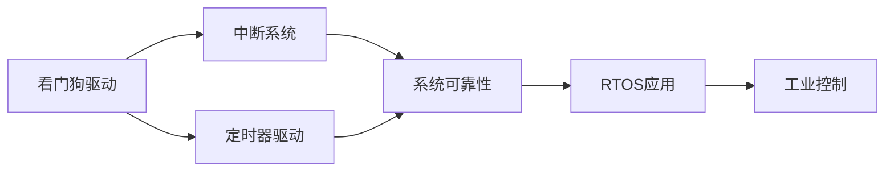

# 看门狗驱动与系统可靠性

## 概述


看门狗（Watchdog）是嵌入式系统中一个重要的安全机制，用于检测和恢复系统故障。当系统因软件错误、硬件故障或外部干扰而陷入死循环或停止响应时，看门狗能够自动复位系统，使其恢复正常运行。这对于无人值守的嵌入式系统尤为重要。

本文将系统介绍看门狗的工作原理、类型、配置方法和应用策略，帮助你设计更可靠的嵌入式系统。

完成本文学习后，你将能够：

- 理解看门狗的工作原理和作用
- 掌握独立看门狗（IWDG）和窗口看门狗（WWDG）的区别
- 配置和使用看门狗定时器
- 设计合理的喂狗策略
- 实现系统故障检测和自动恢复
- 提高系统的可靠性和稳定性

## 背景知识

### 看门狗的作用

看门狗是一个硬件定时器，其核心功能是监控系统运行状态。如果系统在规定时间内没有"喂狗"（重置看门狗计数器），看门狗就会触发系统复位。

**主要作用**：

1. **故障检测**：检测系统是否陷入死循环或停止响应
2. **自动恢复**：在检测到故障后自动复位系统
3. **提高可靠性**：减少人工干预，提高系统可用性
4. **安全保障**：防止系统长时间处于异常状态

**典型应用场景**：

- 工业控制系统（无人值守）
- 汽车电子系统（安全关键）
- 医疗设备（高可靠性要求）
- 物联网设备（远程部署）
- 航空航天系统（极端环境）

### 看门狗的工作原理

看门狗的工作原理类似于一个倒计时定时器：

```
初始化 → 启动计数 → 定期喂狗 → 继续计数
                ↓
            超时未喂狗
                ↓
            触发系统复位
```

**关键概念**：

1. **超时时间**：看门狗计数器从初始值减到0所需的时间
2. **喂狗操作**：重新加载看门狗计数器，防止超时
3. **复位触发**：计数器减到0时，触发系统复位
4. **喂狗窗口**：某些看门狗要求在特定时间窗口内喂狗


### 看门狗的类型

STM32微控制器通常提供两种类型的看门狗：

**1. 独立看门狗（IWDG - Independent Watchdog）**

- **时钟源**：独立的低速内部时钟（LSI，约32kHz）
- **特点**：完全独立于主系统时钟，即使主时钟失效也能工作
- **超时范围**：几毫秒到几秒
- **应用**：检测系统级故障，如时钟失效、程序跑飞
- **优势**：可靠性高，不受主系统影响

**2. 窗口看门狗（WWDG - Window Watchdog）**

- **时钟源**：APB1时钟
- **特点**：具有时间窗口限制，喂狗必须在窗口期内
- **超时范围**：几十微秒到几十毫秒
- **应用**：检测程序执行时序异常
- **优势**：能检测程序执行过快或过慢

**对比表**：

| 特性 | 独立看门狗（IWDG） | 窗口看门狗（WWDG） |
|------|-------------------|-------------------|
| 时钟源 | LSI（32kHz） | APB1时钟 |
| 独立性 | 完全独立 | 依赖系统时钟 |
| 超时范围 | 0.125ms - 32s | 几十μs - 几十ms |
| 窗口功能 | 无 | 有 |
| 中断功能 | 无 | 有（提前中断） |
| 停止模式 | 继续运行 | 停止运行 |
| 调试模式 | 可配置 | 可配置 |
| 应用场景 | 系统级故障检测 | 程序时序检测 |

### 看门狗的时钟计算

理解看门狗的时钟计算对于正确配置超时时间至关重要。

**独立看门狗（IWDG）时钟计算**：

```
LSI频率：约32kHz（实际可能在30-40kHz之间）

预分频器：4, 8, 16, 32, 64, 128, 256

计数器频率 = LSI频率 / 预分频器

超时时间 = 重载值 / 计数器频率

示例：
LSI = 32kHz
预分频器 = 64
重载值 = 4095（最大值）

计数器频率 = 32000 / 64 = 500Hz
超时时间 = 4095 / 500 = 8.19秒
```

**窗口看门狗（WWDG）时钟计算**：

```
WWDG时钟 = APB1时钟 / 4096

预分频器：1, 2, 4, 8

计数器频率 = WWDG时钟 / 预分频器

超时时间 = (计数器值 - 窗口值) / 计数器频率

示例：
APB1 = 42MHz
预分频器 = 8
计数器值 = 127（最大值）
窗口值 = 80

WWDG时钟 = 42000000 / 4096 = 10254Hz
计数器频率 = 10254 / 8 = 1281.75Hz
超时时间 = (127 - 80) / 1281.75 = 36.7ms
```


## 核心内容

### 1. 独立看门狗（IWDG）配置

独立看门狗是最常用的看门狗类型，配置简单，可靠性高。

**主要寄存器**：

| 寄存器 | 全称 | 功能 |
|--------|------|------|
| KR | Key Register | 控制寄存器（写入特定值执行操作） |
| PR | Prescaler Register | 预分频器寄存器 |
| RLR | Reload Register | 重载值寄存器 |
| SR | Status Register | 状态寄存器 |

**配置步骤**：

1. 使能写保护解除（写入0x5555到KR）
2. 配置预分频器（PR）
3. 配置重载值（RLR）
4. 等待寄存器更新完成
5. 启动看门狗（写入0xCCCC到KR）
6. 定期喂狗（写入0xAAAA到KR）

**代码示例**：

```c
#include "stm32f4xx.h"

/**
 * @brief  初始化独立看门狗
 * @param  timeout_ms: 超时时间（毫秒）
 * @retval 无
 */
void IWDG_Init(uint32_t timeout_ms) {
    // 1. 使能写保护解除
    IWDG->KR = 0x5555;
    
    // 2. 配置预分频器
    // PR = 6 表示预分频器为256
    // LSI频率约32kHz，计数器频率 = 32000/256 = 125Hz
    IWDG->PR = 6;  // 预分频器256
    
    // 3. 计算并配置重载值
    // 超时时间(ms) = RLR / (LSI / 预分频器) * 1000
    // RLR = 超时时间(ms) * (LSI / 预分频器) / 1000
    uint32_t reload = (timeout_ms * 125) / 1000;
    
    // 限制重载值范围（0-4095）
    if (reload > 4095) reload = 4095;
    if (reload < 1) reload = 1;
    
    IWDG->RLR = reload;
    
    // 4. 等待寄存器更新完成
    while (IWDG->SR != 0);
    
    // 5. 启动看门狗
    IWDG->KR = 0xCCCC;
}

/**
 * @brief  喂狗（重载看门狗计数器）
 * @param  无
 * @retval 无
 */
void IWDG_Feed(void) {
    IWDG->KR = 0xAAAA;
}

/**
 * @brief  主函数示例
 */
int main(void) {
    // 系统初始化
    SystemInit();
    
    // 初始化看门狗，超时时间1000ms
    IWDG_Init(1000);
    
    // 主循环
    while (1) {
        // 执行任务
        DoTask();
        
        // 定期喂狗（必须在1000ms内）
        IWDG_Feed();
        
        // 延时
        HAL_Delay(500);
    }
}
```

**配置说明**：

1. **预分频器选择**：
   - PR = 0: 预分频器4（超时范围：0.125ms - 512ms）
   - PR = 1: 预分频器8（超时范围：0.25ms - 1024ms）
   - PR = 2: 预分频器16（超时范围：0.5ms - 2048ms）
   - PR = 3: 预分频器32（超时范围：1ms - 4096ms）
   - PR = 4: 预分频器64（超时范围：2ms - 8192ms）
   - PR = 5: 预分频器128（超时范围：4ms - 16384ms）
   - PR = 6: 预分频器256（超时范围：8ms - 32768ms）

2. **重载值计算**：
   - 根据所需超时时间和预分频器计算
   - 重载值范围：0-4095
   - 超时时间 = RLR × 预分频器 / LSI频率

3. **写保护机制**：
   - PR和RLR寄存器有写保护
   - 必须先写入0x5555解除保护
   - 修改完成后自动恢复保护


### 2. 窗口看门狗（WWDG）配置

窗口看门狗提供更精确的时序监控，能检测程序执行过快或过慢的情况。

**主要寄存器**：

| 寄存器 | 全称 | 功能 |
|--------|------|------|
| CR | Control Register | 控制寄存器（计数器值和使能位） |
| CFR | Configuration Register | 配置寄存器（窗口值和预分频器） |
| SR | Status Register | 状态寄存器（中断标志） |

**配置步骤**：

1. 使能WWDG时钟
2. 配置预分频器
3. 配置窗口值
4. 配置计数器初始值
5. 使能提前唤醒中断（可选）
6. 启动看门狗
7. 在窗口期内喂狗

**代码示例**：

```c
/**
 * @brief  初始化窗口看门狗
 * @param  无
 * @retval 无
 */
void WWDG_Init(void) {
    // 1. 使能WWDG时钟
    RCC->APB1ENR |= RCC_APB1ENR_WWDGEN;
    
    // 2. 配置预分频器和窗口值
    // WDGTB = 3: 预分频器8
    // W[6:0] = 80: 窗口值
    WWDG->CFR = (3 << 7) | 80;
    
    // 3. 使能提前唤醒中断
    WWDG->CFR |= WWDG_CFR_EWI;
    
    // 4. 配置NVIC中断
    NVIC_SetPriority(WWDG_IRQn, 2);
    NVIC_EnableIRQ(WWDG_IRQn);
    
    // 5. 设置计数器初始值并启动
    // T[6:0] = 127: 计数器初始值
    // WDGA = 1: 启动看门狗
    WWDG->CR = (1 << 7) | 127;
}

/**
 * @brief  喂狗（重载窗口看门狗计数器）
 * @param  无
 * @retval 无
 * @note   必须在窗口期内调用
 */
void WWDG_Feed(void) {
    // 重载计数器值（必须大于窗口值）
    WWDG->CR = (1 << 7) | 127;
}

/**
 * @brief  WWDG中断服务函数
 * @param  无
 * @retval 无
 */
void WWDG_IRQHandler(void) {
    // 检查提前唤醒中断标志
    if (WWDG->SR & WWDG_SR_EWIF) {
        // 清除中断标志
        WWDG->SR &= ~WWDG_SR_EWIF;
        
        // 在中断中喂狗
        WWDG_Feed();
        
        // 可以在这里执行其他操作
        // 例如：记录日志、LED指示等
    }
}

/**
 * @brief  主函数示例
 */
int main(void) {
    SystemInit();
    
    // 初始化窗口看门狗
    WWDG_Init();
    
    while (1) {
        // 执行任务
        DoTask();
        
        // 注意：喂狗操作在中断中完成
        // 主循环只需要正常执行任务
        
        HAL_Delay(10);
    }
}
```

**窗口看门狗特点**：

1. **时间窗口**：
   - 喂狗必须在计数器值小于窗口值时进行
   - 过早喂狗（计数器 > 窗口值）会触发复位
   - 过晚喂狗（计数器 < 0x40）会触发复位

2. **提前唤醒中断**：
   - 计数器减到0x40时触发中断
   - 可以在中断中喂狗
   - 提供额外的安全保障

3. **时序监控**：
   - 能检测程序执行过快（过早喂狗）
   - 能检测程序执行过慢（超时）
   - 适合对时序要求严格的应用


### 3. 喂狗策略设计

合理的喂狗策略是保证系统可靠性的关键。

**策略1：主循环喂狗**

最简单的策略，在主循环中定期喂狗。

```c
int main(void) {
    SystemInit();
    IWDG_Init(1000);  // 1秒超时
    
    while (1) {
        // 任务1
        Task1();
        
        // 任务2
        Task2();
        
        // 任务3
        Task3();
        
        // 喂狗
        IWDG_Feed();
        
        // 延时
        HAL_Delay(500);
    }
}
```

**优点**：
- 实现简单
- 适合简单的单任务系统

**缺点**：
- 如果某个任务卡死，无法喂狗
- 无法检测任务执行异常

**策略2：定时器喂狗**

使用定时器中断定期喂狗。

```c
volatile uint8_t g_task_flags = 0;

// 定时器中断（每100ms）
void TIM6_IRQHandler(void) {
    if (TIM6->SR & TIM_SR_UIF) {
        TIM6->SR &= ~TIM_SR_UIF;
        
        // 检查所有任务是否正常执行
        if (g_task_flags == 0x07) {  // 所有任务都执行了
            IWDG_Feed();
            g_task_flags = 0;  // 清除标志
        }
        // 如果有任务未执行，不喂狗，触发复位
    }
}

int main(void) {
    SystemInit();
    IWDG_Init(1000);
    TIM6_Init();  // 初始化定时器
    
    while (1) {
        // 任务1
        Task1();
        g_task_flags |= 0x01;
        
        // 任务2
        Task2();
        g_task_flags |= 0x02;
        
        // 任务3
        Task3();
        g_task_flags |= 0x04;
        
        HAL_Delay(50);
    }
}
```

**优点**：
- 能检测任务是否正常执行
- 更可靠的故障检测

**缺点**：
- 实现稍复杂
- 需要额外的定时器资源

**策略3：RTOS任务喂狗**

在RTOS环境中，使用专门的看门狗任务。

```c
// 看门狗任务
void WatchdogTask(void *pvParameters) {
    uint32_t task_status = 0;
    
    while (1) {
        // 等待所有任务的信号
        task_status = 0;
        
        // 检查任务1状态
        if (xSemaphoreTake(Task1Semaphore, 100) == pdTRUE) {
            task_status |= 0x01;
        }
        
        // 检查任务2状态
        if (xSemaphoreTake(Task2Semaphore, 100) == pdTRUE) {
            task_status |= 0x02;
        }
        
        // 检查任务3状态
        if (xSemaphoreTake(Task3Semaphore, 100) == pdTRUE) {
            task_status |= 0x04;
        }
        
        // 所有任务正常才喂狗
        if (task_status == 0x07) {
            IWDG_Feed();
        }
        
        vTaskDelay(500);  // 延时500ms
    }
}

// 其他任务在执行完成后发送信号
void Task1(void *pvParameters) {
    while (1) {
        // 执行任务
        DoWork();
        
        // 发送信号表示任务正常
        xSemaphoreGive(Task1Semaphore);
        
        vTaskDelay(100);
    }
}
```

**优点**：
- 适合多任务系统
- 能监控所有任务状态
- 灵活性高

**缺点**：
- 需要RTOS支持
- 实现较复杂


### 4. 复位原因检测

系统复位后，需要判断是否由看门狗触发，以便采取相应措施。

**复位标志寄存器**：

STM32的RCC_CSR寄存器记录了复位原因。

```c
/**
 * @brief  检测复位原因
 * @param  无
 * @retval 复位原因
 */
typedef enum {
    RESET_CAUSE_UNKNOWN = 0,
    RESET_CAUSE_LOW_POWER,
    RESET_CAUSE_WINDOW_WATCHDOG,
    RESET_CAUSE_INDEPENDENT_WATCHDOG,
    RESET_CAUSE_SOFTWARE,
    RESET_CAUSE_POR_PDR,
    RESET_CAUSE_PIN,
    RESET_CAUSE_BOR
} ResetCause_t;

ResetCause_t GetResetCause(void) {
    ResetCause_t cause = RESET_CAUSE_UNKNOWN;
    
    // 读取复位标志
    uint32_t csr = RCC->CSR;
    
    if (csr & RCC_CSR_LPWRRSTF) {
        cause = RESET_CAUSE_LOW_POWER;
    }
    else if (csr & RCC_CSR_WWDGRSTF) {
        cause = RESET_CAUSE_WINDOW_WATCHDOG;
    }
    else if (csr & RCC_CSR_IWDGRSTF) {
        cause = RESET_CAUSE_INDEPENDENT_WATCHDOG;
    }
    else if (csr & RCC_CSR_SFTRSTF) {
        cause = RESET_CAUSE_SOFTWARE;
    }
    else if (csr & RCC_CSR_PORRSTF) {
        cause = RESET_CAUSE_POR_PDR;
    }
    else if (csr & RCC_CSR_PINRSTF) {
        cause = RESET_CAUSE_PIN;
    }
    else if (csr & RCC_CSR_BORRSTF) {
        cause = RESET_CAUSE_BOR;
    }
    
    // 清除复位标志
    RCC->CSR |= RCC_CSR_RMVF;
    
    return cause;
}

/**
 * @brief  处理复位原因
 * @param  无
 * @retval 无
 */
void HandleResetCause(void) {
    ResetCause_t cause = GetResetCause();
    
    switch (cause) {
        case RESET_CAUSE_INDEPENDENT_WATCHDOG:
            // 独立看门狗复位
            printf("System reset by IWDG\r\n");
            // 记录日志、发送告警等
            LogError("IWDG Reset");
            break;
            
        case RESET_CAUSE_WINDOW_WATCHDOG:
            // 窗口看门狗复位
            printf("System reset by WWDG\r\n");
            LogError("WWDG Reset");
            break;
            
        case RESET_CAUSE_SOFTWARE:
            // 软件复位
            printf("System reset by software\r\n");
            break;
            
        case RESET_CAUSE_PIN:
            // 引脚复位（按键复位）
            printf("System reset by pin\r\n");
            break;
            
        case RESET_CAUSE_POR_PDR:
            // 上电复位
            printf("System power on reset\r\n");
            break;
            
        default:
            printf("Unknown reset cause\r\n");
            break;
    }
}

/**
 * @brief  主函数
 */
int main(void) {
    SystemInit();
    UART_Init();  // 初始化串口用于调试
    
    // 检测并处理复位原因
    HandleResetCause();
    
    // 初始化看门狗
    IWDG_Init(1000);
    
    while (1) {
        // 正常任务
        DoTask();
        IWDG_Feed();
        HAL_Delay(500);
    }
}
```

**复位原因应用**：

1. **故障统计**：
   - 记录看门狗复位次数
   - 分析系统稳定性
   - 发现潜在问题

2. **故障恢复**：
   - 根据复位原因采取不同措施
   - 看门狗复位后进入安全模式
   - 记录故障日志

3. **调试辅助**：
   - 开发阶段识别问题
   - 通过串口输出复位原因
   - 帮助定位故障点


## 设计考虑

### 1. 超时时间选择

选择合适的看门狗超时时间是关键。

**选择原则**：

1. **任务周期分析**：
   - 分析最长任务执行时间
   - 考虑最坏情况（中断、延时等）
   - 留有足够的安全余量

2. **超时时间计算**：
   ```
   超时时间 = 最长任务时间 × 安全系数
   
   安全系数建议：
   - 简单系统：1.5 - 2.0
   - 复杂系统：2.0 - 3.0
   - 实时系统：1.2 - 1.5
   ```

3. **实际示例**：
   ```
   假设系统任务：
   - 任务1：50ms
   - 任务2：100ms
   - 任务3：150ms
   - 总计：300ms
   
   超时时间 = 300ms × 2 = 600ms
   实际配置：1000ms（留有更多余量）
   ```

**常见超时时间**：

| 应用场景 | 推荐超时时间 | 说明 |
|---------|-------------|------|
| 快速响应系统 | 100-500ms | 实时控制、快速反馈 |
| 一般应用 | 500-2000ms | 数据采集、通信 |
| 慢速系统 | 2-10秒 | 复杂计算、大数据处理 |
| 超长任务 | 10-30秒 | 文件操作、网络传输 |

### 2. 调试模式配置

开发阶段，看门狗可能影响调试，需要合理配置。

**调试选项**：

```c
/**
 * @brief  配置看门狗调试模式
 * @param  无
 * @retval 无
 */
void IWDG_DebugConfig(void) {
    // 在调试模式下停止看门狗
    // 需要在调试器中配置，或使用DBGMCU寄存器
    
    #ifdef DEBUG
    // 调试模式下停止IWDG
    DBGMCU->APB1FZ |= DBGMCU_APB1_FZ_DBG_IWDG_STOP;
    
    // 调试模式下停止WWDG
    DBGMCU->APB1FZ |= DBGMCU_APB1_FZ_DBG_WWDG_STOP;
    #endif
}
```

**调试策略**：

1. **开发阶段**：
   - 禁用看门狗或设置很长的超时时间
   - 使用条件编译控制
   - 在调试器中停止看门狗

2. **测试阶段**：
   - 启用看门狗，使用正常超时时间
   - 测试故障恢复功能
   - 验证喂狗策略

3. **发布版本**：
   - 必须启用看门狗
   - 使用经过验证的配置
   - 移除调试代码

### 3. 多看门狗组合

在某些应用中，可以同时使用IWDG和WWDG。

**组合策略**：

```c
/**
 * @brief  初始化双看门狗系统
 * @param  无
 * @retval 无
 */
void DualWatchdog_Init(void) {
    // IWDG：监控系统级故障（长超时）
    IWDG_Init(5000);  // 5秒超时
    
    // WWDG：监控程序时序（短超时）
    WWDG_Init();      // 约50ms超时
}

/**
 * @brief  双看门狗喂狗
 * @param  无
 * @retval 无
 */
void DualWatchdog_Feed(void) {
    // 喂IWDG
    IWDG_Feed();
    
    // WWDG在中断中自动喂狗
}
```

**应用场景**：

- **IWDG**：检测系统级故障（时钟失效、程序跑飞）
- **WWDG**：检测程序时序异常（任务执行异常）
- **组合使用**：提供多层保护


### 4. 故障记录与分析

记录看门狗复位信息有助于分析系统问题。

**故障记录实现**：

```c
// 故障记录结构体
typedef struct {
    uint32_t reset_count;        // 复位次数
    uint32_t last_reset_time;    // 最后复位时间
    ResetCause_t last_cause;     // 最后复位原因
    uint32_t task_state;         // 任务状态
} FaultRecord_t;

// 使用备份寄存器或Flash存储
#define FAULT_RECORD_ADDR  0x08080000  // Flash地址

/**
 * @brief  保存故障记录
 * @param  record: 故障记录指针
 * @retval 无
 */
void SaveFaultRecord(FaultRecord_t *record) {
    // 解锁Flash
    HAL_FLASH_Unlock();
    
    // 擦除扇区
    FLASH_EraseInitTypeDef erase;
    erase.TypeErase = FLASH_TYPEERASE_SECTORS;
    erase.Sector = FLASH_SECTOR_11;
    erase.NbSectors = 1;
    erase.VoltageRange = FLASH_VOLTAGE_RANGE_3;
    
    uint32_t error;
    HAL_FLASHEx_Erase(&erase, &error);
    
    // 写入数据
    uint32_t *data = (uint32_t *)record;
    for (int i = 0; i < sizeof(FaultRecord_t) / 4; i++) {
        HAL_FLASH_Program(FLASH_TYPEPROGRAM_WORD, 
                         FAULT_RECORD_ADDR + i * 4, 
                         data[i]);
    }
    
    // 锁定Flash
    HAL_FLASH_Lock();
}

/**
 * @brief  读取故障记录
 * @param  record: 故障记录指针
 * @retval 无
 */
void LoadFaultRecord(FaultRecord_t *record) {
    uint32_t *src = (uint32_t *)FAULT_RECORD_ADDR;
    uint32_t *dst = (uint32_t *)record;
    
    for (int i = 0; i < sizeof(FaultRecord_t) / 4; i++) {
        dst[i] = src[i];
    }
}

/**
 * @brief  处理看门狗复位
 * @param  无
 * @retval 无
 */
void HandleWatchdogReset(void) {
    FaultRecord_t record;
    
    // 读取故障记录
    LoadFaultRecord(&record);
    
    // 更新记录
    record.reset_count++;
    record.last_reset_time = HAL_GetTick();
    record.last_cause = GetResetCause();
    
    // 保存记录
    SaveFaultRecord(&record);
    
    // 输出故障信息
    printf("Watchdog reset #%d\r\n", record.reset_count);
    printf("Last reset: %d ms ago\r\n", 
           HAL_GetTick() - record.last_reset_time);
    
    // 如果复位次数过多，进入安全模式
    if (record.reset_count > 10) {
        EnterSafeMode();
    }
}
```

**故障分析**：

1. **统计分析**：
   - 复位频率
   - 复位原因分布
   - 故障模式识别

2. **趋势分析**：
   - 复位次数增加趋势
   - 特定条件下的复位
   - 环境因素影响

3. **预防措施**：
   - 根据分析结果优化代码
   - 调整看门狗参数
   - 改进系统设计


## 常见问题

### Q1: 看门狗复位后系统无法正常启动？

**可能原因**：

1. 初始化代码执行时间过长
2. 看门狗在启动时自动启动（选项字节配置）
3. 超时时间设置过短

**解决方案**：

```c
int main(void) {
    // 1. 尽快喂狗
    IWDG_Feed();
    
    // 2. 快速初始化关键模块
    SystemInit();
    IWDG_Feed();
    
    // 3. 初始化其他模块
    GPIO_Init();
    IWDG_Feed();
    
    UART_Init();
    IWDG_Feed();
    
    // 4. 重新配置看门狗（如果需要）
    IWDG_Init(2000);  // 增加超时时间
    
    while (1) {
        // 正常运行
    }
}
```

### Q2: 如何在调试时避免看门狗复位？

**方法1：条件编译**

```c
int main(void) {
    SystemInit();
    
    #ifndef DEBUG
    // 只在发布版本中启用看门狗
    IWDG_Init(1000);
    #endif
    
    while (1) {
        DoTask();
        
        #ifndef DEBUG
        IWDG_Feed();
        #endif
    }
}
```

**方法2：调试器配置**

```c
void IWDG_DebugInit(void) {
    #ifdef DEBUG
    // 调试模式下停止看门狗
    DBGMCU->APB1FZ |= DBGMCU_APB1_FZ_DBG_IWDG_STOP;
    #endif
    
    IWDG_Init(1000);
}
```

**方法3：使用很长的超时时间**

```c
#ifdef DEBUG
#define WATCHDOG_TIMEOUT  30000  // 30秒
#else
#define WATCHDOG_TIMEOUT  1000   // 1秒
#endif

IWDG_Init(WATCHDOG_TIMEOUT);
```

### Q3: 看门狗超时时间不准确？

**可能原因**：

1. LSI时钟频率偏差（IWDG）
2. 计算公式错误
3. 预分频器配置错误

**解决方案**：

```c
/**
 * @brief  校准LSI时钟频率
 * @param  无
 * @retval LSI实际频率（Hz）
 */
uint32_t CalibrateLS I(void) {
    // 使用TIM5测量LSI频率
    // 1. 使能TIM5和LSI
    RCC->APB1ENR |= RCC_APB1ENR_TIM5EN;
    RCC->CSR |= RCC_CSR_LSION;
    while (!(RCC->CSR & RCC_CSR_LSIRDY));
    
    // 2. 配置TIM5输入捕获
    TIM5->PSC = 0;
    TIM5->ARR = 0xFFFFFFFF;
    TIM5->CCMR1 = TIM_CCMR1_CC1S_0;  // IC1映射到TI1
    TIM5->CCER = TIM_CCER_CC1E;
    
    // 3. 选择LSI作为TIM5输入
    TIM5->OR = TIM5_OR_TI1_RMP_0;
    
    // 4. 启动TIM5
    TIM5->CR1 = TIM_CR1_CEN;
    
    // 5. 捕获两次上升沿
    while (!(TIM5->SR & TIM_SR_CC1IF));
    uint32_t capture1 = TIM5->CCR1;
    TIM5->SR &= ~TIM_SR_CC1IF;
    
    while (!(TIM5->SR & TIM_SR_CC1IF));
    uint32_t capture2 = TIM5->CCR1;
    
    // 6. 计算LSI频率
    uint32_t lsi_freq = SystemCoreClock / (capture2 - capture1);
    
    return lsi_freq;
}

/**
 * @brief  精确初始化IWDG
 * @param  timeout_ms: 超时时间（毫秒）
 * @retval 无
 */
void IWDG_InitAccurate(uint32_t timeout_ms) {
    // 校准LSI频率
    uint32_t lsi_freq = CalibrateLSI();
    
    // 选择合适的预分频器
    uint8_t prescaler = 6;  // 256
    uint32_t counter_freq = lsi_freq / 256;
    
    // 计算重载值
    uint32_t reload = (timeout_ms * counter_freq) / 1000;
    if (reload > 4095) reload = 4095;
    
    // 配置IWDG
    IWDG->KR = 0x5555;
    IWDG->PR = prescaler;
    IWDG->RLR = reload;
    while (IWDG->SR != 0);
    IWDG->KR = 0xCCCC;
}
```

### Q4: 如何判断是否需要使用看门狗？

**需要使用看门狗的场景**：

1. **无人值守系统**：
   - 工业控制
   - 远程监控
   - 物联网设备

2. **安全关键系统**：
   - 汽车电子
   - 医疗设备
   - 航空航天

3. **长期运行系统**：
   - 服务器
   - 基站设备
   - 数据采集器

4. **恶劣环境**：
   - 强电磁干扰
   - 极端温度
   - 振动冲击

**不需要看门狗的场景**：

1. 开发调试阶段
2. 有人值守的系统
3. 可以随时重启的系统
4. 对可靠性要求不高的应用

### Q5: 看门狗和软件复位有什么区别？

**看门狗复位**：

- 硬件触发
- 自动执行
- 用于故障恢复
- 可以记录复位原因

**软件复位**：

```c
/**
 * @brief  软件复位系统
 * @param  无
 * @retval 无
 */
void SystemSoftwareReset(void) {
    // 使用NVIC系统复位
    NVIC_SystemReset();
}
```

- 软件触发
- 主动执行
- 用于正常重启
- 可以在复位前保存状态

**使用场景对比**：

| 场景 | 看门狗复位 | 软件复位 |
|------|-----------|---------|
| 系统死机 | ✓ | ✗ |
| 程序跑飞 | ✓ | ✗ |
| 固件升级 | ✗ | ✓ |
| 配置更新 | ✗ | ✓ |
| 故障恢复 | ✓ | ✗ |
| 正常重启 | ✗ | ✓ |


## 最佳实践

### 1. 看门狗使用原则

**DO（推荐做法）**：

✅ 在产品发布版本中启用看门狗
✅ 选择合适的超时时间（留有余量）
✅ 设计可靠的喂狗策略
✅ 记录和分析复位原因
✅ 在调试模式下禁用或延长超时
✅ 测试看门狗功能是否正常
✅ 在初始化早期喂狗
✅ 监控所有关键任务

**DON'T（避免做法）**：

❌ 在中断中频繁喂狗
❌ 设置过短的超时时间
❌ 忽略复位原因
❌ 在调试时忘记禁用看门狗
❌ 在不需要的地方使用看门狗
❌ 过度依赖看门狗（掩盖问题）
❌ 在多个地方随意喂狗
❌ 忽略看门狗配置测试

### 2. 可靠性设计

**多层保护策略**：

```c
// 第一层：软件自检
typedef struct {
    uint32_t magic;          // 魔术字
    uint32_t checksum;       // 校验和
    uint32_t task_counter;   // 任务计数器
} SystemHealth_t;

SystemHealth_t g_health = {
    .magic = 0xDEADBEEF,
    .checksum = 0,
    .task_counter = 0
};

/**
 * @brief  系统健康检查
 * @param  无
 * @retval 1=健康，0=异常
 */
uint8_t SystemHealthCheck(void) {
    // 检查魔术字
    if (g_health.magic != 0xDEADBEEF) {
        return 0;
    }
    
    // 检查任务计数器
    static uint32_t last_counter = 0;
    if (g_health.task_counter == last_counter) {
        return 0;  // 任务未执行
    }
    last_counter = g_health.task_counter;
    
    return 1;
}

// 第二层：看门狗保护
void WatchdogTask(void) {
    if (SystemHealthCheck()) {
        IWDG_Feed();  // 系统健康才喂狗
    }
    // 否则让看门狗复位系统
}

// 第三层：外部看门狗
// 使用外部看门狗芯片（如MAX706）提供额外保护
```

### 3. 故障恢复策略

**渐进式恢复**：

```c
typedef enum {
    RECOVERY_LEVEL_NORMAL = 0,
    RECOVERY_LEVEL_SAFE_MODE,
    RECOVERY_LEVEL_MINIMAL,
    RECOVERY_LEVEL_FACTORY_RESET
} RecoveryLevel_t;

/**
 * @brief  根据复位次数选择恢复策略
 * @param  reset_count: 复位次数
 * @retval 恢复级别
 */
RecoveryLevel_t GetRecoveryLevel(uint32_t reset_count) {
    if (reset_count < 3) {
        return RECOVERY_LEVEL_NORMAL;
    }
    else if (reset_count < 5) {
        return RECOVERY_LEVEL_SAFE_MODE;
    }
    else if (reset_count < 10) {
        return RECOVERY_LEVEL_MINIMAL;
    }
    else {
        return RECOVERY_LEVEL_FACTORY_RESET;
    }
}

/**
 * @brief  执行恢复策略
 * @param  level: 恢复级别
 * @retval 无
 */
void ExecuteRecovery(RecoveryLevel_t level) {
    switch (level) {
        case RECOVERY_LEVEL_NORMAL:
            // 正常启动，加载所有功能
            LoadAllModules();
            break;
            
        case RECOVERY_LEVEL_SAFE_MODE:
            // 安全模式，只加载核心功能
            LoadCoreModules();
            DisableOptionalFeatures();
            break;
            
        case RECOVERY_LEVEL_MINIMAL:
            // 最小模式，只保留基本功能
            LoadMinimalModules();
            EnableDiagnostics();
            break;
            
        case RECOVERY_LEVEL_FACTORY_RESET:
            // 恢复出厂设置
            FactoryReset();
            LoadDefaultConfig();
            break;
    }
}
```

### 4. 测试方法

**功能测试**：

```c
/**
 * @brief  测试看门狗功能
 * @param  无
 * @retval 无
 */
void TestWatchdog(void) {
    printf("Testing watchdog...\r\n");
    
    // 初始化看门狗（短超时用于测试）
    IWDG_Init(1000);  // 1秒超时
    
    // 测试1：正常喂狗
    printf("Test 1: Normal feeding\r\n");
    for (int i = 0; i < 5; i++) {
        HAL_Delay(500);
        IWDG_Feed();
        printf("  Fed at %d ms\r\n", HAL_GetTick());
    }
    printf("Test 1: PASS\r\n");
    
    // 测试2：故意不喂狗，触发复位
    printf("Test 2: Trigger reset\r\n");
    printf("System will reset in 1 second...\r\n");
    HAL_Delay(2000);  // 等待超时
    
    // 如果执行到这里，说明看门狗未工作
    printf("Test 2: FAIL - Watchdog not working!\r\n");
}

/**
 * @brief  测试复位检测
 * @param  无
 * @retval 无
 */
void TestResetDetection(void) {
    ResetCause_t cause = GetResetCause();
    
    if (cause == RESET_CAUSE_INDEPENDENT_WATCHDOG) {
        printf("Watchdog reset detected - Test PASS\r\n");
    }
    else {
        printf("Reset cause: %d\r\n", cause);
    }
}
```

**压力测试**：

```c
/**
 * @brief  看门狗压力测试
 * @param  无
 * @retval 无
 */
void StressTestWatchdog(void) {
    IWDG_Init(1000);
    
    // 模拟各种异常情况
    for (int test = 0; test < 10; test++) {
        switch (test) {
            case 0:
                // 正常情况
                for (int i = 0; i < 100; i++) {
                    HAL_Delay(500);
                    IWDG_Feed();
                }
                break;
                
            case 1:
                // 任务执行时间过长
                HAL_Delay(1500);  // 超时
                break;
                
            case 2:
                // 死循环
                while (1);
                break;
                
            case 3:
                // 中断风暴
                while (1) {
                    __disable_irq();
                }
                break;
        }
    }
}
```


## 总结

看门狗是嵌入式系统可靠性设计的重要组成部分。通过本文的学习，你应该掌握了看门狗的核心知识和应用方法。

**核心要点回顾**：

1. **看门狗类型**：
   - 独立看门狗（IWDG）：完全独立，用于系统级故障检测
   - 窗口看门狗（WWDG）：时间窗口限制，用于程序时序检测

2. **配置要点**：
   - 选择合适的超时时间（留有安全余量）
   - 正确计算预分频器和重载值
   - 理解时钟源和计算公式

3. **喂狗策略**：
   - 主循环喂狗：简单但可靠性有限
   - 定时器喂狗：能监控任务执行状态
   - RTOS任务喂狗：适合多任务系统

4. **故障处理**：
   - 检测复位原因
   - 记录故障信息
   - 实施恢复策略

5. **可靠性设计**：
   - 多层保护机制
   - 渐进式恢复策略
   - 完善的测试验证

**实践建议**：

1. **开发阶段**：
   - 在调试时禁用或延长超时
   - 使用条件编译控制
   - 充分测试看门狗功能

2. **测试阶段**：
   - 验证超时时间准确性
   - 测试故障恢复功能
   - 进行压力测试

3. **发布阶段**：
   - 确保看门狗已启用
   - 使用经过验证的配置
   - 保留故障记录功能

**设计原则**：

- 看门狗是最后一道防线，不是解决问题的手段
- 应该首先提高代码质量，减少故障发生
- 看门狗用于处理无法预见的异常情况
- 合理的喂狗策略比看门狗本身更重要

**下一步学习**：

- 深入学习系统可靠性设计
- 掌握故障诊断和分析方法
- 学习RTOS中的看门狗应用
- 研究外部看门狗芯片的使用

看门狗虽然简单，但在系统可靠性设计中起着关键作用。正确使用看门狗，能够显著提高系统的稳定性和可用性，特别是在无人值守和安全关键的应用中。

## 相关内容

**同模块内容**：
- [GPIO驱动开发：LED控制实战](01-gpio-driver.html) - 学习GPIO基础
- [定时器驱动基础与应用](05-timer-driver.html) - 理解定时器原理
- [DMA驱动开发：高效数据传输](../intermediate/01-dma-driver.html) - 提高系统性能

**相关主题**：
- [中断系统基础概念](../../04-interrupt-exception-handling/beginner/01-interrupt-basics.html) - 理解中断机制
- 系统可靠性设计 - 可靠性设计方法

**官方文档**：
- [STM32F4xx参考手册](https://www.st.com/resource/en/reference_manual/dm00031020.pdf) - 看门狗章节
- [STM32F4xx数据手册](https://www.st.com/resource/en/datasheet/stm32f407vg.pdf) - 看门狗特性
- [AN4435: 看门狗应用笔记](https://www.st.com/resource/en/application_note/dm00113801.pdf) - 官方应用指南

**参考资料**：
1. STM32F4xx参考手册 - STMicroelectronics
2. 嵌入式系统可靠性设计 - 李明
3. 工业控制系统设计 - 王强
4. 看门狗定时器应用指南 - ST官方
5. 嵌入式系统故障诊断 - 张伟

## 练习题

### 基础练习

1. **看门狗配置练习**：
   - 配置IWDG，超时时间为2秒
   - 在主循环中每1秒喂狗一次
   - 通过LED指示系统运行状态

2. **复位检测练习**：
   - 实现复位原因检测功能
   - 通过串口输出复位原因
   - 统计看门狗复位次数

3. **窗口看门狗练习**：
   - 配置WWDG，窗口时间为30-50ms
   - 在中断中喂狗
   - 测试窗口限制功能

### 进阶练习

4. **喂狗策略设计**：
   - 设计一个多任务系统
   - 实现任务监控机制
   - 只有所有任务正常才喂狗

5. **故障恢复系统**：
   - 实现故障记录功能
   - 设计渐进式恢复策略
   - 测试不同级别的恢复

6. **双看门狗系统**：
   - 同时使用IWDG和WWDG
   - IWDG监控系统级故障
   - WWDG监控程序时序

### 思考题

1. 为什么独立看门狗使用LSI时钟而不是主系统时钟？

2. 窗口看门狗的时间窗口有什么作用？在什么场景下需要使用？

3. 如何设计一个可靠的喂狗策略，既能检测故障又不会误触发？

4. 看门狗复位和软件复位有什么区别？各自适用于什么场景？

5. 在RTOS系统中，应该如何设计看门狗监控机制？

## 实验任务

### 任务1：基本看门狗应用（必做）

**要求**：
- 配置IWDG，超时时间1秒
- 在主循环中定期喂狗
- 通过按键模拟系统故障（停止喂狗）
- LED指示系统状态

**验收标准**：
- 正常运行时LED闪烁
- 按键按下后系统复位
- 串口输出复位原因

### 任务2：任务监控系统（必做）

**要求**：
- 创建3个模拟任务
- 实现任务状态监控
- 只有所有任务正常才喂狗
- 记录故障任务信息

**验收标准**：
- 能检测任务异常
- 异常时触发看门狗复位
- 输出故障任务编号

### 任务3：故障记录系统（选做）

**要求**：
- 使用Flash保存故障记录
- 记录复位次数和原因
- 实现故障历史查询
- 支持故障统计分析

**验收标准**：
- 故障信息持久化保存
- 可查询历史记录
- 提供统计报告

### 任务4：可靠性测试（选做）

**要求**：
- 设计完整的测试方案
- 测试各种故障场景
- 验证恢复策略
- 生成测试报告

**评分标准**：
- 功能完整性（30分）
- 代码质量（25分）
- 可靠性设计（25分）
- 测试覆盖率（20分）

---

**下一步学习建议**：

完成本文学习后，建议按以下顺序继续：

1. [DMA驱动开发：高效数据传输](../intermediate/01-dma-driver.html) - 学习DMA提高性能
2. [中断系统基础概念](../../04-interrupt-exception-handling/beginner/01-interrupt-basics.html) - 深入理解中断
3. 系统可靠性设计 - 全面的可靠性设计

**学习路线图**：



祝你学习顺利！如有问题，欢迎在社区讨论。

---

**文档信息**：
- 最后更新：2024-01-15
- 版本：v1.0
- 作者：嵌入式知识平台
- 许可：CC BY-NC-SA 4.0
