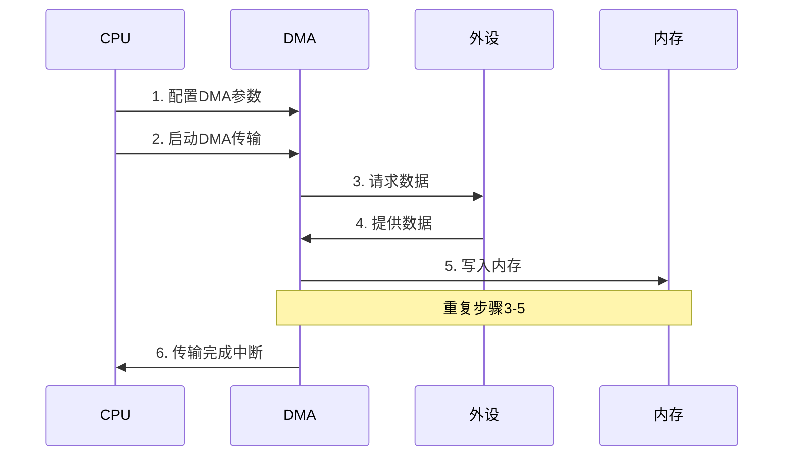
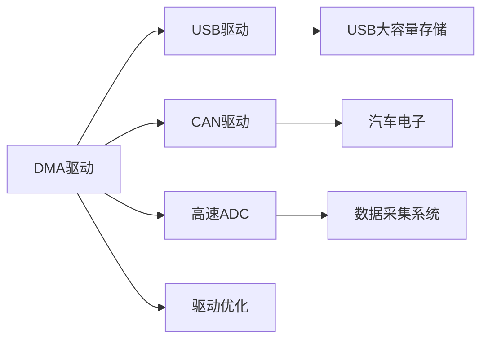

# DMA驱动开发：高效数据传输

## 概述

DMA（Direct Memory Access，直接内存访问）是一种无需CPU干预即可在内存和外设之间传输数据的技术。通过DMA，可以大幅提高数据传输效率，释放CPU资源用于其他任务，是高性能嵌入式系统的关键技术。

本教程将深入讲解DMA的工作原理和驱动开发方法，通过实战项目带你掌握DMA在UART、SPI、ADC等外设中的应用。

完成本教程后，你将能够：

- 理解DMA的工作原理和硬件架构
- 掌握DMA控制器的配置方法
- 实现DMA在各种外设中的应用
- 处理DMA传输中断和错误
- 管理多个DMA通道
- 优化DMA传输性能

## 背景知识

### DMA的工作原理

传统的数据传输方式需要CPU参与每个字节的搬运，而DMA可以独立完成数据传输。

**传统方式 vs DMA方式**：

```
传统方式（CPU搬运）：
外设 -> CPU读取 -> CPU写入 -> 内存
优点：简单直接
缺点：占用CPU，效率低

DMA方式（硬件搬运）：
外设 <--DMA控制器--> 内存
优点：不占用CPU，效率高
缺点：配置复杂，需要硬件支持
```

**DMA传输过程**：



### STM32 DMA架构

STM32F4系列有两个DMA控制器（DMA1和DMA2），每个控制器有8个数据流（Stream）。

**DMA控制器架构**：

```
DMA1: 8个Stream (Stream0-7)
DMA2: 8个Stream (Stream0-7)

每个Stream可以配置为8个通道（Channel）之一
每个Stream有独立的：
- 源地址
- 目标地址
- 数据量
- 传输模式
- 优先级
```

**DMA请求映射**：

| 外设 | DMA控制器 | Stream | Channel |
|------|----------|--------|---------|
| USART1_TX | DMA2 | Stream7 | Channel4 |
| USART1_RX | DMA2 | Stream5 | Channel4 |
| SPI1_TX | DMA2 | Stream3 | Channel3 |
| SPI1_RX | DMA2 | Stream2 | Channel3 |
| ADC1 | DMA2 | Stream0 | Channel0 |
| TIM1_CH1 | DMA2 | Stream1 | Channel6 |


### DMA传输模式

DMA支持多种传输模式，适应不同的应用场景。

**1. 传输方向**：
- 外设到内存（Peripheral to Memory）
- 内存到外设（Memory to Peripheral）
- 内存到内存（Memory to Memory）

**2. 传输模式**：
- 普通模式（Normal Mode）：传输完成后停止
- 循环模式（Circular Mode）：传输完成后自动重新开始

**3. 数据宽度**：
- 字节（8位）
- 半字（16位）
- 字（32位）

**4. 地址递增**：
- 固定地址：适用于外设寄存器
- 递增地址：适用于内存缓冲区

### DMA寄存器概览

STM32 DMA的主要寄存器：

| 寄存器 | 全称 | 功能 |
|--------|------|------|
| SxCR | Stream x Configuration Register | 流配置寄存器 |
| SxNDTR | Stream x Number of Data Register | 数据传输数量 |
| SxPAR | Stream x Peripheral Address Register | 外设地址 |
| SxM0AR | Stream x Memory 0 Address Register | 内存地址0 |
| SxM1AR | Stream x Memory 1 Address Register | 内存地址1（双缓冲） |
| SxFCR | Stream x FIFO Control Register | FIFO控制 |
| LISR/HISR | Low/High Interrupt Status Register | 中断状态 |
| LIFCR/HIFCR | Low/High Interrupt Flag Clear Register | 中断标志清除 |

## 环境准备

### 硬件要求

- STM32F4系列开发板（如STM32F407VET6）
- USB转TTL串口模块
- 逻辑分析仪（可选，用于观察DMA传输）
- 示波器（可选，用于性能测试）

### 软件要求

- Keil MDK 5.x 或 STM32CubeIDE
- STM32F4 HAL库或标准外设库
- 串口调试工具

### 硬件连接

```
基本连接（UART DMA测试）：
- PA9  (USART1_TX) ---> USB转TTL RX
- PA10 (USART1_RX) ---> USB转TTL TX
- GND              ---> GND

ADC DMA测试（可选）：
- PA0 (ADC1_IN0) ---> 可变电阻或信号源
```

## 核心内容

### 步骤1：DMA基本配置

首先学习如何配置DMA的基本参数。

```c
#include "stm32f4xx.h"

/**
 * @brief  DMA基本配置结构体
 */
typedef struct {
    DMA_Stream_TypeDef *stream;     // DMA流
    uint32_t channel;                // 通道号（0-7）
    uint32_t direction;              // 传输方向
    uint32_t periph_addr;            // 外设地址
    uint32_t memory_addr;            // 内存地址
    uint32_t data_size;              // 数据量
    uint32_t periph_data_width;      // 外设数据宽度
    uint32_t memory_data_width;      // 内存数据宽度
    uint32_t mode;                   // 传输模式（普通/循环）
    uint32_t priority;               // 优先级
    uint8_t  periph_inc;             // 外设地址递增
    uint8_t  memory_inc;             // 内存地址递增
} DMA_Config_t;

/**
 * @brief  使能DMA时钟
 * @param  dma: DMA1或DMA2
 * @retval 无
 */
void DMA_ClockEnable(DMA_TypeDef *dma) {
    if (dma == DMA1) {
        RCC->AHB1ENR |= RCC_AHB1ENR_DMA1EN;
    } else if (dma == DMA2) {
        RCC->AHB1ENR |= RCC_AHB1ENR_DMA2EN;
    }
}

/**
 * @brief  配置DMA流
 * @param  config: DMA配置结构体指针
 * @retval 无
 */
void DMA_StreamConfig(DMA_Config_t *config) {
    DMA_Stream_TypeDef *stream = config->stream;
    
    // 1. 禁用DMA流（配置前必须禁用）
    stream->CR &= ~DMA_SxCR_EN;
    while (stream->CR & DMA_SxCR_EN);  // 等待禁用完成
    
    // 2. 配置通道号
    stream->CR &= ~DMA_SxCR_CHSEL;
    stream->CR |= (config->channel << 25);
    
    // 3. 配置传输方向
    stream->CR &= ~DMA_SxCR_DIR;
    stream->CR |= config->direction;
    
    // 4. 配置数据宽度
    stream->CR &= ~(DMA_SxCR_PSIZE | DMA_SxCR_MSIZE);
    stream->CR |= (config->periph_data_width << 11);  // 外设数据宽度
    stream->CR |= (config->memory_data_width << 13);  // 内存数据宽度
    
    // 5. 配置地址递增
    if (config->periph_inc) {
        stream->CR |= DMA_SxCR_PINC;
    } else {
        stream->CR &= ~DMA_SxCR_PINC;
    }
    
    if (config->memory_inc) {
        stream->CR |= DMA_SxCR_MINC;
    } else {
        stream->CR &= ~DMA_SxCR_MINC;
    }
    
    // 6. 配置传输模式
    if (config->mode == DMA_SxCR_CIRC) {
        stream->CR |= DMA_SxCR_CIRC;  // 循环模式
    } else {
        stream->CR &= ~DMA_SxCR_CIRC;  // 普通模式
    }
    
    // 7. 配置优先级
    stream->CR &= ~DMA_SxCR_PL;
    stream->CR |= config->priority;
    
    // 8. 配置地址
    stream->PAR = config->periph_addr;   // 外设地址
    stream->M0AR = config->memory_addr;  // 内存地址
    
    // 9. 配置数据量
    stream->NDTR = config->data_size;
}

/**
 * @brief  启动DMA传输
 * @param  stream: DMA流指针
 * @retval 无
 */
void DMA_Start(DMA_Stream_TypeDef *stream) {
    stream->CR |= DMA_SxCR_EN;
}

/**
 * @brief  停止DMA传输
 * @param  stream: DMA流指针
 * @retval 无
 */
void DMA_Stop(DMA_Stream_TypeDef *stream) {
    stream->CR &= ~DMA_SxCR_EN;
    while (stream->CR & DMA_SxCR_EN);
}
```

**配置参数说明**：

1. **传输方向**：
   - `0b00`：外设到内存
   - `0b01`：内存到外设
   - `0b10`：内存到内存

2. **数据宽度**：
   - `0b00`：字节（8位）
   - `0b01`：半字（16位）
   - `0b10`：字（32位）

3. **优先级**：
   - `0b00`：低
   - `0b01`：中
   - `0b10`：高
   - `0b11`：非常高


### 步骤2：DMA中断配置

DMA支持多种中断，用于通知传输状态。

```c
/**
 * @brief  DMA中断类型
 */
typedef enum {
    DMA_IT_TC   = DMA_SxCR_TCIE,   // 传输完成中断
    DMA_IT_HT   = DMA_SxCR_HTIE,   // 半传输中断
    DMA_IT_TE   = DMA_SxCR_TEIE,   // 传输错误中断
    DMA_IT_DME  = DMA_SxCR_DMEIE   // 直接模式错误中断
} DMA_IT_Type;

/**
 * @brief  使能DMA中断
 * @param  stream: DMA流指针
 * @param  it_type: 中断类型
 * @retval 无
 */
void DMA_EnableIT(DMA_Stream_TypeDef *stream, DMA_IT_Type it_type) {
    stream->CR |= it_type;
}

/**
 * @brief  禁用DMA中断
 * @param  stream: DMA流指针
 * @param  it_type: 中断类型
 * @retval 无
 */
void DMA_DisableIT(DMA_Stream_TypeDef *stream, DMA_IT_Type it_type) {
    stream->CR &= ~it_type;
}

/**
 * @brief  配置DMA NVIC中断
 * @param  irqn: 中断号
 * @param  priority: 优先级
 * @retval 无
 */
void DMA_NVIC_Config(IRQn_Type irqn, uint32_t priority) {
    NVIC_SetPriority(irqn, priority);
    NVIC_EnableIRQ(irqn);
}

/**
 * @brief  获取DMA中断标志
 * @param  dma: DMA1或DMA2
 * @param  stream_num: 流编号（0-7）
 * @retval 中断标志
 */
uint32_t DMA_GetITStatus(DMA_TypeDef *dma, uint8_t stream_num) {
    uint32_t flags = 0;
    
    if (stream_num < 4) {
        // Stream 0-3: 使用LISR
        flags = dma->LISR >> (stream_num * 6);
    } else {
        // Stream 4-7: 使用HISR
        flags = dma->HISR >> ((stream_num - 4) * 6);
    }
    
    return flags & 0x3F;  // 6位标志
}

/**
 * @brief  清除DMA中断标志
 * @param  dma: DMA1或DMA2
 * @param  stream_num: 流编号（0-7）
 * @param  flags: 要清除的标志
 * @retval 无
 */
void DMA_ClearITFlags(DMA_TypeDef *dma, uint8_t stream_num, uint32_t flags) {
    if (stream_num < 4) {
        // Stream 0-3: 使用LIFCR
        dma->LIFCR = (flags & 0x3F) << (stream_num * 6);
    } else {
        // Stream 4-7: 使用HIFCR
        dma->HIFCR = (flags & 0x3F) << ((stream_num - 4) * 6);
    }
}

// DMA中断标志位定义
#define DMA_FLAG_FEIF   (1 << 0)  // FIFO错误
#define DMA_FLAG_DMEIF  (1 << 2)  // 直接模式错误
#define DMA_FLAG_TEIF   (1 << 3)  // 传输错误
#define DMA_FLAG_HTIF   (1 << 4)  // 半传输完成
#define DMA_FLAG_TCIF   (1 << 5)  // 传输完成

/**
 * @brief  DMA2 Stream7中断服务函数示例（USART1 TX）
 * @param  无
 * @retval 无
 */
void DMA2_Stream7_IRQHandler(void) {
    // 检查传输完成标志
    if (DMA_GetITStatus(DMA2, 7) & DMA_FLAG_TCIF) {
        // 清除标志
        DMA_ClearITFlags(DMA2, 7, DMA_FLAG_TCIF);
        
        // 传输完成处理
        // ...
    }
    
    // 检查传输错误标志
    if (DMA_GetITStatus(DMA2, 7) & DMA_FLAG_TEIF) {
        // 清除标志
        DMA_ClearITFlags(DMA2, 7, DMA_FLAG_TEIF);
        
        // 错误处理
        // ...
    }
}
```

**中断标志说明**：

| 标志 | 说明 | 处理方法 |
|------|------|---------|
| TCIF | 传输完成 | 清除标志，执行后续操作 |
| HTIF | 半传输完成 | 用于双缓冲处理 |
| TEIF | 传输错误 | 检查配置，重新启动 |
| DMEIF | 直接模式错误 | 检查FIFO配置 |
| FEIF | FIFO错误 | 检查FIFO阈值 |


### 步骤3：UART DMA发送

实现UART的DMA发送功能，提高串口发送效率。

```c
/**
 * @brief  初始化UART1 DMA发送
 * @param  无
 * @retval 无
 */
void UART1_DMA_TX_Init(void) {
    // 1. 使能DMA2时钟
    DMA_ClockEnable(DMA2);
    
    // 2. 配置DMA参数
    DMA_Config_t dma_config = {
        .stream = DMA2_Stream7,
        .channel = 4,  // Channel 4 for USART1_TX
        .direction = (1 << 6),  // 内存到外设
        .periph_addr = (uint32_t)&USART1->DR,
        .memory_addr = 0,  // 稍后设置
        .data_size = 0,    // 稍后设置
        .periph_data_width = 0,  // 字节
        .memory_data_width = 0,  // 字节
        .mode = 0,  // 普通模式
        .priority = (1 << 16),  // 中等优先级
        .periph_inc = 0,  // 外设地址不递增
        .memory_inc = 1   // 内存地址递增
    };
    
    DMA_StreamConfig(&dma_config);
    
    // 3. 使能传输完成中断
    DMA_EnableIT(DMA2_Stream7, DMA_IT_TC);
    
    // 4. 配置NVIC
    DMA_NVIC_Config(DMA2_Stream7_IRQn, 2);
    
    // 5. 使能USART1的DMA发送
    USART1->CR3 |= USART_CR3_DMAT;
}

/**
 * @brief  使用DMA发送数据
 * @param  data: 数据指针
 * @param  length: 数据长度
 * @retval 0=成功，1=DMA忙
 */
uint8_t UART1_DMA_Send(const uint8_t *data, uint16_t length) {
    // 检查DMA是否空闲
    if (DMA2_Stream7->CR & DMA_SxCR_EN) {
        return 1;  // DMA忙
    }
    
    // 清除所有标志
    DMA_ClearITFlags(DMA2, 7, 0x3F);
    
    // 配置内存地址和数据量
    DMA2_Stream7->M0AR = (uint32_t)data;
    DMA2_Stream7->NDTR = length;
    
    // 启动DMA传输
    DMA_Start(DMA2_Stream7);
    
    return 0;  // 成功
}

/**
 * @brief  检查DMA发送是否完成
 * @param  无
 * @retval 1=完成，0=未完成
 */
uint8_t UART1_DMA_IsTxComplete(void) {
    return !(DMA2_Stream7->CR & DMA_SxCR_EN);
}

/**
 * @brief  等待DMA发送完成
 * @param  timeout: 超时时间（毫秒）
 * @retval 0=成功，1=超时
 */
uint8_t UART1_DMA_WaitTxComplete(uint32_t timeout) {
    uint32_t start = GetTick();  // 获取当前时间
    
    while (DMA2_Stream7->CR & DMA_SxCR_EN) {
        if (GetTick() - start > timeout) {
            return 1;  // 超时
        }
    }
    
    return 0;  // 成功
}

// 全局变量
volatile uint8_t g_uart_dma_tx_complete = 0;

/**
 * @brief  DMA2 Stream7中断服务函数（USART1 TX）
 * @param  无
 * @retval 无
 */
void DMA2_Stream7_IRQHandler(void) {
    if (DMA_GetITStatus(DMA2, 7) & DMA_FLAG_TCIF) {
        // 清除传输完成标志
        DMA_ClearITFlags(DMA2, 7, DMA_FLAG_TCIF);
        
        // 设置完成标志
        g_uart_dma_tx_complete = 1;
    }
}
```

**使用示例**：

```c
int main(void) {
    SystemInit();
    UART1_Init(115200);
    UART1_DMA_TX_Init();
    
    const char *message = "Hello, DMA!\r\n";
    
    while (1) {
        // 发送数据
        if (UART1_DMA_Send((uint8_t*)message, strlen(message)) == 0) {
            // 等待发送完成
            while (!g_uart_dma_tx_complete);
            g_uart_dma_tx_complete = 0;
            
            // 延时
            Delay_Ms(1000);
        }
    }
}
```


### 步骤4：UART DMA接收

实现UART的DMA接收功能，结合IDLE中断实现不定长数据接收。

```c
#define UART_DMA_RX_BUFFER_SIZE 256

uint8_t uart_dma_rx_buffer[UART_DMA_RX_BUFFER_SIZE];
volatile uint16_t uart_rx_length = 0;
volatile uint8_t uart_rx_complete = 0;

/**
 * @brief  初始化UART1 DMA接收
 * @param  无
 * @retval 无
 */
void UART1_DMA_RX_Init(void) {
    // 1. 使能DMA2时钟
    DMA_ClockEnable(DMA2);
    
    // 2. 配置DMA参数
    DMA_Config_t dma_config = {
        .stream = DMA2_Stream5,
        .channel = 4,  // Channel 4 for USART1_RX
        .direction = 0,  // 外设到内存
        .periph_addr = (uint32_t)&USART1->DR,
        .memory_addr = (uint32_t)uart_dma_rx_buffer,
        .data_size = UART_DMA_RX_BUFFER_SIZE,
        .periph_data_width = 0,  // 字节
        .memory_data_width = 0,  // 字节
        .mode = DMA_SxCR_CIRC,  // 循环模式
        .priority = (2 << 16),  // 高优先级
        .periph_inc = 0,  // 外设地址不递增
        .memory_inc = 1   // 内存地址递增
    };
    
    DMA_StreamConfig(&dma_config);
    
    // 3. 使能USART1的DMA接收
    USART1->CR3 |= USART_CR3_DMAR;
    
    // 4. 使能USART1的IDLE中断
    USART1->CR1 |= USART_CR1_IDLEIE;
    NVIC_EnableIRQ(USART1_IRQn);
    
    // 5. 启动DMA接收
    DMA_Start(DMA2_Stream5);
}

/**
 * @brief  获取DMA接收的数据量
 * @param  无
 * @retval 已接收的字节数
 */
uint16_t UART1_DMA_GetRxCount(void) {
    return UART_DMA_RX_BUFFER_SIZE - DMA2_Stream5->NDTR;
}

/**
 * @brief  USART1中断服务函数（IDLE中断）
 * @param  无
 * @retval 无
 */
void USART1_IRQHandler(void) {
    if (USART1->SR & USART_SR_IDLE) {
        // 清除IDLE标志（读SR后读DR）
        volatile uint32_t temp = USART1->SR;
        temp = USART1->DR;
        (void)temp;
        
        // 获取接收到的数据量
        uart_rx_length = UART1_DMA_GetRxCount();
        uart_rx_complete = 1;
        
        // 重启DMA接收
        DMA_Stop(DMA2_Stream5);
        DMA2_Stream5->NDTR = UART_DMA_RX_BUFFER_SIZE;
        DMA_Start(DMA2_Stream5);
    }
}
```

**使用示例**：

```c
int main(void) {
    SystemInit();
    UART1_Init(115200);
    UART1_DMA_RX_Init();
    
    printf("UART DMA RX Test\r\n");
    printf("Send data...\r\n");
    
    while (1) {
        if (uart_rx_complete) {
            // 处理接收到的数据
            printf("Received %d bytes: ", uart_rx_length);
            for (int i = 0; i < uart_rx_length; i++) {
                printf("%02X ", uart_dma_rx_buffer[i]);
            }
            printf("\r\n");
            
            // 重置标志
            uart_rx_complete = 0;
        }
    }
}
```


### 步骤5：ADC DMA采集

使用DMA实现ADC的连续采集，无需CPU干预。

```c
#define ADC_CHANNEL_COUNT 4
#define ADC_SAMPLE_COUNT 100

uint16_t adc_dma_buffer[ADC_CHANNEL_COUNT * ADC_SAMPLE_COUNT];
volatile uint8_t adc_conversion_complete = 0;

/**
 * @brief  初始化ADC1
 * @param  无
 * @retval 无
 */
void ADC1_Init(void) {
    // 1. 使能ADC1时钟
    RCC->APB2ENR |= RCC_APB2ENR_ADC1EN;
    
    // 2. 配置ADC参数
    ADC1->CR1 = 0;
    ADC1->CR1 |= ADC_CR1_SCAN;  // 扫描模式
    
    ADC1->CR2 = 0;
    ADC1->CR2 |= ADC_CR2_CONT;  // 连续转换
    ADC1->CR2 |= ADC_CR2_DMA;   // 使能DMA
    ADC1->CR2 |= ADC_CR2_DDS;   // DMA连续请求
    
    // 3. 配置采样时间（所有通道）
    ADC1->SMPR2 = 0x00249249;  // 84个周期
    
    // 4. 配置规则序列
    ADC1->SQR1 = (ADC_CHANNEL_COUNT - 1) << 20;  // 4个通道
    ADC1->SQR3 = (0 << 0) | (1 << 5) | (2 << 10) | (3 << 15);  // CH0-3
    
    // 5. 使能ADC
    ADC1->CR2 |= ADC_CR2_ADON;
}

/**
 * @brief  初始化ADC1 DMA
 * @param  无
 * @retval 无
 */
void ADC1_DMA_Init(void) {
    // 1. 使能DMA2时钟
    DMA_ClockEnable(DMA2);
    
    // 2. 配置DMA参数
    DMA_Config_t dma_config = {
        .stream = DMA2_Stream0,
        .channel = 0,  // Channel 0 for ADC1
        .direction = 0,  // 外设到内存
        .periph_addr = (uint32_t)&ADC1->DR,
        .memory_addr = (uint32_t)adc_dma_buffer,
        .data_size = ADC_CHANNEL_COUNT * ADC_SAMPLE_COUNT,
        .periph_data_width = (1 << 11),  // 半字（16位）
        .memory_data_width = (1 << 13),  // 半字（16位）
        .mode = DMA_SxCR_CIRC,  // 循环模式
        .priority = (2 << 16),  // 高优先级
        .periph_inc = 0,  // 外设地址不递增
        .memory_inc = 1   // 内存地址递增
    };
    
    DMA_StreamConfig(&dma_config);
    
    // 3. 使能传输完成中断
    DMA_EnableIT(DMA2_Stream0, DMA_IT_TC);
    
    // 4. 配置NVIC
    DMA_NVIC_Config(DMA2_Stream0_IRQn, 2);
    
    // 5. 启动DMA
    DMA_Start(DMA2_Stream0);
}

/**
 * @brief  启动ADC转换
 * @param  无
 * @retval 无
 */
void ADC1_Start(void) {
    ADC1->CR2 |= ADC_CR2_SWSTART;
}

/**
 * @brief  DMA2 Stream0中断服务函数（ADC1）
 * @param  无
 * @retval 无
 */
void DMA2_Stream0_IRQHandler(void) {
    if (DMA_GetITStatus(DMA2, 0) & DMA_FLAG_TCIF) {
        // 清除传输完成标志
        DMA_ClearITFlags(DMA2, 0, DMA_FLAG_TCIF);
        
        // 设置完成标志
        adc_conversion_complete = 1;
    }
}

/**
 * @brief  计算ADC平均值
 * @param  channel: 通道号（0-3）
 * @retval 平均值
 */
uint16_t ADC_GetAverage(uint8_t channel) {
    uint32_t sum = 0;
    
    for (int i = 0; i < ADC_SAMPLE_COUNT; i++) {
        sum += adc_dma_buffer[i * ADC_CHANNEL_COUNT + channel];
    }
    
    return sum / ADC_SAMPLE_COUNT;
}
```

**使用示例**：

```c
int main(void) {
    SystemInit();
    UART1_Init(115200);
    ADC1_Init();
    ADC1_DMA_Init();
    ADC1_Start();
    
    printf("ADC DMA Test\r\n");
    
    while (1) {
        if (adc_conversion_complete) {
            adc_conversion_complete = 0;
            
            // 计算并显示各通道平均值
            for (int ch = 0; ch < ADC_CHANNEL_COUNT; ch++) {
                uint16_t avg = ADC_GetAverage(ch);
                float voltage = avg * 3.3f / 4096.0f;
                printf("CH%d: %d (%.2fV)  ", ch, avg, voltage);
            }
            printf("\r\n");
            
            Delay_Ms(500);
        }
    }
}
```


### 步骤6：内存到内存DMA传输

DMA还可以用于内存之间的快速数据拷贝。

```c
/**
 * @brief  初始化内存到内存DMA
 * @param  无
 * @retval 无
 */
void DMA_MemToMem_Init(void) {
    // 使能DMA2时钟
    DMA_ClockEnable(DMA2);
    
    // 注意：内存到内存传输只能使用DMA2
}

/**
 * @brief  内存到内存DMA传输
 * @param  src: 源地址
 * @param  dst: 目标地址
 * @param  size: 数据量（字节数）
 * @retval 无
 */
void DMA_MemCopy(const void *src, void *dst, uint32_t size) {
    // 1. 禁用DMA流
    DMA_Stop(DMA2_Stream0);
    
    // 2. 配置DMA参数
    DMA2_Stream0->CR = 0;
    DMA2_Stream0->CR |= (0 << 25);  // Channel 0
    DMA2_Stream0->CR |= (2 << 6);   // 内存到内存
    DMA2_Stream0->CR |= (0 << 11);  // 外设数据宽度：字节
    DMA2_Stream0->CR |= (0 << 13);  // 内存数据宽度：字节
    DMA2_Stream0->CR |= DMA_SxCR_PINC;  // 源地址递增
    DMA2_Stream0->CR |= DMA_SxCR_MINC;  // 目标地址递增
    DMA2_Stream0->CR |= (3 << 16);  // 非常高优先级
    
    // 3. 配置地址和数据量
    DMA2_Stream0->PAR = (uint32_t)src;   // 源地址
    DMA2_Stream0->M0AR = (uint32_t)dst;  // 目标地址
    DMA2_Stream0->NDTR = size;
    
    // 4. 启动DMA传输
    DMA_Start(DMA2_Stream0);
    
    // 5. 等待传输完成
    while (DMA2_Stream0->CR & DMA_SxCR_EN);
}

/**
 * @brief  快速内存拷贝（32位对齐）
 * @param  src: 源地址（必须4字节对齐）
 * @param  dst: 目标地址（必须4字节对齐）
 * @param  size: 数据量（字节数，必须是4的倍数）
 * @retval 无
 */
void DMA_MemCopy32(const void *src, void *dst, uint32_t size) {
    // 检查对齐
    if (((uint32_t)src % 4) || ((uint32_t)dst % 4) || (size % 4)) {
        // 不对齐，使用字节拷贝
        DMA_MemCopy(src, dst, size);
        return;
    }
    
    // 配置为32位传输
    DMA_Stop(DMA2_Stream0);
    
    DMA2_Stream0->CR = 0;
    DMA2_Stream0->CR |= (0 << 25);  // Channel 0
    DMA2_Stream0->CR |= (2 << 6);   // 内存到内存
    DMA2_Stream0->CR |= (2 << 11);  // 外设数据宽度：字（32位）
    DMA2_Stream0->CR |= (2 << 13);  // 内存数据宽度：字（32位）
    DMA2_Stream0->CR |= DMA_SxCR_PINC;
    DMA2_Stream0->CR |= DMA_SxCR_MINC;
    DMA2_Stream0->CR |= (3 << 16);
    
    DMA2_Stream0->PAR = (uint32_t)src;
    DMA2_Stream0->M0AR = (uint32_t)dst;
    DMA2_Stream0->NDTR = size / 4;  // 字数量
    
    DMA_Start(DMA2_Stream0);
    while (DMA2_Stream0->CR & DMA_SxCR_EN);
}
```

**性能对比测试**：

```c
#define TEST_SIZE 1024

uint8_t src_buffer[TEST_SIZE];
uint8_t dst_buffer[TEST_SIZE];

void TestMemCopyPerformance(void) {
    uint32_t start, end;
    
    // 初始化源数据
    for (int i = 0; i < TEST_SIZE; i++) {
        src_buffer[i] = i & 0xFF;
    }
    
    // 测试1：标准memcpy
    start = GetTick();
    memcpy(dst_buffer, src_buffer, TEST_SIZE);
    end = GetTick();
    printf("memcpy: %d us\r\n", end - start);
    
    // 测试2：DMA拷贝（字节）
    start = GetTick();
    DMA_MemCopy(src_buffer, dst_buffer, TEST_SIZE);
    end = GetTick();
    printf("DMA (byte): %d us\r\n", end - start);
    
    // 测试3：DMA拷贝（字）
    start = GetTick();
    DMA_MemCopy32(src_buffer, dst_buffer, TEST_SIZE);
    end = GetTick();
    printf("DMA (word): %d us\r\n", end - start);
}
```


## 实践示例

### 示例1：DMA双缓冲接收

使用双缓冲模式实现连续数据接收，避免数据丢失。

```c
#define BUFFER_SIZE 512

uint8_t rx_buffer0[BUFFER_SIZE];
uint8_t rx_buffer1[BUFFER_SIZE];
volatile uint8_t current_buffer = 0;
volatile uint8_t buffer_ready = 0;

/**
 * @brief  初始化DMA双缓冲接收
 * @param  无
 * @retval 无
 */
void UART1_DMA_DoubleBuffer_Init(void) {
    DMA_ClockEnable(DMA2);
    
    // 配置DMA
    DMA2_Stream5->CR = 0;
    DMA2_Stream5->CR |= (4 << 25);  // Channel 4
    DMA2_Stream5->CR |= (0 << 6);   // 外设到内存
    DMA2_Stream5->CR |= DMA_SxCR_MINC;
    DMA2_Stream5->CR |= DMA_SxCR_CIRC;
    DMA2_Stream5->CR |= DMA_SxCR_DBM;  // 双缓冲模式
    
    // 配置地址
    DMA2_Stream5->PAR = (uint32_t)&USART1->DR;
    DMA2_Stream5->M0AR = (uint32_t)rx_buffer0;
    DMA2_Stream5->M1AR = (uint32_t)rx_buffer1;
    DMA2_Stream5->NDTR = BUFFER_SIZE;
    
    // 使能传输完成中断
    DMA_EnableIT(DMA2_Stream5, DMA_IT_TC);
    DMA_NVIC_Config(DMA2_Stream5_IRQn, 2);
    
    // 使能USART DMA
    USART1->CR3 |= USART_CR3_DMAR;
    
    // 启动DMA
    DMA_Start(DMA2_Stream5);
}

/**
 * @brief  DMA2 Stream5中断服务函数
 * @param  无
 * @retval 无
 */
void DMA2_Stream5_IRQHandler(void) {
    if (DMA_GetITStatus(DMA2, 5) & DMA_FLAG_TCIF) {
        DMA_ClearITFlags(DMA2, 5, DMA_FLAG_TCIF);
        
        // 检查当前使用的缓冲区
        if (DMA2_Stream5->CR & DMA_SxCR_CT) {
            current_buffer = 1;  // 正在使用buffer1，buffer0已满
        } else {
            current_buffer = 0;  // 正在使用buffer0，buffer1已满
        }
        
        buffer_ready = 1;
    }
}

/**
 * @brief  主函数 - 双缓冲接收
 */
int main(void) {
    SystemInit();
    UART1_Init(115200);
    UART1_DMA_DoubleBuffer_Init();
    
    while (1) {
        if (buffer_ready) {
            buffer_ready = 0;
            
            // 处理已满的缓冲区
            uint8_t *buffer = (current_buffer == 0) ? rx_buffer1 : rx_buffer0;
            
            printf("Buffer %d received %d bytes\r\n", 
                   (current_buffer == 0) ? 1 : 0, BUFFER_SIZE);
            
            // 处理数据...
        }
    }
}
```

### 示例2：SPI DMA全双工通信

使用DMA实现SPI的高速全双工通信。

```c
#define SPI_BUFFER_SIZE 256

uint8_t spi_tx_buffer[SPI_BUFFER_SIZE];
uint8_t spi_rx_buffer[SPI_BUFFER_SIZE];
volatile uint8_t spi_transfer_complete = 0;

/**
 * @brief  初始化SPI1 DMA
 * @param  无
 * @retval 无
 */
void SPI1_DMA_Init(void) {
    DMA_ClockEnable(DMA2);
    
    // 配置DMA TX (Stream3, Channel3)
    DMA_Config_t tx_config = {
        .stream = DMA2_Stream3,
        .channel = 3,
        .direction = (1 << 6),  // 内存到外设
        .periph_addr = (uint32_t)&SPI1->DR,
        .memory_addr = (uint32_t)spi_tx_buffer,
        .data_size = SPI_BUFFER_SIZE,
        .periph_data_width = 0,  // 字节
        .memory_data_width = 0,  // 字节
        .mode = 0,  // 普通模式
        .priority = (2 << 16),
        .periph_inc = 0,
        .memory_inc = 1
    };
    DMA_StreamConfig(&tx_config);
    
    // 配置DMA RX (Stream2, Channel3)
    DMA_Config_t rx_config = {
        .stream = DMA2_Stream2,
        .channel = 3,
        .direction = 0,  // 外设到内存
        .periph_addr = (uint32_t)&SPI1->DR,
        .memory_addr = (uint32_t)spi_rx_buffer,
        .data_size = SPI_BUFFER_SIZE,
        .periph_data_width = 0,
        .memory_data_width = 0,
        .mode = 0,
        .priority = (3 << 16),  // RX优先级更高
        .periph_inc = 0,
        .memory_inc = 1
    };
    DMA_StreamConfig(&rx_config);
    
    // 使能RX传输完成中断
    DMA_EnableIT(DMA2_Stream2, DMA_IT_TC);
    DMA_NVIC_Config(DMA2_Stream2_IRQn, 2);
    
    // 使能SPI DMA
    SPI1->CR2 |= SPI_CR2_TXDMAEN | SPI_CR2_RXDMAEN;
}

/**
 * @brief  SPI DMA传输
 * @param  tx_data: 发送数据指针
 * @param  rx_data: 接收数据指针
 * @param  length: 数据长度
 * @retval 无
 */
void SPI1_DMA_Transfer(const uint8_t *tx_data, uint8_t *rx_data, uint16_t length) {
    // 等待上一次传输完成
    while (DMA2_Stream3->CR & DMA_SxCR_EN);
    while (DMA2_Stream2->CR & DMA_SxCR_EN);
    
    // 配置地址和数据量
    DMA2_Stream3->M0AR = (uint32_t)tx_data;
    DMA2_Stream3->NDTR = length;
    DMA2_Stream2->M0AR = (uint32_t)rx_data;
    DMA2_Stream2->NDTR = length;
    
    // 清除标志
    DMA_ClearITFlags(DMA2, 2, 0x3F);
    DMA_ClearITFlags(DMA2, 3, 0x3F);
    
    spi_transfer_complete = 0;
    
    // 先启动RX，再启动TX
    DMA_Start(DMA2_Stream2);
    DMA_Start(DMA2_Stream3);
}

/**
 * @brief  DMA2 Stream2中断服务函数（SPI1 RX）
 * @param  无
 * @retval 无
 */
void DMA2_Stream2_IRQHandler(void) {
    if (DMA_GetITStatus(DMA2, 2) & DMA_FLAG_TCIF) {
        DMA_ClearITFlags(DMA2, 2, DMA_FLAG_TCIF);
        spi_transfer_complete = 1;
    }
}
```


### 示例3：多通道DMA管理

实现一个通用的DMA管理器，支持多个DMA通道。

```c
/**
 * @brief  DMA通道信息结构体
 */
typedef struct {
    DMA_Stream_TypeDef *stream;
    uint8_t stream_num;
    DMA_TypeDef *dma;
    IRQn_Type irqn;
    void (*callback)(void);  // 传输完成回调
    volatile uint8_t busy;
} DMA_Channel_t;

// DMA通道池
#define MAX_DMA_CHANNELS 8
DMA_Channel_t dma_channels[MAX_DMA_CHANNELS];
uint8_t dma_channel_count = 0;

/**
 * @brief  注册DMA通道
 * @param  stream: DMA流指针
 * @param  stream_num: 流编号
 * @param  dma: DMA控制器
 * @param  irqn: 中断号
 * @param  callback: 完成回调函数
 * @retval 通道ID，-1表示失败
 */
int8_t DMA_RegisterChannel(DMA_Stream_TypeDef *stream, uint8_t stream_num,
                           DMA_TypeDef *dma, IRQn_Type irqn,
                           void (*callback)(void)) {
    if (dma_channel_count >= MAX_DMA_CHANNELS) {
        return -1;  // 通道已满
    }
    
    DMA_Channel_t *ch = &dma_channels[dma_channel_count];
    ch->stream = stream;
    ch->stream_num = stream_num;
    ch->dma = dma;
    ch->irqn = irqn;
    ch->callback = callback;
    ch->busy = 0;
    
    // 配置NVIC
    NVIC_SetPriority(irqn, 2);
    NVIC_EnableIRQ(irqn);
    
    return dma_channel_count++;
}

/**
 * @brief  启动DMA传输
 * @param  channel_id: 通道ID
 * @param  src: 源地址
 * @param  dst: 目标地址
 * @param  size: 数据量
 * @retval 0=成功，1=通道忙
 */
uint8_t DMA_StartTransfer(int8_t channel_id, uint32_t src, uint32_t dst, uint32_t size) {
    if (channel_id < 0 || channel_id >= dma_channel_count) {
        return 1;
    }
    
    DMA_Channel_t *ch = &dma_channels[channel_id];
    
    if (ch->busy) {
        return 1;  // 通道忙
    }
    
    // 配置DMA
    DMA_Stop(ch->stream);
    ch->stream->PAR = src;
    ch->stream->M0AR = dst;
    ch->stream->NDTR = size;
    
    // 清除标志
    DMA_ClearITFlags(ch->dma, ch->stream_num, 0x3F);
    
    // 标记为忙
    ch->busy = 1;
    
    // 启动DMA
    DMA_Start(ch->stream);
    
    return 0;
}

/**
 * @brief  通用DMA中断处理函数
 * @param  channel_id: 通道ID
 * @retval 无
 */
void DMA_IRQ_Handler(int8_t channel_id) {
    if (channel_id < 0 || channel_id >= dma_channel_count) {
        return;
    }
    
    DMA_Channel_t *ch = &dma_channels[channel_id];
    
    if (DMA_GetITStatus(ch->dma, ch->stream_num) & DMA_FLAG_TCIF) {
        // 清除标志
        DMA_ClearITFlags(ch->dma, ch->stream_num, DMA_FLAG_TCIF);
        
        // 标记为空闲
        ch->busy = 0;
        
        // 调用回调函数
        if (ch->callback) {
            ch->callback();
        }
    }
}

// 使用示例
void uart_tx_complete(void) {
    printf("UART TX complete\r\n");
}

void adc_conversion_complete(void) {
    printf("ADC conversion complete\r\n");
}

int main(void) {
    SystemInit();
    
    // 注册DMA通道
    int8_t uart_tx_ch = DMA_RegisterChannel(DMA2_Stream7, 7, DMA2, 
                                            DMA2_Stream7_IRQn, uart_tx_complete);
    int8_t adc_ch = DMA_RegisterChannel(DMA2_Stream0, 0, DMA2,
                                        DMA2_Stream0_IRQn, adc_conversion_complete);
    
    // 使用DMA通道
    // ...
}
```


## 深入理解

### DMA仲裁和优先级

当多个DMA请求同时发生时，DMA控制器需要进行仲裁。

**仲裁机制**：

1. **软件优先级**：在CR寄存器中配置（低、中、高、非常高）
2. **硬件优先级**：当软件优先级相同时，流编号小的优先

**优先级配置建议**：

| 应用 | 优先级 | 原因 |
|------|--------|------|
| ADC采集 | 非常高 | 实时性要求高，数据不能丢失 |
| UART接收 | 高 | 防止数据溢出 |
| UART发送 | 中 | 可以等待 |
| 内存拷贝 | 低 | 不紧急 |

```c
/**
 * @brief  配置DMA优先级
 * @param  stream: DMA流指针
 * @param  priority: 优先级（0-3）
 * @retval 无
 */
void DMA_SetPriority(DMA_Stream_TypeDef *stream, uint32_t priority) {
    stream->CR &= ~DMA_SxCR_PL;
    stream->CR |= (priority << 16);
}
```

### DMA FIFO模式

DMA支持FIFO模式，可以提高传输效率。

**直接模式 vs FIFO模式**：

```
直接模式：
- 每个数据请求立即传输
- 适合低速外设
- 配置简单

FIFO模式：
- 数据先存入FIFO，达到阈值后批量传输
- 适合高速外设
- 可以减少总线占用
```

**FIFO配置**：

```c
/**
 * @brief  配置DMA FIFO
 * @param  stream: DMA流指针
 * @param  threshold: FIFO阈值
 * @retval 无
 */
void DMA_ConfigFIFO(DMA_Stream_TypeDef *stream, uint32_t threshold) {
    // 使能FIFO
    stream->FCR |= DMA_SxFCR_DMDIS;
    
    // 配置阈值
    stream->FCR &= ~DMA_SxFCR_FTH;
    stream->FCR |= threshold;
}

// FIFO阈值定义
#define DMA_FIFO_THRESHOLD_1_4   (0 << 0)  // 1/4满
#define DMA_FIFO_THRESHOLD_1_2   (1 << 0)  // 1/2满
#define DMA_FIFO_THRESHOLD_3_4   (2 << 0)  // 3/4满
#define DMA_FIFO_THRESHOLD_FULL  (3 << 0)  // 全满
```

### DMA性能优化

**1. 数据对齐优化**：

```c
/**
 * @brief  检查地址对齐
 * @param  addr: 地址
 * @param  align: 对齐字节数（2、4）
 * @retval 1=对齐，0=不对齐
 */
uint8_t IsAligned(uint32_t addr, uint32_t align) {
    return (addr % align) == 0;
}

/**
 * @brief  优化的DMA配置
 * @param  src: 源地址
 * @param  dst: 目标地址
 * @param  size: 数据量
 * @retval 无
 */
void DMA_OptimizedConfig(uint32_t src, uint32_t dst, uint32_t size) {
    uint32_t data_width;
    uint32_t count;
    
    // 根据对齐情况选择数据宽度
    if (IsAligned(src, 4) && IsAligned(dst, 4) && (size % 4 == 0)) {
        data_width = 2;  // 32位
        count = size / 4;
    } else if (IsAligned(src, 2) && IsAligned(dst, 2) && (size % 2 == 0)) {
        data_width = 1;  // 16位
        count = size / 2;
    } else {
        data_width = 0;  // 8位
        count = size;
    }
    
    // 配置DMA
    DMA2_Stream0->CR &= ~(DMA_SxCR_PSIZE | DMA_SxCR_MSIZE);
    DMA2_Stream0->CR |= (data_width << 11) | (data_width << 13);
    DMA2_Stream0->NDTR = count;
}
```

**2. 突发传输优化**：

```c
/**
 * @brief  配置DMA突发传输
 * @param  stream: DMA流指针
 * @param  pburst: 外设突发长度
 * @param  mburst: 内存突发长度
 * @retval 无
 */
void DMA_ConfigBurst(DMA_Stream_TypeDef *stream, uint32_t pburst, uint32_t mburst) {
    stream->CR &= ~(DMA_SxCR_PBURST | DMA_SxCR_MBURST);
    stream->CR |= (pburst << 21) | (mburst << 23);
}

// 突发长度定义
#define DMA_BURST_SINGLE  (0 << 0)  // 单次传输
#define DMA_BURST_INCR4   (1 << 0)  // 4次突发
#define DMA_BURST_INCR8   (2 << 0)  // 8次突发
#define DMA_BURST_INCR16  (3 << 0)  // 16次突发
```

**3. 减少中断开销**：

```c
/**
 * @brief  使用轮询方式等待DMA完成（小数据量）
 * @param  stream: DMA流指针
 * @retval 无
 */
void DMA_WaitComplete(DMA_Stream_TypeDef *stream) {
    while (stream->CR & DMA_SxCR_EN);
}

/**
 * @brief  使用半传输中断处理大数据（双缓冲效果）
 * @param  stream: DMA流指针
 * @retval 无
 */
void DMA_EnableHalfTransferIT(DMA_Stream_TypeDef *stream) {
    stream->CR |= DMA_SxCR_HTIE;
}
```


## 常见问题

### Q1: DMA传输不工作，数据没有传输？

**可能原因**：
1. DMA时钟未使能
2. 外设DMA请求未使能
3. 通道号配置错误
4. 地址配置错误

**排查步骤**：

```c
// 1. 检查DMA时钟
if (!(RCC->AHB1ENR & RCC_AHB1ENR_DMA2EN)) {
    printf("DMA2 clock not enabled!\r\n");
}

// 2. 检查DMA使能
if (!(DMA2_Stream7->CR & DMA_SxCR_EN)) {
    printf("DMA stream not enabled!\r\n");
}

// 3. 检查外设DMA请求
if (!(USART1->CR3 & USART_CR3_DMAT)) {
    printf("USART1 DMA TX not enabled!\r\n");
}

// 4. 检查通道号
uint32_t channel = (DMA2_Stream7->CR >> 25) & 0x07;
printf("DMA Channel: %d (should be 4 for USART1)\r\n", channel);

// 5. 检查地址
printf("PAR: 0x%08X (should be 0x%08X)\r\n", 
       DMA2_Stream7->PAR, (uint32_t)&USART1->DR);
printf("M0AR: 0x%08X\r\n", DMA2_Stream7->M0AR);
printf("NDTR: %d\r\n", DMA2_Stream7->NDTR);
```

### Q2: DMA传输速度不如预期？

**可能原因**：
1. 数据宽度配置不当
2. 未使用FIFO模式
3. 优先级过低
4. 总线冲突

**优化方法**：

```c
// 1. 使用最大数据宽度
if (IsAligned(addr, 4)) {
    // 使用32位传输
    stream->CR |= (2 << 11) | (2 << 13);
}

// 2. 使能FIFO
stream->FCR |= DMA_SxFCR_DMDIS;
stream->FCR |= DMA_FIFO_THRESHOLD_FULL;

// 3. 提高优先级
stream->CR |= (3 << 16);  // 非常高

// 4. 使用突发传输
stream->CR |= (3 << 21) | (3 << 23);  // 16次突发
```

### Q3: DMA中断不触发？

**可能原因**：
1. 中断未使能
2. NVIC未配置
3. 中断标志未清除
4. 中断向量表错误

**解决方案**：

```c
// 1. 检查DMA中断使能
if (!(DMA2_Stream7->CR & DMA_SxCR_TCIE)) {
    printf("DMA TC interrupt not enabled!\r\n");
}

// 2. 检查NVIC
if (!NVIC_GetEnableIRQ(DMA2_Stream7_IRQn)) {
    printf("NVIC not enabled!\r\n");
}

// 3. 在中断中清除标志
void DMA2_Stream7_IRQHandler(void) {
    // 必须清除标志
    DMA_ClearITFlags(DMA2, 7, DMA_FLAG_TCIF);
    
    // 处理...
}

// 4. 检查中断向量表
extern uint32_t __Vectors;
uint32_t *vector_table = (uint32_t*)&__Vectors;
printf("DMA2_Stream7 vector: 0x%08X\r\n", 
       vector_table[16 + DMA2_Stream7_IRQn]);
```

### Q4: 如何处理DMA传输错误？

**错误类型和处理**：

```c
/**
 * @brief  DMA错误处理
 * @param  dma: DMA控制器
 * @param  stream_num: 流编号
 * @retval 错误码
 */
uint32_t DMA_ErrorHandler(DMA_TypeDef *dma, uint8_t stream_num) {
    uint32_t flags = DMA_GetITStatus(dma, stream_num);
    uint32_t errors = 0;
    
    // FIFO错误
    if (flags & DMA_FLAG_FEIF) {
        errors |= (1 << 0);
        printf("DMA FIFO Error\r\n");
        // 检查FIFO配置
    }
    
    // 直接模式错误
    if (flags & DMA_FLAG_DMEIF) {
        errors |= (1 << 1);
        printf("DMA Direct Mode Error\r\n");
        // 检查FIFO设置
    }
    
    // 传输错误
    if (flags & DMA_FLAG_TEIF) {
        errors |= (1 << 2);
        printf("DMA Transfer Error\r\n");
        // 检查地址和配置
    }
    
    // 清除错误标志
    DMA_ClearITFlags(dma, stream_num, flags);
    
    return errors;
}
```

### Q5: 如何在RTOS中使用DMA？

**线程安全的DMA使用**：

```c
#include "cmsis_os.h"

osSemaphoreId dma_sem;
osMutexId dma_mutex;

/**
 * @brief  初始化DMA同步机制
 * @param  无
 * @retval 无
 */
void DMA_RTOS_Init(void) {
    // 创建信号量（用于等待传输完成）
    osSemaphoreDef(dma_sem);
    dma_sem = osSemaphoreCreate(osSemaphore(dma_sem), 1);
    
    // 创建互斥锁（用于保护DMA资源）
    osMutexDef(dma_mutex);
    dma_mutex = osMutexCreate(osMutex(dma_mutex));
}

/**
 * @brief  线程安全的DMA传输
 * @param  data: 数据指针
 * @param  length: 数据长度
 * @param  timeout: 超时时间（毫秒）
 * @retval 0=成功，1=失败
 */
uint8_t DMA_Transfer_RTOS(const uint8_t *data, uint16_t length, uint32_t timeout) {
    // 获取互斥锁
    if (osMutexWait(dma_mutex, timeout) != osOK) {
        return 1;  // 获取锁失败
    }
    
    // 启动DMA传输
    UART1_DMA_Send(data, length);
    
    // 等待传输完成
    if (osSemaphoreWait(dma_sem, timeout) != osOK) {
        osMutexRelease(dma_mutex);
        return 1;  // 超时
    }
    
    // 释放互斥锁
    osMutexRelease(dma_mutex);
    
    return 0;  // 成功
}

/**
 * @brief  DMA中断服务函数（RTOS版本）
 * @param  无
 * @retval 无
 */
void DMA2_Stream7_IRQHandler(void) {
    if (DMA_GetITStatus(DMA2, 7) & DMA_FLAG_TCIF) {
        DMA_ClearITFlags(DMA2, 7, DMA_FLAG_TCIF);
        
        // 释放信号量
        osSemaphoreRelease(dma_sem);
    }
}
```


## 总结

本教程全面介绍了DMA驱动开发的核心知识和实践技能。让我们回顾一下要点：

**核心知识点**：
- DMA工作原理：无需CPU干预的数据传输
- DMA架构：控制器、流、通道的关系
- DMA寄存器：CR、NDTR、PAR、M0AR等配置
- 传输模式：普通模式、循环模式、双缓冲模式
- 中断处理：TC、HT、TE等中断的使用

**实践技能**：
- UART DMA收发：提高串口通信效率
- ADC DMA采集：实现连续数据采集
- SPI DMA传输：高速全双工通信
- 内存拷贝：快速数据搬运
- 多通道管理：统一的DMA资源管理

**最佳实践**：
- 合理配置优先级，避免冲突
- 使用FIFO模式提高效率
- 数据对齐优化传输速度
- 完善的错误处理机制
- 在RTOS中注意线程安全

**性能优化**：
- 选择合适的数据宽度
- 使用突发传输模式
- 减少中断开销
- 避免总线冲突

DMA是提高嵌入式系统性能的关键技术，掌握DMA驱动开发可以显著提升系统的数据处理能力。通过本教程的学习和实践，你应该能够在各种场景中灵活运用DMA技术。

## 延伸阅读

推荐进一步学习的内容：

**同模块内容**：
- [UART串口驱动开发与调试](../beginner/02-uart-driver.html) - DMA的基础应用
- [SPI驱动开发：外部Flash读写](../beginner/03-spi-driver.html) - SPI DMA应用
- [ADC驱动开发：模拟信号采集](../beginner/06-adc-driver.html) - ADC DMA应用

**相关主题**：
- 中断系统基础概念 - 理解DMA中断
- [内存管理](../../03-memory-management/beginner/01-memory-management-basics.html) - 理解内存访问
- [驱动性能优化技术](../advanced/02-driver-optimization.html) - 高级优化技巧

**高级应用**：
- DMA与RTOS集成
- DMA在音频处理中的应用
- DMA在图像处理中的应用
- DMA在网络通信中的应用

**官方文档**：
- [STM32F4xx参考手册](https://www.st.com/resource/en/reference_manual/dm00031020.pdf) - DMA章节
- [STM32F4xx数据手册](https://www.st.com/resource/en/datasheet/stm32f407vg.pdf) - DMA特性
- [ARM Cortex-M4编程手册](https://developer.arm.com/documentation/dui0553/latest/) - DMA控制器

**开源项目**：
- [STM32 HAL库](https://github.com/STMicroelectronics/STM32CubeF4) - 官方DMA驱动
- [RT-Thread](https://github.com/RT-Thread/rt-thread) - RTOS的DMA驱动
- [libopencm3](https://github.com/libopencm3/libopencm3) - 开源STM32库

## 参考资料

1. STM32F4xx参考手册 - STMicroelectronics
2. ARM Cortex-M4权威指南 - Joseph Yiu
3. 嵌入式系统设计与实践 - Elecia White
4. STM32库开发实战指南 - 野火团队
5. DMA技术详解 - 清华大学出版社

## 练习题

### 基础练习

1. **DMA基本配置练习**：
   - 配置DMA实现UART发送
   - 配置DMA实现UART接收
   - 测试不同数据宽度的传输

2. **中断处理练习**：
   - 实现DMA传输完成中断
   - 实现DMA半传输中断
   - 实现DMA错误处理

3. **性能测试练习**：
   - 对比轮询、中断、DMA的性能
   - 测试不同数据宽度的传输速度
   - 测试FIFO模式的效果

### 进阶练习

4. **双缓冲实现**：
   - 实现DMA双缓冲接收
   - 实现乒乓缓冲机制
   - 测试连续数据流处理

5. **多通道管理**：
   - 实现DMA通道管理器
   - 支持动态分配通道
   - 实现优先级调度

6. **RTOS集成**：
   - 在FreeRTOS中使用DMA
   - 实现线程安全的DMA接口
   - 实现DMA资源池

### 综合项目

7. **高速数据采集系统**：
   - 使用ADC DMA采集多通道数据
   - 实现数据缓存和处理
   - 通过UART DMA发送到PC

8. **音频播放器**：
   - 使用DMA实现DAC音频输出
   - 实现双缓冲播放
   - 支持不同采样率

9. **高速通信系统**：
   - 使用SPI DMA实现高速通信
   - 实现数据包协议
   - 测试最大传输速度

### 思考题

1. DMA传输为什么能提高系统性能？在什么情况下使用DMA反而会降低性能？

2. DMA双缓冲模式和循环模式有什么区别？各适用于什么场景？

3. 如何选择合适的DMA优先级？多个高优先级DMA同时工作会有什么问题？

4. DMA传输和CPU拷贝在什么数据量下性能相当？为什么？

5. 在多核系统中使用DMA需要注意什么问题？如何保证缓存一致性？

## 实验任务

### 任务1：UART DMA收发（必做）

**要求**：
- 实现UART DMA发送功能
- 实现UART DMA接收功能（结合IDLE中断）
- 测试不同波特率下的性能
- 对比DMA和中断方式的CPU占用率

### 任务2：ADC多通道采集（必做）

**要求**：
- 使用DMA采集4个ADC通道
- 实现连续采集模式
- 计算各通道的平均值
- 通过串口输出采集结果

### 任务3：高速数据传输（选做）

**要求**：
- 使用SPI DMA实现高速数据传输
- 测试最大传输速度
- 实现数据校验机制
- 分析性能瓶颈

### 任务4：DMA管理器（选做）

**要求**：
- 设计通用的DMA管理器
- 支持多个DMA通道
- 实现优先级调度
- 提供统一的API接口

**评分标准**：
- 代码规范性（20分）
- 功能完整性（30分）
- 性能和效率（30分）
- 创新性和扩展性（20分）

---

**下一步学习建议**：

完成本教程后，建议按以下顺序继续学习：

1. [USB驱动开发基础](02-usb-driver-basics.html) - 学习USB通信
2. [CAN总线驱动开发实战](03-can-driver.html) - 学习CAN通信
3. [驱动性能优化技术](../advanced/02-driver-optimization.html) - 深入优化技巧

**学习路线图**：



祝你学习顺利！如有问题，欢迎在社区讨论。

---

**文档信息**：
- 最后更新：2024-01-15
- 版本：v1.0
- 作者：嵌入式知识平台
- 许可：CC BY-NC-SA 4.0
