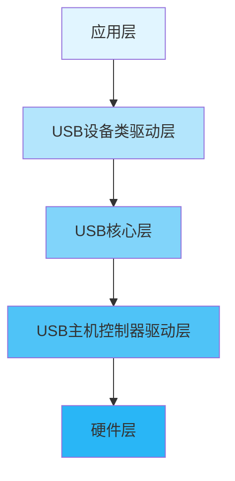
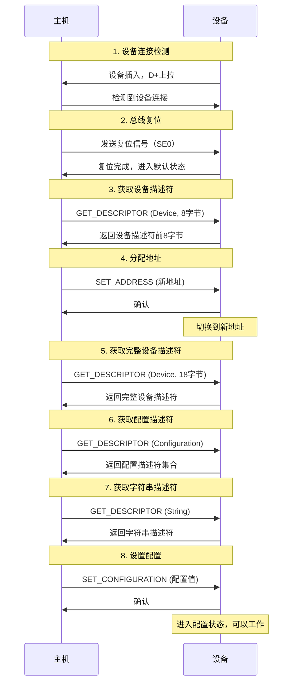

# USB驱动开发基础

## 概述

USB（Universal Serial Bus，通用串行总线）是现代电子设备中最常用的通信接口之一。从鼠标键盘到移动硬盘，从手机充电到数据传输，USB无处不在。对于嵌入式开发者来说，掌握USB驱动开发是一项重要技能。

本文将系统介绍USB驱动开发的基础知识，包括USB协议栈架构、端点配置、描述符定义、枚举过程和常见的USB设备类。通过本文学习，你将建立起USB驱动开发的完整知识框架。

完成本文学习后，你将能够：

- 理解USB协议栈的层次结构
- 掌握USB端点的概念和配置方法
- 了解USB描述符的作用和格式
- 理解USB设备枚举的完整过程
- 认识常见的USB设备类及其特点
- 为实际USB驱动开发做好准备

## 背景知识

### USB发展历史

USB技术自1996年推出以来，经历了多个版本的演进：

| 版本 | 发布年份 | 最大速率 | 特点 |
|------|---------|---------|------|
| USB 1.0 | 1996 | 1.5 Mbps | 低速模式 |
| USB 1.1 | 1998 | 12 Mbps | 全速模式，广泛应用 |
| USB 2.0 | 2000 | 480 Mbps | 高速模式，向下兼容 |
| USB 3.0 | 2008 | 5 Gbps | 超高速模式，蓝色接口 |
| USB 3.1 | 2013 | 10 Gbps | 增强型超高速 |
| USB 3.2 | 2017 | 20 Gbps | 双通道超高速 |
| USB 4.0 | 2019 | 40 Gbps | 基于Thunderbolt 3 |

**嵌入式系统常用版本**：
- USB 1.1（全速）：低成本MCU，如STM32F1系列
- USB 2.0（高速）：主流MCU，如STM32F4/F7系列


### USB拓扑结构

USB采用主从架构，由主机（Host）控制所有通信。

```
USB拓扑结构：

主机控制器（Host Controller）
    |
    +-- 根集线器（Root Hub）
         |
         +-- 设备1（Device）
         |
         +-- 集线器（Hub）
         |    |
         |    +-- 设备2
         |    +-- 设备3
         |
         +-- 设备4

特点：
- 星型拓扑结构
- 最多127个设备
- 最多5层集线器
- 主机发起所有传输
```

**USB角色**：

1. **主机（Host）**：
   - 控制总线访问
   - 管理设备枚举
   - 分配带宽
   - 提供电源（最大500mA）

2. **设备（Device）**：
   - 响应主机请求
   - 提供功能服务
   - 不能主动发起通信

3. **OTG设备（On-The-Go）**：
   - 可以作为主机或设备
   - 支持角色切换
   - 常见于手机、平板

## 核心内容

### USB协议栈架构

USB协议栈采用分层设计，每层负责不同的功能。




**各层功能**：

1. **硬件层（Physical Layer）**：
   - USB收发器（Transceiver）
   - 差分信号传输（D+/D-）
   - 电气特性和时序

2. **主机控制器驱动层（Host Controller Driver）**：
   - 控制USB硬件
   - 管理端点和传输
   - 处理中断和DMA

3. **USB核心层（USB Core）**：
   - 设备枚举
   - 配置管理
   - 传输调度
   - 错误处理

4. **USB设备类驱动层（Class Driver）**：
   - HID类（人机接口设备）
   - MSC类（大容量存储）
   - CDC类（通信设备）
   - Audio类（音频设备）
   - Video类（视频设备）

5. **应用层（Application Layer）**：
   - 用户应用程序
   - 业务逻辑处理


### USB端点（Endpoint）

端点是USB设备中数据传输的逻辑单元，是主机与设备通信的接口。

**端点基本概念**：

```
端点结构：

设备
├── 端点0（EP0）- 控制端点（必须）
│   ├── EP0 OUT（接收）
│   └── EP0 IN（发送）
├── 端点1（EP1）- 数据端点
│   ├── EP1 OUT
│   └── EP1 IN
├── 端点2（EP2）
└── ...

特点：
- 每个设备最多16个IN端点 + 16个OUT端点
- 端点0必须是控制端点
- 每个端点有唯一的地址
- 端点地址 = 端点号 + 方向位
```

**端点类型**：

| 类型 | 特点 | 应用场景 | 最大包大小 |
|------|------|---------|-----------|
| 控制传输 | 可靠、有确认 | 设备配置、命令控制 | 8/16/32/64字节 |
| 批量传输 | 可靠、大数据量 | 文件传输、打印 | 8/16/32/64字节（全速）<br>512字节（高速） |
| 中断传输 | 低延迟、周期性 | 鼠标、键盘 | 最大64字节（全速）<br>最大1024字节（高速） |
| 等时传输 | 实时、无重传 | 音频、视频 | 最大1023字节（全速）<br>最大1024字节（高速） |

**端点地址编码**：

```
端点地址格式（8位）：

Bit 7: 方向位
       0 = OUT（主机到设备）
       1 = IN（设备到主机）
Bit 6-4: 保留（0）
Bit 3-0: 端点号（0-15）

示例：
0x00 = EP0 OUT
0x80 = EP0 IN
0x01 = EP1 OUT
0x81 = EP1 IN
0x82 = EP2 IN
```


### USB描述符（Descriptor）

描述符是USB设备向主机报告自身信息的数据结构，主机通过读取描述符了解设备的功能和配置。

**描述符层次结构**：

```
设备描述符（Device Descriptor）
    |
    +-- 配置描述符（Configuration Descriptor）
         |
         +-- 接口描述符（Interface Descriptor）
         |    |
         |    +-- 端点描述符（Endpoint Descriptor）
         |    +-- 端点描述符
         |
         +-- 接口描述符
              |
              +-- 端点描述符
              +-- 端点描述符

其他描述符：
- 字符串描述符（String Descriptor）
- 设备限定描述符（Device Qualifier Descriptor）
- 其他速度配置描述符（Other Speed Configuration）
```

**1. 设备描述符（Device Descriptor）**：

设备描述符是USB设备的根描述符，包含设备的基本信息。

```c
// 设备描述符结构（18字节）
typedef struct {
    uint8_t  bLength;            // 描述符长度（18字节）
    uint8_t  bDescriptorType;    // 描述符类型（0x01）
    uint16_t bcdUSB;             // USB规范版本号（BCD码）
    uint8_t  bDeviceClass;       // 设备类代码
    uint8_t  bDeviceSubClass;    // 设备子类代码
    uint8_t  bDeviceProtocol;    // 设备协议代码
    uint8_t  bMaxPacketSize0;    // 端点0最大包大小
    uint16_t idVendor;           // 厂商ID（VID）
    uint16_t idProduct;          // 产品ID（PID）
    uint16_t bcdDevice;          // 设备版本号
    uint8_t  iManufacturer;      // 厂商字符串索引
    uint8_t  iProduct;           // 产品字符串索引
    uint8_t  iSerialNumber;      // 序列号字符串索引
    uint8_t  bNumConfigurations; // 配置数量
} USB_DeviceDescriptor_t;

// 示例：USB虚拟串口设备描述符
const uint8_t USB_DeviceDescriptor[] = {
    0x12,        // bLength
    0x01,        // bDescriptorType (Device)
    0x00, 0x02,  // bcdUSB (USB 2.0)
    0x02,        // bDeviceClass (CDC)
    0x00,        // bDeviceSubClass
    0x00,        // bDeviceProtocol
    0x40,        // bMaxPacketSize0 (64字节)
    0x83, 0x04,  // idVendor (0x0483 - STMicroelectronics)
    0x40, 0x57,  // idProduct (0x5740)
    0x00, 0x02,  // bcdDevice (2.00)
    0x01,        // iManufacturer (字符串索引1)
    0x02,        // iProduct (字符串索引2)
    0x03,        // iSerialNumber (字符串索引3)
    0x01         // bNumConfigurations (1个配置)
};
```


**2. 配置描述符（Configuration Descriptor）**：

配置描述符定义设备的一种工作配置，包含接口和端点信息。

```c
// 配置描述符结构（9字节）
typedef struct {
    uint8_t  bLength;             // 描述符长度（9字节）
    uint8_t  bDescriptorType;     // 描述符类型（0x02）
    uint16_t wTotalLength;        // 配置描述符总长度
    uint8_t  bNumInterfaces;      // 接口数量
    uint8_t  bConfigurationValue; // 配置值
    uint8_t  iConfiguration;      // 配置字符串索引
    uint8_t  bmAttributes;        // 配置特性
    uint8_t  bMaxPower;           // 最大功耗（2mA单位）
} USB_ConfigDescriptor_t;

// bmAttributes位定义
#define USB_CONFIG_SELF_POWERED  (1 << 6)  // 自供电
#define USB_CONFIG_REMOTE_WAKEUP (1 << 5)  // 远程唤醒
#define USB_CONFIG_BUS_POWERED   (1 << 7)  // 总线供电（必须为1）
```

**3. 接口描述符（Interface Descriptor）**：

接口描述符定义设备的一个功能接口。

```c
// 接口描述符结构（9字节）
typedef struct {
    uint8_t bLength;            // 描述符长度（9字节）
    uint8_t bDescriptorType;    // 描述符类型（0x04）
    uint8_t bInterfaceNumber;   // 接口编号
    uint8_t bAlternateSetting;  // 备用设置编号
    uint8_t bNumEndpoints;      // 端点数量（不包括EP0）
    uint8_t bInterfaceClass;    // 接口类代码
    uint8_t bInterfaceSubClass; // 接口子类代码
    uint8_t bInterfaceProtocol; // 接口协议代码
    uint8_t iInterface;         // 接口字符串索引
} USB_InterfaceDescriptor_t;
```

**4. 端点描述符（Endpoint Descriptor）**：

端点描述符定义端点的属性和参数。

```c
// 端点描述符结构（7字节）
typedef struct {
    uint8_t  bLength;          // 描述符长度（7字节）
    uint8_t  bDescriptorType;  // 描述符类型（0x05）
    uint8_t  bEndpointAddress; // 端点地址
    uint8_t  bmAttributes;     // 端点属性
    uint16_t wMaxPacketSize;   // 最大包大小
    uint8_t  bInterval;        // 轮询间隔
} USB_EndpointDescriptor_t;

// bmAttributes位定义
#define USB_EP_TYPE_CONTROL     0x00  // 控制传输
#define USB_EP_TYPE_ISOCHRONOUS 0x01  // 等时传输
#define USB_EP_TYPE_BULK        0x02  // 批量传输
#define USB_EP_TYPE_INTERRUPT   0x03  // 中断传输
```


**5. 字符串描述符（String Descriptor）**：

字符串描述符提供人类可读的设备信息。

```c
// 字符串描述符结构
typedef struct {
    uint8_t bLength;         // 描述符长度
    uint8_t bDescriptorType; // 描述符类型（0x03）
    uint16_t wString[];      // Unicode字符串
} USB_StringDescriptor_t;

// 语言ID描述符（字符串索引0）
const uint8_t USB_StringLangID[] = {
    0x04,        // bLength
    0x03,        // bDescriptorType
    0x09, 0x04   // wLANGID (0x0409 = 美国英语)
};

// 厂商字符串（字符串索引1）
const uint8_t USB_StringManufacturer[] = {
    0x1A,        // bLength (26字节)
    0x03,        // bDescriptorType
    'S', 0, 'T', 0, 'M', 0, 'i', 0, 'c', 0, 'r', 0, 'o', 0,
    'e', 0, 'l', 0, 'e', 0, 'c', 0, 't', 0
};
```

### USB枚举过程

USB设备插入主机后，需要经过枚举过程才能正常工作。枚举是主机识别和配置设备的过程。

**枚举流程**：




**枚举详细步骤**：

**步骤1：设备连接检测**

```
设备插入时：
1. 设备通过上拉电阻将D+（全速/高速）或D-（低速）拉高
2. 主机检测到电平变化，识别设备速度
3. 主机等待设备稳定（至少100ms）

速度识别：
- 低速（1.5 Mbps）：D-上拉
- 全速（12 Mbps）：D+上拉
- 高速（480 Mbps）：先D+上拉，然后通过握手协商
```

**步骤2：总线复位**

```
复位过程：
1. 主机将D+和D-都拉低（SE0状态）
2. 保持至少10ms
3. 设备检测到复位信号
4. 设备复位内部状态，地址设为0
5. 设备进入默认状态（Default State）
```

**步骤3：获取设备描述符**

```
第一次获取：
- 主机只请求前8字节
- 目的是获取bMaxPacketSize0（端点0最大包大小）
- 设备地址仍为0

为什么只请求8字节？
- 此时主机不知道端点0的最大包大小
- 8字节是所有USB设备都支持的最小值
- 获取bMaxPacketSize0后，主机可以正确通信
```

**步骤4：分配地址**

```
地址分配：
1. 主机发送SET_ADDRESS命令
2. 设备返回确认（ACK）
3. 设备在确认后切换到新地址
4. 地址范围：1-127（0是默认地址）

注意：
- 设备必须在返回ACK后才能切换地址
- 切换地址后，后续通信使用新地址
```

**步骤5-7：获取描述符**

```
主机依次获取：
1. 完整的设备描述符（18字节）
2. 配置描述符集合（包括接口、端点描述符）
3. 字符串描述符（厂商、产品、序列号等）

主机根据描述符信息：
- 识别设备类型
- 加载对应的类驱动
- 了解设备功能和配置
```

**步骤8：设置配置**

```
配置设置：
1. 主机选择一个配置（通常是配置1）
2. 发送SET_CONFIGURATION命令
3. 设备激活该配置
4. 设备进入配置状态（Configured State）
5. 设备可以正常工作

状态转换：
Default -> Address -> Configured
```


### USB标准请求

USB设备必须响应主机发送的标准请求，这些请求用于设备配置和管理。

**请求格式（Setup包）**：

```c
// USB标准请求结构（8字节）
typedef struct {
    uint8_t  bmRequestType;  // 请求类型和方向
    uint8_t  bRequest;       // 请求代码
    uint16_t wValue;         // 请求参数
    uint16_t wIndex;         // 索引或偏移
    uint16_t wLength;        // 数据长度
} USB_SetupPacket_t;

// bmRequestType位定义
// Bit 7: 方向（0=主机到设备，1=设备到主机）
// Bit 6-5: 类型（0=标准，1=类，2=厂商）
// Bit 4-0: 接收者（0=设备，1=接口，2=端点，3=其他）
```

**常用标准请求**：

| 请求代码 | 名称 | 功能 | wValue | wIndex |
|---------|------|------|--------|--------|
| 0x00 | GET_STATUS | 获取状态 | 0 | 设备/接口/端点 |
| 0x01 | CLEAR_FEATURE | 清除特性 | 特性选择器 | 设备/接口/端点 |
| 0x03 | SET_FEATURE | 设置特性 | 特性选择器 | 设备/接口/端点 |
| 0x05 | SET_ADDRESS | 设置地址 | 设备地址 | 0 |
| 0x06 | GET_DESCRIPTOR | 获取描述符 | 描述符类型和索引 | 语言ID |
| 0x07 | SET_DESCRIPTOR | 设置描述符 | 描述符类型和索引 | 语言ID |
| 0x08 | GET_CONFIGURATION | 获取配置 | 0 | 0 |
| 0x09 | SET_CONFIGURATION | 设置配置 | 配置值 | 0 |
| 0x0A | GET_INTERFACE | 获取接口 | 0 | 接口号 |
| 0x0B | SET_INTERFACE | 设置接口 | 备用设置 | 接口号 |

**请求处理示例**：

```c
/**
 * @brief  处理USB标准请求
 * @param  setup: Setup包指针
 * @retval 无
 */
void USB_HandleStandardRequest(USB_SetupPacket_t *setup) {
    switch (setup->bRequest) {
        case 0x06:  // GET_DESCRIPTOR
            USB_GetDescriptor(setup);
            break;
            
        case 0x05:  // SET_ADDRESS
            USB_SetAddress(setup->wValue & 0x7F);
            break;
            
        case 0x09:  // SET_CONFIGURATION
            USB_SetConfiguration(setup->wValue & 0xFF);
            break;
            
        case 0x00:  // GET_STATUS
            USB_GetStatus(setup);
            break;
            
        default:
            // 不支持的请求，返回STALL
            USB_EP0_Stall();
            break;
    }
}
```


### USB设备类（Device Class）

USB设备类定义了特定类型设备的标准接口和协议，使得主机可以使用通用驱动程序。

**常见USB设备类**：

| 类代码 | 类名称 | 全称 | 应用 |
|-------|--------|------|------|
| 0x00 | - | 在接口描述符中定义 | - |
| 0x01 | Audio | 音频设备类 | 麦克风、扬声器、声卡 |
| 0x02 | CDC | 通信设备类 | 虚拟串口、调制解调器 |
| 0x03 | HID | 人机接口设备类 | 鼠标、键盘、游戏手柄 |
| 0x05 | Physical | 物理设备类 | 力反馈设备 |
| 0x06 | Image | 图像设备类 | 扫描仪、相机 |
| 0x07 | Printer | 打印机类 | 打印机 |
| 0x08 | MSC | 大容量存储类 | U盘、移动硬盘、读卡器 |
| 0x09 | Hub | 集线器类 | USB集线器 |
| 0x0A | CDC-Data | CDC数据类 | CDC数据接口 |
| 0x0B | Smart Card | 智能卡类 | 智能卡读卡器 |
| 0x0E | Video | 视频设备类 | 摄像头、视频采集卡 |
| 0x0F | Personal Healthcare | 个人医疗设备类 | 血压计、血糖仪 |
| 0xDC | Diagnostic | 诊断设备类 | 调试接口 |
| 0xE0 | Wireless | 无线控制器类 | 蓝牙适配器 |
| 0xEF | Miscellaneous | 杂项设备类 | 多功能设备 |
| 0xFE | Application Specific | 应用特定类 | 固件升级 |
| 0xFF | Vendor Specific | 厂商自定义类 | 自定义设备 |

**1. HID类（Human Interface Device）**：

HID类是最常用的USB设备类之一，用于人机交互设备。

```
HID类特点：
- 无需安装驱动（操作系统内置）
- 支持热插拔
- 低延迟
- 适合小数据量传输

HID设备示例：
- 鼠标、键盘
- 游戏手柄、方向盘
- 触摸屏、数位板
- 自定义控制器

HID报告：
- 输入报告（Input Report）：设备到主机
- 输出报告（Output Report）：主机到设备
- 特性报告（Feature Report）：双向配置数据
```

**2. CDC类（Communication Device Class）**：

CDC类用于通信设备，最常见的应用是USB虚拟串口。

```
CDC类特点：
- 模拟传统串口
- 支持流控制
- 支持多种通信协议

CDC-ACM（Abstract Control Model）：
- 最常用的CDC子类
- 实现虚拟串口功能
- 需要两个接口：
  * 控制接口（通知接口）
  * 数据接口（数据传输）

应用场景：
- USB转串口适配器
- 单片机调试接口
- 设备配置接口
```


**3. MSC类（Mass Storage Class）**：

MSC类用于大容量存储设备，如U盘、移动硬盘。

```
MSC类特点：
- 使用SCSI命令集
- 支持多种传输协议
- 大数据量传输

传输协议：
- Bulk-Only Transport（BOT）：最常用
- Control/Bulk/Interrupt（CBI）：已过时

SCSI命令：
- READ(10)：读取数据
- WRITE(10)：写入数据
- INQUIRY：查询设备信息
- TEST_UNIT_READY：测试设备就绪
- REQUEST_SENSE：请求错误信息

应用场景：
- U盘、移动硬盘
- SD卡读卡器
- 虚拟光驱
```

**4. Audio类和Video类**：

```
Audio类：
- 用于音频设备
- 支持多种音频格式
- 等时传输保证实时性
- 应用：麦克风、扬声器、声卡

Video类（UVC）：
- 用于视频设备
- 支持多种视频格式
- 等时传输保证实时性
- 应用：摄像头、视频采集卡
```

### USB传输类型详解

USB支持四种传输类型，每种类型适用于不同的应用场景。

**传输类型对比**：

```
控制传输（Control Transfer）：
- 用途：设备配置和命令
- 可靠性：有错误检测和重传
- 带宽：保证带宽
- 延迟：不保证
- 端点：端点0（必须）
- 包大小：8/16/32/64字节

批量传输（Bulk Transfer）：
- 用途：大数据量传输
- 可靠性：有错误检测和重传
- 带宽：使用剩余带宽
- 延迟：不保证
- 端点：IN/OUT端点
- 包大小：8/16/32/64字节（全速）
           512字节（高速）

中断传输（Interrupt Transfer）：
- 用途：小数据量、低延迟
- 可靠性：有错误检测和重传
- 带宽：保证带宽
- 延迟：保证最大延迟
- 端点：IN/OUT端点
- 包大小：最大64字节（全速）
           最大1024字节（高速）

等时传输（Isochronous Transfer）：
- 用途：实时音视频
- 可靠性：无错误检测和重传
- 带宽：保证带宽
- 延迟：保证延迟
- 端点：IN/OUT端点
- 包大小：最大1023字节（全速）
           最大1024字节（高速）
```


## 深入理解

### USB电气特性

USB使用差分信号传输，具有良好的抗干扰能力。

**信号定义**：

```
USB信号线：
- D+（Data Plus）：数据正
- D-（Data Minus）：数据负
- VBUS：电源（+5V）
- GND：地线

差分信号状态：
- J状态：D+ > D-（全速/高速）或 D- > D+（低速）
- K状态：D+ < D-（全速/高速）或 D- < D+（低速）
- SE0（Single Ended Zero）：D+ = D- = 0（复位、断开）
- SE1（Single Ended One）：D+ = D- = 1（非法状态）

电平标准：
- 低速/全速：
  * 低电平：0V - 0.3V
  * 高电平：2.8V - 3.6V
- 高速：
  * 低电平：-10mV - 10mV
  * 高电平：360mV - 440mV
```

**上拉电阻**：

```
速度识别：
- 全速/高速设备：D+上拉1.5kΩ到3.3V
- 低速设备：D-上拉1.5kΩ到3.3V

主机端：
- D+和D-各有15kΩ下拉电阻到地

检测原理：
1. 设备未连接：D+和D-都被下拉到低电平
2. 设备连接：上拉电阻将对应信号线拉高
3. 主机检测到电平变化，识别设备速度
```

### USB功耗管理

USB设备的功耗管理对于便携式设备尤为重要。

**功耗规范**：

```
USB 2.0功耗限制：
- 单元负载（Unit Load）：100mA
- 低功耗设备：最大100mA（1个单元负载）
- 高功耗设备：最大500mA（5个单元负载）
- 挂起状态：最大2.5mA

USB 3.0功耗限制：
- 低功耗设备：最大150mA
- 高功耗设备：最大900mA
- 挂起状态：最大2.5mA

功耗声明：
- 在配置描述符的bMaxPower字段声明
- 单位：2mA
- 示例：bMaxPower = 250 表示500mA
```

**挂起和唤醒**：

```
挂起（Suspend）：
- 总线空闲超过3ms
- 设备进入低功耗模式
- 功耗降至2.5mA以下

远程唤醒（Remote Wakeup）：
- 设备可以唤醒主机
- 需要在配置描述符中声明支持
- 通过驱动K状态1-15ms实现

唤醒过程：
1. 设备检测到事件（如按键）
2. 设备驱动K状态
3. 主机检测到唤醒信号
4. 主机恢复总线
5. 设备恢复正常工作
```


### USB OTG（On-The-Go）

USB OTG允许设备在主机和设备角色之间切换。

**OTG特性**：

```
角色切换：
- 默认主机（A-Device）：提供VBUS电源
- 默认设备（B-Device）：不提供VBUS电源
- 可以通过HNP（主机协商协议）切换角色

OTG连接器：
- Micro-AB接口
- ID引脚用于角色识别
  * ID接地：A-Device（主机）
  * ID悬空：B-Device（设备）

应用场景：
- 手机连接U盘（手机作为主机）
- 手机连接电脑（手机作为设备）
- 两个手机直接连接传输文件
```

**OTG协议**：

```
SRP（会话请求协议）：
- B-Device请求A-Device提供电源
- 用于节省功耗

HNP（主机协商协议）：
- 在A-Device和B-Device之间切换主机角色
- 允许B-Device临时成为主机

ADP（附件检测协议）：
- 检测连接的设备类型
- 节省功耗
```

### USB调试技巧

**1. 使用USB分析仪**：

```
硬件分析仪：
- 捕获USB总线数据
- 分析协议细节
- 定位通信问题

软件分析工具：
- Wireshark + USBPcap（Windows）
- usbmon（Linux）
- 可以捕获USB通信数据包
```

**2. 常见问题排查**：

```
设备无法枚举：
- 检查D+/D-连接
- 检查上拉电阻
- 检查描述符格式
- 检查端点0响应

数据传输错误：
- 检查端点配置
- 检查缓冲区大小
- 检查DMA配置
- 检查中断处理

设备频繁断开：
- 检查电源供应
- 检查信号质量
- 检查线缆长度
- 检查EMI干扰
```

**3. 调试输出**：

```c
/**
 * @brief  USB调试输出宏
 */
#ifdef USB_DEBUG
    #define USB_DEBUG_PRINT(fmt, ...) \
        printf("[USB] " fmt "\r\n", ##__VA_ARGS__)
#else
    #define USB_DEBUG_PRINT(fmt, ...)
#endif

// 使用示例
USB_DEBUG_PRINT("Device enumerated, address=%d", device_address);
USB_DEBUG_PRINT("EP%d IN: sent %d bytes", ep_num, length);
```


## 实践示例

### 示例1：简单的USB设备描述符

下面是一个完整的USB虚拟串口（CDC-ACM）设备的描述符集合。

```c
// 设备描述符
const uint8_t USB_DeviceDescriptor[] = {
    0x12,        // bLength
    0x01,        // bDescriptorType (Device)
    0x00, 0x02,  // bcdUSB (USB 2.0)
    0x02,        // bDeviceClass (CDC)
    0x00,        // bDeviceSubClass
    0x00,        // bDeviceProtocol
    0x40,        // bMaxPacketSize0 (64字节)
    0x83, 0x04,  // idVendor (0x0483)
    0x40, 0x57,  // idProduct (0x5740)
    0x00, 0x02,  // bcdDevice (2.00)
    0x01,        // iManufacturer
    0x02,        // iProduct
    0x03,        // iSerialNumber
    0x01         // bNumConfigurations
};

// 配置描述符集合
const uint8_t USB_ConfigDescriptor[] = {
    // 配置描述符
    0x09,        // bLength
    0x02,        // bDescriptorType (Configuration)
    0x43, 0x00,  // wTotalLength (67字节)
    0x02,        // bNumInterfaces (2个接口)
    0x01,        // bConfigurationValue
    0x00,        // iConfiguration
    0xC0,        // bmAttributes (自供电)
    0x32,        // bMaxPower (100mA)
    
    // 接口0：CDC控制接口
    0x09,        // bLength
    0x04,        // bDescriptorType (Interface)
    0x00,        // bInterfaceNumber
    0x00,        // bAlternateSetting
    0x01,        // bNumEndpoints (1个端点)
    0x02,        // bInterfaceClass (CDC)
    0x02,        // bInterfaceSubClass (ACM)
    0x01,        // bInterfaceProtocol (AT命令)
    0x00,        // iInterface
    
    // CDC功能描述符（省略）
    // ...
    
    // 端点描述符：EP1 IN（中断端点）
    0x07,        // bLength
    0x05,        // bDescriptorType (Endpoint)
    0x81,        // bEndpointAddress (EP1 IN)
    0x03,        // bmAttributes (中断传输)
    0x08, 0x00,  // wMaxPacketSize (8字节)
    0x10,        // bInterval (16ms)
    
    // 接口1：CDC数据接口
    0x09,        // bLength
    0x04,        // bDescriptorType (Interface)
    0x01,        // bInterfaceNumber
    0x00,        // bAlternateSetting
    0x02,        // bNumEndpoints (2个端点)
    0x0A,        // bInterfaceClass (CDC-Data)
    0x00,        // bInterfaceSubClass
    0x00,        // bInterfaceProtocol
    0x00,        // iInterface
    
    // 端点描述符：EP2 OUT（批量端点）
    0x07,        // bLength
    0x05,        // bDescriptorType (Endpoint)
    0x02,        // bEndpointAddress (EP2 OUT)
    0x02,        // bmAttributes (批量传输)
    0x40, 0x00,  // wMaxPacketSize (64字节)
    0x00,        // bInterval
    
    // 端点描述符：EP2 IN（批量端点）
    0x07,        // bLength
    0x05,        // bDescriptorType (Endpoint)
    0x82,        // bEndpointAddress (EP2 IN)
    0x02,        // bmAttributes (批量传输)
    0x40, 0x00,  // wMaxPacketSize (64字节)
    0x00         // bInterval
};
```


### 示例2：USB状态机

USB设备需要维护状态机来管理设备状态。

```c
/**
 * @brief  USB设备状态
 */
typedef enum {
    USB_STATE_DEFAULT = 0,      // 默认状态
    USB_STATE_ADDRESSED,        // 已分配地址
    USB_STATE_CONFIGURED,       // 已配置
    USB_STATE_SUSPENDED         // 挂起状态
} USB_DeviceState_t;

// 全局状态变量
USB_DeviceState_t g_usb_device_state = USB_STATE_DEFAULT;
uint8_t g_usb_device_address = 0;
uint8_t g_usb_configuration = 0;

/**
 * @brief  USB复位处理
 * @param  无
 * @retval 无
 */
void USB_Reset(void) {
    // 复位状态
    g_usb_device_state = USB_STATE_DEFAULT;
    g_usb_device_address = 0;
    g_usb_configuration = 0;
    
    // 复位端点
    USB_EP0_Init();
    
    USB_DEBUG_PRINT("USB Reset");
}

/**
 * @brief  设置USB地址
 * @param  address: 设备地址（1-127）
 * @retval 无
 */
void USB_SetAddress(uint8_t address) {
    if (address > 0 && address < 128) {
        g_usb_device_address = address;
        g_usb_device_state = USB_STATE_ADDRESSED;
        
        // 设置硬件地址（在状态阶段完成后）
        USB_HW_SetAddress(address);
        
        USB_DEBUG_PRINT("Address set to %d", address);
    }
}

/**
 * @brief  设置USB配置
 * @param  config: 配置值
 * @retval 无
 */
void USB_SetConfiguration(uint8_t config) {
    if (config == 0) {
        // 返回到地址状态
        g_usb_device_state = USB_STATE_ADDRESSED;
        g_usb_configuration = 0;
        
        // 禁用非控制端点
        USB_DisableDataEndpoints();
        
    } else if (config == 1) {
        // 进入配置状态
        g_usb_device_state = USB_STATE_CONFIGURED;
        g_usb_configuration = config;
        
        // 使能数据端点
        USB_EnableDataEndpoints();
        
        USB_DEBUG_PRINT("Configuration set to %d", config);
    }
}

/**
 * @brief  USB挂起处理
 * @param  无
 * @retval 无
 */
void USB_Suspend(void) {
    g_usb_device_state = USB_STATE_SUSPENDED;
    
    // 进入低功耗模式
    USB_EnterLowPowerMode();
    
    USB_DEBUG_PRINT("USB Suspended");
}

/**
 * @brief  USB恢复处理
 * @param  无
 * @retval 无
 */
void USB_Resume(void) {
    // 恢复到之前的状态
    if (g_usb_configuration > 0) {
        g_usb_device_state = USB_STATE_CONFIGURED;
    } else if (g_usb_device_address > 0) {
        g_usb_device_state = USB_STATE_ADDRESSED;
    } else {
        g_usb_device_state = USB_STATE_DEFAULT;
    }
    
    // 退出低功耗模式
    USB_ExitLowPowerMode();
    
    USB_DEBUG_PRINT("USB Resumed");
}
```


### 示例3：端点数据传输

```c
/**
 * @brief  端点缓冲区
 */
#define EP_BUFFER_SIZE 64

uint8_t ep1_in_buffer[EP_BUFFER_SIZE];
uint8_t ep2_out_buffer[EP_BUFFER_SIZE];
uint8_t ep2_in_buffer[EP_BUFFER_SIZE];

/**
 * @brief  端点1 IN发送数据（中断端点）
 * @param  data: 数据指针
 * @param  length: 数据长度
 * @retval 0=成功，1=失败
 */
uint8_t USB_EP1_IN_Send(const uint8_t *data, uint16_t length) {
    if (length > EP_BUFFER_SIZE) {
        return 1;  // 数据太长
    }
    
    // 检查端点是否空闲
    if (USB_EP_IsBusy(0x81)) {
        return 1;  // 端点忙
    }
    
    // 复制数据到缓冲区
    memcpy(ep1_in_buffer, data, length);
    
    // 启动传输
    USB_EP_Transmit(0x81, ep1_in_buffer, length);
    
    return 0;
}

/**
 * @brief  端点2 OUT接收数据（批量端点）
 * @param  无
 * @retval 无
 */
void USB_EP2_OUT_Receive(void) {
    // 准备接收
    USB_EP_PrepareReceive(0x02, ep2_out_buffer, EP_BUFFER_SIZE);
}

/**
 * @brief  端点2 OUT接收完成回调
 * @param  length: 接收到的数据长度
 * @retval 无
 */
void USB_EP2_OUT_ReceiveComplete(uint16_t length) {
    // 处理接收到的数据
    USB_DEBUG_PRINT("EP2 OUT received %d bytes", length);
    
    // 回显数据（发送到EP2 IN）
    USB_EP2_IN_Send(ep2_out_buffer, length);
    
    // 准备下一次接收
    USB_EP2_OUT_Receive();
}

/**
 * @brief  端点2 IN发送数据（批量端点）
 * @param  data: 数据指针
 * @param  length: 数据长度
 * @retval 0=成功，1=失败
 */
uint8_t USB_EP2_IN_Send(const uint8_t *data, uint16_t length) {
    if (length > EP_BUFFER_SIZE) {
        return 1;
    }
    
    if (USB_EP_IsBusy(0x82)) {
        return 1;
    }
    
    memcpy(ep2_in_buffer, data, length);
    USB_EP_Transmit(0x82, ep2_in_buffer, length);
    
    return 0;
}

/**
 * @brief  端点2 IN发送完成回调
 * @param  无
 * @retval 无
 */
void USB_EP2_IN_TransmitComplete(void) {
    USB_DEBUG_PRINT("EP2 IN transmit complete");
}
```

## 常见问题

### Q1: USB设备无法被主机识别怎么办？

A: 按以下步骤排查：

1. **检查硬件连接**：
   - 确认D+、D-、VBUS、GND连接正确
   - 检查上拉电阻是否正确（D+上拉1.5kΩ）
   - 使用万用表测量VBUS电压（应为5V）

2. **检查描述符**：
   - 确认设备描述符格式正确
   - 检查VID/PID是否有效
   - 验证描述符长度字段

3. **检查端点0响应**：
   - 确保端点0能正确响应Setup包
   - 检查GET_DESCRIPTOR请求处理
   - 验证SET_ADDRESS命令执行

4. **使用USB分析工具**：
   - 捕获枚举过程数据包
   - 查看主机发送的请求
   - 检查设备的响应


### Q2: USB传输速度慢怎么优化？

A: 优化建议：

1. **使用批量传输**：
   - 批量传输适合大数据量
   - 使用最大包大小（64字节全速，512字节高速）

2. **使用DMA传输**：
   - 减少CPU占用
   - 提高传输效率

3. **优化缓冲区**：
   - 使用双缓冲或多缓冲
   - 避免频繁的小包传输

4. **减少中断处理时间**：
   - 中断中只做必要处理
   - 耗时操作放到主循环

### Q3: 如何选择合适的USB设备类？

A: 选择建议：

1. **HID类**：
   - 优点：无需驱动，开发简单
   - 缺点：速度较慢，数据量有限
   - 适用：控制器、传感器、简单数据传输

2. **CDC类**：
   - 优点：模拟串口，易于使用
   - 缺点：需要驱动（Windows需要inf文件）
   - 适用：调试接口、配置接口

3. **MSC类**：
   - 优点：标准存储接口，兼容性好
   - 缺点：实现复杂，需要文件系统
   - 适用：数据存储、固件升级

4. **自定义类**：
   - 优点：灵活，可定制
   - 缺点：需要自己编写驱动
   - 适用：特殊需求，高性能应用

### Q4: USB设备频繁断开重连怎么办？

A: 排查方法：

1. **电源问题**：
   - 检查供电是否稳定
   - 测量VBUS电压波动
   - 增加滤波电容

2. **信号质量**：
   - 检查线缆质量和长度
   - 检查PCB走线
   - 添加共模电感

3. **软件问题**：
   - 检查中断处理
   - 检查状态机逻辑
   - 检查超时处理

4. **EMI干扰**：
   - 检查周围干扰源
   - 改善PCB布局
   - 添加屏蔽措施

### Q5: 如何实现USB固件升级？

A: 实现方法：

1. **使用DFU类**：
   - USB设备固件升级类
   - 标准协议，工具支持好
   - 需要Bootloader支持

2. **使用自定义协议**：
   - 通过HID或CDC传输固件
   - 在Bootloader中实现升级逻辑
   - 需要上位机软件配合

3. **双区升级**：
   - 使用两个固件区
   - 升级时写入备用区
   - 升级完成后切换

## 总结

本文系统介绍了USB驱动开发的基础知识，主要内容包括：

- USB协议栈采用分层架构，从硬件层到应用层各司其职
- USB端点是数据传输的逻辑单元，支持四种传输类型
- USB描述符定义了设备的属性和配置信息
- USB枚举是主机识别和配置设备的过程
- USB设备类提供了标准化的接口和协议
- USB支持多种传输类型，适应不同应用场景

掌握这些基础知识后，你可以：
- 理解USB设备的工作原理
- 设计合理的USB设备架构
- 选择合适的USB设备类
- 为实际USB驱动开发做好准备

## 延伸阅读

推荐进一步学习的资源：

- [USB 2.0规范](https://www.usb.org/document-library/usb-20-specification) - USB官方规范文档
- [USB设备类规范](https://www.usb.org/documents) - 各种USB设备类的详细规范
- [STM32 USB开发指南](https://www.st.com/resource/en/application_note/dm00296349.pdf) - STM32 USB应用笔记
- USB驱动实战教程 - 后续教程将介绍具体的USB驱动开发

## 参考资料

1. USB 2.0 Specification - USB Implementers Forum
2. USB Device Class Specifications - USB-IF
3. STM32 USB Device Library - STMicroelectronics
4. USB Complete: The Developer's Guide - Jan Axelson
5. USB in a NutShell - Beyond Logic

---

**练习题**：

1. 解释USB端点地址0x82代表什么？
2. 列举USB四种传输类型的特点和应用场景
3. 描述USB设备枚举的主要步骤
4. 说明HID类和CDC类的区别和适用场景
5. 如何通过上拉电阻识别USB设备速度？

**下一步**：建议学习 [USB HID设备开发实战](link) 或 [USB CDC虚拟串口实现](link)
