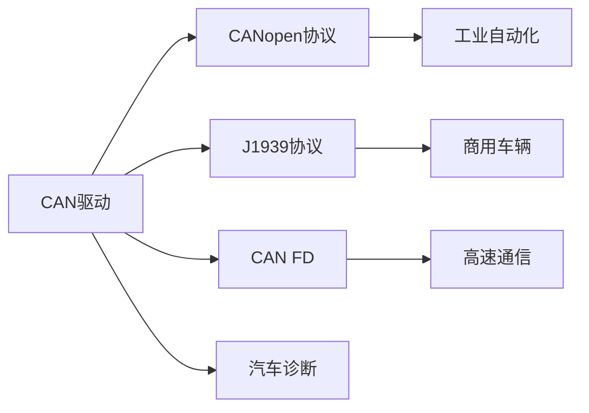

# CAN总线驱动开发实战

## 概述

CAN（Controller Area Network，控制器局域网）是一种广泛应用于汽车电子和工业控制领域的串行通信总线。CAN总线具有高可靠性、实时性强、抗干扰能力好等特点，是现代汽车电子系统的核心通信网络。

本教程将深入讲解CAN总线的工作原理和驱动开发方法，通过实战项目带你掌握CAN在嵌入式系统中的应用。

完成本教程后，你将能够：

- 理解CAN总线的工作原理和协议规范
- 掌握CAN控制器的配置方法
- 实现CAN报文的发送和接收
- 配置和使用CAN过滤器
- 处理CAN总线错误和异常
- 实现CAN总线监控和诊断

## 背景知识

### CAN总线基础

CAN总线是一种多主机的串行通信总线，采用差分信号传输，支持多节点通信。

**CAN总线特点**：

```
优点：
- 实时性强：最高速率1Mbps
- 可靠性高：CRC校验、错误检测
- 抗干扰：差分信号传输
- 多主机：无主从之分
- 灵活性：支持广播和点对点

应用场景：
- 汽车电子：发动机控制、车身控制
- 工业控制：PLC、传感器网络
- 医疗设备：监护仪、诊断设备
- 航空航天：飞行控制系统
```

**CAN总线拓扑**：

```
终端电阻(120Ω)                    终端电阻(120Ω)
    |                                    |
    |----[节点1]----[节点2]----[节点3]----|
         CAN_H ━━━━━━━━━━━━━━━━━━━━━━━━━
         CAN_L ━━━━━━━━━━━━━━━━━━━━━━━━━
         
注意：
- 总线两端需要120Ω终端电阻
- 最大总线长度取决于波特率
- 节点数量最多110个
```


### CAN报文格式

CAN协议定义了两种报文格式：标准帧和扩展帧。

**标准帧格式（CAN 2.0A）**：

```
|SOF|  ID(11位)  |RTR|IDE|r0| DLC(4位) |  数据(0-8字节)  |  CRC(15位)  |ACK|EOF|
| 1 |    11      | 1 | 1 | 1 |    4     |      0-64       |     16      | 2 | 7 |

字段说明：
- SOF: 帧起始位（Start Of Frame）
- ID: 标识符，决定优先级（越小优先级越高）
- RTR: 远程传输请求位
- IDE: 标识符扩展位（0=标准帧，1=扩展帧）
- r0: 保留位
- DLC: 数据长度代码（0-8字节）
- CRC: 循环冗余校验
- ACK: 应答位
- EOF: 帧结束位
```

**扩展帧格式（CAN 2.0B）**：

```
|SOF|  ID(11位)  |SRR|IDE|  ID(18位)  |RTR|r1|r0| DLC |  数据  | CRC |ACK|EOF|
| 1 |    11      | 1 | 1 |    18      | 1 | 1| 1|  4  |  0-64  | 16  | 2 | 7 |

扩展帧特点：
- 标识符29位（11位基本ID + 18位扩展ID）
- 兼容标准帧
- 提供更多的ID空间
```

### STM32 CAN控制器

STM32F4系列集成了bxCAN控制器（Basic Extended CAN），支持CAN 2.0A和2.0B协议。

**bxCAN架构**：

```
┌─────────────────────────────────────┐
│         bxCAN控制器                  │
├─────────────────────────────────────┤
│  发送邮箱 (3个)                      │
│  ├─ 邮箱0 (最高优先级)               │
│  ├─ 邮箱1                            │
│  └─ 邮箱2 (最低优先级)               │
├─────────────────────────────────────┤
│  接收FIFO (2个)                      │
│  ├─ FIFO0 (3个报文深度)              │
│  └─ FIFO1 (3个报文深度)              │
├─────────────────────────────────────┤
│  过滤器组 (28个)                     │
│  ├─ 标识符列表模式                   │
│  └─ 标识符屏蔽模式                   │
└─────────────────────────────────────┘
```

**CAN控制器特性**：

| 特性 | 说明 |
|------|------|
| 波特率 | 最高1Mbps |
| 发送邮箱 | 3个，支持优先级 |
| 接收FIFO | 2个，各3个报文深度 |
| 过滤器 | 28个，可配置 |
| 时间戳 | 支持16位时间戳 |
| 自测试 | 支持环回模式 |


### CAN波特率计算

CAN波特率由位时序参数决定，需要根据系统时钟精确配置。

**位时序结构**：

```
一个位时间 = 同步段(SS) + 时间段1(BS1) + 时间段2(BS2)

|<────────────── 1 Bit Time ──────────────>|
|  SS  |<──── BS1 ────>|<──── BS2 ────>|
| 1TQ  |   1-16 TQ     |   1-8 TQ      |
        ↑采样点

TQ = 时间量子 = (BRP + 1) / APB1时钟
波特率 = APB1时钟 / [(BRP + 1) × (1 + BS1 + BS2)]
```

**常用波特率配置**（APB1 = 42MHz）：

| 波特率 | BRP | BS1 | BS2 | 采样点 |
|--------|-----|-----|-----|--------|
| 1Mbps  | 2   | 13  | 2   | 87.5%  |
| 500Kbps| 5   | 13  | 2   | 87.5%  |
| 250Kbps| 11  | 13  | 2   | 87.5%  |
| 125Kbps| 23  | 13  | 2   | 87.5%  |
| 100Kbps| 29  | 13  | 2   | 87.5%  |

## 环境准备

### 硬件要求

- STM32F4系列开发板（如STM32F407VET6）
- CAN收发器模块（如TJA1050、SN65HVD230）
- CAN总线终端电阻（120Ω × 2）
- USB转CAN分析仪（可选，用于调试）
- 示波器（可选，用于信号分析）

### 软件要求

- Keil MDK 5.x 或 STM32CubeIDE
- STM32F4 HAL库或标准外设库
- CAN总线分析软件（如CANoe、PCAN-View）

### 硬件连接

```
STM32F407开发板连接：

CAN1:
- PB8  (CAN1_RX) ---> CAN收发器 RXD
- PB9  (CAN1_TX) ---> CAN收发器 TXD

CAN2:
- PB12 (CAN2_RX) ---> CAN收发器 RXD
- PB13 (CAN2_TX) ---> CAN收发器 TXD

CAN收发器连接：
- CANH ---> CAN总线 H
- CANL ---> CAN总线 L
- VCC  ---> 5V或3.3V（根据收发器型号）
- GND  ---> GND

总线终端：
- 总线两端各接一个120Ω电阻（CANH到CANL）
```

**注意事项**：
- 确保CAN收发器供电正确
- 总线两端必须有终端电阻
- 检查CAN_H和CAN_L不要接反
- 总线长度和波特率要匹配


## 核心内容

### 步骤1：CAN基本配置

首先学习如何初始化和配置CAN控制器。

```c
#include "stm32f4xx.h"

/**
 * @brief  CAN配置结构体
 */
typedef struct {
    uint32_t prescaler;      // 预分频器 (1-1024)
    uint32_t mode;           // 工作模式
    uint32_t sjw;            // 重新同步跳跃宽度 (1-4)
    uint32_t bs1;            // 时间段1 (1-16)
    uint32_t bs2;            // 时间段2 (1-8)
    uint8_t  ttcm;           // 时间触发通信模式
    uint8_t  abom;           // 自动离线管理
    uint8_t  awum;           // 自动唤醒模式
    uint8_t  nart;           // 非自动重传
    uint8_t  rflm;           // 接收FIFO锁定模式
    uint8_t  txfp;           // 发送FIFO优先级
} CAN_Config_t;

/**
 * @brief  初始化CAN1 GPIO
 * @param  无
 * @retval 无
 */
void CAN1_GPIO_Init(void) {
    // 使能GPIOB时钟
    RCC->AHB1ENR |= RCC_AHB1ENR_GPIOBEN;
    
    // 配置PB8(RX)和PB9(TX)为复用功能
    GPIOB->MODER &= ~(GPIO_MODER_MODER8 | GPIO_MODER_MODER9);
    GPIOB->MODER |= (GPIO_MODER_MODER8_1 | GPIO_MODER_MODER9_1);
    
    // 配置为推挽输出，高速
    GPIOB->OTYPER &= ~(GPIO_OTYPER_OT_8 | GPIO_OTYPER_OT_9);
    GPIOB->OSPEEDR |= (GPIO_OSPEEDER_OSPEEDR8 | GPIO_OSPEEDER_OSPEEDR9);
    
    // 配置为上拉
    GPIOB->PUPDR &= ~(GPIO_PUPDR_PUPDR8 | GPIO_PUPDR_PUPDR9);
    GPIOB->PUPDR |= (GPIO_PUPDR_PUPDR8_0 | GPIO_PUPDR_PUPDR9_0);
    
    // 配置复用功能为CAN1 (AF9)
    GPIOB->AFR[1] &= ~(0xFF << 0);  // PB8和PB9在AFR[1]
    GPIOB->AFR[1] |= (9 << 0) | (9 << 4);
}

/**
 * @brief  初始化CAN1控制器
 * @param  config: CAN配置结构体指针
 * @retval 0=成功，1=失败
 */
uint8_t CAN1_Init(CAN_Config_t *config) {
    uint32_t timeout = 0;
    
    // 1. 使能CAN1时钟
    RCC->APB1ENR |= RCC_APB1ENR_CAN1EN;
    
    // 2. 请求进入初始化模式
    CAN1->MCR |= CAN_MCR_INRQ;
    
    // 等待进入初始化模式
    timeout = 0;
    while (!(CAN1->MSR & CAN_MSR_INAK)) {
        if (++timeout > 10000) {
            return 1;  // 超时
        }
    }
    
    // 3. 退出睡眠模式
    CAN1->MCR &= ~CAN_MCR_SLEEP;
    
    // 4. 配置CAN参数
    CAN1->MCR &= ~(CAN_MCR_TTCM | CAN_MCR_ABOM | CAN_MCR_AWUM |
                   CAN_MCR_NART | CAN_MCR_RFLM | CAN_MCR_TXFP);
    
    if (config->ttcm) CAN1->MCR |= CAN_MCR_TTCM;
    if (config->abom) CAN1->MCR |= CAN_MCR_ABOM;
    if (config->awum) CAN1->MCR |= CAN_MCR_AWUM;
    if (config->nart) CAN1->MCR |= CAN_MCR_NART;
    if (config->rflm) CAN1->MCR |= CAN_MCR_RFLM;
    if (config->txfp) CAN1->MCR |= CAN_MCR_TXFP;
    
    // 5. 配置位时序
    CAN1->BTR = 0;
    CAN1->BTR |= (config->mode << 30);                    // 工作模式
    CAN1->BTR |= ((config->sjw - 1) << 24);              // SJW
    CAN1->BTR |= ((config->bs1 - 1) << 16);              // BS1
    CAN1->BTR |= ((config->bs2 - 1) << 20);              // BS2
    CAN1->BTR |= (config->prescaler - 1);                 // 预分频器
    
    // 6. 请求退出初始化模式
    CAN1->MCR &= ~CAN_MCR_INRQ;
    
    // 等待退出初始化模式
    timeout = 0;
    while (CAN1->MSR & CAN_MSR_INAK) {
        if (++timeout > 10000) {
            return 1;  // 超时
        }
    }
    
    return 0;  // 成功
}

// CAN工作模式定义
#define CAN_MODE_NORMAL     (0 << 30)  // 正常模式
#define CAN_MODE_LOOPBACK   (1 << 30)  // 环回模式
#define CAN_MODE_SILENT     (2 << 30)  // 静默模式
#define CAN_MODE_LOOPBACK_SILENT (3 << 30)  // 环回静默模式

/**
 * @brief  配置CAN1为500Kbps（APB1=42MHz）
 * @param  无
 * @retval 无
 */
void CAN1_Config_500K(void) {
    CAN_Config_t config = {
        .prescaler = 6,           // 预分频器
        .mode = CAN_MODE_NORMAL,  // 正常模式
        .sjw = 1,                 // SJW = 1
        .bs1 = 13,                // BS1 = 13
        .bs2 = 2,                 // BS2 = 2
        .ttcm = 0,                // 禁用时间触发
        .abom = 1,                // 使能自动离线管理
        .awum = 0,                // 禁用自动唤醒
        .nart = 0,                // 使能自动重传
        .rflm = 0,                // 接收FIFO非锁定
        .txfp = 0                 // 发送优先级由ID决定
    };
    
    CAN1_GPIO_Init();
    CAN1_Init(&config);
}
```

**配置参数说明**：

1. **工作模式**：
   - 正常模式：正常收发
   - 环回模式：自发自收，用于测试
   - 静默模式：只接收，不发送
   - 环回静默模式：自发自收，不影响总线

2. **自动离线管理（ABOM）**：
   - 使能后，总线错误恢复自动进行
   - 禁用时，需要软件干预恢复

3. **自动重传（NART）**：
   - 禁用时，发送失败自动重传
   - 使能时，只发送一次


### 步骤2：CAN过滤器配置

CAN过滤器用于筛选接收的报文，只接收感兴趣的ID。

```c
/**
 * @brief  CAN过滤器配置结构体
 */
typedef struct {
    uint8_t  filter_num;      // 过滤器编号 (0-27)
    uint8_t  filter_mode;     // 过滤器模式（标识符列表/屏蔽）
    uint8_t  filter_scale;    // 过滤器位宽（16位/32位）
    uint8_t  filter_fifo;     // 关联的FIFO（0或1）
    uint8_t  filter_enable;   // 过滤器使能
    uint32_t filter_id_high;  // 标识符高16位
    uint32_t filter_id_low;   // 标识符低16位
    uint32_t filter_mask_high;// 屏蔽码高16位
    uint32_t filter_mask_low; // 屏蔽码低16位
} CAN_Filter_t;

/**
 * @brief  配置CAN过滤器
 * @param  filter: 过滤器配置结构体指针
 * @retval 无
 */
void CAN_FilterConfig(CAN_Filter_t *filter) {
    // 1. 进入过滤器初始化模式
    CAN1->FMR |= CAN_FMR_FINIT;
    
    // 2. 禁用过滤器
    CAN1->FA1R &= ~(1 << filter->filter_num);
    
    // 3. 配置过滤器模式
    if (filter->filter_mode == 0) {
        // 标识符屏蔽模式
        CAN1->FM1R &= ~(1 << filter->filter_num);
    } else {
        // 标识符列表模式
        CAN1->FM1R |= (1 << filter->filter_num);
    }
    
    // 4. 配置过滤器位宽
    if (filter->filter_scale == 0) {
        // 16位位宽
        CAN1->FS1R &= ~(1 << filter->filter_num);
    } else {
        // 32位位宽
        CAN1->FS1R |= (1 << filter->filter_num);
    }
    
    // 5. 配置过滤器关联的FIFO
    if (filter->filter_fifo == 0) {
        CAN1->FFA1R &= ~(1 << filter->filter_num);
    } else {
        CAN1->FFA1R |= (1 << filter->filter_num);
    }
    
    // 6. 配置过滤器寄存器
    CAN1->sFilterRegister[filter->filter_num].FR1 = 
        (filter->filter_id_high << 16) | filter->filter_id_low;
    CAN1->sFilterRegister[filter->filter_num].FR2 = 
        (filter->filter_mask_high << 16) | filter->filter_mask_low;
    
    // 7. 使能过滤器
    if (filter->filter_enable) {
        CAN1->FA1R |= (1 << filter->filter_num);
    }
    
    // 8. 退出过滤器初始化模式
    CAN1->FMR &= ~CAN_FMR_FINIT;
}

/**
 * @brief  配置过滤器接收指定标准ID
 * @param  filter_num: 过滤器编号
 * @param  std_id: 标准ID (11位)
 * @param  fifo: FIFO编号 (0或1)
 * @retval 无
 */
void CAN_Filter_StdID(uint8_t filter_num, uint16_t std_id, uint8_t fifo) {
    CAN_Filter_t filter = {
        .filter_num = filter_num,
        .filter_mode = 0,  // 屏蔽模式
        .filter_scale = 1, // 32位
        .filter_fifo = fifo,
        .filter_enable = 1,
        // 标准帧ID在高16位的高11位
        .filter_id_high = (std_id << 5),
        .filter_id_low = 0,
        // 屏蔽码：只比较ID，不比较其他位
        .filter_mask_high = (0x7FF << 5),
        .filter_mask_low = 0
    };
    
    CAN_FilterConfig(&filter);
}

/**
 * @brief  配置过滤器接收指定扩展ID
 * @param  filter_num: 过滤器编号
 * @param  ext_id: 扩展ID (29位)
 * @param  fifo: FIFO编号 (0或1)
 * @retval 无
 */
void CAN_Filter_ExtID(uint8_t filter_num, uint32_t ext_id, uint8_t fifo) {
    CAN_Filter_t filter = {
        .filter_num = filter_num,
        .filter_mode = 0,  // 屏蔽模式
        .filter_scale = 1, // 32位
        .filter_fifo = fifo,
        .filter_enable = 1,
        // 扩展帧ID在32位中的排列
        .filter_id_high = (ext_id >> 13) & 0xFFFF,
        .filter_id_low = ((ext_id << 3) & 0xFFF8) | 0x04,  // IDE=1
        // 屏蔽码：比较所有ID位和IDE位
        .filter_mask_high = 0xFFFF,
        .filter_mask_low = 0xFFFC
    };
    
    CAN_FilterConfig(&filter);
}

/**
 * @brief  配置过滤器接收所有报文
 * @param  filter_num: 过滤器编号
 * @param  fifo: FIFO编号 (0或1)
 * @retval 无
 */
void CAN_Filter_AcceptAll(uint8_t filter_num, uint8_t fifo) {
    CAN_Filter_t filter = {
        .filter_num = filter_num,
        .filter_mode = 0,  // 屏蔽模式
        .filter_scale = 1, // 32位
        .filter_fifo = fifo,
        .filter_enable = 1,
        .filter_id_high = 0,
        .filter_id_low = 0,
        // 屏蔽码全0：接收所有报文
        .filter_mask_high = 0,
        .filter_mask_low = 0
    };
    
    CAN_FilterConfig(&filter);
}
```

**过滤器工作原理**：

```
屏蔽模式：
接收ID & 屏蔽码 == 过滤器ID & 屏蔽码

示例：接收ID 0x123-0x12F
过滤器ID:  0x120 (0001 0010 0000)
屏蔽码:    0x7F0 (0111 1111 0000)
结果：只比较高8位，低4位任意

列表模式：
接收ID == 过滤器ID1 或 接收ID == 过滤器ID2

示例：只接收0x123和0x456
过滤器ID1: 0x123
过滤器ID2: 0x456
```


### 步骤3：CAN报文发送

实现CAN报文的发送功能。

```c
/**
 * @brief  CAN报文结构体
 */
typedef struct {
    uint32_t id;          // 标识符
    uint8_t  ide;         // 标识符类型（0=标准，1=扩展）
    uint8_t  rtr;         // 帧类型（0=数据帧，1=远程帧）
    uint8_t  dlc;         // 数据长度（0-8）
    uint8_t  data[8];     // 数据
} CAN_Message_t;

/**
 * @brief  发送CAN报文
 * @param  msg: CAN报文指针
 * @retval 邮箱号（0-2），0xFF=失败
 */
uint8_t CAN_Transmit(CAN_Message_t *msg) {
    uint8_t mailbox = 0xFF;
    
    // 1. 查找空闲邮箱
    if (CAN1->TSR & CAN_TSR_TME0) {
        mailbox = 0;
    } else if (CAN1->TSR & CAN_TSR_TME1) {
        mailbox = 1;
    } else if (CAN1->TSR & CAN_TSR_TME2) {
        mailbox = 2;
    } else {
        return 0xFF;  // 没有空闲邮箱
    }
    
    // 2. 配置标识符
    if (msg->ide == 0) {
        // 标准帧
        CAN1->sTxMailBox[mailbox].TIR = (msg->id << 21);
    } else {
        // 扩展帧
        CAN1->sTxMailBox[mailbox].TIR = (msg->id << 3) | CAN_TI0R_IDE;
    }
    
    // 3. 配置帧类型
    if (msg->rtr) {
        CAN1->sTxMailBox[mailbox].TIR |= CAN_TI0R_RTR;
    }
    
    // 4. 配置数据长度
    CAN1->sTxMailBox[mailbox].TDTR = msg->dlc & 0x0F;
    
    // 5. 填充数据
    CAN1->sTxMailBox[mailbox].TDLR = 
        (msg->data[3] << 24) | (msg->data[2] << 16) |
        (msg->data[1] << 8)  | (msg->data[0]);
    CAN1->sTxMailBox[mailbox].TDHR = 
        (msg->data[7] << 24) | (msg->data[6] << 16) |
        (msg->data[5] << 8)  | (msg->data[4]);
    
    // 6. 请求发送
    CAN1->sTxMailBox[mailbox].TIR |= CAN_TI0R_TXRQ;
    
    return mailbox;
}

/**
 * @brief  等待发送完成
 * @param  mailbox: 邮箱号（0-2）
 * @param  timeout: 超时时间（毫秒）
 * @retval 0=成功，1=超时，2=失败
 */
uint8_t CAN_WaitTxComplete(uint8_t mailbox, uint32_t timeout) {
    uint32_t start = GetTick();
    uint32_t flag = 0;
    
    // 等待发送完成标志
    switch (mailbox) {
        case 0: flag = CAN_TSR_RQCP0; break;
        case 1: flag = CAN_TSR_RQCP1; break;
        case 2: flag = CAN_TSR_RQCP2; break;
        default: return 2;
    }
    
    while (!(CAN1->TSR & flag)) {
        if (GetTick() - start > timeout) {
            return 1;  // 超时
        }
    }
    
    // 检查是否发送成功
    uint32_t ok_flag = 0;
    switch (mailbox) {
        case 0: ok_flag = CAN_TSR_TXOK0; break;
        case 1: ok_flag = CAN_TSR_TXOK1; break;
        case 2: ok_flag = CAN_TSR_TXOK2; break;
    }
    
    if (CAN1->TSR & ok_flag) {
        return 0;  // 成功
    } else {
        return 2;  // 失败
    }
}

/**
 * @brief  取消发送
 * @param  mailbox: 邮箱号（0-2）
 * @retval 无
 */
void CAN_AbortTransmit(uint8_t mailbox) {
    switch (mailbox) {
        case 0: CAN1->TSR |= CAN_TSR_ABRQ0; break;
        case 1: CAN1->TSR |= CAN_TSR_ABRQ1; break;
        case 2: CAN1->TSR |= CAN_TSR_ABRQ2; break;
    }
}

/**
 * @brief  发送标准数据帧（简化接口）
 * @param  id: 标准ID (11位)
 * @param  data: 数据指针
 * @param  len: 数据长度（0-8）
 * @retval 0=成功，1=失败
 */
uint8_t CAN_SendStdData(uint16_t id, const uint8_t *data, uint8_t len) {
    CAN_Message_t msg = {
        .id = id,
        .ide = 0,  // 标准帧
        .rtr = 0,  // 数据帧
        .dlc = len
    };
    
    // 复制数据
    for (int i = 0; i < len && i < 8; i++) {
        msg.data[i] = data[i];
    }
    
    // 发送
    uint8_t mailbox = CAN_Transmit(&msg);
    if (mailbox == 0xFF) {
        return 1;  // 失败
    }
    
    // 等待发送完成
    return CAN_WaitTxComplete(mailbox, 100);
}

/**
 * @brief  发送扩展数据帧（简化接口）
 * @param  id: 扩展ID (29位)
 * @param  data: 数据指针
 * @param  len: 数据长度（0-8）
 * @retval 0=成功，1=失败
 */
uint8_t CAN_SendExtData(uint32_t id, const uint8_t *data, uint8_t len) {
    CAN_Message_t msg = {
        .id = id,
        .ide = 1,  // 扩展帧
        .rtr = 0,  // 数据帧
        .dlc = len
    };
    
    // 复制数据
    for (int i = 0; i < len && i < 8; i++) {
        msg.data[i] = data[i];
    }
    
    // 发送
    uint8_t mailbox = CAN_Transmit(&msg);
    if (mailbox == 0xFF) {
        return 1;  // 失败
    }
    
    // 等待发送完成
    return CAN_WaitTxComplete(mailbox, 100);
}
```

**使用示例**：

```c
int main(void) {
    SystemInit();
    UART1_Init(115200);
    CAN1_Config_500K();
    CAN_Filter_AcceptAll(0, 0);
    
    printf("CAN TX Test\r\n");
    
    uint8_t data[8] = {0x01, 0x02, 0x03, 0x04, 0x05, 0x06, 0x07, 0x08};
    
    while (1) {
        // 发送标准帧
        if (CAN_SendStdData(0x123, data, 8) == 0) {
            printf("Send OK\r\n");
        } else {
            printf("Send Failed\r\n");
        }
        
        // 更新数据
        data[0]++;
        
        Delay_Ms(1000);
    }
}
```


### 步骤4：CAN报文接收

实现CAN报文的接收功能，支持中断和轮询两种方式。

```c
/**
 * @brief  从FIFO接收报文（轮询方式）
 * @param  fifo: FIFO编号（0或1）
 * @param  msg: 接收报文缓冲区
 * @retval 0=成功，1=FIFO空
 */
uint8_t CAN_Receive(uint8_t fifo, CAN_Message_t *msg) {
    uint32_t fmp_flag, rfr_flag;
    
    // 选择FIFO
    if (fifo == 0) {
        fmp_flag = CAN_RF0R_FMP0;
        rfr_flag = CAN_RF0R_RFOM0;
    } else {
        fmp_flag = CAN_RF1R_FMP1;
        rfr_flag = CAN_RF1R_RFOM1;
    }
    
    // 检查FIFO是否有报文
    if (fifo == 0) {
        if ((CAN1->RF0R & fmp_flag) == 0) {
            return 1;  // FIFO空
        }
    } else {
        if ((CAN1->RF1R & fmp_flag) == 0) {
            return 1;  // FIFO空
        }
    }
    
    // 读取标识符
    uint32_t rir = CAN1->sFIFOMailBox[fifo].RIR;
    if (rir & CAN_RI0R_IDE) {
        // 扩展帧
        msg->ide = 1;
        msg->id = (rir >> 3) & 0x1FFFFFFF;
    } else {
        // 标准帧
        msg->ide = 0;
        msg->id = (rir >> 21) & 0x7FF;
    }
    
    // 读取帧类型
    msg->rtr = (rir & CAN_RI0R_RTR) ? 1 : 0;
    
    // 读取数据长度
    msg->dlc = CAN1->sFIFOMailBox[fifo].RDTR & 0x0F;
    
    // 读取数据
    uint32_t rdlr = CAN1->sFIFOMailBox[fifo].RDLR;
    uint32_t rdhr = CAN1->sFIFOMailBox[fifo].RDHR;
    
    msg->data[0] = (rdlr >> 0) & 0xFF;
    msg->data[1] = (rdlr >> 8) & 0xFF;
    msg->data[2] = (rdlr >> 16) & 0xFF;
    msg->data[3] = (rdlr >> 24) & 0xFF;
    msg->data[4] = (rdhr >> 0) & 0xFF;
    msg->data[5] = (rdhr >> 8) & 0xFF;
    msg->data[6] = (rdhr >> 16) & 0xFF;
    msg->data[7] = (rdhr >> 24) & 0xFF;
    
    // 释放FIFO
    if (fifo == 0) {
        CAN1->RF0R |= rfr_flag;
    } else {
        CAN1->RF1R |= rfr_flag;
    }
    
    return 0;  // 成功
}

/**
 * @brief  获取FIFO中的报文数量
 * @param  fifo: FIFO编号（0或1）
 * @retval 报文数量（0-3）
 */
uint8_t CAN_GetRxCount(uint8_t fifo) {
    if (fifo == 0) {
        return CAN1->RF0R & CAN_RF0R_FMP0;
    } else {
        return CAN1->RF1R & CAN_RF1R_FMP1;
    }
}

// 接收缓冲区
#define CAN_RX_BUFFER_SIZE 32
CAN_Message_t can_rx_buffer[CAN_RX_BUFFER_SIZE];
volatile uint8_t can_rx_head = 0;
volatile uint8_t can_rx_tail = 0;

/**
 * @brief  配置CAN接收中断
 * @param  fifo: FIFO编号（0或1）
 * @retval 无
 */
void CAN_EnableRxIT(uint8_t fifo) {
    if (fifo == 0) {
        // 使能FIFO0接收中断
        CAN1->IER |= CAN_IER_FMPIE0;
        NVIC_SetPriority(CAN1_RX0_IRQn, 2);
        NVIC_EnableIRQ(CAN1_RX0_IRQn);
    } else {
        // 使能FIFO1接收中断
        CAN1->IER |= CAN_IER_FMPIE1;
        NVIC_SetPriority(CAN1_RX1_IRQn, 2);
        NVIC_EnableIRQ(CAN1_RX1_IRQn);
    }
}

/**
 * @brief  CAN1 RX0中断服务函数
 * @param  无
 * @retval 无
 */
void CAN1_RX0_IRQHandler(void) {
    CAN_Message_t msg;
    
    // 接收报文
    if (CAN_Receive(0, &msg) == 0) {
        // 存入缓冲区
        can_rx_buffer[can_rx_head] = msg;
        can_rx_head = (can_rx_head + 1) % CAN_RX_BUFFER_SIZE;
        
        // 检查缓冲区溢出
        if (can_rx_head == can_rx_tail) {
            can_rx_tail = (can_rx_tail + 1) % CAN_RX_BUFFER_SIZE;
        }
    }
}

/**
 * @brief  从缓冲区读取报文
 * @param  msg: 接收报文缓冲区
 * @retval 0=成功，1=缓冲区空
 */
uint8_t CAN_ReadBuffer(CAN_Message_t *msg) {
    if (can_rx_head == can_rx_tail) {
        return 1;  // 缓冲区空
    }
    
    *msg = can_rx_buffer[can_rx_tail];
    can_rx_tail = (can_rx_tail + 1) % CAN_RX_BUFFER_SIZE;
    
    return 0;  // 成功
}

/**
 * @brief  打印CAN报文
 * @param  msg: CAN报文指针
 * @retval 无
 */
void CAN_PrintMessage(CAN_Message_t *msg) {
    // 打印ID
    if (msg->ide == 0) {
        printf("ID: 0x%03X (Std) ", msg->id);
    } else {
        printf("ID: 0x%08X (Ext) ", msg->id);
    }
    
    // 打印类型
    if (msg->rtr) {
        printf("RTR ");
    } else {
        printf("Data ");
    }
    
    // 打印长度
    printf("DLC: %d ", msg->dlc);
    
    // 打印数据
    printf("Data: ");
    for (int i = 0; i < msg->dlc; i++) {
        printf("%02X ", msg->data[i]);
    }
    printf("\r\n");
}
```

**使用示例**：

```c
int main(void) {
    SystemInit();
    UART1_Init(115200);
    CAN1_Config_500K();
    CAN_Filter_AcceptAll(0, 0);
    CAN_EnableRxIT(0);
    
    printf("CAN RX Test\r\n");
    
    CAN_Message_t msg;
    
    while (1) {
        // 从缓冲区读取报文
        if (CAN_ReadBuffer(&msg) == 0) {
            printf("Received: ");
            CAN_PrintMessage(&msg);
        }
        
        Delay_Ms(10);
    }
}
```


### 步骤5：CAN错误处理

实现CAN总线错误检测和处理功能。

```c
/**
 * @brief  CAN错误类型
 */
typedef enum {
    CAN_ERROR_NONE = 0,      // 无错误
    CAN_ERROR_STUFF,         // 填充错误
    CAN_ERROR_FORM,          // 格式错误
    CAN_ERROR_ACK,           // 应答错误
    CAN_ERROR_BIT_RECESSIVE, // 隐性位错误
    CAN_ERROR_BIT_DOMINANT,  // 显性位错误
    CAN_ERROR_CRC,           // CRC错误
    CAN_ERROR_SOFTWARE       // 软件错误
} CAN_Error_t;

/**
 * @brief  获取CAN错误状态
 * @param  无
 * @retval 错误代码
 */
uint32_t CAN_GetError(void) {
    return CAN1->ESR;
}

/**
 * @brief  获取发送错误计数器
 * @param  无
 * @retval 错误计数（0-255）
 */
uint8_t CAN_GetTxErrorCount(void) {
    return (CAN1->ESR >> 16) & 0xFF;
}

/**
 * @brief  获取接收错误计数器
 * @param  无
 * @retval 错误计数（0-255）
 */
uint8_t CAN_GetRxErrorCount(void) {
    return (CAN1->ESR >> 24) & 0xFF;
}

/**
 * @brief  获取最后错误代码
 * @param  无
 * @retval 错误类型
 */
CAN_Error_t CAN_GetLastError(void) {
    return (CAN1->ESR >> 4) & 0x07;
}

/**
 * @brief  检查总线状态
 * @param  无
 * @retval 0=正常，1=错误被动，2=离线
 */
uint8_t CAN_GetBusStatus(void) {
    uint32_t esr = CAN1->ESR;
    
    if (esr & CAN_ESR_BOFF) {
        return 2;  // 离线
    } else if (esr & CAN_ESR_EPVF) {
        return 1;  // 错误被动
    } else {
        return 0;  // 正常（错误主动）
    }
}

/**
 * @brief  清除错误标志
 * @param  无
 * @retval 无
 */
void CAN_ClearError(void) {
    // 清除LEC（最后错误代码）
    CAN1->ESR &= ~CAN_ESR_LEC;
}

/**
 * @brief  使能CAN错误中断
 * @param  无
 * @retval 无
 */
void CAN_EnableErrorIT(void) {
    // 使能错误中断
    CAN1->IER |= CAN_IER_ERRIE;
    CAN1->IER |= CAN_IER_LECIE;
    CAN1->IER |= CAN_IER_BOFIE;
    CAN1->IER |= CAN_IER_EPVIE;
    CAN1->IER |= CAN_IER_EWGIE;
    
    // 配置NVIC
    NVIC_SetPriority(CAN1_SCE_IRQn, 2);
    NVIC_EnableIRQ(CAN1_SCE_IRQn);
}

/**
 * @brief  CAN1 SCE中断服务函数（状态改变和错误）
 * @param  无
 * @retval 无
 */
void CAN1_SCE_IRQHandler(void) {
    uint32_t msr = CAN1->MSR;
    uint32_t esr = CAN1->ESR;
    
    // 错误警告
    if (msr & CAN_MSR_ERRI) {
        CAN_Error_t error = CAN_GetLastError();
        
        switch (error) {
            case CAN_ERROR_STUFF:
                printf("CAN Error: Stuff Error\r\n");
                break;
            case CAN_ERROR_FORM:
                printf("CAN Error: Form Error\r\n");
                break;
            case CAN_ERROR_ACK:
                printf("CAN Error: ACK Error\r\n");
                break;
            case CAN_ERROR_BIT_RECESSIVE:
                printf("CAN Error: Bit Recessive Error\r\n");
                break;
            case CAN_ERROR_BIT_DOMINANT:
                printf("CAN Error: Bit Dominant Error\r\n");
                break;
            case CAN_ERROR_CRC:
                printf("CAN Error: CRC Error\r\n");
                break;
            default:
                break;
        }
        
        // 清除错误标志
        CAN1->MSR |= CAN_MSR_ERRI;
        CAN_ClearError();
    }
    
    // 错误被动
    if (esr & CAN_ESR_EPVF) {
        printf("CAN: Error Passive\r\n");
        printf("TEC: %d, REC: %d\r\n", 
               CAN_GetTxErrorCount(), CAN_GetRxErrorCount());
    }
    
    // 离线
    if (esr & CAN_ESR_BOFF) {
        printf("CAN: Bus Off\r\n");
        
        // 如果使能了自动离线管理，会自动恢复
        // 否则需要软件复位
        if (!(CAN1->MCR & CAN_MCR_ABOM)) {
            // 软件复位CAN
            CAN1->MCR |= CAN_MCR_RESET;
            CAN1->MCR &= ~CAN_MCR_RESET;
        }
    }
}

/**
 * @brief  打印CAN状态信息
 * @param  无
 * @retval 无
 */
void CAN_PrintStatus(void) {
    uint8_t status = CAN_GetBusStatus();
    uint8_t tec = CAN_GetTxErrorCount();
    uint8_t rec = CAN_GetRxErrorCount();
    
    printf("CAN Status: ");
    switch (status) {
        case 0:
            printf("Error Active\r\n");
            break;
        case 1:
            printf("Error Passive\r\n");
            break;
        case 2:
            printf("Bus Off\r\n");
            break;
    }
    
    printf("TEC: %d, REC: %d\r\n", tec, rec);
}
```

**CAN错误状态机**：

```
错误主动 (Error Active)
  TEC < 128 && REC < 128
  ↓ 错误增加
错误被动 (Error Passive)
  TEC >= 128 || REC >= 128
  ↓ 错误继续增加
离线 (Bus Off)
  TEC >= 256
  ↓ 自动恢复或软件复位
错误主动
```

**错误计数规则**：

```
发送错误：
- 发送错误：TEC += 8
- 发送成功：TEC -= 1（如果TEC > 0）

接收错误：
- 接收错误：REC += 1或8（取决于错误类型）
- 接收成功：REC -= 1（如果REC > 0）
```


### 步骤6：CAN总线监控

实现CAN总线的监控和诊断功能。

```c
/**
 * @brief  CAN统计信息结构体
 */
typedef struct {
    uint32_t tx_count;       // 发送计数
    uint32_t rx_count;       // 接收计数
    uint32_t tx_error_count; // 发送错误计数
    uint32_t rx_error_count; // 接收错误计数
    uint32_t bus_off_count;  // 离线计数
    uint32_t last_tx_time;   // 最后发送时间
    uint32_t last_rx_time;   // 最后接收时间
} CAN_Stats_t;

CAN_Stats_t can_stats = {0};

/**
 * @brief  更新发送统计
 * @param  success: 是否成功（0=失败，1=成功）
 * @retval 无
 */
void CAN_UpdateTxStats(uint8_t success) {
    if (success) {
        can_stats.tx_count++;
        can_stats.last_tx_time = GetTick();
    } else {
        can_stats.tx_error_count++;
    }
}

/**
 * @brief  更新接收统计
 * @param  无
 * @retval 无
 */
void CAN_UpdateRxStats(void) {
    can_stats.rx_count++;
    can_stats.last_rx_time = GetTick();
}

/**
 * @brief  打印CAN统计信息
 * @param  无
 * @retval 无
 */
void CAN_PrintStats(void) {
    printf("=== CAN Statistics ===\r\n");
    printf("TX Count: %lu\r\n", can_stats.tx_count);
    printf("RX Count: %lu\r\n", can_stats.rx_count);
    printf("TX Errors: %lu\r\n", can_stats.tx_error_count);
    printf("RX Errors: %lu\r\n", can_stats.rx_error_count);
    printf("Bus Off: %lu\r\n", can_stats.bus_off_count);
    printf("Last TX: %lu ms ago\r\n", GetTick() - can_stats.last_tx_time);
    printf("Last RX: %lu ms ago\r\n", GetTick() - can_stats.last_rx_time);
    printf("====================\r\n");
}

/**
 * @brief  重置统计信息
 * @param  无
 * @retval 无
 */
void CAN_ResetStats(void) {
    can_stats.tx_count = 0;
    can_stats.rx_count = 0;
    can_stats.tx_error_count = 0;
    can_stats.rx_error_count = 0;
    can_stats.bus_off_count = 0;
    can_stats.last_tx_time = 0;
    can_stats.last_rx_time = 0;
}

/**
 * @brief  CAN总线负载监控
 * @param  period_ms: 监控周期（毫秒）
 * @retval 总线负载百分比（0-100）
 */
uint8_t CAN_GetBusLoad(uint32_t period_ms) {
    static uint32_t last_count = 0;
    static uint32_t last_time = 0;
    
    uint32_t current_time = GetTick();
    uint32_t current_count = can_stats.tx_count + can_stats.rx_count;
    
    if (current_time - last_time >= period_ms) {
        uint32_t msg_count = current_count - last_count;
        uint32_t time_diff = current_time - last_time;
        
        // 计算负载（假设每个报文平均130位，波特率500Kbps）
        // 负载 = (报文数 × 130位) / (时间 × 波特率)
        uint32_t bits = msg_count * 130;
        uint32_t max_bits = (time_diff * 500000) / 1000;  // 500Kbps
        uint8_t load = (bits * 100) / max_bits;
        
        last_count = current_count;
        last_time = current_time;
        
        return (load > 100) ? 100 : load;
    }
    
    return 0;
}

/**
 * @brief  CAN环回测试
 * @param  无
 * @retval 0=成功，1=失败
 */
uint8_t CAN_LoopbackTest(void) {
    printf("CAN Loopback Test...\r\n");
    
    // 1. 进入环回模式
    CAN1->MCR |= CAN_MCR_INRQ;
    while (!(CAN1->MSR & CAN_MSR_INAK));
    
    CAN1->BTR &= ~(3 << 30);
    CAN1->BTR |= CAN_MODE_LOOPBACK;
    
    CAN1->MCR &= ~CAN_MCR_INRQ;
    while (CAN1->MSR & CAN_MSR_INAK);
    
    // 2. 配置过滤器接收所有报文
    CAN_Filter_AcceptAll(0, 0);
    
    // 3. 发送测试报文
    uint8_t test_data[8] = {0x11, 0x22, 0x33, 0x44, 0x55, 0x66, 0x77, 0x88};
    uint8_t result = CAN_SendStdData(0x123, test_data, 8);
    
    if (result != 0) {
        printf("Send failed\r\n");
        return 1;
    }
    
    // 4. 接收测试报文
    Delay_Ms(10);
    CAN_Message_t msg;
    result = CAN_Receive(0, &msg);
    
    if (result != 0) {
        printf("Receive failed\r\n");
        return 1;
    }
    
    // 5. 验证数据
    if (msg.id != 0x123 || msg.dlc != 8) {
        printf("ID or DLC mismatch\r\n");
        return 1;
    }
    
    for (int i = 0; i < 8; i++) {
        if (msg.data[i] != test_data[i]) {
            printf("Data mismatch at byte %d\r\n", i);
            return 1;
        }
    }
    
    printf("Loopback test passed!\r\n");
    
    // 6. 恢复正常模式
    CAN1->MCR |= CAN_MCR_INRQ;
    while (!(CAN1->MSR & CAN_MSR_INAK));
    
    CAN1->BTR &= ~(3 << 30);
    CAN1->BTR |= CAN_MODE_NORMAL;
    
    CAN1->MCR &= ~CAN_MCR_INRQ;
    while (CAN1->MSR & CAN_MSR_INAK);
    
    return 0;
}
```


## 实践示例

### 示例1：CAN双节点通信

实现两个STM32节点之间的CAN通信。

```c
/**
 * @brief  节点1：发送节点
 */
void Node1_Task(void) {
    static uint8_t counter = 0;
    uint8_t data[8];
    
    // 准备数据
    data[0] = counter++;
    data[1] = 0x01;  // 节点ID
    data[2] = 0xAA;
    data[3] = 0xBB;
    data[4] = 0xCC;
    data[5] = 0xDD;
    data[6] = 0xEE;
    data[7] = 0xFF;
    
    // 发送数据
    if (CAN_SendStdData(0x100, data, 8) == 0) {
        printf("Node1 TX: %02X\r\n", data[0]);
        CAN_UpdateTxStats(1);
    } else {
        printf("Node1 TX Failed\r\n");
        CAN_UpdateTxStats(0);
    }
}

/**
 * @brief  节点2：接收节点
 */
void Node2_Task(void) {
    CAN_Message_t msg;
    
    // 接收数据
    if (CAN_ReadBuffer(&msg) == 0) {
        printf("Node2 RX: ID=0x%03X, Data[0]=%02X\r\n", 
               msg.id, msg.data[0]);
        CAN_UpdateRxStats();
        
        // 回复确认
        uint8_t ack_data[2] = {msg.data[0], 0x02};  // 节点ID=2
        CAN_SendStdData(0x200, ack_data, 2);
    }
}

int main(void) {
    SystemInit();
    UART1_Init(115200);
    CAN1_Config_500K();
    
    // 节点1配置
    #ifdef NODE1
    CAN_Filter_StdID(0, 0x200, 0);  // 接收节点2的回复
    printf("Node1 Started\r\n");
    
    while (1) {
        Node1_Task();
        Delay_Ms(1000);
    }
    #endif
    
    // 节点2配置
    #ifdef NODE2
    CAN_Filter_StdID(0, 0x100, 0);  // 接收节点1的数据
    CAN_EnableRxIT(0);
    printf("Node2 Started\r\n");
    
    while (1) {
        Node2_Task();
        Delay_Ms(10);
    }
    #endif
}
```

### 示例2：CAN多节点广播

实现一个主节点向多个从节点广播数据。

```c
/**
 * @brief  主节点：广播数据
 */
void Master_Broadcast(void) {
    static uint32_t timestamp = 0;
    uint8_t data[8];
    
    // 准备广播数据
    timestamp = GetTick();
    data[0] = (timestamp >> 24) & 0xFF;
    data[1] = (timestamp >> 16) & 0xFF;
    data[2] = (timestamp >> 8) & 0xFF;
    data[3] = (timestamp >> 0) & 0xFF;
    data[4] = 0x12;  // 命令
    data[5] = 0x34;
    data[6] = 0x56;
    data[7] = 0x78;
    
    // 广播（使用ID 0x000，最高优先级）
    CAN_SendStdData(0x000, data, 8);
    printf("Master Broadcast: %lu\r\n", timestamp);
}

/**
 * @brief  从节点：接收广播
 */
void Slave_ReceiveBroadcast(uint8_t slave_id) {
    CAN_Message_t msg;
    
    if (CAN_ReadBuffer(&msg) == 0) {
        if (msg.id == 0x000) {
            // 解析时间戳
            uint32_t timestamp = (msg.data[0] << 24) |
                                (msg.data[1] << 16) |
                                (msg.data[2] << 8) |
                                (msg.data[3]);
            
            printf("Slave%d RX Broadcast: %lu\r\n", slave_id, timestamp);
            
            // 从节点响应（使用不同的ID）
            uint8_t response[2] = {slave_id, 0xOK};
            CAN_SendStdData(0x100 + slave_id, response, 2);
        }
    }
}
```

### 示例3：CAN协议栈实现

实现一个简单的CAN应用层协议。

```c
/**
 * @brief  CAN协议帧格式
 * 
 * 字节0: 命令码
 * 字节1: 数据长度
 * 字节2-7: 数据
 */

// 命令定义
#define CMD_READ_PARAM    0x01
#define CMD_WRITE_PARAM   0x02
#define CMD_READ_STATUS   0x03
#define CMD_CONTROL       0x04
#define CMD_ACK           0x80
#define CMD_NACK          0x81

/**
 * @brief  发送命令
 * @param  dest_id: 目标节点ID
 * @param  cmd: 命令码
 * @param  data: 数据指针
 * @param  len: 数据长度
 * @retval 0=成功，1=失败
 */
uint8_t CAN_SendCommand(uint16_t dest_id, uint8_t cmd, 
                        const uint8_t *data, uint8_t len) {
    uint8_t frame[8] = {0};
    
    frame[0] = cmd;
    frame[1] = len;
    
    // 复制数据（最多6字节）
    for (int i = 0; i < len && i < 6; i++) {
        frame[2 + i] = data[i];
    }
    
    return CAN_SendStdData(dest_id, frame, 8);
}

/**
 * @brief  处理接收到的命令
 * @param  msg: CAN报文指针
 * @retval 无
 */
void CAN_ProcessCommand(CAN_Message_t *msg) {
    uint8_t cmd = msg->data[0];
    uint8_t len = msg->data[1];
    uint8_t *data = &msg->data[2];
    
    switch (cmd) {
        case CMD_READ_PARAM:
            printf("Read Param: ");
            for (int i = 0; i < len; i++) {
                printf("%02X ", data[i]);
            }
            printf("\r\n");
            
            // 发送响应
            uint8_t response[4] = {0x12, 0x34, 0x56, 0x78};
            CAN_SendCommand(msg->id, CMD_ACK, response, 4);
            break;
            
        case CMD_WRITE_PARAM:
            printf("Write Param: ");
            for (int i = 0; i < len; i++) {
                printf("%02X ", data[i]);
            }
            printf("\r\n");
            
            // 发送确认
            CAN_SendCommand(msg->id, CMD_ACK, NULL, 0);
            break;
            
        case CMD_READ_STATUS:
            printf("Read Status\r\n");
            
            // 发送状态
            uint8_t status[2] = {0x01, 0x00};  // 状态正常
            CAN_SendCommand(msg->id, CMD_ACK, status, 2);
            break;
            
        case CMD_CONTROL:
            printf("Control: ");
            for (int i = 0; i < len; i++) {
                printf("%02X ", data[i]);
            }
            printf("\r\n");
            
            // 执行控制
            // ...
            
            // 发送确认
            CAN_SendCommand(msg->id, CMD_ACK, NULL, 0);
            break;
            
        case CMD_ACK:
            printf("ACK received\r\n");
            break;
            
        case CMD_NACK:
            printf("NACK received\r\n");
            break;
            
        default:
            printf("Unknown command: 0x%02X\r\n", cmd);
            CAN_SendCommand(msg->id, CMD_NACK, NULL, 0);
            break;
    }
}
```


## 深入理解

### CAN仲裁机制

CAN总线采用非破坏性仲裁机制，多个节点可以同时发送，ID小的获胜。

**仲裁过程**：

```
节点A发送ID=0x123 (0001 0010 0011)
节点B发送ID=0x456 (0100 0101 0110)

位时间:  1  2  3  4  5  6  7  8  9  10 11
节点A:   0  0  0  1  0  0  1  0  0  1  1
节点B:   0  1  X  X  X  X  X  X  X  X  X
         ↑
      节点B检测到冲突，停止发送

结果：节点A获得总线，节点B等待重发
```

**仲裁规则**：
- 显性位（0）优先于隐性位（1）
- ID越小，优先级越高
- 标准帧优先于扩展帧（同ID时）
- 数据帧优先于远程帧（同ID时）

### CAN位时序详解

CAN位时序由4个时间段组成，精确配置可以提高通信可靠性。

**位时序参数**：

```
同步段(SS): 1 TQ，固定
传播段(PTS): 1-8 TQ，补偿总线延迟
相位段1(PBS1): 1-8 TQ，可调整
相位段2(PBS2): 1-8 TQ，可调整

采样点位置 = (SS + PTS + PBS1) / (SS + PTS + PBS1 + PBS2)

推荐采样点：
- 高速网络(>500Kbps): 75%-87.5%
- 低速网络(<500Kbps): 87.5%-90%
```

**波特率计算示例**：

```c
/**
 * @brief  计算CAN波特率参数
 * @param  apb1_clk: APB1时钟频率（Hz）
 * @param  baudrate: 目标波特率（bps）
 * @param  sample_point: 采样点位置（75-90）
 * @param  config: 输出配置结构体
 * @retval 0=成功，1=失败
 */
uint8_t CAN_CalculateTiming(uint32_t apb1_clk, uint32_t baudrate,
                            uint8_t sample_point, CAN_Config_t *config) {
    // 计算位时间（TQ数量）
    uint32_t bit_time_tq = 16;  // 推荐16 TQ
    
    // 计算预分频器
    uint32_t prescaler = apb1_clk / (baudrate * bit_time_tq);
    
    if (prescaler < 1 || prescaler > 1024) {
        return 1;  // 无法实现该波特率
    }
    
    // 计算采样点位置（TQ数）
    uint32_t sample_point_tq = (bit_time_tq * sample_point) / 100;
    
    // 分配时间段
    config->prescaler = prescaler;
    config->sjw = 1;  // 通常设为1
    config->bs1 = sample_point_tq - 1;  // SS=1已包含
    config->bs2 = bit_time_tq - sample_point_tq;
    
    // 验证参数范围
    if (config->bs1 < 1 || config->bs1 > 16 ||
        config->bs2 < 1 || config->bs2 > 8) {
        return 1;  // 参数超出范围
    }
    
    return 0;  // 成功
}
```

### CAN过滤器高级应用

**场景1：接收ID范围**

```c
/**
 * @brief  配置过滤器接收ID范围
 * @param  filter_num: 过滤器编号
 * @param  id_start: 起始ID
 * @param  id_end: 结束ID
 * @param  fifo: FIFO编号
 * @retval 无
 */
void CAN_Filter_IDRange(uint8_t filter_num, uint16_t id_start, 
                        uint16_t id_end, uint8_t fifo) {
    // 计算屏蔽码：找出ID的公共位
    uint16_t mask = 0x7FF;
    for (int i = 0; i < 11; i++) {
        if (((id_start >> i) & 1) != ((id_end >> i) & 1)) {
            mask &= ~(1 << i);
        }
    }
    
    CAN_Filter_t filter = {
        .filter_num = filter_num,
        .filter_mode = 0,  // 屏蔽模式
        .filter_scale = 1, // 32位
        .filter_fifo = fifo,
        .filter_enable = 1,
        .filter_id_high = (id_start << 5),
        .filter_id_low = 0,
        .filter_mask_high = (mask << 5),
        .filter_mask_low = 0
    };
    
    CAN_FilterConfig(&filter);
}
```

**场景2：多ID列表**

```c
/**
 * @brief  配置过滤器接收多个ID（16位模式）
 * @param  filter_num: 过滤器编号
 * @param  id1-id4: 4个标准ID
 * @param  fifo: FIFO编号
 * @retval 无
 */
void CAN_Filter_MultiID(uint8_t filter_num, uint16_t id1, uint16_t id2,
                        uint16_t id3, uint16_t id4, uint8_t fifo) {
    CAN_Filter_t filter = {
        .filter_num = filter_num,
        .filter_mode = 1,  // 列表模式
        .filter_scale = 0, // 16位
        .filter_fifo = fifo,
        .filter_enable = 1,
        .filter_id_high = (id1 << 5) | (id2 << 5) >> 16,
        .filter_id_low = (id3 << 5) | (id4 << 5) >> 16,
        .filter_mask_high = 0,
        .filter_mask_low = 0
    };
    
    CAN_FilterConfig(&filter);
}
```

### CAN性能优化

**1. 减少中断开销**：

```c
/**
 * @brief  批量处理接收报文
 * @param  无
 * @retval 处理的报文数量
 */
uint8_t CAN_ProcessRxBatch(void) {
    uint8_t count = 0;
    CAN_Message_t msg;
    
    // 一次性处理FIFO中的所有报文
    while (CAN_GetRxCount(0) > 0) {
        if (CAN_Receive(0, &msg) == 0) {
            // 处理报文
            CAN_ProcessCommand(&msg);
            count++;
        }
    }
    
    return count;
}
```

**2. 使用DMA发送**：

```c
/**
 * @brief  使用DMA批量发送报文
 * @param  msgs: 报文数组
 * @param  count: 报文数量
 * @retval 无
 */
void CAN_SendBatch_DMA(CAN_Message_t *msgs, uint8_t count) {
    for (int i = 0; i < count; i++) {
        // 等待邮箱空闲
        while (!(CAN1->TSR & (CAN_TSR_TME0 | CAN_TSR_TME1 | CAN_TSR_TME2)));
        
        // 发送报文（不等待完成）
        CAN_Transmit(&msgs[i]);
    }
}
```

**3. 优化过滤器配置**：

```c
/**
 * @brief  优化过滤器配置，减少CPU负载
 * @param  无
 * @retval 无
 */
void CAN_OptimizeFilters(void) {
    // 策略1：使用屏蔽模式而不是列表模式（更灵活）
    // 策略2：将高优先级报文分配到FIFO0
    // 策略3：将低优先级报文分配到FIFO1
    // 策略4：过滤掉不需要的报文，减少中断次数
    
    // 高优先级：控制命令（ID 0x000-0x0FF）
    CAN_Filter_IDRange(0, 0x000, 0x0FF, 0);
    
    // 中优先级：数据传输（ID 0x100-0x1FF）
    CAN_Filter_IDRange(1, 0x100, 0x1FF, 1);
    
    // 低优先级：状态信息（ID 0x200-0x2FF）
    CAN_Filter_IDRange(2, 0x200, 0x2FF, 1);
}
```


## 常见问题

### Q1: CAN通信不工作，无法收发数据？

**可能原因**：
1. 硬件连接错误
2. 波特率配置不匹配
3. 终端电阻缺失或不正确
4. 过滤器配置错误

**排查步骤**：

```c
// 1. 检查硬件连接
// - 用万用表测量CANH和CANL之间的电阻（应该约60Ω）
// - 检查收发器供电是否正常

// 2. 检查波特率配置
printf("BTR: 0x%08X\r\n", CAN1->BTR);
// 计算实际波特率并与预期对比

// 3. 使用环回模式测试
if (CAN_LoopbackTest() == 0) {
    printf("CAN controller OK\r\n");
} else {
    printf("CAN controller error\r\n");
}

// 4. 检查过滤器配置
printf("Filter 0: ID=0x%08X, Mask=0x%08X\r\n",
       CAN1->sFilterRegister[0].FR1,
       CAN1->sFilterRegister[0].FR2);
```

### Q2: CAN发送失败，邮箱一直忙？

**可能原因**：
1. 总线离线（Bus Off）
2. 没有应答（ACK Error）
3. 仲裁失败
4. 邮箱配置错误

**解决方案**：

```c
/**
 * @brief  诊断发送失败原因
 * @param  mailbox: 邮箱号
 * @retval 无
 */
void CAN_DiagnoseTxFailure(uint8_t mailbox) {
    uint32_t tsr = CAN1->TSR;
    uint32_t esr = CAN1->ESR;
    
    // 检查总线状态
    if (esr & CAN_ESR_BOFF) {
        printf("Bus Off! TEC=%d\r\n", CAN_GetTxErrorCount());
        // 需要复位CAN或等待自动恢复
        return;
    }
    
    // 检查邮箱状态
    uint32_t terr_flag = 0;
    uint32_t alst_flag = 0;
    
    switch (mailbox) {
        case 0:
            terr_flag = CAN_TSR_TERR0;
            alst_flag = CAN_TSR_ALST0;
            break;
        case 1:
            terr_flag = CAN_TSR_TERR1;
            alst_flag = CAN_TSR_ALST1;
            break;
        case 2:
            terr_flag = CAN_TSR_TERR2;
            alst_flag = CAN_TSR_ALST2;
            break;
    }
    
    if (tsr & terr_flag) {
        printf("Transmission Error (No ACK)\r\n");
        // 检查是否有其他节点在总线上
    }
    
    if (tsr & alst_flag) {
        printf("Arbitration Lost\r\n");
        // 正常现象，会自动重发
    }
}
```

### Q3: 接收到错误的数据或数据丢失？

**可能原因**：
1. 总线干扰
2. 波特率不匹配
3. FIFO溢出
4. 过滤器配置错误

**解决方案**：

```c
/**
 * @brief  检查接收错误
 * @param  无
 * @retval 无
 */
void CAN_CheckRxErrors(void) {
    uint32_t rf0r = CAN1->RF0R;
    uint32_t rf1r = CAN1->RF1R;
    
    // 检查FIFO溢出
    if (rf0r & CAN_RF0R_FOVR0) {
        printf("FIFO0 Overflow!\r\n");
        CAN1->RF0R |= CAN_RF0R_FOVR0;  // 清除标志
    }
    
    if (rf1r & CAN_RF1R_FOVR1) {
        printf("FIFO1 Overflow!\r\n");
        CAN1->RF1R |= CAN_RF1R_FOVR1;  // 清除标志
    }
    
    // 检查接收错误计数
    uint8_t rec = CAN_GetRxErrorCount();
    if (rec > 96) {
        printf("High REC: %d\r\n", rec);
        // 可能存在总线干扰或波特率问题
    }
    
    // 检查CRC错误
    CAN_Error_t error = CAN_GetLastError();
    if (error == CAN_ERROR_CRC) {
        printf("CRC Error detected\r\n");
        // 检查总线质量和终端电阻
    }
}
```

### Q4: 如何调试CAN通信问题？

**调试工具和方法**：

```c
/**
 * @brief  CAN调试信息输出
 * @param  无
 * @retval 无
 */
void CAN_DebugInfo(void) {
    printf("\r\n=== CAN Debug Info ===\r\n");
    
    // 1. 寄存器状态
    printf("MCR: 0x%08X\r\n", CAN1->MCR);
    printf("MSR: 0x%08X\r\n", CAN1->MSR);
    printf("TSR: 0x%08X\r\n", CAN1->TSR);
    printf("RF0R: 0x%08X\r\n", CAN1->RF0R);
    printf("RF1R: 0x%08X\r\n", CAN1->RF1R);
    printf("ESR: 0x%08X\r\n", CAN1->ESR);
    
    // 2. 错误状态
    printf("\r\nError Status:\r\n");
    CAN_PrintStatus();
    
    // 3. 统计信息
    printf("\r\n");
    CAN_PrintStats();
    
    // 4. 过滤器配置
    printf("\r\nFilter Config:\r\n");
    for (int i = 0; i < 4; i++) {
        if (CAN1->FA1R & (1 << i)) {
            printf("Filter %d: FR1=0x%08X, FR2=0x%08X\r\n",
                   i,
                   CAN1->sFilterRegister[i].FR1,
                   CAN1->sFilterRegister[i].FR2);
        }
    }
    
    printf("====================\r\n\r\n");
}
```

**使用示波器/逻辑分析仪**：

```
观察要点：
1. CANH和CANL的差分信号
   - 隐性电平：约2.5V（CANH=CANL）
   - 显性电平：CANH约3.5V，CANL约1.5V，差值约2V

2. 位时间
   - 测量实际位时间，验证波特率

3. 信号质量
   - 检查上升/下降沿
   - 检查是否有振铃或过冲
   - 检查终端电阻是否正确

4. 仲裁过程
   - 观察多节点同时发送时的仲裁
```

### Q5: 如何实现CAN Bootloader？

**基本思路**：

```c
/**
 * @brief  CAN Bootloader跳转
 * @param  app_addr: 应用程序地址
 * @retval 无
 */
void CAN_JumpToApp(uint32_t app_addr) {
    // 1. 检查应用程序是否有效
    uint32_t sp = *(__IO uint32_t*)app_addr;
    if ((sp & 0x2FFE0000) != 0x20000000) {
        printf("Invalid application\r\n");
        return;
    }
    
    // 2. 禁用所有中断
    __disable_irq();
    
    // 3. 复位所有外设
    CAN1->MCR |= CAN_MCR_RESET;
    
    // 4. 设置向量表偏移
    SCB->VTOR = app_addr;
    
    // 5. 设置堆栈指针
    __set_MSP(sp);
    
    // 6. 跳转到应用程序
    uint32_t jump_addr = *(__IO uint32_t*)(app_addr + 4);
    void (*app_reset_handler)(void) = (void*)jump_addr;
    app_reset_handler();
}

/**
 * @brief  CAN固件升级协议
 */
#define CMD_BOOTLOADER_START  0xF0
#define CMD_BOOTLOADER_DATA   0xF1
#define CMD_BOOTLOADER_END    0xF2
#define CMD_BOOTLOADER_JUMP   0xF3

void CAN_BootloaderProcess(CAN_Message_t *msg) {
    static uint32_t write_addr = 0x08010000;  // 应用程序起始地址
    
    switch (msg->data[0]) {
        case CMD_BOOTLOADER_START:
            printf("Bootloader: Start\r\n");
            write_addr = 0x08010000;
            // 擦除Flash
            Flash_Erase(0x08010000, 0x08020000);
            break;
            
        case CMD_BOOTLOADER_DATA:
            // 写入数据
            Flash_Write(write_addr, &msg->data[1], 7);
            write_addr += 7;
            break;
            
        case CMD_BOOTLOADER_END:
            printf("Bootloader: End\r\n");
            break;
            
        case CMD_BOOTLOADER_JUMP:
            printf("Bootloader: Jump to app\r\n");
            Delay_Ms(100);
            CAN_JumpToApp(0x08010000);
            break;
    }
}
```


## 总结

本教程全面介绍了CAN总线驱动开发的核心知识和实践技能。让我们回顾一下要点：

**核心知识点**：
- CAN总线原理：差分信号、非破坏性仲裁、错误检测
- CAN报文格式：标准帧和扩展帧的结构
- bxCAN架构：发送邮箱、接收FIFO、过滤器组
- 波特率配置：位时序参数和采样点设置
- 过滤器机制：屏蔽模式和列表模式

**实践技能**：
- CAN控制器初始化和配置
- 过滤器配置：接收指定ID或ID范围
- 报文发送：标准帧和扩展帧
- 报文接收：轮询和中断方式
- 错误处理：错误检测和总线恢复
- 总线监控：统计信息和负载监控

**最佳实践**：
- 合理配置波特率和采样点
- 使用过滤器减少CPU负载
- 实现完善的错误处理机制
- 使用环回模式进行自测试
- 记录统计信息便于调试

**应用场景**：
- 汽车电子：ECU通信、车身控制
- 工业控制：PLC网络、传感器总线
- 医疗设备：设备互联、数据采集
- 机器人：多模块协同控制

CAN总线是工业和汽车领域最重要的通信协议之一，掌握CAN驱动开发可以为你打开嵌入式系统高级应用的大门。通过本教程的学习和实践，你应该能够在各种项目中灵活运用CAN技术。

## 延伸阅读

推荐进一步学习的内容：

**同模块内容**：
- [UART串口驱动开发与调试](../beginner/02-uart-driver.html) - 串行通信基础
- [I2C驱动开发：传感器数据读取](../beginner/04-i2c-driver.html) - 另一种总线协议
- [DMA驱动开发：高效数据传输](01-dma-driver.html) - 提高CAN性能

**相关主题**：
- 中断系统基础概念 - 理解CAN中断
- [驱动性能优化技术](../advanced/02-driver-optimization.html) - 高级优化技巧
- [通用驱动框架设计与实现](../advanced/01-driver-framework.html) - 驱动架构设计

**高级应用**：
- CANopen协议栈
- J1939协议（重型车辆）
- CAN FD（灵活数据速率）
- 汽车诊断协议（UDS）

**官方文档**：
- [STM32F4xx参考手册](https://www.st.com/resource/en/reference_manual/dm00031020.pdf) - bxCAN章节
- [CAN规范2.0](https://www.bosch-semiconductors.com/media/ip_modules/pdf_2/can2spec.pdf) - CAN协议标准
- [ISO 11898标准](https://www.iso.org/standard/63648.html) - CAN物理层和数据链路层

**开源项目**：
- [CANopen协议栈](https://github.com/CANopenNode/CANopenNode) - 开源CANopen实现
- [SocketCAN](https://github.com/linux-can/can-utils) - Linux CAN工具集
- [python-can](https://github.com/hardbyte/python-can) - Python CAN库

## 参考资料

1. STM32F4xx参考手册 - STMicroelectronics
2. CAN Specification 2.0 - Robert Bosch GmbH
3. 汽车CAN总线系统原理、设计与应用 - 机械工业出版社
4. 嵌入式系统设计与实践 - Elecia White
5. Controller Area Network (CAN) Implementation Guide - Texas Instruments

## 练习题

### 基础练习

1. **CAN基本配置练习**：
   - 配置CAN为500Kbps波特率
   - 实现标准帧的发送和接收
   - 测试环回模式

2. **过滤器配置练习**：
   - 配置过滤器接收指定ID
   - 配置过滤器接收ID范围
   - 测试过滤器的屏蔽功能

3. **错误处理练习**：
   - 实现错误检测和报告
   - 模拟总线错误并观察恢复过程
   - 记录错误统计信息

### 进阶练习

4. **多节点通信**：
   - 实现两个节点的双向通信
   - 实现主从模式通信
   - 实现广播通信

5. **协议栈实现**：
   - 设计简单的应用层协议
   - 实现命令-响应机制
   - 实现数据分包和重组

6. **性能优化**：
   - 测试不同波特率下的性能
   - 优化过滤器配置减少CPU负载
   - 实现批量发送和接收

### 综合项目

7. **CAN网关**：
   - 实现CAN到UART的网关
   - 支持报文转发和过滤
   - 实现统计和监控功能

8. **CAN Bootloader**：
   - 实现基于CAN的固件升级
   - 支持固件校验和回滚
   - 实现安全机制

9. **车载诊断系统**：
   - 实现OBD-II协议
   - 读取车辆故障码
   - 实现实时数据流

### 思考题

1. CAN总线为什么采用差分信号传输？相比单端信号有什么优势？

2. CAN的非破坏性仲裁机制是如何工作的？为什么ID越小优先级越高？

3. 为什么CAN总线需要终端电阻？如果终端电阻不正确会有什么影响？

4. CAN的错误检测机制有哪些？如何保证通信的可靠性？

5. CAN FD相比传统CAN有哪些改进？在什么场景下需要使用CAN FD？

## 实验任务

### 任务1：CAN基本通信（必做）

**要求**：
- 实现两个STM32节点的CAN通信
- 节点1每秒发送一次数据
- 节点2接收并回复确认
- 统计通信成功率

### 任务2：CAN过滤器应用（必做）

**要求**：
- 配置多个过滤器
- 实现不同优先级的报文分类
- 测试过滤器的屏蔽和列表模式
- 对比不同配置的性能

### 任务3：CAN错误处理（选做）

**要求**：
- 实现完整的错误检测和处理
- 模拟各种错误场景
- 实现自动恢复机制
- 记录和分析错误日志

### 任务4：CAN协议栈（选做）

**要求**：
- 设计并实现应用层协议
- 支持多种命令类型
- 实现超时和重传机制
- 提供易用的API接口

**评分标准**：
- 代码规范性（20分）
- 功能完整性（30分）
- 可靠性和稳定性（30分）
- 创新性和扩展性（20分）

---

**下一步学习建议**：

完成本教程后，建议按以下顺序继续学习：

1. [RTC实时时钟驱动与时间管理](04-rtc-driver.html) - 学习时间管理
2. [SDIO驱动开发：SD卡接口](05-sdio-driver.html) - 学习存储接口
3. [通用驱动框架设计与实现](../advanced/01-driver-framework.html) - 深入驱动架构

**学习路线图**：



祝你学习顺利！如有问题，欢迎在社区讨论。

---

**文档信息**：
- 最后更新：2024-01-15
- 版本：v1.0
- 作者：嵌入式知识平台
- 许可：CC BY-NC-SA 4.0

