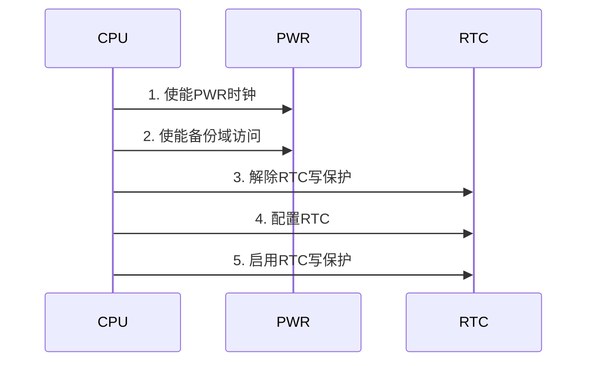

# RTC实时时钟驱动与时间管理

## 概述

RTC（Real-Time Clock，实时时钟）是嵌入式系统中用于保持时间和日期的重要外设。即使在系统主电源断开的情况下，RTC也能通过备用电池继续工作，确保时间信息不丢失。RTC广泛应用于需要时间戳、定时任务、日志记录等场景。

本教程将深入讲解RTC的工作原理和驱动开发方法，通过实战项目带你掌握RTC在嵌入式系统中的应用。

完成本教程后，你将能够：

- 理解RTC的工作原理和硬件架构
- 掌握RTC的初始化和配置方法
- 实现时间和日期的读取与设置
- 配置和使用RTC闹钟功能
- 理解备份域和低功耗时钟管理
- 实现基于RTC的时间戳和定时任务

## 背景知识

### RTC基础概念

RTC是一个独立的计时器，能够提供日历功能（年、月、日、时、分、秒）和闹钟功能。

**RTC特点**：

```
优点：
- 独立运行：不依赖系统主时钟
- 低功耗：使用LSE或LSI时钟源
- 备份电池：断电后继续工作
- 精确计时：提供日历和时间功能
- 闹钟功能：支持定时中断

应用场景：
- 时间戳：日志记录、数据采集
- 定时任务：定时唤醒、周期任务
- 日历功能：显示日期和时间
- 低功耗应用：待机模式下保持时间
```


**RTC时钟源**：

```
LSE (Low Speed External)：
- 外部32.768kHz晶振
- 精度高（±20ppm）
- 功耗低
- 推荐用于RTC

LSI (Low Speed Internal)：
- 内部RC振荡器（约32kHz）
- 精度低（±5%）
- 无需外部元件
- 适合对精度要求不高的场合

HSE/128：
- 高速外部时钟分频
- 精度高但功耗大
- 不推荐用于RTC
```

### STM32 RTC架构

STM32F4系列的RTC是一个独立的BCD计数器，支持日历、闹钟、唤醒定时器等功能。

**RTC功能框图**：

```
┌─────────────────────────────────────┐
│         RTC控制器                    │
├─────────────────────────────────────┤
│  时钟源选择                          │
│  ├─ LSE (32.768kHz)                 │
│  ├─ LSI (~32kHz)                    │
│  └─ HSE/128                         │
├─────────────────────────────────────┤
│  日历单元                            │
│  ├─ 年 (00-99)                      │
│  ├─ 月 (01-12)                      │
│  ├─ 日 (01-31)                      │
│  ├─ 星期 (1-7)                      │
│  ├─ 时 (00-23)                      │
│  ├─ 分 (00-59)                      │
│  └─ 秒 (00-59)                      │
├─────────────────────────────────────┤
│  闹钟A/B                             │
│  ├─ 可编程闹钟时间                   │
│  ├─ 屏蔽功能（日期/星期/时/分/秒）   │
│  └─ 中断输出                         │
├─────────────────────────────────────┤
│  唤醒定时器                          │
│  ├─ 可编程周期（1秒-18小时）         │
│  └─ 中断输出                         │
├─────────────────────────────────────┤
│  备份寄存器 (20个32位)               │
│  └─ 掉电保持数据                     │
└─────────────────────────────────────┘
```

**RTC主要特性**：

| 特性 | 说明 |
|------|------|
| 日历 | 年月日时分秒，BCD格式 |
| 闹钟 | 2个独立闹钟（A和B） |
| 唤醒定时器 | 周期性唤醒 |
| 时间戳 | 记录事件发生时间 |
| 备份寄存器 | 20个32位寄存器 |
| 校准 | 数字校准功能 |
| 输出 | 可输出1Hz或闹钟信号 |


### 备份域（Backup Domain）

RTC位于备份域中，由VBAT引脚供电，即使VDD断电也能继续工作。

**备份域特点**：

```
备份域包含：
- RTC寄存器
- RTC备份寄存器
- 备份SRAM（部分型号）
- LSE振荡器

供电方式：
- VDD正常时：由VDD供电
- VDD断电时：由VBAT供电
- 自动切换，无需软件干预

写保护：
- 防止意外写入
- 需要解除写保护才能配置
- 复位后自动启用写保护
```

**备份域访问流程**：



### RTC寄存器概览

STM32 RTC的主要寄存器：

| 寄存器 | 全称 | 功能 |
|--------|------|------|
| TR | Time Register | 时间寄存器（时分秒） |
| DR | Date Register | 日期寄存器（年月日星期） |
| CR | Control Register | 控制寄存器 |
| ISR | Initialization and Status Register | 初始化和状态寄存器 |
| PRER | Prescaler Register | 预分频器寄存器 |
| ALRMAR | Alarm A Register | 闹钟A寄存器 |
| ALRMBR | Alarm B Register | 闹钟B寄存器 |
| WPR | Write Protection Register | 写保护寄存器 |
| BKPxR | Backup Register x | 备份寄存器 |

## 环境准备

### 硬件要求

- STM32F4系列开发板（如STM32F407VET6）
- 32.768kHz晶振（LSE）
- 纽扣电池（CR2032）和电池座（可选）
- USB转TTL串口模块
- 示波器（可选，用于观察时钟信号）

### 软件要求

- Keil MDK 5.x 或 STM32CubeIDE
- STM32F4 HAL库或标准外设库
- 串口调试工具

### 硬件连接

```
RTC时钟源连接：
- OSC32_IN  (PC14) ---> 32.768kHz晶振
- OSC32_OUT (PC15) ---> 32.768kHz晶振
- 晶振两端各接12pF电容到GND

备份电池连接（可选）：
- VBAT ---> CR2032正极
- GND  ---> CR2032负极

串口连接：
- PA9  (USART1_TX) ---> USB转TTL RX
- PA10 (USART1_RX) ---> USB转TTL TX
- GND              ---> GND
```

**注意事项**：
- 32.768kHz晶振要尽量靠近MCU
- 晶振走线要短，避免干扰
- 负载电容根据晶振规格选择（通常12-15pF）
- VBAT可以不接电池，但断电后时间会丢失


## 核心内容

### 步骤1：RTC基本配置

首先学习如何初始化和配置RTC控制器。

```c
#include "stm32f4xx.h"

/**
 * @brief  RTC时间结构体
 */
typedef struct {
    uint8_t hours;      // 小时 (0-23)
    uint8_t minutes;    // 分钟 (0-59)
    uint8_t seconds;    // 秒 (0-59)
} RTC_Time_t;

/**
 * @brief  RTC日期结构体
 */
typedef struct {
    uint8_t year;       // 年 (0-99, 表示2000-2099)
    uint8_t month;      // 月 (1-12)
    uint8_t date;       // 日 (1-31)
    uint8_t weekday;    // 星期 (1-7, 1=周一)
} RTC_Date_t;

/**
 * @brief  使能备份域访问
 * @param  无
 * @retval 无
 */
void RTC_EnableBackupAccess(void) {
    // 1. 使能PWR时钟
    RCC->APB1ENR |= RCC_APB1ENR_PWREN;
    
    // 2. 使能备份域访问
    PWR->CR |= PWR_CR_DBP;
}

/**
 * @brief  解除RTC写保护
 * @param  无
 * @retval 无
 */
void RTC_DisableWriteProtection(void) {
    RTC->WPR = 0xCA;
    RTC->WPR = 0x53;
}

/**
 * @brief  启用RTC写保护
 * @param  无
 * @retval 无
 */
void RTC_EnableWriteProtection(void) {
    RTC->WPR = 0xFF;
}

/**
 * @brief  进入RTC初始化模式
 * @param  无
 * @retval 0=成功，1=超时
 */
uint8_t RTC_EnterInitMode(void) {
    uint32_t timeout = 0;
    
    // 设置INIT位
    RTC->ISR |= RTC_ISR_INIT;
    
    // 等待INITF标志
    while (!(RTC->ISR & RTC_ISR_INITF)) {
        if (++timeout > 10000) {
            return 1;  // 超时
        }
    }
    
    return 0;  // 成功
}

/**
 * @brief  退出RTC初始化模式
 * @param  无
 * @retval 无
 */
void RTC_ExitInitMode(void) {
    RTC->ISR &= ~RTC_ISR_INIT;
}

/**
 * @brief  配置LSE时钟源
 * @param  无
 * @retval 0=成功，1=超时
 */
uint8_t RTC_ConfigLSE(void) {
    uint32_t timeout = 0;
    
    // 1. 复位备份域（首次配置时）
    if (!(RCC->BDCR & RCC_BDCR_RTCEN)) {
        RCC->BDCR |= RCC_BDCR_BDRST;
        RCC->BDCR &= ~RCC_BDCR_BDRST;
    }
    
    // 2. 使能LSE
    RCC->BDCR |= RCC_BDCR_LSEON;
    
    // 3. 等待LSE就绪
    while (!(RCC->BDCR & RCC_BDCR_LSERDY)) {
        if (++timeout > 1000000) {
            return 1;  // 超时（LSE可能未连接或损坏）
        }
    }
    
    // 4. 选择LSE作为RTC时钟源
    RCC->BDCR &= ~RCC_BDCR_RTCSEL;
    RCC->BDCR |= RCC_BDCR_RTCSEL_0;  // LSE
    
    // 5. 使能RTC时钟
    RCC->BDCR |= RCC_BDCR_RTCEN;
    
    return 0;  // 成功
}

/**
 * @brief  初始化RTC
 * @param  无
 * @retval 0=成功，1=失败
 */
uint8_t RTC_Init(void) {
    // 1. 使能备份域访问
    RTC_EnableBackupAccess();
    
    // 2. 配置LSE时钟源
    if (RTC_ConfigLSE() != 0) {
        return 1;  // LSE配置失败
    }
    
    // 3. 解除写保护
    RTC_DisableWriteProtection();
    
    // 4. 进入初始化模式
    if (RTC_EnterInitMode() != 0) {
        return 1;  // 进入初始化模式失败
    }
    
    // 5. 配置预分频器
    // LSE = 32.768kHz
    // 异步预分频器 = 128 (PREDIV_A = 127)
    // 同步预分频器 = 256 (PREDIV_S = 255)
    // RTC时钟 = 32768 / (128 * 256) = 1Hz
    RTC->PRER = (127 << 16) | 255;
    
    // 6. 配置24小时格式
    RTC->CR &= ~RTC_CR_FMT;
    
    // 7. 退出初始化模式
    RTC_ExitInitMode();
    
    // 8. 启用写保护
    RTC_EnableWriteProtection();
    
    return 0;  // 成功
}


/**
 * @brief  检查RTC是否已配置
 * @param  无
 * @retval 1=已配置，0=未配置
 */
uint8_t RTC_IsConfigured(void) {
    // 检查备份寄存器中的标志
    // 使用BKP0R存储配置标志
    return (RTC->BKP0R == 0x32F2);
}

/**
 * @brief  标记RTC已配置
 * @param  无
 * @retval 无
 */
void RTC_MarkConfigured(void) {
    RTC->BKP0R = 0x32F2;  // 魔术数字
}

/**
 * @brief  RTC完整初始化（带配置检查）
 * @param  无
 * @retval 0=成功，1=失败
 */
uint8_t RTC_FullInit(void) {
    // 使能备份域访问
    RTC_EnableBackupAccess();
    
    // 检查是否已配置
    if (!RTC_IsConfigured()) {
        printf("RTC not configured, initializing...\r\n");
        
        // 初始化RTC
        if (RTC_Init() != 0) {
            printf("RTC init failed!\r\n");
            return 1;
        }
        
        // 设置默认时间：2024-01-15 12:00:00 周一
        RTC_Time_t time = {12, 0, 0};
        RTC_Date_t date = {24, 1, 15, 1};
        RTC_SetTime(&time);
        RTC_SetDate(&date);
        
        // 标记已配置
        RTC_MarkConfigured();
        
        printf("RTC initialized successfully\r\n");
    } else {
        printf("RTC already configured\r\n");
    }
    
    return 0;
}

```

**配置说明**：

1. **预分频器配置**：
   - 异步预分频器（PREDIV_A）：1-128
   - 同步预分频器（PREDIV_S）：0-32767
   - RTC频率 = LSE频率 / [(PREDIV_A+1) × (PREDIV_S+1)]
   - 推荐配置：PREDIV_A=127, PREDIV_S=255，得到1Hz

2. **时间格式**：
   - 24小时制：CR.FMT = 0
   - 12小时制：CR.FMT = 1（需要AM/PM标志）

3. **配置检查**：
   - 使用备份寄存器存储配置标志
   - 避免每次复位都重新配置
   - 保持时间连续性


### 步骤2：时间和日期设置

实现RTC时间和日期的读取与设置功能。

```c
/**
 * @brief  BCD转十进制
 * @param  bcd: BCD值
 * @retval 十进制值
 */
uint8_t BCD2DEC(uint8_t bcd) {
    return ((bcd >> 4) * 10) + (bcd & 0x0F);
}

/**
 * @brief  十进制转BCD
 * @param  dec: 十进制值
 * @retval BCD值
 */
uint8_t DEC2BCD(uint8_t dec) {
    return ((dec / 10) << 4) | (dec % 10);
}

/**
 * @brief  设置RTC时间
 * @param  time: 时间结构体指针
 * @retval 0=成功，1=失败
 */
uint8_t RTC_SetTime(RTC_Time_t *time) {
    uint32_t tr = 0;
    
    // 解除写保护
    RTC_DisableWriteProtection();
    
    // 进入初始化模式
    if (RTC_EnterInitMode() != 0) {
        RTC_EnableWriteProtection();
        return 1;
    }
    
    // 转换为BCD格式并写入TR寄存器
    tr = (DEC2BCD(time->hours) << 16) |
         (DEC2BCD(time->minutes) << 8) |
         (DEC2BCD(time->seconds));
    
    RTC->TR = tr;
    
    // 退出初始化模式
    RTC_ExitInitMode();
    
    // 启用写保护
    RTC_EnableWriteProtection();
    
    return 0;
}

/**
 * @brief  获取RTC时间
 * @param  time: 时间结构体指针
 * @retval 无
 */
void RTC_GetTime(RTC_Time_t *time) {
    uint32_t tr = RTC->TR;
    
    // 从BCD格式转换
    time->hours = BCD2DEC((tr >> 16) & 0x3F);
    time->minutes = BCD2DEC((tr >> 8) & 0x7F);
    time->seconds = BCD2DEC(tr & 0x7F);
}

/**
 * @brief  设置RTC日期
 * @param  date: 日期结构体指针
 * @retval 0=成功，1=失败
 */
uint8_t RTC_SetDate(RTC_Date_t *date) {
    uint32_t dr = 0;
    
    // 解除写保护
    RTC_DisableWriteProtection();
    
    // 进入初始化模式
    if (RTC_EnterInitMode() != 0) {
        RTC_EnableWriteProtection();
        return 1;
    }
    
    // 转换为BCD格式并写入DR寄存器
    dr = (DEC2BCD(date->year) << 16) |
         (date->weekday << 13) |
         (DEC2BCD(date->month) << 8) |
         (DEC2BCD(date->date));
    
    RTC->DR = dr;
    
    // 退出初始化模式
    RTC_ExitInitMode();
    
    // 启用写保护
    RTC_EnableWriteProtection();
    
    return 0;
}

/**
 * @brief  获取RTC日期
 * @param  date: 日期结构体指针
 * @retval 无
 */
void RTC_GetDate(RTC_Date_t *date) {
    uint32_t dr = RTC->DR;
    
    // 从BCD格式转换
    date->year = BCD2DEC((dr >> 16) & 0xFF);
    date->weekday = (dr >> 13) & 0x07;
    date->month = BCD2DEC((dr >> 8) & 0x1F);
    date->date = BCD2DEC(dr & 0x3F);
}

/**
 * @brief  获取完整的日期时间
 * @param  time: 时间结构体指针
 * @param  date: 日期结构体指针
 * @retval 无
 */
void RTC_GetDateTime(RTC_Time_t *time, RTC_Date_t *date) {
    // 注意：必须先读TR，再读DR，以确保数据一致性
    uint32_t tr = RTC->TR;
    uint32_t dr = RTC->DR;
    
    // 解析时间
    time->hours = BCD2DEC((tr >> 16) & 0x3F);
    time->minutes = BCD2DEC((tr >> 8) & 0x7F);
    time->seconds = BCD2DEC(tr & 0x7F);
    
    // 解析日期
    date->year = BCD2DEC((dr >> 16) & 0xFF);
    date->weekday = (dr >> 13) & 0x07;
    date->month = BCD2DEC((dr >> 8) & 0x1F);
    date->date = BCD2DEC(dr & 0x3F);
}

/**
 * @brief  打印日期时间
 * @param  time: 时间结构体指针
 * @param  date: 日期结构体指针
 * @retval 无
 */
void RTC_PrintDateTime(RTC_Time_t *time, RTC_Date_t *date) {
    const char *weekdays[] = {"", "Mon", "Tue", "Wed", "Thu", "Fri", "Sat", "Sun"};
    
    printf("20%02d-%02d-%02d %s %02d:%02d:%02d\r\n",
           date->year, date->month, date->date,
           weekdays[date->weekday],
           time->hours, time->minutes, time->seconds);
}
```

**使用示例**：

```c
int main(void) {
    SystemInit();
    UART1_Init(115200);
    
    // 初始化RTC
    if (RTC_FullInit() != 0) {
        printf("RTC init failed!\r\n");
        while (1);
    }
    
    RTC_Time_t time;
    RTC_Date_t date;
    
    while (1) {
        // 读取并显示时间
        RTC_GetDateTime(&time, &date);
        RTC_PrintDateTime(&time, &date);
        
        Delay_Ms(1000);
    }
}
```


### 步骤3：RTC闹钟功能

实现RTC闹钟的配置和中断处理。

```c
/**
 * @brief  RTC闹钟结构体
 */
typedef struct {
    uint8_t hours;      // 小时 (0-23)
    uint8_t minutes;    // 分钟 (0-59)
    uint8_t seconds;    // 秒 (0-59)
    uint8_t date;       // 日期 (1-31)
    uint8_t weekday;    // 星期 (1-7)
    uint8_t mask;       // 屏蔽位
} RTC_Alarm_t;

// 闹钟屏蔽位定义
#define RTC_ALARM_MASK_NONE       0x00  // 不屏蔽任何字段
#define RTC_ALARM_MASK_SECONDS    0x01  // 屏蔽秒
#define RTC_ALARM_MASK_MINUTES    0x02  // 屏蔽分
#define RTC_ALARM_MASK_HOURS      0x04  // 屏蔽时
#define RTC_ALARM_MASK_DATE       0x08  // 屏蔽日期
#define RTC_ALARM_MASK_ALL        0x0F  // 屏蔽所有（每秒触发）

/**
 * @brief  禁用RTC闹钟
 * @param  alarm: 闹钟选择（'A'或'B'）
 * @retval 0=成功，1=超时
 */
uint8_t RTC_DisableAlarm(char alarm) {
    uint32_t timeout = 0;
    
    // 解除写保护
    RTC_DisableWriteProtection();
    
    // 禁用闹钟
    if (alarm == 'A') {
        RTC->CR &= ~RTC_CR_ALRAE;
        // 等待ALRAWF标志
        while (!(RTC->ISR & RTC_ISR_ALRAWF)) {
            if (++timeout > 10000) {
                RTC_EnableWriteProtection();
                return 1;
            }
        }
    } else {
        RTC->CR &= ~RTC_CR_ALRBE;
        // 等待ALRBWF标志
        while (!(RTC->ISR & RTC_ISR_ALRBWF)) {
            if (++timeout > 10000) {
                RTC_EnableWriteProtection();
                return 1;
            }
        }
    }
    
    RTC_EnableWriteProtection();
    return 0;
}

/**
 * @brief  配置RTC闹钟
 * @param  alarm: 闹钟选择（'A'或'B'）
 * @param  config: 闹钟配置结构体指针
 * @retval 0=成功，1=失败
 */
uint8_t RTC_SetAlarm(char alarm, RTC_Alarm_t *config) {
    uint32_t alrm = 0;
    
    // 1. 禁用闹钟
    if (RTC_DisableAlarm(alarm) != 0) {
        return 1;
    }
    
    // 2. 配置闹钟寄存器
    alrm = (DEC2BCD(config->hours) << 16) |
           (DEC2BCD(config->minutes) << 8) |
           (DEC2BCD(config->seconds));
    
    // 配置日期或星期
    if (config->weekday > 0) {
        // 使用星期
        alrm |= (config->weekday << 24) | (1 << 30);
    } else {
        // 使用日期
        alrm |= (DEC2BCD(config->date) << 24);
    }
    
    // 配置屏蔽位
    if (config->mask & RTC_ALARM_MASK_SECONDS) alrm |= (1 << 7);
    if (config->mask & RTC_ALARM_MASK_MINUTES) alrm |= (1 << 15);
    if (config->mask & RTC_ALARM_MASK_HOURS)   alrm |= (1 << 23);
    if (config->mask & RTC_ALARM_MASK_DATE)    alrm |= (1 << 31);
    
    // 3. 解除写保护
    RTC_DisableWriteProtection();
    
    // 4. 写入闹钟寄存器
    if (alarm == 'A') {
        RTC->ALRMAR = alrm;
    } else {
        RTC->ALRMBR = alrm;
    }
    
    // 5. 启用写保护
    RTC_EnableWriteProtection();
    
    return 0;
}

/**
 * @brief  使能RTC闹钟
 * @param  alarm: 闹钟选择（'A'或'B'）
 * @retval 无
 */
void RTC_EnableAlarm(char alarm) {
    // 解除写保护
    RTC_DisableWriteProtection();
    
    // 清除闹钟标志
    RTC->ISR &= ~((alarm == 'A') ? RTC_ISR_ALRAF : RTC_ISR_ALRBF);
    
    // 使能闹钟中断
    if (alarm == 'A') {
        RTC->CR |= RTC_CR_ALRAIE;
        RTC->CR |= RTC_CR_ALRAE;
    } else {
        RTC->CR |= RTC_CR_ALRBIE;
        RTC->CR |= RTC_CR_ALRBE;
    }
    
    // 启用写保护
    RTC_EnableWriteProtection();
    
    // 配置EXTI线（闹钟通过EXTI17触发）
    EXTI->IMR |= EXTI_IMR_MR17;   // 使能中断
    EXTI->RTSR |= EXTI_RTSR_TR17; // 上升沿触发
    
    // 配置NVIC
    NVIC_SetPriority(RTC_Alarm_IRQn, 2);
    NVIC_EnableIRQ(RTC_Alarm_IRQn);
}

/**
 * @brief  设置定时闹钟（从当前时间开始）
 * @param  alarm: 闹钟选择（'A'或'B'）
 * @param  hours: 小时数
 * @param  minutes: 分钟数
 * @param  seconds: 秒数
 * @retval 0=成功，1=失败
 */
uint8_t RTC_SetAlarmAfter(char alarm, uint8_t hours, uint8_t minutes, uint8_t seconds) {
    RTC_Time_t current_time;
    RTC_Alarm_t alarm_config;
    
    // 获取当前时间
    RTC_GetTime(&current_time);
    
    // 计算闹钟时间
    uint32_t total_seconds = current_time.hours * 3600 + 
                             current_time.minutes * 60 + 
                             current_time.seconds;
    total_seconds += hours * 3600 + minutes * 60 + seconds;
    
    // 处理跨天
    total_seconds %= 86400;
    
    alarm_config.hours = total_seconds / 3600;
    alarm_config.minutes = (total_seconds % 3600) / 60;
    alarm_config.seconds = total_seconds % 60;
    alarm_config.date = 0;
    alarm_config.weekday = 0;
    alarm_config.mask = RTC_ALARM_MASK_DATE;  // 不比较日期
    
    // 配置闹钟
    if (RTC_SetAlarm(alarm, &alarm_config) != 0) {
        return 1;
    }
    
    // 使能闹钟
    RTC_EnableAlarm(alarm);
    
    return 0;
}

// 闹钟回调函数指针
void (*rtc_alarm_a_callback)(void) = NULL;
void (*rtc_alarm_b_callback)(void) = NULL;

/**
 * @brief  注册闹钟回调函数
 * @param  alarm: 闹钟选择（'A'或'B'）
 * @param  callback: 回调函数指针
 * @retval 无
 */
void RTC_RegisterAlarmCallback(char alarm, void (*callback)(void)) {
    if (alarm == 'A') {
        rtc_alarm_a_callback = callback;
    } else {
        rtc_alarm_b_callback = callback;
    }
}

/**
 * @brief  RTC闹钟中断服务函数
 * @param  无
 * @retval 无
 */
void RTC_Alarm_IRQHandler(void) {
    // 检查闹钟A标志
    if (RTC->ISR & RTC_ISR_ALRAF) {
        // 清除标志
        RTC->ISR &= ~RTC_ISR_ALRAF;
        EXTI->PR = EXTI_PR_PR17;
        
        // 调用回调函数
        if (rtc_alarm_a_callback) {
            rtc_alarm_a_callback();
        }
    }
    
    // 检查闹钟B标志
    if (RTC->ISR & RTC_ISR_ALRBF) {
        // 清除标志
        RTC->ISR &= ~RTC_ISR_ALRBF;
        EXTI->PR = EXTI_PR_PR17;
        
        // 调用回调函数
        if (rtc_alarm_b_callback) {
            rtc_alarm_b_callback();
        }
    }
}
```

**使用示例**：

```c
// 闹钟A回调函数
void alarm_a_handler(void) {
    printf("Alarm A triggered!\r\n");
    
    // LED闪烁
    GPIO_TogglePin(GPIOD, GPIO_PIN_12);
}

int main(void) {
    SystemInit();
    UART1_Init(115200);
    RTC_FullInit();
    
    printf("RTC Alarm Test\r\n");
    
    // 注册闹钟回调
    RTC_RegisterAlarmCallback('A', alarm_a_handler);
    
    // 设置10秒后触发闹钟
    RTC_SetAlarmAfter('A', 0, 0, 10);
    
    printf("Alarm set for 10 seconds from now\r\n");
    
    while (1) {
        // 主循环
        Delay_Ms(1000);
    }
}
```


### 步骤4：唤醒定时器

实现RTC唤醒定时器功能，用于周期性唤醒系统。

```c
/**
 * @brief  配置RTC唤醒定时器
 * @param  period: 唤醒周期（秒）
 * @retval 0=成功，1=失败
 */
uint8_t RTC_SetWakeup(uint16_t period) {
    uint32_t timeout = 0;
    
    // 1. 解除写保护
    RTC_DisableWriteProtection();
    
    // 2. 禁用唤醒定时器
    RTC->CR &= ~RTC_CR_WUTE;
    
    // 3. 等待WUTWF标志
    while (!(RTC->ISR & RTC_ISR_WUTWF)) {
        if (++timeout > 10000) {
            RTC_EnableWriteProtection();
            return 1;
        }
    }
    
    // 4. 配置唤醒定时器
    // 时钟源：ck_spre (1Hz)
    // 周期 = (WUT + 1) 秒
    RTC->WUTR = period - 1;
    
    // 5. 选择时钟源（ck_spre = 1Hz）
    RTC->CR &= ~RTC_CR_WUCKSEL;
    RTC->CR |= 0x04;  // ck_spre (1Hz)
    
    // 6. 清除唤醒标志
    RTC->ISR &= ~RTC_ISR_WUTF;
    
    // 7. 使能唤醒中断
    RTC->CR |= RTC_CR_WUTIE;
    
    // 8. 使能唤醒定时器
    RTC->CR |= RTC_CR_WUTE;
    
    // 9. 启用写保护
    RTC_EnableWriteProtection();
    
    // 10. 配置EXTI线（唤醒通过EXTI22触发）
    EXTI->IMR |= EXTI_IMR_MR22;   // 使能中断
    EXTI->RTSR |= EXTI_RTSR_TR22; // 上升沿触发
    
    // 11. 配置NVIC
    NVIC_SetPriority(RTC_WKUP_IRQn, 2);
    NVIC_EnableIRQ(RTC_WKUP_IRQn);
    
    return 0;
}

/**
 * @brief  禁用RTC唤醒定时器
 * @param  无
 * @retval 无
 */
void RTC_DisableWakeup(void) {
    // 解除写保护
    RTC_DisableWriteProtection();
    
    // 禁用唤醒定时器
    RTC->CR &= ~RTC_CR_WUTE;
    RTC->CR &= ~RTC_CR_WUTIE;
    
    // 启用写保护
    RTC_EnableWriteProtection();
}

// 唤醒回调函数指针
void (*rtc_wakeup_callback)(void) = NULL;

/**
 * @brief  注册唤醒回调函数
 * @param  callback: 回调函数指针
 * @retval 无
 */
void RTC_RegisterWakeupCallback(void (*callback)(void)) {
    rtc_wakeup_callback = callback;
}

/**
 * @brief  RTC唤醒中断服务函数
 * @param  无
 * @retval 无
 */
void RTC_WKUP_IRQHandler(void) {
    // 检查唤醒标志
    if (RTC->ISR & RTC_ISR_WUTF) {
        // 清除标志
        RTC->ISR &= ~RTC_ISR_WUTF;
        EXTI->PR = EXTI_PR_PR22;
        
        // 调用回调函数
        if (rtc_wakeup_callback) {
            rtc_wakeup_callback();
        }
    }
}
```

**使用示例**：

```c
// 唤醒回调函数
void wakeup_handler(void) {
    static uint32_t count = 0;
    printf("Wakeup event %lu\r\n", ++count);
}

int main(void) {
    SystemInit();
    UART1_Init(115200);
    RTC_FullInit();
    
    printf("RTC Wakeup Test\r\n");
    
    // 注册唤醒回调
    RTC_RegisterWakeupCallback(wakeup_handler);
    
    // 设置5秒周期唤醒
    RTC_SetWakeup(5);
    
    printf("Wakeup timer set to 5 seconds\r\n");
    
    while (1) {
        // 主循环可以进入低功耗模式
        // __WFI();  // 等待中断
    }
}
```


### 步骤5：备份寄存器

使用RTC备份寄存器存储掉电保持数据。

```c
/**
 * @brief  写入备份寄存器
 * @param  index: 寄存器索引（0-19）
 * @param  data: 要写入的数据
 * @retval 无
 */
void RTC_WriteBackup(uint8_t index, uint32_t data) {
    if (index >= 20) return;
    
    // 备份寄存器地址
    volatile uint32_t *bkp = &RTC->BKP0R;
    bkp[index] = data;
}

/**
 * @brief  读取备份寄存器
 * @param  index: 寄存器索引（0-19）
 * @retval 寄存器值
 */
uint32_t RTC_ReadBackup(uint8_t index) {
    if (index >= 20) return 0;
    
    // 备份寄存器地址
    volatile uint32_t *bkp = &RTC->BKP0R;
    return bkp[index];
}

/**
 * @brief  保存系统配置到备份寄存器
 * @param  无
 * @retval 无
 */
void SaveSystemConfig(void) {
    // 示例：保存系统配置
    RTC_WriteBackup(1, 0x12345678);  // 配置标志
    RTC_WriteBackup(2, 115200);      // 波特率
    RTC_WriteBackup(3, 1000);        // 采样周期
    
    printf("System config saved to backup registers\r\n");
}

/**
 * @brief  从备份寄存器恢复系统配置
 * @param  无
 * @retval 无
 */
void LoadSystemConfig(void) {
    uint32_t config_flag = RTC_ReadBackup(1);
    
    if (config_flag == 0x12345678) {
        uint32_t baudrate = RTC_ReadBackup(2);
        uint32_t sample_period = RTC_ReadBackup(3);
        
        printf("Config restored: baudrate=%lu, period=%lu\r\n", 
               baudrate, sample_period);
    } else {
        printf("No saved config found\r\n");
    }
}

/**
 * @brief  保存运行时间统计
 * @param  无
 * @retval 无
 */
void SaveRuntime(void) {
    static uint32_t last_save = 0;
    uint32_t current = GetTick();
    
    // 每分钟保存一次
    if (current - last_save >= 60000) {
        uint32_t total_runtime = RTC_ReadBackup(4);
        total_runtime += (current - last_save) / 1000;  // 转换为秒
        RTC_WriteBackup(4, total_runtime);
        
        last_save = current;
    }
}

/**
 * @brief  获取总运行时间
 * @param  无
 * @retval 总运行时间（秒）
 */
uint32_t GetTotalRuntime(void) {
    return RTC_ReadBackup(4);
}
```


### 步骤6：时间戳功能

实现基于RTC的时间戳功能。

```c
/**
 * @brief  获取Unix时间戳
 * @param  无
 * @retval Unix时间戳（秒）
 */
uint32_t RTC_GetTimestamp(void) {
    RTC_Time_t time;
    RTC_Date_t date;
    
    RTC_GetDateTime(&time, &date);
    
    // 简化的Unix时间戳计算（从2000年开始）
    // 注意：这是简化版本，未考虑闰年等复杂情况
    uint32_t days = 0;
    
    // 计算年份的天数
    for (int y = 0; y < date.year; y++) {
        if ((2000 + y) % 4 == 0) {
            days += 366;  // 闰年
        } else {
            days += 365;
        }
    }
    
    // 计算月份的天数
    const uint8_t days_in_month[] = {31, 28, 31, 30, 31, 30, 31, 31, 30, 31, 30, 31};
    for (int m = 1; m < date.month; m++) {
        days += days_in_month[m - 1];
        // 闰年2月多一天
        if (m == 2 && (2000 + date.year) % 4 == 0) {
            days++;
        }
    }
    
    // 加上当月天数
    days += date.date - 1;
    
    // 转换为秒（从2000-01-01 00:00:00开始）
    uint32_t timestamp = days * 86400 + 
                         time.hours * 3600 + 
                         time.minutes * 60 + 
                         time.seconds;
    
    // 转换为标准Unix时间戳（从1970-01-01开始）
    // 2000-01-01到1970-01-01的秒数：946684800
    timestamp += 946684800;
    
    return timestamp;
}

/**
 * @brief  从Unix时间戳设置RTC
 * @param  timestamp: Unix时间戳（秒）
 * @retval 0=成功，1=失败
 */
uint8_t RTC_SetFromTimestamp(uint32_t timestamp) {
    // 转换为从2000年开始的时间戳
    timestamp -= 946684800;
    
    // 计算日期和时间
    uint32_t days = timestamp / 86400;
    uint32_t seconds = timestamp % 86400;
    
    RTC_Time_t time;
    time.hours = seconds / 3600;
    time.minutes = (seconds % 3600) / 60;
    time.seconds = seconds % 60;
    
    // 简化的日期计算
    RTC_Date_t date;
    date.year = 0;
    
    // 计算年份
    while (days >= 365) {
        if ((2000 + date.year) % 4 == 0 && days >= 366) {
            days -= 366;
            date.year++;
        } else if ((2000 + date.year) % 4 != 0) {
            days -= 365;
            date.year++;
        } else {
            break;
        }
    }
    
    // 计算月份和日期
    const uint8_t days_in_month[] = {31, 28, 31, 30, 31, 30, 31, 31, 30, 31, 30, 31};
    date.month = 1;
    
    for (int m = 0; m < 12; m++) {
        uint8_t month_days = days_in_month[m];
        if (m == 1 && (2000 + date.year) % 4 == 0) {
            month_days = 29;  // 闰年2月
        }
        
        if (days < month_days) {
            break;
        }
        
        days -= month_days;
        date.month++;
    }
    
    date.date = days + 1;
    date.weekday = 1;  // 简化处理
    
    // 设置RTC
    RTC_SetTime(&time);
    RTC_SetDate(&date);
    
    return 0;
}

/**
 * @brief  记录事件时间戳
 * @param  event_id: 事件ID
 * @retval 无
 */
void LogEventTimestamp(uint8_t event_id) {
    uint32_t timestamp = RTC_GetTimestamp();
    
    printf("Event %d at timestamp: %lu\r\n", event_id, timestamp);
    
    // 可以保存到Flash或SD卡
}
```


## 实践示例

### 示例1：数据记录系统

使用RTC实现带时间戳的数据记录系统。

```c
/**
 * @brief  数据记录结构体
 */
typedef struct {
    uint32_t timestamp;
    float temperature;
    float humidity;
    uint16_t voltage;
} DataLog_t;

#define LOG_BUFFER_SIZE 100
DataLog_t log_buffer[LOG_BUFFER_SIZE];
uint16_t log_index = 0;

/**
 * @brief  记录数据
 * @param  temp: 温度
 * @param  humi: 湿度
 * @param  volt: 电压
 * @retval 无
 */
void LogData(float temp, float humi, uint16_t volt) {
    if (log_index >= LOG_BUFFER_SIZE) {
        // 缓冲区满，保存到Flash或SD卡
        printf("Log buffer full, saving...\r\n");
        log_index = 0;
    }
    
    // 记录数据和时间戳
    log_buffer[log_index].timestamp = RTC_GetTimestamp();
    log_buffer[log_index].temperature = temp;
    log_buffer[log_index].humidity = humi;
    log_buffer[log_index].voltage = volt;
    
    log_index++;
}

/**
 * @brief  打印日志
 * @param  无
 * @retval 无
 */
void PrintLogs(void) {
    printf("=== Data Logs ===\r\n");
    
    for (int i = 0; i < log_index; i++) {
        printf("[%lu] Temp: %.1f°C, Humi: %.1f%%, Volt: %dmV\r\n",
               log_buffer[i].timestamp,
               log_buffer[i].temperature,
               log_buffer[i].humidity,
               log_buffer[i].voltage);
    }
}

/**
 * @brief  定时采集任务
 * @param  无
 * @retval 无
 */
void SamplingTask(void) {
    // 读取传感器数据（示例）
    float temp = ReadTemperature();
    float humi = ReadHumidity();
    uint16_t volt = ReadVoltage();
    
    // 记录数据
    LogData(temp, humi, volt);
    
    printf("Data logged at ");
    RTC_Time_t time;
    RTC_Date_t date;
    RTC_GetDateTime(&time, &date);
    RTC_PrintDateTime(&time, &date);
}

int main(void) {
    SystemInit();
    UART1_Init(115200);
    RTC_FullInit();
    
    // 注册唤醒回调
    RTC_RegisterWakeupCallback(SamplingTask);
    
    // 设置每60秒采集一次
    RTC_SetWakeup(60);
    
    printf("Data logging system started\r\n");
    
    while (1) {
        // 可以进入低功耗模式
        __WFI();
    }
}
```


### 示例2：定时任务调度器

实现基于RTC的定时任务调度系统。

```c
/**
 * @brief  定时任务结构体
 */
typedef struct {
    uint8_t  enabled;       // 任务使能
    uint8_t  hour;          // 执行小时
    uint8_t  minute;        // 执行分钟
    uint8_t  weekday_mask;  // 星期掩码（bit0=周一，bit6=周日）
    void (*callback)(void); // 回调函数
} ScheduledTask_t;

#define MAX_TASKS 10
ScheduledTask_t tasks[MAX_TASKS];

/**
 * @brief  添加定时任务
 * @param  hour: 小时
 * @param  minute: 分钟
 * @param  weekday_mask: 星期掩码
 * @param  callback: 回调函数
 * @retval 任务ID，-1表示失败
 */
int8_t AddScheduledTask(uint8_t hour, uint8_t minute, 
                        uint8_t weekday_mask, void (*callback)(void)) {
    // 查找空闲任务槽
    for (int i = 0; i < MAX_TASKS; i++) {
        if (!tasks[i].enabled) {
            tasks[i].enabled = 1;
            tasks[i].hour = hour;
            tasks[i].minute = minute;
            tasks[i].weekday_mask = weekday_mask;
            tasks[i].callback = callback;
            return i;
        }
    }
    
    return -1;  // 任务槽已满
}

/**
 * @brief  删除定时任务
 * @param  task_id: 任务ID
 * @retval 无
 */
void RemoveScheduledTask(int8_t task_id) {
    if (task_id >= 0 && task_id < MAX_TASKS) {
        tasks[task_id].enabled = 0;
    }
}

/**
 * @brief  检查并执行定时任务
 * @param  无
 * @retval 无
 */
void CheckScheduledTasks(void) {
    RTC_Time_t time;
    RTC_Date_t date;
    
    RTC_GetDateTime(&time, &date);
    
    // 遍历所有任务
    for (int i = 0; i < MAX_TASKS; i++) {
        if (!tasks[i].enabled) continue;
        
        // 检查时间是否匹配
        if (tasks[i].hour == time.hours && 
            tasks[i].minute == time.minutes &&
            time.seconds == 0) {  // 只在整分钟执行
            
            // 检查星期是否匹配
            if (tasks[i].weekday_mask & (1 << (date.weekday - 1))) {
                // 执行任务
                if (tasks[i].callback) {
                    tasks[i].callback();
                }
            }
        }
    }
}

// 任务回调函数示例
void Task_MorningReport(void) {
    printf("Good morning! Generating daily report...\r\n");
}

void Task_DataBackup(void) {
    printf("Backing up data...\r\n");
}

void Task_SystemCheck(void) {
    printf("Running system check...\r\n");
}

int main(void) {
    SystemInit();
    UART1_Init(115200);
    RTC_FullInit();
    
    printf("Task Scheduler Started\r\n");
    
    // 添加定时任务
    // 每天早上8:00生成报告
    AddScheduledTask(8, 0, 0x7F, Task_MorningReport);
    
    // 每周一、三、五晚上22:00备份数据
    AddScheduledTask(22, 0, 0x15, Task_DataBackup);  // bit0,2,4 = 周一三五
    
    // 每天中午12:00系统检查
    AddScheduledTask(12, 0, 0x7F, Task_SystemCheck);
    
    while (1) {
        // 每秒检查一次任务
        CheckScheduledTasks();
        Delay_Ms(1000);
    }
}
```


### 示例3：低功耗时钟系统

实现基于RTC的低功耗时钟显示系统。

```c
/**
 * @brief  进入停止模式
 * @param  无
 * @retval 无
 */
void EnterStopMode(void) {
    // 配置唤醒源（RTC闹钟）
    PWR->CR |= PWR_CR_CWUF;  // 清除唤醒标志
    
    // 进入停止模式
    PWR->CR &= ~PWR_CR_PDDS;  // 停止模式（非待机）
    PWR->CR |= PWR_CR_LPDS;   // 低功耗深度睡眠
    
    SCB->SCR |= SCB_SCR_SLEEPDEEP_Msk;
    
    __WFI();  // 等待中断
    
    // 唤醒后恢复系统时钟
    SystemClock_Config();
}

/**
 * @brief  低功耗时钟显示
 * @param  无
 * @retval 无
 */
void LowPowerClock(void) {
    RTC_Time_t time;
    RTC_Date_t date;
    
    // 显示时间
    RTC_GetDateTime(&time, &date);
    LCD_Clear();
    LCD_ShowTime(time.hours, time.minutes, time.seconds);
    LCD_ShowDate(date.year, date.month, date.date);
    
    // 设置1秒后唤醒
    RTC_SetWakeup(1);
    
    // 进入停止模式
    EnterStopMode();
}

/**
 * @brief  电池电压监测
 * @param  无
 * @retval 电池电压（mV）
 */
uint16_t MonitorBatteryVoltage(void) {
    // 读取VBAT电压
    // 注意：需要配置ADC通道18（VBAT/2）
    uint16_t adc_value = ADC_Read(ADC_CHANNEL_VBAT);
    uint16_t voltage = (adc_value * 3300 * 2) / 4096;  // 转换为mV
    
    return voltage;
}

int main(void) {
    SystemInit();
    LCD_Init();
    RTC_FullInit();
    
    // 检查电池电压
    uint16_t vbat = MonitorBatteryVoltage();
    printf("VBAT: %dmV\r\n", vbat);
    
    if (vbat < 2500) {
        LCD_ShowString("Low Battery!");
        Delay_Ms(2000);
    }
    
    // 注册唤醒回调
    RTC_RegisterWakeupCallback(LowPowerClock);
    
    while (1) {
        LowPowerClock();
    }
}
```


## 深入理解

### RTC时钟精度

RTC的精度主要取决于时钟源的精度。

**LSE晶振精度**：

```
典型精度：±20ppm (parts per million)

误差计算：
- 每天误差：86400秒 × 20ppm = 1.728秒
- 每月误差：约52秒
- 每年误差：约10.5分钟

影响因素：
- 温度：温度变化影响晶振频率
- 负载电容：需要匹配晶振规格
- PCB布局：走线长度和干扰
- 老化：长期使用频率会漂移
```

**提高精度的方法**：

1. **选择高精度晶振**：
   - 温补晶振（TCXO）：±1ppm
   - 恒温晶振（OCXO）：±0.01ppm

2. **软件校准**：
```c
/**
 * @brief  RTC校准
 * @param  ppm: 校准值（ppm）
 * @retval 无
 */
void RTC_Calibrate(int16_t ppm) {
    // STM32 RTC支持数字校准
    // 校准范围：-487.1ppm 到 +488.5ppm
    
    uint32_t calr = 0;
    
    if (ppm > 0) {
        // 增加频率
        calr = (ppm * 32768) / 1000000;
        calr = (calr > 512) ? 512 : calr;
        RTC->CALR = calr;
    } else {
        // 减少频率
        calr = (-ppm * 32768) / 1000000;
        calr = (calr > 512) ? 512 : calr;
        RTC->CALR = calr | RTC_CALR_CALP;
    }
}
```

3. **定期同步**：
   - 通过GPS、NTP等外部时间源定期校准
   - 记录误差趋势，自动补偿


### 备份域电源管理

理解备份域的电源切换机制。

**电源切换逻辑**：

```
VDD和VBAT电源切换：
1. VDD正常时：
   - 备份域由VDD供电
   - VBAT不消耗电流
   
2. VDD掉电时：
   - 自动切换到VBAT
   - RTC继续运行
   - 备份寄存器保持数据
   
3. VDD恢复时：
   - 自动切换回VDD
   - 无缝切换，不影响RTC
```

**功耗优化**：

```c
/**
 * @brief  优化RTC功耗
 * @param  无
 * @retval 无
 */
void RTC_OptimizePower(void) {
    // 1. 禁用不需要的功能
    RTC_DisableWriteProtection();
    
    // 禁用输出
    RTC->CR &= ~(RTC_CR_COE | RTC_CR_OSEL);
    
    // 禁用时间戳
    RTC->CR &= ~RTC_CR_TSE;
    
    // 禁用参考时钟检测
    RTC->CR &= ~RTC_CR_REFCKON;
    
    RTC_EnableWriteProtection();
    
    // 2. 使用LSE而不是LSI
    // LSE功耗更低且精度更高
    
    // 3. 减少唤醒频率
    // 根据实际需求设置唤醒周期
}

/**
 * @brief  测量VBAT电流
 * @param  无
 * @retval 电流（uA）
 */
uint16_t MeasureVBATCurrent(void) {
    // 典型VBAT电流：
    // - LSE运行：0.5-1uA
    // - RTC运行：0.5uA
    // - 备份SRAM：0.1uA/KB
    // 总计：约1-2uA
    
    // 实际测量需要外部电流表
    return 2;  // 示例值
}
```


### RTC与低功耗模式

RTC在不同低功耗模式下的行为。

**低功耗模式对比**：

| 模式 | RTC状态 | 唤醒源 | 功耗 | 唤醒时间 |
|------|---------|--------|------|----------|
| 睡眠 | 运行 | 任何中断 | ~10mA | <1us |
| 停止 | 运行 | RTC/EXTI | ~100uA | ~5us |
| 待机 | 运行 | RTC/WKUP | ~2uA | ~50us |

**停止模式示例**：

```c
/**
 * @brief  配置停止模式唤醒
 * @param  wakeup_seconds: 唤醒时间（秒）
 * @retval 无
 */
void ConfigStopModeWakeup(uint16_t wakeup_seconds) {
    // 1. 配置RTC唤醒
    RTC_SetWakeup(wakeup_seconds);
    
    // 2. 配置PWR
    PWR->CR |= PWR_CR_CWUF;   // 清除唤醒标志
    PWR->CR &= ~PWR_CR_PDDS;  // 停止模式
    PWR->CR |= PWR_CR_LPDS;   // 低功耗深度睡眠
    
    // 3. 配置Cortex-M4
    SCB->SCR |= SCB_SCR_SLEEPDEEP_Msk;
}

/**
 * @brief  进入停止模式并等待唤醒
 * @param  无
 * @retval 无
 */
void EnterStopModeAndWait(void) {
    printf("Entering stop mode...\r\n");
    Delay_Ms(10);  // 等待串口发送完成
    
    // 进入停止模式
    __WFI();
    
    // 唤醒后恢复系统时钟
    SystemClock_Config();
    
    printf("Woke up from stop mode\r\n");
}
```


### RTC调试技巧

常见RTC问题的调试方法。

**问题1：LSE无法启动**

```c
/**
 * @brief  诊断LSE问题
 * @param  无
 * @retval 无
 */
void DiagnoseLSE(void) {
    printf("=== LSE Diagnosis ===\r\n");
    
    // 1. 检查LSE使能
    if (RCC->BDCR & RCC_BDCR_LSEON) {
        printf("LSE enabled\r\n");
    } else {
        printf("LSE not enabled\r\n");
        return;
    }
    
    // 2. 检查LSE就绪
    if (RCC->BDCR & RCC_BDCR_LSERDY) {
        printf("LSE ready\r\n");
    } else {
        printf("LSE not ready - check crystal connection\r\n");
        printf("Possible causes:\r\n");
        printf("- Crystal not connected\r\n");
        printf("- Wrong load capacitors\r\n");
        printf("- PCB layout issues\r\n");
        return;
    }
    
    // 3. 检查RTC时钟源
    uint32_t rtcsel = (RCC->BDCR & RCC_BDCR_RTCSEL) >> 8;
    printf("RTC clock source: ");
    switch (rtcsel) {
        case 0: printf("None\r\n"); break;
        case 1: printf("LSE\r\n"); break;
        case 2: printf("LSI\r\n"); break;
        case 3: printf("HSE/128\r\n"); break;
    }
    
    // 4. 检查RTC使能
    if (RCC->BDCR & RCC_BDCR_RTCEN) {
        printf("RTC enabled\r\n");
    } else {
        printf("RTC not enabled\r\n");
    }
}
```

**问题2：时间不准确**

```c
/**
 * @brief  测试RTC精度
 * @param  test_seconds: 测试时长（秒）
 * @retval 无
 */
void TestRTCAccuracy(uint32_t test_seconds) {
    printf("Testing RTC accuracy for %lu seconds...\r\n", test_seconds);
    
    // 记录开始时间
    uint32_t start_tick = GetTick();
    RTC_Time_t start_time;
    RTC_GetTime(&start_time);
    uint32_t start_seconds = start_time.hours * 3600 + 
                             start_time.minutes * 60 + 
                             start_time.seconds;
    
    // 等待测试时长
    Delay_Ms(test_seconds * 1000);
    
    // 记录结束时间
    uint32_t end_tick = GetTick();
    RTC_Time_t end_time;
    RTC_GetTime(&end_time);
    uint32_t end_seconds = end_time.hours * 3600 + 
                           end_time.minutes * 60 + 
                           end_time.seconds;
    
    // 计算误差
    uint32_t systick_elapsed = (end_tick - start_tick) / 1000;
    uint32_t rtc_elapsed = end_seconds - start_seconds;
    int32_t error = rtc_elapsed - systick_elapsed;
    
    printf("SysTick elapsed: %lu seconds\r\n", systick_elapsed);
    printf("RTC elapsed: %lu seconds\r\n", rtc_elapsed);
    printf("Error: %ld seconds\r\n", error);
    
    if (error != 0) {
        float ppm = (error * 1000000.0f) / systick_elapsed;
        printf("Error rate: %.2f ppm\r\n", ppm);
    }
}
```

**问题3：闹钟不触发**

```c
/**
 * @brief  诊断闹钟问题
 * @param  alarm: 闹钟选择（'A'或'B'）
 * @retval 无
 */
void DiagnoseAlarm(char alarm) {
    printf("=== Alarm %c Diagnosis ===\r\n", alarm);
    
    uint32_t cr = RTC->CR;
    uint32_t isr = RTC->ISR;
    
    // 1. 检查闹钟使能
    uint32_t alr_en = (alarm == 'A') ? RTC_CR_ALRAE : RTC_CR_ALRBE;
    if (cr & alr_en) {
        printf("Alarm enabled\r\n");
    } else {
        printf("Alarm not enabled\r\n");
        return;
    }
    
    // 2. 检查闹钟中断使能
    uint32_t alr_ie = (alarm == 'A') ? RTC_CR_ALRAIE : RTC_CR_ALRBIE;
    if (cr & alr_ie) {
        printf("Alarm interrupt enabled\r\n");
    } else {
        printf("Alarm interrupt not enabled\r\n");
    }
    
    // 3. 检查EXTI配置
    if (EXTI->IMR & EXTI_IMR_MR17) {
        printf("EXTI17 interrupt enabled\r\n");
    } else {
        printf("EXTI17 interrupt not enabled\r\n");
    }
    
    // 4. 检查NVIC配置
    if (NVIC_GetEnableIRQ(RTC_Alarm_IRQn)) {
        printf("NVIC interrupt enabled\r\n");
    } else {
        printf("NVIC interrupt not enabled\r\n");
    }
    
    // 5. 显示闹钟配置
    uint32_t alrm = (alarm == 'A') ? RTC->ALRMAR : RTC->ALRMBR;
    uint8_t hours = BCD2DEC((alrm >> 16) & 0x3F);
    uint8_t minutes = BCD2DEC((alrm >> 8) & 0x7F);
    uint8_t seconds = BCD2DEC(alrm & 0x7F);
    
    printf("Alarm time: %02d:%02d:%02d\r\n", hours, minutes, seconds);
}
```


## 常见问题

### Q1: RTC时间在断电后丢失？

**原因**：
- VBAT未连接电池
- 电池电量耗尽
- 备份域被复位

**解决方法**：
```c
// 1. 检查VBAT电压
uint16_t vbat = MonitorBatteryVoltage();
if (vbat < 2500) {
    printf("Battery low, please replace\r\n");
}

// 2. 避免不必要的备份域复位
// 只在首次配置时复位
if (!RTC_IsConfigured()) {
    RCC->BDCR |= RCC_BDCR_BDRST;
    RCC->BDCR &= ~RCC_BDCR_BDRST;
}
```


### Q2: LSE启动失败？

**原因**：
- 晶振未连接或损坏
- 负载电容不匹配
- PCB布局问题

**解决方法**：
```c
// 1. 尝试增加驱动能力
RCC->BDCR &= ~RCC_BDCR_LSEDRV;
RCC->BDCR |= RCC_BDCR_LSEDRV_1;  // 高驱动能力

// 2. 如果LSE无法启动，使用LSI作为备选
if (RTC_ConfigLSE() != 0) {
    printf("LSE failed, using LSI\r\n");
    RTC_ConfigLSI();
}
```


### Q3: RTC精度不够？

**解决方法**：
```c
// 1. 使用软件校准
// 测量实际误差后进行补偿
RTC_Calibrate(-10);  // 补偿-10ppm

// 2. 定期同步外部时间源
void SyncWithNTP(void) {
    uint32_t ntp_timestamp = GetNTPTime();
    RTC_SetFromTimestamp(ntp_timestamp);
}

// 3. 记录温度补偿曲线
// 根据温度自动调整校准值
```


## 总结

本教程详细介绍了RTC实时时钟驱动的开发方法，涵盖了：

1. **基础配置**：RTC初始化、时钟源选择、预分频器配置
2. **时间管理**：时间日期读写、BCD转换、时间戳功能
3. **闹钟功能**：闹钟配置、中断处理、定时任务
4. **唤醒定时器**：周期性唤醒、低功耗应用
5. **备份域**：备份寄存器、掉电保持、电源管理
6. **实践应用**：数据记录、任务调度、低功耗时钟

通过本教程的学习，你应该能够：
- 独立完成RTC驱动的开发和调试
- 实现精确的时间管理功能
- 应用RTC于实际项目中
- 优化RTC的功耗和精度
- 解决常见的RTC问题

## 扩展阅读

- [STM32F4 Reference Manual - RTC章节](https://www.st.com/resource/en/reference_manual/dm00031020.pdf)
- [AN4759: Using the hardware real-time clock (RTC) and the tamper management unit (TAMP) with STM32 microcontrollers](https://www.st.com/resource/en/application_note/dm00226241.pdf)
- [时钟系统架构与配置](../../05-clock-timer-management/beginner/01-clock-system.html)
- [低功耗时钟管理策略](../../05-clock-timer-management/advanced/01-low-power-clock.html)

## 练习题

1. 实现一个带闹钟功能的数字时钟，支持多个闹钟设置
2. 开发一个数据记录系统，每小时记录一次传感器数据
3. 实现RTC的自动校准功能，通过GPS同步时间
4. 设计一个低功耗时钟系统，VBAT电流小于2uA
5. 实现一个任务调度器，支持按星期和时间执行任务

---

**下一步学习**：
- [SDIO驱动开发：SD卡接口](05-sdio-driver.html)
- [通用驱动框架设计与实现](../advanced/01-driver-framework.html)
- [低功耗时钟管理策略](../../05-clock-timer-management/advanced/01-low-power-clock.html)
