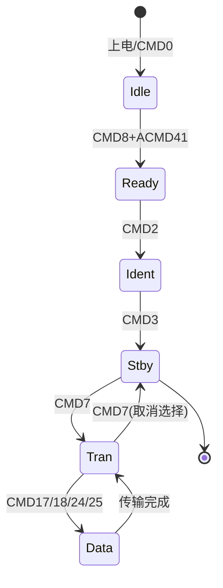

# SDIO驱动开发：SD卡接口

## 概述

SDIO（Secure Digital Input Output）是一种高速串行接口标准，主要用于连接SD卡、SDIO WiFi模块等外设。SD卡作为最常用的可移动存储介质，广泛应用于数据记录、固件升级、配置文件存储等场景。相比SPI模式，SDIO接口提供更高的传输速度和更好的性能。

本文将深入讲解SDIO的工作原理和驱动开发方法，帮助你掌握SD卡在嵌入式系统中的高效应用。

完成本文学习后，你将能够：

- 理解SDIO协议和SD卡工作原理
- 掌握SDIO控制器的配置方法
- 实现SD卡的初始化和识别
- 完成SD卡的读写操作
- 集成FATFS文件系统
- 优化SDIO传输性能

## 背景知识

### SDIO vs SPI模式

SD卡支持两种接口模式：SDIO模式和SPI模式。

**接口对比**：

```
SDIO模式：
- 4位数据线（支持1位模式）
- 专用命令线
- 时钟频率：最高50MHz
- 传输速度：最高25MB/s（4位模式）
- 硬件复杂度：需要专用SDIO控制器
- 推荐用于高性能应用

SPI模式：
- 1位数据线（MOSI/MISO）
- 共用命令/数据线
- 时钟频率：最高25MHz
- 传输速度：最高3MB/s
- 硬件复杂度：使用标准SPI接口
- 适合低速应用或引脚受限场景
```

**引脚对比**：

| 功能 | SDIO模式 | SPI模式 |
|------|----------|---------|
| 时钟 | CLK | SCLK |
| 命令 | CMD | MOSI |
| 数据0 | DAT0 | MISO |
| 数据1 | DAT1 | - |
| 数据2 | DAT2 | - |
| 数据3 | DAT3 | CS |
| 总引脚 | 6 | 4 |


### SD卡类型和容量

SD卡有多种类型，容量和速度等级各不相同。

**SD卡类型**：

```
SD (Standard Capacity):
- 容量：最大2GB
- 文件系统：FAT16
- 地址模式：字节地址

SDHC (High Capacity):
- 容量：2GB-32GB
- 文件系统：FAT32
- 地址模式：扇区地址（512字节/扇区）

SDXC (Extended Capacity):
- 容量：32GB-2TB
- 文件系统：exFAT
- 地址模式：扇区地址

SDUC (Ultra Capacity):
- 容量：2TB-128TB
- 文件系统：exFAT
- 地址模式：扇区地址
```

**速度等级**：

| 等级 | 最低写入速度 | 应用场景 |
|------|-------------|---------|
| Class 2 | 2MB/s | 标清视频 |
| Class 4 | 4MB/s | 高清视频 |
| Class 6 | 6MB/s | 全高清视频 |
| Class 10 | 10MB/s | 4K视频 |
| UHS-I U1 | 10MB/s | 实时广播 |
| UHS-I U3 | 30MB/s | 4K视频 |
| UHS-II | 156MB/s | 8K视频 |


### SDIO协议基础

SDIO协议定义了命令、响应和数据传输的格式。

**命令格式**：

```
命令结构（48位）：
|起始位|传输位|命令索引|参数|CRC7|结束位|
|  1   |  1   |   6    | 32 |  7 |  1  |

字段说明：
- 起始位：固定为0
- 传输位：1=主机发送
- 命令索引：CMD0-CMD63
- 参数：32位命令参数
- CRC7：7位CRC校验
- 结束位：固定为1
```

**响应类型**：

| 类型 | 长度 | 说明 |
|------|------|------|
| R1 | 48位 | 正常响应 |
| R1b | 48位 | 带忙信号的R1 |
| R2 | 136位 | CID/CSD寄存器 |
| R3 | 48位 | OCR寄存器 |
| R6 | 48位 | 发布的RCA |
| R7 | 48位 | 卡接口条件 |

**常用命令**：

| 命令 | 索引 | 响应 | 说明 |
|------|------|------|------|
| CMD0 | 0 | - | 复位卡 |
| CMD2 | 2 | R2 | 获取CID |
| CMD3 | 3 | R6 | 获取RCA |
| CMD7 | 7 | R1b | 选择/取消选择卡 |
| CMD8 | 8 | R7 | 发送接口条件 |
| CMD9 | 9 | R2 | 获取CSD |
| CMD13 | 13 | R1 | 获取状态 |
| CMD17 | 17 | R1 | 读单块 |
| CMD18 | 18 | R1 | 读多块 |
| CMD24 | 24 | R1 | 写单块 |
| CMD25 | 25 | R1 | 写多块 |
| CMD55 | 55 | R1 | 应用命令前缀 |
| ACMD41 | 41 | R3 | SD卡初始化 |


### STM32 SDIO控制器

STM32F4系列集成了SDIO控制器，支持SD卡和SDIO设备。

**SDIO控制器特性**：

```
┌─────────────────────────────────────┐
│         SDIO控制器                   │
├─────────────────────────────────────┤
│  接口模式                            │
│  ├─ 1位数据模式                      │
│  ├─ 4位数据模式                      │
│  └─ 8位数据模式（部分型号）          │
├─────────────────────────────────────┤
│  时钟控制                            │
│  ├─ 可编程时钟分频                   │
│  ├─ 时钟使能控制                     │
│  └─ 省电模式                         │
├─────────────────────────────────────┤
│  数据传输                            │
│  ├─ 支持DMA                          │
│  ├─ 数据FIFO（32×32位）              │
│  └─ 硬件流控制                       │
├─────────────────────────────────────┤
│  命令处理                            │
│  ├─ 命令发送                         │
│  ├─ 响应接收                         │
│  └─ CRC校验                          │
└─────────────────────────────────────┘
```

**主要特性**：

| 特性 | 说明 |
|------|------|
| 时钟频率 | 最高48MHz |
| 数据宽度 | 1/4/8位 |
| DMA支持 | 支持 |
| FIFO深度 | 32×32位 |
| 硬件CRC | 支持 |
| 中断 | 多种中断源 |


### SD卡初始化流程

SD卡的初始化需要遵循特定的命令序列。

**初始化状态机**：



**初始化步骤**：

```
1. 上电延时（至少1ms）
2. 发送CMD0（复位到Idle状态）
3. 发送CMD8（检查电压范围，仅SDHC/SDXC需要）
4. 循环发送ACMD41（等待卡就绪）
5. 发送CMD2（获取CID）
6. 发送CMD3（获取RCA）
7. 发送CMD9（获取CSD）
8. 发送CMD7（选择卡，进入Transfer状态）
9. 发送ACMD6（设置总线宽度）
10. 设置时钟频率到工作频率
```


## 核心概念

### SDIO寄存器

STM32 SDIO的主要寄存器：

| 寄存器 | 全称 | 功能 |
|--------|------|------|
| POWER | Power Control Register | 电源控制 |
| CLKCR | Clock Control Register | 时钟控制 |
| ARG | Argument Register | 命令参数 |
| CMD | Command Register | 命令控制 |
| RESPCMD | Response Command Register | 响应命令索引 |
| RESP1-4 | Response Register 1-4 | 响应数据 |
| DTIMER | Data Timer Register | 数据超时 |
| DLEN | Data Length Register | 数据长度 |
| DCTRL | Data Control Register | 数据控制 |
| DCOUNT | Data Counter Register | 数据计数 |
| STA | Status Register | 状态寄存器 |
| ICR | Interrupt Clear Register | 中断清除 |
| MASK | Mask Register | 中断屏蔽 |
| FIFO | FIFO Data Register | FIFO数据 |


### 数据传输模式

SDIO支持多种数据传输模式。

**传输方向**：
- 卡到控制器（读操作）
- 控制器到卡（写操作）

**传输模式**：
- 块传输：固定大小的数据块（通常512字节）
- 流传输：连续数据流（较少使用）

**DMA模式**：
- 轮询模式：CPU读写FIFO
- DMA模式：DMA自动搬运数据（推荐）


### CRC校验

SDIO使用CRC校验确保数据完整性。

**CRC类型**：
- CRC7：用于命令和响应
- CRC16：用于数据传输

**硬件CRC**：
- STM32 SDIO控制器自动计算和校验CRC
- 无需软件干预
- 提高传输可靠性


### 错误处理

SDIO传输可能遇到各种错误。

**常见错误**：

| 错误 | 原因 | 处理方法 |
|------|------|---------|
| 命令超时 | 卡无响应 | 重试或复位卡 |
| 命令CRC错误 | 信号干扰 | 降低时钟频率 |
| 数据超时 | 读写超时 | 增加超时时间 |
| 数据CRC错误 | 数据损坏 | 重新传输 |
| FIFO溢出/下溢 | DMA配置错误 | 检查DMA设置 |


## 实现要点

### 时钟配置

SDIO时钟需要根据初始化阶段和工作阶段分别配置。

**时钟分频计算**：

```
SDIO_CK = SDIOCLK / (CLKDIV + 2)

其中：
- SDIOCLK：SDIO外设时钟（通常48MHz）
- CLKDIV：时钟分频系数（0-255）
- SDIO_CK：输出到SD卡的时钟

示例：
初始化阶段：400kHz
CLKDIV = 48MHz / 400kHz - 2 = 118

工作阶段：24MHz
CLKDIV = 48MHz / 24MHz - 2 = 0
```

**时钟配置建议**：

| 阶段 | 频率 | 原因 |
|------|------|------|
| 初始化 | ≤400kHz | SD卡规范要求 |
| 识别 | ≤400kHz | 确保兼容性 |
| 传输 | ≤25MHz | 标准速度模式 |
| 高速 | ≤50MHz | 高速模式（需卡支持） |


### DMA配置

使用DMA可以大幅提高SDIO传输效率。

**DMA配置要点**：

```
读操作（卡到内存）：
- DMA方向：外设到内存
- 外设地址：SDIO->FIFO
- 内存地址：接收缓冲区
- 数据宽度：32位
- 传输模式：普通模式

写操作（内存到卡）：
- DMA方向：内存到外设
- 外设地址：SDIO->FIFO
- 内存地址：发送缓冲区
- 数据宽度：32位
- 传输模式：普通模式
```

**FIFO管理**：
- FIFO深度：32×32位（128字节）
- 半满阈值：16个字
- DMA请求：自动触发


### 块大小选择

SD卡支持不同的块大小，但512字节是最常用的。

**块大小说明**：

```
标准块大小：512字节
- 与扇区大小一致
- FATFS默认大小
- 最佳性能

其他块大小：
- 1-2048字节（2的幂次）
- 需要CMD16设置
- 较少使用
```


### 多块传输优化

多块传输比单块传输更高效。

**单块 vs 多块**：

```
单块传输：
- 每块需要发送命令
- 命令开销大
- 适合小数据量

多块传输：
- 一次命令传输多块
- 减少命令开销
- 适合大数据量
- 需要CMD12停止传输
```


## 性能优化

### 提高传输速度

**优化策略**：

1. **使用4位数据模式**
   - 传输速度提升4倍
   - 需要ACMD6配置

2. **提高时钟频率**
   - 初始化后切换到高频
   - 注意信号完整性

3. **使用DMA传输**
   - 减少CPU占用
   - 提高传输效率

4. **多块传输**
   - 减少命令开销
   - 提高吞吐量

5. **缓存对齐**
   - DMA缓冲区32字节对齐
   - 避免Cache一致性问题


### 降低功耗

**功耗优化**：

1. **时钟门控**
   - 不使用时关闭SDIO时钟
   - 使用CLKCR.PWRSAV位

2. **降低时钟频率**
   - 低速应用使用低频时钟
   - 平衡性能和功耗

3. **卡休眠**
   - 长时间不用时让卡进入休眠
   - 使用CMD5命令


### 可靠性提升

**可靠性措施**：

1. **错误重试**
   - 传输失败自动重试
   - 设置合理的重试次数

2. **超时保护**
   - 设置适当的超时时间
   - 避免死锁

3. **CRC校验**
   - 使能硬件CRC
   - 检测数据错误

4. **状态检查**
   - 传输前检查卡状态
   - 确保卡就绪


## FATFS集成

### FATFS简介

FATFS是一个轻量级的FAT文件系统实现，广泛用于嵌入式系统。

**FATFS特性**：
- 支持FAT12/FAT16/FAT32/exFAT
- 可配置功能（长文件名、Unicode等）
- 可重入（多线程支持）
- 小内存占用
- 免费开源


### 移植接口

FATFS需要实现底层磁盘I/O接口。

**必需函数**：

```c
// 磁盘初始化
DSTATUS disk_initialize(BYTE pdrv);

// 获取磁盘状态
DSTATUS disk_status(BYTE pdrv);

// 读扇区
DRESULT disk_read(BYTE pdrv, BYTE* buff, LBA_t sector, UINT count);

// 写扇区
DRESULT disk_write(BYTE pdrv, const BYTE* buff, LBA_t sector, UINT count);

// I/O控制
DRESULT disk_ioctl(BYTE pdrv, BYTE cmd, void* buff);
```


### 文件操作

FATFS提供标准的文件操作API。

**常用函数**：

| 函数 | 功能 |
|------|------|
| f_mount | 挂载/卸载文件系统 |
| f_open | 打开/创建文件 |
| f_close | 关闭文件 |
| f_read | 读文件 |
| f_write | 写文件 |
| f_lseek | 移动文件指针 |
| f_sync | 同步文件 |
| f_opendir | 打开目录 |
| f_readdir | 读目录项 |
| f_mkdir | 创建目录 |
| f_unlink | 删除文件/目录 |
| f_rename | 重命名 |
| f_stat | 获取文件信息 |


## 应用场景

### 数据记录

**应用示例**：
- 传感器数据记录
- 系统日志存储
- 黑匣子记录
- 测试数据保存

**优势**：
- 大容量存储
- 数据持久化
- 易于数据导出
- 支持文件系统


### 固件升级

**应用示例**：
- 从SD卡加载固件
- 在线升级系统
- 配置文件更新
- 多版本管理

**优势**：
- 无需外部工具
- 支持大文件
- 升级方便
- 可回滚


### 多媒体存储

**应用示例**：
- 音频播放
- 图片显示
- 视频录制
- 数据采集

**优势**：
- 高速传输
- 大容量
- 标准接口
- 易于扩展


## 调试技巧

### 常见问题

**初始化失败**：
- 检查硬件连接
- 确认电源供电
- 降低初始化时钟
- 检查上拉电阻

**读写错误**：
- 检查DMA配置
- 验证缓冲区对齐
- 检查时钟频率
- 查看错误标志

**性能不佳**：
- 使用4位模式
- 提高时钟频率
- 使用DMA传输
- 采用多块传输


### 调试工具

**硬件工具**：
- 逻辑分析仪：观察信号时序
- 示波器：检查信号质量
- SD卡测试仪：验证卡性能

**软件工具**：
- 串口打印：输出调试信息
- 状态监控：实时查看寄存器
- 性能测试：测量传输速度


## 最佳实践

### 设计建议

1. **硬件设计**
   - 使用短走线
   - 添加上拉电阻（10-50kΩ）
   - 预留测试点
   - 考虑ESD保护

2. **软件设计**
   - 使用状态机管理
   - 实现错误重试
   - 添加超时保护
   - 记录错误日志

3. **性能优化**
   - 优先使用DMA
   - 采用多块传输
   - 缓冲区对齐
   - 合理设置时钟

4. **可靠性**
   - 使能CRC校验
   - 实现热插拔检测
   - 安全卸载文件系统
   - 定期同步数据


### 代码规范

1. **错误处理**
   - 检查所有返回值
   - 提供详细错误信息
   - 实现错误恢复机制

2. **资源管理**
   - 及时关闭文件
   - 释放分配的内存
   - 卸载文件系统

3. **注释文档**
   - 函数功能说明
   - 参数含义
   - 返回值说明
   - 使用示例


## 总结

SDIO接口为嵌入式系统提供了高速、可靠的存储解决方案。通过本文的学习，你应该掌握了：

- SDIO协议和SD卡的工作原理
- SDIO控制器的配置和使用方法
- SD卡初始化和数据传输的实现
- FATFS文件系统的集成方法
- 性能优化和可靠性提升技巧

在实际应用中，建议：
- 优先使用4位SDIO模式而非SPI模式
- 合理配置时钟频率平衡性能和可靠性
- 使用DMA传输提高效率
- 实现完善的错误处理机制
- 遵循SD卡规范确保兼容性

掌握SDIO驱动开发后，你可以在项目中实现数据记录、固件升级、多媒体存储等功能，为系统提供强大的存储能力。

## 扩展阅读

- SD卡协议规范（SD Specifications）
- STM32 SDIO应用笔记（AN4761）
- FATFS官方文档
- 高速SDIO设计指南
- SD卡性能测试方法

## 相关资源

- SD Association官网：https://www.sdcard.org/
- FATFS官网：http://elm-chan.org/fsw/ff/
- STM32参考手册：SDIO章节
- 示例代码：STM32Cube固件包

---

**下一步学习**：
- 通用驱动框架设计
- 驱动性能优化技术
- 文件系统高级应用
- 存储设备管理

**实践项目**：
- 实现完整的SD卡驱动
- 集成FATFS文件系统
- 开发数据记录系统
- 实现固件升级功能
