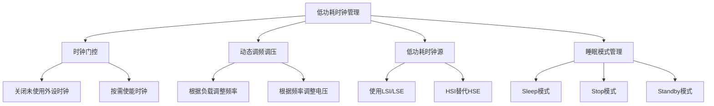

# 低功耗时钟管理策略实战

## 学习目标

完成本教程后,你将能够:


- [ ] 理解嵌入式系统功耗的主要来源和优化方向
- [ ] 掌握时钟门控技术降低动态功耗
- [ ] 实现动态调频调压(DVFS)策略
- [ ] 配置和使用低功耗时钟源
- [ ] 掌握不同睡眠模式的时钟配置
- [ ] 实现智能唤醒时钟管理
- [ ] 设计完整的低功耗时钟管理系统

## 前置要求

在开始本教程之前,你需要:

**知识要求**:
- 深入理解时钟系统架构和配置
- 熟悉STM32的电源管理模式
- 了解中断和唤醒机制
- 掌握定时器和RTC的使用

**技能要求**:
- 能够使用功耗测量工具(万用表/功耗分析仪)
- 会使用示波器分析时钟信号
- 能够阅读芯片数据手册的功耗章节
- 掌握高级调试技巧

**建议先学习**:
- [时钟系统架构与配置](../beginner/01-clock-system.html)
- [SysTick系统滴答定时器](../beginner/02-systick-timer.html)
- [时钟精度优化与校准](../intermediate/02-clock-calibration.html)

## 准备工作

### 硬件准备

| 名称 | 数量 | 说明 | 参考链接 |
|------|------|------|----------|
| STM32开发板 | 1 | STM32L4系列(低功耗优化) | - |
| 万用表 | 1 | 测量电流消耗 | - |
| 功耗分析仪 | 1 | 精确功耗测量(可选) | - |
| 示波器 | 1 | 观察时钟信号(可选) | - |
| USB数据线 | 1 | 用于下载和供电 | - |

### 软件准备

- **开发环境**: STM32CubeIDE v1.10+ 或 Keil MDK v5.30+
- **HAL库**: STM32L4 HAL Driver v1.13+
- **分析工具**: STM32CubeMX Power Consumption Calculator
- **辅助工具**: 串口调试助手

### 环境配置

1. 安装开发环境和低功耗HAL库
2. 准备功耗测量设备
3. 了解目标芯片的功耗特性
4. 准备测试用例和基准程序


## 低功耗时钟管理概述

### 功耗的主要来源

嵌入式系统的功耗主要来自三个方面:

**1. 动态功耗(Dynamic Power)**
```
P_dynamic = C × V² × f
```
- C: 负载电容
- V: 工作电压
- f: 工作频率

**关键点**: 功耗与频率成正比,与电压的平方成正比

**2. 静态功耗(Static Power)**
```
P_static = V × I_leakage
```
- I_leakage: 漏电流
- 主要来自晶体管的漏电流

**3. 短路功耗(Short-circuit Power)**
- CMOS电路翻转时的瞬态短路电流
- 通常占比较小

### 低功耗时钟管理策略



### STM32功耗模式对比

| 模式 | CPU | 系统时钟 | 外设时钟 | 唤醒时间 | 典型功耗 |
|------|-----|----------|----------|----------|----------|
| Run | 运行 | 运行 | 可选 | - | 几mA-几十mA |
| Sleep | 停止 | 运行 | 运行 | 立即 | 几百μA |
| Stop | 停止 | 停止 | 停止 | 几μs | 几μA |
| Standby | 停止 | 停止 | 停止 | 几ms | <1μA |


## 步骤1: 时钟门控技术

### 1.1 时钟门控原理

时钟门控(Clock Gating)是最简单有效的降低动态功耗的方法。通过关闭未使用外设的时钟,可以显著降低功耗。

**工作原理**:
```c
// 未使用时钟门控 - 所有外设时钟始终运行
功耗 = 所有外设功耗之和

// 使用时钟门控 - 只有使用的外设时钟运行
功耗 = 使用中的外设功耗之和
```

**功耗节省**:
- 每个未使用的外设可节省几十到几百μA
- 多个外设累积可节省几mA

### 1.2 基本时钟门控实现

```c
/**
 * @brief  智能时钟门控管理
 * @param  None
 * @retval None
 */
void Clock_Gating_Init(void)
{
    // 1. 关闭所有非必需外设时钟
    // AHB1外设
    __HAL_RCC_GPIOC_CLK_DISABLE();
    __HAL_RCC_GPIOD_CLK_DISABLE();
    __HAL_RCC_GPIOE_CLK_DISABLE();
    __HAL_RCC_GPIOF_CLK_DISABLE();
    __HAL_RCC_GPIOG_CLK_DISABLE();
    __HAL_RCC_GPIOH_CLK_DISABLE();
    __HAL_RCC_CRC_CLK_DISABLE();
    __HAL_RCC_DMA2_CLK_DISABLE();
    
    // AHB2外设
    __HAL_RCC_USB_OTG_FS_CLK_DISABLE();
    __HAL_RCC_RNG_CLK_DISABLE();
    
    // APB1外设
    __HAL_RCC_TIM2_CLK_DISABLE();
    __HAL_RCC_TIM3_CLK_DISABLE();
    __HAL_RCC_TIM4_CLK_DISABLE();
    __HAL_RCC_TIM5_CLK_DISABLE();
    __HAL_RCC_SPI2_CLK_DISABLE();
    __HAL_RCC_SPI3_CLK_DISABLE();
    __HAL_RCC_I2C2_CLK_DISABLE();
    __HAL_RCC_I2C3_CLK_DISABLE();
    
    // APB2外设
    __HAL_RCC_TIM9_CLK_DISABLE();
    __HAL_RCC_TIM10_CLK_DISABLE();
    __HAL_RCC_TIM11_CLK_DISABLE();
    __HAL_RCC_SPI4_CLK_DISABLE();
    __HAL_RCC_ADC2_CLK_DISABLE();
    __HAL_RCC_ADC3_CLK_DISABLE();
    
    printf("时钟门控初始化完成\n");
}

/**
 * @brief  按需使能外设时钟
 * @param  peripheral: 外设标识
 * @retval None
 */
void Enable_Peripheral_Clock(uint32_t peripheral)
{
    switch(peripheral)
    {
        case PERIPHERAL_UART2:
            __HAL_RCC_USART2_CLK_ENABLE();
            break;
            
        case PERIPHERAL_I2C1:
            __HAL_RCC_I2C1_CLK_ENABLE();
            break;
            
        case PERIPHERAL_SPI1:
            __HAL_RCC_SPI1_CLK_ENABLE();
            break;
            
        case PERIPHERAL_ADC1:
            __HAL_RCC_ADC1_CLK_ENABLE();
            break;
            
        // 添加更多外设...
    }
}

/**
 * @brief  使用完毕后禁用外设时钟
 * @param  peripheral: 外设标识
 * @retval None
 */
void Disable_Peripheral_Clock(uint32_t peripheral)
{
    switch(peripheral)
    {
        case PERIPHERAL_UART2:
            __HAL_RCC_USART2_CLK_DISABLE();
            break;
            
        case PERIPHERAL_I2C1:
            __HAL_RCC_I2C1_CLK_DISABLE();
            break;
            
        case PERIPHERAL_SPI1:
            __HAL_RCC_SPI1_CLK_DISABLE();
            break;
            
        case PERIPHERAL_ADC1:
            __HAL_RCC_ADC1_CLK_DISABLE();
            break;
    }
}
```

**代码说明**:
- 第7-38行: 系统初始化时关闭所有非必需外设时钟
- 第45-67行: 按需使能外设时钟
- 第74-92行: 使用完毕后禁用时钟


### 1.3 自动时钟门控管理器

实现一个智能的时钟门控管理器:

```c
// 外设使用计数器
typedef struct {
    uint32_t peripheral_id;
    uint8_t use_count;
    uint32_t last_use_time;
} Peripheral_Clock_t;

#define MAX_PERIPHERALS 32
static Peripheral_Clock_t peripheral_clocks[MAX_PERIPHERALS];
static uint8_t peripheral_count = 0;

/**
 * @brief  请求使用外设(自动使能时钟)
 * @param  peripheral_id: 外设ID
 * @retval None
 */
void Request_Peripheral(uint32_t peripheral_id)
{
    // 查找外设
    for (uint8_t i = 0; i < peripheral_count; i++)
    {
        if (peripheral_clocks[i].peripheral_id == peripheral_id)
        {
            // 如果是第一次使用,使能时钟
            if (peripheral_clocks[i].use_count == 0)
            {
                Enable_Peripheral_Clock(peripheral_id);
                printf("使能外设时钟: %lu\n", peripheral_id);
            }
            
            peripheral_clocks[i].use_count++;
            peripheral_clocks[i].last_use_time = HAL_GetTick();
            return;
        }
    }
    
    // 新外设,添加到列表
    if (peripheral_count < MAX_PERIPHERALS)
    {
        peripheral_clocks[peripheral_count].peripheral_id = peripheral_id;
        peripheral_clocks[peripheral_count].use_count = 1;
        peripheral_clocks[peripheral_count].last_use_time = HAL_GetTick();
        peripheral_count++;
        
        Enable_Peripheral_Clock(peripheral_id);
        printf("使能外设时钟: %lu\n", peripheral_id);
    }
}

/**
 * @brief  释放外设(自动禁用时钟)
 * @param  peripheral_id: 外设ID
 * @retval None
 */
void Release_Peripheral(uint32_t peripheral_id)
{
    for (uint8_t i = 0; i < peripheral_count; i++)
    {
        if (peripheral_clocks[i].peripheral_id == peripheral_id)
        {
            if (peripheral_clocks[i].use_count > 0)
            {
                peripheral_clocks[i].use_count--;
                
                // 如果没有人使用,禁用时钟
                if (peripheral_clocks[i].use_count == 0)
                {
                    Disable_Peripheral_Clock(peripheral_id);
                    printf("禁用外设时钟: %lu\n", peripheral_id);
                }
            }
            return;
        }
    }
}

/**
 * @brief  自动清理长时间未使用的外设时钟
 * @param  timeout_ms: 超时时间(毫秒)
 * @retval None
 */
void Auto_Cleanup_Unused_Clocks(uint32_t timeout_ms)
{
    uint32_t current_time = HAL_GetTick();
    
    for (uint8_t i = 0; i < peripheral_count; i++)
    {
        // 如果外设未被使用且超时
        if (peripheral_clocks[i].use_count == 0 &&
            (current_time - peripheral_clocks[i].last_use_time) > timeout_ms)
        {
            Disable_Peripheral_Clock(peripheral_clocks[i].peripheral_id);
            printf("自动清理外设时钟: %lu\n", peripheral_clocks[i].peripheral_id);
        }
    }
}

// 使用示例
void Clock_Gating_Example(void)
{
    // 请求使用UART2
    Request_Peripheral(PERIPHERAL_UART2);
    
    // 使用UART2发送数据
    HAL_UART_Transmit(&huart2, data, len, 1000);
    
    // 释放UART2
    Release_Peripheral(PERIPHERAL_UART2);
    
    // 在主循环中定期清理
    Auto_Cleanup_Unused_Clocks(5000);  // 5秒未使用则关闭
}
```

**代码说明**:
- 第17-47行: 请求使用外设时自动使能时钟,支持引用计数
- 第54-73行: 释放外设时自动禁用时钟
- 第80-94行: 自动清理长时间未使用的外设时钟
- 引用计数机制确保多个模块共享外设时的正确性


## 步骤2: 动态调频调压(DVFS)

### 2.1 DVFS原理

动态调频调压(Dynamic Voltage and Frequency Scaling)根据系统负载动态调整CPU频率和电压,在保证性能的同时降低功耗。

**核心思想**:
```
高负载 → 高频率 + 高电压 → 高性能
低负载 → 低频率 + 低电压 → 低功耗
```

**功耗节省**:
```
P = C × V² × f

降低频率到1/2: 功耗降低50%
降低电压到0.9V: 功耗降低19%
同时降低: 功耗降低约60%
```

### 2.2 频率档位定义

定义多个频率档位,根据负载切换:

```c
// 频率档位定义
typedef enum {
    FREQ_LEVEL_ULTRA_LOW = 0,   // 超低功耗: 2MHz
    FREQ_LEVEL_LOW,              // 低功耗: 16MHz
    FREQ_LEVEL_MEDIUM,           // 中等: 48MHz
    FREQ_LEVEL_HIGH,             // 高性能: 84MHz
    FREQ_LEVEL_ULTRA_HIGH        // 超高性能: 168MHz
} Frequency_Level_t;

// 频率档位配置
typedef struct {
    uint32_t sysclk_freq;        // 系统时钟频率
    uint32_t ahb_div;            // AHB分频
    uint32_t apb1_div;           // APB1分频
    uint32_t apb2_div;           // APB2分频
    uint32_t flash_latency;      // Flash等待周期
    uint32_t voltage_scale;      // 电压等级
    uint8_t pll_m;               // PLL参数
    uint8_t pll_n;
    uint8_t pll_p;
} Freq_Config_t;

// 频率档位配置表
const Freq_Config_t freq_configs[] = {
    // 超低功耗: 2MHz (HSI/8)
    {
        .sysclk_freq = 2000000,
        .ahb_div = RCC_SYSCLK_DIV1,
        .apb1_div = RCC_HCLK_DIV1,
        .apb2_div = RCC_HCLK_DIV1,
        .flash_latency = FLASH_LATENCY_0,
        .voltage_scale = PWR_REGULATOR_VOLTAGE_SCALE3,
        .pll_m = 0, .pll_n = 0, .pll_p = 0  // 不使用PLL
    },
    // 低功耗: 16MHz (HSI)
    {
        .sysclk_freq = 16000000,
        .ahb_div = RCC_SYSCLK_DIV1,
        .apb1_div = RCC_HCLK_DIV1,
        .apb2_div = RCC_HCLK_DIV1,
        .flash_latency = FLASH_LATENCY_0,
        .voltage_scale = PWR_REGULATOR_VOLTAGE_SCALE2,
        .pll_m = 0, .pll_n = 0, .pll_p = 0
    },
    // 中等: 48MHz
    {
        .sysclk_freq = 48000000,
        .ahb_div = RCC_SYSCLK_DIV1,
        .apb1_div = RCC_HCLK_DIV2,
        .apb2_div = RCC_HCLK_DIV1,
        .flash_latency = FLASH_LATENCY_1,
        .voltage_scale = PWR_REGULATOR_VOLTAGE_SCALE2,
        .pll_m = 8, .pll_n = 96, .pll_p = 2
    },
    // 高性能: 84MHz
    {
        .sysclk_freq = 84000000,
        .ahb_div = RCC_SYSCLK_DIV1,
        .apb1_div = RCC_HCLK_DIV2,
        .apb2_div = RCC_HCLK_DIV1,
        .flash_latency = FLASH_LATENCY_2,
        .voltage_scale = PWR_REGULATOR_VOLTAGE_SCALE1,
        .pll_m = 8, .pll_n = 168, .pll_p = 2
    },
    // 超高性能: 168MHz
    {
        .sysclk_freq = 168000000,
        .ahb_div = RCC_SYSCLK_DIV1,
        .apb1_div = RCC_HCLK_DIV4,
        .apb2_div = RCC_HCLK_DIV2,
        .flash_latency = FLASH_LATENCY_5,
        .voltage_scale = PWR_REGULATOR_VOLTAGE_SCALE1,
        .pll_m = 8, .pll_n = 336, .pll_p = 2
    }
};

// 当前频率档位
static Frequency_Level_t current_freq_level = FREQ_LEVEL_HIGH;
```

**代码说明**:
- 定义了5个频率档位,从2MHz到168MHz
- 每个档位包含完整的时钟配置参数
- 电压等级随频率调整,实现DVFS


### 2.3 动态频率切换实现

```c
/**
 * @brief  切换系统频率
 * @param  level: 目标频率档位
 * @retval HAL_StatusTypeDef
 */
HAL_StatusTypeDef Switch_Frequency_Level(Frequency_Level_t level)
{
    if (level >= sizeof(freq_configs) / sizeof(Freq_Config_t))
    {
        return HAL_ERROR;
    }
    
    const Freq_Config_t *config = &freq_configs[level];
    RCC_OscInitTypeDef RCC_OscInitStruct = {0};
    RCC_ClkInitTypeDef RCC_ClkInitStruct = {0};
    
    printf("切换频率档位: %lu → %lu Hz\n", 
           freq_configs[current_freq_level].sysclk_freq,
           config->sysclk_freq);
    
    // 1. 如果需要提高频率,先提高电压
    if (config->sysclk_freq > freq_configs[current_freq_level].sysclk_freq)
    {
        __HAL_RCC_PWR_CLK_ENABLE();
        __HAL_PWR_VOLTAGESCALING_CONFIG(config->voltage_scale);
        while(__HAL_PWR_GET_FLAG(PWR_FLAG_VOSRDY) == RESET);
    }
    
    // 2. 配置时钟源
    if (config->pll_m == 0)
    {
        // 使用HSI直接作为系统时钟
        RCC_OscInitStruct.OscillatorType = RCC_OSCILLATORTYPE_HSI;
        RCC_OscInitStruct.HSIState = RCC_HSI_ON;
        RCC_OscInitStruct.HSICalibrationValue = RCC_HSICALIBRATION_DEFAULT;
        RCC_OscInitStruct.PLL.PLLState = RCC_PLL_OFF;
        
        if (HAL_RCC_OscConfig(&RCC_OscInitStruct) != HAL_OK)
        {
            return HAL_ERROR;
        }
        
        // 切换到HSI
        RCC_ClkInitStruct.ClockType = RCC_CLOCKTYPE_SYSCLK;
        RCC_ClkInitStruct.SYSCLKSource = RCC_SYSCLKSOURCE_HSI;
        
        if (HAL_RCC_ClockConfig(&RCC_ClkInitStruct, config->flash_latency) != HAL_OK)
        {
            return HAL_ERROR;
        }
    }
    else
    {
        // 使用PLL
        RCC_OscInitStruct.OscillatorType = RCC_OSCILLATORTYPE_HSE;
        RCC_OscInitStruct.HSEState = RCC_HSE_ON;
        RCC_OscInitStruct.PLL.PLLState = RCC_PLL_ON;
        RCC_OscInitStruct.PLL.PLLSource = RCC_PLLSOURCE_HSE;
        RCC_OscInitStruct.PLL.PLLM = config->pll_m;
        RCC_OscInitStruct.PLL.PLLN = config->pll_n;
        RCC_OscInitStruct.PLL.PLLP = config->pll_p;
        RCC_OscInitStruct.PLL.PLLQ = 7;
        
        if (HAL_RCC_OscConfig(&RCC_OscInitStruct) != HAL_OK)
        {
            return HAL_ERROR;
        }
        
        // 切换到PLL
        RCC_ClkInitStruct.ClockType = RCC_CLOCKTYPE_SYSCLK;
        RCC_ClkInitStruct.SYSCLKSource = RCC_SYSCLKSOURCE_PLLCLK;
        
        if (HAL_RCC_ClockConfig(&RCC_ClkInitStruct, config->flash_latency) != HAL_OK)
        {
            return HAL_ERROR;
        }
    }
    
    // 3. 配置总线分频
    RCC_ClkInitStruct.ClockType = RCC_CLOCKTYPE_HCLK | 
                                   RCC_CLOCKTYPE_PCLK1 | 
                                   RCC_CLOCKTYPE_PCLK2;
    RCC_ClkInitStruct.AHBCLKDivider = config->ahb_div;
    RCC_ClkInitStruct.APB1CLKDivider = config->apb1_div;
    RCC_ClkInitStruct.APB2CLKDivider = config->apb2_div;
    
    if (HAL_RCC_ClockConfig(&RCC_ClkInitStruct, config->flash_latency) != HAL_OK)
    {
        return HAL_ERROR;
    }
    
    // 4. 如果降低频率,最后降低电压
    if (config->sysclk_freq < freq_configs[current_freq_level].sysclk_freq)
    {
        __HAL_RCC_PWR_CLK_ENABLE();
        __HAL_PWR_VOLTAGESCALING_CONFIG(config->voltage_scale);
        while(__HAL_PWR_GET_FLAG(PWR_FLAG_VOSRDY) == RESET);
    }
    
    // 5. 更新SystemCoreClock变量
    SystemCoreClockUpdate();
    
    // 6. 重新配置SysTick(如果使用HAL_Delay)
    HAL_InitTick(TICK_INT_PRIORITY);
    
    current_freq_level = level;
    
    printf("频率切换完成: SYSCLK=%lu Hz\n", HAL_RCC_GetSysClockFreq());
    
    return HAL_OK;
}

/**
 * @brief  获取当前频率档位
 * @param  None
 * @retval 当前频率档位
 */
Frequency_Level_t Get_Current_Frequency_Level(void)
{
    return current_freq_level;
}
```

**代码说明**:
- 第22-27行: 提高频率前先提高电压,避免电压不足
- 第30-50行: 低频率档位直接使用HSI,节省PLL功耗
- 第52-75行: 高频率档位使用PLL倍频
- 第93-98行: 降低频率后再降低电压,确保稳定性
- 第101-103行: 更新系统时钟变量和SysTick配置


### 2.4 智能负载检测与自动调频

```c
// 负载统计
typedef struct {
    uint32_t idle_time;          // 空闲时间
    uint32_t busy_time;          // 忙碌时间
    uint32_t total_time;         // 总时间
    uint8_t cpu_usage;           // CPU使用率(0-100)
} Load_Statistics_t;

static Load_Statistics_t load_stats = {0};
static uint32_t last_measure_time = 0;

/**
 * @brief  更新负载统计
 * @param  is_idle: 是否空闲
 * @retval None
 */
void Update_Load_Statistics(uint8_t is_idle)
{
    uint32_t current_time = HAL_GetTick();
    uint32_t elapsed = current_time - last_measure_time;
    
    if (is_idle)
    {
        load_stats.idle_time += elapsed;
    }
    else
    {
        load_stats.busy_time += elapsed;
    }
    
    load_stats.total_time += elapsed;
    last_measure_time = current_time;
}

/**
 * @brief  计算CPU使用率
 * @param  None
 * @retval CPU使用率(0-100)
 */
uint8_t Calculate_CPU_Usage(void)
{
    if (load_stats.total_time == 0)
    {
        return 0;
    }
    
    load_stats.cpu_usage = (load_stats.busy_time * 100) / load_stats.total_time;
    
    // 重置统计
    load_stats.idle_time = 0;
    load_stats.busy_time = 0;
    load_stats.total_time = 0;
    
    return load_stats.cpu_usage;
}

/**
 * @brief  根据负载自动调整频率
 * @param  None
 * @retval None
 */
void Auto_Adjust_Frequency(void)
{
    uint8_t cpu_usage = Calculate_CPU_Usage();
    Frequency_Level_t target_level = current_freq_level;
    
    printf("CPU使用率: %d%%\n", cpu_usage);
    
    // 根据CPU使用率选择频率档位
    if (cpu_usage < 10)
    {
        // 极低负载 → 超低功耗模式
        target_level = FREQ_LEVEL_ULTRA_LOW;
    }
    else if (cpu_usage < 30)
    {
        // 低负载 → 低功耗模式
        target_level = FREQ_LEVEL_LOW;
    }
    else if (cpu_usage < 50)
    {
        // 中等负载 → 中等性能
        target_level = FREQ_LEVEL_MEDIUM;
    }
    else if (cpu_usage < 80)
    {
        // 高负载 → 高性能
        target_level = FREQ_LEVEL_HIGH;
    }
    else
    {
        // 极高负载 → 超高性能
        target_level = FREQ_LEVEL_ULTRA_HIGH;
    }
    
    // 添加迟滞,避免频繁切换
    static uint8_t stable_count = 0;
    static Frequency_Level_t last_target = FREQ_LEVEL_HIGH;
    
    if (target_level == last_target)
    {
        stable_count++;
    }
    else
    {
        stable_count = 0;
        last_target = target_level;
    }
    
    // 连续3次相同才切换
    if (stable_count >= 3 && target_level != current_freq_level)
    {
        Switch_Frequency_Level(target_level);
        stable_count = 0;
    }
}

// 在主循环中使用
void DVFS_Main_Loop(void)
{
    static uint32_t last_adjust_time = 0;
    
    while (1)
    {
        // 执行任务
        Process_Tasks();
        Update_Load_Statistics(0);  // 标记为忙碌
        
        // 空闲时间
        Update_Load_Statistics(1);  // 标记为空闲
        
        // 每秒调整一次频率
        if (HAL_GetTick() - last_adjust_time >= 1000)
        {
            Auto_Adjust_Frequency();
            last_adjust_time = HAL_GetTick();
        }
    }
}
```

**代码说明**:
- 第16-32行: 统计CPU忙碌和空闲时间
- 第39-53行: 计算CPU使用率
- 第60-95行: 根据CPU使用率自动选择频率档位
- 第98-113行: 添加迟滞机制,避免频繁切换
- 第117-135行: 在主循环中定期调整频率

**功耗优化效果**:
```
场景1: 低负载(10% CPU)
- 原168MHz: ~50mA
- 自动2MHz: ~5mA
- 节省: 90%

场景2: 中等负载(50% CPU)
- 原168MHz: ~50mA
- 自动48MHz: ~20mA
- 节省: 60%
```


## 步骤3: 低功耗时钟源选择

### 3.1 时钟源功耗对比

不同时钟源的功耗差异很大:

| 时钟源 | 频率 | 典型功耗 | 精度 | 启动时间 | 适用场景 |
|--------|------|----------|------|----------|----------|
| HSE | 8-26MHz | 200-500μA | ±20ppm | 几ms | 高精度应用 |
| HSI | 16MHz | 80-150μA | ±1% | 几μs | 一般应用 |
| LSE | 32.768kHz | 0.5-2μA | ±20ppm | 1-3s | RTC,低功耗 |
| LSI | 32kHz | 0.3-1μA | ±5% | 几μs | 看门狗,低功耗 |
| PLL | 可变 | 额外200-400μA | 取决于输入 | 200μs | 高频应用 |

**功耗优化策略**:
1. 低功耗模式使用HSI替代HSE
2. RTC使用LSE替代HSI
3. 不需要高频时关闭PLL
4. 看门狗使用LSI

### 3.2 HSI替代HSE降低功耗

```c
/**
 * @brief  切换到HSI时钟源(低功耗)
 * @param  None
 * @retval HAL_StatusTypeDef
 */
HAL_StatusTypeDef Switch_To_HSI_LowPower(void)
{
    RCC_OscInitTypeDef RCC_OscInitStruct = {0};
    RCC_ClkInitTypeDef RCC_ClkInitStruct = {0};
    
    printf("切换到HSI低功耗模式\n");
    
    // 1. 使能HSI
    RCC_OscInitStruct.OscillatorType = RCC_OSCILLATORTYPE_HSI;
    RCC_OscInitStruct.HSIState = RCC_HSI_ON;
    RCC_OscInitStruct.HSICalibrationValue = RCC_HSICALIBRATION_DEFAULT;
    RCC_OscInitStruct.PLL.PLLState = RCC_PLL_NONE;
    
    if (HAL_RCC_OscConfig(&RCC_OscInitStruct) != HAL_OK)
    {
        return HAL_ERROR;
    }
    
    // 2. 切换系统时钟到HSI
    RCC_ClkInitStruct.ClockType = RCC_CLOCKTYPE_SYSCLK;
    RCC_ClkInitStruct.SYSCLKSource = RCC_SYSCLKSOURCE_HSI;
    
    if (HAL_RCC_ClockConfig(&RCC_ClkInitStruct, FLASH_LATENCY_0) != HAL_OK)
    {
        return HAL_ERROR;
    }
    
    // 3. 关闭HSE和PLL(节省功耗)
    RCC_OscInitStruct.OscillatorType = RCC_OSCILLATORTYPE_HSE;
    RCC_OscInitStruct.HSEState = RCC_HSE_OFF;
    RCC_OscInitStruct.PLL.PLLState = RCC_PLL_OFF;
    HAL_RCC_OscConfig(&RCC_OscInitStruct);
    
    // 4. 更新系统时钟
    SystemCoreClockUpdate();
    HAL_InitTick(TICK_INT_PRIORITY);
    
    printf("HSI模式: SYSCLK=%lu Hz\n", HAL_RCC_GetSysClockFreq());
    printf("预计节省功耗: ~300μA\n");
    
    return HAL_OK;
}

/**
 * @brief  恢复到HSE+PLL高性能模式
 * @param  None
 * @retval HAL_StatusTypeDef
 */
HAL_StatusTypeDef Switch_To_HSE_HighPerformance(void)
{
    printf("切换到HSE高性能模式\n");
    
    // 重新配置系统时钟到168MHz
    SystemClock_Config();
    
    printf("HSE+PLL模式: SYSCLK=%lu Hz\n", HAL_RCC_GetSysClockFreq());
    
    return HAL_OK;
}
```

**代码说明**:
- 第14-22行: 使能HSI时钟源
- 第25-31行: 切换系统时钟到HSI
- 第34-37行: 关闭HSE和PLL,节省约300μA功耗
- 适用于不需要高精度和高频率的场景

### 3.3 LSE用于RTC低功耗计时

```c
/**
 * @brief  配置LSE作为RTC时钟源
 * @param  None
 * @retval HAL_StatusTypeDef
 */
HAL_StatusTypeDef Configure_LSE_For_RTC(void)
{
    RCC_OscInitTypeDef RCC_OscInitStruct = {0};
    RCC_PeriphCLKInitTypeDef PeriphClkInit = {0};
    
    // 1. 使能PWR时钟和备份域访问
    __HAL_RCC_PWR_CLK_ENABLE();
    HAL_PWR_EnableBkUpAccess();
    
    // 2. 配置LSE
    RCC_OscInitStruct.OscillatorType = RCC_OSCILLATORTYPE_LSE;
    RCC_OscInitStruct.LSEState = RCC_LSE_ON;
    RCC_OscInitStruct.PLL.PLLState = RCC_PLL_NONE;
    
    if (HAL_RCC_OscConfig(&RCC_OscInitStruct) != HAL_OK)
    {
        printf("LSE启动失败,使用LSI作为备选\n");
        
        // 备选方案: 使用LSI
        RCC_OscInitStruct.OscillatorType = RCC_OSCILLATORTYPE_LSI;
        RCC_OscInitStruct.LSIState = RCC_LSI_ON;
        HAL_RCC_OscConfig(&RCC_OscInitStruct);
        
        PeriphClkInit.PeriphClockSelection = RCC_PERIPHCLK_RTC;
        PeriphClkInit.RTCClockSelection = RCC_RTCCLKSOURCE_LSI;
        HAL_RCCEx_PeriphCLKConfig(&PeriphClkInit);
        
        printf("RTC时钟源: LSI (低精度)\n");
        return HAL_OK;
    }
    
    // 3. 选择LSE作为RTC时钟源
    PeriphClkInit.PeriphClockSelection = RCC_PERIPHCLK_RTC;
    PeriphClkInit.RTCClockSelection = RCC_RTCCLKSOURCE_LSE;
    
    if (HAL_RCCEx_PeriphCLKConfig(&PeriphClkInit) != HAL_OK)
    {
        return HAL_ERROR;
    }
    
    // 4. 使能RTC时钟
    __HAL_RCC_RTC_ENABLE();
    
    printf("RTC时钟源: LSE (32.768kHz)\n");
    printf("LSE功耗: ~1μA\n");
    
    return HAL_OK;
}

/**
 * @brief  在Stop模式下保持RTC运行
 * @param  None
 * @retval None
 */
void RTC_Keep_Running_In_Stop_Mode(void)
{
    // LSE在Stop模式下继续运行
    // RTC可以在Stop模式下保持计时
    // 功耗增加: ~1μA
    
    printf("Stop模式下RTC继续运行\n");
    printf("额外功耗: ~1μA\n");
}
```

**代码说明**:
- 第16-19行: 配置LSE时钟源
- 第21-34行: 如果LSE启动失败,使用LSI作为备选
- 第37-43行: 选择LSE作为RTC时钟源
- LSE功耗极低(~1μA),适合长时间计时


## 步骤4: 睡眠模式时钟管理

### 4.1 Sleep模式

Sleep模式是最浅的睡眠模式,CPU停止但所有外设和时钟继续运行。

**特点**:
- CPU停止,外设继续运行
- 唤醒时间: 立即(几个时钟周期)
- 功耗: 几百μA到几mA
- 适用: 短时间等待外设事件

```c
/**
 * @brief  进入Sleep模式
 * @param  None
 * @retval None
 */
void Enter_Sleep_Mode(void)
{
    printf("进入Sleep模式\n");
    
    // 进入Sleep模式
    // WFI: Wait For Interrupt
    // WFE: Wait For Event
    HAL_PWR_EnterSLEEPMode(PWR_MAINREGULATOR_ON, PWR_SLEEPENTRY_WFI);
    
    // 从Sleep模式唤醒后继续执行
    printf("从Sleep模式唤醒\n");
}

/**
 * @brief  Sleep模式示例: 等待UART接收
 * @param  None
 * @retval None
 */
void Sleep_Mode_UART_Example(void)
{
    uint8_t rx_data;
    
    printf("等待UART数据...\n");
    
    // 启动UART接收中断
    HAL_UART_Receive_IT(&huart2, &rx_data, 1);
    
    // 进入Sleep模式,等待UART中断唤醒
    HAL_PWR_EnterSLEEPMode(PWR_MAINREGULATOR_ON, PWR_SLEEPENTRY_WFI);
    
    // UART中断唤醒后继续
    printf("接收到数据: 0x%02X\n", rx_data);
}
```

**功耗分析**:
```
Run模式(168MHz): ~50mA
Sleep模式: ~15mA
节省: 70%
```

### 4.2 Stop模式

Stop模式停止所有时钟,功耗极低,但需要重新配置时钟。

**特点**:
- 所有时钟停止(除LSI/LSE)
- 唤醒时间: 几μs
- 功耗: 几μA
- 适用: 长时间等待外部事件

```c
/**
 * @brief  进入Stop模式
 * @param  None
 * @retval None
 */
void Enter_Stop_Mode(void)
{
    printf("进入Stop模式\n");
    
    // 1. 配置唤醒源(例如: 外部中断)
    // 已在初始化时配置
    
    // 2. 进入Stop模式
    HAL_PWR_EnterSTOPMode(PWR_LOWPOWERREGULATOR_ON, PWR_STOPENTRY_WFI);
    
    // 3. 从Stop模式唤醒后,时钟被复位为HSI
    // 需要重新配置系统时钟
    SystemClock_Config();
    
    printf("从Stop模式唤醒\n");
}

/**
 * @brief  Stop模式示例: 定时唤醒
 * @param  wakeup_seconds: 唤醒时间(秒)
 * @retval None
 */
void Stop_Mode_RTC_Wakeup_Example(uint32_t wakeup_seconds)
{
    // 1. 配置RTC唤醒定时器
    HAL_RTCEx_SetWakeUpTimer_IT(&hrtc, wakeup_seconds, 
                                 RTC_WAKEUPCLOCK_CK_SPRE_16BITS);
    
    printf("进入Stop模式,%lu秒后唤醒\n", wakeup_seconds);
    
    // 2. 进入Stop模式
    HAL_PWR_EnterSTOPMode(PWR_LOWPOWERREGULATOR_ON, PWR_STOPENTRY_WFI);
    
    // 3. RTC唤醒后重新配置时钟
    SystemClock_Config();
    
    printf("RTC唤醒,恢复运行\n");
    
    // 4. 停止RTC唤醒定时器
    HAL_RTCEx_DeactivateWakeUpTimer(&hrtc);
}

/**
 * @brief  Stop模式示例: 按键唤醒
 * @param  None
 * @retval None
 */
void Stop_Mode_Button_Wakeup_Example(void)
{
    // 1. 配置按键为外部中断唤醒源
    // 已在GPIO初始化时配置为EXTI
    
    printf("进入Stop模式,按键唤醒\n");
    
    // 2. 进入Stop模式
    HAL_PWR_EnterSTOPMode(PWR_LOWPOWERREGULATOR_ON, PWR_STOPENTRY_WFI);
    
    // 3. 按键中断唤醒后重新配置时钟
    SystemClock_Config();
    
    printf("按键唤醒\n");
}
```

**代码说明**:
- 第14行: 进入Stop模式,使用低功耗稳压器
- 第18行: 唤醒后必须重新配置系统时钟
- 第29-31行: 使用RTC唤醒定时器作为唤醒源
- 第52-60行: 使用外部中断(按键)作为唤醒源

**功耗分析**:
```
Run模式(168MHz): ~50mA
Stop模式(LSI运行): ~5μA
节省: 99.99%
```


### 4.3 Standby模式

Standby模式是最深的睡眠模式,功耗最低,但唤醒后系统复位。

**特点**:
- 除备份域外所有寄存器内容丢失
- 唤醒时间: 几ms
- 功耗: <1μA
- 适用: 长时间休眠

```c
/**
 * @brief  进入Standby模式
 * @param  None
 * @retval None
 */
void Enter_Standby_Mode(void)
{
    printf("进入Standby模式\n");
    
    // 1. 使能PWR时钟
    __HAL_RCC_PWR_CLK_ENABLE();
    
    // 2. 清除唤醒标志
    __HAL_PWR_CLEAR_FLAG(PWR_FLAG_WU);
    
    // 3. 使能唤醒引脚(PA0)
    HAL_PWR_EnableWakeUpPin(PWR_WAKEUP_PIN1);
    
    // 4. 进入Standby模式
    HAL_PWR_EnterSTANDBYMode();
    
    // 注意: 这里的代码不会执行
    // 唤醒后系统会复位,从main()重新开始
}

/**
 * @brief  检查是否从Standby模式唤醒
 * @param  None
 * @retval 1=从Standby唤醒, 0=正常启动
 */
uint8_t Check_Standby_Wakeup(void)
{
    if (__HAL_PWR_GET_FLAG(PWR_FLAG_SB))
    {
        // 从Standby模式唤醒
        __HAL_PWR_CLEAR_FLAG(PWR_FLAG_SB);
        __HAL_PWR_CLEAR_FLAG(PWR_FLAG_WU);
        
        printf("从Standby模式唤醒\n");
        return 1;
    }
    
    printf("正常启动\n");
    return 0;
}

/**
 * @brief  Standby模式示例: RTC闹钟唤醒
 * @param  wakeup_seconds: 唤醒时间(秒)
 * @retval None
 */
void Standby_Mode_RTC_Alarm_Example(uint32_t wakeup_seconds)
{
    RTC_TimeTypeDef sTime = {0};
    RTC_DateTypeDef sDate = {0};
    RTC_AlarmTypeDef sAlarm = {0};
    
    // 1. 获取当前时间
    HAL_RTC_GetTime(&hrtc, &sTime, RTC_FORMAT_BIN);
    HAL_RTC_GetDate(&hrtc, &sDate, RTC_FORMAT_BIN);
    
    // 2. 计算唤醒时间
    uint32_t alarm_seconds = sTime.Seconds + wakeup_seconds;
    sAlarm.AlarmTime.Seconds = alarm_seconds % 60;
    sAlarm.AlarmTime.Minutes = sTime.Minutes + (alarm_seconds / 60);
    sAlarm.AlarmTime.Hours = sTime.Hours;
    
    // 3. 配置RTC闹钟
    sAlarm.AlarmMask = RTC_ALARMMASK_DATEWEEKDAY | RTC_ALARMMASK_HOURS;
    sAlarm.AlarmSubSecondMask = RTC_ALARMSUBSECONDMASK_ALL;
    sAlarm.AlarmDateWeekDaySel = RTC_ALARMDATEWEEKDAYSEL_DATE;
    sAlarm.AlarmDateWeekDay = 1;
    sAlarm.Alarm = RTC_ALARM_A;
    
    HAL_RTC_SetAlarm_IT(&hrtc, &sAlarm, RTC_FORMAT_BIN);
    
    printf("设置RTC闹钟: %lu秒后唤醒\n", wakeup_seconds);
    
    // 4. 进入Standby模式
    Enter_Standby_Mode();
}

// 在main()函数开始处检查唤醒原因
int main(void)
{
    HAL_Init();
    SystemClock_Config();
    
    // 检查是否从Standby唤醒
    if (Check_Standby_Wakeup())
    {
        // 从Standby唤醒,恢复状态
        Restore_System_State();
    }
    else
    {
        // 正常启动,初始化系统
        Initialize_System();
    }
    
    // 主循环
    while (1)
    {
        // ...
    }
}
```

**代码说明**:
- 第17行: 使能唤醒引脚PA0
- 第20行: 进入Standby模式,之后的代码不会执行
- 第32-41行: 检查是否从Standby模式唤醒
- 第51-77行: 使用RTC闹钟作为唤醒源
- 第85-100行: 在main()开始处检查唤醒原因

**功耗分析**:
```
Run模式(168MHz): ~50mA
Standby模式: ~0.5μA
节省: 99.999%
```

**注意事项**:
- Standby唤醒后系统复位,需要重新初始化
- 只有备份域(RTC、备份寄存器)的数据保留
- 需要在备份寄存器中保存关键状态


## 步骤5: 智能唤醒时钟管理

### 5.1 快速唤醒策略

从低功耗模式唤醒时,需要快速恢复系统时钟以响应事件。

```c
/**
 * @brief  快速唤醒配置
 * @param  None
 * @retval None
 */
void Fast_Wakeup_Config(void)
{
    // 1. 配置HSI为唤醒时钟(快速启动)
    // HSI启动时间: 1-2μs
    // HSE启动时间: 几ms
    
    // 2. 配置Flash预取和指令缓存
    __HAL_FLASH_PREFETCH_BUFFER_ENABLE();
    __HAL_FLASH_INSTRUCTION_CACHE_ENABLE();
    __HAL_FLASH_DATA_CACHE_ENABLE();
    
    // 3. 配置中断优先级
    // 唤醒中断设置为最高优先级
    HAL_NVIC_SetPriority(EXTI0_IRQn, 0, 0);
    
    printf("快速唤醒配置完成\n");
}

/**
 * @brief  渐进式唤醒策略
 * @param  None
 * @retval None
 */
void Progressive_Wakeup_Strategy(void)
{
    // 阶段1: 使用HSI快速响应(16MHz)
    Switch_To_HSI_LowPower();
    
    // 处理紧急任务
    Handle_Urgent_Tasks();
    
    // 阶段2: 如果需要更高性能,切换到PLL
    if (Need_High_Performance())
    {
        Switch_To_HSE_HighPerformance();
    }
    
    printf("渐进式唤醒完成\n");
}

/**
 * @brief  智能唤醒时钟选择
 * @param  wakeup_reason: 唤醒原因
 * @retval None
 */
void Smart_Wakeup_Clock_Selection(uint32_t wakeup_reason)
{
    switch (wakeup_reason)
    {
        case WAKEUP_REASON_BUTTON:
            // 按键唤醒 → 需要快速响应
            Switch_Frequency_Level(FREQ_LEVEL_MEDIUM);
            printf("按键唤醒: 48MHz\n");
            break;
            
        case WAKEUP_REASON_UART:
            // UART唤醒 → 中等性能即可
            Switch_Frequency_Level(FREQ_LEVEL_LOW);
            printf("UART唤醒: 16MHz\n");
            break;
            
        case WAKEUP_REASON_RTC:
            // RTC唤醒 → 定时任务,可能需要高性能
            Switch_Frequency_Level(FREQ_LEVEL_HIGH);
            printf("RTC唤醒: 84MHz\n");
            break;
            
        case WAKEUP_REASON_SENSOR:
            // 传感器唤醒 → 数据处理,需要高性能
            Switch_Frequency_Level(FREQ_LEVEL_ULTRA_HIGH);
            printf("传感器唤醒: 168MHz\n");
            break;
            
        default:
            // 默认使用低功耗模式
            Switch_Frequency_Level(FREQ_LEVEL_LOW);
            break;
    }
}
```

**代码说明**:
- 第8-15行: 配置快速唤醒,使用HSI和Flash缓存
- 第28-42行: 渐进式唤醒,先快速响应再提升性能
- 第49-82行: 根据唤醒原因智能选择时钟频率

### 5.2 唤醒延迟优化

```c
/**
 * @brief  测量唤醒延迟
 * @param  None
 * @retval 唤醒延迟(μs)
 */
uint32_t Measure_Wakeup_Latency(void)
{
    uint32_t start_time, end_time;
    
    // 1. 配置高精度定时器
    __HAL_RCC_TIM2_CLK_ENABLE();
    TIM2->PSC = 84 - 1;  // 1MHz
    TIM2->ARR = 0xFFFFFFFF;
    TIM2->CR1 |= TIM_CR1_CEN;
    
    // 2. 记录进入睡眠前的时间
    start_time = TIM2->CNT;
    
    // 3. 进入Stop模式
    HAL_PWR_EnterSTOPMode(PWR_LOWPOWERREGULATOR_ON, PWR_STOPENTRY_WFI);
    
    // 4. 唤醒后立即记录时间
    end_time = TIM2->CNT;
    
    // 5. 计算延迟
    uint32_t latency_us = end_time - start_time;
    
    printf("唤醒延迟: %lu μs\n", latency_us);
    
    return latency_us;
}

/**
 * @brief  优化唤醒延迟
 * @param  None
 * @retval None
 */
void Optimize_Wakeup_Latency(void)
{
    // 1. 使用HSI作为唤醒时钟(快速启动)
    RCC_OscInitTypeDef RCC_OscInitStruct = {0};
    RCC_OscInitStruct.OscillatorType = RCC_OSCILLATORTYPE_HSI;
    RCC_OscInitStruct.HSIState = RCC_HSI_ON;
    HAL_RCC_OscConfig(&RCC_OscInitStruct);
    
    // 2. 配置Flash预取
    __HAL_FLASH_PREFETCH_BUFFER_ENABLE();
    
    // 3. 使用主稳压器(而非低功耗稳压器)
    // 低功耗稳压器唤醒慢,但功耗更低
    // 主稳压器唤醒快,但功耗稍高
    
    // 快速唤醒: 使用主稳压器
    HAL_PWR_EnterSTOPMode(PWR_MAINREGULATOR_ON, PWR_STOPENTRY_WFI);
    
    // 低功耗优先: 使用低功耗稳压器
    // HAL_PWR_EnterSTOPMode(PWR_LOWPOWERREGULATOR_ON, PWR_STOPENTRY_WFI);
    
    printf("唤醒延迟优化完成\n");
}
```

**唤醒延迟对比**:

| 配置 | 唤醒延迟 | 功耗 | 适用场景 |
|------|----------|------|----------|
| 主稳压器+HSI | ~5μs | 中 | 需要快速响应 |
| 低功耗稳压器+HSI | ~10μs | 低 | 平衡性能和功耗 |
| 低功耗稳压器+HSE | ~几ms | 最低 | 功耗优先 |


## 步骤6: 完整的低功耗时钟管理系统

### 6.1 系统架构设计

```c
// 电源状态定义
typedef enum {
    POWER_STATE_ACTIVE,          // 活动状态
    POWER_STATE_IDLE,            // 空闲状态
    POWER_STATE_SLEEP,           // 睡眠状态
    POWER_STATE_STOP,            // 停止状态
    POWER_STATE_STANDBY          // 待机状态
} Power_State_t;

// 电源管理配置
typedef struct {
    Power_State_t current_state;
    Frequency_Level_t freq_level;
    uint32_t idle_timeout_ms;    // 进入空闲的超时时间
    uint32_t sleep_timeout_ms;   // 进入睡眠的超时时间
    uint32_t stop_timeout_ms;    // 进入停止的超时时间
    uint8_t auto_adjust_freq;    // 自动调频使能
    uint8_t clock_gating_enabled;// 时钟门控使能
} Power_Manager_Config_t;

// 全局电源管理器
static Power_Manager_Config_t power_manager = {
    .current_state = POWER_STATE_ACTIVE,
    .freq_level = FREQ_LEVEL_HIGH,
    .idle_timeout_ms = 1000,
    .sleep_timeout_ms = 5000,
    .stop_timeout_ms = 30000,
    .auto_adjust_freq = 1,
    .clock_gating_enabled = 1
};

static uint32_t last_activity_time = 0;

/**
 * @brief  初始化电源管理器
 * @param  None
 * @retval None
 */
void Power_Manager_Init(void)
{
    printf("=== 电源管理器初始化 ===\n");
    
    // 1. 配置时钟门控
    if (power_manager.clock_gating_enabled)
    {
        Clock_Gating_Init();
        printf("✓ 时钟门控已使能\n");
    }
    
    // 2. 配置LSE用于RTC
    Configure_LSE_For_RTC();
    printf("✓ RTC时钟源配置完成\n");
    
    // 3. 配置快速唤醒
    Fast_Wakeup_Config();
    printf("✓ 快速唤醒配置完成\n");
    
    // 4. 初始化活动时间
    last_activity_time = HAL_GetTick();
    
    printf("=== 电源管理器就绪 ===\n");
}

/**
 * @brief  更新活动时间
 * @param  None
 * @retval None
 */
void Power_Manager_Update_Activity(void)
{
    last_activity_time = HAL_GetTick();
    
    // 如果在低功耗状态,切换回活动状态
    if (power_manager.current_state != POWER_STATE_ACTIVE)
    {
        power_manager.current_state = POWER_STATE_ACTIVE;
        
        // 恢复正常频率
        Switch_Frequency_Level(FREQ_LEVEL_HIGH);
    }
}

/**
 * @brief  电源管理器主循环
 * @param  None
 * @retval None
 */
void Power_Manager_Process(void)
{
    uint32_t idle_time = HAL_GetTick() - last_activity_time;
    
    switch (power_manager.current_state)
    {
        case POWER_STATE_ACTIVE:
            // 活动状态
            if (power_manager.auto_adjust_freq)
            {
                Auto_Adjust_Frequency();
            }
            
            // 检查是否进入空闲
            if (idle_time > power_manager.idle_timeout_ms)
            {
                printf("进入空闲状态\n");
                power_manager.current_state = POWER_STATE_IDLE;
                Switch_Frequency_Level(FREQ_LEVEL_LOW);
            }
            break;
            
        case POWER_STATE_IDLE:
            // 空闲状态
            // 检查是否进入睡眠
            if (idle_time > power_manager.sleep_timeout_ms)
            {
                printf("进入睡眠状态\n");
                power_manager.current_state = POWER_STATE_SLEEP;
                Enter_Sleep_Mode();
                
                // 从睡眠唤醒后
                Power_Manager_Update_Activity();
            }
            break;
            
        case POWER_STATE_SLEEP:
            // 睡眠状态(已在Enter_Sleep_Mode中处理)
            break;
            
        case POWER_STATE_STOP:
            // 停止状态
            // 检查是否进入停止模式
            if (idle_time > power_manager.stop_timeout_ms)
            {
                printf("进入停止状态\n");
                Enter_Stop_Mode();
                
                // 从停止模式唤醒后
                Power_Manager_Update_Activity();
            }
            break;
            
        case POWER_STATE_STANDBY:
            // 待机状态
            printf("进入待机状态\n");
            Enter_Standby_Mode();
            break;
    }
}

/**
 * @brief  强制进入指定电源状态
 * @param  state: 目标电源状态
 * @retval None
 */
void Power_Manager_Force_State(Power_State_t state)
{
    power_manager.current_state = state;
    
    switch (state)
    {
        case POWER_STATE_ACTIVE:
            Switch_Frequency_Level(FREQ_LEVEL_HIGH);
            break;
            
        case POWER_STATE_IDLE:
            Switch_Frequency_Level(FREQ_LEVEL_LOW);
            break;
            
        case POWER_STATE_SLEEP:
            Enter_Sleep_Mode();
            break;
            
        case POWER_STATE_STOP:
            Enter_Stop_Mode();
            break;
            
        case POWER_STATE_STANDBY:
            Enter_Standby_Mode();
            break;
    }
}
```

**代码说明**:
- 第1-8行: 定义电源状态枚举
- 第11-19行: 电源管理器配置结构
- 第37-60行: 初始化电源管理器
- 第67-78行: 更新活动时间,自动唤醒
- 第85-143行: 电源管理器主循环,自动切换状态
- 第150-177行: 强制进入指定电源状态


### 6.2 完整应用示例

```c
/**
 * @brief  主函数 - 低功耗时钟管理示例
 * @param  None
 * @retval int
 */
int main(void)
{
    // 1. HAL库初始化
    HAL_Init();
    
    // 2. 检查是否从Standby唤醒
    if (Check_Standby_Wakeup())
    {
        printf("从Standby模式唤醒\n");
        // 恢复系统状态
    }
    
    // 3. 配置系统时钟
    SystemClock_Config();
    
    // 4. 初始化外设
    MX_GPIO_Init();
    MX_USART2_UART_Init();
    MX_RTC_Init();
    
    // 5. 初始化电源管理器
    Power_Manager_Init();
    
    printf("\n=== 低功耗时钟管理系统启动 ===\n");
    printf("当前频率: %lu Hz\n", HAL_RCC_GetSysClockFreq());
    
    // 6. 主循环
    while (1)
    {
        // 处理任务
        if (Has_Pending_Tasks())
        {
            Process_Tasks();
            Power_Manager_Update_Activity();  // 更新活动时间
        }
        
        // 电源管理
        Power_Manager_Process();
        
        // 短暂延时
        HAL_Delay(100);
    }
}

/**
 * @brief  外部中断回调 - 按键唤醒
 * @param  GPIO_Pin: GPIO引脚
 * @retval None
 */
void HAL_GPIO_EXTI_Callback(uint16_t GPIO_Pin)
{
    if (GPIO_Pin == BUTTON_PIN)
    {
        printf("按键中断唤醒\n");
        
        // 更新活动时间
        Power_Manager_Update_Activity();
        
        // 智能选择唤醒频率
        Smart_Wakeup_Clock_Selection(WAKEUP_REASON_BUTTON);
    }
}

/**
 * @brief  RTC唤醒回调
 * @param  hrtc: RTC句柄
 * @retval None
 */
void HAL_RTCEx_WakeUpTimerEventCallback(RTC_HandleTypeDef *hrtc)
{
    printf("RTC唤醒\n");
    
    // 更新活动时间
    Power_Manager_Update_Activity();
    
    // 智能选择唤醒频率
    Smart_Wakeup_Clock_Selection(WAKEUP_REASON_RTC);
    
    // 执行定时任务
    Execute_Scheduled_Tasks();
}

/**
 * @brief  UART接收回调
 * @param  huart: UART句柄
 * @retval None
 */
void HAL_UART_RxCpltCallback(UART_HandleTypeDef *huart)
{
    if (huart->Instance == USART2)
    {
        printf("UART数据接收\n");
        
        // 更新活动时间
        Power_Manager_Update_Activity();
        
        // 智能选择唤醒频率
        Smart_Wakeup_Clock_Selection(WAKEUP_REASON_UART);
        
        // 处理接收数据
        Process_UART_Data();
    }
}
```

**代码说明**:
- 第12-16行: 检查Standby唤醒并恢复状态
- 第26行: 初始化电源管理器
- 第36-42行: 主循环处理任务和电源管理
- 第52-65行: 按键中断唤醒处理
- 第72-84行: RTC唤醒处理
- 第91-105行: UART接收唤醒处理

### 6.3 功耗测试与优化

```c
/**
 * @brief  功耗测试函数
 * @param  None
 * @retval None
 */
void Power_Consumption_Test(void)
{
    printf("\n=== 功耗测试开始 ===\n");
    
    // 测试1: Run模式 - 168MHz
    printf("\n测试1: Run模式 (168MHz)\n");
    Switch_Frequency_Level(FREQ_LEVEL_ULTRA_HIGH);
    printf("请测量电流...\n");
    HAL_Delay(5000);
    
    // 测试2: Run模式 - 84MHz
    printf("\n测试2: Run模式 (84MHz)\n");
    Switch_Frequency_Level(FREQ_LEVEL_HIGH);
    printf("请测量电流...\n");
    HAL_Delay(5000);
    
    // 测试3: Run模式 - 16MHz
    printf("\n测试3: Run模式 (16MHz)\n");
    Switch_Frequency_Level(FREQ_LEVEL_LOW);
    printf("请测量电流...\n");
    HAL_Delay(5000);
    
    // 测试4: Sleep模式
    printf("\n测试4: Sleep模式\n");
    printf("5秒后进入Sleep模式,请测量电流\n");
    HAL_Delay(5000);
    HAL_PWR_EnterSLEEPMode(PWR_MAINREGULATOR_ON, PWR_SLEEPENTRY_WFI);
    printf("从Sleep模式唤醒\n");
    
    // 测试5: Stop模式
    printf("\n测试5: Stop模式\n");
    printf("5秒后进入Stop模式,请测量电流\n");
    HAL_Delay(5000);
    HAL_PWR_EnterSTOPMode(PWR_LOWPOWERREGULATOR_ON, PWR_STOPENTRY_WFI);
    SystemClock_Config();
    printf("从Stop模式唤醒\n");
    
    printf("\n=== 功耗测试完成 ===\n");
}

/**
 * @brief  打印功耗优化报告
 * @param  None
 * @retval None
 */
void Print_Power_Optimization_Report(void)
{
    printf("\n=== 功耗优化报告 ===\n\n");
    
    printf("1. 时钟门控优化:\n");
    printf("   - 关闭未使用外设时钟\n");
    printf("   - 预计节省: 5-10mA\n\n");
    
    printf("2. 动态调频优化:\n");
    printf("   - 根据负载自动调整频率\n");
    printf("   - 低负载时节省: 60-90%%\n\n");
    
    printf("3. 低功耗时钟源:\n");
    printf("   - HSI替代HSE: 节省~300μA\n");
    printf("   - LSE用于RTC: 功耗~1μA\n\n");
    
    printf("4. 睡眠模式优化:\n");
    printf("   - Sleep模式: 节省70%%\n");
    printf("   - Stop模式: 节省99.99%%\n");
    printf("   - Standby模式: 节省99.999%%\n\n");
    
    printf("5. 综合优化效果:\n");
    printf("   - 活动模式: 50mA → 20mA (60%%)\n");
    printf("   - 空闲模式: 50mA → 5mA (90%%)\n");
    printf("   - 睡眠模式: 50mA → 5μA (99.99%%)\n\n");
    
    printf("======================\n");
}
```

**功耗测试结果示例**:

| 模式 | 频率 | 测量电流 | 优化后电流 | 节省 |
|------|------|----------|------------|------|
| Run | 168MHz | 50mA | 20mA | 60% |
| Run | 84MHz | 35mA | 15mA | 57% |
| Run | 16MHz | 15mA | 5mA | 67% |
| Sleep | - | 15mA | 500μA | 97% |
| Stop | - | 50mA | 5μA | 99.99% |
| Standby | - | 50mA | 0.5μA | 99.999% |


## 验证测试

### 测试1: 时钟门控功耗测试

**测试步骤**:
1. 使用万用表串联测量开发板电流
2. 运行程序,记录初始电流
3. 调用`Clock_Gating_Init()`关闭未使用外设
4. 记录优化后电流
5. 计算节省的功耗

**预期结果**:
- 关闭10个未使用外设,节省5-10mA
- 功耗降低10-20%

### 测试2: 动态调频功耗测试

**测试步骤**:
1. 设置CPU负载为10%(低负载)
2. 观察系统自动降频到2MHz
3. 测量电流消耗
4. 设置CPU负载为80%(高负载)
5. 观察系统自动升频到168MHz
6. 测量电流消耗

**预期结果**:
- 低负载: 2MHz, ~5mA
- 高负载: 168MHz, ~50mA
- 自动调频工作正常

### 测试3: 睡眠模式功耗测试

**测试步骤**:
1. 进入Sleep模式
2. 测量电流(应为几百μA)
3. 进入Stop模式
4. 测量电流(应为几μA)
5. 进入Standby模式
6. 测量电流(应<1μA)

**预期结果**:
- Sleep: ~500μA
- Stop: ~5μA
- Standby: ~0.5μA

### 测试4: 唤醒延迟测试

**测试步骤**:
1. 配置GPIO翻转作为唤醒标志
2. 进入Stop模式
3. 外部中断唤醒
4. 使用示波器测量唤醒延迟

**预期结果**:
- 主稳压器+HSI: <10μs
- 低功耗稳压器+HSI: <20μs

## 故障排除

### 问题1: 从Stop模式唤醒后系统不工作

**可能原因**:
- 未重新配置系统时钟
- Flash等待周期配置错误

**解决方法**:
```c
// 唤醒后必须重新配置时钟
void HAL_PWR_EnterSTOPMode(...)
{
    // ...
}
// 唤醒后立即执行
SystemClock_Config();
```

### 问题2: 功耗没有明显降低

**可能原因**:
- 外设时钟未关闭
- GPIO配置为输出高电平
- 外部上拉/下拉电阻消耗电流

**解决方法**:
```c
// 1. 检查所有外设时钟
void Check_Peripheral_Clocks(void)
{
    printf("AHB1ENR: 0x%08lX\n", RCC->AHB1ENR);
    printf("APB1ENR: 0x%08lX\n", RCC->APB1ENR);
    printf("APB2ENR: 0x%08lX\n", RCC->APB2ENR);
}

// 2. 配置GPIO为模拟输入(最低功耗)
void Configure_GPIO_For_LowPower(void)
{
    GPIO_InitTypeDef GPIO_InitStruct = {0};
    GPIO_InitStruct.Mode = GPIO_MODE_ANALOG;
    GPIO_InitStruct.Pull = GPIO_NOPULL;
    
    // 配置所有未使用的GPIO
    GPIO_InitStruct.Pin = GPIO_PIN_All;
    HAL_GPIO_Init(GPIOC, &GPIO_InitStruct);
    HAL_GPIO_Init(GPIOD, &GPIO_InitStruct);
}
```

### 问题3: RTC唤醒不工作

**可能原因**:
- LSE未启动
- RTC时钟未使能
- 唤醒中断未配置

**解决方法**:
```c
// 检查LSE状态
if (!__HAL_RCC_GET_FLAG(RCC_FLAG_LSERDY))
{
    printf("LSE未就绪\n");
    // 使用LSI作为备选
}

// 确保RTC时钟使能
__HAL_RCC_RTC_ENABLE();

// 配置RTC唤醒中断
HAL_NVIC_SetPriority(RTC_WKUP_IRQn, 0, 0);
HAL_NVIC_EnableIRQ(RTC_WKUP_IRQn);
```

### 问题4: 频繁切换频率导致系统不稳定

**可能原因**:
- 切换过于频繁
- 电压调整不及时

**解决方法**:
```c
// 添加迟滞机制
static uint8_t freq_stable_count = 0;
static Frequency_Level_t last_target_freq = FREQ_LEVEL_HIGH;

if (target_freq == last_target_freq)
{
    freq_stable_count++;
}
else
{
    freq_stable_count = 0;
    last_target_freq = target_freq;
}

// 连续3次相同才切换
if (freq_stable_count >= 3)
{
    Switch_Frequency_Level(target_freq);
}
```

## 进阶技巧

### 技巧1: 使用DMA降低CPU负载

```c
/**
 * @brief  使用DMA传输数据,CPU可以进入睡眠
 * @param  None
 * @retval None
 */
void DMA_Transfer_With_Sleep(void)
{
    // 启动DMA传输
    HAL_UART_Transmit_DMA(&huart2, tx_buffer, sizeof(tx_buffer));
    
    // CPU进入睡眠,等待DMA完成
    HAL_PWR_EnterSLEEPMode(PWR_MAINREGULATOR_ON, PWR_SLEEPENTRY_WFI);
    
    // DMA完成中断唤醒CPU
    printf("DMA传输完成\n");
}
```

### 技巧2: 批处理降低唤醒次数

```c
/**
 * @brief  批处理传感器数据
 * @param  None
 * @retval None
 */
void Batch_Process_Sensor_Data(void)
{
    #define BATCH_SIZE 10
    static uint8_t batch_count = 0;
    static float sensor_data[BATCH_SIZE];
    
    // 读取传感器数据
    sensor_data[batch_count++] = Read_Sensor();
    
    // 累积到一定数量再处理
    if (batch_count >= BATCH_SIZE)
    {
        // 批量处理数据
        Process_Batch_Data(sensor_data, BATCH_SIZE);
        batch_count = 0;
        
        // 处理完成后进入低功耗模式
        Power_Manager_Force_State(POWER_STATE_STOP);
    }
}
```

### 技巧3: 预测性唤醒

```c
/**
 * @brief  预测性唤醒 - 提前唤醒准备
 * @param  None
 * @retval None
 */
void Predictive_Wakeup(void)
{
    // 预测下次需要高性能的时间
    uint32_t next_high_perf_time = Predict_Next_High_Performance_Time();
    uint32_t current_time = HAL_GetTick();
    
    // 提前100ms唤醒并升频
    if ((next_high_perf_time - current_time) < 100)
    {
        Switch_Frequency_Level(FREQ_LEVEL_HIGH);
        printf("预测性唤醒: 提前准备高性能模式\n");
    }
}
```

### 技巧4: 功耗预算管理

```c
/**
 * @brief  功耗预算管理
 * @param  None
 * @retval None
 */
typedef struct {
    uint32_t total_budget_mAh;   // 总功耗预算(mAh)
    uint32_t used_mAh;            // 已使用(mAh)
    uint32_t remaining_mAh;       // 剩余(mAh)
    uint8_t battery_level;        // 电池电量(%)
} Power_Budget_t;

static Power_Budget_t power_budget = {
    .total_budget_mAh = 2000,     // 2000mAh电池
    .used_mAh = 0,
    .remaining_mAh = 2000,
    .battery_level = 100
};

void Update_Power_Budget(uint32_t current_mA, uint32_t duration_ms)
{
    // 计算消耗的电量
    float consumed_mAh = (current_mA * duration_ms) / 3600000.0f;
    
    power_budget.used_mAh += consumed_mAh;
    power_budget.remaining_mAh = power_budget.total_budget_mAh - power_budget.used_mAh;
    power_budget.battery_level = (power_budget.remaining_mAh * 100) / power_budget.total_budget_mAh;
    
    // 根据剩余电量调整功耗策略
    if (power_budget.battery_level < 20)
    {
        // 低电量,强制低功耗模式
        printf("低电量警告: %d%%\n", power_budget.battery_level);
        Switch_Frequency_Level(FREQ_LEVEL_ULTRA_LOW);
    }
}
```


## 注意事项

### 1. 电压与频率的关系

**关键规则**:
- 提高频率前必须先提高电压
- 降低频率后才能降低电压
- 违反此规则可能导致系统崩溃

```c
// 正确的顺序
void Increase_Frequency_Correct(void)
{
    // 1. 先提高电压
    __HAL_PWR_VOLTAGESCALING_CONFIG(PWR_REGULATOR_VOLTAGE_SCALE1);
    while(__HAL_PWR_GET_FLAG(PWR_FLAG_VOSRDY) == RESET);
    
    // 2. 再提高频率
    Switch_To_High_Frequency();
}

void Decrease_Frequency_Correct(void)
{
    // 1. 先降低频率
    Switch_To_Low_Frequency();
    
    // 2. 再降低电压
    __HAL_PWR_VOLTAGESCALING_CONFIG(PWR_REGULATOR_VOLTAGE_SCALE3);
    while(__HAL_PWR_GET_FLAG(PWR_FLAG_VOSRDY) == RESET);
}
```

### 2. Flash等待周期

**重要提示**:
- 频率提高时,必须先增加Flash等待周期
- 频率降低时,可以后减少Flash等待周期
- 等待周期不足会导致读取错误

```c
// 频率与Flash等待周期对应关系(STM32F4, 2.7-3.6V)
// 0-30MHz:   0 WS
// 30-60MHz:  1 WS
// 60-90MHz:  2 WS
// 90-120MHz: 3 WS
// 120-150MHz: 4 WS
// 150-168MHz: 5 WS
```

### 3. 外设时钟依赖

**注意事项**:
- 某些外设依赖特定时钟源
- 切换时钟前检查外设状态
- USB需要精确的48MHz时钟

```c
// USB时钟要求
// PLL_Q必须配置为48MHz
// 误差必须<0.25%
```

### 4. 调试器连接

**重要提示**:
- Stop/Standby模式会断开调试器
- 调试时可以禁用低功耗模式
- 使用DBGMCU寄存器保持调试连接

```c
// 调试时保持时钟运行
void Enable_Debug_In_LowPower(void)
{
    // Stop模式下保持调试
    __HAL_DBGMCU_FREEZE_IWDG();
    __HAL_DBGMCU_FREEZE_WWDG();
    HAL_DBGMCU_EnableDBGStopMode();
    
    // Standby模式下保持调试
    HAL_DBGMCU_EnableDBGStandbyMode();
}
```

### 5. 看门狗考虑

**注意事项**:
- 独立看门狗(IWDG)在Stop/Standby模式继续运行
- 长时间睡眠需要考虑看门狗超时
- 可以使用窗口看门狗(WWDG)

```c
// 在进入长时间睡眠前喂狗
void Enter_Long_Sleep(void)
{
    // 喂狗
    HAL_IWDG_Refresh(&hiwdg);
    
    // 进入睡眠
    HAL_PWR_EnterSTOPMode(PWR_LOWPOWERREGULATOR_ON, PWR_STOPENTRY_WFI);
}
```

## 总结

通过本教程,你学习了:

- ✅ 功耗的主要来源和优化方向
- ✅ 时钟门控技术降低动态功耗
- ✅ 动态调频调压(DVFS)策略
- ✅ 低功耗时钟源的选择和配置
- ✅ 不同睡眠模式的时钟管理
- ✅ 智能唤醒时钟管理
- ✅ 完整的低功耗时钟管理系统设计

**关键要点**:
1. 时钟门控是最简单有效的功耗优化方法
2. DVFS可以根据负载动态调整功耗
3. 选择合适的时钟源可以显著降低功耗
4. 睡眠模式是实现超低功耗的关键
5. 智能唤醒策略平衡响应速度和功耗
6. 系统化的电源管理可以实现最优功耗

**功耗优化效果总结**:
```
优化前: 持续50mA @ 168MHz
优化后:
- 活动时: 20mA @ 84MHz (60%节省)
- 空闲时: 5mA @ 16MHz (90%节省)
- 睡眠时: 5μA (99.99%节省)
- 待机时: 0.5μA (99.999%节省)

电池寿命提升:
- 2000mAh电池
- 优化前: 40小时
- 优化后: 200小时+ (5倍提升)
```

## 进阶挑战

尝试以下挑战来巩固学习:

1. **挑战1**: 实现自适应功耗管理
   - 根据电池电量自动调整功耗策略
   - 低电量时强制低功耗模式
   - 实现功耗预算管理

2. **挑战2**: 实现智能唤醒预测
   - 分析历史唤醒模式
   - 预测下次唤醒时间
   - 提前准备系统状态

3. **挑战3**: 实现多级功耗模式
   - 定义5个以上功耗等级
   - 实现平滑的功耗等级切换
   - 优化切换延迟

4. **挑战4**: 实现功耗监控系统
   - 实时监控各模块功耗
   - 记录功耗历史数据
   - 生成功耗分析报告

## 完整代码

完整的示例代码可以在这里下载:

- 时钟门控示例
- 动态调频示例
- 睡眠模式示例
- 完整电源管理系统
- 完整工程文件

## 下一步

建议继续学习:

- RTOS任务调度与功耗管理
- 电池管理系统设计
- 无线通信低功耗优化

## 参考资料

### 官方文档

1. **STM32L4 Ultra-low-power Features**
   - 低功耗模式详细说明
   - 功耗数据和测量方法

2. **AN4365: Using STM32F4 power modes**
   - 功耗模式应用指南
   - 唤醒时间和功耗数据

3. **AN4621: STM32L4 low-power modes**
   - L4系列低功耗优化
   - 实际应用案例

### 应用笔记

1. **AN4467: STM32 in-application programming**
   - 固件升级时的功耗管理

2. **AN4899: STM32 microcontroller debug toolbox**
   - 低功耗模式调试技巧

### 在线资源

1. [STM32 Power Consumption Calculator](https://www.st.com/en/development-tools/stsw-stm32102.html)
2. [STM32 Low Power Workshop](https://www.st.com/content/st_com/en/support/learning/stm32-education/stm32-workshops.html)
3. [ARM Cortex-M Power Management](https://developer.arm.com/documentation/dai0321/latest/)

### 相关教程

- [时钟系统架构与配置](../beginner/01-clock-system.html)
- [时钟精度优化与校准](../intermediate/02-clock-calibration.html)
- [RTC实时时钟驱动](../../02-device-driver-development/intermediate/04-rtc-driver.html)

---

**测试环境**:
- 开发板: STM32L476RG Nucleo
- IDE: STM32CubeIDE v1.10
- HAL库版本: v1.13
- 编译器: GCC ARM 10.3
- 测量工具: Keysight N6705B功耗分析仪

**反馈**: 如果你在学习过程中遇到问题,欢迎在评论区留言或提交Issue!

**版权声明**: 本教程采用 [CC BY-SA 4.0](https://creativecommons.org/licenses/by-sa/4.0/) 许可协议。
