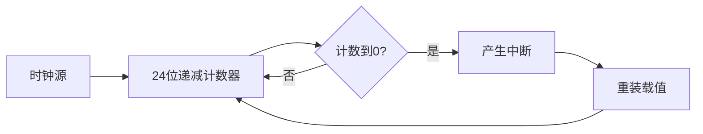

# SysTick系统滴答定时器应用实战

## 学习目标

完成本教程后，你将能够：

- [ ] 理解SysTick定时器的工作原理和特点
- [ ] 掌握SysTick定时器的配置方法
- [ ] 实现精确的毫秒级延时函数
- [ ] 建立系统时间基准并获取运行时间
- [ ] 使用SysTick实现简单的任务调度

## 前置要求

在开始本教程之前，你需要：

**知识要求**：
- 了解C语言基础（变量、函数、指针）
- 熟悉基本的嵌入式概念
- 了解中断的基本概念

**技能要求**：
- 能够使用STM32CubeIDE或Keil MDK
- 会使用基本的调试工具
- 能够编译和下载程序到开发板

## 准备工作

### 硬件准备

| 名称 | 数量 | 说明 | 参考链接 |
|------|------|------|----------|
| STM32开发板 | 1 | STM32F4系列或其他Cortex-M内核 | - |
| LED灯 | 1 | 用于演示延时效果 | - |
| USB数据线 | 1 | 用于下载和供电 | - |

### 软件准备

- **开发环境**：STM32CubeIDE v1.10+ 或 Keil MDK v5.30+
- **驱动程序**：ST-Link驱动
- **辅助工具**：串口调试助手（可选）

### 环境配置

1. 安装开发环境（STM32CubeIDE或Keil MDK）
2. 安装ST-Link驱动程序
3. 连接开发板并测试连接

## SysTick定时器简介

### 什么是SysTick

SysTick（System Tick Timer，系统滴答定时器）是ARM Cortex-M内核中的一个24位递减计数器，它是处理器核心的一部分，所有Cortex-M系列微控制器都包含这个定时器。

**主要特点**：
- 24位递减计数器（计数范围：0 ~ 16,777,215）
- 可配置的时钟源（处理器时钟或外部时钟）
- 自动重装载功能
- 产生中断的能力
- 简单易用，无需复杂配置

### SysTick的典型应用

1. **系统时间基准**：为操作系统提供时间片
2. **延时函数**：实现精确的毫秒级延时
3. **任务调度**：简单的周期性任务调度
4. **性能测试**：测量代码执行时间
5. **超时检测**：实现超时保护机制

### SysTick工作原理



SysTick定时器从重装载值开始递减计数，每个时钟周期减1，当计数到0时产生中断，然后自动重新加载重装载值，继续计数。

## 步骤1：理解SysTick寄存器

### 1.1 SysTick控制和状态寄存器（CTRL）

```c
// SysTick控制寄存器位定义
#define SysTick_CTRL_ENABLE     (1 << 0)  // 使能位
#define SysTick_CTRL_TICKINT    (1 << 1)  // 中断使能位
#define SysTick_CTRL_CLKSOURCE  (1 << 2)  // 时钟源选择位
#define SysTick_CTRL_COUNTFLAG  (1 << 16) // 计数标志位
```

**位功能说明**：
- **ENABLE (bit 0)**: 使能SysTick定时器
  - 0 = 禁用
  - 1 = 使能
- **TICKINT (bit 1)**: 中断使能
  - 0 = 计数到0时不产生中断
  - 1 = 计数到0时产生中断
- **CLKSOURCE (bit 2)**: 时钟源选择
  - 0 = 外部时钟源
  - 1 = 处理器时钟（常用）
- **COUNTFLAG (bit 16)**: 计数标志
  - 读取后自动清零
  - 1 = 自上次读取后计数到0

### 1.2 SysTick重装载值寄存器（LOAD）

```c
// 重装载值寄存器（24位）
SysTick->LOAD = reload_value;  // 设置重装载值
```

**功能说明**：
- 24位寄存器，有效值：0x000001 ~ 0xFFFFFF
- 当计数器减到0时，会自动从LOAD寄存器重新加载值
- 计算公式：`LOAD = (时钟频率 / 中断频率) - 1`

### 1.3 SysTick当前值寄存器（VAL）

```c
// 当前值寄存器（24位）
uint32_t current = SysTick->VAL;  // 读取当前计数值
SysTick->VAL = 0;                 // 写入任意值清零计数器
```

**功能说明**：
- 读取：返回当前计数值
- 写入：清零计数器和COUNTFLAG标志

## 步骤2：配置SysTick定时器

### 2.1 创建项目

1. 打开STM32CubeIDE
2. 创建新的STM32项目
3. 选择你的目标芯片（如STM32F407VGT6）
4. 项目名称：`systick_tutorial`

### 2.2 配置系统时钟

在CubeMX配置界面：
1. 进入Clock Configuration页面
2. 确认系统时钟频率（如168MHz for STM32F4）
3. 记录HCLK频率，这是SysTick的时钟源

### 2.3 基本配置函数

创建SysTick配置函数：

```c
/**
 * @brief  配置SysTick定时器
 * @param  ticks: 重装载值（时钟周期数）
 * @retval 0: 成功, 1: 失败
 */
uint32_t SysTick_Config(uint32_t ticks)
{
    // 检查重装载值是否超出范围
    if ((ticks - 1) > SysTick_LOAD_RELOAD_Msk) {
        return 1;  // 重装载值超出24位范围
    }
    
    // 设置重装载值
    SysTick->LOAD = ticks - 1;
    
    // 设置SysTick中断优先级（可选）
    NVIC_SetPriority(SysTick_IRQn, (1 << __NVIC_PRIO_BITS) - 1);
    
    // 清零当前值
    SysTick->VAL = 0;
    
    // 配置SysTick控制寄存器
    SysTick->CTRL = SysTick_CTRL_CLKSOURCE_Msk |  // 使用处理器时钟
                    SysTick_CTRL_TICKINT_Msk |    // 使能中断
                    SysTick_CTRL_ENABLE_Msk;      // 使能SysTick
    
    return 0;  // 配置成功
}
```

**代码说明**：
- 第7-9行：检查重装载值是否在24位范围内
- 第12行：设置重装载值（减1是因为计数从0开始）
- 第15行：设置中断优先级为最低
- 第18行：清零当前计数值
- 第21-23行：配置控制寄存器，使能定时器和中断

## 步骤3：实现毫秒延时函数

### 3.1 配置1ms中断

假设系统时钟为168MHz，配置SysTick每1ms产生一次中断：

```c
// 全局变量：毫秒计数器
static volatile uint32_t systick_ms = 0;

/**
 * @brief  初始化SysTick为1ms中断
 * @param  None
 * @retval None
 */
void SysTick_Init(void)
{
    // 系统时钟频率（Hz）
    uint32_t SystemCoreClock = 168000000;  // 168MHz
    
    // 配置SysTick为1ms中断
    // 计算公式：ticks = (时钟频率 / 1000) = 168000
    SysTick_Config(SystemCoreClock / 1000);
}

/**
 * @brief  SysTick中断服务函数
 * @param  None
 * @retval None
 */
void SysTick_Handler(void)
{
    // 每1ms执行一次
    systick_ms++;
}
```

**代码说明**：
- 第2行：定义全局毫秒计数器，使用volatile确保每次都从内存读取
- 第16行：配置SysTick，使其每1ms产生一次中断
- 第27行：中断服务函数中递增毫秒计数器

### 3.2 实现延时函数

```c
/**
 * @brief  毫秒延时函数
 * @param  ms: 延时时间（毫秒）
 * @retval None
 */
void delay_ms(uint32_t ms)
{
    uint32_t start = systick_ms;  // 记录开始时间
    
    // 等待指定时间
    while ((systick_ms - start) < ms) {
        // 可以在这里添加低功耗模式
        __NOP();  // 空操作
    }
}

/**
 * @brief  微秒延时函数（粗略）
 * @param  us: 延时时间（微秒）
 * @retval None
 * @note   精度取决于系统时钟频率
 */
void delay_us(uint32_t us)
{
    uint32_t ticks = us * (SystemCoreClock / 1000000);
    uint32_t start = SysTick->VAL;
    uint32_t current;
    
    // 等待指定的时钟周期数
    while (1) {
        current = SysTick->VAL;
        if (start > current) {
            if ((start - current) >= ticks) break;
        } else {
            if ((start + SysTick->LOAD - current) >= ticks) break;
        }
    }
}
```

**代码说明**：
- `delay_ms()`：基于中断的毫秒延时，精度高
- `delay_us()`：基于计数器的微秒延时，不依赖中断

## 步骤4：建立系统时间基准

### 4.1 获取系统运行时间

```c
/**
 * @brief  获取系统运行时间（毫秒）
 * @param  None
 * @retval 系统运行时间（ms）
 */
uint32_t get_tick(void)
{
    return systick_ms;
}

/**
 * @brief  获取系统运行时间（秒）
 * @param  None
 * @retval 系统运行时间（秒）
 */
uint32_t get_tick_sec(void)
{
    return systick_ms / 1000;
}

/**
 * @brief  计算时间差（毫秒）
 * @param  start: 开始时间
 * @retval 时间差（ms）
 */
uint32_t get_elapsed_time(uint32_t start)
{
    return systick_ms - start;
}
```

### 4.2 实际应用示例

```c
// 示例1：测量代码执行时间
void measure_execution_time(void)
{
    uint32_t start_time = get_tick();
    
    // 执行需要测量的代码
    some_function();
    
    uint32_t elapsed = get_elapsed_time(start_time);
    printf("执行时间: %lu ms\n", elapsed);
}

// 示例2：超时检测
uint8_t wait_for_event_with_timeout(uint32_t timeout_ms)
{
    uint32_t start = get_tick();
    
    while (!event_occurred()) {
        // 检查是否超时
        if (get_elapsed_time(start) > timeout_ms) {
            return 0;  // 超时
        }
    }
    
    return 1;  // 事件发生
}

// 示例3：周期性任务
void periodic_task_example(void)
{
    static uint32_t last_time = 0;
    uint32_t current_time = get_tick();
    
    // 每100ms执行一次
    if ((current_time - last_time) >= 100) {
        last_time = current_time;
        
        // 执行周期性任务
        read_sensor();
        update_display();
    }
}
```

**代码说明**：
- 示例1：测量函数执行时间，用于性能分析
- 示例2：实现带超时的等待函数，避免死锁
- 示例3：实现周期性任务，无需阻塞主循环

## 步骤5：简单任务调度

### 5.1 基于SysTick的任务调度器

```c
// 任务结构体定义
typedef struct {
    void (*task_func)(void);  // 任务函数指针
    uint32_t period;          // 任务周期（ms）
    uint32_t last_run;        // 上次运行时间
    uint8_t enabled;          // 任务使能标志
} Task_t;

// 任务列表
#define MAX_TASKS 10
static Task_t task_list[MAX_TASKS];
static uint8_t task_count = 0;

/**
 * @brief  添加任务到调度器
 * @param  task_func: 任务函数指针
 * @param  period: 任务周期（ms）
 * @retval 0: 成功, -1: 失败
 */
int8_t scheduler_add_task(void (*task_func)(void), uint32_t period)
{
    if (task_count >= MAX_TASKS) {
        return -1;  // 任务列表已满
    }
    
    task_list[task_count].task_func = task_func;
    task_list[task_count].period = period;
    task_list[task_count].last_run = get_tick();
    task_list[task_count].enabled = 1;
    task_count++;
    
    return 0;
}

/**
 * @brief  任务调度器主循环
 * @param  None
 * @retval None
 */
void scheduler_run(void)
{
    uint32_t current_time = get_tick();
    
    // 遍历所有任务
    for (uint8_t i = 0; i < task_count; i++) {
        // 检查任务是否使能
        if (!task_list[i].enabled) {
            continue;
        }
        
        // 检查是否到达执行时间
        if ((current_time - task_list[i].last_run) >= task_list[i].period) {
            // 执行任务
            task_list[i].task_func();
            
            // 更新上次运行时间
            task_list[i].last_run = current_time;
        }
    }
}
```

### 5.2 任务调度示例

```c
// 任务1：LED闪烁（每500ms）
void task_led_blink(void)
{
    static uint8_t led_state = 0;
    led_state = !led_state;
    HAL_GPIO_WritePin(LED_GPIO_Port, LED_Pin, led_state);
}

// 任务2：读取传感器（每100ms）
void task_read_sensor(void)
{
    float temperature = read_temperature_sensor();
    // 处理温度数据
}

// 任务3：更新显示（每1000ms）
void task_update_display(void)
{
    update_lcd_display();
}

// 主函数
int main(void)
{
    // 系统初始化
    HAL_Init();
    SystemClock_Config();
    
    // 初始化SysTick
    SysTick_Init();
    
    // 添加任务到调度器
    scheduler_add_task(task_led_blink, 500);    // 500ms周期
    scheduler_add_task(task_read_sensor, 100);  // 100ms周期
    scheduler_add_task(task_update_display, 1000);  // 1000ms周期
    
    // 主循环
    while (1) {
        scheduler_run();  // 运行任务调度器
    }
}
```

**代码说明**：
- 任务调度器支持多个周期性任务
- 每个任务独立运行，互不干扰
- 适合简单的多任务应用场景

## 步骤6：完整示例程序

### 6.1 LED闪烁示例

```c
/* main.c */
#include "main.h"

// 全局变量
static volatile uint32_t systick_ms = 0;

// SysTick中断服务函数
void SysTick_Handler(void)
{
    systick_ms++;
}

// 延时函数
void delay_ms(uint32_t ms)
{
    uint32_t start = systick_ms;
    while ((systick_ms - start) < ms);
}

// 获取系统时间
uint32_t get_tick(void)
{
    return systick_ms;
}

int main(void)
{
    // HAL库初始化
    HAL_Init();
    
    // 配置系统时钟为168MHz
    SystemClock_Config();
    
    // 初始化GPIO（LED）
    GPIO_InitTypeDef GPIO_InitStruct = {0};
    __HAL_RCC_GPIOA_CLK_ENABLE();
    
    GPIO_InitStruct.Pin = GPIO_PIN_5;
    GPIO_InitStruct.Mode = GPIO_MODE_OUTPUT_PP;
    GPIO_InitStruct.Pull = GPIO_NOPULL;
    GPIO_InitStruct.Speed = GPIO_SPEED_FREQ_LOW;
    HAL_GPIO_Init(GPIOA, &GPIO_InitStruct);
    
    // 配置SysTick为1ms中断
    SysTick_Config(SystemCoreClock / 1000);
    
    // 主循环
    while (1)
    {
        // LED闪烁
        HAL_GPIO_WritePin(GPIOA, GPIO_PIN_5, GPIO_PIN_SET);
        delay_ms(500);  // 延时500ms
        
        HAL_GPIO_WritePin(GPIOA, GPIO_PIN_5, GPIO_PIN_RESET);
        delay_ms(500);  // 延时500ms
    }
}
```

### 6.2 多任务示例

```c
/* main.c - 多任务版本 */
#include "main.h"
#include <stdio.h>

// 任务函数声明
void task_led_toggle(void);
void task_print_time(void);
void task_heartbeat(void);

int main(void)
{
    // 系统初始化
    HAL_Init();
    SystemClock_Config();
    
    // 初始化外设
    MX_GPIO_Init();
    MX_USART2_UART_Init();
    
    // 配置SysTick
    SysTick_Config(SystemCoreClock / 1000);
    
    // 添加任务
    scheduler_add_task(task_led_toggle, 500);   // LED闪烁
    scheduler_add_task(task_print_time, 1000);  // 打印时间
    scheduler_add_task(task_heartbeat, 100);    // 心跳检测
    
    printf("系统启动成功!\n");
    
    // 主循环
    while (1)
    {
        scheduler_run();
    }
}

// 任务1：LED翻转
void task_led_toggle(void)
{
    HAL_GPIO_TogglePin(LED_GPIO_Port, LED_Pin);
}

// 任务2：打印系统时间
void task_print_time(void)
{
    uint32_t seconds = get_tick() / 1000;
    printf("系统运行时间: %lu 秒\n", seconds);
}

// 任务3：心跳检测
void task_heartbeat(void)
{
    static uint32_t count = 0;
    count++;
    
    if (count % 10 == 0) {
        printf("心跳: %lu\n", count);
    }
}
```

**运行结果**：
```
系统启动成功!
心跳: 10
系统运行时间: 1 秒
心跳: 20
心跳: 30
系统运行时间: 2 秒
...
```

## 验证测试

### 测试1：基本延时功能

**测试步骤**：
1. 编译并下载程序到开发板
2. 观察LED闪烁频率
3. 使用示波器或逻辑分析仪测量实际延时

**预期结果**：
- LED以1Hz频率闪烁（亮500ms，灭500ms）
- 实际延时误差 < 1%

### 测试2：系统时间准确性

**测试代码**：
```c
void test_systick_accuracy(void)
{
    uint32_t start = get_tick();
    
    // 延时10秒
    delay_ms(10000);
    
    uint32_t elapsed = get_elapsed_time(start);
    printf("预期: 10000ms, 实际: %lu ms\n", elapsed);
    printf("误差: %ld ms\n", (int32_t)elapsed - 10000);
}
```

**预期结果**：
- 10秒延时误差 < 10ms
- 长时间运行不会累积误差

### 测试3：多任务调度

**测试步骤**：
1. 运行多任务示例程序
2. 通过串口观察输出
3. 验证各任务执行周期

**预期结果**：
- 各任务按设定周期执行
- 任务之间不会相互干扰
- 系统运行稳定

## 故障排除

### 问题1：延时不准确

**可能原因**：
- 系统时钟配置错误
- SysTick时钟源选择错误
- 中断被禁用或优先级过低

**解决方法**：
1. 检查SystemCoreClock变量值是否正确
```c
printf("系统时钟: %lu Hz\n", SystemCoreClock);
```

2. 确认SysTick时钟源配置
```c
// 确保使用处理器时钟
SysTick->CTRL |= SysTick_CTRL_CLKSOURCE_Msk;
```

3. 检查中断是否使能
```c
// 确认中断使能位已设置
if (SysTick->CTRL & SysTick_CTRL_TICKINT_Msk) {
    printf("SysTick中断已使能\n");
}
```

### 问题2：systick_ms计数器不增加

**可能原因**：
- SysTick_Handler()函数未被调用
- 中断向量表配置错误
- 全局中断被禁用

**解决方法**：
1. 在SysTick_Handler()中添加调试代码
```c
void SysTick_Handler(void)
{
    systick_ms++;
    // 添加调试输出或翻转GPIO
    HAL_GPIO_TogglePin(DEBUG_GPIO_Port, DEBUG_Pin);
}
```

2. 检查全局中断状态
```c
// 确保全局中断使能
__enable_irq();
```

3. 验证中断向量表
```c
// 检查VTOR寄存器
printf("VTOR: 0x%08lX\n", SCB->VTOR);
```

### 问题3：系统运行一段时间后死机

**可能原因**：
- systick_ms溢出（约49.7天后）
- 任务执行时间过长
- 栈溢出

**解决方法**：
1. 处理计数器溢出
```c
// 使用差值计算，自动处理溢出
uint32_t elapsed = current_time - start_time;  // 即使溢出也正确
```

2. 优化任务执行时间
```c
// 确保任务快速执行
void task_function(void)
{
    // 避免在任务中使用delay_ms()
    // 避免长时间阻塞操作
}
```

3. 增加栈空间
```c
// 在启动文件中增加栈大小
Stack_Size      EQU     0x00001000  ; 4KB
```

### 问题4：在中断中使用delay_ms()导致死锁

**原因分析**：
- delay_ms()依赖SysTick中断
- 在中断中调用会导致死锁

**解决方法**：
```c
// 错误做法
void EXTI0_IRQHandler(void)
{
    delay_ms(100);  // 错误！会死锁
}

// 正确做法
void EXTI0_IRQHandler(void)
{
    // 设置标志，在主循环中处理
    button_pressed = 1;
}

void main_loop(void)
{
    if (button_pressed) {
        button_pressed = 0;
        delay_ms(100);  // 在主循环中延时
        // 处理按键事件
    }
}
```

## 进阶技巧

### 技巧1：低功耗延时

在延时期间进入低功耗模式：

```c
void delay_ms_lowpower(uint32_t ms)
{
    uint32_t start = systick_ms;
    
    while ((systick_ms - start) < ms) {
        // 进入睡眠模式，等待中断唤醒
        __WFI();  // Wait For Interrupt
    }
}
```

### 技巧2：高精度时间戳

结合SysTick计数器实现微秒级时间戳：

```c
/**
 * @brief  获取高精度时间戳（微秒）
 * @param  None
 * @retval 时间戳（us）
 */
uint64_t get_timestamp_us(void)
{
    uint32_t ms, ticks;
    
    // 读取两次确保一致性
    do {
        ms = systick_ms;
        ticks = SysTick->VAL;
    } while (ms != systick_ms);
    
    // 计算微秒数
    uint32_t us_per_tick = 1000000 / SystemCoreClock;
    uint32_t us = ms * 1000 + (SysTick->LOAD - ticks) * us_per_tick;
    
    return us;
}
```

### 技巧3：软件定时器

实现多个软件定时器：

```c
typedef struct {
    uint32_t timeout;     // 超时时间
    uint32_t start_time;  // 开始时间
    uint8_t active;       // 激活标志
} SoftTimer_t;

#define MAX_TIMERS 10
static SoftTimer_t timers[MAX_TIMERS];

// 启动定时器
void timer_start(uint8_t id, uint32_t timeout_ms)
{
    if (id < MAX_TIMERS) {
        timers[id].timeout = timeout_ms;
        timers[id].start_time = get_tick();
        timers[id].active = 1;
    }
}

// 检查定时器是否超时
uint8_t timer_is_timeout(uint8_t id)
{
    if (id >= MAX_TIMERS || !timers[id].active) {
        return 0;
    }
    
    if ((get_tick() - timers[id].start_time) >= timers[id].timeout) {
        timers[id].active = 0;
        return 1;
    }
    
    return 0;
}
```

### 技巧4：性能分析

使用SysTick进行代码性能分析：

```c
typedef struct {
    const char *name;
    uint32_t total_time;
    uint32_t call_count;
    uint32_t max_time;
} ProfileData_t;

#define MAX_PROFILES 20
static ProfileData_t profiles[MAX_PROFILES];
static uint8_t profile_count = 0;

// 开始性能分析
uint32_t profile_start(void)
{
    return get_tick();
}

// 结束性能分析
void profile_end(const char *name, uint32_t start)
{
    uint32_t elapsed = get_elapsed_time(start);
    
    // 查找或创建profile条目
    for (uint8_t i = 0; i < profile_count; i++) {
        if (strcmp(profiles[i].name, name) == 0) {
            profiles[i].total_time += elapsed;
            profiles[i].call_count++;
            if (elapsed > profiles[i].max_time) {
                profiles[i].max_time = elapsed;
            }
            return;
        }
    }
    
    // 新建profile条目
    if (profile_count < MAX_PROFILES) {
        profiles[profile_count].name = name;
        profiles[profile_count].total_time = elapsed;
        profiles[profile_count].call_count = 1;
        profiles[profile_count].max_time = elapsed;
        profile_count++;
    }
}

// 使用示例
void some_function(void)
{
    uint32_t start = profile_start();
    
    // 执行代码
    // ...
    
    profile_end("some_function", start);
}
```

## 注意事项

### 1. SysTick的限制

**24位计数器限制**：
- 最大计数值：16,777,215
- 在168MHz时钟下，最大延时约100ms
- 需要通过中断扩展到更长时间

**中断优先级**：
- SysTick通常设置为最低优先级
- 避免影响其他重要中断
- 在RTOS中由操作系统管理

### 2. 与RTOS的兼容性

**使用RTOS时的注意事项**：
```c
// 使用FreeRTOS时，不要自己配置SysTick
// FreeRTOS会自动配置SysTick用于任务调度

// 错误做法
void main(void)
{
    SysTick_Config(SystemCoreClock / 1000);  // 错误！
    osKernelStart();  // FreeRTOS会重新配置SysTick
}

// 正确做法
void main(void)
{
    // 直接启动RTOS，让它配置SysTick
    osKernelStart();
    
    // 使用RTOS提供的延时函数
    osDelay(1000);  // 使用RTOS的延时
}
```

### 3. 中断安全

**在中断中访问systick_ms**：
```c
// 读取是安全的（32位变量，单次读取是原子的）
uint32_t time = systick_ms;  // 安全

// 如果需要读-改-写操作，需要保护
void increment_counter(void)
{
    __disable_irq();  // 禁用中断
    systick_ms += 100;
    __enable_irq();   // 使能中断
}
```

### 4. 时钟源选择

**处理器时钟 vs 外部时钟**：
```c
// 使用处理器时钟（推荐）
SysTick->CTRL |= SysTick_CTRL_CLKSOURCE_Msk;

// 使用外部时钟（通常是处理器时钟的1/8）
SysTick->CTRL &= ~SysTick_CTRL_CLKSOURCE_Msk;
```

**选择建议**：
- 通常使用处理器时钟（更精确）
- 外部时钟可用于低功耗场景
- 确保时钟源稳定可靠

### 5. 溢出处理

**32位计数器溢出**：
```c
// systick_ms会在约49.7天后溢出
// 使用差值计算可以自动处理溢出

// 正确的时间差计算（自动处理溢出）
uint32_t elapsed = current_time - start_time;

// 示例：即使溢出也能正确计算
// start_time = 0xFFFFFFF0 (接近溢出)
// current_time = 0x00000010 (溢出后)
// elapsed = 0x00000010 - 0xFFFFFFF0 = 0x00000020 = 32ms (正确)
```

## 总结

通过本教程，你学习了：

- ✅ SysTick定时器的工作原理和寄存器配置
- ✅ 如何配置SysTick产生1ms中断
- ✅ 实现精确的毫秒级延时函数
- ✅ 建立系统时间基准并获取运行时间
- ✅ 使用SysTick实现简单的任务调度
- ✅ 常见问题的排查和解决方法
- ✅ 进阶技巧和最佳实践

**关键要点**：
1. SysTick是ARM Cortex-M内核的标准定时器，所有芯片都支持
2. 通过中断方式可以实现精确的时间基准
3. 适合实现延时、计时和简单的任务调度
4. 注意与RTOS的兼容性，避免冲突
5. 正确处理计数器溢出，使用差值计算

## 进阶挑战

尝试以下挑战来巩固学习：

1. **挑战1**：实现一个带优先级的任务调度器
   - 支持任务优先级
   - 高优先级任务优先执行
   - 同优先级任务轮流执行

2. **挑战2**：实现一个软件看门狗
   - 使用SysTick实现超时检测
   - 超时后自动复位系统
   - 支持喂狗操作

3. **挑战3**：实现一个性能监控系统
   - 监控CPU使用率
   - 统计各任务执行时间
   - 通过串口输出性能报告

4. **挑战4**：实现一个事件驱动框架
   - 基于SysTick的事件调度
   - 支持延时事件
   - 支持周期性事件

## 完整代码

完整的示例代码可以在这里下载：

- 基础示例代码
- 任务调度器代码
- 完整工程文件

## 下一步

建议继续学习：

- [通用定时器高级应用](../intermediate/01-advanced-timer.html) - 学习更强大的定时器功能
- [时钟精度优化与校准](../intermediate/02-clock-calibration.html) - 提高时钟精度
- RTOS任务调度原理 - 学习专业的任务调度

## 参考资料

### 官方文档

1. **ARM Cortex-M4 Technical Reference Manual**
   - SysTick定时器详细说明
   - 寄存器定义和配置

2. **STM32F4xx Reference Manual**
   - 系统时钟配置
   - 中断和异常处理

3. **ARM Cortex-M Programming Guide**
   - 中断编程指南
   - 系统定时器使用

### 应用笔记

1. **AN4013: STM32 Cross-series Timer Overview**
   - 定时器对比和选择

2. **AN4044: Floating Point Unit Demonstration**
   - 性能测试方法

### 在线资源

1. [ARM Developer - Cortex-M4](https://developer.arm.com/ip-products/processors/cortex-m/cortex-m4)
2. [STM32 Wiki - SysTick](https://wiki.st.com/stm32mcu/wiki/SysTick)
3. [Embedded Artistry - SysTick Timer](https://embeddedartistry.com/blog/2017/02/20/systick-timer/)

### 相关教程

- [中断系统基础](../../04-interrupt-exception-handling/beginner/01-interrupt-basics.html)
- [时钟系统架构](01-clock-system.html)
- [定时器驱动基础](../../02-device-driver-development/beginner/05-timer-driver.html)

---

**测试环境**:
- 开发板：STM32F407 Discovery
- IDE：STM32CubeIDE v1.10
- HAL库版本：v1.27
- 编译器：GCC ARM 10.3

**反馈**：如果你在学习过程中遇到问题，欢迎在评论区留言或提交Issue！

**版权声明**：本教程采用 [CC BY-SA 4.0](https://creativecommons.org/licenses/by-sa/4.0/) 许可协议。

