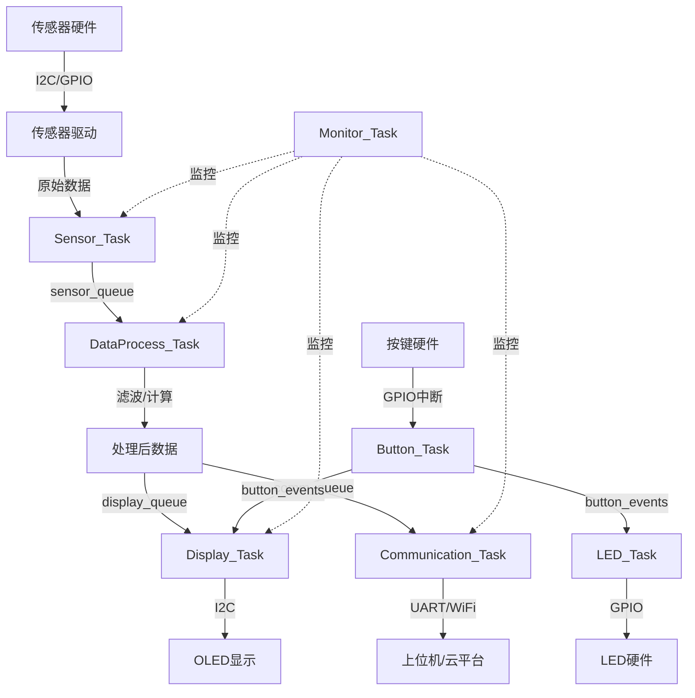

# 基于FreeRTOS的多任务系统设计：智能环境监控系统

## 项目概述

### 项目简介

本项目将设计并实现一个完整的智能环境监控系统，该系统能够实时监测环境参数（温度、湿度、光照、空气质量），通过OLED显示屏显示数据，支持按键交互，并通过串口或WiFi将数据上传到上位机或云平台。

系统采用FreeRTOS作为操作系统，充分展示多任务调度、任务间通信、资源管理、中断处理等核心技术。这是一个真实的工业级项目架构，涵盖了从需求分析、系统设计到代码实现的完整流程。

### 项目演示

```
┌─────────────────────────────────────┐
│   智能环境监控系统                   │
│                                     │
│  ┌─────────────────────────────┐   │
│  │  OLED显示屏                 │   │
│  │  ┌─────────────────────┐    │   │
│  │  │ Temp: 25.3°C        │    │   │
│  │  │ Humi: 65.2%         │    │   │
│  │  │ Light: 450 Lux      │    │   │
│  │  │ AQI: Good           │    │   │
│  │  │ WiFi: Connected     │    │   │
│  │  │ Time: 14:32:15      │    │   │
│  │  └─────────────────────┘    │   │
│  └─────────────────────────────┘   │
│                                     │
│  [按键1] [按键2] [按键3] [LED]     │
│                                     │
│  传感器模块：                       │
│  • DHT22 (温湿度)                  │
│  • BH1750 (光照)                   │
│  • MQ135 (空气质量)                │
│                                     │
│  通信模块：                         │
│  • UART (调试/数据上传)            │
│  • ESP8266 (WiFi可选)              │
└─────────────────────────────────────┘
```

### 学习目标

完成本项目后，你将掌握：

- [ ] **系统架构设计**：学会如何设计一个多任务嵌入式系统的整体架构
- [ ] **任务划分与调度**：掌握如何合理划分任务、设置优先级和调度策略
- [ ] **任务间通信**：熟练使用队列、信号量、事件组等通信机制
- [ ] **资源管理**：学会管理共享资源，避免竞态条件和死锁
- [ ] **中断与RTOS集成**：理解中断服务函数与RTOS任务的协作
- [ ] **内存管理**：掌握FreeRTOS的内存分配策略和优化方法
- [ ] **错误处理**：实现健壮的错误检测和恢复机制
- [ ] **性能优化**：学会分析和优化系统性能
- [ ] **调试技巧**：掌握多任务系统的调试方法和工具
- [ ] **工程实践**：了解真实项目的开发流程和最佳实践

## 项目特点

- ✨ **完整的系统架构**：从底层驱动到应用层的完整设计
- ✨ **多任务协作**：7个任务协同工作，展示任务调度和通信
- ✨ **丰富的通信机制**：使用队列、信号量、互斥量、事件组等
- ✨ **模块化设计**：清晰的模块划分，易于扩展和维护
- ✨ **工业级代码**：遵循编码规范，包含完整的错误处理
- ✨ **性能监控**：实时监控CPU使用率、内存使用、任务状态
- ✨ **可扩展性强**：易于添加新的传感器和功能模块
- ✨ **实用性强**：可直接应用于实际项目

## 技术栈

### 硬件平台
- **主控芯片**：STM32F407VGT6 (Cortex-M4, 168MHz, 192KB RAM, 1MB Flash)
- **开发板**：STM32F4 Discovery 或兼容板
- **调试器**：ST-Link V2 (板载)

### 核心技术
- **操作系统**：FreeRTOS V10.3.1+
- **开发语言**：C语言 (C99标准)
- **HAL库**：STM32 HAL库
- **通信协议**：I2C, UART, SPI

### 开发工具
- **IDE**：STM32CubeIDE v1.10+ 或 Keil MDK v5.30+
- **配置工具**：STM32CubeMX
- **调试工具**：串口调试助手、逻辑分析仪
- **版本控制**：Git

### 第三方库
- FreeRTOS内核
- STM32 HAL库
- DHT22驱动库
- BH1750驱动库
- OLED驱动库 (SSD1306)


## 硬件清单

### 必需硬件

| 名称 | 型号/规格 | 数量 | 用途 | 参考价格 | 购买链接 |
|------|-----------|------|------|----------|----------|
| 开发板 | STM32F4 Discovery | 1 | 主控制器 | ¥100 | [淘宝/立创商城] |
| 温湿度传感器 | DHT22 (AM2302) | 1 | 温湿度检测 | ¥15 | [淘宝] |
| 光照传感器 | BH1750FVI | 1 | 光照强度检测 | ¥5 | [淘宝] |
| 空气质量传感器 | MQ135 | 1 | 空气质量检测 | ¥8 | [淘宝] |
| OLED显示屏 | 0.96" I2C (SSD1306) | 1 | 数据显示 | ¥15 | [淘宝] |
| 按键 | 轻触开关 | 3 | 用户交互 | ¥1 | [淘宝] |
| LED | 5mm LED (红/绿/蓝) | 3 | 状态指示 | ¥1 | [淘宝] |
| 面包板 | 标准面包板 | 1 | 电路搭建 | ¥5 | [淘宝] |
| 杜邦线 | 公对公/公对母 | 若干 | 连接线 | ¥5 | [淘宝] |
| USB数据线 | Micro USB | 1 | 供电和调试 | ¥5 | [淘宝] |

### 可选硬件

| 名称 | 型号/规格 | 数量 | 用途 | 参考价格 |
|------|-----------|------|------|----------|
| WiFi模块 | ESP8266 (ESP-01) | 1 | 无线通信 | ¥10 |
| SD卡模块 | MicroSD卡槽 | 1 | 数据存储 | ¥3 |
| RTC模块 | DS3231 | 1 | 实时时钟 | ¥5 |
| 蜂鸣器 | 有源蜂鸣器 | 1 | 报警提示 | ¥2 |
| 电源模块 | LM2596 DC-DC | 1 | 独立供电 | ¥3 |
| 外壳 | 亚克力外壳 | 1 | 保护电路 | ¥20 |

**总成本**：基础版约 ¥160，完整版约 ¥200

### 工具要求

- 电烙铁（如需焊接）
- 万用表（电路调试）
- 逻辑分析仪（可选，用于调试通信协议）

## 软件要求

### 开发环境

**必需软件**：
- STM32CubeIDE v1.10.0 或更高版本
- STM32CubeMX v6.5.0 或更高版本
- Git v2.30+ (版本控制)

**可选软件**：
- Keil MDK v5.30+ (替代IDE)
- IAR Embedded Workbench (替代IDE)
- Visual Studio Code (代码编辑)

### 驱动和工具

- ST-Link驱动程序
- 串口调试助手 (推荐：SSCOM、PuTTY、Tera Term)
- MQTT客户端 (可选，用于测试云端通信)
- Wireshark (可选，用于网络调试)

### 辅助工具

- Python 3.8+ (用于数据分析脚本)
- Node.js (可选，用于Web界面)
- MQTT Broker (可选，如Mosquitto)

## 系统架构

### 整体架构

系统采用分层架构设计，从底层到应用层清晰分离：

```
┌─────────────────────────────────────────────────────────┐
│                    应用层 (Application Layer)            │
│  ┌──────────────┐  ┌──────────────┐  ┌──────────────┐  │
│  │  UI管理      │  │  数据处理    │  │  业务逻辑    │  │
│  │  Display     │  │  Processing  │  │  Logic       │  │
│  └──────────────┘  └──────────────┘  └──────────────┘  │
├─────────────────────────────────────────────────────────┤
│                  中间件层 (Middleware Layer)             │
│  ┌──────────────┐  ┌──────────────┐  ┌──────────────┐  │
│  │  FreeRTOS    │  │  通信协议    │  │  数据管理    │  │
│  │  Kernel      │  │  Protocol    │  │  Data Mgmt   │  │
│  └──────────────┘  └──────────────┘  └──────────────┘  │
├─────────────────────────────────────────────────────────┤
│                   驱动层 (Driver Layer)                  │
│  ┌──────────────┐  ┌──────────────┐  ┌──────────────┐  │
│  │  传感器驱动  │  │  显示驱动    │  │  通信驱动    │  │
│  │  Sensors     │  │  Display     │  │  Comm        │  │
│  └──────────────┘  └──────────────┘  └──────────────┘  │
├─────────────────────────────────────────────────────────┤
│                   硬件层 (Hardware Layer)                │
│  ┌──────────────┐  ┌──────────────┐  ┌──────────────┐  │
│  │  STM32 HAL   │  │  外设配置    │  │  时钟管理    │  │
│  │  Library     │  │  Peripheral  │  │  Clock       │  │
│  └──────────────┘  └──────────────┘  └──────────────┘  │
└─────────────────────────────────────────────────────────┘
```

### 任务架构

系统包含7个主要任务，每个任务负责特定功能：

```
任务优先级分配 (数字越大优先级越高)：

┌─────────────────────────────────────────────────────┐
│ Priority 5: Sensor_Task (传感器采集任务)            │
│             周期: 1000ms                            │
│             功能: 读取所有传感器数据                │
└─────────────────────────────────────────────────────┘
                        ↓ (Queue)
┌─────────────────────────────────────────────────────┐
│ Priority 4: DataProcess_Task (数据处理任务)         │
│             周期: 触发式                            │
│             功能: 数据滤波、计算、异常检测          │
└─────────────────────────────────────────────────────┘
                        ↓ (Queue)
┌─────────────────────────────────────────────────────┐
│ Priority 3: Display_Task (显示任务)                 │
│             周期: 200ms                             │
│             功能: 更新OLED显示内容                  │
└─────────────────────────────────────────────────────┘

┌─────────────────────────────────────────────────────┐
│ Priority 3: Communication_Task (通信任务)           │
│             周期: 5000ms                            │
│             功能: 上传数据到上位机/云平台           │
└─────────────────────────────────────────────────────┘

┌─────────────────────────────────────────────────────┐
│ Priority 2: Button_Task (按键任务)                  │
│             周期: 50ms                              │
│             功能: 按键扫描、消抖、事件处理          │
└─────────────────────────────────────────────────────┘

┌─────────────────────────────────────────────────────┐
│ Priority 2: LED_Task (LED任务)                      │
│             周期: 500ms                             │
│             功能: LED状态指示、闪烁控制             │
└─────────────────────────────────────────────────────┘

┌─────────────────────────────────────────────────────┐
│ Priority 1: Monitor_Task (系统监控任务)             │
│             周期: 10000ms                           │
│             功能: CPU使用率、内存监控、任务状态     │
└─────────────────────────────────────────────────────┘
```

### 通信机制

系统使用多种FreeRTOS通信机制实现任务间协作：

```
通信对象使用图：

Sensor_Task ──[Queue: sensor_queue]──> DataProcess_Task
                                              │
DataProcess_Task ──[Queue: display_queue]──> Display_Task
                                              │
DataProcess_Task ──[Queue: comm_queue]────> Communication_Task

Button_Task ──[EventGroup: button_events]──> Display_Task
                                              │
                                              └──> LED_Task

All Tasks ──[Mutex: i2c_mutex]──> I2C Bus (共享资源)
All Tasks ──[Mutex: uart_mutex]──> UART (共享资源)

Timer_Callback ──[Semaphore: sensor_sem]──> Sensor_Task
```


### 数据流图



### 模块说明

#### 1. 传感器采集模块 (Sensor Module)

**功能**：
- 周期性读取DHT22温湿度数据
- 周期性读取BH1750光照数据
- 周期性读取MQ135空气质量数据
- 数据打包发送到数据处理任务

**接口**：
- I2C接口：BH1750
- GPIO接口：DHT22 (单总线协议)
- ADC接口：MQ135

**更新频率**：1Hz (每秒采集一次)

**数据结构**：
```c
typedef struct {
    float temperature;      // 温度 (°C)
    float humidity;         // 湿度 (%)
    uint16_t light;         // 光照 (Lux)
    uint16_t air_quality;   // 空气质量 (ADC值)
    uint32_t timestamp;     // 时间戳
} SensorData_t;
```

#### 2. 数据处理模块 (Data Processing Module)

**功能**：
- 对传感器数据进行滤波处理（移动平均滤波）
- 数据有效性检查和异常值剔除
- 计算衍生数据（如舒适度指数）
- 异常情况检测和报警

**算法**：
- 移动平均滤波（窗口大小：5）
- 异常值检测（3σ原则）
- 舒适度计算（基于温湿度）

**处理周期**：触发式（收到数据立即处理）

**数据结构**：
```c
typedef struct {
    float temperature;      // 滤波后温度
    float humidity;         // 滤波后湿度
    uint16_t light;         // 滤波后光照
    uint16_t air_quality;   // 滤波后空气质量
    uint8_t comfort_index;  // 舒适度指数 (0-100)
    uint8_t alarm_flags;    // 报警标志位
    uint32_t timestamp;     // 时间戳
} ProcessedData_t;
```

#### 3. 显示模块 (Display Module)

**功能**：
- 在OLED屏幕上显示环境数据
- 支持多页面切换（通过按键）
- 显示系统状态信息
- 显示报警信息

**接口**：I2C (OLED SSD1306)

**刷新率**：5Hz (每200ms刷新一次)

**显示页面**：
- 页面1：主界面（温湿度、光照、空气质量）
- 页面2：系统信息（CPU使用率、内存、运行时间）
- 页面3：网络状态（WiFi连接、数据上传状态）

#### 4. 通信模块 (Communication Module)

**功能**：
- 通过UART发送数据到上位机
- 可选：通过ESP8266发送数据到云平台
- 接收上位机命令
- 数据格式化（JSON格式）

**协议**：
- UART：115200 bps, 8N1
- WiFi：MQTT协议（可选）

**上传周期**：5秒一次

**数据格式**：
```json
{
    "device_id": "ENV_MONITOR_001",
    "timestamp": 1234567890,
    "data": {
        "temperature": 25.3,
        "humidity": 65.2,
        "light": 450,
        "air_quality": 85,
        "comfort": 78
    }
}
```

#### 5. 按键模块 (Button Module)

**功能**：
- 按键扫描和消抖
- 检测按键事件（短按、长按、双击）
- 发送按键事件到其他任务

**按键定义**：
- 按键1：切换显示页面
- 按键2：手动触发数据上传
- 按键3：系统复位/进入配置模式

**扫描周期**：20Hz (每50ms扫描一次)

**消抖时间**：20ms

#### 6. LED指示模块 (LED Module)

**功能**：
- LED状态指示
- 不同闪烁模式表示不同状态
- 报警时LED快速闪烁

**LED定义**：
- LED1 (绿色)：系统运行指示（慢闪）
- LED2 (蓝色)：数据上传指示（快闪）
- LED3 (红色)：报警指示（常亮或快闪）

**更新周期**：2Hz (每500ms更新一次)

#### 7. 系统监控模块 (Monitor Module)

**功能**：
- 监控CPU使用率
- 监控内存使用情况
- 监控任务运行状态
- 检测任务堆栈溢出
- 记录系统运行时间

**监控周期**：0.1Hz (每10秒监控一次)

**监控数据**：
```c
typedef struct {
    uint8_t cpu_usage;          // CPU使用率 (%)
    uint32_t free_heap;         // 空闲堆内存 (bytes)
    uint32_t min_free_heap;     // 历史最小空闲堆
    uint32_t runtime_seconds;   // 运行时间 (秒)
    TaskStatus_t task_status[7]; // 各任务状态
} SystemMonitor_t;
```

## 电路设计

### 系统接线图

```
STM32F407 Discovery 开发板接线：

传感器连接：
┌─────────────────────────────────────┐
│ DHT22 温湿度传感器                  │
│   VCC  ──> 3.3V                     │
│   DATA ──> PA0 (GPIO)               │
│   GND  ──> GND                      │
└─────────────────────────────────────┘

┌─────────────────────────────────────┐
│ BH1750 光照传感器                   │
│   VCC  ──> 3.3V                     │
│   SDA  ──> PB7 (I2C1_SDA)           │
│   SCL  ──> PB6 (I2C1_SCL)           │
│   GND  ──> GND                      │
└─────────────────────────────────────┘

┌─────────────────────────────────────┐
│ MQ135 空气质量传感器                │
│   VCC  ──> 5V                       │
│   AOUT ──> PA1 (ADC1_IN1)           │
│   GND  ──> GND                      │
└─────────────────────────────────────┘

显示器连接：
┌─────────────────────────────────────┐
│ OLED 0.96" (SSD1306)                │
│   VCC  ──> 3.3V                     │
│   SDA  ──> PB7 (I2C1_SDA) [共享]    │
│   SCL  ──> PB6 (I2C1_SCL) [共享]    │
│   GND  ──> GND                      │
└─────────────────────────────────────┘

按键连接：
┌─────────────────────────────────────┐
│ 按键1 ──> PC0 (GPIO_INPUT)          │
│ 按键2 ──> PC1 (GPIO_INPUT)          │
│ 按键3 ──> PC2 (GPIO_INPUT)          │
│ (所有按键另一端接GND，使用内部上拉) │
└─────────────────────────────────────┘

LED连接：
┌─────────────────────────────────────┐
│ LED1 (绿) ──> PD12 (GPIO_OUTPUT)    │
│ LED2 (蓝) ──> PD13 (GPIO_OUTPUT)    │
│ LED3 (红) ──> PD14 (GPIO_OUTPUT)    │
│ (所有LED串联330Ω电阻后接GND)       │
└─────────────────────────────────────┘

通信接口：
┌─────────────────────────────────────┐
│ UART1 (调试/数据上传)               │
│   TX   ──> PA9  (USART1_TX)         │
│   RX   ──> PA10 (USART1_RX)         │
└─────────────────────────────────────┘

可选WiFi模块：
┌─────────────────────────────────────┐
│ ESP8266 (ESP-01)                    │
│   VCC  ──> 3.3V                     │
│   TX   ──> PA3 (USART2_RX)          │
│   RX   ──> PA2 (USART2_TX)          │
│   GND  ──> GND                      │
│   CH_PD ──> 3.3V (使能)             │
└─────────────────────────────────────┘
```

### 引脚分配表

| 功能 | 引脚 | 模式 | 说明 |
|------|------|------|------|
| DHT22_DATA | PA0 | GPIO_Input/Output | 单总线协议 |
| MQ135_AOUT | PA1 | ADC1_IN1 | 模拟输入 |
| USART2_TX | PA2 | USART2_TX | ESP8266通信 |
| USART2_RX | PA3 | USART2_RX | ESP8266通信 |
| USART1_TX | PA9 | USART1_TX | 调试串口 |
| USART1_RX | PA10 | USART1_RX | 调试串口 |
| I2C1_SCL | PB6 | I2C1_SCL | I2C时钟 |
| I2C1_SDA | PB7 | I2C1_SDA | I2C数据 |
| BUTTON1 | PC0 | GPIO_Input | 按键1 |
| BUTTON2 | PC1 | GPIO_Input | 按键2 |
| BUTTON3 | PC2 | GPIO_Input | 按键3 |
| LED1_GREEN | PD12 | GPIO_Output | 绿色LED |
| LED2_BLUE | PD13 | GPIO_Output | 蓝色LED |
| LED3_RED | PD14 | GPIO_Output | 红色LED |

### 注意事项

1. **I2C总线**：BH1750和OLED共享I2C总线，需要使用互斥量保护
2. **电源**：MQ135需要5V供电，其他传感器使用3.3V
3. **上拉电阻**：I2C总线需要4.7kΩ上拉电阻（通常模块自带）
4. **按键消抖**：使用软件消抖，无需外部电容
5. **LED限流**：每个LED串联330Ω电阻


## 实现步骤

### 阶段1：项目创建与基础配置 (预计30分钟)

#### 1.1 使用STM32CubeMX创建项目

**步骤**：

1. **启动STM32CubeMX**，选择芯片型号：STM32F407VGTx

2. **配置时钟**：
   - 选择外部高速时钟 (HSE): 8MHz
   - 配置PLL使系统时钟达到168MHz
   - APB1时钟: 42MHz
   - APB2时钟: 84MHz

3. **配置外设**：

   **GPIO配置**：
   ```
   PA0  - GPIO_Input (DHT22_DATA)
   PC0  - GPIO_Input (BUTTON1, Pull-up)
   PC1  - GPIO_Input (BUTTON2, Pull-up)
   PC2  - GPIO_Input (BUTTON3, Pull-up)
   PD12 - GPIO_Output (LED1_GREEN)
   PD13 - GPIO_Output (LED2_BLUE)
   PD14 - GPIO_Output (LED3_RED)
   ```

   **I2C1配置**：
   ```
   Mode: I2C
   I2C Speed: 100 kHz (Standard Mode)
   PB6 - I2C1_SCL
   PB7 - I2C1_SDA
   ```

   **USART1配置**：
   ```
   Mode: Asynchronous
   Baud Rate: 115200
   Word Length: 8 Bits
   Stop Bits: 1
   Parity: None
   PA9  - USART1_TX
   PA10 - USART1_RX
   ```

   **ADC1配置**：
   ```
   PA1 - ADC1_IN1
   Resolution: 12 bits
   Conversion Mode: Continuous
   ```

4. **配置FreeRTOS**：
   - Middleware → FREERTOS → Enable
   - Interface: CMSIS_V1 或 CMSIS_V2
   - Kernel Settings:
     ```
     USE_PREEMPTION: Enabled
     CPU_CLOCK_HZ: 168000000
     TICK_RATE_HZ: 1000
     MAX_PRIORITIES: 8
     MINIMAL_STACK_SIZE: 128
     TOTAL_HEAP_SIZE: 20480 (20KB)
     ```

5. **生成代码**：
   - Project Name: EnvMonitor
   - Toolchain: STM32CubeIDE
   - 生成代码

#### 1.2 项目结构组织

在生成的项目中创建以下目录结构：

```
EnvMonitor/
├── Core/
│   ├── Inc/
│   │   ├── main.h
│   │   ├── FreeRTOSConfig.h
│   │   └── ...
│   └── Src/
│       ├── main.c
│       ├── freertos.c
│       └── ...
├── Drivers/
│   ├── STM32F4xx_HAL_Driver/
│   └── CMSIS/
├── Middlewares/
│   └── Third_Party/
│       └── FreeRTOS/
├── App/                    # 新建应用层目录
│   ├── Inc/
│   │   ├── app_config.h
│   │   ├── sensor_task.h
│   │   ├── data_process_task.h
│   │   ├── display_task.h
│   │   ├── communication_task.h
│   │   ├── button_task.h
│   │   ├── led_task.h
│   │   └── monitor_task.h
│   └── Src/
│       ├── sensor_task.c
│       ├── data_process_task.c
│       ├── display_task.c
│       ├── communication_task.c
│       ├── button_task.c
│       ├── led_task.c
│       └── monitor_task.c
├── BSP/                    # 新建板级支持包目录
│   ├── Inc/
│   │   ├── bsp_dht22.h
│   │   ├── bsp_bh1750.h
│   │   ├── bsp_mq135.h
│   │   └── bsp_oled.h
│   └── Src/
│       ├── bsp_dht22.c
│       ├── bsp_bh1750.c
│       ├── bsp_mq135.c
│       └── bsp_oled.c
└── README.md
```

#### 1.3 配置FreeRTOSConfig.h

编辑`Core/Inc/FreeRTOSConfig.h`，添加以下配置：

```c
/* FreeRTOS配置 */
#define configUSE_PREEMPTION                     1
#define configUSE_IDLE_HOOK                      0
#define configUSE_TICK_HOOK                      0
#define configCPU_CLOCK_HZ                       ((unsigned long)168000000)
#define configTICK_RATE_HZ                       ((TickType_t)1000)
#define configMAX_PRIORITIES                     (8)
#define configMINIMAL_STACK_SIZE                 ((uint16_t)128)
#define configTOTAL_HEAP_SIZE                    ((size_t)20480)
#define configMAX_TASK_NAME_LEN                  (16)
#define configUSE_16_BIT_TICKS                   0
#define configIDLE_SHOULD_YIELD                  1
#define configUSE_MUTEXES                        1
#define configUSE_RECURSIVE_MUTEXES              1
#define configUSE_COUNTING_SEMAPHORES            1
#define configQUEUE_REGISTRY_SIZE                8
#define configUSE_QUEUE_SETS                     0
#define configUSE_TIME_SLICING                   1
#define configUSE_NEWLIB_REENTRANT               0
#define configENABLE_BACKWARD_COMPATIBILITY      0
#define configNUM_THREAD_LOCAL_STORAGE_POINTERS  5

/* 内存分配方案 */
#define configSUPPORT_STATIC_ALLOCATION          0
#define configSUPPORT_DYNAMIC_ALLOCATION         1

/* 钩子函数 */
#define configUSE_MALLOC_FAILED_HOOK             1
#define configCHECK_FOR_STACK_OVERFLOW           2

/* 运行时统计 */
#define configGENERATE_RUN_TIME_STATS            1
#define configUSE_TRACE_FACILITY                 1
#define configUSE_STATS_FORMATTING_FUNCTIONS     1

/* 定时器 */
#define configUSE_TIMERS                         1
#define configTIMER_TASK_PRIORITY                (6)
#define configTIMER_QUEUE_LENGTH                 10
#define configTIMER_TASK_STACK_DEPTH             256

/* 中断优先级 */
#define configLIBRARY_LOWEST_INTERRUPT_PRIORITY  15
#define configLIBRARY_MAX_SYSCALL_INTERRUPT_PRIORITY 5
#define configKERNEL_INTERRUPT_PRIORITY          (configLIBRARY_LOWEST_INTERRUPT_PRIORITY << 4)
#define configMAX_SYSCALL_INTERRUPT_PRIORITY     (configLIBRARY_MAX_SYSCALL_INTERRUPT_PRIORITY << 4)

/* 运行时统计时钟配置 */
extern void ConfigureTimerForRunTimeStats(void);
extern uint32_t GetRunTimeCounterValue(void);
#define portCONFIGURE_TIMER_FOR_RUN_TIME_STATS() ConfigureTimerForRunTimeStats()
#define portGET_RUN_TIME_COUNTER_VALUE()         GetRunTimeCounterValue()
```

#### 1.4 创建应用配置文件

创建`App/Inc/app_config.h`：

```c
#ifndef APP_CONFIG_H
#define APP_CONFIG_H

#include "FreeRTOS.h"
#include "task.h"
#include "queue.h"
#include "semphr.h"
#include "event_groups.h"

/* 任务优先级定义 */
#define PRIORITY_SENSOR         5
#define PRIORITY_DATA_PROCESS   4
#define PRIORITY_DISPLAY        3
#define PRIORITY_COMMUNICATION  3
#define PRIORITY_BUTTON         2
#define PRIORITY_LED            2
#define PRIORITY_MONITOR        1

/* 任务堆栈大小 */
#define STACK_SIZE_SENSOR       256
#define STACK_SIZE_DATA_PROCESS 512
#define STACK_SIZE_DISPLAY      256
#define STACK_SIZE_COMM         512
#define STACK_SIZE_BUTTON       128
#define STACK_SIZE_LED          128
#define STACK_SIZE_MONITOR      256

/* 队列长度 */
#define QUEUE_LENGTH_SENSOR     5
#define QUEUE_LENGTH_DISPLAY    3
#define QUEUE_LENGTH_COMM       10

/* 事件标志位定义 */
#define EVENT_BUTTON1_PRESSED   (1 << 0)
#define EVENT_BUTTON2_PRESSED   (1 << 1)
#define EVENT_BUTTON3_PRESSED   (1 << 2)
#define EVENT_ALARM_TEMP_HIGH   (1 << 3)
#define EVENT_ALARM_HUMI_HIGH   (1 << 4)
#define EVENT_ALARM_AQI_BAD     (1 << 5)

/* 数据结构定义 */
typedef struct {
    float temperature;
    float humidity;
    uint16_t light;
    uint16_t air_quality;
    uint32_t timestamp;
} SensorData_t;

typedef struct {
    float temperature;
    float humidity;
    uint16_t light;
    uint16_t air_quality;
    uint8_t comfort_index;
    uint8_t alarm_flags;
    uint32_t timestamp;
} ProcessedData_t;

typedef struct {
    uint8_t cpu_usage;
    uint32_t free_heap;
    uint32_t min_free_heap;
    uint32_t runtime_seconds;
} SystemMonitor_t;

/* 全局对象声明 */
extern QueueHandle_t sensor_queue;
extern QueueHandle_t display_queue;
extern QueueHandle_t comm_queue;
extern SemaphoreHandle_t i2c_mutex;
extern SemaphoreHandle_t uart_mutex;
extern EventGroupHandle_t system_events;

#endif /* APP_CONFIG_H */
```

**检查清单**：
- [ ] 项目成功创建并可以编译
- [ ] 时钟配置正确（168MHz）
- [ ] 所有外设引脚配置正确
- [ ] FreeRTOS配置完成
- [ ] 目录结构创建完成


### 阶段2：驱动层实现 (预计60分钟)

#### 2.1 DHT22温湿度传感器驱动

创建`BSP/Inc/bsp_dht22.h`：

```c
#ifndef BSP_DHT22_H
#define BSP_DHT22_H

#include "main.h"
#include <stdbool.h>

/* DHT22引脚定义 */
#define DHT22_GPIO_PORT     GPIOA
#define DHT22_GPIO_PIN      GPIO_PIN_0

/* 函数声明 */
HAL_StatusTypeDef BSP_DHT22_Init(void);
HAL_StatusTypeDef BSP_DHT22_Read(float *temperature, float *humidity);

#endif /* BSP_DHT22_H */
```

创建`BSP/Src/bsp_dht22.c`：

```c
#include "bsp_dht22.h"
#include "FreeRTOS.h"
#include "task.h"

/* 私有函数声明 */
static void DHT22_SetPinOutput(void);
static void DHT22_SetPinInput(void);
static void DHT22_WriteBit(uint8_t bit);
static uint8_t DHT22_ReadBit(void);
static void DHT22_DelayUs(uint32_t us);

/**
 * @brief  初始化DHT22
 */
HAL_StatusTypeDef BSP_DHT22_Init(void) {
    GPIO_InitTypeDef GPIO_InitStruct = {0};
    
    /* 配置为输入模式 */
    GPIO_InitStruct.Pin = DHT22_GPIO_PIN;
    GPIO_InitStruct.Mode = GPIO_MODE_INPUT;
    GPIO_InitStruct.Pull = GPIO_PULLUP;
    GPIO_InitStruct.Speed = GPIO_SPEED_FREQ_HIGH;
    HAL_GPIO_Init(DHT22_GPIO_PORT, &GPIO_InitStruct);
    
    return HAL_OK;
}

/**
 * @brief  读取DHT22数据
 * @param  temperature: 温度指针
 * @param  humidity: 湿度指针
 * @retval HAL状态
 */
HAL_StatusTypeDef BSP_DHT22_Read(float *temperature, float *humidity) {
    uint8_t data[5] = {0};
    uint8_t i, j;
    uint16_t temp_value, humi_value;
    
    /* 发送起始信号 */
    DHT22_SetPinOutput();
    HAL_GPIO_WritePin(DHT22_GPIO_PORT, DHT22_GPIO_PIN, GPIO_PIN_RESET);
    vTaskDelay(pdMS_TO_TICKS(2));  // 拉低至少1ms
    HAL_GPIO_WritePin(DHT22_GPIO_PORT, DHT22_GPIO_PIN, GPIO_PIN_SET);
    DHT22_DelayUs(30);
    
    /* 切换到输入模式 */
    DHT22_SetPinInput();
    
    /* 等待DHT22响应 */
    uint32_t timeout = 1000;
    while(HAL_GPIO_ReadPin(DHT22_GPIO_PORT, DHT22_GPIO_PIN) == GPIO_PIN_SET) {
        if(--timeout == 0) return HAL_TIMEOUT;
        DHT22_DelayUs(1);
    }
    
    timeout = 1000;
    while(HAL_GPIO_ReadPin(DHT22_GPIO_PORT, DHT22_GPIO_PIN) == GPIO_PIN_RESET) {
        if(--timeout == 0) return HAL_TIMEOUT;
        DHT22_DelayUs(1);
    }
    
    timeout = 1000;
    while(HAL_GPIO_ReadPin(DHT22_GPIO_PORT, DHT22_GPIO_PIN) == GPIO_PIN_SET) {
        if(--timeout == 0) return HAL_TIMEOUT;
        DHT22_DelayUs(1);
    }
    
    /* 读取40位数据 */
    for(i = 0; i < 5; i++) {
        for(j = 0; j < 8; j++) {
            /* 等待数据位开始 */
            timeout = 1000;
            while(HAL_GPIO_ReadPin(DHT22_GPIO_PORT, DHT22_GPIO_PIN) == GPIO_PIN_RESET) {
                if(--timeout == 0) return HAL_TIMEOUT;
                DHT22_DelayUs(1);
            }
            
            /* 延时判断是0还是1 */
            DHT22_DelayUs(40);
            
            if(HAL_GPIO_ReadPin(DHT22_GPIO_PORT, DHT22_GPIO_PIN) == GPIO_PIN_SET) {
                data[i] |= (1 << (7 - j));
            }
            
            /* 等待数据位结束 */
            timeout = 1000;
            while(HAL_GPIO_ReadPin(DHT22_GPIO_PORT, DHT22_GPIO_PIN) == GPIO_PIN_SET) {
                if(--timeout == 0) return HAL_TIMEOUT;
                DHT22_DelayUs(1);
            }
        }
    }
    
    /* 校验和验证 */
    if(data[4] != ((data[0] + data[1] + data[2] + data[3]) & 0xFF)) {
        return HAL_ERROR;
    }
    
    /* 计算温湿度 */
    humi_value = (data[0] << 8) | data[1];
    temp_value = (data[2] << 8) | data[3];
    
    *humidity = humi_value / 10.0f;
    *temperature = temp_value / 10.0f;
    
    /* 处理负温度 */
    if(data[2] & 0x80) {
        *temperature = -(*temperature);
    }
    
    return HAL_OK;
}

/* 私有函数实现 */
static void DHT22_SetPinOutput(void) {
    GPIO_InitTypeDef GPIO_InitStruct = {0};
    GPIO_InitStruct.Pin = DHT22_GPIO_PIN;
    GPIO_InitStruct.Mode = GPIO_MODE_OUTPUT_PP;
    GPIO_InitStruct.Pull = GPIO_NOPULL;
    GPIO_InitStruct.Speed = GPIO_SPEED_FREQ_HIGH;
    HAL_GPIO_Init(DHT22_GPIO_PORT, &GPIO_InitStruct);
}

static void DHT22_SetPinInput(void) {
    GPIO_InitTypeDef GPIO_InitStruct = {0};
    GPIO_InitStruct.Pin = DHT22_GPIO_PIN;
    GPIO_InitStruct.Mode = GPIO_MODE_INPUT;
    GPIO_InitStruct.Pull = GPIO_PULLUP;
    GPIO_InitStruct.Speed = GPIO_SPEED_FREQ_HIGH;
    HAL_GPIO_Init(DHT22_GPIO_PORT, &GPIO_InitStruct);
}

static void DHT22_DelayUs(uint32_t us) {
    uint32_t ticks = us * (SystemCoreClock / 1000000) / 9;
    while(ticks--);
}
```

#### 2.2 BH1750光照传感器驱动

创建`BSP/Inc/bsp_bh1750.h`：

```c
#ifndef BSP_BH1750_H
#define BSP_BH1750_H

#include "main.h"

/* BH1750 I2C地址 */
#define BH1750_ADDR         0x23 << 1  // 7位地址左移1位

/* BH1750命令 */
#define BH1750_POWER_ON     0x01
#define BH1750_POWER_OFF    0x00
#define BH1750_RESET        0x07
#define BH1750_CONT_H_MODE  0x10  // 连续高分辨率模式
#define BH1750_CONT_H_MODE2 0x11  // 连续高分辨率模式2
#define BH1750_CONT_L_MODE  0x13  // 连续低分辨率模式
#define BH1750_ONE_H_MODE   0x20  // 单次高分辨率模式
#define BH1750_ONE_H_MODE2  0x21  // 单次高分辨率模式2
#define BH1750_ONE_L_MODE   0x23  // 单次低分辨率模式

/* 函数声明 */
HAL_StatusTypeDef BSP_BH1750_Init(I2C_HandleTypeDef *hi2c);
HAL_StatusTypeDef BSP_BH1750_Read(I2C_HandleTypeDef *hi2c, uint16_t *light);

#endif /* BSP_BH1750_H */
```

创建`BSP/Src/bsp_bh1750.c`：

```c
#include "bsp_bh1750.h"
#include "FreeRTOS.h"
#include "task.h"

/**
 * @brief  初始化BH1750
 */
HAL_StatusTypeDef BSP_BH1750_Init(I2C_HandleTypeDef *hi2c) {
    uint8_t cmd;
    
    /* 上电 */
    cmd = BH1750_POWER_ON;
    if(HAL_I2C_Master_Transmit(hi2c, BH1750_ADDR, &cmd, 1, 100) != HAL_OK) {
        return HAL_ERROR;
    }
    
    vTaskDelay(pdMS_TO_TICKS(10));
    
    /* 设置为连续高分辨率模式 */
    cmd = BH1750_CONT_H_MODE;
    if(HAL_I2C_Master_Transmit(hi2c, BH1750_ADDR, &cmd, 1, 100) != HAL_OK) {
        return HAL_ERROR;
    }
    
    vTaskDelay(pdMS_TO_TICKS(180));  // 等待测量完成
    
    return HAL_OK;
}

/**
 * @brief  读取BH1750光照值
 * @param  hi2c: I2C句柄
 * @param  light: 光照值指针 (单位: Lux)
 * @retval HAL状态
 */
HAL_StatusTypeDef BSP_BH1750_Read(I2C_HandleTypeDef *hi2c, uint16_t *light) {
    uint8_t data[2];
    
    /* 读取2字节数据 */
    if(HAL_I2C_Master_Receive(hi2c, BH1750_ADDR, data, 2, 100) != HAL_OK) {
        return HAL_ERROR;
    }
    
    /* 计算光照值 */
    *light = (data[0] << 8) | data[1];
    *light = *light / 1.2;  // 转换为Lux
    
    return HAL_OK;
}
```

#### 2.3 MQ135空气质量传感器驱动

创建`BSP/Inc/bsp_mq135.h`：

```c
#ifndef BSP_MQ135_H
#define BSP_MQ135_H

#include "main.h"

/* 函数声明 */
HAL_StatusTypeDef BSP_MQ135_Init(ADC_HandleTypeDef *hadc);
HAL_StatusTypeDef BSP_MQ135_Read(ADC_HandleTypeDef *hadc, uint16_t *adc_value);
uint8_t BSP_MQ135_GetAQI(uint16_t adc_value);

#endif /* BSP_MQ135_H */
```

创建`BSP/Src/bsp_mq135.c`：

```c
#include "bsp_mq135.h"

/**
 * @brief  初始化MQ135
 */
HAL_StatusTypeDef BSP_MQ135_Init(ADC_HandleTypeDef *hadc) {
    /* 启动ADC */
    if(HAL_ADC_Start(hadc) != HAL_OK) {
        return HAL_ERROR;
    }
    
    return HAL_OK;
}

/**
 * @brief  读取MQ135 ADC值
 * @param  hadc: ADC句柄
 * @param  adc_value: ADC值指针
 * @retval HAL状态
 */
HAL_StatusTypeDef BSP_MQ135_Read(ADC_HandleTypeDef *hadc, uint16_t *adc_value) {
    /* 等待转换完成 */
    if(HAL_ADC_PollForConversion(hadc, 100) != HAL_OK) {
        return HAL_ERROR;
    }
    
    /* 读取ADC值 */
    *adc_value = HAL_ADC_GetValue(hadc);
    
    return HAL_OK;
}

/**
 * @brief  根据ADC值计算空气质量指数
 * @param  adc_value: ADC值 (0-4095)
 * @retval 空气质量等级 (0-5)
 *         0: 优秀 (0-500)
 *         1: 良好 (500-1000)
 *         2: 轻度污染 (1000-1500)
 *         3: 中度污染 (1500-2000)
 *         4: 重度污染 (2000-3000)
 *         5: 严重污染 (3000+)
 */
uint8_t BSP_MQ135_GetAQI(uint16_t adc_value) {
    if(adc_value < 500) return 0;
    else if(adc_value < 1000) return 1;
    else if(adc_value < 1500) return 2;
    else if(adc_value < 2000) return 3;
    else if(adc_value < 3000) return 4;
    else return 5;
}
```

#### 2.4 OLED显示驱动（简化版）

创建`BSP/Inc/bsp_oled.h`：

```c
#ifndef BSP_OLED_H
#define BSP_OLED_H

#include "main.h"

/* OLED I2C地址 */
#define OLED_ADDR       0x78  // 0x3C << 1

/* 函数声明 */
HAL_StatusTypeDef BSP_OLED_Init(I2C_HandleTypeDef *hi2c);
HAL_StatusTypeDef BSP_OLED_Clear(I2C_HandleTypeDef *hi2c);
HAL_StatusTypeDef BSP_OLED_ShowString(I2C_HandleTypeDef *hi2c, uint8_t x, uint8_t y, const char *str);
HAL_StatusTypeDef BSP_OLED_ShowFloat(I2C_HandleTypeDef *hi2c, uint8_t x, uint8_t y, float value, uint8_t precision);

#endif /* BSP_OLED_H */
```

创建`BSP/Src/bsp_oled.c`（简化实现，实际项目需要完整的字库）：

```c
#include "bsp_oled.h"
#include "stdio.h"
#include "string.h"

/* 私有函数 */
static HAL_StatusTypeDef OLED_WriteCmd(I2C_HandleTypeDef *hi2c, uint8_t cmd);
static HAL_StatusTypeDef OLED_WriteData(I2C_HandleTypeDef *hi2c, uint8_t data);

/**
 * @brief  初始化OLED
 */
HAL_StatusTypeDef BSP_OLED_Init(I2C_HandleTypeDef *hi2c) {
    HAL_Delay(100);  // 等待OLED上电稳定
    
    /* 初始化命令序列 */
    OLED_WriteCmd(hi2c, 0xAE);  // 关闭显示
    OLED_WriteCmd(hi2c, 0x00);  // 设置列地址低位
    OLED_WriteCmd(hi2c, 0x10);  // 设置列地址高位
    OLED_WriteCmd(hi2c, 0x40);  // 设置起始行
    OLED_WriteCmd(hi2c, 0xB0);  // 设置页地址
    OLED_WriteCmd(hi2c, 0x81);  // 对比度设置
    OLED_WriteCmd(hi2c, 0xFF);  // 对比度值
    OLED_WriteCmd(hi2c, 0xA1);  // 段重映射
    OLED_WriteCmd(hi2c, 0xA6);  // 正常显示
    OLED_WriteCmd(hi2c, 0xA8);  // 复用率
    OLED_WriteCmd(hi2c, 0x3F);  // 1/64 duty
    OLED_WriteCmd(hi2c, 0xC8);  // COM扫描方向
    OLED_WriteCmd(hi2c, 0xD3);  // 显示偏移
    OLED_WriteCmd(hi2c, 0x00);  // 无偏移
    OLED_WriteCmd(hi2c, 0xD5);  // 时钟分频
    OLED_WriteCmd(hi2c, 0x80);  // 分频值
    OLED_WriteCmd(hi2c, 0xD9);  // 预充电周期
    OLED_WriteCmd(hi2c, 0xF1);  // 预充电值
    OLED_WriteCmd(hi2c, 0xDA);  // COM配置
    OLED_WriteCmd(hi2c, 0x12);  // 配置值
    OLED_WriteCmd(hi2c, 0xDB);  // VCOMH电压
    OLED_WriteCmd(hi2c, 0x40);  // 电压值
    OLED_WriteCmd(hi2c, 0x8D);  // 电荷泵
    OLED_WriteCmd(hi2c, 0x14);  // 使能电荷泵
    OLED_WriteCmd(hi2c, 0xAF);  // 开启显示
    
    BSP_OLED_Clear(hi2c);
    
    return HAL_OK;
}

/**
 * @brief  清屏
 */
HAL_StatusTypeDef BSP_OLED_Clear(I2C_HandleTypeDef *hi2c) {
    uint8_t i, j;
    
    for(i = 0; i < 8; i++) {
        OLED_WriteCmd(hi2c, 0xB0 + i);  // 设置页地址
        OLED_WriteCmd(hi2c, 0x00);      // 设置列地址低位
        OLED_WriteCmd(hi2c, 0x10);      // 设置列地址高位
        
        for(j = 0; j < 128; j++) {
            OLED_WriteData(hi2c, 0x00);
        }
    }
    
    return HAL_OK;
}

/**
 * @brief  显示字符串（简化版，实际需要字库）
 */
HAL_StatusTypeDef BSP_OLED_ShowString(I2C_HandleTypeDef *hi2c, uint8_t x, uint8_t y, const char *str) {
    /* 这里是简化实现，实际项目需要完整的字库支持 */
    /* 可以使用u8g2库或自己实现字库 */
    return HAL_OK;
}

/**
 * @brief  显示浮点数
 */
HAL_StatusTypeDef BSP_OLED_ShowFloat(I2C_HandleTypeDef *hi2c, uint8_t x, uint8_t y, float value, uint8_t precision) {
    char buffer[16];
    snprintf(buffer, sizeof(buffer), "%.*f", precision, value);
    return BSP_OLED_ShowString(hi2c, x, y, buffer);
}

/* 私有函数实现 */
static HAL_StatusTypeDef OLED_WriteCmd(I2C_HandleTypeDef *hi2c, uint8_t cmd) {
    uint8_t data[2] = {0x00, cmd};  // 0x00表示命令
    return HAL_I2C_Master_Transmit(hi2c, OLED_ADDR, data, 2, 100);
}

static HAL_StatusTypeDef OLED_WriteData(I2C_HandleTypeDef *hi2c, uint8_t data) {
    uint8_t buf[2] = {0x40, data};  // 0x40表示数据
    return HAL_I2C_Master_Transmit(hi2c, OLED_ADDR, buf, 2, 100);
}
```

**检查清单**：
- [ ] DHT22驱动编译通过
- [ ] BH1750驱动编译通过
- [ ] MQ135驱动编译通过
- [ ] OLED驱动编译通过
- [ ] 所有驱动函数接口清晰

**注意**：OLED驱动这里提供的是简化版本，实际项目中建议使用成熟的库如u8g2。


### 阶段3：任务实现 (预计90分钟)

#### 3.1 创建全局对象

在`Core/Src/freertos.c`中创建全局对象：

```c
#include "FreeRTOS.h"
#include "task.h"
#include "queue.h"
#include "semphr.h"
#include "event_groups.h"
#include "app_config.h"

/* 队列句柄 */
QueueHandle_t sensor_queue = NULL;
QueueHandle_t display_queue = NULL;
QueueHandle_t comm_queue = NULL;

/* 互斥量句柄 */
SemaphoreHandle_t i2c_mutex = NULL;
SemaphoreHandle_t uart_mutex = NULL;

/* 事件组句柄 */
EventGroupHandle_t system_events = NULL;

/* 任务句柄 */
TaskHandle_t sensor_task_handle = NULL;
TaskHandle_t data_process_task_handle = NULL;
TaskHandle_t display_task_handle = NULL;
TaskHandle_t comm_task_handle = NULL;
TaskHandle_t button_task_handle = NULL;
TaskHandle_t led_task_handle = NULL;
TaskHandle_t monitor_task_handle = NULL;

/**
 * @brief  创建所有RTOS对象
 */
void MX_FREERTOS_Init(void) {
    /* 创建队列 */
    sensor_queue = xQueueCreate(QUEUE_LENGTH_SENSOR, sizeof(SensorData_t));
    display_queue = xQueueCreate(QUEUE_LENGTH_DISPLAY, sizeof(ProcessedData_t));
    comm_queue = xQueueCreate(QUEUE_LENGTH_COMM, sizeof(ProcessedData_t));
    
    /* 创建互斥量 */
    i2c_mutex = xSemaphoreCreateMutex();
    uart_mutex = xSemaphoreCreateMutex();
    
    /* 创建事件组 */
    system_events = xEventGroupCreate();
    
    /* 创建任务 */
    xTaskCreate(Sensor_Task, "Sensor", STACK_SIZE_SENSOR, 
                NULL, PRIORITY_SENSOR, &sensor_task_handle);
    
    xTaskCreate(DataProcess_Task, "DataProc", STACK_SIZE_DATA_PROCESS, 
                NULL, PRIORITY_DATA_PROCESS, &data_process_task_handle);
    
    xTaskCreate(Display_Task, "Display", STACK_SIZE_DISPLAY, 
                NULL, PRIORITY_DISPLAY, &display_task_handle);
    
    xTaskCreate(Communication_Task, "Comm", STACK_SIZE_COMM, 
                NULL, PRIORITY_COMMUNICATION, &comm_task_handle);
    
    xTaskCreate(Button_Task, "Button", STACK_SIZE_BUTTON, 
                NULL, PRIORITY_BUTTON, &button_task_handle);
    
    xTaskCreate(LED_Task, "LED", STACK_SIZE_LED, 
                NULL, PRIORITY_LED, &led_task_handle);
    
    xTaskCreate(Monitor_Task, "Monitor", STACK_SIZE_MONITOR, 
                NULL, PRIORITY_MONITOR, &monitor_task_handle);
}
```

#### 3.2 传感器任务实现

创建`App/Src/sensor_task.c`：

```c
#include "sensor_task.h"
#include "app_config.h"
#include "bsp_dht22.h"
#include "bsp_bh1750.h"
#include "bsp_mq135.h"
#include "main.h"

extern I2C_HandleTypeDef hi2c1;
extern ADC_HandleTypeDef hadc1;

/**
 * @brief  传感器任务
 * @param  argument: 任务参数
 */
void Sensor_Task(void *argument) {
    SensorData_t sensor_data;
    HAL_StatusTypeDef status;
    uint32_t last_wake_time;
    
    /* 初始化传感器 */
    BSP_DHT22_Init();
    
    /* 获取I2C互斥量并初始化I2C传感器 */
    if(xSemaphoreTake(i2c_mutex, portMAX_DELAY) == pdTRUE) {
        BSP_BH1750_Init(&hi2c1);
        xSemaphoreGive(i2c_mutex);
    }
    
    BSP_MQ135_Init(&hadc1);
    
    /* 初始化周期任务 */
    last_wake_time = xTaskGetTickCount();
    
    while(1) {
        /* 读取DHT22温湿度 */
        status = BSP_DHT22_Read(&sensor_data.temperature, &sensor_data.humidity);
        if(status != HAL_OK) {
            sensor_data.temperature = 0.0f;
            sensor_data.humidity = 0.0f;
        }
        
        /* 读取BH1750光照（需要互斥量保护I2C总线） */
        if(xSemaphoreTake(i2c_mutex, pdMS_TO_TICKS(100)) == pdTRUE) {
            status = BSP_BH1750_Read(&hi2c1, &sensor_data.light);
            if(status != HAL_OK) {
                sensor_data.light = 0;
            }
            xSemaphoreGive(i2c_mutex);
        }
        
        /* 读取MQ135空气质量 */
        status = BSP_MQ135_Read(&hadc1, &sensor_data.air_quality);
        if(status != HAL_OK) {
            sensor_data.air_quality = 0;
        }
        
        /* 添加时间戳 */
        sensor_data.timestamp = xTaskGetTickCount();
        
        /* 发送数据到数据处理任务 */
        if(xQueueSend(sensor_queue, &sensor_data, 0) != pdTRUE) {
            /* 队列满，丢弃旧数据 */
        }
        
        /* 周期性延时（1秒） */
        vTaskDelayUntil(&last_wake_time, pdMS_TO_TICKS(1000));
    }
}
```

#### 3.3 数据处理任务实现

创建`App/Src/data_process_task.c`：

```c
#include "data_process_task.h"
#include "app_config.h"
#include "bsp_mq135.h"
#include <string.h>

/* 滤波窗口大小 */
#define FILTER_WINDOW_SIZE  5

/* 滤波缓冲区 */
static float temp_buffer[FILTER_WINDOW_SIZE] = {0};
static float humi_buffer[FILTER_WINDOW_SIZE] = {0};
static uint16_t light_buffer[FILTER_WINDOW_SIZE] = {0};
static uint16_t aqi_buffer[FILTER_WINDOW_SIZE] = {0};
static uint8_t buffer_index = 0;

/* 私有函数 */
static float MovingAverageFilter_Float(float *buffer, float new_value);
static uint16_t MovingAverageFilter_U16(uint16_t *buffer, uint16_t new_value);
static uint8_t CalculateComfortIndex(float temp, float humi);
static uint8_t CheckAlarms(ProcessedData_t *data);

/**
 * @brief  数据处理任务
 */
void DataProcess_Task(void *argument) {
    SensorData_t sensor_data;
    ProcessedData_t processed_data;
    
    while(1) {
        /* 等待传感器数据 */
        if(xQueueReceive(sensor_queue, &sensor_data, portMAX_DELAY) == pdTRUE) {
            /* 移动平均滤波 */
            processed_data.temperature = MovingAverageFilter_Float(
                temp_buffer, sensor_data.temperature);
            processed_data.humidity = MovingAverageFilter_Float(
                humi_buffer, sensor_data.humidity);
            processed_data.light = MovingAverageFilter_U16(
                light_buffer, sensor_data.light);
            processed_data.air_quality = MovingAverageFilter_U16(
                aqi_buffer, sensor_data.air_quality);
            
            /* 计算舒适度指数 */
            processed_data.comfort_index = CalculateComfortIndex(
                processed_data.temperature, processed_data.humidity);
            
            /* 检查报警条件 */
            processed_data.alarm_flags = CheckAlarms(&processed_data);
            
            /* 添加时间戳 */
            processed_data.timestamp = sensor_data.timestamp;
            
            /* 发送到显示任务 */
            xQueueSend(display_queue, &processed_data, 0);
            
            /* 发送到通信任务 */
            xQueueSend(comm_queue, &processed_data, 0);
            
            /* 如果有报警，设置事件标志 */
            if(processed_data.alarm_flags != 0) {
                xEventGroupSetBits(system_events, 
                    processed_data.alarm_flags << 3);  // 偏移到报警位
            }
        }
    }
}

/**
 * @brief  浮点数移动平均滤波
 */
static float MovingAverageFilter_Float(float *buffer, float new_value) {
    float sum = 0;
    uint8_t i;
    
    /* 更新缓冲区 */
    buffer[buffer_index] = new_value;
    
    /* 计算平均值 */
    for(i = 0; i < FILTER_WINDOW_SIZE; i++) {
        sum += buffer[i];
    }
    
    return sum / FILTER_WINDOW_SIZE;
}

/**
 * @brief  16位整数移动平均滤波
 */
static uint16_t MovingAverageFilter_U16(uint16_t *buffer, uint16_t new_value) {
    uint32_t sum = 0;
    uint8_t i;
    
    /* 更新缓冲区 */
    buffer[buffer_index] = new_value;
    
    /* 更新索引 */
    buffer_index = (buffer_index + 1) % FILTER_WINDOW_SIZE;
    
    /* 计算平均值 */
    for(i = 0; i < FILTER_WINDOW_SIZE; i++) {
        sum += buffer[i];
    }
    
    return (uint16_t)(sum / FILTER_WINDOW_SIZE);
}

/**
 * @brief  计算舒适度指数
 * @param  temp: 温度 (°C)
 * @param  humi: 湿度 (%)
 * @retval 舒适度指数 (0-100)
 */
static uint8_t CalculateComfortIndex(float temp, float humi) {
    uint8_t comfort = 50;  // 默认中等舒适度
    
    /* 温度舒适度 (最佳: 20-26°C) */
    if(temp >= 20.0f && temp <= 26.0f) {
        comfort += 25;
    } else if(temp >= 18.0f && temp <= 28.0f) {
        comfort += 15;
    } else if(temp >= 15.0f && temp <= 30.0f) {
        comfort += 5;
    } else {
        comfort -= 10;
    }
    
    /* 湿度舒适度 (最佳: 40-60%) */
    if(humi >= 40.0f && humi <= 60.0f) {
        comfort += 25;
    } else if(humi >= 30.0f && humi <= 70.0f) {
        comfort += 15;
    } else if(humi >= 20.0f && humi <= 80.0f) {
        comfort += 5;
    } else {
        comfort -= 10;
    }
    
    /* 限制范围 */
    if(comfort > 100) comfort = 100;
    if(comfort < 0) comfort = 0;
    
    return comfort;
}

/**
 * @brief  检查报警条件
 * @param  data: 处理后的数据
 * @retval 报警标志位
 */
static uint8_t CheckAlarms(ProcessedData_t *data) {
    uint8_t alarms = 0;
    
    /* 温度报警 (>30°C 或 <10°C) */
    if(data->temperature > 30.0f || data->temperature < 10.0f) {
        alarms |= (1 << 0);
    }
    
    /* 湿度报警 (>80% 或 <20%) */
    if(data->humidity > 80.0f || data->humidity < 20.0f) {
        alarms |= (1 << 1);
    }
    
    /* 空气质量报警 (AQI >= 3) */
    uint8_t aqi = BSP_MQ135_GetAQI(data->air_quality);
    if(aqi >= 3) {
        alarms |= (1 << 2);
    }
    
    return alarms;
}
```

#### 3.4 显示任务实现

创建`App/Src/display_task.c`：

```c
#include "display_task.h"
#include "app_config.h"
#include "bsp_oled.h"
#include "main.h"
#include "stdio.h"

extern I2C_HandleTypeDef hi2c1;

/* 显示页面枚举 */
typedef enum {
    PAGE_MAIN = 0,
    PAGE_SYSTEM,
    PAGE_NETWORK,
    PAGE_MAX
} DisplayPage_t;

static DisplayPage_t current_page = PAGE_MAIN;
static ProcessedData_t latest_data = {0};

/* 私有函数 */
static void DisplayMainPage(void);
static void DisplaySystemPage(void);
static void DisplayNetworkPage(void);

/**
 * @brief  显示任务
 */
void Display_Task(void *argument) {
    EventBits_t events;
    uint32_t last_wake_time;
    
    /* 初始化OLED（需要互斥量保护I2C总线） */
    if(xSemaphoreTake(i2c_mutex, portMAX_DELAY) == pdTRUE) {
        BSP_OLED_Init(&hi2c1);
        xSemaphoreGive(i2c_mutex);
    }
    
    last_wake_time = xTaskGetTickCount();
    
    while(1) {
        /* 检查按键事件（非阻塞） */
        events = xEventGroupGetBits(system_events);
        if(events & EVENT_BUTTON1_PRESSED) {
            /* 切换页面 */
            current_page = (current_page + 1) % PAGE_MAX;
            xEventGroupClearBits(system_events, EVENT_BUTTON1_PRESSED);
        }
        
        /* 接收最新数据（非阻塞） */
        xQueueReceive(display_queue, &latest_data, 0);
        
        /* 获取I2C互斥量并更新显示 */
        if(xSemaphoreTake(i2c_mutex, pdMS_TO_TICKS(50)) == pdTRUE) {
            switch(current_page) {
                case PAGE_MAIN:
                    DisplayMainPage();
                    break;
                case PAGE_SYSTEM:
                    DisplaySystemPage();
                    break;
                case PAGE_NETWORK:
                    DisplayNetworkPage();
                    break;
                default:
                    break;
            }
            xSemaphoreGive(i2c_mutex);
        }
        
        /* 周期性延时（200ms） */
        vTaskDelayUntil(&last_wake_time, pdMS_TO_TICKS(200));
    }
}

/**
 * @brief  显示主页面
 */
static void DisplayMainPage(void) {
    char buffer[32];
    
    BSP_OLED_Clear(&hi2c1);
    
    /* 显示温度 */
    snprintf(buffer, sizeof(buffer), "Temp: %.1fC", latest_data.temperature);
    BSP_OLED_ShowString(&hi2c1, 0, 0, buffer);
    
    /* 显示湿度 */
    snprintf(buffer, sizeof(buffer), "Humi: %.1f%%", latest_data.humidity);
    BSP_OLED_ShowString(&hi2c1, 0, 16, buffer);
    
    /* 显示光照 */
    snprintf(buffer, sizeof(buffer), "Light: %d Lux", latest_data.light);
    BSP_OLED_ShowString(&hi2c1, 0, 32, buffer);
    
    /* 显示空气质量 */
    uint8_t aqi = BSP_MQ135_GetAQI(latest_data.air_quality);
    const char *aqi_str[] = {"Excellent", "Good", "Light", "Moderate", "Heavy", "Severe"};
    snprintf(buffer, sizeof(buffer), "AQI: %s", aqi_str[aqi]);
    BSP_OLED_ShowString(&hi2c1, 0, 48, buffer);
}

/**
 * @brief  显示系统页面
 */
static void DisplaySystemPage(void) {
    char buffer[32];
    
    BSP_OLED_Clear(&hi2c1);
    
    /* 显示CPU使用率 */
    snprintf(buffer, sizeof(buffer), "CPU: --%%");
    BSP_OLED_ShowString(&hi2c1, 0, 0, buffer);
    
    /* 显示内存使用 */
    uint32_t free_heap = xPortGetFreeHeapSize();
    snprintf(buffer, sizeof(buffer), "Mem: %lu KB", free_heap / 1024);
    BSP_OLED_ShowString(&hi2c1, 0, 16, buffer);
    
    /* 显示运行时间 */
    uint32_t runtime = xTaskGetTickCount() / 1000;
    snprintf(buffer, sizeof(buffer), "Time: %lu s", runtime);
    BSP_OLED_ShowString(&hi2c1, 0, 32, buffer);
}

/**
 * @brief  显示网络页面
 */
static void DisplayNetworkPage(void) {
    char buffer[32];
    
    BSP_OLED_Clear(&hi2c1);
    
    /* 显示WiFi状态 */
    snprintf(buffer, sizeof(buffer), "WiFi: Disconnected");
    BSP_OLED_ShowString(&hi2c1, 0, 0, buffer);
    
    /* 显示上传状态 */
    snprintf(buffer, sizeof(buffer), "Upload: OK");
    BSP_OLED_ShowString(&hi2c1, 0, 16, buffer);
}
```


#### 3.5 通信任务实现

创建`App/Src/communication_task.c`：

```c
#include "communication_task.h"
#include "app_config.h"
#include "main.h"
#include "stdio.h"
#include "string.h"

extern UART_HandleTypeDef huart1;

/**
 * @brief  通信任务
 */
void Communication_Task(void *argument) {
    ProcessedData_t data;
    char json_buffer[256];
    uint32_t last_wake_time;
    
    last_wake_time = xTaskGetTickCount();
    
    while(1) {
        /* 等待数据（带超时） */
        if(xQueueReceive(comm_queue, &data, pdMS_TO_TICKS(5000)) == pdTRUE) {
            /* 格式化JSON数据 */
            snprintf(json_buffer, sizeof(json_buffer),
                "{\"device\":\"ENV_001\",\"time\":%lu,"
                "\"temp\":%.1f,\"humi\":%.1f,\"light\":%d,"
                "\"aqi\":%d,\"comfort\":%d,\"alarm\":%d}\r\n",
                data.timestamp,
                data.temperature,
                data.humidity,
                data.light,
                data.air_quality,
                data.comfort_index,
                data.alarm_flags);
            
            /* 获取UART互斥量并发送数据 */
            if(xSemaphoreTake(uart_mutex, pdMS_TO_TICKS(100)) == pdTRUE) {
                HAL_UART_Transmit(&huart1, (uint8_t*)json_buffer, 
                                 strlen(json_buffer), 1000);
                xSemaphoreGive(uart_mutex);
            }
        }
        
        /* 周期性延时（5秒） */
        vTaskDelayUntil(&last_wake_time, pdMS_TO_TICKS(5000));
    }
}
```

#### 3.6 按键任务实现

创建`App/Src/button_task.c`：

```c
#include "button_task.h"
#include "app_config.h"
#include "main.h"

/* 按键状态 */
typedef struct {
    GPIO_TypeDef *port;
    uint16_t pin;
    uint8_t state;
    uint8_t last_state;
    uint16_t press_time;
    EventBits_t event_bit;
} Button_t;

static Button_t buttons[3] = {
    {GPIOC, GPIO_PIN_0, 0, 0, 0, EVENT_BUTTON1_PRESSED},
    {GPIOC, GPIO_PIN_1, 0, 0, 0, EVENT_BUTTON2_PRESSED},
    {GPIOC, GPIO_PIN_2, 0, 0, 0, EVENT_BUTTON3_PRESSED}
};

/* 按键消抖时间（ms） */
#define DEBOUNCE_TIME  20

/**
 * @brief  按键任务
 */
void Button_Task(void *argument) {
    uint8_t i;
    uint32_t last_wake_time;
    
    last_wake_time = xTaskGetTickCount();
    
    while(1) {
        /* 扫描所有按键 */
        for(i = 0; i < 3; i++) {
            /* 读取按键状态（低电平有效） */
            buttons[i].state = (HAL_GPIO_ReadPin(buttons[i].port, buttons[i].pin) == GPIO_PIN_RESET) ? 1 : 0;
            
            /* 检测按键按下（带消抖） */
            if(buttons[i].state && !buttons[i].last_state) {
                buttons[i].press_time = 0;
            } else if(buttons[i].state && buttons[i].last_state) {
                buttons[i].press_time++;
                
                /* 消抖时间到，确认按键按下 */
                if(buttons[i].press_time == DEBOUNCE_TIME / 50) {
                    /* 设置事件标志 */
                    xEventGroupSetBits(system_events, buttons[i].event_bit);
                }
            } else if(!buttons[i].state && buttons[i].last_state) {
                /* 按键释放 */
                buttons[i].press_time = 0;
            }
            
            buttons[i].last_state = buttons[i].state;
        }
        
        /* 周期性延时（50ms） */
        vTaskDelayUntil(&last_wake_time, pdMS_TO_TICKS(50));
    }
}
```

#### 3.7 LED任务实现

创建`App/Src/led_task.c`：

```c
#include "led_task.h"
#include "app_config.h"
#include "main.h"

/* LED状态 */
typedef enum {
    LED_OFF = 0,
    LED_ON,
    LED_BLINK_SLOW,
    LED_BLINK_FAST
} LED_State_t;

static LED_State_t led1_state = LED_BLINK_SLOW;  // 系统运行指示
static LED_State_t led2_state = LED_OFF;          // 数据上传指示
static LED_State_t led3_state = LED_OFF;          // 报警指示

static uint16_t blink_counter = 0;

/**
 * @brief  LED任务
 */
void LED_Task(void *argument) {
    EventBits_t events;
    uint32_t last_wake_time;
    
    last_wake_time = xTaskGetTickCount();
    
    while(1) {
        /* 检查事件 */
        events = xEventGroupGetBits(system_events);
        
        /* 检查报警事件 */
        if(events & (EVENT_ALARM_TEMP_HIGH | EVENT_ALARM_HUMI_HIGH | EVENT_ALARM_AQI_BAD)) {
            led3_state = LED_BLINK_FAST;
        } else {
            led3_state = LED_OFF;
        }
        
        /* 更新计数器 */
        blink_counter++;
        
        /* LED1: 系统运行指示（慢闪，1Hz） */
        if(led1_state == LED_BLINK_SLOW) {
            if(blink_counter % 2 == 0) {
                HAL_GPIO_WritePin(GPIOD, GPIO_PIN_12, GPIO_PIN_SET);
            } else {
                HAL_GPIO_WritePin(GPIOD, GPIO_PIN_12, GPIO_PIN_RESET);
            }
        }
        
        /* LED2: 数据上传指示 */
        if(led2_state == LED_ON) {
            HAL_GPIO_WritePin(GPIOD, GPIO_PIN_13, GPIO_PIN_SET);
        } else {
            HAL_GPIO_WritePin(GPIOD, GPIO_PIN_13, GPIO_PIN_RESET);
        }
        
        /* LED3: 报警指示（快闪，4Hz） */
        if(led3_state == LED_BLINK_FAST) {
            if(blink_counter % 1 == 0) {
                HAL_GPIO_TogglePin(GPIOD, GPIO_PIN_14);
            }
        } else {
            HAL_GPIO_WritePin(GPIOD, GPIO_PIN_14, GPIO_PIN_RESET);
        }
        
        /* 周期性延时（500ms） */
        vTaskDelayUntil(&last_wake_time, pdMS_TO_TICKS(500));
    }
}
```

#### 3.8 系统监控任务实现

创建`App/Src/monitor_task.c`：

```c
#include "monitor_task.h"
#include "app_config.h"
#include "main.h"
#include "stdio.h"

extern UART_HandleTypeDef huart1;

/* 运行时统计时钟 */
static uint32_t runtime_counter = 0;

/**
 * @brief  配置运行时统计定时器
 */
void ConfigureTimerForRunTimeStats(void) {
    runtime_counter = 0;
}

/**
 * @brief  获取运行时统计计数值
 */
uint32_t GetRunTimeCounterValue(void) {
    return runtime_counter;
}

/**
 * @brief  系统监控任务
 */
void Monitor_Task(void *argument) {
    SystemMonitor_t monitor;
    char buffer[256];
    uint32_t last_wake_time;
    
    last_wake_time = xTaskGetTickCount();
    
    while(1) {
        /* 更新运行时统计计数器 */
        runtime_counter++;
        
        /* 获取系统信息 */
        monitor.free_heap = xPortGetFreeHeapSize();
        monitor.min_free_heap = xPortGetMinimumEverFreeHeapSize();
        monitor.runtime_seconds = xTaskGetTickCount() / 1000;
        
        /* 计算CPU使用率（简化版） */
        monitor.cpu_usage = 0;  // 需要更复杂的统计
        
        /* 打印监控信息 */
        if(xSemaphoreTake(uart_mutex, pdMS_TO_TICKS(100)) == pdTRUE) {
            snprintf(buffer, sizeof(buffer),
                "\r\n=== System Monitor ===\r\n"
                "Runtime: %lu s\r\n"
                "Free Heap: %lu bytes\r\n"
                "Min Free Heap: %lu bytes\r\n"
                "Heap Usage: %lu%%\r\n",
                monitor.runtime_seconds,
                monitor.free_heap,
                monitor.min_free_heap,
                (configTOTAL_HEAP_SIZE - monitor.free_heap) * 100 / configTOTAL_HEAP_SIZE);
            
            HAL_UART_Transmit(&huart1, (uint8_t*)buffer, strlen(buffer), 1000);
            xSemaphoreGive(uart_mutex);
        }
        
        /* 检查堆栈溢出（通过任务状态） */
        TaskStatus_t task_status[7];
        UBaseType_t task_count = uxTaskGetSystemState(task_status, 7, NULL);
        
        for(UBaseType_t i = 0; i < task_count; i++) {
            if(task_status[i].usStackHighWaterMark < 50) {
                /* 堆栈即将溢出警告 */
                if(xSemaphoreTake(uart_mutex, pdMS_TO_TICKS(100)) == pdTRUE) {
                    snprintf(buffer, sizeof(buffer),
                        "WARNING: Task '%s' stack low: %u words\r\n",
                        task_status[i].pcTaskName,
                        task_status[i].usStackHighWaterMark);
                    HAL_UART_Transmit(&huart1, (uint8_t*)buffer, strlen(buffer), 1000);
                    xSemaphoreGive(uart_mutex);
                }
            }
        }
        
        /* 周期性延时（10秒） */
        vTaskDelayUntil(&last_wake_time, pdMS_TO_TICKS(10000));
    }
}
```

**检查清单**：
- [ ] 所有任务编译通过
- [ ] 任务优先级设置合理
- [ ] 队列和互斥量正确使用
- [ ] 事件组正确使用
- [ ] 任务间通信逻辑正确

### 阶段4：系统集成与测试 (预计40分钟)

#### 4.1 主函数集成

编辑`Core/Src/main.c`，在main函数中添加：

```c
int main(void) {
    /* 硬件初始化 */
    HAL_Init();
    SystemClock_Config();
    
    /* 外设初始化 */
    MX_GPIO_Init();
    MX_I2C1_Init();
    MX_USART1_UART_Init();
    MX_ADC1_Init();
    
    /* 打印启动信息 */
    char *welcome = "\r\n=== Environment Monitor System ===\r\n"
                    "Version: 1.0\r\n"
                    "Build: " __DATE__ " " __TIME__ "\r\n"
                    "Starting FreeRTOS...\r\n\r\n";
    HAL_UART_Transmit(&huart1, (uint8_t*)welcome, strlen(welcome), 1000);
    
    /* 创建RTOS对象和任务 */
    MX_FREERTOS_Init();
    
    /* 启动调度器 */
    vTaskStartScheduler();
    
    /* 不应该到达这里 */
    while(1) {
        Error_Handler();
    }
}
```

#### 4.2 错误处理钩子

在`Core/Src/freertos.c`中添加钩子函数：

```c
/**
 * @brief  内存分配失败钩子
 */
void vApplicationMallocFailedHook(void) {
    /* 内存分配失败，系统无法继续运行 */
    taskDISABLE_INTERRUPTS();
    printf("FATAL: Memory allocation failed!\r\n");
    while(1);
}

/**
 * @brief  堆栈溢出钩子
 */
void vApplicationStackOverflowHook(TaskHandle_t xTask, char *pcTaskName) {
    /* 任务堆栈溢出 */
    taskDISABLE_INTERRUPTS();
    printf("FATAL: Stack overflow in task: %s\r\n", pcTaskName);
    while(1);
}
```

#### 4.3 功能测试

**测试清单**：

1. **传感器测试**
   - [ ] DHT22能正常读取温湿度
   - [ ] BH1750能正常读取光照
   - [ ] MQ135能正常读取空气质量
   - [ ] 数据更新频率正确（1Hz）

2. **显示测试**
   - [ ] OLED能正常显示数据
   - [ ] 显示刷新率正确（5Hz）
   - [ ] 页面切换功能正常

3. **通信测试**
   - [ ] 串口能正常输出JSON数据
   - [ ] 数据格式正确
   - [ ] 上传周期正确（5秒）

4. **按键测试**
   - [ ] 按键1能切换显示页面
   - [ ] 按键消抖正常
   - [ ] 按键响应及时

5. **LED测试**
   - [ ] LED1慢闪表示系统运行
   - [ ] LED3在报警时快闪
   - [ ] LED状态正确

6. **系统监控测试**
   - [ ] 能正常输出系统信息
   - [ ] 内存监控正确
   - [ ] 堆栈监控正常

#### 4.4 性能测试

使用串口输出监控系统性能：

```c
/* 在Monitor_Task中添加性能统计 */
TaskStatus_t task_status[7];
uint32_t total_runtime;
UBaseType_t task_count = uxTaskGetSystemState(task_status, 7, &total_runtime);

for(UBaseType_t i = 0; i < task_count; i++) {
    uint32_t cpu_percent = (task_status[i].ulRunTimeCounter * 100) / total_runtime;
    printf("Task: %-12s CPU: %2lu%% Stack: %u\r\n",
           task_status[i].pcTaskName,
           cpu_percent,
           task_status[i].usStackHighWaterMark);
}
```

**性能指标**：

| 指标 | 目标值 | 说明 |
|------|--------|------|
| CPU使用率 | <50% | 系统负载 |
| 内存使用 | <80% | 堆内存使用 |
| 任务响应时间 | <100ms | 按键到显示更新 |
| 数据采集周期 | 1000ms±10ms | 传感器采集周期 |
| 显示刷新率 | 5Hz | OLED刷新频率 |


## 故障排除

### 常见问题

#### 问题1：系统无法启动或频繁重启

**症状**：
- 系统上电后无响应
- 系统运行一段时间后自动重启
- LED不闪烁

**可能原因**：
1. 堆栈溢出
2. 内存分配失败
3. 硬件故障（电源不稳定）
4. 时钟配置错误

**解决方法**：
```c
/* 1. 增加任务堆栈大小 */
#define STACK_SIZE_SENSOR  512  // 从256增加到512

/* 2. 增加堆大小 */
#define configTOTAL_HEAP_SIZE  ((size_t)(30 * 1024))  // 从20KB增加到30KB

/* 3. 启用堆栈溢出检查 */
#define configCHECK_FOR_STACK_OVERFLOW  2

/* 4. 添加调试输出 */
void vApplicationStackOverflowHook(TaskHandle_t xTask, char *pcTaskName) {
    printf("Stack overflow in: %s\r\n", pcTaskName);
    while(1);
}
```

#### 问题2：传感器读取失败

**症状**：
- 温湿度显示为0
- 光照值异常
- 串口输出错误信息

**可能原因**：
1. 接线错误
2. I2C地址不正确
3. 传感器未初始化
4. 互斥量死锁

**解决方法**：
```c
/* 1. 检查I2C设备地址 */
HAL_StatusTypeDef status = HAL_I2C_IsDeviceReady(&hi2c1, BH1750_ADDR, 3, 100);
if(status != HAL_OK) {
    printf("BH1750 not found at address 0x%02X\r\n", BH1750_ADDR);
}

/* 2. 添加超时保护 */
if(xSemaphoreTake(i2c_mutex, pdMS_TO_TICKS(100)) == pdTRUE) {
    // I2C操作
    xSemaphoreGive(i2c_mutex);
} else {
    printf("I2C mutex timeout!\r\n");
}

/* 3. 添加重试机制 */
for(int retry = 0; retry < 3; retry++) {
    status = BSP_DHT22_Read(&temp, &humi);
    if(status == HAL_OK) break;
    vTaskDelay(pdMS_TO_TICKS(100));
}
```

#### 问题3：OLED显示异常

**症状**：
- OLED无显示
- 显示内容乱码
- 显示闪烁

**可能原因**：
1. I2C通信失败
2. OLED未正确初始化
3. 显示刷新太快
4. 字库问题

**解决方法**：
```c
/* 1. 降低显示刷新率 */
vTaskDelayUntil(&last_wake_time, pdMS_TO_TICKS(500));  // 从200ms改为500ms

/* 2. 添加初始化检查 */
HAL_StatusTypeDef status = BSP_OLED_Init(&hi2c1);
if(status != HAL_OK) {
    printf("OLED init failed!\r\n");
}

/* 3. 使用成熟的OLED库 */
// 推荐使用u8g2库替代自己实现的驱动
```

#### 问题4：任务间通信失败

**症状**：
- 显示不更新
- 数据不上传
- 按键无响应

**可能原因**：
1. 队列满
2. 队列为空且一直阻塞
3. 事件标志未正确设置/清除
4. 优先级反转

**解决方法**：
```c
/* 1. 增加队列长度 */
#define QUEUE_LENGTH_SENSOR  10  // 从5增加到10

/* 2. 使用非阻塞发送 */
if(xQueueSend(sensor_queue, &data, 0) != pdTRUE) {
    printf("Queue full, data dropped\r\n");
}

/* 3. 添加超时 */
if(xQueueReceive(sensor_queue, &data, pdMS_TO_TICKS(2000)) != pdTRUE) {
    printf("Queue receive timeout\r\n");
}

/* 4. 正确清除事件标志 */
xEventGroupClearBits(system_events, EVENT_BUTTON1_PRESSED);
```

#### 问题5：系统性能下降

**症状**：
- 响应变慢
- CPU使用率高
- 内存不足

**可能原因**：
1. 任务优先级设置不合理
2. 任务执行时间过长
3. 内存泄漏
4. 中断频率过高

**解决方法**：
```c
/* 1. 优化任务优先级 */
// 确保高优先级任务不会长时间占用CPU
void High_Priority_Task(void *param) {
    while(1) {
        // 快速处理
        vTaskDelay(pdMS_TO_TICKS(10));  // 及时让出CPU
    }
}

/* 2. 监控内存使用 */
uint32_t free_heap = xPortGetFreeHeapSize();
uint32_t min_free = xPortGetMinimumEverFreeHeapSize();
printf("Free: %lu, Min: %lu\r\n", free_heap, min_free);

/* 3. 使用任务通知替代队列（更高效） */
xTaskNotifyGive(task_handle);  // 发送通知
ulTaskNotifyTake(pdTRUE, portMAX_DELAY);  // 等待通知

/* 4. 减少不必要的延时 */
// 使用vTaskDelayUntil而不是vTaskDelay，保证周期准确
```

### 调试技巧

#### 1. 使用串口调试

```c
/* 添加调试宏 */
#define DEBUG_PRINT(fmt, ...) \
    do { \
        if(xSemaphoreTake(uart_mutex, pdMS_TO_TICKS(100)) == pdTRUE) { \
            printf("[%lu] " fmt "\r\n", xTaskGetTickCount(), ##__VA_ARGS__); \
            xSemaphoreGive(uart_mutex); \
        } \
    } while(0)

/* 使用示例 */
DEBUG_PRINT("Sensor task: temp=%.1f, humi=%.1f", temp, humi);
```

#### 2. 使用断言

```c
/* 启用断言 */
#define configASSERT(x) \
    if((x) == 0) { \
        taskDISABLE_INTERRUPTS(); \
        printf("ASSERT failed: %s:%d\r\n", __FILE__, __LINE__); \
        while(1); \
    }

/* 使用示例 */
configASSERT(sensor_queue != NULL);
configASSERT(xSemaphoreTake(i2c_mutex, pdMS_TO_TICKS(100)) == pdTRUE);
```

#### 3. 任务状态监控

```c
/* 打印所有任务状态 */
void PrintTaskStatus(void) {
    TaskStatus_t task_status[10];
    UBaseType_t task_count = uxTaskGetSystemState(task_status, 10, NULL);
    
    printf("\r\n=== Task Status ===\r\n");
    printf("%-12s %8s %8s %8s\r\n", "Name", "State", "Priority", "Stack");
    
    for(UBaseType_t i = 0; i < task_count; i++) {
        const char *state_str[] = {"Run", "Ready", "Block", "Suspend", "Delete"};
        printf("%-12s %8s %8lu %8u\r\n",
               task_status[i].pcTaskName,
               state_str[task_status[i].eCurrentState],
               task_status[i].uxCurrentPriority,
               task_status[i].usStackHighWaterMark);
    }
}
```

#### 4. 使用逻辑分析仪

对于I2C、SPI等通信问题，使用逻辑分析仪可以直观地看到波形：
- 检查时钟频率是否正确
- 检查数据是否有ACK
- 检查时序是否符合规范

## 扩展思路

### 功能扩展

#### 1. 添加数据存储功能

```c
/* 使用SD卡存储历史数据 */
typedef struct {
    uint32_t timestamp;
    float temperature;
    float humidity;
    uint16_t light;
    uint16_t air_quality;
} DataRecord_t;

void SaveDataToSD(ProcessedData_t *data) {
    DataRecord_t record;
    record.timestamp = data->timestamp;
    record.temperature = data->temperature;
    record.humidity = data->humidity;
    record.light = data->light;
    record.air_quality = data->air_quality;
    
    // 写入SD卡
    f_write(&file, &record, sizeof(record), &bytes_written);
}
```

#### 2. 添加WiFi云端上传

```c
/* 使用ESP8266上传数据到云平台 */
void UploadToCloud(ProcessedData_t *data) {
    char mqtt_payload[256];
    
    // 格式化MQTT消息
    snprintf(mqtt_payload, sizeof(mqtt_payload),
        "{\"temp\":%.1f,\"humi\":%.1f,\"light\":%d}",
        data->temperature, data->humidity, data->light);
    
    // 发布到MQTT主题
    ESP8266_MQTT_Publish("sensor/data", mqtt_payload);
}
```

#### 3. 添加远程控制功能

```c
/* 通过MQTT接收控制命令 */
void ProcessCommand(const char *cmd) {
    if(strcmp(cmd, "reset") == 0) {
        NVIC_SystemReset();
    } else if(strcmp(cmd, "calibrate") == 0) {
        // 传感器校准
    } else if(strncmp(cmd, "set_interval:", 13) == 0) {
        // 设置采样间隔
        uint32_t interval = atoi(cmd + 13);
        // 更新采样间隔
    }
}
```

#### 4. 添加数据分析功能

```c
/* 计算24小时平均值 */
typedef struct {
    float temp_sum;
    float humi_sum;
    uint32_t count;
} DailyStats_t;

void UpdateDailyStats(ProcessedData_t *data) {
    static DailyStats_t stats = {0};
    
    stats.temp_sum += data->temperature;
    stats.humi_sum += data->humidity;
    stats.count++;
    
    // 每24小时计算一次平均值
    if(stats.count >= 86400) {  // 24小时 * 3600秒
        float avg_temp = stats.temp_sum / stats.count;
        float avg_humi = stats.humi_sum / stats.count;
        
        printf("Daily average: Temp=%.1f, Humi=%.1f\r\n", avg_temp, avg_humi);
        
        // 重置统计
        memset(&stats, 0, sizeof(stats));
    }
}
```

### 性能优化

#### 1. 使用DMA传输

```c
/* 使用DMA进行I2C传输，释放CPU */
HAL_I2C_Master_Transmit_DMA(&hi2c1, BH1750_ADDR, cmd, 1);
HAL_I2C_Master_Receive_DMA(&hi2c1, BH1750_ADDR, data, 2);
```

#### 2. 降低功耗

```c
/* 在空闲时进入低功耗模式 */
void vApplicationIdleHook(void) {
    /* 进入睡眠模式 */
    __WFI();  // Wait For Interrupt
}

/* 动态调整采样频率 */
void AdjustSamplingRate(void) {
    // 如果数据变化不大，降低采样频率
    if(data_stable) {
        sampling_interval = 5000;  // 5秒
    } else {
        sampling_interval = 1000;  // 1秒
    }
}
```

#### 3. 优化内存使用

```c
/* 使用内存池替代动态分配 */
#define POOL_SIZE  10
static SensorData_t data_pool[POOL_SIZE];
static uint8_t pool_index = 0;

SensorData_t* AllocateData(void) {
    SensorData_t *data = &data_pool[pool_index];
    pool_index = (pool_index + 1) % POOL_SIZE;
    return data;
}
```

## 项目总结

### 技术要点

本项目涵盖了FreeRTOS多任务系统设计的核心技术：

1. **系统架构设计**
   - 分层架构：驱动层、中间件层、应用层
   - 模块化设计：每个功能独立模块
   - 清晰的接口定义

2. **任务设计**
   - 合理的任务划分：7个任务各司其职
   - 优先级分配：根据实时性要求设置
   - 周期性任务：使用vTaskDelayUntil保证周期准确

3. **任务间通信**
   - 队列：用于数据传递（生产者-消费者模式）
   - 互斥量：保护共享资源（I2C、UART）
   - 事件组：用于事件通知（按键、报警）

4. **资源管理**
   - 互斥量保护I2C总线，避免冲突
   - 队列缓冲数据，解耦任务
   - 合理的内存分配策略

5. **错误处理**
   - 超时保护：所有阻塞操作都有超时
   - 错误检测：检查返回值
   - 钩子函数：捕获系统错误

### 学习收获

通过本项目，你应该掌握：

- ✅ 如何设计一个完整的多任务嵌入式系统
- ✅ 如何合理划分任务和设置优先级
- ✅ 如何使用FreeRTOS的各种通信机制
- ✅ 如何管理共享资源，避免竞态条件
- ✅ 如何处理中断与RTOS的交互
- ✅ 如何监控和优化系统性能
- ✅ 如何调试多任务系统
- ✅ 工业级代码的编写规范

### 改进建议

项目可以进一步改进的方向：

1. **代码质量**
   - 添加更完善的错误处理
   - 使用状态机管理复杂逻辑
   - 添加单元测试

2. **功能完善**
   - 实现配置文件管理
   - 添加OTA升级功能
   - 实现数据加密传输

3. **性能优化**
   - 使用DMA减少CPU占用
   - 实现动态功耗管理
   - 优化内存使用

4. **用户体验**
   - 添加更丰富的显示界面
   - 实现语音提示
   - 添加移动APP控制

## 相关资源

### 官方文档
- [FreeRTOS官方文档](https://www.freertos.org/Documentation/RTOS_book.html)
- [STM32F4参考手册](https://www.st.com/resource/en/reference_manual/dm00031020.pdf)
- [STM32 HAL库文档](https://www.st.com/resource/en/user_manual/dm00105879.pdf)

### 推荐书籍
- 《FreeRTOS内核实现与应用开发实战指南》- 野火
- 《嵌入式实时操作系统μC/OS-III》- Jean J. Labrosse
- 《嵌入式系统设计与实践》- Elecia White

### 开源项目
- [FreeRTOS官方示例](https://github.com/FreeRTOS/FreeRTOS)
- [STM32CubeF4示例](https://github.com/STMicroelectronics/STM32CubeF4)
- [u8g2 OLED库](https://github.com/olikraus/u8g2)

### 视频教程
- [FreeRTOS从入门到精通](https://www.bilibili.com/video/BV1Jb4y1X7Qw)
- [STM32 HAL库开发教程](https://www.bilibili.com/video/BV1th411z7sn)

## 下一步

完成本项目后，建议继续学习：

- RT-Thread快速入门 - 学习国产RTOS
- 嵌入式Linux系统概述 - 学习Linux系统
- [实时性分析与调度可行性](../../02-rtos-fundamentals/advanced/01-real-time-schedulability.html) - 深入理解实时性

## 参考资料

1. Mastering the FreeRTOS Real Time Kernel - Richard Barry
2. STM32F407 Datasheet - STMicroelectronics
3. DHT22 Datasheet - Aosong Electronics
4. BH1750FVI Datasheet - ROHM Semiconductor
5. SSD1306 OLED Controller Datasheet - Solomon Systech

---

**项目难度**：⭐⭐⭐⭐☆ (高级)  
**完成时间**：约220分钟（3.5小时）  
**代码行数**：约2000行  
**适用人群**：有FreeRTOS基础，希望提升系统设计能力的开发者

**项目亮点**：
- 完整的工业级项目架构
- 7个任务协同工作
- 丰富的通信机制应用
- 详细的代码注释和文档
- 可直接应用于实际项目

**反馈与讨论**：欢迎在评论区分享你的项目成果、遇到的问题和改进建议！

