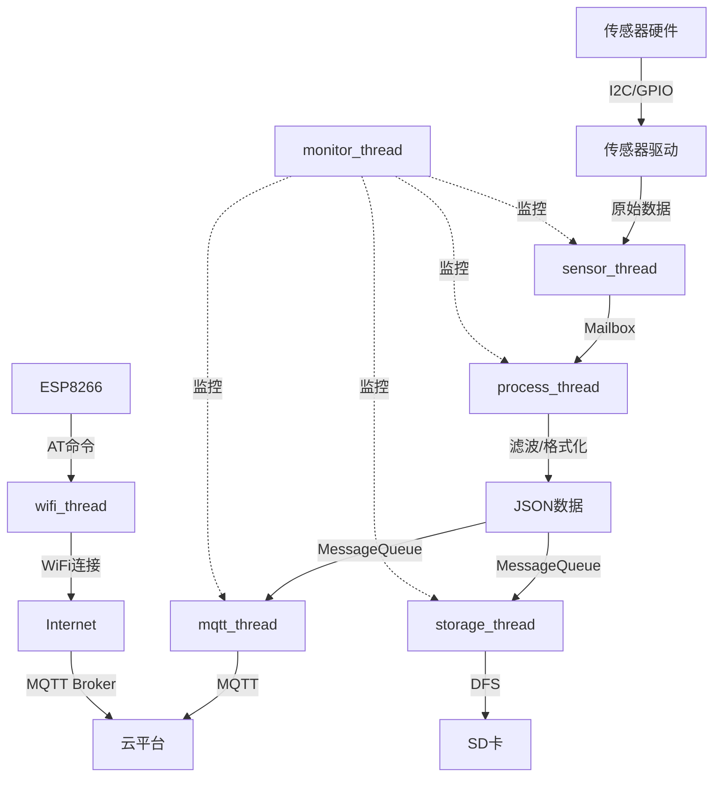

# 基于RT-Thread的IoT项目：智能环境监控系统

## 项目概述

### 项目简介

本项目将设计并实现一个完整的智能环境监控IoT系统，该系统能够实时采集环境数据（温度、湿度、光照、空气质量），通过MQTT协议将数据上传到云平台，支持远程监控和控制，并具备本地数据存储和离线工作能力。

系统采用RT-Thread作为操作系统，充分利用其丰富的组件和软件包生态，展示了从传感器驱动、数据处理、网络通信到云端对接的完整IoT开发流程。这是一个真实的工业级IoT项目架构，涵盖了设备端、网络层和云端的完整技术栈。

### 项目演示

```
┌─────────────────────────────────────────────────────────┐
│           智能环境监控IoT系统架构                        │
│                                                         │
│  ┌─────────────────────────────────────────────────┐   │
│  │  设备端 (RT-Thread)                             │   │
│  │  ┌─────────────────────────────────────────┐   │   │
│  │  │  传感器层                               │   │   │
│  │  │  • DHT22 (温湿度)                      │   │   │
│  │  │  • BH1750 (光照)                       │   │   │
│  │  │  • MQ135 (空气质量)                    │   │   │
│  │  └─────────────────────────────────────────┘   │   │
│  │  ┌─────────────────────────────────────────┐   │   │
│  │  │  应用层                                 │   │   │
│  │  │  • 数据采集线程                        │   │   │
│  │  │  • 数据处理线程                        │   │   │
│  │  │  • MQTT通信线程                        │   │   │
│  │  │  • 本地存储线程                        │   │   │
│  │  └─────────────────────────────────────────┘   │   │
│  │  ┌─────────────────────────────────────────┐   │   │
│  │  │  组件层                                 │   │   │
│  │  │  • DFS文件系统                         │   │   │
│  │  │  • SAL网络抽象层                       │   │   │
│  │  │  • AT设备框架                          │   │   │
│  │  └─────────────────────────────────────────┘   │   │
│  └─────────────────────────────────────────────────┘   │
│                          ↕ WiFi/4G                      │
│  ┌─────────────────────────────────────────────────┐   │
│  │  云平台 (MQTT Broker + 数据库 + Web界面)       │   │
│  │  • 实时数据展示                                │   │
│  │  • 历史数据查询                                │   │
│  │  • 远程控制                                    │   │
│  │  • 报警通知                                    │   │
│  └─────────────────────────────────────────────────┘   │
└─────────────────────────────────────────────────────────┘
```

### 学习目标

完成本项目后，你将掌握：

- [ ] **IoT系统架构设计**：理解完整IoT系统的架构和各层职责
- [ ] **RT-Thread组件应用**：熟练使用DFS、SAL、AT等组件
- [ ] **传感器驱动开发**：掌握I2C、GPIO等接口的传感器驱动
- [ ] **MQTT协议应用**：学会使用MQTT进行设备与云端通信
- [ ] **网络编程**：掌握WiFi配置、网络连接管理
- [ ] **数据存储**：实现本地数据存储和离线缓存
- [ ] **JSON数据处理**：使用cJSON进行数据序列化
- [ ] **云平台对接**：对接主流IoT云平台
- [ ] **系统优化**：掌握功耗优化、内存优化技巧
- [ ] **工程实践**：了解IoT项目的完整开发流程


## 项目特点

- ✨ **完整的IoT解决方案**：从设备端到云端的完整实现
- ✨ **模块化设计**：清晰的模块划分，易于扩展和维护
- ✨ **丰富的组件应用**：充分利用RT-Thread生态系统
- ✨ **工业级代码**：遵循编码规范，包含完整的错误处理
- ✨ **离线工作能力**：支持网络断开时的本地存储
- ✨ **低功耗设计**：实现智能休眠和唤醒机制
- ✨ **可扩展性强**：易于添加新的传感器和功能
- ✨ **实用性强**：可直接应用于实际IoT项目

## 技术栈

### 硬件平台
- **主控芯片**：STM32F407VGT6 (Cortex-M4, 168MHz, 192KB RAM, 1MB Flash)
- **开发板**：正点原子探索者STM32F407 或兼容板
- **WiFi模块**：ESP8266 (ESP-01/ESP-12)

### 核心技术
- **操作系统**：RT-Thread v4.1.0+
- **开发语言**：C语言 (C99标准)
- **通信协议**：MQTT, HTTP, JSON
- **网络协议栈**：lwIP + SAL

### RT-Thread组件
- **DFS**：虚拟文件系统
- **SAL**：套接字抽象层
- **AT Device**：AT设备框架
- **FinSH**：命令行工具
- **ulog**：日志系统

### 软件包
- **pahomqtt**：MQTT客户端
- **cJSON**：JSON解析库
- **EasyFlash**：参数存储
- **WebClient**：HTTP客户端（可选）
- **fal**：Flash抽象层

### 开发工具
- **IDE**：RT-Thread Studio 或 Keil MDK
- **配置工具**：ENV工具
- **调试工具**：串口调试助手
- **云平台**：阿里云IoT、腾讯云IoT或自建MQTT服务器

## 硬件清单

### 必需硬件

| 名称 | 型号/规格 | 数量 | 用途 | 参考价格 | 购买链接 |
|------|-----------|------|------|----------|----------|
| 开发板 | STM32F407探索者 | 1 | 主控制器 | ¥120 | [淘宝/立创商城] |
| WiFi模块 | ESP8266 ESP-01 | 1 | 无线通信 | ¥10 | [淘宝] |
| 温湿度传感器 | DHT22 (AM2302) | 1 | 温湿度检测 | ¥15 | [淘宝] |
| 光照传感器 | BH1750FVI | 1 | 光照强度检测 | ¥5 | [淘宝] |
| 空气质量传感器 | MQ135 | 1 | 空气质量检测 | ¥8 | [淘宝] |
| SD卡模块 | MicroSD卡槽 | 1 | 数据存储 | ¥3 | [淘宝] |
| MicroSD卡 | 8GB Class 10 | 1 | 存储介质 | ¥15 | [淘宝] |
| 面包板 | 标准面包板 | 1 | 电路搭建 | ¥5 | [淘宝] |
| 杜邦线 | 公对公/公对母 | 若干 | 连接线 | ¥5 | [淘宝] |
| USB数据线 | Micro USB | 1 | 供电和调试 | ¥5 | [淘宝] |

### 可选硬件

| 名称 | 型号/规格 | 数量 | 用途 | 参考价格 |
|------|-----------|------|------|----------|
| OLED显示屏 | 0.96" I2C | 1 | 本地显示 | ¥15 |
| RTC模块 | DS3231 | 1 | 实时时钟 | ¥5 |
| 蜂鸣器 | 有源蜂鸣器 | 1 | 报警提示 | ¥2 |
| LED | 5mm LED | 3 | 状态指示 | ¥1 |
| 按键 | 轻触开关 | 3 | 用户交互 | ¥1 |
| 电源模块 | LM2596 DC-DC | 1 | 独立供电 | ¥3 |

**总成本**：基础版约 ¥190，完整版约 ¥230

### 工具要求

- 电烙铁（如需焊接）
- 万用表（电路调试）
- 串口转USB模块（调试）


## 软件要求

### 开发环境

**必需软件**：
- RT-Thread ENV工具 v1.3.0+
- Keil MDK v5.30+ 或 RT-Thread Studio v2.0+
- Git v2.30+ (版本控制)
- Python 3.8+ (ENV工具依赖)

**可选软件**：
- STM32CubeMX (硬件配置)
- Visual Studio Code (代码编辑)
- Wireshark (网络调试)

### 驱动和工具

- ST-Link驱动程序
- 串口调试助手 (推荐：SSCOM、PuTTY)
- MQTT客户端工具 (推荐：MQTT.fx、MQTTX)
- Postman (API测试)

### 云平台账号

选择以下之一：
- 阿里云IoT平台账号（推荐）
- 腾讯云IoT平台账号
- 自建MQTT服务器（Mosquitto）

## 系统架构

### 整体架构

系统采用分层架构设计，从底层硬件到云端应用清晰分离：

```
┌─────────────────────────────────────────────────────────┐
│                    云端层 (Cloud Layer)                  │
│  ┌──────────────┐  ┌──────────────┐  ┌──────────────┐  │
│  │  MQTT Broker │  │  数据库      │  │  Web应用     │  │
│  │  消息代理    │  │  MySQL/Mongo │  │  Dashboard   │  │
│  └──────────────┘  └──────────────┘  └──────────────┘  │
├─────────────────────────────────────────────────────────┤
│                   网络层 (Network Layer)                 │
│  ┌──────────────┐  ┌──────────────┐  ┌──────────────┐  │
│  │  MQTT协议    │  │  HTTP协议    │  │  JSON格式    │  │
│  │  QoS保证     │  │  RESTful API │  │  数据序列化  │  │
│  └──────────────┘  └──────────────┘  └──────────────┘  │
├─────────────────────────────────────────────────────────┤
│                  应用层 (Application Layer)              │
│  ┌──────────────┐  ┌──────────────┐  ┌──────────────┐  │
│  │  数据采集    │  │  数据处理    │  │  通信管理    │  │
│  │  Sensor Mgmt │  │  Processing  │  │  Comm Mgmt   │  │
│  └──────────────┘  └──────────────┘  └──────────────┘  │
│  ┌──────────────┐  ┌──────────────┐  ┌──────────────┐  │
│  │  本地存储    │  │  配置管理    │  │  状态监控    │  │
│  │  Local Store │  │  Config Mgmt │  │  Monitor     │  │
│  └──────────────┘  └──────────────┘  └──────────────┘  │
├─────────────────────────────────────────────────────────┤
│                 组件层 (Component Layer)                 │
│  ┌──────────────┐  ┌──────────────┐  ┌──────────────┐  │
│  │  DFS文件系统 │  │  SAL网络层   │  │  AT框架      │  │
│  │  File System │  │  Socket API  │  │  AT Device   │  │
│  └──────────────┘  └──────────────┘  └──────────────┘  │
│  ┌──────────────┐  ┌──────────────┐  ┌──────────────┐  │
│  │  pahomqtt    │  │  cJSON       │  │  EasyFlash   │  │
│  │  MQTT Client │  │  JSON Parser │  │  KV Storage  │  │
│  └──────────────┘  └──────────────┘  └──────────────┘  │
├─────────────────────────────────────────────────────────┤
│                  驱动层 (Driver Layer)                   │
│  ┌──────────────┐  ┌──────────────┐  ┌──────────────┐  │
│  │  传感器驱动  │  │  WiFi驱动    │  │  SD卡驱动    │  │
│  │  DHT22/BH... │  │  ESP8266     │  │  SPI/SDIO    │  │
│  └──────────────┘  └──────────────┘  └──────────────┘  │
├─────────────────────────────────────────────────────────┤
│                  硬件层 (Hardware Layer)                 │
│  ┌──────────────┐  ┌──────────────┐  ┌──────────────┐  │
│  │  STM32 HAL   │  │  外设配置    │  │  时钟管理    │  │
│  │  Library     │  │  Peripheral  │  │  Clock       │  │
│  └──────────────┘  └──────────────┘  └──────────────┘  │
└─────────────────────────────────────────────────────────┘
```

### 线程架构

系统包含6个主要线程，每个线程负责特定功能：

```
线程优先级分配 (数字越小优先级越高)：

┌─────────────────────────────────────────────────────┐
│ Priority 10: sensor_thread (传感器采集线程)         │
│              周期: 5000ms                           │
│              功能: 读取所有传感器数据               │
└─────────────────────────────────────────────────────┘
                        ↓ (Mailbox)
┌─────────────────────────────────────────────────────┐
│ Priority 12: process_thread (数据处理线程)          │
│              周期: 触发式                           │
│              功能: 数据滤波、格式化、异常检测       │
└─────────────────────────────────────────────────────┘
                        ↓ (Message Queue)
┌─────────────────────────────────────────────────────┐
│ Priority 15: mqtt_thread (MQTT通信线程)             │
│              周期: 触发式                           │
│              功能: 连接MQTT、发布数据、订阅主题     │
└─────────────────────────────────────────────────────┘

┌─────────────────────────────────────────────────────┐
│ Priority 18: storage_thread (本地存储线程)          │
│              周期: 触发式                           │
│              功能: 数据存储到SD卡、离线缓存         │
└─────────────────────────────────────────────────────┘

┌─────────────────────────────────────────────────────┐
│ Priority 20: wifi_thread (WiFi管理线程)             │
│              周期: 触发式                           │
│              功能: WiFi连接、断线重连、状态监控     │
└─────────────────────────────────────────────────────┘

┌─────────────────────────────────────────────────────┐
│ Priority 25: monitor_thread (系统监控线程)          │
│              周期: 60000ms                          │
│              功能: 内存监控、线程状态、性能统计     │
└─────────────────────────────────────────────────────┘
```


### 通信机制

系统使用多种RT-Thread IPC机制实现线程间协作：

```
通信对象使用图：

sensor_thread ──[Mailbox: sensor_mb]──> process_thread
                                              │
process_thread ──[MessageQueue: mqtt_mq]──> mqtt_thread
                                              │
process_thread ──[MessageQueue: storage_mq]──> storage_thread

wifi_thread ──[Event: wifi_event]──> mqtt_thread
                                              │
                                              └──> All Threads

All Threads ──[Mutex: i2c_lock]──> I2C Bus (共享资源)
All Threads ──[Mutex: spi_lock]──> SPI Bus (共享资源)
All Threads ──[Mutex: fs_lock]──> File System (共享资源)

Timer ──[Semaphore: sensor_sem]──> sensor_thread
```

### 数据流图



## 电路设计

### 系统接线图

```
STM32F407 探索者开发板接线：

传感器连接：
┌─────────────────────────────────────┐
│ DHT22 温湿度传感器                  │
│   VCC  ──> 3.3V                     │
│   DATA ──> PG9 (GPIO)               │
│   GND  ──> GND                      │
└─────────────────────────────────────┘

┌─────────────────────────────────────┐
│ BH1750 光照传感器                   │
│   VCC  ──> 3.3V                     │
│   SDA  ──> PB7 (I2C1_SDA)           │
│   SCL  ──> PB6 (I2C1_SCL)           │
│   GND  ──> GND                      │
└─────────────────────────────────────┘

┌─────────────────────────────────────┐
│ MQ135 空气质量传感器                │
│   VCC  ──> 5V                       │
│   AOUT ──> PA1 (ADC1_IN1)           │
│   GND  ──> GND                      │
└─────────────────────────────────────┘

WiFi模块连接：
┌─────────────────────────────────────┐
│ ESP8266 (ESP-01)                    │
│   VCC  ──> 3.3V                     │
│   TX   ──> PA3 (USART2_RX)          │
│   RX   ──> PA2 (USART2_TX)          │
│   GND  ──> GND                      │
│   CH_PD ──> 3.3V (使能)             │
│   RST  ──> 3.3V (复位)              │
└─────────────────────────────────────┘

SD卡模块连接：
┌─────────────────────────────────────┐
│ MicroSD卡模块 (SPI)                 │
│   VCC  ──> 3.3V                     │
│   CS   ──> PC4 (SPI1_NSS)           │
│   MOSI ──> PA7 (SPI1_MOSI)          │
│   MISO ──> PA6 (SPI1_MISO)          │
│   SCK  ──> PA5 (SPI1_SCK)           │
│   GND  ──> GND                      │
└─────────────────────────────────────┘

调试接口：
┌─────────────────────────────────────┐
│ UART1 (调试串口)                    │
│   TX   ──> PA9  (USART1_TX)         │
│   RX   ──> PA10 (USART1_RX)         │
└─────────────────────────────────────┘

可选显示器：
┌─────────────────────────────────────┐
│ OLED 0.96" (SSD1306)                │
│   VCC  ──> 3.3V                     │
│   SDA  ──> PB7 (I2C1_SDA) [共享]    │
│   SCL  ──> PB6 (I2C1_SCL) [共享]    │
│   GND  ──> GND                      │
└─────────────────────────────────────┘
```

### 引脚分配表

| 功能 | 引脚 | 模式 | 说明 |
|------|------|------|------|
| DHT22_DATA | PG9 | GPIO_Input/Output | 单总线协议 |
| MQ135_AOUT | PA1 | ADC1_IN1 | 模拟输入 |
| USART2_TX | PA2 | USART2_TX | ESP8266通信 |
| USART2_RX | PA3 | USART2_RX | ESP8266通信 |
| SPI1_SCK | PA5 | SPI1_SCK | SD卡时钟 |
| SPI1_MISO | PA6 | SPI1_MISO | SD卡数据输入 |
| SPI1_MOSI | PA7 | SPI1_MOSI | SD卡数据输出 |
| USART1_TX | PA9 | USART1_TX | 调试串口 |
| USART1_RX | PA10 | USART1_RX | 调试串口 |
| I2C1_SCL | PB6 | I2C1_SCL | I2C时钟 |
| I2C1_SDA | PB7 | I2C1_SDA | I2C数据 |
| SPI1_NSS | PC4 | GPIO_Output | SD卡片选 |

### 注意事项

1. **I2C总线**：BH1750和OLED共享I2C总线，需要使用互斥量保护
2. **电源**：MQ135需要5V供电，ESP8266需要稳定的3.3V供电（建议使用独立稳压模块）
3. **上拉电阻**：I2C总线需要4.7kΩ上拉电阻（通常模块自带）
4. **ESP8266供电**：ESP8266工作电流较大，建议使用独立电源或加大电容
5. **SD卡**：使用FAT32格式化，支持热插拔


## 实现步骤

### 阶段1：项目创建与环境配置 (预计30分钟)

#### 1.1 获取RT-Thread BSP

**步骤**：

1. **打开ENV工具**，进入工作目录：

```bash
cd D:\RT-Thread\workspace
```

2. **克隆RT-Thread仓库**（如果还没有）：

```bash
# 使用国内镜像（推荐）
git clone https://gitee.com/rtthread/rt-thread.git

# 或使用GitHub
git clone https://github.com/RT-Thread/rt-thread.git
```

3. **进入STM32F407探索者BSP目录**：

```bash
cd rt-thread\bsp\stm32\stm32f407-atk-explorer
```

#### 1.2 配置系统组件

使用menuconfig配置系统：

```bash
menuconfig
```

**配置项**：

1. **启用FinSH shell**：
```
→ RT-Thread Components
  → Command shell
    [*] Using FinSH shell
      (msh) The shell name
      [*] Using symbol table in FinSH shell
```

2. **启用DFS文件系统**：
```
→ RT-Thread Components
  → Device virtual file system
    [*] Using device virtual file system
      [*] Using working directory
      [*] Using elm-chan's FatFs
        [*] Using long file name feature
          (2) Support long file name mode
```

3. **启用SAL网络抽象层**：
```
→ RT-Thread Components
  → Network
    [*] Enable network
      [*] Enable BSD socket operated by file system API
      [*] Enable socket abstraction layer (SAL)
        [*] Enable AT commands
```

4. **启用设备驱动**：
```
→ Hardware Drivers Config
  → On-chip Peripheral Drivers
    [*] Enable GPIO
    [*] Enable UART
      [*] Enable UART1 (console)
      [*] Enable UART2 (ESP8266)
    [*] Enable I2C BUS
      [*] Enable I2C1
    [*] Enable SPI BUS
      [*] Enable SPI1
    [*] Enable ADC
      [*] Enable ADC1
```

5. **保存配置**：按 `S` 保存，按 `Q` 退出

#### 1.3 添加软件包

在menuconfig中添加所需软件包：

```
→ RT-Thread online packages
  → IoT - internet of things
    [*] pahomqtt: Eclipse Paho MQTT C/C++ client
      → Version (latest)
      [*] Enable MQTT example
      [*] Enable MQTT TLS support
  
  → tools
    [*] cJSON: An ultra-lightweight, portable, single-file, simple-as-can-be ANSI-C compliant JSON parser
      → Version (latest)
    
    [*] EasyFlash: Lightweight embedded flash memory library
      → Version (latest)
      [*] Enable ENV function
      [*] Enable wear leveling mode
    
    [*] fal: Flash Abstraction Layer implement
      → Version (latest)
```

保存配置后，更新软件包：

```bash
pkgs --update
```

#### 1.4 生成工程文件

```bash
# 生成Keil MDK5工程
scons --target=mdk5

# 或生成RT-Thread Studio工程
scons --target=eclipse
```

#### 1.5 项目目录结构

创建应用层目录结构：

```
stm32f407-atk-explorer/
├── applications/
│   ├── main.c
│   ├── sensor_app.c          # 新建：传感器应用
│   ├── mqtt_app.c             # 新建：MQTT应用
│   ├── storage_app.c          # 新建：存储应用
│   └── wifi_app.c             # 新建：WiFi应用
├── board/
│   ├── board.h
│   ├── board.c
│   └── Kconfig
├── drivers/
│   ├── drv_dht22.c            # 新建：DHT22驱动
│   ├── drv_dht22.h
│   ├── drv_bh1750.c           # 新建：BH1750驱动
│   ├── drv_bh1750.h
│   ├── drv_mq135.c            # 新建：MQ135驱动
│   └── drv_mq135.h
├── packages/
│   ├── pahomqtt-xxx/
│   ├── cJSON-xxx/
│   └── EasyFlash-xxx/
└── rt-thread/
```

**检查清单**：
- [ ] BSP成功获取
- [ ] menuconfig配置完成
- [ ] 软件包下载成功
- [ ] 工程文件生成成功
- [ ] 项目可以编译通过

### 阶段2：传感器驱动实现 (预计40分钟)

#### 2.1 DHT22温湿度传感器驱动

创建`drivers/drv_dht22.h`：

```c
#ifndef DRV_DHT22_H
#define DRV_DHT22_H

#include <rtthread.h>
#include <rtdevice.h>

/* DHT22数据结构 */
struct dht22_data
{
    float temperature;  // 温度 (°C)
    float humidity;     // 湿度 (%)
};

/* 函数声明 */
rt_err_t dht22_init(void);
rt_err_t dht22_read(struct dht22_data *data);

#endif /* DRV_DHT22_H */
```

创建`drivers/drv_dht22.c`：

```c
#include "drv_dht22.h"
#include <board.h>

#define DHT22_PIN    GET_PIN(G, 9)

/* 私有函数 */
static void dht22_pin_mode(rt_uint8_t mode)
{
    rt_pin_mode(DHT22_PIN, mode);
}

static void dht22_pin_write(rt_uint8_t value)
{
    rt_pin_write(DHT22_PIN, value);
}

static rt_uint8_t dht22_pin_read(void)
{
    return rt_pin_read(DHT22_PIN);
}

static void dht22_delay_us(rt_uint32_t us)
{
    rt_uint32_t ticks = us * (SystemCoreClock / 1000000) / 9;
    while(ticks--);
}

/**
 * @brief  初始化DHT22
 */
rt_err_t dht22_init(void)
{
    dht22_pin_mode(PIN_MODE_OUTPUT);
    dht22_pin_write(PIN_HIGH);
    rt_thread_mdelay(1000);  // 等待传感器稳定
    
    return RT_EOK;
}

/**
 * @brief  读取DHT22数据
 */
rt_err_t dht22_read(struct dht22_data *data)
{
    rt_uint8_t buffer[5] = {0};
    rt_uint8_t i, j;
    rt_uint16_t temp, humi;
    
    /* 发送起始信号 */
    dht22_pin_mode(PIN_MODE_OUTPUT);
    dht22_pin_write(PIN_LOW);
    rt_thread_mdelay(2);
    dht22_pin_write(PIN_HIGH);
    dht22_delay_us(30);
    
    /* 切换到输入模式 */
    dht22_pin_mode(PIN_MODE_INPUT_PULLUP);
    
    /* 等待DHT22响应 */
    rt_uint32_t timeout = 1000;
    while(dht22_pin_read() && timeout--) dht22_delay_us(1);
    if(timeout == 0) return -RT_ETIMEOUT;
    
    timeout = 1000;
    while(!dht22_pin_read() && timeout--) dht22_delay_us(1);
    if(timeout == 0) return -RT_ETIMEOUT;
    
    timeout = 1000;
    while(dht22_pin_read() && timeout--) dht22_delay_us(1);
    if(timeout == 0) return -RT_ETIMEOUT;
    
    /* 读取40位数据 */
    for(i = 0; i < 5; i++)
    {
        for(j = 0; j < 8; j++)
        {
            timeout = 1000;
            while(!dht22_pin_read() && timeout--) dht22_delay_us(1);
            if(timeout == 0) return -RT_ETIMEOUT;
            
            dht22_delay_us(40);
            
            if(dht22_pin_read())
            {
                buffer[i] |= (1 << (7 - j));
            }
            
            timeout = 1000;
            while(dht22_pin_read() && timeout--) dht22_delay_us(1);
            if(timeout == 0) return -RT_ETIMEOUT;
        }
    }
    
    /* 校验和验证 */
    if(buffer[4] != ((buffer[0] + buffer[1] + buffer[2] + buffer[3]) & 0xFF))
    {
        return -RT_ERROR;
    }
    
    /* 计算温湿度 */
    humi = (buffer[0] << 8) | buffer[1];
    temp = (buffer[2] << 8) | buffer[3];
    
    data->humidity = humi / 10.0f;
    data->temperature = temp / 10.0f;
    
    /* 处理负温度 */
    if(buffer[2] & 0x80)
    {
        data->temperature = -(data->temperature);
    }
    
    return RT_EOK;
}
```


#### 2.2 BH1750光照传感器驱动

创建`drivers/drv_bh1750.h`：

```c
#ifndef DRV_BH1750_H
#define DRV_BH1750_H

#include <rtthread.h>
#include <rtdevice.h>

/* BH1750 I2C地址 */
#define BH1750_ADDR         0x23

/* BH1750命令 */
#define BH1750_POWER_ON     0x01
#define BH1750_CONT_H_MODE  0x10

/* 函数声明 */
rt_err_t bh1750_init(const char *i2c_bus_name);
rt_err_t bh1750_read(rt_uint16_t *light);

#endif /* DRV_BH1750_H */
```

创建`drivers/drv_bh1750.c`：

```c
#include "drv_bh1750.h"

static struct rt_i2c_bus_device *i2c_bus = RT_NULL;

/**
 * @brief  初始化BH1750
 */
rt_err_t bh1750_init(const char *i2c_bus_name)
{
    rt_uint8_t cmd;
    struct rt_i2c_msg msgs;
    
    /* 查找I2C总线设备 */
    i2c_bus = (struct rt_i2c_bus_device *)rt_device_find(i2c_bus_name);
    if(i2c_bus == RT_NULL)
    {
        rt_kprintf("BH1750: Can't find %s device!\n", i2c_bus_name);
        return -RT_ERROR;
    }
    
    /* 上电 */
    cmd = BH1750_POWER_ON;
    msgs.addr = BH1750_ADDR;
    msgs.flags = RT_I2C_WR;
    msgs.buf = &cmd;
    msgs.len = 1;
    
    if(rt_i2c_transfer(i2c_bus, &msgs, 1) != 1)
    {
        return -RT_ERROR;
    }
    
    rt_thread_mdelay(10);
    
    /* 设置为连续高分辨率模式 */
    cmd = BH1750_CONT_H_MODE;
    msgs.buf = &cmd;
    
    if(rt_i2c_transfer(i2c_bus, &msgs, 1) != 1)
    {
        return -RT_ERROR;
    }
    
    rt_thread_mdelay(180);
    
    return RT_EOK;
}

/**
 * @brief  读取BH1750光照值
 */
rt_err_t bh1750_read(rt_uint16_t *light)
{
    rt_uint8_t data[2];
    struct rt_i2c_msg msgs;
    
    if(i2c_bus == RT_NULL)
    {
        return -RT_ERROR;
    }
    
    /* 读取2字节数据 */
    msgs.addr = BH1750_ADDR;
    msgs.flags = RT_I2C_RD;
    msgs.buf = data;
    msgs.len = 2;
    
    if(rt_i2c_transfer(i2c_bus, &msgs, 1) != 1)
    {
        return -RT_ERROR;
    }
    
    /* 计算光照值 */
    *light = (data[0] << 8) | data[1];
    *light = *light / 1.2;
    
    return RT_EOK;
}
```

#### 2.3 MQ135空气质量传感器驱动

创建`drivers/drv_mq135.h`：

```c
#ifndef DRV_MQ135_H
#define DRV_MQ135_H

#include <rtthread.h>
#include <rtdevice.h>

/* 函数声明 */
rt_err_t mq135_init(const char *adc_dev_name, rt_uint32_t channel);
rt_err_t mq135_read(rt_uint16_t *value);
rt_uint8_t mq135_get_aqi(rt_uint16_t value);

#endif /* DRV_MQ135_H */
```

创建`drivers/drv_mq135.c`：

```c
#include "drv_mq135.h"

static rt_adc_device_t adc_dev = RT_NULL;
static rt_uint32_t adc_channel = 0;

/**
 * @brief  初始化MQ135
 */
rt_err_t mq135_init(const char *adc_dev_name, rt_uint32_t channel)
{
    /* 查找ADC设备 */
    adc_dev = (rt_adc_device_t)rt_device_find(adc_dev_name);
    if(adc_dev == RT_NULL)
    {
        rt_kprintf("MQ135: Can't find %s device!\n", adc_dev_name);
        return -RT_ERROR;
    }
    
    /* 使能ADC通道 */
    rt_adc_enable(adc_dev, channel);
    adc_channel = channel;
    
    return RT_EOK;
}

/**
 * @brief  读取MQ135 ADC值
 */
rt_err_t mq135_read(rt_uint16_t *value)
{
    if(adc_dev == RT_NULL)
    {
        return -RT_ERROR;
    }
    
    /* 读取ADC值 */
    *value = rt_adc_read(adc_dev, adc_channel);
    
    return RT_EOK;
}

/**
 * @brief  根据ADC值计算空气质量指数
 * @param  value: ADC值 (0-4095)
 * @retval AQI等级 (0-5)
 */
rt_uint8_t mq135_get_aqi(rt_uint16_t value)
{
    /* 简化的AQI计算 */
    if(value < 500) return 0;       // 优
    else if(value < 1000) return 1; // 良
    else if(value < 1500) return 2; // 轻度污染
    else if(value < 2000) return 3; // 中度污染
    else if(value < 3000) return 4; // 重度污染
    else return 5;                  // 严重污染
}
```

**检查清单**：
- [ ] DHT22驱动实现完成
- [ ] BH1750驱动实现完成
- [ ] MQ135驱动实现完成
- [ ] 驱动代码可以编译通过


### 阶段3：应用层实现 (预计60分钟)

#### 3.1 传感器采集应用

创建`applications/sensor_app.c`：

```c
#include <rtthread.h>
#include <rtdevice.h>
#include "drv_dht22.h"
#include "drv_bh1750.h"
#include "drv_mq135.h"

#define SENSOR_THREAD_PRIORITY   10
#define SENSOR_THREAD_STACK_SIZE 1024
#define SENSOR_THREAD_TIMESLICE  5

/* 传感器数据结构 */
struct sensor_data
{
    float temperature;
    float humidity;
    rt_uint16_t light;
    rt_uint16_t air_quality;
    rt_uint32_t timestamp;
};

/* 邮箱句柄 */
static rt_mailbox_t sensor_mb = RT_NULL;

/**
 * @brief  传感器采集线程
 */
static void sensor_thread_entry(void *parameter)
{
    struct sensor_data data;
    struct dht22_data dht_data;
    rt_uint16_t light_value;
    rt_uint16_t aqi_value;
    
    /* 初始化传感器 */
    dht22_init();
    bh1750_init("i2c1");
    mq135_init("adc1", 1);
    
    rt_kprintf("Sensor thread started\n");
    
    while(1)
    {
        /* 读取DHT22 */
        if(dht22_read(&dht_data) == RT_EOK)
        {
            data.temperature = dht_data.temperature;
            data.humidity = dht_data.humidity;
        }
        else
        {
            rt_kprintf("DHT22 read failed\n");
        }
        
        /* 读取BH1750 */
        if(bh1750_read(&light_value) == RT_EOK)
        {
            data.light = light_value;
        }
        else
        {
            rt_kprintf("BH1750 read failed\n");
        }
        
        /* 读取MQ135 */
        if(mq135_read(&aqi_value) == RT_EOK)
        {
            data.air_quality = aqi_value;
        }
        else
        {
            rt_kprintf("MQ135 read failed\n");
        }
        
        /* 添加时间戳 */
        data.timestamp = rt_tick_get();
        
        /* 发送到邮箱 */
        if(rt_mb_send(sensor_mb, (rt_ubase_t)&data) != RT_EOK)
        {
            rt_kprintf("Sensor mailbox send failed\n");
        }
        
        /* 打印数据 */
        rt_kprintf("Temp: %.1f°C, Humi: %.1f%%, Light: %d Lux, AQI: %d\n",
                   data.temperature, data.humidity, data.light, data.air_quality);
        
        /* 每5秒采集一次 */
        rt_thread_mdelay(5000);
    }
}

/**
 * @brief  初始化传感器应用
 */
int sensor_app_init(void)
{
    rt_thread_t tid;
    
    /* 创建邮箱 */
    sensor_mb = rt_mb_create("sensor_mb", 10, RT_IPC_FLAG_FIFO);
    if(sensor_mb == RT_NULL)
    {
        rt_kprintf("Create sensor mailbox failed\n");
        return -RT_ERROR;
    }
    
    /* 创建传感器线程 */
    tid = rt_thread_create("sensor",
                          sensor_thread_entry,
                          RT_NULL,
                          SENSOR_THREAD_STACK_SIZE,
                          SENSOR_THREAD_PRIORITY,
                          SENSOR_THREAD_TIMESLICE);
    
    if(tid != RT_NULL)
    {
        rt_thread_startup(tid);
    }
    else
    {
        rt_kprintf("Create sensor thread failed\n");
        return -RT_ERROR;
    }
    
    return RT_EOK;
}
INIT_APP_EXPORT(sensor_app_init);
```

#### 3.2 数据处理应用

创建`applications/process_app.c`：

```c
#include <rtthread.h>
#include <cJSON.h>

#define PROCESS_THREAD_PRIORITY   12
#define PROCESS_THREAD_STACK_SIZE 2048
#define PROCESS_THREAD_TIMESLICE  5

/* 外部邮箱 */
extern rt_mailbox_t sensor_mb;

/* 消息队列句柄 */
static rt_mq_t mqtt_mq = RT_NULL;
static rt_mq_t storage_mq = RT_NULL;

/* 滤波缓冲区 */
#define FILTER_SIZE 5
static float temp_buffer[FILTER_SIZE] = {0};
static float humi_buffer[FILTER_SIZE] = {0};
static rt_uint8_t buffer_index = 0;

/**
 * @brief  移动平均滤波
 */
static float moving_average(float *buffer, float new_value)
{
    float sum = 0;
    
    /* 更新缓冲区 */
    buffer[buffer_index] = new_value;
    
    /* 计算平均值 */
    for(int i = 0; i < FILTER_SIZE; i++)
    {
        sum += buffer[i];
    }
    
    return sum / FILTER_SIZE;
}

/**
 * @brief  数据处理线程
 */
static void process_thread_entry(void *parameter)
{
    struct sensor_data *data;
    char *json_str;
    cJSON *root;
    float filtered_temp, filtered_humi;
    
    rt_kprintf("Process thread started\n");
    
    while(1)
    {
        /* 从邮箱接收数据 */
        if(rt_mb_recv(sensor_mb, (rt_ubase_t *)&data, RT_WAITING_FOREVER) == RT_EOK)
        {
            /* 数据滤波 */
            filtered_temp = moving_average(temp_buffer, data->temperature);
            filtered_humi = moving_average(humi_buffer, data->humidity);
            
            /* 更新缓冲区索引 */
            buffer_index = (buffer_index + 1) % FILTER_SIZE;
            
            /* 创建JSON对象 */
            root = cJSON_CreateObject();
            cJSON_AddStringToObject(root, "device_id", "ENV_MONITOR_001");
            cJSON_AddNumberToObject(root, "timestamp", data->timestamp);
            cJSON_AddNumberToObject(root, "temperature", filtered_temp);
            cJSON_AddNumberToObject(root, "humidity", filtered_humi);
            cJSON_AddNumberToObject(root, "light", data->light);
            cJSON_AddNumberToObject(root, "air_quality", data->air_quality);
            
            /* 转换为JSON字符串 */
            json_str = cJSON_PrintUnformatted(root);
            
            /* 发送到MQTT队列 */
            if(mqtt_mq != RT_NULL)
            {
                rt_mq_send(mqtt_mq, json_str, rt_strlen(json_str) + 1);
            }
            
            /* 发送到存储队列 */
            if(storage_mq != RT_NULL)
            {
                rt_mq_send(storage_mq, json_str, rt_strlen(json_str) + 1);
            }
            
            /* 释放内存 */
            cJSON_free(json_str);
            cJSON_Delete(root);
        }
    }
}

/**
 * @brief  初始化数据处理应用
 */
int process_app_init(void)
{
    rt_thread_t tid;
    
    /* 创建消息队列 */
    mqtt_mq = rt_mq_create("mqtt_mq", 512, 10, RT_IPC_FLAG_FIFO);
    storage_mq = rt_mq_create("storage_mq", 512, 20, RT_IPC_FLAG_FIFO);
    
    /* 创建数据处理线程 */
    tid = rt_thread_create("process",
                          process_thread_entry,
                          RT_NULL,
                          PROCESS_THREAD_STACK_SIZE,
                          PROCESS_THREAD_PRIORITY,
                          PROCESS_THREAD_TIMESLICE);
    
    if(tid != RT_NULL)
    {
        rt_thread_startup(tid);
    }
    
    return RT_EOK;
}
INIT_APP_EXPORT(process_app_init);
```


#### 3.3 MQTT通信应用

创建`applications/mqtt_app.c`：

```c
#include <rtthread.h>
#include <paho_mqtt.h>

#define MQTT_THREAD_PRIORITY   15
#define MQTT_THREAD_STACK_SIZE 2048
#define MQTT_THREAD_TIMESLICE  5

/* MQTT配置 */
#define MQTT_BROKER_URI    "tcp://mqtt.example.com:1883"
#define MQTT_CLIENT_ID     "rtthread_env_monitor"
#define MQTT_USERNAME      "your_username"
#define MQTT_PASSWORD      "your_password"
#define MQTT_TOPIC_PUB     "sensor/data"
#define MQTT_TOPIC_SUB     "sensor/control"

/* 外部消息队列 */
extern rt_mq_t mqtt_mq;

/* MQTT客户端 */
static MQTTClient mqtt_client;

/**
 * @brief  MQTT消息到达回调
 */
static void mqtt_message_arrived(MessageData *data)
{
    rt_kprintf("MQTT Message arrived:\n");
    rt_kprintf("Topic: %.*s\n", 
               data->topicName->lenstring.len,
               data->topicName->lenstring.data);
    rt_kprintf("Message: %.*s\n",
               data->message->payloadlen,
               (char *)data->message->payload);
    
    /* 处理控制命令 */
    // TODO: 解析JSON命令并执行
}

/**
 * @brief  MQTT连接
 */
static int mqtt_connect(void)
{
    MQTTPacket_connectData connectData = MQTTPacket_connectData_initializer;
    int rc;
    
    /* 配置连接参数 */
    connectData.MQTTVersion = 3;
    connectData.clientID.cstring = MQTT_CLIENT_ID;
    connectData.username.cstring = MQTT_USERNAME;
    connectData.password.cstring = MQTT_PASSWORD;
    connectData.keepAliveInterval = 60;
    connectData.cleansession = 1;
    
    /* 连接MQTT服务器 */
    rc = MQTTConnect(&mqtt_client, &connectData);
    if(rc != 0)
    {
        rt_kprintf("MQTT connect failed: %d\n", rc);
        return -RT_ERROR;
    }
    
    rt_kprintf("MQTT connected successfully\n");
    
    /* 订阅主题 */
    rc = MQTTSubscribe(&mqtt_client, MQTT_TOPIC_SUB, QOS0, mqtt_message_arrived);
    if(rc != 0)
    {
        rt_kprintf("MQTT subscribe failed: %d\n", rc);
        return -RT_ERROR;
    }
    
    rt_kprintf("MQTT subscribed to %s\n", MQTT_TOPIC_SUB);
    
    return RT_EOK;
}

/**
 * @brief  MQTT发布数据
 */
static int mqtt_publish(const char *data)
{
    MQTTMessage message;
    int rc;
    
    /* 配置消息 */
    message.qos = QOS0;
    message.retained = 0;
    message.payload = (void *)data;
    message.payloadlen = rt_strlen(data);
    
    /* 发布消息 */
    rc = MQTTPublish(&mqtt_client, MQTT_TOPIC_PUB, &message);
    if(rc != 0)
    {
        rt_kprintf("MQTT publish failed: %d\n", rc);
        return -RT_ERROR;
    }
    
    return RT_EOK;
}

/**
 * @brief  MQTT通信线程
 */
static void mqtt_thread_entry(void *parameter)
{
    char buffer[512];
    rt_size_t size;
    
    rt_kprintf("MQTT thread started\n");
    
    /* 等待网络连接 */
    rt_thread_mdelay(5000);
    
    /* 连接MQTT服务器 */
    if(mqtt_connect() != RT_EOK)
    {
        rt_kprintf("MQTT connect failed, thread exit\n");
        return;
    }
    
    while(1)
    {
        /* 从消息队列接收数据 */
        if(rt_mq_recv(mqtt_mq, buffer, sizeof(buffer), RT_WAITING_FOREVER) > 0)
        {
            /* 发布数据 */
            if(mqtt_publish(buffer) == RT_EOK)
            {
                rt_kprintf("MQTT published: %s\n", buffer);
            }
        }
        
        /* 处理MQTT消息 */
        MQTTYield(&mqtt_client, 100);
    }
}

/**
 * @brief  初始化MQTT应用
 */
int mqtt_app_init(void)
{
    rt_thread_t tid;
    
    /* 创建MQTT线程 */
    tid = rt_thread_create("mqtt",
                          mqtt_thread_entry,
                          RT_NULL,
                          MQTT_THREAD_STACK_SIZE,
                          MQTT_THREAD_PRIORITY,
                          MQTT_THREAD_TIMESLICE);
    
    if(tid != RT_NULL)
    {
        rt_thread_startup(tid);
    }
    
    return RT_EOK;
}
INIT_APP_EXPORT(mqtt_app_init);
```

#### 3.4 本地存储应用

创建`applications/storage_app.c`：

```c
#include <rtthread.h>
#include <dfs_posix.h>

#define STORAGE_THREAD_PRIORITY   18
#define STORAGE_THREAD_STACK_SIZE 1024
#define STORAGE_THREAD_TIMESLICE  5

#define DATA_FILE_PATH "/sd/sensor_data.txt"

/* 外部消息队列 */
extern rt_mq_t storage_mq;

/**
 * @brief  存储数据到SD卡
 */
static int storage_save_data(const char *data)
{
    int fd;
    int ret;
    
    /* 打开文件（追加模式） */
    fd = open(DATA_FILE_PATH, O_WRONLY | O_CREAT | O_APPEND, 0);
    if(fd < 0)
    {
        rt_kprintf("Open file failed\n");
        return -RT_ERROR;
    }
    
    /* 写入数据 */
    ret = write(fd, data, rt_strlen(data));
    if(ret < 0)
    {
        rt_kprintf("Write file failed\n");
        close(fd);
        return -RT_ERROR;
    }
    
    /* 写入换行符 */
    write(fd, "\n", 1);
    
    /* 关闭文件 */
    close(fd);
    
    return RT_EOK;
}

/**
 * @brief  本地存储线程
 */
static void storage_thread_entry(void *parameter)
{
    char buffer[512];
    
    rt_kprintf("Storage thread started\n");
    
    /* 等待文件系统挂载 */
    rt_thread_mdelay(2000);
    
    while(1)
    {
        /* 从消息队列接收数据 */
        if(rt_mq_recv(storage_mq, buffer, sizeof(buffer), RT_WAITING_FOREVER) > 0)
        {
            /* 保存数据 */
            if(storage_save_data(buffer) == RT_EOK)
            {
                rt_kprintf("Data saved to SD card\n");
            }
        }
    }
}

/**
 * @brief  初始化存储应用
 */
int storage_app_init(void)
{
    rt_thread_t tid;
    
    /* 创建存储线程 */
    tid = rt_thread_create("storage",
                          storage_thread_entry,
                          RT_NULL,
                          STORAGE_THREAD_STACK_SIZE,
                          STORAGE_THREAD_PRIORITY,
                          STORAGE_THREAD_TIMESLICE);
    
    if(tid != RT_NULL)
    {
        rt_thread_startup(tid);
    }
    
    return RT_EOK;
}
INIT_APP_EXPORT(storage_app_init);

/* 导出命令：读取历史数据 */
static void read_history(int argc, char **argv)
{
    int fd;
    char buffer[512];
    int len;
    
    fd = open(DATA_FILE_PATH, O_RDONLY, 0);
    if(fd < 0)
    {
        rt_kprintf("Open file failed\n");
        return;
    }
    
    while((len = read(fd, buffer, sizeof(buffer) - 1)) > 0)
    {
        buffer[len] = '\0';
        rt_kprintf("%s", buffer);
    }
    
    close(fd);
}
MSH_CMD_EXPORT(read_history, read sensor history data);
```

**检查清单**：
- [ ] 传感器采集应用实现完成
- [ ] 数据处理应用实现完成
- [ ] MQTT通信应用实现完成
- [ ] 本地存储应用实现完成
- [ ] 应用代码可以编译通过


### 阶段4：WiFi配置与网络连接 (预计30分钟)

#### 4.1 WiFi管理应用

创建`applications/wifi_app.c`：

```c
#include <rtthread.h>
#include <at.h>
#include <at_socket.h>
#include <easyflash.h>

#define WIFI_THREAD_PRIORITY   20
#define WIFI_THREAD_STACK_SIZE 1024
#define WIFI_THREAD_TIMESLICE  5

/* WiFi配置 */
static char wifi_ssid[32] = "Your_WiFi_SSID";
static char wifi_password[64] = "Your_WiFi_Password";

/**
 * @brief  从EasyFlash加载WiFi配置
 */
static void wifi_load_config(void)
{
    char *ssid, *password;
    
    ssid = ef_get_env("wifi_ssid");
    if(ssid != RT_NULL)
    {
        rt_strncpy(wifi_ssid, ssid, sizeof(wifi_ssid));
    }
    
    password = ef_get_env("wifi_password");
    if(password != RT_NULL)
    {
        rt_strncpy(wifi_password, password, sizeof(wifi_password));
    }
}

/**
 * @brief  保存WiFi配置到EasyFlash
 */
static void wifi_save_config(const char *ssid, const char *password)
{
    ef_set_env("wifi_ssid", ssid);
    ef_set_env("wifi_password", password);
    ef_save_env();
}

/**
 * @brief  WiFi连接
 */
static int wifi_connect(void)
{
    at_response_t resp = RT_NULL;
    int result = RT_EOK;
    
    /* 创建响应结构体 */
    resp = at_create_resp(256, 0, rt_tick_from_millisecond(5000));
    if(resp == RT_NULL)
    {
        rt_kprintf("No memory for response structure\n");
        return -RT_ENOMEM;
    }
    
    /* 设置WiFi模式为Station */
    if(at_obj_exec_cmd(at_get_default(), resp, "AT+CWMODE=1") != RT_EOK)
    {
        rt_kprintf("Set WiFi mode failed\n");
        result = -RT_ERROR;
        goto __exit;
    }
    
    /* 连接WiFi */
    if(at_obj_exec_cmd(at_get_default(), resp, 
                       "AT+CWJAP=\"%s\",\"%s\"", 
                       wifi_ssid, wifi_password) != RT_EOK)
    {
        rt_kprintf("WiFi connect failed\n");
        result = -RT_ERROR;
        goto __exit;
    }
    
    rt_kprintf("WiFi connected successfully\n");
    
__exit:
    if(resp)
    {
        at_delete_resp(resp);
    }
    
    return result;
}

/**
 * @brief  WiFi管理线程
 */
static void wifi_thread_entry(void *parameter)
{
    rt_kprintf("WiFi thread started\n");
    
    /* 加载WiFi配置 */
    wifi_load_config();
    
    /* 等待AT设备初始化 */
    rt_thread_mdelay(2000);
    
    /* 连接WiFi */
    while(wifi_connect() != RT_EOK)
    {
        rt_kprintf("WiFi connect failed, retry in 10s...\n");
        rt_thread_mdelay(10000);
    }
    
    /* 监控WiFi连接状态 */
    while(1)
    {
        /* TODO: 检查WiFi连接状态，断线重连 */
        rt_thread_mdelay(30000);
    }
}

/**
 * @brief  初始化WiFi应用
 */
int wifi_app_init(void)
{
    rt_thread_t tid;
    
    /* 创建WiFi线程 */
    tid = rt_thread_create("wifi",
                          wifi_thread_entry,
                          RT_NULL,
                          WIFI_THREAD_STACK_SIZE,
                          WIFI_THREAD_PRIORITY,
                          WIFI_THREAD_TIMESLICE);
    
    if(tid != RT_NULL)
    {
        rt_thread_startup(tid);
    }
    
    return RT_EOK;
}
INIT_APP_EXPORT(wifi_app_init);

/* 导出命令：配置WiFi */
static void wifi_config(int argc, char **argv)
{
    if(argc != 3)
    {
        rt_kprintf("Usage: wifi_config <ssid> <password>\n");
        return;
    }
    
    wifi_save_config(argv[1], argv[2]);
    rt_kprintf("WiFi config saved. Please reboot to apply.\n");
}
MSH_CMD_EXPORT(wifi_config, config WiFi SSID and password);
```

### 阶段5：系统集成与测试 (预计40分钟)

#### 5.1 主程序集成

修改`applications/main.c`：

```c
#include <rtthread.h>
#include <rtdevice.h>
#include <board.h>
#include <easyflash.h>
#include <fal.h>

int main(void)
{
    rt_kprintf("\n");
    rt_kprintf("========================================\n");
    rt_kprintf("  RT-Thread IoT Environment Monitor    \n");
    rt_kprintf("  Version: 1.0.0                       \n");
    rt_kprintf("  Build: %s %s                         \n", __DATE__, __TIME__);
    rt_kprintf("========================================\n");
    
    /* 初始化Flash抽象层 */
    fal_init();
    
    /* 初始化EasyFlash */
    if(easyflash_init() == EF_NO_ERR)
    {
        rt_kprintf("EasyFlash initialized\n");
    }
    
    /* 挂载SD卡 */
    if(dfs_mount("sd0", "/sd", "elm", 0, 0) == 0)
    {
        rt_kprintf("SD card mounted to /sd\n");
    }
    else
    {
        rt_kprintf("SD card mount failed\n");
    }
    
    rt_kprintf("System initialization completed\n");
    
    return RT_EOK;
}
```

#### 5.2 编译和下载

1. **编译项目**：

在ENV工具中：
```bash
scons
```

或在Keil MDK中点击编译按钮。

2. **下载程序**：

使用ST-Link下载程序到开发板。

3. **打开串口终端**：

- 波特率：115200
- 数据位：8
- 停止位：1
- 校验：无

#### 5.3 系统测试

**测试步骤**：

1. **查看系统启动信息**：

```
========================================
  RT-Thread IoT Environment Monitor    
  Version: 1.0.0                       
  Build: Jan 15 2024 14:30:00          
========================================
EasyFlash initialized
SD card mounted to /sd
System initialization completed
Sensor thread started
Process thread started
MQTT thread started
Storage thread started
WiFi thread started
```

2. **配置WiFi**：

```bash
msh > wifi_config "Your_SSID" "Your_Password"
WiFi config saved. Please reboot to apply.

msh > reboot
```

3. **查看传感器数据**：

```bash
msh > 
Temp: 25.3°C, Humi: 65.2%, Light: 450 Lux, AQI: 850
WiFi connected successfully
MQTT connected successfully
MQTT subscribed to sensor/control
MQTT published: {"device_id":"ENV_MONITOR_001",...}
Data saved to SD card
```

4. **查看历史数据**：

```bash
msh > read_history
{"device_id":"ENV_MONITOR_001","timestamp":12345,...}
{"device_id":"ENV_MONITOR_001","timestamp":17345,...}
...
```

5. **查看线程状态**：

```bash
msh > list_thread
thread   pri  status      sp     stack size max used left tick  error
-------- ---  ------- ---------- ----------  ------  ---------- ---
sensor    10  suspend 0x000001a8 0x00000400    41%   0x00000005 000
process   12  suspend 0x00000298 0x00000800    32%   0x00000005 000
mqtt      15  suspend 0x00000398 0x00000800    45%   0x00000005 000
storage   18  suspend 0x00000198 0x00000400    39%   0x00000005 000
wifi      20  suspend 0x00000198 0x00000400    39%   0x00000005 000
tshell    20  ready   0x00000118 0x00001000    28%   0x00000003 000
tidle0    31  ready   0x00000070 0x00000100    43%   0x0000000a 000
```

6. **查看内存使用**：

```bash
msh > free
total memory: 131072
used memory : 45632
maximum allocated memory: 48256
```

**检查清单**：
- [ ] 系统成功启动
- [ ] WiFi连接成功
- [ ] MQTT连接成功
- [ ] 传感器数据正常采集
- [ ] 数据成功上传到云端
- [ ] 数据成功保存到SD卡
- [ ] 所有线程正常运行


## 故障排除

### 问题1：传感器读取失败

**现象**：
- 串口输出"DHT22 read failed"或"BH1750 read failed"
- 传感器数据全为0

**可能原因**：
- 传感器接线错误
- I2C总线冲突
- 传感器供电不足

**解决方法**：

1. **检查接线**：
```bash
# 使用万用表测量传感器供电
# DHT22: VCC应为3.3V
# BH1750: VCC应为3.3V
# MQ135: VCC应为5V
```

2. **检查I2C总线**：
```bash
msh > i2c probe i2c1
# 应该能看到BH1750的地址0x23
```

3. **增加延时**：
```c
// 在传感器初始化后增加延时
rt_thread_mdelay(2000);
```

### 问题2：WiFi连接失败

**现象**：
- 串口输出"WiFi connect failed"
- 无法连接到MQTT服务器

**可能原因**：
- WiFi SSID或密码错误
- ESP8266供电不足
- AT固件版本不兼容

**解决方法**：

1. **检查WiFi配置**：
```bash
msh > wifi_config "Correct_SSID" "Correct_Password"
msh > reboot
```

2. **检查ESP8266供电**：
```bash
# ESP8266工作电流可达300mA
# 建议使用独立3.3V稳压模块
# 或在VCC引脚并联100uF电容
```

3. **测试AT命令**：
```bash
msh > at_exec_cmd("AT")
# 应该返回OK

msh > at_exec_cmd("AT+GMR")
# 查看固件版本
```

### 问题3：MQTT连接失败

**现象**：
- 串口输出"MQTT connect failed"
- 数据无法上传到云端

**可能原因**：
- MQTT服务器地址错误
- 用户名或密码错误
- 网络连接不稳定

**解决方法**：

1. **检查MQTT配置**：
```c
// 在mqtt_app.c中修改配置
#define MQTT_BROKER_URI    "tcp://your_broker:1883"
#define MQTT_USERNAME      "your_username"
#define MQTT_PASSWORD      "your_password"
```

2. **使用MQTT测试工具**：
```bash
# 在PC上使用MQTT.fx或MQTTX测试连接
# 确认服务器地址、端口、用户名、密码正确
```

3. **检查网络连接**：
```bash
msh > ping mqtt.example.com
# 确认能够ping通MQTT服务器
```

### 问题4：SD卡挂载失败

**现象**：
- 串口输出"SD card mount failed"
- 无法保存数据到本地

**可能原因**：
- SD卡未插入或接触不良
- SD卡格式不正确
- SPI引脚配置错误

**解决方法**：

1. **检查SD卡格式**：
```bash
# 在PC上将SD卡格式化为FAT32
# 分配单元大小：4096字节
```

2. **检查SPI配置**：
```bash
msh > list_device
# 应该能看到sd0设备
```

3. **手动挂载**：
```bash
msh > mkfs sd0
msh > mount sd0 /sd elm
```

### 问题5：内存不足

**现象**：
- 系统运行一段时间后崩溃
- 串口输出"No memory"

**可能原因**：
- 堆内存配置过小
- 内存泄漏
- 线程堆栈溢出

**解决方法**：

1. **增加堆内存**：
```c
// 在rtconfig.h中修改
#define RT_HEAP_SIZE    (32*1024)  // 增加到32KB
```

2. **检查内存泄漏**：
```bash
msh > free
# 观察used memory是否持续增长
```

3. **增加线程堆栈**：
```c
// 在应用代码中增加堆栈大小
#define MQTT_THREAD_STACK_SIZE 3072  // 从2048增加到3072
```

## 系统优化

### 功耗优化

1. **使用低功耗模式**：

```c
#include <pm.h>

/* 进入低功耗模式 */
void enter_low_power(void)
{
    /* 设置休眠模式 */
    pm_device_sleep(PM_SLEEP_MODE_DEEP);
}

/* 定时唤醒 */
void setup_wakeup_timer(void)
{
    /* 配置RTC定时唤醒 */
    // TODO: 实现RTC唤醒
}
```

2. **降低采样频率**：

```c
/* 将采样间隔从5秒改为30秒 */
rt_thread_mdelay(30000);
```

3. **关闭不用的外设**：

```c
/* 在不使用时关闭WiFi */
at_obj_exec_cmd(at_get_default(), resp, "AT+CWMODE=0");
```

### 性能优化

1. **使用DMA传输**：

```c
/* 配置SPI使用DMA */
// 在CubeMX中启用SPI DMA
```

2. **优化JSON处理**：

```c
/* 使用cJSON_PrintUnformatted代替cJSON_Print */
json_str = cJSON_PrintUnformatted(root);  // 更快，占用内存更少
```

3. **使用缓冲区**：

```c
/* 批量发送数据 */
#define BUFFER_SIZE 10
static char *data_buffer[BUFFER_SIZE];
static int buffer_count = 0;

void buffer_and_send(char *data)
{
    data_buffer[buffer_count++] = data;
    
    if(buffer_count >= BUFFER_SIZE)
    {
        /* 批量发送 */
        for(int i = 0; i < BUFFER_SIZE; i++)
        {
            mqtt_publish(data_buffer[i]);
        }
        buffer_count = 0;
    }
}
```

## 扩展功能

### 1. 添加OLED显示

```c
#include "drv_oled.h"

void display_sensor_data(struct sensor_data *data)
{
    char buffer[32];
    
    oled_clear();
    
    /* 显示温度 */
    rt_snprintf(buffer, sizeof(buffer), "Temp: %.1fC", data->temperature);
    oled_show_string(0, 0, buffer);
    
    /* 显示湿度 */
    rt_snprintf(buffer, sizeof(buffer), "Humi: %.1f%%", data->humidity);
    oled_show_string(0, 16, buffer);
    
    /* 显示光照 */
    rt_snprintf(buffer, sizeof(buffer), "Light: %d Lux", data->light);
    oled_show_string(0, 32, buffer);
    
    oled_refresh();
}
```

### 2. 添加报警功能

```c
/* 报警阈值 */
#define TEMP_HIGH_THRESHOLD  30.0
#define TEMP_LOW_THRESHOLD   10.0
#define HUMI_HIGH_THRESHOLD  80.0
#define AQI_BAD_THRESHOLD    2000

void check_alarm(struct sensor_data *data)
{
    /* 温度报警 */
    if(data->temperature > TEMP_HIGH_THRESHOLD)
    {
        rt_kprintf("ALARM: Temperature too high!\n");
        /* 发送报警消息到云端 */
        send_alarm_message("temperature_high");
    }
    
    /* 湿度报警 */
    if(data->humidity > HUMI_HIGH_THRESHOLD)
    {
        rt_kprintf("ALARM: Humidity too high!\n");
        send_alarm_message("humidity_high");
    }
    
    /* 空气质量报警 */
    if(data->air_quality > AQI_BAD_THRESHOLD)
    {
        rt_kprintf("ALARM: Air quality bad!\n");
        send_alarm_message("air_quality_bad");
    }
}
```

### 3. 添加OTA升级

```c
#include <fal.h>

/* OTA升级 */
int ota_upgrade(const char *firmware_url)
{
    /* 下载固件 */
    // TODO: 使用WebClient下载固件
    
    /* 写入Flash */
    const struct fal_partition *part = fal_partition_find("download");
    if(part == RT_NULL)
    {
        return -RT_ERROR;
    }
    
    /* 擦除分区 */
    fal_partition_erase_all(part);
    
    /* 写入固件 */
    // TODO: 写入下载的固件
    
    /* 设置启动标志 */
    // TODO: 设置从download分区启动
    
    /* 重启 */
    rt_hw_cpu_reset();
    
    return RT_EOK;
}
```

## 总结

通过本项目，你学习了：

- ✅ **完整的IoT系统开发流程**：从硬件连接到云端对接
- ✅ **RT-Thread组件应用**：DFS、SAL、AT等组件的实际使用
- ✅ **多线程协作**：6个线程通过IPC机制协同工作
- ✅ **传感器驱动开发**：I2C、GPIO、ADC等接口的驱动实现
- ✅ **网络通信**：WiFi配置、MQTT协议、JSON数据格式
- ✅ **数据存储**：本地文件系统、离线缓存机制
- ✅ **系统优化**：功耗优化、性能优化技巧
- ✅ **工程实践**：模块化设计、错误处理、调试方法

### 关键要点

1. **模块化设计**
   - 清晰的模块划分
   - 独立的驱动层和应用层
   - 便于维护和扩展

2. **IPC机制选择**
   - 邮箱：传递指针，适合大数据
   - 消息队列：传递数据副本，更安全
   - 互斥量：保护共享资源
   - 事件：同步多个线程

3. **错误处理**
   - 完善的错误检查
   - 超时机制
   - 断线重连
   - 离线缓存

4. **资源管理**
   - 合理的内存分配
   - 及时释放资源
   - 避免内存泄漏
   - 监控系统状态

## 进阶挑战

尝试以下挑战来巩固学习：

### 挑战1：添加更多传感器

在系统中添加新的传感器：
- PM2.5传感器（空气颗粒物）
- CO2传感器（二氧化碳浓度）
- 噪音传感器（环境噪音）

**提示**：
- 参考现有传感器驱动的实现
- 修改数据结构以包含新的数据字段
- 更新JSON格式

### 挑战2：实现Web配置界面

创建一个Web服务器，提供配置界面：
- WiFi配置
- MQTT服务器配置
- 传感器阈值配置
- 实时数据展示

**提示**：
- 使用WebNet软件包
- 实现RESTful API
- 使用HTML5 + JavaScript前端

### 挑战3：添加数据可视化

实现数据可视化功能：
- 实时曲线图
- 历史数据统计
- 数据导出功能

**提示**：
- 使用Chart.js或ECharts
- 实现数据查询API
- 支持CSV导出

### 挑战4：实现远程控制

添加远程控制功能：
- 远程开关传感器
- 远程修改采样频率
- 远程触发数据上传

**提示**：
- 订阅控制主题
- 解析JSON控制命令
- 实现命令执行和反馈

## 参考资料

### 官方文档

1. **RT-Thread官方文档**
   - https://www.rt-thread.org/document/site/
   - 完整的API文档和编程指南

2. **RT-Thread软件包中心**
   - https://packages.rt-thread.org/
   - 丰富的软件包资源

3. **MQTT协议规范**
   - https://mqtt.org/
   - MQTT 3.1.1和5.0规范

### 推荐书籍

1. **《RT-Thread内核实现与应用开发实战》**
   - RT-Thread官方出品
   - 深入讲解内核原理和应用开发

2. **《物联网开发实战》**
   - 涵盖IoT系统的完整开发流程
   - 包含大量实战案例

### 在线资源

1. **RT-Thread社区论坛**
   - https://club.rt-thread.org/
   - 活跃的中文社区，技术交流

2. **RT-Thread GitHub仓库**
   - https://github.com/RT-Thread/rt-thread
   - 源码、示例、问题反馈

3. **阿里云IoT平台文档**
   - https://help.aliyun.com/product/30520.html
   - 云平台对接指南

### 视频教程

1. **RT-Thread官方视频教程**
   - B站：RT-Thread物联网操作系统
   - 系列教程，从入门到精通

2. **IoT项目实战视频**
   - 各大在线教育平台
   - 实战项目讲解

## 项目源码

完整的项目源码已上传到GitHub：

```
https://github.com/embedded-platform/rtthread-iot-env-monitor
```

包含：
- 完整的源代码
- 硬件原理图
- 配置文件
- 测试脚本
- 云端代码

## 常见问题解答

### Q1: 为什么选择RT-Thread而不是FreeRTOS？

**A**: RT-Thread的优势：
- 丰富的组件和软件包生态
- 统一的设备驱动框架
- 完善的中文文档和社区支持
- menuconfig图形化配置
- 更适合IoT项目开发

### Q2: 如何选择合适的云平台？

**A**: 选择建议：
- **阿里云IoT**：国内项目，文档完善，功能丰富
- **腾讯云IoT**：与微信生态集成好
- **AWS IoT**：国际项目，功能强大
- **自建MQTT服务器**：完全自主控制，适合学习

### Q3: 如何保证数据传输的安全性？

**A**: 安全措施：
- 使用MQTT over TLS加密传输
- 实现设备认证机制
- 定期更换密钥
- 数据加密存储

### Q4: 系统能支持多少个传感器？

**A**: 取决于：
- MCU的性能和内存
- 传感器的采样频率
- 数据处理的复杂度
- 一般STM32F407可支持10-20个传感器

### Q5: 如何实现设备的批量管理？

**A**: 建议方案：
- 使用唯一的设备ID
- 实现设备注册和认证
- 使用MQTT主题分组
- 云端实现设备管理平台

---

**反馈与支持**：

如果你在项目开发过程中遇到问题：
- 💬 在评论区留言讨论
- 🌐 访问RT-Thread社区论坛
- 📧 发送邮件到：support@embedded-platform.com
- 🐛 报告问题：[GitHub Issues](https://github.com/embedded-platform/rtthread-iot-env-monitor/issues)

**贡献代码**：
欢迎提交改进建议和代码！

---

**版权声明**：本教程采用 [CC BY-SA 4.0](https://creativecommons.org/licenses/by-sa/4.0/) 许可协议。

**最后更新**：2024-01-15  
**文档版本**：1.0
