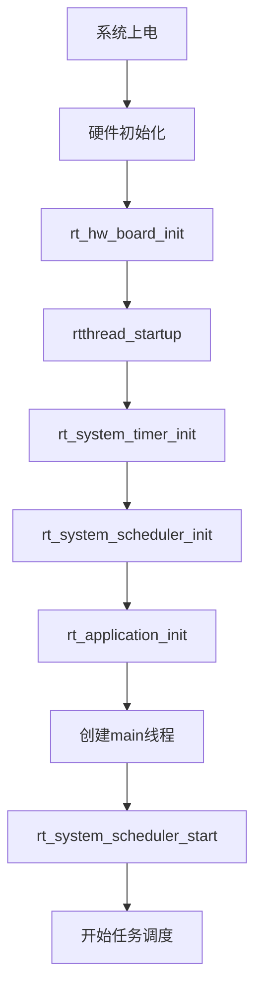

# RT-Thread快速入门：从零开始学习国产实时操作系统

## 学习目标

完成本教程后，你将能够：

- [ ] 理解RT-Thread的基本概念和特点
- [ ] 掌握ENV工具的安装和使用
- [ ] 创建第一个RT-Thread项目
- [ ] 使用menuconfig配置系统
- [ ] 编译和运行RT-Thread程序
- [ ] 理解RT-Thread的启动流程

## 前置要求

在开始本教程之前，你需要：

**知识要求**：
- 了解C语言基础（指针、结构体、函数）
- 熟悉基本的嵌入式开发概念
- 了解RTOS的基本概念（建议先阅读RTOS概述）
- 掌握STM32或其他MCU的基本开发流程

**技能要求**：
- 能够使用Keil MDK或其他IDE
- 会使用基本的命令行工具
- 了解如何下载程序到开发板

## 准备工作

### 硬件准备

| 名称 | 数量 | 说明 | 参考链接 |
|------|------|------|----------|
| STM32开发板 | 1 | STM32F4系列推荐 | - |
| ST-Link调试器 | 1 | 通常开发板自带 | - |
| USB数据线 | 1 | 用于连接开发板 | - |
| LED灯 | 1 | 用于演示（可选） | - |

### 软件准备

- **开发环境**：Keil MDK v5.30+ 或 RT-Thread Studio
- **ENV工具**：RT-Thread ENV v1.3+（必需）
- **Python环境**：Python 2.7或3.x（ENV工具依赖）
- **Git工具**：用于获取RT-Thread源码
- **辅助工具**：串口调试助手

### 环境配置

1. **安装Keil MDK**
   - 从ARM官网下载Keil MDK
   - 安装并激活（或使用评估版）
   - 安装对应的芯片支持包

2. **安装ENV工具**
   - 从RT-Thread官网下载ENV工具
   - 解压到英文路径（避免中文路径）
   - 运行env.exe测试是否正常

3. **配置Python环境**
   - 安装Python（推荐3.x版本）
   - 配置环境变量
   - 验证：在命令行输入 `python --version`

## RT-Thread基础概念

在开始实践之前，让我们快速了解RT-Thread的核心概念：

### 什么是RT-Thread？

RT-Thread是一个国产的开源实时操作系统，具有以下特点：

- **完全开源**：Apache License 2.0许可证
- **组件丰富**：内置大量组件和软件包
- **易于使用**：提供ENV工具和图形化配置
- **社区活跃**：国内最活跃的RTOS社区
- **文档完善**：中文文档齐全

### RT-Thread架构

RT-Thread采用分层架构设计：

```
┌─────────────────────────────────────┐
│        应用层 (Application)          │
├─────────────────────────────────────┤
│      组件层 (Components)             │
│  (文件系统、网络协议栈、GUI等)        │
├─────────────────────────────────────┤
│      设备驱动框架 (Device)           │
├─────────────────────────────────────┤
│      内核层 (Kernel)                 │
│  (线程管理、IPC、内存管理、定时器)    │
├─────────────────────────────────────┤
│      硬件抽象层 (BSP)                │
└─────────────────────────────────────┘
```

### 核心概念

**线程（Thread）**：
- RT-Thread中的基本执行单元
- 支持动态和静态创建
- 支持256个优先级

**对象管理器**：
- 统一管理内核对象
- 支持对象查找和遍历
- 便于调试和监控

**设备驱动框架**：
- 统一的设备访问接口
- 支持字符设备、块设备、网络设备
- 简化驱动开发


## 步骤1：安装和配置ENV工具

### 1.1 下载ENV工具

1. 访问RT-Thread官网：https://www.rt-thread.org/
2. 进入"资源下载"页面
3. 下载最新版本的ENV工具
4. 解压到英文路径，例如：`D:\RT-Thread\env`

**注意事项**：
- 路径中不要包含中文或空格
- 建议放在磁盘根目录附近
- 不要放在系统盘（C盘）

### 1.2 配置ENV工具

1. 进入ENV工具目录
2. 双击运行 `env.exe`
3. 首次运行会自动配置环境

**验证ENV工具**：

在ENV控制台中输入以下命令：

```bash
# 查看ENV版本
env --version

# 查看Python版本
python --version

# 查看Git版本
git --version
```

**预期输出**：
```
ENV version: 1.3.x
Python 3.x.x
git version 2.x.x
```

### 1.3 配置软件包源

ENV工具使用软件包管理器，需要配置软件包源：

```bash
# 更新软件包索引
pkgs --update

# 查看可用软件包
pkgs --list
```

**常见问题**：

如果更新失败，可能是网络问题：
```bash
# 使用国内镜像源
set RT_PKGS_URL=https://gitee.com/RT-Thread-Mirror/packages.git
pkgs --update
```

## 步骤2：获取RT-Thread源码

### 2.1 使用ENV获取BSP

RT-Thread提供了多种开发板的BSP（板级支持包）：

```bash
# 进入工作目录
cd D:\RT-Thread\workspace

# 克隆RT-Thread仓库
git clone https://github.com/RT-Thread/rt-thread.git

# 或使用国内镜像（更快）
git clone https://gitee.com/rtthread/rt-thread.git
```

### 2.2 选择BSP

RT-Thread支持众多开发板，选择你的目标板：

```bash
# 进入BSP目录
cd rt-thread\bsp

# 查看支持的开发板
dir

# 进入STM32F4系列BSP（以STM32F407-atk-explorer为例）
cd stm32\stm32f407-atk-explorer
```

**常见BSP**：
- `stm32f407-atk-explorer`：正点原子探索者
- `stm32f407-st-discovery`：ST官方Discovery
- `stm32f429-atk-apollo`：正点原子阿波罗
- `qemu-vexpress-a9`：QEMU模拟器（无需硬件）

### 2.3 BSP目录结构

```
stm32f407-atk-explorer/
├── applications/        # 应用代码
│   └── main.c          # 主程序
├── board/              # 板级配置
│   ├── board.h
│   └── Kconfig
├── libraries/          # 驱动库
├── rt-thread/          # RT-Thread内核（链接）
├── .config             # 配置文件
├── Kconfig             # 配置选项
├── project.uvprojx     # Keil工程文件
├── rtconfig.h          # 配置头文件
└── SConscript          # 构建脚本
```

## 步骤3：使用menuconfig配置系统

### 3.1 打开配置界面

在BSP目录下，使用ENV工具：

```bash
# 确保在BSP目录下
pwd

# 打开配置界面
menuconfig
```

**预期结果**：
- 打开图形化配置界面
- 显示RT-Thread配置选项

### 3.2 配置界面说明

menuconfig界面操作：

```
┌─────────────────────────────────────┐
│  RT-Thread Configuration            │
├─────────────────────────────────────┤
│  → RT-Thread Kernel                 │
│  → RT-Thread Components             │
│  → RT-Thread online packages        │
│  → Hardware Drivers Config          │
│  → Board extended module Drivers    │
└─────────────────────────────────────┘

操作说明：
↑↓ : 上下移动
→  : 进入子菜单
←  : 返回上级菜单
空格: 选中/取消（[*]表示选中）
/  : 搜索功能
?  : 查看帮助
S  : 保存配置
Q  : 退出
```

### 3.3 基本配置

#### 3.3.1 内核配置

进入 `RT-Thread Kernel` 菜单：

```
→ RT-Thread Kernel
  → Kernel Device Object
    [*] Using device object
  → IPC (Inter-Process Communication)
    [*] Using semaphore
    [*] Using mutex
    [*] Using event
    [*] Using mailbox
    [*] Using message queue
  → Memory Management
    [*] Using memory pool
    [*] Using small memory algorithm
```

**推荐配置**：
- 保持默认配置即可
- 初学者不需要修改内核配置

#### 3.3.2 组件配置

进入 `RT-Thread Components` 菜单：

```
→ RT-Thread Components
  → Device Drivers
    [*] Using serial device drivers
    [*] Using PIN device drivers
  → Command shell
    [*] Using FinSH shell
    (msh) The shell name
    [*] Using symbol table in FinSH shell
  → Device virtual file system
    [ ] Using device virtual file system (可选)
```

**推荐配置**：
- 启用FinSH shell（命令行）
- 启用串口驱动
- 文件系统可暂时不启用

#### 3.3.3 硬件驱动配置

进入 `Hardware Drivers Config` 菜单：

```
→ Hardware Drivers Config
  → On-chip Peripheral Drivers
    [*] Enable GPIO
    [*] Enable UART
      [*] Enable UART1 (console)
    [ ] Enable SPI
    [ ] Enable I2C
```

**推荐配置**：
- 启用GPIO（用于LED控制）
- 启用UART1（用于串口输出）
- 其他外设按需启用

### 3.4 保存配置

配置完成后：

1. 按 `S` 键保存配置
2. 按 `Q` 键退出menuconfig
3. ENV会自动生成 `rtconfig.h` 文件

**验证配置**：
```bash
# 查看生成的配置文件
cat rtconfig.h
```


## 步骤4：生成工程文件

### 4.1 使用scons生成Keil工程

RT-Thread使用scons构建系统，可以生成各种IDE的工程文件：

```bash
# 生成Keil MDK5工程
scons --target=mdk5

# 或生成IAR工程
scons --target=iar

# 或生成Makefile
scons --target=makefile
```

**预期输出**：
```
Generate project.uvprojx successfully!
```

### 4.2 工程文件说明

生成的工程文件包含：
- `project.uvprojx`：Keil工程文件
- `project.uvoptx`：Keil配置文件
- 所有源文件已自动添加到工程

**注意事项**：
- 每次修改配置后需要重新生成工程
- 不要手动修改工程文件，会被覆盖

## 步骤5：编写第一个程序

### 5.1 查看main.c

打开 `applications/main.c` 文件：

```c
#include <rtthread.h>
#include <rtdevice.h>
#include <board.h>

/* 定义LED引脚 */
#define LED_PIN    GET_PIN(F, 9)  // 根据实际开发板修改

int main(void)
{
    int count = 0;
    
    /* 设置LED引脚为输出模式 */
    rt_pin_mode(LED_PIN, PIN_MODE_OUTPUT);
    
    while (count++)
    {
        /* LED闪烁 */
        rt_pin_write(LED_PIN, PIN_HIGH);
        rt_thread_mdelay(500);
        
        rt_pin_write(LED_PIN, PIN_LOW);
        rt_thread_mdelay(500);
    }
    
    return RT_EOK;
}
```

**代码说明**：
- `rt_pin_mode()`：配置引脚模式
- `rt_pin_write()`：设置引脚电平
- `rt_thread_mdelay()`：线程延时（毫秒）
- `GET_PIN()`：获取引脚编号宏

### 5.2 创建自定义线程

在main.c中添加一个新线程：

```c
#include <rtthread.h>

#define THREAD_PRIORITY      25
#define THREAD_STACK_SIZE    512
#define THREAD_TIMESLICE     5

static rt_thread_t tid1 = RT_NULL;

/* 线程入口函数 */
static void thread1_entry(void *parameter)
{
    rt_uint32_t count = 0;
    
    while (1)
    {
        /* 打印信息 */
        rt_kprintf("thread1 count: %d\n", count++);
        
        /* 延时500ms */
        rt_thread_mdelay(500);
    }
}

/* 创建线程示例 */
int thread_sample(void)
{
    /* 创建线程1 */
    tid1 = rt_thread_create("thread1",
                            thread1_entry,
                            RT_NULL,
                            THREAD_STACK_SIZE,
                            THREAD_PRIORITY,
                            THREAD_TIMESLICE);
    
    /* 如果创建成功则启动线程 */
    if (tid1 != RT_NULL)
        rt_thread_startup(tid1);
    
    return 0;
}

/* 导出到msh命令列表 */
MSH_CMD_EXPORT(thread_sample, thread sample);
```

**代码说明**：
- `rt_thread_create()`：动态创建线程
- `rt_thread_startup()`：启动线程
- `rt_kprintf()`：内核打印函数
- `MSH_CMD_EXPORT()`：导出命令到shell

### 5.3 使用FinSH shell

RT-Thread提供了强大的命令行工具FinSH：

```c
/* 自定义命令示例 */
static void hello_rt(void)
{
    rt_kprintf("Hello RT-Thread!\n");
}

/* 导出命令 */
MSH_CMD_EXPORT(hello_rt, say hello to RT-Thread);
```

在串口终端中可以使用：
```bash
msh > hello_rt
Hello RT-Thread!

msh > list_thread
thread   pri  status      sp     stack size max used left tick  error
-------- ---  ------- ---------- ----------  ------  ---------- ---
tshell    20  ready   0x00000118 0x00001000    28%   0x00000003 000
tidle0    31  ready   0x00000070 0x00000100    43%   0x0000000a 000
main      10  suspend 0x00000090 0x00000800    11%   0x00000014 000
```

## 步骤6：编译和下载

### 6.1 打开Keil工程

1. 双击打开 `project.uvprojx`
2. Keil MDK会自动加载工程
3. 查看工程结构

**工程结构**：
```
Project
├── Applications      # 应用代码
├── Board            # 板级支持
├── Drivers          # 驱动代码
├── RT-Thread        # 内核源码
│   ├── Components   # 组件
│   ├── Kernel       # 内核
│   └── libcpu       # CPU移植
└── Libraries        # HAL库
```

### 6.2 编译工程

1. 点击 🔨 **Build** 按钮
2. 或按快捷键 **F7**
3. 查看编译输出

**预期输出**：
```
Build target 'RT-Thread STM32'
compiling main.c...
linking...
Program Size: Code=xxxxx RO-data=xxxx RW-data=xxx ZI-data=xxxx
"project.axf" - 0 Error(s), 0 Warning(s).
Build Time Elapsed:  00:00:xx
```

**常见编译错误**：

1. **缺少头文件**：
   - 检查Include Paths配置
   - 重新运行 `scons --target=mdk5`

2. **链接错误**：
   - 检查链接脚本配置
   - 确认Flash和RAM大小设置

### 6.3 配置下载选项

1. 点击 **Options for Target** 按钮
2. 选择 **Debug** 标签页
3. 选择调试器：ST-Link Debugger
4. 点击 **Settings** 配置
5. 在 **Flash Download** 中勾选：
   - Erase Full Chip
   - Program
   - Verify
   - Reset and Run

### 6.4 下载程序

1. 连接开发板到电脑
2. 点击 **Download** 按钮
3. 或按快捷键 **F8**
4. 等待下载完成

**预期结果**：
```
Load "project.axf"
Erase Done.
Programming Done.
Verify OK.
Application running ...
```


## 步骤7：测试和验证

### 7.1 观察LED闪烁

程序运行后：
- [ ] LED应该以1Hz频率闪烁
- [ ] 闪烁规律稳定

### 7.2 连接串口终端

1. 打开串口调试助手
2. 配置参数：
   - 波特率：115200
   - 数据位：8
   - 停止位：1
   - 校验：无
3. 打开串口

**预期输出**：
```
 \ | /
- RT -     Thread Operating System
 / | \     4.1.1 build Jan 15 2024
 2006 - 2022 Copyright by rt-thread team

msh >
```

### 7.3 使用FinSH命令

在串口终端中尝试以下命令：

```bash
# 查看帮助
msh > help

# 列出所有线程
msh > list_thread

# 查看内存使用
msh > free

# 列出所有设备
msh > list_device

# 运行自定义命令
msh > thread_sample
msh > hello_rt
```

**预期输出示例**：
```bash
msh > list_thread
thread   pri  status      sp     stack size max used left tick  error
-------- ---  ------- ---------- ----------  ------  ---------- ---
thread1   25  suspend 0x000000a8 0x00000200    32%   0x00000005 000
tshell    20  ready   0x00000118 0x00001000    28%   0x00000003 000
tidle0    31  ready   0x00000070 0x00000100    43%   0x0000000a 000
main      10  suspend 0x00000090 0x00000800    11%   0x00000014 000

msh > free
total memory: 65536
used memory : 4512
maximum allocated memory: 4896
```

### 7.4 调试验证

使用Keil调试器：

1. 点击 **Debug** 按钮启动调试
2. 程序会在main函数入口暂停

**设置断点**：
- 在 `thread1_entry()` 函数中设置断点
- 在 `main()` 函数的while循环中设置断点

**观察变量**：
- 查看 `count` 变量的值
- 查看线程控制块 `tid1` 的内容

**单步调试**：
1. 按 **F10** 单步执行
2. 按 **F11** 进入函数
3. 按 **F5** 继续运行

## 步骤8：理解RT-Thread启动流程

### 8.1 启动流程图



### 8.2 关键函数说明

**rtthread_startup()**：
```c
int rtthread_startup(void)
{
    rt_hw_interrupt_disable();
    
    /* 板级初始化 */
    rt_hw_board_init();
    
    /* 定时器初始化 */
    rt_system_timer_init();
    
    /* 调度器初始化 */
    rt_system_scheduler_init();
    
    /* 应用初始化 */
    rt_application_init();
    
    /* 定时器线程初始化 */
    rt_system_timer_thread_init();
    
    /* 空闲线程初始化 */
    rt_thread_idle_init();
    
    /* 启动调度器 */
    rt_system_scheduler_start();
    
    return 0;
}
```

**rt_application_init()**：
```c
void rt_application_init(void)
{
    rt_thread_t tid;
    
    /* 创建main线程 */
    tid = rt_thread_create("main",
                          main_thread_entry,
                          RT_NULL,
                          2048,
                          RT_THREAD_PRIORITY_MAX / 3,
                          20);
    
    if (tid != RT_NULL)
        rt_thread_startup(tid);
}
```

### 8.3 线程调度机制

RT-Thread使用基于优先级的抢占式调度：

```
优先级范围：0-255（数字越小优先级越高）
- 0-7：系统保留
- 8-31：高优先级任务
- 32-127：普通任务
- 128-255：低优先级任务
```

**调度时机**：
1. 当前线程主动放弃CPU（延时、等待）
2. 高优先级线程就绪
3. 时间片用完（同优先级轮转）
4. 中断返回时

## 故障排除

### 问题1：ENV工具无法运行

**现象**：
- 双击env.exe无反应
- 提示缺少Python

**可能原因**：
- Python未安装或未配置环境变量
- ENV工具路径包含中文

**解决方法**：

1. **安装Python**：
```bash
# 下载Python 3.x
# 安装时勾选"Add Python to PATH"
# 验证安装
python --version
```

2. **检查路径**：
```bash
# 确保ENV路径为纯英文
# 错误：D:\RT-Thread\环境工具\env
# 正确：D:\RT-Thread\env
```

### 问题2：menuconfig无法打开

**现象**：
- 运行menuconfig报错
- 提示找不到Kconfig

**可能原因**：
- 不在BSP目录下
- Kconfig文件损坏

**解决方法**：

1. **确认目录**：
```bash
# 查看当前目录
pwd

# 应该在BSP目录下，例如：
# D:\rt-thread\bsp\stm32\stm32f407-atk-explorer

# 检查是否有Kconfig文件
ls Kconfig
```

2. **重新获取BSP**：
```bash
# 如果Kconfig损坏，重新克隆
cd ..
rm -rf stm32f407-atk-explorer
git clone https://gitee.com/rtthread/rt-thread.git
```

### 问题3：编译错误

**现象**：
- 编译时出现大量错误
- 提示找不到头文件

**可能原因**：
- 工程文件未更新
- 配置不一致

**解决方法**：

1. **重新生成工程**：
```bash
# 在ENV中执行
scons --target=mdk5 -s

# -s 参数表示静默模式
```

2. **清理工程**：
```bash
# 清理编译产物
scons -c

# 重新编译
scons
```

3. **检查配置**：
```bash
# 查看rtconfig.h是否与.config一致
# 如果不一致，重新运行menuconfig并保存
```

### 问题4：程序无法运行

**现象**：
- 程序下载成功但不运行
- LED不闪烁，串口无输出

**可能原因**：
- 堆栈配置不足
- 时钟配置错误
- 引脚定义错误

**解决方法**：

1. **增加堆栈**：
```c
// 在rtconfig.h中
#define RT_MAIN_THREAD_STACK_SIZE  2048  // 增加main线程栈
#define RT_IDLE_THREAD_STACK_SIZE  512   // 增加idle线程栈
```

2. **检查时钟**：
```c
// 在board.c中检查SystemClock_Config()
// 确保时钟配置正确
```

3. **检查引脚**：
```c
// 确认LED_PIN定义与实际硬件一致
#define LED_PIN    GET_PIN(F, 9)  // 根据原理图修改
```

### 问题5：串口无输出

**现象**：
- 程序运行正常
- 串口终端无任何输出

**可能原因**：
- 串口未启用
- 波特率不匹配
- 串口引脚配置错误

**解决方法**：

1. **检查串口配置**：
```bash
# 在menuconfig中确认
Hardware Drivers Config
  → On-chip Peripheral Drivers
    [*] Enable UART
      [*] Enable UART1
```

2. **检查波特率**：
```c
// 在board.h中
#define BSP_UART1_BAUDRATE  115200  // 确保与终端一致
```

3. **检查引脚**：
```c
// 在board.c中检查UART引脚配置
// PA9: UART1_TX
// PA10: UART1_RX
```


## 总结

通过本教程，你学习了：

- ✅ RT-Thread的基本概念和特点
- ✅ ENV工具的安装和使用方法
- ✅ menuconfig图形化配置系统
- ✅ 创建和编译RT-Thread项目
- ✅ 线程的创建和管理
- ✅ FinSH shell的使用
- ✅ RT-Thread的启动流程

### 关键要点

1. **ENV工具是RT-Thread开发的核心**
   - 提供menuconfig配置界面
   - 管理软件包
   - 生成工程文件

2. **menuconfig简化了系统配置**
   - 图形化界面，易于使用
   - 自动生成rtconfig.h
   - 支持组件和驱动的灵活配置

3. **RT-Thread的设计理念**
   - 面向对象的设计
   - 统一的设备驱动框架
   - 丰富的组件和软件包

4. **FinSH shell提供强大的调试能力**
   - 运行时查看系统状态
   - 动态执行命令
   - 方便的调试接口

## 进阶挑战

尝试以下挑战来巩固学习：

### 挑战1：多线程协作

创建3个线程，实现以下功能：
- 线程1：每500ms读取一次按键状态
- 线程2：根据按键状态控制LED闪烁频率
- 线程3：每秒通过串口输出系统信息

**提示**：使用邮箱或消息队列进行线程间通信

### 挑战2：使用软件包

尝试添加一个软件包：
```bash
# 在menuconfig中选择软件包
RT-Thread online packages
  → IoT - internet of things
    → [*] pahomqtt: Eclipse Paho MQTT C/C++ client

# 更新软件包
pkgs --update

# 重新生成工程
scons --target=mdk5
```

### 挑战3：自定义设备驱动

实现一个简单的字符设备驱动：
- 注册设备到设备框架
- 实现open、close、read、write接口
- 在应用层使用设备

**提示**：参考RT-Thread设备驱动框架文档

## 完整代码示例

### main.c 完整代码

```c
/*
 * Copyright (c) 2006-2024, RT-Thread Development Team
 *
 * SPDX-License-Identifier: Apache-2.0
 */

#include <rtthread.h>
#include <rtdevice.h>
#include <board.h>

/* 定义LED引脚（根据实际开发板修改） */
#define LED_PIN    GET_PIN(F, 9)

/* 线程控制块 */
static rt_thread_t tid1 = RT_NULL;

/* 线程1入口函数 */
static void thread1_entry(void *parameter)
{
    rt_uint32_t count = 0;
    
    while (1)
    {
        /* 打印信息 */
        rt_kprintf("thread1 count: %d\n", count++);
        
        /* 延时500ms */
        rt_thread_mdelay(500);
    }
}

/* 创建线程示例 */
int thread_sample(void)
{
    /* 创建线程1 */
    tid1 = rt_thread_create("thread1",
                            thread1_entry,
                            RT_NULL,
                            512,
                            25,
                            5);
    
    /* 如果创建成功则启动线程 */
    if (tid1 != RT_NULL)
        rt_thread_startup(tid1);
    else
        rt_kprintf("thread1 create failed!\n");
    
    return 0;
}

/* 导出到msh命令列表 */
MSH_CMD_EXPORT(thread_sample, thread sample);

/* 自定义命令示例 */
static void hello_rt(void)
{
    rt_kprintf("Hello RT-Thread!\n");
    rt_kprintf("RT-Thread version: %d.%d.%d\n",
               RT_VERSION, RT_SUBVERSION, RT_REVISION);
}
MSH_CMD_EXPORT(hello_rt, say hello to RT-Thread);

/* 主函数 */
int main(void)
{
    int count = 0;
    
    /* 设置LED引脚为输出模式 */
    rt_pin_mode(LED_PIN, PIN_MODE_OUTPUT);
    
    rt_kprintf("RT-Thread is running...\n");
    
    while (count++)
    {
        /* LED闪烁 */
        rt_pin_write(LED_PIN, PIN_HIGH);
        rt_thread_mdelay(500);
        
        rt_pin_write(LED_PIN, PIN_LOW);
        rt_thread_mdelay(500);
    }
    
    return RT_EOK;
}
```

### 测试环境

**硬件环境**：
- 开发板：正点原子探索者STM32F407
- 调试器：ST-Link V2
- LED：板载LED（PF9）

**软件环境**：
- IDE：Keil MDK v5.36
- RT-Thread版本：v4.1.1
- ENV工具版本：v1.3.5
- Python版本：3.9.7

## 下一步学习

建议按以下顺序继续学习：

### 1. 深入线程管理
- [RT-Thread线程管理](02-rtthread-thread.html)
- 学习线程的创建、删除、挂起、恢复
- 理解线程优先级和调度策略

### 2. 设备驱动框架
- RT-Thread设备驱动框架
- 学习设备模型和驱动框架
- 掌握驱动开发方法

### 3. 组件和软件包
- RT-Thread组件与软件包
- 学习常用组件的使用
- 掌握软件包管理

### 4. 实战项目
- 基于RT-Thread的IoT项目
- 综合运用所学知识
- 完成完整的IoT系统

## 参考资料

### 官方文档

1. **RT-Thread官方网站**
   - https://www.rt-thread.org/
   - 包含完整的文档和教程

2. **RT-Thread编程指南**
   - https://www.rt-thread.org/document/site/
   - 详细的API文档和编程指南

3. **RT-Thread源码仓库**
   - GitHub: https://github.com/RT-Thread/rt-thread
   - Gitee: https://gitee.com/rtthread/rt-thread

### 推荐书籍

1. **《RT-Thread内核实现与应用开发实战》**
   - RT-Thread官方出品
   - 深入讲解内核原理

2. **《嵌入式实时操作系统RT-Thread设计与实现》**
   - 系统介绍RT-Thread架构
   - 包含大量实例

### 在线资源

1. **RT-Thread社区论坛**
   - https://club.rt-thread.org/
   - 活跃的中文社区

2. **RT-Thread问答社区**
   - https://www.rt-thread.org/qa/
   - 技术问题解答

3. **RT-Thread软件包中心**
   - https://packages.rt-thread.org/
   - 丰富的软件包资源

### 视频教程

1. **RT-Thread官方视频教程**
   - B站：RT-Thread物联网操作系统
   - 系列教程，从入门到精通

2. **RT-Thread在线培训**
   - 官方培训课程
   - 包含实战项目

## 常见问题解答

### Q1: RT-Thread和FreeRTOS有什么区别？

**A**: 主要区别：

| 特性 | RT-Thread | FreeRTOS |
|------|-----------|----------|
| 开发团队 | 国内团队 | 国外团队 |
| 文档语言 | 中文为主 | 英文为主 |
| 组件丰富度 | 非常丰富 | 相对较少 |
| 设备框架 | 统一的设备驱动框架 | 需要自己实现 |
| 配置方式 | menuconfig图形化 | 头文件配置 |
| 软件包管理 | ENV工具管理 | 无统一管理 |
| 社区支持 | 国内社区活跃 | 国际社区活跃 |

**选择建议**：
- 国内项目、中文文档需求 → RT-Thread
- 国际项目、英文环境 → FreeRTOS
- 需要丰富组件 → RT-Thread
- 追求极简内核 → FreeRTOS

### Q2: ENV工具必须使用吗？

**A**: 强烈推荐使用，原因：
- menuconfig提供图形化配置，比手动修改头文件方便
- 自动管理软件包依赖
- 自动生成工程文件
- 统一的构建系统

**不使用ENV的情况**：
- 使用RT-Thread Studio（集成了ENV功能）
- 项目配置固定，不需要频繁修改

### Q3: 如何选择合适的BSP？

**A**: 选择原则：
1. **优先选择官方BSP**：稳定性好，文档完善
2. **选择相同或相近的芯片**：移植工作量小
3. **查看BSP更新时间**：选择维护活跃的BSP
4. **参考社区评价**：查看论坛讨论

**常用BSP推荐**：
- STM32F4系列：stm32f407-atk-explorer
- STM32F1系列：stm32f103-atk-nano
- STM32H7系列：stm32h750-artpi
- 无硬件学习：qemu-vexpress-a9

### Q4: 软件包如何管理？

**A**: 使用ENV工具管理：

```bash
# 查看可用软件包
pkgs --list

# 搜索软件包
pkgs --search mqtt

# 更新软件包索引
pkgs --update

# 在menuconfig中选择软件包后，下载
pkgs --update

# 删除未使用的软件包
pkgs --clean
```

**注意事项**：
- 软件包会下载到 `packages` 目录
- 修改软件包配置后需要重新生成工程
- 某些软件包有依赖关系，会自动下载依赖

### Q5: 如何调试RT-Thread程序？

**A**: 多种调试方法：

1. **使用FinSH shell**：
```bash
# 查看线程状态
list_thread

# 查看内存使用
free

# 查看设备列表
list_device
```

2. **使用Keil调试器**：
- 设置断点
- 单步执行
- 查看变量

3. **使用SystemView**：
- 可视化任务执行
- 分析系统性能

4. **使用日志系统**：
```c
#define DBG_TAG "main"
#define DBG_LVL DBG_LOG
#include <rtdbg.h>

LOG_D("Debug message");
LOG_I("Info message");
LOG_W("Warning message");
LOG_E("Error message");
```

---

**反馈与支持**：

如果你在学习过程中遇到问题：
- 💬 在评论区留言讨论
- 🌐 访问RT-Thread社区论坛
- 📧 发送邮件到：support@embedded-platform.com
- 🐛 报告问题：[GitHub Issues](https://github.com/RT-Thread/rt-thread/issues)

**贡献代码**：
欢迎提交改进建议和示例代码！

---

**版权声明**：本教程采用 [CC BY-SA 4.0](https://creativecommons.org/licenses/by-sa/4.0/) 许可协议。

**最后更新**：2024-01-15  
**文档版本**：1.0
