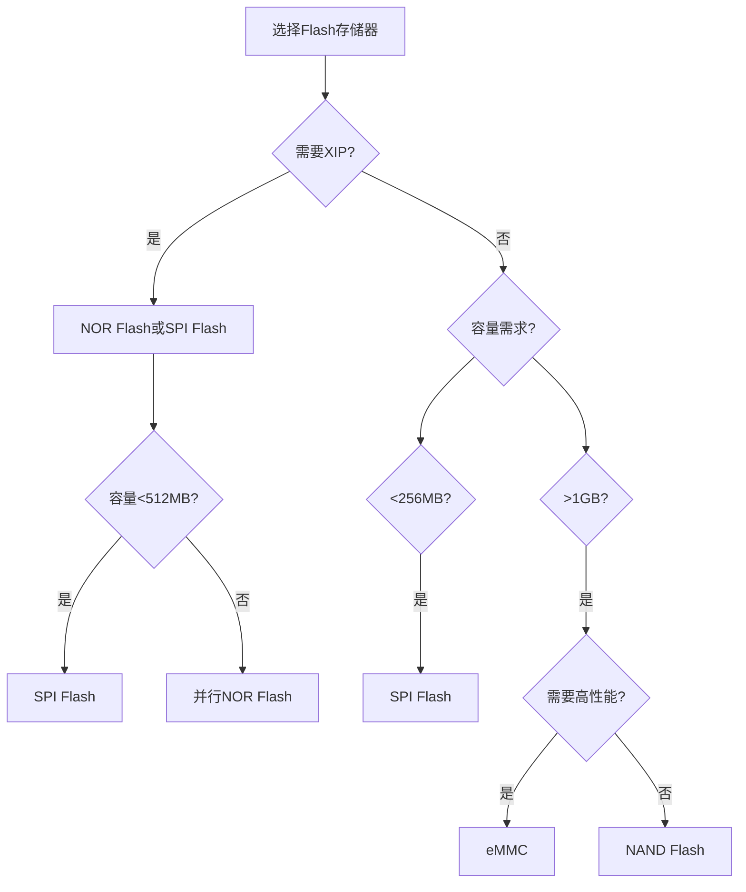

# Flash存储器技术详解：NOR、NAND与嵌入式存储选型指南

## 概述

Flash存储器是嵌入式系统中最常用的非易失性存储器，广泛应用于程序存储、数据记录、固件更新等场景。本文将全面介绍Flash存储器的工作原理、主要类型及其特性，帮助你掌握嵌入式系统的存储方案设计。

完成本文学习后，你将能够：

- [ ] 理解Flash存储器的基本工作原理
- [ ] 掌握NOR Flash和NAND Flash的区别和特点
- [ ] 了解SPI Flash、QSPI Flash和eMMC的应用场景
- [ ] 掌握Flash存储器的关键参数和性能指标
- [ ] 能够根据应用需求选择合适的Flash存储方案
- [ ] 理解Flash存储器的寿命和可靠性问题
- [ ] 了解Flash存储器的发展趋势

## 背景知识

### 什么是Flash存储器

Flash存储器是一种电子可擦除可编程只读存储器（EEPROM）的变种，具有以下特点：

**核心特性**：
- **非易失性**：断电后数据不丢失
- **可电擦除**：可以通过电信号擦除和重写
- **块擦除**：以块为单位进行擦除操作
- **高密度**：存储密度高，成本低
- **有限寿命**：擦写次数有限制

**发展历史**：
- 1984年：东芝公司发明NOR Flash
- 1987年：东芝公司发明NAND Flash
- 1990年代：Flash开始大规模商用
- 2000年代：SPI Flash和eMMC普及
- 2010年代：3D NAND技术突破


### Flash存储原理

Flash存储器基于浮栅晶体管（Floating Gate Transistor）技术：

**存储单元结构**：

```
        控制栅极 (Control Gate)
              |
    ┌─────────┴─────────┐
    │    氧化层          │
    ├───────────────────┤
    │  浮栅 (Floating)  │  ← 存储电荷
    ├───────────────────┤
    │    氧化层          │
    └─────────┬─────────┘
              |
         源极 ─┴─ 漏极
```

**工作原理**：
1. **编程（写入）**：通过隧道效应将电子注入浮栅
2. **擦除**：通过隧道效应将电子从浮栅移除
3. **读取**：检测晶体管的导通状态

**存储状态**：
- 浮栅有电荷 → 阈值电压高 → 逻辑"0"
- 浮栅无电荷 → 阈值电压低 → 逻辑"1"

## NOR Flash详解

### NOR Flash特性

NOR Flash采用并行接口，具有以下特点：

**优势**：
- **随机访问**：支持字节级随机读取
- **XIP支持**：可以直接执行代码（Execute In Place）
- **高可靠性**：位翻转率低，数据保持时间长
- **读取速度快**：典型读取速度100-150MB/s

**劣势**：
- **写入速度慢**：典型写入速度0.1-1MB/s
- **擦除速度慢**：块擦除时间1-5秒
- **容量较小**：通常小于512MB
- **成本较高**：单位容量成本高于NAND

### NOR Flash架构

**存储阵列结构**：

```
        位线 (Bit Line)
          |  |  |  |
    ──────┼──┼──┼──┼──── 字线0 (Word Line 0)
    ──────┼──┼──┼──┼──── 字线1
    ──────┼──┼──┼──┼──── 字线2
          |  |  |  |
        [存储单元阵列]
```

**地址映射**：
- 每个存储单元可以独立寻址
- 支持字节、字、双字访问
- 地址总线直接连接到MCU


### NOR Flash操作

**读取操作**：

```c
// NOR Flash读取示例（并行接口）
#define NOR_FLASH_BASE  0x08000000  // NOR Flash基地址

// 读取单个字节
uint8_t read_byte(uint32_t address) {
    volatile uint8_t *flash_ptr = (uint8_t *)(NOR_FLASH_BASE + address);
    return *flash_ptr;
}

// 读取数据块
void read_block(uint32_t address, uint8_t *buffer, uint32_t length) {
    volatile uint8_t *flash_ptr = (uint8_t *)(NOR_FLASH_BASE + address);
    for (uint32_t i = 0; i < length; i++) {
        buffer[i] = flash_ptr[i];
    }
}
```

**写入操作**：

```c
// NOR Flash写入需要先擦除
void write_byte(uint32_t address, uint8_t data) {
    volatile uint8_t *flash_ptr = (uint8_t *)(NOR_FLASH_BASE + address);
    
    // 1. 发送写入命令序列
    *(volatile uint8_t *)(NOR_FLASH_BASE + 0x555) = 0xAA;
    *(volatile uint8_t *)(NOR_FLASH_BASE + 0x2AA) = 0x55;
    *(volatile uint8_t *)(NOR_FLASH_BASE + 0x555) = 0xA0;
    
    // 2. 写入数据
    *flash_ptr = data;
    
    // 3. 等待写入完成
    while (*flash_ptr != data);
}
```

**擦除操作**：

```c
// 扇区擦除（通常4KB或64KB）
void erase_sector(uint32_t sector_address) {
    // 1. 发送擦除命令序列
    *(volatile uint8_t *)(NOR_FLASH_BASE + 0x555) = 0xAA;
    *(volatile uint8_t *)(NOR_FLASH_BASE + 0x2AA) = 0x55;
    *(volatile uint8_t *)(NOR_FLASH_BASE + 0x555) = 0x80;
    *(volatile uint8_t *)(NOR_FLASH_BASE + 0x555) = 0xAA;
    *(volatile uint8_t *)(NOR_FLASH_BASE + 0x2AA) = 0x55;
    
    // 2. 发送扇区擦除命令
    *(volatile uint8_t *)(NOR_FLASH_BASE + sector_address) = 0x30;
    
    // 3. 等待擦除完成（可能需要几秒）
    volatile uint8_t *status = (uint8_t *)(NOR_FLASH_BASE + sector_address);
    while ((*status & 0x80) == 0);  // 检查DQ7位
}
```

### NOR Flash应用场景

**典型应用**：

1. **代码存储**
   - MCU启动代码
   - 固件程序
   - 实时操作系统

2. **配置数据**
   - 系统参数
   - 校准数据
   - 用户设置

3. **小容量数据**
   - 日志记录
   - 事件存储
   - 状态保存


## NAND Flash详解

### NAND Flash特性

NAND Flash采用串行接口，针对大容量存储优化：

**优势**：
- **高存储密度**：单位面积存储容量大
- **大容量**：从几GB到几TB
- **写入速度快**：典型写入速度10-40MB/s
- **擦除速度快**：块擦除时间2-3ms
- **成本低**：单位容量成本低

**劣势**：
- **不支持XIP**：不能直接执行代码
- **需要ECC**：位错误率较高，需要纠错
- **坏块管理**：出厂时可能存在坏块
- **顺序访问**：按页读写，不支持随机访问

### NAND Flash架构

**存储层次结构**：

```
NAND Flash 芯片
    │
    ├─ 块 (Block) - 擦除单位
    │   ├─ 页 (Page) - 读写单位
    │   │   ├─ 数据区 (Data Area): 2KB/4KB
    │   │   └─ 备用区 (Spare Area): 64B/128B
    │   ├─ 页
    │   └─ ... (64/128/256页)
    │
    ├─ 块
    └─ ... (数千个块)
```

**典型参数**：
- 页大小：2KB、4KB、8KB
- 块大小：128KB、256KB、512KB
- 备用区：用于ECC和坏块标记
- 擦写次数：SLC 100K次，MLC 10K次，TLC 3K次

### NAND Flash类型

**按存储单元分类**：

| 类型 | 全称 | 每单元位数 | 擦写次数 | 速度 | 成本 | 应用 |
|------|------|-----------|---------|------|------|------|
| SLC | Single Level Cell | 1 bit | 100,000 | 最快 | 最高 | 工业、企业 |
| MLC | Multi Level Cell | 2 bits | 10,000 | 中等 | 中等 | 消费电子 |
| TLC | Triple Level Cell | 3 bits | 3,000 | 较慢 | 较低 | 大容量存储 |
| QLC | Quad Level Cell | 4 bits | 1,000 | 最慢 | 最低 | 超大容量 |

**存储单元对比**：

```
SLC: 1 bit/cell
┌───┐
│ 0 │  或  │ 1 │
└───┘      └───┘

MLC: 2 bits/cell
┌────┐
│ 00 │ 01 │ 10 │ 11 │
└────┘

TLC: 3 bits/cell
┌─────┐
│ 000 │ 001 │ 010 │ 011 │ 100 │ 101 │ 110 │ 111 │
└─────┘
```


### NAND Flash操作

**基本操作流程**：

```c
// NAND Flash基本操作示例（简化）

// 1. 读取页
void nand_read_page(uint32_t page_addr, uint8_t *buffer) {
    // 发送读取命令
    nand_send_command(0x00);
    
    // 发送地址（5个周期）
    nand_send_address(page_addr & 0xFF);
    nand_send_address((page_addr >> 8) & 0xFF);
    nand_send_address((page_addr >> 16) & 0xFF);
    nand_send_address((page_addr >> 24) & 0xFF);
    nand_send_address((page_addr >> 32) & 0xFF);
    
    // 发送确认命令
    nand_send_command(0x30);
    
    // 等待就绪
    while (!nand_is_ready());
    
    // 读取数据（2KB + 64B备用区）
    for (int i = 0; i < 2048; i++) {
        buffer[i] = nand_read_data();
    }
}

// 2. 写入页（必须先擦除）
void nand_write_page(uint32_t page_addr, uint8_t *buffer) {
    // 发送写入命令
    nand_send_command(0x80);
    
    // 发送地址
    nand_send_address(page_addr & 0xFF);
    nand_send_address((page_addr >> 8) & 0xFF);
    nand_send_address((page_addr >> 16) & 0xFF);
    nand_send_address((page_addr >> 24) & 0xFF);
    nand_send_address((page_addr >> 32) & 0xFF);
    
    // 写入数据
    for (int i = 0; i < 2048; i++) {
        nand_write_data(buffer[i]);
    }
    
    // 发送确认命令
    nand_send_command(0x10);
    
    // 等待写入完成
    while (!nand_is_ready());
    
    // 检查状态
    uint8_t status = nand_read_status();
    if (status & 0x01) {
        // 写入失败
    }
}

// 3. 擦除块
void nand_erase_block(uint32_t block_addr) {
    // 发送擦除命令
    nand_send_command(0x60);
    
    // 发送块地址（3个周期）
    nand_send_address((block_addr >> 16) & 0xFF);
    nand_send_address((block_addr >> 24) & 0xFF);
    nand_send_address((block_addr >> 32) & 0xFF);
    
    // 发送确认命令
    nand_send_command(0xD0);
    
    // 等待擦除完成
    while (!nand_is_ready());
    
    // 检查状态
    uint8_t status = nand_read_status();
    if (status & 0x01) {
        // 擦除失败，可能是坏块
    }
}
```

### NAND Flash关键技术

**1. ECC（错误校正码）**：

```c
// ECC校验示例
typedef struct {
    uint8_t data[2048];      // 数据区
    uint8_t ecc[64];         // ECC校验码
    uint8_t bad_block_mark;  // 坏块标记
    uint8_t reserved[63];    // 保留区
} nand_page_t;

// 计算ECC
void calculate_ecc(uint8_t *data, uint8_t *ecc) {
    // 使用Hamming码或BCH码计算ECC
    // 可以纠正1-8位错误
}

// 校验和纠错
int verify_and_correct(uint8_t *data, uint8_t *ecc) {
    uint8_t calculated_ecc[64];
    calculate_ecc(data, calculated_ecc);
    
    // 比较ECC
    int errors = compare_ecc(ecc, calculated_ecc);
    
    if (errors == 0) {
        return 0;  // 无错误
    } else if (errors <= 8) {
        correct_errors(data, ecc);
        return errors;  // 已纠正
    } else {
        return -1;  // 无法纠正
    }
}
```

**2. 坏块管理**：

```c
// 坏块表结构
typedef struct {
    uint16_t bad_block_list[100];  // 坏块列表
    uint16_t bad_block_count;      // 坏块数量
} bad_block_table_t;

// 检查坏块
bool is_bad_block(uint32_t block_addr) {
    // 读取第一页的备用区
    uint8_t spare[64];
    nand_read_spare(block_addr, 0, spare);
    
    // 检查坏块标记（通常在第一个字节）
    if (spare[0] != 0xFF) {
        return true;  // 是坏块
    }
    return false;
}

// 标记坏块
void mark_bad_block(uint32_t block_addr) {
    uint8_t spare[64];
    memset(spare, 0xFF, sizeof(spare));
    spare[0] = 0x00;  // 坏块标记
    
    // 写入坏块标记
    nand_write_spare(block_addr, 0, spare);
}
```


## SPI Flash详解

### SPI Flash特性

SPI Flash是NOR Flash的一种，通过SPI接口连接：

**优势**：
- **引脚少**：只需4-6个引脚（SPI/QSPI）
- **易于使用**：标准SPI协议，驱动简单
- **成本低**：封装小，成本低
- **容量适中**：1MB-256MB
- **低功耗**：待机电流<1μA

**常见型号**：
- W25Q系列（Winbond）
- MX25系列（Macronix）
- GD25系列（GigaDevice）
- AT25系列（Atmel）

### SPI Flash接口

**引脚定义**：

```
MCU                    SPI Flash (W25Q128)
  SCK  ────────────►  CLK   (时钟)
  MISO ◄────────────  DO    (数据输出)
  MOSI ────────────►  DI    (数据输入)
  CS   ────────────►  CS    (片选)
  3.3V ────────────►  VCC
  GND  ────────────►  GND
```

**QSPI模式**（4线并行）：

```
MCU                    QSPI Flash
  SCK  ────────────►  CLK
  CS   ────────────►  CS
  IO0  ◄──────────►  IO0/DI
  IO1  ◄──────────►  IO1/DO
  IO2  ◄──────────►  IO2/WP
  IO3  ◄──────────►  IO3/HOLD
```

### SPI Flash操作

**基本操作示例**：

```c
// SPI Flash驱动示例

// 1. 读取设备ID
uint16_t spi_flash_read_id(void) {
    uint8_t cmd = 0x90;  // Read Manufacturer/Device ID
    uint8_t addr[3] = {0x00, 0x00, 0x00};
    uint8_t id[2];
    
    CS_LOW();
    spi_transmit(&cmd, 1);
    spi_transmit(addr, 3);
    spi_receive(id, 2);
    CS_HIGH();
    
    return (id[0] << 8) | id[1];
}

// 2. 读取数据
void spi_flash_read(uint32_t address, uint8_t *buffer, uint32_t length) {
    uint8_t cmd[4];
    cmd[0] = 0x03;  // Read Data
    cmd[1] = (address >> 16) & 0xFF;
    cmd[2] = (address >> 8) & 0xFF;
    cmd[3] = address & 0xFF;
    
    CS_LOW();
    spi_transmit(cmd, 4);
    spi_receive(buffer, length);
    CS_HIGH();
}

// 3. 快速读取（支持更高时钟频率）
void spi_flash_fast_read(uint32_t address, uint8_t *buffer, uint32_t length) {
    uint8_t cmd[5];
    cmd[0] = 0x0B;  // Fast Read
    cmd[1] = (address >> 16) & 0xFF;
    cmd[2] = (address >> 8) & 0xFF;
    cmd[3] = address & 0xFF;
    cmd[4] = 0xFF;  // Dummy byte
    
    CS_LOW();
    spi_transmit(cmd, 5);
    spi_receive(buffer, length);
    CS_HIGH();
}

// 4. 页编程（256字节）
void spi_flash_page_program(uint32_t address, uint8_t *buffer, uint32_t length) {
    // 使能写入
    spi_flash_write_enable();
    
    uint8_t cmd[4];
    cmd[0] = 0x02;  // Page Program
    cmd[1] = (address >> 16) & 0xFF;
    cmd[2] = (address >> 8) & 0xFF;
    cmd[3] = address & 0xFF;
    
    CS_LOW();
    spi_transmit(cmd, 4);
    spi_transmit(buffer, length);
    CS_HIGH();
    
    // 等待写入完成
    spi_flash_wait_busy();
}

// 5. 扇区擦除（4KB）
void spi_flash_erase_sector(uint32_t address) {
    // 使能写入
    spi_flash_write_enable();
    
    uint8_t cmd[4];
    cmd[0] = 0x20;  // Sector Erase
    cmd[1] = (address >> 16) & 0xFF;
    cmd[2] = (address >> 8) & 0xFF;
    cmd[3] = address & 0xFF;
    
    CS_LOW();
    spi_transmit(cmd, 4);
    CS_HIGH();
    
    // 等待擦除完成（约50ms）
    spi_flash_wait_busy();
}

// 6. 块擦除（64KB）
void spi_flash_erase_block(uint32_t address) {
    spi_flash_write_enable();
    
    uint8_t cmd[4];
    cmd[0] = 0xD8;  // Block Erase
    cmd[1] = (address >> 16) & 0xFF;
    cmd[2] = (address >> 8) & 0xFF;
    cmd[3] = address & 0xFF;
    
    CS_LOW();
    spi_transmit(cmd, 4);
    CS_HIGH();
    
    // 等待擦除完成（约1-2秒）
    spi_flash_wait_busy();
}

// 辅助函数
void spi_flash_write_enable(void) {
    uint8_t cmd = 0x06;  // Write Enable
    CS_LOW();
    spi_transmit(&cmd, 1);
    CS_HIGH();
}

void spi_flash_wait_busy(void) {
    uint8_t cmd = 0x05;  // Read Status Register
    uint8_t status;
    
    do {
        CS_LOW();
        spi_transmit(&cmd, 1);
        spi_receive(&status, 1);
        CS_HIGH();
    } while (status & 0x01);  // 检查BUSY位
}
```


### QSPI Flash高速传输

**QSPI模式优势**：
- 4线并行传输，速度提升4倍
- 支持XIP模式（部分芯片）
- 典型速度：80-133MHz

**QSPI读取示例**：

```c
// QSPI快速读取（Quad I/O Fast Read）
void qspi_flash_fast_read(uint32_t address, uint8_t *buffer, uint32_t length) {
    uint8_t cmd = 0xEB;  // Quad I/O Fast Read
    
    // 配置QSPI控制器
    qspi_config_t config = {
        .instruction = cmd,
        .address = address,
        .address_size = 3,
        .dummy_cycles = 6,
        .data_mode = QSPI_DATA_4_LINES,
        .address_mode = QSPI_ADDR_4_LINES,
    };
    
    // 执行QSPI传输
    qspi_receive(&config, buffer, length);
}
```

## eMMC详解

### eMMC特性

eMMC（embedded MultiMediaCard）是一种集成了NAND Flash和控制器的存储方案：

**核心特点**：
- **集成控制器**：内置Flash控制器和固件
- **标准接口**：MMC/SD接口，8位并行
- **大容量**：4GB-256GB
- **高性能**：顺序读写200-400MB/s
- **免维护**：自动坏块管理、磨损均衡、ECC

**eMMC架构**：

```
┌─────────────────────────────────┐
│         eMMC 芯片                │
│  ┌──────────────────────────┐  │
│  │   Flash控制器             │  │
│  │  - 坏块管理               │  │
│  │  - 磨损均衡               │  │
│  │  - ECC                    │  │
│  │  - 缓存管理               │  │
│  └──────────────────────────┘  │
│              ↕                   │
│  ┌──────────────────────────┐  │
│  │   NAND Flash阵列          │  │
│  │   (MLC/TLC)               │  │
│  └──────────────────────────┘  │
└─────────────────────────────────┘
         ↕ (MMC接口)
    ┌─────────────┐
    │   主控MCU    │
    └─────────────┘
```

### eMMC接口

**引脚定义**：

```
MCU                    eMMC
  CLK  ────────────►  CLK   (时钟，最高200MHz)
  CMD  ◄──────────►  CMD   (命令线)
  DAT0 ◄──────────►  DAT0  (数据线0)
  DAT1 ◄──────────►  DAT1  (数据线1)
  DAT2 ◄──────────►  DAT2  (数据线2)
  DAT3 ◄──────────►  DAT3  (数据线3)
  DAT4 ◄──────────►  DAT4  (数据线4，可选)
  DAT5 ◄──────────►  DAT5  (数据线5，可选)
  DAT6 ◄──────────►  DAT6  (数据线6，可选)
  DAT7 ◄──────────►  DAT7  (数据线7，可选)
  VCC  ────────────►  VCC
  GND  ────────────►  GND
```

**传输模式**：
- 1位模式：使用DAT0
- 4位模式：使用DAT0-DAT3
- 8位模式：使用DAT0-DAT7（最高性能）

### eMMC操作

**基本操作流程**：

```c
// eMMC初始化
int emmc_init(void) {
    // 1. 发送CMD0复位
    emmc_send_command(CMD0, 0);
    
    // 2. 发送CMD1获取OCR
    uint32_t ocr;
    do {
        emmc_send_command(CMD1, 0x40FF8000);
        ocr = emmc_get_response();
    } while (!(ocr & 0x80000000));  // 等待就绪
    
    // 3. 发送CMD2获取CID
    emmc_send_command(CMD2, 0);
    
    // 4. 发送CMD3设置RCA
    emmc_send_command(CMD3, 0x0001 << 16);
    
    // 5. 发送CMD9获取CSD
    emmc_send_command(CMD9, 0x0001 << 16);
    
    // 6. 选择卡
    emmc_send_command(CMD7, 0x0001 << 16);
    
    // 7. 设置总线宽度（8位）
    emmc_send_command(CMD6, 0x03B70200);
    
    // 8. 设置高速模式
    emmc_send_command(CMD6, 0x03B90100);
    
    return 0;
}

// 读取块
int emmc_read_block(uint32_t block_addr, uint8_t *buffer) {
    // 发送CMD17读取单块
    emmc_send_command(CMD17, block_addr);
    
    // 等待数据就绪
    while (!emmc_data_ready());
    
    // 读取512字节数据
    for (int i = 0; i < 512; i++) {
        buffer[i] = emmc_read_data();
    }
    
    return 0;
}

// 写入块
int emmc_write_block(uint32_t block_addr, uint8_t *buffer) {
    // 发送CMD24写入单块
    emmc_send_command(CMD24, block_addr);
    
    // 写入512字节数据
    for (int i = 0; i < 512; i++) {
        emmc_write_data(buffer[i]);
    }
    
    // 等待写入完成
    while (emmc_is_busy());
    
    return 0;
}

// 多块读取（更高效）
int emmc_read_multiple_blocks(uint32_t block_addr, uint8_t *buffer, uint32_t count) {
    // 发送CMD18读取多块
    emmc_send_command(CMD18, block_addr);
    
    for (uint32_t i = 0; i < count; i++) {
        // 等待数据就绪
        while (!emmc_data_ready());
        
        // 读取512字节
        for (int j = 0; j < 512; j++) {
            buffer[i * 512 + j] = emmc_read_data();
        }
    }
    
    // 发送CMD12停止传输
    emmc_send_command(CMD12, 0);
    
    return 0;
}
```


## Flash存储器对比

### 全面对比表

| 特性 | NOR Flash | NAND Flash | SPI Flash | eMMC |
|------|-----------|------------|-----------|------|
| **接口** | 并行 | 并行/串行 | SPI/QSPI | MMC |
| **容量** | 1-512MB | 1GB-1TB | 1-256MB | 4GB-256GB |
| **读取速度** | 100-150MB/s | 40-100MB/s | 10-50MB/s | 200-400MB/s |
| **写入速度** | 0.1-1MB/s | 10-40MB/s | 0.5-5MB/s | 50-200MB/s |
| **擦除时间** | 1-5秒/块 | 2-3ms/块 | 50ms-2秒 | 自动管理 |
| **XIP支持** | ✅ 支持 | ❌ 不支持 | ⚠️ 部分支持 | ❌ 不支持 |
| **随机访问** | ✅ 字节级 | ❌ 页级 | ✅ 字节级 | ❌ 块级 |
| **ECC需求** | ❌ 不需要 | ✅ 必需 | ❌ 不需要 | ✅ 内置 |
| **坏块管理** | ❌ 不需要 | ✅ 必需 | ❌ 不需要 | ✅ 内置 |
| **擦写次数** | 100K | 10K-100K | 100K | 3K-10K |
| **引脚数** | 20-50 | 8-16 | 4-6 | 10-13 |
| **成本** | 高 | 低 | 中 | 中高 |
| **典型应用** | 代码存储 | 大容量存储 | 外部存储 | 系统存储 |

### 性能对比图

**读写速度对比**：

```
读取速度 (MB/s)
400 │                    ████ eMMC
    │
300 │
    │
200 │
    │
100 │ ████ NOR  ████ NAND  ██ SPI
    │
  0 └─────────────────────────────
      NOR   NAND   SPI   eMMC

写入速度 (MB/s)
200 │                    ████ eMMC
    │
150 │
    │
100 │
    │
 50 │          ████ NAND
    │
  0 │ █ NOR              █ SPI
    └─────────────────────────────
      NOR   NAND   SPI   eMMC
```

### 选型决策树



## Flash存储器关键参数

### 性能参数

**1. 读写速度**：

```c
// 性能测试示例
void flash_performance_test(void) {
    uint8_t buffer[4096];
    uint32_t start_time, end_time;
    
    // 读取性能测试
    start_time = get_tick();
    for (int i = 0; i < 1000; i++) {
        flash_read(i * 4096, buffer, 4096);
    }
    end_time = get_tick();
    
    float read_speed = (4096.0 * 1000) / (end_time - start_time);
    printf("Read speed: %.2f KB/s\n", read_speed);
    
    // 写入性能测试
    start_time = get_tick();
    for (int i = 0; i < 100; i++) {
        flash_erase_sector(i * 4096);
        flash_write(i * 4096, buffer, 4096);
    }
    end_time = get_tick();
    
    float write_speed = (4096.0 * 100) / (end_time - start_time);
    printf("Write speed: %.2f KB/s\n", write_speed);
}
```

**2. 擦写次数**：

| Flash类型 | 典型擦写次数 | 数据保持时间 |
|-----------|-------------|-------------|
| NOR Flash | 100,000次 | 20年 |
| SLC NAND | 100,000次 | 10年 |
| MLC NAND | 10,000次 | 5-10年 |
| TLC NAND | 3,000次 | 3-5年 |
| QLC NAND | 1,000次 | 1-3年 |

**3. 功耗参数**：

```c
// 功耗模式示例
typedef enum {
    FLASH_MODE_ACTIVE,      // 活动模式：10-30mA
    FLASH_MODE_STANDBY,     // 待机模式：1-5mA
    FLASH_MODE_DEEP_SLEEP,  // 深度睡眠：<1μA
} flash_power_mode_t;

// 进入低功耗模式
void flash_enter_low_power(void) {
    uint8_t cmd = 0xB9;  // Deep Power-Down
    CS_LOW();
    spi_transmit(&cmd, 1);
    CS_HIGH();
    
    // 功耗降至<1μA
}

// 唤醒
void flash_wake_up(void) {
    uint8_t cmd = 0xAB;  // Release from Deep Power-Down
    CS_LOW();
    spi_transmit(&cmd, 1);
    CS_HIGH();
    
    delay_us(30);  // 等待唤醒
}
```


### 可靠性参数

**1. 数据保持时间**：

```c
// 数据保持时间计算
// 保持时间 = 基准时间 × 2^((25-T)/10)
// T: 工作温度（℃）

float calculate_retention_time(float temp_celsius, float base_years) {
    float exponent = (25.0 - temp_celsius) / 10.0;
    float multiplier = pow(2.0, exponent);
    return base_years * multiplier;
}

// 示例
// 25℃: 10年
// 55℃: 10 × 2^(-3) = 1.25年
// 85℃: 10 × 2^(-6) = 0.16年（约2个月）
```

**2. 位错误率（BER）**：

| Flash类型 | 原始BER | ECC后BER |
|-----------|---------|----------|
| NOR Flash | 10^-8 | - |
| SLC NAND | 10^-8 | 10^-15 |
| MLC NAND | 10^-7 | 10^-14 |
| TLC NAND | 10^-6 | 10^-13 |

**3. 温度范围**：

| 等级 | 温度范围 | 应用场景 |
|------|---------|---------|
| 商业级 | 0°C ~ 70°C | 消费电子 |
| 工业级 | -40°C ~ 85°C | 工业设备 |
| 汽车级 | -40°C ~ 125°C | 汽车电子 |
| 军工级 | -55°C ~ 125°C | 军事航天 |

## Flash存储器应用指南

### 应用场景选择

**1. 代码存储**：

```
推荐方案：NOR Flash 或 SPI Flash

理由：
✅ 支持XIP，可直接执行代码
✅ 随机访问性能好
✅ 可靠性高
✅ 容量适中（通常<512MB）

典型应用：
- MCU启动代码
- 固件程序
- RTOS内核
- 应用程序
```

**2. 数据记录**：

```
推荐方案：SPI Flash 或 eMMC

理由：
✅ 成本适中
✅ 容量灵活
✅ 接口简单
✅ 支持文件系统

典型应用：
- 传感器数据记录
- 日志存储
- 配置参数
- 用户数据
```

**3. 大容量存储**：

```
推荐方案：eMMC 或 NAND Flash

理由：
✅ 容量大（GB级）
✅ 成本低
✅ 性能好（eMMC）
✅ 免维护（eMMC）

典型应用：
- 多媒体文件
- 操作系统
- 应用程序包
- 数据库
```

### 设计注意事项

**1. 电路设计**：

```c
// 电源去耦
// 在Flash芯片VCC引脚附近放置去耦电容
// 推荐：100nF + 10μF

// PCB布线
// - 时钟线尽量短，避免干扰
// - 数据线等长，减少时序偏差
// - 添加串联电阻（22-33Ω）抑制振铃
// - 保持良好的接地

// 电平匹配
// 确保MCU和Flash的电平兼容
// 3.3V Flash不能直接连接5V MCU
```

**2. 软件设计**：

```c
// Flash操作最佳实践

// 1. 写入前必须擦除
void safe_write(uint32_t addr, uint8_t *data, uint32_t len) {
    // 先擦除
    flash_erase_sector(addr);
    
    // 再写入
    flash_write(addr, data, len);
    
    // 验证
    uint8_t verify_buf[len];
    flash_read(addr, verify_buf, len);
    if (memcmp(data, verify_buf, len) != 0) {
        // 写入失败，重试或报错
    }
}

// 2. 实现磨损均衡
typedef struct {
    uint32_t sector_addr;
    uint32_t erase_count;
} wear_level_info_t;

void wear_leveling_write(uint8_t *data, uint32_t len) {
    // 选择擦除次数最少的扇区
    uint32_t sector = find_least_erased_sector();
    
    // 写入数据
    flash_erase_sector(sector);
    flash_write(sector, data, len);
    
    // 更新擦除计数
    update_erase_count(sector);
}

// 3. 添加CRC校验
typedef struct {
    uint32_t magic;      // 魔数
    uint32_t version;    // 版本
    uint32_t length;     // 数据长度
    uint32_t crc32;      // CRC校验
    uint8_t data[];      // 数据
} flash_data_t;

void write_with_crc(uint32_t addr, uint8_t *data, uint32_t len) {
    flash_data_t *pkg = malloc(sizeof(flash_data_t) + len);
    
    pkg->magic = 0x12345678;
    pkg->version = 1;
    pkg->length = len;
    memcpy(pkg->data, data, len);
    
    // 计算CRC
    pkg->crc32 = calculate_crc32(pkg->data, len);
    
    // 写入Flash
    flash_erase_sector(addr);
    flash_write(addr, (uint8_t *)pkg, sizeof(flash_data_t) + len);
    
    free(pkg);
}

bool read_with_crc(uint32_t addr, uint8_t *data, uint32_t len) {
    flash_data_t *pkg = malloc(sizeof(flash_data_t) + len);
    
    // 读取Flash
    flash_read(addr, (uint8_t *)pkg, sizeof(flash_data_t) + len);
    
    // 验证魔数
    if (pkg->magic != 0x12345678) {
        free(pkg);
        return false;
    }
    
    // 验证CRC
    uint32_t crc = calculate_crc32(pkg->data, pkg->length);
    if (crc != pkg->crc32) {
        free(pkg);
        return false;
    }
    
    // 复制数据
    memcpy(data, pkg->data, len);
    free(pkg);
    return true;
}
```


**3. 寿命管理**：

```c
// Flash寿命监控系统

typedef struct {
    uint32_t total_sectors;
    uint32_t *erase_counts;     // 每个扇区的擦除次数
    uint32_t max_erase_count;   // 最大擦除次数
    uint32_t min_erase_count;   // 最小擦除次数
    uint32_t avg_erase_count;   // 平均擦除次数
} flash_health_t;

// 初始化健康监控
void flash_health_init(flash_health_t *health, uint32_t sectors) {
    health->total_sectors = sectors;
    health->erase_counts = calloc(sectors, sizeof(uint32_t));
    
    // 从Flash读取擦除计数（如果有保存）
    load_erase_counts(health);
}

// 更新擦除计数
void flash_health_update(flash_health_t *health, uint32_t sector) {
    health->erase_counts[sector]++;
    
    // 更新统计信息
    update_statistics(health);
    
    // 定期保存到Flash
    if (health->erase_counts[sector] % 100 == 0) {
        save_erase_counts(health);
    }
}

// 获取健康状态
float flash_health_status(flash_health_t *health) {
    // 假设Flash寿命为100,000次擦除
    const uint32_t MAX_ERASE = 100000;
    
    float health_percent = 100.0 * (1.0 - (float)health->avg_erase_count / MAX_ERASE);
    return health_percent;
}

// 预测剩余寿命
uint32_t flash_predict_lifetime(flash_health_t *health, uint32_t daily_erases) {
    const uint32_t MAX_ERASE = 100000;
    uint32_t remaining_erases = MAX_ERASE - health->avg_erase_count;
    uint32_t remaining_days = remaining_erases / daily_erases;
    return remaining_days;
}
```

## Flash存储器发展趋势

### 新技术发展

**1. 3D NAND技术**：

```
传统2D NAND：
┌─┬─┬─┬─┐
│ │ │ │ │  单层存储单元
└─┴─┴─┴─┘

3D NAND：
┌─┐
│ │
├─┤
│ │  多层堆叠
├─┤  (64-176层)
│ │
└─┘

优势：
✅ 更高存储密度
✅ 更低成本
✅ 更好性能
✅ 更低功耗
```

**2. QLC和PLC技术**：

```
存储密度提升：
SLC: 1 bit/cell
MLC: 2 bits/cell
TLC: 3 bits/cell
QLC: 4 bits/cell
PLC: 5 bits/cell (研发中)

挑战：
⚠️ 可靠性下降
⚠️ 寿命缩短
⚠️ 性能降低
```

**3. UFS（Universal Flash Storage）**：

```
UFS vs eMMC：

特性          eMMC        UFS
接口          半双工      全双工
速度          400MB/s     2900MB/s
命令队列      1           32
功耗          更高        更低
应用          中端设备    高端设备
```

### 未来展望

**存储技术路线图**：

```
2024-2025：
- 200+层3D NAND
- QLC成为主流
- UFS 4.0普及

2026-2028：
- PLC技术商用
- 新型存储器（MRAM、ReRAM）
- 更高速接口（PCIe 5.0）

2029+：
- 新型非易失存储器
- 接近DRAM的性能
- 更长的使用寿命
```

## 常见问题

### Q1: Flash为什么需要先擦除再写入？

**A**: Flash的物理特性决定的：

- **写入原理**：通过隧道效应将电子注入浮栅，只能将位从"1"改为"0"
- **擦除原理**：通过隧道效应将电子从浮栅移除，将所有位恢复为"1"
- **限制**：无法直接将"0"改为"1"，必须先擦除（全部变"1"），再写入

**示例**：
```
原始数据：  11111111 (擦除状态)
写入0x55：  01010101 (可以直接写)
再写0xAA：  10101010 (无法直接写，需要先擦除)
```

### Q2: 如何延长Flash使用寿命？

**A**: 采用以下策略：

1. **磨损均衡**：均匀分配擦写操作
2. **减少擦写**：使用缓存，批量写入
3. **避免频繁擦除**：合理设计数据结构
4. **使用文件系统**：LittleFS、SPIFFS等自动管理
5. **监控健康状态**：及时发现问题

### Q3: SPI Flash和QSPI Flash有什么区别？

**A**: 主要区别在于数据线数量：

| 特性 | SPI Flash | QSPI Flash |
|------|-----------|------------|
| 数据线 | 1线（MOSI/MISO） | 4线（IO0-IO3） |
| 速度 | 10-20MB/s | 40-80MB/s |
| 引脚 | 4个 | 6个 |
| 兼容性 | 更好 | 需要QSPI控制器 |

QSPI Flash可以工作在SPI模式，向下兼容。

### Q4: 为什么NAND Flash需要ECC？

**A**: NAND Flash的位错误率较高：

- **原因**：
  - 存储密度高，单元间干扰大
  - MLC/TLC/QLC每单元存储多位
  - 随着使用，错误率增加

- **ECC作用**：
  - 检测和纠正位错误
  - 提高数据可靠性
  - 延长使用寿命

- **ECC强度**：
  - SLC：1-4位纠错
  - MLC：4-8位纠错
  - TLC：8-16位纠错

### Q5: 如何选择合适的Flash存储器？

**A**: 根据以下因素选择：

**决策因素**：

1. **容量需求**
   - <512MB → SPI Flash
   - 512MB-4GB → NAND Flash
   - >4GB → eMMC

2. **性能要求**
   - 需要XIP → NOR/SPI Flash
   - 高速读写 → eMMC
   - 一般应用 → SPI Flash

3. **成本预算**
   - 低成本 → NAND Flash
   - 中等成本 → SPI Flash
   - 可接受较高成本 → eMMC

4. **开发难度**
   - 简单易用 → SPI Flash或eMMC
   - 可接受复杂 → NAND Flash

## 总结

本文全面介绍了Flash存储器技术，主要内容包括：

**核心要点**：

1. **Flash基础**
   - Flash是基于浮栅晶体管的非易失性存储器
   - 具有块擦除、有限寿命等特点
   - 广泛应用于嵌入式系统

2. **主要类型**
   - NOR Flash：支持XIP，适合代码存储
   - NAND Flash：高密度，适合大容量存储
   - SPI Flash：接口简单，应用广泛
   - eMMC：集成控制器，免维护

3. **关键参数**
   - 读写速度、擦写次数、数据保持时间
   - 可靠性、功耗、温度范围
   - 根据应用需求选择合适参数

4. **应用指南**
   - 代码存储选NOR/SPI Flash
   - 数据记录选SPI Flash
   - 大容量存储选eMMC/NAND
   - 注意电路设计和软件优化

5. **发展趋势**
   - 3D NAND提升密度
   - QLC/PLC降低成本
   - UFS提升性能
   - 新型存储器技术

**实践建议**：

- 根据应用场景选择合适的Flash类型
- 实现磨损均衡和健康监控
- 添加CRC校验保证数据可靠性
- 使用成熟的文件系统
- 关注新技术发展

## 延伸阅读

推荐进一步学习的资源：

- FAT文件系统原理与应用 - 了解Flash上的文件系统
- [EEPROM数据存储应用](./02-eeprom-storage.html) - 学习另一种非易失存储
- [Flash磨损均衡算法](../intermediate/01-wear-leveling.html) - 深入学习寿命管理
- LittleFS轻量级文件系统 - Flash文件系统实战

## 参考资料

1. JEDEC Standard - Flash Memory Specifications
2. Micron Technology - NAND Flash Memory Technical Guide
3. Winbond - SPI Flash Datasheet and Application Notes
4. JEDEC - eMMC Standard Specification
5. ARM - Flash Memory Technology Overview

---

**练习题**：

1. 解释NOR Flash和NAND Flash的主要区别，并说明各自的应用场景
2. 编写一个SPI Flash驱动程序，实现读、写、擦除功能
3. 设计一个Flash磨损均衡算法，并实现擦除计数功能
4. 分析你的项目需求，选择合适的Flash存储方案并说明理由

**下一步**：建议学习 [EEPROM数据存储应用](./02-eeprom-storage.html)，了解另一种常用的非易失性存储技术。
