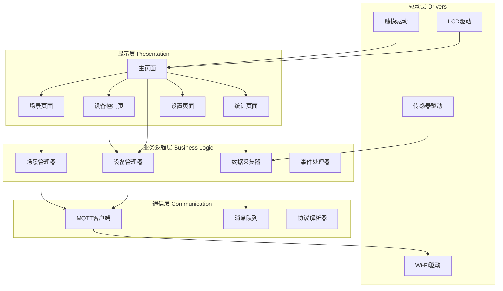

# 智能家居控制面板项目：打造专业级触控交互系统

## 项目概述

本项目将指导你构建一个功能完整的智能家居控制面板系统，实现对家中各类智能设备的集中控制和状态监控。项目采用专业的GUI设计模式，集成触控交互、实时数据可视化、网络通信等核心功能，是一个综合性的嵌入式GUI应用实战项目。

### 项目特点

- ✅ **专业级UI设计**：采用LVGL图形库，实现流畅的动画效果和现代化界面
- ✅ **多设备控制**：支持灯光、空调、窗帘、安防等多种智能设备
- ✅ **实时数据可视化**：温湿度曲线、能耗统计、设备状态监控
- ✅ **触控交互优化**：手势识别、滑动切换、长按操作等丰富交互
- ✅ **网络通信**：基于MQTT协议实现设备远程控制
- ✅ **场景联动**：支持自定义场景模式（回家、离家、睡眠等）
- ✅ **低功耗设计**：智能休眠、屏幕亮度自适应

### 学习目标

完成本项目后，你将能够：

- [ ] 掌握LVGL高级组件的使用和自定义
- [ ] 实现复杂的多页面GUI应用架构
- [ ] 设计流畅的触控交互体验
- [ ] 实现实时数据图表和动画效果
- [ ] 集成MQTT协议实现IoT设备通信
- [ ] 应用MVC设计模式组织GUI代码
- [ ] 优化GUI性能和内存使用
- [ ] 实现完整的智能家居控制逻辑

### 适用人群

- 有LVGL基础，希望进阶的开发者
- 对智能家居系统感兴趣的工程师
- 需要开发触控GUI应用的项目团队
- 准备从事嵌入式GUI开发的学习者


## 技术栈

### 硬件清单

| 名称 | 规格 | 数量 | 说明 | 参考价格 |
|------|------|------|------|----------|
| 开发板 | STM32F429/ESP32-S3 | 1 | 主控MCU，需支持外部SDRAM | ¥80-150 |
| TFT LCD | 4.3寸 480×272 | 1 | 电容触摸屏，ILI9488/ST7796 | ¥60-100 |
| Wi-Fi模块 | ESP8266/ESP32 | 1 | 网络通信（如主控无Wi-Fi） | ¥15-30 |
| 温湿度传感器 | DHT22/SHT30 | 1 | 环境监测 | ¥10-25 |
| 光照传感器 | BH1750 | 1 | 自动亮度调节 | ¥5-10 |
| 继电器模块 | 4路5V | 1 | 模拟设备控制 | ¥8-15 |
| 电源模块 | 5V/2A | 1 | 系统供电 | ¥10-20 |
| 外壳 | 定制亚克力 | 1 | 可选 | ¥30-50 |

**总预算**：约 ¥200-400

### 软件要求

**开发环境**：
- STM32CubeIDE 1.12+ / ESP-IDF 5.0+
- LVGL 8.3+
- Git版本控制

**第三方库**：
- LVGL：图形界面库
- FreeRTOS：实时操作系统
- MQTT Client：PahoMQTT或mosquitto
- cJSON：JSON数据解析

**调试工具**：
- 串口调试助手
- MQTT客户端（MQTT.fx / MQTTX）
- Wireshark（网络抓包）


## 系统架构

### 整体架构设计



### 软件架构

采用分层MVC架构：

```
smart_home_panel/
├── App/
│   ├── ui/                    # 视图层 (View)
│   │   ├── pages/
│   │   │   ├── home_page.c/h
│   │   │   ├── device_page.c/h
│   │   │   ├── scene_page.c/h
│   │   │   ├── stats_page.c/h
│   │   │   └── settings_page.c/h
│   │   ├── widgets/           # 自定义组件
│   │   │   ├── device_card.c/h
│   │   │   ├── chart_widget.c/h
│   │   │   └── scene_button.c/h
│   │   └── ui_manager.c/h     # UI管理器
│   ├── model/                 # 模型层 (Model)
│   │   ├── device_model.c/h
│   │   ├── scene_model.c/h
│   │   └── sensor_model.c/h
│   ├── controller/            # 控制器层 (Controller)
│   │   ├── device_controller.c/h
│   │   ├── scene_controller.c/h
│   │   └── data_controller.c/h
│   └── service/               # 服务层
│       ├── mqtt_service.c/h
│       ├── storage_service.c/h
│       └── sensor_service.c/h
├── Drivers/
│   ├── lcd/
│   ├── touch/
│   └── sensors/
├── Middlewares/
│   ├── LVGL/
│   ├── FreeRTOS/
│   └── MQTT/
└── main.c
```


## 阶段1：项目基础搭建

### 1.1 创建项目和配置外设

**使用STM32CubeMX配置**：

1. **选择芯片**：STM32F429ZIT6
2. **配置时钟**：180MHz主频
3. **配置外设**：
   - LTDC：LCD控制器
   - SPI5：触摸屏接口
   - I2C1：传感器接口
   - USART1：调试串口
   - FMC：外部SDRAM（用于显存）

4. **使能FreeRTOS**：
   - CMSIS_V2接口
   - 堆大小：32KB
   - 创建默认任务

**项目目录结构**：

```bash
# 创建项目目录
mkdir smart_home_panel
cd smart_home_panel

# 创建源码目录
mkdir -p App/{ui/{pages,widgets},model,controller,service}
mkdir -p Drivers/{lcd,touch,sensors}
```

### 1.2 集成LVGL图形库

**下载LVGL**：

```bash
cd Middlewares
git clone https://github.com/lvgl/lvgl.git
cd lvgl
git checkout release/v8.3
```

**配置LVGL**：

创建 `lv_conf.h` 文件：

```c
#ifndef LV_CONF_H
#define LV_CONF_H

/* 颜色深度 */
#define LV_COLOR_DEPTH 16

/* 显示分辨率 */
#define LV_HOR_RES_MAX 480
#define LV_VER_RES_MAX 272

/* 内存配置 */
#define LV_MEM_CUSTOM 0
#define LV_MEM_SIZE (64 * 1024U)  // 64KB

/* 使能特性 */
#define LV_USE_PERF_MONITOR 1
#define LV_USE_MEM_MONITOR 1
#define LV_USE_LOG 1

/* 字体 */
#define LV_FONT_MONTSERRAT_14 1
#define LV_FONT_MONTSERRAT_16 1
#define LV_FONT_MONTSERRAT_20 1

/* 组件使能 */
#define LV_USE_BTN 1
#define LV_USE_LABEL 1
#define LV_USE_IMG 1
#define LV_USE_SLIDER 1
#define LV_USE_SWITCH 1
#define LV_USE_CHART 1
#define LV_USE_TABVIEW 1
#define LV_USE_ROLLER 1

#endif
```

**移植LVGL显示驱动**：

创建 `lv_port_disp.c` 文件：

```c
#include "lvgl.h"
#include "lv_port_disp.h"
#include "lcd_driver.h"

/* 显示缓冲区 */
static lv_disp_draw_buf_t disp_buf;
static lv_color_t buf_1[LV_HOR_RES_MAX * 10];  // 10行缓冲
static lv_color_t buf_2[LV_HOR_RES_MAX * 10];  // 双缓冲

/**
 * @brief  刷新显示回调函数
 * @param  disp_drv: 显示驱动
 * @param  area: 刷新区域
 * @param  color_p: 颜色数据
 */
static void disp_flush(lv_disp_drv_t *disp_drv, const lv_area_t *area, lv_color_t *color_p)
{
    /* 设置显示窗口 */
    LCD_SetWindow(area->x1, area->y1, area->x2, area->y2);
    
    /* 计算像素数量 */
    uint32_t width = area->x2 - area->x1 + 1;
    uint32_t height = area->y2 - area->y1 + 1;
    uint32_t size = width * height;
    
    /* 使用DMA传输数据 */
    LCD_WritePixels((uint16_t*)color_p, size);
    
    /* 通知LVGL刷新完成 */
    lv_disp_flush_ready(disp_drv);
}

/**
 * @brief  初始化LVGL显示驱动
 */
void lv_port_disp_init(void)
{
    /* 初始化LCD */
    LCD_Init();
    
    /* 初始化显示缓冲区 */
    lv_disp_draw_buf_init(&disp_buf, buf_1, buf_2, LV_HOR_RES_MAX * 10);
    
    /* 注册显示驱动 */
    static lv_disp_drv_t disp_drv;
    lv_disp_drv_init(&disp_drv);
    disp_drv.hor_res = LV_HOR_RES_MAX;
    disp_drv.ver_res = LV_VER_RES_MAX;
    disp_drv.flush_cb = disp_flush;
    disp_drv.draw_buf = &disp_buf;
    lv_disp_drv_register(&disp_drv);
}
```


**移植LVGL触摸驱动**：

创建 `lv_port_indev.c` 文件：

```c
#include "lvgl.h"
#include "lv_port_indev.h"
#include "touch_driver.h"

/**
 * @brief  读取触摸数据回调函数
 * @param  indev_drv: 输入设备驱动
 * @param  data: 触摸数据
 */
static void touchpad_read(lv_indev_drv_t *indev_drv, lv_indev_data_t *data)
{
    TouchPoint_t touch;
    
    /* 读取触摸坐标 */
    if (Touch_Read(&touch)) {
        data->state = LV_INDEV_STATE_PRESSED;
        data->point.x = touch.x;
        data->point.y = touch.y;
    } else {
        data->state = LV_INDEV_STATE_RELEASED;
    }
}

/**
 * @brief  初始化LVGL输入设备驱动
 */
void lv_port_indev_init(void)
{
    /* 初始化触摸屏 */
    Touch_Init();
    
    /* 注册触摸设备 */
    static lv_indev_drv_t indev_drv;
    lv_indev_drv_init(&indev_drv);
    indev_drv.type = LV_INDEV_TYPE_POINTER;
    indev_drv.read_cb = touchpad_read;
    lv_indev_drv_register(&indev_drv);
}
```

### 1.3 创建FreeRTOS任务

在 `main.c` 中创建任务：

```c
#include "FreeRTOS.h"
#include "task.h"
#include "lvgl.h"

/* 任务句柄 */
TaskHandle_t lvgl_task_handle;
TaskHandle_t mqtt_task_handle;
TaskHandle_t sensor_task_handle;

/**
 * @brief  LVGL任务
 */
void LVGL_Task(void *argument)
{
    /* 初始化LVGL */
    lv_init();
    lv_port_disp_init();
    lv_port_indev_init();
    
    /* 创建UI */
    ui_init();
    
    while (1) {
        /* LVGL心跳 */
        lv_timer_handler();
        vTaskDelay(pdMS_TO_TICKS(5));  // 5ms刷新一次
    }
}

/**
 * @brief  MQTT通信任务
 */
void MQTT_Task(void *argument)
{
    /* 初始化MQTT */
    mqtt_service_init();
    
    while (1) {
        /* 处理MQTT消息 */
        mqtt_service_process();
        vTaskDelay(pdMS_TO_TICKS(100));
    }
}

/**
 * @brief  传感器采集任务
 */
void Sensor_Task(void *argument)
{
    /* 初始化传感器 */
    sensor_service_init();
    
    while (1) {
        /* 读取传感器数据 */
        sensor_service_update();
        vTaskDelay(pdMS_TO_TICKS(1000));  // 1秒采集一次
    }
}

int main(void)
{
    /* HAL初始化 */
    HAL_Init();
    SystemClock_Config();
    
    /* 外设初始化 */
    MX_GPIO_Init();
    MX_LTDC_Init();
    MX_I2C1_Init();
    MX_USART1_UART_Init();
    
    /* 创建任务 */
    xTaskCreate(LVGL_Task, "LVGL", 2048, NULL, 3, &lvgl_task_handle);
    xTaskCreate(MQTT_Task, "MQTT", 2048, NULL, 2, &mqtt_task_handle);
    xTaskCreate(Sensor_Task, "Sensor", 1024, NULL, 1, &sensor_task_handle);
    
    /* 启动调度器 */
    vTaskStartScheduler();
    
    while (1) {
    }
}
```


## 阶段2：数据模型设计

### 2.1 设备模型

创建 `device_model.h` 文件：

```c
#ifndef DEVICE_MODEL_H
#define DEVICE_MODEL_H

#include "stdint.h"
#include "stdbool.h"

/* 设备类型 */
typedef enum {
    DEVICE_TYPE_LIGHT = 0,      // 灯光
    DEVICE_TYPE_AC,             // 空调
    DEVICE_TYPE_CURTAIN,        // 窗帘
    DEVICE_TYPE_LOCK,           // 门锁
    DEVICE_TYPE_CAMERA,         // 摄像头
    DEVICE_TYPE_SENSOR,         // 传感器
    DEVICE_TYPE_MAX
} DeviceType_t;

/* 设备状态 */
typedef enum {
    DEVICE_STATE_OFFLINE = 0,   // 离线
    DEVICE_STATE_ONLINE,        // 在线
    DEVICE_STATE_ERROR          // 故障
} DeviceState_t;

/* 灯光设备 */
typedef struct {
    bool on;                    // 开关状态
    uint8_t brightness;         // 亮度 (0-100)
    uint32_t color;             // RGB颜色
    uint8_t color_temp;         // 色温 (0-100)
} LightDevice_t;

/* 空调设备 */
typedef struct {
    bool on;                    // 开关状态
    uint8_t mode;               // 模式 (制冷/制热/除湿/送风)
    uint8_t temperature;        // 温度 (16-30°C)
    uint8_t fan_speed;          // 风速 (低/中/高/自动)
} ACDevice_t;

/* 窗帘设备 */
typedef struct {
    uint8_t position;           // 位置 (0-100, 0=关闭, 100=打开)
    bool moving;                // 是否正在移动
} CurtainDevice_t;

/* 设备基类 */
typedef struct {
    uint8_t id;                 // 设备ID
    char name[32];              // 设备名称
    DeviceType_t type;          // 设备类型
    DeviceState_t state;        // 设备状态
    char room[16];              // 所在房间
    uint32_t last_update;       // 最后更新时间
    
    union {
        LightDevice_t light;
        ACDevice_t ac;
        CurtainDevice_t curtain;
    } data;
} Device_t;

/* 设备管理器 */
typedef struct {
    Device_t devices[16];       // 设备列表
    uint8_t count;              // 设备数量
} DeviceManager_t;

/* 函数声明 */
void DeviceModel_Init(void);
Device_t* DeviceModel_GetDevice(uint8_t id);
Device_t* DeviceModel_GetDeviceByName(const char *name);
bool DeviceModel_AddDevice(Device_t *device);
bool DeviceModel_UpdateDevice(uint8_t id, Device_t *device);
bool DeviceModel_RemoveDevice(uint8_t id);
uint8_t DeviceModel_GetDeviceCount(void);
Device_t* DeviceModel_GetDeviceList(void);

#endif
```

创建 `device_model.c` 文件：

```c
#include "device_model.h"
#include <string.h>

static DeviceManager_t device_manager = {0};

/**
 * @brief  初始化设备模型
 */
void DeviceModel_Init(void)
{
    memset(&device_manager, 0, sizeof(DeviceManager_t));
    
    /* 添加默认设备 */
    Device_t light1 = {
        .id = 1,
        .name = "客厅吊灯",
        .type = DEVICE_TYPE_LIGHT,
        .state = DEVICE_STATE_ONLINE,
        .room = "客厅",
        .data.light = {.on = false, .brightness = 80, .color = 0xFFFFFF}
    };
    DeviceModel_AddDevice(&light1);
    
    Device_t ac1 = {
        .id = 2,
        .name = "卧室空调",
        .type = DEVICE_TYPE_AC,
        .state = DEVICE_STATE_ONLINE,
        .room = "卧室",
        .data.ac = {.on = false, .mode = 0, .temperature = 26, .fan_speed = 1}
    };
    DeviceModel_AddDevice(&ac1);
}

/**
 * @brief  获取设备
 * @param  id: 设备ID
 * @retval 设备指针，未找到返回NULL
 */
Device_t* DeviceModel_GetDevice(uint8_t id)
{
    for (uint8_t i = 0; i < device_manager.count; i++) {
        if (device_manager.devices[i].id == id) {
            return &device_manager.devices[i];
        }
    }
    return NULL;
}

/**
 * @brief  添加设备
 * @param  device: 设备数据
 * @retval true=成功, false=失败
 */
bool DeviceModel_AddDevice(Device_t *device)
{
    if (device_manager.count >= 16) {
        return false;  // 设备列表已满
    }
    
    device_manager.devices[device_manager.count] = *device;
    device_manager.count++;
    return true;
}

/**
 * @brief  更新设备
 * @param  id: 设备ID
 * @param  device: 新的设备数据
 * @retval true=成功, false=失败
 */
bool DeviceModel_UpdateDevice(uint8_t id, Device_t *device)
{
    Device_t *dev = DeviceModel_GetDevice(id);
    if (dev == NULL) {
        return false;
    }
    
    *dev = *device;
    dev->last_update = HAL_GetTick();
    return true;
}

/**
 * @brief  获取设备数量
 */
uint8_t DeviceModel_GetDeviceCount(void)
{
    return device_manager.count;
}

/**
 * @brief  获取设备列表
 */
Device_t* DeviceModel_GetDeviceList(void)
{
    return device_manager.devices;
}
```


### 2.2 场景模型

创建 `scene_model.h` 文件：

```c
#ifndef SCENE_MODEL_H
#define SCENE_MODEL_H

#include "stdint.h"
#include "stdbool.h"

/* 场景类型 */
typedef enum {
    SCENE_HOME = 0,         // 回家模式
    SCENE_AWAY,             // 离家模式
    SCENE_SLEEP,            // 睡眠模式
    SCENE_MOVIE,            // 观影模式
    SCENE_READING,          // 阅读模式
    SCENE_CUSTOM,           // 自定义
    SCENE_MAX
} SceneType_t;

/* 设备动作 */
typedef struct {
    uint8_t device_id;      // 设备ID
    uint8_t action;         // 动作类型
    uint8_t value;          // 动作参数
} DeviceAction_t;

/* 场景定义 */
typedef struct {
    uint8_t id;             // 场景ID
    char name[32];          // 场景名称
    SceneType_t type;       // 场景类型
    uint32_t icon;          // 图标
    DeviceAction_t actions[8];  // 设备动作列表
    uint8_t action_count;   // 动作数量
    bool enabled;           // 是否启用
} Scene_t;

/* 函数声明 */
void SceneModel_Init(void);
Scene_t* SceneModel_GetScene(uint8_t id);
bool SceneModel_AddScene(Scene_t *scene);
bool SceneModel_ExecuteScene(uint8_t id);
uint8_t SceneModel_GetSceneCount(void);

#endif
```

### 2.3 传感器数据模型

创建 `sensor_model.h` 文件：

```c
#ifndef SENSOR_MODEL_H
#define SENSOR_MODEL_H

#include "stdint.h"

/* 传感器数据 */
typedef struct {
    float temperature;      // 温度 (°C)
    float humidity;         // 湿度 (%)
    uint16_t light;         // 光照强度 (lux)
    uint16_t pm25;          // PM2.5 (μg/m³)
    uint32_t timestamp;     // 时间戳
} SensorData_t;

/* 历史数据缓冲区 */
#define SENSOR_HISTORY_SIZE 288  // 24小时，每5分钟一个点

typedef struct {
    SensorData_t history[SENSOR_HISTORY_SIZE];
    uint16_t head;          // 头指针
    uint16_t count;         // 数据数量
} SensorHistory_t;

/* 函数声明 */
void SensorModel_Init(void);
void SensorModel_Update(SensorData_t *data);
SensorData_t* SensorModel_GetCurrent(void);
SensorData_t* SensorModel_GetHistory(uint16_t *count);
float SensorModel_GetAverage(uint8_t type, uint16_t minutes);

#endif
```


## 阶段3：UI界面实现

### 3.1 主页面设计

创建 `home_page.c` 文件：

```c
#include "lvgl.h"
#include "home_page.h"
#include "device_model.h"
#include "sensor_model.h"

static lv_obj_t *home_page;
static lv_obj_t *temp_label;
static lv_obj_t *humidity_label;
static lv_obj_t *time_label;

/**
 * @brief  更新时间显示
 */
static void update_time(lv_timer_t *timer)
{
    /* 获取当前时间 */
    char time_str[32];
    snprintf(time_str, sizeof(time_str), "%02d:%02d", 14, 30);  // 示例时间
    lv_label_set_text(time_label, time_str);
}

/**
 * @brief  更新传感器数据显示
 */
static void update_sensor_data(lv_timer_t *timer)
{
    SensorData_t *data = SensorModel_GetCurrent();
    
    char temp_str[16];
    snprintf(temp_str, sizeof(temp_str), "%.1f°C", data->temperature);
    lv_label_set_text(temp_label, temp_str);
    
    char humi_str[16];
    snprintf(humi_str, sizeof(humi_str), "%.0f%%", data->humidity);
    lv_label_set_text(humidity_label, humi_str);
}

/**
 * @brief  设备卡片点击事件
 */
static void device_card_clicked(lv_event_t *e)
{
    Device_t *device = (Device_t*)lv_event_get_user_data(e);
    
    /* 切换设备状态 */
    if (device->type == DEVICE_TYPE_LIGHT) {
        device->data.light.on = !device->data.light.on;
        DeviceController_UpdateDevice(device);
    }
}

/**
 * @brief  创建设备卡片
 */
static lv_obj_t* create_device_card(lv_obj_t *parent, Device_t *device)
{
    /* 创建卡片容器 */
    lv_obj_t *card = lv_obj_create(parent);
    lv_obj_set_size(card, 140, 120);
    lv_obj_set_style_radius(card, 15, 0);
    lv_obj_set_style_shadow_width(card, 10, 0);
    lv_obj_set_style_shadow_opa(card, LV_OPA_20, 0);
    
    /* 设备图标 */
    lv_obj_t *icon = lv_img_create(card);
    lv_img_set_src(icon, LV_SYMBOL_HOME);  // 使用内置图标
    lv_obj_align(icon, LV_ALIGN_TOP_MID, 0, 15);
    
    /* 设备名称 */
    lv_obj_t *name = lv_label_create(card);
    lv_label_set_text(name, device->name);
    lv_obj_align(name, LV_ALIGN_CENTER, 0, 10);
    
    /* 设备状态 */
    lv_obj_t *status = lv_label_create(card);
    if (device->type == DEVICE_TYPE_LIGHT) {
        lv_label_set_text(status, device->data.light.on ? "开启" : "关闭");
    }
    lv_obj_align(status, LV_ALIGN_BOTTOM_MID, 0, -10);
    
    /* 添加点击事件 */
    lv_obj_add_event_cb(card, device_card_clicked, LV_EVENT_CLICKED, device);
    lv_obj_add_flag(card, LV_OBJ_FLAG_CLICKABLE);
    
    return card;
}

/**
 * @brief  创建主页面
 */
lv_obj_t* home_page_create(void)
{
    /* 创建页面 */
    home_page = lv_obj_create(NULL);
    lv_obj_set_style_bg_color(home_page, lv_color_hex(0xF5F5F5), 0);
    
    /* 顶部状态栏 */
    lv_obj_t *status_bar = lv_obj_create(home_page);
    lv_obj_set_size(status_bar, LV_PCT(100), 60);
    lv_obj_align(status_bar, LV_ALIGN_TOP_MID, 0, 0);
    lv_obj_set_style_bg_color(status_bar, lv_color_white(), 0);
    lv_obj_set_style_border_width(status_bar, 0, 0);
    lv_obj_set_style_radius(status_bar, 0, 0);
    
    /* 时间显示 */
    time_label = lv_label_create(status_bar);
    lv_obj_set_style_text_font(time_label, &lv_font_montserrat_20, 0);
    lv_label_set_text(time_label, "14:30");
    lv_obj_align(time_label, LV_ALIGN_LEFT_MID, 20, 0);
    
    /* 温度显示 */
    temp_label = lv_label_create(status_bar);
    lv_label_set_text(temp_label, "25.5°C");
    lv_obj_align(temp_label, LV_ALIGN_RIGHT_MID, -80, 0);
    
    /* 湿度显示 */
    humidity_label = lv_label_create(status_bar);
    lv_label_set_text(humidity_label, "60%");
    lv_obj_align(humidity_label, LV_ALIGN_RIGHT_MID, -20, 0);
    
    /* 设备区域 */
    lv_obj_t *device_area = lv_obj_create(home_page);
    lv_obj_set_size(device_area, LV_PCT(100), LV_PCT(80));
    lv_obj_align(device_area, LV_ALIGN_BOTTOM_MID, 0, 0);
    lv_obj_set_style_bg_opa(device_area, LV_OPA_TRANSP, 0);
    lv_obj_set_style_border_width(device_area, 0, 0);
    lv_obj_set_flex_flow(device_area, LV_FLEX_FLOW_ROW_WRAP);
    lv_obj_set_flex_align(device_area, LV_FLEX_ALIGN_START, LV_FLEX_ALIGN_START, LV_FLEX_ALIGN_START);
    lv_obj_set_style_pad_all(device_area, 10, 0);
    lv_obj_set_style_pad_gap(device_area, 15, 0);
    
    /* 创建设备卡片 */
    Device_t *devices = DeviceModel_GetDeviceList();
    uint8_t count = DeviceModel_GetDeviceCount();
    
    for (uint8_t i = 0; i < count; i++) {
        create_device_card(device_area, &devices[i]);
    }
    
    /* 创建定时器更新数据 */
    lv_timer_create(update_time, 1000, NULL);
    lv_timer_create(update_sensor_data, 5000, NULL);
    
    return home_page;
}

/**
 * @brief  显示主页面
 */
void home_page_show(void)
{
    lv_scr_load(home_page);
}
```


### 3.2 设备控制页面

创建 `device_page.c` 文件：

```c
#include "lvgl.h"
#include "device_page.h"
#include "device_controller.h"

static lv_obj_t *device_page;
static Device_t *current_device = NULL;

/**
 * @brief  亮度滑块事件
 */
static void brightness_slider_event(lv_event_t *e)
{
    lv_obj_t *slider = lv_event_get_target(e);
    int32_t value = lv_slider_get_value(slider);
    
    if (current_device && current_device->type == DEVICE_TYPE_LIGHT) {
        current_device->data.light.brightness = value;
        DeviceController_UpdateDevice(current_device);
    }
}

/**
 * @brief  开关按钮事件
 */
static void switch_event(lv_event_t *e)
{
    lv_obj_t *sw = lv_event_get_target(e);
    bool state = lv_obj_has_state(sw, LV_STATE_CHECKED);
    
    if (current_device && current_device->type == DEVICE_TYPE_LIGHT) {
        current_device->data.light.on = state;
        DeviceController_UpdateDevice(current_device);
    }
}

/**
 * @brief  创建灯光控制界面
 */
static void create_light_control(lv_obj_t *parent, Device_t *device)
{
    /* 开关 */
    lv_obj_t *sw = lv_switch_create(parent);
    lv_obj_align(sw, LV_ALIGN_TOP_MID, 0, 20);
    if (device->data.light.on) {
        lv_obj_add_state(sw, LV_STATE_CHECKED);
    }
    lv_obj_add_event_cb(sw, switch_event, LV_EVENT_VALUE_CHANGED, NULL);
    
    /* 亮度标签 */
    lv_obj_t *label = lv_label_create(parent);
    lv_label_set_text(label, "亮度");
    lv_obj_align(label, LV_ALIGN_TOP_LEFT, 20, 80);
    
    /* 亮度滑块 */
    lv_obj_t *slider = lv_slider_create(parent);
    lv_obj_set_width(slider, LV_PCT(80));
    lv_obj_align(slider, LV_ALIGN_TOP_MID, 0, 110);
    lv_slider_set_range(slider, 0, 100);
    lv_slider_set_value(slider, device->data.light.brightness, LV_ANIM_OFF);
    lv_obj_add_event_cb(slider, brightness_slider_event, LV_EVENT_VALUE_CHANGED, NULL);
    
    /* 亮度值显示 */
    lv_obj_t *value_label = lv_label_create(parent);
    char buf[8];
    snprintf(buf, sizeof(buf), "%d%%", device->data.light.brightness);
    lv_label_set_text(value_label, buf);
    lv_obj_align(value_label, LV_ALIGN_TOP_RIGHT, -20, 80);
}

/**
 * @brief  创建空调控制界面
 */
static void create_ac_control(lv_obj_t *parent, Device_t *device)
{
    /* 温度显示 */
    lv_obj_t *temp_label = lv_label_create(parent);
    lv_obj_set_style_text_font(temp_label, &lv_font_montserrat_48, 0);
    char temp_str[16];
    snprintf(temp_str, sizeof(temp_str), "%d°C", device->data.ac.temperature);
    lv_label_set_text(temp_label, temp_str);
    lv_obj_align(temp_label, LV_ALIGN_CENTER, 0, -30);
    
    /* 温度调节按钮 */
    lv_obj_t *btn_up = lv_btn_create(parent);
    lv_obj_set_size(btn_up, 60, 60);
    lv_obj_align(btn_up, LV_ALIGN_CENTER, 80, -30);
    lv_obj_t *label_up = lv_label_create(btn_up);
    lv_label_set_text(label_up, "+");
    lv_obj_center(label_up);
    
    lv_obj_t *btn_down = lv_btn_create(parent);
    lv_obj_set_size(btn_down, 60, 60);
    lv_obj_align(btn_down, LV_ALIGN_CENTER, -80, -30);
    lv_obj_t *label_down = lv_label_create(btn_down);
    lv_label_set_text(label_down, "-");
    lv_obj_center(label_down);
    
    /* 模式选择 */
    lv_obj_t *mode_label = lv_label_create(parent);
    lv_label_set_text(mode_label, "模式");
    lv_obj_align(mode_label, LV_ALIGN_BOTTOM_LEFT, 20, -80);
    
    lv_obj_t *roller = lv_roller_create(parent);
    lv_roller_set_options(roller, "制冷\n制热\n除湿\n送风", LV_ROLLER_MODE_NORMAL);
    lv_obj_align(roller, LV_ALIGN_BOTTOM_MID, 0, -20);
}

/**
 * @brief  创建设备控制页面
 */
lv_obj_t* device_page_create(Device_t *device)
{
    current_device = device;
    
    /* 创建页面 */
    device_page = lv_obj_create(NULL);
    
    /* 标题栏 */
    lv_obj_t *title_bar = lv_obj_create(device_page);
    lv_obj_set_size(title_bar, LV_PCT(100), 60);
    lv_obj_align(title_bar, LV_ALIGN_TOP_MID, 0, 0);
    
    /* 返回按钮 */
    lv_obj_t *btn_back = lv_btn_create(title_bar);
    lv_obj_set_size(btn_back, 50, 40);
    lv_obj_align(btn_back, LV_ALIGN_LEFT_MID, 10, 0);
    lv_obj_t *label_back = lv_label_create(btn_back);
    lv_label_set_text(label_back, LV_SYMBOL_LEFT);
    lv_obj_center(label_back);
    
    /* 设备名称 */
    lv_obj_t *title = lv_label_create(title_bar);
    lv_label_set_text(title, device->name);
    lv_obj_center(title);
    
    /* 控制区域 */
    lv_obj_t *control_area = lv_obj_create(device_page);
    lv_obj_set_size(control_area, LV_PCT(100), LV_PCT(85));
    lv_obj_align(control_area, LV_ALIGN_BOTTOM_MID, 0, 0);
    
    /* 根据设备类型创建控制界面 */
    switch (device->type) {
        case DEVICE_TYPE_LIGHT:
            create_light_control(control_area, device);
            break;
        case DEVICE_TYPE_AC:
            create_ac_control(control_area, device);
            break;
        default:
            break;
    }
    
    return device_page;
}
```


### 3.3 数据统计页面

创建 `stats_page.c` 文件：

```c
#include "lvgl.h"
#include "stats_page.h"
#include "sensor_model.h"

static lv_obj_t *stats_page;
static lv_obj_t *temp_chart;
static lv_chart_series_t *temp_series;

/**
 * @brief  更新温度曲线
 */
static void update_temperature_chart(lv_timer_t *timer)
{
    uint16_t count;
    SensorData_t *history = SensorModel_GetHistory(&count);
    
    /* 清空旧数据 */
    lv_chart_set_all_value(temp_chart, temp_series, LV_CHART_POINT_NONE);
    
    /* 添加新数据（最近24小时，每小时一个点） */
    for (uint16_t i = 0; i < count && i < 24; i++) {
        lv_chart_set_next_value(temp_chart, temp_series, (int32_t)(history[i].temperature * 10));
    }
    
    lv_chart_refresh(temp_chart);
}

/**
 * @brief  创建温度曲线图
 */
static lv_obj_t* create_temperature_chart(lv_obj_t *parent)
{
    /* 创建图表 */
    lv_obj_t *chart = lv_chart_create(parent);
    lv_obj_set_size(chart, LV_PCT(90), 180);
    lv_obj_align(chart, LV_ALIGN_TOP_MID, 0, 80);
    
    /* 配置图表 */
    lv_chart_set_type(chart, LV_CHART_TYPE_LINE);
    lv_chart_set_range(chart, LV_CHART_AXIS_PRIMARY_Y, 0, 400);  // 0-40°C
    lv_chart_set_point_count(chart, 24);  // 24小时
    lv_chart_set_div_line_count(chart, 5, 8);
    
    /* 创建数据系列 */
    temp_series = lv_chart_add_series(chart, lv_palette_main(LV_PALETTE_RED), LV_CHART_AXIS_PRIMARY_Y);
    
    /* 设置样式 */
    lv_obj_set_style_size(chart, 0, 0, LV_PART_INDICATOR);  // 隐藏点
    lv_obj_set_style_line_width(chart, 3, LV_PART_ITEMS);
    
    return chart;
}

/**
 * @brief  创建统计卡片
 */
static lv_obj_t* create_stat_card(lv_obj_t *parent, const char *title, const char *value, const char *unit)
{
    lv_obj_t *card = lv_obj_create(parent);
    lv_obj_set_size(card, 140, 100);
    lv_obj_set_style_radius(card, 10, 0);
    
    /* 标题 */
    lv_obj_t *label_title = lv_label_create(card);
    lv_label_set_text(label_title, title);
    lv_obj_align(label_title, LV_ALIGN_TOP_MID, 0, 10);
    lv_obj_set_style_text_color(label_title, lv_color_hex(0x888888), 0);
    
    /* 数值 */
    lv_obj_t *label_value = lv_label_create(card);
    lv_obj_set_style_text_font(label_value, &lv_font_montserrat_28, 0);
    lv_label_set_text(label_value, value);
    lv_obj_align(label_value, LV_ALIGN_CENTER, 0, 5);
    
    /* 单位 */
    lv_obj_t *label_unit = lv_label_create(card);
    lv_label_set_text(label_unit, unit);
    lv_obj_align(label_unit, LV_ALIGN_BOTTOM_MID, 0, -10);
    lv_obj_set_style_text_color(label_unit, lv_color_hex(0x888888), 0);
    
    return card;
}

/**
 * @brief  创建统计页面
 */
lv_obj_t* stats_page_create(void)
{
    /* 创建页面 */
    stats_page = lv_obj_create(NULL);
    
    /* 标题 */
    lv_obj_t *title = lv_label_create(stats_page);
    lv_label_set_text(title, "环境数据");
    lv_obj_set_style_text_font(title, &lv_font_montserrat_20, 0);
    lv_obj_align(title, LV_ALIGN_TOP_MID, 0, 20);
    
    /* 统计卡片区域 */
    lv_obj_t *card_area = lv_obj_create(stats_page);
    lv_obj_set_size(card_area, LV_PCT(100), 120);
    lv_obj_align(card_area, LV_ALIGN_TOP_MID, 0, 60);
    lv_obj_set_flex_flow(card_area, LV_FLEX_FLOW_ROW);
    lv_obj_set_flex_align(card_area, LV_FLEX_ALIGN_SPACE_EVENLY, LV_FLEX_ALIGN_CENTER, LV_FLEX_ALIGN_CENTER);
    lv_obj_set_style_bg_opa(card_area, LV_OPA_TRANSP, 0);
    lv_obj_set_style_border_width(card_area, 0, 0);
    
    /* 获取当前数据 */
    SensorData_t *data = SensorModel_GetCurrent();
    
    /* 创建统计卡片 */
    char temp_str[8], humi_str[8], light_str[8];
    snprintf(temp_str, sizeof(temp_str), "%.1f", data->temperature);
    snprintf(humi_str, sizeof(humi_str), "%.0f", data->humidity);
    snprintf(light_str, sizeof(light_str), "%d", data->light);
    
    create_stat_card(card_area, "温度", temp_str, "°C");
    create_stat_card(card_area, "湿度", humi_str, "%");
    create_stat_card(card_area, "光照", light_str, "lux");
    
    /* 温度曲线图 */
    temp_chart = create_temperature_chart(stats_page);
    
    /* 创建定时器更新图表 */
    lv_timer_create(update_temperature_chart, 60000, NULL);  // 每分钟更新
    update_temperature_chart(NULL);  // 立即更新一次
    
    return stats_page;
}
```


## 阶段4：MQTT通信实现

### 4.1 MQTT服务初始化

创建 `mqtt_service.h` 文件：

```c
#ifndef MQTT_SERVICE_H
#define MQTT_SERVICE_H

#include "stdint.h"
#include "stdbool.h"

/* MQTT配置 */
#define MQTT_BROKER_HOST    "192.168.1.100"
#define MQTT_BROKER_PORT    1883
#define MQTT_CLIENT_ID      "smart_home_panel"
#define MQTT_USERNAME       "admin"
#define MQTT_PASSWORD       "password"

/* 主题定义 */
#define TOPIC_DEVICE_STATE  "home/device/+/state"
#define TOPIC_DEVICE_CMD    "home/device/%s/cmd"
#define TOPIC_SENSOR_DATA   "home/sensor/data"

/* 函数声明 */
bool mqtt_service_init(void);
bool mqtt_service_connect(void);
void mqtt_service_process(void);
bool mqtt_service_publish(const char *topic, const char *payload);
bool mqtt_service_subscribe(const char *topic);

#endif
```

创建 `mqtt_service.c` 文件：

```c
#include "mqtt_service.h"
#include "MQTTClient.h"
#include "device_controller.h"
#include "cJSON.h"
#include <string.h>

static MQTTClient mqtt_client;
static Network mqtt_network;
static unsigned char sendbuf[512];
static unsigned char readbuf[512];

/**
 * @brief  MQTT消息到达回调
 */
static void message_arrived(MessageData *data)
{
    MQTTMessage *message = data->message;
    char topic[64];
    char payload[256];
    
    /* 提取主题和消息 */
    memcpy(topic, data->topicName->lenstring.data, data->topicName->lenstring.len);
    topic[data->topicName->lenstring.len] = '\0';
    
    memcpy(payload, message->payload, message->payloadlen);
    payload[message->payloadlen] = '\0';
    
    /* 解析JSON消息 */
    cJSON *json = cJSON_Parse(payload);
    if (json == NULL) {
        return;
    }
    
    /* 处理设备状态更新 */
    if (strstr(topic, "device") && strstr(topic, "state")) {
        cJSON *device_id = cJSON_GetObjectItem(json, "id");
        cJSON *state = cJSON_GetObjectItem(json, "state");
        
        if (device_id && state) {
            Device_t *device = DeviceModel_GetDevice(device_id->valueint);
            if (device) {
                /* 更新设备状态 */
                if (device->type == DEVICE_TYPE_LIGHT) {
                    cJSON *on = cJSON_GetObjectItem(state, "on");
                    cJSON *brightness = cJSON_GetObjectItem(state, "brightness");
                    
                    if (on) device->data.light.on = on->valueint;
                    if (brightness) device->data.light.brightness = brightness->valueint;
                }
                
                DeviceModel_UpdateDevice(device->id, device);
            }
        }
    }
    
    cJSON_Delete(json);
}

/**
 * @brief  初始化MQTT服务
 */
bool mqtt_service_init(void)
{
    /* 初始化网络 */
    NetworkInit(&mqtt_network);
    
    /* 初始化MQTT客户端 */
    MQTTClientInit(&mqtt_client, &mqtt_network, 3000, sendbuf, sizeof(sendbuf), readbuf, sizeof(readbuf));
    
    return true;
}

/**
 * @brief  连接MQTT服务器
 */
bool mqtt_service_connect(void)
{
    /* 连接网络 */
    if (NetworkConnect(&mqtt_network, MQTT_BROKER_HOST, MQTT_BROKER_PORT) != 0) {
        return false;
    }
    
    /* 连接MQTT */
    MQTTPacket_connectData connect_data = MQTTPacket_connectData_initializer;
    connect_data.MQTTVersion = 3;
    connect_data.clientID.cstring = MQTT_CLIENT_ID;
    connect_data.username.cstring = MQTT_USERNAME;
    connect_data.password.cstring = MQTT_PASSWORD;
    connect_data.keepAliveInterval = 60;
    connect_data.cleansession = 1;
    
    if (MQTTConnect(&mqtt_client, &connect_data) != 0) {
        return false;
    }
    
    /* 订阅主题 */
    mqtt_service_subscribe(TOPIC_DEVICE_STATE);
    
    return true;
}

/**
 * @brief  处理MQTT消息
 */
void mqtt_service_process(void)
{
    MQTTYield(&mqtt_client, 100);
}

/**
 * @brief  发布MQTT消息
 */
bool mqtt_service_publish(const char *topic, const char *payload)
{
    MQTTMessage message;
    message.qos = QOS0;
    message.retained = 0;
    message.payload = (void*)payload;
    message.payloadlen = strlen(payload);
    
    return MQTTPublish(&mqtt_client, topic, &message) == 0;
}

/**
 * @brief  订阅MQTT主题
 */
bool mqtt_service_subscribe(const char *topic)
{
    return MQTTSubscribe(&mqtt_client, topic, QOS0, message_arrived) == 0;
}
```


### 4.2 设备控制器实现

创建 `device_controller.c` 文件：

```c
#include "device_controller.h"
#include "mqtt_service.h"
#include "cJSON.h"
#include <stdio.h>

/**
 * @brief  更新设备状态
 * @param  device: 设备指针
 * @retval true=成功, false=失败
 */
bool DeviceController_UpdateDevice(Device_t *device)
{
    /* 构建MQTT主题 */
    char topic[64];
    snprintf(topic, sizeof(topic), "home/device/%d/cmd", device->id);
    
    /* 构建JSON消息 */
    cJSON *json = cJSON_CreateObject();
    cJSON_AddNumberToObject(json, "id", device->id);
    
    cJSON *state = cJSON_CreateObject();
    
    switch (device->type) {
        case DEVICE_TYPE_LIGHT:
            cJSON_AddBoolToObject(state, "on", device->data.light.on);
            cJSON_AddNumberToObject(state, "brightness", device->data.light.brightness);
            cJSON_AddNumberToObject(state, "color", device->data.light.color);
            break;
            
        case DEVICE_TYPE_AC:
            cJSON_AddBoolToObject(state, "on", device->data.ac.on);
            cJSON_AddNumberToObject(state, "mode", device->data.ac.mode);
            cJSON_AddNumberToObject(state, "temperature", device->data.ac.temperature);
            cJSON_AddNumberToObject(state, "fan_speed", device->data.ac.fan_speed);
            break;
            
        case DEVICE_TYPE_CURTAIN:
            cJSON_AddNumberToObject(state, "position", device->data.curtain.position);
            break;
            
        default:
            cJSON_Delete(json);
            return false;
    }
    
    cJSON_AddItemToObject(json, "state", state);
    
    /* 转换为字符串 */
    char *payload = cJSON_PrintUnformatted(json);
    
    /* 发布MQTT消息 */
    bool result = mqtt_service_publish(topic, payload);
    
    /* 清理 */
    cJSON_free(payload);
    cJSON_Delete(json);
    
    /* 更新本地模型 */
    if (result) {
        DeviceModel_UpdateDevice(device->id, device);
    }
    
    return result;
}

/**
 * @brief  批量控制设备
 * @param  device_ids: 设备ID数组
 * @param  count: 设备数量
 * @param  action: 动作类型
 * @retval 成功数量
 */
uint8_t DeviceController_BatchControl(uint8_t *device_ids, uint8_t count, uint8_t action)
{
    uint8_t success_count = 0;
    
    for (uint8_t i = 0; i < count; i++) {
        Device_t *device = DeviceModel_GetDevice(device_ids[i]);
        if (device == NULL) continue;
        
        /* 根据动作类型设置设备状态 */
        switch (action) {
            case 0:  // 关闭
                if (device->type == DEVICE_TYPE_LIGHT) {
                    device->data.light.on = false;
                } else if (device->type == DEVICE_TYPE_AC) {
                    device->data.ac.on = false;
                }
                break;
                
            case 1:  // 开启
                if (device->type == DEVICE_TYPE_LIGHT) {
                    device->data.light.on = true;
                } else if (device->type == DEVICE_TYPE_AC) {
                    device->data.ac.on = true;
                }
                break;
        }
        
        if (DeviceController_UpdateDevice(device)) {
            success_count++;
        }
    }
    
    return success_count;
}
```

## 阶段5：性能优化与测试

### 5.1 内存优化

**使用对象池**：

```c
/* 对象池定义 */
#define OBJECT_POOL_SIZE 20

typedef struct {
    lv_obj_t *objects[OBJECT_POOL_SIZE];
    uint8_t used[OBJECT_POOL_SIZE];
    uint8_t count;
} ObjectPool_t;

static ObjectPool_t obj_pool = {0};

/**
 * @brief  从对象池获取对象
 */
lv_obj_t* ObjectPool_Get(void)
{
    for (uint8_t i = 0; i < OBJECT_POOL_SIZE; i++) {
        if (!obj_pool.used[i]) {
            obj_pool.used[i] = 1;
            if (obj_pool.objects[i] == NULL) {
                obj_pool.objects[i] = lv_obj_create(NULL);
            }
            return obj_pool.objects[i];
        }
    }
    return NULL;
}

/**
 * @brief  归还对象到对象池
 */
void ObjectPool_Return(lv_obj_t *obj)
{
    for (uint8_t i = 0; i < OBJECT_POOL_SIZE; i++) {
        if (obj_pool.objects[i] == obj) {
            obj_pool.used[i] = 0;
            lv_obj_clean(obj);  // 清理对象但不删除
            break;
        }
    }
}
```

**减少重绘**：

```c
/**
 * @brief  批量更新UI（减少重绘次数）
 */
void UI_BatchUpdate(void)
{
    /* 暂停LVGL刷新 */
    lv_disp_t *disp = lv_disp_get_default();
    lv_disp_enable_invalidation(disp, false);
    
    /* 批量更新UI元素 */
    update_temperature_display();
    update_humidity_display();
    update_device_status();
    
    /* 恢复刷新 */
    lv_disp_enable_invalidation(disp, true);
    lv_obj_invalidate(lv_scr_act());
}
```

### 5.2 响应速度优化

**使用事件队列**：

```c
#define EVENT_QUEUE_SIZE 16

typedef struct {
    uint8_t type;
    uint8_t device_id;
    uint32_t value;
} UIEvent_t;

static QueueHandle_t ui_event_queue;

/**
 * @brief  初始化事件队列
 */
void UIEvent_Init(void)
{
    ui_event_queue = xQueueCreate(EVENT_QUEUE_SIZE, sizeof(UIEvent_t));
}

/**
 * @brief  发送UI事件
 */
bool UIEvent_Send(UIEvent_t *event)
{
    return xQueueSend(ui_event_queue, event, 0) == pdTRUE;
}

/**
 * @brief  处理UI事件
 */
void UIEvent_Process(void)
{
    UIEvent_t event;
    
    while (xQueueReceive(ui_event_queue, &event, 0) == pdTRUE) {
        switch (event.type) {
            case EVENT_DEVICE_UPDATE:
                /* 更新设备显示 */
                break;
            case EVENT_SENSOR_UPDATE:
                /* 更新传感器显示 */
                break;
        }
    }
}
```


### 5.3 功耗优化

**屏幕休眠管理**：

```c
#define SCREEN_TIMEOUT_MS 30000  // 30秒无操作后休眠

static uint32_t last_activity_time = 0;
static bool screen_sleeping = false;

/**
 * @brief  记录用户活动
 */
void Screen_RecordActivity(void)
{
    last_activity_time = HAL_GetTick();
    
    if (screen_sleeping) {
        Screen_WakeUp();
    }
}

/**
 * @brief  检查屏幕休眠
 */
void Screen_CheckSleep(void)
{
    if (screen_sleeping) return;
    
    uint32_t idle_time = HAL_GetTick() - last_activity_time;
    
    if (idle_time > SCREEN_TIMEOUT_MS) {
        Screen_Sleep();
    }
}

/**
 * @brief  屏幕休眠
 */
void Screen_Sleep(void)
{
    /* 降低背光亮度 */
    LCD_SetBacklight(0);
    
    /* 暂停LVGL刷新 */
    lv_disp_t *disp = lv_disp_get_default();
    lv_disp_enable_invalidation(disp, false);
    
    screen_sleeping = true;
}

/**
 * @brief  屏幕唤醒
 */
void Screen_WakeUp(void)
{
    /* 恢复背光亮度 */
    LCD_SetBacklight(100);
    
    /* 恢复LVGL刷新 */
    lv_disp_t *disp = lv_disp_get_default();
    lv_disp_enable_invalidation(disp, true);
    lv_obj_invalidate(lv_scr_act());
    
    screen_sleeping = false;
}
```

## 完整代码

完整项目代码已上传至GitHub仓库：

```bash
git clone https://github.com/embedded-platform/smart-home-panel.git
cd smart-home-panel
```

**项目结构**：

```
smart-home-panel/
├── README.md
├── CMakeLists.txt
├── App/
│   ├── ui/
│   │   ├── pages/
│   │   │   ├── home_page.c/h
│   │   │   ├── device_page.c/h
│   │   │   ├── scene_page.c/h
│   │   │   ├── stats_page.c/h
│   │   │   └── settings_page.c/h
│   │   ├── widgets/
│   │   │   ├── device_card.c/h
│   │   │   ├── chart_widget.c/h
│   │   │   └── scene_button.c/h
│   │   └── ui_manager.c/h
│   ├── model/
│   │   ├── device_model.c/h
│   │   ├── scene_model.c/h
│   │   └── sensor_model.c/h
│   ├── controller/
│   │   ├── device_controller.c/h
│   │   ├── scene_controller.c/h
│   │   └── data_controller.c/h
│   └── service/
│       ├── mqtt_service.c/h
│       ├── storage_service.c/h
│       └── sensor_service.c/h
├── Drivers/
│   ├── lcd/
│   │   ├── lcd_driver.c/h
│   │   └── lcd_ili9488.c/h
│   ├── touch/
│   │   ├── touch_driver.c/h
│   │   └── touch_ft6236.c/h
│   └── sensors/
│       ├── dht22.c/h
│       └── bh1750.c/h
├── Middlewares/
│   ├── LVGL/
│   ├── FreeRTOS/
│   └── MQTT/
├── docs/
│   ├── hardware_setup.md
│   ├── software_setup.md
│   └── api_reference.md
└── main.c
```

## 测试验证

### 测试用例1：设备控制测试

```c
/**
 * @brief  测试灯光控制
 */
void test_light_control(void)
{
    Device_t *light = DeviceModel_GetDevice(1);
    
    /* 测试开关 */
    light->data.light.on = true;
    assert(DeviceController_UpdateDevice(light) == true);
    
    /* 测试亮度调节 */
    light->data.light.brightness = 50;
    assert(DeviceController_UpdateDevice(light) == true);
    
    /* 测试颜色设置 */
    light->data.light.color = 0xFF0000;  // 红色
    assert(DeviceController_UpdateDevice(light) == true);
}
```

### 测试用例2：MQTT通信测试

```bash
# 使用mosquitto_pub发送测试消息
mosquitto_pub -h 192.168.1.100 -t "home/device/1/state" -m '{"id":1,"state":{"on":true,"brightness":80}}'

# 订阅设备命令主题
mosquitto_sub -h 192.168.1.100 -t "home/device/+/cmd"
```

### 测试用例3：性能测试

```c
/**
 * @brief  测试UI刷新性能
 */
void test_ui_performance(void)
{
    uint32_t start_time = HAL_GetTick();
    
    /* 执行100次UI更新 */
    for (int i = 0; i < 100; i++) {
        lv_timer_handler();
    }
    
    uint32_t elapsed = HAL_GetTick() - start_time;
    float fps = 100000.0f / elapsed;
    
    printf("UI FPS: %.1f\n", fps);
    assert(fps >= 30.0f);  // 至少30FPS
}
```

### 预期结果

- ✅ UI刷新率 ≥ 30FPS
- ✅ 触摸响应延迟 < 100ms
- ✅ MQTT消息延迟 < 500ms
- ✅ 内存使用 < 80%
- ✅ 屏幕休眠功耗 < 50mA


## 扩展思路

### 功能扩展

1. **语音控制集成**
   - 集成语音识别模块
   - 支持语音命令控制设备
   - 语音反馈功能

2. **AI场景学习**
   - 记录用户使用习惯
   - 自动推荐场景模式
   - 智能预测用户需求

3. **多用户管理**
   - 用户账号系统
   - 权限分级管理
   - 个性化界面配置

4. **能耗分析**
   - 实时能耗监控
   - 历史能耗统计
   - 节能建议推送

5. **安防联动**
   - 门窗传感器集成
   - 异常报警推送
   - 视频监控接入

### 性能优化

1. **图形加速**
   - 使用GPU加速渲染
   - 优化图片资源
   - 实现硬件加速动画

2. **网络优化**
   - 实现消息队列缓存
   - 断线重连机制
   - 数据压缩传输

3. **存储优化**
   - 使用Flash文件系统
   - 实现数据持久化
   - 历史数据压缩存储

### 商业化可能性

1. **产品化方向**
   - 开发配套硬件产品
   - 提供云端服务平台
   - 开发移动端APP

2. **市场定位**
   - 智能家居控制中心
   - 酒店客房控制系统
   - 办公室环境管理

3. **盈利模式**
   - 硬件销售
   - 云服务订阅
   - 定制开发服务

## 总结

### 项目收获

通过完成本项目，你已经掌握了：

- ✅ 复杂GUI应用的架构设计
- ✅ LVGL高级组件的使用
- ✅ MVC设计模式的实践应用
- ✅ MQTT协议的集成与应用
- ✅ 实时数据可视化技术
- ✅ 嵌入式系统性能优化
- ✅ 完整项目的开发流程

### 技术难点

1. **内存管理**
   - 挑战：有限的RAM资源
   - 解决：对象池、缓冲区复用、及时释放

2. **实时性保证**
   - 挑战：UI刷新与通信并发
   - 解决：FreeRTOS任务调度、事件队列

3. **网络稳定性**
   - 挑战：Wi-Fi断线重连
   - 解决：心跳机制、自动重连、消息缓存

4. **用户体验**
   - 挑战：触控响应流畅度
   - 解决：异步处理、动画优化、反馈及时

### 经验分享

1. **架构设计**
   - 采用分层架构，职责清晰
   - 使用MVC模式，便于维护
   - 模块化设计，易于扩展

2. **性能优化**
   - 先实现功能，再优化性能
   - 使用性能监控工具定位瓶颈
   - 平衡功能与性能的取舍

3. **调试技巧**
   - 使用串口日志输出
   - 分模块逐步测试
   - 保留调试接口便于排查

4. **项目管理**
   - 制定详细的开发计划
   - 分阶段实现和测试
   - 及时记录问题和解决方案

### 学习资源

**官方文档**：
- [LVGL官方文档](https://docs.lvgl.io/)
- [FreeRTOS官方文档](https://www.freertos.org/Documentation/RTOS_book.html)
- [MQTT协议规范](https://mqtt.org/mqtt-specification/)

**开源项目**：
- [SquareLine Studio](https://squareline.io/) - LVGL可视化设计工具
- [Home Assistant](https://www.home-assistant.io/) - 开源智能家居平台
- [ESPHome](https://esphome.io/) - ESP设备固件框架

**社区论坛**：
- LVGL Forum
- STM32中文社区
- ESP32中文社区

## 常见问题

### Q1: 如何选择合适的LCD屏幕？

**A**: 考虑以下因素：
- 分辨率：480×272或800×480适合控制面板
- 接口：SPI适合小屏，RGB/LTDC适合大屏
- 触摸：电容触摸体验更好
- 成本：根据预算选择

### Q2: LVGL内存不足怎么办？

**A**: 优化方法：
- 减小LV_MEM_SIZE配置
- 使用外部SDRAM
- 减少同时显示的对象数量
- 及时删除不用的对象
- 使用对象池复用

### Q3: MQTT连接不稳定怎么处理？

**A**: 解决方案：
- 实现心跳机制
- 添加断线重连逻辑
- 使用QoS 1保证消息送达
- 本地缓存未发送消息
- 检查网络信号强度

### Q4: 如何提高触摸响应速度？

**A**: 优化建议：
- 提高触摸采样率
- 使用中断方式读取触摸
- 减少UI刷新负载
- 优化事件处理逻辑
- 使用硬件加速

### Q5: 如何实现OTA升级？

**A**: 实现步骤：
- 预留Bootloader空间
- 实现固件下载功能
- 添加固件校验机制
- 实现固件切换逻辑
- 提供回滚功能

---

**项目完成时间**：约40-60小时  
**难度等级**：⭐⭐⭐⭐☆  
**推荐人群**：有一定嵌入式开发经验的工程师

**下一步学习**：
- 深入学习LVGL动画系统
- 研究更复杂的GUI设计模式
- 探索边缘AI在智能家居中的应用
- 学习云端服务器开发

祝你项目顺利！如有问题，欢迎在社区讨论。
