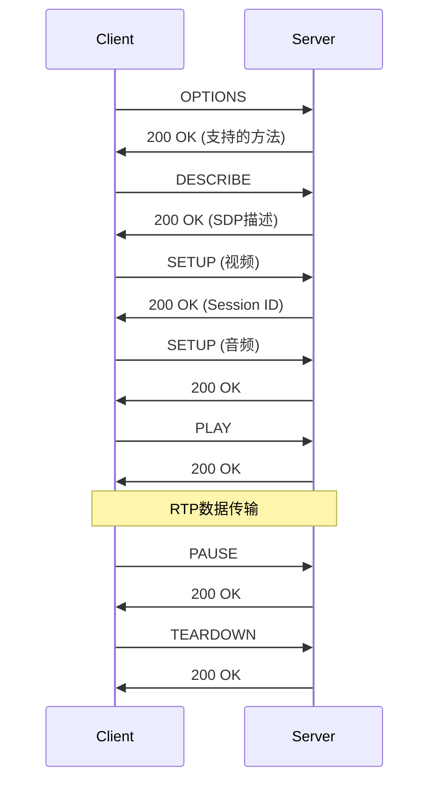

# 流媒体处理技术：RTSP/RTMP协议与实时传输

## 学习目标

完成本教程后，你将能够：

- [ ] 理解流媒体传输的基本原理和架构
- [ ] 掌握RTSP协议的工作流程和消息格式
- [ ] 掌握RTMP协议的握手和数据传输机制
- [ ] 实现基于RTSP的视频流推送和接收
- [ ] 实现缓冲管理和流量控制策略
- [ ] 处理网络抖动和丢包问题
- [ ] 实现实时播放和同步控制

## 前置要求

在开始本教程之前，你需要：

**知识要求**：
- 了解TCP/IP网络编程基础
- 掌握H.264/H.265视频编解码原理
- 熟悉音频处理基础知识
- 了解多线程编程概念

**技能要求**：
- 能够使用C/C++进行网络编程
- 会使用FFmpeg或类似多媒体库
- 了解Socket编程和网络协议
- 掌握基本的调试技巧

## 准备工作

### 硬件准备

| 名称 | 数量 | 说明 | 参考型号 |
|------|------|------|----------|
| 开发板 | 1 | 支持网络和视频的嵌入式平台 | Raspberry Pi 4 / RK3588 |
| 摄像头 | 1 | USB或CSI接口摄像头 | USB摄像头 / IMX219 |
| 网络设备 | 1 | 路由器或交换机 | 千兆网络 |
| 测试设备 | 1 | PC或手机用于播放测试 | - |

### 软件准备

- **开发环境**：Linux系统（Ubuntu 20.04+推荐）
- **编译工具**：GCC 7.0+ 或 Clang
- **多媒体库**：FFmpeg 4.0+、Live555或GStreamer
- **播放器**：VLC Media Player、ffplay
- **网络工具**：Wireshark（抓包分析）、iperf（带宽测试）

### 环境配置

1. 安装FFmpeg开发库
```bash
sudo apt-get update
sudo apt-get install ffmpeg libavcodec-dev libavformat-dev libavutil-dev
```

2. 安装Live555库（可选，用于RTSP服务器）
```bash
sudo apt-get install liblivemedia-dev
```

3. 安装GStreamer（可选）
```bash
sudo apt-get install gstreamer1.0-tools gstreamer1.0-plugins-base \
    gstreamer1.0-plugins-good gstreamer1.0-plugins-bad
```

## 流媒体基础知识

### 流媒体概述

流媒体（Streaming Media）是指在网络上以流式传输方式播放的音视频内容，用户无需等待整个文件下载完成即可开始播放。

**流媒体特点**：
- **实时性**：边传输边播放，延迟低
- **连续性**：数据流连续传输，不中断
- **交互性**：支持暂停、快进、快退等操作
- **适应性**：根据网络状况调整码率

**应用场景**：
- 视频监控系统
- 在线直播平台
- 视频会议系统
- IPTV电视服务
- 无人机图传
- 远程医疗

### 流媒体架构

典型的流媒体系统架构：

```
[视频源] → [编码器] → [流媒体服务器] → [网络] → [客户端] → [解码器] → [播放器]
   ↓          ↓            ↓                          ↓          ↓
 摄像头    H.264/H.265   RTSP/RTMP              缓冲管理    视频显示
```

**关键组件**：
1. **视频采集**：从摄像头获取原始视频数据
2. **编码压缩**：使用H.264/H.265编码压缩视频
3. **封装打包**：将编码数据封装为传输格式
4. **网络传输**：通过RTSP/RTMP协议传输
5. **接收缓冲**：客户端接收并缓冲数据
6. **解码播放**：解码并显示视频

### 流媒体协议对比

| 协议 | 传输层 | 延迟 | 复杂度 | 应用场景 |
|------|--------|------|--------|----------|
| RTSP | TCP/UDP | 低(1-3s) | 中等 | 监控、点播 |
| RTMP | TCP | 中(3-5s) | 较高 | 直播推流 |
| HLS | HTTP | 高(10-30s) | 低 | 移动直播 |
| WebRTC | UDP | 极低(<1s) | 高 | 实时通信 |

**选择建议**：
- **低延迟要求**：RTSP或WebRTC
- **大规模直播**：RTMP + HLS
- **监控系统**：RTSP
- **移动端**：HLS或RTMP

## RTSP协议详解

### RTSP协议简介

RTSP (Real Time Streaming Protocol) 是一种网络控制协议，用于控制流媒体服务器的播放。

**RTSP特点**：
- 基于文本的协议，类似HTTP
- 使用TCP进行控制，UDP传输数据（RTP/RTCP）
- 支持播放控制（播放、暂停、快进等）
- 低延迟，适合实时应用

**端口使用**：
- RTSP控制：TCP 554
- RTP数据：UDP 动态分配（通常偶数端口）
- RTCP控制：UDP 动态分配（RTP端口+1）

### RTSP消息格式

RTSP消息分为请求和响应两种：

**请求格式**：
```
METHOD rtsp://server:port/path RTSP/1.0
CSeq: 1
Header1: value1
Header2: value2

[消息体]
```

**响应格式**：
```
RTSP/1.0 200 OK
CSeq: 1
Header1: value1
Header2: value2

[消息体]
```

### RTSP方法

常用的RTSP方法：

| 方法 | 功能 | 说明 |
|------|------|------|
| OPTIONS | 查询支持的方法 | 获取服务器能力 |
| DESCRIBE | 获取媒体描述 | 返回SDP描述 |
| SETUP | 建立会话 | 协商传输参数 |
| PLAY | 开始播放 | 启动数据传输 |
| PAUSE | 暂停播放 | 暂停数据传输 |
| TEARDOWN | 结束会话 | 释放资源 |

### RTSP工作流程

典型的RTSP会话流程：



**流程说明**：
1. **OPTIONS**：客户端查询服务器支持的方法
2. **DESCRIBE**：获取媒体描述信息（SDP）
3. **SETUP**：为每个媒体流建立传输通道
4. **PLAY**：开始播放，服务器发送RTP数据
5. **PAUSE**：暂停播放（可选）
6. **TEARDOWN**：结束会话，释放资源

### SDP协议

SDP (Session Description Protocol) 用于描述多媒体会话信息。

**SDP示例**：
```
v=0
o=- 0 0 IN IP4 192.168.1.100
s=RTSP Session
c=IN IP4 0.0.0.0
t=0 0
a=control:*
m=video 0 RTP/AVP 96
a=rtpmap:96 H264/90000
a=fmtp:96 packetization-mode=1;profile-level-id=42001f
a=control:track1
m=audio 0 RTP/AVP 97
a=rtpmap:97 MPEG4-GENERIC/44100/2
a=control:track2
```

**字段说明**：
- `v=0`: SDP版本
- `o=`: 会话发起者信息
- `s=`: 会话名称
- `c=`: 连接信息
- `m=`: 媒体描述（video/audio）
- `a=rtpmap`: RTP负载类型映射
- `a=fmtp`: 格式参数
- `a=control`: 控制URL

## RTMP协议详解

### RTMP协议简介

RTMP (Real-Time Messaging Protocol) 是Adobe开发的流媒体传输协议，主要用于Flash播放器。

**RTMP特点**：
- 基于TCP传输，可靠性高
- 支持音视频和数据传输
- 低延迟（3-5秒）
- 广泛用于直播推流

**RTMP变种**：
- **RTMP**：基本协议，TCP 1935端口
- **RTMPS**：加密版本，使用SSL/TLS
- **RTMPE**：Adobe加密版本
- **RTMPT**：通过HTTP隧道传输

### RTMP消息结构

RTMP消息由消息头和消息体组成：

**消息头格式**：
```
+---------------+
| Basic Header  | 1-3字节
+---------------+
| Message Header| 0, 3, 7, 或11字节
+---------------+
| Extended Time | 0或4字节
+---------------+
| Chunk Data    | 可变长度
+---------------+
```

**消息类型**：
- Type 1: 设置块大小
- Type 3: 确认
- Type 4: 用户控制消息
- Type 5: 窗口确认大小
- Type 6: 设置对等带宽
- Type 8: 音频数据
- Type 9: 视频数据
- Type 18: 数据消息（AMF0）
- Type 20: 命令消息（AMF0）

### RTMP握手流程

RTMP连接建立需要三次握手：

```
Client                    Server
  |                          |
  |-------- C0+C1 --------->|
  |                          |
  |<------- S0+S1+S2 --------|
  |                          |
  |-------- C2 ------------->|
  |                          |
  |<==== 连接建立完成 ====>|
```

**握手步骤**：
1. 客户端发送C0和C1
2. 服务器发送S0、S1和S2
3. 客户端发送C2
4. 握手完成，开始传输数据

## 步骤1：搭建RTSP流媒体服务器

### 1.1 使用FFmpeg推流

FFmpeg可以作为简单的RTSP服务器使用。

**从文件推流**：
```bash
# 推送视频文件到RTSP服务器
ffmpeg -re -i input.mp4 -c copy -f rtsp rtsp://localhost:8554/stream
```

**从摄像头推流**：
```bash
# Linux系统（V4L2）
ffmpeg -f v4l2 -i /dev/video0 -c:v libx264 -preset ultrafast \
    -f rtsp rtsp://localhost:8554/live

# 树莓派摄像头
ffmpeg -f video4linux2 -i /dev/video0 -vcodec h264_omx \
    -b:v 2M -f rtsp rtsp://localhost:8554/live
```

### 1.2 使用Live555搭建RTSP服务器

Live555是一个开源的RTSP服务器库。

**安装Live555**：
```bash
# 下载源码
wget http://www.live555.com/liveMedia/public/live555-latest.tar.gz
tar -xzf live555-latest.tar.gz
cd live

# 编译
./genMakefiles linux
make

# 运行测试服务器
cd mediaServer
./live555MediaServer
```

**配置说明**：
- 默认端口：8554
- 媒体文件目录：当前目录
- 支持的格式：H.264、H.265、MPEG-4等

### 1.3 编写简单的RTSP服务器

使用C++和Live555库编写RTSP服务器：

```cpp
#include <liveMedia.hh>
#include <BasicUsageEnvironment.hh>
#include <GroupsockHelper.hh>

// 全局变量
UsageEnvironment* env;
RTSPServer* rtspServer;

int main(int argc, char** argv) {
    // 创建任务调度器
    TaskScheduler* scheduler = BasicTaskScheduler::createNew();
    env = BasicUsageEnvironment::createNew(*scheduler);
    
    // 创建RTSP服务器
    rtspServer = RTSPServer::createNew(*env, 8554);
    if (rtspServer == NULL) {
        *env << "Failed to create RTSP server: " 
             << env->getResultMsg() << "\n";
        exit(1);
    }
    
    // 添加会话
    char const* streamName = "testStream";
    char const* inputFileName = "test.264";
    
    ServerMediaSession* sms = ServerMediaSession::createNew(
        *env, streamName, streamName,
        "Session streamed by \"testRTSPServer\"");
    
    sms->addSubsession(
        H264VideoFileServerMediaSubsession::createNew(
            *env, inputFileName, reuseFirstSource));
    
    rtspServer->addServerMediaSession(sms);
    
    // 打印URL
    char* url = rtspServer->rtspURL(sms);
    *env << "Play this stream using the URL \"" << url << "\"\n";
    delete[] url;
    
    // 进入事件循环
    env->taskScheduler().doEventLoop();
    
    return 0;
}
```

**编译命令**：
```bash
g++ -o rtsp_server rtsp_server.cpp \
    -I/usr/include/liveMedia \
    -I/usr/include/groupsock \
    -I/usr/include/UsageEnvironment \
    -I/usr/include/BasicUsageEnvironment \
    -lliveMedia -lgroupsock -lUsageEnvironment -lBasicUsageEnvironment
```

## 步骤2：实现RTSP客户端

### 2.1 使用FFmpeg接收RTSP流

**播放RTSP流**：
```bash
# 使用ffplay播放
ffplay rtsp://192.168.1.100:8554/stream

# 使用VLC播放
vlc rtsp://192.168.1.100:8554/stream

# 保存到文件
ffmpeg -i rtsp://192.168.1.100:8554/stream -c copy output.mp4
```

### 2.2 编写RTSP客户端程序

使用FFmpeg库编写RTSP客户端：

```c
#include <libavformat/avformat.h>
#include <libavcodec/avcodec.h>
#include <libavutil/avutil.h>

int main(int argc, char *argv[]) {
    const char *url = "rtsp://192.168.1.100:8554/stream";
    AVFormatContext *format_ctx = NULL;
    AVCodecContext *codec_ctx = NULL;
    AVCodec *codec = NULL;
    AVPacket packet;
    AVFrame *frame = NULL;
    int video_stream_index = -1;
    int ret;
    
    // 初始化FFmpeg
    av_register_all();
    avformat_network_init();
    
    // 打开RTSP流
    AVDictionary *options = NULL;
    av_dict_set(&options, "rtsp_transport", "tcp", 0);
    av_dict_set(&options, "max_delay", "500000", 0);
    
    ret = avformat_open_input(&format_ctx, url, NULL, &options);
    if (ret < 0) {
        fprintf(stderr, "无法打开RTSP流: %s\n", av_err2str(ret));
        return -1;
    }
    
    // 获取流信息
    ret = avformat_find_stream_info(format_ctx, NULL);
    if (ret < 0) {
        fprintf(stderr, "无法获取流信息\n");
        return -1;
    }
    
    // 查找视频流
    for (int i = 0; i < format_ctx->nb_streams; i++) {
        if (format_ctx->streams[i]->codecpar->codec_type == AVMEDIA_TYPE_VIDEO) {
            video_stream_index = i;
            break;
        }
    }
    
    if (video_stream_index == -1) {
        fprintf(stderr, "未找到视频流\n");
        return -1;
    }
    
    // 获取解码器
    AVCodecParameters *codecpar = format_ctx->streams[video_stream_index]->codecpar;
    codec = avcodec_find_decoder(codecpar->codec_id);
    if (!codec) {
        fprintf(stderr, "未找到解码器\n");
        return -1;
    }
    
    // 创建解码器上下文
    codec_ctx = avcodec_alloc_context3(codec);
    avcodec_parameters_to_context(codec_ctx, codecpar);
    
    // 打开解码器
    ret = avcodec_open2(codec_ctx, codec, NULL);
    if (ret < 0) {
        fprintf(stderr, "无法打开解码器\n");
        return -1;
    }
    
    // 分配帧
    frame = av_frame_alloc();
    
    // 读取数据包
    printf("开始接收RTSP流...\n");
    while (av_read_frame(format_ctx, &packet) >= 0) {
        if (packet.stream_index == video_stream_index) {
            // 发送数据包到解码器
            ret = avcodec_send_packet(codec_ctx, &packet);
            if (ret < 0) {
                fprintf(stderr, "发送数据包失败\n");
                break;
            }
            
            // 接收解码后的帧
            while (ret >= 0) {
                ret = avcodec_receive_frame(codec_ctx, frame);
                if (ret == AVERROR(EAGAIN) || ret == AVERROR_EOF) {
                    break;
                } else if (ret < 0) {
                    fprintf(stderr, "解码错误\n");
                    goto cleanup;
                }
                
                // 处理解码后的帧
                printf("接收到帧: %dx%d, pts=%ld\n",
                       frame->width, frame->height, frame->pts);
                
                // 这里可以显示或保存帧
            }
        }
        
        av_packet_unref(&packet);
    }
    
cleanup:
    // 清理资源
    av_frame_free(&frame);
    avcodec_free_context(&codec_ctx);
    avformat_close_input(&format_ctx);
    avformat_network_deinit();
    
    return 0;
}
```

**编译命令**：
```bash
gcc -o rtsp_client rtsp_client.c \
    -lavformat -lavcodec -lavutil -lswscale \
    -lpthread -lm -lz
```

## 步骤3：实现RTMP推流

### 3.1 使用FFmpeg推送RTMP流

**推送到RTMP服务器**：
```bash
# 从文件推流
ffmpeg -re -i input.mp4 -c copy -f flv rtmp://server/live/stream

# 从摄像头推流
ffmpeg -f v4l2 -i /dev/video0 -c:v libx264 -preset veryfast \
    -b:v 2M -maxrate 2M -bufsize 4M \
    -f flv rtmp://server/live/stream

# 推送到常见平台
# YouTube
ffmpeg -re -i input.mp4 -c:v libx264 -preset veryfast \
    -b:v 3M -maxrate 3M -bufsize 6M -pix_fmt yuv420p \
    -g 50 -c:a aac -b:a 128k -ar 44100 \
    -f flv rtmp://a.rtmp.youtube.com/live2/[stream_key]

# Twitch
ffmpeg -re -i input.mp4 -c:v libx264 -preset veryfast \
    -b:v 3M -maxrate 3M -bufsize 6M \
    -c:a aac -b:a 128k \
    -f flv rtmp://live.twitch.tv/app/[stream_key]
```

### 3.2 编写RTMP推流程序

使用librtmp库实现RTMP推流：

```c
#include <librtmp/rtmp.h>
#include <libavformat/avformat.h>
#include <libavcodec/avcodec.h>

typedef struct {
    RTMP *rtmp;
    char *url;
    int is_connected;
} RTMPContext;

// 初始化RTMP连接
int rtmp_init(RTMPContext *ctx, const char *url) {
    ctx->url = strdup(url);
    ctx->rtmp = RTMP_Alloc();
    RTMP_Init(ctx->rtmp);
    
    // 设置URL
    if (!RTMP_SetupURL(ctx->rtmp, ctx->url)) {
        fprintf(stderr, "RTMP设置URL失败\n");
        return -1;
    }
    
    // 启用写入模式
    RTMP_EnableWrite(ctx->rtmp);
    
    // 连接服务器
    if (!RTMP_Connect(ctx->rtmp, NULL)) {
        fprintf(stderr, "RTMP连接失败\n");
        return -1;
    }
    
    // 连接流
    if (!RTMP_ConnectStream(ctx->rtmp, 0)) {
        fprintf(stderr, "RTMP连接流失败\n");
        return -1;
    }
    
    ctx->is_connected = 1;
    printf("RTMP连接成功: %s\n", url);
    return 0;
}

// 发送视频数据
int rtmp_send_video(RTMPContext *ctx, uint8_t *data, int size, 
                    uint32_t timestamp, int is_keyframe) {
    if (!ctx->is_connected) {
        return -1;
    }
    
    RTMPPacket packet;
    RTMPPacket_Alloc(&packet, size + 5);
    RTMPPacket_Reset(&packet);
    
    packet.m_packetType = RTMP_PACKET_TYPE_VIDEO;
    packet.m_nBodySize = size + 5;
    packet.m_nTimeStamp = timestamp;
    packet.m_nChannel = 0x04;
    packet.m_headerType = RTMP_PACKET_SIZE_LARGE;
    
    // 视频数据头
    packet.m_body[0] = is_keyframe ? 0x17 : 0x27;  // 0x17=关键帧, 0x27=非关键帧
    packet.m_body[1] = 0x01;  // AVC NALU
    packet.m_body[2] = 0x00;
    packet.m_body[3] = 0x00;
    packet.m_body[4] = 0x00;
    
    // 复制数据
    memcpy(&packet.m_body[5], data, size);
    
    // 发送数据包
    int ret = RTMP_SendPacket(ctx->rtmp, &packet, 0);
    RTMPPacket_Free(&packet);
    
    return ret ? 0 : -1;
}

// 发送音频数据
int rtmp_send_audio(RTMPContext *ctx, uint8_t *data, int size, 
                    uint32_t timestamp) {
    if (!ctx->is_connected) {
        return -1;
    }
    
    RTMPPacket packet;
    RTMPPacket_Alloc(&packet, size + 2);
    RTMPPacket_Reset(&packet);
    
    packet.m_packetType = RTMP_PACKET_TYPE_AUDIO;
    packet.m_nBodySize = size + 2;
    packet.m_nTimeStamp = timestamp;
    packet.m_nChannel = 0x05;
    packet.m_headerType = RTMP_PACKET_SIZE_LARGE;
    
    // 音频数据头
    packet.m_body[0] = 0xAF;  // AAC
    packet.m_body[1] = 0x01;  // AAC raw
    
    // 复制数据
    memcpy(&packet.m_body[2], data, size);
    
    // 发送数据包
    int ret = RTMP_SendPacket(ctx->rtmp, &packet, 0);
    RTMPPacket_Free(&packet);
    
    return ret ? 0 : -1;
}

// 关闭RTMP连接
void rtmp_close(RTMPContext *ctx) {
    if (ctx->rtmp) {
        RTMP_Close(ctx->rtmp);
        RTMP_Free(ctx->rtmp);
        ctx->rtmp = NULL;
    }
    if (ctx->url) {
        free(ctx->url);
        ctx->url = NULL;
    }
    ctx->is_connected = 0;
}

// 使用示例
int main() {
    RTMPContext ctx = {0};
    
    // 初始化RTMP连接
    if (rtmp_init(&ctx, "rtmp://server/live/stream") < 0) {
        return -1;
    }
    
    // 这里读取视频数据并发送
    // ...
    
    // 关闭连接
    rtmp_close(&ctx);
    
    return 0;
}
```

## 步骤4：缓冲管理与流量控制

### 4.1 缓冲区设计

流媒体播放需要合理的缓冲管理来平衡延迟和流畅性。

**缓冲区类型**：
- **接收缓冲区**：存储接收到的网络数据包
- **解码缓冲区**：存储待解码的数据
- **播放缓冲区**：存储解码后待播放的帧

**缓冲策略**：
```c
#include <pthread.h>
#include <stdint.h>

#define BUFFER_SIZE 100
#define MIN_BUFFER_LEVEL 10
#define MAX_BUFFER_LEVEL 80

typedef struct {
    uint8_t *data;
    int size;
    uint64_t timestamp;
} BufferFrame;

typedef struct {
    BufferFrame frames[BUFFER_SIZE];
    int read_pos;
    int write_pos;
    int count;
    pthread_mutex_t mutex;
    pthread_cond_t not_empty;
    pthread_cond_t not_full;
} CircularBuffer;

// 初始化缓冲区
void buffer_init(CircularBuffer *buf) {
    buf->read_pos = 0;
    buf->write_pos = 0;
    buf->count = 0;
    pthread_mutex_init(&buf->mutex, NULL);
    pthread_cond_init(&buf->not_empty, NULL);
    pthread_cond_init(&buf->not_full, NULL);
}

// 写入数据到缓冲区
int buffer_write(CircularBuffer *buf, uint8_t *data, int size, uint64_t ts) {
    pthread_mutex_lock(&buf->mutex);
    
    // 等待缓冲区有空间
    while (buf->count >= BUFFER_SIZE) {
        pthread_cond_wait(&buf->not_full, &buf->mutex);
    }
    
    // 写入数据
    BufferFrame *frame = &buf->frames[buf->write_pos];
    frame->data = malloc(size);
    memcpy(frame->data, data, size);
    frame->size = size;
    frame->timestamp = ts;
    
    buf->write_pos = (buf->write_pos + 1) % BUFFER_SIZE;
    buf->count++;
    
    // 通知读取线程
    pthread_cond_signal(&buf->not_empty);
    pthread_mutex_unlock(&buf->mutex);
    
    return 0;
}

// 从缓冲区读取数据
int buffer_read(CircularBuffer *buf, BufferFrame *frame) {
    pthread_mutex_lock(&buf->mutex);
    
    // 等待缓冲区有数据
    while (buf->count == 0) {
        pthread_cond_wait(&buf->not_empty, &buf->mutex);
    }
    
    // 读取数据
    BufferFrame *src = &buf->frames[buf->read_pos];
    frame->data = src->data;
    frame->size = src->size;
    frame->timestamp = src->timestamp;
    
    buf->read_pos = (buf->read_pos + 1) % BUFFER_SIZE;
    buf->count--;
    
    // 通知写入线程
    pthread_cond_signal(&buf->not_full);
    pthread_mutex_unlock(&buf->mutex);
    
    return 0;
}

// 获取缓冲区填充率
float buffer_get_level(CircularBuffer *buf) {
    pthread_mutex_lock(&buf->mutex);
    float level = (float)buf->count / BUFFER_SIZE * 100.0f;
    pthread_mutex_unlock(&buf->mutex);
    return level;
}

// 缓冲区控制策略
typedef enum {
    BUFFER_STATE_BUFFERING,   // 缓冲中
    BUFFER_STATE_PLAYING,     // 播放中
    BUFFER_STATE_PAUSED       // 暂停
} BufferState;

BufferState buffer_control(CircularBuffer *buf) {
    static BufferState state = BUFFER_STATE_BUFFERING;
    float level = buffer_get_level(buf);
    
    switch (state) {
        case BUFFER_STATE_BUFFERING:
            if (level >= MIN_BUFFER_LEVEL) {
                state = BUFFER_STATE_PLAYING;
                printf("缓冲完成，开始播放\n");
            }
            break;
            
        case BUFFER_STATE_PLAYING:
            if (level < 5) {
                state = BUFFER_STATE_BUFFERING;
                printf("缓冲不足，重新缓冲\n");
            } else if (level > MAX_BUFFER_LEVEL) {
                state = BUFFER_STATE_PAUSED;
                printf("缓冲过多，暂停接收\n");
            }
            break;
            
        case BUFFER_STATE_PAUSED:
            if (level < 50) {
                state = BUFFER_STATE_PLAYING;
                printf("恢复接收\n");
            }
            break;
    }
    
    return state;
}
```

### 4.2 流量控制

实现自适应码率控制：

```c
typedef struct {
    uint64_t bytes_received;
    uint64_t last_check_time;
    float current_bitrate;
    float target_bitrate;
} BitrateController;

// 初始化码率控制器
void bitrate_init(BitrateController *ctrl, float target_bitrate) {
    ctrl->bytes_received = 0;
    ctrl->last_check_time = get_current_time_ms();
    ctrl->current_bitrate = 0;
    ctrl->target_bitrate = target_bitrate;
}

// 更新接收统计
void bitrate_update(BitrateController *ctrl, int bytes) {
    ctrl->bytes_received += bytes;
    
    uint64_t now = get_current_time_ms();
    uint64_t elapsed = now - ctrl->last_check_time;
    
    // 每秒计算一次码率
    if (elapsed >= 1000) {
        ctrl->current_bitrate = (ctrl->bytes_received * 8.0f) / (elapsed / 1000.0f);
        ctrl->bytes_received = 0;
        ctrl->last_check_time = now;
        
        printf("当前码率: %.2f Mbps\n", ctrl->current_bitrate / 1000000.0f);
    }
}

// 判断是否需要调整码率
int bitrate_should_adjust(BitrateController *ctrl) {
    float ratio = ctrl->current_bitrate / ctrl->target_bitrate;
    
    if (ratio < 0.7f) {
        printf("网络带宽不足，建议降低码率\n");
        return -1;  // 降低码率
    } else if (ratio > 1.3f) {
        printf("网络带宽充足，可以提高码率\n");
        return 1;   // 提高码率
    }
    
    return 0;  // 保持当前码率
}
```

### 4.3 网络抖动处理

实现抖动缓冲（Jitter Buffer）：

```c
#define JITTER_BUFFER_SIZE 50

typedef struct {
    BufferFrame frames[JITTER_BUFFER_SIZE];
    int count;
    uint64_t base_timestamp;
    pthread_mutex_t mutex;
} JitterBuffer;

// 初始化抖动缓冲
void jitter_buffer_init(JitterBuffer *jb) {
    jb->count = 0;
    jb->base_timestamp = 0;
    pthread_mutex_init(&jb->mutex, NULL);
}

// 插入数据包（按时间戳排序）
int jitter_buffer_insert(JitterBuffer *jb, BufferFrame *frame) {
    pthread_mutex_lock(&jb->mutex);
    
    if (jb->count >= JITTER_BUFFER_SIZE) {
        pthread_mutex_unlock(&jb->mutex);
        return -1;  // 缓冲区满
    }
    
    // 设置基准时间戳
    if (jb->count == 0) {
        jb->base_timestamp = frame->timestamp;
    }
    
    // 查找插入位置
    int insert_pos = jb->count;
    for (int i = 0; i < jb->count; i++) {
        if (frame->timestamp < jb->frames[i].timestamp) {
            insert_pos = i;
            break;
        }
    }
    
    // 移动后续元素
    for (int i = jb->count; i > insert_pos; i--) {
        jb->frames[i] = jb->frames[i-1];
    }
    
    // 插入新帧
    jb->frames[insert_pos] = *frame;
    jb->count++;
    
    pthread_mutex_unlock(&jb->mutex);
    return 0;
}

// 获取下一个应该播放的帧
int jitter_buffer_get(JitterBuffer *jb, BufferFrame *frame, uint64_t play_time) {
    pthread_mutex_lock(&jb->mutex);
    
    if (jb->count == 0) {
        pthread_mutex_unlock(&jb->mutex);
        return -1;  // 缓冲区空
    }
    
    // 检查第一帧是否应该播放
    uint64_t frame_time = jb->frames[0].timestamp - jb->base_timestamp;
    if (play_time >= frame_time) {
        *frame = jb->frames[0];
        
        // 移除已播放的帧
        for (int i = 0; i < jb->count - 1; i++) {
            jb->frames[i] = jb->frames[i+1];
        }
        jb->count--;
        
        pthread_mutex_unlock(&jb->mutex);
        return 0;
    }
    
    pthread_mutex_unlock(&jb->mutex);
    return -1;  // 还未到播放时间
}
```

## 步骤5：实时播放实现

### 5.1 音视频同步

实现音视频同步播放：

```c
#include <sys/time.h>

typedef struct {
    uint64_t start_time;
    uint64_t audio_pts;
    uint64_t video_pts;
    double audio_clock;
    double video_clock;
} SyncController;

// 获取当前时间（毫秒）
uint64_t get_current_time_ms() {
    struct timeval tv;
    gettimeofday(&tv, NULL);
    return (uint64_t)tv.tv_sec * 1000 + tv.tv_usec / 1000;
}

// 初始化同步控制器
void sync_init(SyncController *sync) {
    sync->start_time = get_current_time_ms();
    sync->audio_pts = 0;
    sync->video_pts = 0;
    sync->audio_clock = 0;
    sync->video_clock = 0;
}

// 更新音频时钟
void sync_update_audio(SyncController *sync, uint64_t pts, int sample_rate, int samples) {
    sync->audio_pts = pts;
    sync->audio_clock = pts / 1000.0 + (double)samples / sample_rate;
}

// 更新视频时钟
void sync_update_video(SyncController *sync, uint64_t pts, double frame_rate) {
    sync->video_pts = pts;
    sync->video_clock = pts / 1000.0;
}

// 计算视频帧应该延迟的时间
double sync_compute_delay(SyncController *sync, double frame_duration) {
    double diff = sync->video_clock - sync->audio_clock;
    double delay = frame_duration;
    
    // 视频快于音频，增加延迟
    if (diff > 0.010) {  // 10ms阈值
        delay = frame_duration + diff;
    }
    // 视频慢于音频，减少延迟
    else if (diff < -0.010) {
        delay = frame_duration + diff;
        if (delay < 0) delay = 0;
    }
    
    return delay;
}

// 播放线程示例
void* playback_thread(void *arg) {
    SyncController sync;
    CircularBuffer *video_buffer = (CircularBuffer*)arg;
    BufferFrame frame;
    
    sync_init(&sync);
    double frame_duration = 1.0 / 30.0;  // 30fps
    
    while (1) {
        // 从缓冲区读取帧
        if (buffer_read(video_buffer, &frame) < 0) {
            usleep(10000);  // 10ms
            continue;
        }
        
        // 更新视频时钟
        sync_update_video(&sync, frame.timestamp, 30.0);
        
        // 计算延迟
        double delay = sync_compute_delay(&sync, frame_duration);
        
        // 延迟播放
        usleep((int)(delay * 1000000));
        
        // 显示帧
        display_frame(&frame);
        
        // 释放帧数据
        free(frame.data);
    }
    
    return NULL;
}
```

### 5.2 完整的播放器实现

整合所有组件的完整播放器：

```c
#include <pthread.h>
#include <libavformat/avformat.h>
#include <libavcodec/avcodec.h>

typedef struct {
    // 网络相关
    AVFormatContext *format_ctx;
    int video_stream_index;
    int audio_stream_index;
    
    // 解码相关
    AVCodecContext *video_codec_ctx;
    AVCodecContext *audio_codec_ctx;
    
    // 缓冲相关
    CircularBuffer video_buffer;
    CircularBuffer audio_buffer;
    JitterBuffer jitter_buffer;
    
    // 同步相关
    SyncController sync;
    
    // 控制相关
    int is_playing;
    int is_paused;
    pthread_t receive_thread;
    pthread_t video_thread;
    pthread_t audio_thread;
} StreamPlayer;

// 接收线程
void* receive_thread_func(void *arg) {
    StreamPlayer *player = (StreamPlayer*)arg;
    AVPacket packet;
    
    while (player->is_playing) {
        if (av_read_frame(player->format_ctx, &packet) < 0) {
            break;
        }
        
        if (packet.stream_index == player->video_stream_index) {
            // 解码视频
            avcodec_send_packet(player->video_codec_ctx, &packet);
            
            AVFrame *frame = av_frame_alloc();
            if (avcodec_receive_frame(player->video_codec_ctx, frame) == 0) {
                // 写入视频缓冲区
                buffer_write(&player->video_buffer, 
                           frame->data[0], 
                           frame->linesize[0] * frame->height,
                           frame->pts);
            }
            av_frame_free(&frame);
        }
        else if (packet.stream_index == player->audio_stream_index) {
            // 解码音频
            avcodec_send_packet(player->audio_codec_ctx, &packet);
            
            AVFrame *frame = av_frame_alloc();
            if (avcodec_receive_frame(player->audio_codec_ctx, frame) == 0) {
                // 写入音频缓冲区
                buffer_write(&player->audio_buffer,
                           frame->data[0],
                           frame->linesize[0],
                           frame->pts);
            }
            av_frame_free(&frame);
        }
        
        av_packet_unref(&packet);
    }
    
    return NULL;
}

// 初始化播放器
int player_init(StreamPlayer *player, const char *url) {
    // 初始化FFmpeg
    av_register_all();
    avformat_network_init();
    
    // 打开流
    AVDictionary *options = NULL;
    av_dict_set(&options, "rtsp_transport", "tcp", 0);
    av_dict_set(&options, "buffer_size", "1024000", 0);
    
    if (avformat_open_input(&player->format_ctx, url, NULL, &options) < 0) {
        return -1;
    }
    
    if (avformat_find_stream_info(player->format_ctx, NULL) < 0) {
        return -1;
    }
    
    // 查找视频和音频流
    player->video_stream_index = -1;
    player->audio_stream_index = -1;
    
    for (int i = 0; i < player->format_ctx->nb_streams; i++) {
        if (player->format_ctx->streams[i]->codecpar->codec_type == AVMEDIA_TYPE_VIDEO) {
            player->video_stream_index = i;
        }
        else if (player->format_ctx->streams[i]->codecpar->codec_type == AVMEDIA_TYPE_AUDIO) {
            player->audio_stream_index = i;
        }
    }
    
    // 初始化视频解码器
    if (player->video_stream_index >= 0) {
        AVCodecParameters *codecpar = 
            player->format_ctx->streams[player->video_stream_index]->codecpar;
        AVCodec *codec = avcodec_find_decoder(codecpar->codec_id);
        player->video_codec_ctx = avcodec_alloc_context3(codec);
        avcodec_parameters_to_context(player->video_codec_ctx, codecpar);
        avcodec_open2(player->video_codec_ctx, codec, NULL);
    }
    
    // 初始化音频解码器
    if (player->audio_stream_index >= 0) {
        AVCodecParameters *codecpar = 
            player->format_ctx->streams[player->audio_stream_index]->codecpar;
        AVCodec *codec = avcodec_find_decoder(codecpar->codec_id);
        player->audio_codec_ctx = avcodec_alloc_context3(codec);
        avcodec_parameters_to_context(player->audio_codec_ctx, codecpar);
        avcodec_open2(player->audio_codec_ctx, codec, NULL);
    }
    
    // 初始化缓冲区
    buffer_init(&player->video_buffer);
    buffer_init(&player->audio_buffer);
    jitter_buffer_init(&player->jitter_buffer);
    
    // 初始化同步控制器
    sync_init(&player->sync);
    
    return 0;
}

// 开始播放
int player_start(StreamPlayer *player) {
    player->is_playing = 1;
    player->is_paused = 0;
    
    // 创建接收线程
    pthread_create(&player->receive_thread, NULL, receive_thread_func, player);
    
    // 创建播放线程
    pthread_create(&player->video_thread, NULL, playback_thread, &player->video_buffer);
    
    return 0;
}

// 停止播放
void player_stop(StreamPlayer *player) {
    player->is_playing = 0;
    
    pthread_join(player->receive_thread, NULL);
    pthread_join(player->video_thread, NULL);
    
    avcodec_free_context(&player->video_codec_ctx);
    avcodec_free_context(&player->audio_codec_ctx);
    avformat_close_input(&player->format_ctx);
}

// 使用示例
int main() {
    StreamPlayer player = {0};
    
    if (player_init(&player, "rtsp://192.168.1.100:8554/stream") < 0) {
        fprintf(stderr, "初始化播放器失败\n");
        return -1;
    }
    
    player_start(&player);
    
    // 播放一段时间
    sleep(60);
    
    player_stop(&player);
    
    return 0;
}
```

## 测试验证

### 基本功能测试

- [ ] RTSP服务器正常启动
- [ ] 客户端能够连接并接收流
- [ ] 视频播放流畅无卡顿
- [ ] 音视频同步正常
- [ ] 缓冲管理工作正常

### 性能测试

**延迟测试**：
```bash
# 测量端到端延迟
# 在视频中显示时间戳，对比实际时间
```

**带宽测试**：
```bash
# 使用iperf测试网络带宽
iperf3 -s  # 服务器端
iperf3 -c server_ip -t 60  # 客户端
```

**丢包测试**：
```bash
# 使用tc命令模拟丢包
sudo tc qdisc add dev eth0 root netem loss 5%  # 5%丢包率
sudo tc qdisc del dev eth0 root  # 删除规则
```

### 网络质量测试

测试不同网络条件下的表现：

| 条件 | 带宽 | 延迟 | 丢包率 | 预期结果 |
|------|------|------|--------|----------|
| 理想 | 10Mbps | 10ms | 0% | 流畅播放 |
| 良好 | 5Mbps | 50ms | 1% | 基本流畅 |
| 一般 | 2Mbps | 100ms | 3% | 偶尔卡顿 |
| 较差 | 1Mbps | 200ms | 5% | 频繁卡顿 |

## 故障排除

### 问题1：无法连接RTSP服务器

**可能原因**：
- 服务器未启动
- 防火墙阻止连接
- URL格式错误
- 网络不通

**解决方法**：
1. 检查服务器是否运行
```bash
netstat -an | grep 554
```

2. 检查防火墙规则
```bash
sudo ufw allow 554/tcp
sudo ufw allow 5000:6000/udp
```

3. 验证URL格式
```
rtsp://[用户名:密码@]服务器地址:端口/路径
```

4. 测试网络连通性
```bash
ping server_ip
telnet server_ip 554
```

### 问题2：视频卡顿或花屏

**可能原因**：
- 网络带宽不足
- 缓冲区设置不当
- 解码性能不足
- 丢包严重

**解决方法**：
1. 降低视频码率
```bash
ffmpeg -i input.mp4 -b:v 1M -c:v libx264 output.mp4
```

2. 增加缓冲区大小
```c
av_dict_set(&options, "buffer_size", "2048000", 0);
```

3. 使用硬件解码
```c
codec = avcodec_find_decoder_by_name("h264_cuvid");  // NVIDIA
codec = avcodec_find_decoder_by_name("h264_qsv");    // Intel
```

4. 检查网络质量
```bash
# 使用mtr检查网络路径
mtr server_ip
```

### 问题3：音视频不同步

**可能原因**：
- 时间戳不准确
- 缓冲策略不当
- 播放速度不匹配
- 系统时钟漂移

**解决方法**：
1. 检查时间戳
```c
printf("Video PTS: %ld, Audio PTS: %ld\n", video_pts, audio_pts);
```

2. 调整同步阈值
```c
#define SYNC_THRESHOLD 0.040  // 40ms
```

3. 使用音频作为主时钟
```c
sync->master_clock = sync->audio_clock;
```

4. 定期校准时钟
```c
if (abs(video_clock - audio_clock) > 1.0) {
    video_clock = audio_clock;  // 重新同步
}
```

### 问题4：RTMP推流失败

**可能原因**：
- 服务器拒绝连接
- 认证失败
- 流密钥错误
- 编码格式不支持

**解决方法**：
1. 检查服务器日志
2. 验证流密钥
3. 确认编码格式
```bash
ffmpeg -i input.mp4 -c:v libx264 -c:a aac -f flv rtmp://server/live/stream
```

4. 测试连接
```bash
ffmpeg -re -f lavfi -i testsrc -t 10 -f flv rtmp://server/live/test
```

## 性能优化

### 优化1：使用零拷贝技术

减少内存拷贝次数：

```c
// 使用引用计数而不是拷贝数据
AVFrame *frame = av_frame_alloc();
av_frame_ref(dst_frame, src_frame);  // 引用而不是拷贝
av_frame_unref(dst_frame);  // 释放引用
```

### 优化2：多线程解码

利用多核CPU加速解码：

```c
// 设置解码线程数
codec_ctx->thread_count = 4;
codec_ctx->thread_type = FF_THREAD_FRAME;
```

### 优化3：硬件加速

使用GPU加速编解码：

```c
// NVIDIA NVDEC
AVCodec *codec = avcodec_find_decoder_by_name("h264_cuvid");

// Intel Quick Sync
AVCodec *codec = avcodec_find_decoder_by_name("h264_qsv");

// VAAPI (Linux)
AVCodec *codec = avcodec_find_decoder_by_name("h264_vaapi");
```

### 优化4：网络优化

优化网络传输性能：

```c
// 设置TCP缓冲区大小
int buffer_size = 1024 * 1024;  // 1MB
setsockopt(sockfd, SOL_SOCKET, SO_RCVBUF, &buffer_size, sizeof(buffer_size));
setsockopt(sockfd, SOL_SOCKET, SO_SNDBUF, &buffer_size, sizeof(buffer_size));

// 禁用Nagle算法
int flag = 1;
setsockopt(sockfd, IPPROTO_TCP, TCP_NODELAY, &flag, sizeof(flag));

// 设置超时
struct timeval timeout;
timeout.tv_sec = 5;
timeout.tv_usec = 0;
setsockopt(sockfd, SOL_SOCKET, SO_RCVTIMEO, &timeout, sizeof(timeout));
```

## 总结

通过本教程，你学习了：

- ✅ 流媒体传输的基本原理和系统架构
- ✅ RTSP协议的工作流程和消息格式
- ✅ RTMP协议的握手机制和数据传输
- ✅ 使用FFmpeg和Live555实现流媒体服务器
- ✅ 实现RTSP/RTMP客户端接收和播放
- ✅ 缓冲管理和流量控制策略
- ✅ 音视频同步和实时播放技术
- ✅ 网络抖动和丢包的处理方法

**关键要点**：
1. 流媒体系统需要平衡延迟、流畅性和质量
2. RTSP适合低延迟应用，RTMP适合直播推流
3. 合理的缓冲管理是流畅播放的关键
4. 音视频同步需要精确的时钟控制
5. 网络质量直接影响播放体验

## 进阶挑战

尝试以下挑战来巩固学习：

1. **挑战1：自适应码率**
   - 实现根据网络状况自动调整码率
   - 支持多码率流切换
   - 平滑过渡不影响播放

2. **挑战2：P2P流媒体**
   - 实现P2P视频传输
   - 支持多节点分发
   - 降低服务器带宽压力

3. **挑战3：低延迟优化**
   - 优化到500ms以下延迟
   - 实现WebRTC集成
   - 支持实时互动

4. **挑战4：多路流处理**
   - 同时处理多路视频流
   - 实现画面合成
   - 支持录像和回放

## 扩展知识

### 流媒体协议对比

| 特性 | RTSP | RTMP | HLS | WebRTC |
|------|------|------|-----|--------|
| 延迟 | 1-3s | 3-5s | 10-30s | <1s |
| 传输层 | TCP/UDP | TCP | HTTP | UDP |
| 移动端支持 | 一般 | 好 | 优秀 | 优秀 |
| 穿透NAT | 困难 | 容易 | 容易 | 容易 |
| 服务器复杂度 | 中 | 高 | 低 | 高 |

### 常见编码参数

**H.264编码参数**：
```bash
# 低延迟配置
-tune zerolatency -preset ultrafast -profile:v baseline

# 高质量配置
-preset slow -profile:v high -level 4.1

# 直播配置
-preset veryfast -tune zerolatency -g 60 -sc_threshold 0
```

**音频编码参数**：
```bash
# AAC编码
-c:a aac -b:a 128k -ar 44100

# Opus编码（低延迟）
-c:a libopus -b:a 96k -ar 48000
```

## 下一步学习

建议继续学习以下内容：

1. **音视频同步技术**
   - [音视频同步详解](./03-av-sync.html)
   - 时间戳处理
   - 同步算法

2. **硬件加速**
   - [硬件加速与优化](../advanced/01-hardware-acceleration.html)
   - GPU编解码
   - 性能优化

3. **网络编程**
   - TCP/IP网络编程
   - Socket编程
   - 网络协议

## 参考资料

### 官方文档

1. **RTSP规范**
   - [RFC 2326 - RTSP](https://tools.ietf.org/html/rfc2326)
   - [RFC 7826 - RTSP 2.0](https://tools.ietf.org/html/rfc7826)

2. **RTMP规范**
   - [RTMP Specification](https://www.adobe.com/devnet/rtmp.html)
   - Adobe官方文档

3. **RTP/RTCP**
   - [RFC 3550 - RTP](https://tools.ietf.org/html/rfc3550)
   - [RFC 3551 - RTP Profile](https://tools.ietf.org/html/rfc3551)

### 开源项目

1. **FFmpeg**
   - [https://ffmpeg.org/](https://ffmpeg.org/)
   - 最全面的多媒体框架

2. **Live555**
   - [http://www.live555.com/](http://www.live555.com/)
   - RTSP服务器和客户端库

3. **GStreamer**
   - [https://gstreamer.freedesktop.org/](https://gstreamer.freedesktop.org/)
   - 流媒体框架

4. **librtmp**
   - [https://rtmpdump.mplayerhq.hu/](https://rtmpdump.mplayerhq.hu/)
   - RTMP客户端库

### 技术文章

1. **流媒体技术**
   - "Streaming Media Protocols" - Wowza Media Systems
   - "Low Latency Streaming" - AWS Elemental

2. **网络优化**
   - "TCP Tuning for HTTP" - IETF
   - "Bufferbloat and Network Performance" - Bufferbloat.net

### 工具软件

1. **播放器**
   - VLC Media Player
   - ffplay
   - mpv

2. **分析工具**
   - Wireshark（网络抓包）
   - MediaInfo（媒体信息）
   - StreamEye（流分析）

3. **测试工具**
   - iperf（带宽测试）
   - mtr（网络路径）
   - tc（流量控制）

---

**反馈与支持**：

如果你在学习过程中遇到问题或有任何建议，欢迎：
- 在评论区留言讨论
- 提交Issue到项目仓库
- 加入技术交流群

**版权声明**：本教程采用 [CC BY-SA 4.0](https://creativecommons.org/licenses/by-sa/4.0/) 许可协议。
