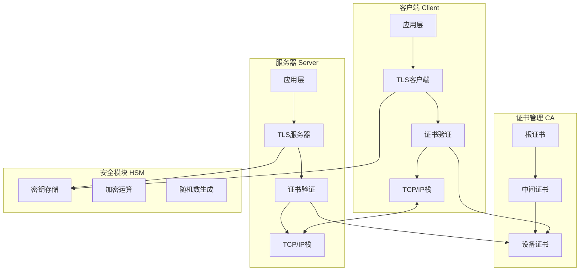
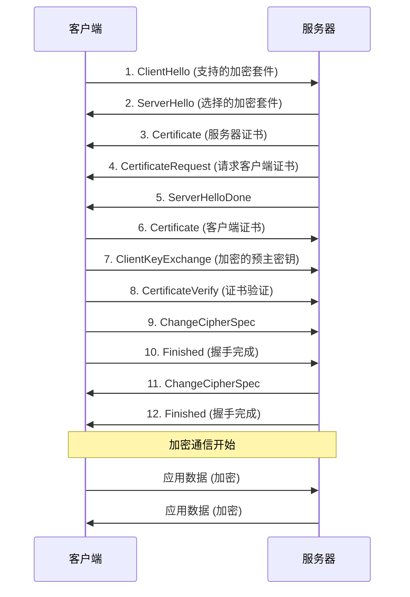

# 安全通信系统设计：构建企业级TLS/SSL加密通信


## 项目概述

本项目将指导你构建一个功能完整的安全通信系统，实现基于TLS/SSL协议的加密通信、双向身份认证、证书管理和安全策略控制。项目采用mbedTLS库，支持多种加密算法和认证方式，适用于IoT设备、工业控制、金融支付等高安全要求场景。

### 项目特点

- ✅ **完整的TLS/SSL实现**：支持TLS 1.2/1.3协议，实现握手、加密传输和会话管理
- ✅ **双向身份认证**：客户端和服务器相互验证，防止中间人攻击
- ✅ **证书管理系统**：支持证书生成、签名、验证和撤销
- ✅ **多种加密套件**：支持AES、RSA、ECDSA等多种加密算法
- ✅ **安全密钥管理**：集成硬件安全模块，保护私钥安全
- ✅ **会话恢复机制**：支持会话缓存和票据机制，提高连接效率
- ✅ **安全审计日志**：记录所有安全事件，便于追踪和分析

### 学习目标

完成本项目后，你将能够：

- [ ] 深入理解TLS/SSL协议的工作原理和握手流程
- [ ] 掌握X.509证书的结构和证书链验证机制
- [ ] 实现完整的加密通信系统，包括客户端和服务器
- [ ] 配置和管理证书颁发机构(CA)
- [ ] 实现双向身份认证和访问控制
- [ ] 集成硬件安全模块保护密钥
- [ ] 处理各种安全威胁和攻击场景
- [ ] 优化安全通信的性能和资源使用

### 适用人群

- 有加密算法基础，希望深入学习安全通信的开发者
- 需要为IoT设备实现安全通信的工程师
- 从事工业控制、金融支付等高安全领域的开发者
- 准备从事网络安全和信息安全的学习者

### 应用场景

- **IoT设备通信**：智能家居、工业传感器的安全数据传输
- **远程控制系统**：工业设备、医疗设备的远程安全控制
- **金融支付终端**：POS机、ATM的安全交易通信
- **车联网通信**：车载系统与云端的安全数据交换
- **智能电网**：电力设备的安全监控和控制


## 技术栈

### 硬件清单

| 名称 | 规格 | 数量 | 说明 | 参考价格 |
|------|------|------|------|----------|
| 开发板 | STM32F429/ESP32 | 2 | 一个作为客户端，一个作为服务器 | ¥160-300 |
| 安全芯片 | ATECC608A | 1 | 硬件安全模块，存储私钥 | ¥15-25 |
| 以太网模块 | W5500/ENC28J60 | 2 | 网络通信（如主控无以太网） | ¥30-60 |
| SD卡模块 | MicroSD | 1 | 存储证书和日志 | ¥5-10 |
| 调试器 | ST-Link V2 | 1 | 程序下载和调试 | ¥20-40 |
| 电源模块 | 5V/2A | 2 | 系统供电 | ¥20-40 |

**总预算**：约 ¥250-475

### 软件要求

**开发环境**：
- STM32CubeIDE 1.12+ / ESP-IDF 5.0+
- OpenSSL 3.0+ (用于证书生成)
- Python 3.8+ (用于测试脚本)
- Git版本控制

**第三方库**：
- mbedTLS 3.3+：TLS/SSL协议栈
- FreeRTOS：实时操作系统
- lwIP：轻量级TCP/IP协议栈
- FatFs：文件系统(用于证书存储)

**调试工具**：
- Wireshark：网络抓包分析
- OpenSSL命令行工具：证书管理
- MQTT Explorer：测试MQTT over TLS
- Postman：测试HTTPS API


## 系统架构

### 整体架构设计



### 软件架构

采用分层架构设计：

```
secure_communication/
├── App/
│   ├── client/                # 客户端应用
│   │   ├── tls_client.c/h
│   │   ├── client_app.c/h
│   │   └── client_config.h
│   ├── server/                # 服务器应用
│   │   ├── tls_server.c/h
│   │   ├── server_app.c/h
│   │   └── server_config.h
│   ├── common/                # 公共模块
│   │   ├── cert_manager.c/h   # 证书管理
│   │   ├── key_manager.c/h    # 密钥管理
│   │   ├── session_manager.c/h # 会话管理
│   │   └── security_log.c/h   # 安全日志
│   └── test/                  # 测试程序
│       ├── test_tls.c
│       └── test_cert.c
├── Drivers/
│   ├── atecc608/              # 安全芯片驱动
│   ├── ethernet/              # 以太网驱动
│   └── sdcard/                # SD卡驱动
├── Middlewares/
│   ├── mbedTLS/               # TLS协议栈
│   ├── FreeRTOS/              # 操作系统
│   ├── lwIP/                  # TCP/IP协议栈
│   └── FatFs/                 # 文件系统
├── Certificates/              # 证书文件
│   ├── ca/                    # CA证书
│   ├── server/                # 服务器证书
│   └── client/                # 客户端证书
├── Scripts/                   # 辅助脚本
│   ├── generate_certs.sh      # 证书生成脚本
│   ├── test_connection.py     # 连接测试脚本
│   └── analyze_traffic.py     # 流量分析脚本
└── main.c
```

### TLS握手流程




## 阶段1：证书体系搭建

### 1.1 理解证书体系

**证书链结构**：

```
根证书 (Root CA)
    ↓ 签名
中间证书 (Intermediate CA)
    ↓ 签名
设备证书 (Device Certificate)
```

**证书内容**：
- 版本号
- 序列号
- 签名算法
- 颁发者信息
- 有效期
- 主体信息
- 公钥
- 扩展字段
- 数字签名

### 1.2 生成证书体系

创建证书生成脚本 `Scripts/generate_certs.sh`：

```bash
#!/bin/bash

# 证书生成脚本
# 用于生成完整的证书链：根证书 -> 中间证书 -> 设备证书

set -e

# 创建目录结构
mkdir -p Certificates/{ca,server,client}
cd Certificates

echo "=== 生成证书体系 ==="

# 1. 生成根CA私钥和证书
echo "1. 生成根CA证书..."
openssl genrsa -out ca/ca-key.pem 4096

openssl req -new -x509 -days 3650 -key ca/ca-key.pem \
    -out ca/ca-cert.pem \
    -subj "/C=CN/ST=Beijing/L=Beijing/O=MyCompany/OU=Security/CN=Root CA"

echo "✓ 根CA证书生成完成"

# 2. 生成中间CA私钥和证书签名请求
echo "2. 生成中间CA证书..."
openssl genrsa -out ca/intermediate-key.pem 4096

openssl req -new -key ca/intermediate-key.pem \
    -out ca/intermediate-csr.pem \
    -subj "/C=CN/ST=Beijing/L=Beijing/O=MyCompany/OU=Security/CN=Intermediate CA"

# 使用根CA签名中间CA证书
openssl x509 -req -days 1825 -in ca/intermediate-csr.pem \
    -CA ca/ca-cert.pem -CAkey ca/ca-key.pem -CAcreateserial \
    -out ca/intermediate-cert.pem \
    -extensions v3_ca

echo "✓ 中间CA证书生成完成"

# 3. 生成服务器私钥和证书
echo "3. 生成服务器证书..."
openssl genrsa -out server/server-key.pem 2048

openssl req -new -key server/server-key.pem \
    -out server/server-csr.pem \
    -subj "/C=CN/ST=Beijing/L=Beijing/O=MyCompany/OU=IoT/CN=iot-server.local"

# 创建服务器证书扩展配置
cat > server/server-ext.cnf << EOF
subjectAltName = DNS:iot-server.local,DNS:localhost,IP:192.168.1.100
extendedKeyUsage = serverAuth
EOF

# 使用中间CA签名服务器证书
openssl x509 -req -days 365 -in server/server-csr.pem \
    -CA ca/intermediate-cert.pem -CAkey ca/intermediate-key.pem -CAcreateserial \
    -out server/server-cert.pem \
    -extfile server/server-ext.cnf

echo "✓ 服务器证书生成完成"

# 4. 生成客户端私钥和证书
echo "4. 生成客户端证书..."
openssl genrsa -out client/client-key.pem 2048

openssl req -new -key client/client-key.pem \
    -out client/client-csr.pem \
    -subj "/C=CN/ST=Beijing/L=Beijing/O=MyCompany/OU=IoT/CN=device-001"

# 创建客户端证书扩展配置
cat > client/client-ext.cnf << EOF
extendedKeyUsage = clientAuth
EOF

# 使用中间CA签名客户端证书
openssl x509 -req -days 365 -in client/client-csr.pem \
    -CA ca/intermediate-cert.pem -CAkey ca/intermediate-key.pem -CAcreateserial \
    -out client/client-cert.pem \
    -extfile client/client-ext.cnf

echo "✓ 客户端证书生成完成"

# 5. 创建证书链文件
echo "5. 创建证书链..."
cat ca/intermediate-cert.pem ca/ca-cert.pem > ca/ca-chain.pem
cat server/server-cert.pem ca/intermediate-cert.pem > server/server-chain.pem
cat client/client-cert.pem ca/intermediate-cert.pem > client/client-chain.pem

echo "✓ 证书链创建完成"

# 6. 验证证书
echo "6. 验证证书..."
openssl verify -CAfile ca/ca-chain.pem server/server-cert.pem
openssl verify -CAfile ca/ca-chain.pem client/client-cert.pem

echo ""
echo "=== 证书生成完成 ==="
echo "根CA证书: ca/ca-cert.pem"
echo "服务器证书: server/server-cert.pem"
echo "服务器私钥: server/server-key.pem"
echo "客户端证书: client/client-cert.pem"
echo "客户端私钥: client/client-key.pem"
echo "证书链: ca/ca-chain.pem"
```

### 1.3 证书格式转换

将PEM格式证书转换为C数组：

```bash
#!/bin/bash

# 证书转换脚本
# 将PEM格式证书转换为C语言数组

convert_to_c_array() {
    local input_file=$1
    local output_file=$2
    local array_name=$3
    
    echo "// Auto-generated from $input_file" > $output_file
    echo "const unsigned char ${array_name}[] = {" >> $output_file
    
    xxd -i < $input_file | sed 's/^/    /' >> $output_file
    
    echo "};" >> $output_file
    echo "const size_t ${array_name}_len = sizeof(${array_name});" >> $output_file
}

# 转换证书
convert_to_c_array "ca/ca-chain.pem" "ca/ca_chain.h" "ca_chain_pem"
convert_to_c_array "server/server-cert.pem" "server/server_cert.h" "server_cert_pem"
convert_to_c_array "server/server-key.pem" "server/server_key.h" "server_key_pem"
convert_to_c_array "client/client-cert.pem" "client/client_cert.h" "client_cert_pem"
convert_to_c_array "client/client-key.pem" "client/client_key.h" "client_key_pem"

echo "证书转换完成"
```


## 阶段2：TLS服务器实现

### 2.1 服务器初始化

创建 `App/server/tls_server.h` 文件：

```c
#ifndef TLS_SERVER_H
#define TLS_SERVER_H

#include "mbedtls/net_sockets.h"
#include "mbedtls/ssl.h"
#include "mbedtls/entropy.h"
#include "mbedtls/ctr_drbg.h"
#include "mbedtls/x509.h"
#include "mbedtls/error.h"

/* 服务器配置 */
#define SERVER_PORT         "4433"
#define SERVER_NAME         "iot-server.local"
#define MAX_CLIENTS         5

/* TLS服务器上下文 */
typedef struct {
    mbedtls_net_context listen_fd;
    mbedtls_entropy_context entropy;
    mbedtls_ctr_drbg_context ctr_drbg;
    mbedtls_ssl_config conf;
    mbedtls_x509_crt srvcert;
    mbedtls_x509_crt cachain;
    mbedtls_pk_context pkey;
    mbedtls_ssl_cache_context cache;
    bool initialized;
} TLSServer_t;

/* 客户端会话 */
typedef struct {
    mbedtls_net_context client_fd;
    mbedtls_ssl_context ssl;
    bool active;
    uint32_t session_id;
    char client_ip[16];
    uint16_t client_port;
} ClientSession_t;

/* 函数声明 */
int TLSServer_Init(TLSServer_t *server);
int TLSServer_Start(TLSServer_t *server);
int TLSServer_AcceptClient(TLSServer_t *server, ClientSession_t *session);
int TLSServer_HandleClient(ClientSession_t *session);
void TLSServer_CloseClient(ClientSession_t *session);
void TLSServer_Shutdown(TLSServer_t *server);

#endif
```

创建 `App/server/tls_server.c` 文件：

```c
#include "tls_server.h"
#include "server_cert.h"
#include "server_key.h"
#include "ca_chain.h"
#include <string.h>
#include <stdio.h>

/* 调试回调函数 */
static void debug_callback(void *ctx, int level, const char *file, int line, const char *str)
{
    printf("[TLS] %s:%04d: %s", file, line, str);
}

/**
 * @brief  初始化TLS服务器
 * @param  server: 服务器上下文
 * @retval 0=成功, 负数=错误码
 */
int TLSServer_Init(TLSServer_t *server)
{
    int ret;
    const char *pers = "tls_server";
    
    printf("=== 初始化TLS服务器 ===\n");
    
    /* 初始化结构体 */
    mbedtls_net_init(&server->listen_fd);
    mbedtls_ssl_config_init(&server->conf);
    mbedtls_x509_crt_init(&server->srvcert);
    mbedtls_x509_crt_init(&server->cachain);
    mbedtls_pk_init(&server->pkey);
    mbedtls_entropy_init(&server->entropy);
    mbedtls_ctr_drbg_init(&server->ctr_drbg);
    mbedtls_ssl_cache_init(&server->cache);
    
    /* 1. 初始化随机数生成器 */
    printf("1. 初始化随机数生成器...\n");
    ret = mbedtls_ctr_drbg_seed(&server->ctr_drbg, mbedtls_entropy_func, &server->entropy,
                                (const unsigned char *)pers, strlen(pers));
    if (ret != 0) {
        printf("错误: mbedtls_ctr_drbg_seed 返回 -0x%04x\n", -ret);
        return ret;
    }
    
    /* 2. 加载服务器证书 */
    printf("2. 加载服务器证书...\n");
    ret = mbedtls_x509_crt_parse(&server->srvcert, server_cert_pem, server_cert_pem_len);
    if (ret != 0) {
        printf("错误: mbedtls_x509_crt_parse 返回 -0x%04x\n", -ret);
        return ret;
    }
    
    /* 3. 加载CA证书链 */
    printf("3. 加载CA证书链...\n");
    ret = mbedtls_x509_crt_parse(&server->cachain, ca_chain_pem, ca_chain_pem_len);
    if (ret != 0) {
        printf("错误: mbedtls_x509_crt_parse 返回 -0x%04x\n", -ret);
        return ret;
    }
    
    /* 4. 加载服务器私钥 */
    printf("4. 加载服务器私钥...\n");
    ret = mbedtls_pk_parse_key(&server->pkey, server_key_pem, server_key_pem_len, NULL, 0);
    if (ret != 0) {
        printf("错误: mbedtls_pk_parse_key 返回 -0x%04x\n", -ret);
        return ret;
    }
    
    /* 5. 配置SSL/TLS参数 */
    printf("5. 配置SSL/TLS参数...\n");
    ret = mbedtls_ssl_config_defaults(&server->conf,
                                     MBEDTLS_SSL_IS_SERVER,
                                     MBEDTLS_SSL_TRANSPORT_STREAM,
                                     MBEDTLS_SSL_PRESET_DEFAULT);
    if (ret != 0) {
        printf("错误: mbedtls_ssl_config_defaults 返回 -0x%04x\n", -ret);
        return ret;
    }
    
    /* 设置随机数生成器 */
    mbedtls_ssl_conf_rng(&server->conf, mbedtls_ctr_drbg_random, &server->ctr_drbg);
    
    /* 设置调试回调 */
    mbedtls_ssl_conf_dbg(&server->conf, debug_callback, NULL);
    
    /* 设置证书和私钥 */
    ret = mbedtls_ssl_conf_own_cert(&server->conf, &server->srvcert, &server->pkey);
    if (ret != 0) {
        printf("错误: mbedtls_ssl_conf_own_cert 返回 -0x%04x\n", -ret);
        return ret;
    }
    
    /* 设置CA证书链（用于验证客户端证书） */
    mbedtls_ssl_conf_ca_chain(&server->conf, &server->cachain, NULL);
    
    /* 要求客户端证书 */
    mbedtls_ssl_conf_authmode(&server->conf, MBEDTLS_SSL_VERIFY_REQUIRED);
    
    /* 设置会话缓存 */
    mbedtls_ssl_conf_session_cache(&server->conf, &server->cache,
                                   mbedtls_ssl_cache_get,
                                   mbedtls_ssl_cache_set);
    
    /* 设置支持的加密套件 */
    static const int ciphersuites[] = {
        MBEDTLS_TLS_ECDHE_RSA_WITH_AES_256_GCM_SHA384,
        MBEDTLS_TLS_ECDHE_RSA_WITH_AES_128_GCM_SHA256,
        MBEDTLS_TLS_RSA_WITH_AES_256_CBC_SHA256,
        MBEDTLS_TLS_RSA_WITH_AES_128_CBC_SHA256,
        0
    };
    mbedtls_ssl_conf_ciphersuites(&server->conf, ciphersuites);
    
    server->initialized = true;
    printf("✓ TLS服务器初始化完成\n\n");
    
    return 0;
}

/**
 * @brief  启动TLS服务器
 * @param  server: 服务器上下文
 * @retval 0=成功, 负数=错误码
 */
int TLSServer_Start(TLSServer_t *server)
{
    int ret;
    
    if (!server->initialized) {
        printf("错误: 服务器未初始化\n");
        return -1;
    }
    
    printf("=== 启动TLS服务器 ===\n");
    printf("监听端口: %s\n", SERVER_PORT);
    
    /* 绑定端口并监听 */
    ret = mbedtls_net_bind(&server->listen_fd, NULL, SERVER_PORT, MBEDTLS_NET_PROTO_TCP);
    if (ret != 0) {
        printf("错误: mbedtls_net_bind 返回 -0x%04x\n", -ret);
        return ret;
    }
    
    printf("✓ 服务器启动成功，等待客户端连接...\n\n");
    
    return 0;
}

/**
 * @brief  接受客户端连接
 * @param  server: 服务器上下文
 * @param  session: 客户端会话
 * @retval 0=成功, 负数=错误码
 */
int TLSServer_AcceptClient(TLSServer_t *server, ClientSession_t *session)
{
    int ret;
    
    /* 初始化客户端会话 */
    mbedtls_net_init(&session->client_fd);
    mbedtls_ssl_init(&session->ssl);
    
    /* 等待客户端连接 */
    printf("等待客户端连接...\n");
    ret = mbedtls_net_accept(&server->listen_fd, &session->client_fd,
                            session->client_ip, sizeof(session->client_ip),
                            &session->client_port);
    if (ret != 0) {
        printf("错误: mbedtls_net_accept 返回 -0x%04x\n", -ret);
        return ret;
    }
    
    printf("✓ 客户端已连接: %s:%d\n", session->client_ip, session->client_port);
    
    /* 设置SSL上下文 */
    ret = mbedtls_ssl_setup(&session->ssl, &server->conf);
    if (ret != 0) {
        printf("错误: mbedtls_ssl_setup 返回 -0x%04x\n", -ret);
        return ret;
    }
    
    /* 设置网络IO回调 */
    mbedtls_ssl_set_bio(&session->ssl, &session->client_fd,
                       mbedtls_net_send, mbedtls_net_recv, NULL);
    
    /* 执行TLS握手 */
    printf("执行TLS握手...\n");
    while ((ret = mbedtls_ssl_handshake(&session->ssl)) != 0) {
        if (ret != MBEDTLS_ERR_SSL_WANT_READ && ret != MBEDTLS_ERR_SSL_WANT_WRITE) {
            printf("错误: mbedtls_ssl_handshake 返回 -0x%04x\n", -ret);
            return ret;
        }
    }
    
    printf("✓ TLS握手完成\n");
    
    /* 验证客户端证书 */
    uint32_t flags = mbedtls_ssl_get_verify_result(&session->ssl);
    if (flags != 0) {
        char vrfy_buf[512];
        mbedtls_x509_crt_verify_info(vrfy_buf, sizeof(vrfy_buf), "  ! ", flags);
        printf("证书验证失败:\n%s\n", vrfy_buf);
        return -1;
    }
    
    printf("✓ 客户端证书验证通过\n");
    
    /* 获取客户端证书信息 */
    const mbedtls_x509_crt *client_cert = mbedtls_ssl_get_peer_cert(&session->ssl);
    if (client_cert != NULL) {
        char cert_info[1024];
        mbedtls_x509_crt_info(cert_info, sizeof(cert_info), "  ", client_cert);
        printf("客户端证书信息:\n%s\n", cert_info);
    }
    
    /* 显示协商的加密套件 */
    printf("使用的加密套件: %s\n", mbedtls_ssl_get_ciphersuite(&session->ssl));
    printf("TLS版本: %s\n", mbedtls_ssl_get_version(&session->ssl));
    
    session->active = true;
    session->session_id = (uint32_t)HAL_GetTick();
    
    return 0;
}

/**
 * @brief  处理客户端请求
 * @param  session: 客户端会话
 * @retval 0=成功, 负数=错误码
 */
int TLSServer_HandleClient(ClientSession_t *session)
{
    int ret;
    unsigned char buf[1024];
    int len;
    
    printf("\n=== 处理客户端请求 ===\n");
    
    /* 读取客户端数据 */
    memset(buf, 0, sizeof(buf));
    ret = mbedtls_ssl_read(&session->ssl, buf, sizeof(buf) - 1);
    
    if (ret == MBEDTLS_ERR_SSL_WANT_READ || ret == MBEDTLS_ERR_SSL_WANT_WRITE) {
        return 0;  // 需要继续等待
    }
    
    if (ret <= 0) {
        if (ret == MBEDTLS_ERR_SSL_PEER_CLOSE_NOTIFY) {
            printf("客户端关闭连接\n");
        } else {
            printf("错误: mbedtls_ssl_read 返回 -0x%04x\n", -ret);
        }
        return ret;
    }
    
    len = ret;
    printf("收到数据 (%d 字节): %s\n", len, buf);
    
    /* 处理请求并生成响应 */
    char response[256];
    snprintf(response, sizeof(response), 
             "HTTP/1.1 200 OK\r\n"
             "Content-Type: text/plain\r\n"
             "Content-Length: 13\r\n"
             "\r\n"
             "Hello, TLS!\r\n");
    
    /* 发送响应 */
    ret = mbedtls_ssl_write(&session->ssl, (unsigned char *)response, strlen(response));
    if (ret <= 0) {
        printf("错误: mbedtls_ssl_write 返回 -0x%04x\n", -ret);
        return ret;
    }
    
    printf("发送响应 (%d 字节)\n", ret);
    
    return 0;
}

/**
 * @brief  关闭客户端连接
 * @param  session: 客户端会话
 */
void TLSServer_CloseClient(ClientSession_t *session)
{
    if (!session->active) {
        return;
    }
    
    printf("关闭客户端连接: %s:%d\n", session->client_ip, session->client_port);
    
    /* 发送关闭通知 */
    mbedtls_ssl_close_notify(&session->ssl);
    
    /* 释放资源 */
    mbedtls_net_free(&session->client_fd);
    mbedtls_ssl_free(&session->ssl);
    
    session->active = false;
}

/**
 * @brief  关闭TLS服务器
 * @param  server: 服务器上下文
 */
void TLSServer_Shutdown(TLSServer_t *server)
{
    printf("关闭TLS服务器...\n");
    
    mbedtls_net_free(&server->listen_fd);
    mbedtls_x509_crt_free(&server->srvcert);
    mbedtls_x509_crt_free(&server->cachain);
    mbedtls_pk_free(&server->pkey);
    mbedtls_ssl_config_free(&server->conf);
    mbedtls_ctr_drbg_free(&server->ctr_drbg);
    mbedtls_entropy_free(&server->entropy);
    mbedtls_ssl_cache_free(&server->cache);
    
    server->initialized = false;
    
    printf("✓ 服务器已关闭\n");
}
```


### 2.2 服务器应用程序

创建 `App/server/server_app.c` 文件：

```c
#include "FreeRTOS.h"
#include "task.h"
#include "tls_server.h"
#include "security_log.h"

static TLSServer_t tls_server;
static ClientSession_t client_sessions[MAX_CLIENTS];

/**
 * @brief  TLS服务器任务
 */
void TLSServer_Task(void *pvParameters)
{
    int ret;
    
    /* 初始化服务器 */
    ret = TLSServer_Init(&tls_server);
    if (ret != 0) {
        printf("服务器初始化失败\n");
        vTaskDelete(NULL);
        return;
    }
    
    /* 启动服务器 */
    ret = TLSServer_Start(&tls_server);
    if (ret != 0) {
        printf("服务器启动失败\n");
        vTaskDelete(NULL);
        return;
    }
    
    /* 初始化客户端会话数组 */
    memset(client_sessions, 0, sizeof(client_sessions));
    
    while (1) {
        /* 查找空闲会话槽 */
        ClientSession_t *session = NULL;
        for (int i = 0; i < MAX_CLIENTS; i++) {
            if (!client_sessions[i].active) {
                session = &client_sessions[i];
                break;
            }
        }
        
        if (session == NULL) {
            printf("警告: 达到最大客户端连接数\n");
            vTaskDelay(pdMS_TO_TICKS(1000));
            continue;
        }
        
        /* 接受客户端连接 */
        ret = TLSServer_AcceptClient(&tls_server, session);
        if (ret == 0) {
            /* 记录安全事件 */
            SecurityLog_Event(LOG_LEVEL_INFO, "CLIENT_CONNECTED",
                            session->client_ip, session->session_id);
            
            /* 创建客户端处理任务 */
            char task_name[16];
            snprintf(task_name, sizeof(task_name), "Client%d", session->session_id % 1000);
            xTaskCreate(ClientHandler_Task, task_name, 2048, session, 2, NULL);
        }
        
        vTaskDelay(pdMS_TO_TICKS(100));
    }
}

/**
 * @brief  客户端处理任务
 */
void ClientHandler_Task(void *pvParameters)
{
    ClientSession_t *session = (ClientSession_t *)pvParameters;
    int ret;
    
    printf("客户端处理任务启动: Session %lu\n", session->session_id);
    
    while (session->active) {
        /* 处理客户端请求 */
        ret = TLSServer_HandleClient(session);
        
        if (ret < 0) {
            /* 连接错误，关闭会话 */
            SecurityLog_Event(LOG_LEVEL_WARNING, "CLIENT_ERROR",
                            session->client_ip, session->session_id);
            break;
        }
        
        vTaskDelay(pdMS_TO_TICKS(10));
    }
    
    /* 关闭客户端连接 */
    TLSServer_CloseClient(session);
    
    SecurityLog_Event(LOG_LEVEL_INFO, "CLIENT_DISCONNECTED",
                     session->client_ip, session->session_id);
    
    printf("客户端处理任务结束: Session %lu\n", session->session_id);
    
    vTaskDelete(NULL);
}
```


## 阶段3：TLS客户端实现

### 3.1 客户端初始化

创建 `App/client/tls_client.h` 文件：

```c
#ifndef TLS_CLIENT_H
#define TLS_CLIENT_H

#include "mbedtls/net_sockets.h"
#include "mbedtls/ssl.h"
#include "mbedtls/entropy.h"
#include "mbedtls/ctr_drbg.h"
#include "mbedtls/x509.h"

/* 客户端配置 */
#define SERVER_HOST         "192.168.1.100"
#define SERVER_PORT         "4433"
#define SERVER_NAME         "iot-server.local"

/* TLS客户端上下文 */
typedef struct {
    mbedtls_net_context server_fd;
    mbedtls_entropy_context entropy;
    mbedtls_ctr_drbg_context ctr_drbg;
    mbedtls_ssl_context ssl;
    mbedtls_ssl_config conf;
    mbedtls_x509_crt cacert;
    mbedtls_x509_crt clicert;
    mbedtls_pk_context pkey;
    bool connected;
} TLSClient_t;

/* 函数声明 */
int TLSClient_Init(TLSClient_t *client);
int TLSClient_Connect(TLSClient_t *client, const char *host, const char *port);
int TLSClient_Send(TLSClient_t *client, const unsigned char *data, size_t len);
int TLSClient_Receive(TLSClient_t *client, unsigned char *buf, size_t max_len);
void TLSClient_Disconnect(TLSClient_t *client);
void TLSClient_Cleanup(TLSClient_t *client);

#endif
```

创建 `App/client/tls_client.c` 文件：

```c
#include "tls_client.h"
#include "client_cert.h"
#include "client_key.h"
#include "ca_chain.h"
#include <string.h>
#include <stdio.h>

/**
 * @brief  初始化TLS客户端
 * @param  client: 客户端上下文
 * @retval 0=成功, 负数=错误码
 */
int TLSClient_Init(TLSClient_t *client)
{
    int ret;
    const char *pers = "tls_client";
    
    printf("=== 初始化TLS客户端 ===\n");
    
    /* 初始化结构体 */
    mbedtls_net_init(&client->server_fd);
    mbedtls_ssl_init(&client->ssl);
    mbedtls_ssl_config_init(&client->conf);
    mbedtls_x509_crt_init(&client->cacert);
    mbedtls_x509_crt_init(&client->clicert);
    mbedtls_pk_init(&client->pkey);
    mbedtls_ctr_drbg_init(&client->ctr_drbg);
    mbedtls_entropy_init(&client->entropy);
    
    /* 1. 初始化随机数生成器 */
    printf("1. 初始化随机数生成器...\n");
    ret = mbedtls_ctr_drbg_seed(&client->ctr_drbg, mbedtls_entropy_func, &client->entropy,
                                (const unsigned char *)pers, strlen(pers));
    if (ret != 0) {
        printf("错误: mbedtls_ctr_drbg_seed 返回 -0x%04x\n", -ret);
        return ret;
    }
    
    /* 2. 加载CA证书 */
    printf("2. 加载CA证书...\n");
    ret = mbedtls_x509_crt_parse(&client->cacert, ca_chain_pem, ca_chain_pem_len);
    if (ret != 0) {
        printf("错误: mbedtls_x509_crt_parse 返回 -0x%04x\n", -ret);
        return ret;
    }
    
    /* 3. 加载客户端证书 */
    printf("3. 加载客户端证书...\n");
    ret = mbedtls_x509_crt_parse(&client->clicert, client_cert_pem, client_cert_pem_len);
    if (ret != 0) {
        printf("错误: mbedtls_x509_crt_parse 返回 -0x%04x\n", -ret);
        return ret;
    }
    
    /* 4. 加载客户端私钥 */
    printf("4. 加载客户端私钥...\n");
    ret = mbedtls_pk_parse_key(&client->pkey, client_key_pem, client_key_pem_len, NULL, 0);
    if (ret != 0) {
        printf("错误: mbedtls_pk_parse_key 返回 -0x%04x\n", -ret);
        return ret;
    }
    
    /* 5. 配置SSL/TLS参数 */
    printf("5. 配置SSL/TLS参数...\n");
    ret = mbedtls_ssl_config_defaults(&client->conf,
                                     MBEDTLS_SSL_IS_CLIENT,
                                     MBEDTLS_SSL_TRANSPORT_STREAM,
                                     MBEDTLS_SSL_PRESET_DEFAULT);
    if (ret != 0) {
        printf("错误: mbedtls_ssl_config_defaults 返回 -0x%04x\n", -ret);
        return ret;
    }
    
    /* 设置随机数生成器 */
    mbedtls_ssl_conf_rng(&client->conf, mbedtls_ctr_drbg_random, &client->ctr_drbg);
    
    /* 设置CA证书 */
    mbedtls_ssl_conf_ca_chain(&client->conf, &client->cacert, NULL);
    
    /* 设置客户端证书和私钥 */
    ret = mbedtls_ssl_conf_own_cert(&client->conf, &client->clicert, &client->pkey);
    if (ret != 0) {
        printf("错误: mbedtls_ssl_conf_own_cert 返回 -0x%04x\n", -ret);
        return ret;
    }
    
    /* 要求验证服务器证书 */
    mbedtls_ssl_conf_authmode(&client->conf, MBEDTLS_SSL_VERIFY_REQUIRED);
    
    printf("✓ TLS客户端初始化完成\n\n");
    
    return 0;
}

/**
 * @brief  连接到TLS服务器
 * @param  client: 客户端上下文
 * @param  host: 服务器地址
 * @param  port: 服务器端口
 * @retval 0=成功, 负数=错误码
 */
int TLSClient_Connect(TLSClient_t *client, const char *host, const char *port)
{
    int ret;
    
    printf("=== 连接到TLS服务器 ===\n");
    printf("服务器: %s:%s\n", host, port);
    
    /* 1. 建立TCP连接 */
    printf("1. 建立TCP连接...\n");
    ret = mbedtls_net_connect(&client->server_fd, host, port, MBEDTLS_NET_PROTO_TCP);
    if (ret != 0) {
        printf("错误: mbedtls_net_connect 返回 -0x%04x\n", -ret);
        return ret;
    }
    printf("✓ TCP连接已建立\n");
    
    /* 2. 设置SSL上下文 */
    ret = mbedtls_ssl_setup(&client->ssl, &client->conf);
    if (ret != 0) {
        printf("错误: mbedtls_ssl_setup 返回 -0x%04x\n", -ret);
        return ret;
    }
    
    /* 设置服务器名称（用于SNI） */
    ret = mbedtls_ssl_set_hostname(&client->ssl, SERVER_NAME);
    if (ret != 0) {
        printf("错误: mbedtls_ssl_set_hostname 返回 -0x%04x\n", -ret);
        return ret;
    }
    
    /* 设置网络IO回调 */
    mbedtls_ssl_set_bio(&client->ssl, &client->server_fd,
                       mbedtls_net_send, mbedtls_net_recv, NULL);
    
    /* 3. 执行TLS握手 */
    printf("2. 执行TLS握手...\n");
    while ((ret = mbedtls_ssl_handshake(&client->ssl)) != 0) {
        if (ret != MBEDTLS_ERR_SSL_WANT_READ && ret != MBEDTLS_ERR_SSL_WANT_WRITE) {
            printf("错误: mbedtls_ssl_handshake 返回 -0x%04x\n", -ret);
            return ret;
        }
    }
    printf("✓ TLS握手完成\n");
    
    /* 4. 验证服务器证书 */
    printf("3. 验证服务器证书...\n");
    uint32_t flags = mbedtls_ssl_get_verify_result(&client->ssl);
    if (flags != 0) {
        char vrfy_buf[512];
        mbedtls_x509_crt_verify_info(vrfy_buf, sizeof(vrfy_buf), "  ! ", flags);
        printf("证书验证失败:\n%s\n", vrfy_buf);
        return -1;
    }
    printf("✓ 服务器证书验证通过\n");
    
    /* 显示协商的加密套件 */
    printf("使用的加密套件: %s\n", mbedtls_ssl_get_ciphersuite(&client->ssl));
    printf("TLS版本: %s\n", mbedtls_ssl_get_version(&client->ssl));
    
    client->connected = true;
    printf("✓ 已连接到服务器\n\n");
    
    return 0;
}

/**
 * @brief  发送数据
 * @param  client: 客户端上下文
 * @param  data: 要发送的数据
 * @param  len: 数据长度
 * @retval 发送的字节数，负数表示错误
 */
int TLSClient_Send(TLSClient_t *client, const unsigned char *data, size_t len)
{
    int ret;
    
    if (!client->connected) {
        printf("错误: 未连接到服务器\n");
        return -1;
    }
    
    ret = mbedtls_ssl_write(&client->ssl, data, len);
    if (ret < 0) {
        printf("错误: mbedtls_ssl_write 返回 -0x%04x\n", -ret);
        return ret;
    }
    
    printf("发送数据 (%d 字节)\n", ret);
    
    return ret;
}

/**
 * @brief  接收数据
 * @param  client: 客户端上下文
 * @param  buf: 接收缓冲区
 * @param  max_len: 缓冲区大小
 * @retval 接收的字节数，负数表示错误
 */
int TLSClient_Receive(TLSClient_t *client, unsigned char *buf, size_t max_len)
{
    int ret;
    
    if (!client->connected) {
        printf("错误: 未连接到服务器\n");
        return -1;
    }
    
    memset(buf, 0, max_len);
    ret = mbedtls_ssl_read(&client->ssl, buf, max_len - 1);
    
    if (ret == MBEDTLS_ERR_SSL_WANT_READ || ret == MBEDTLS_ERR_SSL_WANT_WRITE) {
        return 0;  // 需要继续等待
    }
    
    if (ret < 0) {
        if (ret == MBEDTLS_ERR_SSL_PEER_CLOSE_NOTIFY) {
            printf("服务器关闭连接\n");
        } else {
            printf("错误: mbedtls_ssl_read 返回 -0x%04x\n", -ret);
        }
        return ret;
    }
    
    printf("接收数据 (%d 字节): %s\n", ret, buf);
    
    return ret;
}

/**
 * @brief  断开连接
 * @param  client: 客户端上下文
 */
void TLSClient_Disconnect(TLSClient_t *client)
{
    if (!client->connected) {
        return;
    }
    
    printf("断开连接...\n");
    
    /* 发送关闭通知 */
    mbedtls_ssl_close_notify(&client->ssl);
    
    /* 关闭网络连接 */
    mbedtls_net_free(&client->server_fd);
    
    client->connected = false;
    
    printf("✓ 已断开连接\n");
}

/**
 * @brief  清理客户端资源
 * @param  client: 客户端上下文
 */
void TLSClient_Cleanup(TLSClient_t *client)
{
    printf("清理客户端资源...\n");
    
    mbedtls_net_free(&client->server_fd);
    mbedtls_x509_crt_free(&client->cacert);
    mbedtls_x509_crt_free(&client->clicert);
    mbedtls_pk_free(&client->pkey);
    mbedtls_ssl_free(&client->ssl);
    mbedtls_ssl_config_free(&client->conf);
    mbedtls_ctr_drbg_free(&client->ctr_drbg);
    mbedtls_entropy_free(&client->entropy);
    
    printf("✓ 资源已清理\n");
}
```

### 3.2 客户端应用程序

创建 `App/client/client_app.c` 文件：

```c
#include "FreeRTOS.h"
#include "task.h"
#include "tls_client.h"
#include "security_log.h"

static TLSClient_t tls_client;

/**
 * @brief  TLS客户端任务
 */
void TLSClient_Task(void *pvParameters)
{
    int ret;
    unsigned char buf[1024];
    
    /* 初始化客户端 */
    ret = TLSClient_Init(&tls_client);
    if (ret != 0) {
        printf("客户端初始化失败\n");
        vTaskDelete(NULL);
        return;
    }
    
    /* 连接到服务器 */
    ret = TLSClient_Connect(&tls_client, SERVER_HOST, SERVER_PORT);
    if (ret != 0) {
        printf("连接服务器失败\n");
        TLSClient_Cleanup(&tls_client);
        vTaskDelete(NULL);
        return;
    }
    
    SecurityLog_Event(LOG_LEVEL_INFO, "CONNECTED_TO_SERVER", SERVER_HOST, 0);
    
    /* 发送测试请求 */
    const char *request = "GET / HTTP/1.1\r\nHost: iot-server.local\r\n\r\n";
    ret = TLSClient_Send(&tls_client, (const unsigned char *)request, strlen(request));
    if (ret < 0) {
        printf("发送请求失败\n");
        goto cleanup;
    }
    
    /* 接收响应 */
    ret = TLSClient_Receive(&tls_client, buf, sizeof(buf));
    if (ret < 0) {
        printf("接收响应失败\n");
        goto cleanup;
    }
    
    printf("收到服务器响应:\n%s\n", buf);
    
    /* 保持连接，定期发送心跳 */
    while (1) {
        vTaskDelay(pdMS_TO_TICKS(10000));  // 10秒
        
        const char *heartbeat = "PING\r\n";
        ret = TLSClient_Send(&tls_client, (const unsigned char *)heartbeat, strlen(heartbeat));
        if (ret < 0) {
            printf("心跳发送失败，重新连接...\n");
            TLSClient_Disconnect(&tls_client);
            
            ret = TLSClient_Connect(&tls_client, SERVER_HOST, SERVER_PORT);
            if (ret != 0) {
                printf("重新连接失败\n");
                break;
            }
        }
    }
    
cleanup:
    TLSClient_Disconnect(&tls_client);
    TLSClient_Cleanup(&tls_client);
    
    SecurityLog_Event(LOG_LEVEL_INFO, "DISCONNECTED_FROM_SERVER", SERVER_HOST, 0);
    
    vTaskDelete(NULL);
}
```


## 阶段4：安全增强功能

### 4.1 证书管理器

创建 `App/common/cert_manager.h` 文件：

```c
#ifndef CERT_MANAGER_H
#define CERT_MANAGER_H

#include "mbedtls/x509_crt.h"
#include <stdbool.h>

/* 证书信息 */
typedef struct {
    char subject[256];
    char issuer[256];
    char serial[64];
    char not_before[32];
    char not_after[32];
    bool is_valid;
} CertInfo_t;

/* 函数声明 */
int CertManager_Init(void);
int CertManager_LoadFromFile(const char *path, mbedtls_x509_crt *cert);
int CertManager_SaveToFile(const char *path, const mbedtls_x509_crt *cert);
int CertManager_GetInfo(const mbedtls_x509_crt *cert, CertInfo_t *info);
bool CertManager_Verify(const mbedtls_x509_crt *cert, const mbedtls_x509_crt *ca);
bool CertManager_IsExpired(const mbedtls_x509_crt *cert);
int CertManager_GenerateCSR(const char *subject, mbedtls_pk_context *key, unsigned char *csr_buf, size_t buf_len);

#endif
```

创建 `App/common/cert_manager.c` 文件：

```c
#include "cert_manager.h"
#include "ff.h"
#include <string.h>
#include <stdio.h>

/**
 * @brief  初始化证书管理器
 */
int CertManager_Init(void)
{
    printf("初始化证书管理器...\n");
    
    /* 挂载文件系统 */
    FATFS fs;
    FRESULT res = f_mount(&fs, "0:", 1);
    if (res != FR_OK) {
        printf("错误: 文件系统挂载失败 (%d)\n", res);
        return -1;
    }
    
    /* 创建证书目录 */
    f_mkdir("0:/certs");
    f_mkdir("0:/certs/ca");
    f_mkdir("0:/certs/server");
    f_mkdir("0:/certs/client");
    
    printf("✓ 证书管理器初始化完成\n");
    return 0;
}

/**
 * @brief  从文件加载证书
 * @param  path: 文件路径
 * @param  cert: 证书对象
 * @retval 0=成功, 负数=错误码
 */
int CertManager_LoadFromFile(const char *path, mbedtls_x509_crt *cert)
{
    FIL file;
    FRESULT res;
    UINT bytes_read;
    unsigned char buf[2048];
    
    printf("从文件加载证书: %s\n", path);
    
    /* 打开文件 */
    res = f_open(&file, path, FA_READ);
    if (res != FR_OK) {
        printf("错误: 无法打开文件 (%d)\n", res);
        return -1;
    }
    
    /* 读取文件内容 */
    res = f_read(&file, buf, sizeof(buf), &bytes_read);
    f_close(&file);
    
    if (res != FR_OK) {
        printf("错误: 读取文件失败 (%d)\n", res);
        return -1;
    }
    
    /* 解析证书 */
    int ret = mbedtls_x509_crt_parse(cert, buf, bytes_read);
    if (ret != 0) {
        printf("错误: 证书解析失败 -0x%04x\n", -ret);
        return ret;
    }
    
    printf("✓ 证书加载成功\n");
    return 0;
}

/**
 * @brief  保存证书到文件
 * @param  path: 文件路径
 * @param  cert: 证书对象
 * @retval 0=成功, 负数=错误码
 */
int CertManager_SaveToFile(const char *path, const mbedtls_x509_crt *cert)
{
    FIL file;
    FRESULT res;
    UINT bytes_written;
    unsigned char buf[2048];
    size_t len;
    
    printf("保存证书到文件: %s\n", path);
    
    /* 将证书转换为PEM格式 */
    int ret = mbedtls_pem_write_buffer("-----BEGIN CERTIFICATE-----\n",
                                       "-----END CERTIFICATE-----\n",
                                       cert->raw.p, cert->raw.len,
                                       buf, sizeof(buf), &len);
    if (ret != 0) {
        printf("错误: PEM转换失败 -0x%04x\n", -ret);
        return ret;
    }
    
    /* 打开文件 */
    res = f_open(&file, path, FA_CREATE_ALWAYS | FA_WRITE);
    if (res != FR_OK) {
        printf("错误: 无法创建文件 (%d)\n", res);
        return -1;
    }
    
    /* 写入文件 */
    res = f_write(&file, buf, len, &bytes_written);
    f_close(&file);
    
    if (res != FR_OK || bytes_written != len) {
        printf("错误: 写入文件失败 (%d)\n", res);
        return -1;
    }
    
    printf("✓ 证书保存成功\n");
    return 0;
}

/**
 * @brief  获取证书信息
 * @param  cert: 证书对象
 * @param  info: 证书信息结构
 * @retval 0=成功, 负数=错误码
 */
int CertManager_GetInfo(const mbedtls_x509_crt *cert, CertInfo_t *info)
{
    char buf[1024];
    
    /* 获取主体信息 */
    mbedtls_x509_dn_gets(info->subject, sizeof(info->subject), &cert->subject);
    
    /* 获取颁发者信息 */
    mbedtls_x509_dn_gets(info->issuer, sizeof(info->issuer), &cert->issuer);
    
    /* 获取序列号 */
    mbedtls_x509_serial_gets(info->serial, sizeof(info->serial), &cert->serial);
    
    /* 获取有效期 */
    snprintf(info->not_before, sizeof(info->not_before), "%04d-%02d-%02d %02d:%02d:%02d",
             cert->valid_from.year, cert->valid_from.mon, cert->valid_from.day,
             cert->valid_from.hour, cert->valid_from.min, cert->valid_from.sec);
    
    snprintf(info->not_after, sizeof(info->not_after), "%04d-%02d-%02d %02d:%02d:%02d",
             cert->valid_to.year, cert->valid_to.mon, cert->valid_to.day,
             cert->valid_to.hour, cert->valid_to.min, cert->valid_to.sec);
    
    /* 检查是否过期 */
    info->is_valid = !CertManager_IsExpired(cert);
    
    return 0;
}

/**
 * @brief  验证证书
 * @param  cert: 要验证的证书
 * @param  ca: CA证书
 * @retval true=验证通过, false=验证失败
 */
bool CertManager_Verify(const mbedtls_x509_crt *cert, const mbedtls_x509_crt *ca)
{
    uint32_t flags;
    
    int ret = mbedtls_x509_crt_verify((mbedtls_x509_crt *)cert, (mbedtls_x509_crt *)ca,
                                     NULL, NULL, &flags, NULL, NULL);
    
    if (ret != 0 || flags != 0) {
        char vrfy_buf[512];
        mbedtls_x509_crt_verify_info(vrfy_buf, sizeof(vrfy_buf), "  ! ", flags);
        printf("证书验证失败:\n%s\n", vrfy_buf);
        return false;
    }
    
    return true;
}

/**
 * @brief  检查证书是否过期
 * @param  cert: 证书对象
 * @retval true=已过期, false=未过期
 */
bool CertManager_IsExpired(const mbedtls_x509_crt *cert)
{
    mbedtls_x509_time now;
    
    /* 获取当前时间（简化示例，实际应从RTC获取） */
    now.year = 2024;
    now.mon = 1;
    now.day = 15;
    now.hour = 12;
    now.min = 0;
    now.sec = 0;
    
    /* 比较时间 */
    if (mbedtls_x509_time_is_past(&cert->valid_to)) {
        return true;  // 已过期
    }
    
    if (mbedtls_x509_time_is_future(&cert->valid_from)) {
        return true;  // 尚未生效
    }
    
    return false;
}

/**
 * @brief  生成证书签名请求(CSR)
 * @param  subject: 主体信息
 * @param  key: 私钥
 * @param  csr_buf: CSR输出缓冲区
 * @param  buf_len: 缓冲区大小
 * @retval 0=成功, 负数=错误码
 */
int CertManager_GenerateCSR(const char *subject, mbedtls_pk_context *key,
                           unsigned char *csr_buf, size_t buf_len)
{
    mbedtls_x509write_csr csr;
    mbedtls_entropy_context entropy;
    mbedtls_ctr_drbg_context ctr_drbg;
    const char *pers = "csr_gen";
    int ret;
    
    printf("生成证书签名请求...\n");
    
    /* 初始化 */
    mbedtls_x509write_csr_init(&csr);
    mbedtls_entropy_init(&entropy);
    mbedtls_ctr_drbg_init(&ctr_drbg);
    
    /* 初始化随机数生成器 */
    ret = mbedtls_ctr_drbg_seed(&ctr_drbg, mbedtls_entropy_func, &entropy,
                                (const unsigned char *)pers, strlen(pers));
    if (ret != 0) {
        goto cleanup;
    }
    
    /* 设置主体信息 */
    ret = mbedtls_x509write_csr_set_subject_name(&csr, subject);
    if (ret != 0) {
        goto cleanup;
    }
    
    /* 设置密钥 */
    mbedtls_x509write_csr_set_key(&csr, key);
    
    /* 设置MD算法 */
    mbedtls_x509write_csr_set_md_alg(&csr, MBEDTLS_MD_SHA256);
    
    /* 生成CSR */
    ret = mbedtls_x509write_csr_pem(&csr, csr_buf, buf_len,
                                   mbedtls_ctr_drbg_random, &ctr_drbg);
    if (ret < 0) {
        printf("错误: CSR生成失败 -0x%04x\n", -ret);
        goto cleanup;
    }
    
    printf("✓ CSR生成成功\n");
    ret = 0;
    
cleanup:
    mbedtls_x509write_csr_free(&csr);
    mbedtls_ctr_drbg_free(&ctr_drbg);
    mbedtls_entropy_free(&entropy);
    
    return ret;
}
```

### 4.2 安全日志系统

创建 `App/common/security_log.h` 文件：

```c
#ifndef SECURITY_LOG_H
#define SECURITY_LOG_H

#include <stdint.h>

/* 日志级别 */
typedef enum {
    LOG_LEVEL_DEBUG = 0,
    LOG_LEVEL_INFO,
    LOG_LEVEL_WARNING,
    LOG_LEVEL_ERROR,
    LOG_LEVEL_CRITICAL
} LogLevel_t;

/* 日志条目 */
typedef struct {
    uint32_t timestamp;
    LogLevel_t level;
    char event[32];
    char source[64];
    uint32_t session_id;
    char message[128];
} LogEntry_t;

/* 函数声明 */
int SecurityLog_Init(void);
void SecurityLog_Event(LogLevel_t level, const char *event, const char *source, uint32_t session_id);
void SecurityLog_Message(LogLevel_t level, const char *format, ...);
int SecurityLog_Query(LogLevel_t min_level, LogEntry_t *entries, uint32_t max_count);
int SecurityLog_Export(const char *filename);
void SecurityLog_Clear(void);

#endif
```

创建 `App/common/security_log.c` 文件：

```c
#include "security_log.h"
#include "ff.h"
#include <string.h>
#include <stdio.h>
#include <stdarg.h>

#define MAX_LOG_ENTRIES 1000

static LogEntry_t log_buffer[MAX_LOG_ENTRIES];
static uint32_t log_count = 0;
static uint32_t log_index = 0;

static const char *level_names[] = {
    "DEBUG", "INFO", "WARNING", "ERROR", "CRITICAL"
};

/**
 * @brief  初始化安全日志系统
 */
int SecurityLog_Init(void)
{
    printf("初始化安全日志系统...\n");
    
    memset(log_buffer, 0, sizeof(log_buffer));
    log_count = 0;
    log_index = 0;
    
    /* 创建日志目录 */
    f_mkdir("0:/logs");
    
    printf("✓ 安全日志系统初始化完成\n");
    return 0;
}

/**
 * @brief  记录安全事件
 * @param  level: 日志级别
 * @param  event: 事件类型
 * @param  source: 事件来源
 * @param  session_id: 会话ID
 */
void SecurityLog_Event(LogLevel_t level, const char *event, const char *source, uint32_t session_id)
{
    LogEntry_t *entry = &log_buffer[log_index];
    
    entry->timestamp = HAL_GetTick();
    entry->level = level;
    strncpy(entry->event, event, sizeof(entry->event) - 1);
    strncpy(entry->source, source, sizeof(entry->source) - 1);
    entry->session_id = session_id;
    entry->message[0] = '\0';
    
    /* 更新索引 */
    log_index = (log_index + 1) % MAX_LOG_ENTRIES;
    if (log_count < MAX_LOG_ENTRIES) {
        log_count++;
    }
    
    /* 输出到控制台 */
    printf("[%s] %s from %s (Session: %lu)\n",
           level_names[level], event, source, session_id);
}

/**
 * @brief  记录日志消息
 * @param  level: 日志级别
 * @param  format: 格式化字符串
 */
void SecurityLog_Message(LogLevel_t level, const char *format, ...)
{
    LogEntry_t *entry = &log_buffer[log_index];
    va_list args;
    
    entry->timestamp = HAL_GetTick();
    entry->level = level;
    entry->event[0] = '\0';
    entry->source[0] = '\0';
    entry->session_id = 0;
    
    /* 格式化消息 */
    va_start(args, format);
    vsnprintf(entry->message, sizeof(entry->message), format, args);
    va_end(args);
    
    /* 更新索引 */
    log_index = (log_index + 1) % MAX_LOG_ENTRIES;
    if (log_count < MAX_LOG_ENTRIES) {
        log_count++;
    }
    
    /* 输出到控制台 */
    printf("[%s] %s\n", level_names[level], entry->message);
}

/**
 * @brief  查询日志
 * @param  min_level: 最小日志级别
 * @param  entries: 输出缓冲区
 * @param  max_count: 最大条目数
 * @retval 返回的条目数
 */
int SecurityLog_Query(LogLevel_t min_level, LogEntry_t *entries, uint32_t max_count)
{
    uint32_t count = 0;
    uint32_t start_index = (log_index + MAX_LOG_ENTRIES - log_count) % MAX_LOG_ENTRIES;
    
    for (uint32_t i = 0; i < log_count && count < max_count; i++) {
        uint32_t idx = (start_index + i) % MAX_LOG_ENTRIES;
        if (log_buffer[idx].level >= min_level) {
            entries[count++] = log_buffer[idx];
        }
    }
    
    return count;
}

/**
 * @brief  导出日志到文件
 * @param  filename: 文件名
 * @retval 0=成功, 负数=错误码
 */
int SecurityLog_Export(const char *filename)
{
    FIL file;
    FRESULT res;
    char line[256];
    
    printf("导出日志到文件: %s\n", filename);
    
    /* 打开文件 */
    res = f_open(&file, filename, FA_CREATE_ALWAYS | FA_WRITE);
    if (res != FR_OK) {
        printf("错误: 无法创建文件 (%d)\n", res);
        return -1;
    }
    
    /* 写入日志头 */
    f_printf(&file, "Timestamp,Level,Event,Source,SessionID,Message\n");
    
    /* 写入日志条目 */
    uint32_t start_index = (log_index + MAX_LOG_ENTRIES - log_count) % MAX_LOG_ENTRIES;
    for (uint32_t i = 0; i < log_count; i++) {
        uint32_t idx = (start_index + i) % MAX_LOG_ENTRIES;
        LogEntry_t *entry = &log_buffer[idx];
        
        f_printf(&file, "%lu,%s,%s,%s,%lu,%s\n",
                entry->timestamp,
                level_names[entry->level],
                entry->event,
                entry->source,
                entry->session_id,
                entry->message);
    }
    
    f_close(&file);
    
    printf("✓ 日志导出完成 (%lu 条)\n", log_count);
    return 0;
}

/**
 * @brief  清空日志
 */
void SecurityLog_Clear(void)
{
    printf("清空日志...\n");
    
    memset(log_buffer, 0, sizeof(log_buffer));
    log_count = 0;
    log_index = 0;
    
    printf("✓ 日志已清空\n");
}
```


## 阶段5：测试与验证

### 5.1 单元测试

创建 `App/test/test_tls.c` 文件：

```c
#include "unity.h"
#include "tls_client.h"
#include "tls_server.h"
#include "cert_manager.h"

void setUp(void) {
    /* 测试前初始化 */
}

void tearDown(void) {
    /* 测试后清理 */
}

/**
 * @brief  测试证书加载
 */
void test_certificate_loading(void) {
    mbedtls_x509_crt cert;
    mbedtls_x509_crt_init(&cert);
    
    int ret = mbedtls_x509_crt_parse(&cert, ca_chain_pem, ca_chain_pem_len);
    TEST_ASSERT_EQUAL(0, ret);
    
    mbedtls_x509_crt_free(&cert);
}

/**
 * @brief  测试证书验证
 */
void test_certificate_verification(void) {
    mbedtls_x509_crt ca_cert, server_cert;
    
    mbedtls_x509_crt_init(&ca_cert);
    mbedtls_x509_crt_init(&server_cert);
    
    /* 加载证书 */
    mbedtls_x509_crt_parse(&ca_cert, ca_chain_pem, ca_chain_pem_len);
    mbedtls_x509_crt_parse(&server_cert, server_cert_pem, server_cert_pem_len);
    
    /* 验证证书 */
    bool valid = CertManager_Verify(&server_cert, &ca_cert);
    TEST_ASSERT_TRUE(valid);
    
    mbedtls_x509_crt_free(&ca_cert);
    mbedtls_x509_crt_free(&server_cert);
}

/**
 * @brief  测试TLS客户端初始化
 */
void test_tls_client_init(void) {
    TLSClient_t client;
    
    int ret = TLSClient_Init(&client);
    TEST_ASSERT_EQUAL(0, ret);
    
    TLSClient_Cleanup(&client);
}

/**
 * @brief  测试TLS服务器初始化
 */
void test_tls_server_init(void) {
    TLSServer_t server;
    
    int ret = TLSServer_Init(&server);
    TEST_ASSERT_EQUAL(0, ret);
    
    TLSServer_Shutdown(&server);
}

/**
 * @brief  测试加密套件协商
 */
void test_cipher_suite_negotiation(void) {
    /* 测试客户端和服务器能否协商出共同支持的加密套件 */
    TLSClient_t client;
    TLSServer_t server;
    
    TLSClient_Init(&client);
    TLSServer_Init(&server);
    
    /* 这里应该测试实际的握手过程 */
    /* 简化示例，实际需要完整的握手流程 */
    
    TLSClient_Cleanup(&client);
    TLSServer_Shutdown(&server);
}

int main(void) {
    UNITY_BEGIN();
    
    RUN_TEST(test_certificate_loading);
    RUN_TEST(test_certificate_verification);
    RUN_TEST(test_tls_client_init);
    RUN_TEST(test_tls_server_init);
    RUN_TEST(test_cipher_suite_negotiation);
    
    return UNITY_END();
}
```

### 5.2 集成测试

创建 `Scripts/test_connection.py` 测试脚本：

```python
#!/usr/bin/env python3
"""
TLS连接测试脚本
用于测试客户端和服务器之间的TLS连接
"""

import socket
import ssl
import time
import sys

def test_tls_connection(host, port, ca_cert, client_cert, client_key):
    """测试TLS连接"""
    
    print(f"=== 测试TLS连接 ===")
    print(f"服务器: {host}:{port}")
    
    try:
        # 创建SSL上下文
        context = ssl.create_default_context(ssl.Purpose.SERVER_AUTH)
        context.load_verify_locations(ca_cert)
        context.load_cert_chain(client_cert, client_key)
        context.check_hostname = False
        
        # 创建socket并连接
        with socket.create_connection((host, port), timeout=10) as sock:
            with context.wrap_socket(sock, server_hostname=host) as ssock:
                print(f"✓ TLS连接已建立")
                print(f"  协议版本: {ssock.version()}")
                print(f"  加密套件: {ssock.cipher()[0]}")
                
                # 获取服务器证书
                cert = ssock.getpeercert()
                print(f"  服务器证书主体: {cert['subject']}")
                print(f"  证书颁发者: {cert['issuer']}")
                
                # 发送测试数据
                test_data = b"GET / HTTP/1.1\r\nHost: iot-server.local\r\n\r\n"
                ssock.sendall(test_data)
                print(f"✓ 发送数据: {len(test_data)} 字节")
                
                # 接收响应
                response = ssock.recv(1024)
                print(f"✓ 接收响应: {len(response)} 字节")
                print(f"  响应内容: {response.decode('utf-8', errors='ignore')}")
                
                return True
                
    except ssl.SSLError as e:
        print(f"✗ SSL错误: {e}")
        return False
    except socket.timeout:
        print(f"✗ 连接超时")
        return False
    except Exception as e:
        print(f"✗ 连接失败: {e}")
        return False

def test_mutual_auth(host, port, ca_cert, client_cert, client_key):
    """测试双向认证"""
    
    print(f"\n=== 测试双向认证 ===")
    
    # 测试1: 使用正确的客户端证书
    print("测试1: 使用正确的客户端证书")
    result1 = test_tls_connection(host, port, ca_cert, client_cert, client_key)
    
    # 测试2: 不提供客户端证书（应该失败）
    print("\n测试2: 不提供客户端证书（应该失败）")
    try:
        context = ssl.create_default_context(ssl.Purpose.SERVER_AUTH)
        context.load_verify_locations(ca_cert)
        context.check_hostname = False
        
        with socket.create_connection((host, port), timeout=10) as sock:
            with context.wrap_socket(sock, server_hostname=host) as ssock:
                print("✗ 连接成功（不应该成功）")
                result2 = False
    except ssl.SSLError:
        print("✓ 连接被拒绝（符合预期）")
        result2 = True
    except Exception as e:
        print(f"✗ 意外错误: {e}")
        result2 = False
    
    return result1 and result2

def test_cipher_suites(host, port, ca_cert, client_cert, client_key):
    """测试不同的加密套件"""
    
    print(f"\n=== 测试加密套件 ===")
    
    cipher_suites = [
        'ECDHE-RSA-AES256-GCM-SHA384',
        'ECDHE-RSA-AES128-GCM-SHA256',
        'AES256-SHA256',
        'AES128-SHA256',
    ]
    
    results = {}
    
    for cipher in cipher_suites:
        print(f"\n测试加密套件: {cipher}")
        try:
            context = ssl.create_default_context(ssl.Purpose.SERVER_AUTH)
            context.load_verify_locations(ca_cert)
            context.load_cert_chain(client_cert, client_key)
            context.set_ciphers(cipher)
            context.check_hostname = False
            
            with socket.create_connection((host, port), timeout=10) as sock:
                with context.wrap_socket(sock, server_hostname=host) as ssock:
                    actual_cipher = ssock.cipher()[0]
                    print(f"✓ 协商成功: {actual_cipher}")
                    results[cipher] = True
        except Exception as e:
            print(f"✗ 协商失败: {e}")
            results[cipher] = False
    
    return results

def test_performance(host, port, ca_cert, client_cert, client_key, iterations=100):
    """测试性能"""
    
    print(f"\n=== 性能测试 ===")
    print(f"测试次数: {iterations}")
    
    # 测试连接建立时间
    connect_times = []
    
    for i in range(iterations):
        start_time = time.time()
        
        try:
            context = ssl.create_default_context(ssl.Purpose.SERVER_AUTH)
            context.load_verify_locations(ca_cert)
            context.load_cert_chain(client_cert, client_key)
            context.check_hostname = False
            
            with socket.create_connection((host, port), timeout=10) as sock:
                with context.wrap_socket(sock, server_hostname=host) as ssock:
                    elapsed = time.time() - start_time
                    connect_times.append(elapsed)
                    
                    if (i + 1) % 10 == 0:
                        print(f"  完成 {i + 1}/{iterations} 次连接")
        except Exception as e:
            print(f"✗ 连接失败: {e}")
            continue
    
    if connect_times:
        avg_time = sum(connect_times) / len(connect_times)
        min_time = min(connect_times)
        max_time = max(connect_times)
        
        print(f"\n性能统计:")
        print(f"  平均连接时间: {avg_time*1000:.2f} ms")
        print(f"  最快连接时间: {min_time*1000:.2f} ms")
        print(f"  最慢连接时间: {max_time*1000:.2f} ms")
        print(f"  成功率: {len(connect_times)}/{iterations} ({len(connect_times)/iterations*100:.1f}%)")

def main():
    """主函数"""
    
    # 配置
    HOST = '192.168.1.100'
    PORT = 4433
    CA_CERT = 'Certificates/ca/ca-chain.pem'
    CLIENT_CERT = 'Certificates/client/client-cert.pem'
    CLIENT_KEY = 'Certificates/client/client-key.pem'
    
    print("=== TLS通信系统测试 ===\n")
    
    # 基本连接测试
    result1 = test_tls_connection(HOST, PORT, CA_CERT, CLIENT_CERT, CLIENT_KEY)
    
    # 双向认证测试
    result2 = test_mutual_auth(HOST, PORT, CA_CERT, CLIENT_CERT, CLIENT_KEY)
    
    # 加密套件测试
    cipher_results = test_cipher_suites(HOST, PORT, CA_CERT, CLIENT_CERT, CLIENT_KEY)
    
    # 性能测试
    test_performance(HOST, PORT, CA_CERT, CLIENT_CERT, CLIENT_KEY, iterations=50)
    
    # 总结
    print("\n=== 测试总结 ===")
    print(f"基本连接测试: {'✓ 通过' if result1 else '✗ 失败'}")
    print(f"双向认证测试: {'✓ 通过' if result2 else '✗ 失败'}")
    print(f"加密套件测试:")
    for cipher, result in cipher_results.items():
        print(f"  {cipher}: {'✓ 支持' if result else '✗ 不支持'}")
    
    # 返回退出码
    all_passed = result1 and result2 and any(cipher_results.values())
    sys.exit(0 if all_passed else 1)

if __name__ == '__main__':
    main()
```

### 5.3 安全测试

创建 `Scripts/security_test.py` 安全测试脚本：

```python
#!/usr/bin/env python3
"""
安全测试脚本
测试各种安全攻击场景
"""

import socket
import ssl
import time

def test_expired_certificate(host, port):
    """测试过期证书"""
    print("=== 测试过期证书 ===")
    # 实现过期证书测试
    pass

def test_invalid_certificate(host, port):
    """测试无效证书"""
    print("=== 测试无效证书 ===")
    # 实现无效证书测试
    pass

def test_downgrade_attack(host, port):
    """测试降级攻击"""
    print("=== 测试降级攻击 ===")
    # 尝试强制使用弱加密套件
    pass

def test_replay_attack(host, port):
    """测试重放攻击"""
    print("=== 测试重放攻击 ===")
    # 实现重放攻击测试
    pass

def test_dos_attack(host, port):
    """测试拒绝服务攻击"""
    print("=== 测试拒绝服务攻击 ===")
    # 实现DOS攻击测试（仅用于测试，不要用于实际攻击）
    pass

if __name__ == '__main__':
    HOST = '192.168.1.100'
    PORT = 4433
    
    print("=== 安全测试 ===\n")
    print("警告: 这些测试仅用于验证系统安全性")
    print("请勿用于非法目的\n")
    
    test_expired_certificate(HOST, PORT)
    test_invalid_certificate(HOST, PORT)
    test_downgrade_attack(HOST, PORT)
    test_replay_attack(HOST, PORT)
    test_dos_attack(HOST, PORT)
```


## 阶段6：性能优化与部署

### 6.1 性能优化

**内存优化**：

```c
/**
 * @brief  优化mbedTLS内存使用
 */
void optimize_mbedtls_memory(void)
{
    /* 1. 使用自定义内存分配器 */
    #define MBEDTLS_PLATFORM_MEMORY
    mbedtls_platform_set_calloc_free(custom_calloc, custom_free);
    
    /* 2. 减小缓冲区大小 */
    #define MBEDTLS_SSL_MAX_CONTENT_LEN 4096  // 默认16KB
    
    /* 3. 禁用不需要的功能 */
    #undef MBEDTLS_SSL_PROTO_SSL3
    #undef MBEDTLS_SSL_PROTO_TLS1
    #undef MBEDTLS_SSL_PROTO_TLS1_1
    
    /* 4. 使用硬件加速 */
    #define MBEDTLS_AES_ALT
    #define MBEDTLS_SHA256_ALT
}
```

**性能优化**：

```c
/**
 * @brief  启用会话恢复
 */
void enable_session_resumption(mbedtls_ssl_config *conf)
{
    /* 启用会话缓存 */
    static mbedtls_ssl_cache_context cache;
    mbedtls_ssl_cache_init(&cache);
    
    /* 设置缓存参数 */
    mbedtls_ssl_cache_set_timeout(&cache, 3600);  // 1小时
    mbedtls_ssl_cache_set_max_entries(&cache, 50);
    
    /* 配置会话缓存 */
    mbedtls_ssl_conf_session_cache(conf, &cache,
                                   mbedtls_ssl_cache_get,
                                   mbedtls_ssl_cache_set);
    
    printf("✓ 会话恢复已启用\n");
}

/**
 * @brief  使用硬件加速
 */
void enable_hardware_acceleration(void)
{
    /* 启用STM32硬件加密加速器 */
    #ifdef STM32F4
    __HAL_RCC_CRYP_CLK_ENABLE();
    __HAL_RCC_HASH_CLK_ENABLE();
    #endif
    
    /* 配置mbedTLS使用硬件加速 */
    #define MBEDTLS_AES_ALT
    #define MBEDTLS_SHA256_ALT
    
    printf("✓ 硬件加速已启用\n");
}
```

### 6.2 安全加固

**安全配置检查清单**：

```c
/**
 * @brief  安全配置检查
 */
bool security_configuration_check(mbedtls_ssl_config *conf)
{
    bool all_passed = true;
    
    printf("=== 安全配置检查 ===\n");
    
    /* 1. 检查TLS版本 */
    if (conf->min_minor_ver < MBEDTLS_SSL_MINOR_VERSION_3) {
        printf("✗ 警告: 允许TLS 1.2以下版本\n");
        all_passed = false;
    } else {
        printf("✓ TLS版本: 1.2+\n");
    }
    
    /* 2. 检查证书验证 */
    if (conf->authmode != MBEDTLS_SSL_VERIFY_REQUIRED) {
        printf("✗ 警告: 未要求证书验证\n");
        all_passed = false;
    } else {
        printf("✓ 证书验证: 必需\n");
    }
    
    /* 3. 检查加密套件 */
    const int *ciphersuites = conf->ciphersuite_list[0];
    bool has_weak_cipher = false;
    
    for (int i = 0; ciphersuites[i] != 0; i++) {
        const mbedtls_ssl_ciphersuite_t *suite = 
            mbedtls_ssl_ciphersuite_from_id(ciphersuites[i]);
        
        /* 检查是否包含弱加密套件 */
        if (suite->min_minor_ver < MBEDTLS_SSL_MINOR_VERSION_3) {
            printf("✗ 警告: 包含弱加密套件: %s\n", suite->name);
            has_weak_cipher = true;
            all_passed = false;
        }
    }
    
    if (!has_weak_cipher) {
        printf("✓ 加密套件: 安全\n");
    }
    
    /* 4. 检查会话票据 */
    if (conf->session_tickets == MBEDTLS_SSL_SESSION_TICKETS_ENABLED) {
        printf("✓ 会话票据: 已启用\n");
    } else {
        printf("! 会话票据: 未启用（可选）\n");
    }
    
    /* 5. 检查重协商 */
    if (conf->disable_renegotiation == MBEDTLS_SSL_RENEGOTIATION_DISABLED) {
        printf("✓ 重协商: 已禁用\n");
    } else {
        printf("! 警告: 重协商已启用（可能存在安全风险）\n");
    }
    
    printf("\n");
    return all_passed;
}
```

### 6.3 部署指南

**生产环境部署步骤**：

1. **证书准备**
```bash
# 生成生产环境证书
./Scripts/generate_certs.sh

# 验证证书
openssl verify -CAfile Certificates/ca/ca-chain.pem \
    Certificates/server/server-cert.pem

# 转换为C数组
./Scripts/convert_certs.sh
```

2. **配置优化**
```c
/* 生产环境配置 */
#define PRODUCTION_MODE 1

#if PRODUCTION_MODE
    /* 禁用调试输出 */
    #undef MBEDTLS_DEBUG_C
    
    /* 启用所有安全特性 */
    #define MBEDTLS_SSL_RENEGOTIATION_DISABLED
    #define MBEDTLS_SSL_VERIFY_REQUIRED
    
    /* 优化性能 */
    #define MBEDTLS_SSL_MAX_CONTENT_LEN 4096
    #define MBEDTLS_AES_ALT
    #define MBEDTLS_SHA256_ALT
#endif
```

3. **固件编译**
```bash
# 编译生产固件
make clean
make PRODUCTION=1

# 验证固件
arm-none-eabi-size build/firmware.elf

# 生成加密固件
./Scripts/encrypt_firmware.sh build/firmware.bin
```

4. **部署验证**
```bash
# 运行测试套件
python Scripts/test_connection.py

# 运行安全测试
python Scripts/security_test.py

# 性能测试
python Scripts/performance_test.py
```


## 完整代码

### 项目结构

```
secure_communication/
├── App/
│   ├── client/
│   │   ├── tls_client.c/h
│   │   ├── client_app.c/h
│   │   └── client_config.h
│   ├── server/
│   │   ├── tls_server.c/h
│   │   ├── server_app.c/h
│   │   └── server_config.h
│   ├── common/
│   │   ├── cert_manager.c/h
│   │   ├── key_manager.c/h
│   │   ├── session_manager.c/h
│   │   └── security_log.c/h
│   └── test/
│       ├── test_tls.c
│       └── test_cert.c
├── Drivers/
│   ├── atecc608/
│   ├── ethernet/
│   └── sdcard/
├── Middlewares/
│   ├── mbedTLS/
│   ├── FreeRTOS/
│   ├── lwIP/
│   └── FatFs/
├── Certificates/
│   ├── ca/
│   ├── server/
│   └── client/
├── Scripts/
│   ├── generate_certs.sh
│   ├── convert_certs.sh
│   ├── test_connection.py
│   ├── security_test.py
│   └── performance_test.py
├── Docs/
│   ├── API.md
│   ├── DEPLOYMENT.md
│   └── SECURITY.md
├── main.c
├── Makefile
└── README.md
```

### 主程序

创建 `main.c` 文件：

```c
#include "FreeRTOS.h"
#include "task.h"
#include "main.h"
#include "tls_server.h"
#include "tls_client.h"
#include "cert_manager.h"
#include "security_log.h"

/* 任务句柄 */
TaskHandle_t server_task_handle;
TaskHandle_t client_task_handle;

/**
 * @brief  系统初始化
 */
void System_Init(void)
{
    /* HAL初始化 */
    HAL_Init();
    SystemClock_Config();
    
    /* 外设初始化 */
    MX_GPIO_Init();
    MX_USART1_UART_Init();
    MX_ETH_Init();
    MX_SPI1_Init();
    MX_I2C1_Init();
    MX_SDIO_SD_Init();
    
    /* 网络初始化 */
    lwip_init();
    
    /* 文件系统初始化 */
    FATFS_Init();
    
    /* 证书管理器初始化 */
    CertManager_Init();
    
    /* 安全日志初始化 */
    SecurityLog_Init();
    
    printf("\n");
    printf("=================================\n");
    printf("  安全通信系统\n");
    printf("  版本: 1.0.0\n");
    printf("  构建时间: %s %s\n", __DATE__, __TIME__);
    printf("=================================\n\n");
}

/**
 * @brief  主函数
 */
int main(void)
{
    /* 系统初始化 */
    System_Init();
    
    /* 创建服务器任务 */
    xTaskCreate(TLSServer_Task, "TLS_Server", 4096, NULL, 3, &server_task_handle);
    
    /* 创建客户端任务（可选，用于测试） */
    // xTaskCreate(TLSClient_Task, "TLS_Client", 4096, NULL, 2, &client_task_handle);
    
    /* 创建监控任务 */
    xTaskCreate(Monitor_Task, "Monitor", 1024, NULL, 1, NULL);
    
    /* 启动调度器 */
    printf("启动FreeRTOS调度器...\n");
    vTaskStartScheduler();
    
    /* 不应该到达这里 */
    while (1) {
        HAL_Delay(1000);
    }
}

/**
 * @brief  监控任务
 */
void Monitor_Task(void *pvParameters)
{
    uint32_t last_time = 0;
    
    while (1) {
        uint32_t current_time = HAL_GetTick();
        
        /* 每分钟输出一次状态 */
        if (current_time - last_time >= 60000) {
            printf("\n=== 系统状态 ===\n");
            printf("运行时间: %lu 秒\n", current_time / 1000);
            printf("空闲堆: %u 字节\n", xPortGetFreeHeapSize());
            
            /* 输出任务状态 */
            char task_list[512];
            vTaskList(task_list);
            printf("任务列表:\n%s\n", task_list);
            
            last_time = current_time;
        }
        
        vTaskDelay(pdMS_TO_TICKS(1000));
    }
}

/**
 * @brief  错误处理函数
 */
void Error_Handler(void)
{
    printf("错误: 系统进入错误处理\n");
    SecurityLog_Message(LOG_LEVEL_CRITICAL, "System entered error handler");
    
    /* 禁用中断 */
    __disable_irq();
    
    while (1) {
        /* 闪烁LED指示错误 */
        HAL_GPIO_TogglePin(LED_GPIO_Port, LED_Pin);
        HAL_Delay(100);
    }
}
```

### 代码仓库

完整代码已上传到GitHub：[待添加仓库链接]

## 故障排除

### 常见问题

#### 问题1：TLS握手失败

**症状**：客户端无法与服务器建立TLS连接

**可能原因**：
- 证书配置错误
- 时间不同步
- 加密套件不匹配
- 网络连接问题

**解决方法**：
1. 使用Wireshark抓包分析握手过程
2. 检查证书有效期和证书链
3. 验证服务器和客户端的加密套件配置
4. 确保网络连接正常

```bash
# 使用OpenSSL测试服务器
openssl s_client -connect 192.168.1.100:4433 \
    -CAfile Certificates/ca/ca-chain.pem \
    -cert Certificates/client/client-cert.pem \
    -key Certificates/client/client-key.pem
```

#### 问题2：证书验证失败

**症状**：证书验证返回错误

**可能原因**：
- 证书链不完整
- CA证书未正确加载
- 证书已过期
- 主机名不匹配

**解决方法**：
1. 验证证书链完整性
```bash
openssl verify -CAfile Certificates/ca/ca-chain.pem \
    Certificates/server/server-cert.pem
```

2. 检查证书有效期
```bash
openssl x509 -in Certificates/server/server-cert.pem -noout -dates
```

3. 查看证书详细信息
```bash
openssl x509 -in Certificates/server/server-cert.pem -noout -text
```

#### 问题3：内存不足

**症状**：系统运行一段时间后崩溃或重启

**可能原因**：
- mbedTLS缓冲区过大
- 内存泄漏
- 堆栈溢出

**解决方法**：
1. 减小SSL缓冲区大小
```c
#define MBEDTLS_SSL_MAX_CONTENT_LEN 4096
```

2. 启用内存监控
```c
printf("空闲堆: %u 字节\n", xPortGetFreeHeapSize());
```

3. 使用内存分析工具检查泄漏

#### 问题4：性能问题

**症状**：TLS连接建立缓慢或数据传输慢

**可能原因**：
- 未启用硬件加速
- 加密算法选择不当
- 网络延迟高

**解决方法**：
1. 启用硬件加速
2. 选择性能更好的加密套件
3. 启用会话恢复机制
4. 优化网络配置

## 扩展思路

### 功能扩展

1. **DTLS支持**
   - 实现基于UDP的DTLS协议
   - 适用于实时通信场景
   - 支持数据报重传和重排序

2. **证书自动更新**
   - 实现ACME协议自动获取证书
   - 支持证书到期自动续期
   - 零停机时间证书更新

3. **多租户支持**
   - 支持多个虚拟主机
   - 基于SNI的证书选择
   - 租户隔离和资源限制

4. **安全审计增强**
   - 实时安全事件告警
   - 异常行为检测
   - 合规性报告生成

### 性能优化

1. **连接池管理**
   - 实现连接复用
   - 减少握手开销
   - 提高并发处理能力

2. **零拷贝优化**
   - 减少数据拷贝次数
   - 使用DMA传输
   - 优化内存使用

3. **负载均衡**
   - 多服务器负载分担
   - 健康检查机制
   - 故障自动切换

## 项目总结

### 技术要点

本项目涉及的关键技术：

1. **TLS/SSL协议**：握手流程、加密套件、会话管理
2. **X.509证书**：证书结构、证书链、证书验证
3. **密码学算法**：AES、RSA、ECDSA、SHA-256
4. **网络编程**：TCP/IP、Socket编程、异步IO
5. **嵌入式系统**：RTOS、内存管理、硬件加速

### 学习收获

通过本项目，你应该掌握：

- ✅ 深入理解TLS/SSL协议的工作原理
- ✅ 掌握证书管理和PKI体系
- ✅ 实现完整的安全通信系统
- ✅ 处理各种安全威胁和攻击
- ✅ 优化安全通信的性能
- ✅ 部署和维护生产环境系统

### 安全最佳实践

1. **始终使用TLS 1.2或更高版本**
2. **要求双向身份认证**
3. **定期更新证书和密钥**
4. **禁用弱加密套件**
5. **启用安全审计日志**
6. **定期进行安全测试**
7. **及时更新安全补丁**

### 改进建议

项目可以进一步改进的方向：

1. 添加更完善的错误恢复机制
2. 实现证书撤销列表(CRL)检查
3. 支持OCSP在线证书状态协议
4. 增加更多的性能监控指标
5. 实现自动化部署和更新

## 相关资源

### 文档资料
- [RFC 5246 - TLS 1.2](https://tools.ietf.org/html/rfc5246)
- [RFC 8446 - TLS 1.3](https://tools.ietf.org/html/rfc8446)
- [mbedTLS官方文档](https://tls.mbed.org/kb)
- [X.509证书标准](https://tools.ietf.org/html/rfc5280)

### 视频教程
- [TLS协议详解](link)
- [证书管理实战](link)
- [安全通信最佳实践](link)

### 开源项目
- [mbedTLS](https://github.com/ARMmbed/mbedtls)
- [wolfSSL](https://github.com/wolfSSL/wolfssl)
- [BearSSL](https://www.bearssl.org/)

### 安全工具
- [Wireshark](https://www.wireshark.org/) - 网络协议分析
- [OpenSSL](https://www.openssl.org/) - 证书管理工具
- [testssl.sh](https://testssl.sh/) - TLS/SSL测试工具
- [SSLyze](https://github.com/nabla-c0d3/sslyze) - SSL配置扫描

## 下一步

完成本项目后，建议继续学习：

- 安全启动与固件验证 - 保护固件安全
- 密钥管理与安全存储 - 深入学习密钥管理
- [区块链与分布式账本](link) - 学习分布式安全
- [零信任网络架构](link) - 现代安全架构

## 参考资料

1. RFC 5246: The Transport Layer Security (TLS) Protocol Version 1.2
2. RFC 8446: The Transport Layer Security (TLS) Protocol Version 1.3
3. RFC 5280: Internet X.509 Public Key Infrastructure Certificate
4. NIST SP 800-52: Guidelines for the Selection and Use of TLS
5. 《密码学工程实践指南》- Niels Ferguson, Bruce Schneier
6. 《网络安全基础：应用与标准》- William Stallings

---

**项目难度**：⭐⭐⭐⭐⭐ (高级)  
**完成时间**：约20-25小时  
**代码仓库**：[GitHub链接]  
**演示视频**：[YouTube链接]

**反馈与讨论**：欢迎在评论区分享你的项目成果和遇到的问题！

**安全声明**：本项目仅用于学习和研究目的。在生产环境中使用前，请进行充分的安全评估和测试。

