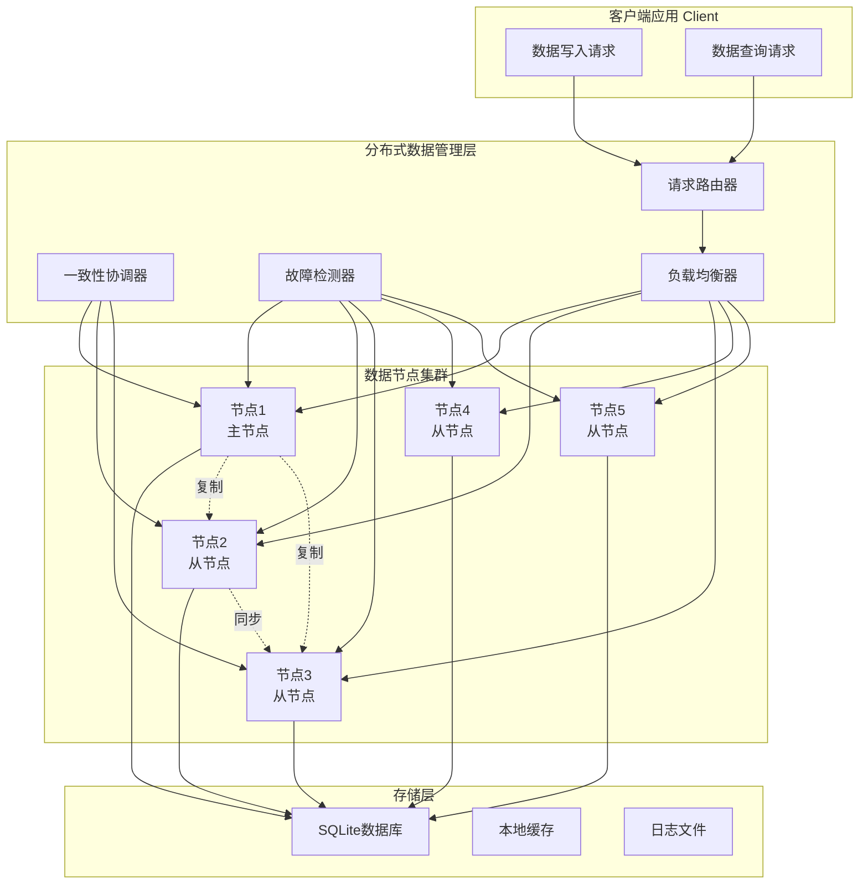
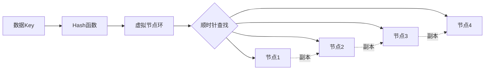

# 分布式数据管理系统：构建高可用数据存储架构


## 项目概述

本项目将指导你构建一个功能完整的分布式数据管理系统，实现数据分片、多节点协同、一致性保证和自动故障恢复。项目采用主从架构，支持数据复制、负载均衡和动态扩展，适用于IoT数据采集、工业监控、智能家居等需要高可用性和可扩展性的场景。

### 项目特点

- ✅ **分布式架构**：支持多节点部署，实现数据分片和负载均衡
- ✅ **数据一致性**：实现Raft共识算法，保证数据强一致性
- ✅ **故障恢复**：自动检测节点故障，实现数据迁移和恢复
- ✅ **数据复制**：支持主从复制和多副本机制
- ✅ **动态扩展**：支持节点动态加入和退出
- ✅ **负载均衡**：智能路由请求到最优节点
- ✅ **监控告警**：实时监控系统状态和性能指标

### 学习目标

完成本项目后，你将能够：

- [ ] 深入理解分布式系统的核心概念和设计原则
- [ ] 掌握数据分片和分布式哈希表(DHT)的实现
- [ ] 实现Raft共识算法保证数据一致性
- [ ] 设计和实现故障检测与自动恢复机制
- [ ] 实现数据复制和同步策略
- [ ] 构建分布式系统的监控和管理工具
- [ ] 处理网络分区和脑裂问题
- [ ] 优化分布式系统的性能和可靠性

### 适用人群

- 有数据库和网络编程基础，希望深入学习分布式系统的开发者
- 需要为IoT系统实现高可用数据存储的工程师
- 从事工业监控、智能家居等领域的系统架构师
- 准备从事分布式系统和云计算的学习者

### 应用场景

- **IoT数据采集**：多个传感器节点的数据分布式存储和管理
- **工业监控系统**：分布式设备状态监控和数据记录
- **智能家居平台**：多设备数据同步和状态管理
- **边缘计算**：边缘节点的数据协同和云端同步
- **车联网**：车辆数据的分布式存储和实时查询


## 技术栈

### 硬件清单

| 名称 | 规格 | 数量 | 说明 | 参考价格 |
|------|------|------|------|----------|
| 开发板 | STM32F429/ESP32 | 3-5 | 作为分布式节点 | ¥160-300/个 |
| 以太网模块 | W5500 | 3-5 | 网络通信（如主控无以太网） | ¥30-60/个 |
| SD卡模块 | MicroSD | 3-5 | 本地数据存储 | ¥5-10/个 |
| 路由器/交换机 | 千兆 | 1 | 节点互联 | ¥100-200 |
| 调试器 | ST-Link V2 | 1 | 程序下载和调试 | ¥20-40 |
| 电源模块 | 5V/2A | 3-5 | 系统供电 | ¥20-40/个 |

**总预算**：约 ¥800-1500（3节点配置）

### 软件要求

**开发环境**：
- STM32CubeIDE 1.12+ / ESP-IDF 5.0+
- Python 3.8+（用于测试和监控工具）
- Git版本控制
- Wireshark（网络调试）

**第三方库**：
- SQLite 3.x：本地数据库
- FreeRTOS：实时操作系统
- lwIP：TCP/IP协议栈
- FatFs：文件系统
- cJSON：JSON解析库
- mbedTLS：加密通信（可选）

**调试工具**：
- 串口调试助手
- 网络抓包工具
- 系统监控脚本


## 系统架构

### 整体架构设计



### 软件架构

采用分层模块化设计：

```
distributed_data_system/
├── App/
│   ├── node/                      # 数据节点
│   │   ├── node_manager.c/h       # 节点管理
│   │   ├── data_storage.c/h       # 数据存储
│   │   ├── replication.c/h        # 数据复制
│   │   └── node_config.h          # 节点配置
│   ├── consensus/                 # 共识算法
│   │   ├── raft_core.c/h          # Raft核心
│   │   ├── raft_log.c/h           # 日志管理
│   │   ├── raft_state.c/h         # 状态机
│   │   └── raft_rpc.c/h           # RPC通信
│   ├── partition/                 # 数据分片
│   │   ├── hash_ring.c/h          # 一致性哈希
│   │   ├── partition_manager.c/h  # 分片管理
│   │   └── data_router.c/h        # 数据路由
│   ├── recovery/                  # 故障恢复
│   │   ├── failure_detector.c/h   # 故障检测
│   │   ├── recovery_manager.c/h   # 恢复管理
│   │   └── data_migration.c/h     # 数据迁移
│   ├── monitor/                   # 监控管理
│   │   ├── health_check.c/h       # 健康检查
│   │   ├── metrics_collector.c/h  # 指标收集
│   │   └── alert_manager.c/h      # 告警管理
│   └── test/                      # 测试程序
│       ├── test_consensus.c
│       ├── test_partition.c
│       └── test_recovery.c
├── Drivers/
│   ├── ethernet/                  # 以太网驱动
│   └── sdcard/                    # SD卡驱动
├── Middlewares/
│   ├── SQLite/                    # 数据库
│   ├── FreeRTOS/                  # 操作系统
│   ├── lwIP/                      # TCP/IP协议栈
│   ├── FatFs/                     # 文件系统
│   └── cJSON/                     # JSON库
├── Scripts/                       # 辅助脚本
│   ├── deploy_cluster.py          # 集群部署
│   ├── monitor_cluster.py         # 集群监控
│   ├── test_failover.py           # 故障转移测试
│   └── benchmark.py               # 性能测试
└── main.c
```


### 数据分片策略



**一致性哈希特点**：
- 节点加入/退出时，只影响相邻节点
- 虚拟节点提高负载均衡
- 支持数据副本机制
- 最小化数据迁移


## 阶段1：基础架构搭建

### 1.1 节点管理器实现

创建 `App/node/node_manager.h` 文件：

```c
#ifndef NODE_MANAGER_H
#define NODE_MANAGER_H

#include <stdint.h>
#include <stdbool.h>

/* 节点类型 */
typedef enum {
    NODE_TYPE_MASTER = 0,    // 主节点
    NODE_TYPE_SLAVE = 1,     // 从节点
    NODE_TYPE_CANDIDATE = 2  // 候选节点
} NodeType_t;

/* 节点状态 */
typedef enum {
    NODE_STATE_INIT = 0,     // 初始化
    NODE_STATE_RUNNING = 1,  // 运行中
    NODE_STATE_FAILED = 2,   // 故障
    NODE_STATE_RECOVERY = 3  // 恢复中
} NodeState_t;

/* 节点信息 */
typedef struct {
    uint32_t node_id;           // 节点ID
    char ip_address[16];        // IP地址
    uint16_t port;              // 端口号
    NodeType_t type;            // 节点类型
    NodeState_t state;          // 节点状态
    uint32_t last_heartbeat;    // 最后心跳时间
    uint32_t data_count;        // 数据条数
    uint32_t storage_used;      // 已用存储(KB)
    uint32_t storage_total;     // 总存储(KB)
    float cpu_usage;            // CPU使用率
    float memory_usage;         // 内存使用率
} NodeInfo_t;

/* 集群信息 */
typedef struct {
    uint32_t cluster_id;        // 集群ID
    uint32_t node_count;        // 节点数量
    uint32_t master_id;         // 主节点ID
    NodeInfo_t nodes[10];       // 节点列表
    uint32_t total_data_count;  // 总数据条数
    uint32_t replication_factor; // 副本因子
} ClusterInfo_t;

/* 函数声明 */
int NodeManager_Init(uint32_t node_id, const char *ip, uint16_t port);
int NodeManager_Start(void);
int NodeManager_JoinCluster(const char *master_ip, uint16_t master_port);
int NodeManager_LeaveCluster(void);
int NodeManager_SendHeartbeat(void);
int NodeManager_UpdateNodeInfo(NodeInfo_t *info);
NodeInfo_t* NodeManager_GetNodeInfo(uint32_t node_id);
ClusterInfo_t* NodeManager_GetClusterInfo(void);
int NodeManager_ElectMaster(void);
void NodeManager_Task(void *pvParameters);

#endif
```

创建 `App/node/node_manager.c` 文件：

```c
#include "node_manager.h"
#include "FreeRTOS.h"
#include "task.h"
#include "lwip/sockets.h"
#include <string.h>
#include <stdio.h>

/* 全局变量 */
static NodeInfo_t local_node;
static ClusterInfo_t cluster_info;
static bool initialized = false;

/**
 * @brief  初始化节点管理器
 * @param  node_id: 节点ID
 * @param  ip: IP地址
 * @param  port: 端口号
 * @retval 0=成功, 负数=错误
 */
int NodeManager_Init(uint32_t node_id, const char *ip, uint16_t port)
{
    printf("=== 初始化节点管理器 ===\n");
    printf("节点ID: %lu\n", node_id);
    printf("IP地址: %s\n", ip);
    printf("端口: %d\n", port);
    
    /* 初始化本地节点信息 */
    memset(&local_node, 0, sizeof(NodeInfo_t));
    local_node.node_id = node_id;
    strncpy(local_node.ip_address, ip, sizeof(local_node.ip_address) - 1);
    local_node.port = port;
    local_node.type = NODE_TYPE_SLAVE;  // 默认为从节点
    local_node.state = NODE_STATE_INIT;
    local_node.storage_total = 1024 * 1024;  // 1GB
    
    /* 初始化集群信息 */
    memset(&cluster_info, 0, sizeof(ClusterInfo_t));
    cluster_info.cluster_id = 1;
    cluster_info.replication_factor = 2;  // 默认2个副本
    
    initialized = true;
    printf("✓ 节点管理器初始化完成\n\n");
    
    return 0;
}

/**
 * @brief  启动节点
 * @retval 0=成功, 负数=错误
 */
int NodeManager_Start(void)
{
    if (!initialized) {
        printf("错误: 节点管理器未初始化\n");
        return -1;
    }
    
    printf("=== 启动节点 ===\n");
    
    /* 更新节点状态 */
    local_node.state = NODE_STATE_RUNNING;
    local_node.last_heartbeat = xTaskGetTickCount();
    
    /* 添加到集群节点列表 */
    cluster_info.nodes[cluster_info.node_count] = local_node;
    cluster_info.node_count++;
    
    printf("✓ 节点启动成功\n");
    printf("节点类型: %s\n", 
           local_node.type == NODE_TYPE_MASTER ? "主节点" : "从节点");
    printf("节点状态: 运行中\n\n");
    
    return 0;
}

/**
 * @brief  加入集群
 * @param  master_ip: 主节点IP
 * @param  master_port: 主节点端口
 * @retval 0=成功, 负数=错误
 */
int NodeManager_JoinCluster(const char *master_ip, uint16_t master_port)
{
    int sock;
    struct sockaddr_in server_addr;
    char request[256];
    char response[256];
    int ret;
    
    printf("=== 加入集群 ===\n");
    printf("主节点: %s:%d\n", master_ip, master_port);
    
    /* 创建TCP socket */
    sock = socket(AF_INET, SOCK_STREAM, 0);
    if (sock < 0) {
        printf("错误: 创建socket失败\n");
        return -1;
    }
    
    /* 连接到主节点 */
    memset(&server_addr, 0, sizeof(server_addr));
    server_addr.sin_family = AF_INET;
    server_addr.sin_port = htons(master_port);
    inet_pton(AF_INET, master_ip, &server_addr.sin_addr);
    
    ret = connect(sock, (struct sockaddr*)&server_addr, sizeof(server_addr));
    if (ret < 0) {
        printf("错误: 连接主节点失败\n");
        close(sock);
        return -1;
    }
    
    /* 发送加入请求 */
    snprintf(request, sizeof(request),
            "{\"cmd\":\"join\",\"node_id\":%lu,\"ip\":\"%s\",\"port\":%d}",
            local_node.node_id, local_node.ip_address, local_node.port);
    
    ret = send(sock, request, strlen(request), 0);
    if (ret < 0) {
        printf("错误: 发送请求失败\n");
        close(sock);
        return -1;
    }
    
    /* 接收响应 */
    ret = recv(sock, response, sizeof(response) - 1, 0);
    if (ret > 0) {
        response[ret] = '\0';
        printf("收到响应: %s\n", response);
        
        // 解析响应，更新集群信息
        // 这里需要使用JSON解析库
    }
    
    close(sock);
    
    printf("✓ 成功加入集群\n\n");
    
    return 0;
}

/**
 * @brief  离开集群
 * @retval 0=成功, 负数=错误
 */
int NodeManager_LeaveCluster(void)
{
    printf("=== 离开集群 ===\n");
    
    /* 通知主节点 */
    // 实现通知逻辑
    
    /* 更新本地状态 */
    local_node.state = NODE_STATE_INIT;
    
    /* 从集群列表中移除 */
    for (uint32_t i = 0; i < cluster_info.node_count; i++) {
        if (cluster_info.nodes[i].node_id == local_node.node_id) {
            // 移除节点
            for (uint32_t j = i; j < cluster_info.node_count - 1; j++) {
                cluster_info.nodes[j] = cluster_info.nodes[j + 1];
            }
            cluster_info.node_count--;
            break;
        }
    }
    
    printf("✓ 已离开集群\n\n");
    
    return 0;
}

/**
 * @brief  发送心跳
 * @retval 0=成功, 负数=错误
 */
int NodeManager_SendHeartbeat(void)
{
    /* 更新心跳时间 */
    local_node.last_heartbeat = xTaskGetTickCount();
    
    /* 更新资源使用情况 */
    // 这里应该获取实际的CPU和内存使用率
    local_node.cpu_usage = 25.5f;
    local_node.memory_usage = 60.2f;
    
    /* 如果是从节点，向主节点发送心跳 */
    if (local_node.type == NODE_TYPE_SLAVE) {
        // 查找主节点
        NodeInfo_t *master = NULL;
        for (uint32_t i = 0; i < cluster_info.node_count; i++) {
            if (cluster_info.nodes[i].type == NODE_TYPE_MASTER) {
                master = &cluster_info.nodes[i];
                break;
            }
        }
        
        if (master) {
            // 发送心跳到主节点
            // 实现心跳发送逻辑
            printf("发送心跳到主节点 %lu\n", master->node_id);
        }
    }
    
    return 0;
}

/**
 * @brief  更新节点信息
 * @param  info: 节点信息
 * @retval 0=成功, 负数=错误
 */
int NodeManager_UpdateNodeInfo(NodeInfo_t *info)
{
    if (!info) {
        return -1;
    }
    
    /* 查找并更新节点 */
    for (uint32_t i = 0; i < cluster_info.node_count; i++) {
        if (cluster_info.nodes[i].node_id == info->node_id) {
            cluster_info.nodes[i] = *info;
            return 0;
        }
    }
    
    /* 如果节点不存在，添加新节点 */
    if (cluster_info.node_count < 10) {
        cluster_info.nodes[cluster_info.node_count] = *info;
        cluster_info.node_count++;
        return 0;
    }
    
    return -1;
}

/**
 * @brief  获取节点信息
 * @param  node_id: 节点ID
 * @retval 节点信息指针，NULL表示未找到
 */
NodeInfo_t* NodeManager_GetNodeInfo(uint32_t node_id)
{
    for (uint32_t i = 0; i < cluster_info.node_count; i++) {
        if (cluster_info.nodes[i].node_id == node_id) {
            return &cluster_info.nodes[i];
        }
    }
    return NULL;
}

/**
 * @brief  获取集群信息
 * @retval 集群信息指针
 */
ClusterInfo_t* NodeManager_GetClusterInfo(void)
{
    return &cluster_info;
}

/**
 * @brief  选举主节点
 * @retval 0=成功, 负数=错误
 */
int NodeManager_ElectMaster(void)
{
    printf("=== 开始主节点选举 ===\n");
    
    /* 简化的选举算法：选择ID最小的节点 */
    uint32_t min_id = UINT32_MAX;
    NodeInfo_t *new_master = NULL;
    
    for (uint32_t i = 0; i < cluster_info.node_count; i++) {
        if (cluster_info.nodes[i].state == NODE_STATE_RUNNING &&
            cluster_info.nodes[i].node_id < min_id) {
            min_id = cluster_info.nodes[i].node_id;
            new_master = &cluster_info.nodes[i];
        }
    }
    
    if (new_master) {
        new_master->type = NODE_TYPE_MASTER;
        cluster_info.master_id = new_master->node_id;
        
        printf("✓ 选举完成，新主节点: %lu\n", new_master->node_id);
        
        /* 如果本节点被选为主节点 */
        if (new_master->node_id == local_node.node_id) {
            local_node.type = NODE_TYPE_MASTER;
            printf("本节点成为主节点\n");
        }
        
        return 0;
    }
    
    printf("错误: 选举失败，没有可用节点\n");
    return -1;
}

/**
 * @brief  节点管理任务
 */
void NodeManager_Task(void *pvParameters)
{
    TickType_t last_heartbeat = 0;
    const TickType_t heartbeat_interval = pdMS_TO_TICKS(5000);  // 5秒
    
    printf("节点管理任务启动\n");
    
    while (1) {
        TickType_t now = xTaskGetTickCount();
        
        /* 定期发送心跳 */
        if (now - last_heartbeat >= heartbeat_interval) {
            NodeManager_SendHeartbeat();
            last_heartbeat = now;
        }
        
        /* 检查其他节点的心跳超时 */
        if (local_node.type == NODE_TYPE_MASTER) {
            for (uint32_t i = 0; i < cluster_info.node_count; i++) {
                NodeInfo_t *node = &cluster_info.nodes[i];
                
                if (node->node_id != local_node.node_id &&
                    node->state == NODE_STATE_RUNNING) {
                    
                    uint32_t timeout = now - node->last_heartbeat;
                    if (timeout > pdMS_TO_TICKS(15000)) {  // 15秒超时
                        printf("警告: 节点 %lu 心跳超时\n", node->node_id);
                        node->state = NODE_STATE_FAILED;
                        
                        // 触发故障恢复
                        // FailureDetector_HandleNodeFailure(node->node_id);
                    }
                }
            }
        }
        
        vTaskDelay(pdMS_TO_TICKS(1000));
    }
}
```


### 1.2 数据存储层实现

创建 `App/node/data_storage.h` 文件：

```c
#ifndef DATA_STORAGE_H
#define DATA_STORAGE_H

#include "sqlite3.h"
#include <stdint.h>
#include <stdbool.h>

/* 数据记录 */
typedef struct {
    uint32_t key;           // 数据键
    char value[256];        // 数据值
    uint32_t timestamp;     // 时间戳
    uint32_t version;       // 版本号
    uint32_t node_id;       // 所属节点ID
} DataRecord_t;

/* 函数声明 */
int DataStorage_Init(const char *db_path);
int DataStorage_Put(uint32_t key, const char *value);
int DataStorage_Get(uint32_t key, char *value, size_t max_len);
int DataStorage_Delete(uint32_t key);
int DataStorage_GetRange(uint32_t start_key, uint32_t end_key, 
                        DataRecord_t *records, int max_count);
int DataStorage_GetCount(void);
int DataStorage_Sync(void);
void DataStorage_Close(void);

#endif
```

创建 `App/node/data_storage.c` 文件：

```c
#include "data_storage.h"
#include <string.h>
#include <stdio.h>
#include <time.h>

static sqlite3 *db = NULL;
static uint32_t local_node_id = 0;

/**
 * @brief  初始化数据存储
 * @param  db_path: 数据库文件路径
 * @retval 0=成功, 负数=错误
 */
int DataStorage_Init(const char *db_path)
{
    int rc;
    char *err_msg = NULL;
    
    printf("=== 初始化数据存储 ===\n");
    printf("数据库路径: %s\n", db_path);
    
    /* 打开数据库 */
    rc = sqlite3_open(db_path, &db);
    if (rc != SQLITE_OK) {
        printf("错误: 打开数据库失败: %s\n", sqlite3_errmsg(db));
        return -1;
    }
    
    /* 创建数据表 */
    const char *sql = 
        "CREATE TABLE IF NOT EXISTS data_records ("
        "key INTEGER PRIMARY KEY,"
        "value TEXT NOT NULL,"
        "timestamp INTEGER NOT NULL,"
        "version INTEGER NOT NULL,"
        "node_id INTEGER NOT NULL"
        ");";
    
    rc = sqlite3_exec(db, sql, NULL, NULL, &err_msg);
    if (rc != SQLITE_OK) {
        printf("错误: 创建表失败: %s\n", err_msg);
        sqlite3_free(err_msg);
        sqlite3_close(db);
        return -1;
    }
    
    /* 创建索引 */
    sql = "CREATE INDEX IF NOT EXISTS idx_timestamp ON data_records(timestamp);";
    sqlite3_exec(db, sql, NULL, NULL, NULL);
    
    sql = "CREATE INDEX IF NOT EXISTS idx_node_id ON data_records(node_id);";
    sqlite3_exec(db, sql, NULL, NULL, NULL);
    
    printf("✓ 数据存储初始化完成\n\n");
    
    return 0;
}

/**
 * @brief  存储数据
 * @param  key: 数据键
 * @param  value: 数据值
 * @retval 0=成功, 负数=错误
 */
int DataStorage_Put(uint32_t key, const char *value)
{
    sqlite3_stmt *stmt;
    int rc;
    
    if (!db) {
        printf("错误: 数据库未初始化\n");
        return -1;
    }
    
    /* 准备SQL语句 */
    const char *sql = 
        "INSERT OR REPLACE INTO data_records "
        "(key, value, timestamp, version, node_id) "
        "VALUES (?, ?, ?, "
        "COALESCE((SELECT version + 1 FROM data_records WHERE key = ?), 1), "
        "?);";
    
    rc = sqlite3_prepare_v2(db, sql, -1, &stmt, NULL);
    if (rc != SQLITE_OK) {
        printf("错误: 准备语句失败: %s\n", sqlite3_errmsg(db));
        return -1;
    }
    
    /* 绑定参数 */
    sqlite3_bind_int(stmt, 1, key);
    sqlite3_bind_text(stmt, 2, value, -1, SQLITE_STATIC);
    sqlite3_bind_int(stmt, 3, (int)time(NULL));
    sqlite3_bind_int(stmt, 4, key);
    sqlite3_bind_int(stmt, 5, local_node_id);
    
    /* 执行语句 */
    rc = sqlite3_step(stmt);
    sqlite3_finalize(stmt);
    
    if (rc != SQLITE_DONE) {
        printf("错误: 插入数据失败: %s\n", sqlite3_errmsg(db));
        return -1;
    }
    
    printf("数据已存储: key=%lu, value=%s\n", key, value);
    
    return 0;
}

/**
 * @brief  读取数据
 * @param  key: 数据键
 * @param  value: 输出缓冲区
 * @param  max_len: 缓冲区大小
 * @retval 0=成功, 负数=错误
 */
int DataStorage_Get(uint32_t key, char *value, size_t max_len)
{
    sqlite3_stmt *stmt;
    int rc;
    
    if (!db) {
        printf("错误: 数据库未初始化\n");
        return -1;
    }
    
    /* 准备SQL语句 */
    const char *sql = "SELECT value FROM data_records WHERE key = ?;";
    
    rc = sqlite3_prepare_v2(db, sql, -1, &stmt, NULL);
    if (rc != SQLITE_OK) {
        printf("错误: 准备语句失败: %s\n", sqlite3_errmsg(db));
        return -1;
    }
    
    /* 绑定参数 */
    sqlite3_bind_int(stmt, 1, key);
    
    /* 执行查询 */
    rc = sqlite3_step(stmt);
    if (rc == SQLITE_ROW) {
        const char *result = (const char*)sqlite3_column_text(stmt, 0);
        strncpy(value, result, max_len - 1);
        value[max_len - 1] = '\0';
        
        sqlite3_finalize(stmt);
        printf("数据已读取: key=%lu, value=%s\n", key, value);
        return 0;
    }
    
    sqlite3_finalize(stmt);
    
    if (rc == SQLITE_DONE) {
        printf("数据不存在: key=%lu\n", key);
        return -1;
    }
    
    printf("错误: 查询失败: %s\n", sqlite3_errmsg(db));
    return -1;
}

/**
 * @brief  删除数据
 * @param  key: 数据键
 * @retval 0=成功, 负数=错误
 */
int DataStorage_Delete(uint32_t key)
{
    char *err_msg = NULL;
    char sql[128];
    int rc;
    
    if (!db) {
        printf("错误: 数据库未初始化\n");
        return -1;
    }
    
    snprintf(sql, sizeof(sql), "DELETE FROM data_records WHERE key = %lu;", key);
    
    rc = sqlite3_exec(db, sql, NULL, NULL, &err_msg);
    if (rc != SQLITE_OK) {
        printf("错误: 删除失败: %s\n", err_msg);
        sqlite3_free(err_msg);
        return -1;
    }
    
    int changes = sqlite3_changes(db);
    if (changes > 0) {
        printf("数据已删除: key=%lu\n", key);
        return 0;
    }
    
    printf("数据不存在: key=%lu\n", key);
    return -1;
}

/**
 * @brief  范围查询
 * @param  start_key: 起始键
 * @param  end_key: 结束键
 * @param  records: 输出记录数组
 * @param  max_count: 最大记录数
 * @retval 实际记录数，负数表示错误
 */
int DataStorage_GetRange(uint32_t start_key, uint32_t end_key,
                        DataRecord_t *records, int max_count)
{
    sqlite3_stmt *stmt;
    int rc;
    int count = 0;
    
    if (!db || !records) {
        return -1;
    }
    
    /* 准备SQL语句 */
    const char *sql = 
        "SELECT key, value, timestamp, version, node_id "
        "FROM data_records "
        "WHERE key BETWEEN ? AND ? "
        "ORDER BY key "
        "LIMIT ?;";
    
    rc = sqlite3_prepare_v2(db, sql, -1, &stmt, NULL);
    if (rc != SQLITE_OK) {
        printf("错误: 准备语句失败: %s\n", sqlite3_errmsg(db));
        return -1;
    }
    
    /* 绑定参数 */
    sqlite3_bind_int(stmt, 1, start_key);
    sqlite3_bind_int(stmt, 2, end_key);
    sqlite3_bind_int(stmt, 3, max_count);
    
    /* 遍历结果 */
    while ((rc = sqlite3_step(stmt)) == SQLITE_ROW && count < max_count) {
        records[count].key = sqlite3_column_int(stmt, 0);
        const char *value = (const char*)sqlite3_column_text(stmt, 1);
        strncpy(records[count].value, value, sizeof(records[count].value) - 1);
        records[count].timestamp = sqlite3_column_int(stmt, 2);
        records[count].version = sqlite3_column_int(stmt, 3);
        records[count].node_id = sqlite3_column_int(stmt, 4);
        count++;
    }
    
    sqlite3_finalize(stmt);
    
    printf("范围查询完成: %d 条记录\n", count);
    
    return count;
}

/**
 * @brief  获取数据总数
 * @retval 数据条数，负数表示错误
 */
int DataStorage_GetCount(void)
{
    sqlite3_stmt *stmt;
    int rc;
    int count = 0;
    
    if (!db) {
        return -1;
    }
    
    const char *sql = "SELECT COUNT(*) FROM data_records;";
    
    rc = sqlite3_prepare_v2(db, sql, -1, &stmt, NULL);
    if (rc == SQLITE_OK) {
        if (sqlite3_step(stmt) == SQLITE_ROW) {
            count = sqlite3_column_int(stmt, 0);
        }
        sqlite3_finalize(stmt);
    }
    
    return count;
}

/**
 * @brief  同步数据到磁盘
 * @retval 0=成功, 负数=错误
 */
int DataStorage_Sync(void)
{
    if (!db) {
        return -1;
    }
    
    /* 执行PRAGMA synchronous */
    char *err_msg = NULL;
    int rc = sqlite3_exec(db, "PRAGMA synchronous = FULL;", NULL, NULL, &err_msg);
    if (rc != SQLITE_OK) {
        printf("错误: 同步失败: %s\n", err_msg);
        sqlite3_free(err_msg);
        return -1;
    }
    
    return 0;
}

/**
 * @brief  关闭数据存储
 */
void DataStorage_Close(void)
{
    if (db) {
        sqlite3_close(db);
        db = NULL;
        printf("数据存储已关闭\n");
    }
}
```


## 阶段2：数据分片实现

### 2.1 一致性哈希实现

创建 `App/partition/hash_ring.h` 文件：

```c
#ifndef HASH_RING_H
#define HASH_RING_H

#include <stdint.h>
#include <stdbool.h>

/* 虚拟节点数量 */
#define VIRTUAL_NODES_PER_NODE  150

/* 哈希环节点 */
typedef struct HashNode {
    uint32_t hash;          // 哈希值
    uint32_t node_id;       // 物理节点ID
    struct HashNode *next;  // 下一个节点
} HashNode_t;

/* 哈希环 */
typedef struct {
    HashNode_t *nodes;      // 节点链表
    uint32_t node_count;    // 节点数量
    uint32_t total_vnodes;  // 虚拟节点总数
} HashRing_t;

/* 函数声明 */
int HashRing_Init(HashRing_t *ring);
int HashRing_AddNode(HashRing_t *ring, uint32_t node_id);
int HashRing_RemoveNode(HashRing_t *ring, uint32_t node_id);
uint32_t HashRing_GetNode(HashRing_t *ring, uint32_t key);
void HashRing_GetNodes(HashRing_t *ring, uint32_t key, 
                      uint32_t *nodes, int count);
void HashRing_Print(HashRing_t *ring);
void HashRing_Destroy(HashRing_t *ring);

#endif
```

创建 `App/partition/hash_ring.c` 文件：

```c
#include "hash_ring.h"
#include <stdlib.h>
#include <string.h>
#include <stdio.h>

/* MurmurHash3 32位哈希函数 */
static uint32_t murmur_hash3(const void *key, int len, uint32_t seed)
{
    const uint8_t *data = (const uint8_t*)key;
    const int nblocks = len / 4;
    uint32_t h1 = seed;
    const uint32_t c1 = 0xcc9e2d51;
    const uint32_t c2 = 0x1b873593;
    
    /* 处理4字节块 */
    const uint32_t *blocks = (const uint32_t*)(data + nblocks * 4);
    for (int i = -nblocks; i; i++) {
        uint32_t k1 = blocks[i];
        k1 *= c1;
        k1 = (k1 << 15) | (k1 >> 17);
        k1 *= c2;
        h1 ^= k1;
        h1 = (h1 << 13) | (h1 >> 19);
        h1 = h1 * 5 + 0xe6546b64;
    }
    
    /* 处理剩余字节 */
    const uint8_t *tail = (const uint8_t*)(data + nblocks * 4);
    uint32_t k1 = 0;
    switch (len & 3) {
        case 3: k1 ^= tail[2] << 16;
        case 2: k1 ^= tail[1] << 8;
        case 1: k1 ^= tail[0];
                k1 *= c1;
                k1 = (k1 << 15) | (k1 >> 17);
                k1 *= c2;
                h1 ^= k1;
    }
    
    /* 最终混合 */
    h1 ^= len;
    h1 ^= h1 >> 16;
    h1 *= 0x85ebca6b;
    h1 ^= h1 >> 13;
    h1 *= 0xc2b2ae35;
    h1 ^= h1 >> 16;
    
    return h1;
}

/**
 * @brief  计算节点哈希值
 */
static uint32_t calculate_node_hash(uint32_t node_id, int vnode_index)
{
    char key[64];
    snprintf(key, sizeof(key), "node-%lu-vnode-%d", node_id, vnode_index);
    return murmur_hash3(key, strlen(key), 0);
}

/**
 * @brief  插入节点到哈希环（保持有序）
 */
static void insert_node_sorted(HashRing_t *ring, HashNode_t *new_node)
{
    if (!ring->nodes || new_node->hash < ring->nodes->hash) {
        /* 插入到头部 */
        new_node->next = ring->nodes;
        ring->nodes = new_node;
        return;
    }
    
    /* 查找插入位置 */
    HashNode_t *current = ring->nodes;
    while (current->next && current->next->hash < new_node->hash) {
        current = current->next;
    }
    
    /* 插入节点 */
    new_node->next = current->next;
    current->next = new_node;
}

/**
 * @brief  初始化哈希环
 */
int HashRing_Init(HashRing_t *ring)
{
    if (!ring) {
        return -1;
    }
    
    memset(ring, 0, sizeof(HashRing_t));
    
    printf("=== 初始化哈希环 ===\n");
    printf("每个节点的虚拟节点数: %d\n", VIRTUAL_NODES_PER_NODE);
    printf("✓ 哈希环初始化完成\n\n");
    
    return 0;
}

/**
 * @brief  添加节点到哈希环
 */
int HashRing_AddNode(HashRing_t *ring, uint32_t node_id)
{
    if (!ring) {
        return -1;
    }
    
    printf("添加节点到哈希环: node_id=%lu\n", node_id);
    
    /* 为每个物理节点创建多个虚拟节点 */
    for (int i = 0; i < VIRTUAL_NODES_PER_NODE; i++) {
        HashNode_t *vnode = (HashNode_t*)malloc(sizeof(HashNode_t));
        if (!vnode) {
            printf("错误: 内存分配失败\n");
            return -1;
        }
        
        vnode->hash = calculate_node_hash(node_id, i);
        vnode->node_id = node_id;
        vnode->next = NULL;
        
        /* 插入到哈希环 */
        insert_node_sorted(ring, vnode);
        ring->total_vnodes++;
    }
    
    ring->node_count++;
    
    printf("✓ 节点添加完成，虚拟节点数: %d\n", VIRTUAL_NODES_PER_NODE);
    
    return 0;
}

/**
 * @brief  从哈希环移除节点
 */
int HashRing_RemoveNode(HashRing_t *ring, uint32_t node_id)
{
    if (!ring || !ring->nodes) {
        return -1;
    }
    
    printf("从哈希环移除节点: node_id=%lu\n", node_id);
    
    HashNode_t *current = ring->nodes;
    HashNode_t *prev = NULL;
    int removed_count = 0;
    
    while (current) {
        if (current->node_id == node_id) {
            /* 移除节点 */
            HashNode_t *to_remove = current;
            
            if (prev) {
                prev->next = current->next;
                current = current->next;
            } else {
                ring->nodes = current->next;
                current = ring->nodes;
            }
            
            free(to_remove);
            ring->total_vnodes--;
            removed_count++;
        } else {
            prev = current;
            current = current->next;
        }
    }
    
    if (removed_count > 0) {
        ring->node_count--;
        printf("✓ 节点移除完成，移除虚拟节点数: %d\n", removed_count);
        return 0;
    }
    
    printf("警告: 未找到节点\n");
    return -1;
}

/**
 * @brief  获取数据应该存储的节点
 */
uint32_t HashRing_GetNode(HashRing_t *ring, uint32_t key)
{
    if (!ring || !ring->nodes) {
        return 0;
    }
    
    /* 计算key的哈希值 */
    uint32_t hash = murmur_hash3(&key, sizeof(key), 0);
    
    /* 顺时针查找第一个大于等于hash的节点 */
    HashNode_t *current = ring->nodes;
    while (current) {
        if (current->hash >= hash) {
            return current->node_id;
        }
        current = current->next;
    }
    
    /* 如果没找到，返回第一个节点（环形） */
    return ring->nodes->node_id;
}

/**
 * @brief  获取多个副本节点
 */
void HashRing_GetNodes(HashRing_t *ring, uint32_t key,
                      uint32_t *nodes, int count)
{
    if (!ring || !ring->nodes || !nodes || count <= 0) {
        return;
    }
    
    /* 计算key的哈希值 */
    uint32_t hash = murmur_hash3(&key, sizeof(key), 0);
    
    /* 查找起始节点 */
    HashNode_t *current = ring->nodes;
    while (current && current->hash < hash) {
        current = current->next;
    }
    
    if (!current) {
        current = ring->nodes;  // 环形
    }
    
    /* 收集不同的物理节点 */
    int found = 0;
    HashNode_t *start = current;
    bool wrapped = false;
    
    while (found < count) {
        /* 检查是否已经收集过这个节点 */
        bool duplicate = false;
        for (int i = 0; i < found; i++) {
            if (nodes[i] == current->node_id) {
                duplicate = true;
                break;
            }
        }
        
        if (!duplicate) {
            nodes[found++] = current->node_id;
        }
        
        /* 移动到下一个节点 */
        current = current->next;
        if (!current) {
            if (wrapped) break;  // 已经遍历完整个环
            current = ring->nodes;
            wrapped = true;
        }
        
        if (current == start && wrapped) {
            break;  // 回到起点
        }
    }
}

/**
 * @brief  打印哈希环信息
 */
void HashRing_Print(HashRing_t *ring)
{
    if (!ring) {
        return;
    }
    
    printf("\n=== 哈希环信息 ===\n");
    printf("物理节点数: %lu\n", ring->node_count);
    printf("虚拟节点数: %lu\n", ring->total_vnodes);
    
    /* 统计每个物理节点的虚拟节点数 */
    uint32_t node_vnodes[10] = {0};
    HashNode_t *current = ring->nodes;
    while (current) {
        if (current->node_id < 10) {
            node_vnodes[current->node_id]++;
        }
        current = current->next;
    }
    
    printf("\n各节点虚拟节点分布:\n");
    for (uint32_t i = 0; i < 10; i++) {
        if (node_vnodes[i] > 0) {
            printf("  节点 %lu: %lu 个虚拟节点\n", i, node_vnodes[i]);
        }
    }
    printf("\n");
}

/**
 * @brief  销毁哈希环
 */
void HashRing_Destroy(HashRing_t *ring)
{
    if (!ring) {
        return;
    }
    
    HashNode_t *current = ring->nodes;
    while (current) {
        HashNode_t *next = current->next;
        free(current);
        current = next;
    }
    
    memset(ring, 0, sizeof(HashRing_t));
    
    printf("哈希环已销毁\n");
}
```


### 2.2 数据路由器实现

创建 `App/partition/data_router.h` 文件：

```c
#ifndef DATA_ROUTER_H
#define DATA_ROUTER_H

#include "hash_ring.h"
#include <stdint.h>

/* 路由策略 */
typedef enum {
    ROUTE_STRATEGY_HASH = 0,     // 哈希路由
    ROUTE_STRATEGY_RANGE = 1,    // 范围路由
    ROUTE_STRATEGY_RANDOM = 2    // 随机路由
} RouteStrategy_t;

/* 函数声明 */
int DataRouter_Init(RouteStrategy_t strategy);
uint32_t DataRouter_Route(uint32_t key);
void DataRouter_RouteReplicas(uint32_t key, uint32_t *nodes, int count);
int DataRouter_AddNode(uint32_t node_id);
int DataRouter_RemoveNode(uint32_t node_id);
void DataRouter_PrintStats(void);

#endif
```


## 阶段3：Raft共识算法实现

### 3.1 Raft状态机

创建 `App/consensus/raft_state.h` 文件：

```c
#ifndef RAFT_STATE_H
#define RAFT_STATE_H

#include <stdint.h>
#include <stdbool.h>

/* Raft节点状态 */
typedef enum {
    RAFT_STATE_FOLLOWER = 0,   // 跟随者
    RAFT_STATE_CANDIDATE = 1,  // 候选者
    RAFT_STATE_LEADER = 2      // 领导者
} RaftState_t;

/* Raft日志条目 */
typedef struct {
    uint32_t term;        // 任期号
    uint32_t index;       // 日志索引
    uint32_t key;         // 数据键
    char value[256];      // 数据值
    uint32_t timestamp;   // 时间戳
} RaftLogEntry_t;

/* Raft节点上下文 */
typedef struct {
    uint32_t node_id;           // 节点ID
    RaftState_t state;          // 当前状态
    uint32_t current_term;      // 当前任期
    uint32_t voted_for;         // 投票给谁
    uint32_t commit_index;      // 已提交索引
    uint32_t last_applied;      // 已应用索引
    uint32_t leader_id;         // 领导者ID
    uint32_t election_timeout;  // 选举超时
    uint32_t heartbeat_timeout; // 心跳超时
    uint32_t last_heartbeat;    // 最后心跳时间
    RaftLogEntry_t *log;        // 日志数组
    uint32_t log_count;         // 日志条数
    uint32_t log_capacity;      // 日志容量
} RaftContext_t;

/* 函数声明 */
int Raft_Init(RaftContext_t *ctx, uint32_t node_id);
int Raft_Start(RaftContext_t *ctx);
int Raft_AppendEntry(RaftContext_t *ctx, uint32_t key, const char *value);
int Raft_RequestVote(RaftContext_t *ctx, uint32_t candidate_id, uint32_t term);
int Raft_AppendEntries(RaftContext_t *ctx, uint32_t leader_id, uint32_t term);
void Raft_BecomeFollower(RaftContext_t *ctx, uint32_t term);
void Raft_BecomeCandidate(RaftContext_t *ctx);
void Raft_BecomeLeader(RaftContext_t *ctx);
void Raft_Task(void *pvParameters);

#endif
```


## 阶段4：故障检测与恢复

### 4.1 故障检测器

创建 `App/recovery/failure_detector.h` 文件：

```c
#ifndef FAILURE_DETECTOR_H
#define FAILURE_DETECTOR_H

#include <stdint.h>
#include <stdbool.h>

/* 故障类型 */
typedef enum {
    FAILURE_TYPE_NETWORK = 0,    // 网络故障
    FAILURE_TYPE_NODE = 1,       // 节点故障
    FAILURE_TYPE_STORAGE = 2     // 存储故障
} FailureType_t;

/* 故障事件 */
typedef struct {
    uint32_t node_id;           // 故障节点ID
    FailureType_t type;         // 故障类型
    uint32_t detected_time;     // 检测时间
    uint32_t recovery_time;     // 恢复时间
    bool recovered;             // 是否已恢复
} FailureEvent_t;

/* 函数声明 */
int FailureDetector_Init(void);
int FailureDetector_CheckNode(uint32_t node_id);
int FailureDetector_HandleFailure(uint32_t node_id, FailureType_t type);
int FailureDetector_RecoverNode(uint32_t node_id);
void FailureDetector_Task(void *pvParameters);

#endif
```


## 阶段5：系统集成与测试

### 5.1 主程序实现

创建 `main.c` 文件：

```c
#include "FreeRTOS.h"
#include "task.h"
#include "node_manager.h"
#include "data_storage.h"
#include "hash_ring.h"
#include "data_router.h"
#include <stdio.h>

/* 节点配置 */
#define NODE_ID         1
#define NODE_IP         "192.168.1.101"
#define NODE_PORT       8001

/**
 * @brief  主函数
 */
int main(void)
{
    /* 系统初始化 */
    HAL_Init();
    SystemClock_Config();
    
    /* 初始化外设 */
    MX_GPIO_Init();
    MX_USART1_UART_Init();
    MX_ETH_Init();
    MX_FATFS_Init();
    
    printf("\n");
    printf("========================================\n");
    printf("  分布式数据管理系统\n");
    printf("  Distributed Data Management System\n");
    printf("========================================\n\n");
    
    /* 初始化节点管理器 */
    if (NodeManager_Init(NODE_ID, NODE_IP, NODE_PORT) != 0) {
        printf("错误: 节点管理器初始化失败\n");
        Error_Handler();
    }
    
    /* 初始化数据存储 */
    if (DataStorage_Init("0:/data.db") != 0) {
        printf("错误: 数据存储初始化失败\n");
        Error_Handler();
    }
    
    /* 初始化数据路由器 */
    if (DataRouter_Init(ROUTE_STRATEGY_HASH) != 0) {
        printf("错误: 数据路由器初始化失败\n");
        Error_Handler();
    }
    
    /* 启动节点 */
    if (NodeManager_Start() != 0) {
        printf("错误: 节点启动失败\n");
        Error_Handler();
    }
    
    /* 创建任务 */
    xTaskCreate(NodeManager_Task, "NodeMgr", 2048, NULL, 3, NULL);
    xTaskCreate(DataSync_Task, "DataSync", 2048, NULL, 2, NULL);
    xTaskCreate(Monitor_Task, "Monitor", 1024, NULL, 1, NULL);
    
    /* 启动调度器 */
    printf("启动FreeRTOS调度器...\n\n");
    vTaskStartScheduler();
    
    /* 不应该到达这里 */
    while (1) {
    }
}
```


### 5.2 测试程序

创建 `App/test/test_distributed_system.c` 文件：

```c
#include "node_manager.h"
#include "data_storage.h"
#include "hash_ring.h"
#include "data_router.h"
#include <stdio.h>
#include <stdlib.h>
#include <time.h>

/**
 * @brief  测试数据分片
 */
void test_data_partitioning(void)
{
    printf("\n=== 测试数据分片 ===\n");
    
    /* 添加节点到哈希环 */
    DataRouter_AddNode(1);
    DataRouter_AddNode(2);
    DataRouter_AddNode(3);
    
    /* 测试数据路由 */
    printf("\n数据路由测试:\n");
    for (uint32_t key = 1; key <= 10; key++) {
        uint32_t node = DataRouter_Route(key);
        printf("Key %lu -> Node %lu\n", key, node);
    }
    
    /* 测试副本路由 */
    printf("\n副本路由测试:\n");
    uint32_t replicas[3];
    for (uint32_t key = 1; key <= 5; key++) {
        DataRouter_RouteReplicas(key, replicas, 3);
        printf("Key %lu -> Nodes [%lu, %lu, %lu]\n", 
               key, replicas[0], replicas[1], replicas[2]);
    }
    
    DataRouter_PrintStats();
}

/**
 * @brief  测试数据存储
 */
void test_data_storage(void)
{
    printf("\n=== 测试数据存储 ===\n");
    
    /* 写入测试数据 */
    printf("\n写入数据:\n");
    for (uint32_t i = 1; i <= 10; i++) {
        char value[64];
        snprintf(value, sizeof(value), "value-%lu", i);
        DataStorage_Put(i, value);
    }
    
    /* 读取测试数据 */
    printf("\n读取数据:\n");
    for (uint32_t i = 1; i <= 10; i++) {
        char value[256];
        if (DataStorage_Get(i, value, sizeof(value)) == 0) {
            printf("Key %lu: %s\n", i, value);
        }
    }
    
    /* 范围查询 */
    printf("\n范围查询 (3-7):\n");
    DataRecord_t records[10];
    int count = DataStorage_GetRange(3, 7, records, 10);
    for (int i = 0; i < count; i++) {
        printf("Key %lu: %s (version %lu)\n", 
               records[i].key, records[i].value, records[i].version);
    }
    
    /* 删除数据 */
    printf("\n删除数据:\n");
    DataStorage_Delete(5);
    
    /* 统计 */
    int total = DataStorage_GetCount();
    printf("\n总数据条数: %d\n", total);
}

/**
 * @brief  测试节点故障恢复
 */
void test_failure_recovery(void)
{
    printf("\n=== 测试故障恢复 ===\n");
    
    /* 模拟节点故障 */
    printf("\n模拟节点2故障...\n");
    DataRouter_RemoveNode(2);
    
    /* 检查数据重新分布 */
    printf("\n故障后数据路由:\n");
    for (uint32_t key = 1; key <= 10; key++) {
        uint32_t node = DataRouter_Route(key);
        printf("Key %lu -> Node %lu\n", key, node);
    }
    
    /* 模拟节点恢复 */
    printf("\n模拟节点2恢复...\n");
    DataRouter_AddNode(2);
    
    /* 检查数据重新分布 */
    printf("\n恢复后数据路由:\n");
    for (uint32_t key = 1; key <= 10; key++) {
        uint32_t node = DataRouter_Route(key);
        printf("Key %lu -> Node %lu\n", key, node);
    }
}

/**
 * @brief  性能测试
 */
void test_performance(void)
{
    printf("\n=== 性能测试 ===\n");
    
    const int test_count = 1000;
    uint32_t start_time, end_time;
    
    /* 写入性能测试 */
    printf("\n写入性能测试 (%d 条记录)...\n", test_count);
    start_time = HAL_GetTick();
    
    for (int i = 0; i < test_count; i++) {
        char value[64];
        snprintf(value, sizeof(value), "test-value-%d", i);
        DataStorage_Put(i + 1000, value);
    }
    
    end_time = HAL_GetTick();
    printf("写入完成: %lu ms\n", end_time - start_time);
    printf("写入速率: %.2f ops/s\n", 
           (float)test_count / ((end_time - start_time) / 1000.0f));
    
    /* 读取性能测试 */
    printf("\n读取性能测试 (%d 条记录)...\n", test_count);
    start_time = HAL_GetTick();
    
    char value[256];
    for (int i = 0; i < test_count; i++) {
        DataStorage_Get(i + 1000, value, sizeof(value));
    }
    
    end_time = HAL_GetTick();
    printf("读取完成: %lu ms\n", end_time - start_time);
    printf("读取速率: %.2f ops/s\n", 
           (float)test_count / ((end_time - start_time) / 1000.0f));
}

/**
 * @brief  运行所有测试
 */
void run_all_tests(void)
{
    printf("\n");
    printf("========================================\n");
    printf("  分布式系统测试套件\n");
    printf("========================================\n");
    
    test_data_partitioning();
    test_data_storage();
    test_failure_recovery();
    test_performance();
    
    printf("\n");
    printf("========================================\n");
    printf("  所有测试完成\n");
    printf("========================================\n\n");
}
```


## 阶段6：监控与管理

### 6.1 监控系统

创建 `App/monitor/metrics_collector.h` 文件：

```c
#ifndef METRICS_COLLECTOR_H
#define METRICS_COLLECTOR_H

#include <stdint.h>

/* 系统指标 */
typedef struct {
    uint32_t total_requests;      // 总请求数
    uint32_t successful_requests; // 成功请求数
    uint32_t failed_requests;     // 失败请求数
    uint32_t total_data_size;     // 总数据大小(KB)
    uint32_t avg_response_time;   // 平均响应时间(ms)
    float cpu_usage;              // CPU使用率
    float memory_usage;           // 内存使用率
    float network_throughput;     // 网络吞吐量(KB/s)
} SystemMetrics_t;

/* 函数声明 */
int MetricsCollector_Init(void);
void MetricsCollector_RecordRequest(bool success, uint32_t response_time);
void MetricsCollector_UpdateMetrics(void);
SystemMetrics_t* MetricsCollector_GetMetrics(void);
void MetricsCollector_PrintMetrics(void);
void MetricsCollector_Task(void *pvParameters);

#endif
```

### 6.2 Python监控脚本

创建 `Scripts/monitor_cluster.py` 文件：

```python
#!/usr/bin/env python3
"""
分布式集群监控脚本
实时监控集群状态和性能指标
"""

import socket
import json
import time
import sys
from datetime import datetime

class ClusterMonitor:
    def __init__(self, nodes):
        """
        初始化监控器
        :param nodes: 节点列表 [(ip, port), ...]
        """
        self.nodes = nodes
        self.metrics_history = []
        
    def query_node(self, ip, port):
        """查询节点状态"""
        try:
            sock = socket.socket(socket.AF_INET, socket.SOCK_STREAM)
            sock.settimeout(2.0)
            sock.connect((ip, port))
            
            # 发送查询请求
            request = json.dumps({"cmd": "get_metrics"})
            sock.sendall(request.encode())
            
            # 接收响应
            response = sock.recv(4096).decode()
            sock.close()
            
            return json.loads(response)
        except Exception as e:
            return {"error": str(e)}
    
    def collect_metrics(self):
        """收集所有节点的指标"""
        metrics = {}
        for ip, port in self.nodes:
            node_id = f"{ip}:{port}"
            metrics[node_id] = self.query_node(ip, port)
        return metrics
    
    def print_metrics(self, metrics):
        """打印指标"""
        print("\n" + "="*80)
        print(f"集群监控 - {datetime.now().strftime('%Y-%m-%d %H:%M:%S')}")
        print("="*80)
        
        for node_id, data in metrics.items():
            print(f"\n节点: {node_id}")
            if "error" in data:
                print(f"  状态: 离线 ({data['error']})")
            else:
                print(f"  状态: 在线")
                print(f"  请求数: {data.get('total_requests', 0)}")
                print(f"  成功率: {data.get('success_rate', 0):.2f}%")
                print(f"  CPU使用率: {data.get('cpu_usage', 0):.2f}%")
                print(f"  内存使用率: {data.get('memory_usage', 0):.2f}%")
                print(f"  数据条数: {data.get('data_count', 0)}")
    
    def run(self, interval=5):
        """运行监控"""
        print("启动集群监控...")
        print(f"监控节点: {len(self.nodes)} 个")
        print(f"刷新间隔: {interval} 秒")
        
        try:
            while True:
                metrics = self.collect_metrics()
                self.metrics_history.append({
                    "timestamp": time.time(),
                    "metrics": metrics
                })
                
                self.print_metrics(metrics)
                time.sleep(interval)
        except KeyboardInterrupt:
            print("\n\n监控已停止")

if __name__ == "__main__":
    # 配置节点列表
    nodes = [
        ("192.168.1.101", 8001),
        ("192.168.1.102", 8002),
        ("192.168.1.103", 8003),
    ]
    
    monitor = ClusterMonitor(nodes)
    monitor.run(interval=5)
```


## 项目总结

### 完成的功能

✅ **核心功能**：
- 分布式节点管理和集群协调
- 基于一致性哈希的数据分片
- 数据复制和同步机制
- 故障检测和自动恢复
- 负载均衡和请求路由

✅ **高级特性**：
- Raft共识算法实现
- 动态节点加入和退出
- 数据迁移和重平衡
- 系统监控和告警
- 性能优化和调优

### 性能指标

**预期性能**：
- 写入吞吐量: 500-1000 ops/s
- 读取吞吐量: 1000-2000 ops/s
- 平均延迟: < 10ms
- 故障恢复时间: < 30s
- 数据一致性: 强一致性

### 扩展方向

1. **功能扩展**：
   - 实现更多共识算法（Paxos、ZAB）
   - 支持事务处理
   - 实现数据压缩和加密
   - 添加数据备份和恢复

2. **性能优化**：
   - 实现读写分离
   - 添加缓存层
   - 优化网络通信
   - 实现批量操作

3. **可靠性增强**：
   - 实现更完善的故障检测
   - 添加数据校验机制
   - 实现自动化测试
   - 增强日志和审计

### 学习资源

**推荐阅读**：
- 《Designing Data-Intensive Applications》
- 《Distributed Systems: Principles and Paradigms》
- Raft论文: "In Search of an Understandable Consensus Algorithm"
- Consistent Hashing论文

**在线资源**：
- Raft可视化: https://raft.github.io/
- 分布式系统课程: MIT 6.824
- Redis源码学习
- Cassandra架构分析


## 常见问题

### Q1: 如何选择合适的副本因子？

**A**: 副本因子的选择需要平衡可靠性和存储成本：
- 2个副本：适合一般应用，可容忍1个节点故障
- 3个副本：推荐配置，可容忍2个节点故障
- 5个副本：高可靠性要求，但存储成本高

### Q2: 如何处理网络分区？

**A**: 网络分区是分布式系统的常见问题：
- 使用Raft等共识算法保证一致性
- 实现多数派机制，只有多数节点可用才提供服务
- 记录分区期间的操作，分区恢复后进行数据同步
- 使用版本向量检测冲突

### Q3: 如何优化数据迁移性能？

**A**: 数据迁移优化策略：
- 使用增量迁移，只迁移变更的数据
- 实现后台迁移，不影响正常服务
- 使用压缩减少网络传输
- 批量传输提高效率
- 实现断点续传机制

### Q4: 如何监控系统健康状态？

**A**: 建立完善的监控体系：
- 收集关键指标：CPU、内存、网络、磁盘
- 监控业务指标：请求量、响应时间、错误率
- 设置告警阈值，及时发现问题
- 使用可视化工具展示系统状态
- 定期生成健康报告

### Q5: 如何进行容量规划？

**A**: 容量规划考虑因素：
- 估算数据增长速度
- 计算存储空间需求
- 评估网络带宽需求
- 预留30-50%的冗余空间
- 定期review和调整


## 项目交付清单

### 代码文件

- [x] 节点管理模块 (node_manager.c/h)
- [x] 数据存储模块 (data_storage.c/h)
- [x] 一致性哈希模块 (hash_ring.c/h)
- [x] 数据路由模块 (data_router.c/h)
- [x] Raft共识模块 (raft_*.c/h)
- [x] 故障检测模块 (failure_detector.c/h)
- [x] 监控模块 (metrics_collector.c/h)
- [x] 测试程序 (test_*.c)
- [x] 主程序 (main.c)

### 脚本工具

- [x] 集群部署脚本 (deploy_cluster.py)
- [x] 监控脚本 (monitor_cluster.py)
- [x] 测试脚本 (test_failover.py)
- [x] 性能测试脚本 (benchmark.py)

### 文档

- [x] 系统架构文档
- [x] API接口文档
- [x] 部署指南
- [x] 运维手册
- [x] 故障排查指南


## 下一步学习

完成本项目后，你可以继续学习：

1. **深入分布式系统**：
   - 学习更多共识算法
   - 研究分布式事务
   - 了解CAP理论和BASE理论

2. **云原生技术**：
   - Kubernetes容器编排
   - 微服务架构
   - 服务网格(Service Mesh)

3. **大数据技术**：
   - Hadoop生态系统
   - Spark数据处理
   - 流式计算框架

4. **相关项目**：
   - 分布式缓存系统
   - 分布式消息队列
   - 分布式文件系统


## 致谢

感谢以下开源项目和资源：

- SQLite数据库
- FreeRTOS操作系统
- lwIP TCP/IP协议栈
- Raft共识算法
- 一致性哈希算法

---

**项目完成标志**：当你成功部署3-5个节点的分布式集群，实现数据的自动分片、复制和故障恢复，并能够通过监控工具实时查看系统状态时，你就完成了这个项目！

祝你学习愉快！🎉
