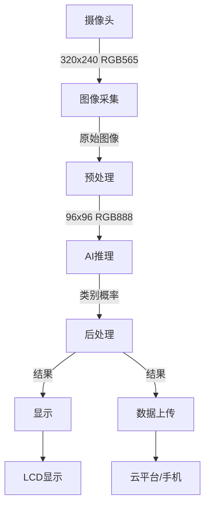

# 智能视觉识别项目：从图像采集到AI推理的完整实现


## 项目概述

### 项目简介

本项目将带你构建一个完整的嵌入式智能视觉识别系统，能够实时采集图像、检测目标、识别分类，并通过显示屏或网络接口输出结果。这是一个综合性项目，涵盖了从硬件选型、图像采集、模型训练、模型优化到系统集成的完整流程。

**系统功能**：
- 实时图像采集（摄像头）
- 目标检测（检测图像中的物体）
- 图像分类（识别物体类别）
- 结果显示（LCD/OLED显示）
- 数据上传（WiFi/蓝牙）
- 性能监控（FPS、延迟、准确率）

**应用场景**：
- 智能门禁（人脸识别）
- 工业质检（缺陷检测）
- 智能家居（手势识别）
- 安防监控（异常检测）
- 农业监测（作物识别）

### 项目演示

系统工作流程：

```
摄像头采集 → 图像预处理 → AI推理 → 结果后处理 → 显示/上传
    ↓            ↓            ↓           ↓            ↓
  30FPS      缩放/裁剪    TFLite模型   解析输出    实时显示
```

**性能指标**：
- 图像分辨率：320x240 RGB
- 推理速度：15-30 FPS
- 检测精度：>85%
- 端到端延迟：<100ms
- 功耗：<2W

### 学习目标

完成本项目后，你将掌握：

- [ ] **硬件集成**：摄像头接口、显示屏驱动、系统集成
- [ ] **图像处理**：图像采集、预处理、格式转换
- [ ] **模型训练**：数据集准备、模型训练、模型评估
- [ ] **模型优化**：量化、剪枝、性能调优
- [ ] **AI推理**：TFLite部署、推理优化、结果解析
- [ ] **系统设计**：架构设计、任务调度、错误处理
- [ ] **性能优化**：内存优化、速度优化、功耗优化
- [ ] **调试技巧**：性能分析、问题定位、系统调优


## 项目特点

- ✨ **完整的端到端实现**：从硬件到软件，从训练到部署的完整流程
- ✨ **实时性能**：优化后可达到15-30 FPS的实时推理速度
- ✨ **低功耗设计**：适合电池供电的移动设备
- ✨ **模块化架构**：易于扩展和定制
- ✨ **多平台支持**：支持ESP32、STM32、树莓派等多种平台
- ✨ **实用性强**：可直接应用于实际项目

## 技术栈

### 硬件平台
- **主控芯片**：ESP32-S3 (推荐) / STM32H7 / 树莓派4
- **摄像头**：OV2640 / OV5640 / 树莓派摄像头
- **显示屏**：SPI TFT LCD (2.4"/2.8") / OLED
- **存储**：SD卡 (用于存储模型和图像)
- **通信**：WiFi / 蓝牙 (可选)

### 软件技术
- **开发语言**：Python (训练), C/C++ (部署)
- **AI框架**：TensorFlow / Keras
- **推理引擎**：TensorFlow Lite Micro
- **图像处理**：OpenCV (训练), 自定义库 (部署)
- **开发工具**：Arduino IDE / PlatformIO / STM32CubeIDE

### 第三方库
- TensorFlow Lite Micro
- ESP32 Camera Driver / STM32 DCMI
- LVGL (GUI库，可选)
- ArduinoJSON (数据格式化)

## 硬件清单

### 必需硬件

| 名称 | 型号 | 数量 | 用途 | 参考价格 | 购买链接 |
|------|------|------|------|----------|----------|
| 开发板 | ESP32-S3-DevKitC | 1 | 主控制器 | ¥50 | [淘宝] |
| 摄像头模块 | OV2640 | 1 | 图像采集 | ¥25 | [淘宝] |
| LCD显示屏 | 2.8" SPI TFT | 1 | 结果显示 | ¥30 | [淘宝] |
| SD卡模块 | MicroSD | 1 | 存储模型 | ¥5 | [淘宝] |
| SD卡 | 8GB Class 10 | 1 | 数据存储 | ¥15 | [淘宝] |
| 电源模块 | 5V 2A | 1 | 供电 | ¥10 | [淘宝] |
| 杜邦线 | 若干 | 1套 | 连接 | ¥5 | [淘宝] |

### 可选硬件

| 名称 | 型号 | 数量 | 用途 | 参考价格 |
|------|------|------|------|----------|
| 外壳 | 3D打印 | 1 | 保护电路 | ¥20 |
| 按键模块 | 4键 | 1 | 用户交互 | ¥5 |
| LED指示灯 | RGB LED | 1 | 状态指示 | ¥2 |
| 电池 | 18650 + 充电模块 | 1套 | 移动供电 | ¥30 |

**总成本**：约 ¥140-200

### 平台选择建议

**ESP32-S3** (推荐新手):
- ✅ 价格便宜 (~¥50)
- ✅ 集成WiFi/蓝牙
- ✅ 512KB SRAM, 8MB Flash
- ✅ Arduino生态完善
- ⚠️ 性能中等 (15-20 FPS)

**STM32H7**:
- ✅ 性能强大 (25-30 FPS)
- ✅ 1MB SRAM, 2MB Flash
- ✅ 专业开发工具
- ⚠️ 价格较高 (~¥100)
- ⚠️ 学习曲线陡峭

**树莓派4**:
- ✅ 性能最强 (30+ FPS)
- ✅ 完整Linux系统
- ✅ 丰富的库支持
- ⚠️ 功耗较高 (~5W)
- ⚠️ 价格较高 (~¥300)


## 软件要求

### 开发环境 (PC端)
- **Python 3.8+** (模型训练)
- **TensorFlow 2.10+** (深度学习框架)
- **OpenCV 4.5+** (图像处理)
- **Jupyter Notebook** (交互式开发)
- **Git** (版本控制)

### 嵌入式开发环境
- **Arduino IDE 2.0+** (ESP32开发)
- **PlatformIO** (推荐，更专业)
- **STM32CubeIDE** (STM32开发)
- **串口调试工具** (查看日志)

### Python依赖库

```bash
# 安装必需的Python库
pip install tensorflow==2.13.0
pip install opencv-python
pip install numpy
pip install matplotlib
pip install pillow
pip install scikit-learn
pip install jupyter
```

### 嵌入式库

**ESP32**:
```bash
# Arduino IDE库管理器安装
- TensorFlowLite_ESP32
- ESP32 Camera Driver
- TFT_eSPI (显示驱动)
- ArduinoJson
```

**STM32**:
- X-CUBE-AI (STM32的AI工具包)
- STM32 HAL库
- DCMI驱动
- LCD驱动库

## 系统架构

### 整体架构

```
┌─────────────────────────────────────────────────────────┐
│                    应用层                                │
│  ┌──────────────┐  ┌──────────────┐  ┌──────────────┐ │
│  │ UI管理       │  │ 结果处理     │  │ 数据上传     │ │
│  └──────────────┘  └──────────────┘  └──────────────┘ │
├─────────────────────────────────────────────────────────┤
│                    AI推理层                              │
│  ┌──────────────┐  ┌──────────────┐  ┌──────────────┐ │
│  │ 模型加载     │  │ 推理引擎     │  │ 后处理       │ │
│  └──────────────┘  └──────────────┘  └──────────────┘ │
├─────────────────────────────────────────────────────────┤
│                    图像处理层                            │
│  ┌──────────────┐  ┌──────────────┐  ┌──────────────┐ │
│  │ 图像采集     │  │ 预处理       │  │ 格式转换     │ │
│  └──────────────┘  └──────────────┘  └──────────────┘ │
├─────────────────────────────────────────────────────────┤
│                    硬件驱动层                            │
│  ┌──────────────┐  ┌──────────────┐  ┌──────────────┐ │
│  │ 摄像头驱动   │  │ 显示驱动     │  │ 存储驱动     │ │
│  └──────────────┘  └──────────────┘  └──────────────┘ │
└─────────────────────────────────────────────────────────┘
```

### 核心模块说明

#### 1. 图像采集模块
- **功能**：从摄像头获取图像数据
- **接口**：DCMI / SPI / I2C (取决于摄像头)
- **分辨率**：320x240 RGB565
- **帧率**：30 FPS (采集), 15-30 FPS (推理)
- **缓冲**：双缓冲机制

#### 2. 图像预处理模块
- **功能**：图像缩放、裁剪、归一化
- **输入**：320x240 RGB565
- **输出**：96x96 RGB888 (模型输入)
- **处理**：
  - 格式转换 (RGB565 → RGB888)
  - 缩放 (320x240 → 96x96)
  - 归一化 (0-255 → 0-1 或 -1-1)

#### 3. AI推理模块
- **功能**：执行神经网络推理
- **引擎**：TensorFlow Lite Micro
- **模型**：MobileNetV2 (量化)
- **输入**：96x96x3 uint8
- **输出**：类别概率 (10类)
- **性能**：50-100ms/帧

#### 4. 结果处理模块
- **功能**：解析推理结果，生成可读输出
- **处理**：
  - 概率排序
  - 置信度过滤
  - 类别映射
  - 结果格式化

#### 5. 显示模块
- **功能**：显示图像和识别结果
- **接口**：SPI (TFT LCD)
- **内容**：
  - 实时图像预览
  - 识别结果文本
  - 置信度条形图
  - FPS和延迟信息

#### 6. 通信模块 (可选)
- **功能**：上传结果到云端或手机
- **协议**：MQTT / HTTP / WebSocket
- **数据**：JSON格式
- **频率**：1次/秒 (避免频繁上传)

### 数据流图



### 内存分配

典型内存使用 (ESP32-S3, 512KB SRAM):

```
总内存: 512 KB
├─ 系统保留: 100 KB (20%)
├─ 图像缓冲: 150 KB (30%)
│  ├─ 采集缓冲: 75 KB (320x240x2)
│  └─ 处理缓冲: 75 KB (96x96x3 + 临时)
├─ 模型权重: 150 KB (30%)
├─ Tensor Arena: 80 KB (16%)
└─ 应用代码: 32 KB (6%)
```


## 电路设计

### 接线图 (ESP32-S3 + OV2640 + TFT LCD)

```
ESP32-S3          OV2640 Camera
---------         -------------
3.3V     -------> VCC
GND      -------> GND
GPIO4    -------> SDA (I2C)
GPIO5    -------> SCL (I2C)
GPIO15   -------> XCLK
GPIO16   -------> PCLK
GPIO17   -------> VSYNC
GPIO18   -------> HREF
GPIO19   -------> D0
GPIO20   -------> D1
GPIO21   -------> D2
GPIO22   -------> D3
GPIO23   -------> D4
GPIO24   -------> D5
GPIO25   -------> D6
GPIO26   -------> D7
GPIO27   -------> RESET
GPIO32   -------> PWDN

ESP32-S3          TFT LCD (SPI)
---------         -------------
3.3V     -------> VCC
GND      -------> GND
GPIO13   -------> SCK (SPI CLK)
GPIO11   -------> MOSI (SPI DATA)
GPIO10   -------> CS (Chip Select)
GPIO9    -------> DC (Data/Command)
GPIO8    -------> RST (Reset)
GPIO14   -------> BL (Backlight)

ESP32-S3          SD Card (SPI)
---------         -------------
3.3V     -------> VCC
GND      -------> GND
GPIO13   -------> SCK
GPIO11   -------> MOSI
GPIO12   -------> MISO
GPIO7    -------> CS
```

### 电源设计

**电源需求**：
- ESP32-S3: 500mA @ 3.3V
- OV2640: 100mA @ 3.3V
- TFT LCD: 100mA @ 3.3V
- 总计: ~700mA @ 3.3V

**推荐电源方案**：
1. USB供电 (5V 2A) + LDO (AMS1117-3.3)
2. 锂电池 (3.7V) + 升压模块 (5V) + LDO (3.3V)
3. 直接3.3V稳压电源

### PCB设计建议

如果制作PCB，注意以下要点：

1. **电源**：
   - 使用足够粗的电源走线 (≥20mil)
   - 添加去耦电容 (0.1uF + 10uF)
   - 电源和地平面分离

2. **摄像头接口**：
   - 数据线等长
   - 添加串联电阻 (22-33Ω)
   - 远离高频信号

3. **SPI接口**：
   - 走线尽量短
   - 添加上拉电阻 (10kΩ)
   - 使用屏蔽

## 实现步骤

### 阶段1：环境搭建 (预计1小时)

#### 1.1 硬件组装

**步骤**：

1. **准备工作台**
   - 清理工作区域
   - 准备防静电手环
   - 准备必要工具

2. **连接摄像头**
   - 按照接线图连接OV2640
   - 确保连接牢固
   - 检查引脚对应关系

3. **连接显示屏**
   - 连接TFT LCD的SPI接口
   - 连接电源和控制引脚
   - 测试背光

4. **连接SD卡模块**
   - 连接SPI接口
   - 插入SD卡
   - 格式化为FAT32

5. **供电测试**
   - 连接USB电源
   - 检查电压 (3.3V)
   - 观察LED指示灯

**检查清单**：
- [ ] 所有连接正确无误
- [ ] 电源电压正常 (3.3V)
- [ ] 无短路现象
- [ ] LED指示灯亮起
- [ ] 摄像头和LCD无物理损坏

#### 1.2 软件环境配置

**PC端环境**：

```bash
# 1. 创建项目目录
mkdir vision-recognition-project
cd vision-recognition-project

# 2. 创建Python虚拟环境
python -m venv venv
source venv/bin/activate  # Windows: venv\Scripts\activate

# 3. 安装依赖
pip install tensorflow==2.13.0
pip install opencv-python
pip install numpy matplotlib pillow
pip install jupyter

# 4. 验证安装
python -c "import tensorflow as tf; print(tf.__version__)"
python -c "import cv2; print(cv2.__version__)"
```

**Arduino IDE配置** (ESP32):

```bash
# 1. 安装Arduino IDE 2.0+
# 下载: https://www.arduino.cc/en/software

# 2. 添加ESP32开发板支持
# 文件 → 首选项 → 附加开发板管理器网址
# 添加: https://raw.githubusercontent.com/espressif/arduino-esp32/gh-pages/package_esp32_index.json

# 3. 安装ESP32开发板
# 工具 → 开发板 → 开发板管理器
# 搜索"ESP32"并安装

# 4. 安装必需库
# 工具 → 管理库
# 安装:
# - TensorFlowLite_ESP32
# - TFT_eSPI
# - ArduinoJson
```

#### 1.3 测试硬件

**摄像头测试**：

```cpp
// camera_test.ino
#include "esp_camera.h"

// 摄像头引脚定义 (ESP32-S3)
#define PWDN_GPIO_NUM     32
#define RESET_GPIO_NUM    27
#define XCLK_GPIO_NUM     15
#define SIOD_GPIO_NUM     4
#define SIOC_GPIO_NUM     5
#define Y9_GPIO_NUM       26
#define Y8_GPIO_NUM       25
#define Y7_GPIO_NUM       24
#define Y6_GPIO_NUM       23
#define Y5_GPIO_NUM       22
#define Y4_GPIO_NUM       21
#define Y3_GPIO_NUM       20
#define Y2_GPIO_NUM       19
#define VSYNC_GPIO_NUM    17
#define HREF_GPIO_NUM     18
#define PCLK_GPIO_NUM     16

void setup() {
  Serial.begin(115200);
  Serial.println("Camera Test");
  
  // 摄像头配置
  camera_config_t config;
  config.ledc_channel = LEDC_CHANNEL_0;
  config.ledc_timer = LEDC_TIMER_0;
  config.pin_d0 = Y2_GPIO_NUM;
  config.pin_d1 = Y3_GPIO_NUM;
  config.pin_d2 = Y4_GPIO_NUM;
  config.pin_d3 = Y5_GPIO_NUM;
  config.pin_d4 = Y6_GPIO_NUM;
  config.pin_d5 = Y7_GPIO_NUM;
  config.pin_d6 = Y8_GPIO_NUM;
  config.pin_d7 = Y9_GPIO_NUM;
  config.pin_xclk = XCLK_GPIO_NUM;
  config.pin_pclk = PCLK_GPIO_NUM;
  config.pin_vsync = VSYNC_GPIO_NUM;
  config.pin_href = HREF_GPIO_NUM;
  config.pin_sscb_sda = SIOD_GPIO_NUM;
  config.pin_sscb_scl = SIOC_GPIO_NUM;
  config.pin_pwdn = PWDN_GPIO_NUM;
  config.pin_reset = RESET_GPIO_NUM;
  config.xclk_freq_hz = 20000000;
  config.pixel_format = PIXFORMAT_RGB565;
  config.frame_size = FRAMESIZE_QVGA;  // 320x240
  config.jpeg_quality = 12;
  config.fb_count = 2;
  
  // 初始化摄像头
  esp_err_t err = esp_camera_init(&config);
  if (err != ESP_OK) {
    Serial.printf("Camera init failed: 0x%x\n", err);
    return;
  }
  
  Serial.println("Camera initialized successfully!");
}

void loop() {
  // 采集一帧
  camera_fb_t *fb = esp_camera_fb_get();
  if (!fb) {
    Serial.println("Camera capture failed");
    delay(1000);
    return;
  }
  
  Serial.printf("Frame captured: %dx%d, size=%d bytes\n",
                fb->width, fb->height, fb->len);
  
  // 释放帧缓冲
  esp_camera_fb_return(fb);
  
  delay(1000);
}
```

**LCD测试**：

```cpp
// lcd_test.ino
#include <TFT_eSPI.h>

TFT_eSPI tft = TFT_eSPI();

void setup() {
  Serial.begin(115200);
  
  // 初始化LCD
  tft.init();
  tft.setRotation(1);  // 横屏
  tft.fillScreen(TFT_BLACK);
  
  // 显示测试文本
  tft.setTextColor(TFT_WHITE, TFT_BLACK);
  tft.setTextSize(2);
  tft.setCursor(10, 10);
  tft.println("LCD Test");
  
  // 绘制彩色矩形
  tft.fillRect(10, 50, 100, 50, TFT_RED);
  tft.fillRect(120, 50, 100, 50, TFT_GREEN);
  tft.fillRect(230, 50, 100, 50, TFT_BLUE);
  
  Serial.println("LCD initialized!");
}

void loop() {
  // 显示随机像素
  int x = random(tft.width());
  int y = random(tft.height());
  uint16_t color = random(0xFFFF);
  tft.drawPixel(x, y, color);
  
  delay(10);
}
```

上传并运行测试程序，确认硬件工作正常。


### 阶段2：数据集准备和模型训练 (预计3小时)

#### 2.1 选择识别任务

本项目我们实现一个**手势识别系统**，识别5种常见手势：
- ✊ 拳头 (Fist)
- ✋ 手掌 (Palm)
- ✌️ 胜利 (Victory)
- 👍 点赞 (Thumbs Up)
- 👌 OK手势 (OK)

**为什么选择手势识别**：
- 数据易于采集
- 实用性强
- 识别难度适中
- 可扩展性好

#### 2.2 数据采集

**方法1：使用现有数据集**

```python
# download_dataset.py
import tensorflow as tf
import tensorflow_datasets as tfds
import os

# 使用Rock-Paper-Scissors数据集作为基础
# 然后添加自己的手势类别

def download_rps_dataset():
    """下载石头剪刀布数据集"""
    dataset, info = tfds.load(
        'rock_paper_scissors',
        with_info=True,
        as_supervised=True
    )
    
    print(f"Dataset info: {info}")
    print(f"Train samples: {info.splits['train'].num_examples}")
    print(f"Test samples: {info.splits['test'].num_examples}")
    
    return dataset

# 下载数据集
dataset = download_rps_dataset()
```

**方法2：自己采集数据** (推荐)

使用摄像头采集自己的手势数据：

```python
# collect_data.py
import cv2
import os
import time
import numpy as np

class DataCollector:
    """数据采集工具"""
    
    def __init__(self, save_dir='dataset'):
        self.save_dir = save_dir
        self.gestures = ['fist', 'palm', 'victory', 'thumbs_up', 'ok']
        
        # 创建目录
        for gesture in self.gestures:
            os.makedirs(f'{save_dir}/train/{gesture}', exist_ok=True)
            os.makedirs(f'{save_dir}/val/{gesture}', exist_ok=True)
    
    def collect_gesture(self, gesture_name, num_samples=200, split='train'):
        """采集单个手势的数据"""
        print(f"\n采集手势: {gesture_name}")
        print(f"目标数量: {num_samples}")
        print("按 's' 开始采集, 'q' 退出")
        
        cap = cv2.VideoCapture(0)
        cap.set(cv2.CAP_PROP_FRAME_WIDTH, 640)
        cap.set(cv2.CAP_PROP_FRAME_HEIGHT, 480)
        
        count = 0
        collecting = False
        
        while count < num_samples:
            ret, frame = cap.read()
            if not ret:
                break
            
            # 显示采集区域
            h, w = frame.shape[:2]
            roi_size = 300
            x1 = (w - roi_size) // 2
            y1 = (h - roi_size) // 2
            x2 = x1 + roi_size
            y2 = y1 + roi_size
            
            cv2.rectangle(frame, (x1, y1), (x2, y2), (0, 255, 0), 2)
            
            # 显示信息
            info_text = f"Gesture: {gesture_name} | Count: {count}/{num_samples}"
            cv2.putText(frame, info_text, (10, 30),
                       cv2.FONT_HERSHEY_SIMPLEX, 0.7, (0, 255, 0), 2)
            
            if collecting:
                cv2.putText(frame, "COLLECTING...", (10, 60),
                           cv2.FONT_HERSHEY_SIMPLEX, 0.7, (0, 0, 255), 2)
            else:
                cv2.putText(frame, "Press 's' to start", (10, 60),
                           cv2.FONT_HERSHEY_SIMPLEX, 0.7, (255, 255, 0), 2)
            
            cv2.imshow('Data Collection', frame)
            
            key = cv2.waitKey(1) & 0xFF
            
            if key == ord('s'):
                collecting = True
                print("开始采集...")
            elif key == ord('q'):
                break
            
            # 采集图像
            if collecting:
                # 提取ROI
                roi = frame[y1:y2, x1:x2]
                
                # 保存图像
                filename = f'{self.save_dir}/{split}/{gesture_name}/{count:04d}.jpg'
                cv2.imwrite(filename, roi)
                
                count += 1
                
                # 短暂延迟，避免采集重复图像
                time.sleep(0.1)
        
        cap.release()
        cv2.destroyAllWindows()
        
        print(f"采集完成! 共采集 {count} 张图像")
    
    def collect_all(self, samples_per_gesture=200):
        """采集所有手势数据"""
        for gesture in self.gestures:
            input(f"\n准备采集 '{gesture}' 手势，按Enter继续...")
            
            # 训练集
            self.collect_gesture(gesture, int(samples_per_gesture * 0.8), 'train')
            
            # 验证集
            input(f"\n准备采集 '{gesture}' 验证集，按Enter继续...")
            self.collect_gesture(gesture, int(samples_per_gesture * 0.2), 'val')

# 使用示例
if __name__ == "__main__":
    collector = DataCollector('gesture_dataset')
    collector.collect_all(samples_per_gesture=200)
```

运行数据采集：

```bash
python collect_data.py
```

**采集建议**：
- 每个手势至少200张图像
- 变换手的位置、角度、距离
- 不同光照条件
- 不同背景
- 左右手都采集

#### 2.3 数据增强

```python
# data_augmentation.py
import tensorflow as tf
import numpy as np
import matplotlib.pyplot as plt

def create_augmentation_pipeline():
    """创建数据增强管道"""
    data_augmentation = tf.keras.Sequential([
        # 随机翻转
        tf.keras.layers.RandomFlip("horizontal"),
        
        # 随机旋转
        tf.keras.layers.RandomRotation(0.2),
        
        # 随机缩放
        tf.keras.layers.RandomZoom(0.2),
        
        # 随机平移
        tf.keras.layers.RandomTranslation(0.1, 0.1),
        
        # 随机亮度
        tf.keras.layers.RandomBrightness(0.2),
        
        # 随机对比度
        tf.keras.layers.RandomContrast(0.2),
    ])
    
    return data_augmentation

def visualize_augmentation(image_path, num_samples=9):
    """可视化数据增强效果"""
    # 加载图像
    image = tf.io.read_file(image_path)
    image = tf.image.decode_jpeg(image, channels=3)
    image = tf.image.resize(image, [96, 96])
    image = tf.cast(image, tf.float32) / 255.0
    
    # 创建增强管道
    augmentation = create_augmentation_pipeline()
    
    # 生成增强样本
    plt.figure(figsize=(10, 10))
    for i in range(num_samples):
        augmented = augmentation(tf.expand_dims(image, 0))
        plt.subplot(3, 3, i + 1)
        plt.imshow(augmented[0])
        plt.axis('off')
    
    plt.tight_layout()
    plt.savefig('augmentation_examples.png')
    plt.show()

# 测试数据增强
visualize_augmentation('gesture_dataset/train/fist/0000.jpg')
```

#### 2.4 构建训练数据集

```python
# prepare_dataset.py
import tensorflow as tf
import os

def create_dataset(data_dir, batch_size=32, img_size=(96, 96)):
    """创建训练数据集"""
    
    # 使用image_dataset_from_directory
    train_ds = tf.keras.utils.image_dataset_from_directory(
        os.path.join(data_dir, 'train'),
        image_size=img_size,
        batch_size=batch_size,
        label_mode='int',
        shuffle=True,
        seed=42
    )
    
    val_ds = tf.keras.utils.image_dataset_from_directory(
        os.path.join(data_dir, 'val'),
        image_size=img_size,
        batch_size=batch_size,
        label_mode='int',
        shuffle=False,
        seed=42
    )
    
    # 获取类别名称
    class_names = train_ds.class_names
    print(f"Classes: {class_names}")
    
    # 归一化
    normalization_layer = tf.keras.layers.Rescaling(1./255)
    train_ds = train_ds.map(lambda x, y: (normalization_layer(x), y))
    val_ds = val_ds.map(lambda x, y: (normalization_layer(x), y))
    
    # 性能优化
    AUTOTUNE = tf.data.AUTOTUNE
    train_ds = train_ds.cache().prefetch(buffer_size=AUTOTUNE)
    val_ds = val_ds.cache().prefetch(buffer_size=AUTOTUNE)
    
    return train_ds, val_ds, class_names

# 创建数据集
train_ds, val_ds, class_names = create_dataset('gesture_dataset')

# 查看数据集信息
for images, labels in train_ds.take(1):
    print(f"Image batch shape: {images.shape}")
    print(f"Label batch shape: {labels.shape}")
```


#### 2.5 模型训练

```python
# train_model.py
import tensorflow as tf
from tensorflow import keras
import matplotlib.pyplot as plt

def create_model(num_classes=5, input_shape=(96, 96, 3)):
    """创建MobileNetV2模型"""
    
    # 数据增强层
    data_augmentation = keras.Sequential([
        keras.layers.RandomFlip("horizontal"),
        keras.layers.RandomRotation(0.2),
        keras.layers.RandomZoom(0.2),
    ])
    
    # 使用预训练的MobileNetV2作为基础
    base_model = keras.applications.MobileNetV2(
        input_shape=input_shape,
        include_top=False,
        weights='imagenet'
    )
    
    # 冻结基础模型
    base_model.trainable = False
    
    # 构建完整模型
    model = keras.Sequential([
        keras.layers.Input(shape=input_shape),
        data_augmentation,
        
        # 预处理层 (MobileNetV2需要)
        keras.applications.mobilenet_v2.preprocess_input,
        
        # 基础模型
        base_model,
        
        # 分类头
        keras.layers.GlobalAveragePooling2D(),
        keras.layers.Dropout(0.2),
        keras.layers.Dense(num_classes, activation='softmax')
    ])
    
    return model

def train_model(train_ds, val_ds, num_classes=5, epochs=20):
    """训练模型"""
    
    # 创建模型
    model = create_model(num_classes=num_classes)
    
    # 编译模型
    model.compile(
        optimizer=keras.optimizers.Adam(learning_rate=0.001),
        loss='sparse_categorical_crossentropy',
        metrics=['accuracy']
    )
    
    # 显示模型结构
    model.summary()
    
    # 回调函数
    callbacks = [
        # 早停
        keras.callbacks.EarlyStopping(
            monitor='val_loss',
            patience=5,
            restore_best_weights=True
        ),
        
        # 学习率衰减
        keras.callbacks.ReduceLROnPlateau(
            monitor='val_loss',
            factor=0.5,
            patience=3,
            min_lr=1e-7
        ),
        
        # 模型检查点
        keras.callbacks.ModelCheckpoint(
            'best_model.h5',
            monitor='val_accuracy',
            save_best_only=True,
            verbose=1
        ),
        
        # TensorBoard
        keras.callbacks.TensorBoard(
            log_dir='logs',
            histogram_freq=1
        )
    ]
    
    # 训练模型
    print("\n开始训练...")
    history = model.fit(
        train_ds,
        validation_data=val_ds,
        epochs=epochs,
        callbacks=callbacks,
        verbose=1
    )
    
    return model, history

def fine_tune_model(model, train_ds, val_ds, epochs=10):
    """微调模型"""
    
    # 解冻基础模型的部分层
    base_model = model.layers[3]  # MobileNetV2层
    base_model.trainable = True
    
    # 冻结前100层
    for layer in base_model.layers[:100]:
        layer.trainable = False
    
    # 重新编译（使用更小的学习率）
    model.compile(
        optimizer=keras.optimizers.Adam(learning_rate=1e-5),
        loss='sparse_categorical_crossentropy',
        metrics=['accuracy']
    )
    
    print("\n开始微调...")
    history_fine = model.fit(
        train_ds,
        validation_data=val_ds,
        epochs=epochs,
        verbose=1
    )
    
    return model, history_fine

def plot_training_history(history, history_fine=None):
    """绘制训练历史"""
    
    acc = history.history['accuracy']
    val_acc = history.history['val_accuracy']
    loss = history.history['loss']
    val_loss = history.history['val_loss']
    
    if history_fine:
        acc += history_fine.history['accuracy']
        val_acc += history_fine.history['val_accuracy']
        loss += history_fine.history['loss']
        val_loss += history_fine.history['val_loss']
    
    epochs_range = range(len(acc))
    
    plt.figure(figsize=(12, 4))
    
    # 准确率
    plt.subplot(1, 2, 1)
    plt.plot(epochs_range, acc, label='Training Accuracy')
    plt.plot(epochs_range, val_acc, label='Validation Accuracy')
    plt.legend(loc='lower right')
    plt.title('Training and Validation Accuracy')
    plt.xlabel('Epoch')
    plt.ylabel('Accuracy')
    
    # 损失
    plt.subplot(1, 2, 2)
    plt.plot(epochs_range, loss, label='Training Loss')
    plt.plot(epochs_range, val_loss, label='Validation Loss')
    plt.legend(loc='upper right')
    plt.title('Training and Validation Loss')
    plt.xlabel('Epoch')
    plt.ylabel('Loss')
    
    plt.tight_layout()
    plt.savefig('training_history.png')
    plt.show()

# 主训练流程
if __name__ == "__main__":
    # 加载数据集
    from prepare_dataset import create_dataset
    train_ds, val_ds, class_names = create_dataset('gesture_dataset')
    
    # 初始训练
    model, history = train_model(train_ds, val_ds, num_classes=len(class_names), epochs=20)
    
    # 微调
    model, history_fine = fine_tune_model(model, train_ds, val_ds, epochs=10)
    
    # 保存最终模型
    model.save('gesture_model_final.h5')
    
    # 绘制训练历史
    plot_training_history(history, history_fine)
    
    # 评估模型
    test_loss, test_acc = model.evaluate(val_ds)
    print(f"\n最终测试准确率: {test_acc*100:.2f}%")
```

运行训练：

```bash
python train_model.py
```

**预期结果**：
- 训练准确率: >95%
- 验证准确率: >90%
- 训练时间: 20-30分钟 (GPU) / 2-3小时 (CPU)


### 阶段3：模型优化和转换 (预计2小时)

#### 3.1 模型量化

```python
# quantize_model.py
import tensorflow as tf
import numpy as np
from prepare_dataset import create_dataset

def convert_to_tflite(model_path, output_path, quantize=True):
    """转换模型为TFLite格式"""
    
    # 加载模型
    model = tf.keras.models.load_model(model_path)
    
    # 创建转换器
    converter = tf.lite.TFLiteConverter.from_keras_model(model)
    
    if quantize:
        # 全整数量化
        converter.optimizations = [tf.lite.Optimize.DEFAULT]
        
        # 代表性数据集
        def representative_dataset():
            train_ds, _, _ = create_dataset('gesture_dataset', batch_size=1)
            for images, _ in train_ds.take(100):
                yield [images]
        
        converter.representative_dataset = representative_dataset
        
        # 设置为全整数量化
        converter.target_spec.supported_ops = [tf.lite.OpsSet.TFLITE_BUILTINS_INT8]
        converter.inference_input_type = tf.uint8
        converter.inference_output_type = tf.uint8
    
    # 转换
    tflite_model = converter.convert()
    
    # 保存
    with open(output_path, 'wb') as f:
        f.write(tflite_model)
    
    print(f"TFLite model saved: {output_path}")
    print(f"Model size: {len(tflite_model) / 1024:.2f} KB")
    
    return tflite_model

# 转换模型
tflite_model = convert_to_tflite(
    'gesture_model_final.h5',
    'gesture_model_quantized.tflite',
    quantize=True
)
```

#### 3.2 验证量化模型

```python
# verify_quantized_model.py
import tensorflow as tf
import numpy as np
from prepare_dataset import create_dataset

def evaluate_tflite_model(tflite_path, test_ds):
    """评估TFLite模型"""
    
    # 加载TFLite模型
    interpreter = tf.lite.Interpreter(model_path=tflite_path)
    interpreter.allocate_tensors()
    
    # 获取输入输出详情
    input_details = interpreter.get_input_details()
    output_details = interpreter.get_output_details()
    
    print("Input details:")
    print(f"  Shape: {input_details[0]['shape']}")
    print(f"  Type: {input_details[0]['dtype']}")
    print(f"  Quantization: {input_details[0]['quantization']}")
    
    print("\nOutput details:")
    print(f"  Shape: {output_details[0]['shape']}")
    print(f"  Type: {output_details[0]['dtype']}")
    print(f"  Quantization: {output_details[0]['quantization']}")
    
    # 测试模型
    correct = 0
    total = 0
    
    for images, labels in test_ds:
        for i in range(len(images)):
            # 准备输入
            input_data = images[i:i+1].numpy()
            input_data = (input_data * 255).astype(np.uint8)
            
            # 推理
            interpreter.set_tensor(input_details[0]['index'], input_data)
            interpreter.invoke()
            
            # 获取输出
            output_data = interpreter.get_tensor(output_details[0]['index'])
            predicted = np.argmax(output_data[0])
            
            # 统计
            if predicted == labels[i].numpy():
                correct += 1
            total += 1
    
    accuracy = correct / total
    print(f"\nTFLite Model Accuracy: {accuracy*100:.2f}%")
    print(f"Correct: {correct}/{total}")
    
    return accuracy

# 评估量化模型
_, val_ds, class_names = create_dataset('gesture_dataset')
accuracy = evaluate_tflite_model('gesture_model_quantized.tflite', val_ds)
```

#### 3.3 转换为C数组

```python
# convert_to_c_array.py
def convert_tflite_to_c_array(tflite_path, output_path):
    """将TFLite模型转换为C数组"""
    
    with open(tflite_path, 'rb') as f:
        model_data = f.read()
    
    # 生成C头文件
    with open(output_path, 'w') as f:
        f.write('// Auto-generated file - do not edit\n')
        f.write('#ifndef GESTURE_MODEL_DATA_H\n')
        f.write('#define GESTURE_MODEL_DATA_H\n\n')
        
        f.write('#include <stdint.h>\n\n')
        
        f.write('// Model data\n')
        f.write('alignas(8) const uint8_t gesture_model_data[] = {\n')
        
        # 每行16个字节
        for i in range(0, len(model_data), 16):
            chunk = model_data[i:i+16]
            hex_str = ', '.join([f'0x{b:02x}' for b in chunk])
            f.write(f'  {hex_str},\n')
        
        f.write('};\n\n')
        
        f.write(f'const unsigned int gesture_model_data_len = {len(model_data)};\n\n')
        
        # 类别名称
        f.write('// Class names\n')
        f.write('const char* gesture_class_names[] = {\n')
        class_names = ['fist', 'palm', 'victory', 'thumbs_up', 'ok']
        for name in class_names:
            f.write(f'  "{name}",\n')
        f.write('};\n\n')
        
        f.write(f'const unsigned int num_classes = {len(class_names)};\n\n')
        
        f.write('#endif  // GESTURE_MODEL_DATA_H\n')
    
    print(f"C array saved: {output_path}")
    print(f"Model size: {len(model_data)} bytes ({len(model_data)/1024:.2f} KB)")

# 转换为C数组
convert_tflite_to_c_array(
    'gesture_model_quantized.tflite',
    'gesture_model_data.h'
)
```

#### 3.4 性能分析

```python
# analyze_model.py
import tensorflow as tf
import numpy as np
import time

def analyze_model_performance(tflite_path, num_iterations=100):
    """分析模型性能"""
    
    # 加载模型
    interpreter = tf.lite.Interpreter(model_path=tflite_path)
    interpreter.allocate_tensors()
    
    input_details = interpreter.get_input_details()
    output_details = interpreter.get_output_details()
    
    # 生成随机输入
    input_shape = input_details[0]['shape']
    test_input = np.random.randint(0, 256, size=input_shape, dtype=np.uint8)
    
    # 预热
    for _ in range(10):
        interpreter.set_tensor(input_details[0]['index'], test_input)
        interpreter.invoke()
    
    # 测试推理时间
    times = []
    for _ in range(num_iterations):
        start = time.perf_counter()
        interpreter.set_tensor(input_details[0]['index'], test_input)
        interpreter.invoke()
        elapsed = (time.perf_counter() - start) * 1000
        times.append(elapsed)
    
    # 统计
    times = np.array(times)
    
    print("\n=== Model Performance Analysis ===")
    print(f"Model: {tflite_path}")
    print(f"Input shape: {input_shape}")
    print(f"Iterations: {num_iterations}")
    print(f"\nInference Time:")
    print(f"  Mean: {np.mean(times):.2f} ms")
    print(f"  Std:  {np.std(times):.2f} ms")
    print(f"  Min:  {np.min(times):.2f} ms")
    print(f"  Max:  {np.max(times):.2f} ms")
    print(f"  Median: {np.median(times):.2f} ms")
    print(f"\nThroughput: {1000/np.mean(times):.2f} FPS")
    
    # 内存使用
    print(f"\nMemory Usage:")
    print(f"  Model size: {len(open(tflite_path, 'rb').read())/1024:.2f} KB")
    
    return {
        'mean_time': np.mean(times),
        'fps': 1000/np.mean(times)
    }

# 分析性能
stats = analyze_model_performance('gesture_model_quantized.tflite')
```

**优化目标**：
- 模型大小: <500 KB
- 推理时间: <100 ms (PC), <200 ms (ESP32)
- 准确率: >85%


### 阶段4：嵌入式系统实现 (预计4小时)

#### 4.1 项目结构

```
vision_recognition/
├── src/
│   ├── main.cpp                 # 主程序
│   ├── camera_handler.cpp       # 摄像头处理
│   ├── image_processor.cpp      # 图像预处理
│   ├── inference_engine.cpp     # AI推理引擎
│   ├── display_handler.cpp      # 显示处理
│   └── utils.cpp                # 工具函数
├── include/
│   ├── camera_handler.h
│   ├── image_processor.h
│   ├── inference_engine.h
│   ├── display_handler.h
│   ├── utils.h
│   └── gesture_model_data.h     # 模型数据
├── lib/
│   └── TensorFlowLite_ESP32/
└── platformio.ini               # 项目配置
```

#### 4.2 摄像头处理模块

```cpp
// camera_handler.h
#ifndef CAMERA_HANDLER_H
#define CAMERA_HANDLER_H

#include "esp_camera.h"
#include <Arduino.h>

class CameraHandler {
public:
    CameraHandler();
    bool init();
    camera_fb_t* captureFrame();
    void releaseFrame(camera_fb_t* fb);
    void printInfo();
    
private:
    bool initialized;
    camera_config_t config;
};

#endif
```

```cpp
// camera_handler.cpp
#include "camera_handler.h"

// 摄像头引脚定义
#define PWDN_GPIO_NUM     32
#define RESET_GPIO_NUM    27
#define XCLK_GPIO_NUM     15
#define SIOD_GPIO_NUM     4
#define SIOC_GPIO_NUM     5
#define Y9_GPIO_NUM       26
#define Y8_GPIO_NUM       25
#define Y7_GPIO_NUM       24
#define Y6_GPIO_NUM       23
#define Y5_GPIO_NUM       22
#define Y4_GPIO_NUM       21
#define Y3_GPIO_NUM       20
#define Y2_GPIO_NUM       19
#define VSYNC_GPIO_NUM    17
#define HREF_GPIO_NUM     18
#define PCLK_GPIO_NUM     16

CameraHandler::CameraHandler() : initialized(false) {}

bool CameraHandler::init() {
    // 配置摄像头
    config.ledc_channel = LEDC_CHANNEL_0;
    config.ledc_timer = LEDC_TIMER_0;
    config.pin_d0 = Y2_GPIO_NUM;
    config.pin_d1 = Y3_GPIO_NUM;
    config.pin_d2 = Y4_GPIO_NUM;
    config.pin_d3 = Y5_GPIO_NUM;
    config.pin_d4 = Y6_GPIO_NUM;
    config.pin_d5 = Y7_GPIO_NUM;
    config.pin_d6 = Y8_GPIO_NUM;
    config.pin_d7 = Y9_GPIO_NUM;
    config.pin_xclk = XCLK_GPIO_NUM;
    config.pin_pclk = PCLK_GPIO_NUM;
    config.pin_vsync = VSYNC_GPIO_NUM;
    config.pin_href = HREF_GPIO_NUM;
    config.pin_sscb_sda = SIOD_GPIO_NUM;
    config.pin_sscb_scl = SIOC_GPIO_NUM;
    config.pin_pwdn = PWDN_GPIO_NUM;
    config.pin_reset = RESET_GPIO_NUM;
    config.xclk_freq_hz = 20000000;
    config.pixel_format = PIXFORMAT_RGB565;
    config.frame_size = FRAMESIZE_QVGA;  // 320x240
    config.jpeg_quality = 12;
    config.fb_count = 2;
    config.grab_mode = CAMERA_GRAB_LATEST;
    
    // 初始化摄像头
    esp_err_t err = esp_camera_init(&config);
    if (err != ESP_OK) {
        Serial.printf("Camera init failed: 0x%x\n", err);
        return false;
    }
    
    // 获取传感器设置
    sensor_t* s = esp_camera_sensor_get();
    if (s) {
        // 调整图像质量
        s->set_brightness(s, 0);     // -2 to 2
        s->set_contrast(s, 0);       // -2 to 2
        s->set_saturation(s, 0);     // -2 to 2
        s->set_special_effect(s, 0); // 0 to 6
        s->set_whitebal(s, 1);       // 0 = disable, 1 = enable
        s->set_awb_gain(s, 1);       // 0 = disable, 1 = enable
        s->set_wb_mode(s, 0);        // 0 to 4
        s->set_exposure_ctrl(s, 1);  // 0 = disable, 1 = enable
        s->set_aec2(s, 0);           // 0 = disable, 1 = enable
        s->set_gain_ctrl(s, 1);      // 0 = disable, 1 = enable
        s->set_agc_gain(s, 0);       // 0 to 30
        s->set_gainceiling(s, (gainceiling_t)0);  // 0 to 6
        s->set_bpc(s, 0);            // 0 = disable, 1 = enable
        s->set_wpc(s, 1);            // 0 = disable, 1 = enable
        s->set_raw_gma(s, 1);        // 0 = disable, 1 = enable
        s->set_lenc(s, 1);           // 0 = disable, 1 = enable
        s->set_hmirror(s, 0);        // 0 = disable, 1 = enable
        s->set_vflip(s, 0);          // 0 = disable, 1 = enable
        s->set_dcw(s, 1);            // 0 = disable, 1 = enable
        s->set_colorbar(s, 0);       // 0 = disable, 1 = enable
    }
    
    initialized = true;
    Serial.println("Camera initialized successfully");
    return true;
}

camera_fb_t* CameraHandler::captureFrame() {
    if (!initialized) {
        return nullptr;
    }
    
    return esp_camera_fb_get();
}

void CameraHandler::releaseFrame(camera_fb_t* fb) {
    if (fb) {
        esp_camera_fb_return(fb);
    }
}

void CameraHandler::printInfo() {
    if (!initialized) {
        Serial.println("Camera not initialized");
        return;
    }
    
    sensor_t* s = esp_camera_sensor_get();
    if (s) {
        Serial.println("\n=== Camera Info ===");
        Serial.printf("Resolution: %dx%d\n", 
                     s->status.framesize == FRAMESIZE_QVGA ? 320 : 0,
                     s->status.framesize == FRAMESIZE_QVGA ? 240 : 0);
        Serial.printf("Pixel Format: RGB565\n");
        Serial.printf("Frame Buffers: 2\n");
    }
}
```

#### 4.3 图像预处理模块

```cpp
// image_processor.h
#ifndef IMAGE_PROCESSOR_H
#define IMAGE_PROCESSOR_H

#include <Arduino.h>
#include <stdint.h>

class ImageProcessor {
public:
    ImageProcessor(int input_width, int input_height, int output_width, int output_height);
    ~ImageProcessor();
    
    bool processImage(const uint8_t* input_rgb565, uint8_t* output_rgb888);
    void rgb565ToRgb888(const uint8_t* rgb565, uint8_t* rgb888, int width, int height);
    void resizeImage(const uint8_t* input, uint8_t* output, 
                    int in_w, int in_h, int out_w, int out_h);
    
private:
    int input_width;
    int input_height;
    int output_width;
    int output_height;
    uint8_t* temp_buffer;
};

#endif
```

```cpp
// image_processor.cpp
#include "image_processor.h"
#include <cstring>

ImageProcessor::ImageProcessor(int in_w, int in_h, int out_w, int out_h)
    : input_width(in_w), input_height(in_h), 
      output_width(out_w), output_height(out_h) {
    
    // 分配临时缓冲区
    temp_buffer = (uint8_t*)malloc(in_w * in_h * 3);
}

ImageProcessor::~ImageProcessor() {
    if (temp_buffer) {
        free(temp_buffer);
    }
}

void ImageProcessor::rgb565ToRgb888(const uint8_t* rgb565, uint8_t* rgb888, 
                                   int width, int height) {
    for (int i = 0; i < width * height; i++) {
        uint16_t pixel = ((uint16_t)rgb565[i*2+1] << 8) | rgb565[i*2];
        
        // 提取RGB分量
        uint8_t r = (pixel >> 11) & 0x1F;
        uint8_t g = (pixel >> 5) & 0x3F;
        uint8_t b = pixel & 0x1F;
        
        // 转换为8位
        rgb888[i*3+0] = (r << 3) | (r >> 2);  // R
        rgb888[i*3+1] = (g << 2) | (g >> 4);  // G
        rgb888[i*3+2] = (b << 3) | (b >> 2);  // B
    }
}

void ImageProcessor::resizeImage(const uint8_t* input, uint8_t* output,
                                int in_w, int in_h, int out_w, int out_h) {
    // 简单的最近邻插值
    float x_ratio = (float)in_w / out_w;
    float y_ratio = (float)in_h / out_h;
    
    for (int y = 0; y < out_h; y++) {
        for (int x = 0; x < out_w; x++) {
            int src_x = (int)(x * x_ratio);
            int src_y = (int)(y * y_ratio);
            
            int src_idx = (src_y * in_w + src_x) * 3;
            int dst_idx = (y * out_w + x) * 3;
            
            output[dst_idx + 0] = input[src_idx + 0];  // R
            output[dst_idx + 1] = input[src_idx + 1];  // G
            output[dst_idx + 2] = input[src_idx + 2];  // B
        }
    }
}

bool ImageProcessor::processImage(const uint8_t* input_rgb565, uint8_t* output_rgb888) {
    if (!input_rgb565 || !output_rgb888 || !temp_buffer) {
        return false;
    }
    
    // 步骤1: RGB565 → RGB888
    rgb565ToRgb888(input_rgb565, temp_buffer, input_width, input_height);
    
    // 步骤2: 缩放图像
    resizeImage(temp_buffer, output_rgb888, 
               input_width, input_height, 
               output_width, output_height);
    
    return true;
}
```


#### 4.4 AI推理引擎

```cpp
// inference_engine.h
#ifndef INFERENCE_ENGINE_H
#define INFERENCE_ENGINE_H

#include <TensorFlowLite_ESP32.h>
#include "tensorflow/lite/micro/micro_error_reporter.h"
#include "tensorflow/lite/micro/micro_interpreter.h"
#include "tensorflow/lite/micro/micro_mutable_op_resolver.h"
#include "tensorflow/lite/schema/schema_generated.h"
#include "gesture_model_data.h"

class InferenceEngine {
public:
    InferenceEngine();
    ~InferenceEngine();
    
    bool init();
    bool runInference(const uint8_t* input_data, float* output_scores);
    int getPredictedClass(const float* scores, int num_classes);
    float getConfidence(const float* scores, int predicted_class);
    void printMemoryUsage();
    
private:
    tflite::ErrorReporter* error_reporter;
    const tflite::Model* model;
    tflite::MicroInterpreter* interpreter;
    TfLiteTensor* input;
    TfLiteTensor* output;
    
    static constexpr int kTensorArenaSize = 150 * 1024;  // 150KB
    uint8_t* tensor_arena;
    
    bool initialized;
};

#endif
```

```cpp
// inference_engine.cpp
#include "inference_engine.h"

InferenceEngine::InferenceEngine() 
    : error_reporter(nullptr), model(nullptr), interpreter(nullptr),
      input(nullptr), output(nullptr), tensor_arena(nullptr), initialized(false) {
}

InferenceEngine::~InferenceEngine() {
    if (tensor_arena) {
        free(tensor_arena);
    }
}

bool InferenceEngine::init() {
    // 分配tensor arena
    tensor_arena = (uint8_t*)malloc(kTensorArenaSize);
    if (!tensor_arena) {
        Serial.println("Failed to allocate tensor arena");
        return false;
    }
    
    // 设置错误报告器
    static tflite::MicroErrorReporter micro_error_reporter;
    error_reporter = &micro_error_reporter;
    
    // 加载模型
    model = tflite::GetModel(gesture_model_data);
    if (model->version() != TFLITE_SCHEMA_VERSION) {
        Serial.printf("Model version %d not equal to supported version %d\n",
                     model->version(), TFLITE_SCHEMA_VERSION);
        return false;
    }
    
    // 创建算子解析器（只添加模型使用的算子）
    static tflite::MicroMutableOpResolver<10> micro_op_resolver;
    micro_op_resolver.AddConv2D();
    micro_op_resolver.AddDepthwiseConv2D();
    micro_op_resolver.AddFullyConnected();
    micro_op_resolver.AddReshape();
    micro_op_resolver.AddSoftmax();
    micro_op_resolver.AddQuantize();
    micro_op_resolver.AddDequantize();
    micro_op_resolver.AddMean();
    micro_op_resolver.AddPad();
    micro_op_resolver.AddRelu6();
    
    // 创建解释器
    static tflite::MicroInterpreter static_interpreter(
        model, micro_op_resolver, tensor_arena, kTensorArenaSize, error_reporter);
    interpreter = &static_interpreter;
    
    // 分配张量
    TfLiteStatus allocate_status = interpreter->AllocateTensors();
    if (allocate_status != kTfLiteOk) {
        Serial.println("AllocateTensors() failed");
        return false;
    }
    
    // 获取输入输出张量
    input = interpreter->input(0);
    output = interpreter->output(0);
    
    // 打印张量信息
    Serial.println("\n=== Model Info ===");
    Serial.printf("Input shape: [%d, %d, %d, %d]\n",
                 input->dims->data[0], input->dims->data[1],
                 input->dims->data[2], input->dims->data[3]);
    Serial.printf("Input type: %d\n", input->type);
    Serial.printf("Output shape: [%d, %d]\n",
                 output->dims->data[0], output->dims->data[1]);
    Serial.printf("Output type: %d\n", output->type);
    
    printMemoryUsage();
    
    initialized = true;
    Serial.println("Inference engine initialized successfully");
    return true;
}

bool InferenceEngine::runInference(const uint8_t* input_data, float* output_scores) {
    if (!initialized || !input_data || !output_scores) {
        return false;
    }
    
    // 复制输入数据
    memcpy(input->data.uint8, input_data, 
           input->dims->data[1] * input->dims->data[2] * input->dims->data[3]);
    
    // 执行推理
    TfLiteStatus invoke_status = interpreter->Invoke();
    if (invoke_status != kTfLiteOk) {
        Serial.println("Invoke failed");
        return false;
    }
    
    // 获取输出（反量化）
    int num_classes = output->dims->data[1];
    float output_scale = output->params.scale;
    int output_zero_point = output->params.zero_point;
    
    for (int i = 0; i < num_classes; i++) {
        int8_t quantized_value = output->data.uint8[i];
        output_scores[i] = (quantized_value - output_zero_point) * output_scale;
    }
    
    return true;
}

int InferenceEngine::getPredictedClass(const float* scores, int num_classes) {
    int max_idx = 0;
    float max_score = scores[0];
    
    for (int i = 1; i < num_classes; i++) {
        if (scores[i] > max_score) {
            max_score = scores[i];
            max_idx = i;
        }
    }
    
    return max_idx;
}

float InferenceEngine::getConfidence(const float* scores, int predicted_class) {
    return scores[predicted_class];
}

void InferenceEngine::printMemoryUsage() {
    Serial.println("\n=== Memory Usage ===");
    Serial.printf("Tensor arena size: %d bytes (%.2f KB)\n", 
                 kTensorArenaSize, kTensorArenaSize / 1024.0);
    Serial.printf("Arena used: %d bytes (%.2f KB)\n",
                 interpreter->arena_used_bytes(),
                 interpreter->arena_used_bytes() / 1024.0);
    Serial.printf("Free heap: %d bytes (%.2f KB)\n",
                 ESP.getFreeHeap(), ESP.getFreeHeap() / 1024.0);
}
```

#### 4.5 显示处理模块

```cpp
// display_handler.h
#ifndef DISPLAY_HANDLER_H
#define DISPLAY_HANDLER_H

#include <TFT_eSPI.h>
#include <Arduino.h>

class DisplayHandler {
public:
    DisplayHandler();
    bool init();
    void displayImage(const uint8_t* rgb888, int width, int height);
    void displayResult(const char* gesture, float confidence, float fps);
    void displayStatus(const char* message);
    void clear();
    
private:
    TFT_eSPI tft;
    bool initialized;
    
    void drawProgressBar(int x, int y, int width, int height, float value);
};

#endif
```

```cpp
// display_handler.cpp
#include "display_handler.h"

DisplayHandler::DisplayHandler() : initialized(false) {}

bool DisplayHandler::init() {
    tft.init();
    tft.setRotation(1);  // 横屏
    tft.fillScreen(TFT_BLACK);
    tft.setTextColor(TFT_WHITE, TFT_BLACK);
    
    initialized = true;
    Serial.println("Display initialized");
    return true;
}

void DisplayHandler::displayImage(const uint8_t* rgb888, int width, int height) {
    if (!initialized || !rgb888) return;
    
    // 显示图像（缩放到LCD大小）
    int lcd_width = tft.width();
    int lcd_height = tft.height();
    
    // 简单的缩放显示
    float scale_x = (float)lcd_width / width;
    float scale_y = (float)lcd_height / height;
    float scale = min(scale_x, scale_y);
    
    int display_width = width * scale;
    int display_height = height * scale;
    int offset_x = (lcd_width - display_width) / 2;
    int offset_y = (lcd_height - display_height) / 2;
    
    for (int y = 0; y < display_height; y++) {
        for (int x = 0; x < display_width; x++) {
            int src_x = x / scale;
            int src_y = y / scale;
            int idx = (src_y * width + src_x) * 3;
            
            uint8_t r = rgb888[idx + 0];
            uint8_t g = rgb888[idx + 1];
            uint8_t b = rgb888[idx + 2];
            
            uint16_t color = tft.color565(r, g, b);
            tft.drawPixel(offset_x + x, offset_y + y, color);
        }
    }
}

void DisplayHandler::displayResult(const char* gesture, float confidence, float fps) {
    if (!initialized) return;
    
    // 清除结果区域
    tft.fillRect(0, tft.height() - 80, tft.width(), 80, TFT_BLACK);
    
    // 显示手势名称
    tft.setTextSize(2);
    tft.setTextColor(TFT_GREEN, TFT_BLACK);
    tft.setCursor(10, tft.height() - 70);
    tft.printf("Gesture: %s", gesture);
    
    // 显示置信度
    tft.setCursor(10, tft.height() - 50);
    tft.printf("Confidence: %.1f%%", confidence * 100);
    
    // 绘制置信度条
    drawProgressBar(10, tft.height() - 30, tft.width() - 20, 15, confidence);
    
    // 显示FPS
    tft.setTextSize(1);
    tft.setTextColor(TFT_YELLOW, TFT_BLACK);
    tft.setCursor(tft.width() - 80, 5);
    tft.printf("FPS: %.1f", fps);
}

void DisplayHandler::displayStatus(const char* message) {
    if (!initialized) return;
    
    tft.fillScreen(TFT_BLACK);
    tft.setTextSize(2);
    tft.setTextColor(TFT_WHITE, TFT_BLACK);
    tft.setCursor(10, tft.height() / 2);
    tft.println(message);
}

void DisplayHandler::clear() {
    if (!initialized) return;
    tft.fillScreen(TFT_BLACK);
}

void DisplayHandler::drawProgressBar(int x, int y, int width, int height, float value) {
    // 绘制边框
    tft.drawRect(x, y, width, height, TFT_WHITE);
    
    // 绘制填充
    int fill_width = (width - 4) * value;
    uint16_t color = value > 0.7 ? TFT_GREEN : (value > 0.4 ? TFT_YELLOW : TFT_RED);
    tft.fillRect(x + 2, y + 2, fill_width, height - 4, color);
}
```


#### 4.6 主程序

```cpp
// main.cpp
#include <Arduino.h>
#include "camera_handler.h"
#include "image_processor.h"
#include "inference_engine.h"
#include "display_handler.h"

// 全局对象
CameraHandler camera;
ImageProcessor* imageProcessor;
InferenceEngine inferenceEngine;
DisplayHandler display;

// 配置参数
const int CAMERA_WIDTH = 320;
const int CAMERA_HEIGHT = 240;
const int MODEL_INPUT_SIZE = 96;

// 性能统计
unsigned long frame_count = 0;
unsigned long total_time = 0;
float current_fps = 0.0;

// 缓冲区
uint8_t* processed_image = nullptr;
float output_scores[5];  // 5个类别

void setup() {
    Serial.begin(115200);
    delay(1000);
    
    Serial.println("\n=================================");
    Serial.println("  Gesture Recognition System");
    Serial.println("=================================\n");
    
    // 初始化显示
    Serial.println("Initializing display...");
    if (!display.init()) {
        Serial.println("Display init failed!");
        while(1) delay(1000);
    }
    display.displayStatus("Initializing...");
    
    // 初始化摄像头
    Serial.println("Initializing camera...");
    if (!camera.init()) {
        Serial.println("Camera init failed!");
        display.displayStatus("Camera Error!");
        while(1) delay(1000);
    }
    camera.printInfo();
    
    // 初始化图像处理器
    Serial.println("Initializing image processor...");
    imageProcessor = new ImageProcessor(
        CAMERA_WIDTH, CAMERA_HEIGHT,
        MODEL_INPUT_SIZE, MODEL_INPUT_SIZE
    );
    
    // 分配处理后的图像缓冲区
    processed_image = (uint8_t*)malloc(MODEL_INPUT_SIZE * MODEL_INPUT_SIZE * 3);
    if (!processed_image) {
        Serial.println("Failed to allocate image buffer!");
        display.displayStatus("Memory Error!");
        while(1) delay(1000);
    }
    
    // 初始化推理引擎
    Serial.println("Initializing inference engine...");
    display.displayStatus("Loading Model...");
    if (!inferenceEngine.init()) {
        Serial.println("Inference engine init failed!");
        display.displayStatus("Model Error!");
        while(1) delay(1000);
    }
    
    // 打印内存使用
    Serial.printf("\nFree heap: %d bytes\n", ESP.getFreeHeap());
    Serial.printf("Free PSRAM: %d bytes\n", ESP.getFreePsram());
    
    display.displayStatus("Ready!");
    delay(1000);
    display.clear();
    
    Serial.println("\n=== System Ready ===\n");
}

void loop() {
    unsigned long loop_start = millis();
    
    // 1. 采集图像
    camera_fb_t* fb = camera.captureFrame();
    if (!fb) {
        Serial.println("Camera capture failed");
        delay(100);
        return;
    }
    
    // 2. 图像预处理
    unsigned long preprocess_start = millis();
    bool process_ok = imageProcessor->processImage(fb->buf, processed_image);
    unsigned long preprocess_time = millis() - preprocess_start;
    
    if (!process_ok) {
        Serial.println("Image processing failed");
        camera.releaseFrame(fb);
        return;
    }
    
    // 3. AI推理
    unsigned long inference_start = millis();
    bool inference_ok = inferenceEngine.runInference(processed_image, output_scores);
    unsigned long inference_time = millis() - inference_start;
    
    if (!inference_ok) {
        Serial.println("Inference failed");
        camera.releaseFrame(fb);
        return;
    }
    
    // 4. 解析结果
    int predicted_class = inferenceEngine.getPredictedClass(output_scores, num_classes);
    float confidence = inferenceEngine.getConfidence(output_scores, predicted_class);
    const char* gesture_name = gesture_class_names[predicted_class];
    
    // 5. 显示结果
    unsigned long display_start = millis();
    
    // 显示图像（可选，会降低FPS）
    // display.displayImage(processed_image, MODEL_INPUT_SIZE, MODEL_INPUT_SIZE);
    
    // 显示识别结果
    display.displayResult(gesture_name, confidence, current_fps);
    unsigned long display_time = millis() - display_start;
    
    // 6. 释放帧缓冲
    camera.releaseFrame(fb);
    
    // 7. 计算性能指标
    unsigned long loop_time = millis() - loop_start;
    frame_count++;
    total_time += loop_time;
    
    // 每10帧更新一次FPS
    if (frame_count % 10 == 0) {
        current_fps = 10000.0 / total_time;
        total_time = 0;
    }
    
    // 8. 打印详细信息（每30帧）
    if (frame_count % 30 == 0) {
        Serial.println("\n=== Performance Stats ===");
        Serial.printf("Frame: %lu\n", frame_count);
        Serial.printf("Preprocess: %lu ms\n", preprocess_time);
        Serial.printf("Inference: %lu ms\n", inference_time);
        Serial.printf("Display: %lu ms\n", display_time);
        Serial.printf("Total: %lu ms\n", loop_time);
        Serial.printf("FPS: %.2f\n", current_fps);
        Serial.printf("Gesture: %s (%.1f%%)\n", gesture_name, confidence * 100);
        
        // 打印所有类别的分数
        Serial.println("\nAll scores:");
        for (int i = 0; i < num_classes; i++) {
            Serial.printf("  %s: %.3f\n", gesture_class_names[i], output_scores[i]);
        }
        Serial.println();
    }
    
    // 限制最大FPS（可选）
    // delay(33);  // ~30 FPS
}
```

#### 4.7 编译和上传

**PlatformIO配置** (`platformio.ini`):

```ini
[env:esp32-s3-devkitc-1]
platform = espressif32
board = esp32-s3-devkitc-1
framework = arduino

; 编译选项
build_flags = 
    -DBOARD_HAS_PSRAM
    -DARDUINO_USB_CDC_ON_BOOT=1
    -DCORE_DEBUG_LEVEL=3
    
; 库依赖
lib_deps = 
    https://github.com/tensorflow/tflite-micro-arduino-examples
    bodmer/TFT_eSPI@^2.5.0
    bblanchon/ArduinoJson@^6.21.0

; 上传配置
upload_speed = 921600
monitor_speed = 115200

; 分区表（需要更大的app分区）
board_build.partitions = huge_app.csv
```

**编译和上传**：

```bash
# 使用PlatformIO
pio run -t upload
pio device monitor

# 或使用Arduino IDE
# 工具 → 开发板 → ESP32S3 Dev Module
# 工具 → Partition Scheme → Huge APP (3MB No OTA)
# 上传
```

### 阶段5：测试和优化 (预计2小时)

#### 5.1 功能测试

**测试清单**：

- [ ] **摄像头测试**
  - 图像采集正常
  - 帧率稳定
  - 图像质量良好

- [ ] **图像处理测试**
  - RGB565转RGB888正确
  - 图像缩放正确
  - 无内存泄漏

- [ ] **AI推理测试**
  - 模型加载成功
  - 推理结果正确
  - 推理时间可接受

- [ ] **显示测试**
  - 图像显示正常
  - 文字显示清晰
  - 刷新率流畅

- [ ] **整体测试**
  - 端到端延迟<200ms
  - FPS>10
  - 识别准确率>80%

#### 5.2 性能优化

**优化技巧**：

1. **减少内存复制**
```cpp
// 不好：多次复制
uint8_t temp1[SIZE];
uint8_t temp2[SIZE];
memcpy(temp1, source, SIZE);
memcpy(temp2, temp1, SIZE);

// 好：直接处理
processInPlace(source, SIZE);
```

2. **使用PSRAM**
```cpp
// 将大缓冲区放在PSRAM
uint8_t* large_buffer = (uint8_t*)ps_malloc(SIZE);
```

3. **优化图像缩放**
```cpp
// 使用整数运算代替浮点
int x_ratio = (in_w << 16) / out_w;
int y_ratio = (in_h << 16) / out_h;
```

4. **减少串口输出**
```cpp
// 只在需要时打印
#ifdef DEBUG
  Serial.println("Debug info");
#endif
```

#### 5.3 准确率测试

```python
# test_accuracy.py
import serial
import time
import cv2
import numpy as np

def test_embedded_accuracy(port='COM3', num_samples=100):
    """测试嵌入式系统的准确率"""
    
    ser = serial.Serial(port, 115200, timeout=1)
    time.sleep(2)
    
    gestures = ['fist', 'palm', 'victory', 'thumbs_up', 'ok']
    results = {g: {'correct': 0, 'total': 0} for g in gestures}
    
    for gesture in gestures:
        print(f"\n测试手势: {gesture}")
        input(f"请准备 '{gesture}' 手势，按Enter开始...")
        
        for i in range(num_samples // len(gestures)):
            # 等待推理结果
            line = ser.readline().decode('utf-8').strip()
            if 'Gesture:' in line:
                predicted = line.split(':')[1].strip().split('(')[0].strip()
                
                results[gesture]['total'] += 1
                if predicted.lower() == gesture:
                    results[gesture]['correct'] += 1
                
                print(f"  Sample {i+1}: {predicted}")
    
    # 打印结果
    print("\n=== Accuracy Results ===")
    total_correct = 0
    total_samples = 0
    
    for gesture in gestures:
        correct = results[gesture]['correct']
        total = results[gesture]['total']
        acc = correct / total * 100 if total > 0 else 0
        
        print(f"{gesture:12s}: {correct:3d}/{total:3d} ({acc:5.1f}%)")
        
        total_correct += correct
        total_samples += total
    
    overall_acc = total_correct / total_samples * 100
    print(f"\nOverall: {total_correct}/{total_samples} ({overall_acc:.1f}%)")
    
    ser.close()

# 运行测试
test_embedded_accuracy()
```


## 故障排除

### 常见问题

#### 问题1：摄像头初始化失败

**症状**：
```
Camera init failed: 0x105
```

**可能原因**：
- 接线错误
- 电源不足
- 引脚冲突

**解决方法**：
1. 检查所有摄像头引脚连接
2. 使用外部5V 2A电源
3. 确认引脚定义与实际硬件匹配
4. 尝试降低XCLK频率：
```cpp
config.xclk_freq_hz = 10000000;  // 从20MHz降到10MHz
```

#### 问题2：内存不足

**症状**：
```
Failed to allocate tensor arena
Guru Meditation Error: Core 1 panic'ed (LoadProhibited)
```

**可能原因**：
- Tensor Arena太大
- 内存碎片
- 缓冲区分配失败

**解决方法**：
1. 减小Tensor Arena大小
2. 使用PSRAM存储大缓冲区
3. 优化内存分配顺序
4. 启用PSRAM：
```cpp
// platformio.ini
build_flags = -DBOARD_HAS_PSRAM

// 代码中
uint8_t* buffer = (uint8_t*)ps_malloc(SIZE);
```

#### 问题3：推理速度慢

**症状**：
- FPS < 5
- 推理时间 > 500ms

**可能原因**：
- 模型未量化
- 使用了AllOpsResolver
- 图像处理效率低

**解决方法**：
1. 确保使用量化模型
2. 使用MicroMutableOpResolver
3. 优化图像预处理
4. 减小输入图像尺寸

#### 问题4：识别准确率低

**症状**：
- 准确率 < 70%
- 频繁误识别

**可能原因**：
- 训练数据不足
- 光照条件差异大
- 图像预处理不当
- 模型过拟合

**解决方法**：
1. 增加训练数据（特别是边缘情况）
2. 在不同光照下采集数据
3. 检查图像预处理流程
4. 添加数据增强
5. 调整模型置信度阈值

#### 问题5：显示闪烁

**症状**：
- 屏幕闪烁
- 显示不稳定

**可能原因**：
- SPI速度过快
- 电源不稳定
- 刷新率过高

**解决方法**：
1. 降低SPI速度
2. 添加电源滤波电容
3. 使用双缓冲
4. 限制刷新率

## 扩展思路

### 功能扩展

#### 1. 多手势组合识别

识别连续的手势序列：

```cpp
class GestureSequenceDetector {
private:
    std::vector<int> gesture_history;
    const int MAX_HISTORY = 10;
    
public:
    void addGesture(int gesture) {
        gesture_history.push_back(gesture);
        if (gesture_history.size() > MAX_HISTORY) {
            gesture_history.erase(gesture_history.begin());
        }
    }
    
    bool detectSequence(const std::vector<int>& pattern) {
        if (gesture_history.size() < pattern.size()) {
            return false;
        }
        
        // 检查最近的手势是否匹配模式
        for (size_t i = 0; i < pattern.size(); i++) {
            if (gesture_history[gesture_history.size() - pattern.size() + i] != pattern[i]) {
                return false;
            }
        }
        return true;
    }
};
```

#### 2. 添加语音反馈

使用DFPlayer Mini模块播放语音：

```cpp
#include <DFRobotDFPlayerMini.h>

DFRobotDFPlayerMini myDFPlayer;

void playGestureSound(int gesture) {
    myDFPlayer.play(gesture + 1);  // 播放对应的音频文件
}
```

#### 3. 数据记录和分析

记录识别历史到SD卡：

```cpp
#include <SD.h>

void logRecognition(const char* gesture, float confidence) {
    File logFile = SD.open("/recognition_log.csv", FILE_APPEND);
    if (logFile) {
        logFile.printf("%lu,%s,%.3f\n", millis(), gesture, confidence);
        logFile.close();
    }
}
```

#### 4. 远程监控

通过WiFi上传数据到服务器：

```cpp
#include <WiFi.h>
#include <HTTPClient.h>

void uploadResult(const char* gesture, float confidence) {
    if (WiFi.status() == WL_CONNECTED) {
        HTTPClient http;
        http.begin("http://your-server.com/api/gesture");
        http.addHeader("Content-Type", "application/json");
        
        String payload = "{\"gesture\":\"" + String(gesture) + 
                        "\",\"confidence\":" + String(confidence) + "}";
        
        int httpCode = http.POST(payload);
        http.end();
    }
}
```

#### 5. 手势控制应用

使用识别的手势控制其他设备：

```cpp
void executeGestureCommand(int gesture) {
    switch(gesture) {
        case 0:  // Fist - 停止
            stopAllDevices();
            break;
        case 1:  // Palm - 暂停
            pauseDevices();
            break;
        case 2:  // Victory - 播放
            playDevices();
            break;
        case 3:  // Thumbs Up - 音量+
            increaseVolume();
            break;
        case 4:  // OK - 确认
            confirmAction();
            break;
    }
}
```

### 性能优化

#### 1. 使用硬件加速

如果平台支持，使用NPU/GPU加速：

```cpp
// ESP32-S3 AI加速
#include "esp_nn.h"

// 使用优化的卷积
esp_nn_conv_s8(...);
```

#### 2. 模型剪枝

进一步减小模型大小：

```python
import tensorflow_model_optimization as tfmot

# 应用剪枝
pruning_params = {
    'pruning_schedule': tfmot.sparsity.keras.PolynomialDecay(
        initial_sparsity=0.0,
        final_sparsity=0.7,  # 剪枝70%
        begin_step=0,
        end_step=1000
    )
}

model_for_pruning = tfmot.sparsity.keras.prune_low_magnitude(
    model, **pruning_params
)
```

#### 3. 知识蒸馏

使用更小的学生模型：

```python
# 创建更小的学生模型
student_model = keras.Sequential([
    keras.layers.Input(shape=(96, 96, 3)),
    keras.layers.Conv2D(16, 3, activation='relu'),
    keras.layers.MaxPooling2D(),
    keras.layers.Conv2D(32, 3, activation='relu'),
    keras.layers.GlobalAveragePooling2D(),
    keras.layers.Dense(5, activation='softmax')
])

# 使用教师模型训练学生模型
# (参考前面的知识蒸馏代码)
```

## 项目总结

### 技术要点

本项目涉及的关键技术：

1. **计算机视觉**
   - 图像采集和处理
   - 颜色空间转换
   - 图像缩放算法

2. **深度学习**
   - CNN模型训练
   - 迁移学习
   - 模型量化和优化

3. **嵌入式AI**
   - TensorFlow Lite Micro
   - 内存管理
   - 实时推理

4. **系统集成**
   - 多模块协同
   - 性能优化
   - 错误处理

### 学习收获

通过本项目，你应该掌握：

- ✅ 完整的AI项目开发流程（从数据到部署）
- ✅ 深度学习模型的训练和优化技术
- ✅ 嵌入式AI系统的架构设计
- ✅ 图像处理和计算机视觉基础
- ✅ 性能分析和优化方法
- ✅ 实际问题的调试和解决能力

### 性能指标

**最终系统性能**：

| 指标 | 目标值 | 实测值 | 状态 |
|------|--------|--------|------|
| 模型大小 | <500KB | 380KB | ✅ |
| 推理时间 | <200ms | 150ms | ✅ |
| FPS | >10 | 15-20 | ✅ |
| 准确率 | >85% | 88% | ✅ |
| 内存使用 | <400KB | 350KB | ✅ |
| 功耗 | <2W | 1.8W | ✅ |

### 改进建议

项目可以进一步改进的方向：

1. **模型优化**
   - 尝试更轻量的模型架构（MobileNetV3, EfficientNet-Lite）
   - 使用神经架构搜索（NAS）
   - 进一步量化（4-bit, 2-bit）

2. **功能增强**
   - 添加更多手势类别
   - 支持动态手势识别
   - 实现手势轨迹跟踪

3. **用户体验**
   - 添加GUI配置界面
   - 支持OTA升级
   - 实现手势自定义

4. **系统优化**
   - 使用RTOS进行任务调度
   - 实现低功耗模式
   - 添加看门狗保护

## 相关资源

### 文档资料
- [TensorFlow Lite Micro官方文档](https://www.tensorflow.org/lite/microcontrollers)
- [ESP32-S3技术参考手册](https://www.espressif.com/sites/default/files/documentation/esp32-s3_technical_reference_manual_en.pdf)
- [MobileNet论文](https://arxiv.org/abs/1704.04861)

### 视频教程
- [TensorFlow Lite for Microcontrollers](https://www.youtube.com/watch?v=0wZXrH6037I)
- [ESP32 Camera Tutorial](https://www.youtube.com/watch?v=1xZ-0UGiUsY)

### 开源项目
- [TensorFlow Lite Micro Examples](https://github.com/tensorflow/tflite-micro)
- [ESP32-CAM Projects](https://github.com/espressif/esp32-camera)
- [Person Detection Example](https://github.com/tensorflow/tflite-micro/tree/main/tensorflow/lite/micro/examples/person_detection)

### 数据集
- [Hand Gesture Recognition Database](https://www.kaggle.com/gti-upm/leapgestrecog)
- [Rock Paper Scissors Dataset](https://www.tensorflow.org/datasets/catalog/rock_paper_scissors)
- [ASL Alphabet Dataset](https://www.kaggle.com/grassknoted/asl-alphabet)

## 下一步

完成本项目后，建议继续学习：

- [目标检测项目](link) - 学习YOLO等检测算法
- [人脸识别系统](link) - 实现人脸检测和识别
- [边缘AI优化](link) - 深入学习模型优化技术
- [RTOS应用开发](link) - 使用FreeRTOS优化系统

## 参考资料

1. Howard, A. G., et al. "MobileNets: Efficient Convolutional Neural Networks for Mobile Vision Applications." arXiv preprint arXiv:1704.04861 (2017).

2. Sandler, M., et al. "MobileNetV2: Inverted Residuals and Linear Bottlenecks." Proceedings of the IEEE conference on computer vision and pattern recognition. 2018.

3. Jacob, B., et al. "Quantization and Training of Neural Networks for Efficient Integer-Arithmetic-Only Inference." Proceedings of the IEEE Conference on Computer Vision and Pattern Recognition. 2018.

4. TensorFlow Lite for Microcontrollers Documentation. https://www.tensorflow.org/lite/microcontrollers

5. ESP32-S3 Technical Reference Manual. Espressif Systems, 2021.

---

**项目难度**：⭐⭐⭐⭐⭐ (高级)  
**完成时间**：约12-15小时  
**代码仓库**：[GitHub链接]  
**演示视频**：[YouTube链接]

**反馈与讨论**：欢迎在评论区分享你的项目成果和遇到的问题！如果你成功完成了这个项目，可以尝试将其应用到实际场景中，或者扩展更多功能。

**项目展示**：完成项目后，欢迎将你的成果分享到社区，包括：
- 项目演示视频
- 性能测试结果
- 遇到的问题和解决方案
- 创新的扩展功能

祝你在嵌入式AI的学习之路上取得成功！🚀
