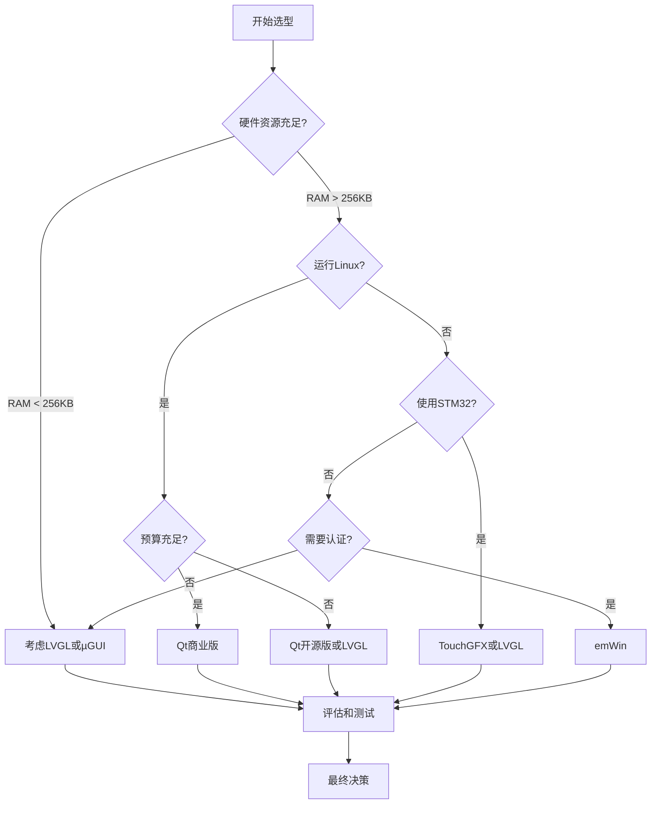

# 嵌入式GUI框架选择与应用指南

## 概述

在嵌入式系统开发中，图形用户界面(GUI)是用户与设备交互的重要桥梁。选择合适的GUI框架不仅影响开发效率，还直接关系到产品的用户体验和性能表现。本文将全面介绍嵌入式领域主流的GUI框架，帮助你做出明智的技术选型决策。

完成本文学习后，你将能够：

- 了解主流嵌入式GUI框架的特点和优势
- 掌握GUI框架的选型标准和评估方法
- 理解不同框架的适用场景和限制条件
- 熟悉GUI框架的基本开发流程和最佳实践

## 背景知识

### 什么是GUI框架

GUI框架是一套用于创建图形用户界面的软件工具集，它提供了绘图引擎、控件库、事件处理、布局管理等核心功能，让开发者无需从零开始实现底层图形渲染，可以专注于界面设计和业务逻辑。

### 嵌入式GUI的特殊要求

与桌面或移动端GUI不同，嵌入式GUI面临更多限制：

- **资源受限**：内存、存储空间、CPU性能有限
- **实时性要求**：需要快速响应用户操作
- **功耗敏感**：特别是电池供电设备
- **显示多样性**：从单色屏到高分辨率彩屏
- **成本考虑**：硬件成本和授权费用

## 主流GUI框架对比

### LVGL (Light and Versatile Graphics Library)

#### 框架特点

LVGL是一个开源的轻量级图形库，专为资源受限的嵌入式系统设计。

**核心优势**：
- 完全开源，MIT许可证，商业友好
- 资源占用极低，最小配置仅需64KB Flash和16KB RAM
- 支持多种显示器和触摸设备
- 丰富的内置控件和主题系统
- 活跃的社区支持

**技术特性**：
- 纯C语言编写，无外部依赖
- 支持抗锯齿、透明度、动画效果
- 内置输入设备驱动抽象层
- 支持多国语言和UTF-8编码
- 可配置的内存管理

#### 适用场景

- 资源受限的MCU项目（如STM32、ESP32）
- 需要快速原型开发的项目
- 预算有限的商业项目
- 需要高度定制化的界面
- 开源项目和教育用途

#### 基本使用示例

```c
#include "lvgl.h"

// 创建一个简单的按钮界面
void create_button_demo(void)
{
    // 创建按钮对象
    lv_obj_t *btn = lv_btn_create(lv_scr_act());
    lv_obj_set_size(btn, 120, 50);
    lv_obj_center(btn);
    
    // 添加按钮标签
    lv_obj_t *label = lv_label_create(btn);
    lv_label_set_text(label, "Click Me");
    lv_obj_center(label);
    
    // 添加事件回调
    lv_obj_add_event_cb(btn, button_event_handler, LV_EVENT_CLICKED, NULL);
}

// 事件处理函数
static void button_event_handler(lv_event_t *e)
{
    lv_event_code_t code = lv_event_get_code(e);
    if(code == LV_EVENT_CLICKED) {
        // 按钮被点击时的处理逻辑
        printf("Button clicked!\n");
    }
}
```

**代码说明**：
- 第6行：创建按钮对象并添加到当前屏幕
- 第7行：设置按钮尺寸为120x50像素
- 第11行：创建标签并设置文本
- 第15行：注册点击事件回调函数

### Qt for Embedded

#### 框架特点

Qt是一个跨平台的C++应用程序开发框架，Qt for Embedded是其嵌入式版本。

**核心优势**：
- 成熟稳定的商业级框架
- 强大的跨平台能力
- 丰富的开发工具和IDE支持
- 完善的文档和技术支持
- 优秀的性能和渲染效果

**技术特性**：
- 基于C++和QML的开发方式
- 硬件加速支持（OpenGL ES）
- 完整的多媒体支持
- 网络和数据库集成
- 信号槽机制简化事件处理

#### 适用场景

- 高性能嵌入式Linux设备
- 需要复杂界面和动画的项目
- 有充足硬件资源的平台（如i.MX、RK系列）
- 需要跨平台开发的项目
- 商业产品且预算充足

#### 资源要求

- **最小配置**：256MB RAM，ARM Cortex-A系列处理器
- **推荐配置**：512MB+ RAM，GPU支持
- **存储空间**：根据功能模块，通常需要50-200MB

#### 基本使用示例

```cpp
#include <QApplication>
#include <QPushButton>

int main(int argc, char *argv[])
{
    QApplication app(argc, argv);
    
    // 创建按钮
    QPushButton button("Click Me");
    button.resize(120, 50);
    
    // 连接信号和槽
    QObject::connect(&button, &QPushButton::clicked, []() {
        qDebug() << "Button clicked!";
    });
    
    button.show();
    return app.exec();
}
```

### emWin (Embedded Wizard)

#### 框架特点

emWin是SEGGER公司开发的专业嵌入式GUI解决方案，广泛应用于工业和医疗设备。

**核心优势**：
- 高度优化的性能表现
- 完善的商业技术支持
- 丰富的显示器驱动支持
- 专业的开发工具
- 符合工业标准和认证

**技术特性**：
- 支持多种颜色深度和显示模式
- 内置抗锯齿字体渲染
- 支持JPEG、PNG等图片格式
- 窗口管理和多任务支持
- 内存设备和虚拟屏幕

#### 适用场景

- 工业控制和仪器仪表
- 医疗设备（需要认证）
- 高可靠性要求的产品
- 需要专业技术支持的项目
- 预算充足的商业项目

#### 授权模式

- **评估版**：功能完整但有限制，用于评估
- **单项目授权**：适合单一产品
- **年度授权**：适合多产品开发
- **源码授权**：获取完整源代码

### 其他框架简介

#### TouchGFX

- **开发商**：STMicroelectronics
- **特点**：专为STM32优化，免费使用
- **优势**：与STM32生态深度集成，图形化设计工具
- **限制**：主要支持STM32平台

#### µGUI

- **特点**：超轻量级，纯C实现
- **优势**：极小的资源占用，易于移植
- **限制**：功能相对简单，社区较小

#### Embedded Wizard

- **特点**：可视化GUI设计工具
- **优势**：所见即所得的开发体验
- **限制**：商业授权，学习曲线较陡

## GUI框架选型指南

### 选型考虑因素

#### 1. 硬件资源

**内存容量**：
- < 64KB RAM：考虑µGUI或自研简单方案
- 64KB - 256KB RAM：LVGL是理想选择
- 256KB - 1MB RAM：LVGL或emWin
- > 1MB RAM：可选择Qt或其他高级框架

**处理器性能**：
- Cortex-M0/M0+：LVGL基础功能
- Cortex-M3/M4：LVGL完整功能或emWin
- Cortex-M7：LVGL、emWin、TouchGFX
- Cortex-A系列：Qt、LVGL、emWin均可

**显示器分辨率**：
- < 320x240：任何框架都可胜任
- 320x240 - 800x480：LVGL、emWin、TouchGFX
- > 800x480：建议Qt或带GPU加速的方案

#### 2. 项目需求

**界面复杂度**：
- 简单界面（几个按钮和文本）：任何框架
- 中等复杂度（列表、图表）：LVGL、emWin
- 高复杂度（动画、视频）：Qt、TouchGFX

**开发周期**：
- 快速原型：LVGL（丰富的示例和工具）
- 标准开发：根据团队经验选择
- 长期维护：选择社区活跃或有商业支持的框架

**性能要求**：
- 一般应用：LVGL足够
- 高帧率动画：emWin、TouchGFX、Qt
- 实时性要求：需要详细性能测试

#### 3. 成本预算

**开发成本**：
- 学习成本：LVGL和Qt文档丰富，上手快
- 工具成本：开源框架免费，商业框架需购买
- 人力成本：考虑团队技能匹配度

**授权成本**：
- 免费开源：LVGL、µGUI、TouchGFX（STM32）
- 商业授权：emWin、Qt商业版、Embedded Wizard
- 混合模式：Qt有开源版和商业版

**硬件成本**：
- 高性能框架可能需要更强的硬件
- 考虑显示器、触摸屏、GPU等成本

#### 4. 技术支持

**社区支持**：
- LVGL：活跃的GitHub社区和论坛
- Qt：庞大的全球开发者社区
- emWin：官方论坛和技术支持

**文档质量**：
- 官方文档完整性
- 示例代码丰富度
- 教程和视频资源

**商业支持**：
- 是否需要专业技术支持
- 响应时间和服务质量
- 定制开发服务

### 选型决策流程



### 选型建议矩阵

| 场景 | 推荐框架 | 理由 |
|------|---------|------|
| 学习和原型开发 | LVGL | 免费、资源丰富、易上手 |
| 资源受限MCU | LVGL、µGUI | 占用小、性能好 |
| STM32项目 | TouchGFX、LVGL | 官方支持、优化好 |
| Linux嵌入式 | Qt、LVGL | 跨平台、功能强 |
| 工业设备 | emWin、Qt | 稳定可靠、有认证 |
| 消费电子 | LVGL、Qt | 效果好、成本可控 |
| 医疗设备 | emWin | 符合认证要求 |

## 开发流程和最佳实践

### 通用开发流程

#### 1. 环境搭建

```bash
# LVGL示例：克隆仓库
git clone https://github.com/lvgl/lvgl.git
cd lvgl

# 配置LVGL
cp lv_conf_template.h lv_conf.h
# 编辑lv_conf.h，启用所需功能
```

#### 2. 显示驱动移植

```c
// LVGL显示驱动示例
void my_disp_flush(lv_disp_drv_t *disp_drv, const lv_area_t *area, lv_color_t *color_p)
{
    int32_t x, y;
    for(y = area->y1; y <= area->y2; y++) {
        for(x = area->x1; x <= area->x2; x++) {
            // 将像素写入显示器
            set_pixel(x, y, *color_p);
            color_p++;
        }
    }
    
    // 通知LVGL刷新完成
    lv_disp_flush_ready(disp_drv);
}
```

#### 3. 输入设备移植

```c
// LVGL触摸驱动示例
void my_touchpad_read(lv_indev_drv_t *indev_drv, lv_indev_data_t *data)
{
    static int16_t last_x = 0;
    static int16_t last_y = 0;
    
    // 读取触摸状态
    bool touched = touchpad_is_pressed();
    
    if(touched) {
        // 读取触摸坐标
        touchpad_get_xy(&last_x, &last_y);
        data->state = LV_INDEV_STATE_PRESSED;
    } else {
        data->state = LV_INDEV_STATE_RELEASED;
    }
    
    data->point.x = last_x;
    data->point.y = last_y;
}
```

#### 4. 界面设计

- 使用框架提供的设计工具（如LVGL的SquareLine Studio）
- 或手写代码创建界面
- 遵循UI/UX设计原则

#### 5. 事件处理

```c
// 统一的事件处理模式
static void event_handler(lv_event_t *e)
{
    lv_event_code_t code = lv_event_get_code(e);
    lv_obj_t *obj = lv_event_get_target(e);
    
    switch(code) {
        case LV_EVENT_CLICKED:
            // 处理点击事件
            break;
        case LV_EVENT_VALUE_CHANGED:
            // 处理值变化事件
            break;
        default:
            break;
    }
}
```

### 性能优化建议

#### 内存优化

1. **使用合适的颜色深度**
   - 单色屏：1位
   - 简单彩屏：8位或16位
   - 高质量显示：24位或32位

2. **优化图片资源**
   - 使用压缩格式
   - 按需加载图片
   - 考虑使用矢量图标

3. **控制对象数量**
   - 及时删除不用的对象
   - 使用对象池复用
   - 避免创建过多临时对象

#### 渲染优化

1. **减少重绘区域**
   - 只更新变化的部分
   - 使用脏区域管理
   - 避免全屏刷新

2. **使用硬件加速**
   - 启用DMA2D（STM32）
   - 使用GPU（如果有）
   - 利用帧缓冲

3. **优化动画**
   - 控制动画帧率
   - 使用硬件定时器
   - 避免复杂的透明度计算

#### 响应性优化

1. **异步处理**
   - 耗时操作放到后台任务
   - 使用RTOS任务分离
   - 避免阻塞UI线程

2. **事件优先级**
   - 优先处理用户输入
   - 合理安排任务优先级
   - 使用事件队列

### 调试技巧

#### 常用调试方法

1. **日志输出**
```c
// LVGL日志配置
#define LV_USE_LOG 1
#define LV_LOG_LEVEL LV_LOG_LEVEL_TRACE

// 自定义日志输出
void my_log_cb(const char *buf)
{
    printf("%s", buf);
}

// 注册日志回调
lv_log_register_print_cb(my_log_cb);
```

2. **性能监控**
```c
// 启用性能监控
#define LV_USE_PERF_MONITOR 1

// 显示FPS和CPU使用率
lv_obj_t *perf_label = lv_label_create(lv_scr_act());
lv_label_set_text(perf_label, "FPS: 0");
```

3. **内存监控**
```c
// 获取内存使用情况
lv_mem_monitor_t mon;
lv_mem_monitor(&mon);
printf("Used: %d, Free: %d\n", mon.used_pct, mon.free_size);
```

## 常见问题

### Q1: LVGL和Qt该如何选择？

**A**: 主要考虑以下因素：

- **硬件资源**：如果RAM小于256MB，选LVGL；如果有512MB以上RAM和Linux系统，Qt更合适
- **开发经验**：团队熟悉C语言选LVGL，熟悉C++选Qt
- **项目规模**：小型项目LVGL更轻量，大型复杂项目Qt更强大
- **预算**：LVGL完全免费，Qt商业版需要授权费

### Q2: 如何评估GUI框架的性能？

**A**: 建议进行以下测试：

1. **帧率测试**：测量界面刷新帧率，目标至少30fps
2. **响应时间**：测量从触摸到界面响应的延迟
3. **内存占用**：监控运行时的RAM和Flash使用
4. **CPU负载**：测量GUI任务的CPU占用率
5. **功耗测试**：测量不同操作下的功耗表现

### Q3: 可以混合使用多个GUI框架吗？

**A**: 理论上可以，但不推荐：

- **优点**：可以利用不同框架的优势
- **缺点**：
  - 增加代码复杂度和维护成本
  - 可能产生资源冲突
  - 增加固件大小
  - 风格不统一影响用户体验

建议选择一个框架深入使用，如果功能不足，考虑扩展该框架或自己实现特定功能。

### Q4: 开源框架的商业使用有风险吗？

**A**: 需要注意以下几点：

- **许可证**：确认许可证类型（MIT、GPL、LGPL等）
- **版权声明**：保留原作者的版权声明
- **专利风险**：了解是否涉及专利问题
- **技术支持**：评估社区支持是否满足需求

LVGL使用MIT许可证，商业使用非常友好，无需支付费用或开源你的代码。

### Q5: 如何处理不同分辨率的适配？

**A**: 常用方法：

1. **相对布局**：使用百分比而非固定像素
2. **响应式设计**：根据屏幕大小调整布局
3. **矢量图形**：使用SVG等矢量格式
4. **多套资源**：为不同分辨率准备不同资源
5. **缩放方案**：使用框架提供的缩放功能

```c
// LVGL相对布局示例
lv_obj_set_width(obj, lv_pct(50));  // 宽度为父对象的50%
lv_obj_set_height(obj, lv_pct(30)); // 高度为父对象的30%
```

## 总结

选择合适的GUI框架是嵌入式界面开发的关键决策。本文介绍的要点包括：

- **LVGL**：轻量级、开源、适合资源受限的MCU项目
- **Qt**：功能强大、跨平台、适合高性能Linux设备
- **emWin**：商业级、稳定可靠、适合工业和医疗设备
- **选型标准**：综合考虑硬件资源、项目需求、成本预算和技术支持
- **开发流程**：从环境搭建到驱动移植，再到界面设计和优化
- **最佳实践**：注重性能优化、内存管理和用户体验

记住，没有完美的框架，只有最适合你项目的框架。建议在正式开发前，先用目标硬件进行原型验证，确保所选框架能满足性能和功能要求。

## 延伸阅读

推荐进一步学习的资源：

- [LVGL官方文档](https://docs.lvgl.io/) - 详细的API文档和教程
- [Qt for Embedded Linux](https://doc.qt.io/qt-6/embedded-linux.html) - Qt嵌入式开发指南
- [emWin用户手册](https://www.segger.com/products/user-interface/emwin/) - SEGGER官方文档
- [TouchGFX设计器](https://www.st.com/en/development-tools/touchgfxdesigner.html) - STM32图形化设计工具

## 参考资料

1. LVGL官方文档 - https://lvgl.io
2. Qt官方文档 - https://doc.qt.io
3. SEGGER emWin文档 - https://www.segger.com
4. 《嵌入式GUI设计与实现》 - 相关技术书籍
5. STMicroelectronics TouchGFX - https://www.st.com/touchgfx

---

**练习题**：

1. 比较LVGL和emWin在内存占用、性能和成本方面的差异
2. 为一个320x240分辨率、128KB RAM的STM32项目选择合适的GUI框架，并说明理由
3. 设计一个简单的温度显示界面，包括数值显示、图表和设置按钮

**下一步**：建议学习 [触摸交互设计与实现](02-touch-interaction.html)，深入了解如何设计优秀的触摸交互体验。
