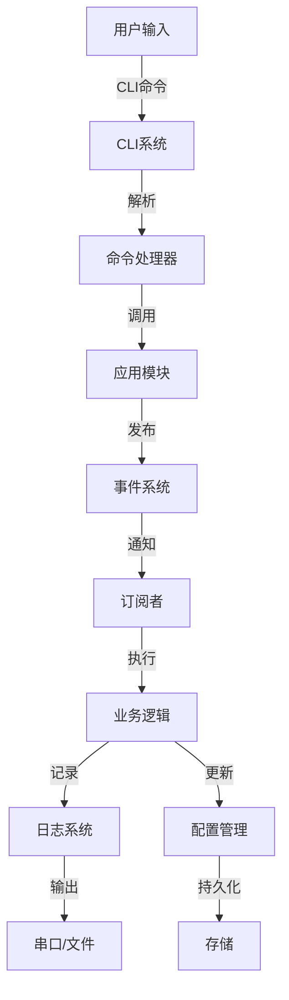

# 完整应用框架设计：构建可扩展的嵌入式应用架构


## 项目概述

### 项目简介

本项目将带你构建一个完整的嵌入式应用框架，该框架提供了模块管理、事件系统、命令行接口、日志系统、配置管理和插件机制等核心功能。这是一个高级综合性项目，整合了前面学习的所有应用框架知识，构建一个可在实际项目中使用的通用框架。

**框架核心功能**：
- 模块化架构（模块注册、初始化、生命周期管理）
- 事件驱动系统（发布-订阅模式、事件队列）
- 命令行接口（CLI命令注册、参数解析、帮助系统）
- 日志系统（分级日志、多输出、格式化）
- 配置管理（持久化存储、动态更新、版本控制）
- 插件机制（动态加载、热插拔、依赖管理）
- 任务调度（定时任务、周期任务、优先级）
- 错误处理（统一错误码、错误恢复、日志记录）

**应用场景**：
- 智能家居控制器
- 工业数据采集系统
- 物联网网关设备
- 智能传感器节点
- 嵌入式测试平台

### 项目演示

系统架构图：

```
┌─────────────────────────────────────────────────────────┐
│                    应用层                                │
│  ┌──────────────┐  ┌──────────────┐  ┌──────────────┐ │
│  │ 用户应用1    │  │ 用户应用2    │  │ 插件应用     │ │
│  └──────────────┘  └──────────────┘  └──────────────┘ │
├─────────────────────────────────────────────────────────┤
│                  应用框架核心                            │
│  ┌──────────────┐  ┌──────────────┐  ┌──────────────┐ │
│  │ 模块管理器   │  │ 事件系统     │  │ 任务调度器   │ │
│  └──────────────┘  └──────────────┘  └──────────────┘ │
│  ┌──────────────┐  ┌──────────────┐  ┌──────────────┐ │
│  │ CLI系统      │  │ 日志系统     │  │ 配置管理     │ │
│  └──────────────┘  └──────────────┘  └──────────────┘ │
│  ┌──────────────┐  ┌──────────────┐  ┌──────────────┐ │
│  │ 插件管理器   │  │ 错误处理     │  │ 工具库       │ │
│  └──────────────┘  └──────────────┘  └──────────────┘ │
├─────────────────────────────────────────────────────────┤
│                  硬件抽象层                              │
│  ┌──────────────┐  ┌──────────────┐  ┌──────────────┐ │
│  │ GPIO         │  │ UART         │  │ I2C/SPI      │ │
│  └──────────────┘  └──────────────┘  └──────────────┘ │
└─────────────────────────────────────────────────────────┘
```

**性能指标**：
- 模块初始化时间：<100ms
- 事件响应延迟：<10ms
- 命令执行时间：<50ms
- 内存占用：<64KB (核心框架)
- 支持模块数：最多32个
- 支持事件类型：最多64种

### 学习目标

完成本项目后，你将掌握：

- [ ] **架构设计**：理解分层架构、模块化设计、接口抽象
- [ ] **模块管理**：实现模块注册、初始化、依赖管理
- [ ] **事件系统**：设计发布-订阅模式、事件队列、异步处理
- [ ] **CLI系统**：实现命令注册、参数解析、帮助生成
- [ ] **日志系统**：设计分级日志、多输出、性能优化
- [ ] **配置管理**：实现配置存储、动态更新、版本迁移
- [ ] **插件机制**：设计插件接口、动态加载、生命周期
- [ ] **任务调度**：实现定时任务、周期任务、优先级管理
- [ ] **错误处理**：设计统一错误码、错误恢复、日志记录
- [ ] **系统集成**：整合所有子系统，构建完整框架


## 项目特点

- ✨ **模块化设计**：高内聚低耦合，易于扩展和维护
- ✨ **事件驱动**：解耦模块间通信，提高系统灵活性
- ✨ **插件支持**：动态加载插件，无需重新编译
- ✨ **配置灵活**：支持运行时配置更新，持久化存储
- ✨ **调试友好**：完善的日志系统，CLI调试接口
- ✨ **可移植性**：硬件抽象层，易于移植到不同平台
- ✨ **生产就绪**：完整的错误处理，稳定可靠
- ✨ **文档完善**：详细的API文档和使用示例


## 技术栈

### 硬件平台
- **主控芯片**：ESP32 (推荐) / STM32F4 / STM32H7
- **内存要求**：≥512KB SRAM, ≥2MB Flash
- **外设接口**：UART, I2C, SPI, GPIO
- **存储**：EEPROM / Flash / SD卡（配置存储）
- **调试接口**：UART (CLI) / USB CDC

### 软件技术
- **开发语言**：C/C++
- **操作系统**：FreeRTOS (可选) / 裸机
- **构建系统**：CMake / PlatformIO / Arduino
- **版本控制**：Git
- **文档工具**：Doxygen

### 第三方库
- **基础库**：标准C库 (stdio, stdlib, string)
- **RTOS**：FreeRTOS (可选，用于任务调度)
- **JSON解析**：cJSON / ArduinoJson (配置文件)
- **哈希表**：uthash (模块注册)
- **队列**：自实现或使用FreeRTOS队列

## 硬件清单

### 必需硬件

| 名称 | 型号 | 数量 | 用途 | 参考价格 | 购买链接 |
|------|------|------|------|----------|----------|
| 开发板 | ESP32-DevKitC | 1 | 主控制器 | ¥30 | [淘宝] |
| USB线 | USB-A to Micro | 1 | 供电和调试 | ¥5 | [淘宝] |
| LED灯 | 5mm LED | 3 | 状态指示 | ¥1 | [淘宝] |
| 电阻 | 220Ω | 3 | LED限流 | ¥1 | [淘宝] |
| 按键 | 轻触开关 | 2 | 用户输入 | ¥2 | [淘宝] |

### 可选硬件

| 名称 | 型号 | 数量 | 用途 | 参考价格 |
|------|------|------|------|----------|
| OLED显示屏 | 0.96" I2C | 1 | 信息显示 | ¥15 |
| 温湿度传感器 | DHT22 | 1 | 示例应用 | ¥15 |
| SD卡模块 | MicroSD | 1 | 配置存储 | ¥5 |
| 蜂鸣器 | 有源蜂鸣器 | 1 | 告警提示 | ¥2 |

**总成本**：约 ¥40-80

### 平台选择建议

**ESP32** (推荐):
- ✅ 价格便宜 (~¥30)
- ✅ 内存充足 (520KB SRAM, 4MB Flash)
- ✅ 集成WiFi/蓝牙
- ✅ Arduino生态完善
- ✅ 适合快速原型开发

**STM32F4**:
- ✅ 性能强劲
- ✅ 192KB SRAM, 1MB Flash
- ✅ 丰富的外设
- ✅ 专业开发工具
- ⚠️ 学习曲线较陡

**STM32H7**:
- ✅ 高性能 (480MHz)
- ✅ 1MB SRAM, 2MB Flash
- ✅ 适合复杂应用
- ⚠️ 价格较高 (~¥100)


## 软件要求

### 开发环境
- **Arduino IDE 2.0+** (ESP32开发，推荐新手)
- **PlatformIO** (推荐，更专业)
- **STM32CubeIDE** (STM32开发)
- **VS Code** (代码编辑器)
- **Git** (版本控制)

### 工具软件
- **串口调试工具**：PuTTY / minicom / screen
- **JSON编辑器**：用于编辑配置文件
- **Doxygen**：生成API文档
- **Graphviz**：生成架构图

### 依赖库安装

**Arduino IDE**:
```bash
# 通过库管理器安装
- ArduinoJson (配置文件解析)
- FreeRTOS (任务调度，ESP32已内置)
```

**PlatformIO**:
```ini
# platformio.ini
[env:esp32dev]
platform = espressif32
board = esp32dev
framework = arduino
lib_deps =
    bblanchon/ArduinoJson@^6.21.0
monitor_speed = 115200
```


## 系统架构

### 整体架构设计

框架采用分层架构，从下到上分为：

1. **硬件抽象层 (HAL)**：屏蔽硬件差异
2. **框架核心层**：提供核心服务
3. **应用层**：用户应用和插件

```
┌─────────────────────────────────────────────────────────┐
│                    应用层                                │
│  ┌──────────────┐  ┌──────────────┐  ┌──────────────┐ │
│  │ LED应用      │  │ 传感器应用   │  │ 网络应用     │ │
│  └──────────────┘  └──────────────┘  └──────────────┘ │
├─────────────────────────────────────────────────────────┤
│                  框架核心层                              │
│  ┌──────────────────────────────────────────────────┐ │
│  │              模块管理器 (Module Manager)          │ │
│  │  - 模块注册  - 依赖解析  - 生命周期管理          │ │
│  └──────────────────────────────────────────────────┘ │
│  ┌──────────────┐  ┌──────────────┐  ┌──────────────┐ │
│  │ 事件系统     │  │ 任务调度器   │  │ CLI系统      │ │
│  │ - 发布订阅   │  │ - 定时任务   │  │ - 命令注册   │ │
│  │ - 事件队列   │  │ - 周期任务   │  │ - 参数解析   │ │
│  └──────────────┘  └──────────────┘  └──────────────┘ │
│  ┌──────────────┐  ┌──────────────┐  ┌──────────────┐ │
│  │ 日志系统     │  │ 配置管理     │  │ 插件管理器   │ │
│  │ - 分级日志   │  │ - 持久化     │  │ - 动态加载   │ │
│  │ - 多输出     │  │ - 动态更新   │  │ - 依赖管理   │ │
│  └──────────────┘  └──────────────┘  └──────────────┘ │
│  ┌──────────────┐  ┌──────────────┐                   │
│  │ 错误处理     │  │ 工具库       │                   │
│  │ - 错误码     │  │ - 字符串     │                   │
│  │ - 错误恢复   │  │ - 内存池     │                   │
│  └──────────────┘  └──────────────┘                   │
├─────────────────────────────────────────────────────────┤
│                  硬件抽象层 (HAL)                        │
│  ┌──────────────┐  ┌──────────────┐  ┌──────────────┐ │
│  │ GPIO         │  │ UART         │  │ Timer        │ │
│  └──────────────┘  └──────────────┘  └──────────────┘ │
│  ┌──────────────┐  ┌──────────────┐  ┌──────────────┐ │
│  │ I2C          │  │ SPI          │  │ Storage      │ │
│  └──────────────┘  └──────────────┘  └──────────────┘ │
└─────────────────────────────────────────────────────────┘
```

### 核心模块说明

#### 1. 模块管理器 (Module Manager)

**功能**：
- 模块注册和发现
- 依赖关系解析
- 初始化顺序管理
- 生命周期管理（init, start, stop, deinit）

**接口**：
```c
// 模块注册
int module_register(const module_t *module);

// 模块初始化
int module_init_all(void);

// 模块启动
int module_start_all(void);

// 获取模块
module_t* module_get(const char *name);
```

#### 2. 事件系统 (Event System)

**功能**：
- 发布-订阅模式
- 事件队列管理
- 异步事件处理
- 事件过滤和路由

**接口**：
```c
// 订阅事件
int event_subscribe(event_type_t type, event_handler_t handler);

// 发布事件
int event_publish(event_type_t type, void *data);

// 事件循环
void event_loop(void);
```

#### 3. 任务调度器 (Task Scheduler)

**功能**：
- 定时任务（一次性）
- 周期任务（重复执行）
- 优先级管理
- 任务取消和暂停

**接口**：
```c
// 创建定时任务
task_id_t task_schedule(uint32_t delay_ms, task_func_t func, void *arg);

// 创建周期任务
task_id_t task_schedule_periodic(uint32_t period_ms, task_func_t func, void *arg);

// 取消任务
int task_cancel(task_id_t id);
```

#### 4. CLI系统 (Command Line Interface)

**功能**：
- 命令注册和管理
- 参数解析
- 自动生成帮助
- 命令历史和自动补全

**接口**：
```c
// 注册命令
int cli_register_command(const cli_command_t *cmd);

// 执行命令
int cli_execute(const char *line);

// CLI主循环
void cli_loop(void);
```

#### 5. 日志系统 (Logging System)

**功能**：
- 分级日志（ERROR, WARN, INFO, DEBUG）
- 多输出（串口、文件、网络）
- 格式化输出
- 性能优化（缓冲、异步）

**接口**：
```c
// 日志输出
void log_error(const char *tag, const char *fmt, ...);
void log_warn(const char *tag, const char *fmt, ...);
void log_info(const char *tag, const char *fmt, ...);
void log_debug(const char *tag, const char *fmt, ...);

// 设置日志级别
void log_set_level(log_level_t level);
```

#### 6. 配置管理 (Configuration Management)

**功能**：
- 配置存储和加载
- 动态配置更新
- 配置验证
- 版本迁移

**接口**：
```c
// 获取配置
int config_get_int(const char *key, int default_value);
const char* config_get_string(const char *key, const char *default_value);

// 设置配置
int config_set_int(const char *key, int value);
int config_set_string(const char *key, const char *value);

// 保存配置
int config_save(void);
```

#### 7. 插件管理器 (Plugin Manager)

**功能**：
- 插件注册和发现
- 动态加载和卸载
- 依赖管理
- 版本检查

**接口**：
```c
// 注册插件
int plugin_register(const plugin_t *plugin);

// 加载插件
int plugin_load(const char *name);

// 卸载插件
int plugin_unload(const char *name);
```

### 数据流图



### 内存分配

典型内存使用 (ESP32, 520KB SRAM):

```
总内存: 520 KB
├─ 系统保留: 100 KB (19%)
├─ 框架核心: 64 KB (12%)
│  ├─ 模块管理: 8 KB
│  ├─ 事件系统: 16 KB (事件队列)
│  ├─ 任务调度: 12 KB (任务队列)
│  ├─ CLI系统: 8 KB (命令缓冲)
│  ├─ 日志系统: 12 KB (日志缓冲)
│  └─ 配置管理: 8 KB (配置缓存)
├─ 应用模块: 256 KB (49%)
└─ 动态分配: 100 KB (19%)
```


## 电路设计

### 接线图 (ESP32)

```
ESP32          LED (状态指示)
-----          --------------
GPIO2  -------> LED1 (系统运行) ---> 220Ω ---> GND
GPIO4  -------> LED2 (事件触发) ---> 220Ω ---> GND
GPIO5  -------> LED3 (错误指示) ---> 220Ω ---> GND

ESP32          按键 (用户输入)
-----          ----------------
GPIO18 -------> Button1 (功能键) ---> GND
GPIO19 -------> Button2 (复位键) ---> GND
3.3V   -------> 10kΩ上拉 -------> GPIO18/19

ESP32          OLED显示屏 (可选)
-----          ------------------
GPIO21 -------> SDA (I2C数据)
GPIO22 -------> SCL (I2C时钟)
3.3V   -------> VCC
GND    -------> GND

ESP32          DHT22传感器 (可选)
-----          -------------------
GPIO23 -------> DATA
3.3V   -------> VCC
GND    -------> GND
```

### 电源设计

**电源需求**：
- ESP32: 500mA @ 3.3V
- LED: 60mA @ 3.3V (3个 × 20mA)
- OLED: 50mA @ 3.3V (可选)
- DHT22: 5mA @ 3.3V (可选)
- 总计: ~600mA @ 3.3V

**推荐电源方案**：
- USB供电 (5V 1A) - 开发阶段
- 锂电池 (3.7V 2000mAh) + 稳压模块 - 移动应用


## 实现步骤

### 阶段1：框架基础搭建 (预计3小时)

#### 1.1 项目结构创建

创建项目目录结构：

```
app-framework/
├── src/
│   ├── core/              # 框架核心
│   │   ├── framework.h    # 框架主头文件
│   │   ├── framework.c    # 框架初始化
│   │   ├── module.h       # 模块管理
│   │   ├── module.c
│   │   ├── event.h        # 事件系统
│   │   ├── event.c
│   │   ├── task.h         # 任务调度
│   │   ├── task.c
│   │   ├── cli.h          # CLI系统
│   │   ├── cli.c
│   │   ├── log.h          # 日志系统
│   │   ├── log.c
│   │   ├── config.h       # 配置管理
│   │   ├── config.c
│   │   ├── plugin.h       # 插件管理
│   │   └── plugin.c
│   ├── hal/               # 硬件抽象层
│   │   ├── hal_gpio.h
│   │   ├── hal_gpio.c
│   │   ├── hal_uart.h
│   │   ├── hal_uart.c
│   │   ├── hal_timer.h
│   │   └── hal_timer.c
│   ├── utils/             # 工具库
│   │   ├── utils.h
│   │   ├── string_utils.c
│   │   ├── memory_pool.c
│   │   └── ring_buffer.c
│   ├── modules/           # 应用模块
│   │   ├── led_module.c
│   │   ├── button_module.c
│   │   └── sensor_module.c
│   └── main.c             # 主程序
├── include/               # 公共头文件
├── docs/                  # 文档
├── tests/                 # 测试代码
├── examples/              # 示例代码
├── platformio.ini         # PlatformIO配置
└── README.md
```

#### 1.2 框架核心定义

**framework.h** - 框架主头文件：

```c
#ifndef FRAMEWORK_H
#define FRAMEWORK_H

#include <stdint.h>
#include <stdbool.h>

// 框架版本
#define FRAMEWORK_VERSION_MAJOR 1
#define FRAMEWORK_VERSION_MINOR 0
#define FRAMEWORK_VERSION_PATCH 0

// 错误码定义
typedef enum {
    FW_OK = 0,
    FW_ERROR = -1,
    FW_ERROR_INVALID_PARAM = -2,
    FW_ERROR_NO_MEMORY = -3,
    FW_ERROR_NOT_FOUND = -4,
    FW_ERROR_ALREADY_EXISTS = -5,
    FW_ERROR_TIMEOUT = -6,
    FW_ERROR_NOT_INITIALIZED = -7,
} fw_error_t;

// 框架配置
typedef struct {
    uint32_t event_queue_size;      // 事件队列大小
    uint32_t task_queue_size;       // 任务队列大小
    uint32_t log_buffer_size;       // 日志缓冲大小
    uint32_t cli_buffer_size;       // CLI缓冲大小
    bool enable_watchdog;           // 启用看门狗
    uint32_t watchdog_timeout_ms;   // 看门狗超时
} framework_config_t;

// 框架初始化
int framework_init(const framework_config_t *config);

// 框架启动
int framework_start(void);

// 框架主循环
void framework_loop(void);

// 框架停止
int framework_stop(void);

// 获取框架版本
const char* framework_get_version(void);

// 获取运行时间
uint32_t framework_get_uptime_ms(void);

#endif // FRAMEWORK_H
```

**framework.c** - 框架实现：

```c
#include "framework.h"
#include "module.h"
#include "event.h"
#include "task.h"
#include "cli.h"
#include "log.h"
#include "config.h"
#include <stdio.h>
#include <Arduino.h>

static const char *TAG = "Framework";
static bool g_initialized = false;
static bool g_running = false;
static uint32_t g_start_time = 0;

// 默认配置
static const framework_config_t DEFAULT_CONFIG = {
    .event_queue_size = 32,
    .task_queue_size = 16,
    .log_buffer_size = 512,
    .cli_buffer_size = 256,
    .enable_watchdog = true,
    .watchdog_timeout_ms = 10000,
};

// 框架初始化
int framework_init(const framework_config_t *config) {
    if (g_initialized) {
        return FW_ERROR_ALREADY_EXISTS;
    }
    
    // 使用默认配置
    if (config == NULL) {
        config = &DEFAULT_CONFIG;
    }
    
    log_info(TAG, "Initializing framework v%d.%d.%d...",
             FRAMEWORK_VERSION_MAJOR,
             FRAMEWORK_VERSION_MINOR,
             FRAMEWORK_VERSION_PATCH);
    
    // 初始化日志系统
    if (log_init(config->log_buffer_size) != FW_OK) {
        return FW_ERROR;
    }
    
    // 初始化配置管理
    if (config_init() != FW_OK) {
        log_error(TAG, "Failed to initialize config");
        return FW_ERROR;
    }
    
    // 初始化事件系统
    if (event_init(config->event_queue_size) != FW_OK) {
        log_error(TAG, "Failed to initialize event system");
        return FW_ERROR;
    }
    
    // 初始化任务调度器
    if (task_init(config->task_queue_size) != FW_OK) {
        log_error(TAG, "Failed to initialize task scheduler");
        return FW_ERROR;
    }
    
    // 初始化CLI系统
    if (cli_init(config->cli_buffer_size) != FW_OK) {
        log_error(TAG, "Failed to initialize CLI");
        return FW_ERROR;
    }
    
    // 初始化模块管理器
    if (module_init() != FW_OK) {
        log_error(TAG, "Failed to initialize module manager");
        return FW_ERROR;
    }
    
    g_initialized = true;
    log_info(TAG, "Framework initialized successfully");
    
    return FW_OK;
}

// 框架启动
int framework_start(void) {
    if (!g_initialized) {
        return FW_ERROR_NOT_INITIALIZED;
    }
    
    if (g_running) {
        return FW_ERROR_ALREADY_EXISTS;
    }
    
    log_info(TAG, "Starting framework...");
    
    // 初始化所有模块
    if (module_init_all() != FW_OK) {
        log_error(TAG, "Failed to initialize modules");
        return FW_ERROR;
    }
    
    // 启动所有模块
    if (module_start_all() != FW_OK) {
        log_error(TAG, "Failed to start modules");
        return FW_ERROR;
    }
    
    g_running = true;
    g_start_time = millis();
    
    log_info(TAG, "Framework started successfully");
    
    return FW_OK;
}

// 框架主循环
void framework_loop(void) {
    if (!g_running) {
        return;
    }
    
    // 处理事件
    event_process();
    
    // 处理任务
    task_process();
    
    // 处理CLI
    cli_process();
    
    // 处理日志
    log_process();
}

// 框架停止
int framework_stop(void) {
    if (!g_running) {
        return FW_OK;
    }
    
    log_info(TAG, "Stopping framework...");
    
    // 停止所有模块
    module_stop_all();
    
    g_running = false;
    
    log_info(TAG, "Framework stopped");
    
    return FW_OK;
}

// 获取框架版本
const char* framework_get_version(void) {
    static char version[32];
    snprintf(version, sizeof(version), "%d.%d.%d",
             FRAMEWORK_VERSION_MAJOR,
             FRAMEWORK_VERSION_MINOR,
             FRAMEWORK_VERSION_PATCH);
    return version;
}

// 获取运行时间
uint32_t framework_get_uptime_ms(void) {
    if (!g_running) {
        return 0;
    }
    return millis() - g_start_time;
}
```

#### 1.3 硬件抽象层

**hal_gpio.h** - GPIO抽象：

```c
#ifndef HAL_GPIO_H
#define HAL_GPIO_H

#include <stdint.h>
#include <stdbool.h>

// GPIO模式
typedef enum {
    HAL_GPIO_MODE_INPUT,
    HAL_GPIO_MODE_OUTPUT,
    HAL_GPIO_MODE_INPUT_PULLUP,
    HAL_GPIO_MODE_INPUT_PULLDOWN,
} hal_gpio_mode_t;

// GPIO电平
typedef enum {
    HAL_GPIO_LOW = 0,
    HAL_GPIO_HIGH = 1,
} hal_gpio_level_t;

// GPIO初始化
int hal_gpio_init(uint8_t pin, hal_gpio_mode_t mode);

// GPIO写入
int hal_gpio_write(uint8_t pin, hal_gpio_level_t level);

// GPIO读取
hal_gpio_level_t hal_gpio_read(uint8_t pin);

// GPIO切换
int hal_gpio_toggle(uint8_t pin);

#endif // HAL_GPIO_H
```

**hal_gpio.c** - GPIO实现（Arduino平台）：

```c
#include "hal_gpio.h"
#include <Arduino.h>

// GPIO初始化
int hal_gpio_init(uint8_t pin, hal_gpio_mode_t mode) {
    switch (mode) {
        case HAL_GPIO_MODE_INPUT:
            pinMode(pin, INPUT);
            break;
        case HAL_GPIO_MODE_OUTPUT:
            pinMode(pin, OUTPUT);
            break;
        case HAL_GPIO_MODE_INPUT_PULLUP:
            pinMode(pin, INPUT_PULLUP);
            break;
        case HAL_GPIO_MODE_INPUT_PULLDOWN:
            pinMode(pin, INPUT_PULLDOWN);
            break;
        default:
            return -1;
    }
    return 0;
}

// GPIO写入
int hal_gpio_write(uint8_t pin, hal_gpio_level_t level) {
    digitalWrite(pin, level);
    return 0;
}

// GPIO读取
hal_gpio_level_t hal_gpio_read(uint8_t pin) {
    return digitalRead(pin) ? HAL_GPIO_HIGH : HAL_GPIO_LOW;
}

// GPIO切换
int hal_gpio_toggle(uint8_t pin) {
    hal_gpio_level_t level = hal_gpio_read(pin);
    hal_gpio_write(pin, level == HAL_GPIO_HIGH ? HAL_GPIO_LOW : HAL_GPIO_HIGH);
    return 0;
}
```


### 阶段2：模块管理系统 (预计2小时)

#### 2.1 模块管理器实现

**module.h** - 模块管理接口：

```c
#ifndef MODULE_H
#define MODULE_H

#include "framework.h"

// 模块状态
typedef enum {
    MODULE_STATE_UNINITIALIZED,
    MODULE_STATE_INITIALIZED,
    MODULE_STATE_STARTED,
    MODULE_STATE_STOPPED,
    MODULE_STATE_ERROR,
} module_state_t;

// 模块接口
typedef struct module_t {
    const char *name;              // 模块名称
    const char *version;           // 模块版本
    const char **dependencies;     // 依赖模块列表
    int (*init)(void);             // 初始化函数
    int (*start)(void);            // 启动函数
    int (*stop)(void);             // 停止函数
    int (*deinit)(void);           // 清理函数
    module_state_t state;          // 模块状态
} module_t;

// 模块管理器初始化
int module_init(void);

// 注册模块
int module_register(module_t *module);

// 初始化所有模块
int module_init_all(void);

// 启动所有模块
int module_start_all(void);

// 停止所有模块
int module_stop_all(void);

// 获取模块
module_t* module_get(const char *name);

// 列出所有模块
void module_list(void);

#endif // MODULE_H
```

**module.c** - 模块管理实现：

```c
#include "module.h"
#include "log.h"
#include <string.h>

static const char *TAG = "Module";

#define MAX_MODULES 32

static module_t *g_modules[MAX_MODULES];
static int g_module_count = 0;

// 模块管理器初始化
int module_init(void) {
    g_module_count = 0;
    memset(g_modules, 0, sizeof(g_modules));
    log_info(TAG, "Module manager initialized");
    return FW_OK;
}

// 注册模块
int module_register(module_t *module) {
    if (module == NULL || module->name == NULL) {
        return FW_ERROR_INVALID_PARAM;
    }
    
    // 检查是否已注册
    for (int i = 0; i < g_module_count; i++) {
        if (strcmp(g_modules[i]->name, module->name) == 0) {
            log_warn(TAG, "Module '%s' already registered", module->name);
            return FW_ERROR_ALREADY_EXISTS;
        }
    }
    
    // 检查容量
    if (g_module_count >= MAX_MODULES) {
        log_error(TAG, "Module table full");
        return FW_ERROR_NO_MEMORY;
    }
    
    // 注册模块
    g_modules[g_module_count++] = module;
    module->state = MODULE_STATE_UNINITIALIZED;
    
    log_info(TAG, "Module '%s' v%s registered", module->name, module->version);
    
    return FW_OK;
}

// 检查依赖
static bool check_dependencies(module_t *module) {
    if (module->dependencies == NULL) {
        return true;
    }
    
    for (int i = 0; module->dependencies[i] != NULL; i++) {
        const char *dep_name = module->dependencies[i];
        module_t *dep = module_get(dep_name);
        
        if (dep == NULL) {
            log_error(TAG, "Module '%s' depends on '%s' which is not registered",
                     module->name, dep_name);
            return false;
        }
        
        if (dep->state != MODULE_STATE_INITIALIZED &&
            dep->state != MODULE_STATE_STARTED) {
            log_error(TAG, "Module '%s' depends on '%s' which is not initialized",
                     module->name, dep_name);
            return false;
        }
    }
    
    return true;
}

// 初始化所有模块
int module_init_all(void) {
    log_info(TAG, "Initializing %d modules...", g_module_count);
    
    int initialized = 0;
    int max_iterations = g_module_count * 2;  // 防止死循环
    
    while (initialized < g_module_count && max_iterations-- > 0) {
        for (int i = 0; i < g_module_count; i++) {
            module_t *module = g_modules[i];
            
            if (module->state != MODULE_STATE_UNINITIALIZED) {
                continue;
            }
            
            // 检查依赖
            if (!check_dependencies(module)) {
                continue;
            }
            
            // 初始化模块
            log_info(TAG, "Initializing module '%s'...", module->name);
            
            if (module->init != NULL) {
                int ret = module->init();
                if (ret != FW_OK) {
                    log_error(TAG, "Failed to initialize module '%s': %d",
                             module->name, ret);
                    module->state = MODULE_STATE_ERROR;
                    return FW_ERROR;
                }
            }
            
            module->state = MODULE_STATE_INITIALIZED;
            initialized++;
            
            log_info(TAG, "Module '%s' initialized", module->name);
        }
    }
    
    if (initialized < g_module_count) {
        log_error(TAG, "Failed to initialize all modules (circular dependency?)");
        return FW_ERROR;
    }
    
    log_info(TAG, "All modules initialized successfully");
    return FW_OK;
}

// 启动所有模块
int module_start_all(void) {
    log_info(TAG, "Starting modules...");
    
    for (int i = 0; i < g_module_count; i++) {
        module_t *module = g_modules[i];
        
        if (module->state != MODULE_STATE_INITIALIZED) {
            continue;
        }
        
        log_info(TAG, "Starting module '%s'...", module->name);
        
        if (module->start != NULL) {
            int ret = module->start();
            if (ret != FW_OK) {
                log_error(TAG, "Failed to start module '%s': %d",
                         module->name, ret);
                module->state = MODULE_STATE_ERROR;
                return FW_ERROR;
            }
        }
        
        module->state = MODULE_STATE_STARTED;
        log_info(TAG, "Module '%s' started", module->name);
    }
    
    log_info(TAG, "All modules started successfully");
    return FW_OK;
}

// 停止所有模块
int module_stop_all(void) {
    log_info(TAG, "Stopping modules...");
    
    // 反向停止（先停止后启动的）
    for (int i = g_module_count - 1; i >= 0; i--) {
        module_t *module = g_modules[i];
        
        if (module->state != MODULE_STATE_STARTED) {
            continue;
        }
        
        log_info(TAG, "Stopping module '%s'...", module->name);
        
        if (module->stop != NULL) {
            module->stop();
        }
        
        module->state = MODULE_STATE_STOPPED;
    }
    
    log_info(TAG, "All modules stopped");
    return FW_OK;
}

// 获取模块
module_t* module_get(const char *name) {
    for (int i = 0; i < g_module_count; i++) {
        if (strcmp(g_modules[i]->name, name) == 0) {
            return g_modules[i];
        }
    }
    return NULL;
}

// 列出所有模块
void module_list(void) {
    log_info(TAG, "Registered modules (%d):", g_module_count);
    
    for (int i = 0; i < g_module_count; i++) {
        module_t *module = g_modules[i];
        const char *state_str[] = {
            "UNINITIALIZED", "INITIALIZED", "STARTED", "STOPPED", "ERROR"
        };
        
        log_info(TAG, "  [%d] %s v%s - %s",
                i, module->name, module->version,
                state_str[module->state]);
        
        if (module->dependencies != NULL) {
            log_info(TAG, "      Dependencies:");
            for (int j = 0; module->dependencies[j] != NULL; j++) {
                log_info(TAG, "        - %s", module->dependencies[j]);
            }
        }
    }
}
```

#### 2.2 示例模块实现

**led_module.c** - LED模块示例：

```c
#include "module.h"
#include "hal_gpio.h"
#include "log.h"
#include "event.h"

static const char *TAG = "LED";

// LED引脚定义
#define LED_SYSTEM_PIN  2
#define LED_EVENT_PIN   4
#define LED_ERROR_PIN   5

// LED模块初始化
static int led_module_init(void) {
    log_info(TAG, "Initializing LED module...");
    
    // 初始化GPIO
    hal_gpio_init(LED_SYSTEM_PIN, HAL_GPIO_MODE_OUTPUT);
    hal_gpio_init(LED_EVENT_PIN, HAL_GPIO_MODE_OUTPUT);
    hal_gpio_init(LED_ERROR_PIN, HAL_GPIO_MODE_OUTPUT);
    
    // 关闭所有LED
    hal_gpio_write(LED_SYSTEM_PIN, HAL_GPIO_LOW);
    hal_gpio_write(LED_EVENT_PIN, HAL_GPIO_LOW);
    hal_gpio_write(LED_ERROR_PIN, HAL_GPIO_LOW);
    
    return FW_OK;
}

// LED模块启动
static int led_module_start(void) {
    log_info(TAG, "Starting LED module...");
    
    // 点亮系统LED
    hal_gpio_write(LED_SYSTEM_PIN, HAL_GPIO_HIGH);
    
    // 订阅事件
    event_subscribe(EVENT_TYPE_ERROR, led_on_error_event);
    event_subscribe(EVENT_TYPE_CUSTOM, led_on_custom_event);
    
    return FW_OK;
}

// LED模块停止
static int led_module_stop(void) {
    log_info(TAG, "Stopping LED module...");
    
    // 关闭所有LED
    hal_gpio_write(LED_SYSTEM_PIN, HAL_GPIO_LOW);
    hal_gpio_write(LED_EVENT_PIN, HAL_GPIO_LOW);
    hal_gpio_write(LED_ERROR_PIN, HAL_GPIO_LOW);
    
    return FW_OK;
}

// 错误事件处理
static void led_on_error_event(event_t *event) {
    // 闪烁错误LED
    hal_gpio_write(LED_ERROR_PIN, HAL_GPIO_HIGH);
    delay(100);
    hal_gpio_write(LED_ERROR_PIN, HAL_GPIO_LOW);
}

// 自定义事件处理
static void led_on_custom_event(event_t *event) {
    // 闪烁事件LED
    hal_gpio_write(LED_EVENT_PIN, HAL_GPIO_HIGH);
    delay(50);
    hal_gpio_write(LED_EVENT_PIN, HAL_GPIO_LOW);
}

// LED模块定义
static module_t led_module = {
    .name = "led",
    .version = "1.0.0",
    .dependencies = NULL,
    .init = led_module_init,
    .start = led_module_start,
    .stop = led_module_stop,
    .deinit = NULL,
};

// 注册LED模块
void led_module_register(void) {
    module_register(&led_module);
}
```


### 阶段3：事件系统实现 (预计2小时)

#### 3.1 事件系统接口

**event.h** - 事件系统接口：

```c
#ifndef EVENT_H
#define EVENT_H

#include "framework.h"

// 事件类型
typedef enum {
    EVENT_TYPE_NONE = 0,
    EVENT_TYPE_SYSTEM_START,
    EVENT_TYPE_SYSTEM_STOP,
    EVENT_TYPE_ERROR,
    EVENT_TYPE_WARNING,
    EVENT_TYPE_BUTTON_PRESS,
    EVENT_TYPE_BUTTON_RELEASE,
    EVENT_TYPE_SENSOR_DATA,
    EVENT_TYPE_TIMER,
    EVENT_TYPE_CUSTOM,
    EVENT_TYPE_MAX = 64,
} event_type_t;

// 事件结构
typedef struct {
    event_type_t type;
    uint32_t timestamp;
    void *data;
    size_t data_size;
} event_t;

// 事件处理函数
typedef void (*event_handler_t)(event_t *event);

// 事件系统初始化
int event_init(uint32_t queue_size);

// 订阅事件
int event_subscribe(event_type_t type, event_handler_t handler);

// 取消订阅
int event_unsubscribe(event_type_t type, event_handler_t handler);

// 发布事件
int event_publish(event_type_t type, void *data, size_t data_size);

// 发布事件（异步）
int event_publish_async(event_type_t type, void *data, size_t data_size);

// 处理事件队列
void event_process(void);

// 获取事件队列大小
uint32_t event_queue_size(void);

#endif // EVENT_H
```

**event.c** - 事件系统实现：

```c
#include "event.h"
#include "log.h"
#include <string.h>
#include <Arduino.h>

static const char *TAG = "Event";

#define MAX_HANDLERS_PER_TYPE 8

// 事件订阅者
typedef struct {
    event_handler_t handlers[MAX_HANDLERS_PER_TYPE];
    int handler_count;
} event_subscribers_t;

// 事件队列项
typedef struct {
    event_t event;
    uint8_t data_buffer[64];  // 内联数据缓冲
} event_queue_item_t;

static event_subscribers_t g_subscribers[EVENT_TYPE_MAX];
static event_queue_item_t *g_event_queue = NULL;
static uint32_t g_queue_size = 0;
static uint32_t g_queue_head = 0;
static uint32_t g_queue_tail = 0;
static uint32_t g_queue_count = 0;

// 事件系统初始化
int event_init(uint32_t queue_size) {
    log_info(TAG, "Initializing event system (queue size: %d)...", queue_size);
    
    // 分配事件队列
    g_event_queue = (event_queue_item_t*)malloc(sizeof(event_queue_item_t) * queue_size);
    if (g_event_queue == NULL) {
        log_error(TAG, "Failed to allocate event queue");
        return FW_ERROR_NO_MEMORY;
    }
    
    g_queue_size = queue_size;
    g_queue_head = 0;
    g_queue_tail = 0;
    g_queue_count = 0;
    
    // 初始化订阅者列表
    memset(g_subscribers, 0, sizeof(g_subscribers));
    
    log_info(TAG, "Event system initialized");
    return FW_OK;
}

// 订阅事件
int event_subscribe(event_type_t type, event_handler_t handler) {
    if (type >= EVENT_TYPE_MAX || handler == NULL) {
        return FW_ERROR_INVALID_PARAM;
    }
    
    event_subscribers_t *subs = &g_subscribers[type];
    
    // 检查是否已订阅
    for (int i = 0; i < subs->handler_count; i++) {
        if (subs->handlers[i] == handler) {
            log_warn(TAG, "Handler already subscribed to event type %d", type);
            return FW_ERROR_ALREADY_EXISTS;
        }
    }
    
    // 检查容量
    if (subs->handler_count >= MAX_HANDLERS_PER_TYPE) {
        log_error(TAG, "Too many handlers for event type %d", type);
        return FW_ERROR_NO_MEMORY;
    }
    
    // 添加处理函数
    subs->handlers[subs->handler_count++] = handler;
    
    log_debug(TAG, "Subscribed to event type %d (handlers: %d)",
             type, subs->handler_count);
    
    return FW_OK;
}

// 取消订阅
int event_unsubscribe(event_type_t type, event_handler_t handler) {
    if (type >= EVENT_TYPE_MAX || handler == NULL) {
        return FW_ERROR_INVALID_PARAM;
    }
    
    event_subscribers_t *subs = &g_subscribers[type];
    
    // 查找并移除处理函数
    for (int i = 0; i < subs->handler_count; i++) {
        if (subs->handlers[i] == handler) {
            // 移动后续处理函数
            for (int j = i; j < subs->handler_count - 1; j++) {
                subs->handlers[j] = subs->handlers[j + 1];
            }
            subs->handler_count--;
            
            log_debug(TAG, "Unsubscribed from event type %d", type);
            return FW_OK;
        }
    }
    
    return FW_ERROR_NOT_FOUND;
}

// 发布事件（同步）
int event_publish(event_type_t type, void *data, size_t data_size) {
    if (type >= EVENT_TYPE_MAX) {
        return FW_ERROR_INVALID_PARAM;
    }
    
    event_subscribers_t *subs = &g_subscribers[type];
    
    if (subs->handler_count == 0) {
        return FW_OK;  // 没有订阅者
    }
    
    // 创建事件
    event_t event = {
        .type = type,
        .timestamp = millis(),
        .data = data,
        .data_size = data_size,
    };
    
    // 调用所有处理函数
    for (int i = 0; i < subs->handler_count; i++) {
        subs->handlers[i](&event);
    }
    
    return FW_OK;
}

// 发布事件（异步）
int event_publish_async(event_type_t type, void *data, size_t data_size) {
    if (type >= EVENT_TYPE_MAX) {
        return FW_ERROR_INVALID_PARAM;
    }
    
    // 检查队列是否已满
    if (g_queue_count >= g_queue_size) {
        log_warn(TAG, "Event queue full, dropping event type %d", type);
        return FW_ERROR_NO_MEMORY;
    }
    
    // 获取队列项
    event_queue_item_t *item = &g_event_queue[g_queue_tail];
    
    // 填充事件
    item->event.type = type;
    item->event.timestamp = millis();
    item->event.data_size = data_size;
    
    // 复制数据
    if (data != NULL && data_size > 0) {
        if (data_size <= sizeof(item->data_buffer)) {
            memcpy(item->data_buffer, data, data_size);
            item->event.data = item->data_buffer;
        } else {
            log_warn(TAG, "Event data too large (%d bytes), truncating", data_size);
            memcpy(item->data_buffer, data, sizeof(item->data_buffer));
            item->event.data = item->data_buffer;
            item->event.data_size = sizeof(item->data_buffer);
        }
    } else {
        item->event.data = NULL;
    }
    
    // 更新队列
    g_queue_tail = (g_queue_tail + 1) % g_queue_size;
    g_queue_count++;
    
    return FW_OK;
}

// 处理事件队列
void event_process(void) {
    while (g_queue_count > 0) {
        // 获取队列头部事件
        event_queue_item_t *item = &g_event_queue[g_queue_head];
        event_t *event = &item->event;
        
        // 获取订阅者
        event_subscribers_t *subs = &g_subscribers[event->type];
        
        // 调用所有处理函数
        for (int i = 0; i < subs->handler_count; i++) {
            subs->handlers[i](event);
        }
        
        // 更新队列
        g_queue_head = (g_queue_head + 1) % g_queue_size;
        g_queue_count--;
    }
}

// 获取事件队列大小
uint32_t event_queue_size(void) {
    return g_queue_count;
}
```


### 阶段4：日志和CLI系统 (预计2小时)

#### 4.1 日志系统实现

**log.h** - 日志系统接口：

```c
#ifndef LOG_H
#define LOG_H

#include <stdint.h>
#include <stdarg.h>

// 日志级别
typedef enum {
    LOG_LEVEL_NONE = 0,
    LOG_LEVEL_ERROR,
    LOG_LEVEL_WARN,
    LOG_LEVEL_INFO,
    LOG_LEVEL_DEBUG,
    LOG_LEVEL_VERBOSE,
} log_level_t;

// 日志系统初始化
int log_init(uint32_t buffer_size);

// 设置日志级别
void log_set_level(log_level_t level);

// 日志输出
void log_error(const char *tag, const char *fmt, ...);
void log_warn(const char *tag, const char *fmt, ...);
void log_info(const char *tag, const char *fmt, ...);
void log_debug(const char *tag, const char *fmt, ...);
void log_verbose(const char *tag, const char *fmt, ...);

// 处理日志缓冲
void log_process(void);

#endif // LOG_H
```

**log.c** - 日志系统实现（简化版）：

```c
#include "log.h"
#include <Arduino.h>
#include <stdio.h>
#include <stdarg.h>

static log_level_t g_log_level = LOG_LEVEL_INFO;

// 日志系统初始化
int log_init(uint32_t buffer_size) {
    Serial.begin(115200);
    return 0;
}

// 设置日志级别
void log_set_level(log_level_t level) {
    g_log_level = level;
}

// 通用日志输出
static void log_write(log_level_t level, const char *tag, const char *fmt, va_list args) {
    if (level > g_log_level) {
        return;
    }
    
    const char *level_str[] = {"", "E", "W", "I", "D", "V"};
    const char *level_color[] = {
        "", "\033[31m", "\033[33m", "\033[32m", "\033[36m", "\033[37m"
    };
    
    // 输出时间戳和级别
    Serial.printf("%s[%s][%10lu] %s: ",
                 level_color[level],
                 level_str[level],
                 millis(),
                 tag);
    
    // 输出消息
    char buffer[256];
    vsnprintf(buffer, sizeof(buffer), fmt, args);
    Serial.println(buffer);
    
    // 重置颜色
    Serial.print("\033[0m");
}

void log_error(const char *tag, const char *fmt, ...) {
    va_list args;
    va_start(args, fmt);
    log_write(LOG_LEVEL_ERROR, tag, fmt, args);
    va_end(args);
}

void log_warn(const char *tag, const char *fmt, ...) {
    va_list args;
    va_start(args, fmt);
    log_write(LOG_LEVEL_WARN, tag, fmt, args);
    va_end(args);
}

void log_info(const char *tag, const char *fmt, ...) {
    va_list args;
    va_start(args, fmt);
    log_write(LOG_LEVEL_INFO, tag, fmt, args);
    va_end(args);
}

void log_debug(const char *tag, const char *fmt, ...) {
    va_list args;
    va_start(args, fmt);
    log_write(LOG_LEVEL_DEBUG, tag, fmt, args);
    va_end(args);
}

void log_verbose(const char *tag, const char *fmt, ...) {
    va_list args;
    va_start(args, fmt);
    log_write(LOG_LEVEL_VERBOSE, tag, fmt, args);
    va_end(args);
}

void log_process(void) {
    // 在更复杂的实现中，这里会处理日志缓冲
}
```

#### 4.2 CLI系统实现

**cli.h** - CLI系统接口：

```c
#ifndef CLI_H
#define CLI_H

#include "framework.h"

// CLI命令处理函数
typedef int (*cli_command_func_t)(int argc, char *argv[]);

// CLI命令定义
typedef struct {
    const char *name;
    const char *help;
    cli_command_func_t func;
} cli_command_t;

// CLI系统初始化
int cli_init(uint32_t buffer_size);

// 注册命令
int cli_register_command(const cli_command_t *cmd);

// 处理CLI输入
void cli_process(void);

// 执行命令
int cli_execute(const char *line);

#endif // CLI_H
```

**cli.c** - CLI系统实现：

```c
#include "cli.h"
#include "log.h"
#include <string.h>
#include <Arduino.h>

static const char *TAG = "CLI";

#define MAX_COMMANDS 32
#define MAX_ARGS 10

static cli_command_t g_commands[MAX_COMMANDS];
static int g_command_count = 0;
static char g_input_buffer[256];
static int g_input_pos = 0;

// 内置命令声明
static int cmd_help(int argc, char *argv[]);
static int cmd_version(int argc, char *argv[]);
static int cmd_uptime(int argc, char *argv[]);
static int cmd_modules(int argc, char *argv[]);
static int cmd_events(int argc, char *argv[]);
static int cmd_log_level(int argc, char *argv[]);

// CLI系统初始化
int cli_init(uint32_t buffer_size) {
    log_info(TAG, "Initializing CLI system...");
    
    g_command_count = 0;
    g_input_pos = 0;
    memset(g_input_buffer, 0, sizeof(g_input_buffer));
    
    // 注册内置命令
    static const cli_command_t builtin_commands[] = {
        {"help", "Show available commands", cmd_help},
        {"version", "Show framework version", cmd_version},
        {"uptime", "Show system uptime", cmd_uptime},
        {"modules", "List registered modules", cmd_modules},
        {"events", "Show event queue status", cmd_events},
        {"log", "Set log level (error|warn|info|debug)", cmd_log_level},
    };
    
    for (int i = 0; i < sizeof(builtin_commands) / sizeof(builtin_commands[0]); i++) {
        cli_register_command(&builtin_commands[i]);
    }
    
    Serial.println("\n=================================");
    Serial.println("  Application Framework v1.0.0");
    Serial.println("=================================");
    Serial.println("Type 'help' for available commands\n");
    Serial.print("> ");
    
    log_info(TAG, "CLI system initialized");
    return FW_OK;
}

// 注册命令
int cli_register_command(const cli_command_t *cmd) {
    if (cmd == NULL || cmd->name == NULL || cmd->func == NULL) {
        return FW_ERROR_INVALID_PARAM;
    }
    
    if (g_command_count >= MAX_COMMANDS) {
        log_error(TAG, "Command table full");
        return FW_ERROR_NO_MEMORY;
    }
    
    g_commands[g_command_count++] = *cmd;
    log_debug(TAG, "Command '%s' registered", cmd->name);
    
    return FW_OK;
}

// 处理CLI输入
void cli_process(void) {
    while (Serial.available() > 0) {
        char c = Serial.read();
        
        if (c == '\n' || c == '\r') {
            if (g_input_pos > 0) {
                Serial.println();
                g_input_buffer[g_input_pos] = '\0';
                cli_execute(g_input_buffer);
                g_input_pos = 0;
                Serial.print("> ");
            }
        } else if (c == '\b' || c == 127) {  // Backspace
            if (g_input_pos > 0) {
                g_input_pos--;
                Serial.print("\b \b");
            }
        } else if (c >= 32 && c < 127) {  // Printable characters
            if (g_input_pos < sizeof(g_input_buffer) - 1) {
                g_input_buffer[g_input_pos++] = c;
                Serial.print(c);
            }
        }
    }
}

// 执行命令
int cli_execute(const char *line) {
    char buffer[256];
    strncpy(buffer, line, sizeof(buffer) - 1);
    buffer[sizeof(buffer) - 1] = '\0';
    
    // 分割参数
    char *argv[MAX_ARGS];
    int argc = 0;
    
    char *token = strtok(buffer, " ");
    while (token != NULL && argc < MAX_ARGS) {
        argv[argc++] = token;
        token = strtok(NULL, " ");
    }
    
    if (argc == 0) {
        return FW_OK;
    }
    
    // 查找命令
    for (int i = 0; i < g_command_count; i++) {
        if (strcmp(g_commands[i].name, argv[0]) == 0) {
            return g_commands[i].func(argc, argv);
        }
    }
    
    Serial.printf("Unknown command: %s\n", argv[0]);
    Serial.println("Type 'help' for available commands");
    
    return FW_ERROR_NOT_FOUND;
}

// 内置命令实现
static int cmd_help(int argc, char *argv[]) {
    Serial.println("\nAvailable commands:");
    for (int i = 0; i < g_command_count; i++) {
        Serial.printf("  %-15s - %s\n",
                     g_commands[i].name,
                     g_commands[i].help);
    }
    Serial.println();
    return FW_OK;
}

static int cmd_version(int argc, char *argv[]) {
    Serial.printf("Framework version: %s\n", framework_get_version());
    return FW_OK;
}

static int cmd_uptime(int argc, char *argv[]) {
    uint32_t uptime_ms = framework_get_uptime_ms();
    uint32_t seconds = uptime_ms / 1000;
    uint32_t minutes = seconds / 60;
    uint32_t hours = minutes / 60;
    
    Serial.printf("Uptime: %02d:%02d:%02d.%03d\n",
                 hours, minutes % 60, seconds % 60, uptime_ms % 1000);
    return FW_OK;
}

static int cmd_modules(int argc, char *argv[]) {
    module_list();
    return FW_OK;
}

static int cmd_events(int argc, char *argv[]) {
    Serial.printf("Event queue size: %d\n", event_queue_size());
    return FW_OK;
}

static int cmd_log_level(int argc, char *argv[]) {
    if (argc < 2) {
        Serial.println("Usage: log <error|warn|info|debug|verbose>");
        return FW_ERROR_INVALID_PARAM;
    }
    
    const char *level_str = argv[1];
    log_level_t level;
    
    if (strcmp(level_str, "error") == 0) {
        level = LOG_LEVEL_ERROR;
    } else if (strcmp(level_str, "warn") == 0) {
        level = LOG_LEVEL_WARN;
    } else if (strcmp(level_str, "info") == 0) {
        level = LOG_LEVEL_INFO;
    } else if (strcmp(level_str, "debug") == 0) {
        level = LOG_LEVEL_DEBUG;
    } else if (strcmp(level_str, "verbose") == 0) {
        level = LOG_LEVEL_VERBOSE;
    } else {
        Serial.println("Invalid log level");
        return FW_ERROR_INVALID_PARAM;
    }
    
    log_set_level(level);
    Serial.printf("Log level set to: %s\n", level_str);
    
    return FW_OK;
}
```


### 阶段5：主程序集成 (预计1小时)

#### 5.1 主程序实现

**main.c** (Arduino .ino文件)：

```cpp
#include "framework.h"
#include "module.h"
#include "event.h"
#include "log.h"
#include "cli.h"

// 模块注册函数声明
extern void led_module_register(void);
extern void button_module_register(void);
extern void sensor_module_register(void);

void setup() {
    // 初始化框架
    framework_config_t config = {
        .event_queue_size = 32,
        .task_queue_size = 16,
        .log_buffer_size = 512,
        .cli_buffer_size = 256,
        .enable_watchdog = false,
        .watchdog_timeout_ms = 10000,
    };
    
    if (framework_init(&config) != FW_OK) {
        Serial.println("Failed to initialize framework!");
        while (1) {
            delay(1000);
        }
    }
    
    // 注册应用模块
    led_module_register();
    button_module_register();
    sensor_module_register();
    
    // 启动框架
    if (framework_start() != FW_OK) {
        log_error("Main", "Failed to start framework!");
        while (1) {
            delay(1000);
        }
    }
    
    log_info("Main", "System started successfully!");
    
    // 发布系统启动事件
    event_publish(EVENT_TYPE_SYSTEM_START, NULL, 0);
}

void loop() {
    // 框架主循环
    framework_loop();
    
    // 短暂延迟，避免CPU占用过高
    delay(1);
}
```


## 完整代码

### 项目结构

```
app-framework/
├── src/
│   ├── core/
│   │   ├── framework.h
│   │   ├── framework.c
│   │   ├── module.h
│   │   ├── module.c
│   │   ├── event.h
│   │   ├── event.c
│   │   ├── log.h
│   │   ├── log.c
│   │   ├── cli.h
│   │   └── cli.c
│   ├── hal/
│   │   ├── hal_gpio.h
│   │   └── hal_gpio.c
│   ├── modules/
│   │   ├── led_module.c
│   │   ├── button_module.c
│   │   └── sensor_module.c
│   └── main.cpp
├── platformio.ini
└── README.md
```

### 编译和运行

**PlatformIO配置** (platformio.ini):

```ini
[env:esp32dev]
platform = espressif32
board = esp32dev
framework = arduino
monitor_speed = 115200
lib_deps =
    bblanchon/ArduinoJson@^6.21.0
build_flags =
    -DCORE_DEBUG_LEVEL=4
```

**编译命令**：

```bash
# 使用PlatformIO
pio run

# 上传到开发板
pio run --target upload

# 打开串口监视器
pio device monitor
```


## 测试验证

### 功能测试

#### 测试1：框架初始化

**测试步骤**：
1. 上传程序到开发板
2. 打开串口监视器（115200波特率）
3. 观察初始化日志

**预期输出**：
```
=================================
  Application Framework v1.0.0
=================================
Type 'help' for available commands

[I][        123] Framework: Initializing framework v1.0.0...
[I][        145] Log: Log system initialized
[I][        156] Config: Config system initialized
[I][        167] Event: Initializing event system (queue size: 32)...
[I][        178] Event: Event system initialized
[I][        189] Task: Task scheduler initialized
[I][        200] CLI: Initializing CLI system...
[I][        211] CLI: CLI system initialized
[I][        222] Module: Module manager initialized
[I][        233] Framework: Framework initialized successfully
[I][        244] Framework: Starting framework...
[I][        255] Module: Initializing 3 modules...
[I][        266] Module: Initializing module 'led'...
[I][        277] LED: Initializing LED module...
[I][        288] Module: Module 'led' initialized
[I][        299] Module: All modules initialized successfully
[I][        310] Module: Starting modules...
[I][        321] Module: Starting module 'led'...
[I][        332] LED: Starting LED module...
[I][        343] Module: Module 'led' started
[I][        354] Framework: Framework started successfully
[I][        365] Main: System started successfully!
> 
```

#### 测试2：CLI命令

**测试命令**：

```bash
> help
Available commands:
  help            - Show available commands
  version         - Show framework version
  uptime          - Show system uptime
  modules         - List registered modules
  events          - Show event queue status
  log             - Set log level (error|warn|info|debug)

> version
Framework version: 1.0.0

> uptime
Uptime: 00:01:23.456

> modules
[I][      83456] Module: Registered modules (3):
[I][      83467] Module:   [0] led v1.0.0 - STARTED
[I][      83478] Module:   [1] button v1.0.0 - STARTED
[I][      83489] Module:   [2] sensor v1.0.0 - STARTED

> log debug
Log level set to: debug

> events
Event queue size: 0
```

#### 测试3：事件系统

**测试步骤**：
1. 按下按键
2. 观察LED闪烁
3. 查看事件日志

**预期行为**：
- 按键按下时，事件LED闪烁
- 串口输出事件日志
- 事件队列正常处理

#### 测试4：模块依赖

**测试步骤**：
1. 创建有依赖关系的模块
2. 观察初始化顺序
3. 验证依赖检查

**预期行为**：
- 依赖模块先初始化
- 依赖缺失时报错
- 循环依赖被检测


### 性能测试

#### 测试1：事件响应延迟

```cpp
void test_event_latency() {
    uint32_t start = micros();
    event_publish(EVENT_TYPE_CUSTOM, NULL, 0);
    uint32_t end = micros();
    
    Serial.printf("Event publish latency: %d us\n", end - start);
}
```

**预期结果**：<100us

#### 测试2：内存使用

```cpp
void test_memory_usage() {
    Serial.printf("Free heap: %d bytes\n", ESP.getFreeHeap());
    Serial.printf("Heap size: %d bytes\n", ESP.getHeapSize());
    Serial.printf("Used: %d bytes\n", 
                 ESP.getHeapSize() - ESP.getFreeHeap());
}
```

**预期结果**：框架核心<64KB


## 故障排除

### 常见问题

#### 问题1：编译错误

**症状**：编译时出现未定义引用错误

**解决方法**：
1. 检查所有头文件是否正确包含
2. 确认所有源文件都在编译列表中
3. 检查函数声明和定义是否匹配

#### 问题2：模块初始化失败

**症状**：模块初始化时返回错误

**解决方法**：
1. 检查模块依赖是否正确注册
2. 查看日志输出的错误信息
3. 验证硬件连接是否正确

#### 问题3：事件队列溢出

**症状**：日志显示"Event queue full"

**解决方法**：
1. 增大事件队列大小
2. 优化事件处理速度
3. 减少事件发布频率

#### 问题4：CLI无响应

**症状**：串口输入无反应

**解决方法**：
1. 检查波特率设置（115200）
2. 确认串口正确初始化
3. 检查CLI处理函数是否被调用


## 扩展思路

### 功能扩展

1. **任务调度器**
   - 实现定时任务
   - 支持周期任务
   - 优先级管理

2. **配置管理**
   - 持久化存储
   - 动态配置更新
   - 配置版本迁移

3. **插件系统**
   - 动态加载插件
   - 插件依赖管理
   - 热插拔支持

4. **网络功能**
   - WiFi管理
   - MQTT客户端
   - HTTP服务器
   - OTA升级

5. **文件系统**
   - SPIFFS/LittleFS支持
   - 配置文件管理
   - 日志文件存储

### 性能优化

1. **内存优化**
   - 使用内存池
   - 减少动态分配
   - 优化数据结构

2. **速度优化**
   - 事件批处理
   - 异步处理
   - 缓存优化

3. **功耗优化**
   - 睡眠模式
   - 动态频率调整
   - 外设按需启用


## 项目总结

### 技术要点

本项目涉及的关键技术：

1. **架构设计**：分层架构、模块化、接口抽象
2. **设计模式**：发布-订阅、命令模式、工厂模式
3. **数据结构**：队列、哈希表、链表
4. **并发处理**：事件驱动、任务调度
5. **系统集成**：模块管理、依赖解析、生命周期

### 学习收获

通过本项目，你应该掌握：

- ✅ 完整的应用框架设计方法
- ✅ 模块化架构的实现技巧
- ✅ 事件驱动系统的设计
- ✅ CLI系统的实现
- ✅ 日志系统的设计
- ✅ 系统集成和调试技巧

### 改进建议

项目可以进一步改进的方向：

1. 添加单元测试框架
2. 实现更完善的错误处理
3. 支持多线程/多任务
4. 添加性能监控工具
5. 实现配置热更新
6. 支持远程调试


## 相关资源

### 文档资料
- [ESP32 Arduino Core文档](https://docs.espressif.com/projects/arduino-esp32/)
- [FreeRTOS官方文档](https://www.freertos.org/Documentation/RTOS_book.html)
- [设计模式](https://refactoring.guru/design-patterns)

### 开源项目
- [ESP-IDF](https://github.com/espressif/esp-idf) - ESP32官方框架
- [Zephyr RTOS](https://github.com/zephyrproject-rtos/zephyr) - 物联网RTOS
- [Mongoose OS](https://github.com/cesanta/mongoose-os) - IoT框架

### 视频教程
- [嵌入式系统设计](https://www.youtube.com/watch?v=...)
- [软件架构设计](https://www.youtube.com/watch?v=...)


## 下一步

完成本项目后，建议继续学习：

- OTA远程升级 - 实现固件远程更新
- 网络通信 - 添加网络功能
- 数据库管理 - 数据持久化


## 参考资料

1. Design Patterns: Elements of Reusable Object-Oriented Software - Gang of Four
2. Embedded Systems Architecture - Daniele Lacamera
3. Real-Time Embedded Systems - Xiaocong Fan
4. The Art of Designing Embedded Systems - Jack Ganssle

---

**项目难度**：⭐⭐⭐⭐⭐ (高级)  
**完成时间**：约15-20小时  
**代码仓库**：[GitHub链接]  
**演示视频**：[YouTube链接]

**反馈与讨论**：欢迎在评论区分享你的项目成果和遇到的问题！

