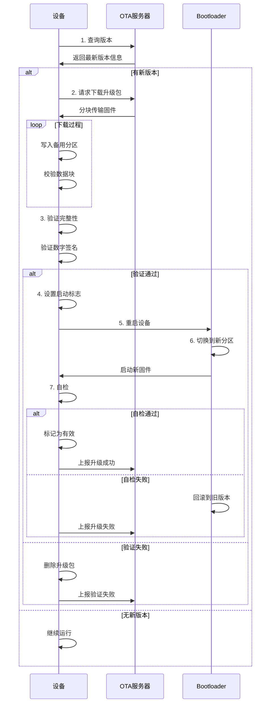

# OTA升级机制设计：实现嵌入式设备的远程固件更新

## 概述

OTA（Over-The-Air）升级是现代嵌入式设备的核心功能之一，它允许设备在不需要物理接触的情况下进行固件更新。无论是修复bug、添加新功能还是提升性能，OTA升级都能让设备保持最新状态。

完成本文学习后，你将能够：

- 理解OTA升级的基本原理和工作流程
- 掌握双分区（A/B分区）升级策略
- 了解版本管理和升级包制作方法
- 理解回滚机制的设计和实现
- 掌握OTA升级的安全性保障措施
- 了解常见的OTA升级方案和最佳实践

## 背景知识

### 为什么需要OTA升级

在传统的嵌入式开发中，固件更新需要：
- 物理连接设备（JTAG、串口等）
- 专业的烧录工具和技术人员
- 设备停机和现场维护
- 高昂的维护成本

OTA升级解决了这些问题：
- **远程更新**：无需物理接触设备
- **批量升级**：同时更新大量设备
- **快速响应**：及时修复安全漏洞
- **降低成本**：减少现场维护费用
- **用户友好**：提升用户体验

### OTA升级的应用场景

- **智能家居设备**：智能音箱、智能门锁、摄像头
- **可穿戴设备**：智能手表、健康监测设备
- **工业设备**：传感器节点、控制器
- **车载系统**：车机系统、ADAS模块
- **IoT设备**：各类物联网终端设备


## OTA升级原理

### 基本工作流程

OTA升级的完整流程包括以下几个阶段：

```
┌─────────────────────────────────────────────────┐
│  1. 版本检查阶段                                 │
│  ┌──────────────┐                               │
│  │ 设备查询     │ → 服务器检查是否有新版本       │
│  │ 当前版本     │                               │
│  └──────────────┘                               │
└─────────────────────────────────────────────────┘
                        ↓
┌─────────────────────────────────────────────────┐
│  2. 下载阶段                                     │
│  ┌──────────────┐                               │
│  │ 下载升级包   │ → 分块下载，校验完整性         │
│  │ 存储到Flash  │                               │
│  └──────────────┘                               │
└─────────────────────────────────────────────────┘
                        ↓
┌─────────────────────────────────────────────────┐
│  3. 验证阶段                                     │
│  ┌──────────────┐                               │
│  │ 校验升级包   │ → 验证签名、完整性、版本       │
│  │ 完整性       │                               │
│  └──────────────┘                               │
└─────────────────────────────────────────────────┘
                        ↓
┌─────────────────────────────────────────────────┐
│  4. 安装阶段                                     │
│  ┌──────────────┐                               │
│  │ 写入新固件   │ → 更新到备用分区               │
│  │ 设置启动标志 │                               │
│  └──────────────┘                               │
└─────────────────────────────────────────────────┘
                        ↓
┌─────────────────────────────────────────────────┐
│  5. 重启验证阶段                                 │
│  ┌──────────────┐                               │
│  │ 重启设备     │ → Bootloader切换到新固件       │
│  │ 运行新固件   │                               │
│  └──────────────┘                               │
└─────────────────────────────────────────────────┘
                        ↓
┌─────────────────────────────────────────────────┐
│  6. 确认阶段                                     │
│  ┌──────────────┐                               │
│  │ 新固件自检   │ → 成功：标记为有效             │
│  │ 上报状态     │   失败：回滚到旧版本           │
│  └──────────────┘                               │
└─────────────────────────────────────────────────┘
```

### 核心组件

**1. Bootloader（引导加载程序）**

Bootloader是OTA升级的核心，负责：
- 选择启动哪个固件分区
- 验证固件的完整性和有效性
- 执行固件切换和回滚
- 提供固件更新的底层支持

**2. 应用固件（Application Firmware）**

应用固件包含：
- OTA客户端：负责下载和安装升级包
- 版本管理：记录当前版本信息
- 状态上报：向服务器报告升级状态

**3. OTA服务器**

服务器端功能：
- 固件版本管理
- 升级包分发
- 设备状态监控
- 升级策略控制


## 分区策略

### 单分区升级

**Flash布局**：

```
┌─────────────────────────────────────┐
│  Bootloader (64KB)                  │  0x00000000
├─────────────────────────────────────┤
│  Application (1920KB)               │  0x00010000
├─────────────────────────────────────┤
│  OTA Data (128KB)                   │  0x001F0000
├─────────────────────────────────────┤
│  User Data (128KB)                  │  0x00210000
└─────────────────────────────────────┘
```

**特点**：
- ✅ Flash空间利用率高
- ✅ 实现简单
- ❌ 升级失败无法回滚
- ❌ 升级过程中设备不可用
- ❌ 风险较高

**适用场景**：
- Flash空间非常有限的设备
- 可以接受升级失败风险的场景
- 有其他恢复机制的系统

### 双分区升级（A/B分区）

**Flash布局**：

```
┌─────────────────────────────────────┐
│  Bootloader (64KB)                  │  0x00000000
├─────────────────────────────────────┤
│  Partition A (960KB)                │  0x00010000
│  [当前运行的固件]                    │
├─────────────────────────────────────┤
│  Partition B (960KB)                │  0x00100000
│  [备用分区/新固件]                   │
├─────────────────────────────────────┤
│  OTA Data (64KB)                    │  0x001F0000
│  - 分区状态                          │
│  - 版本信息                          │
│  - 启动标志                          │
├─────────────────────────────────────┤
│  User Data (64KB)                   │  0x00200000
└─────────────────────────────────────┘
```

**工作原理**：

1. **正常运行**：设备从分区A启动运行
2. **下载升级**：新固件下载到分区B
3. **切换启动**：设置Bootloader从分区B启动
4. **验证运行**：重启后从分区B运行新固件
5. **确认成功**：新固件自检通过，标记分区B为有效
6. **下次升级**：分区A成为备用分区

**升级流程示意**：

```
初始状态：
┌─────────┐  ┌─────────┐
│ 分区A   │  │ 分区B   │
│ v1.0    │  │ (空)    │
│ [运行]  │  │         │
└─────────┘  └─────────┘

下载新固件：
┌─────────┐  ┌─────────┐
│ 分区A   │  │ 分区B   │
│ v1.0    │  │ v2.0    │
│ [运行]  │  │ [下载]  │
└─────────┘  └─────────┘

切换启动：
┌─────────┐  ┌─────────┐
│ 分区A   │  │ 分区B   │
│ v1.0    │  │ v2.0    │
│ [备份]  │  │ [运行]  │
└─────────┘  └─────────┘
```

**特点**：
- ✅ 升级失败可以回滚
- ✅ 升级过程安全可靠
- ✅ 支持快速切换
- ❌ 需要双倍Flash空间
- ❌ 实现相对复杂

**适用场景**：
- Flash空间充足的设备
- 对可靠性要求高的系统
- 商业产品的标准方案


## 版本管理

### 版本号规范

采用语义化版本号（Semantic Versioning）：

```
主版本号.次版本号.修订号
例如：2.1.3
```

**版本号含义**：
- **主版本号（Major）**：不兼容的API修改
- **次版本号（Minor）**：向下兼容的功能性新增
- **修订号（Patch）**：向下兼容的问题修正

**版本号示例**：
- `1.0.0` - 初始版本
- `1.0.1` - 修复bug
- `1.1.0` - 添加新功能
- `2.0.0` - 重大更新，不兼容旧版本

### 版本信息存储

**固件头部信息**：

```c
typedef struct {
    uint32_t magic;              // 魔数：0x4F544146 ("OTAF")
    uint8_t  version_major;      // 主版本号
    uint8_t  version_minor;      // 次版本号
    uint16_t version_patch;      // 修订号
    uint32_t build_timestamp;    // 编译时间戳
    uint32_t firmware_size;      // 固件大小
    uint32_t crc32;              // CRC32校验值
    uint8_t  signature[256];     // 数字签名
    char     build_id[32];       // 构建ID
    char     description[64];    // 版本描述
} firmware_header_t;
```

### 版本比较逻辑

```c
// 版本比较函数
int version_compare(uint8_t major1, uint8_t minor1, uint16_t patch1,
                   uint8_t major2, uint8_t minor2, uint16_t patch2)
{
    if (major1 != major2) return major1 - major2;
    if (minor1 != minor2) return minor1 - minor2;
    return patch1 - patch2;
}

// 检查是否可以升级
bool can_upgrade(firmware_header_t *current, firmware_header_t *new_fw)
{
    // 比较版本号
    int cmp = version_compare(
        current->version_major, current->version_minor, current->version_patch,
        new_fw->version_major, new_fw->version_minor, new_fw->version_patch
    );
    
    // 新版本必须更高
    if (cmp >= 0) {
        return false;  // 版本号不高于当前版本
    }
    
    // 检查主版本号兼容性
    if (new_fw->version_major != current->version_major) {
        // 主版本号不同，需要特殊处理
        // 可能需要用户确认或特殊升级流程
    }
    
    return true;
}
```


## 升级流程设计

### 完整升级流程



### 状态机设计

OTA升级过程可以用状态机来管理：

```
┌─────────────┐
│   IDLE      │ ← 初始状态
└──────┬──────┘
       │ 发现新版本
       ↓
┌─────────────┐
│ DOWNLOADING │ ← 下载中
└──────┬──────┘
       │ 下载完成
       ↓
┌─────────────┐
│ VERIFYING   │ ← 验证中
└──────┬──────┘
       │ 验证通过
       ↓
┌─────────────┐
│ INSTALLING  │ ← 安装中
└──────┬──────┘
       │ 安装完成
       ↓
┌─────────────┐
│ REBOOTING   │ ← 重启中
└──────┬──────┘
       │ 重启完成
       ↓
┌─────────────┐
│ TESTING     │ ← 测试中
└──────┬──────┘
       │
       ├─ 成功 → IDLE (新版本)
       │
       └─ 失败 → ROLLBACK → IDLE (旧版本)
```


## 回滚机制

### 回滚触发条件

回滚机制确保升级失败时能够恢复到稳定版本：

**触发条件**：
1. **启动失败**：新固件无法正常启动
2. **自检失败**：新固件自检发现严重问题
3. **超时未确认**：新固件运行超时未确认成功
4. **用户手动回滚**：用户主动触发回滚
5. **看门狗复位**：新固件运行异常导致看门狗复位

### 回滚实现方式

**方式1：Bootloader自动回滚**

```c
// Bootloader中的回滚逻辑
void bootloader_check_and_boot(void)
{
    ota_data_t ota_data;
    read_ota_data(&ota_data);
    
    // 检查启动次数
    if (ota_data.boot_count > MAX_BOOT_ATTEMPTS) {
        // 超过最大尝试次数，回滚
        printf("Boot failed %d times, rolling back\n", ota_data.boot_count);
        
        // 切换回旧分区
        ota_data.active_partition = (ota_data.active_partition == 0) ? 1 : 0;
        ota_data.boot_count = 0;
        ota_data.state = OTA_STATE_ROLLBACK;
        write_ota_data(&ota_data);
    }
    
    // 增加启动计数
    ota_data.boot_count++;
    write_ota_data(&ota_data);
    
    // 启动对应分区
    boot_partition(ota_data.active_partition);
}
```

**方式2：应用层确认机制**

```c
// 应用固件启动后的确认逻辑
void app_main(void)
{
    // 初始化系统
    system_init();
    
    // 执行自检
    if (self_test_passed()) {
        // 自检通过，确认升级成功
        ota_mark_valid();
        printf("OTA upgrade confirmed\n");
    } else {
        // 自检失败，触发回滚
        ota_mark_invalid();
        printf("Self-test failed, will rollback on next boot\n");
        esp_restart();
    }
    
    // 正常运行
    app_run();
}

// 标记当前固件为有效
void ota_mark_valid(void)
{
    ota_data_t ota_data;
    read_ota_data(&ota_data);
    
    // 重置启动计数
    ota_data.boot_count = 0;
    ota_data.state = OTA_STATE_VALID;
    ota_data.confirmed = true;
    
    write_ota_data(&ota_data);
}
```

### 回滚数据保护

在回滚过程中需要保护用户数据：

**数据分类**：
- **系统数据**：随固件回滚
- **用户数据**：保持不变
- **配置数据**：根据兼容性决定

**数据迁移策略**：
```c
// 版本回滚时的数据处理
void handle_rollback_data(uint8_t old_version, uint8_t new_version)
{
    if (old_version > new_version) {
        // 版本降级，可能需要数据迁移
        printf("Downgrade from v%d to v%d\n", old_version, new_version);
        
        // 检查数据兼容性
        if (!is_data_compatible(old_version, new_version)) {
            // 数据不兼容，执行迁移
            migrate_user_data(old_version, new_version);
        }
    }
}
```


## 安全性保障

### 固件签名验证

使用数字签名确保固件来源可信：

**签名流程**：

```
开发端：
┌──────────────┐
│ 固件二进制   │
└──────┬───────┘
       │
       ↓ 计算哈希
┌──────────────┐
│ SHA-256哈希  │
└──────┬───────┘
       │
       ↓ 私钥签名
┌──────────────┐
│ RSA签名      │
└──────┬───────┘
       │
       ↓ 附加到固件
┌──────────────┐
│ 签名固件包   │
└──────────────┘

设备端：
┌──────────────┐
│ 接收固件包   │
└──────┬───────┘
       │
       ↓ 提取签名
┌──────────────┐
│ 验证签名     │
└──────┬───────┘
       │
       ↓ 公钥验证
┌──────────────┐
│ 验证通过/失败│
└──────────────┘
```

**验证代码示例**：

```c
#include "mbedtls/rsa.h"
#include "mbedtls/sha256.h"

// 验证固件签名
bool verify_firmware_signature(const uint8_t *firmware, size_t fw_size,
                               const uint8_t *signature, size_t sig_size)
{
    // 1. 计算固件哈希
    uint8_t hash[32];
    mbedtls_sha256(firmware, fw_size, hash, 0);
    
    // 2. 使用公钥验证签名
    mbedtls_rsa_context rsa;
    mbedtls_rsa_init(&rsa, MBEDTLS_RSA_PKCS_V15, 0);
    
    // 加载公钥（存储在设备中）
    load_public_key(&rsa);
    
    // 验证签名
    int ret = mbedtls_rsa_pkcs1_verify(&rsa, NULL, NULL,
                                       MBEDTLS_RSA_PUBLIC,
                                       MBEDTLS_MD_SHA256,
                                       32, hash, signature);
    
    mbedtls_rsa_free(&rsa);
    
    return (ret == 0);
}
```

### 传输加密

使用TLS/SSL加密传输通道：

**加密方式**：
- **HTTPS**：适用于HTTP下载
- **MQTTS**：适用于MQTT传输
- **自定义加密**：AES加密固件包

**HTTPS下载示例**：

```c
#include "esp_http_client.h"

esp_err_t download_firmware_https(const char *url)
{
    esp_http_client_config_t config = {
        .url = url,
        .cert_pem = server_cert_pem,  // 服务器证书
        .event_handler = http_event_handler,
        .buffer_size = 4096,
    };
    
    esp_http_client_handle_t client = esp_http_client_init(&config);
    
    // 执行下载
    esp_err_t err = esp_http_client_perform(client);
    
    esp_http_client_cleanup(client);
    return err;
}
```

### 防回滚攻击

防止攻击者将固件降级到有漏洞的旧版本：

**防护措施**：

1. **版本单调性**：只允许升级到更高版本
2. **最低版本限制**：设置不可降级的最低版本
3. **版本白名单**：只接受特定版本的升级

```c
// 防回滚检查
bool check_anti_rollback(firmware_header_t *new_fw)
{
    // 读取最低允许版本
    uint8_t min_version = read_min_version_from_efuse();
    
    // 检查新固件版本是否低于最低版本
    if (new_fw->version_major < min_version) {
        printf("Rollback attack detected! Version too old.\n");
        return false;
    }
    
    return true;
}

// 升级成功后更新最低版本（写入eFuse，不可逆）
void update_min_version(uint8_t new_min_version)
{
    // 写入eFuse（一次性写入，不可修改）
    write_min_version_to_efuse(new_min_version);
}
```

### 完整性校验

多层次的完整性校验：

**校验层次**：

1. **传输层校验**：每个数据块的CRC校验
2. **固件层校验**：整个固件的CRC32/SHA256
3. **分区层校验**：分区表的完整性校验

```c
// 分块下载时的校验
bool download_and_verify_chunk(uint32_t offset, const uint8_t *data, 
                               size_t size, uint32_t expected_crc)
{
    // 计算数据块CRC
    uint32_t calculated_crc = crc32(0, data, size);
    
    // 验证CRC
    if (calculated_crc != expected_crc) {
        printf("Chunk CRC mismatch at offset %u\n", offset);
        return false;
    }
    
    // 写入Flash
    esp_partition_write(ota_partition, offset, data, size);
    
    return true;
}

// 完整固件的校验
bool verify_complete_firmware(const esp_partition_t *partition)
{
    firmware_header_t header;
    esp_partition_read(partition, 0, &header, sizeof(header));
    
    // 验证魔数
    if (header.magic != FIRMWARE_MAGIC) {
        return false;
    }
    
    // 计算整个固件的CRC32
    uint32_t calculated_crc = 0;
    uint8_t buffer[1024];
    size_t remaining = header.firmware_size;
    size_t offset = sizeof(header);
    
    while (remaining > 0) {
        size_t to_read = (remaining > sizeof(buffer)) ? sizeof(buffer) : remaining;
        esp_partition_read(partition, offset, buffer, to_read);
        calculated_crc = crc32(calculated_crc, buffer, to_read);
        offset += to_read;
        remaining -= to_read;
    }
    
    // 验证CRC
    return (calculated_crc == header.crc32);
}
```


## 常见OTA方案

### ESP32 OTA方案

ESP32提供了完整的OTA支持：

**特点**：
- 内置双分区支持
- 提供OTA API
- 支持HTTPS下载
- 自动处理分区切换

**基本使用**：

```c
#include "esp_ota_ops.h"
#include "esp_http_client.h"

void ota_task(void *pvParameter)
{
    esp_http_client_config_t config = {
        .url = "https://example.com/firmware.bin",
        .cert_pem = server_cert,
    };
    
    esp_err_t ret = esp_https_ota(&config);
    
    if (ret == ESP_OK) {
        printf("OTA Succeed, Rebooting...\n");
        esp_restart();
    } else {
        printf("OTA Failed\n");
    }
}
```

### STM32 OTA方案

STM32需要自己实现OTA机制：

**实现要点**：
- 自定义Bootloader
- 手动管理分区
- 实现固件下载和写入
- 处理分区切换逻辑

**Bootloader示例**：

```c
// STM32 Bootloader主函数
int main(void)
{
    HAL_Init();
    SystemClock_Config();
    
    // 读取OTA数据
    ota_info_t ota_info;
    read_ota_info(&ota_info);
    
    // 检查是否有新固件
    if (ota_info.new_firmware_available) {
        // 验证新固件
        if (verify_firmware(APP_PARTITION_B)) {
            // 切换到新固件
            ota_info.active_partition = PARTITION_B;
            ota_info.new_firmware_available = 0;
            write_ota_info(&ota_info);
        }
    }
    
    // 跳转到应用程序
    uint32_t app_address;
    if (ota_info.active_partition == PARTITION_A) {
        app_address = APP_PARTITION_A_ADDR;
    } else {
        app_address = APP_PARTITION_B_ADDR;
    }
    
    jump_to_application(app_address);
}

// 跳转到应用程序
void jump_to_application(uint32_t app_addr)
{
    // 检查栈指针是否有效
    if (((*(__IO uint32_t*)app_addr) & 0x2FFE0000) == 0x20000000) {
        // 获取应用程序的栈指针和复位向量
        uint32_t jump_address = *(__IO uint32_t*)(app_addr + 4);
        pFunction jump_to_app = (pFunction)jump_address;
        
        // 设置栈指针
        __set_MSP(*(__IO uint32_t*)app_addr);
        
        // 跳转到应用程序
        jump_to_app();
    }
}
```

### Linux OTA方案

Linux系统的OTA通常使用以下方案：

**方案1：SWUpdate**
- 开源OTA解决方案
- 支持多种更新策略
- 提供Web界面
- 支持加密和签名

**方案2：Mender**
- 商业OTA平台
- 提供完整的设备管理
- 支持增量更新
- 云端管理界面

**方案3：RAUC**
- 轻量级更新框架
- 基于A/B分区
- 支持原子更新
- 集成到Yocto/Buildroot


## 最佳实践

### 设计原则

1. **安全第一**
   - 必须验证固件签名
   - 使用加密传输通道
   - 防止回滚攻击
   - 保护敏感数据

2. **可靠性优先**
   - 实现完善的回滚机制
   - 多层次完整性校验
   - 断点续传支持
   - 失败重试机制

3. **用户体验**
   - 显示升级进度
   - 提供升级说明
   - 允许用户选择升级时间
   - 最小化升级时间

4. **可维护性**
   - 详细的日志记录
   - 版本信息追踪
   - 升级统计分析
   - 远程诊断能力

### 开发建议

**1. 分区规划**

```
推荐的Flash分区布局：
┌─────────────────────────────────────┐
│  Bootloader (64KB)                  │  - 尽量小，功能单一
├─────────────────────────────────────┤
│  Partition Table (4KB)              │  - 分区表
├─────────────────────────────────────┤
│  NVS (16KB)                         │  - 非易失性存储
├─────────────────────────────────────┤
│  OTA Data (8KB)                     │  - OTA状态信息
├─────────────────────────────────────┤
│  App Partition A (1.5MB)            │  - 应用分区A
├─────────────────────────────────────┤
│  App Partition B (1.5MB)            │  - 应用分区B
├─────────────────────────────────────┤
│  User Data (128KB)                  │  - 用户数据
└─────────────────────────────────────┘
```

**2. 错误处理**

```c
// 完善的错误处理
esp_err_t perform_ota_update(const char *url)
{
    esp_err_t err;
    int retry_count = 0;
    const int max_retries = 3;
    
    while (retry_count < max_retries) {
        err = esp_https_ota(&config);
        
        if (err == ESP_OK) {
            log_ota_success();
            return ESP_OK;
        }
        
        // 记录错误
        log_ota_error(err, retry_count);
        
        // 根据错误类型决定是否重试
        if (err == ESP_ERR_OTA_VALIDATE_FAILED) {
            // 验证失败，不重试
            return err;
        }
        
        retry_count++;
        vTaskDelay(pdMS_TO_TICKS(5000));  // 等待5秒后重试
    }
    
    return ESP_FAIL;
}
```

**3. 进度反馈**

```c
// 下载进度回调
esp_err_t http_event_handler(esp_http_client_event_t *evt)
{
    static int total_len = 0;
    static int downloaded_len = 0;
    
    switch(evt->event_id) {
        case HTTP_EVENT_ON_HEADER:
            if (strcasecmp(evt->header_key, "Content-Length") == 0) {
                total_len = atoi(evt->header_value);
            }
            break;
            
        case HTTP_EVENT_ON_DATA:
            downloaded_len += evt->data_len;
            int progress = (downloaded_len * 100) / total_len;
            printf("Download progress: %d%%\r", progress);
            
            // 通知UI更新进度
            update_progress_bar(progress);
            break;
            
        case HTTP_EVENT_ON_FINISH:
            printf("\nDownload complete\n");
            break;
            
        default:
            break;
    }
    return ESP_OK;
}
```

**4. 日志记录**

```c
// OTA日志结构
typedef struct {
    uint32_t timestamp;
    uint8_t old_version[3];  // major.minor.patch
    uint8_t new_version[3];
    ota_result_t result;     // SUCCESS, FAILED, ROLLBACK
    uint32_t error_code;
    char description[64];
} ota_log_entry_t;

// 记录OTA事件
void log_ota_event(ota_log_entry_t *entry)
{
    // 写入Flash日志区
    append_to_ota_log(entry);
    
    // 上报到服务器
    report_ota_status_to_server(entry);
}
```

### 测试策略

**1. 功能测试**
- 正常升级流程测试
- 断电恢复测试
- 网络中断测试
- 版本兼容性测试
- 回滚功能测试

**2. 压力测试**
- 大量设备同时升级
- 弱网环境测试
- 低电量升级测试
- 存储空间不足测试

**3. 安全测试**
- 签名验证测试
- 中间人攻击测试
- 回滚攻击测试
- 固件篡改测试

**4. 兼容性测试**
- 不同硬件版本
- 不同固件版本
- 跨主版本升级
- 数据迁移测试


## 常见问题

### Q1: OTA升级失败后设备无法启动怎么办？

**A**: 这是OTA设计中必须考虑的关键问题。解决方案：

1. **实现可靠的Bootloader**：Bootloader应该足够简单和稳定，不轻易损坏
2. **双分区策略**：保留旧版本固件，升级失败时自动回滚
3. **启动计数器**：Bootloader记录启动失败次数，超过阈值自动回滚
4. **硬件恢复机制**：预留UART/JTAG等硬件恢复接口

```c
// Bootloader中的保护逻辑
if (boot_fail_count > 3) {
    // 多次启动失败，回滚到备份分区
    switch_to_backup_partition();
}
```

### Q2: 如何处理升级过程中的断电？

**A**: 断电保护是OTA可靠性的重要保障：

1. **原子操作**：使用双缓冲或影子分区，确保写入操作的原子性
2. **状态保存**：记录升级进度，断电后可以继续
3. **完整性校验**：启动前验证固件完整性
4. **自动恢复**：检测到不完整的升级自动清理或恢复

```c
// 断电恢复逻辑
if (ota_state == OTA_STATE_DOWNLOADING) {
    // 升级未完成，清理临时数据
    cleanup_incomplete_ota();
    // 继续使用旧版本
    boot_old_firmware();
}
```

### Q3: 如何优化OTA升级的时间？

**A**: 升级时间优化策略：

1. **差分升级**：只传输变化的部分，减少数据量
2. **压缩传输**：对固件进行压缩，减少传输时间
3. **并行下载**：支持多线程或分块并行下载
4. **后台升级**：在设备空闲时进行下载和准备
5. **智能调度**：选择网络状况好的时间段升级

```c
// 差分升级示例
typedef struct {
    uint32_t offset;      // 修改位置
    uint32_t old_crc;     // 旧数据CRC
    uint32_t new_size;    // 新数据大小
    uint8_t  new_data[];  // 新数据
} diff_block_t;
```

### Q4: 如何确保OTA升级的安全性？

**A**: 多层次的安全保障：

1. **固件签名**：使用RSA/ECDSA签名，验证固件来源
2. **传输加密**：使用TLS/SSL加密传输通道
3. **防回滚**：使用eFuse或安全存储记录最低版本
4. **访问控制**：服务器端实现设备认证和授权
5. **安全启动**：配合Secure Boot确保启动链安全

### Q5: 大量设备如何进行OTA升级管理？

**A**: 批量升级管理策略：

1. **分批升级**：将设备分组，逐批升级
2. **灰度发布**：先在小范围测试，逐步扩大
3. **版本管理**：支持多版本共存，灵活控制
4. **监控告警**：实时监控升级状态，及时发现问题
5. **回滚策略**：发现问题快速回滚

```
升级策略示例：
第1批：1%设备（测试组）
第2批：10%设备（小规模）
第3批：50%设备（大规模）
第4批：100%设备（全量）

每批之间观察24小时，确认无问题后继续
```

### Q6: 如何处理不同硬件版本的OTA升级？

**A**: 硬件版本管理方案：

1. **硬件版本识别**：在固件中读取硬件版本信息
2. **固件适配**：为不同硬件版本提供对应固件
3. **兼容性检查**：升级前检查固件与硬件的兼容性
4. **版本映射**：服务器端维护硬件-固件版本映射表

```c
// 硬件版本检查
bool check_hardware_compatibility(firmware_header_t *fw)
{
    uint8_t hw_version = read_hardware_version();
    
    // 检查固件支持的硬件版本范围
    if (hw_version < fw->min_hw_version || 
        hw_version > fw->max_hw_version) {
        printf("Hardware version %d not compatible\n", hw_version);
        return false;
    }
    
    return true;
}
```


## 总结

通过本文的学习，你应该掌握了OTA升级机制的核心知识：

### 核心要点

1. **OTA升级原理**
   - 理解OTA升级的完整流程
   - 掌握版本检查、下载、验证、安装、确认各阶段
   - 了解Bootloader在OTA中的关键作用

2. **分区策略**
   - 单分区升级：简单但风险高
   - 双分区升级：可靠但占用空间大
   - 根据实际需求选择合适的策略

3. **版本管理**
   - 使用语义化版本号
   - 实现版本比较和兼容性检查
   - 维护版本历史和升级路径

4. **回滚机制**
   - 多种回滚触发条件
   - Bootloader和应用层的回滚实现
   - 数据保护和迁移策略

5. **安全保障**
   - 固件签名和验证
   - 传输加密
   - 防回滚攻击
   - 多层次完整性校验

6. **最佳实践**
   - 安全第一、可靠性优先
   - 完善的错误处理和日志记录
   - 全面的测试策略
   - 用户体验优化

### 关键技术点

| 技术点 | 重要性 | 实现难度 |
|--------|--------|----------|
| 双分区管理 | ⭐⭐⭐⭐⭐ | ⭐⭐⭐ |
| 固件签名验证 | ⭐⭐⭐⭐⭐ | ⭐⭐⭐⭐ |
| 回滚机制 | ⭐⭐⭐⭐⭐ | ⭐⭐⭐ |
| 断点续传 | ⭐⭐⭐⭐ | ⭐⭐⭐ |
| 差分升级 | ⭐⭐⭐ | ⭐⭐⭐⭐ |
| 批量管理 | ⭐⭐⭐⭐ | ⭐⭐⭐ |

### 实施建议

**对于初学者**：
1. 从ESP32等提供OTA支持的平台开始
2. 先实现基本的OTA功能
3. 逐步添加安全和可靠性特性
4. 在实际项目中积累经验

**对于进阶开发者**：
1. 深入理解Bootloader原理
2. 实现自定义OTA方案
3. 优化升级性能和用户体验
4. 构建完整的设备管理平台

## 延伸阅读

### 推荐资源

**官方文档**：
- [ESP-IDF OTA文档](https://docs.espressif.com/projects/esp-idf/en/latest/esp32/api-reference/system/ota.html) - ESP32 OTA官方指南
- [STM32 IAP应用笔记](https://www.st.com/resource/en/application_note/an3965-stm32f40xxx41xxx-inapplication-programming-iap-over-ethernet-stmicroelectronics.pdf) - STM32在线升级
- [Android OTA更新](https://source.android.com/devices/tech/ota) - Android系统OTA机制

**开源项目**：
- [MCUboot](https://github.com/mcu-tools/mcuboot) - 通用的安全启动加载程序
- [SWUpdate](https://github.com/sbabic/swupdate) - Linux嵌入式系统OTA方案
- [Mender](https://github.com/mendersoftware/mender) - 商业级OTA更新平台

**技术文章**：
- [深入理解Android OTA升级](link) - Android OTA机制详解
- [嵌入式系统安全启动](link) - Secure Boot原理
- [固件签名和验证最佳实践](link) - 安全性实现指南

### 相关主题

继续学习以下相关内容：

1. **[Bootloader开发基础](link)**
   - 学习如何开发自定义Bootloader
   - 理解启动流程和分区管理

2. **[远程配置管理实现](link)**
   - 学习设备配置的远程管理
   - 实现配置的动态更新

3. **[远程诊断与调试技术](link)**
   - 学习远程问题定位方法
   - 实现远程日志和监控

4. **[加密与安全基础](link)**
   - 深入学习加密算法
   - 理解数字签名原理

5. **[设备管理平台开发](link)**
   - 构建完整的IoT管理平台
   - 实现设备生命周期管理

## 参考资料

1. ESP-IDF Programming Guide - OTA Updates
2. STM32 Application Note AN3965 - In-Application Programming
3. "Embedded Systems Security" by David Kleidermacher
4. "IoT Inc: How Your Company Can Use the Internet of Things to Win in the Outcome Economy" by Bruce Sinclair
5. RFC 6024 - Trust Anchor Management Requirements
6. NIST Special Publication 800-147B - BIOS Protection Guidelines for Servers

---

**练习题**：

1. 设计一个支持OTA升级的Flash分区布局，总容量为4MB
2. 实现一个简单的版本比较函数，支持语义化版本号
3. 编写Bootloader的分区选择逻辑，支持启动失败自动回滚
4. 设计一个OTA升级的状态机，包含所有可能的状态转换
5. 实现固件的CRC32校验功能

**实践项目**：

尝试在ESP32或STM32上实现一个完整的OTA升级系统，包括：
- 双分区管理
- HTTP/HTTPS固件下载
- 固件验证和安装
- 启动失败自动回滚
- 升级进度显示
- 日志记录和状态上报

**下一步**：建议学习 [远程配置管理实现](link)，了解如何实现设备配置的远程管理和动态更新。

---

**反馈与讨论**：

如果你在学习过程中有任何问题或建议，欢迎在评论区留言讨论！

**文章更新记录**：
- 2024-01-15：初始版本发布
- 版本：1.0

