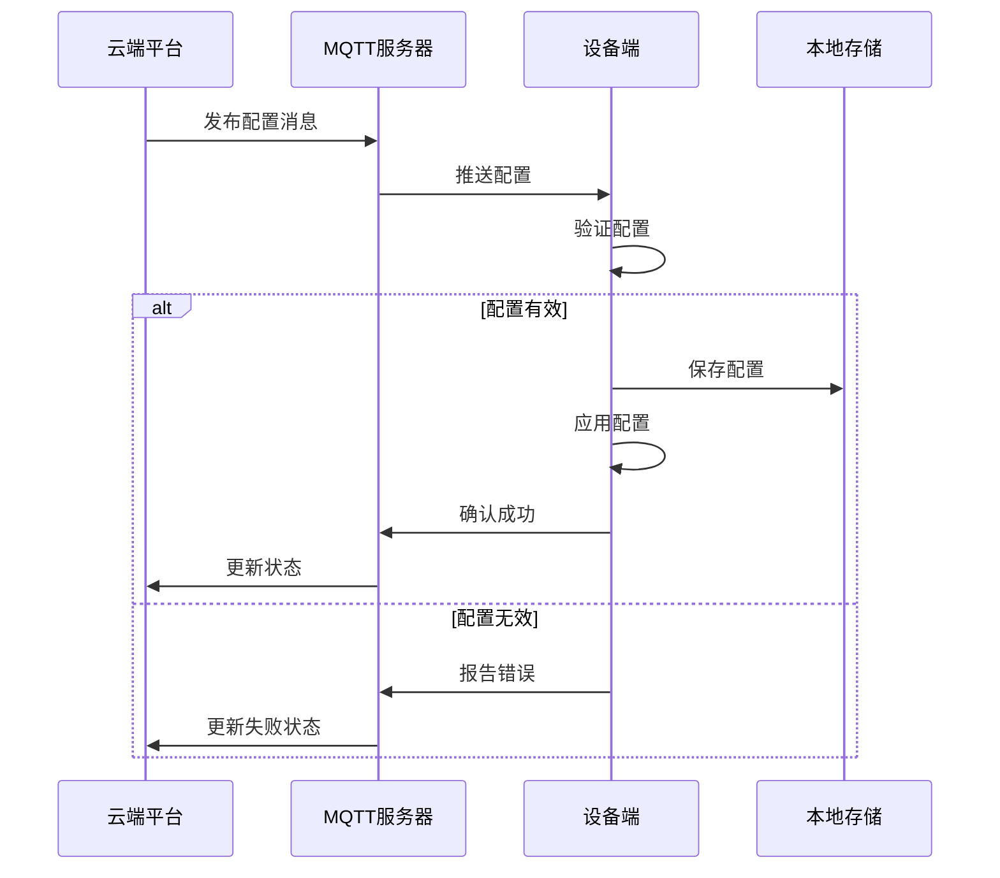

# 嵌入式远程配置管理实现

## 学习目标

完成本教程后，你将能够：

- [ ] 理解远程配置管理的架构和工作原理
- [ ] 掌握配置数据的格式设计和存储方法
- [ ] 实现配置的云端下发和设备端接收
- [ ] 学会配置验证和安全性检查
- [ ] 实现配置的动态生效和回滚机制
- [ ] 处理配置冲突和版本管理

## 前置要求

在开始本教程之前，你需要：

**知识要求**：
- 了解C语言基础和结构体操作
- 熟悉JSON数据格式
- 理解MQTT或HTTP协议基础
- 掌握文件系统操作（如LittleFS、SPIFFS）

**技能要求**：
- 能够使用嵌入式开发环境
- 会配置网络连接（WiFi/以太网）
- 了解基本的加密和校验方法

## 准备工作

### 硬件准备

| 名称 | 数量 | 说明 | 参考型号 |
|------|------|------|----------|
| 开发板 | 1 | 支持网络连接 | ESP32、STM32+W5500 |
| 调试器 | 1 | 用于程序下载和调试 | ST-Link、USB-TTL |
| 路由器 | 1 | 提供网络连接 | - |
| USB线 | 1 | 供电和调试 | - |

**网络模块选择**：
- **WiFi**：ESP32、ESP8266（集成WiFi）
- **以太网**：STM32 + W5500/ENC28J60
- **4G/NB-IoT**：SIM7600、BC26（需要SIM卡）

### 软件准备

- **开发环境**：Arduino IDE、PlatformIO 或 ESP-IDF
- **MQTT服务器**：EMQX、Mosquitto（本地测试）或云服务
- **JSON库**：ArduinoJson、cJSON
- **文件系统**：LittleFS、SPIFFS
- **测试工具**：MQTT.fx、MQTTX（MQTT客户端）

### 环境配置

1. 安装开发环境和必要的库
2. 搭建MQTT服务器（或使用公共测试服务器）
3. 配置网络连接参数
4. 准备配置文件格式定义

## 远程配置管理基础

### 配置管理架构

远程配置管理系统通常包含以下组件：

```
云端配置平台 ←→ 通信协议 ←→ 设备端配置管理器
     ↓                           ↓
  配置存储                   本地配置存储
  版本管理                   配置验证
  权限控制                   动态生效
```

**架构层次**：

1. **云端层**：
   - 配置管理界面
   - 配置存储和版本控制
   - 设备管理和权限控制
   - 配置下发调度

2. **通信层**：
   - MQTT/HTTP/CoAP协议
   - 数据加密和压缩
   - 断线重连和消息队列
   - 传输可靠性保证

3. **设备层**：
   - 配置接收和解析
   - 配置验证和校验
   - 配置存储和备份
   - 配置生效和回滚

### 配置数据格式

使用JSON格式定义配置数据，便于扩展和解析：

```json
{
  "version": "1.2.0",
  "timestamp": 1705305600,
  "device_id": "ESP32-001",
  "config": {
    "system": {
      "device_name": "智能传感器01",
      "report_interval": 60,
      "log_level": 2
    },
    "network": {
      "wifi_ssid": "MyNetwork",
      "wifi_password": "encrypted_password",
      "mqtt_server": "mqtt.example.com",
      "mqtt_port": 1883
    },
    "sensor": {
      "temperature_offset": 0.5,
      "humidity_offset": -2.0,
      "sample_rate": 10
    },
    "alarm": {
      "temp_high_threshold": 35.0,
      "temp_low_threshold": 10.0,
      "enable_alarm": true
    }
  },
  "checksum": "a1b2c3d4e5f6"
}
```

**字段说明**：
- `version`: 配置版本号，用于版本管理
- `timestamp`: 配置生成时间戳
- `device_id`: 目标设备ID（可选，用于设备验证）
- `config`: 实际配置参数，按模块分组
- `checksum`: 配置校验和，用于验证完整性

### 配置管理流程



## 步骤1：配置数据结构设计

### 1.1 定义配置结构体

```c
// config_manager.h
#ifndef CONFIG_MANAGER_H
#define CONFIG_MANAGER_H

#include <stdint.h>
#include <stdbool.h>

// 配置版本信息
typedef struct {
    uint8_t major;
    uint8_t minor;
    uint8_t patch;
} config_version_t;

// 系统配置
typedef struct {
    char device_name[32];
    uint32_t report_interval;  // 上报间隔（秒）
    uint8_t log_level;         // 日志级别 0-4
} system_config_t;

// 网络配置
typedef struct {
    char wifi_ssid[32];
    char wifi_password[64];
    char mqtt_server[64];
    uint16_t mqtt_port;
    char mqtt_username[32];
    char mqtt_password[64];
} network_config_t;

// 传感器配置
typedef struct {
    float temperature_offset;
    float humidity_offset;
    uint16_t sample_rate;      // 采样率（秒）
} sensor_config_t;

// 告警配置
typedef struct {
    float temp_high_threshold;
    float temp_low_threshold;
    float humidity_high_threshold;
    float humidity_low_threshold;
    bool enable_alarm;
} alarm_config_t;

// 完整配置结构
typedef struct {
    config_version_t version;
    uint32_t timestamp;
    system_config_t system;
    network_config_t network;
    sensor_config_t sensor;
    alarm_config_t alarm;
    uint32_t checksum;
} device_config_t;

// 配置管理器状态
typedef enum {
    CONFIG_STATE_IDLE,
    CONFIG_STATE_RECEIVING,
    CONFIG_STATE_VALIDATING,
    CONFIG_STATE_APPLYING,
    CONFIG_STATE_ERROR
} config_state_t;

#endif // CONFIG_MANAGER_H
```

### 1.2 实现配置初始化

```c
// config_manager.c
#include "config_manager.h"
#include <string.h>

// 全局配置实例
static device_config_t current_config;
static device_config_t backup_config;
static config_state_t config_state = CONFIG_STATE_IDLE;

// 默认配置
const device_config_t default_config = {
    .version = {1, 0, 0},
    .timestamp = 0,
    .system = {
        .device_name = "ESP32-Device",
        .report_interval = 60,
        .log_level = 2
    },
    .network = {
        .wifi_ssid = "",
        .wifi_password = "",
        .mqtt_server = "mqtt.example.com",
        .mqtt_port = 1883,
        .mqtt_username = "",
        .mqtt_password = ""
    },
    .sensor = {
        .temperature_offset = 0.0,
        .humidity_offset = 0.0,
        .sample_rate = 10
    },
    .alarm = {
        .temp_high_threshold = 35.0,
        .temp_low_threshold = 10.0,
        .humidity_high_threshold = 80.0,
        .humidity_low_threshold = 20.0,
        .enable_alarm = true
    },
    .checksum = 0
};

// 初始化配置管理器
bool config_manager_init(void)
{
    // 尝试从存储加载配置
    if (!config_load_from_storage(&current_config)) {
        // 加载失败，使用默认配置
        memcpy(&current_config, &default_config, sizeof(device_config_t));
        
        // 计算并保存默认配置
        current_config.checksum = config_calculate_checksum(&current_config);
        config_save_to_storage(&current_config);
    }
    
    // 备份当前配置
    memcpy(&backup_config, &current_config, sizeof(device_config_t));
    
    return true;
}

// 获取当前配置
device_config_t* config_get_current(void)
{
    return &current_config;
}
```

**代码说明**：
- 第3-4行：定义当前配置和备份配置，用于回滚
- 第7-42行：定义默认配置，当无法加载配置时使用
- 第47-62行：初始化时尝试加载配置，失败则使用默认值

## 步骤2：配置存储实现

### 2.1 使用LittleFS存储配置

```c
// config_storage.c
#include "LittleFS.h"
#include "config_manager.h"

#define CONFIG_FILE_PATH "/config.bin"
#define CONFIG_BACKUP_PATH "/config_backup.bin"

// 保存配置到存储
bool config_save_to_storage(const device_config_t *config)
{
    if (!LittleFS.begin()) {
        Serial.println("Failed to mount LittleFS");
        return false;
    }
    
    // 先保存到临时文件
    File file = LittleFS.open(CONFIG_FILE_PATH ".tmp", "w");
    if (!file) {
        Serial.println("Failed to open config file for writing");
        return false;
    }
    
    // 写入配置数据
    size_t written = file.write((uint8_t*)config, sizeof(device_config_t));
    file.close();
    
    if (written != sizeof(device_config_t)) {
        Serial.println("Failed to write complete config");
        LittleFS.remove(CONFIG_FILE_PATH ".tmp");
        return false;
    }
    
    // 备份旧配置
    if (LittleFS.exists(CONFIG_FILE_PATH)) {
        LittleFS.remove(CONFIG_BACKUP_PATH);
        LittleFS.rename(CONFIG_FILE_PATH, CONFIG_BACKUP_PATH);
    }
    
    // 重命名临时文件为正式文件
    LittleFS.rename(CONFIG_FILE_PATH ".tmp", CONFIG_FILE_PATH);
    
    Serial.println("Config saved successfully");
    return true;
}

// 从存储加载配置
bool config_load_from_storage(device_config_t *config)
{
    if (!LittleFS.begin()) {
        Serial.println("Failed to mount LittleFS");
        return false;
    }
    
    // 检查配置文件是否存在
    if (!LittleFS.exists(CONFIG_FILE_PATH)) {
        Serial.println("Config file not found");
        return false;
    }
    
    // 打开配置文件
    File file = LittleFS.open(CONFIG_FILE_PATH, "r");
    if (!file) {
        Serial.println("Failed to open config file");
        return false;
    }
    
    // 读取配置数据
    size_t read_size = file.read((uint8_t*)config, sizeof(device_config_t));
    file.close();
    
    if (read_size != sizeof(device_config_t)) {
        Serial.println("Config file size mismatch");
        return false;
    }
    
    // 验证校验和
    uint32_t calculated_checksum = config_calculate_checksum(config);
    if (calculated_checksum != config->checksum) {
        Serial.println("Config checksum mismatch");
        // 尝试从备份恢复
        return config_restore_from_backup(config);
    }
    
    Serial.println("Config loaded successfully");
    return true;
}

// 从备份恢复配置
bool config_restore_from_backup(device_config_t *config)
{
    if (!LittleFS.exists(CONFIG_BACKUP_PATH)) {
        Serial.println("Backup config not found");
        return false;
    }
    
    File file = LittleFS.open(CONFIG_BACKUP_PATH, "r");
    if (!file) {
        return false;
    }
    
    size_t read_size = file.read((uint8_t*)config, sizeof(device_config_t));
    file.close();
    
    if (read_size == sizeof(device_config_t)) {
        // 验证备份配置
        uint32_t checksum = config_calculate_checksum(config);
        if (checksum == config->checksum) {
            Serial.println("Config restored from backup");
            // 保存恢复的配置
            config_save_to_storage(config);
            return true;
        }
    }
    
    return false;
}
```

### 2.2 实现校验和计算

```c
// 计算配置校验和（CRC32）
uint32_t config_calculate_checksum(const device_config_t *config)
{
    // 计算除checksum字段外的所有数据
    size_t data_size = sizeof(device_config_t) - sizeof(uint32_t);
    const uint8_t *data = (const uint8_t*)config;
    
    uint32_t crc = 0xFFFFFFFF;
    
    for (size_t i = 0; i < data_size; i++) {
        crc ^= data[i];
        for (int j = 0; j < 8; j++) {
            if (crc & 1) {
                crc = (crc >> 1) ^ 0xEDB88320;
            } else {
                crc >>= 1;
            }
        }
    }
    
    return ~crc;
}

// 验证配置完整性
bool config_verify_integrity(const device_config_t *config)
{
    uint32_t calculated = config_calculate_checksum(config);
    return (calculated == config->checksum);
}
```

**代码说明**：
- 第17-29行：使用临时文件写入，避免写入过程中断导致配置损坏
- 第32-37行：保存新配置前先备份旧配置
- 第76-81行：加载配置后验证校验和，失败则尝试从备份恢复
- 第119-137行：使用CRC32算法计算校验和

## 步骤3：MQTT通信实现

### 3.1 建立MQTT连接

```c
// mqtt_client.cpp
#include <WiFi.h>
#include <PubSubClient.h>
#include "config_manager.h"

WiFiClient espClient;
PubSubClient mqtt_client(espClient);

// MQTT主题定义
#define TOPIC_CONFIG_RECEIVE  "device/%s/config/receive"
#define TOPIC_CONFIG_STATUS   "device/%s/config/status"
#define TOPIC_CONFIG_REQUEST  "device/%s/config/request"

char device_id[32] = "ESP32-001";  // 设备唯一ID

// MQTT回调函数
void mqtt_callback(char* topic, byte* payload, unsigned int length);

// 初始化MQTT客户端
bool mqtt_init(void)
{
    device_config_t *config = config_get_current();
    
    // 设置MQTT服务器
    mqtt_client.setServer(config->network.mqtt_server, 
                          config->network.mqtt_port);
    mqtt_client.setCallback(mqtt_callback);
    
    // 设置缓冲区大小（用于接收大配置）
    mqtt_client.setBufferSize(2048);
    
    return true;
}

// 连接到MQTT服务器
bool mqtt_connect(void)
{
    device_config_t *config = config_get_current();
    
    Serial.print("Connecting to MQTT...");
    
    // 构建客户端ID
    char client_id[64];
    snprintf(client_id, sizeof(client_id), "device_%s", device_id);
    
    // 尝试连接
    bool connected = false;
    if (strlen(config->network.mqtt_username) > 0) {
        // 使用用户名密码连接
        connected = mqtt_client.connect(client_id,
                                       config->network.mqtt_username,
                                       config->network.mqtt_password);
    } else {
        // 匿名连接
        connected = mqtt_client.connect(client_id);
    }
    
    if (connected) {
        Serial.println("connected");
        
        // 订阅配置接收主题
        char topic[128];
        snprintf(topic, sizeof(topic), TOPIC_CONFIG_RECEIVE, device_id);
        mqtt_client.subscribe(topic);
        Serial.printf("Subscribed to: %s\n", topic);
        
        // 发送在线状态
        mqtt_publish_status("online");
        
        return true;
    } else {
        Serial.printf("failed, rc=%d\n", mqtt_client.state());
        return false;
    }
}

// MQTT循环处理
void mqtt_loop(void)
{
    if (!mqtt_client.connected()) {
        // 尝试重连
        static unsigned long last_reconnect = 0;
        unsigned long now = millis();
        
        if (now - last_reconnect > 5000) {
            last_reconnect = now;
            if (mqtt_connect()) {
                last_reconnect = 0;
            }
        }
    } else {
        mqtt_client.loop();
    }
}
```

### 3.2 实现配置接收

```c
// MQTT消息回调
void mqtt_callback(char* topic, byte* payload, unsigned int length)
{
    Serial.printf("Message arrived [%s] length: %d\n", topic, length);
    
    // 检查是否是配置消息
    char config_topic[128];
    snprintf(config_topic, sizeof(config_topic), TOPIC_CONFIG_RECEIVE, device_id);
    
    if (strcmp(topic, config_topic) == 0) {
        // 处理配置消息
        handle_config_message(payload, length);
    }
}

// 处理配置消息
void handle_config_message(byte* payload, unsigned int length)
{
    // 添加字符串结束符
    char* json_str = (char*)malloc(length + 1);
    if (!json_str) {
        Serial.println("Failed to allocate memory for config");
        mqtt_publish_status("error: out of memory");
        return;
    }
    
    memcpy(json_str, payload, length);
    json_str[length] = '\0';
    
    Serial.println("Received config:");
    Serial.println(json_str);
    
    // 解析JSON配置
    bool success = config_parse_and_apply(json_str);
    
    free(json_str);
    
    // 发送处理结果
    if (success) {
        mqtt_publish_status("config applied successfully");
    } else {
        mqtt_publish_status("config apply failed");
    }
}

// 发布状态消息
void mqtt_publish_status(const char* status)
{
    char topic[128];
    snprintf(topic, sizeof(topic), TOPIC_CONFIG_STATUS, device_id);
    
    // 构建状态JSON
    char message[256];
    snprintf(message, sizeof(message), 
             "{\"device_id\":\"%s\",\"status\":\"%s\",\"timestamp\":%lu}",
             device_id, status, millis());
    
    mqtt_client.publish(topic, message);
    Serial.printf("Published status: %s\n", message);
}
```

**代码说明**：
- 第28行：设置较大的缓冲区以接收完整配置
- 第59-62行：连接成功后订阅配置接收主题
- 第75-86行：实现自动重连机制，每5秒尝试一次
- 第104-107行：为JSON字符串添加结束符，确保安全解析

## 步骤4：JSON配置解析

### 4.1 使用ArduinoJson解析配置

```c
// config_parser.cpp
#include <ArduinoJson.h>
#include "config_manager.h"

// 解析并应用配置
bool config_parse_and_apply(const char* json_str)
{
    // 创建JSON文档（使用动态分配）
    DynamicJsonDocument doc(2048);
    
    // 解析JSON
    DeserializationError error = deserializeJson(doc, json_str);
    if (error) {
        Serial.printf("JSON parse error: %s\n", error.c_str());
        return false;
    }
    
    // 创建新配置对象
    device_config_t new_config;
    memset(&new_config, 0, sizeof(device_config_t));
    
    // 解析版本信息
    if (doc.containsKey("version")) {
        const char* version_str = doc["version"];
        sscanf(version_str, "%hhu.%hhu.%hhu", 
               &new_config.version.major,
               &new_config.version.minor,
               &new_config.version.patch);
    }
    
    // 解析时间戳
    new_config.timestamp = doc["timestamp"] | 0;
    
    // 解析系统配置
    if (doc.containsKey("config") && doc["config"].containsKey("system")) {
        JsonObject system = doc["config"]["system"];
        
        const char* name = system["device_name"] | "";
        strncpy(new_config.system.device_name, name, 
                sizeof(new_config.system.device_name) - 1);
        
        new_config.system.report_interval = system["report_interval"] | 60;
        new_config.system.log_level = system["log_level"] | 2;
    }
    
    // 解析网络配置
    if (doc.containsKey("config") && doc["config"].containsKey("network")) {
        JsonObject network = doc["config"]["network"];
        
        const char* ssid = network["wifi_ssid"] | "";
        strncpy(new_config.network.wifi_ssid, ssid,
                sizeof(new_config.network.wifi_ssid) - 1);
        
        const char* password = network["wifi_password"] | "";
        strncpy(new_config.network.wifi_password, password,
                sizeof(new_config.network.wifi_password) - 1);
        
        const char* server = network["mqtt_server"] | "mqtt.example.com";
        strncpy(new_config.network.mqtt_server, server,
                sizeof(new_config.network.mqtt_server) - 1);
        
        new_config.network.mqtt_port = network["mqtt_port"] | 1883;
    }
    
    // 解析传感器配置
    if (doc.containsKey("config") && doc["config"].containsKey("sensor")) {
        JsonObject sensor = doc["config"]["sensor"];
        
        new_config.sensor.temperature_offset = sensor["temperature_offset"] | 0.0;
        new_config.sensor.humidity_offset = sensor["humidity_offset"] | 0.0;
        new_config.sensor.sample_rate = sensor["sample_rate"] | 10;
    }
    
    // 解析告警配置
    if (doc.containsKey("config") && doc["config"].containsKey("alarm")) {
        JsonObject alarm = doc["config"]["alarm"];
        
        new_config.alarm.temp_high_threshold = alarm["temp_high_threshold"] | 35.0;
        new_config.alarm.temp_low_threshold = alarm["temp_low_threshold"] | 10.0;
        new_config.alarm.humidity_high_threshold = alarm["humidity_high_threshold"] | 80.0;
        new_config.alarm.humidity_low_threshold = alarm["humidity_low_threshold"] | 20.0;
        new_config.alarm.enable_alarm = alarm["enable_alarm"] | true;
    }
    
    // 验证接收到的校验和
    if (doc.containsKey("checksum")) {
        const char* checksum_str = doc["checksum"];
        uint32_t received_checksum = strtoul(checksum_str, NULL, 16);
        
        // 计算实际校验和
        new_config.checksum = config_calculate_checksum(&new_config);
        
        // 验证校验和（可选，如果云端提供）
        // if (received_checksum != new_config.checksum) {
        //     Serial.println("Checksum mismatch");
        //     return false;
        // }
    } else {
        // 如果没有提供校验和，自己计算
        new_config.checksum = config_calculate_checksum(&new_config);
    }
    
    // 验证配置有效性
    if (!config_validate(&new_config)) {
        Serial.println("Config validation failed");
        return false;
    }
    
    // 应用新配置
    return config_apply(&new_config);
}
```

### 4.2 配置验证

```c
// 验证配置参数的有效性
bool config_validate(const device_config_t *config)
{
    // 验证系统配置
    if (config->system.report_interval < 1 || 
        config->system.report_interval > 3600) {
        Serial.println("Invalid report_interval");
        return false;
    }
    
    if (config->system.log_level > 4) {
        Serial.println("Invalid log_level");
        return false;
    }
    
    // 验证网络配置
    if (strlen(config->network.mqtt_server) == 0) {
        Serial.println("MQTT server not specified");
        return false;
    }
    
    if (config->network.mqtt_port == 0 || 
        config->network.mqtt_port > 65535) {
        Serial.println("Invalid MQTT port");
        return false;
    }
    
    // 验证传感器配置
    if (config->sensor.sample_rate < 1 || 
        config->sensor.sample_rate > 3600) {
        Serial.println("Invalid sample_rate");
        return false;
    }
    
    // 验证告警阈值
    if (config->alarm.temp_high_threshold <= config->alarm.temp_low_threshold) {
        Serial.println("Invalid temperature thresholds");
        return false;
    }
    
    if (config->alarm.humidity_high_threshold <= config->alarm.humidity_low_threshold) {
        Serial.println("Invalid humidity thresholds");
        return false;
    }
    
    // 所有验证通过
    return true;
}
```

**代码说明**：
- 第9行：使用动态JSON文档，大小根据配置复杂度调整
- 第23-28行：解析版本号字符串（如"1.2.0"）
- 第37-42行：使用默认值操作符`|`提供默认值
- 第88-96行：验证校验和（可选），确保配置完整性
- 第119-157行：验证各项配置参数的合理性

## 步骤5：配置动态生效

### 5.1 实现配置应用

```c
// 应用新配置
bool config_apply(const device_config_t *new_config)
{
    device_config_t *current = config_get_current();
    
    Serial.println("Applying new configuration...");
    
    // 备份当前配置（用于回滚）
    memcpy(&backup_config, current, sizeof(device_config_t));
    
    // 检查哪些配置项发生了变化
    bool network_changed = false;
    bool sensor_changed = false;
    bool alarm_changed = false;
    
    // 比较网络配置
    if (memcmp(&current->network, &new_config->network, 
               sizeof(network_config_t)) != 0) {
        network_changed = true;
    }
    
    // 比较传感器配置
    if (memcmp(&current->sensor, &new_config->sensor,
               sizeof(sensor_config_t)) != 0) {
        sensor_changed = true;
    }
    
    // 比较告警配置
    if (memcmp(&current->alarm, &new_config->alarm,
               sizeof(alarm_config_t)) != 0) {
        alarm_changed = true;
    }
    
    // 应用新配置
    memcpy(current, new_config, sizeof(device_config_t));
    
    // 保存到存储
    if (!config_save_to_storage(current)) {
        Serial.println("Failed to save config");
        // 回滚配置
        memcpy(current, &backup_config, sizeof(device_config_t));
        return false;
    }
    
    // 根据变化的配置项执行相应操作
    if (network_changed) {
        Serial.println("Network config changed, reconnecting...");
        apply_network_config();
    }
    
    if (sensor_changed) {
        Serial.println("Sensor config changed, updating parameters...");
        apply_sensor_config();
    }
    
    if (alarm_changed) {
        Serial.println("Alarm config changed, updating thresholds...");
        apply_alarm_config();
    }
    
    Serial.println("Configuration applied successfully");
    return true;
}

// 应用网络配置
void apply_network_config(void)
{
    device_config_t *config = config_get_current();
    
    // 断开当前MQTT连接
    if (mqtt_client.connected()) {
        mqtt_client.disconnect();
    }
    
    // 如果WiFi配置改变，重新连接WiFi
    if (WiFi.SSID() != String(config->network.wifi_ssid)) {
        WiFi.disconnect();
        WiFi.begin(config->network.wifi_ssid, 
                   config->network.wifi_password);
        
        // 等待WiFi连接
        int retry = 0;
        while (WiFi.status() != WL_CONNECTED && retry < 20) {
            delay(500);
            Serial.print(".");
            retry++;
        }
        
        if (WiFi.status() == WL_CONNECTED) {
            Serial.println("\nWiFi connected");
        } else {
            Serial.println("\nWiFi connection failed");
            return;
        }
    }
    
    // 重新初始化MQTT
    mqtt_init();
    mqtt_connect();
}

// 应用传感器配置
void apply_sensor_config(void)
{
    device_config_t *config = config_get_current();
    
    // 更新传感器参数
    sensor_set_temperature_offset(config->sensor.temperature_offset);
    sensor_set_humidity_offset(config->sensor.humidity_offset);
    sensor_set_sample_rate(config->sensor.sample_rate);
    
    Serial.println("Sensor parameters updated");
}

// 应用告警配置
void apply_alarm_config(void)
{
    device_config_t *config = config_get_current();
    
    // 更新告警阈值
    alarm_set_temperature_thresholds(config->alarm.temp_low_threshold,
                                     config->alarm.temp_high_threshold);
    alarm_set_humidity_thresholds(config->alarm.humidity_low_threshold,
                                   config->alarm.humidity_high_threshold);
    alarm_set_enable(config->alarm.enable_alarm);
    
    Serial.println("Alarm thresholds updated");
}
```

### 5.2 配置回滚机制

```c
// 配置回滚
bool config_rollback(void)
{
    device_config_t *current = config_get_current();
    
    Serial.println("Rolling back configuration...");
    
    // 恢复备份配置
    memcpy(current, &backup_config, sizeof(device_config_t));
    
    // 保存回滚后的配置
    if (!config_save_to_storage(current)) {
        Serial.println("Failed to save rolled back config");
        return false;
    }
    
    // 重新应用配置
    apply_network_config();
    apply_sensor_config();
    apply_alarm_config();
    
    Serial.println("Configuration rolled back successfully");
    return true;
}

// 配置测试（应用后验证）
bool config_test_and_verify(void)
{
    // 测试网络连接
    if (!mqtt_client.connected()) {
        Serial.println("MQTT connection test failed");
        return false;
    }
    
    // 测试传感器读取
    float temp, humidity;
    if (!sensor_read(&temp, &humidity)) {
        Serial.println("Sensor read test failed");
        return false;
    }
    
    // 所有测试通过
    Serial.println("Configuration test passed");
    return true;
}

// 带验证的配置应用
bool config_apply_with_verification(const device_config_t *new_config)
{
    // 应用配置
    if (!config_apply(new_config)) {
        return false;
    }
    
    // 等待系统稳定
    delay(2000);
    
    // 验证配置
    if (!config_test_and_verify()) {
        Serial.println("Config verification failed, rolling back...");
        config_rollback();
        return false;
    }
    
    return true;
}
```

**代码说明**：
- 第8行：应用新配置前先备份当前配置
- 第16-30行：比较配置项，只更新变化的部分
- 第36-42行：保存失败时自动回滚
- 第44-58行：根据变化的配置项执行相应的更新操作
- 第147-168行：应用配置后进行验证，失败则自动回滚

## 步骤6：完整示例程序

### 6.1 主程序实现

```c
// main.cpp
#include <Arduino.h>
#include <WiFi.h>
#include "config_manager.h"
#include "mqtt_client.h"

// 任务定时器
unsigned long last_report_time = 0;
unsigned long last_sensor_read_time = 0;

void setup()
{
    Serial.begin(115200);
    Serial.println("\n\nRemote Config Management Demo");
    
    // 初始化配置管理器
    if (!config_manager_init()) {
        Serial.println("Failed to initialize config manager");
        return;
    }
    
    // 获取当前配置
    device_config_t *config = config_get_current();
    
    // 连接WiFi
    Serial.printf("Connecting to WiFi: %s\n", config->network.wifi_ssid);
    WiFi.begin(config->network.wifi_ssid, config->network.wifi_password);
    
    int retry = 0;
    while (WiFi.status() != WL_CONNECTED && retry < 40) {
        delay(500);
        Serial.print(".");
        retry++;
    }
    
    if (WiFi.status() == WL_CONNECTED) {
        Serial.println("\nWiFi connected");
        Serial.printf("IP address: %s\n", WiFi.localIP().toString().c_str());
    } else {
        Serial.println("\nWiFi connection failed");
        return;
    }
    
    // 初始化MQTT
    mqtt_init();
    mqtt_connect();
    
    // 初始化传感器
    sensor_init();
    
    Serial.println("System ready");
}

void loop()
{
    // MQTT循环处理
    mqtt_loop();
    
    device_config_t *config = config_get_current();
    unsigned long now = millis();
    
    // 定期读取传感器
    if (now - last_sensor_read_time >= config->sensor.sample_rate * 1000) {
        last_sensor_read_time = now;
        
        float temperature, humidity;
        if (sensor_read(&temperature, &humidity)) {
            // 应用偏移量
            temperature += config->sensor.temperature_offset;
            humidity += config->sensor.humidity_offset;
            
            Serial.printf("Sensor: T=%.1f°C, H=%.1f%%\n", 
                         temperature, humidity);
            
            // 检查告警
            if (config->alarm.enable_alarm) {
                check_alarms(temperature, humidity);
            }
        }
    }
    
    // 定期上报数据
    if (now - last_report_time >= config->system.report_interval * 1000) {
        last_report_time = now;
        
        float temperature, humidity;
        if (sensor_read(&temperature, &humidity)) {
            temperature += config->sensor.temperature_offset;
            humidity += config->sensor.humidity_offset;
            
            // 发布传感器数据
            publish_sensor_data(temperature, humidity);
        }
    }
    
    delay(10);
}

// 检查告警条件
void check_alarms(float temperature, float humidity)
{
    device_config_t *config = config_get_current();
    
    if (temperature > config->alarm.temp_high_threshold) {
        Serial.println("ALARM: Temperature too high!");
        publish_alarm("temperature_high", temperature);
    } else if (temperature < config->alarm.temp_low_threshold) {
        Serial.println("ALARM: Temperature too low!");
        publish_alarm("temperature_low", temperature);
    }
    
    if (humidity > config->alarm.humidity_high_threshold) {
        Serial.println("ALARM: Humidity too high!");
        publish_alarm("humidity_high", humidity);
    } else if (humidity < config->alarm.humidity_low_threshold) {
        Serial.println("ALARM: Humidity too low!");
        publish_alarm("humidity_low", humidity);
    }
}

// 发布传感器数据
void publish_sensor_data(float temperature, float humidity)
{
    char topic[128];
    snprintf(topic, sizeof(topic), "device/%s/data", device_id);
    
    char message[256];
    snprintf(message, sizeof(message),
             "{\"device_id\":\"%s\",\"temperature\":%.1f,\"humidity\":%.1f,\"timestamp\":%lu}",
             device_id, temperature, humidity, millis());
    
    mqtt_client.publish(topic, message);
}

// 发布告警
void publish_alarm(const char* alarm_type, float value)
{
    char topic[128];
    snprintf(topic, sizeof(topic), "device/%s/alarm", device_id);
    
    char message[256];
    snprintf(message, sizeof(message),
             "{\"device_id\":\"%s\",\"type\":\"%s\",\"value\":%.1f,\"timestamp\":%lu}",
             device_id, alarm_type, value, millis());
    
    mqtt_client.publish(topic, message);
}
```

### 6.2 传感器模拟实现

```c
// sensor.cpp
#include <Arduino.h>

static float temp_offset = 0.0;
static float humidity_offset = 0.0;
static uint16_t sample_rate = 10;

void sensor_init(void)
{
    // 初始化传感器硬件
    Serial.println("Sensor initialized");
}

bool sensor_read(float *temperature, float *humidity)
{
    // 模拟传感器读取（实际应用中替换为真实传感器代码）
    *temperature = 25.0 + (random(-50, 50) / 10.0);
    *humidity = 60.0 + (random(-100, 100) / 10.0);
    
    return true;
}

void sensor_set_temperature_offset(float offset)
{
    temp_offset = offset;
}

void sensor_set_humidity_offset(float offset)
{
    humidity_offset = offset;
}

void sensor_set_sample_rate(uint16_t rate)
{
    sample_rate = rate;
}
```

**预期结果**：
- 系统启动后加载配置并连接WiFi和MQTT
- 定期读取传感器数据并上报
- 接收云端配置更新并动态应用
- 配置变化后立即生效
- 告警功能根据配置阈值工作

## 步骤7：云端配置下发测试

### 7.1 使用MQTT客户端测试

使用MQTTX或MQTT.fx工具测试配置下发：

**1. 连接到MQTT服务器**
- 服务器地址：mqtt.example.com
- 端口：1883
- 客户端ID：test_client

**2. 发布配置消息**

主题：`device/ESP32-001/config/receive`

消息内容：
```json
{
  "version": "1.2.0",
  "timestamp": 1705305600,
  "device_id": "ESP32-001",
  "config": {
    "system": {
      "device_name": "智能传感器01-更新",
      "report_interval": 30,
      "log_level": 3
    },
    "sensor": {
      "temperature_offset": 1.0,
      "humidity_offset": -1.5,
      "sample_rate": 5
    },
    "alarm": {
      "temp_high_threshold": 40.0,
      "temp_low_threshold": 5.0,
      "humidity_high_threshold": 85.0,
      "humidity_low_threshold": 15.0,
      "enable_alarm": true
    }
  }
}
```

**3. 观察设备响应**

订阅主题：`device/ESP32-001/config/status`

预期响应：
```json
{
  "device_id": "ESP32-001",
  "status": "config applied successfully",
  "timestamp": 12345678
}
```

### 7.2 配置更新验证

**验证步骤**：

1. **检查串口输出**
```
Received config:
{"version":"1.2.0",...}
Applying new configuration...
Sensor config changed, updating parameters...
Alarm config changed, updating thresholds...
Configuration applied successfully
Sensor parameters updated
Alarm thresholds updated
```

2. **验证配置生效**
- 上报间隔从60秒变为30秒
- 传感器采样率从10秒变为5秒
- 温度偏移量应用到读数
- 告警阈值更新

3. **检查配置持久化**
- 重启设备
- 验证配置是否保持
- 检查备份文件是否存在

### 7.3 错误配置测试

**测试无效配置**：

发送无效的配置（report_interval = 0）：
```json
{
  "version": "1.3.0",
  "config": {
    "system": {
      "report_interval": 0
    }
  }
}
```

预期行为：
- 配置验证失败
- 保持原有配置
- 返回错误状态

```json
{
  "device_id": "ESP32-001",
  "status": "config apply failed",
  "timestamp": 12345678
}
```

## 步骤8：高级功能扩展

### 8.1 配置加密

```c
// 使用AES加密配置数据
#include "mbedtls/aes.h"

#define AES_KEY_SIZE 16

static uint8_t aes_key[AES_KEY_SIZE] = {
    0x2b, 0x7e, 0x15, 0x16, 0x28, 0xae, 0xd2, 0xa6,
    0xab, 0xf7, 0x15, 0x88, 0x09, 0xcf, 0x4f, 0x3c
};

// 加密配置
bool config_encrypt(const device_config_t *config, 
                   uint8_t *encrypted_data, 
                   size_t *encrypted_size)
{
    mbedtls_aes_context aes;
    mbedtls_aes_init(&aes);
    
    // 设置加密密钥
    mbedtls_aes_setkey_enc(&aes, aes_key, AES_KEY_SIZE * 8);
    
    // 加密数据（需要填充到16字节对齐）
    size_t data_size = sizeof(device_config_t);
    size_t padded_size = ((data_size + 15) / 16) * 16;
    
    uint8_t *padded_data = (uint8_t*)malloc(padded_size);
    memcpy(padded_data, config, data_size);
    memset(padded_data + data_size, 0, padded_size - data_size);
    
    // 执行加密
    for (size_t i = 0; i < padded_size; i += 16) {
        mbedtls_aes_crypt_ecb(&aes, MBEDTLS_AES_ENCRYPT,
                             padded_data + i,
                             encrypted_data + i);
    }
    
    *encrypted_size = padded_size;
    
    free(padded_data);
    mbedtls_aes_free(&aes);
    
    return true;
}

// 解密配置
bool config_decrypt(const uint8_t *encrypted_data,
                   size_t encrypted_size,
                   device_config_t *config)
{
    mbedtls_aes_context aes;
    mbedtls_aes_init(&aes);
    
    // 设置解密密钥
    mbedtls_aes_setkey_dec(&aes, aes_key, AES_KEY_SIZE * 8);
    
    uint8_t *decrypted_data = (uint8_t*)malloc(encrypted_size);
    
    // 执行解密
    for (size_t i = 0; i < encrypted_size; i += 16) {
        mbedtls_aes_crypt_ecb(&aes, MBEDTLS_AES_DECRYPT,
                             encrypted_data + i,
                             decrypted_data + i);
    }
    
    // 复制解密后的数据
    memcpy(config, decrypted_data, sizeof(device_config_t));
    
    free(decrypted_data);
    mbedtls_aes_free(&aes);
    
    return true;
}
```

### 8.2 配置版本管理

```c
// 配置版本比较
int config_version_compare(const config_version_t *v1, 
                          const config_version_t *v2)
{
    if (v1->major != v2->major) {
        return v1->major - v2->major;
    }
    if (v1->minor != v2->minor) {
        return v1->minor - v2->minor;
    }
    return v1->patch - v2->patch;
}

// 检查配置版本兼容性
bool config_check_compatibility(const device_config_t *new_config)
{
    device_config_t *current = config_get_current();
    
    // 主版本号不同，不兼容
    if (new_config->version.major != current->version.major) {
        Serial.println("Major version mismatch, incompatible");
        return false;
    }
    
    // 次版本号降级，不允许
    int cmp = config_version_compare(&new_config->version, 
                                    &current->version);
    if (cmp < 0) {
        Serial.println("Downgrade not allowed");
        return false;
    }
    
    return true;
}

// 配置迁移（版本升级时）
bool config_migrate(device_config_t *config, 
                   const config_version_t *from_version,
                   const config_version_t *to_version)
{
    Serial.printf("Migrating config from %d.%d.%d to %d.%d.%d\n",
                 from_version->major, from_version->minor, from_version->patch,
                 to_version->major, to_version->minor, to_version->patch);
    
    // 根据版本执行迁移逻辑
    if (from_version->major == 1 && to_version->major == 2) {
        // 1.x -> 2.x 迁移
        // 添加新字段的默认值
        // 转换旧字段格式
    }
    
    return true;
}
```

### 8.3 批量配置管理

```c
// 配置模板
typedef struct {
    const char *name;
    const char *description;
    device_config_t config;
} config_template_t;

// 预定义配置模板
const config_template_t config_templates[] = {
    {
        .name = "low_power",
        .description = "低功耗模式",
        .config = {
            .system = {
                .report_interval = 300,  // 5分钟
                .log_level = 1
            },
            .sensor = {
                .sample_rate = 60  // 1分钟
            }
        }
    },
    {
        .name = "high_frequency",
        .description = "高频采样模式",
        .config = {
            .system = {
                .report_interval = 10,
                .log_level = 3
            },
            .sensor = {
                .sample_rate = 1  // 1秒
            }
        }
    }
};

// 应用配置模板
bool config_apply_template(const char *template_name)
{
    for (int i = 0; i < sizeof(config_templates) / sizeof(config_template_t); i++) {
        if (strcmp(config_templates[i].name, template_name) == 0) {
            device_config_t *current = config_get_current();
            
            // 合并模板配置到当前配置
            current->system.report_interval = 
                config_templates[i].config.system.report_interval;
            current->system.log_level = 
                config_templates[i].config.system.log_level;
            current->sensor.sample_rate = 
                config_templates[i].config.sensor.sample_rate;
            
            // 保存并应用
            config_save_to_storage(current);
            apply_sensor_config();
            
            Serial.printf("Applied template: %s\n", template_name);
            return true;
        }
    }
    
    Serial.println("Template not found");
    return false;
}
```

## 故障排除

### 问题1：配置接收失败

**可能原因**：
- MQTT连接断开
- 主题订阅失败
- JSON格式错误
- 缓冲区太小

**解决方法**：

1. 检查MQTT连接状态
```c
if (!mqtt_client.connected()) {
    Serial.println("MQTT not connected");
    mqtt_connect();
}
```

2. 验证主题订阅
```c
// 打印订阅的主题
Serial.printf("Subscribed topics: device/%s/config/receive\n", device_id);
```

3. 验证JSON格式
```c
// 使用在线JSON验证工具检查格式
// 或在代码中打印解析错误
DeserializationError error = deserializeJson(doc, json_str);
if (error) {
    Serial.printf("JSON error: %s\n", error.c_str());
}
```

4. 增加缓冲区大小
```c
// 在mqtt_init()中
mqtt_client.setBufferSize(4096);  // 增加到4KB
```

### 问题2：配置不生效

**可能原因**：
- 配置验证失败
- 配置保存失败
- 应用逻辑错误
- 需要重启才能生效

**解决方法**：

1. 检查验证日志
```c
if (!config_validate(&new_config)) {
    Serial.println("Validation failed");
    // 打印具体哪个参数不合法
}
```

2. 确认保存成功
```c
if (!config_save_to_storage(current)) {
    Serial.println("Save failed");
    // 检查文件系统空间
    Serial.printf("Free space: %d bytes\n", LittleFS.totalBytes() - LittleFS.usedBytes());
}
```

3. 添加调试输出
```c
Serial.printf("Old value: %d, New value: %d\n", 
             old_config.system.report_interval,
             new_config.system.report_interval);
```

4. 某些配置可能需要重启
```c
// 在配置说明中标注
// 或实现软重启
ESP.restart();
```

### 问题3：配置丢失

**可能原因**：
- 文件系统损坏
- 断电时正在写入
- 校验和错误
- 存储空间不足

**解决方法**：

1. 实现原子写入
```c
// 使用临时文件 + 重命名
File file = LittleFS.open(CONFIG_FILE_PATH ".tmp", "w");
// 写入数据
file.close();
LittleFS.rename(CONFIG_FILE_PATH ".tmp", CONFIG_FILE_PATH);
```

2. 使用备份恢复
```c
if (!config_load_from_storage(&current_config)) {
    // 尝试从备份恢复
    config_restore_from_backup(&current_config);
}
```

3. 定期验证配置
```c
// 在启动时验证
if (!config_verify_integrity(&current_config)) {
    Serial.println("Config corrupted, using backup");
    config_restore_from_backup(&current_config);
}
```

4. 监控存储空间
```c
size_t total = LittleFS.totalBytes();
size_t used = LittleFS.usedBytes();
Serial.printf("Storage: %d/%d bytes used\n", used, total);

if (used > total * 0.9) {
    Serial.println("Warning: Storage almost full");
}
```

### 问题4：网络配置更新后无法连接

**可能原因**：
- WiFi密码错误
- MQTT服务器地址错误
- 端口配置错误
- 证书问题（TLS）

**解决方法**：

1. 实现配置测试
```c
bool test_network_config(const network_config_t *config)
{
    // 测试WiFi连接
    WiFi.begin(config->wifi_ssid, config->wifi_password);
    int retry = 0;
    while (WiFi.status() != WL_CONNECTED && retry < 20) {
        delay(500);
        retry++;
    }
    
    if (WiFi.status() != WL_CONNECTED) {
        return false;
    }
    
    // 测试MQTT连接
    PubSubClient test_client(espClient);
    test_client.setServer(config->mqtt_server, config->mqtt_port);
    
    if (!test_client.connect("test_client")) {
        return false;
    }
    
    test_client.disconnect();
    return true;
}
```

2. 应用前测试
```c
// 在apply_network_config()前
if (!test_network_config(&new_config.network)) {
    Serial.println("Network config test failed, keeping old config");
    return false;
}
```

3. 提供回退机制
```c
// 设置超时，如果无法连接则回滚
unsigned long timeout = millis() + 30000;  // 30秒超时
while (!mqtt_client.connected() && millis() < timeout) {
    mqtt_connect();
    delay(1000);
}

if (!mqtt_client.connected()) {
    Serial.println("Connection timeout, rolling back");
    config_rollback();
}
```

### 问题5：配置冲突

**可能原因**：
- 多个配置源同时更新
- 版本冲突
- 本地修改与云端冲突

**解决方法**：

1. 使用时间戳判断
```c
bool config_should_apply(const device_config_t *new_config)
{
    device_config_t *current = config_get_current();
    
    // 新配置时间戳更新才应用
    if (new_config->timestamp <= current->timestamp) {
        Serial.println("Config is older, ignoring");
        return false;
    }
    
    return true;
}
```

2. 实现配置锁
```c
static bool config_locked = false;

bool config_lock(void)
{
    if (config_locked) {
        return false;
    }
    config_locked = true;
    return true;
}

void config_unlock(void)
{
    config_locked = false;
}

// 在应用配置时
if (!config_lock()) {
    Serial.println("Config is locked, try later");
    return false;
}
// 应用配置
config_unlock();
```

3. 配置合并策略
```c
// 只更新指定的字段
void config_merge(device_config_t *target, 
                 const device_config_t *source,
                 uint32_t merge_flags)
{
    if (merge_flags & CONFIG_MERGE_SYSTEM) {
        memcpy(&target->system, &source->system, sizeof(system_config_t));
    }
    if (merge_flags & CONFIG_MERGE_NETWORK) {
        memcpy(&target->network, &source->network, sizeof(network_config_t));
    }
    // ... 其他字段
}
```

## 总结

通过本教程，你学习了：

- ✅ 远程配置管理的完整架构和实现流程
- ✅ 配置数据的结构设计和JSON格式定义
- ✅ 使用LittleFS实现配置的持久化存储
- ✅ 通过MQTT协议实现配置的云端下发
- ✅ JSON配置的解析和验证方法
- ✅ 配置的动态生效和回滚机制
- ✅ 配置加密、版本管理等高级功能

## 进阶挑战

尝试以下挑战来巩固学习：

1. **挑战1**：实现配置的增量更新（只下发变化的部分）
2. **挑战2**：添加配置审计日志，记录所有配置变更
3. **挑战3**：实现配置的定时同步和主动拉取
4. **挑战4**：支持多设备批量配置下发
5. **挑战5**：实现配置的A/B测试功能

## 完整代码

完整的项目代码可以在这里下载：[GitHub链接]

项目结构：
```
remote-config-demo/
├── src/
│   ├── main.cpp
│   ├── config_manager.h
│   ├── config_manager.cpp
│   ├── config_storage.cpp
│   ├── config_parser.cpp
│   ├── mqtt_client.cpp
│   └── sensor.cpp
├── include/
├── data/
│   └── config_template.json
├── platformio.ini
└── README.md
```

## 下一步

建议继续学习：

- [OTA升级机制设计](link) - 学习固件远程升级
- [远程诊断与调试技术](link) - 学习远程问题定位
- [设备管理平台开发](link) - 构建完整的IoT管理平台

## 参考资料

1. MQTT协议规范：https://mqtt.org/
2. ArduinoJson文档：https://arduinojson.org/
3. LittleFS文件系统：https://github.com/littlefs-project/littlefs
4. ESP32官方文档：https://docs.espressif.com/
5. 《物联网设备管理最佳实践》

---

**反馈**：如果你在学习过程中遇到问题，欢迎在评论区留言！

**相关文章**：
- [嵌入式系统配置管理设计模式](link)
- [MQTT在物联网中的应用](link)
- [JSON数据格式在嵌入式系统中的使用](link)
