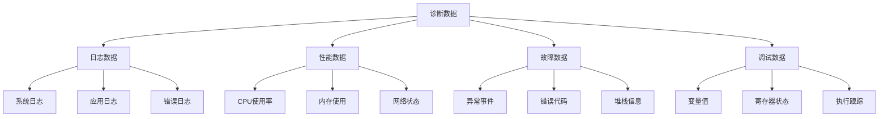

# 嵌入式远程诊断与调试技术

## 学习目标

完成本教程后，你将能够：

- [ ] 理解远程诊断系统的架构和工作原理
- [ ] 实现远程日志收集和分级管理
- [ ] 掌握设备性能监控和数据上报
- [ ] 学会远程故障诊断和问题定位方法
- [ ] 实现远程调试命令和交互式诊断
- [ ] 处理诊断数据的存储和分析

## 前置要求

在开始本教程之前，你需要：

**知识要求**：
- 熟悉C/C++编程和嵌入式开发
- 了解MQTT或HTTP协议
- 掌握日志系统的基本概念
- 理解系统性能指标（CPU、内存、网络）

**技能要求**：
- 能够使用嵌入式开发环境
- 会配置网络连接和MQTT通信
- 了解基本的调试方法和工具
- 掌握JSON数据格式

## 准备工作

### 硬件准备

| 名称 | 数量 | 说明 | 参考型号 |
|------|------|------|----------|
| 开发板 | 1 | 支持网络连接 | ESP32、STM32+W5500 |
| 调试器 | 1 | 用于程序下载 | ST-Link、USB-TTL |
| 路由器 | 1 | 提供网络连接 | - |
| USB线 | 1 | 供电和调试 | - |

**推荐配置**：
- **处理器**：ESP32（双核、WiFi集成）
- **内存**：至少512KB Flash、128KB RAM
- **网络**：WiFi或以太网
- **存储**：支持文件系统（LittleFS/SPIFFS）

### 软件准备

- **开发环境**：Arduino IDE、PlatformIO 或 ESP-IDF
- **MQTT服务器**：EMQX、Mosquitto 或云服务
- **日志查看工具**：MQTTX、Node-RED、Grafana
- **JSON库**：ArduinoJson
- **时间同步**：NTP客户端库

### 环境配置

1. 安装开发环境和必要的库
2. 搭建MQTT服务器（或使用云服务）
3. 配置网络连接参数
4. 准备日志查看和分析工具

## 远程诊断系统架构

### 系统组成

远程诊断系统通常包含以下组件：

```
设备端诊断模块 ←→ 通信层 ←→ 云端诊断平台
     ↓                         ↓
  日志收集器              日志存储分析
  性能监控器              监控仪表板
  故障检测器              告警系统
  调试接口                远程控制台
```

**架构层次**：

1. **设备端层**：
   - 日志收集和缓存
   - 性能数据采集
   - 故障检测和上报
   - 远程命令执行

2. **通信层**：
   - MQTT/HTTP协议
   - 数据压缩和加密
   - 断线重连和队列
   - 流量控制

3. **云端层**：
   - 日志存储和检索
   - 数据可视化
   - 告警和通知
   - 诊断分析工具

### 诊断数据类型



## 步骤1：日志系统设计

### 1.1 日志级别定义

```c
// remote_log.h
#ifndef REMOTE_LOG_H
#define REMOTE_LOG_H

#include <stdint.h>
#include <stdbool.h>

// 日志级别
typedef enum {
    LOG_LEVEL_NONE = 0,    // 不输出日志
    LOG_LEVEL_ERROR = 1,   // 错误：严重问题
    LOG_LEVEL_WARN = 2,    // 警告：潜在问题
    LOG_LEVEL_INFO = 3,    // 信息：重要事件
    LOG_LEVEL_DEBUG = 4,   // 调试：详细信息
    LOG_LEVEL_TRACE = 5    // 跟踪：最详细
} log_level_t;

// 日志类别
typedef enum {
    LOG_CAT_SYSTEM = 0,    // 系统日志
    LOG_CAT_NETWORK,       // 网络日志
    LOG_CAT_SENSOR,        // 传感器日志
    LOG_CAT_APP,           // 应用日志
    LOG_CAT_MAX
} log_category_t;

// 日志条目结构
typedef struct {
    uint32_t timestamp;         // 时间戳（Unix时间）
    log_level_t level;          // 日志级别
    log_category_t category;    // 日志类别
    char message[256];          // 日志消息
    char file[32];              // 源文件名
    uint16_t line;              // 行号
    char function[32];          // 函数名
} log_entry_t;

// 日志配置
typedef struct {
    log_level_t console_level;  // 串口输出级别
    log_level_t remote_level;   // 远程上报级别
    log_level_t storage_level;  // 本地存储级别
    bool enable_remote;         // 启用远程日志
    uint16_t buffer_size;       // 缓冲区大小
    uint16_t upload_interval;   // 上传间隔（秒）
} log_config_t;

#endif // REMOTE_LOG_H
```

### 1.2 日志管理器实现

```c
// remote_log.cpp
#include "remote_log.h"
#include <Arduino.h>
#include <time.h>

// 日志级别名称
const char* log_level_names[] = {
    "NONE", "ERROR", "WARN", "INFO", "DEBUG", "TRACE"
};

// 日志类别名称
const char* log_category_names[] = {
    "SYSTEM", "NETWORK", "SENSOR", "APP"
};

// 全局日志配置
static log_config_t log_config = {
    .console_level = LOG_LEVEL_INFO,
    .remote_level = LOG_LEVEL_WARN,
    .storage_level = LOG_LEVEL_ERROR,
    .enable_remote = true,
    .buffer_size = 100,
    .upload_interval = 60
};

// 日志缓冲区
#define LOG_BUFFER_SIZE 100
static log_entry_t log_buffer[LOG_BUFFER_SIZE];
static uint16_t log_buffer_head = 0;
static uint16_t log_buffer_tail = 0;
static uint16_t log_buffer_count = 0;

// 初始化日志系统
void log_init(void)
{
    Serial.println("Log system initialized");
    
    // 同步系统时间（NTP）
    configTime(8 * 3600, 0, "pool.ntp.org", "time.nist.gov");
    
    // 等待时间同步
    Serial.print("Waiting for time sync");
    time_t now = time(nullptr);
    int retry = 0;
    while (now < 1000000000 && retry < 20) {
        delay(500);
        Serial.print(".");
        now = time(nullptr);
        retry++;
    }
    Serial.println();
    
    if (now > 1000000000) {
        Serial.printf("Time synced: %s", ctime(&now));
    } else {
        Serial.println("Time sync failed, using relative time");
    }
}

// 设置日志配置
void log_set_config(const log_config_t *config)
{
    memcpy(&log_config, config, sizeof(log_config_t));
}

// 获取当前时间戳
uint32_t log_get_timestamp(void)
{
    time_t now = time(nullptr);
    if (now > 1000000000) {
        return (uint32_t)now;
    } else {
        // 如果时间未同步，使用相对时间
        return millis() / 1000;
    }
}
```

// 写入日志（内部函数）
void log_write_internal(log_level_t level, 
                       log_category_t category,
                       const char *file,
                       uint16_t line,
                       const char *function,
                       const char *format, 
                       va_list args)
{
    // 创建日志条目
    log_entry_t entry;
    entry.timestamp = log_get_timestamp();
    entry.level = level;
    entry.category = category;
    entry.line = line;
    
    // 复制文件名和函数名
    strncpy(entry.file, file, sizeof(entry.file) - 1);
    strncpy(entry.function, function, sizeof(entry.function) - 1);
    
    // 格式化消息
    vsnprintf(entry.message, sizeof(entry.message), format, args);
    
    // 输出到串口
    if (level <= log_config.console_level) {
        Serial.printf("[%lu][%s][%s] %s (%s:%d %s)\n",
                     entry.timestamp,
                     log_level_names[level],
                     log_category_names[category],
                     entry.message,
                     entry.file,
                     entry.line,
                     entry.function);
    }
    
    // 添加到缓冲区（用于远程上传）
    if (level <= log_config.remote_level && log_config.enable_remote) {
        if (log_buffer_count < LOG_BUFFER_SIZE) {
            memcpy(&log_buffer[log_buffer_head], &entry, sizeof(log_entry_t));
            log_buffer_head = (log_buffer_head + 1) % LOG_BUFFER_SIZE;
            log_buffer_count++;
        } else {
            // 缓冲区满，覆盖最旧的日志
            log_buffer_head = (log_buffer_head + 1) % LOG_BUFFER_SIZE;
            log_buffer_tail = (log_buffer_tail + 1) % LOG_BUFFER_SIZE;
        }
    }
    
    // 保存到本地存储（可选）
    if (level <= log_config.storage_level) {
        log_save_to_storage(&entry);
    }
}

// 日志宏定义
#define LOG_ERROR(cat, fmt, ...) \
    log_write(LOG_LEVEL_ERROR, cat, __FILE__, __LINE__, __FUNCTION__, fmt, ##__VA_ARGS__)

#define LOG_WARN(cat, fmt, ...) \
    log_write(LOG_LEVEL_WARN, cat, __FILE__, __LINE__, __FUNCTION__, fmt, ##__VA_ARGS__)

#define LOG_INFO(cat, fmt, ...) \
    log_write(LOG_LEVEL_INFO, cat, __FILE__, __LINE__, __FUNCTION__, fmt, ##__VA_ARGS__)

#define LOG_DEBUG(cat, fmt, ...) \
    log_write(LOG_LEVEL_DEBUG, cat, __FILE__, __LINE__, __FUNCTION__, fmt, ##__VA_ARGS__)

// 日志写入函数
void log_write(log_level_t level,
              log_category_t category,
              const char *file,
              uint16_t line,
              const char *function,
              const char *format, ...)
{
    va_list args;
    va_start(args, format);
    log_write_internal(level, category, file, line, function, format, args);
    va_end(args);
}

// 获取缓冲区中的日志数量
uint16_t log_get_buffer_count(void)
{
    return log_buffer_count;
}

// 从缓冲区读取日志
bool log_read_from_buffer(log_entry_t *entry)
{
    if (log_buffer_count == 0) {
        return false;
    }
    
    memcpy(entry, &log_buffer[log_buffer_tail], sizeof(log_entry_t));
    log_buffer_tail = (log_buffer_tail + 1) % LOG_BUFFER_SIZE;
    log_buffer_count--;
    
    return true;
}

// 清空日志缓冲区
void log_clear_buffer(void)
{
    log_buffer_head = 0;
    log_buffer_tail = 0;
    log_buffer_count = 0;
}
```

**代码说明**：
- 第1-20行：定义日志条目结构，包含时间戳、级别、类别和详细信息
- 第40-60行：初始化时同步NTP时间，确保时间戳准确
- 第75-110行：日志写入函数，支持多级别输出（串口、远程、存储）
- 第112-117行：定义便捷的日志宏，自动捕获文件名、行号和函数名

## 步骤2：远程日志上传

### 2.1 日志JSON格式化

```c
// 将日志条目转换为JSON
String log_entry_to_json(const log_entry_t *entry)
{
    DynamicJsonDocument doc(512);
    
    doc["timestamp"] = entry->timestamp;
    doc["level"] = log_level_names[entry->level];
    doc["category"] = log_category_names[entry->category];
    doc["message"] = entry->message;
    doc["file"] = entry->file;
    doc["line"] = entry->line;
    doc["function"] = entry->function;
    
    String json_str;
    serializeJson(doc, json_str);
    
    return json_str;
}

// 批量日志JSON格式化
String log_batch_to_json(const log_entry_t *entries, uint16_t count)
{
    DynamicJsonDocument doc(4096);
    
    doc["device_id"] = device_id;
    doc["count"] = count;
    doc["upload_time"] = log_get_timestamp();
    
    JsonArray logs = doc.createNestedArray("logs");
    
    for (uint16_t i = 0; i < count; i++) {
        JsonObject log_obj = logs.createNestedObject();
        log_obj["timestamp"] = entries[i].timestamp;
        log_obj["level"] = log_level_names[entries[i].level];
        log_obj["category"] = log_category_names[entries[i].category];
        log_obj["message"] = entries[i].message;
        log_obj["file"] = entries[i].file;
        log_obj["line"] = entries[i].line;
        log_obj["function"] = entries[i].function;
    }
    
    String json_str;
    serializeJson(doc, json_str);
    
    return json_str;
}
```

### 2.2 MQTT日志上传

```c
// MQTT主题定义
#define TOPIC_LOG_UPLOAD    "device/%s/log/upload"
#define TOPIC_LOG_CONTROL   "device/%s/log/control"

// 上传单条日志
bool log_upload_single(const log_entry_t *entry)
{
    if (!mqtt_client.connected()) {
        return false;
    }
    
    String json_str = log_entry_to_json(entry);
    
    char topic[128];
    snprintf(topic, sizeof(topic), TOPIC_LOG_UPLOAD, device_id);
    
    bool success = mqtt_client.publish(topic, json_str.c_str());
    
    if (success) {
        Serial.println("Log uploaded");
    } else {
        Serial.println("Log upload failed");
    }
    
    return success;
}

// 批量上传日志
bool log_upload_batch(void)
{
    if (!mqtt_client.connected()) {
        return false;
    }
    
    uint16_t count = log_get_buffer_count();
    if (count == 0) {
        return true;  // 没有日志需要上传
    }
    
    // 限制单次上传数量
    const uint16_t MAX_BATCH_SIZE = 20;
    if (count > MAX_BATCH_SIZE) {
        count = MAX_BATCH_SIZE;
    }
    
    // 读取日志到临时数组
    log_entry_t entries[MAX_BATCH_SIZE];
    for (uint16_t i = 0; i < count; i++) {
        if (!log_read_from_buffer(&entries[i])) {
            break;
        }
    }
    
    // 转换为JSON并上传
    String json_str = log_batch_to_json(entries, count);
    
    char topic[128];
    snprintf(topic, sizeof(topic), TOPIC_LOG_UPLOAD, device_id);
    
    bool success = mqtt_client.publish(topic, json_str.c_str());
    
    if (success) {
        Serial.printf("Uploaded %d logs\n", count);
    } else {
        Serial.println("Batch upload failed");
        // 上传失败，将日志放回缓冲区
        // （实际实现中可能需要更复杂的重试机制）
    }
    
    return success;
}

// 定期上传任务
void log_upload_task(void)
{
    static unsigned long last_upload = 0;
    unsigned long now = millis();
    
    if (now - last_upload >= log_config.upload_interval * 1000) {
        last_upload = now;
        
        if (log_get_buffer_count() > 0) {
            log_upload_batch();
        }
    }
}
```

**代码说明**：
- 第1-16行：将单条日志转换为JSON格式
- 第19-44行：批量日志转换，减少网络传输次数
- 第60-75行：单条日志上传函数
- 第78-115行：批量上传函数，限制单次上传数量避免内存溢出
- 第118-131行：定期上传任务，在主循环中调用

## 步骤3：性能监控实现

### 3.1 性能指标定义

```c
// performance_monitor.h
#ifndef PERFORMANCE_MONITOR_H
#define PERFORMANCE_MONITOR_H

#include <stdint.h>

// 性能指标结构
typedef struct {
    // CPU相关
    float cpu_usage;           // CPU使用率 (%)
    uint32_t cpu_frequency;    // CPU频率 (MHz)
    
    // 内存相关
    uint32_t heap_total;       // 堆总大小 (bytes)
    uint32_t heap_free;        // 堆空闲大小 (bytes)
    uint32_t heap_used;        // 堆已用大小 (bytes)
    float heap_usage;          // 堆使用率 (%)
    uint32_t heap_max_alloc;   // 最大可分配块 (bytes)
    
    // 任务相关
    uint16_t task_count;       // 任务数量
    uint32_t stack_high_water; // 栈最小剩余 (bytes)
    
    // 网络相关
    bool wifi_connected;       // WiFi连接状态
    int8_t wifi_rssi;          // WiFi信号强度 (dBm)
    uint32_t bytes_sent;       // 发送字节数
    uint32_t bytes_received;   // 接收字节数
    
    // 系统相关
    uint32_t uptime;           // 运行时间 (秒)
    uint32_t free_storage;     // 存储空间剩余 (bytes)
    float temperature;         // 芯片温度 (°C)
    
    // 时间戳
    uint32_t timestamp;
} performance_metrics_t;

#endif // PERFORMANCE_MONITOR_H
```

### 3.2 性能数据采集

```c
// performance_monitor.cpp
#include "performance_monitor.h"
#include <Arduino.h>
#include <WiFi.h>
#include <LittleFS.h>

// 全局性能指标
static performance_metrics_t current_metrics;
static uint32_t last_idle_time = 0;
static uint32_t last_total_time = 0;

// 初始化性能监控
void perf_monitor_init(void)
{
    memset(&current_metrics, 0, sizeof(performance_metrics_t));
    Serial.println("Performance monitor initialized");
}

// 采集CPU使用率
float perf_get_cpu_usage(void)
{
    // ESP32特定实现
    // 通过空闲任务的运行时间计算CPU使用率
    uint32_t idle_time = 0;
    uint32_t total_time = millis();
    
    // 获取空闲任务运行时间（需要FreeRTOS支持）
    #ifdef ESP32
    TaskHandle_t idle_task = xTaskGetIdleTaskHandle();
    if (idle_task != NULL) {
        idle_time = uxTaskGetSystemState(NULL, 0, &total_time);
    }
    #endif
    
    // 计算CPU使用率
    uint32_t idle_delta = idle_time - last_idle_time;
    uint32_t total_delta = total_time - last_total_time;
    
    float cpu_usage = 0.0;
    if (total_delta > 0) {
        cpu_usage = 100.0 - (idle_delta * 100.0 / total_delta);
    }
    
    last_idle_time = idle_time;
    last_total_time = total_time;
    
    return cpu_usage;
}

// 采集内存信息
void perf_get_memory_info(performance_metrics_t *metrics)
{
    metrics->heap_total = ESP.getHeapSize();
    metrics->heap_free = ESP.getFreeHeap();
    metrics->heap_used = metrics->heap_total - metrics->heap_free;
    metrics->heap_usage = (float)metrics->heap_used * 100.0 / metrics->heap_total;
    metrics->heap_max_alloc = ESP.getMaxAllocHeap();
}

// 采集网络信息
void perf_get_network_info(performance_metrics_t *metrics)
{
    metrics->wifi_connected = WiFi.isConnected();
    if (metrics->wifi_connected) {
        metrics->wifi_rssi = WiFi.RSSI();
    } else {
        metrics->wifi_rssi = -100;
    }
    
    // 网络流量统计（需要自己维护计数器）
    // metrics->bytes_sent = ...
    // metrics->bytes_received = ...
}

// 采集系统信息
void perf_get_system_info(performance_metrics_t *metrics)
{
    metrics->uptime = millis() / 1000;
    metrics->cpu_frequency = ESP.getCpuFreqMHz();
    
    // 获取存储空间信息
    if (LittleFS.begin()) {
        metrics->free_storage = LittleFS.totalBytes() - LittleFS.usedBytes();
    }
    
    // 获取芯片温度（ESP32特定）
    #ifdef ESP32
    metrics->temperature = temperatureRead();
    #endif
}

// 采集所有性能指标
void perf_collect_metrics(performance_metrics_t *metrics)
{
    metrics->timestamp = log_get_timestamp();
    
    // 采集各项指标
    metrics->cpu_usage = perf_get_cpu_usage();
    perf_get_memory_info(metrics);
    perf_get_network_info(metrics);
    perf_get_system_info(metrics);
    
    // 保存到全局变量
    memcpy(&current_metrics, metrics, sizeof(performance_metrics_t));
}

// 获取当前性能指标
const performance_metrics_t* perf_get_current_metrics(void)
{
    return &current_metrics;
}
```

### 3.3 性能数据上报

```c
// 性能指标转JSON
String perf_metrics_to_json(const performance_metrics_t *metrics)
{
    DynamicJsonDocument doc(1024);
    
    doc["device_id"] = device_id;
    doc["timestamp"] = metrics->timestamp;
    
    // CPU信息
    JsonObject cpu = doc.createNestedObject("cpu");
    cpu["usage"] = metrics->cpu_usage;
    cpu["frequency"] = metrics->cpu_frequency;
    
    // 内存信息
    JsonObject memory = doc.createNestedObject("memory");
    memory["total"] = metrics->heap_total;
    memory["free"] = metrics->heap_free;
    memory["used"] = metrics->heap_used;
    memory["usage"] = metrics->heap_usage;
    memory["max_alloc"] = metrics->heap_max_alloc;
    
    // 网络信息
    JsonObject network = doc.createNestedObject("network");
    network["wifi_connected"] = metrics->wifi_connected;
    network["wifi_rssi"] = metrics->wifi_rssi;
    network["bytes_sent"] = metrics->bytes_sent;
    network["bytes_received"] = metrics->bytes_received;
    
    // 系统信息
    JsonObject system = doc.createNestedObject("system");
    system["uptime"] = metrics->uptime;
    system["free_storage"] = metrics->free_storage;
    system["temperature"] = metrics->temperature;
    
    String json_str;
    serializeJson(doc, json_str);
    
    return json_str;
}

// 上报性能数据
bool perf_upload_metrics(const performance_metrics_t *metrics)
{
    if (!mqtt_client.connected()) {
        return false;
    }
    
    String json_str = perf_metrics_to_json(metrics);
    
    char topic[128];
    snprintf(topic, sizeof(topic), "device/%s/performance", device_id);
    
    bool success = mqtt_client.publish(topic, json_str.c_str());
    
    if (success) {
        Serial.println("Performance metrics uploaded");
    } else {
        Serial.println("Performance upload failed");
    }
    
    return success;
}

// 定期性能监控任务
void perf_monitor_task(void)
{
    static unsigned long last_collect = 0;
    unsigned long now = millis();
    
    // 每30秒采集一次
    if (now - last_collect >= 30000) {
        last_collect = now;
        
        performance_metrics_t metrics;
        perf_collect_metrics(&metrics);
        
        // 上报到云端
        perf_upload_metrics(&metrics);
        
        // 打印到串口
        Serial.printf("CPU: %.1f%%, Mem: %d/%d (%.1f%%), WiFi: %ddBm\n",
                     metrics.cpu_usage,
                     metrics.heap_used,
                     metrics.heap_total,
                     metrics.heap_usage,
                     metrics.wifi_rssi);
    }
}
```

**代码说明**：
- 第1-37行：将性能指标转换为结构化的JSON格式
- 第40-60行：通过MQTT上报性能数据
- 第63-87行：定期监控任务，每30秒采集并上报一次

## 步骤4：故障检测与上报

### 4.1 故障类型定义

```c
// fault_detector.h
#ifndef FAULT_DETECTOR_H
#define FAULT_DETECTOR_H

#include <stdint.h>

// 故障类型
typedef enum {
    FAULT_NONE = 0,
    FAULT_MEMORY_LOW,          // 内存不足
    FAULT_STORAGE_FULL,        // 存储空间满
    FAULT_WIFI_DISCONNECTED,   // WiFi断开
    FAULT_MQTT_DISCONNECTED,   // MQTT断开
    FAULT_SENSOR_ERROR,        // 传感器错误
    FAULT_WATCHDOG_RESET,      // 看门狗复位
    FAULT_EXCEPTION,           // 异常/崩溃
    FAULT_TEMPERATURE_HIGH,    // 温度过高
    FAULT_CUSTOM              // 自定义故障
} fault_type_t;

// 故障严重程度
typedef enum {
    FAULT_SEVERITY_INFO = 0,   // 信息
    FAULT_SEVERITY_WARNING,    // 警告
    FAULT_SEVERITY_ERROR,      // 错误
    FAULT_SEVERITY_CRITICAL    // 严重
} fault_severity_t;

// 故障记录
typedef struct {
    fault_type_t type;
    fault_severity_t severity;
    uint32_t timestamp;
    uint32_t error_code;
    char description[128];
    char context[256];         // 上下文信息
    uint32_t count;            // 发生次数
} fault_record_t;

#endif // FAULT_DETECTOR_H
```

### 4.2 故障检测实现

```c
// fault_detector.cpp
#include "fault_detector.h"
#include <Arduino.h>

// 故障类型名称
const char* fault_type_names[] = {
    "NONE", "MEMORY_LOW", "STORAGE_FULL", "WIFI_DISCONNECTED",
    "MQTT_DISCONNECTED", "SENSOR_ERROR", "WATCHDOG_RESET",
    "EXCEPTION", "TEMPERATURE_HIGH", "CUSTOM"
};

// 故障严重程度名称
const char* fault_severity_names[] = {
    "INFO", "WARNING", "ERROR", "CRITICAL"
};

// 故障记录缓冲区
#define FAULT_BUFFER_SIZE 20
static fault_record_t fault_buffer[FAULT_BUFFER_SIZE];
static uint8_t fault_count = 0;

// 初始化故障检测器
void fault_detector_init(void)
{
    memset(fault_buffer, 0, sizeof(fault_buffer));
    fault_count = 0;
    
    Serial.println("Fault detector initialized");
}

// 记录故障
void fault_record(fault_type_t type,
                 fault_severity_t severity,
                 uint32_t error_code,
                 const char *description,
                 const char *context)
{
    // 检查是否已存在相同故障
    for (uint8_t i = 0; i < fault_count; i++) {
        if (fault_buffer[i].type == type && 
            fault_buffer[i].error_code == error_code) {
            // 更新现有故障记录
            fault_buffer[i].count++;
            fault_buffer[i].timestamp = log_get_timestamp();
            return;
        }
    }
    
    // 添加新故障记录
    if (fault_count < FAULT_BUFFER_SIZE) {
        fault_record_t *record = &fault_buffer[fault_count];
        record->type = type;
        record->severity = severity;
        record->timestamp = log_get_timestamp();
        record->error_code = error_code;
        record->count = 1;
        
        strncpy(record->description, description, sizeof(record->description) - 1);
        strncpy(record->context, context, sizeof(record->context) - 1);
        
        fault_count++;
        
        // 记录日志
        LOG_ERROR(LOG_CAT_SYSTEM, "Fault detected: %s - %s", 
                 fault_type_names[type], description);
        
        // 立即上报严重故障
        if (severity >= FAULT_SEVERITY_ERROR) {
            fault_upload_single(record);
        }
    }
}

// 检测内存故障
void fault_check_memory(void)
{
    uint32_t free_heap = ESP.getFreeHeap();
    uint32_t total_heap = ESP.getHeapSize();
    float usage = (float)(total_heap - free_heap) * 100.0 / total_heap;
    
    // 内存使用超过90%
    if (usage > 90.0) {
        char context[256];
        snprintf(context, sizeof(context),
                "Free: %d bytes, Total: %d bytes, Usage: %.1f%%",
                free_heap, total_heap, usage);
        
        fault_record(FAULT_MEMORY_LOW,
                    FAULT_SEVERITY_WARNING,
                    (uint32_t)usage,
                    "Memory usage critical",
                    context);
    }
}

// 检测存储故障
void fault_check_storage(void)
{
    if (LittleFS.begin()) {
        uint32_t total = LittleFS.totalBytes();
        uint32_t used = LittleFS.usedBytes();
        float usage = (float)used * 100.0 / total;
        
        // 存储使用超过95%
        if (usage > 95.0) {
            char context[256];
            snprintf(context, sizeof(context),
                    "Used: %d bytes, Total: %d bytes, Usage: %.1f%%",
                    used, total, usage);
            
            fault_record(FAULT_STORAGE_FULL,
                        FAULT_SEVERITY_ERROR,
                        (uint32_t)usage,
                        "Storage almost full",
                        context);
        }
    }
}

// 检测网络故障
void fault_check_network(void)
{
    static bool last_wifi_state = false;
    bool current_wifi_state = WiFi.isConnected();
    
    // WiFi断开
    if (last_wifi_state && !current_wifi_state) {
        fault_record(FAULT_WIFI_DISCONNECTED,
                    FAULT_SEVERITY_WARNING,
                    0,
                    "WiFi connection lost",
                    "");
    }
    
    last_wifi_state = current_wifi_state;
    
    // MQTT断开
    static bool last_mqtt_state = false;
    bool current_mqtt_state = mqtt_client.connected();
    
    if (last_mqtt_state && !current_mqtt_state) {
        fault_record(FAULT_MQTT_DISCONNECTED,
                    FAULT_SEVERITY_WARNING,
                    0,
                    "MQTT connection lost",
                    "");
    }
    
    last_mqtt_state = current_mqtt_state;
}

// 检测温度故障
void fault_check_temperature(void)
{
    #ifdef ESP32
    float temp = temperatureRead();
    
    // 温度超过80°C
    if (temp > 80.0) {
        char context[256];
        snprintf(context, sizeof(context), "Temperature: %.1f°C", temp);
        
        fault_record(FAULT_TEMPERATURE_HIGH,
                    FAULT_SEVERITY_CRITICAL,
                    (uint32_t)(temp * 10),
                    "Chip temperature too high",
                    context);
    }
    #endif
}

// 定期故障检测任务
void fault_detection_task(void)
{
    static unsigned long last_check = 0;
    unsigned long now = millis();
    
    // 每10秒检测一次
    if (now - last_check >= 10000) {
        last_check = now;
        
        fault_check_memory();
        fault_check_storage();
        fault_check_network();
        fault_check_temperature();
    }
}
```

### 4.3 故障上报

```c
// 故障记录转JSON
String fault_record_to_json(const fault_record_t *record)
{
    DynamicJsonDocument doc(512);
    
    doc["device_id"] = device_id;
    doc["timestamp"] = record->timestamp;
    doc["type"] = fault_type_names[record->type];
    doc["severity"] = fault_severity_names[record->severity];
    doc["error_code"] = record->error_code;
    doc["description"] = record->description;
    doc["context"] = record->context;
    doc["count"] = record->count;
    
    String json_str;
    serializeJson(doc, json_str);
    
    return json_str;
}

// 上报单个故障
bool fault_upload_single(const fault_record_t *record)
{
    if (!mqtt_client.connected()) {
        return false;
    }
    
    String json_str = fault_record_to_json(record);
    
    char topic[128];
    snprintf(topic, sizeof(topic), "device/%s/fault", device_id);
    
    bool success = mqtt_client.publish(topic, json_str.c_str());
    
    if (success) {
        Serial.printf("Fault uploaded: %s\n", fault_type_names[record->type]);
    }
    
    return success;
}

// 批量上报故障
bool fault_upload_all(void)
{
    if (!mqtt_client.connected() || fault_count == 0) {
        return false;
    }
    
    DynamicJsonDocument doc(2048);
    doc["device_id"] = device_id;
    doc["count"] = fault_count;
    doc["timestamp"] = log_get_timestamp();
    
    JsonArray faults = doc.createNestedArray("faults");
    
    for (uint8_t i = 0; i < fault_count; i++) {
        JsonObject fault_obj = faults.createNestedObject();
        fault_obj["type"] = fault_type_names[fault_buffer[i].type];
        fault_obj["severity"] = fault_severity_names[fault_buffer[i].severity];
        fault_obj["timestamp"] = fault_buffer[i].timestamp;
        fault_obj["error_code"] = fault_buffer[i].error_code;
        fault_obj["description"] = fault_buffer[i].description;
        fault_obj["context"] = fault_buffer[i].context;
        fault_obj["count"] = fault_buffer[i].count;
    }
    
    String json_str;
    serializeJson(doc, json_str);
    
    char topic[128];
    snprintf(topic, sizeof(topic), "device/%s/fault/batch", device_id);
    
    bool success = mqtt_client.publish(topic, json_str.c_str());
    
    if (success) {
        Serial.printf("Uploaded %d faults\n", fault_count);
        // 清空故障缓冲区
        fault_count = 0;
    }
    
    return success;
}
```

**代码说明**：
- 第34-64行：记录故障，支持相同故障的计数累加
- 第67-90行：检测内存使用情况，超过90%触发警告
- 第93-113行：检测存储空间，超过95%触发错误
- 第116-145行：检测网络连接状态变化
- 第148-163行：检测芯片温度，超过80°C触发严重告警

## 步骤5：远程调试命令

### 5.1 调试命令定义

```c
// remote_debug.h
#ifndef REMOTE_DEBUG_H
#define REMOTE_DEBUG_H

#include <stdint.h>

// 调试命令类型
typedef enum {
    CMD_GET_STATUS = 0,        // 获取设备状态
    CMD_GET_CONFIG,            // 获取配置
    CMD_SET_LOG_LEVEL,         // 设置日志级别
    CMD_REBOOT,                // 重启设备
    CMD_CLEAR_LOGS,            // 清空日志
    CMD_GET_MEMORY_INFO,       // 获取内存信息
    CMD_GET_TASK_LIST,         // 获取任务列表
    CMD_RUN_DIAGNOSTIC,        // 运行诊断
    CMD_CUSTOM                 // 自定义命令
} debug_command_t;

// 命令响应结构
typedef struct {
    debug_command_t command;
    bool success;
    char message[256];
    char data[512];
} debug_response_t;

#endif // REMOTE_DEBUG_H
```

### 5.2 命令处理实现

```c
// remote_debug.cpp
#include "remote_debug.h"
#include <Arduino.h>
#include <ArduinoJson.h>

// 命令名称映射
const char* command_names[] = {
    "get_status", "get_config", "set_log_level", "reboot",
    "clear_logs", "get_memory_info", "get_task_list",
    "run_diagnostic", "custom"
};

// 处理获取状态命令
void cmd_handle_get_status(debug_response_t *response)
{
    DynamicJsonDocument doc(512);
    
    doc["device_id"] = device_id;
    doc["uptime"] = millis() / 1000;
    doc["wifi_connected"] = WiFi.isConnected();
    doc["mqtt_connected"] = mqtt_client.connected();
    doc["free_heap"] = ESP.getFreeHeap();
    doc["cpu_freq"] = ESP.getCpuFreqMHz();
    
    serializeJson(doc, response->data, sizeof(response->data));
    response->success = true;
    strcpy(response->message, "Status retrieved");
}

// 处理获取配置命令
void cmd_handle_get_config(debug_response_t *response)
{
    device_config_t *config = config_get_current();
    
    DynamicJsonDocument doc(1024);
    doc["device_name"] = config->system.device_name;
    doc["report_interval"] = config->system.report_interval;
    doc["log_level"] = config->system.log_level;
    doc["mqtt_server"] = config->network.mqtt_server;
    doc["mqtt_port"] = config->network.mqtt_port;
    
    serializeJson(doc, response->data, sizeof(response->data));
    response->success = true;
    strcpy(response->message, "Config retrieved");
}

// 处理设置日志级别命令
void cmd_handle_set_log_level(const char *params, debug_response_t *response)
{
    DynamicJsonDocument doc(256);
    DeserializationError error = deserializeJson(doc, params);
    
    if (error) {
        response->success = false;
        strcpy(response->message, "Invalid parameters");
        return;
    }
    
    int level = doc["level"] | -1;
    if (level < 0 || level > 5) {
        response->success = false;
        strcpy(response->message, "Invalid log level");
        return;
    }
    
    log_config_t config;
    log_get_config(&config);
    config.console_level = (log_level_t)level;
    config.remote_level = (log_level_t)level;
    log_set_config(&config);
    
    response->success = true;
    snprintf(response->message, sizeof(response->message),
            "Log level set to %d", level);
}

// 处理重启命令
void cmd_handle_reboot(debug_response_t *response)
{
    response->success = true;
    strcpy(response->message, "Rebooting in 3 seconds...");
    
    // 延迟重启，确保响应发送成功
    delay(3000);
    ESP.restart();
}

// 处理清空日志命令
void cmd_handle_clear_logs(debug_response_t *response)
{
    log_clear_buffer();
    
    response->success = true;
    strcpy(response->message, "Logs cleared");
}

// 处理获取内存信息命令
void cmd_handle_get_memory_info(debug_response_t *response)
{
    DynamicJsonDocument doc(512);
    
    doc["heap_total"] = ESP.getHeapSize();
    doc["heap_free"] = ESP.getFreeHeap();
    doc["heap_used"] = ESP.getHeapSize() - ESP.getFreeHeap();
    doc["heap_max_alloc"] = ESP.getMaxAllocHeap();
    doc["psram_total"] = ESP.getPsramSize();
    doc["psram_free"] = ESP.getFreePsram();
    
    serializeJson(doc, response->data, sizeof(response->data));
    response->success = true;
    strcpy(response->message, "Memory info retrieved");
}

// 处理获取任务列表命令
void cmd_handle_get_task_list(debug_response_t *response)
{
    #ifdef ESP32
    char task_list[512];
    vTaskList(task_list);
    
    strncpy(response->data, task_list, sizeof(response->data) - 1);
    response->success = true;
    strcpy(response->message, "Task list retrieved");
    #else
    response->success = false;
    strcpy(response->message, "Not supported on this platform");
    #endif
}

// 处理运行诊断命令
void cmd_handle_run_diagnostic(debug_response_t *response)
{
    DynamicJsonDocument doc(1024);
    
    // 运行各项诊断
    doc["wifi_test"] = WiFi.isConnected();
    doc["mqtt_test"] = mqtt_client.connected();
    doc["storage_test"] = LittleFS.begin();
    doc["memory_ok"] = (ESP.getFreeHeap() > 10000);
    doc["temperature"] = temperatureRead();
    
    // 综合诊断结果
    bool all_ok = doc["wifi_test"] && doc["mqtt_test"] && 
                  doc["storage_test"] && doc["memory_ok"];
    doc["overall"] = all_ok ? "PASS" : "FAIL";
    
    serializeJson(doc, response->data, sizeof(response->data));
    response->success = true;
    strcpy(response->message, all_ok ? "All tests passed" : "Some tests failed");
}
```

### 5.3 命令接收和分发

```c
// MQTT命令主题
#define TOPIC_DEBUG_COMMAND   "device/%s/debug/command"
#define TOPIC_DEBUG_RESPONSE  "device/%s/debug/response"

// 初始化远程调试
void remote_debug_init(void)
{
    // 订阅调试命令主题
    char topic[128];
    snprintf(topic, sizeof(topic), TOPIC_DEBUG_COMMAND, device_id);
    mqtt_client.subscribe(topic);
    
    Serial.printf("Subscribed to debug commands: %s\n", topic);
}

// 解析并执行命令
void remote_debug_execute(const char *json_str)
{
    DynamicJsonDocument doc(512);
    DeserializationError error = deserializeJson(doc, json_str);
    
    if (error) {
        Serial.printf("Command parse error: %s\n", error.c_str());
        return;
    }
    
    const char *cmd_str = doc["command"];
    const char *params = doc["params"] | "";
    
    Serial.printf("Received command: %s\n", cmd_str);
    
    // 创建响应
    debug_response_t response;
    memset(&response, 0, sizeof(response));
    
    // 查找并执行命令
    bool command_found = false;
    
    if (strcmp(cmd_str, "get_status") == 0) {
        response.command = CMD_GET_STATUS;
        cmd_handle_get_status(&response);
        command_found = true;
    }
    else if (strcmp(cmd_str, "get_config") == 0) {
        response.command = CMD_GET_CONFIG;
        cmd_handle_get_config(&response);
        command_found = true;
    }
    else if (strcmp(cmd_str, "set_log_level") == 0) {
        response.command = CMD_SET_LOG_LEVEL;
        cmd_handle_set_log_level(params, &response);
        command_found = true;
    }
    else if (strcmp(cmd_str, "reboot") == 0) {
        response.command = CMD_REBOOT;
        cmd_handle_reboot(&response);
        command_found = true;
    }
    else if (strcmp(cmd_str, "clear_logs") == 0) {
        response.command = CMD_CLEAR_LOGS;
        cmd_handle_clear_logs(&response);
        command_found = true;
    }
    else if (strcmp(cmd_str, "get_memory_info") == 0) {
        response.command = CMD_GET_MEMORY_INFO;
        cmd_handle_get_memory_info(&response);
        command_found = true;
    }
    else if (strcmp(cmd_str, "get_task_list") == 0) {
        response.command = CMD_GET_TASK_LIST;
        cmd_handle_get_task_list(&response);
        command_found = true;
    }
    else if (strcmp(cmd_str, "run_diagnostic") == 0) {
        response.command = CMD_RUN_DIAGNOSTIC;
        cmd_handle_run_diagnostic(&response);
        command_found = true;
    }
    
    if (!command_found) {
        response.success = false;
        strcpy(response.message, "Unknown command");
    }
    
    // 发送响应
    remote_debug_send_response(&response);
}

// 发送命令响应
void remote_debug_send_response(const debug_response_t *response)
{
    DynamicJsonDocument doc(1024);
    
    doc["device_id"] = device_id;
    doc["command"] = command_names[response->command];
    doc["success"] = response->success;
    doc["message"] = response->message;
    doc["timestamp"] = log_get_timestamp();
    
    if (strlen(response->data) > 0) {
        // 解析data字段（可能是JSON）
        DynamicJsonDocument data_doc(512);
        DeserializationError error = deserializeJson(data_doc, response->data);
        
        if (!error) {
            doc["data"] = data_doc.as<JsonObject>();
        } else {
            doc["data"] = response->data;
        }
    }
    
    String json_str;
    serializeJson(doc, json_str);
    
    char topic[128];
    snprintf(topic, sizeof(topic), TOPIC_DEBUG_RESPONSE, device_id);
    
    mqtt_client.publish(topic, json_str.c_str());
    
    Serial.println("Response sent");
}

// MQTT回调中处理调试命令
void mqtt_callback(char* topic, byte* payload, unsigned int length)
{
    // ... 其他消息处理 ...
    
    // 检查是否是调试命令
    char debug_topic[128];
    snprintf(debug_topic, sizeof(debug_topic), TOPIC_DEBUG_COMMAND, device_id);
    
    if (strcmp(topic, debug_topic) == 0) {
        char* json_str = (char*)malloc(length + 1);
        if (json_str) {
            memcpy(json_str, payload, length);
            json_str[length] = '\0';
            
            remote_debug_execute(json_str);
            
            free(json_str);
        }
    }
}
```

**代码说明**：
- 第14-26行：处理获取设备状态命令，返回运行时信息
- 第47-70行：处理设置日志级别命令，支持动态调整
- 第73-81行：处理重启命令，延迟3秒后重启
- 第115-135行：处理运行诊断命令，执行多项系统检查
- 第17-90行：命令分发器，根据命令名称调用相应处理函数

## 步骤6：完整示例程序

### 6.1 主程序实现

```c
// main.cpp
#include <Arduino.h>
#include <WiFi.h>
#include <PubSubClient.h>
#include "remote_log.h"
#include "performance_monitor.h"
#include "fault_detector.h"
#include "remote_debug.h"

// WiFi和MQTT配置
const char* wifi_ssid = "YourWiFiSSID";
const char* wifi_password = "YourWiFiPassword";
const char* mqtt_server = "mqtt.example.com";
const int mqtt_port = 1883;

char device_id[32] = "ESP32-DIAG-001";

WiFiClient espClient;
PubSubClient mqtt_client(espClient);

void setup()
{
    Serial.begin(115200);
    Serial.println("\n\nRemote Diagnostics System Demo");
    
    // 初始化各模块
    log_init();
    perf_monitor_init();
    fault_detector_init();
    
    // 连接WiFi
    Serial.printf("Connecting to WiFi: %s\n", wifi_ssid);
    WiFi.begin(wifi_ssid, wifi_password);
    
    int retry = 0;
    while (WiFi.status() != WL_CONNECTED && retry < 40) {
        delay(500);
        Serial.print(".");
        retry++;
    }
    
    if (WiFi.status() == WL_CONNECTED) {
        Serial.println("\nWiFi connected");
        Serial.printf("IP address: %s\n", WiFi.localIP().toString().c_str());
        
        LOG_INFO(LOG_CAT_SYSTEM, "WiFi connected, IP: %s", 
                WiFi.localIP().toString().c_str());
    } else {
        Serial.println("\nWiFi connection failed");
        LOG_ERROR(LOG_CAT_NETWORK, "WiFi connection failed");
    }
    
    // 初始化MQTT
    mqtt_client.setServer(mqtt_server, mqtt_port);
    mqtt_client.setCallback(mqtt_callback);
    mqtt_client.setBufferSize(2048);
    
    mqtt_connect();
    
    // 初始化远程调试
    remote_debug_init();
    
    // 记录启动日志
    LOG_INFO(LOG_CAT_SYSTEM, "System started, device ID: %s", device_id);
    
    Serial.println("System ready");
}

void loop()
{
    // MQTT循环处理
    mqtt_loop();
    
    // 定期任务
    log_upload_task();           // 日志上传
    perf_monitor_task();         // 性能监控
    fault_detection_task();      // 故障检测
    
    // 模拟应用逻辑
    static unsigned long last_work = 0;
    if (millis() - last_work >= 5000) {
        last_work = millis();
        
        // 模拟一些工作
        LOG_DEBUG(LOG_CAT_APP, "Application running, uptime: %lu seconds", 
                 millis() / 1000);
        
        // 随机生成一些测试日志
        if (random(100) < 10) {
            LOG_WARN(LOG_CAT_APP, "Random warning event");
        }
        
        if (random(100) < 5) {
            LOG_ERROR(LOG_CAT_APP, "Random error event");
        }
    }
    
    delay(10);
}

// MQTT连接函数
bool mqtt_connect(void)
{
    Serial.print("Connecting to MQTT...");
    
    char client_id[64];
    snprintf(client_id, sizeof(client_id), "device_%s", device_id);
    
    if (mqtt_client.connect(client_id)) {
        Serial.println("connected");
        
        // 订阅主题
        char topic[128];
        
        // 订阅配置主题
        snprintf(topic, sizeof(topic), "device/%s/config/receive", device_id);
        mqtt_client.subscribe(topic);
        
        // 订阅调试命令主题
        snprintf(topic, sizeof(topic), "device/%s/debug/command", device_id);
        mqtt_client.subscribe(topic);
        
        LOG_INFO(LOG_CAT_NETWORK, "MQTT connected");
        
        return true;
    } else {
        Serial.printf("failed, rc=%d\n", mqtt_client.state());
        LOG_ERROR(LOG_CAT_NETWORK, "MQTT connection failed, rc=%d", 
                 mqtt_client.state());
        return false;
    }
}

// MQTT循环处理
void mqtt_loop(void)
{
    if (!mqtt_client.connected()) {
        static unsigned long last_reconnect = 0;
        unsigned long now = millis();
        
        if (now - last_reconnect > 5000) {
            last_reconnect = now;
            if (mqtt_connect()) {
                last_reconnect = 0;
            }
        }
    } else {
        mqtt_client.loop();
    }
}
```

### 6.2 测试和验证

**1. 编译和上传程序**

```bash
# 使用PlatformIO
pio run -t upload -t monitor

# 或使用Arduino IDE
# 选择开发板和端口，点击上传
```

**2. 观察串口输出**

```
Remote Diagnostics System Demo
Log system initialized
Waiting for time sync...
Time synced: Mon Jan 15 10:30:00 2024
Performance monitor initialized
Fault detector initialized
Connecting to WiFi: YourWiFiSSID
.........
WiFi connected
IP address: 192.168.1.100
Connecting to MQTT...connected
Subscribed to debug commands: device/ESP32-DIAG-001/debug/command
System started, device ID: ESP32-DIAG-001
System ready
```

**3. 使用MQTT客户端测试**

使用MQTTX或MQTT.fx连接到MQTT服务器，订阅以下主题：

```
device/ESP32-DIAG-001/log/upload
device/ESP32-DIAG-001/performance
device/ESP32-DIAG-001/fault
device/ESP32-DIAG-001/debug/response
```

## 步骤7：远程调试测试

### 7.1 发送调试命令

**命令1：获取设备状态**

主题：`device/ESP32-DIAG-001/debug/command`

消息：
```json
{
  "command": "get_status"
}
```

预期响应（主题：`device/ESP32-DIAG-001/debug/response`）：
```json
{
  "device_id": "ESP32-DIAG-001",
  "command": "get_status",
  "success": true,
  "message": "Status retrieved",
  "timestamp": 1705305600,
  "data": {
    "device_id": "ESP32-DIAG-001",
    "uptime": 3600,
    "wifi_connected": true,
    "mqtt_connected": true,
    "free_heap": 245760,
    "cpu_freq": 240
  }
}
```

**命令2：设置日志级别**

消息：
```json
{
  "command": "set_log_level",
  "params": "{\"level\": 4}"
}
```

预期响应：
```json
{
  "device_id": "ESP32-DIAG-001",
  "command": "set_log_level",
  "success": true,
  "message": "Log level set to 4",
  "timestamp": 1705305610
}
```

**命令3：获取内存信息**

消息：
```json
{
  "command": "get_memory_info"
}
```

预期响应：
```json
{
  "device_id": "ESP32-DIAG-001",
  "command": "get_memory_info",
  "success": true,
  "message": "Memory info retrieved",
  "timestamp": 1705305620,
  "data": {
    "heap_total": 327680,
    "heap_free": 245760,
    "heap_used": 81920,
    "heap_max_alloc": 110592,
    "psram_total": 0,
    "psram_free": 0
  }
}
```

**命令4：运行诊断**

消息：
```json
{
  "command": "run_diagnostic"
}
```

预期响应：
```json
{
  "device_id": "ESP32-DIAG-001",
  "command": "run_diagnostic",
  "success": true,
  "message": "All tests passed",
  "timestamp": 1705305630,
  "data": {
    "wifi_test": true,
    "mqtt_test": true,
    "storage_test": true,
    "memory_ok": true,
    "temperature": 45.5,
    "overall": "PASS"
  }
}
```

### 7.2 查看日志上传

订阅主题：`device/ESP32-DIAG-001/log/upload`

接收到的日志消息示例：
```json
{
  "device_id": "ESP32-DIAG-001",
  "count": 5,
  "upload_time": 1705305640,
  "logs": [
    {
      "timestamp": 1705305600,
      "level": "INFO",
      "category": "SYSTEM",
      "message": "WiFi connected, IP: 192.168.1.100",
      "file": "main.cpp",
      "line": 45,
      "function": "setup"
    },
    {
      "timestamp": 1705305605,
      "level": "INFO",
      "category": "NETWORK",
      "message": "MQTT connected",
      "file": "main.cpp",
      "line": 120,
      "function": "mqtt_connect"
    },
    {
      "timestamp": 1705305610,
      "level": "DEBUG",
      "category": "APP",
      "message": "Application running, uptime: 10 seconds",
      "file": "main.cpp",
      "line": 82,
      "function": "loop"
    }
  ]
}
```

### 7.3 查看性能监控数据

订阅主题：`device/ESP32-DIAG-001/performance`

接收到的性能数据示例：
```json
{
  "device_id": "ESP32-DIAG-001",
  "timestamp": 1705305650,
  "cpu": {
    "usage": 15.5,
    "frequency": 240
  },
  "memory": {
    "total": 327680,
    "free": 245760,
    "used": 81920,
    "usage": 25.0,
    "max_alloc": 110592
  },
  "network": {
    "wifi_connected": true,
    "wifi_rssi": -45,
    "bytes_sent": 12345,
    "bytes_received": 54321
  },
  "system": {
    "uptime": 3600,
    "free_storage": 1048576,
    "temperature": 45.5
  }
}
```

### 7.4 查看故障上报

订阅主题：`device/ESP32-DIAG-001/fault`

接收到的故障消息示例：
```json
{
  "device_id": "ESP32-DIAG-001",
  "timestamp": 1705305660,
  "type": "MEMORY_LOW",
  "severity": "WARNING",
  "error_code": 92,
  "description": "Memory usage critical",
  "context": "Free: 26214 bytes, Total: 327680 bytes, Usage: 92.0%",
  "count": 1
}
```

## 故障排除

### 问题1：日志未上传

**可能原因**：
- MQTT连接断开
- 日志缓冲区为空
- 日志级别设置过高
- 网络延迟或丢包

**解决方法**：

1. 检查MQTT连接状态
```c
if (!mqtt_client.connected()) {
    Serial.println("MQTT not connected, logs cannot be uploaded");
    mqtt_connect();
}
```

2. 检查日志缓冲区
```c
uint16_t count = log_get_buffer_count();
Serial.printf("Log buffer count: %d\n", count);
```

3. 降低日志级别
```c
log_config_t config;
config.remote_level = LOG_LEVEL_DEBUG;  // 降低到DEBUG级别
log_set_config(&config);
```

4. 增加上传频率
```c
// 减少上传间隔
log_config.upload_interval = 30;  // 改为30秒
```

### 问题2：性能数据不准确

**可能原因**：
- CPU使用率计算方法不适用
- 内存统计API不支持
- 温度传感器未校准
- 采样间隔太短

**解决方法**：

1. 使用平台特定的API
```c
#ifdef ESP32
    // ESP32特定实现
    float cpu_usage = /* ESP32方法 */;
#elif defined(STM32)
    // STM32特定实现
    float cpu_usage = /* STM32方法 */;
#endif
```

2. 增加采样间隔
```c
// 性能监控间隔改为60秒
if (now - last_collect >= 60000) {
    // 采集性能数据
}
```

3. 添加数据平滑
```c
// 使用移动平均
static float cpu_history[10] = {0};
static int history_index = 0;

cpu_history[history_index] = current_cpu_usage;
history_index = (history_index + 1) % 10;

float avg_cpu = 0;
for (int i = 0; i < 10; i++) {
    avg_cpu += cpu_history[i];
}
avg_cpu /= 10.0;
```

### 问题3：故障检测误报

**可能原因**：
- 阈值设置不合理
- 瞬时波动触发检测
- 检测频率太高
- 环境因素影响

**解决方法**：

1. 调整阈值
```c
// 提高内存告警阈值
if (usage > 95.0) {  // 从90%提高到95%
    fault_record(FAULT_MEMORY_LOW, ...);
}
```

2. 添加去抖动
```c
// 连续N次超过阈值才触发
static int memory_high_count = 0;

if (usage > 90.0) {
    memory_high_count++;
    if (memory_high_count >= 3) {  // 连续3次
        fault_record(FAULT_MEMORY_LOW, ...);
        memory_high_count = 0;
    }
} else {
    memory_high_count = 0;
}
```

3. 增加检测间隔
```c
// 故障检测间隔改为30秒
if (now - last_check >= 30000) {
    fault_detection_task();
}
```

### 问题4：远程命令无响应

**可能原因**：
- 命令格式错误
- 主题订阅失败
- 命令处理异常
- 响应发送失败

**解决方法**：

1. 验证命令格式
```c
// 添加详细的错误日志
DeserializationError error = deserializeJson(doc, json_str);
if (error) {
    Serial.printf("JSON parse error: %s\n", error.c_str());
    Serial.printf("Received: %s\n", json_str);
    return;
}
```

2. 确认主题订阅
```c
// 在连接成功后打印订阅的主题
Serial.printf("Subscribed to: device/%s/debug/command\n", device_id);
```

3. 添加命令日志
```c
void remote_debug_execute(const char *json_str)
{
    LOG_INFO(LOG_CAT_SYSTEM, "Executing command: %s", json_str);
    
    // 命令处理...
    
    LOG_INFO(LOG_CAT_SYSTEM, "Command result: %s", 
            response.success ? "success" : "failed");
}
```

4. 检查响应发送
```c
bool success = mqtt_client.publish(topic, json_str.c_str());
if (!success) {
    Serial.println("Failed to send response");
    LOG_ERROR(LOG_CAT_NETWORK, "Response send failed");
}
```

### 问题5：时间戳不准确

**可能原因**：
- NTP同步失败
- 网络延迟大
- 时区设置错误
- RTC未配置

**解决方法**：

1. 增加NTP同步重试
```c
void log_init(void)
{
    // 配置多个NTP服务器
    configTime(8 * 3600, 0, 
              "pool.ntp.org", 
              "time.nist.gov",
              "time.windows.com");
    
    // 增加等待时间
    int retry = 0;
    while (now < 1000000000 && retry < 40) {  // 增加到40次
        delay(500);
        now = time(nullptr);
        retry++;
    }
}
```

2. 使用相对时间戳
```c
// 如果NTP失败，使用启动后的相对时间
uint32_t log_get_timestamp(void)
{
    time_t now = time(nullptr);
    if (now > 1000000000) {
        return (uint32_t)now;  // 绝对时间
    } else {
        return millis() / 1000;  // 相对时间（秒）
    }
}
```

3. 定期重新同步
```c
void time_sync_task(void)
{
    static unsigned long last_sync = 0;
    unsigned long now = millis();
    
    // 每小时重新同步一次
    if (now - last_sync >= 3600000) {
        last_sync = now;
        configTime(8 * 3600, 0, "pool.ntp.org");
    }
}
```

## 总结

通过本教程，你学习了：

- ✅ 远程诊断系统的完整架构和设计原则
- ✅ 分级日志系统的实现和远程上传机制
- ✅ 设备性能监控指标的采集和上报方法
- ✅ 故障检测、记录和自动上报功能
- ✅ 远程调试命令的设计和执行机制
- ✅ 诊断数据的JSON格式化和MQTT传输
- ✅ 完整的远程诊断系统集成和测试方法

## 进阶挑战

尝试以下挑战来巩固学习：

1. **挑战1**：实现日志的本地持久化存储，支持离线缓存和补传
2. **挑战2**：添加日志压缩功能，减少网络传输量
3. **挑战3**：实现性能数据的趋势分析和异常检测
4. **挑战4**：开发Web控制台，可视化展示诊断数据
5. **挑战5**：实现远程代码注入和动态调试功能
6. **挑战6**：添加设备分组管理，支持批量诊断命令

## 完整代码

完整的项目代码可以在这里下载：[GitHub链接]

项目结构：
```
remote-diagnostics-demo/
├── src/
│   ├── main.cpp
│   ├── remote_log.h
│   ├── remote_log.cpp
│   ├── performance_monitor.h
│   ├── performance_monitor.cpp
│   ├── fault_detector.h
│   ├── fault_detector.cpp
│   ├── remote_debug.h
│   └── remote_debug.cpp
├── include/
├── lib/
├── platformio.ini
└── README.md
```

## 下一步

建议继续学习：

- [OTA升级机制设计](link) - 学习固件远程升级
- [设备管理平台开发](link) - 构建完整的IoT管理平台
- [数据可视化与分析](link) - 学习诊断数据的可视化展示

## 参考资料

1. MQTT协议规范：https://mqtt.org/
2. ESP32性能监控API：https://docs.espressif.com/
3. FreeRTOS任务管理：https://www.freertos.org/
4. 《嵌入式系统调试技术》
5. 《物联网设备诊断最佳实践》
6. ArduinoJson文档：https://arduinojson.org/
7. 《远程监控系统设计指南》

## 附录：诊断数据格式规范

### A.1 日志消息格式

```json
{
  "device_id": "string",
  "timestamp": "uint32",
  "level": "ERROR|WARN|INFO|DEBUG|TRACE",
  "category": "SYSTEM|NETWORK|SENSOR|APP",
  "message": "string",
  "file": "string",
  "line": "uint16",
  "function": "string"
}
```

### A.2 性能数据格式

```json
{
  "device_id": "string",
  "timestamp": "uint32",
  "cpu": {
    "usage": "float",
    "frequency": "uint32"
  },
  "memory": {
    "total": "uint32",
    "free": "uint32",
    "used": "uint32",
    "usage": "float",
    "max_alloc": "uint32"
  },
  "network": {
    "wifi_connected": "boolean",
    "wifi_rssi": "int8",
    "bytes_sent": "uint32",
    "bytes_received": "uint32"
  },
  "system": {
    "uptime": "uint32",
    "free_storage": "uint32",
    "temperature": "float"
  }
}
```

### A.3 故障记录格式

```json
{
  "device_id": "string",
  "timestamp": "uint32",
  "type": "string",
  "severity": "INFO|WARNING|ERROR|CRITICAL",
  "error_code": "uint32",
  "description": "string",
  "context": "string",
  "count": "uint32"
}
```

### A.4 调试命令格式

**请求**：
```json
{
  "command": "string",
  "params": "string (optional JSON)"
}
```

**响应**：
```json
{
  "device_id": "string",
  "command": "string",
  "success": "boolean",
  "message": "string",
  "timestamp": "uint32",
  "data": "object (optional)"
}
```

---

**反馈**：如果你在学习过程中遇到问题，欢迎在评论区留言！

**相关文章**：
- [嵌入式日志系统设计](link)
- [MQTT在物联网中的应用](link)
- [设备性能监控最佳实践](link)
- [远程调试技术详解](link)
