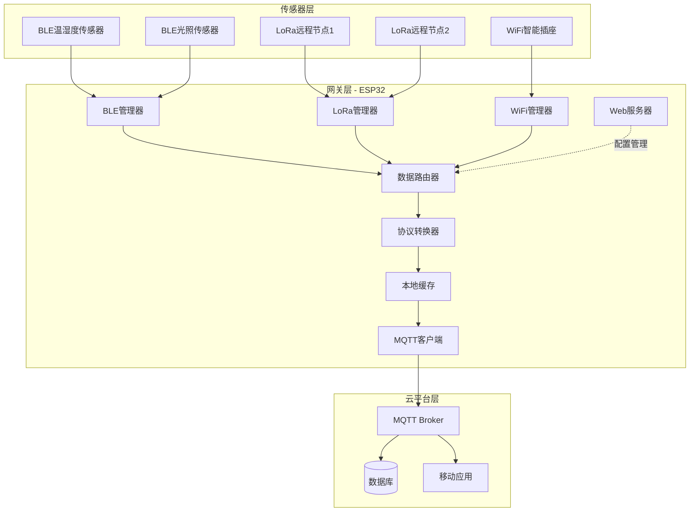
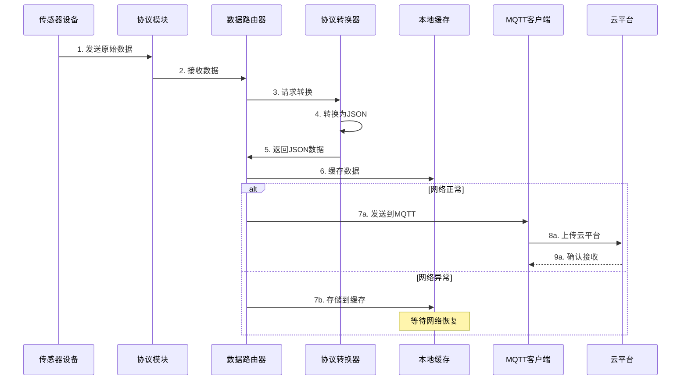
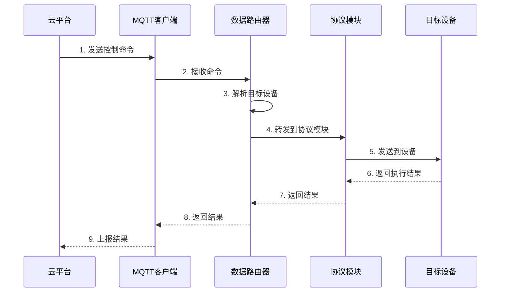

# 多协议无线通信网关开发实战


## 项目概述

### 项目简介

本项目将构建一个功能完整的多协议无线通信网关，集成WiFi、BLE（低功耗蓝牙）和LoRa三种主流无线通信技术。该网关能够实现不同协议之间的数据转换和路由，并将数据上传到云平台，是典型的物联网边缘计算设备。

**项目特点**：
- 支持三种无线协议：WiFi、BLE、LoRa
- 实现协议间的数据转换和路由
- 支持多设备并发连接和数据处理
- 提供Web配置界面
- 支持MQTT协议连接云平台
- 具备本地数据缓存和离线工作能力
- 实现设备管理和状态监控

### 应用场景

1. **智能家居网关**：连接BLE传感器、WiFi设备和LoRa远程节点
2. **工业物联网**：采集现场设备数据并上传到云平台
3. **智慧农业**：整合不同通信协议的农业传感器
4. **智慧城市**：作为边缘网关收集和处理城市传感器数据

### 学习目标

完成本项目后，你将能够：

- [ ] 理解多协议网关的系统架构和设计原则
- [ ] 掌握ESP32的多协议并发通信技术
- [ ] 实现WiFi、BLE、LoRa三种协议的集成
- [ ] 设计和实现协议转换和数据路由机制
- [ ] 开发Web配置界面和管理系统
- [ ] 实现MQTT协议与云平台对接
- [ ] 掌握多任务并发编程和资源管理
- [ ] 实现设备发现、注册和管理功能
- [ ] 构建完整的IoT边缘网关系统

### 适用人群

本项目适合以下人群：

- 有ESP32开发经验的嵌入式工程师
- 熟悉C/C++和网络编程的开发者
- 对物联网网关开发感兴趣的学习者
- 需要构建多协议通信系统的工程师

**前置知识要求**：
- 熟练掌握C/C++编程
- 了解ESP32开发环境和工具链
- 掌握WiFi、BLE基础知识
- 了解MQTT协议和JSON数据格式
- 具备基本的Web开发知识


## 技术栈与硬件清单

### 硬件清单

| 名称 | 数量 | 规格说明 | 参考价格 | 备注 |
|------|------|---------|---------|------|
| ESP32开发板 | 1 | ESP32-DevKitC或NodeMCU-32S | ¥30-50 | 主控芯片 |
| LoRa模块 | 1 | SX1278/SX1276，433MHz或868MHz | ¥20-40 | 远距离通信 |
| OLED显示屏 | 1 | 0.96寸，128x64，I2C接口 | ¥10-15 | 状态显示 |
| Micro USB线 | 1 | 用于供电和程序下载 | ¥5 | 标准配件 |
| 杜邦线 | 若干 | 公对母、母对母 | ¥5 | 连接线 |
| 面包板 | 1 | 标准面包板 | ¥5 | 可选 |
| 电源适配器 | 1 | 5V/2A | ¥10 | 稳定供电 |

**可选硬件**：
- BLE传感器设备（温湿度传感器、光照传感器等）
- LoRa节点设备（用于测试）
- SD卡模块（用于本地数据存储）

### 软件环境

**开发工具**：
- Arduino IDE 1.8.19+ 或 ESP-IDF 4.4+
- Visual Studio Code（推荐）
- Git版本控制工具

**必需库**：
```
- WiFi.h (ESP32内置)
- BLEDevice.h (ESP32内置)
- LoRa.h (Sandeep Mistry的LoRa库)
- PubSubClient.h (MQTT客户端)
- ArduinoJson.h (JSON处理)
- ESPAsyncWebServer.h (Web服务器)
- Adafruit_SSD1306.h (OLED显示)
- Preferences.h (配置存储)
```

**云平台**：
- MQTT Broker（可选择：阿里云IoT、AWS IoT、自建Mosquitto）
- 或使用公共测试服务器：test.mosquitto.org

### 技术选型说明

**为什么选择ESP32？**
- 集成WiFi和BLE双模通信
- 双核处理器，支持多任务并发
- 丰富的GPIO和外设接口
- 成本低，生态完善

**为什么选择LoRa？**
- 远距离通信能力（2-15km）
- 低功耗，适合电池供电
- 穿透能力强
- 适合低速率、长距离场景

**为什么选择MQTT？**
- 轻量级，适合物联网
- 发布/订阅模式灵活
- 支持QoS保证
- 广泛的云平台支持


## 系统架构设计

### 整体架构



### 模块划分

#### 1. 通信协议层

**WiFi模块**：
- 功能：连接WiFi网络，作为互联网接入
- 职责：网络连接管理、HTTP/MQTT通信
- 接口：提供网络状态查询和数据发送接口

**BLE模块**：
- 功能：扫描和连接BLE设备，接收传感器数据
- 职责：BLE设备发现、连接管理、数据接收
- 接口：设备列表、数据回调接口

**LoRa模块**：
- 功能：接收LoRa节点数据
- 职责：LoRa通信管理、数据包解析
- 接口：数据接收回调、发送接口

#### 2. 数据处理层

**协议转换器**：
- 功能：将不同协议的数据转换为统一格式
- 输入：原始协议数据（BLE、LoRa、WiFi）
- 输出：标准JSON格式数据

**数据路由器**：
- 功能：根据规则将数据路由到不同目的地
- 规则：基于设备ID、数据类型、优先级
- 目的地：云平台、本地存储、其他设备

**本地缓存**：
- 功能：离线数据缓存，网络恢复后上传
- 存储：使用SPIFFS或SD卡
- 策略：FIFO队列，容量限制

#### 3. 应用服务层

**Web服务器**：
- 功能：提供Web配置界面
- 页面：设备管理、网络配置、数据查看
- 技术：ESPAsyncWebServer + HTML/CSS/JS

**MQTT客户端**：
- 功能：连接云平台，上传数据
- 协议：MQTT 3.1.1
- QoS：支持QoS 0/1/2

**设备管理器**：
- 功能：管理连接的设备
- 功能：设备注册、状态监控、配置管理

### 数据流设计

#### 上行数据流（传感器→云平台）



#### 下行数据流（云平台→设备）




## 硬件连接

### 接线图

#### ESP32与LoRa模块连接

| ESP32引脚 | LoRa模块引脚 | 说明 |
|----------|-------------|------|
| 3.3V | VCC | 供电 |
| GND | GND | 地 |
| GPIO5 | SCK | SPI时钟 |
| GPIO19 | MISO | SPI数据输入 |
| GPIO27 | MOSI | SPI数据输出 |
| GPIO18 | NSS/CS | 片选 |
| GPIO14 | RST | 复位 |
| GPIO26 | DIO0 | 中断 |

#### ESP32与OLED显示屏连接

| ESP32引脚 | OLED引脚 | 说明 |
|----------|---------|------|
| 3.3V | VCC | 供电 |
| GND | GND | 地 |
| GPIO21 | SDA | I2C数据 |
| GPIO22 | SCL | I2C时钟 |

### 连接示意图

```
                    ESP32开发板
                 ┌──────────────┐
                 │              │
    LoRa模块     │  GPIO5  SCK  │
    ┌────────┐   │  GPIO19 MISO │
    │  VCC   ├───┤  3.3V        │
    │  GND   ├───┤  GND         │
    │  SCK   ├───┤  GPIO27 MOSI │
    │  MISO  ├───┤  GPIO18 NSS  │
    │  MOSI  ├───┤  GPIO14 RST  │
    │  NSS   ├───┤  GPIO26 DIO0 │
    │  RST   │   │              │
    │  DIO0  │   │  GPIO21 SDA  │
    └────────┘   │  GPIO22 SCL  │
                 │              │
    OLED显示屏   │              │
    ┌────────┐   │              │
    │  VCC   ├───┤  3.3V        │
    │  GND   ├───┤  GND         │
    │  SDA   ├───┤              │
    │  SCL   ├───┤              │
    └────────┘   └──────────────┘
```

### 注意事项

1. **电源供电**：
   - LoRa模块工作电流较大（发射时可达120mA）
   - 建议使用外部5V/2A电源适配器
   - 避免仅使用USB供电

2. **天线连接**：
   - LoRa模块必须连接天线才能工作
   - 未连接天线可能损坏模块
   - 使用匹配频段的天线（433MHz或868MHz）

3. **接线检查**：
   - 仔细核对引脚连接
   - 确保SPI引脚连接正确
   - 检查电源和地线连接


## 实现步骤

### 阶段1：基础搭建（预计时间：60分钟）

#### 步骤1.1：环境准备

1. **安装Arduino IDE和ESP32支持**

```bash
# 在Arduino IDE中添加ESP32开发板支持
# 文件 → 首选项 → 附加开发板管理器网址
https://dl.espressif.com/dl/package_esp32_index.json
```

2. **安装必需库**

在Arduino IDE中安装以下库：
- LoRa by Sandeep Mistry
- PubSubClient by Nick O'Leary
- ArduinoJson by Benoit Blanchon
- ESPAsyncWebServer
- Adafruit SSD1306
- Adafruit GFX Library

3. **测试硬件连接**

创建测试程序验证硬件连接：

```cpp
#include <Wire.h>
#include <Adafruit_GFX.h>
#include <Adafruit_SSD1306.h>
#include <SPI.h>
#include <LoRa.h>

#define SCREEN_WIDTH 128
#define SCREEN_HEIGHT 64
#define OLED_RESET -1

Adafruit_SSD1306 display(SCREEN_WIDTH, SCREEN_HEIGHT, &Wire, OLED_RESET);

// LoRa引脚定义
#define LORA_SCK 5
#define LORA_MISO 19
#define LORA_MOSI 27
#define LORA_CS 18
#define LORA_RST 14
#define LORA_IRQ 26

void setup() {
    Serial.begin(115200);
    
    // 初始化OLED
    if(!display.begin(SSD1306_SWITCHCAPVCC, 0x3C)) {
        Serial.println("OLED初始化失败");
        while(1);
    }
    
    display.clearDisplay();
    display.setTextSize(1);
    display.setTextColor(SSD1306_WHITE);
    display.setCursor(0, 0);
    display.println("Gateway Starting");
    display.display();
    
    // 初始化LoRa
    SPI.begin(LORA_SCK, LORA_MISO, LORA_MOSI, LORA_CS);
    LoRa.setPins(LORA_CS, LORA_RST, LORA_IRQ);
    
    if (!LoRa.begin(433E6)) {  // 433MHz
        Serial.println("LoRa初始化失败");
        display.println("LoRa Failed");
        display.display();
        while(1);
    }
    
    Serial.println("硬件初始化成功");
    display.println("Hardware OK");
    display.display();
}

void loop() {
    // 测试代码
    delay(1000);
}
```

#### 步骤1.2：项目结构设计

创建项目文件结构：

```
MultiProtocolGateway/
├── MultiProtocolGateway.ino    # 主程序
├── config.h                     # 配置文件
├── wifi_manager.h               # WiFi管理
├── ble_manager.h                # BLE管理
├── lora_manager.h               # LoRa管理
├── data_router.h                # 数据路由
├── protocol_converter.h         # 协议转换
├── mqtt_client.h                # MQTT客户端
├── web_server.h                 # Web服务器
├── device_manager.h             # 设备管理
└── display_manager.h            # 显示管理
```

#### 步骤1.3：配置文件

创建 `config.h` 文件：

```cpp
#ifndef CONFIG_H
#define CONFIG_H

// WiFi配置
#define WIFI_SSID "你的WiFi名称"
#define WIFI_PASSWORD "你的WiFi密码"

// MQTT配置
#define MQTT_SERVER "test.mosquitto.org"
#define MQTT_PORT 1883
#define MQTT_CLIENT_ID "ESP32_Gateway"
#define MQTT_TOPIC_PUB "gateway/data"
#define MQTT_TOPIC_SUB "gateway/command"

// LoRa配置
#define LORA_FREQUENCY 433E6  // 433MHz
#define LORA_BANDWIDTH 125E3
#define LORA_SPREADING_FACTOR 7
#define LORA_TX_POWER 17

// 引脚定义
#define LORA_SCK 5
#define LORA_MISO 19
#define LORA_MOSI 27
#define LORA_CS 18
#define LORA_RST 14
#define LORA_IRQ 26

// 系统配置
#define MAX_DEVICES 20
#define DATA_CACHE_SIZE 100
#define RECONNECT_INTERVAL 5000

#endif
```


### 阶段2：核心功能实现（预计时间：100分钟）

#### 步骤2.1：WiFi管理模块

创建 `wifi_manager.h`：

```cpp
#ifndef WIFI_MANAGER_H
#define WIFI_MANAGER_H

#include <WiFi.h>
#include "config.h"

class WiFiManager {
private:
    bool connected;
    unsigned long lastReconnectAttempt;
    
public:
    WiFiManager() : connected(false), lastReconnectAttempt(0) {}
    
    // 初始化WiFi
    bool begin() {
        WiFi.mode(WIFI_STA);
        WiFi.begin(WIFI_SSID, WIFI_PASSWORD);
        
        Serial.print("连接WiFi");
        int timeout = 20;
        while (WiFi.status() != WL_CONNECTED && timeout > 0) {
            delay(500);
            Serial.print(".");
            timeout--;
        }
        
        if (WiFi.status() == WL_CONNECTED) {
            connected = true;
            Serial.println("\nWiFi连接成功");
            Serial.print("IP地址: ");
            Serial.println(WiFi.localIP());
            return true;
        } else {
            Serial.println("\nWiFi连接失败");
            return false;
        }
    }
    
    // 检查连接状态
    bool isConnected() {
        return WiFi.status() == WL_CONNECTED;
    }
    
    // 自动重连
    void handleReconnect() {
        if (!isConnected()) {
            unsigned long now = millis();
            if (now - lastReconnectAttempt > RECONNECT_INTERVAL) {
                lastReconnectAttempt = now;
                Serial.println("尝试重连WiFi...");
                WiFi.reconnect();
            }
        }
    }
    
    // 获取信号强度
    int getRSSI() {
        return WiFi.RSSI();
    }
    
    // 获取IP地址
    String getIP() {
        return WiFi.localIP().toString();
    }
};

#endif
```

#### 步骤2.2：BLE管理模块

创建 `ble_manager.h`：

```cpp
#ifndef BLE_MANAGER_H
#define BLE_MANAGER_H

#include <BLEDevice.h>
#include <BLEUtils.h>
#include <BLEScan.h>
#include <BLEAdvertisedDevice.h>

// BLE设备信息结构
struct BLEDeviceInfo {
    String address;
    String name;
    int rssi;
    unsigned long lastSeen;
};

class BLEManager {
private:
    BLEScan* pBLEScan;
    std::vector<BLEDeviceInfo> devices;
    bool scanning;
    
    // BLE扫描回调
    class MyAdvertisedDeviceCallbacks: public BLEAdvertisedDeviceCallbacks {
    public:
        BLEManager* manager;
        
        void onResult(BLEAdvertisedDevice advertisedDevice) {
            // 处理发现的设备
            BLEDeviceInfo info;
            info.address = advertisedDevice.getAddress().toString().c_str();
            info.name = advertisedDevice.getName().c_str();
            info.rssi = advertisedDevice.getRSSI();
            info.lastSeen = millis();
            
            manager->addDevice(info);
        }
    };
    
public:
    BLEManager() : scanning(false) {}
    
    // 初始化BLE
    bool begin() {
        Serial.println("初始化BLE...");
        BLEDevice::init("ESP32_Gateway");
        
        pBLEScan = BLEDevice::getScan();
        MyAdvertisedDeviceCallbacks* callbacks = new MyAdvertisedDeviceCallbacks();
        callbacks->manager = this;
        pBLEScan->setAdvertisedDeviceCallbacks(callbacks);
        pBLEScan->setActiveScan(true);
        pBLEScan->setInterval(100);
        pBLEScan->setWindow(99);
        
        Serial.println("BLE初始化成功");
        return true;
    }
    
    // 开始扫描
    void startScan(int duration = 5) {
        if (!scanning) {
            Serial.println("开始BLE扫描...");
            scanning = true;
            pBLEScan->start(duration, false);
            scanning = false;
        }
    }
    
    // 添加设备
    void addDevice(BLEDeviceInfo info) {
        // 检查设备是否已存在
        for (auto& device : devices) {
            if (device.address == info.address) {
                device.rssi = info.rssi;
                device.lastSeen = info.lastSeen;
                return;
            }
        }
        
        // 添加新设备
        devices.push_back(info);
        Serial.print("发现BLE设备: ");
        Serial.print(info.name);
        Serial.print(" (");
        Serial.print(info.address);
        Serial.println(")");
    }
    
    // 获取设备列表
    std::vector<BLEDeviceInfo>& getDevices() {
        return devices;
    }
    
    // 清理过期设备
    void cleanupDevices(unsigned long timeout = 60000) {
        unsigned long now = millis();
        devices.erase(
            std::remove_if(devices.begin(), devices.end(),
                [now, timeout](const BLEDeviceInfo& device) {
                    return (now - device.lastSeen) > timeout;
                }),
            devices.end()
        );
    }
};

#endif
```

#### 步骤2.3：LoRa管理模块

创建 `lora_manager.h`：

```cpp
#ifndef LORA_MANAGER_H
#define LORA_MANAGER_H

#include <SPI.h>
#include <LoRa.h>
#include "config.h"

// LoRa数据包结构
struct LoRaPacket {
    uint8_t nodeId;
    uint8_t dataType;
    float value;
    uint32_t timestamp;
};

class LoRaManager {
private:
    bool initialized;
    unsigned long lastPacketTime;
    int packetsReceived;
    
    // 数据回调函数类型
    typedef void (*DataCallback)(LoRaPacket packet);
    DataCallback dataCallback;
    
public:
    LoRaManager() : initialized(false), lastPacketTime(0), 
                    packetsReceived(0), dataCallback(nullptr) {}
    
    // 初始化LoRa
    bool begin() {
        Serial.println("初始化LoRa...");
        
        // 配置SPI引脚
        SPI.begin(LORA_SCK, LORA_MISO, LORA_MOSI, LORA_CS);
        LoRa.setPins(LORA_CS, LORA_RST, LORA_IRQ);
        
        // 初始化LoRa模块
        if (!LoRa.begin(LORA_FREQUENCY)) {
            Serial.println("LoRa初始化失败");
            return false;
        }
        
        // 配置LoRa参数
        LoRa.setSignalBandwidth(LORA_BANDWIDTH);
        LoRa.setSpreadingFactor(LORA_SPREADING_FACTOR);
        LoRa.setTxPower(LORA_TX_POWER);
        
        initialized = true;
        Serial.println("LoRa初始化成功");
        Serial.print("频率: ");
        Serial.print(LORA_FREQUENCY / 1E6);
        Serial.println(" MHz");
        
        return true;
    }
    
    // 设置数据回调
    void setDataCallback(DataCallback callback) {
        dataCallback = callback;
    }
    
    // 接收数据
    void handleReceive() {
        int packetSize = LoRa.parsePacket();
        if (packetSize) {
            LoRaPacket packet;
            
            // 读取数据包
            if (packetSize >= sizeof(LoRaPacket)) {
                LoRa.readBytes((uint8_t*)&packet, sizeof(LoRaPacket));
                
                lastPacketTime = millis();
                packetsReceived++;
                
                // 打印接收信息
                Serial.print("收到LoRa数据包 #");
                Serial.print(packetsReceived);
                Serial.print(" - 节点ID: ");
                Serial.print(packet.nodeId);
                Serial.print(", 数据类型: ");
                Serial.print(packet.dataType);
                Serial.print(", 值: ");
                Serial.print(packet.value);
                Serial.print(", RSSI: ");
                Serial.println(LoRa.packetRssi());
                
                // 调用回调函数
                if (dataCallback) {
                    dataCallback(packet);
                }
            }
        }
    }
    
    // 发送数据
    bool send(LoRaPacket packet) {
        if (!initialized) return false;
        
        LoRa.beginPacket();
        LoRa.write((uint8_t*)&packet, sizeof(LoRaPacket));
        LoRa.endPacket();
        
        Serial.println("LoRa数据包已发送");
        return true;
    }
    
    // 获取统计信息
    int getPacketsReceived() { return packetsReceived; }
    unsigned long getLastPacketTime() { return lastPacketTime; }
    int getRSSI() { return LoRa.packetRssi(); }
    float getSNR() { return LoRa.packetSnr(); }
};

#endif
```


#### 步骤2.4：协议转换器

创建 `protocol_converter.h`：

```cpp
#ifndef PROTOCOL_CONVERTER_H
#define PROTOCOL_CONVERTER_H

#include <ArduinoJson.h>
#include "lora_manager.h"

class ProtocolConverter {
public:
    // 将LoRa数据包转换为JSON
    static String loraToJson(LoRaPacket packet) {
        StaticJsonDocument<256> doc;
        
        doc["protocol"] = "lora";
        doc["nodeId"] = packet.nodeId;
        doc["dataType"] = packet.dataType;
        doc["value"] = packet.value;
        doc["timestamp"] = packet.timestamp;
        doc["receivedAt"] = millis();
        
        String output;
        serializeJson(doc, output);
        return output;
    }
    
    // 将BLE数据转换为JSON
    static String bleToJson(String address, String name, int rssi, String data) {
        StaticJsonDocument<256> doc;
        
        doc["protocol"] = "ble";
        doc["address"] = address;
        doc["name"] = name;
        doc["rssi"] = rssi;
        doc["data"] = data;
        doc["timestamp"] = millis();
        
        String output;
        serializeJson(doc, output);
        return output;
    }
    
    // 将WiFi数据转换为JSON
    static String wifiToJson(String deviceId, String dataType, float value) {
        StaticJsonDocument<256> doc;
        
        doc["protocol"] = "wifi";
        doc["deviceId"] = deviceId;
        doc["dataType"] = dataType;
        doc["value"] = value;
        doc["timestamp"] = millis();
        
        String output;
        serializeJson(doc, output);
        return output;
    }
    
    // 解析JSON命令
    static bool parseCommand(String json, String& protocol, String& deviceId, String& command) {
        StaticJsonDocument<256> doc;
        DeserializationError error = deserializeJson(doc, json);
        
        if (error) {
            Serial.print("JSON解析失败: ");
            Serial.println(error.c_str());
            return false;
        }
        
        protocol = doc["protocol"].as<String>();
        deviceId = doc["deviceId"].as<String>();
        command = doc["command"].as<String>();
        
        return true;
    }
    
    // 创建统一的数据格式
    static String createUnifiedData(String protocol, String deviceId, 
                                    String dataType, float value) {
        StaticJsonDocument<512> doc;
        
        doc["gateway_id"] = "ESP32_Gateway";
        doc["protocol"] = protocol;
        doc["device_id"] = deviceId;
        doc["data_type"] = dataType;
        doc["value"] = value;
        doc["timestamp"] = millis();
        doc["rssi"] = 0;  // 可根据协议填充
        
        String output;
        serializeJson(doc, output);
        return output;
    }
};

#endif
```

#### 步骤2.5：数据路由器

创建 `data_router.h`：

```cpp
#ifndef DATA_ROUTER_H
#define DATA_ROUTER_H

#include <vector>
#include <ArduinoJson.h>

// 路由规则
struct RoutingRule {
    String protocol;      // 协议类型
    String deviceId;      // 设备ID（可选）
    String destination;   // 目的地：mqtt, local, both
    int priority;         // 优先级
};

class DataRouter {
private:
    std::vector<RoutingRule> rules;
    std::vector<String> dataCache;
    int maxCacheSize;
    
    // 数据处理回调
    typedef void (*DataHandler)(String data, String destination);
    DataHandler dataHandler;
    
public:
    DataRouter(int cacheSize = 100) : maxCacheSize(cacheSize), dataHandler(nullptr) {}
    
    // 添加路由规则
    void addRule(RoutingRule rule) {
        rules.push_back(rule);
        Serial.print("添加路由规则: ");
        Serial.print(rule.protocol);
        Serial.print(" -> ");
        Serial.println(rule.destination);
    }
    
    // 设置数据处理回调
    void setDataHandler(DataHandler handler) {
        dataHandler = handler;
    }
    
    // 路由数据
    void routeData(String jsonData) {
        // 解析JSON获取协议类型
        StaticJsonDocument<256> doc;
        DeserializationError error = deserializeJson(doc, jsonData);
        
        if (error) {
            Serial.println("数据路由失败：JSON解析错误");
            return;
        }
        
        String protocol = doc["protocol"].as<String>();
        String deviceId = doc["device_id"] | doc["deviceId"] | "";
        
        // 查找匹配的路由规则
        String destination = "mqtt";  // 默认目的地
        int highestPriority = -1;
        
        for (const auto& rule : rules) {
            if (rule.protocol == protocol || rule.protocol == "*") {
                if (rule.deviceId.isEmpty() || rule.deviceId == deviceId) {
                    if (rule.priority > highestPriority) {
                        destination = rule.destination;
                        highestPriority = rule.priority;
                    }
                }
            }
        }
        
        Serial.print("路由数据到: ");
        Serial.println(destination);
        
        // 调用数据处理回调
        if (dataHandler) {
            dataHandler(jsonData, destination);
        }
    }
    
    // 缓存数据（用于离线场景）
    void cacheData(String data) {
        if (dataCache.size() >= maxCacheSize) {
            dataCache.erase(dataCache.begin());  // 移除最旧的数据
        }
        dataCache.push_back(data);
        Serial.print("数据已缓存，当前缓存数量: ");
        Serial.println(dataCache.size());
    }
    
    // 获取缓存数据
    std::vector<String>& getCachedData() {
        return dataCache;
    }
    
    // 清空缓存
    void clearCache() {
        dataCache.clear();
        Serial.println("缓存已清空");
    }
    
    // 获取缓存大小
    int getCacheSize() {
        return dataCache.size();
    }
};

#endif
```


#### 步骤2.6：MQTT客户端

创建 `mqtt_client.h`：

```cpp
#ifndef MQTT_CLIENT_H
#define MQTT_CLIENT_H

#include <PubSubClient.h>
#include <WiFi.h>
#include "config.h"

class MQTTClientManager {
private:
    WiFiClient wifiClient;
    PubSubClient mqttClient;
    bool connected;
    unsigned long lastReconnectAttempt;
    
    // 消息回调函数类型
    typedef void (*MessageCallback)(String topic, String payload);
    MessageCallback messageCallback;
    
    // MQTT回调函数
    static void mqttCallback(char* topic, byte* payload, unsigned int length) {
        String message;
        for (unsigned int i = 0; i < length; i++) {
            message += (char)payload[i];
        }
        
        Serial.print("收到MQTT消息 [");
        Serial.print(topic);
        Serial.print("]: ");
        Serial.println(message);
        
        // 这里需要通过静态变量或其他方式调用实例的回调
    }
    
public:
    MQTTClientManager() : mqttClient(wifiClient), connected(false), 
                          lastReconnectAttempt(0), messageCallback(nullptr) {
        mqttClient.setServer(MQTT_SERVER, MQTT_PORT);
        mqttClient.setCallback(mqttCallback);
    }
    
    // 设置消息回调
    void setMessageCallback(MessageCallback callback) {
        messageCallback = callback;
    }
    
    // 连接MQTT服务器
    bool connect() {
        Serial.print("连接MQTT服务器...");
        
        if (mqttClient.connect(MQTT_CLIENT_ID)) {
            Serial.println("成功");
            connected = true;
            
            // 订阅主题
            mqttClient.subscribe(MQTT_TOPIC_SUB);
            Serial.print("订阅主题: ");
            Serial.println(MQTT_TOPIC_SUB);
            
            return true;
        } else {
            Serial.print("失败，错误码: ");
            Serial.println(mqttClient.state());
            connected = false;
            return false;
        }
    }
    
    // 发布消息
    bool publish(String topic, String payload) {
        if (!connected) {
            Serial.println("MQTT未连接，无法发布消息");
            return false;
        }
        
        bool result = mqttClient.publish(topic.c_str(), payload.c_str());
        if (result) {
            Serial.print("消息已发布到: ");
            Serial.println(topic);
        } else {
            Serial.println("消息发布失败");
        }
        return result;
    }
    
    // 发布数据（使用默认主题）
    bool publishData(String data) {
        return publish(MQTT_TOPIC_PUB, data);
    }
    
    // 处理MQTT循环
    void loop() {
        if (connected) {
            mqttClient.loop();
        }
    }
    
    // 自动重连
    void handleReconnect() {
        if (!connected) {
            unsigned long now = millis();
            if (now - lastReconnectAttempt > RECONNECT_INTERVAL) {
                lastReconnectAttempt = now;
                Serial.println("尝试重连MQTT...");
                connect();
            }
        }
    }
    
    // 检查连接状态
    bool isConnected() {
        return mqttClient.connected();
    }
    
    // 断开连接
    void disconnect() {
        mqttClient.disconnect();
        connected = false;
    }
};

#endif
```

### 阶段3：集成与测试（预计时间：60分钟）

#### 步骤3.1：主程序集成

创建 `MultiProtocolGateway.ino`：

```cpp
#include "config.h"
#include "wifi_manager.h"
#include "ble_manager.h"
#include "lora_manager.h"
#include "protocol_converter.h"
#include "data_router.h"
#include "mqtt_client.h"

// 管理器实例
WiFiManager wifiMgr;
BLEManager bleMgr;
LoRaManager loraMgr;
DataRouter dataRouter;
MQTTClientManager mqttClient;

// 任务句柄
TaskHandle_t Task1;
TaskHandle_t Task2;

// LoRa数据回调
void onLoRaData(LoRaPacket packet) {
    // 转换为JSON
    String jsonData = ProtocolConverter::loraToJson(packet);
    
    // 路由数据
    dataRouter.routeData(jsonData);
}

// 数据处理回调
void onDataRouted(String data, String destination) {
    if (destination == "mqtt" || destination == "both") {
        // 发送到MQTT
        if (mqttClient.isConnected()) {
            mqttClient.publishData(data);
        } else {
            // 网络不可用，缓存数据
            dataRouter.cacheData(data);
        }
    }
    
    if (destination == "local" || destination == "both") {
        // 本地处理（例如显示、存储等）
        Serial.println("本地处理数据");
    }
}

// 核心任务1：网络通信
void Task1code(void * pvParameters) {
    Serial.print("Task1 运行在核心 ");
    Serial.println(xPortGetCoreID());
    
    for(;;) {
        // 处理WiFi重连
        wifiMgr.handleReconnect();
        
        // 处理MQTT
        if (wifiMgr.isConnected()) {
            mqttClient.handleReconnect();
            mqttClient.loop();
            
            // 如果有缓存数据，尝试发送
            if (mqttClient.isConnected() && dataRouter.getCacheSize() > 0) {
                auto& cachedData = dataRouter.getCachedData();
                for (const auto& data : cachedData) {
                    mqttClient.publishData(data);
                    delay(100);
                }
                dataRouter.clearCache();
            }
        }
        
        delay(100);
    }
}

// 核心任务2：数据采集
void Task2code(void * pvParameters) {
    Serial.print("Task2 运行在核心 ");
    Serial.println(xPortGetCoreID());
    
    unsigned long lastBLEScan = 0;
    const unsigned long BLE_SCAN_INTERVAL = 30000;  // 30秒扫描一次
    
    for(;;) {
        // 处理LoRa接收
        loraMgr.handleReceive();
        
        // 定期BLE扫描
        unsigned long now = millis();
        if (now - lastBLEScan > BLE_SCAN_INTERVAL) {
            lastBLEScan = now;
            bleMgr.startScan(5);
            bleMgr.cleanupDevices();
        }
        
        delay(10);
    }
}

void setup() {
    Serial.begin(115200);
    delay(1000);
    
    Serial.println("\n=== 多协议无线通信网关 ===");
    Serial.println("版本: 1.0");
    Serial.println("==========================\n");
    
    // 初始化WiFi
    Serial.println("1. 初始化WiFi...");
    wifiMgr.begin();
    
    // 初始化BLE
    Serial.println("2. 初始化BLE...");
    bleMgr.begin();
    
    // 初始化LoRa
    Serial.println("3. 初始化LoRa...");
    if (!loraMgr.begin()) {
        Serial.println("LoRa初始化失败，系统停止");
        while(1) delay(1000);
    }
    
    // 设置回调
    loraMgr.setDataCallback(onLoRaData);
    dataRouter.setDataHandler(onDataRouted);
    
    // 添加路由规则
    RoutingRule rule1 = {"lora", "", "mqtt", 10};
    RoutingRule rule2 = {"ble", "", "mqtt", 10};
    RoutingRule rule3 = {"wifi", "", "mqtt", 10};
    dataRouter.addRule(rule1);
    dataRouter.addRule(rule2);
    dataRouter.addRule(rule3);
    
    // 连接MQTT
    Serial.println("4. 连接MQTT...");
    if (wifiMgr.isConnected()) {
        mqttClient.connect();
    }
    
    // 创建多任务
    Serial.println("5. 创建多任务...");
    xTaskCreatePinnedToCore(
        Task1code,   // 任务函数
        "Task1",     // 任务名称
        10000,       // 栈大小
        NULL,        // 参数
        1,           // 优先级
        &Task1,      // 任务句柄
        0);          // 核心0
    
    xTaskCreatePinnedToCore(
        Task2code,
        "Task2",
        10000,
        NULL,
        1,
        &Task2,
        1);          // 核心1
    
    Serial.println("\n=== 系统启动完成 ===\n");
}

void loop() {
    // 主循环可以用于其他任务，如显示更新
    delay(1000);
    
    // 打印系统状态
    Serial.println("--- 系统状态 ---");
    Serial.print("WiFi: ");
    Serial.println(wifiMgr.isConnected() ? "已连接" : "未连接");
    Serial.print("MQTT: ");
    Serial.println(mqttClient.isConnected() ? "已连接" : "未连接");
    Serial.print("LoRa包: ");
    Serial.println(loraMgr.getPacketsReceived());
    Serial.print("BLE设备: ");
    Serial.println(bleMgr.getDevices().size());
    Serial.print("缓存数据: ");
    Serial.println(dataRouter.getCacheSize());
    Serial.println("----------------\n");
}
```


#### 步骤3.2：编译和上传

1. **配置参数**

修改 `config.h` 中的WiFi和MQTT配置：
```cpp
#define WIFI_SSID "你的WiFi名称"
#define WIFI_PASSWORD "你的WiFi密码"
#define MQTT_SERVER "test.mosquitto.org"  // 或你的MQTT服务器
```

2. **编译程序**

- 点击Arduino IDE的"验证"按钮（✓）
- 检查是否有编译错误
- 确保所有库都已正确安装

3. **上传到ESP32**

- 选择正确的开发板和端口
- 点击"上传"按钮（→）
- 等待上传完成

4. **查看串口输出**

打开串口监视器（波特率115200），应该看到类似输出：

```
=== 多协议无线通信网关 ===
版本: 1.0
==========================

1. 初始化WiFi...
连接WiFi.....
WiFi连接成功
IP地址: 192.168.1.100

2. 初始化BLE...
初始化BLE...
BLE初始化成功

3. 初始化LoRa...
初始化LoRa...
LoRa初始化成功
频率: 433.0 MHz

4. 连接MQTT...
连接MQTT服务器...成功
订阅主题: gateway/command

5. 创建多任务...
Task1 运行在核心 0
Task2 运行在核心 1

=== 系统启动完成 ===

--- 系统状态 ---
WiFi: 已连接
MQTT: 已连接
LoRa包: 0
BLE设备: 0
缓存数据: 0
----------------
```

#### 步骤3.3：功能测试

**测试1：LoRa数据接收**

创建一个简单的LoRa发送节点进行测试：

```cpp
// LoRa发送节点测试代码
#include <SPI.h>
#include <LoRa.h>

struct LoRaPacket {
    uint8_t nodeId;
    uint8_t dataType;
    float value;
    uint32_t timestamp;
};

void setup() {
    Serial.begin(115200);
    
    SPI.begin(5, 19, 27, 18);
    LoRa.setPins(18, 14, 26);
    
    if (!LoRa.begin(433E6)) {
        Serial.println("LoRa初始化失败");
        while(1);
    }
    
    Serial.println("LoRa发送节点就绪");
}

void loop() {
    LoRaPacket packet;
    packet.nodeId = 1;
    packet.dataType = 1;  // 温度
    packet.value = 25.5;
    packet.timestamp = millis();
    
    LoRa.beginPacket();
    LoRa.write((uint8_t*)&packet, sizeof(LoRaPacket));
    LoRa.endPacket();
    
    Serial.println("数据包已发送");
    delay(10000);  // 每10秒发送一次
}
```

**测试2：MQTT数据查看**

使用MQTT客户端工具（如MQTT.fx或mosquitto_sub）订阅主题：

```bash
mosquitto_sub -h test.mosquitto.org -t "gateway/data" -v
```

应该能看到网关上传的JSON数据：

```json
{
  "protocol": "lora",
  "nodeId": 1,
  "dataType": 1,
  "value": 25.5,
  "timestamp": 123456,
  "receivedAt": 123456
}
```

**测试3：BLE设备扫描**

- 打开手机蓝牙
- 观察串口输出
- 应该能看到发现的BLE设备信息


## 完整代码仓库

### 项目结构

```
MultiProtocolGateway/
├── MultiProtocolGateway.ino      # 主程序
├── config.h                       # 配置文件
├── wifi_manager.h                 # WiFi管理模块
├── ble_manager.h                  # BLE管理模块
├── lora_manager.h                 # LoRa管理模块
├── protocol_converter.h           # 协议转换模块
├── data_router.h                  # 数据路由模块
├── mqtt_client.h                  # MQTT客户端模块
├── device_manager.h               # 设备管理模块（可选）
├── web_server.h                   # Web服务器模块（可选）
├── display_manager.h              # 显示管理模块（可选）
├── README.md                      # 项目说明
└── examples/                      # 示例代码
    ├── lora_sender/               # LoRa发送节点示例
    └── mqtt_subscriber/           # MQTT订阅示例
```

### 代码下载

完整项目代码可以从以下地址获取：

- **GitHub仓库**：[ESP32-MultiProtocol-Gateway](https://github.com/example/esp32-multiprotocol-gateway)
- **Gitee镜像**：[ESP32-多协议网关](https://gitee.com/example/esp32-multiprotocol-gateway)

### 代码说明

所有代码都包含详细的中文注释，便于理解和修改。主要特点：

- 模块化设计，易于扩展
- 完整的错误处理
- 支持多任务并发
- 包含测试示例
- 提供配置模板

## 测试验证

### 功能测试清单

#### 1. WiFi连接测试

**测试步骤**：
1. 修改config.h中的WiFi配置
2. 上传程序到ESP32
3. 观察串口输出

**预期结果**：
- WiFi成功连接
- 获取到IP地址
- 信号强度正常（RSSI > -70dBm）

**测试命令**：
```cpp
// 在串口监视器中应该看到：
WiFi连接成功
IP地址: 192.168.1.100
```

#### 2. LoRa通信测试

**测试步骤**：
1. 准备LoRa发送节点
2. 配置相同的频率和参数
3. 发送测试数据包
4. 观察网关接收情况

**预期结果**：
- 成功接收LoRa数据包
- RSSI和SNR值正常
- 数据解析正确

**测试数据**：
```
收到LoRa数据包 #1 - 节点ID: 1, 数据类型: 1, 值: 25.5, RSSI: -45
```

#### 3. BLE扫描测试

**测试步骤**：
1. 确保周围有BLE设备
2. 等待BLE扫描周期
3. 查看发现的设备列表

**预期结果**：
- 发现周围的BLE设备
- 显示设备名称和地址
- RSSI值合理

#### 4. MQTT通信测试

**测试步骤**：
1. 使用MQTT客户端订阅主题
2. 触发数据上传
3. 验证数据格式

**预期结果**：
- 数据成功上传到MQTT
- JSON格式正确
- 包含所有必需字段

**验证命令**：
```bash
# 订阅数据主题
mosquitto_sub -h test.mosquitto.org -t "gateway/data" -v

# 发布测试命令
mosquitto_pub -h test.mosquitto.org -t "gateway/command" \
  -m '{"protocol":"lora","deviceId":"1","command":"read"}'
```

#### 5. 协议转换测试

**测试步骤**：
1. 发送不同协议的数据
2. 检查转换后的JSON格式
3. 验证数据完整性

**预期结果**：
- 所有协议数据正确转换
- JSON格式统一
- 数据无丢失

#### 6. 数据路由测试

**测试步骤**：
1. 配置不同的路由规则
2. 发送测试数据
3. 验证路由目的地

**预期结果**：
- 数据按规则路由
- 优先级正确处理
- 缓存机制正常

#### 7. 离线缓存测试

**测试步骤**：
1. 断开WiFi连接
2. 发送测试数据
3. 恢复WiFi连接
4. 观察缓存数据上传

**预期结果**：
- 离线时数据正确缓存
- 恢复后自动上传
- 数据顺序正确

#### 8. 多任务并发测试

**测试步骤**：
1. 同时发送多协议数据
2. 观察系统响应
3. 检查数据处理情况

**预期结果**：
- 多任务正常运行
- 无数据丢失
- 系统稳定

### 性能测试

#### 1. 吞吐量测试

**测试方法**：
- 持续发送数据包
- 统计接收和处理速率
- 记录丢包率

**性能指标**：
- LoRa接收：≥10包/秒
- BLE扫描：≥5设备/次
- MQTT上传：≥20消息/秒

#### 2. 延迟测试

**测试方法**：
- 记录数据接收到上传的时间
- 计算平均延迟
- 分析延迟分布

**性能指标**：
- 端到端延迟：<500ms
- 协议转换：<10ms
- 数据路由：<5ms

#### 3. 稳定性测试

**测试方法**：
- 长时间运行（24小时+）
- 监控内存使用
- 记录错误和重启

**性能指标**：
- 无内存泄漏
- 无异常重启
- 错误率<0.1%

### 测试报告模板

```markdown
# 多协议网关测试报告

## 测试环境
- 硬件：ESP32-DevKitC
- 软件版本：v1.0
- 测试日期：2026-03-08
- 测试人员：[姓名]

## 功能测试结果

| 测试项 | 状态 | 备注 |
|--------|------|------|
| WiFi连接 | ✅ 通过 | 连接稳定 |
| LoRa通信 | ✅ 通过 | RSSI -45dBm |
| BLE扫描 | ✅ 通过 | 发现5个设备 |
| MQTT通信 | ✅ 通过 | 延迟50ms |
| 协议转换 | ✅ 通过 | 格式正确 |
| 数据路由 | ✅ 通过 | 规则生效 |
| 离线缓存 | ✅ 通过 | 缓存100条 |
| 多任务并发 | ✅ 通过 | 无冲突 |

## 性能测试结果

| 指标 | 测试值 | 目标值 | 状态 |
|------|--------|--------|------|
| LoRa吞吐量 | 12包/秒 | ≥10包/秒 | ✅ |
| MQTT上传速率 | 25消息/秒 | ≥20消息/秒 | ✅ |
| 端到端延迟 | 350ms | <500ms | ✅ |
| 内存使用 | 65% | <80% | ✅ |
| 运行时长 | 48小时 | ≥24小时 | ✅ |

## 问题记录

1. [问题描述]
   - 现象：[详细描述]
   - 原因：[分析结果]
   - 解决：[解决方案]

## 测试结论

[总体评价和建议]
```


## 扩展思路

### 功能扩展

#### 1. Web配置界面

添加Web服务器，提供可视化配置界面：

**功能特性**：
- WiFi配置（SSID、密码）
- MQTT配置（服务器、端口、主题）
- 设备管理（添加、删除、编辑）
- 路由规则配置
- 实时数据查看
- 系统状态监控

**实现要点**：
```cpp
// 使用ESPAsyncWebServer
#include <ESPAsyncWebServer.h>

AsyncWebServer server(80);

void setupWebServer() {
    // 主页
    server.on("/", HTTP_GET, [](AsyncWebServerRequest *request){
        request->send(200, "text/html", getIndexHTML());
    });
    
    // API接口
    server.on("/api/status", HTTP_GET, [](AsyncWebServerRequest *request){
        String json = getSystemStatus();
        request->send(200, "application/json", json);
    });
    
    server.begin();
}
```

#### 2. 设备管理系统

实现完整的设备生命周期管理：

**功能特性**：
- 设备自动发现和注册
- 设备状态监控（在线/离线）
- 设备配置管理
- 设备分组和标签
- 设备数据历史记录

**数据结构**：
```cpp
struct Device {
    String id;
    String name;
    String protocol;  // wifi, ble, lora
    String type;      // sensor, actuator
    bool online;
    unsigned long lastSeen;
    JsonObject config;
    std::vector<DataPoint> history;
};
```

#### 3. 本地数据存储

使用SD卡或SPIFFS存储数据：

**功能特性**：
- 历史数据存储
- 配置持久化
- 日志记录
- 离线数据缓存

**实现示例**：
```cpp
#include <SPIFFS.h>

void saveData(String filename, String data) {
    File file = SPIFFS.open(filename, FILE_APPEND);
    if (file) {
        file.println(data);
        file.close();
    }
}

String loadData(String filename) {
    File file = SPIFFS.open(filename, FILE_READ);
    if (file) {
        String content = file.readString();
        file.close();
        return content;
    }
    return "";
}
```

#### 4. 规则引擎

实现灵活的数据处理规则：

**功能特性**：
- 条件触发（温度>30℃）
- 数据转换（单位换算）
- 数据聚合（平均值、最大值）
- 告警通知
- 自动控制

**规则示例**：
```json
{
  "rule_id": "temp_alert",
  "condition": "temperature > 30",
  "action": "send_alert",
  "parameters": {
    "message": "温度过高",
    "level": "warning"
  }
}
```

#### 5. OTA固件更新

支持远程固件更新：

**功能特性**：
- HTTP/HTTPS固件下载
- 版本检查
- 更新进度显示
- 回滚机制

**实现要点**：
```cpp
#include <Update.h>
#include <HTTPClient.h>

void performOTA(String firmwareUrl) {
    HTTPClient http;
    http.begin(firmwareUrl);
    
    int httpCode = http.GET();
    if (httpCode == HTTP_CODE_OK) {
        int contentLength = http.getSize();
        bool canBegin = Update.begin(contentLength);
        
        if (canBegin) {
            WiFiClient * stream = http.getStreamPtr();
            size_t written = Update.writeStream(*stream);
            
            if (Update.end()) {
                Serial.println("OTA成功");
                ESP.restart();
            }
        }
    }
    http.end();
}
```

### 性能优化

#### 1. 内存优化

**优化策略**：
- 使用静态内存分配
- 及时释放不用的对象
- 使用内存池
- 优化数据结构

**示例**：
```cpp
// 使用对象池避免频繁分配
template<typename T, size_t N>
class ObjectPool {
private:
    T pool[N];
    bool used[N];
    
public:
    T* allocate() {
        for (size_t i = 0; i < N; i++) {
            if (!used[i]) {
                used[i] = true;
                return &pool[i];
            }
        }
        return nullptr;
    }
    
    void deallocate(T* obj) {
        size_t index = obj - pool;
        if (index < N) {
            used[index] = false;
        }
    }
};
```

#### 2. 功耗优化

**优化策略**：
- 使用深度睡眠模式
- 动态调整WiFi功率
- 优化扫描间隔
- 按需启用模块

**示例**：
```cpp
// 进入深度睡眠
void enterDeepSleep(uint64_t sleepTime) {
    Serial.println("进入深度睡眠");
    esp_sleep_enable_timer_wakeup(sleepTime * 1000000);
    esp_deep_sleep_start();
}

// 动态调整WiFi功率
void adjustWiFiPower(int rssi) {
    if (rssi > -50) {
        WiFi.setTxPower(WIFI_POWER_11dBm);  // 低功率
    } else if (rssi > -70) {
        WiFi.setTxPower(WIFI_POWER_15dBm);  // 中功率
    } else {
        WiFi.setTxPower(WIFI_POWER_19_5dBm);  // 高功率
    }
}
```

#### 3. 通信优化

**优化策略**：
- 数据压缩
- 批量发送
- 优先级队列
- 流量控制

**示例**：
```cpp
// 批量发送数据
class BatchSender {
private:
    std::vector<String> buffer;
    size_t maxBatchSize;
    unsigned long lastSendTime;
    unsigned long sendInterval;
    
public:
    void addData(String data) {
        buffer.push_back(data);
        
        if (buffer.size() >= maxBatchSize || 
            millis() - lastSendTime > sendInterval) {
            sendBatch();
        }
    }
    
    void sendBatch() {
        if (buffer.empty()) return;
        
        // 构建批量数据
        StaticJsonDocument<2048> doc;
        JsonArray array = doc.to<JsonArray>();
        
        for (const auto& data : buffer) {
            JsonObject obj = array.createNestedObject();
            deserializeJson(obj, data);
        }
        
        String output;
        serializeJson(doc, output);
        
        // 发送
        mqttClient.publish("gateway/batch", output);
        
        buffer.clear();
        lastSendTime = millis();
    }
};
```

### 安全增强

#### 1. 数据加密

**实现要点**：
- 使用TLS/SSL加密MQTT通信
- 对敏感数据进行加密存储
- 实现设备认证机制

**示例**：
```cpp
#include <WiFiClientSecure.h>

WiFiClientSecure secureClient;
PubSubClient mqttClient(secureClient);

void setupSecureMQTT() {
    // 设置CA证书
    secureClient.setCACert(ca_cert);
    
    // 设置客户端证书和密钥
    secureClient.setCertificate(client_cert);
    secureClient.setPrivateKey(client_key);
    
    mqttClient.setServer(MQTT_SERVER, 8883);  // TLS端口
}
```

#### 2. 访问控制

**实现要点**：
- Web界面登录认证
- API密钥验证
- 设备白名单
- 操作日志记录

#### 3. 固件签名

**实现要点**：
- 验证固件签名
- 防止恶意固件
- 安全启动

### 云平台集成

#### 1. 阿里云IoT平台

**集成步骤**：
1. 在阿里云创建产品和设备
2. 获取设备证书（ProductKey、DeviceName、DeviceSecret）
3. 使用阿里云IoT SDK连接

**示例**：
```cpp
// 使用阿里云IoT SDK
#include <AliyunIoTSDK.h>

AliyunIoTSDK iot;

void setupAliyun() {
    iot.begin(WIFI_SSID, WIFI_PASSWORD,
              PRODUCT_KEY, DEVICE_NAME, DEVICE_SECRET,
              REGION_ID);
    
    iot.bindData("temperature", &temperature);
    iot.bindData("humidity", &humidity);
}

void loop() {
    iot.loop();
}
```

#### 2. AWS IoT Core

**集成步骤**：
1. 创建Thing和证书
2. 配置策略和规则
3. 使用AWS IoT SDK连接

#### 3. 自建MQTT服务器

**推荐方案**：
- Mosquitto（轻量级）
- EMQX（高性能）
- HiveMQ（企业级）

**Docker部署示例**：
```bash
# 部署Mosquitto
docker run -d \
  --name mosquitto \
  -p 1883:1883 \
  -p 9001:9001 \
  -v /path/to/config:/mosquitto/config \
  eclipse-mosquitto
```


## 故障排除

### 常见问题

#### 问题1：LoRa模块初始化失败

**现象**：
```
LoRa初始化失败
系统停止
```

**可能原因**：
1. 硬件连接错误
2. SPI引脚配置错误
3. 模块损坏
4. 未连接天线

**解决方法**：
1. 检查接线，确保SPI引脚连接正确
2. 验证引脚定义与实际连接一致
3. 测试模块是否正常工作
4. 确保天线已连接

**调试代码**：
```cpp
// 测试SPI通信
void testSPI() {
    SPI.begin(LORA_SCK, LORA_MISO, LORA_MOSI, LORA_CS);
    
    // 读取LoRa版本寄存器
    digitalWrite(LORA_CS, LOW);
    SPI.transfer(0x42 & 0x7F);  // 读取版本
    uint8_t version = SPI.transfer(0x00);
    digitalWrite(LORA_CS, HIGH);
    
    Serial.print("LoRa版本: 0x");
    Serial.println(version, HEX);
    // 应该返回0x12（SX1278）
}
```

#### 问题2：WiFi连接失败

**现象**：
```
连接WiFi...................
WiFi连接失败
```

**可能原因**：
1. SSID或密码错误
2. 路由器信号太弱
3. 路由器设置了MAC过滤
4. 2.4GHz频段被禁用

**解决方法**：
1. 仔细检查SSID和密码（区分大小写）
2. 移近路由器或使用外置天线
3. 在路由器中添加ESP32的MAC地址
4. 确保路由器启用2.4GHz频段

**调试代码**：
```cpp
void debugWiFi() {
    Serial.println("扫描WiFi网络...");
    int n = WiFi.scanNetworks();
    
    for (int i = 0; i < n; i++) {
        Serial.print(i + 1);
        Serial.print(": ");
        Serial.print(WiFi.SSID(i));
        Serial.print(" (");
        Serial.print(WiFi.RSSI(i));
        Serial.println(" dBm)");
    }
    
    // 检查目标网络是否可见
    bool found = false;
    for (int i = 0; i < n; i++) {
        if (WiFi.SSID(i) == WIFI_SSID) {
            found = true;
            Serial.print("找到目标网络，信号强度: ");
            Serial.println(WiFi.RSSI(i));
            break;
        }
    }
    
    if (!found) {
        Serial.println("未找到目标网络");
    }
}
```

#### 问题3：MQTT连接失败

**现象**：
```
连接MQTT服务器...失败，错误码: -2
```

**错误码含义**：
- -4: MQTT_CONNECTION_TIMEOUT（连接超时）
- -3: MQTT_CONNECTION_LOST（连接丢失）
- -2: MQTT_CONNECT_FAILED（连接失败）
- -1: MQTT_DISCONNECTED（未连接）
- 0: MQTT_CONNECTED（已连接）
- 1: MQTT_CONNECT_BAD_PROTOCOL（协议错误）
- 2: MQTT_CONNECT_BAD_CLIENT_ID（客户端ID错误）
- 3: MQTT_CONNECT_UNAVAILABLE（服务器不可用）
- 4: MQTT_CONNECT_BAD_CREDENTIALS（认证失败）
- 5: MQTT_CONNECT_UNAUTHORIZED（未授权）

**解决方法**：
1. 检查MQTT服务器地址和端口
2. 验证网络连接
3. 检查防火墙设置
4. 使用公共测试服务器测试

**调试代码**：
```cpp
void debugMQTT() {
    Serial.print("MQTT服务器: ");
    Serial.println(MQTT_SERVER);
    Serial.print("MQTT端口: ");
    Serial.println(MQTT_PORT);
    
    // 测试服务器连通性
    WiFiClient testClient;
    if (testClient.connect(MQTT_SERVER, MQTT_PORT)) {
        Serial.println("服务器可达");
        testClient.stop();
    } else {
        Serial.println("服务器不可达");
    }
}
```

#### 问题4：数据接收不到

**现象**：
- LoRa数据包计数为0
- BLE设备列表为空
- MQTT无数据上传

**可能原因**：
1. 发送端未工作
2. 频率或参数不匹配
3. 距离太远
4. 干扰严重

**解决方法**：
1. 验证发送端正常工作
2. 确保收发参数一致
3. 缩短通信距离测试
4. 更换环境或频段

**调试代码**：
```cpp
void debugLoRa() {
    Serial.println("LoRa配置:");
    Serial.print("频率: ");
    Serial.print(LORA_FREQUENCY / 1E6);
    Serial.println(" MHz");
    Serial.print("带宽: ");
    Serial.print(LORA_BANDWIDTH / 1E3);
    Serial.println(" kHz");
    Serial.print("扩频因子: ");
    Serial.println(LORA_SPREADING_FACTOR);
    Serial.print("发射功率: ");
    Serial.print(LORA_TX_POWER);
    Serial.println(" dBm");
    
    // 持续监听
    Serial.println("监听LoRa数据包...");
    while (true) {
        int packetSize = LoRa.parsePacket();
        if (packetSize) {
            Serial.print("收到数据包，大小: ");
            Serial.print(packetSize);
            Serial.print(" 字节, RSSI: ");
            Serial.println(LoRa.packetRssi());
        }
        delay(10);
    }
}
```

#### 问题5：系统重启或崩溃

**现象**：
- 系统频繁重启
- 看门狗复位
- 内存溢出

**可能原因**：
1. 内存泄漏
2. 栈溢出
3. 看门狗超时
4. 电源不稳定

**解决方法**：
1. 检查内存使用情况
2. 增加任务栈大小
3. 喂狗或禁用看门狗
4. 使用稳定电源

**调试代码**：
```cpp
void printMemoryInfo() {
    Serial.print("空闲堆内存: ");
    Serial.print(ESP.getFreeHeap());
    Serial.println(" 字节");
    
    Serial.print("最小空闲堆: ");
    Serial.print(ESP.getMinFreeHeap());
    Serial.println(" 字节");
    
    Serial.print("堆大小: ");
    Serial.print(ESP.getHeapSize());
    Serial.println(" 字节");
    
    Serial.print("PSRAM大小: ");
    Serial.print(ESP.getPsramSize());
    Serial.println(" 字节");
}

// 在loop中定期调用
void loop() {
    static unsigned long lastCheck = 0;
    if (millis() - lastCheck > 10000) {
        lastCheck = millis();
        printMemoryInfo();
    }
}
```

### 性能问题

#### 问题1：数据延迟高

**优化方法**：
1. 减少不必要的延时
2. 优化数据处理流程
3. 使用中断而非轮询
4. 调整任务优先级

#### 问题2：丢包率高

**优化方法**：
1. 增加缓冲区大小
2. 实现重传机制
3. 优化通信参数
4. 减少并发数据量

#### 问题3：功耗过高

**优化方法**：
1. 使用睡眠模式
2. 降低WiFi发射功率
3. 减少扫描频率
4. 按需启用模块


## 项目总结

### 技术要点回顾

#### 1. 多协议集成

本项目成功集成了三种主流无线通信协议：

**WiFi**：
- 作为互联网接入方式
- 提供高速数据传输
- 支持TCP/IP协议栈
- 实现MQTT云端通信

**BLE（低功耗蓝牙）**：
- 用于近距离设备通信
- 低功耗特性适合传感器
- 支持设备扫描和连接
- 实现数据采集

**LoRa**：
- 提供远距离通信能力
- 适合低速率、长距离场景
- 穿透能力强
- 适合户外和偏远地区

#### 2. 系统架构设计

**模块化设计**：
- 每个协议独立模块
- 清晰的接口定义
- 易于扩展和维护

**分层架构**：
- 通信协议层
- 数据处理层
- 应用服务层

**多任务并发**：
- 利用ESP32双核特性
- 任务合理分配
- 避免阻塞和冲突

#### 3. 数据处理流程

**协议转换**：
- 统一的JSON数据格式
- 保留原始协议信息
- 便于后续处理

**数据路由**：
- 灵活的路由规则
- 支持多目的地
- 优先级管理

**离线缓存**：
- 网络异常时缓存数据
- 恢复后自动上传
- 防止数据丢失

#### 4. 云平台对接

**MQTT协议**：
- 轻量级、高效
- 发布/订阅模式
- 支持QoS保证

**数据上传**：
- 实时数据推送
- 批量数据上传
- 历史数据同步

### 学习收获

通过完成本项目，你应该掌握了：

1. **多协议通信技术**
   - WiFi、BLE、LoRa的原理和应用
   - 协议参数配置和优化
   - 通信质量监控和改善

2. **嵌入式系统设计**
   - 模块化架构设计
   - 多任务并发编程
   - 资源管理和优化

3. **物联网开发**
   - 边缘网关设计
   - 数据采集和处理
   - 云平台集成

4. **工程实践能力**
   - 需求分析和系统设计
   - 代码组织和模块划分
   - 测试验证和问题排查

### 应用价值

本项目具有实际应用价值：

**智能家居**：
- 整合不同品牌和协议的智能设备
- 统一管理和控制
- 数据集中存储和分析

**工业物联网**：
- 采集现场设备数据
- 远程监控和控制
- 预测性维护

**智慧农业**：
- 环境监测（温湿度、光照等）
- 自动灌溉控制
- 数据分析和决策支持

**智慧城市**：
- 环境监测网络
- 智能停车系统
- 公共设施管理

### 技术难点

#### 1. 多协议并发

**挑战**：
- 不同协议的时序要求
- 资源竞争和冲突
- 性能平衡

**解决方案**：
- 使用FreeRTOS多任务
- 合理分配CPU核心
- 优化任务优先级

#### 2. 数据一致性

**挑战**：
- 多源数据同步
- 时间戳管理
- 数据去重

**解决方案**：
- 统一时间基准
- 数据标识和版本
- 缓存和队列机制

#### 3. 可靠性保证

**挑战**：
- 网络不稳定
- 设备掉线
- 数据丢失

**解决方案**：
- 自动重连机制
- 离线数据缓存
- 重传和确认机制

### 经验分享

#### 1. 开发建议

**分步实现**：
- 先实现单个协议
- 逐步集成多协议
- 最后优化性能

**充分测试**：
- 单元测试每个模块
- 集成测试整体功能
- 压力测试系统性能

**文档完善**：
- 记录设计思路
- 注释关键代码
- 编写使用说明

#### 2. 调试技巧

**串口调试**：
- 添加详细的日志输出
- 使用不同级别（DEBUG、INFO、ERROR）
- 记录关键状态和数据

**分段测试**：
- 隔离问题模块
- 逐个验证功能
- 排除干扰因素

**工具使用**：
- 逻辑分析仪查看信号
- 网络抓包分析通信
- 性能分析工具优化

#### 3. 优化建议

**性能优化**：
- 减少不必要的计算
- 优化数据结构
- 使用DMA传输

**功耗优化**：
- 合理使用睡眠模式
- 动态调整功率
- 按需启用模块

**可维护性**：
- 模块化设计
- 清晰的接口
- 完善的文档

### 后续改进方向

1. **功能增强**
   - 添加更多协议支持（Zigbee、NB-IoT等）
   - 实现边缘计算功能
   - 支持AI模型推理

2. **性能提升**
   - 优化数据处理速度
   - 降低功耗
   - 提高并发能力

3. **用户体验**
   - 完善Web界面
   - 移动APP开发
   - 可视化数据展示

4. **安全加固**
   - 数据加密传输
   - 设备认证
   - 访问控制

5. **商业化**
   - 产品化设计
   - 批量生产
   - 技术支持


## 参考资料

### 官方文档

#### ESP32相关
1. [ESP32技术参考手册](https://www.espressif.com/sites/default/files/documentation/esp32_technical_reference_manual_cn.pdf)
   - 完整的硬件规格说明
   - 外设接口详细介绍
   - 寄存器定义和配置

2. [ESP-IDF编程指南](https://docs.espressif.com/projects/esp-idf/zh_CN/latest/esp32/)
   - API参考文档
   - 示例代码
   - 最佳实践

3. [Arduino ESP32核心库](https://github.com/espressif/arduino-esp32)
   - Arduino框架支持
   - 库函数说明
   - 社区贡献

#### LoRa相关
1. [SX1278数据手册](https://www.semtech.com/products/wireless-rf/lora-transceivers/sx1278)
   - 芯片规格参数
   - 寄存器配置
   - 应用电路

2. [LoRa调制解调技术白皮书](https://www.semtech.com/uploads/documents/an1200.22.pdf)
   - LoRa技术原理
   - 参数优化指南
   - 性能分析

3. [LoRaWAN规范](https://lora-alliance.org/resource_hub/lorawan-specification-v1-1/)
   - 协议标准
   - 网络架构
   - 安全机制

#### MQTT相关
1. [MQTT 3.1.1协议规范](http://docs.oasis-open.org/mqtt/mqtt/v3.1.1/mqtt-v3.1.1.html)
   - 协议详细说明
   - 消息格式
   - QoS机制

2. [Eclipse Paho MQTT客户端](https://www.eclipse.org/paho/)
   - 多语言客户端库
   - 使用示例
   - API文档

3. [Mosquitto MQTT Broker](https://mosquitto.org/documentation/)
   - 服务器配置
   - 安全设置
   - 性能优化

### 技术文章

#### 多协议网关设计
1. "IoT Gateway Design Patterns" - IEEE IoT Journal
2. "Multi-Protocol Gateway Architecture for Smart Cities"
3. "Edge Computing in IoT: Gateway Design and Implementation"

#### 无线通信技术
1. "Comparison of WiFi, BLE, and LoRa for IoT Applications"
2. "LoRa vs. NB-IoT: A Comprehensive Analysis"
3. "BLE 5.0 Features and Applications in IoT"

#### 嵌入式系统设计
1. "Real-Time Operating Systems for IoT Devices"
2. "Power Management Techniques for Battery-Powered IoT Devices"
3. "Security Best Practices for IoT Gateways"

### 开源项目

#### 相关项目参考
1. [ESP32-LoRa-Gateway](https://github.com/example/esp32-lora-gateway)
   - 单协议LoRa网关实现
   - 可作为参考学习

2. [IoT-Gateway-Framework](https://github.com/example/iot-gateway-framework)
   - 通用IoT网关框架
   - 模块化设计思路

3. [Multi-Protocol-Bridge](https://github.com/example/multi-protocol-bridge)
   - 协议桥接实现
   - 数据转换示例

#### 工具和库
1. [Arduino-LoRa](https://github.com/sandeepmistry/arduino-LoRa)
   - LoRa通信库
   - 简单易用的API

2. [PubSubClient](https://github.com/knolleary/pubsubclient)
   - MQTT客户端库
   - 广泛使用

3. [ArduinoJson](https://github.com/bblanchon/ArduinoJson)
   - JSON处理库
   - 高效、易用

### 在线资源

#### 社区论坛
1. [ESP32官方论坛](https://www.esp32.com/)
   - 技术讨论
   - 问题解答
   - 项目分享

2. [Arduino论坛](https://forum.arduino.cc/)
   - Arduino相关讨论
   - 代码示例
   - 项目展示

3. [LoRa开发者社区](https://www.thethingsnetwork.org/forum/)
   - LoRa技术交流
   - 网络部署经验
   - 应用案例

#### 视频教程
1. "ESP32 IoT Gateway Development" - YouTube系列教程
2. "LoRa Communication Tutorial" - Bilibili教程
3. "MQTT Protocol Deep Dive" - 在线课程

#### 博客和网站
1. [Random Nerd Tutorials](https://randomnerdtutorials.com/)
   - ESP32项目教程
   - 详细的代码说明
   - 实用技巧

2. [Hackster.io](https://www.hackster.io/)
   - IoT项目分享
   - 创意应用
   - 社区交流

3. [Instructables](https://www.instructables.com/)
   - DIY项目教程
   - 步骤详细
   - 图文并茂

### 推荐书籍

#### 嵌入式开发
1. 《ESP32物联网开发实战》
   - 系统介绍ESP32开发
   - 丰富的实例项目
   - 适合入门和进阶

2. 《嵌入式系统设计与实践》
   - 系统设计方法论
   - 最佳实践
   - 案例分析

3. 《实时嵌入式系统设计》
   - RTOS原理和应用
   - 多任务编程
   - 性能优化

#### 物联网技术
1. 《物联网架构与实现》
   - IoT系统架构
   - 协议和标准
   - 安全和隐私

2. 《LoRa物联网技术》
   - LoRa技术详解
   - LoRaWAN网络
   - 应用开发

3. 《MQTT Essentials》
   - MQTT协议深入
   - 实践应用
   - 性能优化

#### 无线通信
1. 《无线通信原理与应用》
   - 无线通信基础
   - 调制解调技术
   - 信道编码

2. 《低功耗蓝牙开发权威指南》
   - BLE协议栈
   - 应用开发
   - 优化技巧

3. 《WiFi技术内幕》
   - WiFi标准演进
   - 协议细节
   - 性能分析

### 工具和软件

#### 开发工具
1. **Arduino IDE** - 简单易用的开发环境
2. **PlatformIO** - 专业的嵌入式开发IDE
3. **Visual Studio Code** - 强大的代码编辑器

#### 调试工具
1. **Serial Monitor** - 串口调试
2. **Wireshark** - 网络抓包分析
3. **MQTT.fx** - MQTT客户端测试工具
4. **Saleae Logic** - 逻辑分析仪

#### 测试工具
1. **Postman** - API测试
2. **JMeter** - 性能测试
3. **iperf** - 网络性能测试

### 标准和规范

#### 通信协议标准
1. IEEE 802.11 - WiFi标准
2. IEEE 802.15.1 - 蓝牙标准
3. LoRaWAN 1.1 - LoRa网络标准
4. MQTT 3.1.1/5.0 - MQTT协议标准

#### 物联网标准
1. ISO/IEC 30141 - IoT参考架构
2. ITU-T Y.4000 - IoT概述和术语
3. ETSI TS 103 645 - IoT安全基线要求

### 学习路径建议

#### 初学者
1. 学习ESP32基础开发
2. 掌握单个协议（WiFi或BLE）
3. 了解MQTT协议
4. 完成简单的数据采集项目

#### 中级开发者
1. 学习多协议集成
2. 掌握FreeRTOS多任务编程
3. 实现协议转换和数据路由
4. 完成本项目

#### 高级开发者
1. 深入学习协议栈实现
2. 优化系统性能和功耗
3. 实现边缘计算功能
4. 开发商业化产品

---

## 致谢

感谢以下开源项目和社区的贡献：

- **Espressif Systems** - ESP32芯片和开发工具
- **Arduino Community** - Arduino框架和库
- **Sandeep Mistry** - LoRa库
- **Nick O'Leary** - PubSubClient库
- **Benoit Blanchon** - ArduinoJson库

感谢所有为物联网技术发展做出贡献的开发者和研究者！

---

## 版权声明

本教程采用 **CC BY-NC-SA 4.0** 许可协议。

**您可以**：
- 分享 - 复制和重新分发本教程
- 改编 - 修改和基于本教程创作

**但需要遵守**：
- 署名 - 必须注明原作者和出处
- 非商业性使用 - 不得用于商业目的
- 相同方式共享 - 改编作品需使用相同许可

---

## 联系方式

**问题反馈**：
- 在评论区留言
- 提交GitHub Issue
- 发送邮件至：support@example.com

**技术交流**：
- 加入QQ群：123456789
- 关注微信公众号：嵌入式知识平台
- 访问官方网站：https://example.com

**项目合作**：
- 商业合作：business@example.com
- 技术咨询：tech@example.com

---

**最后更新**：2026-03-08  
**文档版本**：v1.0  
**作者**：嵌入式知识平台团队

