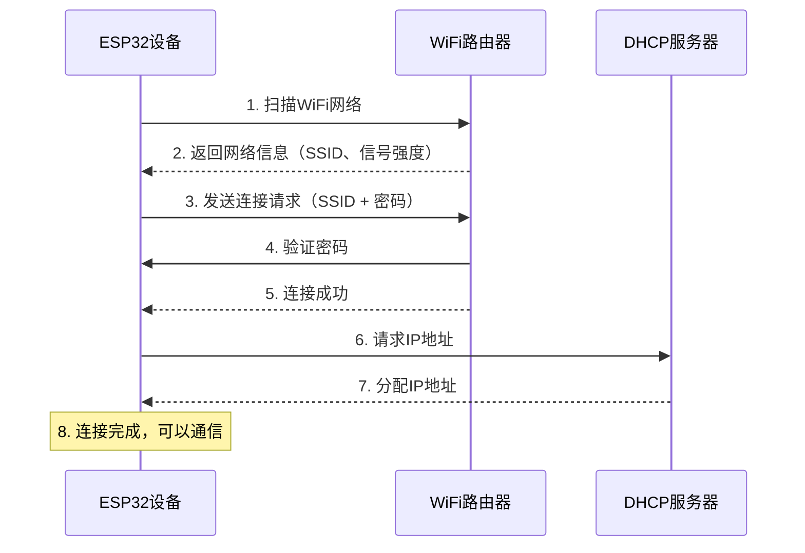
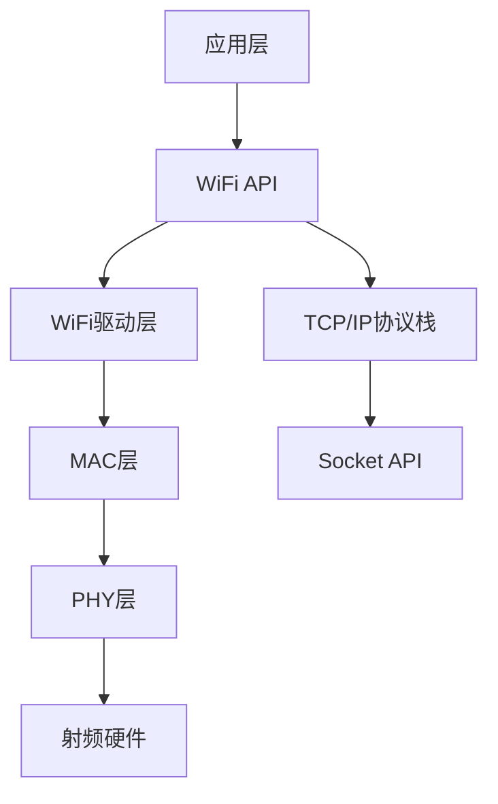

# WiFi技术基础与ESP32应用实践


## 学习目标

完成本教程后，你将能够：

- [ ] 理解WiFi技术的基本概念和工作原理
- [ ] 掌握WiFi标准（802.11 b/g/n/ac）的特点和差异
- [ ] 了解ESP32的WiFi功能和架构
- [ ] 配置ESP32的AP（接入点）和STA（站点）模式
- [ ] 实现ESP32连接WiFi网络并进行数据通信
- [ ] 开发基于WiFi的简单物联网应用

## 前置要求

在开始本教程之前，你需要：

**知识要求**：
- 了解C/C++语言基础
- 熟悉基本的网络概念（IP地址、路由器等）
- 了解嵌入式系统基础知识

**技能要求**：
- 能够使用Arduino IDE或ESP-IDF开发环境
- 会使用串口调试工具查看输出信息
- 具备基本的电路连接能力

## 准备工作

### 硬件准备

| 名称 | 数量 | 说明 | 参考链接 |
|------|------|------|----------|
| ESP32开发板 | 1 | ESP32-DevKitC或NodeMCU-32S | - |
| Micro USB数据线 | 1 | 用于供电和程序下载 | - |
| LED灯 | 1 | 用于状态指示（可选） | - |
| 电阻 | 1 | 220Ω（可选） | - |

### 软件准备

- **开发环境**：Arduino IDE 1.8.19+ 或 ESP-IDF 4.4+
- **驱动程序**：CP2102或CH340 USB转串口驱动
- **辅助工具**：串口调试助手、网络调试工具

### 环境配置

#### 方法1：使用Arduino IDE

1. 下载并安装Arduino IDE
2. 添加ESP32开发板支持：
   - 打开 文件 → 首选项
   - 在"附加开发板管理器网址"中添加：
     ```
     https://dl.espressif.com/dl/package_esp32_index.json
     ```
3. 安装ESP32开发板：
   - 打开 工具 → 开发板 → 开发板管理器
   - 搜索"ESP32"并安装

#### 方法2：使用ESP-IDF

1. 安装ESP-IDF开发环境
2. 配置环境变量
3. 测试工具链是否正常


## WiFi技术基础知识

### WiFi是什么？

WiFi（Wireless Fidelity，无线保真）是一种基于IEEE 802.11标准的无线局域网技术。它允许设备通过无线方式连接到网络，实现数据传输和互联网访问。

**WiFi的核心特点**：
- 无线连接：无需物理线缆
- 灵活部署：设备可自由移动
- 标准化协议：兼容性好
- 广泛应用：从家庭到工业场景

### WiFi标准演进

| 标准 | 发布年份 | 频段 | 最大速率 | 特点 |
|------|---------|------|---------|------|
| 802.11b | 1999 | 2.4GHz | 11 Mbps | 最早普及的标准 |
| 802.11g | 2003 | 2.4GHz | 54 Mbps | 向后兼容802.11b |
| 802.11n | 2009 | 2.4/5GHz | 600 Mbps | 引入MIMO技术 |
| 802.11ac | 2013 | 5GHz | 1.3 Gbps | 更高速率，更少干扰 |
| 802.11ax (WiFi 6) | 2019 | 2.4/5GHz | 9.6 Gbps | 高密度环境优化 |

**ESP32支持的标准**：
- 802.11 b/g/n
- 2.4GHz频段
- 最大速率：150 Mbps

### WiFi工作模式

WiFi设备可以工作在不同的模式下：

#### 1. STA模式（Station，站点模式）

设备作为客户端连接到WiFi路由器或接入点。

```
[ESP32 (STA)] ----无线连接----> [WiFi路由器] -----> [互联网]
```

**应用场景**：
- 物联网设备连接云平台
- 智能家居设备联网
- 数据采集终端

#### 2. AP模式（Access Point，接入点模式）

设备作为WiFi热点，允许其他设备连接。

```
[手机/电脑] ----无线连接----> [ESP32 (AP)]
```

**应用场景**：
- 设备配置界面
- 局域网数据共享
- 无路由器环境通信

#### 3. AP+STA模式（混合模式）

设备同时作为接入点和客户端。

```
[手机] ----> [ESP32 (AP+STA)] ----> [WiFi路由器] ----> [互联网]
```

**应用场景**：
- WiFi中继器
- 网关设备
- 复杂网络拓扑

### WiFi连接过程

WiFi设备连接到网络的典型流程：




## ESP32 WiFi架构

### ESP32硬件特性

ESP32是乐鑫科技推出的低成本、低功耗的WiFi+蓝牙双模芯片。

**WiFi相关特性**：
- 支持802.11 b/g/n协议
- 2.4GHz频段，支持20MHz和40MHz带宽
- 支持STA、AP、STA+AP模式
- 内置天线开关、RF balun、功率放大器
- 支持WPA/WPA2/WPA3安全协议
- 最大发射功率：20.5 dBm

### ESP32 WiFi软件架构



**各层功能**：
- **应用层**：用户代码，调用WiFi API
- **WiFi API**：提供WiFi配置和控制接口
- **WiFi驱动**：管理WiFi连接状态
- **TCP/IP协议栈**：处理网络通信
- **MAC/PHY层**：处理无线信号

## 步骤1：ESP32 STA模式 - 连接WiFi

### 1.1 创建Arduino项目

1. 打开Arduino IDE
2. 选择开发板：工具 → 开发板 → ESP32 Dev Module
3. 选择串口：工具 → 端口 → 选择对应COM口
4. 新建项目：文件 → 新建

### 1.2 编写WiFi连接代码

创建一个简单的WiFi连接程序：

```cpp
#include <WiFi.h>

// WiFi网络配置
const char* ssid = "你的WiFi名称";        // 替换为你的WiFi SSID
const char* password = "你的WiFi密码";    // 替换为你的WiFi密码

void setup() {
    // 初始化串口
    Serial.begin(115200);
    delay(1000);
    
    Serial.println();
    Serial.println("正在连接WiFi...");
    
    // 开始连接WiFi
    WiFi.begin(ssid, password);
    
    // 等待连接成功
    while (WiFi.status() != WL_CONNECTED) {
        delay(500);
        Serial.print(".");
    }
    
    // 连接成功，打印信息
    Serial.println();
    Serial.println("WiFi连接成功！");
    Serial.print("IP地址: ");
    Serial.println(WiFi.localIP());
    Serial.print("信号强度: ");
    Serial.print(WiFi.RSSI());
    Serial.println(" dBm");
}

void loop() {
    // 检查WiFi连接状态
    if (WiFi.status() == WL_CONNECTED) {
        Serial.println("WiFi已连接");
    } else {
        Serial.println("WiFi连接断开");
    }
    
    delay(5000);  // 每5秒检查一次
}
```

**代码说明**：
- `WiFi.begin(ssid, password)`：开始连接WiFi网络
- `WiFi.status()`：获取WiFi连接状态
- `WL_CONNECTED`：表示已连接
- `WiFi.localIP()`：获取分配的IP地址
- `WiFi.RSSI()`：获取信号强度（单位：dBm）

### 1.3 上传并测试

1. 点击"上传"按钮（→）
2. 等待编译和上传完成
3. 打开串口监视器（工具 → 串口监视器）
4. 设置波特率为115200

**预期输出**：
```
正在连接WiFi...
.....
WiFi连接成功！
IP地址: 192.168.1.100
信号强度: -45 dBm
WiFi已连接
WiFi已连接
```


## 步骤2：WiFi扫描 - 发现周围网络

### 2.1 WiFi扫描原理

WiFi扫描允许设备发现周围的WiFi网络，获取网络信息如SSID、信号强度、加密方式等。

### 2.2 实现WiFi扫描

```cpp
#include <WiFi.h>

void setup() {
    Serial.begin(115200);
    delay(1000);
    
    // 设置WiFi为STA模式
    WiFi.mode(WIFI_STA);
    WiFi.disconnect();
    delay(100);
    
    Serial.println("开始扫描WiFi网络...");
}

void loop() {
    // 扫描WiFi网络
    int networkCount = WiFi.scanNetworks();
    
    Serial.println("扫描完成！");
    
    if (networkCount == 0) {
        Serial.println("未发现WiFi网络");
    } else {
        Serial.print("发现 ");
        Serial.print(networkCount);
        Serial.println(" 个WiFi网络：");
        Serial.println();
        
        // 打印每个网络的信息
        for (int i = 0; i < networkCount; i++) {
            Serial.print(i + 1);
            Serial.print(": ");
            Serial.print(WiFi.SSID(i));              // 网络名称
            Serial.print(" (");
            Serial.print(WiFi.RSSI(i));              // 信号强度
            Serial.print(" dBm) ");
            Serial.print(WiFi.encryptionType(i) == WIFI_AUTH_OPEN ? "开放" : "加密");
            Serial.println();
        }
    }
    
    Serial.println();
    delay(10000);  // 每10秒扫描一次
}
```

**代码说明**：
- `WiFi.scanNetworks()`：扫描周围的WiFi网络，返回发现的网络数量
- `WiFi.SSID(i)`：获取第i个网络的名称
- `WiFi.RSSI(i)`：获取第i个网络的信号强度
- `WiFi.encryptionType(i)`：获取第i个网络的加密类型

**预期输出**：
```
开始扫描WiFi网络...
扫描完成！
发现 5 个WiFi网络：

1: MyHomeWiFi (-35 dBm) 加密
2: TP-LINK_5G (-52 dBm) 加密
3: ChinaNet (-68 dBm) 加密
4: Guest_Network (-75 dBm) 开放
5: Office_WiFi (-80 dBm) 加密
```

## 步骤3：ESP32 AP模式 - 创建WiFi热点

### 3.1 AP模式配置

将ESP32配置为WiFi接入点，允许其他设备连接。

```cpp
#include <WiFi.h>

// AP配置
const char* ap_ssid = "ESP32-AP";           // AP名称
const char* ap_password = "12345678";       // AP密码（至少8位）

// AP网络配置
IPAddress local_IP(192, 168, 4, 1);         // AP的IP地址
IPAddress gateway(192, 168, 4, 1);          // 网关
IPAddress subnet(255, 255, 255, 0);         // 子网掩码

void setup() {
    Serial.begin(115200);
    delay(1000);
    
    Serial.println("配置AP模式...");
    
    // 配置AP的IP地址
    WiFi.softAPConfig(local_IP, gateway, subnet);
    
    // 启动AP
    WiFi.softAP(ap_ssid, ap_password);
    
    // 打印AP信息
    Serial.println("AP启动成功！");
    Serial.print("AP名称: ");
    Serial.println(ap_ssid);
    Serial.print("AP IP地址: ");
    Serial.println(WiFi.softAPIP());
    Serial.print("AP MAC地址: ");
    Serial.println(WiFi.softAPmacAddress());
}

void loop() {
    // 获取连接的设备数量
    int stationCount = WiFi.softAPgetStationNum();
    
    Serial.print("已连接设备数: ");
    Serial.println(stationCount);
    
    delay(5000);
}
```

**代码说明**：
- `WiFi.softAPConfig()`：配置AP的网络参数
- `WiFi.softAP(ssid, password)`：启动AP模式
- `WiFi.softAPIP()`：获取AP的IP地址
- `WiFi.softAPgetStationNum()`：获取连接到AP的设备数量

### 3.2 测试AP模式

1. 上传程序到ESP32
2. 使用手机或电脑搜索WiFi网络
3. 找到名为"ESP32-AP"的网络
4. 输入密码"12345678"连接
5. 观察串口输出的连接设备数

**预期输出**：
```
配置AP模式...
AP启动成功！
AP名称: ESP32-AP
AP IP地址: 192.168.4.1
AP MAC地址: 24:0A:C4:XX:XX:XX
已连接设备数: 0
已连接设备数: 1
已连接设备数: 1
```


## 步骤4：WiFi网络通信 - HTTP客户端

### 4.1 HTTP GET请求

使用ESP32作为HTTP客户端，从Web服务器获取数据。

```cpp
#include <WiFi.h>
#include <HTTPClient.h>

const char* ssid = "你的WiFi名称";
const char* password = "你的WiFi密码";

// 测试URL（返回当前时间的API）
const char* serverUrl = "http://worldtimeapi.org/api/timezone/Asia/Shanghai";

void setup() {
    Serial.begin(115200);
    delay(1000);
    
    // 连接WiFi
    Serial.println("连接WiFi...");
    WiFi.begin(ssid, password);
    
    while (WiFi.status() != WL_CONNECTED) {
        delay(500);
        Serial.print(".");
    }
    
    Serial.println();
    Serial.println("WiFi连接成功！");
    Serial.print("IP地址: ");
    Serial.println(WiFi.localIP());
}

void loop() {
    if (WiFi.status() == WL_CONNECTED) {
        HTTPClient http;
        
        Serial.println("发送HTTP GET请求...");
        
        // 初始化HTTP连接
        http.begin(serverUrl);
        
        // 发送GET请求
        int httpCode = http.GET();
        
        // 检查响应
        if (httpCode > 0) {
            Serial.print("HTTP响应码: ");
            Serial.println(httpCode);
            
            // 获取响应内容
            if (httpCode == HTTP_CODE_OK) {
                String payload = http.getString();
                Serial.println("响应内容:");
                Serial.println(payload);
            }
        } else {
            Serial.print("HTTP请求失败，错误: ");
            Serial.println(http.errorToString(httpCode));
        }
        
        // 关闭连接
        http.end();
    } else {
        Serial.println("WiFi未连接");
    }
    
    delay(10000);  // 每10秒请求一次
}
```

**代码说明**：
- `HTTPClient http`：创建HTTP客户端对象
- `http.begin(url)`：初始化HTTP连接
- `http.GET()`：发送GET请求
- `http.getString()`：获取响应内容
- `http.end()`：关闭连接

### 4.2 HTTP POST请求

向服务器发送数据：

```cpp
void sendPostRequest() {
    if (WiFi.status() == WL_CONNECTED) {
        HTTPClient http;
        
        // 目标URL
        http.begin("http://httpbin.org/post");
        
        // 设置请求头
        http.addHeader("Content-Type", "application/json");
        
        // 准备JSON数据
        String jsonData = "{\"temperature\":25.5,\"humidity\":60}";
        
        // 发送POST请求
        int httpCode = http.POST(jsonData);
        
        if (httpCode > 0) {
            Serial.print("HTTP响应码: ");
            Serial.println(httpCode);
            
            String response = http.getString();
            Serial.println("响应:");
            Serial.println(response);
        }
        
        http.end();
    }
}
```

## 步骤5：实战项目 - WiFi温湿度监控

### 5.1 项目概述

创建一个基于WiFi的温湿度监控系统，ESP32读取传感器数据并通过WiFi发送到云平台。

### 5.2 硬件连接

| ESP32引脚 | DHT11引脚 | 说明 |
|----------|----------|------|
| 3.3V | VCC | 供电 |
| GND | GND | 地 |
| GPIO4 | DATA | 数据线 |

### 5.3 完整代码

```cpp
#include <WiFi.h>
#include <HTTPClient.h>
#include <DHT.h>

// WiFi配置
const char* ssid = "你的WiFi名称";
const char* password = "你的WiFi密码";

// DHT11配置
#define DHTPIN 4
#define DHTTYPE DHT11
DHT dht(DHTPIN, DHTTYPE);

// 服务器配置
const char* serverUrl = "http://your-server.com/api/data";

void setup() {
    Serial.begin(115200);
    
    // 初始化DHT传感器
    dht.begin();
    
    // 连接WiFi
    Serial.println("连接WiFi...");
    WiFi.begin(ssid, password);
    
    while (WiFi.status() != WL_CONNECTED) {
        delay(500);
        Serial.print(".");
    }
    
    Serial.println();
    Serial.println("WiFi连接成功！");
}

void loop() {
    // 读取温湿度
    float temperature = dht.readTemperature();
    float humidity = dht.readHumidity();
    
    // 检查读取是否成功
    if (isnan(temperature) || isnan(humidity)) {
        Serial.println("读取传感器失败！");
        delay(2000);
        return;
    }
    
    // 打印数据
    Serial.print("温度: ");
    Serial.print(temperature);
    Serial.print("°C  湿度: ");
    Serial.print(humidity);
    Serial.println("%");
    
    // 发送数据到服务器
    if (WiFi.status() == WL_CONNECTED) {
        HTTPClient http;
        http.begin(serverUrl);
        http.addHeader("Content-Type", "application/json");
        
        // 构建JSON数据
        String jsonData = "{";
        jsonData += "\"temperature\":" + String(temperature) + ",";
        jsonData += "\"humidity\":" + String(humidity);
        jsonData += "}";
        
        // 发送POST请求
        int httpCode = http.POST(jsonData);
        
        if (httpCode > 0) {
            Serial.print("数据发送成功，响应码: ");
            Serial.println(httpCode);
        } else {
            Serial.println("数据发送失败");
        }
        
        http.end();
    }
    
    delay(60000);  // 每分钟上传一次
}
```


## WiFi安全与最佳实践

### 安全配置

#### 1. 密码管理

不要在代码中硬编码WiFi密码，使用配置文件或环境变量：

```cpp
// 不推荐：硬编码密码
const char* password = "mypassword123";

// 推荐：使用单独的配置文件
#include "wifi_config.h"  // 包含WIFI_SSID和WIFI_PASSWORD
```

创建 `wifi_config.h` 文件：
```cpp
#ifndef WIFI_CONFIG_H
#define WIFI_CONFIG_H

#define WIFI_SSID "你的WiFi名称"
#define WIFI_PASSWORD "你的WiFi密码"

#endif
```

#### 2. 加密方式选择

```cpp
// 设置AP加密方式
WiFi.softAP(ssid, password, channel, hidden, max_connection);

// 推荐使用WPA2加密
// 密码至少8位
// 避免使用开放网络（无密码）
```

#### 3. 连接超时处理

```cpp
void connectWiFi() {
    WiFi.begin(ssid, password);
    
    int timeout = 20;  // 20秒超时
    while (WiFi.status() != WL_CONNECTED && timeout > 0) {
        delay(1000);
        Serial.print(".");
        timeout--;
    }
    
    if (WiFi.status() == WL_CONNECTED) {
        Serial.println("连接成功");
    } else {
        Serial.println("连接超时");
        // 进入配置模式或重试
    }
}
```

### 性能优化

#### 1. 降低功耗

```cpp
// WiFi省电模式
WiFi.setSleep(true);  // 启用WiFi睡眠

// 深度睡眠模式
esp_sleep_enable_timer_wakeup(60 * 1000000);  // 60秒后唤醒
esp_deep_sleep_start();
```

#### 2. 信号强度优化

```cpp
// 设置WiFi发射功率
WiFi.setTxPower(WIFI_POWER_19_5dBm);  // 最大功率

// 可选值：
// WIFI_POWER_19_5dBm  // 最大功率
// WIFI_POWER_19dBm
// WIFI_POWER_18_5dBm
// ...
// WIFI_POWER_2dBm     // 最小功率
```

#### 3. 连接稳定性

```cpp
void loop() {
    // 定期检查WiFi连接
    if (WiFi.status() != WL_CONNECTED) {
        Serial.println("WiFi断开，尝试重连...");
        WiFi.reconnect();
        
        // 等待重连
        int retry = 0;
        while (WiFi.status() != WL_CONNECTED && retry < 10) {
            delay(500);
            retry++;
        }
    }
    
    // 你的代码...
}
```

## 故障排除

### 问题1：无法连接WiFi

**可能原因**：
- WiFi名称或密码错误
- 路由器信号太弱
- 路由器设置了MAC地址过滤
- ESP32距离路由器太远

**解决方法**：
1. 检查SSID和密码是否正确（注意大小写）
2. 使用WiFi扫描确认网络可见
3. 检查路由器设置
4. 移近路由器或使用外置天线

```cpp
// 调试代码：打印WiFi状态
void printWiFiStatus() {
    switch (WiFi.status()) {
        case WL_IDLE_STATUS:
            Serial.println("状态: 空闲");
            break;
        case WL_NO_SSID_AVAIL:
            Serial.println("状态: 找不到SSID");
            break;
        case WL_CONNECTED:
            Serial.println("状态: 已连接");
            break;
        case WL_CONNECT_FAILED:
            Serial.println("状态: 连接失败");
            break;
        case WL_CONNECTION_LOST:
            Serial.println("状态: 连接丢失");
            break;
        case WL_DISCONNECTED:
            Serial.println("状态: 未连接");
            break;
    }
}
```

### 问题2：IP地址获取失败

**可能原因**：
- DHCP服务器未启用
- IP地址池已满
- 网络配置错误

**解决方法**：
```cpp
// 使用静态IP地址
IPAddress local_IP(192, 168, 1, 100);
IPAddress gateway(192, 168, 1, 1);
IPAddress subnet(255, 255, 255, 0);
IPAddress primaryDNS(8, 8, 8, 8);
IPAddress secondaryDNS(8, 8, 4, 4);

if (!WiFi.config(local_IP, gateway, subnet, primaryDNS, secondaryDNS)) {
    Serial.println("静态IP配置失败");
}

WiFi.begin(ssid, password);
```

### 问题3：HTTP请求失败

**可能原因**：
- 服务器地址错误
- 网络不通
- 防火墙阻止
- SSL证书问题（HTTPS）

**解决方法**：
```cpp
// 添加详细的错误处理
HTTPClient http;
http.begin(url);
http.setTimeout(10000);  // 设置10秒超时

int httpCode = http.GET();

if (httpCode > 0) {
    Serial.printf("HTTP响应码: %d\n", httpCode);
} else {
    Serial.printf("HTTP错误: %s\n", http.errorToString(httpCode).c_str());
}

http.end();
```

### 问题4：WiFi频繁断开

**可能原因**：
- 信号不稳定
- 路由器负载过高
- 电源不足
- 代码中有阻塞操作

**解决方法**：
```cpp
// 启用自动重连
WiFi.setAutoReconnect(true);

// 监控信号强度
void monitorSignal() {
    int rssi = WiFi.RSSI();
    Serial.print("信号强度: ");
    Serial.print(rssi);
    Serial.println(" dBm");
    
    if (rssi < -80) {
        Serial.println("警告：信号太弱！");
    }
}
```


## 总结

通过本教程，你学习了：

- ✅ WiFi技术的基本概念和标准演进
- ✅ WiFi的三种工作模式（STA、AP、AP+STA）
- ✅ ESP32的WiFi硬件特性和软件架构
- ✅ 如何使用ESP32连接WiFi网络
- ✅ 如何扫描周围的WiFi网络
- ✅ 如何将ESP32配置为WiFi热点
- ✅ 如何通过WiFi进行HTTP通信
- ✅ WiFi安全配置和性能优化技巧
- ✅ 常见问题的诊断和解决方法

## 进阶挑战

尝试以下挑战来巩固学习：

1. **挑战1：WiFi配置门户**
   - 创建一个Web配置界面
   - 用户通过浏览器配置WiFi信息
   - 配置信息保存到EEPROM

2. **挑战2：WiFi信号监控器**
   - 实时监控WiFi信号强度
   - 使用LED或OLED显示信号质量
   - 记录信号强度历史数据

3. **挑战3：多设备通信**
   - 创建ESP32 AP网络
   - 多个ESP32设备连接到AP
   - 实现设备间的数据交换

4. **挑战4：OTA固件更新**
   - 实现通过WiFi更新固件
   - 添加版本检查功能
   - 确保更新过程的安全性

## 完整代码仓库

本教程的所有示例代码可以在这里找到：
- GitHub仓库：[ESP32-WiFi-Examples](https://github.com/example/esp32-wifi-examples)
- 包含完整的项目文件和详细注释
- 持续更新和维护

## 下一步学习

建议继续学习以下内容：

1. **蓝牙/BLE技术详解** - 学习ESP32的蓝牙功能
2. **MQTT协议应用开发** - 学习物联网通信协议
3. **HTTP/HTTPS协议应用** - 深入学习Web通信
4. **WebSocket实时通信** - 学习双向实时通信
5. **云平台接入** - 学习如何连接AWS IoT、阿里云等平台

## 参考资料

### 官方文档
1. [ESP32技术参考手册](https://www.espressif.com/sites/default/files/documentation/esp32_technical_reference_manual_cn.pdf)
2. [ESP-IDF编程指南](https://docs.espressif.com/projects/esp-idf/zh_CN/latest/esp32/)
3. [Arduino ESP32核心库](https://github.com/espressif/arduino-esp32)

### WiFi标准文档
1. IEEE 802.11标准系列
2. WiFi Alliance认证规范
3. RFC 2616 - HTTP/1.1协议

### 推荐书籍
1. 《ESP32物联网开发实战》
2. 《WiFi技术原理与应用》
3. 《嵌入式网络编程》

### 在线资源
1. [ESP32官方论坛](https://www.esp32.com/)
2. [Arduino官方论坛](https://forum.arduino.cc/)
3. [Stack Overflow - ESP32标签](https://stackoverflow.com/questions/tagged/esp32)

### 视频教程
1. ESP32 WiFi入门系列（Bilibili）
2. 物联网开发实战课程
3. 嵌入式网络编程教程

## 常见问题FAQ

**Q1: ESP32支持5GHz WiFi吗？**
A: 不支持。ESP32只支持2.4GHz频段的WiFi（802.11 b/g/n）。

**Q2: ESP32可以同时连接多个WiFi网络吗？**
A: 不可以。ESP32在STA模式下一次只能连接一个WiFi网络。

**Q3: ESP32 AP模式最多支持多少个设备连接？**
A: 默认最多支持4个设备同时连接，可以通过参数调整到最多10个。

**Q4: 如何提高WiFi连接的稳定性？**
A: 
- 使用外置天线
- 优化天线位置
- 启用自动重连
- 监控信号强度
- 避免代码中的长时间阻塞

**Q5: ESP32的WiFi功耗如何？**
A: 
- 活动模式：约160-260mA
- Modem-sleep模式：约20-68mA
- Light-sleep模式：约0.8mA
- Deep-sleep模式：约10μA

**Q6: 如何实现WiFi和蓝牙共存？**
A: ESP32支持WiFi和蓝牙共存，但需要注意：
- 两者共享2.4GHz频段
- 可能会相互干扰
- 需要合理的时分复用策略

**Q7: ESP32支持企业级WiFi（WPA2-Enterprise）吗？**
A: 支持。ESP32支持WPA2-Enterprise认证，包括EAP-TLS、PEAP等方法。

**Q8: 如何测试WiFi连接速度？**
A: 可以使用iperf工具进行网络性能测试，ESP-IDF提供了iperf示例。

---

**反馈与支持**：
- 如果你在学习过程中遇到问题，欢迎在评论区留言
- 发现文档错误或有改进建议，请提交Issue
- 想要分享你的项目，欢迎投稿

**版权声明**：
本教程采用 CC BY-NC-SA 4.0 许可协议，欢迎分享和改编，但请注明出处。

