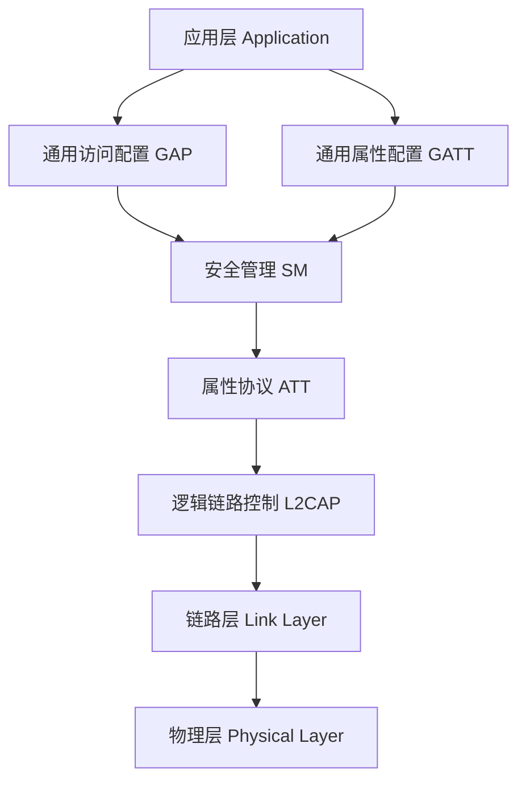
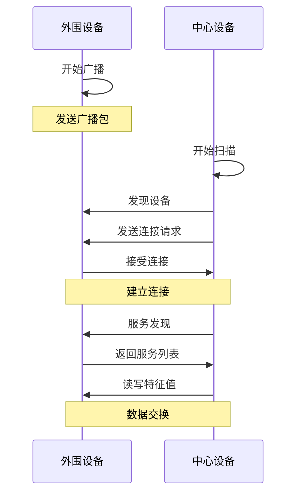

# 蓝牙/BLE技术详解：从基础到实践


## 学习目标

完成本教程后，你将能够：

- [ ] 理解蓝牙经典和BLE的区别与应用场景
- [ ] 掌握BLE协议栈架构和GATT服务模型
- [ ] 了解BLE的广播、连接和数据传输机制
- [ ] 使用ESP32或STM32开发BLE应用
- [ ] 实现BLE设备间的数据通信
- [ ] 调试和优化BLE应用性能

## 前置要求

在开始本教程之前，你需要：

**知识要求**：
- 了解C语言基础编程
- 熟悉基本的无线通信概念
- 了解嵌入式系统基础知识

**技能要求**：
- 能够使用Arduino IDE或ESP-IDF
- 会使用串口调试工具
- 了解基本的移动应用开发（可选）

## 准备工作

### 硬件准备

| 名称 | 数量 | 说明 | 参考链接 |
|------|------|------|----------|
| ESP32开发板 | 1 | 支持BLE 4.2/5.0 | NodeMCU-32S或类似 |
| USB数据线 | 1 | Type-C或Micro USB | - |
| LED灯 | 2 | 用于状态指示 | - |
| 电阻 | 2 | 220Ω限流电阻 | - |
| 面包板 | 1 | 可选，用于连接 | - |
| 智能手机 | 1 | 安装BLE调试APP | Android或iOS |

### 软件准备

- **开发环境**：Arduino IDE 2.0+ 或 ESP-IDF
- **BLE调试工具**：
  - Android: nRF Connect
  - iOS: LightBlue
- **串口工具**：Arduino Serial Monitor或PuTTY
- **驱动程序**：CP2102或CH340驱动（根据开发板）

### 环境配置

1. 安装Arduino IDE并添加ESP32开发板支持
2. 安装必要的库文件（ESP32 BLE Arduino）
3. 在手机上安装nRF Connect或LightBlue
4. 测试开发板连接和串口通信


## 第一部分：蓝牙技术基础

### 1.1 蓝牙技术概述

蓝牙(Bluetooth)是一种短距离无线通信技术，主要用于设备间的数据传输。蓝牙技术经历了多个版本的演进：

**蓝牙版本演进**：
- **蓝牙1.x/2.x**: 经典蓝牙(Classic Bluetooth)，主要用于音频传输
- **蓝牙3.0**: 引入高速传输(HS)
- **蓝牙4.0**: 引入低功耗蓝牙(BLE)，革命性变化
- **蓝牙4.1/4.2**: 改进BLE性能和安全性
- **蓝牙5.0/5.1/5.2**: 增强BLE功能，提升速度和范围

### 1.2 经典蓝牙 vs 低功耗蓝牙(BLE)

| 特性 | 经典蓝牙 | 低功耗蓝牙(BLE) |
|------|----------|-----------------|
| 功耗 | 较高(~100mW) | 极低(~0.01-0.5mW) |
| 数据速率 | 1-3 Mbps | 125 Kbps - 2 Mbps |
| 传输距离 | 10-100米 | 10-100米(可扩展) |
| 连接时间 | 约6秒 | <6毫秒 |
| 主要应用 | 音频、文件传输 | 传感器、可穿戴设备 |
| 电池寿命 | 天-周 | 月-年 |
| 网络拓扑 | 点对点 | 星型、网状 |

**应用场景对比**：

```
经典蓝牙适用于：
- 无线耳机和音箱
- 车载免提系统
- 文件传输
- 打印机连接

BLE适用于：
- 智能手环和手表
- 健康监测设备
- 智能家居传感器
- 信标(Beacon)
- 物联网设备
```

### 1.3 BLE协议栈架构

BLE协议栈采用分层设计，从下到上包括：



**各层功能说明**：

1. **物理层(PHY)**: 
   - 工作在2.4GHz ISM频段
   - 使用40个信道(3个广播信道 + 37个数据信道)
   - 采用GFSK调制

2. **链路层(Link Layer)**:
   - 管理设备状态(广播、扫描、连接)
   - 处理数据包的发送和接收
   - 实现跳频和加密

3. **L2CAP层**:
   - 数据分段和重组
   - 协议复用
   - 流量控制

4. **ATT/GATT层**:
   - 定义数据的组织方式
   - 提供读写操作接口
   - 管理服务和特征

5. **GAP层**:
   - 设备发现和连接管理
   - 定义设备角色(中心/外围)
   - 安全模式管理


## 第二部分：GATT服务模型

### 2.1 GATT架构

GATT(Generic Attribute Profile)定义了BLE设备间数据交换的方式。它采用层次化的数据结构：

```
Profile (配置文件)
  └── Service (服务)
        └── Characteristic (特征)
              ├── Value (值)
              ├── Descriptor (描述符)
              └── Properties (属性)
```

**核心概念**：

1. **Profile(配置文件)**: 
   - 定义了一组服务的集合
   - 例如：心率配置文件(Heart Rate Profile)

2. **Service(服务)**:
   - 包含一个或多个特征
   - 用UUID标识(16位或128位)
   - 例如：心率服务(Heart Rate Service)

3. **Characteristic(特征)**:
   - 实际的数据值
   - 包含值、属性和描述符
   - 例如：心率测量值

4. **Descriptor(描述符)**:
   - 描述特征的元数据
   - 例如：客户端特征配置(CCCD)

### 2.2 UUID标识

UUID用于唯一标识服务和特征：

**16位UUID(标准服务)**：
```c
// 标准服务UUID示例
#define HEART_RATE_SERVICE_UUID        0x180D
#define BATTERY_SERVICE_UUID           0x180F
#define DEVICE_INFO_SERVICE_UUID       0x180A
```

**128位UUID(自定义服务)**：
```c
// 自定义服务UUID示例
#define CUSTOM_SERVICE_UUID "4fafc201-1fb5-459e-8fcc-c5c9c331914b"
#define CUSTOM_CHAR_UUID    "beb5483e-36e1-4688-b7f5-ea07361b26a8"
```

### 2.3 特征属性

特征可以具有以下属性：

| 属性 | 说明 | 用途 |
|------|------|------|
| Read | 可读 | 客户端可以读取值 |
| Write | 可写 | 客户端可以写入值 |
| Write Without Response | 无响应写 | 快速写入，不等待确认 |
| Notify | 通知 | 服务器主动推送，无需确认 |
| Indicate | 指示 | 服务器主动推送，需要确认 |
| Broadcast | 广播 | 在广播数据中包含值 |

**属性组合示例**：
```c
// 只读特征
BLECharacteristic *pCharacteristic = pService->createCharacteristic(
    CHARACTERISTIC_UUID,
    BLECharacteristic::PROPERTY_READ
);

// 读写特征
BLECharacteristic *pCharacteristic = pService->createCharacteristic(
    CHARACTERISTIC_UUID,
    BLECharacteristic::PROPERTY_READ |
    BLECharacteristic::PROPERTY_WRITE
);

// 通知特征
BLECharacteristic *pCharacteristic = pService->createCharacteristic(
    CHARACTERISTIC_UUID,
    BLECharacteristic::PROPERTY_READ |
    BLECharacteristic::PROPERTY_NOTIFY
);
```


## 第三部分：BLE工作流程

### 3.1 设备角色

BLE定义了两种主要角色：

**1. 外围设备(Peripheral/Server)**：
- 广播自己的存在
- 等待中心设备连接
- 提供GATT服务
- 例如：传感器、智能手环

**2. 中心设备(Central/Client)**：
- 扫描外围设备
- 发起连接请求
- 访问GATT服务
- 例如：智能手机、网关

### 3.2 连接建立流程



### 3.3 广播机制

**广播数据包结构**：
```
广播包 (最大31字节)
├── Flags (3字节)
├── 设备名称 (可变)
├── 服务UUID (2-16字节)
└── 制造商数据 (可变)
```

**广播类型**：
1. **可连接广播**: 允许其他设备连接
2. **不可连接广播**: 仅广播数据(Beacon)
3. **可扫描广播**: 允许扫描响应

**广播间隔**：
- 最小: 20ms
- 最大: 10.24秒
- 推荐: 100ms-1秒(平衡功耗和发现速度)

### 3.4 数据传输方式

**1. 读操作(Read)**：
```c
// 客户端读取特征值
uint8_t* value = pCharacteristic->getValue();
```

**2. 写操作(Write)**：
```c
// 客户端写入特征值
pCharacteristic->setValue("Hello BLE");
pCharacteristic->notify();  // 可选：通知其他客户端
```

**3. 通知(Notify)**：
```c
// 服务器主动推送数据
pCharacteristic->setValue(sensorData);
pCharacteristic->notify();  // 无需客户端确认
```

**4. 指示(Indicate)**：
```c
// 服务器主动推送数据，需要确认
pCharacteristic->setValue(importantData);
pCharacteristic->indicate();  // 等待客户端确认
```


## 第四部分：ESP32 BLE实践

### 步骤1：创建BLE服务器

#### 1.1 基础BLE服务器代码

```cpp
#include <BLEDevice.h>
#include <BLEServer.h>
#include <BLEUtils.h>
#include <BLE2902.h>

// 定义UUID
#define SERVICE_UUID        "4fafc201-1fb5-459e-8fcc-c5c9c331914b"
#define CHARACTERISTIC_UUID "beb5483e-36e1-4688-b7f5-ea07361b26a8"

BLEServer* pServer = NULL;
BLECharacteristic* pCharacteristic = NULL;
bool deviceConnected = false;
uint32_t value = 0;

// 服务器回调类
class MyServerCallbacks: public BLEServerCallbacks {
    void onConnect(BLEServer* pServer) {
        deviceConnected = true;
        Serial.println("设备已连接");
    };

    void onDisconnect(BLEServer* pServer) {
        deviceConnected = false;
        Serial.println("设备已断开");
        // 重新开始广播
        BLEDevice::startAdvertising();
    }
};

void setup() {
    Serial.begin(115200);
    Serial.println("启动BLE服务器...");

    // 1. 初始化BLE设备
    BLEDevice::init("ESP32_BLE_Server");

    // 2. 创建BLE服务器
    pServer = BLEDevice::createServer();
    pServer->setCallbacks(new MyServerCallbacks());

    // 3. 创建BLE服务
    BLEService *pService = pServer->createService(SERVICE_UUID);

    // 4. 创建BLE特征
    pCharacteristic = pService->createCharacteristic(
        CHARACTERISTIC_UUID,
        BLECharacteristic::PROPERTY_READ   |
        BLECharacteristic::PROPERTY_WRITE  |
        BLECharacteristic::PROPERTY_NOTIFY
    );

    // 5. 添加描述符(用于通知)
    pCharacteristic->addDescriptor(new BLE2902());

    // 6. 设置初始值
    pCharacteristic->setValue("Hello BLE");

    // 7. 启动服务
    pService->start();

    // 8. 开始广播
    BLEAdvertising *pAdvertising = BLEDevice::getAdvertising();
    pAdvertising->addServiceUUID(SERVICE_UUID);
    pAdvertising->setScanResponse(true);
    pAdvertising->setMinPreferred(0x06);  // 帮助iPhone连接
    pAdvertising->setMinPreferred(0x12);
    BLEDevice::startAdvertising();
    
    Serial.println("等待客户端连接...");
}

void loop() {
    // 如果设备已连接，定期发送数据
    if (deviceConnected) {
        value++;
        pCharacteristic->setValue(String(value).c_str());
        pCharacteristic->notify();  // 通知客户端
        Serial.printf("发送值: %d\n", value);
        delay(1000);
    }
    delay(10);
}
```

**代码说明**：
- 第10-11行：定义服务和特征的UUID
- 第17-27行：定义服务器回调函数，处理连接和断开事件
- 第32行：初始化BLE设备，设置设备名称
- 第35-36行：创建BLE服务器并设置回调
- 第39行：创建BLE服务
- 第42-46行：创建特征，设置读、写、通知属性
- 第49行：添加CCCD描述符，用于启用通知
- 第58-62行：配置广播参数
- 第70-74行：定期发送数据并通知客户端


#### 1.2 添加写入回调

```cpp
// 特征回调类
class MyCharacteristicCallbacks: public BLECharacteristicCallbacks {
    void onWrite(BLECharacteristic *pCharacteristic) {
        std::string value = pCharacteristic->getValue();

        if (value.length() > 0) {
            Serial.println("接收到数据:");
            Serial.print("  长度: ");
            Serial.println(value.length());
            Serial.print("  内容: ");
            for (int i = 0; i < value.length(); i++) {
                Serial.print(value[i]);
            }
            Serial.println();

            // 处理接收到的命令
            if (value == "ON") {
                Serial.println("LED开启");
                // digitalWrite(LED_PIN, HIGH);
            } else if (value == "OFF") {
                Serial.println("LED关闭");
                // digitalWrite(LED_PIN, LOW);
            }
        }
    }
};

// 在setup()中添加回调
pCharacteristic->setCallbacks(new MyCharacteristicCallbacks());
```

### 步骤2：创建BLE客户端

#### 2.1 基础BLE客户端代码

```cpp
#include <BLEDevice.h>
#include <BLEUtils.h>
#include <BLEScan.h>
#include <BLEAdvertisedDevice.h>

// 服务器的UUID
static BLEUUID serviceUUID("4fafc201-1fb5-459e-8fcc-c5c9c331914b");
static BLEUUID charUUID("beb5483e-36e1-4688-b7f5-ea07361b26a8");

static boolean doConnect = false;
static boolean connected = false;
static BLERemoteCharacteristic* pRemoteCharacteristic;
static BLEAdvertisedDevice* myDevice;

// 通知回调函数
static void notifyCallback(
    BLERemoteCharacteristic* pBLERemoteCharacteristic,
    uint8_t* pData,
    size_t length,
    bool isNotify) {
    Serial.print("收到通知，值: ");
    for (int i = 0; i < length; i++) {
        Serial.print((char)pData[i]);
    }
    Serial.println();
}

// 连接到服务器
bool connectToServer() {
    Serial.print("连接到设备: ");
    Serial.println(myDevice->getAddress().toString().c_str());

    BLEClient* pClient = BLEDevice::createClient();
    Serial.println(" - 已创建客户端");

    // 连接到远程BLE服务器
    pClient->connect(myDevice);
    Serial.println(" - 已连接到服务器");

    // 获取服务引用
    BLERemoteService* pRemoteService = pClient->getService(serviceUUID);
    if (pRemoteService == nullptr) {
        Serial.print("未找到服务UUID: ");
        Serial.println(serviceUUID.toString().c_str());
        pClient->disconnect();
        return false;
    }
    Serial.println(" - 找到服务");

    // 获取特征引用
    pRemoteCharacteristic = pRemoteService->getCharacteristic(charUUID);
    if (pRemoteCharacteristic == nullptr) {
        Serial.print("未找到特征UUID: ");
        Serial.println(charUUID.toString().c_str());
        pClient->disconnect();
        return false;
    }
    Serial.println(" - 找到特征");

    // 读取特征值
    if(pRemoteCharacteristic->canRead()) {
        std::string value = pRemoteCharacteristic->readValue();
        Serial.print("特征值: ");
        Serial.println(value.c_str());
    }

    // 注册通知回调
    if(pRemoteCharacteristic->canNotify()) {
        pRemoteCharacteristic->registerForNotify(notifyCallback);
        Serial.println(" - 已注册通知");
    }

    connected = true;
    return true;
}

// 扫描回调类
class MyAdvertisedDeviceCallbacks: public BLEAdvertisedDeviceCallbacks {
    void onResult(BLEAdvertisedDevice advertisedDevice) {
        Serial.print("发现BLE设备: ");
        Serial.println(advertisedDevice.toString().c_str());

        // 检查是否是我们要找的设备
        if (advertisedDevice.haveServiceUUID() && 
            advertisedDevice.isAdvertisingService(serviceUUID)) {
            
            BLEDevice::getScan()->stop();
            myDevice = new BLEAdvertisedDevice(advertisedDevice);
            doConnect = true;
        }
    }
};

void setup() {
    Serial.begin(115200);
    Serial.println("启动BLE客户端...");

    BLEDevice::init("");

    // 创建扫描器
    BLEScan* pBLEScan = BLEDevice::getScan();
    pBLEScan->setAdvertisedDeviceCallbacks(new MyAdvertisedDeviceCallbacks());
    pBLEScan->setInterval(1349);
    pBLEScan->setWindow(449);
    pBLEScan->setActiveScan(true);
    pBLEScan->start(5, false);  // 扫描5秒
}

void loop() {
    // 如果找到设备，尝试连接
    if (doConnect == true) {
        if (connectToServer()) {
            Serial.println("连接成功");
        } else {
            Serial.println("连接失败");
        }
        doConnect = false;
    }

    // 如果已连接，可以发送数据
    if (connected) {
        // 写入数据示例
        String newValue = "Time: " + String(millis());
        pRemoteCharacteristic->writeValue(newValue.c_str(), newValue.length());
        Serial.println("已发送: " + newValue);
    }

    delay(1000);
}
```

**代码说明**：
- 第7-8行：定义要连接的服务和特征UUID
- 第16-26行：定义通知回调函数，处理服务器推送的数据
- 第29-74行：连接到服务器并获取服务和特征
- 第77-92行：扫描回调，发现目标设备时停止扫描
- 第110-113行：如果发现设备，尝试连接
- 第116-121行：连接成功后，可以向服务器写入数据


### 步骤3：使用手机APP测试

#### 3.1 使用nRF Connect测试

1. **扫描设备**：
   - 打开nRF Connect APP
   - 点击"SCAN"开始扫描
   - 找到"ESP32_BLE_Server"设备

2. **连接设备**：
   - 点击设备名称旁的"CONNECT"按钮
   - 等待连接建立

3. **查看服务**：
   - 展开"Unknown Service"
   - 查看特征UUID和属性

4. **读取数据**：
   - 点击特征的"向下箭头"图标
   - 查看读取的值

5. **写入数据**：
   - 点击特征的"向上箭头"图标
   - 选择数据类型(Text/Byte Array)
   - 输入数据并发送

6. **启用通知**：
   - 点击特征的"三个向下箭头"图标
   - 启用通知功能
   - 观察服务器推送的数据

#### 3.2 测试验证清单

- [ ] 能够扫描到ESP32设备
- [ ] 成功连接到设备
- [ ] 能够读取特征值
- [ ] 能够写入数据到特征
- [ ] 能够接收通知数据
- [ ] 断开连接后设备重新开始广播

## 第五部分：实用示例

### 示例1：BLE温度传感器

```cpp
#include <BLEDevice.h>
#include <BLEServer.h>
#include <BLEUtils.h>
#include <BLE2902.h>

#define SERVICE_UUID        "181A"  // 环境传感服务
#define TEMP_CHAR_UUID      "2A6E"  // 温度特征

BLEServer* pServer = NULL;
BLECharacteristic* pTempCharacteristic = NULL;
bool deviceConnected = false;

class MyServerCallbacks: public BLEServerCallbacks {
    void onConnect(BLEServer* pServer) {
        deviceConnected = true;
    };
    void onDisconnect(BLEServer* pServer) {
        deviceConnected = false;
        BLEDevice::startAdvertising();
    }
};

void setup() {
    Serial.begin(115200);
    
    // 初始化BLE
    BLEDevice::init("ESP32_TempSensor");
    pServer = BLEDevice::createServer();
    pServer->setCallbacks(new MyServerCallbacks());
    
    // 创建服务
    BLEService *pService = pServer->createService(SERVICE_UUID);
    
    // 创建温度特征
    pTempCharacteristic = pService->createCharacteristic(
        TEMP_CHAR_UUID,
        BLECharacteristic::PROPERTY_READ |
        BLECharacteristic::PROPERTY_NOTIFY
    );
    pTempCharacteristic->addDescriptor(new BLE2902());
    
    // 启动服务和广播
    pService->start();
    BLEAdvertising *pAdvertising = BLEDevice::getAdvertising();
    pAdvertising->addServiceUUID(SERVICE_UUID);
    pAdvertising->setScanResponse(true);
    BLEDevice::startAdvertising();
    
    Serial.println("温度传感器已启动");
}

void loop() {
    if (deviceConnected) {
        // 模拟读取温度(实际应用中从传感器读取)
        float temperature = 20.0 + (random(0, 100) / 10.0);
        
        // 将温度转换为字符串
        char tempStr[8];
        dtostrf(temperature, 4, 1, tempStr);
        
        // 更新特征值并通知
        pTempCharacteristic->setValue(tempStr);
        pTempCharacteristic->notify();
        
        Serial.printf("温度: %s°C\n", tempStr);
        delay(2000);  // 每2秒更新一次
    }
    delay(10);
}
```


### 示例2：BLE LED控制器

```cpp
#include <BLEDevice.h>
#include <BLEServer.h>
#include <BLEUtils.h>
#include <BLE2902.h>

#define SERVICE_UUID        "19B10000-E8F2-537E-4F6C-D104768A1214"
#define LED_CHAR_UUID       "19B10001-E8F2-537E-4F6C-D104768A1214"
#define LED_PIN             2  // ESP32内置LED

BLEServer* pServer = NULL;
BLECharacteristic* pLedCharacteristic = NULL;
bool deviceConnected = false;

class MyServerCallbacks: public BLEServerCallbacks {
    void onConnect(BLEServer* pServer) {
        deviceConnected = true;
        Serial.println("设备已连接");
    };
    void onDisconnect(BLEServer* pServer) {
        deviceConnected = false;
        Serial.println("设备已断开");
        BLEDevice::startAdvertising();
    }
};

class MyCharacteristicCallbacks: public BLECharacteristicCallbacks {
    void onWrite(BLECharacteristic *pCharacteristic) {
        std::string value = pCharacteristic->getValue();
        
        if (value.length() > 0) {
            Serial.print("接收到命令: ");
            Serial.println(value.c_str());
            
            // 控制LED
            if (value == "1" || value == "ON") {
                digitalWrite(LED_PIN, HIGH);
                Serial.println("LED已开启");
            } else if (value == "0" || value == "OFF") {
                digitalWrite(LED_PIN, LOW);
                Serial.println("LED已关闭");
            }
        }
    }
};

void setup() {
    Serial.begin(115200);
    pinMode(LED_PIN, OUTPUT);
    
    // 初始化BLE
    BLEDevice::init("ESP32_LED_Controller");
    pServer = BLEDevice::createServer();
    pServer->setCallbacks(new MyServerCallbacks());
    
    // 创建服务
    BLEService *pService = pServer->createService(SERVICE_UUID);
    
    // 创建LED控制特征
    pLedCharacteristic = pService->createCharacteristic(
        LED_CHAR_UUID,
        BLECharacteristic::PROPERTY_READ |
        BLECharacteristic::PROPERTY_WRITE
    );
    pLedCharacteristic->setCallbacks(new MyCharacteristicCallbacks());
    pLedCharacteristic->setValue("0");
    
    // 启动服务和广播
    pService->start();
    BLEAdvertising *pAdvertising = BLEDevice::getAdvertising();
    pAdvertising->addServiceUUID(SERVICE_UUID);
    pAdvertising->setScanResponse(true);
    BLEDevice::startAdvertising();
    
    Serial.println("LED控制器已启动");
}

void loop() {
    delay(1000);
}
```

## 第六部分：性能优化

### 6.1 功耗优化

**1. 调整广播间隔**：
```cpp
// 增加广播间隔以降低功耗
BLEAdvertising *pAdvertising = BLEDevice::getAdvertising();
pAdvertising->setMinInterval(0x20);  // 20ms
pAdvertising->setMaxInterval(0x40);  // 40ms
```

**2. 使用连接参数优化**：
```cpp
// 设置连接参数
pServer->updateConnParams(
    remoteAddress,
    100,  // 最小连接间隔(1.25ms单位)
    200,  // 最大连接间隔
    0,    // 从设备延迟
    400   // 超时时间(10ms单位)
);
```

**3. 进入低功耗模式**：
```cpp
// 在不需要时进入深度睡眠
esp_sleep_enable_timer_wakeup(60 * 1000000);  // 60秒后唤醒
esp_deep_sleep_start();
```

### 6.2 数据传输优化

**1. 批量传输**：
```cpp
// 累积数据后批量发送
String dataBuffer = "";
for (int i = 0; i < 10; i++) {
    dataBuffer += String(sensorData[i]) + ",";
}
pCharacteristic->setValue(dataBuffer.c_str());
pCharacteristic->notify();
```

**2. 数据压缩**：
```cpp
// 使用更紧凑的数据格式
uint8_t compactData[4];
compactData[0] = (temperature * 10) & 0xFF;
compactData[1] = (humidity * 10) & 0xFF;
compactData[2] = (pressure >> 8) & 0xFF;
compactData[3] = pressure & 0xFF;
pCharacteristic->setValue(compactData, 4);
```

**3. 使用Write Without Response**：
```cpp
// 对于不需要确认的数据，使用无响应写入
pCharacteristic = pService->createCharacteristic(
    CHARACTERISTIC_UUID,
    BLECharacteristic::PROPERTY_WRITE_NR  // 无响应写入
);
```


### 6.3 连接稳定性优化

**1. 实现重连机制**：
```cpp
void reconnect() {
    if (!deviceConnected && !connecting) {
        Serial.println("尝试重新连接...");
        connecting = true;
        BLEDevice::startAdvertising();
        delay(500);
        connecting = false;
    }
}
```

**2. 心跳检测**：
```cpp
unsigned long lastHeartbeat = 0;
const unsigned long HEARTBEAT_INTERVAL = 5000;  // 5秒

void loop() {
    if (deviceConnected) {
        if (millis() - lastHeartbeat > HEARTBEAT_INTERVAL) {
            pCharacteristic->setValue("PING");
            pCharacteristic->notify();
            lastHeartbeat = millis();
        }
    }
}
```

**3. 错误处理**：
```cpp
try {
    pCharacteristic->setValue(data);
    pCharacteristic->notify();
} catch (std::exception& e) {
    Serial.println("发送失败，尝试重连");
    deviceConnected = false;
}
```

## 故障排除

### 问题1：无法扫描到设备

**可能原因**：
- 设备未正确初始化
- 广播未启动
- 手机蓝牙未开启
- 距离太远或信号干扰

**解决方法**：
1. 检查串口输出，确认设备已启动
2. 确认广播代码已执行
3. 重启手机蓝牙
4. 靠近设备，避开WiFi路由器
5. 检查设备名称是否正确设置

### 问题2：连接后立即断开

**可能原因**：
- 连接参数不匹配
- 内存不足
- 服务未正确创建
- 回调函数有错误

**解决方法**：
1. 增加连接间隔：
```cpp
pAdvertising->setMinPreferred(0x06);
pAdvertising->setMaxPreferred(0x12);
```

2. 检查内存使用：
```cpp
Serial.printf("空闲堆内存: %d\n", ESP.getFreeHeap());
```

3. 确保服务在广播前启动：
```cpp
pService->start();  // 必须在startAdvertising()之前
BLEDevice::startAdvertising();
```

### 问题3：数据传输不稳定

**可能原因**：
- 数据包过大
- 发送频率过高
- 连接质量差
- 缓冲区溢出

**解决方法**：
1. 限制数据包大小(≤20字节)：
```cpp
if (dataLength > 20) {
    // 分包发送
    for (int i = 0; i < dataLength; i += 20) {
        int len = min(20, dataLength - i);
        pCharacteristic->setValue(&data[i], len);
        pCharacteristic->notify();
        delay(50);  // 给接收方处理时间
    }
}
```

2. 降低发送频率：
```cpp
delay(100);  // 在两次发送之间增加延迟
```

3. 添加数据校验：
```cpp
uint8_t checksum = 0;
for (int i = 0; i < dataLength; i++) {
    checksum ^= data[i];
}
data[dataLength] = checksum;
```

### 问题4：功耗过高

**可能原因**：
- 广播间隔太短
- 连接间隔太短
- 未使用低功耗模式
- 持续发送数据

**解决方法**：
1. 增加广播间隔：
```cpp
pAdvertising->setMinInterval(0x100);  // 160ms
pAdvertising->setMaxInterval(0x200);  // 320ms
```

2. 使用事件驱动而非轮询：
```cpp
// 不好的做法
void loop() {
    readSensor();  // 持续读取
    delay(10);
}

// 好的做法
void loop() {
    if (shouldReadSensor) {
        readSensor();
        shouldReadSensor = false;
    }
    delay(1000);  // 更长的延迟
}
```

3. 在空闲时进入睡眠：
```cpp
if (!deviceConnected) {
    esp_light_sleep_start();
}
```


## 总结

通过本教程，你学习了：

- ✅ 蓝牙经典和BLE的区别与应用场景
- ✅ BLE协议栈架构和GATT服务模型
- ✅ UUID、服务、特征和描述符的概念
- ✅ BLE设备角色和连接建立流程
- ✅ 广播、读写、通知等数据传输方式
- ✅ 使用ESP32创建BLE服务器和客户端
- ✅ 实现温度传感器和LED控制器
- ✅ 性能优化和故障排除技巧

**关键要点**：

1. **BLE vs 经典蓝牙**：BLE功耗极低，适合物联网设备
2. **GATT模型**：采用Profile→Service→Characteristic层次结构
3. **设备角色**：外围设备提供服务，中心设备访问服务
4. **数据传输**：支持读、写、通知、指示多种方式
5. **功耗优化**：调整广播和连接参数，使用低功耗模式

## 进阶挑战

尝试以下挑战来巩固学习：

1. **挑战1：多特征服务**
   - 创建包含多个特征的服务
   - 实现温度、湿度、气压的同时传输
   - 为每个特征设置不同的属性

2. **挑战2：双向通信**
   - 实现服务器和客户端的双向数据交换
   - 添加命令响应机制
   - 实现数据确认和重传

3. **挑战3：多设备连接**
   - 实现一个中心设备连接多个外围设备
   - 管理多个连接的状态
   - 实现设备间的数据转发

4. **挑战4：安全连接**
   - 实现配对和绑定
   - 添加PIN码验证
   - 使用加密连接

5. **挑战5：自定义协议**
   - 设计自己的数据协议
   - 实现数据打包和解包
   - 添加CRC校验

## 完整项目代码

完整的示例代码可以在GitHub上找到：
- [ESP32 BLE Examples](https://github.com/espressif/arduino-esp32/tree/master/libraries/BLE/examples)
- [Nordic nRF Connect SDK](https://github.com/nrfconnect/sdk-nrf)

## 下一步学习

建议继续学习以下主题：

- [BLE Mesh网络](link) - 学习BLE网状网络
- [BLE 5.0新特性](link) - 了解最新的BLE技术
- [低功耗设计](link) - 深入学习功耗优化
- [BLE安全](link) - 学习BLE安全机制
- [Nordic nRF52开发](link) - 使用专业BLE芯片

## 参考资料

### 官方文档
1. [Bluetooth Core Specification](https://www.bluetooth.com/specifications/bluetooth-core-specification/)
2. [ESP32 BLE Arduino Library](https://github.com/espressif/arduino-esp32/tree/master/libraries/BLE)
3. [Nordic Semiconductor Developer Zone](https://devzone.nordicsemi.com/)

### 推荐书籍
1. 《Getting Started with Bluetooth Low Energy》- Kevin Townsend
2. 《Bluetooth Low Energy: The Developer's Handbook》- Robin Heydon
3. 《嵌入式系统蓝牙技术》

### 在线资源
1. [Bluetooth SIG官网](https://www.bluetooth.com/)
2. [ESP32官方文档](https://docs.espressif.com/projects/esp-idf/en/latest/esp32/)
3. [Adafruit BLE教程](https://learn.adafruit.com/introduction-to-bluetooth-low-energy)

### 调试工具
1. **nRF Connect** (Android/iOS) - 最专业的BLE调试工具
2. **LightBlue** (iOS) - 简单易用的BLE扫描工具
3. **BLE Scanner** (Android) - 功能丰富的扫描工具
4. **Wireshark** - 抓包分析工具(需要BLE嗅探器)

### 开发板推荐
1. **ESP32系列**：
   - ESP32-DevKitC (入门推荐)
   - ESP32-S3 (支持BLE 5.0)
   - ESP32-C3 (RISC-V架构)

2. **Nordic系列**：
   - nRF52832 (BLE 5.0)
   - nRF52840 (BLE 5.0 + USB)
   - nRF5340 (双核BLE 5.2)

3. **STM32系列**：
   - STM32WB55 (双核BLE 5.0)
   - STM32WB35 (BLE 5.0)

## 常见术语表

| 术语 | 英文 | 说明 |
|------|------|------|
| 低功耗蓝牙 | BLE | Bluetooth Low Energy |
| 通用属性配置 | GATT | Generic Attribute Profile |
| 通用访问配置 | GAP | Generic Access Profile |
| 服务 | Service | 一组相关特征的集合 |
| 特征 | Characteristic | 实际的数据值 |
| 描述符 | Descriptor | 描述特征的元数据 |
| 外围设备 | Peripheral | 提供服务的设备 |
| 中心设备 | Central | 访问服务的设备 |
| 广播 | Advertising | 设备发送的广播包 |
| 扫描 | Scanning | 搜索广播设备 |
| 连接 | Connection | 设备间建立的通信链路 |
| 通知 | Notification | 服务器主动推送数据 |
| 指示 | Indication | 需要确认的通知 |
| UUID | UUID | 通用唯一识别码 |
| MTU | MTU | 最大传输单元 |

---

**反馈**：如果你在学习过程中遇到问题，欢迎在评论区留言或提交Issue！

**版权声明**：本教程采用 [CC BY-SA 4.0](https://creativecommons.org/licenses/by-sa/4.0/) 许可协议。

