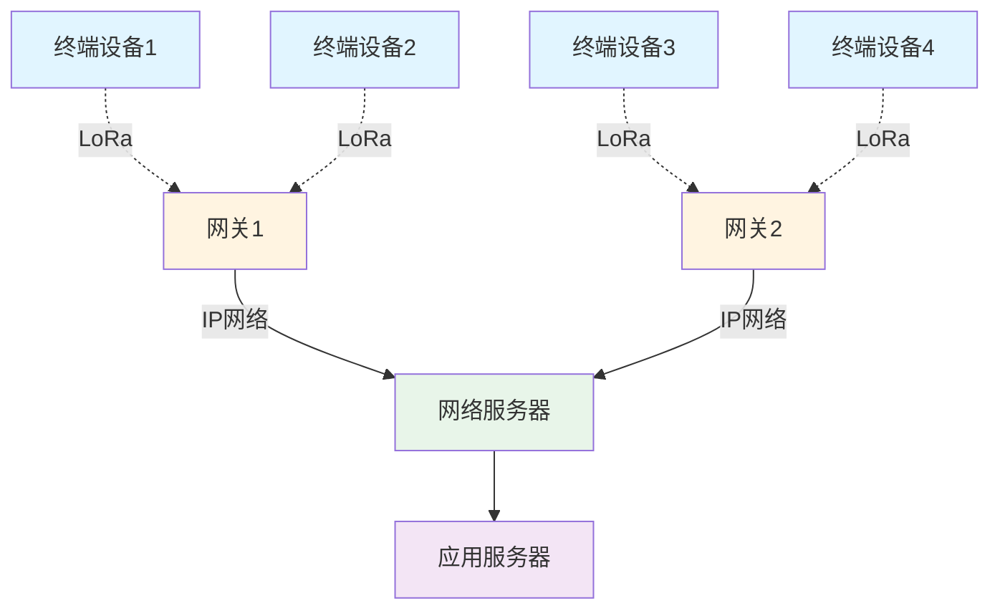
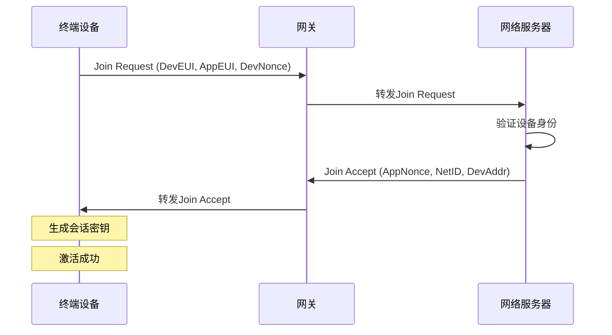

# LoRa/LoRaWAN远距离通信技术详解


## 概述

LoRa（Long Range，长距离）是一种低功耗、远距离的无线通信技术，专为物联网应用设计。LoRaWAN则是基于LoRa物理层的网络协议，定义了网络架构和通信规范。

完成本文学习后，你将能够：

- 理解LoRa调制技术的工作原理和特点
- 掌握LoRaWAN网络架构和协议栈
- 了解LoRa设备的分类和工作模式
- 熟悉LoRaWAN的安全机制
- 掌握LoRa应用开发的基本方法
- 了解LoRa在各行业的实际应用场景

## 背景知识

### 为什么需要LoRa？

传统的无线通信技术在物联网应用中面临挑战：

**WiFi和蓝牙的局限**：
- 通信距离短（通常<100米）
- 功耗相对较高
- 不适合电池供电的长期部署

**蜂窝网络（2G/3G/4G）的问题**：
- 功耗高，电池寿命短
- 通信成本高
- 在偏远地区覆盖不足

**LoRa的优势**：
- 超远距离：城市环境2-5公里，开阔地10-15公里
- 超低功耗：电池可用5-10年
- 低成本：设备和运营成本低
- 强穿透力：可穿透建筑物
- 大容量：单个网关可连接数千设备


## LoRa技术原理

### LoRa调制技术

LoRa使用扩频调制技术（Chirp Spread Spectrum, CSS），这是一种专利技术，由Semtech公司开发。

**核心特点**：
- 使用线性调频脉冲（Chirp）进行调制
- 信号在整个频段内扩展
- 抗干扰能力强
- 可在噪声下解调信号

**工作频段**：
- 中国：470-510 MHz（CN470）
- 欧洲：863-870 MHz（EU868）
- 美国：902-928 MHz（US915）
- 亚洲：923 MHz（AS923）

### 关键参数

#### 1. 扩频因子（Spreading Factor, SF）

扩频因子决定了数据传输速率和通信距离的平衡。

| SF值 | 数据速率 | 通信距离 | 抗干扰能力 | 功耗 |
|------|---------|---------|-----------|------|
| SF7 | 最快 | 最短 | 弱 | 低 |
| SF8 | ↓ | ↓ | ↓ | ↓ |
| SF9 | ↓ | ↓ | ↓ | ↓ |
| SF10 | ↓ | ↓ | ↓ | ↓ |
| SF11 | ↓ | ↓ | ↓ | ↓ |
| SF12 | 最慢 | 最远 | 强 | 高 |

**选择建议**：
- 近距离、高速率：使用SF7-SF9
- 远距离、低速率：使用SF10-SF12
- 不同SF的信号可以正交，互不干扰

#### 2. 带宽（Bandwidth, BW）

LoRa支持三种带宽：

- 125 kHz：最常用，平衡性能
- 250 kHz：更高数据速率
- 500 kHz：最高数据速率

**带宽影响**：
- 带宽越大，数据速率越高
- 带宽越小，灵敏度越高，距离越远

#### 3. 编码率（Coding Rate, CR）

前向纠错编码率，用于提高可靠性：

- CR 4/5：最少冗余，最快速率
- CR 4/6：中等冗余
- CR 4/7：较多冗余
- CR 4/8：最多冗余，最可靠


### 链路预算计算

LoRa的通信距离可以通过链路预算公式估算：

```
接收功率 (dBm) = 发射功率 (dBm) - 路径损耗 (dB) + 天线增益 (dBi)
```

**典型参数**：
- 发射功率：14-20 dBm
- 接收灵敏度：-137 dBm（SF12, BW125）
- 链路预算：约157 dB

**实际距离**：
- 城市环境：2-5公里
- 郊区环境：5-10公里
- 开阔地：10-15公里
- 理想条件：可达20公里以上

## LoRaWAN网络架构

### 网络拓扑

LoRaWAN采用星型拓扑结构：



### 网络组件

#### 1. 终端设备（End Device）

执行数据采集和发送的物联网设备。

**特点**：
- 电池供电
- 低功耗运行
- 双向通信
- 支持多网关接收

#### 2. 网关（Gateway）

连接终端设备和网络服务器的桥梁。

**功能**：
- 接收多个设备的LoRa信号
- 将LoRa数据转换为IP数据包
- 通过以太网/WiFi/4G连接到网络服务器
- 支持多信道同时接收

**性能指标**：
- 接收信道数：8-16个
- 并发设备数：数千个
- 覆盖范围：2-15公里

#### 3. 网络服务器（Network Server）

管理整个LoRaWAN网络。

**职责**：
- 设备认证和管理
- 数据去重（多网关接收同一消息）
- 自适应数据速率（ADR）
- 下行消息调度
- 网络优化

#### 4. 应用服务器（Application Server）

处理应用层数据和业务逻辑。

**功能**：
- 数据解密和解析
- 业务逻辑处理
- 数据存储和分析
- 用户界面和API


### 设备分类

LoRaWAN定义了三类设备：

#### Class A（最低功耗）

**工作方式**：
- 设备主动发送上行数据
- 发送后打开两个短暂的接收窗口
- 其他时间处于睡眠状态

**特点**：
- 功耗最低
- 延迟最高
- 适合传感器等上行为主的应用

**接收窗口**：
```
发送 → RX1窗口(1秒后) → RX2窗口(2秒后) → 睡眠
```

#### Class B（定时接收）

**工作方式**：
- 继承Class A的所有功能
- 额外打开周期性的接收窗口（Ping Slot）
- 通过网关的信标同步时间

**特点**：
- 功耗适中
- 延迟可控
- 适合需要定时下行的应用

#### Class C（持续接收）

**工作方式**：
- 继承Class A的所有功能
- 除发送时外，接收窗口始终打开

**特点**：
- 功耗最高
- 延迟最低
- 适合需要实时响应的应用（如执行器）

**对比总结**：

| 特性 | Class A | Class B | Class C |
|------|---------|---------|---------|
| 功耗 | 最低 | 中等 | 最高 |
| 下行延迟 | 高 | 中等 | 最低 |
| 应用场景 | 传感器 | 智能表计 | 执行器 |
| 电池寿命 | 5-10年 | 2-5年 | 需外部供电 |


## LoRaWAN协议详解

### 激活方式

LoRaWAN设备有两种入网激活方式：

#### OTAA（Over-The-Air Activation，空中激活）

**推荐方式**，更安全。

**激活流程**：


**所需参数**：
- DevEUI：设备唯一标识（64位）
- AppEUI/JoinEUI：应用标识（64位）
- AppKey：应用密钥（128位）

**优点**：
- 每次入网生成新的会话密钥
- 更安全
- 支持设备漫游

#### ABP（Activation By Personalization，个性化激活）

**简化方式**，预配置密钥。

**所需参数**：
- DevAddr：设备地址（32位）
- NwkSKey：网络会话密钥（128位）
- AppSKey：应用会话密钥（128位）

**优点**：
- 无需入网流程
- 立即可用
- 适合测试

**缺点**：
- 密钥固定，安全性较低
- 不支持漫游
- 帧计数器管理复杂

### 数据帧格式

#### 上行数据帧（Uplink）

```
+--------+--------+--------+--------+--------+
| MHDR   | MACPayload      | MIC    |
| (1字节) | (变长)          | (4字节) |
+--------+--------+--------+--------+--------+
         |
         +-- FHDR + FPort + FRMPayload
```

**字段说明**：
- MHDR：MAC头，包含消息类型
- FHDR：帧头，包含DevAddr、帧控制、帧计数器
- FPort：端口号（0-255）
- FRMPayload：加密的应用数据
- MIC：消息完整性校验码

#### 下行数据帧（Downlink）

结构与上行类似，但包含下行特定字段：
- RX1DRoffset：接收窗口1的数据速率偏移
- RX2DataRate：接收窗口2的数据速率
- Frequency：接收窗口2的频率


### 安全机制

LoRaWAN采用多层安全机制：

#### 1. 双层加密

```
应用层加密 (AppSKey)
    ↓
网络层加密 (NwkSKey)
    ↓
无线传输
```

**AppSKey（应用会话密钥）**：
- 加密应用数据（FRMPayload）
- 只有终端设备和应用服务器知道
- 网络服务器无法解密应用数据

**NwkSKey（网络会话密钥）**：
- 计算MIC（消息完整性码）
- 验证消息来源和完整性
- 防止重放攻击

#### 2. 消息完整性校验

每个消息都包含4字节的MIC：

```
MIC = aes128_cmac(NwkSKey, MHDR | FHDR | FPort | FRMPayload)
```

**作用**：
- 验证消息未被篡改
- 验证消息来源
- 防止重放攻击

#### 3. 帧计数器

每个设备维护上行和下行帧计数器：

**上行帧计数器（FCntUp）**：
- 每发送一条消息递增
- 网络服务器检查计数器单调递增
- 防止重放攻击

**下行帧计数器（FCntDown）**：
- 每接收一条下行消息递增
- 设备检查计数器单调递增

### 自适应数据速率（ADR）

ADR机制自动优化设备的传输参数：

**工作原理**：
1. 网络服务器监控设备的信号质量
2. 根据链路质量调整SF和发射功率
3. 通过下行MAC命令发送调整指令
4. 设备应用新的传输参数

**优势**：
- 优化网络容量
- 降低设备功耗
- 提高数据速率
- 减少空中时间

**ADR策略**：
```
信号强 → 降低SF → 提高速率 → 降低功耗
信号弱 → 提高SF → 增加可靠性 → 增加功耗
```


## LoRa硬件和开发

### 常用LoRa模块

#### 1. Semtech SX127x系列

**SX1276/77/78/79**：
- 工作频段：137-1020 MHz
- 发射功率：最高+20 dBm
- 接收灵敏度：-148 dBm
- 接口：SPI

**应用**：
- 终端设备
- 网关（多模块组合）

#### 2. Semtech SX126x系列

**SX1261/62/68**：
- 新一代芯片
- 更低功耗
- 更高性能
- 集成度更高

#### 3. 常见模块

| 模块型号 | 芯片 | 频段 | 特点 |
|---------|------|------|------|
| RFM95/96/97/98 | SX1276/77/78/79 | 多频段 | 性价比高 |
| LoRa32 | SX1276 + ESP32 | 多频段 | 集成WiFi |
| RAK811/RAK4200 | SX1276 | 多频段 | AT命令 |
| E32-TTL-1W | SX1278 | 433/470 MHz | 大功率 |

### 开发平台

#### Arduino + LoRa库

**硬件**：
- Arduino + LoRa Shield
- ESP32 + LoRa模块
- LoRa32开发板

**软件库**：
```cpp
// 使用LMIC库（LoRaMAC-in-C）
#include <lmic.h>
#include <hal/hal.h>
#include <SPI.h>

// 或使用RadioHead库
#include <RH_RF95.h>
```

#### STM32 + LoRaWAN

**硬件**：
- STM32L0/L4系列（低功耗）
- I-CUBE-LRWAN中间件

**开发环境**：
- STM32CubeIDE
- Keil MDK
- IAR Embedded Workbench

#### 专用LoRaWAN模块

**优势**：
- 内置LoRaWAN协议栈
- AT命令控制
- 快速开发

**示例**：
```
// RAK811 AT命令示例
AT+JOIN=OTAA          // OTAA入网
AT+SEND=1:48656C6C6F  // 发送数据
```


### 基础代码示例

#### 点对点通信（不使用LoRaWAN）

```cpp
#include <SPI.h>
#include <LoRa.h>

// LoRa引脚定义
#define SS 10
#define RST 9
#define DIO0 2

void setup() {
    Serial.begin(9600);
    
    // 初始化LoRa
    LoRa.setPins(SS, RST, DIO0);
    
    if (!LoRa.begin(433E6)) {  // 433 MHz
        Serial.println("LoRa初始化失败！");
        while (1);
    }
    
    // 配置参数
    LoRa.setSpreadingFactor(7);     // SF7
    LoRa.setSignalBandwidth(125E3); // 125 kHz
    LoRa.setCodingRate4(5);         // CR 4/5
    LoRa.setTxPower(20);            // 20 dBm
    
    Serial.println("LoRa初始化成功！");
}

void loop() {
    // 发送数据
    LoRa.beginPacket();
    LoRa.print("Hello LoRa!");
    LoRa.endPacket();
    
    Serial.println("数据已发送");
    delay(5000);
}
```

#### LoRaWAN OTAA入网（使用LMIC库）

```cpp
#include <lmic.h>
#include <hal/hal.h>
#include <SPI.h>

// LoRaWAN密钥配置（从TTN获取）
static const u1_t PROGMEM APPEUI[8] = { 0x00, 0x00, ... };
static const u1_t PROGMEM DEVEUI[8] = { 0x00, 0x00, ... };
static const u1_t PROGMEM APPKEY[16] = { 0x00, 0x00, ... };

void os_getArtEui (u1_t* buf) { memcpy_P(buf, APPEUI, 8); }
void os_getDevEui (u1_t* buf) { memcpy_P(buf, DEVEUI, 8); }
void os_getDevKey (u1_t* buf) { memcpy_P(buf, APPKEY, 16); }

// 引脚映射
const lmic_pinmap lmic_pins = {
    .nss = 10,
    .rxtx = LMIC_UNUSED_PIN,
    .rst = 9,
    .dio = {2, 6, 7},
};

void onEvent (ev_t ev) {
    switch(ev) {
        case EV_JOINING:
            Serial.println("正在入网...");
            break;
        case EV_JOINED:
            Serial.println("入网成功！");
            // 禁用ADR
            LMIC_setLinkCheckMode(0);
            break;
        case EV_TXCOMPLETE:
            Serial.println("数据发送完成");
            if (LMIC.txrxFlags & TXRX_ACK)
                Serial.println("收到ACK");
            if (LMIC.dataLen) {
                Serial.print("收到下行数据: ");
                Serial.println(LMIC.dataLen);
            }
            break;
    }
}

void setup() {
    Serial.begin(9600);
    
    // 初始化LMIC
    os_init();
    LMIC_reset();
    
    // 开始入网
    LMIC_startJoining();
}

void loop() {
    os_runloop_once();
}
```


## LoRaWAN网络部署

### 公共网络

#### The Things Network (TTN)

**特点**：
- 全球最大的免费LoRaWAN网络
- 社区驱动
- 适合开发和测试

**使用步骤**：
1. 注册TTN账号
2. 创建应用（Application）
3. 注册设备（Device）
4. 获取密钥（DevEUI, AppEUI, AppKey）
5. 配置设备并入网

**限制**：
- 每天上行消息数限制
- 下行消息限制更严格
- 公平使用政策

#### 商业网络

**中国**：
- 中国联通LoRa网络
- 阿里云Link WAN
- 腾讯云LoRaWAN

**国际**：
- Helium Network
- Actility ThingPark
- Senet

### 私有网络部署

#### 网关选择

**室内网关**：
- 覆盖范围：1-2公里
- 成本：500-2000元
- 适合：小型部署

**室外网关**：
- 覆盖范围：5-15公里
- 成本：2000-10000元
- 适合：大范围覆盖

**推荐型号**：
- RAK7244/7246：树莓派网关
- Dragino LG308：经济型
- Kerlink Wirnet：工业级

#### 网络服务器

**开源方案**：

1. **ChirpStack**（推荐）
   - 功能完整
   - 易于部署
   - 活跃社区

2. **The Things Stack**
   - TTN官方开源版本
   - 功能强大
   - 配置复杂

**部署方式**：
```bash
# 使用Docker部署ChirpStack
docker-compose up -d
```

**商业方案**：
- Actility ThingPark
- Loriot
- Everynet


## 应用场景

### 智慧农业

**应用**：
- 土壤湿度监测
- 气象站数据采集
- 灌溉系统控制
- 畜牧追踪

**优势**：
- 覆盖大面积农田
- 电池供电，无需布线
- 低维护成本

**典型方案**：
```
传感器节点 → LoRa网关 → 云平台 → 手机APP
    ↓
土壤湿度、温度、光照等数据
```

### 智慧城市

**应用**：
- 智能停车
- 路灯控制
- 垃圾桶监测
- 环境监测（空气质量、噪音）

**案例**：
- 智能停车：检测车位占用状态
- 智能路灯：根据环境光自动调节
- 垃圾桶：监测填充水平，优化收集路线

### 工业物联网

**应用**：
- 设备状态监测
- 资产追踪
- 能源管理
- 预测性维护

**优势**：
- 穿透力强，适合工业环境
- 可靠性高
- 大规模部署成本低

### 智能建筑

**应用**：
- 能耗监测
- 环境控制（温湿度、CO2）
- 安防系统
- 设施管理

**特点**：
- 无需布线，易于改造
- 低功耗，长期运行
- 集中管理

### 物流追踪

**应用**：
- 货物位置追踪
- 温度监控（冷链）
- 震动监测
- 开箱检测

**优势**：
- 全程追踪
- 实时告警
- 数据可追溯


## LoRa vs 其他技术

### 技术对比

| 特性 | LoRa | NB-IoT | Sigfox | WiFi | 蓝牙 |
|------|------|--------|--------|------|------|
| 通信距离 | 2-15km | 1-10km | 10-40km | <100m | <100m |
| 数据速率 | 0.3-50 kbps | 20-250 kbps | 100 bps | 1-100 Mbps | 1-3 Mbps |
| 功耗 | 极低 | 低 | 极低 | 高 | 中 |
| 电池寿命 | 5-10年 | 5-10年 | 10-15年 | 天-周 | 月-年 |
| 部署成本 | 低 | 中 | 低 | 低 | 低 |
| 运营成本 | 低/无 | 中 | 中 | 无 | 无 |
| 网络类型 | 私有/公共 | 运营商 | 运营商 | 私有 | 私有 |
| 频谱 | 免费ISM | 授权 | 免费ISM | 免费ISM | 免费ISM |

### 选择建议

**选择LoRa的场景**：
- 需要远距离通信（>1km）
- 需要低功耗（电池供电）
- 数据量小（<50 bytes/次）
- 需要私有网络控制
- 对成本敏感

**选择NB-IoT的场景**：
- 需要运营商级可靠性
- 需要更高数据速率
- 有现成的蜂窝网络覆盖
- 可接受运营费用

**选择WiFi/蓝牙的场景**：
- 短距离通信
- 需要高数据速率
- 有稳定电源供应
- 需要实时响应

## 最佳实践

### 设备设计

#### 1. 功耗优化

```cpp
// 使用深度睡眠
void enterDeepSleep(uint32_t seconds) {
    // 关闭外设
    LoRa.sleep();
    
    // 进入深度睡眠
    esp_sleep_enable_timer_wakeup(seconds * 1000000ULL);
    esp_deep_sleep_start();
}

// 发送数据后睡眠
void sendAndSleep() {
    // 发送数据
    sendLoRaData();
    
    // 等待发送完成
    delay(100);
    
    // 睡眠10分钟
    enterDeepSleep(600);
}
```

#### 2. 数据优化

**压缩数据**：
```cpp
// 不推荐：使用JSON（占用空间大）
String json = "{\"temp\":25.5,\"hum\":60}";  // 24字节

// 推荐：使用二进制格式
uint8_t data[4];
int16_t temp = 255;  // 25.5°C * 10
uint8_t hum = 60;
data[0] = (temp >> 8) & 0xFF;
data[1] = temp & 0xFF;
data[2] = hum;
// 只需3字节
```

**批量发送**：
```cpp
// 收集多个读数后一次发送
#define BUFFER_SIZE 10
float readings[BUFFER_SIZE];
int count = 0;

void collectData() {
    readings[count++] = readSensor();
    
    if (count >= BUFFER_SIZE) {
        sendBatch(readings, count);
        count = 0;
    }
}
```

#### 3. 可靠性设计

**重传机制**：
```cpp
bool sendWithRetry(uint8_t* data, uint8_t len, uint8_t maxRetries) {
    for (uint8_t i = 0; i < maxRetries; i++) {
        if (sendLoRaData(data, len)) {
            return true;  // 发送成功
        }
        delay(1000 * (i + 1));  // 指数退避
    }
    return false;  // 发送失败
}
```

**数据缓存**：
```cpp
// 网络不可用时缓存数据
#define CACHE_SIZE 100
struct DataCache {
    uint8_t data[51];
    uint8_t len;
    uint32_t timestamp;
} cache[CACHE_SIZE];

void cacheData(uint8_t* data, uint8_t len) {
    // 保存到缓存
    // 网络恢复后发送
}
```


### 网络规划

#### 1. 网关部署

**位置选择**：
- 高处优先（楼顶、塔台）
- 避免遮挡物
- 考虑覆盖范围重叠

**数量估算**：
```
城市环境：1个网关覆盖2-5平方公里
郊区环境：1个网关覆盖10-20平方公里
开阔地：1个网关覆盖50-100平方公里
```

#### 2. 频率规划

**中国CN470频段**：
- 上行：470-510 MHz
- 下行：470-510 MHz
- 信道数：96个（125kHz带宽）

**避免干扰**：
- 使用不同的信道组
- 启用ADR自动调整
- 监控信道占用率

#### 3. 容量规划

**单网关容量**：
```
理论容量 = 信道数 × 并发能力
实际容量 ≈ 数千设备（取决于发送频率）
```

**优化建议**：
- 降低设备发送频率
- 使用更高的SF（减少冲突）
- 部署多个网关

### 安全建议

#### 1. 密钥管理

**不要硬编码密钥**：
```cpp
// 不推荐
const uint8_t AppKey[16] = {0x01, 0x02, ...};

// 推荐：从安全存储读取
readKeyFromSecureStorage(AppKey);
```

**定期更换密钥**：
- 使用OTAA而非ABP
- 定期重新入网
- 实现密钥轮换机制

#### 2. 防止重放攻击

**检查帧计数器**：
```cpp
bool validateFrame(uint32_t receivedFCnt) {
    if (receivedFCnt <= lastFCnt) {
        return false;  // 可能是重放攻击
    }
    lastFCnt = receivedFCnt;
    return true;
}
```

#### 3. 物理安全

- 防篡改设计
- 安全启动
- 加密存储敏感数据


## 常见问题

### Q1: LoRa和LoRaWAN有什么区别？

**A**: 
- **LoRa**是物理层调制技术，定义了如何在无线信道上传输数据
- **LoRaWAN**是基于LoRa的MAC层协议，定义了网络架构、设备管理、安全机制等
- 可以使用LoRa进行点对点通信，不使用LoRaWAN协议

### Q2: LoRa的实际通信距离是多少？

**A**: 取决于多个因素：
- **城市环境**：2-5公里（建筑物遮挡）
- **郊区环境**：5-10公里（较少遮挡）
- **开阔地**：10-15公里（无遮挡）
- **理想条件**：可达20公里以上（高处、无干扰）

影响因素：
- 天线高度和增益
- 发射功率
- 扩频因子（SF）
- 环境干扰

### Q3: LoRa设备的电池能用多久？

**A**: 典型场景：
- **Class A设备**：5-10年（每小时发送一次）
- **Class B设备**：2-5年（定时接收）
- **Class C设备**：需要外部供电（持续接收）

影响因素：
- 发送频率
- 数据包大小
- 扩频因子（SF越高功耗越大）
- 睡眠模式的使用

### Q4: LoRaWAN支持双向通信吗？

**A**: 支持，但有限制：
- **上行**：设备可随时发送
- **下行**：只能在设备发送后的接收窗口发送
- **Class A**：延迟较高（需等待设备发送）
- **Class C**：延迟低（几乎实时）

### Q5: 一个LoRa网关能连接多少设备？

**A**: 
- **理论容量**：数万设备
- **实际容量**：数千设备（取决于发送频率）
- **影响因素**：
  - 设备发送频率
  - 数据包大小
  - 扩频因子分布
  - 信道数量

**示例**：
```
1000个设备，每小时发送一次 → 单网关可支持
1000个设备，每分钟发送一次 → 需要多个网关
```

### Q6: LoRa可以传输多大的数据？

**A**: 
- **物理层限制**：最大255字节
- **LoRaWAN限制**：
  - SF7-SF9：最大222字节
  - SF10：最大125字节
  - SF11：最大59字节
  - SF12：最大51字节
- **建议**：每次发送<50字节，以获得最佳性能

### Q7: LoRa需要授权频谱吗？

**A**: 
- LoRa使用**免授权ISM频段**
- 不需要向运营商付费
- 但需遵守各国的频谱使用规定：
  - 发射功率限制
  - 占空比限制（如欧洲1%占空比）
  - 频段范围限制

### Q8: LoRa和NB-IoT哪个更好？

**A**: 取决于应用需求：

**选择LoRa**：
- 需要私有网络
- 对成本敏感
- 无运营商网络覆盖
- 需要灵活控制

**选择NB-IoT**：
- 需要运营商级可靠性
- 有现成网络覆盖
- 需要更高数据速率
- 可接受运营费用

### Q9: LoRa信号能穿透建筑物吗？

**A**: 
- **可以**，但会有衰减
- 穿透能力优于WiFi和蓝牙
- 穿透能力不如NB-IoT（更低频率）
- **建议**：
  - 室内设备靠近窗户
  - 使用外置天线
  - 提高扩频因子

### Q10: 如何调试LoRa通信问题？

**A**: 
1. **检查硬件连接**：
   - 天线连接正确
   - 引脚配置正确
   - 供电稳定

2. **检查软件配置**：
   - 频率设置正确
   - 密钥配置正确
   - 区域参数匹配

3. **使用工具**：
   - 串口监视器查看日志
   - 网关日志查看接收情况
   - 网络服务器查看设备状态

4. **信号测试**：
   - 检查RSSI（信号强度）
   - 检查SNR（信噪比）
   - 逐步增加距离测试


## 总结

通过本文，你学习了：

- ✅ LoRa调制技术的工作原理和关键参数（SF、BW、CR）
- ✅ LoRaWAN网络架构的四个组件（设备、网关、网络服务器、应用服务器）
- ✅ LoRaWAN的三种设备类型（Class A/B/C）及其特点
- ✅ LoRaWAN的激活方式（OTAA和ABP）和安全机制
- ✅ LoRa硬件模块的选择和开发平台
- ✅ LoRaWAN网络的部署方式（公共网络和私有网络）
- ✅ LoRa在各行业的实际应用场景
- ✅ LoRa开发的最佳实践和优化技巧

**核心要点**：
- LoRa适合远距离、低功耗、小数据量的物联网应用
- LoRaWAN提供了完整的网络协议和安全机制
- 选择合适的设备类型和参数配置对应用至关重要
- 网络规划和优化是大规模部署的关键

## 进阶学习

### 实践项目建议

1. **项目1：LoRa温湿度监测系统**
   - 使用LoRa32开发板
   - 连接DHT22传感器
   - 接入TTN网络
   - 实现数据可视化

2. **项目2：LoRa智能停车系统**
   - 使用超声波传感器检测车位
   - LoRa传输占用状态
   - 实现实时监控

3. **项目3：私有LoRaWAN网络搭建**
   - 部署LoRa网关
   - 安装ChirpStack服务器
   - 开发多个终端设备
   - 实现完整的物联网系统

### 深入学习资源

**官方文档**：
1. [LoRa Alliance官网](https://lora-alliance.org/)
2. [LoRaWAN规范文档](https://lora-alliance.org/resource_hub/lorawan-specification-v1-0-3/)
3. [Semtech LoRa开发者门户](https://www.semtech.com/lora)

**开源项目**：
1. [ChirpStack](https://www.chirpstack.io/) - 开源LoRaWAN网络服务器
2. [The Things Network](https://www.thethingsnetwork.org/) - 全球LoRaWAN社区网络
3. [LMIC库](https://github.com/mcci-catena/arduino-lmic) - Arduino LoRaWAN库

**推荐书籍**：
1. 《LoRa物联网技术与应用》
2. 《LoRaWAN协议详解》
3. 《物联网通信技术》

**在线课程**：
1. LoRa Alliance在线培训
2. Udemy LoRa开发课程
3. Coursera物联网专项课程

**社区和论坛**：
1. [The Things Network论坛](https://www.thethingsnetwork.org/forum/)
2. [LoRa Alliance技术论坛](https://lora-developers.semtech.com/)
3. [Arduino论坛 - LoRa板块](https://forum.arduino.cc/)

### 相关技术

继续学习以下相关技术：

1. **NB-IoT窄带物联网** - 了解蜂窝物联网技术
2. **Zigbee网状网络** - 学习短距离网状网络
3. **MQTT协议** - 学习物联网应用层协议
4. **云平台接入** - 学习AWS IoT、阿里云IoT等平台

## 参考资料

### 技术规范

1. LoRaWAN 1.0.3 Specification
2. LoRaWAN 1.1 Specification
3. LoRaWAN Regional Parameters
4. Semtech SX1276/77/78/79 Datasheet

### 应用指南

1. LoRaWAN Device Developer Guide
2. LoRaWAN Network Server Implementation Guide
3. LoRa Modem Design Guide
4. LoRa Range Calculator

### 标准文档

1. ETSI EN 300 220 - 短距离设备标准
2. FCC Part 15 - 美国频谱规定
3. 工信部无线电管理规定

### 测试工具

1. **硬件工具**：
   - 频谱分析仪
   - 网络分析仪
   - LoRa测试仪

2. **软件工具**：
   - LoRa Packet Forwarder
   - LoRaWAN Network Simulator
   - TTN Console

### 厂商资源

1. **Semtech**：
   - LoRa开发套件
   - 参考设计
   - 应用笔记

2. **STMicroelectronics**：
   - STM32 LoRa开发板
   - I-CUBE-LRWAN软件包

3. **Microchip**：
   - RN2483/RN2903 LoRa模块
   - LoRaWAN协议栈

## 附录

### A. LoRa频段对照表

| 区域 | 频段 | 上行信道 | 下行信道 | 最大功率 |
|------|------|---------|---------|---------|
| 中国 | CN470 | 470-510 MHz | 470-510 MHz | 19.15 dBm |
| 欧洲 | EU868 | 863-870 MHz | 863-870 MHz | 16 dBm |
| 美国 | US915 | 902-928 MHz | 902-928 MHz | 30 dBm |
| 澳洲 | AU915 | 915-928 MHz | 915-928 MHz | 30 dBm |
| 亚洲 | AS923 | 923 MHz | 923 MHz | 16 dBm |

### B. LoRa参数配置速查表

| SF | BW (kHz) | 比特率 (bps) | 灵敏度 (dBm) | 空中时间 (ms) |
|----|----------|-------------|-------------|--------------|
| 7 | 125 | 5470 | -123 | 41 |
| 8 | 125 | 3125 | -126 | 72 |
| 9 | 125 | 1760 | -129 | 144 |
| 10 | 125 | 980 | -132 | 288 |
| 11 | 125 | 440 | -134.5 | 576 |
| 12 | 125 | 250 | -137 | 1152 |

### C. LoRaWAN端口号约定

| 端口 | 用途 |
|------|------|
| 0 | MAC命令（保留）|
| 1-223 | 应用数据 |
| 224 | MAC层测试 |
| 225-255 | 保留 |

### D. 常用AT命令（RAK811示例）

```
AT+VERSION          // 查询版本
AT+JOIN=OTAA        // OTAA入网
AT+JOIN=ABP         // ABP入网
AT+SEND=1:48656C6C6F  // 发送数据
AT+RECV             // 查询接收数据
AT+DR=5             // 设置数据速率
AT+TXP=0            // 设置发射功率
```

---

**文档更新日志**：
- v1.0 (2026-03-08): 初始版本发布

**反馈与贡献**：
- 发现错误或有改进建议，欢迎提交Issue
- 想要分享你的LoRa项目，欢迎投稿
- 有问题可在评论区讨论

**版权声明**：
本文档采用 CC BY-NC-SA 4.0 许可协议，欢迎分享和改编，但请注明出处。
