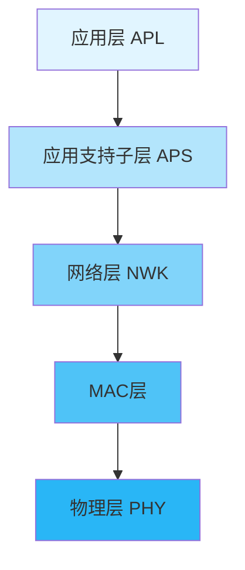
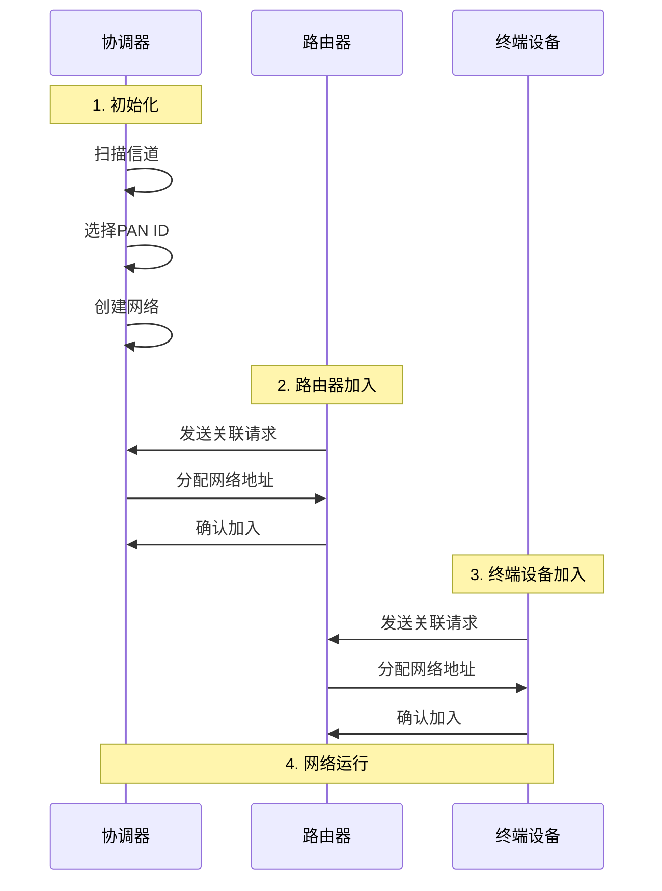
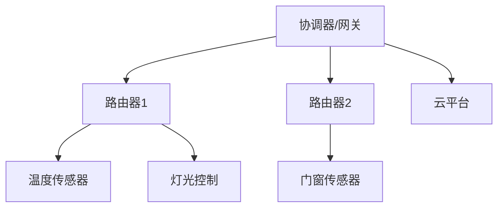

# Zigbee网状网络技术入门与实践


## 学习目标

完成本教程后，你将能够：

- [ ] 理解Zigbee协议的基本概念和技术特点
- [ ] 掌握Zigbee网状网络的拓扑结构和工作原理
- [ ] 了解Zigbee设备类型（协调器、路由器、终端设备）
- [ ] 配置和组建Zigbee网络
- [ ] 实现Zigbee节点间的数据通信
- [ ] 开发基于Zigbee的智能家居应用

## 前置要求

在开始本教程之前，你需要：

**知识要求**：
- 了解C语言基础
- 熟悉基本的无线通信概念
- 了解嵌入式系统基础知识
- 理解网络协议的基本概念

**技能要求**：
- 能够使用IAR或Keil开发环境
- 会使用串口调试工具
- 具备基本的电路连接能力
- 了解基本的网络调试方法


## 准备工作

### 硬件准备

| 名称 | 数量 | 说明 | 参考链接 |
|------|------|------|----------|
| CC2530开发板 | 3 | 德州仪器Zigbee芯片 | - |
| CC Debugger | 1 | 用于程序下载和调试 | - |
| USB转串口模块 | 1 | 用于串口通信 | - |
| LED灯 | 3 | 用于状态指示 | - |
| 按键 | 3 | 用于功能触发 | - |
| 杜邦线 | 若干 | 用于连接 | - |

### 软件准备

- **开发环境**：IAR Embedded Workbench 8.x 或 Keil MDK
- **协议栈**：Z-Stack 3.0+ (TI官方Zigbee协议栈)
- **下载工具**：SmartRF Flash Programmer
- **抓包工具**：Ubiqua Protocol Analyzer（可选）
- **辅助工具**：串口调试助手

### 环境配置

#### 1. 安装开发环境

1. 下载并安装IAR Embedded Workbench for 8051
2. 安装CC Debugger驱动程序
3. 下载Z-Stack协议栈

#### 2. 配置Z-Stack

1. 解压Z-Stack到工作目录
2. 打开示例工程（如SampleApp）
3. 配置编译选项
4. 测试编译是否成功


## Zigbee技术基础知识

### Zigbee是什么？

Zigbee是一种基于IEEE 802.15.4标准的低功耗、低成本、低数据速率的无线个人区域网（WPAN）通信技术。它专为物联网和智能家居应用设计，支持网状网络拓扑。

**Zigbee的核心特点**：
- **低功耗**：电池供电可运行数月甚至数年
- **低成本**：芯片和模块价格低廉
- **网状网络**：自组织、自修复的网络拓扑
- **高可靠性**：多路径路由，抗干扰能力强
- **大容量**：单个网络最多支持65000个节点
- **安全性**：支持AES-128加密

### Zigbee技术规格

| 特性 | 规格 |
|------|------|
| 工作频段 | 2.4GHz（全球）、868MHz（欧洲）、915MHz（美国） |
| 数据速率 | 250 kbps（2.4GHz）、40 kbps（915MHz）、20 kbps（868MHz） |
| 传输距离 | 10-100米（视环境而定） |
| 网络容量 | 最多65536个节点 |
| 功耗 | 发送：30mA，接收：27mA，休眠：<3μA |
| 安全性 | AES-128加密 |
| 拓扑结构 | 星型、树型、网状 |


### Zigbee协议栈架构

Zigbee协议栈采用分层架构，符合OSI模型：



**各层功能**：
- **物理层（PHY）**：负责无线信号的发送和接收
- **MAC层**：媒体访问控制，处理信道访问和数据帧
- **网络层（NWK）**：网络组建、路由选择、地址分配
- **应用支持子层（APS）**：提供数据传输服务
- **应用层（APL）**：用户应用程序

### Zigbee设备类型

Zigbee网络中有三种设备类型：

#### 1. 协调器（Coordinator）

```
[协调器] - 网络的核心
    ├── 创建和管理网络
    ├── 分配网络地址
    ├── 允许设备加入
    └── 可选：路由功能
```

**特点**：
- 每个网络有且仅有一个协调器
- 负责网络的初始化和管理
- 通常连接到电源（不使用电池）
- 可以作为网关连接到其他网络

#### 2. 路由器（Router）

```
[路由器] - 网络的中继节点
    ├── 转发数据包
    ├── 允许设备加入
    ├── 参与路由发现
    └── 始终保持唤醒状态
```

**特点**：
- 扩展网络覆盖范围
- 提供多路径路由
- 必须连接到电源
- 可以有多个子节点

#### 3. 终端设备（End Device）

```
[终端设备] - 网络的叶子节点
    ├── 发送和接收数据
    ├── 不转发数据
    ├── 可以休眠
    └── 必须连接到父节点
```

**特点**：
- 功耗最低，适合电池供电
- 不参与路由
- 大部分时间处于休眠状态
- 通过父节点通信


### Zigbee网络拓扑

Zigbee支持三种网络拓扑结构：

#### 1. 星型拓扑

```
        [协调器]
       /    |    \
      /     |     \
   [ED1]  [ED2]  [ED3]
```

**特点**：
- 最简单的拓扑结构
- 所有设备直接连接到协调器
- 覆盖范围有限
- 适合小型网络

#### 2. 树型拓扑

```
        [协调器]
       /         \
    [R1]         [R2]
    /  \         /  \
  [ED1][ED2]  [ED3][ED4]
```

**特点**：
- 层次化结构
- 路由器扩展网络范围
- 路由路径固定
- 适合中型网络

#### 3. 网状拓扑（Mesh）

```
    [协调器]---[R1]
      |    \  /  |
      |     \/   |
      |     /\   |
    [R2]---[R3]--[ED1]
      |
    [ED2]
```

**特点**：
- 最灵活的拓扑结构
- 多路径路由，高可靠性
- 自组织、自修复
- 适合大型复杂网络

### Zigbee网络组建过程




## 步骤1：配置Zigbee协调器

### 1.1 创建协调器工程

1. 打开IAR Embedded Workbench
2. 打开Z-Stack示例工程：`Projects\zstack\Samples\SampleApp\CC2530DB\SampleApp.eww`
3. 复制工程并重命名为`Coordinator`

### 1.2 配置设备类型

在`ZComDef.h`中配置设备类型为协调器：

```c
// 设备类型配置
#define COORDINATOR         // 定义为协调器
// #define ROUTER           // 路由器（注释掉）
// #define ENDDEVICE        // 终端设备（注释掉）

// 网络配置
#define DEFAULT_CHANLIST    0x00000800  // 信道11（2405MHz）
#define ZDAPP_CONFIG_PAN_ID 0x1234      // PAN ID
```

### 1.3 初始化代码

在`SampleApp.c`中添加协调器初始化代码：

```c
#include "OSAL.h"
#include "ZGlobals.h"
#include "AF.h"
#include "aps_groups.h"
#include "ZDApp.h"
#include "SampleApp.h"
#include "OnBoard.h"
#include "hal_led.h"
#include "hal_key.h"
#include "hal_uart.h"

// 应用任务ID
byte SampleApp_TaskID;

// 端点描述符
static endPointDesc_t SampleApp_epDesc;

// 簇ID定义
#define SAMPLEAPP_CLUSTERID  1

// 初始化函数
void SampleApp_Init(byte task_id)
{
    SampleApp_TaskID = task_id;
    
    // 配置端点
    SampleApp_epDesc.endPoint = SAMPLEAPP_ENDPOINT;
    SampleApp_epDesc.task_id = &SampleApp_TaskID;
    SampleApp_epDesc.simpleDesc = (SimpleDescriptionFormat_t *)&SampleApp_SimpleDesc;
    SampleApp_epDesc.latencyReq = noLatencyReqs;
    
    // 注册端点
    afRegister(&SampleApp_epDesc);
    
    // 初始化LED
    HalLedSet(HAL_LED_1, HAL_LED_MODE_OFF);
    
    // 打印启动信息
    HalUARTWrite(0, "Coordinator Started\n", 20);
}
```

### 1.4 编译和下载

1. 选择编译配置：`CoordinatorEB`
2. 点击编译按钮（Project → Make）
3. 连接CC Debugger到CC2530
4. 点击下载按钮（Project → Download and Debug）
5. 运行程序（Debug → Go）

**预期结果**：
- LED1闪烁表示协调器启动
- 串口输出"Coordinator Started"
- 协调器开始创建网络


## 步骤2：配置Zigbee路由器

### 2.1 创建路由器工程

1. 复制协调器工程
2. 重命名为`Router`
3. 修改设备类型配置

### 2.2 配置设备类型

在`ZComDef.h`中修改配置：

```c
// 设备类型配置
// #define COORDINATOR      // 协调器（注释掉）
#define ROUTER              // 定义为路由器
// #define ENDDEVICE        // 终端设备（注释掉）

// 网络配置（与协调器保持一致）
#define DEFAULT_CHANLIST    0x00000800  // 信道11
#define ZDAPP_CONFIG_PAN_ID 0x1234      // PAN ID
```

### 2.3 路由器功能代码

```c
// 路由器初始化
void SampleApp_Init(byte task_id)
{
    SampleApp_TaskID = task_id;
    
    // 配置端点
    SampleApp_epDesc.endPoint = SAMPLEAPP_ENDPOINT;
    SampleApp_epDesc.task_id = &SampleApp_TaskID;
    SampleApp_epDesc.simpleDesc = (SimpleDescriptionFormat_t *)&SampleApp_SimpleDesc;
    SampleApp_epDesc.latencyReq = noLatencyReqs;
    
    // 注册端点
    afRegister(&SampleApp_epDesc);
    
    // 初始化LED
    HalLedSet(HAL_LED_2, HAL_LED_MODE_OFF);
    
    // 打印启动信息
    HalUARTWrite(0, "Router Started\n", 15);
    
    // 启动设备发现
    ZDO_StartDevice((uint16)0, STARTDEV_AUTO_START);
}

// 处理网络状态变化
void SampleApp_ProcessZDOMsgs(zdoIncomingMsg_t *inMsg)
{
    switch (inMsg->clusterID)
    {
        case ZDO_STATE_CHANGE_IND:
            // 设备状态改变
            if ((devStates_t)(inMsg->asdu[0]) == DEV_ZB_COORD ||
                (devStates_t)(inMsg->asdu[0]) == DEV_ROUTER ||
                (devStates_t)(inMsg->asdu[0]) == DEV_END_DEVICE)
            {
                // 加入网络成功
                HalLedSet(HAL_LED_2, HAL_LED_MODE_ON);
                HalUARTWrite(0, "Joined Network\n", 15);
            }
            break;
    }
}
```

### 2.4 编译和测试

1. 编译路由器工程
2. 下载到第二块CC2530开发板
3. 先启动协调器，再启动路由器
4. 观察LED状态和串口输出

**预期结果**：
- 路由器自动搜索并加入网络
- LED2常亮表示加入成功
- 串口输出"Joined Network"


## 步骤3：配置Zigbee终端设备

### 3.1 创建终端设备工程

1. 复制协调器工程
2. 重命名为`EndDevice`
3. 修改设备类型配置

### 3.2 配置设备类型

在`ZComDef.h`中修改配置：

```c
// 设备类型配置
// #define COORDINATOR      // 协调器（注释掉）
// #define ROUTER           // 路由器（注释掉）
#define ENDDEVICE           // 定义为终端设备

// 网络配置
#define DEFAULT_CHANLIST    0x00000800  // 信道11
#define ZDAPP_CONFIG_PAN_ID 0x1234      // PAN ID

// 终端设备特殊配置
#define POLL_RATE           1000        // 轮询周期（ms）
```

### 3.3 终端设备功能代码

```c
// 终端设备初始化
void SampleApp_Init(byte task_id)
{
    SampleApp_TaskID = task_id;
    
    // 配置端点
    SampleApp_epDesc.endPoint = SAMPLEAPP_ENDPOINT;
    SampleApp_epDesc.task_id = &SampleApp_TaskID;
    SampleApp_epDesc.simpleDesc = (SimpleDescriptionFormat_t *)&SampleApp_SimpleDesc;
    SampleApp_epDesc.latencyReq = noLatencyReqs;
    
    // 注册端点
    afRegister(&SampleApp_epDesc);
    
    // 初始化LED
    HalLedSet(HAL_LED_3, HAL_LED_MODE_OFF);
    
    // 打印启动信息
    HalUARTWrite(0, "End Device Started\n", 19);
    
    // 启动设备
    ZDO_StartDevice((uint16)0, STARTDEV_AUTO_START);
    
    // 设置轮询周期
    NLME_SetPollRate(POLL_RATE);
}

// 按键处理函数
void SampleApp_HandleKeys(byte shift, byte keys)
{
    if (keys & HAL_KEY_SW_1)
    {
        // 按键1：发送数据到协调器
        SendDataToCoordinator();
    }
}

// 发送数据到协调器
void SendDataToCoordinator(void)
{
    byte data[] = "Hello from End Device";
    
    afAddrType_t dstAddr;
    dstAddr.addrMode = afAddr16Bit;
    dstAddr.addr.shortAddr = 0x0000;  // 协调器地址
    dstAddr.endPoint = SAMPLEAPP_ENDPOINT;
    
    // 发送数据
    AF_DataRequest(&dstAddr, &SampleApp_epDesc,
                   SAMPLEAPP_CLUSTERID,
                   sizeof(data),
                   data,
                   &SampleApp_TransID,
                   AF_DISCV_ROUTE,
                   AF_DEFAULT_RADIUS);
    
    HalUARTWrite(0, "Data Sent\n", 10);
}
```

### 3.4 低功耗配置

终端设备可以进入休眠模式以节省电量：

```c
// 配置休眠模式
void ConfigureSleep(void)
{
    // 允许设备休眠
    NLME_SetPollRate(0);  // 0表示不轮询，完全休眠
    
    // 或者设置较长的轮询周期
    NLME_SetPollRate(5000);  // 5秒轮询一次
}

// 唤醒处理
void WakeupHandler(void)
{
    // 设备唤醒后的处理
    HalLedSet(HAL_LED_3, HAL_LED_MODE_BLINK);
}
```


## 步骤4：实现节点间通信

### 4.1 数据发送

Zigbee使用AF（Application Framework）层进行数据传输：

```c
// 定义数据结构
typedef struct
{
    uint8 temperature;
    uint8 humidity;
    uint16 light;
} SensorData_t;

// 发送传感器数据
void SendSensorData(void)
{
    SensorData_t sensorData;
    
    // 读取传感器数据
    sensorData.temperature = ReadTemperature();
    sensorData.humidity = ReadHumidity();
    sensorData.light = ReadLight();
    
    // 配置目标地址
    afAddrType_t dstAddr;
    dstAddr.addrMode = afAddr16Bit;
    dstAddr.addr.shortAddr = 0x0000;  // 发送到协调器
    dstAddr.endPoint = SAMPLEAPP_ENDPOINT;
    
    // 发送数据
    AF_DataRequest(&dstAddr,
                   &SampleApp_epDesc,
                   SAMPLEAPP_CLUSTERID,
                   sizeof(SensorData_t),
                   (uint8*)&sensorData,
                   &SampleApp_TransID,
                   AF_DISCV_ROUTE,
                   AF_DEFAULT_RADIUS);
}
```

**参数说明**：
- `dstAddr`：目标地址结构
- `afAddr16Bit`：使用16位短地址
- `SAMPLEAPP_CLUSTERID`：簇ID，用于区分不同类型的数据
- `AF_DISCV_ROUTE`：自动发现路由
- `AF_DEFAULT_RADIUS`：默认跳数限制

### 4.2 数据接收

```c
// 数据接收回调函数
void SampleApp_MessageMSGCB(afIncomingMSGPacket_t *pkt)
{
    switch (pkt->clusterId)
    {
        case SAMPLEAPP_CLUSTERID:
            // 处理接收到的数据
            ProcessReceivedData(pkt->cmd.Data, pkt->cmd.DataLength);
            break;
    }
}

// 处理接收到的数据
void ProcessReceivedData(uint8 *data, uint8 len)
{
    if (len == sizeof(SensorData_t))
    {
        SensorData_t *sensorData = (SensorData_t*)data;
        
        // 打印接收到的数据
        char buffer[50];
        sprintf(buffer, "Temp:%d Hum:%d Light:%d\n",
                sensorData->temperature,
                sensorData->humidity,
                sensorData->light);
        HalUARTWrite(0, buffer, strlen(buffer));
        
        // 控制LED显示
        if (sensorData->temperature > 30)
        {
            HalLedSet(HAL_LED_1, HAL_LED_MODE_ON);  // 温度过高
        }
    }
}
```

### 4.3 广播通信

向网络中所有设备发送数据：

```c
// 广播数据
void BroadcastData(void)
{
    uint8 data[] = "Broadcast Message";
    
    afAddrType_t dstAddr;
    dstAddr.addrMode = afAddrBroadcast;
    dstAddr.addr.shortAddr = 0xFFFF;  // 广播地址
    dstAddr.endPoint = SAMPLEAPP_ENDPOINT;
    
    AF_DataRequest(&dstAddr,
                   &SampleApp_epDesc,
                   SAMPLEAPP_CLUSTERID,
                   sizeof(data),
                   data,
                   &SampleApp_TransID,
                   AF_DISCV_ROUTE,
                   AF_DEFAULT_RADIUS);
}
```

### 4.4 组播通信

向特定组内的设备发送数据：

```c
// 加入组
void JoinGroup(uint16 groupID)
{
    aps_Group_t group;
    group.ID = groupID;
    group.name[0] = 0;  // 组名（可选）
    
    aps_AddGroup(SAMPLEAPP_ENDPOINT, &group);
}

// 向组发送数据
void SendToGroup(uint16 groupID)
{
    uint8 data[] = "Group Message";
    
    afAddrType_t dstAddr;
    dstAddr.addrMode = afAddrGroup;
    dstAddr.addr.shortAddr = groupID;
    dstAddr.endPoint = SAMPLEAPP_ENDPOINT;
    
    AF_DataRequest(&dstAddr,
                   &SampleApp_epDesc,
                   SAMPLEAPP_CLUSTERID,
                   sizeof(data),
                   data,
                   &SampleApp_TransID,
                   AF_DISCV_ROUTE,
                   AF_DEFAULT_RADIUS);
}
```


## 步骤5：实战项目 - 智能家居控制系统

### 5.1 项目概述

创建一个基于Zigbee的智能家居控制系统，包括：
- 1个协调器（网关）
- 2个路由器（中继节点）
- 3个终端设备（温度传感器、灯光控制、门窗传感器）

### 5.2 系统架构



### 5.3 协调器代码（网关）

```c
// 网关初始化
void Gateway_Init(byte task_id)
{
    SampleApp_TaskID = task_id;
    
    // 注册端点
    afRegister(&SampleApp_epDesc);
    
    // 初始化串口（用于与云平台通信）
    InitUART();
    
    // 启动定时器（定期查询设备状态）
    osal_start_timerEx(SampleApp_TaskID,
                       SAMPLEAPP_QUERY_EVT,
                       QUERY_PERIOD);
    
    HalUARTWrite(0, "Gateway Started\n", 16);
}

// 处理接收到的传感器数据
void Gateway_ProcessSensorData(afIncomingMSGPacket_t *pkt)
{
    uint16 srcAddr = pkt->srcAddr.addr.shortAddr;
    uint8 *data = pkt->cmd.Data;
    uint8 len = pkt->cmd.DataLength;
    
    // 解析数据类型
    uint8 dataType = data[0];
    
    switch (dataType)
    {
        case DATA_TYPE_TEMPERATURE:
            {
                int8 temp = (int8)data[1];
                char buffer[30];
                sprintf(buffer, "Temp from 0x%04X: %d\n", srcAddr, temp);
                HalUARTWrite(0, buffer, strlen(buffer));
                
                // 转发到云平台
                SendToCloud(srcAddr, DATA_TYPE_TEMPERATURE, temp);
            }
            break;
            
        case DATA_TYPE_DOOR_STATUS:
            {
                uint8 status = data[1];
                char buffer[30];
                sprintf(buffer, "Door 0x%04X: %s\n",
                        srcAddr,
                        status ? "Open" : "Closed");
                HalUARTWrite(0, buffer, strlen(buffer));
                
                // 如果门打开，触发报警
                if (status)
                {
                    TriggerAlarm();
                }
            }
            break;
    }
}

// 控制灯光
void Gateway_ControlLight(uint16 deviceAddr, uint8 onOff)
{
    uint8 data[2];
    data[0] = CMD_LIGHT_CONTROL;
    data[1] = onOff;
    
    afAddrType_t dstAddr;
    dstAddr.addrMode = afAddr16Bit;
    dstAddr.addr.shortAddr = deviceAddr;
    dstAddr.endPoint = SAMPLEAPP_ENDPOINT;
    
    AF_DataRequest(&dstAddr,
                   &SampleApp_epDesc,
                   SAMPLEAPP_CLUSTERID,
                   sizeof(data),
                   data,
                   &SampleApp_TransID,
                   AF_DISCV_ROUTE,
                   AF_DEFAULT_RADIUS);
}
```

### 5.4 温度传感器代码

```c
// 温度传感器初始化
void TempSensor_Init(byte task_id)
{
    SampleApp_TaskID = task_id;
    
    // 注册端点
    afRegister(&SampleApp_epDesc);
    
    // 初始化温度传感器（如DS18B20）
    InitTempSensor();
    
    // 启动定时器（定期上报温度）
    osal_start_timerEx(SampleApp_TaskID,
                       SAMPLEAPP_SEND_EVT,
                       REPORT_PERIOD);
    
    HalUARTWrite(0, "Temp Sensor Started\n", 20);
}

// 读取并上报温度
void TempSensor_ReportTemperature(void)
{
    // 读取温度
    int8 temperature = ReadDS18B20();
    
    // 构建数据包
    uint8 data[2];
    data[0] = DATA_TYPE_TEMPERATURE;
    data[1] = (uint8)temperature;
    
    // 发送到协调器
    afAddrType_t dstAddr;
    dstAddr.addrMode = afAddr16Bit;
    dstAddr.addr.shortAddr = 0x0000;  // 协调器地址
    dstAddr.endPoint = SAMPLEAPP_ENDPOINT;
    
    AF_DataRequest(&dstAddr,
                   &SampleApp_epDesc,
                   SAMPLEAPP_CLUSTERID,
                   sizeof(data),
                   data,
                   &SampleApp_TransID,
                   AF_DISCV_ROUTE,
                   AF_DEFAULT_RADIUS);
    
    // 进入休眠（节省电量）
    NLME_SetPollRate(SLEEP_PERIOD);
}
```

### 5.5 灯光控制代码

```c
// 灯光控制初始化
void LightControl_Init(byte task_id)
{
    SampleApp_TaskID = task_id;
    
    // 注册端点
    afRegister(&SampleApp_epDesc);
    
    // 初始化GPIO控制LED
    InitLightGPIO();
    
    HalUARTWrite(0, "Light Control Started\n", 22);
}

// 处理控制命令
void LightControl_ProcessCommand(afIncomingMSGPacket_t *pkt)
{
    uint8 *data = pkt->cmd.Data;
    
    if (data[0] == CMD_LIGHT_CONTROL)
    {
        uint8 onOff = data[1];
        
        // 控制灯光
        if (onOff)
        {
            TurnOnLight();
            HalUARTWrite(0, "Light ON\n", 9);
        }
        else
        {
            TurnOffLight();
            HalUARTWrite(0, "Light OFF\n", 10);
        }
        
        // 发送确认消息
        SendAck(pkt->srcAddr.addr.shortAddr);
    }
}

// 控制灯光硬件
void TurnOnLight(void)
{
    P1_0 = 1;  // 假设灯光连接到P1.0
}

void TurnOffLight(void)
{
    P1_0 = 0;
}
```


## Zigbee安全与最佳实践

### 安全配置

#### 1. 网络密钥配置

```c
// 配置网络密钥
void ConfigureNetworkKey(void)
{
    // 设置预配置密钥
    uint8 preConfigKey[16] = {
        0x01, 0x03, 0x05, 0x07, 0x09, 0x0B, 0x0D, 0x0F,
        0x00, 0x02, 0x04, 0x06, 0x08, 0x0A, 0x0C, 0x0E
    };
    
    // 应用密钥
    ZDSecMgrUpdateNwkKey(preConfigKey, 0, ZCD_NV_NWKKEY);
    
    // 启用安全
    zgSecurePermit = TRUE;
}
```

#### 2. 设备认证

```c
// 配置信任中心
void ConfigureTrustCenter(void)
{
    // 只允许已知设备加入
    zgAllowRejoins = FALSE;
    
    // 设置安装码
    uint8 installCode[18] = {
        // 16字节安装码 + 2字节CRC
    };
    
    // 应用安装码
    ZDSecMgrAddInstallCode(installCode, deviceAddr);
}
```

#### 3. 数据加密

```c
// 发送加密数据
void SendSecureData(uint8 *data, uint8 len)
{
    afAddrType_t dstAddr;
    dstAddr.addrMode = afAddr16Bit;
    dstAddr.addr.shortAddr = targetAddr;
    dstAddr.endPoint = SAMPLEAPP_ENDPOINT;
    
    // 启用AES加密
    AF_DataRequest(&dstAddr,
                   &SampleApp_epDesc,
                   SAMPLEAPP_CLUSTERID,
                   len,
                   data,
                   &SampleApp_TransID,
                   AF_DISCV_ROUTE | AF_EN_SECURITY,  // 启用安全
                   AF_DEFAULT_RADIUS);
}
```

### 性能优化

#### 1. 降低功耗

```c
// 终端设备省电配置
void ConfigurePowerSaving(void)
{
    // 设置较长的轮询周期
    NLME_SetPollRate(30000);  // 30秒轮询一次
    
    // 配置休眠模式
    PWRCTRL |= 0x01;  // 启用PM1模式
    
    // 关闭不必要的外设
    PERCFG &= ~0x01;  // 关闭UART0
}

// 事件触发唤醒
void WakeupOnEvent(void)
{
    // 配置外部中断唤醒
    P0IEN |= 0x01;  // 使能P0.0中断
    PICTL |= 0x01;  // 下降沿触发
    
    // 进入休眠
    PCON |= 0x01;
}
```

#### 2. 路由优化

```c
// 配置路由表大小
#define MAX_RTG_ENTRIES  20  // 增加路由表容量

// 启用多播路由
void EnableMulticastRouting(void)
{
    // 配置多播表
    aps_Group_t group;
    group.ID = 0x0001;
    aps_AddGroup(SAMPLEAPP_ENDPOINT, &group);
    
    // 启用多播路由发现
    NLME_RouteDiscoveryRequest(0x0001, ROUTE_DISCOVERY_MULTICAST);
}

// 路由维护
void MaintainRoutes(void)
{
    // 定期刷新路由表
    NLME_RouteDiscoveryRequest(0xFFFF, ROUTE_DISCOVERY_FORCE);
    
    // 清理过期路由
    RTG_RemoveStaleRoutes();
}
```

#### 3. 网络容量优化

```c
// 配置网络参数
#define MAX_NEIGHBOR_ENTRIES  20  // 邻居表大小
#define MAX_DEVICES          100  // 最大设备数

// 优化地址分配
void OptimizeAddressing(void)
{
    // 配置地址分配深度
    zgRouterOffAssocList = TRUE;  // 路由器不维护关联列表
    
    // 配置子设备数量
    zgMaxChildren = 20;  // 每个路由器最多20个子设备
}
```


## 故障排除

### 问题1：设备无法加入网络

**可能原因**：
- PAN ID不匹配
- 信道配置错误
- 网络已满
- 安全密钥不匹配

**解决方法**：

```c
// 调试代码：打印网络信息
void PrintNetworkInfo(void)
{
    uint16 panId = _NIB.nwkPanId;
    uint8 channel = _NIB.nwkLogicalChannel;
    uint16 shortAddr = _NIB.nwkDevAddress;
    
    char buffer[50];
    sprintf(buffer, "PAN:0x%04X CH:%d Addr:0x%04X\n",
            panId, channel, shortAddr);
    HalUARTWrite(0, buffer, strlen(buffer));
}

// 重置网络配置
void ResetNetwork(void)
{
    // 清除网络信息
    zgWriteStartupOptions(ZG_STARTUP_CLEAR, 3);
    
    // 重启设备
    SystemReset();
}
```

### 问题2：数据传输失败

**可能原因**：
- 路由不可达
- 缓冲区满
- 数据包过大
- 网络拥塞

**解决方法**：

```c
// 检查发送结果
void CheckSendResult(void)
{
    uint8 result = AF_DataRequest(&dstAddr, ...);
    
    switch (result)
    {
        case afStatus_SUCCESS:
            HalUARTWrite(0, "Send OK\n", 8);
            break;
        case afStatus_NO_ROUTE:
            HalUARTWrite(0, "No Route\n", 9);
            // 触发路由发现
            NLME_RouteDiscoveryRequest(dstAddr.addr.shortAddr, 0);
            break;
        case afStatus_MEM_FAIL:
            HalUARTWrite(0, "Memory Full\n", 12);
            // 等待缓冲区释放
            osal_start_timerEx(SampleApp_TaskID, RETRY_EVT, 1000);
            break;
    }
}

// 分片发送大数据
void SendLargeData(uint8 *data, uint16 len)
{
    uint8 fragmentSize = 80;  // 每片80字节
    uint16 offset = 0;
    
    while (offset < len)
    {
        uint8 size = (len - offset > fragmentSize) ? fragmentSize : (len - offset);
        
        // 发送数据片段
        AF_DataRequest(&dstAddr, ..., size, data + offset, ...);
        
        offset += size;
        
        // 延时避免拥塞
        osal_start_timerEx(SampleApp_TaskID, SEND_NEXT_EVT, 100);
    }
}
```

### 问题3：网络不稳定

**可能原因**：
- 信号干扰
- 路由器位置不佳
- 电源不稳定
- 设备过多

**解决方法**：

```c
// 监控网络质量
void MonitorNetworkQuality(void)
{
    // 获取链路质量
    uint8 lqi = NLME_GetRequest(nwkLinkQuality);
    
    // 获取信号强度
    int8 rssi = NLME_GetRequest(nwkRSSI);
    
    char buffer[30];
    sprintf(buffer, "LQI:%d RSSI:%d\n", lqi, rssi);
    HalUARTWrite(0, buffer, strlen(buffer));
    
    // 如果质量太差，尝试切换父节点
    if (lqi < 50)
    {
        NLME_OrphanJoinRequest();
    }
}

// 信道扫描
void ScanChannels(void)
{
    uint32 channelMask = 0x07FFF800;  // 扫描信道11-26
    
    NLME_NetworkDiscoveryRequest(channelMask, BEACON_ORDER_15_360);
}
```

### 问题4：功耗过高

**可能原因**：
- 轮询周期太短
- 未进入休眠模式
- LED常亮
- 外设未关闭

**解决方法**：

```c
// 优化功耗
void OptimizePowerConsumption(void)
{
    // 1. 延长轮询周期
    NLME_SetPollRate(60000);  // 60秒
    
    // 2. 关闭LED
    HalLedSet(HAL_LED_ALL, HAL_LED_MODE_OFF);
    
    // 3. 关闭不用的外设
    PERCFG = 0x00;  // 关闭所有外设
    
    // 4. 降低发射功率
    MAC_MlmeSetReq(MAC_PHY_TRANSMIT_POWER, &txPower);
    
    // 5. 配置深度休眠
    SLEEPCMD |= 0x03;  // PM3模式
}

// 测量功耗
void MeasurePowerConsumption(void)
{
    // 记录唤醒时间
    uint32 activeTime = osal_GetSystemClock();
    
    // 执行任务
    DoWork();
    
    // 计算活动时间
    activeTime = osal_GetSystemClock() - activeTime;
    
    // 计算占空比
    uint8 dutyCycle = (activeTime * 100) / POLL_RATE;
    
    char buffer[30];
    sprintf(buffer, "Duty Cycle: %d%%\n", dutyCycle);
    HalUARTWrite(0, buffer, strlen(buffer));
}
```


## 总结

通过本教程，你学习了：

- ✅ Zigbee协议的基本概念和技术特点
- ✅ Zigbee协议栈的分层架构
- ✅ 三种Zigbee设备类型及其特点
- ✅ Zigbee网络拓扑结构（星型、树型、网状）
- ✅ 如何配置和组建Zigbee网络
- ✅ 协调器、路由器、终端设备的开发方法
- ✅ Zigbee节点间的数据通信机制
- ✅ 智能家居系统的实际应用开发
- ✅ Zigbee安全配置和性能优化技巧
- ✅ 常见问题的诊断和解决方法

## 进阶挑战

尝试以下挑战来巩固学习：

1. **挑战1：多传感器网络**
   - 部署10个以上的传感器节点
   - 实现数据聚合和转发
   - 优化网络拓扑结构
   - 监控网络性能指标

2. **挑战2：低功耗优化**
   - 实现终端设备的深度休眠
   - 优化唤醒策略
   - 测量实际功耗
   - 实现电池供电运行1年以上

3. **挑战3：网络自愈**
   - 实现节点故障检测
   - 自动路由重建
   - 父节点切换
   - 网络拓扑可视化

4. **挑战4：Zigbee网关**
   - 开发Zigbee到WiFi/以太网网关
   - 实现MQTT协议转换
   - 连接到云平台
   - 开发手机APP控制

5. **挑战5：OTA固件升级**
   - 实现无线固件更新
   - 支持增量升级
   - 确保升级安全性
   - 处理升级失败恢复

## 完整代码仓库

本教程的所有示例代码可以在这里找到：
- GitHub仓库：[Zigbee-Smart-Home-Examples](https://github.com/example/zigbee-smart-home)
- 包含完整的Z-Stack工程文件
- 详细的硬件连接说明
- 持续更新和维护

## 下一步学习

建议继续学习以下内容：

1. **LoRa/LoRaWAN远距离通信** - 学习远距离低功耗通信技术
2. **Thread网状网络** - 学习基于IP的网状网络协议
3. **Zigbee 3.0高级特性** - 深入学习Zigbee 3.0新特性
4. **Matter智能家居标准** - 学习新一代智能家居统一标准
5. **网络协议栈开发** - 深入理解协议栈实现原理


## 参考资料

### 官方文档
1. [Zigbee Alliance官方网站](https://zigbeealliance.org/)
2. [IEEE 802.15.4标准文档](https://standards.ieee.org/standard/802_15_4-2020.html)
3. [TI Z-Stack用户指南](https://www.ti.com/tool/Z-STACK)
4. [CC2530数据手册](https://www.ti.com/product/CC2530)
5. [Zigbee 3.0规范](https://zigbeealliance.org/solution/zigbee/)

### Zigbee协议文档
1. Zigbee Specification (Document 05-3474)
2. Zigbee Cluster Library Specification
3. Zigbee Device Object Specification
4. Zigbee Security Specification

### 推荐书籍
1. 《Zigbee无线网络技术入门与实战》
2. 《Zigbee开发实战指南》
3. 《物联网无线通信技术》
4. 《嵌入式无线网络开发》

### 在线资源
1. [TI E2E社区 - Zigbee论坛](https://e2e.ti.com/support/wireless-connectivity/zigbee-thread-group/)
2. [Zigbee Alliance开发者资源](https://zigbeealliance.org/developer_resources/)
3. [Stack Overflow - Zigbee标签](https://stackoverflow.com/questions/tagged/zigbee)
4. [GitHub - Zigbee开源项目](https://github.com/topics/zigbee)

### 开发工具
1. [SmartRF Studio](https://www.ti.com/tool/SMARTRFTM-STUDIO) - TI射频开发工具
2. [Ubiqua Protocol Analyzer](https://www.ubilogix.com/) - Zigbee协议分析仪
3. [Wireshark](https://www.wireshark.org/) - 网络抓包工具（支持Zigbee）
4. [Z-Tool](https://www.ti.com/tool/Z-TOOL) - Zigbee网络监控工具

### 视频教程
1. Zigbee技术入门系列（Bilibili）
2. 智能家居开发实战课程
3. TI官方Zigbee培训视频
4. Zigbee网络调试技巧

### 相关标准
1. IEEE 802.15.4 - 物理层和MAC层标准
2. Zigbee PRO - Zigbee专业版规范
3. Zigbee 3.0 - 统一应用层标准
4. Zigbee Green Power - 超低功耗标准

## 常见问题FAQ

**Q1: Zigbee和WiFi有什么区别？**
A: 
- Zigbee：低功耗、低速率、网状网络、适合传感器网络
- WiFi：高功耗、高速率、星型网络、适合数据传输

**Q2: Zigbee网络最多支持多少个设备？**
A: 理论上最多65536个设备，但实际应用中建议不超过200个设备以保证性能。

**Q3: Zigbee的传输距离是多少？**
A: 
- 室内：10-30米
- 室外：30-100米
- 通过路由器可以扩展到更远距离

**Q4: Zigbee设备的功耗如何？**
A: 
- 协调器/路由器：持续供电，约30-50mA
- 终端设备：休眠模式<3μA，电池可用数月到数年

**Q5: Zigbee和蓝牙哪个更好？**
A: 
- Zigbee：适合多节点网状网络、智能家居
- 蓝牙：适合点对点连接、可穿戴设备
- 选择取决于具体应用场景

**Q6: Zigbee 3.0和Zigbee PRO有什么区别？**
A: 
- Zigbee PRO：网络层协议
- Zigbee 3.0：统一的应用层标准，基于Zigbee PRO
- Zigbee 3.0实现了不同厂商设备的互操作性

**Q7: 如何提高Zigbee网络的可靠性？**
A: 
- 增加路由器节点
- 优化网络拓扑
- 使用多路径路由
- 定期维护路由表
- 避免信道干扰

**Q8: Zigbee支持哪些安全机制？**
A: 
- AES-128加密
- 网络密钥管理
- 信任中心认证
- 安装码配对
- 链路密钥

**Q9: 如何调试Zigbee网络问题？**
A: 
- 使用串口输出调试信息
- 使用协议分析仪抓包
- 监控网络质量指标（LQI、RSSI）
- 检查路由表和邻居表
- 使用Z-Tool网络监控工具

**Q10: Zigbee和Thread有什么区别？**
A: 
- Zigbee：基于IEEE 802.15.4，专有协议栈
- Thread：基于IEEE 802.15.4，基于IP的协议栈
- Thread更适合与互联网集成

**Q11: 如何实现Zigbee设备的批量生产？**
A: 
- 使用统一的固件
- 预配置网络参数
- 实现自动入网
- 使用安装码批量配对
- 建立生产测试流程

**Q12: Zigbee网络如何防止干扰？**
A: 
- 选择干净的信道
- 使用信道扫描
- 实现信道切换
- 增加路由冗余
- 使用定向天线

---

**反馈与支持**：
- 如果你在学习过程中遇到问题，欢迎在评论区留言
- 发现文档错误或有改进建议，请提交Issue
- 想要分享你的Zigbee项目，欢迎投稿

**版权声明**：
本教程采用 CC BY-NC-SA 4.0 许可协议，欢迎分享和改编，但请注明出处。

**致谢**：
感谢Zigbee Alliance、Texas Instruments以及开源社区为Zigbee技术发展做出的贡献。

