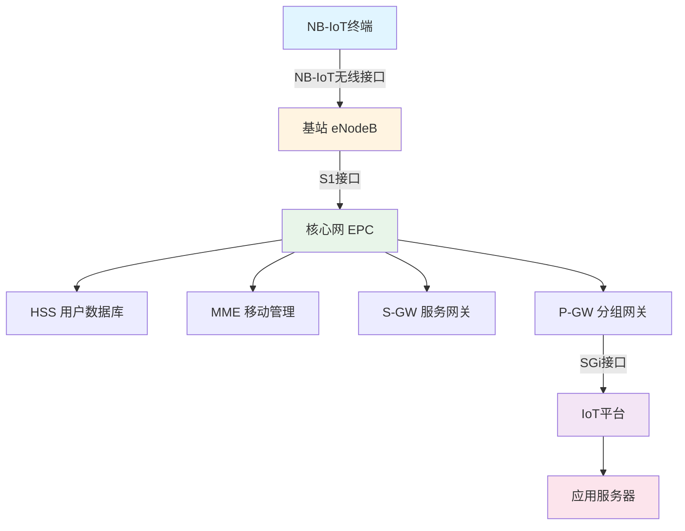
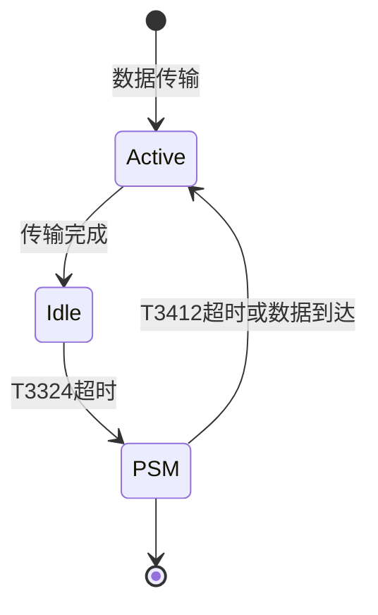

# NB-IoT窄带物联网技术详解


## 概述

NB-IoT（Narrowband Internet of Things，窄带物联网）是3GPP标准化组织定义的一种低功耗广域网（LPWAN）技术，专为物联网应用设计。它基于蜂窝网络，提供广覆盖、低功耗、低成本、大连接的特性。

完成本文学习后，你将能够：

- 理解NB-IoT技术的核心特点和优势
- 掌握NB-IoT网络架构和协议栈
- 了解NB-IoT模组的选择和使用方法
- 熟悉NB-IoT数据传输流程和AT命令
- 掌握NB-IoT应用开发的基本方法
- 了解NB-IoT在各行业的实际应用场景

## 背景知识

### 物联网通信技术的演进

**传统蜂窝网络的局限**：
- 2G/3G/4G：功耗高，成本高
- 不适合大规模、低速率的物联网应用
- 覆盖深度不足（地下室、管道等）

**LPWAN技术的兴起**：
- LoRa：非授权频段，私有网络
- Sigfox：专有技术，运营商网络
- NB-IoT：3GPP标准，运营商网络

**NB-IoT的诞生**：
- 2016年6月，3GPP Release 13标准冻结
- 基于LTE技术简化而来
- 利用现有蜂窝网络基础设施
- 运营商级的可靠性和安全性

### 为什么选择NB-IoT？

**技术优势**：
- 广覆盖：比GSM提升20dB，覆盖能力提升100倍
- 低功耗：电池寿命可达10年
- 低成本：模组成本低于5美元
- 大连接：单小区可支持5万连接
- 高安全：运营商级安全机制

**应用场景**：
- 智能抄表（水、电、气）
- 智慧停车
- 资产追踪
- 环境监测
- 智慧农业
- 智能家居


## NB-IoT技术特点

### 核心特性

#### 1. 广覆盖（Wide Coverage）

**覆盖增强**：
- 相比GSM提升20dB
- 覆盖能力提升100倍
- 可穿透地下室、管道等

**技术手段**：
- 重复传输（Repetition）
- 功率提升
- 低速率传输

**实际效果**：
```
GSM覆盖：室外良好，室内一般
NB-IoT覆盖：室外优秀，室内优秀，地下可达
```

#### 2. 低功耗（Low Power）

**功耗优化技术**：

**PSM（Power Saving Mode，省电模式）**：
- 设备进入深度睡眠
- 保持网络注册
- 功耗降至μA级别
- 唤醒后快速恢复

**eDRX（Extended Discontinuous Reception，扩展非连续接收）**：
- 延长睡眠周期
- 定期唤醒接收寻呼
- 平衡功耗和可达性

**电池寿命估算**：
```
假设：
- 电池容量：5Ah
- 每天上报1次数据
- 每次传输200字节
- 使用PSM模式

预期寿命：10年以上
```

#### 3. 低成本（Low Cost）

**成本优势**：
- 模组成本：<5美元（量产）
- 简化的基带处理
- 单天线设计
- 半双工通信
- 200kHz窄带宽

**对比其他技术**：
| 技术 | 模组成本 | 部署成本 | 运营成本 |
|------|---------|---------|---------|
| 2G/3G | $10-20 | 高 | 高 |
| 4G LTE | $20-50 | 高 | 高 |
| NB-IoT | $3-5 | 低 | 低 |
| LoRa | $5-10 | 中 | 无/低 |

#### 4. 大连接（Massive Connectivity）

**连接容量**：
- 单小区：50,000设备
- 单扇区：10,000-20,000设备
- 支持海量设备接入

**技术支撑**：
- 简化的信令流程
- 高效的资源调度
- 优化的随机接入


### 技术参数

#### 频段

**全球主要频段**：
- 中国：B5 (850MHz), B8 (900MHz)
- 欧洲：B8 (900MHz), B20 (800MHz)
- 美国：B2 (1900MHz), B4 (1700MHz), B12 (700MHz)
- 全球：B1, B3, B5, B8, B20, B28

#### 数据速率

**上行（Uplink）**：
- 单音：15.625 kbps
- 多音：62.5 kbps（12音）
- 典型：20-50 kbps

**下行（Downlink）**：
- 单PRB：21.25 kbps
- 典型：20-100 kbps

**对比**：
```
2G GSM：9.6-14.4 kbps
NB-IoT：20-250 kbps
4G LTE：1-100 Mbps
```

#### 延迟

**典型延迟**：
- 正常模式：1.6-10秒
- PSM模式：数秒到数小时（取决于配置）
- eDRX模式：数秒到数分钟

**不适合实时应用**：
- 不适合：实时控制、语音通话
- 适合：周期性数据上报、非实时监控

#### 移动性

**支持的移动速度**：
- 正常覆盖：<100 km/h
- 增强覆盖：<30 km/h

**应用场景**：
- 静止设备：智能表计、环境监测
- 低速移动：资产追踪、共享单车
- 不适合：高速移动场景

## NB-IoT网络架构

### 网络拓扑



### 网络组件

#### 1. 终端设备（UE, User Equipment）

**功能**：
- 数据采集和处理
- NB-IoT通信
- 电源管理
- 安全认证

**典型组成**：
```
MCU + NB-IoT模组 + 传感器 + 电池
```

#### 2. 基站（eNodeB）

**功能**：
- 无线资源管理
- 调度和分配
- 移动性管理
- 数据加密

**NB-IoT部署模式**：
- 独立部署（Standalone）
- 保护带部署（Guard Band）
- 带内部署（In-Band）

#### 3. 核心网（EPC, Evolved Packet Core）

**主要组件**：

**MME（Mobility Management Entity）**：
- 移动性管理
- 会话管理
- 用户认证

**S-GW（Serving Gateway）**：
- 数据路由
- 移动性锚点

**P-GW（PDN Gateway）**：
- 外部网络连接
- IP地址分配
- 计费和策略控制

**HSS（Home Subscriber Server）**：
- 用户数据存储
- 认证信息管理

#### 4. IoT平台

**功能**：
- 设备管理
- 数据处理
- 业务逻辑
- 应用接口


### 协议栈

NB-IoT协议栈基于LTE简化而来：

```
应用层    | CoAP, MQTT, HTTP, UDP, TCP
         |--------------------------------
传输层    | UDP, TCP
         |--------------------------------
网络层    | IP (IPv4/IPv6)
         |--------------------------------
数据链路层 | PDCP, RLC, MAC
         |--------------------------------
物理层    | NB-IoT Physical Layer
```

**关键协议**：
- **物理层**：OFDMA（下行）、SC-FDMA（上行）
- **MAC层**：资源调度、HARQ
- **RLC层**：分段重组、ARQ
- **PDCP层**：头压缩、加密
- **NAS层**：移动性管理、会话管理

## NB-IoT模组开发

### 常用模组

#### 主流厂商和型号

**中国移动**：
- M5310-A：移远通信
- M5311：中移物联
- ML302：中移物联

**中国联通**：
- BC95：海思
- BC26：移远通信
- SIM7020：芯讯通

**中国电信**：
- BC95：海思
- BC28：移远通信

**对比表**：
| 型号 | 厂商 | 频段 | 功耗 | 价格 | 特点 |
|------|------|------|------|------|------|
| BC95 | 海思 | B5/B8 | 低 | 低 | 成熟稳定 |
| BC26 | 移远 | B1/B3/B8/B20 | 低 | 中 | 多频段 |
| M5310-A | 移远 | B5/B8 | 低 | 低 | 移动定制 |
| SIM7020 | 芯讯通 | B1/B3/B5/B8 | 极低 | 中 | 超低功耗 |

### 硬件接口

#### 典型接口

**电源**：
- VCC：3.3V-4.2V
- VBAT：电池供电
- GND：地

**串口（UART）**：
- TXD：发送
- RXD：接收
- 波特率：9600-115200 bps

**控制引脚**：
- RESET：复位
- PWRKEY：开机
- STATUS：状态指示

**SIM卡接口**：
- SIM_VDD, SIM_RST, SIM_CLK, SIM_DATA

#### 硬件连接示例

```
MCU (STM32)          NB-IoT模组 (BC95)
-----------          ------------------
3.3V     ----------> VCC
GND      ----------> GND
PA9(TX)  ----------> RXD
PA10(RX) ----------> TXD
PB0      ----------> RESET
PB1      ----------> PWRKEY
```

**电路设计要点**：
- 电源去耦：100nF + 10uF电容
- ESD保护：TVS二极管
- 天线匹配：50Ω阻抗匹配
- SIM卡保护：ESD保护


### AT命令开发

#### 基本AT命令

**模组控制**：
```
AT                    // 测试命令
AT+CFUN=1            // 设置功能模式（1=全功能）
AT+CIMI              // 查询IMSI
AT+CGSN              // 查询IMEI
AT+CGMR              // 查询固件版本
AT+CSQ               // 查询信号强度
```

**网络注册**：
```
AT+CGATT=1           // 附着到网络
AT+CGATT?            // 查询附着状态
AT+CEREG=1           // 启用网络注册URC
AT+CEREG?            // 查询注册状态
AT+COPS?             // 查询运营商
```

**数据传输**：
```
// UDP通信
AT+NSOCR=DGRAM,17,5683,1    // 创建UDP socket
AT+NSOST=0,180.101.147.115,5683,4,48656C6C6F  // 发送数据
AT+NSORF=0,512               // 接收数据
AT+NSOCL=0                   // 关闭socket

// CoAP通信
AT+NCDP=180.101.147.115,5683  // 配置CDP服务器
AT+NMGS=4,48656C6C6F          // 发送CoAP消息
AT+NMGR                       // 接收CoAP消息
```

**电源管理**：
```
AT+CPSMS=1,"","","00000001","00000001"  // 配置PSM
AT+CEDRXS=1,5,"0001"                    // 配置eDRX
AT+NPSMR=1                              // 启用PSM URC
```

#### 代码示例

**Arduino + BC95模组**：

```cpp
#include <SoftwareSerial.h>

// 定义串口
SoftwareSerial nbiot(10, 11); // RX, TX

void setup() {
    Serial.begin(9600);
    nbiot.begin(9600);
    
    Serial.println("NB-IoT初始化...");
    
    // 测试AT命令
    sendAT("AT");
    delay(1000);
    
    // 查询IMEI
    sendAT("AT+CGSN");
    delay(1000);
    
    // 附着网络
    sendAT("AT+CGATT=1");
    delay(5000);
    
    // 等待注册
    while (!isRegistered()) {
        Serial.println("等待网络注册...");
        delay(2000);
    }
    
    Serial.println("网络注册成功！");
}

void loop() {
    // 发送数据
    sendData("Hello NB-IoT!");
    delay(60000); // 每分钟发送一次
}

void sendAT(String cmd) {
    Serial.print("发送: ");
    Serial.println(cmd);
    nbiot.println(cmd);
    delay(500);
    
    while (nbiot.available()) {
        String response = nbiot.readString();
        Serial.print("响应: ");
        Serial.println(response);
    }
}

bool isRegistered() {
    nbiot.println("AT+CEREG?");
    delay(500);
    
    while (nbiot.available()) {
        String response = nbiot.readString();
        if (response.indexOf("+CEREG: 0,1") > 0 || 
            response.indexOf("+CEREG: 0,5") > 0) {
            return true;
        }
    }
    return false;
}

void sendData(String data) {
    // 创建UDP socket
    sendAT("AT+NSOCR=DGRAM,17,5683,1");
    delay(1000);
    
    // 转换为十六进制
    String hexData = "";
    for (int i = 0; i < data.length(); i++) {
        char c = data.charAt(i);
        hexData += String(c, HEX);
    }
    
    // 发送数据
    String cmd = "AT+NSOST=0,180.101.147.115,5683," + 
                 String(data.length()) + "," + hexData;
    sendAT(cmd);
    delay(2000);
    
    // 关闭socket
    sendAT("AT+NSOCL=0");
}
```

**STM32 + BC95模组**：

```c
#include "stm32f1xx_hal.h"
#include <string.h>
#include <stdio.h>

extern UART_HandleTypeDef huart1; // NB-IoT模组
extern UART_HandleTypeDef huart2; // 调试串口

#define NBIOT_UART &huart1
#define DEBUG_UART &huart2

uint8_t rx_buffer[256];
uint8_t rx_index = 0;

// 发送AT命令
void NB_SendAT(char* cmd) {
    HAL_UART_Transmit(NBIOT_UART, (uint8_t*)cmd, strlen(cmd), 1000);
    HAL_UART_Transmit(NBIOT_UART, (uint8_t*)"\r\n", 2, 1000);
}

// 等待响应
bool NB_WaitResponse(char* expected, uint32_t timeout) {
    uint32_t start = HAL_GetTick();
    rx_index = 0;
    memset(rx_buffer, 0, sizeof(rx_buffer));
    
    while (HAL_GetTick() - start < timeout) {
        if (HAL_UART_Receive(NBIOT_UART, &rx_buffer[rx_index], 1, 100) == HAL_OK) {
            rx_index++;
            if (strstr((char*)rx_buffer, expected) != NULL) {
                return true;
            }
        }
    }
    return false;
}

// 初始化NB-IoT
bool NB_Init(void) {
    // 测试AT
    NB_SendAT("AT");
    if (!NB_WaitResponse("OK", 1000)) {
        return false;
    }
    
    // 附着网络
    NB_SendAT("AT+CGATT=1");
    HAL_Delay(5000);
    
    // 等待注册
    for (int i = 0; i < 30; i++) {
        NB_SendAT("AT+CEREG?");
        if (NB_WaitResponse("+CEREG: 0,1", 2000) || 
            NB_WaitResponse("+CEREG: 0,5", 2000)) {
            return true;
        }
        HAL_Delay(2000);
    }
    
    return false;
}

// 发送数据
bool NB_SendData(uint8_t* data, uint16_t len) {
    char cmd[256];
    char hex_data[512];
    
    // 转换为十六进制
    for (int i = 0; i < len; i++) {
        sprintf(&hex_data[i*2], "%02X", data[i]);
    }
    
    // 创建socket
    NB_SendAT("AT+NSOCR=DGRAM,17,5683,1");
    if (!NB_WaitResponse("OK", 5000)) {
        return false;
    }
    
    // 发送数据
    sprintf(cmd, "AT+NSOST=0,180.101.147.115,5683,%d,%s", len, hex_data);
    NB_SendAT(cmd);
    if (!NB_WaitResponse("OK", 10000)) {
        return false;
    }
    
    // 关闭socket
    NB_SendAT("AT+NSOCL=0");
    NB_WaitResponse("OK", 2000);
    
    return true;
}

int main(void) {
    HAL_Init();
    SystemClock_Config();
    MX_GPIO_Init();
    MX_USART1_UART_Init();
    MX_USART2_UART_Init();
    
    // 初始化NB-IoT
    if (NB_Init()) {
        char msg[] = "Debug: NB-IoT初始化成功\r\n";
        HAL_UART_Transmit(DEBUG_UART, (uint8_t*)msg, strlen(msg), 1000);
    } else {
        char msg[] = "Debug: NB-IoT初始化失败\r\n";
        HAL_UART_Transmit(DEBUG_UART, (uint8_t*)msg, strlen(msg), 1000);
    }
    
    while (1) {
        // 发送数据
        uint8_t data[] = "Hello NB-IoT!";
        if (NB_SendData(data, sizeof(data)-1)) {
            char msg[] = "Debug: 数据发送成功\r\n";
            HAL_UART_Transmit(DEBUG_UART, (uint8_t*)msg, strlen(msg), 1000);
        }
        
        HAL_Delay(60000); // 每分钟发送一次
    }
}
```


## 数据传输协议

### CoAP协议

CoAP（Constrained Application Protocol）是NB-IoT推荐的应用层协议。

**特点**：
- 基于UDP
- 轻量级
- 支持资源发现
- 支持观察模式
- 适合受限设备

**消息类型**：
- CON（Confirmable）：需要确认
- NON（Non-confirmable）：不需要确认
- ACK（Acknowledgement）：确认消息
- RST（Reset）：重置消息

**CoAP vs HTTP**：
| 特性 | CoAP | HTTP |
|------|------|------|
| 传输层 | UDP | TCP |
| 消息大小 | 小 | 大 |
| 开销 | 低 | 高 |
| 可靠性 | 可选 | 内置 |
| 适用场景 | IoT | Web |

**CoAP示例**：
```
// CoAP请求
CON POST coap://server:5683/data
Payload: {"temp":25.5,"hum":60}

// CoAP响应
ACK 2.01 Created
```

### MQTT协议

MQTT也可用于NB-IoT，但需要TCP连接。

**优点**：
- 发布/订阅模式
- QoS保证
- 遗嘱消息
- 保持连接

**缺点**：
- 基于TCP，开销较大
- 需要保持连接，功耗较高

**使用建议**：
- 需要双向通信时使用
- 需要QoS保证时使用
- 对功耗不敏感时使用

### UDP/TCP直连

**UDP**：
- 无连接
- 开销小
- 适合单向上报
- 不保证可靠性

**TCP**：
- 面向连接
- 可靠传输
- 开销大
- 功耗高

**选择建议**：
```
周期性上报 → CoAP over UDP
双向通信 → MQTT over TCP
简单上报 → UDP直连
可靠传输 → TCP直连
```

## 电源管理

### PSM模式

PSM（Power Saving Mode）是NB-IoT最重要的省电技术。

**工作原理**：


**关键定时器**：

**T3324（Active Timer）**：
- 范围：2秒 - 31分钟
- 作用：保持活动状态，可接收下行数据
- 建议：根据应用需求配置

**T3412（TAU Timer）**：
- 范围：2分钟 - 413天
- 作用：PSM睡眠时间
- 建议：尽可能长，降低功耗

**配置示例**：
```
// 配置PSM
// T3324 = 10秒, T3412 = 24小时
AT+CPSMS=1,"","","00000101","00100100"

// 参数格式（二进制编码）
// T3324: 00000101 = 5 * 2秒 = 10秒
// T3412: 00100100 = 36 * 1小时 = 36小时
```

**功耗对比**：
| 状态 | 功耗 | 说明 |
|------|------|------|
| 发送 | 200-300 mA | 峰值功耗 |
| 接收 | 50-100 mA | 接收数据 |
| Idle | 5-10 mA | 空闲状态 |
| PSM | 3-5 μA | 深度睡眠 |

### eDRX模式

eDRX（Extended Discontinuous Reception）在PSM和正常模式之间。

**工作原理**：
- 周期性唤醒接收寻呼
- 睡眠时间可配置
- 平衡功耗和可达性

**配置示例**：
```
// 配置eDRX
// eDRX周期 = 81.92秒
AT+CEDRXS=1,5,"0101"

// 参数说明
// 1: 启用eDRX
// 5: NB-IoT模式
// "0101": eDRX周期（二进制编码）
```

**PSM vs eDRX**：
| 特性 | PSM | eDRX |
|------|-----|------|
| 功耗 | 最低 | 中等 |
| 可达性 | 低 | 中等 |
| 延迟 | 高 | 中等 |
| 适用场景 | 周期上报 | 需要下行 |

### 功耗优化建议

**硬件优化**：
- 选择低功耗MCU
- 优化电源管理电路
- 使用高效DC-DC转换器
- 关闭不用的外设

**软件优化**：
- 启用PSM模式
- 减少发送频率
- 批量发送数据
- 优化数据格式
- 快速完成传输

**实际案例**：
```
应用：智能水表
需求：每天上报一次
配置：
- PSM: T3324=10秒, T3412=24小时
- 数据量：50字节
- 电池：3.6V 19Ah

预期寿命：
- 平均功耗：约20μA
- 电池寿命：19000mAh / 0.02mA ≈ 950,000小时 ≈ 108年
- 实际寿命：10-15年（考虑电池自放电）
```


## 应用场景

### 智能抄表

**应用**：
- 智能水表
- 智能电表
- 智能燃气表

**优势**：
- 无需人工抄表
- 实时监控用量
- 异常告警
- 远程控制

**典型方案**：
```
水表 + NB-IoT模组 → 基站 → 运营商网络 → 抄表平台
    ↓
每天上报用量、电池电压、阀门状态
```

**技术要点**：
- 超低功耗：电池寿命10年
- 深度覆盖：地下室、管道井
- 大连接：小区数万水表
- 安全可靠：运营商级安全

### 智慧停车

**应用**：
- 路边停车位检测
- 停车场管理
- 车位引导

**检测方式**：
- 地磁传感器
- 超声波传感器
- 视频识别

**NB-IoT方案**：
```
地磁传感器 → NB-IoT模组 → 停车管理平台
    ↓
实时上报车位占用状态
```

**优势**：
- 无需布线
- 低功耗（电池5-10年）
- 广覆盖（地下停车场）
- 低成本

### 资产追踪

**应用**：
- 物流追踪
- 共享单车
- 宠物追踪
- 贵重物品

**功能**：
- 位置定位（GPS + NB-IoT）
- 状态监控
- 轨迹记录
- 电子围栏

**方案**：
```
GPS模块 + NB-IoT模组 + 电池
    ↓
定期上报位置、速度、电量
```

**技术特点**：
- 全国覆盖
- 低功耗
- 移动性支持
- 数据安全

### 环境监测

**应用**：
- 空气质量监测
- 水质监测
- 噪音监测
- 气象监测

**监测参数**：
- PM2.5、PM10
- 温度、湿度
- CO2、VOC
- 噪音分贝

**部署方案**：
```
传感器阵列 → NB-IoT模组 → 环境监测平台
    ↓
每小时上报监测数据
```

**优势**：
- 广域覆盖
- 无需布线
- 低维护
- 数据可靠

### 智慧农业

**应用**：
- 土壤监测
- 灌溉控制
- 温室管理
- 畜牧监控

**监测内容**：
- 土壤湿度、温度
- 光照强度
- 空气温湿度
- 水位、流量

**控制功能**：
- 自动灌溉
- 通风控制
- 施肥控制

**方案优势**：
- 覆盖大面积农田
- 电池供电
- 低维护成本
- 数据驱动决策

### 智能家居

**应用**：
- 智能门锁
- 烟雾报警器
- 水浸传感器
- 智能插座

**NB-IoT优势**：
- 无需WiFi
- 低功耗
- 稳定可靠
- 运营商级安全

**典型产品**：
```
智能门锁：
- 远程开锁
- 开锁记录
- 异常告警
- 电池寿命1-2年
```

## NB-IoT vs 其他技术

### 技术对比

| 特性 | NB-IoT | LoRa | 2G/3G | 4G LTE | WiFi |
|------|--------|------|-------|--------|------|
| 覆盖范围 | 1-10km | 2-15km | 1-10km | 1-5km | <100m |
| 数据速率 | 20-250kbps | 0.3-50kbps | 10-100kbps | 1-100Mbps | 1-100Mbps |
| 功耗 | 极低 | 极低 | 中 | 高 | 高 |
| 电池寿命 | 10年 | 5-10年 | 1-2年 | 天-周 | 天-周 |
| 部署成本 | 低 | 低 | 中 | 高 | 低 |
| 运营成本 | 低 | 无/低 | 高 | 高 | 无 |
| 网络类型 | 运营商 | 私有/公共 | 运营商 | 运营商 | 私有 |
| 移动性 | 支持 | 有限 | 支持 | 支持 | 有限 |
| 安全性 | 高 | 中 | 高 | 高 | 中 |
| 标准化 | 3GPP | LoRa Alliance | 3GPP | 3GPP | IEEE |

### 选择建议

**选择NB-IoT的场景**：
- 需要运营商级可靠性
- 需要全国/全球覆盖
- 需要移动性支持
- 对安全性要求高
- 可接受运营费用
- 数据量小（<1KB/次）

**选择LoRa的场景**：
- 需要私有网络控制
- 对成本极度敏感
- 无运营商网络覆盖
- 不需要移动性
- 可自建网络

**选择4G的场景**：
- 需要高数据速率
- 需要实时通信
- 有稳定电源
- 对功耗不敏感

**选择WiFi的场景**：
- 短距离通信
- 需要高速率
- 有WiFi网络覆盖
- 有稳定电源

## 最佳实践

### 设备设计

#### 1. 天线设计

**天线类型**：
- PCB天线：成本低，性能一般
- 陶瓷天线：体积小，性能好
- 弹簧天线：灵活，性能中等
- 外置天线：性能最好，成本高

**设计要点**：
- 50Ω阻抗匹配
- 远离金属和干扰源
- 预留调试空间
- 考虑外壳影响

#### 2. 电源设计

**电源要求**：
- 电压：3.3V-4.2V
- 峰值电流：>500mA
- 纹波：<100mV

**设计建议**：
- 使用大容量电容（100μF以上）
- 低ESR电容
- 短而粗的电源线
- 独立的电源平面

#### 3. SIM卡选择

**SIM卡类型**：
- 标准SIM卡：可更换
- 贴片SIM卡：焊接固定
- eSIM：嵌入式

**运营商选择**：
- 中国移动：覆盖广，价格适中
- 中国联通：价格低，覆盖中等
- 中国电信：覆盖中等，价格适中

**套餐选择**：
```
按流量计费：
- 10MB/年：适合低频上报
- 30MB/年：适合中频上报
- 100MB/年：适合高频上报

按连接数计费：
- 适合大规模部署
- 成本可预测
```

### 软件开发

#### 1. 网络注册优化

**快速注册**：
```c
// 1. 禁用不必要的功能
AT+CFUN=0        // 关闭射频
AT+NCONFIG=...   // 配置参数
AT+CFUN=1        // 开启射频

// 2. 指定运营商
AT+COPS=1,2,"46000"  // 中国移动

// 3. 启用快速注册
AT+NCONFIG="AUTOCONNECT","TRUE"
```

**注册检查**：
```c
bool waitForRegistration(uint32_t timeout) {
    uint32_t start = HAL_GetTick();
    
    while (HAL_GetTick() - start < timeout) {
        sendAT("AT+CEREG?");
        if (waitResponse("+CEREG: 0,1", 2000) || 
            waitResponse("+CEREG: 0,5", 2000)) {
            return true;
        }
        HAL_Delay(2000);
    }
    return false;
}
```

#### 2. 数据传输优化

**批量发送**：
```c
// 不推荐：频繁发送小数据
for (int i = 0; i < 10; i++) {
    sendData(data[i], 10);
    delay(1000);
}

// 推荐：批量发送
uint8_t buffer[100];
int len = 0;
for (int i = 0; i < 10; i++) {
    memcpy(&buffer[len], data[i], 10);
    len += 10;
}
sendData(buffer, len);
```

**数据压缩**：
```c
// 不推荐：JSON格式
char json[100];
sprintf(json, "{\"temp\":%.1f,\"hum\":%d}", temp, hum);
// 约30字节

// 推荐：二进制格式
uint8_t data[4];
int16_t temp_int = (int16_t)(temp * 10);
data[0] = (temp_int >> 8) & 0xFF;
data[1] = temp_int & 0xFF;
data[2] = hum;
data[3] = checksum(data, 3);
// 只需4字节
```

#### 3. 错误处理

**重试机制**：
```c
bool sendDataWithRetry(uint8_t* data, uint16_t len, uint8_t maxRetries) {
    for (uint8_t i = 0; i < maxRetries; i++) {
        if (sendData(data, len)) {
            return true;
        }
        
        // 指数退避
        HAL_Delay(1000 * (1 << i));
        
        // 检查网络状态
        if (!isRegistered()) {
            // 重新注册
            reRegister();
        }
    }
    return false;
}
```

**异常恢复**：
```c
void handleError(ErrorType error) {
    switch (error) {
        case ERROR_NO_RESPONSE:
            // 模组无响应，复位
            resetModule();
            break;
            
        case ERROR_NOT_REGISTERED:
            // 未注册，重新注册
            reRegister();
            break;
            
        case ERROR_SEND_FAILED:
            // 发送失败，重试
            retryLastSend();
            break;
            
        default:
            // 未知错误，记录日志
            logError(error);
            break;
    }
}
```

### 测试和调试

#### 1. 信号测试

**信号强度检查**：
```
AT+CSQ
// 响应：+CSQ: 25,99
// 25: RSSI值（0-31，越大越好）
// 99: BER（未知）

RSSI对照：
0-9: 差
10-14: 一般
15-19: 良好
20-31: 优秀
```

**覆盖等级**：
```
AT+NUESTATS
// 响应：
// Signal power: -75 dBm
// Total power: -65 dBm
// TX power: 23 dBm
// Cell ID: 12345
```

#### 2. 数据传输测试

**回环测试**：
```
1. 搭建测试服务器
2. 设备发送数据
3. 服务器回显数据
4. 设备接收并验证
```

**压力测试**：
```
1. 连续发送大量数据
2. 监控成功率
3. 记录失败情况
4. 分析失败原因
```

#### 3. 功耗测试

**测试方法**：
```
1. 使用电流表或功耗分析仪
2. 测量各状态功耗：
   - 发送峰值
   - 接收功耗
   - 空闲功耗
   - PSM功耗
3. 计算平均功耗
4. 估算电池寿命
```

**功耗计算**：
```
平均功耗 = (发送功耗 × 发送时间 + 
           接收功耗 × 接收时间 + 
           空闲功耗 × 空闲时间 + 
           PSM功耗 × PSM时间) / 总时间

电池寿命 = 电池容量 / 平均功耗
```


## 常见问题

### Q1: NB-IoT需要SIM卡吗？

**A**: 是的，NB-IoT需要专用的物联网SIM卡。

**SIM卡类型**：
- 标准SIM卡：可更换
- 贴片SIM卡：焊接固定
- eSIM：嵌入式SIM

**与普通SIM卡的区别**：
- 物联网专用套餐
- 按流量或连接数计费
- 支持多年有效期
- 工业级温度范围

**获取方式**：
- 运营商营业厅
- 物联网平台
- 模组厂商

### Q2: NB-IoT的数据费用是多少？

**A**: 费用因运营商和套餐而异。

**典型套餐**（2024年参考）：
- 10MB/年：约20-30元
- 30MB/年：约40-60元
- 100MB/年：约80-120元

**计费方式**：
- 按流量计费：适合不确定用量
- 按连接数计费：适合大规模部署
- 包年套餐：成本可预测

**成本估算**：
```
应用：智能水表
数据量：每天50字节
年流量：50 × 365 = 18,250字节 ≈ 18KB
套餐选择：10MB/年套餐
年费用：约20-30元
```

### Q3: NB-IoT的覆盖范围有多大？

**A**: 覆盖范围取决于多个因素。

**典型覆盖**：
- 城市环境：1-5公里
- 郊区环境：5-10公里
- 开阔地：10-15公里

**覆盖增强**：
- 相比GSM提升20dB
- 可穿透地下室、管道
- 深度覆盖能力强

**影响因素**：
- 基站位置和功率
- 环境遮挡
- 设备天线
- 发射功率

### Q4: NB-IoT支持语音通话吗？

**A**: 不支持。

**原因**：
- NB-IoT是数据专用网络
- 不支持电路域
- 延迟较高（秒级）
- 数据速率低

**替代方案**：
- 需要语音：使用2G/3G/4G
- 只需数据：使用NB-IoT

### Q5: NB-IoT可以移动使用吗？

**A**: 支持，但有限制。

**支持的移动速度**：
- 正常覆盖：<100 km/h
- 增强覆盖：<30 km/h

**适用场景**：
- 静止设备：智能表计、环境监测
- 低速移动：资产追踪、共享单车
- 不适合：高速移动（高铁、高速公路）

**切换支持**：
- 支持小区切换
- 切换过程可能丢失数据
- 建议在静止时传输重要数据

### Q6: NB-IoT的延迟是多少？

**A**: 延迟较高，不适合实时应用。

**典型延迟**：
- 正常模式：1.6-10秒
- PSM模式：数秒到数小时
- eDRX模式：数秒到数分钟

**延迟来源**：
- 随机接入过程
- 数据传输时间
- 网络处理时间
- 省电模式唤醒时间

**适用场景**：
- 适合：周期性数据上报、非实时监控
- 不适合：实时控制、语音通话、视频传输

### Q7: NB-IoT和eMTC有什么区别？

**A**: 两者都是3GPP定义的物联网技术，但定位不同。

| 特性 | NB-IoT | eMTC (LTE-M) |
|------|--------|--------------|
| 带宽 | 200 kHz | 1.4 MHz |
| 数据速率 | 20-250 kbps | 200 kbps-1 Mbps |
| 延迟 | 1.6-10秒 | <100ms |
| 移动性 | 有限 | 良好 |
| 语音 | 不支持 | 支持VoLTE |
| 功耗 | 极低 | 低 |
| 成本 | 低 | 中 |
| 覆盖 | 优秀 | 良好 |

**选择建议**：
- NB-IoT：静态、低速率、超低功耗
- eMTC：移动、中速率、需要语音

**中国部署情况**：
- NB-IoT：三大运营商全面部署
- eMTC：部署较少

### Q8: NB-IoT的安全性如何？

**A**: NB-IoT采用运营商级安全机制。

**安全特性**：
- SIM卡认证
- 空口加密
- 完整性保护
- 密钥管理

**安全机制**：
```
1. 双向认证
   设备 ←→ 网络

2. 加密算法
   - 128位AES加密
   - SNOW 3G算法

3. 完整性保护
   - 防篡改
   - 防重放
```

**应用层安全**：
- 建议使用DTLS/TLS
- 数据加密
- 证书认证

### Q9: 如何选择NB-IoT模组？

**A**: 根据应用需求选择。

**考虑因素**：

**1. 频段支持**：
- 确认运营商频段
- 多频段支持更灵活

**2. 功耗**：
- 查看数据手册
- 实测PSM功耗
- 考虑电池寿命

**3. 成本**：
- 模组价格
- 开发成本
- 认证费用

**4. 生态**：
- 技术支持
- 开发资料
- 社区活跃度

**5. 认证**：
- 运营商认证
- 入网许可
- 国际认证

**推荐模组**：
- 入门：BC95（海思）
- 通用：BC26（移远）
- 低功耗：SIM7020（芯讯通）
- 多频段：BC28（移远）

### Q10: NB-IoT开发需要哪些工具？

**A**: 基本开发工具包括：

**硬件工具**：
- NB-IoT开发板或模组
- USB转串口工具
- 电源（3.3V-4.2V）
- 天线
- SIM卡

**软件工具**：
- 串口调试工具（如SSCOM）
- AT命令手册
- 开发IDE（Arduino IDE、Keil、IAR等）
- 网络抓包工具（Wireshark）

**测试工具**：
- 信号测试工具
- 功耗测试仪
- 网络测试平台

**云平台**：
- 运营商IoT平台
- 第三方IoT平台
- 自建服务器

## 总结

通过本文，你学习了：

- ✅ NB-IoT技术的核心特点（广覆盖、低功耗、低成本、大连接）
- ✅ NB-IoT网络架构和协议栈
- ✅ NB-IoT模组的选择和硬件接口
- ✅ AT命令的使用和代码开发
- ✅ 数据传输协议（CoAP、MQTT、UDP/TCP）
- ✅ 电源管理技术（PSM、eDRX）
- ✅ NB-IoT在各行业的实际应用
- ✅ 开发和调试的最佳实践

**核心要点**：
- NB-IoT是运营商级的物联网技术，提供可靠的广域覆盖
- PSM模式是实现超低功耗的关键技术
- 选择合适的数据传输协议对应用至关重要
- 网络注册和数据传输优化是开发的重点
- NB-IoT适合静态、低速率、低功耗的物联网应用

## 进阶学习

### 实践项目建议

1. **项目1：NB-IoT温湿度监测系统**
   - 使用STM32 + BC95模组
   - 连接DHT22传感器
   - 实现数据上报到云平台
   - 配置PSM省电模式

2. **项目2：NB-IoT智能门锁**
   - 实现远程开锁
   - 上报开锁记录
   - 异常告警
   - 低功耗设计

3. **项目3：NB-IoT资产追踪器**
   - GPS定位
   - NB-IoT数据传输
   - 轨迹记录
   - 电子围栏

### 深入学习资源

**官方文档**：
1. [3GPP NB-IoT规范](https://www.3gpp.org/)
2. [GSMA NB-IoT部署指南](https://www.gsma.com/)
3. [中国移动OneNET平台](https://open.iot.10086.cn/)
4. [中国电信天翼物联网平台](https://www.ctwing.cn/)

**模组厂商资源**：
1. [移远通信](https://www.quectel.com/)
2. [海思半导体](https://www.hisilicon.com/)
3. [芯讯通](https://www.simcom.com/)
4. [中移物联](https://www.chinamobileltd.com/)

**开发工具**：
1. [Arduino NB-IoT库](https://github.com/arduino-libraries/MKRNB)
2. [STM32 X-CUBE-CELLULAR](https://www.st.com/)
3. [AT命令测试工具](https://m2msupport.net/m2msupport/atcommand-tester/)

**在线课程**：
1. 3GPP NB-IoT技术培训
2. 运营商物联网开发课程
3. Coursera物联网专项课程

**社区和论坛**：
1. [GSMA IoT论坛](https://www.gsma.com/iot/)
2. [中国移动开发者社区](https://open.iot.10086.cn/)
3. [物联网技术论坛](https://www.iot-online.com/)

### 相关技术

继续学习以下相关技术：

1. **LoRa/LoRaWAN** - 了解非授权频段的LPWAN技术
2. **5G技术** - 学习下一代蜂窝网络
3. **CoAP协议** - 深入学习物联网应用层协议
4. **MQTT协议** - 学习发布/订阅模式
5. **云平台接入** - 学习各大IoT平台的使用

## 参考资料

### 技术规范

1. 3GPP TS 36.211 - NB-IoT物理层规范
2. 3GPP TS 36.213 - NB-IoT物理层过程
3. 3GPP TS 36.331 - NB-IoT RRC协议
4. 3GPP TS 24.301 - NB-IoT NAS协议

### 应用指南

1. GSMA NB-IoT部署指南
2. NB-IoT设备开发指南
3. NB-IoT功耗优化指南
4. NB-IoT安全最佳实践

### 标准文档

1. 3GPP Release 13 - NB-IoT标准
2. 3GPP Release 14 - NB-IoT增强
3. 3GPP Release 15 - NB-IoT进一步增强
4. OneM2M - IoT标准化

### 测试工具

1. **硬件工具**：
   - 频谱分析仪
   - 网络分析仪
   - 功耗分析仪

2. **软件工具**：
   - AT命令测试工具
   - 网络抓包工具
   - IoT平台测试工具

### 厂商资源

1. **移远通信**：
   - BC95/BC26开发资料
   - AT命令手册
   - 应用笔记

2. **海思半导体**：
   - Boudica系列芯片
   - 开发套件
   - 技术支持

3. **芯讯通**：
   - SIM7020系列
   - 开发工具
   - 参考设计

## 附录

### A. NB-IoT频段对照表

| 区域 | Band | 频段 | 上行 | 下行 |
|------|------|------|------|------|
| 中国 | B5 | 850 MHz | 824-849 MHz | 869-894 MHz |
| 中国 | B8 | 900 MHz | 880-915 MHz | 925-960 MHz |
| 欧洲 | B8 | 900 MHz | 880-915 MHz | 925-960 MHz |
| 欧洲 | B20 | 800 MHz | 832-862 MHz | 791-821 MHz |
| 美国 | B2 | 1900 MHz | 1850-1910 MHz | 1930-1990 MHz |
| 美国 | B4 | 1700 MHz | 1710-1755 MHz | 2110-2155 MHz |

### B. AT命令速查表

**基本命令**：
```
AT                    // 测试
AT+CFUN=1            // 全功能模式
AT+CIMI              // 查询IMSI
AT+CGSN              // 查询IMEI
AT+CSQ               // 信号强度
```

**网络命令**：
```
AT+CGATT=1           // 附着网络
AT+CEREG?            // 注册状态
AT+COPS?             // 运营商
AT+CGPADDR           // IP地址
```

**数据命令**：
```
AT+NSOCR=DGRAM,17,5683,1  // 创建socket
AT+NSOST=0,IP,PORT,LEN,DATA  // 发送数据
AT+NSORF=0,512       // 接收数据
AT+NSOCL=0           // 关闭socket
```

**电源命令**：
```
AT+CPSMS=1,"","","T3324","T3412"  // 配置PSM
AT+CEDRXS=1,5,"eDRX"              // 配置eDRX
AT+NPSMR=1                        // PSM URC
```

### C. 错误码对照表

| 错误码 | 说明 | 解决方法 |
|--------|------|----------|
| +CME ERROR: 3 | 操作不允许 | 检查命令格式 |
| +CME ERROR: 10 | SIM卡未插入 | 检查SIM卡 |
| +CME ERROR: 13 | SIM卡故障 | 更换SIM卡 |
| +CME ERROR: 30 | 网络故障 | 检查网络覆盖 |
| +CME ERROR: 100 | 未知错误 | 复位模组 |

### D. 功耗参考值

| 状态 | 典型功耗 | 峰值功耗 |
|------|---------|---------|
| 发送（23dBm） | 220 mA | 300 mA |
| 接收 | 50 mA | 100 mA |
| Idle | 5 mA | 10 mA |
| PSM | 3 μA | 5 μA |
| 关机 | 1 μA | 2 μA |

---

**文档更新日志**：
- v1.0 (2026-03-08): 初始版本发布

**反馈与贡献**：
- 发现错误或有改进建议，欢迎提交Issue
- 想要分享你的NB-IoT项目，欢迎投稿
- 有问题可在评论区讨论

**版权声明**：
本文档采用 CC BY-NC-SA 4.0 许可协议，欢迎分享和改编，但请注明出处。
