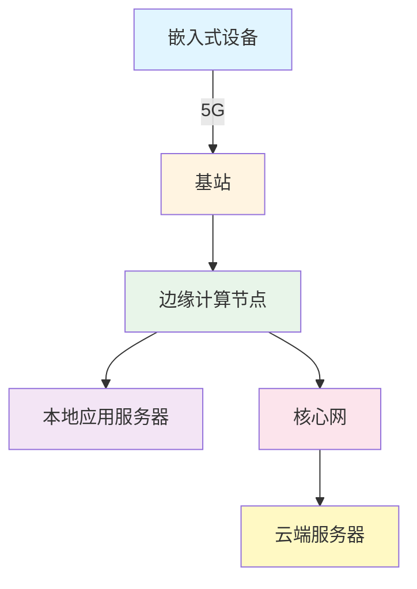
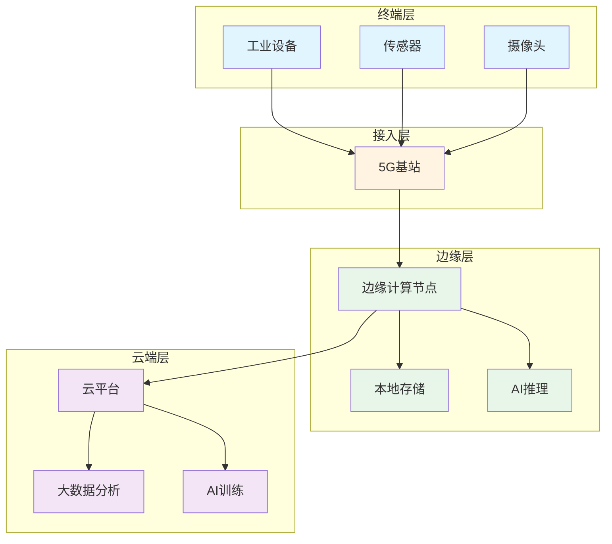

# 5G技术在嵌入式系统中的应用


## 概述

5G（第五代移动通信技术）不仅是消费者移动通信的升级，更是工业物联网和嵌入式系统的重要技术革新。5G提供的超高速率、超低延迟和海量连接能力，为嵌入式应用开辟了全新的可能性。

完成本文学习后，你将能够：

- 理解5G技术的核心特性和关键指标
- 掌握5G在嵌入式系统中的应用场景
- 了解边缘计算与5G的结合
- 熟悉5G模组的选择和集成方法
- 掌握5G低延迟应用的开发要点
- 了解5G技术的发展趋势和应用前景

## 背景知识

### 移动通信技术的演进

**1G到4G的发展**：
- **1G（1980s）**：模拟语音通信
- **2G（1990s）**：数字语音 + 短信（GSM）
- **3G（2000s）**：移动互联网（WCDMA、CDMA2000）
- **4G（2010s）**：高速移动宽带（LTE）

**4G的局限**：
- 延迟：30-50ms，不适合实时控制
- 连接密度：每平方公里10万设备
- 移动性：高速移动场景性能下降
- 能效：物联网设备功耗较高

**5G的突破**：
- 超高速率：峰值20 Gbps
- 超低延迟：1ms以下
- 海量连接：每平方公里100万设备
- 高可靠性：99.999%可用性
- 低功耗：支持10年电池寿命

### 为什么嵌入式系统需要5G？

**工业4.0需求**：
- 实时控制和监测
- 大规模设备互联
- 高可靠性要求
- 灵活的网络部署

**传统技术的不足**：
- WiFi：覆盖范围有限，移动性差
- 4G：延迟高，不适合实时应用
- 有线连接：部署成本高，灵活性差

**5G的优势**：
- 满足实时控制需求（<1ms延迟）
- 支持大规模设备连接
- 提供高可靠性保障
- 支持灵活的网络切片


## 5G技术特性

### 三大应用场景

5G定义了三大典型应用场景：

#### 1. eMBB（增强移动宽带）

**Enhanced Mobile Broadband**

**特点**：
- 峰值速率：20 Gbps（下行）、10 Gbps（上行）
- 用户体验速率：100 Mbps - 1 Gbps
- 频谱效率：4G的3倍
- 移动性：500 km/h

**嵌入式应用**：
- 高清视频监控
- AR/VR设备
- 无人机图传
- 车载娱乐系统

**技术特征**：
```
高带宽 + 中等延迟 + 高移动性
适合：数据密集型应用
```

#### 2. uRLLC（超可靠低延迟通信）

**Ultra-Reliable Low-Latency Communications**

**特点**：
- 端到端延迟：<1ms
- 可靠性：99.999%
- 用户面延迟：0.5ms
- 控制面延迟：10ms

**嵌入式应用**：
- 工业自动化控制
- 远程手术
- 自动驾驶
- 智能电网

**技术特征**：
```
超低延迟 + 超高可靠性 + 中等带宽
适合：实时控制应用
```

#### 3. mMTC（海量机器类通信）

**Massive Machine Type Communications**

**特点**：
- 连接密度：100万设备/km²
- 覆盖增强：164 dB链路预算
- 低功耗：10年电池寿命
- 低成本：<5美元模组

**嵌入式应用**：
- 智能表计
- 环境监测
- 资产追踪
- 智慧农业

**技术特征**：
```
海量连接 + 低功耗 + 低成本
适合：大规模物联网部署
```

### 关键技术指标

#### 性能指标对比

| 指标 | 4G LTE | 5G目标 | 提升倍数 |
|------|--------|--------|---------|
| 峰值速率 | 1 Gbps | 20 Gbps | 20x |
| 用户体验速率 | 10 Mbps | 100 Mbps | 10x |
| 延迟 | 10-50 ms | <1 ms | 10-50x |
| 连接密度 | 10万/km² | 100万/km² | 10x |
| 移动性 | 350 km/h | 500 km/h | 1.4x |
| 能效 | 1x | 100x | 100x |
| 频谱效率 | 1x | 3x | 3x |

#### 延迟分解

5G的端到端延迟包括：

```
总延迟 = 空口延迟 + 传输延迟 + 核心网延迟 + 应用延迟

空口延迟：
- 4G：10-20ms
- 5G：<1ms（uRLLC）

传输延迟：
- 取决于距离和传输介质
- 光纤：约5μs/km

核心网延迟：
- 4G：20-30ms
- 5G：<5ms（边缘计算）

应用延迟：
- 取决于应用处理时间
```


### 核心技术

#### 1. 大规模MIMO

**Massive MIMO（Multiple-Input Multiple-Output）**

**原理**：
- 基站配置64-256个天线单元
- 同时服务多个用户
- 波束赋形技术

**优势**：
- 提升频谱效率3-5倍
- 增强覆盖能力
- 降低干扰
- 提高能效

**对嵌入式设备的影响**：
- 更稳定的信号质量
- 更高的数据速率
- 更好的室内覆盖

#### 2. 毫米波通信

**频段**：
- Sub-6GHz：<6 GHz（中低频段）
- mmWave：24-100 GHz（毫米波）

**毫米波特点**：
- 超大带宽：可用带宽>1 GHz
- 超高速率：峰值>10 Gbps
- 短距离：覆盖范围<1km
- 易受阻挡：穿透能力弱

**应用场景**：
- 热点覆盖（体育场、车站）
- 固定无线接入
- 工业园区专网
- 室内高速应用

#### 3. 网络切片

**Network Slicing**

**概念**：
- 在同一物理网络上创建多个虚拟网络
- 每个切片独立配置和管理
- 满足不同应用需求

**切片类型**：

```
切片1：eMBB切片
- 高带宽
- 中等延迟
- 用于：视频、AR/VR

切片2：uRLLC切片
- 超低延迟
- 高可靠性
- 用于：工业控制、自动驾驶

切片3：mMTC切片
- 海量连接
- 低功耗
- 用于：传感器网络
```

**对嵌入式应用的意义**：
- 保证服务质量（QoS）
- 隔离不同业务
- 灵活资源分配
- 降低成本

#### 4. 边缘计算（MEC）

**Multi-access Edge Computing**

**架构**：


**优势**：
- 降低延迟：数据在边缘处理
- 减少带宽：减少回传流量
- 提高可靠性：本地处理
- 保护隐私：数据不上云

**应用场景**：
- 实时视频分析
- 工业控制
- AR/VR渲染
- 自动驾驶决策


## 5G在嵌入式系统中的应用

### 工业自动化

#### 智能工厂

**应用场景**：
- 机器人协作控制
- AGV（自动导引车）调度
- 生产线实时监控
- 预测性维护

**5G优势**：
- 无线化：替代工业以太网
- 灵活性：快速重构生产线
- 实时性：<1ms延迟满足控制需求
- 可靠性：99.999%可用性

**典型方案**：
```
PLC/工业控制器 → 5G模组 → 5G专网 → 边缘计算 → 云平台
    ↓
实时控制（<1ms）
数据采集（100Hz-1kHz）
视觉检测（高清视频）
```

**技术要求**：
- uRLLC切片保证延迟
- 时间敏感网络（TSN）
- 确定性传输
- 冗余备份

#### 远程控制

**应用**：
- 远程设备操作
- 远程维护
- 远程诊断
- 远程培训

**5G特性**：
- 低延迟：实时操作反馈
- 高带宽：高清视频传输
- 高可靠：关键操作保障

**实现方案**：
```cpp
// 5G远程控制示例（伪代码）
class RemoteController {
private:
    FiveGModule 5g_module;
    EdgeComputing edge;
    
public:
    void sendControlCommand(Command cmd) {
        // 通过5G发送控制命令
        5g_module.send(cmd, URLLC_SLICE);
        
        // 等待确认（<1ms）
        Response resp = 5g_module.waitResponse(1);
        
        if (resp.isSuccess()) {
            // 命令执行成功
            updateStatus(resp.status);
        }
    }
    
    void receiveVideoFeed() {
        // 接收高清视频流
        VideoStream stream = 5g_module.receiveVideo(eMBB_SLICE);
        
        // 边缘计算处理
        ProcessedVideo processed = edge.processVideo(stream);
        
        // 显示给操作员
        display(processed);
    }
};
```

### 自动驾驶

#### V2X通信

**Vehicle-to-Everything**

**通信类型**：
- V2V：车与车
- V2I：车与基础设施
- V2P：车与行人
- V2N：车与网络

**5G-V2X优势**：
- 低延迟：<10ms
- 高可靠：99.999%
- 大范围：数百米
- 高速移动：500 km/h

**应用场景**：
```
协同驾驶：
- 车队编队
- 协同变道
- 交叉路口协调

安全预警：
- 碰撞预警
- 紧急制动提醒
- 道路危险提示

交通管理：
- 信号灯优化
- 路径规划
- 拥堵避让
```

#### 高精度定位

**5G定位技术**：
- 基于信号到达时间（TOA）
- 基于到达时间差（TDOA）
- 基于到达角度（AOA）

**精度**：
- 室外：<1米
- 室内：<3米
- 配合GPS：厘米级

**应用**：
- 自动泊车
- 车道级导航
- 室内定位

### 智慧医疗

#### 远程手术

**需求**：
- 超低延迟：<1ms
- 高可靠性：99.9999%
- 高清视频：4K/8K
- 触觉反馈：实时

**5G方案**：
```
手术机器人 ←→ 5G uRLLC ←→ 边缘计算 ←→ 医生控制台
    ↓              ↓              ↓
触觉反馈      视频传输      实时控制
(<1ms)       (4K/8K)       (<1ms)
```

**技术保障**：
- 专用网络切片
- 边缘计算部署
- 冗余链路备份
- 实时监控告警

#### 移动医疗设备

**应用**：
- 救护车远程诊断
- 可穿戴健康监测
- 移动医疗机器人
- 远程会诊

**5G优势**：
- 实时数据传输
- 高清视频通话
- 大量设备连接
- 移动性支持

### 智慧城市

#### 智能交通

**应用**：
- 交通信号控制
- 车流量监测
- 违章抓拍
- 停车管理

**系统架构**：
```
传感器/摄像头 → 5G → 边缘计算 → AI分析 → 控制决策
    ↓
实时数据采集（ms级）
视频分析（边缘）
智能决策（本地）
```

#### 公共安全

**应用**：
- 视频监控
- 人脸识别
- 应急指挥
- 无人机巡逻

**5G特性**：
- 高清视频：4K/8K实时传输
- 低延迟：实时分析和响应
- 大连接：海量摄像头接入
- 移动性：移动监控支持


## 5G模组与开发

### 5G模组选择

#### 主流厂商和型号

**高通（Qualcomm）**：
- Snapdragon X55：5G多模
- Snapdragon X65：第4代5G
- 特点：性能强，生态好

**华为海思**：
- Balong 5000：5G多模
- 特点：集成度高，功耗低

**联发科（MediaTek）**：
- Helio M70：5G多模
- Dimensity系列：5G SoC
- 特点：性价比高

**移远通信**：
- RM500Q：5G模组
- RG500Q：5G网关模组
- 特点：工业级，易集成

**广和通**：
- FG150/FM150：5G模组
- 特点：小尺寸，低功耗

#### 模组对比

| 型号 | 厂商 | 频段 | 峰值速率 | 功耗 | 价格 | 应用 |
|------|------|------|---------|------|------|------|
| RM500Q | 移远 | Sub-6GHz | 2.5 Gbps | 中 | 中 | 工业IoT |
| RG500Q | 移远 | Sub-6GHz | 2.5 Gbps | 高 | 高 | 网关/路由 |
| FG150 | 广和通 | Sub-6GHz | 2.3 Gbps | 低 | 中 | 消费IoT |
| X55 | 高通 | Sub-6+mmWave | 7 Gbps | 高 | 高 | 高端设备 |

#### 选择考虑因素

**1. 应用场景**：
- 工业控制：选择工业级模组
- 消费电子：选择消费级模组
- 车载应用：选择车规级模组

**2. 性能需求**：
- 高速率：选择支持毫米波的模组
- 低延迟：选择支持uRLLC的模组
- 低功耗：选择优化功耗的模组

**3. 成本预算**：
- 高端应用：高通X系列
- 中端应用：移远、广和通
- 低端应用：联发科

**4. 生态支持**：
- 开发工具
- 技术文档
- 社区支持
- 认证支持

### 硬件接口

#### 典型接口

**电源**：
- VBAT：3.3V-4.3V
- 峰值电流：2-3A（发送时）
- 平均电流：100-500mA

**数据接口**：
- USB 3.0/3.1：高速数据传输
- PCIe：更高性能
- UART：AT命令控制
- SPI：辅助通信

**控制引脚**：
- RESET：复位
- PWRKEY：开机
- W_DISABLE：飞行模式
- STATUS：状态指示

**SIM卡接口**：
- 支持eSIM
- 支持双卡

**天线接口**：
- 主天线（4个）
- 分集天线（2个）
- GPS天线（可选）

#### 硬件设计要点

**电源设计**：
```
关键要求：
- 大电流能力：>3A
- 低纹波：<100mV
- 快速响应：<10μs
- 大容量电容：>1000μF

推荐方案：
- DC-DC转换器（高效率）
- 多个并联电容
- 短而粗的电源线
- 独立的电源平面
```

**天线设计**：
```
要求：
- 4×4 MIMO天线
- 50Ω阻抗匹配
- 天线隔离度>10dB
- 覆盖Sub-6GHz频段

注意事项：
- 远离金属和干扰源
- 预留调试空间
- 考虑外壳影响
- 天线多样性设计
```

**散热设计**：
```
5G模组发热量大：
- 峰值功耗：5-10W
- 需要散热片或风扇
- 热仿真分析
- 温度监控
```

### 软件开发

#### AT命令控制

**基本命令**：
```
AT                    // 测试
AT+CGMI              // 查询厂商
AT+CGMM              // 查询型号
AT+CGSN              // 查询IMEI
AT+CPIN?             // 查询SIM卡状态
AT+CSQ               // 查询信号强度
AT+COPS?             // 查询运营商
```

**5G特定命令**：
```
AT+C5GREG?           // 5G网络注册状态
AT+QNWPREFCFG="nr5g_disable_mode",0  // 启用5G
AT+QNWPREFCFG="mode_pref",NR5G       // 优先5G
AT+QENG="servingcell"                // 查询服务小区
```

**数据连接**：
```
AT+CGDCONT=1,"IP","5G.APN"  // 配置APN
AT+CGACT=1,1                 // 激活PDP
AT+CGPADDR=1                 // 查询IP地址
```

#### 代码示例

**Linux平台开发**：

```c
#include <stdio.h>
#include <stdlib.h>
#include <string.h>
#include <unistd.h>
#include <fcntl.h>
#include <termios.h>

#define MODEM_DEVICE "/dev/ttyUSB2"
#define BUFFER_SIZE 1024

int modem_fd;

// 初始化串口
int init_modem(void) {
    struct termios options;
    
    modem_fd = open(MODEM_DEVICE, O_RDWR | O_NOCTTY);
    if (modem_fd < 0) {
        perror("打开设备失败");
        return -1;
    }
    
    // 配置串口
    tcgetattr(modem_fd, &options);
    cfsetispeed(&options, B115200);
    cfsetospeed(&options, B115200);
    options.c_cflag |= (CLOCAL | CREAD);
    options.c_cflag &= ~PARENB;
    options.c_cflag &= ~CSTOPB;
    options.c_cflag &= ~CSIZE;
    options.c_cflag |= CS8;
    tcsetattr(modem_fd, TCSANOW, &options);
    
    return 0;
}

// 发送AT命令
int send_at_command(const char* cmd) {
    char buffer[BUFFER_SIZE];
    int len;
    
    // 发送命令
    snprintf(buffer, sizeof(buffer), "%s\r\n", cmd);
    write(modem_fd, buffer, strlen(buffer));
    
    // 等待响应
    usleep(100000);  // 100ms
    
    // 读取响应
    len = read(modem_fd, buffer, sizeof(buffer)-1);
    if (len > 0) {
        buffer[len] = '\0';
        printf("响应: %s\n", buffer);
        return 0;
    }
    
    return -1;
}

// 检查5G网络状态
int check_5g_status(void) {
    send_at_command("AT+C5GREG?");
    send_at_command("AT+QENG=\"servingcell\"");
    return 0;
}

// 配置并连接5G网络
int connect_5g_network(const char* apn) {
    char cmd[256];
    
    // 配置APN
    snprintf(cmd, sizeof(cmd), "AT+CGDCONT=1,\"IP\",\"%s\"", apn);
    send_at_command(cmd);
    
    // 激活PDP
    send_at_command("AT+CGACT=1,1");
    
    // 查询IP地址
    send_at_command("AT+CGPADDR=1");
    
    return 0;
}

int main(void) {
    // 初始化模组
    if (init_modem() < 0) {
        return -1;
    }
    
    printf("5G模组初始化成功\n");
    
    // 测试AT命令
    send_at_command("AT");
    
    // 查询模组信息
    send_at_command("AT+CGMI");
    send_at_command("AT+CGMM");
    
    // 检查5G状态
    check_5g_status();
    
    // 连接5G网络
    connect_5g_network("5G.APN");
    
    // 关闭设备
    close(modem_fd);
    
    return 0;
}
```


**嵌入式RTOS开发**：

```c
// FreeRTOS + 5G模组示例
#include "FreeRTOS.h"
#include "task.h"
#include "queue.h"

// 5G数据发送任务
void vTask5GSend(void *pvParameters) {
    uint8_t data[256];
    uint16_t len;
    
    while(1) {
        // 采集数据
        len = collectSensorData(data, sizeof(data));
        
        // 通过5G发送
        if (send5GData(data, len) == 0) {
            printf("数据发送成功\n");
        }
        
        // 延时
        vTaskDelay(pdMS_TO_TICKS(1000));
    }
}

// 5G数据接收任务
void vTask5GReceive(void *pvParameters) {
    uint8_t buffer[1024];
    int len;
    
    while(1) {
        // 接收数据
        len = receive5GData(buffer, sizeof(buffer));
        
        if (len > 0) {
            // 处理接收的数据
            processReceivedData(buffer, len);
        }
        
        vTaskDelay(pdMS_TO_TICKS(100));
    }
}

int main(void) {
    // 初始化硬件
    HAL_Init();
    SystemClock_Config();
    
    // 初始化5G模组
    init5GModule();
    
    // 创建任务
    xTaskCreate(vTask5GSend, "5G_Send", 512, NULL, 2, NULL);
    xTaskCreate(vTask5GReceive, "5G_Recv", 512, NULL, 2, NULL);
    
    // 启动调度器
    vTaskStartScheduler();
    
    while(1);
}
```


## 边缘计算与5G融合

### MEC架构

**Multi-access Edge Computing**

#### 系统架构



#### 边缘计算优势

**延迟优化**：
```
传统云计算：
设备 → 基站 → 核心网 → 互联网 → 云端
延迟：50-100ms

边缘计算：
设备 → 基站 → 边缘节点
延迟：5-10ms
```

**带宽优化**：
- 本地处理减少回传流量
- 降低核心网负担
- 节省带宽成本

**可靠性提升**：
- 本地处理不依赖云端
- 网络故障时仍可工作
- 关键业务本地保障

**隐私保护**：
- 敏感数据不上云
- 本地处理和存储
- 符合数据合规要求

### 边缘应用开发

#### 边缘AI推理

**应用场景**：
- 视频分析（人脸识别、行为分析）
- 工业视觉检测
- 语音识别
- 异常检测

**开发流程**：
```
1. 云端训练模型
   ↓
2. 模型优化（量化、剪枝）
   ↓
3. 部署到边缘节点
   ↓
4. 边缘推理
   ↓
5. 结果反馈
```

**示例代码**：
```python
# 边缘AI推理示例（Python + TensorFlow Lite）
import tflite_runtime.interpreter as tflite
import numpy as np

class EdgeAIInference:
    def __init__(self, model_path):
        # 加载TFLite模型
        self.interpreter = tflite.Interpreter(model_path=model_path)
        self.interpreter.allocate_tensors()
        
        # 获取输入输出张量
        self.input_details = self.interpreter.get_input_details()
        self.output_details = self.interpreter.get_output_details()
    
    def inference(self, input_data):
        # 预处理输入数据
        input_data = self.preprocess(input_data)
        
        # 设置输入张量
        self.interpreter.set_tensor(
            self.input_details[0]['index'], 
            input_data
        )
        
        # 执行推理
        self.interpreter.invoke()
        
        # 获取输出
        output_data = self.interpreter.get_tensor(
            self.output_details[0]['index']
        )
        
        # 后处理
        result = self.postprocess(output_data)
        
        return result
    
    def preprocess(self, data):
        # 数据预处理
        data = np.array(data, dtype=np.float32)
        data = data / 255.0  # 归一化
        data = np.expand_dims(data, axis=0)
        return data
    
    def postprocess(self, output):
        # 结果后处理
        return np.argmax(output)

# 使用示例
if __name__ == "__main__":
    # 初始化推理引擎
    ai = EdgeAIInference("model.tflite")
    
    # 从5G接收数据
    image_data = receive_from_5g()
    
    # 边缘推理
    result = ai.inference(image_data)
    
    # 发送结果
    send_result_via_5g(result)
```

#### 边缘数据处理

**实时数据流处理**：
```python
# 边缘数据流处理示例
from collections import deque
import time

class EdgeDataProcessor:
    def __init__(self, window_size=100):
        self.data_buffer = deque(maxlen=window_size)
        self.alert_threshold = 80
    
    def process_sensor_data(self, data):
        # 添加到缓冲区
        self.data_buffer.append(data)
        
        # 实时统计
        if len(self.data_buffer) >= 10:
            avg = sum(self.data_buffer) / len(self.data_buffer)
            max_val = max(self.data_buffer)
            min_val = min(self.data_buffer)
            
            # 异常检测
            if max_val > self.alert_threshold:
                self.send_alert(max_val)
            
            # 返回统计结果
            return {
                'average': avg,
                'max': max_val,
                'min': min_val,
                'timestamp': time.time()
            }
        
        return None
    
    def send_alert(self, value):
        # 通过5G发送告警
        alert_msg = {
            'type': 'threshold_exceeded',
            'value': value,
            'timestamp': time.time()
        }
        send_via_5g(alert_msg)

# 主循环
processor = EdgeDataProcessor()

while True:
    # 从5G接收传感器数据
    sensor_data = receive_sensor_data_via_5g()
    
    # 边缘处理
    result = processor.process_sensor_data(sensor_data)
    
    # 定期上报统计结果
    if result:
        send_statistics_to_cloud(result)
```


## 低延迟应用开发

### uRLLC特性

**Ultra-Reliable Low-Latency Communications**

#### 关键技术

**1. 短TTI（传输时间间隔）**：
- 4G：1ms
- 5G：0.125ms（mini-slot）
- 降低空口延迟

**2. 快速HARQ反馈**：
- 混合自动重传请求
- 快速确认和重传
- 提高可靠性

**3. 资源预留**：
- 专用资源分配
- 避免调度延迟
- 保证QoS

**4. 冗余传输**：
- 多路径传输
- 提高可靠性
- 降低丢包率

### 实时控制应用

#### 工业控制示例

```c
// 5G实时控制系统
#include <stdint.h>
#include <stdbool.h>
#include <time.h>

#define CONTROL_PERIOD_US 1000  // 1ms控制周期
#define MAX_LATENCY_US 500      // 最大允许延迟500μs

typedef struct {
    uint32_t timestamp;
    float position;
    float velocity;
    float force;
} SensorData;

typedef struct {
    uint32_t timestamp;
    float target_position;
    float target_velocity;
    uint8_t control_mode;
} ControlCommand;

// 5G实时控制类
class RealtimeController {
private:
    FiveGModule* module;
    uint32_t sequence_number;
    uint64_t last_control_time;
    
public:
    RealtimeController(FiveGModule* mod) {
        module = mod;
        sequence_number = 0;
        last_control_time = 0;
        
        // 配置uRLLC切片
        module->configureSlice(URLLC_SLICE);
        module->setQoS(QOS_ULTRA_LOW_LATENCY);
    }
    
    // 发送控制命令
    bool sendControlCommand(ControlCommand* cmd) {
        uint64_t start_time = get_microseconds();
        
        // 添加时间戳和序列号
        cmd->timestamp = start_time;
        sequence_number++;
        
        // 通过5G发送（uRLLC）
        bool success = module->sendUrgent(cmd, sizeof(ControlCommand));
        
        // 检查延迟
        uint64_t latency = get_microseconds() - start_time;
        if (latency > MAX_LATENCY_US) {
            log_error("延迟超限: %llu us", latency);
            return false;
        }
        
        return success;
    }
    
    // 接收传感器数据
    bool receiveSensorData(SensorData* data) {
        uint64_t start_time = get_microseconds();
        
        // 从5G接收
        int len = module->receiveUrgent(data, sizeof(SensorData), 
                                        MAX_LATENCY_US);
        
        if (len != sizeof(SensorData)) {
            return false;
        }
        
        // 检查数据新鲜度
        uint64_t data_age = start_time - data->timestamp;
        if (data_age > MAX_LATENCY_US) {
            log_warning("数据过时: %llu us", data_age);
        }
        
        return true;
    }
    
    // 控制循环
    void controlLoop() {
        SensorData sensor;
        ControlCommand command;
        
        while (true) {
            uint64_t loop_start = get_microseconds();
            
            // 1. 接收传感器数据
            if (!receiveSensorData(&sensor)) {
                handle_error();
                continue;
            }
            
            // 2. 计算控制命令
            calculateControl(&sensor, &command);
            
            // 3. 发送控制命令
            if (!sendControlCommand(&command)) {
                handle_error();
                continue;
            }
            
            // 4. 等待下一个控制周期
            uint64_t elapsed = get_microseconds() - loop_start;
            if (elapsed < CONTROL_PERIOD_US) {
                usleep(CONTROL_PERIOD_US - elapsed);
            } else {
                log_warning("控制周期超时: %llu us", elapsed);
            }
        }
    }
    
private:
    void calculateControl(SensorData* sensor, ControlCommand* cmd) {
        // PID控制算法
        static float integral = 0;
        static float last_error = 0;
        
        float error = target_position - sensor->position;
        integral += error * (CONTROL_PERIOD_US / 1000000.0);
        float derivative = (error - last_error) / (CONTROL_PERIOD_US / 1000000.0);
        
        float output = Kp * error + Ki * integral + Kd * derivative;
        
        cmd->target_position = output;
        cmd->control_mode = POSITION_MODE;
        
        last_error = error;
    }
};
```

### 延迟测量和优化

#### 延迟测量

```c
// 端到端延迟测量
typedef struct {
    uint64_t send_time;
    uint64_t receive_time;
    uint64_t process_time;
    uint64_t total_latency;
} LatencyStats;

class LatencyMonitor {
private:
    LatencyStats stats[1000];
    int stats_index;
    
public:
    void measureLatency() {
        uint64_t t1, t2, t3, t4;
        uint8_t test_data[64];
        
        // 发送时间戳
        t1 = get_microseconds();
        
        // 发送测试数据
        send5GData(test_data, sizeof(test_data));
        
        // 接收确认
        t2 = get_microseconds();
        
        // 接收响应数据
        receive5GData(test_data, sizeof(test_data));
        
        // 接收完成时间
        t3 = get_microseconds();
        
        // 处理数据
        processData(test_data);
        
        // 处理完成时间
        t4 = get_microseconds();
        
        // 记录统计
        stats[stats_index].send_time = t2 - t1;
        stats[stats_index].receive_time = t3 - t2;
        stats[stats_index].process_time = t4 - t3;
        stats[stats_index].total_latency = t4 - t1;
        
        stats_index = (stats_index + 1) % 1000;
    }
    
    void printStatistics() {
        uint64_t total = 0, max = 0, min = UINT64_MAX;
        
        for (int i = 0; i < 1000; i++) {
            uint64_t latency = stats[i].total_latency;
            total += latency;
            if (latency > max) max = latency;
            if (latency < min) min = latency;
        }
        
        printf("延迟统计:\n");
        printf("  平均: %llu us\n", total / 1000);
        printf("  最大: %llu us\n", max);
        printf("  最小: %llu us\n", min);
    }
};
```

#### 延迟优化技巧

**1. 使用uRLLC切片**：
```c
// 配置uRLLC QoS
module->setQoS(QOS_ULTRA_LOW_LATENCY);
module->setPriority(PRIORITY_HIGHEST);
module->setReliability(RELIABILITY_99_999);
```

**2. 减少数据包大小**：
```c
// 使用紧凑的数据格式
typedef struct __attribute__((packed)) {
    uint16_t sensor_id;
    int16_t value;  // 使用定点数
    uint8_t status;
} CompactSensorData;  // 只有5字节
```

**3. 预分配资源**：
```c
// 请求专用资源
module->requestDedicatedResource(BANDWIDTH_1MHz, PERIOD_1MS);
```

**4. 本地处理**：
```c
// 在边缘节点处理，减少往返延迟
if (isEdgeAvailable()) {
    result = processAtEdge(data);
} else {
    result = processAtCloud(data);
}
```


## 5G专网部署

### 专网类型

#### 1. 公网切片

**特点**：
- 使用运营商公网
- 通过网络切片隔离
- 部署快速
- 成本较低

**适用场景**：
- 对安全性要求不高
- 不需要完全控制
- 快速部署需求

#### 2. 混合专网

**特点**：
- 部分设备私有化
- 核心网共享
- 灵活配置
- 成本适中

**架构**：
```
企业内部：
- 私有基站
- 边缘计算节点

运营商侧：
- 共享核心网
- 专用切片
```

#### 3. 独立专网

**特点**：
- 完全私有化部署
- 独立核心网
- 完全控制
- 成本最高

**适用场景**：
- 高安全性要求
- 关键业务
- 特殊频段需求
- 工业园区

### 频谱选择

#### 授权频谱

**运营商频段**：
- 中国移动：2.6GHz、4.9GHz
- 中国联通：3.5GHz
- 中国电信：3.5GHz

**优势**：
- 干扰少
- 质量有保障
- 运营商支持

**劣势**：
- 需要授权
- 成本高

#### 非授权频谱

**5G NR-U（Unlicensed）**：
- 5GHz频段
- 6GHz频段（部分国家）

**优势**：
- 免费使用
- 部署灵活

**劣势**：
- 干扰多
- 性能不稳定

### 部署方案

#### 小型企业方案

**需求**：
- 覆盖面积：<1万平方米
- 设备数量：<1000
- 预算：<50万

**推荐方案**：
```
方案：公网切片
- 使用运营商5G网络
- 申请专用切片
- 部署边缘计算节点

设备清单：
- 5G CPE/路由器：2-5台
- 边缘服务器：1台
- 5G模组：按需

成本估算：
- 初期投资：10-20万
- 年运营费：5-10万
```

#### 中型企业方案

**需求**：
- 覆盖面积：1-10万平方米
- 设备数量：1000-10000
- 预算：50-500万

**推荐方案**：
```
方案：混合专网
- 室内：私有小基站
- 室外：运营商网络
- 专用核心网切片

设备清单：
- 室内小基站：10-50台
- 边缘计算节点：3-10台
- 核心网设备：共享

成本估算：
- 初期投资：100-300万
- 年运营费：20-50万
```

#### 大型企业方案

**需求**：
- 覆盖面积：>10万平方米
- 设备数量：>10000
- 预算：>500万

**推荐方案**：
```
方案：独立专网
- 完整的5G网络
- 独立核心网
- 专用频段

设备清单：
- 宏基站：5-20台
- 小基站：50-200台
- 核心网设备：全套
- 边缘计算集群

成本估算：
- 初期投资：500-2000万
- 年运营费：50-200万
```

## 5G与其他技术对比

### 技术对比表

| 特性 | 5G | 4G LTE | WiFi 6 | NB-IoT | LoRa |
|------|----|----|--------|--------|------|
| 峰值速率 | 20 Gbps | 1 Gbps | 9.6 Gbps | 250 kbps | 50 kbps |
| 延迟 | <1 ms | 10-50 ms | 10-20 ms | 1-10 s | 1-10 s |
| 连接密度 | 100万/km² | 10万/km² | 数百 | 5万/km² | 数千 |
| 移动性 | 500 km/h | 350 km/h | <50 km/h | <100 km/h | <30 km/h |
| 覆盖范围 | 数公里 | 数公里 | <100m | 数公里 | 2-15km |
| 功耗 | 中-高 | 高 | 中 | 低 | 极低 |
| 成本 | 高 | 中 | 低 | 低 | 低 |
| 部署 | 运营商 | 运营商 | 私有 | 运营商 | 私有/公共 |

### 应用场景选择

**选择5G的场景**：
- 需要超低延迟（<10ms）
- 需要高可靠性（99.999%）
- 需要高速移动支持
- 需要大范围覆盖
- 需要海量设备连接
- 有充足预算

**选择4G的场景**：
- 延迟要求不高（>50ms）
- 现有4G网络覆盖好
- 成本敏感
- 过渡期方案

**选择WiFi 6的场景**：
- 室内短距离通信
- 需要极高速率
- 私有网络控制
- 成本敏感

**选择NB-IoT的场景**：
- 低速率数据传输
- 超低功耗需求
- 深度覆盖需求
- 大规模部署

**选择LoRa的场景**：
- 远距离通信
- 私有网络需求
- 无运营商覆盖
- 极低成本

## 发展趋势与展望

### 5G-Advanced（5.5G）

**R17/R18标准增强**：

**1. 更低延迟**：
- 目标：<0.5ms
- 应用：工业控制、远程手术

**2. 更高可靠性**：
- 目标：99.9999%（6个9）
- 应用：关键任务通信

**3. 更大连接**：
- 目标：200万设备/km²
- 应用：超密集物联网

**4. 通感一体**：
- 通信+感知融合
- 应用：自动驾驶、智能制造

### 6G展望

**预期时间**：2030年左右

**关键特性**：
- 峰值速率：1 Tbps
- 延迟：<0.1ms
- 连接密度：1000万/km²
- 频段：太赫兹（THz）

**新技术**：
- 智能超表面
- 空天地一体化
- AI原生网络
- 全息通信

**应用前景**：
- 数字孪生
- 脑机接口
- 触觉互联网
- 沉浸式XR

### 嵌入式系统的机遇

**技术融合**：
- 5G + AI：智能边缘
- 5G + 区块链：可信物联网
- 5G + 数字孪生：虚实融合

**新兴应用**：
- 工业元宇宙
- 远程操控机器人
- 智能协作系统
- 自主系统

**开发者机会**：
- 边缘计算应用开发
- 低延迟应用优化
- 5G模组集成
- 行业解决方案


## 常见问题

### Q1: 5G模组的功耗如何？适合电池供电吗？

**A**: 5G模组功耗相对较高：

**典型功耗**：
- 待机：50-100 mA
- 接收：200-500 mA
- 发送：1-3 A（峰值）
- 平均：200-800 mA

**电池供电建议**：
- 不适合：长期电池供电（如传感器节点）
- 适合：短期电池供电（如移动设备）
- 推荐：外部供电或大容量电池

**功耗优化**：
- 使用eDRX和PSM模式
- 减少发送频率
- 降低发射功率
- 使用Sub-6GHz而非毫米波

### Q2: 5G的实际延迟能达到1ms吗？

**A**: 理论可以，但实际应用中需要多方面配合：

**延迟组成**：
```
端到端延迟 = 空口延迟 + 传输延迟 + 核心网延迟 + 应用延迟

实际情况：
- 空口延迟：0.5-2ms（uRLLC）
- 传输延迟：1-5ms（取决于距离）
- 核心网延迟：2-10ms（取决于部署）
- 应用延迟：1-10ms（取决于处理）

总延迟：5-30ms（典型）
```

**达到<1ms的条件**：
- 使用uRLLC切片
- 部署边缘计算
- 优化应用处理
- 专网部署

### Q3: 5G专网的成本如何？

**A**: 成本取决于部署规模和方案：

**小型方案（公网切片）**：
- 初期：10-50万
- 年费：5-20万
- 适合：中小企业

**中型方案（混合专网）**：
- 初期：100-500万
- 年费：20-100万
- 适合：中型企业

**大型方案（独立专网）**：
- 初期：500-5000万
- 年费：50-500万
- 适合：大型企业、工业园区

**成本构成**：
- 基站设备：30-40%
- 核心网设备：20-30%
- 传输网络：10-20%
- 集成实施：20-30%
- 运维费用：年10-20%

### Q4: 5G模组如何选择？

**A**: 根据应用需求选择：

**考虑因素**：

**1. 频段支持**：
- Sub-6GHz：覆盖广，穿透好
- 毫米波：速率高，覆盖小
- 建议：优先Sub-6GHz

**2. 应用场景**：
- 工业：选工业级（-40°C to 85°C）
- 消费：选消费级（0°C to 70°C）
- 车载：选车规级（-40°C to 125°C）

**3. 性能需求**：
- 高速率：选支持毫米波的
- 低延迟：选支持uRLLC的
- 低功耗：选优化功耗的

**4. 接口需求**：
- 高速数据：USB 3.0/PCIe
- 简单控制：UART
- 灵活集成：M.2/Mini PCIe

**推荐型号**：
- 入门：移远RM500Q
- 通用：广和通FG150
- 高端：高通X55/X65

### Q5: 5G和WiFi 6如何选择？

**A**: 根据应用场景选择：

**选择5G**：
- 需要广域覆盖（>100m）
- 需要移动性支持
- 需要运营商级可靠性
- 需要超低延迟（<5ms）
- 室外应用

**选择WiFi 6**：
- 室内短距离（<100m）
- 需要极高速率（>1Gbps）
- 私有网络控制
- 成本敏感
- 已有WiFi基础设施

**混合方案**：
- 室内：WiFi 6
- 室外：5G
- 备份：互为备份
- 切换：无缝切换

### Q6: 5G对嵌入式开发有什么影响？

**A**: 带来新的机遇和挑战：

**新机遇**：
- 实时控制成为可能
- 边缘计算应用广阔
- 大规模设备互联
- 新的应用场景

**新挑战**：
- 更高的性能要求
- 更复杂的网络配置
- 更高的开发成本
- 新的安全考虑

**技能要求**：
- 网络编程
- 实时系统设计
- 边缘计算
- AI/ML基础

### Q7: 5G的安全性如何？

**A**: 5G提供了增强的安全机制：

**安全特性**：
- 用户面加密
- 完整性保护
- 隐私保护
- 网络切片隔离

**安全机制**：
```
1. 认证和密钥协商
   - 5G-AKA
   - EAP-AKA'

2. 加密算法
   - 128/256位加密
   - NEA/NIA算法

3. 完整性保护
   - 防篡改
   - 防重放

4. 隐私保护
   - SUPI加密
   - SUCI机制
```

**安全建议**：
- 使用专网或切片
- 启用端到端加密
- 定期安全审计
- 及时更新固件

### Q8: 如何测试5G应用的性能？

**A**: 多维度测试：

**1. 速率测试**：
```bash
# 使用iperf3测试
iperf3 -c server_ip -t 60 -i 1
```

**2. 延迟测试**：
```bash
# 使用ping测试
ping -c 100 -i 0.01 server_ip

# 使用专用工具
./latency_test --interval 1ms --count 10000
```

**3. 可靠性测试**：
- 长时间稳定性测试
- 丢包率测试
- 切换测试

**4. 负载测试**：
- 并发连接测试
- 大数据量传输
- 压力测试

**测试工具**：
- iperf3：速率测试
- ping/hping3：延迟测试
- Wireshark：抓包分析
- 专业测试仪表

### Q9: 5G在工业领域的应用前景如何？

**A**: 非常广阔，是工业4.0的关键技术：

**应用领域**：
- 智能制造
- 工业机器人
- AGV调度
- 预测性维护
- 质量检测
- 远程运维

**市场规模**：
- 2025年：工业5G市场>100亿美元
- 2030年：预计>500亿美元

**发展趋势**：
- 5G专网快速部署
- 边缘计算普及
- AI融合应用
- 数字孪生

**挑战**：
- 成本较高
- 标准化进程
- 生态建设
- 人才培养

### Q10: 如何学习5G嵌入式开发？

**A**: 循序渐进的学习路径：

**基础知识**：
1. 移动通信原理
2. 网络协议（TCP/IP）
3. 嵌入式系统基础
4. Linux系统编程

**5G专业知识**：
1. 5G标准和架构
2. 5G关键技术
3. 网络切片
4. 边缘计算

**实践技能**：
1. 5G模组使用
2. AT命令开发
3. 网络编程
4. 实时系统开发

**学习资源**：
- 3GPP官方文档
- 5G标准书籍
- 在线课程
- 开发板实践

**实践项目**：
1. 5G数据采集系统
2. 5G远程控制
3. 边缘AI应用
4. 工业5G方案


## 总结

通过本文，你学习了：

- ✅ 5G技术的三大应用场景（eMBB、uRLLC、mMTC）和核心特性
- ✅ 5G的关键技术（大规模MIMO、毫米波、网络切片、边缘计算）
- ✅ 5G在工业自动化、自动驾驶、智慧医疗等领域的应用
- ✅ 5G模组的选择、硬件接口和软件开发方法
- ✅ 边缘计算与5G的融合及应用开发
- ✅ 低延迟应用的开发要点和优化技巧
- ✅ 5G专网的部署方案和成本分析
- ✅ 5G技术的发展趋势和应用前景

**核心要点**：
- 5G不仅是速度提升，更是嵌入式系统的技术革新
- uRLLC特性使实时控制应用成为可能
- 边缘计算是发挥5G优势的关键
- 网络切片提供了灵活的服务质量保障
- 5G专网为工业应用提供了可靠的基础设施

**应用建议**：
- 根据实际需求选择合适的5G方案
- 重视边缘计算的部署和应用
- 关注延迟优化和可靠性保障
- 考虑成本和收益的平衡
- 持续关注技术发展和标准演进

## 进阶学习

### 实践项目建议

1. **项目1：5G数据采集系统**
   - 使用5G模组连接传感器
   - 实现实时数据上报
   - 部署边缘计算节点
   - 实现数据可视化

2. **项目2：5G远程控制系统**
   - 实现低延迟控制
   - 测试端到端延迟
   - 优化控制算法
   - 实现故障恢复

3. **项目3：5G边缘AI应用**
   - 部署边缘推理引擎
   - 实现视频分析
   - 优化推理性能
   - 实现云边协同

4. **项目4：5G专网搭建**
   - 规划网络架构
   - 部署基站和核心网
   - 配置网络切片
   - 性能测试和优化

### 深入学习资源

**官方文档**：
1. [3GPP 5G标准](https://www.3gpp.org/)
2. [5G Americas](https://www.5gamericas.org/)
3. [GSMA 5G资源](https://www.gsma.com/futurenetworks/5g/)
4. [ITU IMT-2020](https://www.itu.int/en/ITU-R/study-groups/rsg5/rwp5d/imt-2020/)

**技术白皮书**：
1. 华为5G技术白皮书
2. 爱立信5G白皮书
3. 诺基亚5G白皮书
4. 中国移动5G白皮书

**在线课程**：
1. Coursera - 5G技术与应用
2. edX - 5G网络架构
3. Udemy - 5G开发实战
4. 中国大学MOOC - 5G移动通信技术

**推荐书籍**：
1. 《5G移动通信系统设计与标准详解》
2. 《5G NR标准：下一代无线通信技术》
3. 《5G网络架构与关键技术》
4. 《边缘计算：5G时代的新计算范式》

**开发工具**：
1. [Open5GS](https://open5gs.org/) - 开源5G核心网
2. [srsRAN](https://www.srslte.com/) - 开源5G基站
3. [UERANSIM](https://github.com/aligungr/UERANSIM) - 5G UE/RAN模拟器
4. [5G-MAG](https://www.5g-mag.com/) - 5G媒体应用

**社区和论坛**：
1. [5G World Forum](https://www.5gworldforum.com/)
2. [Reddit r/5G](https://www.reddit.com/r/5G/)
3. [5G Technology World](https://www.5gtechnologyworld.com/)
4. [中国5G产业论坛](http://www.c114.com.cn/)

### 相关技术

继续学习以下相关技术：

1. **边缘计算** - 深入学习MEC架构和应用开发
2. **网络切片** - 学习切片管理和编排
3. **时间敏感网络（TSN）** - 学习确定性网络
4. **AI/ML** - 学习边缘AI和网络智能
5. **数字孪生** - 学习虚实融合技术
6. **区块链** - 学习可信物联网
7. **6G技术** - 关注下一代通信技术

## 参考资料

### 技术标准

1. 3GPP TS 38.300 - NR总体描述
2. 3GPP TS 38.401 - NG-RAN架构
3. 3GPP TS 23.501 - 5G系统架构
4. 3GPP TS 23.502 - 5G系统流程
5. 3GPP TS 28.530 - 网络切片管理

### 技术白皮书

1. **5G技术白皮书**：
   - 华为5G技术白皮书
   - 爱立信5G白皮书
   - 诺基亚5G白皮书

2. **行业应用白皮书**：
   - 5G工业互联网白皮书
   - 5G智能制造白皮书
   - 5G车联网白皮书

3. **边缘计算白皮书**：
   - ETSI MEC白皮书
   - 边缘计算产业联盟白皮书

### 测试工具

**网络测试**：
- Iperf3 - 速率测试
- Ping/Hping3 - 延迟测试
- Wireshark - 协议分析
- tcpdump - 抓包工具

**5G专用工具**：
- 5G测试仪表
- 网络分析仪
- 频谱分析仪
- 信号质量测试工具

**开发工具**：
- AT命令工具
- 5G模组SDK
- 边缘计算平台
- 网络模拟器

### 厂商资源

**芯片厂商**：
1. **高通**：
   - Snapdragon 5G平台
   - 开发工具和SDK
   - 技术文档

2. **华为海思**：
   - Balong 5G芯片
   - 开发套件
   - 技术支持

3. **联发科**：
   - Dimensity 5G平台
   - 开发资源

**模组厂商**：
1. **移远通信**：
   - 5G模组产品线
   - 开发文档
   - 技术支持

2. **广和通**：
   - 5G模组系列
   - 应用笔记
   - 参考设计

3. **日海智能**：
   - 5G通信模组
   - 解决方案

**设备厂商**：
1. **华为**：
   - 5G基站设备
   - 核心网设备
   - 解决方案

2. **爱立信**：
   - 5G网络设备
   - 云原生核心网

3. **诺基亚**：
   - 5G RAN设备
   - 边缘计算平台

## 附录

### A. 5G频段对照表

| 区域 | 频段 | 频率范围 | 带宽 | 用途 |
|------|------|---------|------|------|
| 中国 | n41 | 2515-2675 MHz | 160 MHz | 移动/联通 |
| 中国 | n78 | 3300-3800 MHz | 500 MHz | 移动/联通/电信 |
| 中国 | n79 | 4800-5000 MHz | 200 MHz | 移动 |
| 欧洲 | n78 | 3300-3800 MHz | 500 MHz | 主要频段 |
| 美国 | n77 | 3300-4200 MHz | 900 MHz | C-Band |
| 美国 | n260 | 37-40 GHz | 3 GHz | 毫米波 |
| 美国 | n261 | 27.5-28.35 GHz | 850 MHz | 毫米波 |

### B. 5G性能指标速查表

| 指标 | 4G LTE | 5G eMBB | 5G uRLLC | 5G mMTC |
|------|--------|---------|----------|---------|
| 峰值速率 | 1 Gbps | 20 Gbps | 10 Gbps | 10 Mbps |
| 用户速率 | 10 Mbps | 100 Mbps | 50 Mbps | 1 Mbps |
| 延迟 | 10-50 ms | 4 ms | <1 ms | 10 s |
| 可靠性 | 99.9% | 99.9% | 99.999% | 99% |
| 连接密度 | 10万/km² | 10万/km² | 10万/km² | 100万/km² |
| 移动性 | 350 km/h | 500 km/h | 500 km/h | 10 km/h |
| 能效 | 1x | 100x | 100x | 100x |

### C. 5G模组AT命令速查表

**基本命令**：
```
AT                    // 测试
AT+CGMI              // 查询厂商
AT+CGMM              // 查询型号
AT+CGSN              // 查询IMEI
AT+CPIN?             // SIM卡状态
AT+CSQ               // 信号强度
```

**5G命令**：
```
AT+C5GREG?           // 5G注册状态
AT+QNWPREFCFG        // 网络偏好配置
AT+QENG              // 工程模式
AT+QNWCFG            // 网络配置
```

**数据命令**：
```
AT+CGDCONT           // 配置PDP
AT+CGACT             // 激活PDP
AT+CGPADDR           // 查询IP地址
```

### D. 常见错误码

| 错误码 | 说明 | 解决方法 |
|--------|------|----------|
| +CME ERROR: 3 | 操作不允许 | 检查命令格式 |
| +CME ERROR: 10 | SIM卡未插入 | 检查SIM卡 |
| +CME ERROR: 30 | 网络故障 | 检查网络覆盖 |
| +CME ERROR: 100 | 未知错误 | 复位模组 |

---

**文档更新日志**：
- v1.0 (2026-03-08): 初始版本发布

**反馈与贡献**：
- 发现错误或有改进建议，欢迎提交Issue
- 想要分享你的5G项目，欢迎投稿
- 有问题可在评论区讨论

**版权声明**：
本文档采用 CC BY-NC-SA 4.0 许可协议，欢迎分享和改编，但请注明出处。
