# TCP/IP协议栈详解与嵌入式应用


## 概述

TCP/IP（Transmission Control Protocol/Internet Protocol，传输控制协议/网际协议）是互联网的基础协议族，也是嵌入式系统网络通信的核心。无论是物联网设备、工业控制系统还是智能家居产品，都离不开TCP/IP协议栈的支持。

本文将深入浅出地讲解TCP/IP协议栈的层次结构、各层协议的工作原理，以及在嵌入式系统中的应用实践。通过学习本文，你将理解网络通信的底层机制，掌握Socket编程的基本方法，并了解如何在资源受限的嵌入式设备上实现网络功能。

**为什么学习TCP/IP协议栈？**

- **物联网基础**：物联网设备需要通过TCP/IP连接到云平台
- **网络通信核心**：理解TCP/IP是进行网络编程的前提
- **故障诊断能力**：掌握协议原理有助于快速定位网络问题
- **职业发展需求**：网络通信是嵌入式工程师的必备技能


## 背景知识

### 什么是协议栈？

协议栈（Protocol Stack）是指按照层次结构组织的一组网络协议的集合。就像搭积木一样，每一层协议都建立在下一层协议的基础上，提供特定的功能和服务。

**协议栈的特点**：
- **分层设计**：每层负责特定功能，降低复杂度
- **封装机制**：上层数据被下层协议封装
- **独立性**：各层相对独立，便于维护和升级
- **标准化**：遵循国际标准，确保互操作性

### TCP/IP的历史

TCP/IP协议族诞生于20世纪70年代，由美国国防部高级研究计划局（DARPA）资助开发，最初用于ARPANET（互联网的前身）。

**重要里程碑**：
- **1974年**：Vint Cerf和Bob Kahn发表TCP论文
- **1983年**：ARPANET正式采用TCP/IP
- **1989年**：Tim Berners-Lee发明万维网（WWW）
- **1990年代**：TCP/IP成为互联网标准
- **至今**：TCP/IP仍是互联网的核心协议

### OSI模型 vs TCP/IP模型

在学习TCP/IP之前，需要了解两个重要的网络模型：

#### OSI七层模型

OSI（Open Systems Interconnection，开放系统互连）模型是国际标准化组织（ISO）制定的理论模型，将网络通信分为7层：

| 层次 | 名称 | 功能 | 示例协议/设备 |
|------|------|------|--------------|
| 7 | 应用层 | 为应用程序提供网络服务 | HTTP, FTP, SMTP |
| 6 | 表示层 | 数据格式转换、加密解密 | SSL/TLS, JPEG |
| 5 | 会话层 | 建立、管理和终止会话 | NetBIOS, RPC |
| 4 | 传输层 | 端到端的可靠传输 | TCP, UDP |
| 3 | 网络层 | 路由选择和逻辑寻址 | IP, ICMP, ARP |
| 2 | 数据链路层 | 物理寻址和帧传输 | Ethernet, WiFi |
| 1 | 物理层 | 比特流传输 | 网线, 光纤 |

#### TCP/IP四层模型

TCP/IP模型是实际应用的网络模型，将网络通信分为4层：

| TCP/IP层 | 对应OSI层 | 功能 | 主要协议 |
|----------|-----------|------|----------|
| 应用层 | 应用层+表示层+会话层 | 应用程序接口 | HTTP, FTP, DNS, SMTP |
| 传输层 | 传输层 | 端到端通信 | TCP, UDP |
| 网络层 | 网络层 | 路由和寻址 | IP, ICMP, ARP |
| 网络接口层 | 数据链路层+物理层 | 物理传输 | Ethernet, WiFi |

**两种模型的关系**：

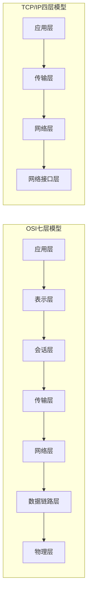

**为什么TCP/IP模型更实用？**
- OSI模型是理论模型，TCP/IP是实际应用
- TCP/IP模型更简洁，易于实现
- TCP/IP协议族已经成为事实标准
- 嵌入式系统资源有限，简化的模型更合适


## TCP/IP协议栈详解

### 整体架构

TCP/IP协议栈采用分层设计，每层提供特定的服务，并使用下层提供的服务。数据在发送时从上层向下层传递，每层都会添加自己的头部信息（封装）；接收时从下层向上层传递，每层剥离自己的头部信息（解封装）。

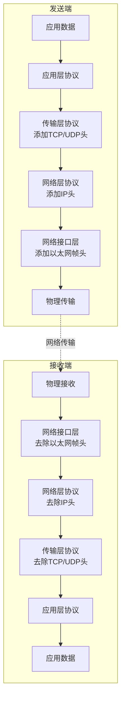

### 第一层：网络接口层

网络接口层（Network Interface Layer）负责在物理网络上传输数据帧，处理硬件地址（MAC地址）和物理传输。

**主要功能**：
- 将IP数据包封装成帧
- 处理MAC地址
- 检测和纠正传输错误
- 控制对物理介质的访问

**常见协议和技术**：
- **Ethernet（以太网）**：最常用的局域网技术
- **WiFi（IEEE 802.11）**：无线局域网技术
- **PPP（Point-to-Point Protocol）**：点对点协议
- **ARP（Address Resolution Protocol）**：地址解析协议

**以太网帧结构**：

```
+----------------+----------------+--------+----------+-----+
| 目标MAC地址(6B) | 源MAC地址(6B)  | 类型(2B)| 数据     | FCS |
+----------------+----------------+--------+----------+-----+
```

**MAC地址**：
- 48位（6字节）物理地址
- 格式：XX:XX:XX:XX:XX:XX（十六进制）
- 前3字节：厂商标识（OUI）
- 后3字节：设备标识
- 示例：`00:1A:2B:3C:4D:5E`

**ARP协议**：

ARP用于将IP地址解析为MAC地址。当设备需要发送数据到某个IP地址时，首先需要知道对方的MAC地址。

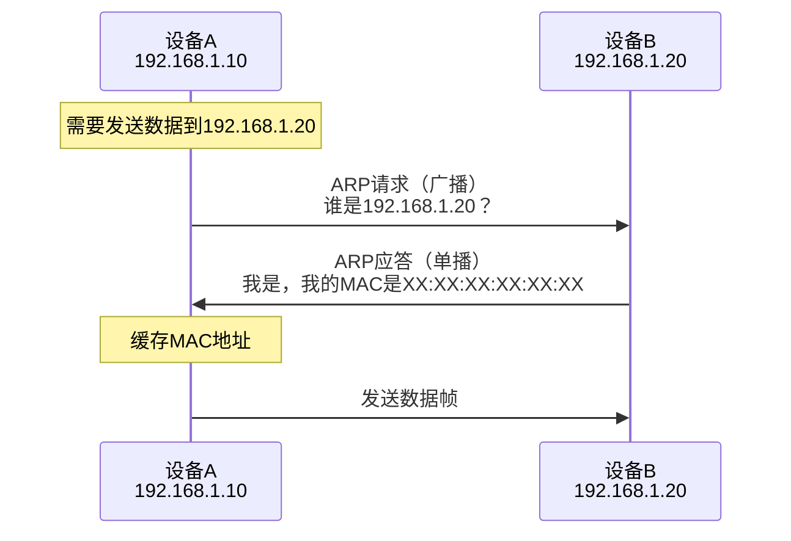

### 第二层：网络层（IP层）

网络层负责在不同网络之间路由数据包，实现逻辑寻址和路由选择。

**主要功能**：
- 逻辑寻址（IP地址）
- 路由选择
- 数据包分片和重组
- 错误报告（ICMP）

**核心协议**：
- **IP（Internet Protocol）**：网际协议
- **ICMP（Internet Control Message Protocol）**：互联网控制消息协议
- **IGMP（Internet Group Management Protocol）**：互联网组管理协议

#### IP协议

IP协议是TCP/IP协议栈的核心，负责数据包的寻址和路由。

**IP地址**：

IPv4地址是32位（4字节）的逻辑地址，通常用点分十进制表示：

```
192.168.1.100
```

**IP地址分类**：

| 类别 | 范围 | 默认子网掩码 | 用途 |
|------|------|-------------|------|
| A类 | 1.0.0.0 - 126.255.255.255 | 255.0.0.0 | 大型网络 |
| B类 | 128.0.0.0 - 191.255.255.255 | 255.255.0.0 | 中型网络 |
| C类 | 192.0.0.0 - 223.255.255.255 | 255.255.255.0 | 小型网络 |
| D类 | 224.0.0.0 - 239.255.255.255 | - | 组播 |
| E类 | 240.0.0.0 - 255.255.255.255 | - | 保留 |

**特殊IP地址**：
- `127.0.0.1`：本地回环地址（localhost）
- `0.0.0.0`：表示所有地址或未知地址
- `255.255.255.255`：广播地址
- `192.168.x.x`、`10.x.x.x`、`172.16.x.x - 172.31.x.x`：私有地址

**IP数据包结构**：

```
+--------+--------+--------+--------+
| 版本   | 头长度 | 服务类型| 总长度  |
+--------+--------+--------+--------+
| 标识符          | 标志   | 片偏移  |
+--------+--------+--------+--------+
| 生存时间| 协议   | 头部校验和        |
+--------+--------+--------+--------+
| 源IP地址                          |
+--------+--------+--------+--------+
| 目标IP地址                        |
+--------+--------+--------+--------+
| 选项（可选）                      |
+--------+--------+--------+--------+
| 数据                              |
+-----------------------------------+
```

**关键字段说明**：
- **版本**：IP协议版本（IPv4=4, IPv6=6）
- **生存时间（TTL）**：数据包可经过的最大路由器数
- **协议**：上层协议类型（TCP=6, UDP=17, ICMP=1）
- **源/目标IP地址**：发送方和接收方的IP地址

#### ICMP协议

ICMP用于在IP网络中发送控制消息和错误报告。

**常见ICMP消息类型**：
- **Echo Request/Reply（类型8/0）**：Ping命令使用
- **Destination Unreachable（类型3）**：目标不可达
- **Time Exceeded（类型11）**：超时
- **Redirect（类型5）**：重定向

**Ping工作原理**：

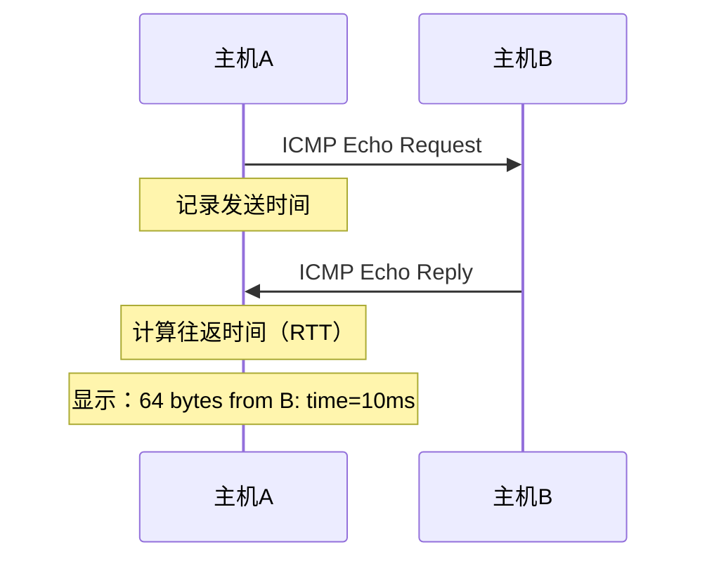


### 第三层：传输层

传输层负责在源主机和目标主机的应用程序之间提供端到端的通信服务。

**主要功能**：
- 端到端通信
- 数据分段和重组
- 流量控制
- 错误检测和纠正
- 端口寻址

**核心协议**：
- **TCP（Transmission Control Protocol）**：传输控制协议
- **UDP（User Datagram Protocol）**：用户数据报协议

#### TCP协议

TCP是面向连接的、可靠的传输层协议。

**TCP的特点**：
- **面向连接**：通信前需要建立连接
- **可靠传输**：保证数据按序到达，无丢失
- **流量控制**：防止发送方发送过快
- **拥塞控制**：避免网络拥塞
- **全双工通信**：双向同时传输

**TCP报文段结构**：

```
+----------------+----------------+
| 源端口号(16位)  | 目标端口号(16位)|
+----------------+----------------+
| 序列号(32位)                    |
+-----------------------------------+
| 确认号(32位)                    |
+-----------------------------------+
| 头长度|保留|标志| 窗口大小      |
+-----------------------------------+
| 校验和          | 紧急指针      |
+-----------------------------------+
| 选项（可选）                    |
+-----------------------------------+
| 数据                            |
+-----------------------------------+
```

**TCP标志位**：
- **SYN**：同步，建立连接
- **ACK**：确认
- **FIN**：结束，关闭连接
- **RST**：重置连接
- **PSH**：推送数据
- **URG**：紧急数据

**TCP三次握手（建立连接）**：

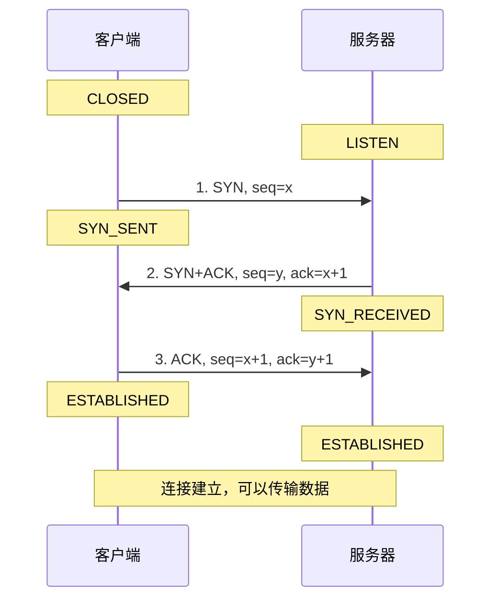

**为什么需要三次握手？**
1. **第一次握手**：客户端告诉服务器"我想连接你"
2. **第二次握手**：服务器告诉客户端"我收到了，我也想连接你"
3. **第三次握手**：客户端告诉服务器"我知道你收到了"

三次握手确保双方都准备好通信，并同步初始序列号。

**TCP四次挥手（关闭连接）**：

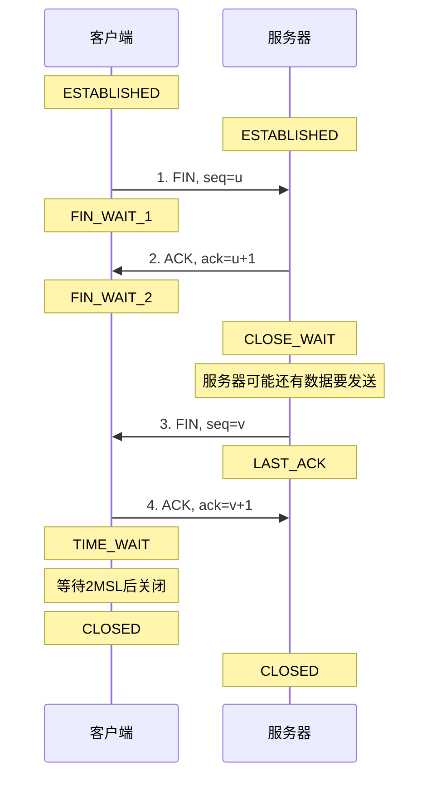

**为什么需要四次挥手？**

TCP是全双工通信，关闭连接需要双方都发送FIN：
1. **第一次挥手**：客户端说"我没有数据要发送了"
2. **第二次挥手**：服务器说"我知道了"
3. **第三次挥手**：服务器说"我也没有数据要发送了"
4. **第四次挥手**：客户端说"我知道了"

**TCP可靠性机制**：

1. **序列号和确认号**：
   - 每个字节都有序列号
   - 接收方发送确认号表示已收到

2. **超时重传**：
   - 发送方设置定时器
   - 超时未收到确认则重传

3. **流量控制（滑动窗口）**：
   - 接收方告知发送方可接收的数据量
   - 防止接收方缓冲区溢出

4. **拥塞控制**：
   - 慢启动
   - 拥塞避免
   - 快速重传
   - 快速恢复

#### UDP协议

UDP是无连接的、不可靠的传输层协议。

**UDP的特点**：
- **无连接**：不需要建立连接
- **不可靠**：不保证数据到达
- **无序**：不保证数据顺序
- **轻量级**：头部开销小（8字节）
- **快速**：没有连接建立和确认机制

**UDP报文结构**：

```
+----------------+----------------+
| 源端口号(16位)  | 目标端口号(16位)|
+----------------+----------------+
| 长度(16位)      | 校验和(16位)   |
+----------------+----------------+
| 数据                            |
+-----------------------------------+
```

**TCP vs UDP对比**：

| 特性 | TCP | UDP |
|------|-----|-----|
| 连接性 | 面向连接 | 无连接 |
| 可靠性 | 可靠传输 | 不可靠传输 |
| 有序性 | 保证顺序 | 不保证顺序 |
| 速度 | 较慢 | 较快 |
| 头部开销 | 20字节 | 8字节 |
| 流量控制 | 有 | 无 |
| 拥塞控制 | 有 | 无 |
| 应用场景 | 文件传输、网页浏览、邮件 | 视频流、语音通话、DNS查询 |

**端口号**：

端口号用于标识主机上的不同应用程序或服务。

- **端口号范围**：0-65535
- **知名端口**（0-1023）：系统服务使用
  - HTTP: 80
  - HTTPS: 443
  - FTP: 21
  - SSH: 22
  - Telnet: 23
  - SMTP: 25
  - DNS: 53
- **注册端口**（1024-49151）：用户应用程序
- **动态端口**（49152-65535）：临时端口

### 第四层：应用层

应用层为用户应用程序提供网络服务接口。

**常见应用层协议**：

| 协议 | 端口 | 功能 | 传输层协议 |
|------|------|------|-----------|
| HTTP | 80 | 网页浏览 | TCP |
| HTTPS | 443 | 安全网页浏览 | TCP |
| FTP | 21 | 文件传输 | TCP |
| SMTP | 25 | 邮件发送 | TCP |
| POP3 | 110 | 邮件接收 | TCP |
| DNS | 53 | 域名解析 | UDP/TCP |
| DHCP | 67/68 | 动态IP分配 | UDP |
| MQTT | 1883 | 物联网消息 | TCP |
| CoAP | 5683 | 物联网协议 | UDP |

#### HTTP协议

HTTP（HyperText Transfer Protocol）是万维网的基础协议。

**HTTP请求方法**：
- **GET**：获取资源
- **POST**：提交数据
- **PUT**：更新资源
- **DELETE**：删除资源
- **HEAD**：获取头部信息
- **OPTIONS**：查询支持的方法

**HTTP请求格式**：

```
GET /index.html HTTP/1.1
Host: www.example.com
User-Agent: Mozilla/5.0
Accept: text/html
Connection: keep-alive

```

**HTTP响应格式**：

```
HTTP/1.1 200 OK
Content-Type: text/html
Content-Length: 1234
Connection: keep-alive

<!DOCTYPE html>
<html>
...
</html>
```

**HTTP状态码**：
- **1xx**：信息性状态码
- **2xx**：成功状态码（200 OK）
- **3xx**：重定向状态码（301 Moved Permanently）
- **4xx**：客户端错误（404 Not Found）
- **5xx**：服务器错误（500 Internal Server Error）

#### DNS协议

DNS（Domain Name System）将域名解析为IP地址。

**DNS查询过程**：

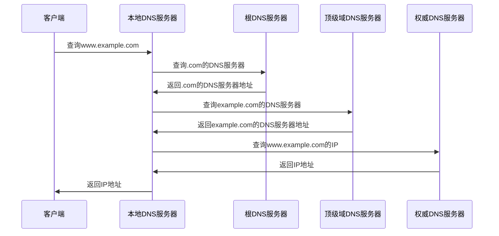


## 嵌入式系统中的TCP/IP

### lwIP协议栈

lwIP（Lightweight IP）是专为嵌入式系统设计的轻量级TCP/IP协议栈。

**lwIP的特点**：
- **轻量级**：代码量小，内存占用少
- **模块化**：可裁剪，按需配置
- **高性能**：优化的数据结构和算法
- **可移植**：支持多种操作系统和硬件平台
- **开源免费**：BSD许可证

**lwIP架构**：

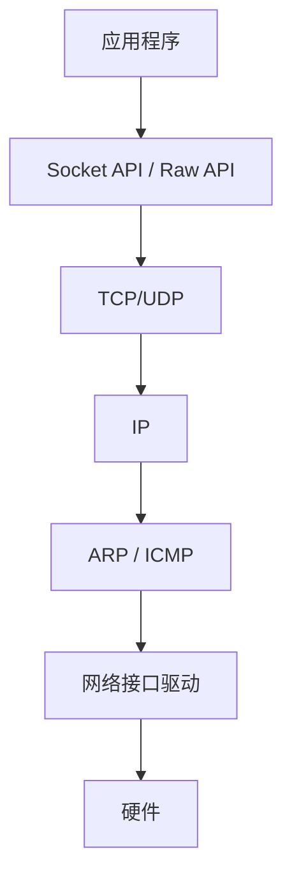

**lwIP的API类型**：

1. **Raw API**：
   - 直接操作协议栈
   - 效率高，内存占用小
   - 需要了解协议栈内部机制
   - 适合资源极度受限的系统

2. **Netconn API**：
   - 基于操作系统的顺序API
   - 使用简单，类似Socket
   - 需要操作系统支持
   - 适合有RTOS的系统

3. **Socket API**：
   - 标准BSD Socket接口
   - 兼容性好，易于移植
   - 需要操作系统支持
   - 适合从其他平台移植代码

**lwIP内存管理**：

lwIP提供三种内存管理方式：
- **静态内存池**：预分配固定大小的内存块
- **动态内存堆**：使用malloc/free
- **混合模式**：结合静态和动态

**lwIP配置示例**：

```c
// lwipopts.h - lwIP配置文件

// 内存配置
#define MEM_SIZE                (16*1024)  // 堆大小
#define MEMP_NUM_PBUF           10         // pbuf数量
#define MEMP_NUM_TCP_PCB        5          // TCP连接数
#define MEMP_NUM_UDP_PCB        4          // UDP连接数

// 协议配置
#define LWIP_TCP                1          // 启用TCP
#define LWIP_UDP                1          // 启用UDP
#define LWIP_DHCP               1          // 启用DHCP
#define LWIP_DNS                1          // 启用DNS

// 性能配置
#define TCP_MSS                 1460       // TCP最大段大小
#define TCP_WND                 (4*TCP_MSS) // TCP窗口大小
#define TCP_SND_BUF             (2*TCP_MSS) // TCP发送缓冲区
```

### Socket编程基础

Socket（套接字）是应用程序与TCP/IP协议栈之间的编程接口。

**Socket类型**：
- **流式Socket（SOCK_STREAM）**：使用TCP协议
- **数据报Socket（SOCK_DGRAM）**：使用UDP协议
- **原始Socket（SOCK_RAW）**：直接访问IP层

**Socket编程流程**：

#### TCP服务器端

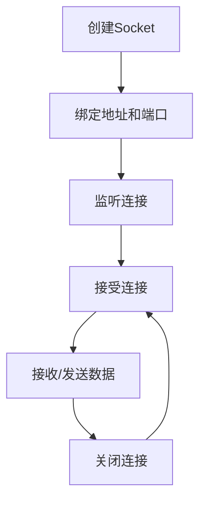

#### TCP客户端

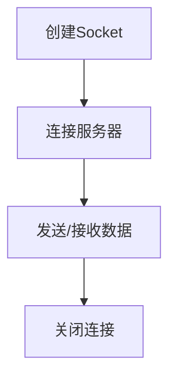

**Socket API函数**：

```c
// 创建Socket
int socket(int domain, int type, int protocol);
// domain: AF_INET (IPv4), AF_INET6 (IPv6)
// type: SOCK_STREAM (TCP), SOCK_DGRAM (UDP)
// protocol: 通常为0

// 绑定地址
int bind(int sockfd, const struct sockaddr *addr, socklen_t addrlen);

// 监听连接（TCP服务器）
int listen(int sockfd, int backlog);

// 接受连接（TCP服务器）
int accept(int sockfd, struct sockaddr *addr, socklen_t *addrlen);

// 连接服务器（TCP客户端）
int connect(int sockfd, const struct sockaddr *addr, socklen_t addrlen);

// 发送数据
ssize_t send(int sockfd, const void *buf, size_t len, int flags);
ssize_t sendto(int sockfd, const void *buf, size_t len, int flags,
               const struct sockaddr *dest_addr, socklen_t addrlen);

// 接收数据
ssize_t recv(int sockfd, void *buf, size_t len, int flags);
ssize_t recvfrom(int sockfd, void *buf, size_t len, int flags,
                 struct sockaddr *src_addr, socklen_t *addrlen);

// 关闭Socket
int close(int sockfd);
```


## 实践示例

### 示例1：TCP服务器（ESP32）

创建一个简单的TCP服务器，接收客户端连接并回显数据。

```cpp
#include <WiFi.h>

const char* ssid = "你的WiFi名称";
const char* password = "你的WiFi密码";

// 创建TCP服务器，监听端口8080
WiFiServer server(8080);

void setup() {
    Serial.begin(115200);
    
    // 连接WiFi
    WiFi.begin(ssid, password);
    while (WiFi.status() != WL_CONNECTED) {
        delay(500);
        Serial.print(".");
    }
    
    Serial.println("\nWiFi连接成功");
    Serial.print("IP地址: ");
    Serial.println(WiFi.localIP());
    
    // 启动TCP服务器
    server.begin();
    Serial.println("TCP服务器已启动，监听端口8080");
}

void loop() {
    // 等待客户端连接
    WiFiClient client = server.available();
    
    if (client) {
        Serial.println("新客户端连接");
        
        // 客户端连接期间
        while (client.connected()) {
            // 检查是否有数据可读
            if (client.available()) {
                // 读取数据
                String data = client.readStringUntil('\n');
                Serial.print("收到数据: ");
                Serial.println(data);
                
                // 回显数据
                client.print("Echo: ");
                client.println(data);
            }
        }
        
        // 关闭连接
        client.stop();
        Serial.println("客户端断开连接");
    }
}
```

**代码说明**：
- `WiFiServer server(8080)`：创建TCP服务器对象，监听8080端口
- `server.begin()`：启动服务器
- `server.available()`：检查是否有客户端连接
- `client.available()`：检查是否有数据可读
- `client.readStringUntil('\n')`：读取数据直到换行符
- `client.print()`：发送数据到客户端

**测试方法**：

使用telnet或网络调试工具连接：
```bash
telnet 192.168.1.100 8080
```

### 示例2：TCP客户端（ESP32）

创建TCP客户端，连接到服务器并发送数据。

```cpp
#include <WiFi.h>

const char* ssid = "你的WiFi名称";
const char* password = "你的WiFi密码";

// 服务器地址和端口
const char* host = "192.168.1.200";
const uint16_t port = 8080;

WiFiClient client;

void setup() {
    Serial.begin(115200);
    
    // 连接WiFi
    WiFi.begin(ssid, password);
    while (WiFi.status() != WL_CONNECTED) {
        delay(500);
        Serial.print(".");
    }
    
    Serial.println("\nWiFi连接成功");
}

void loop() {
    // 连接到服务器
    if (!client.connected()) {
        Serial.println("连接到服务器...");
        
        if (client.connect(host, port)) {
            Serial.println("连接成功");
        } else {
            Serial.println("连接失败");
            delay(5000);
            return;
        }
    }
    
    // 发送数据
    String message = "Hello from ESP32!";
    client.println(message);
    Serial.print("发送: ");
    Serial.println(message);
    
    // 等待响应
    unsigned long timeout = millis();
    while (client.available() == 0) {
        if (millis() - timeout > 5000) {
            Serial.println("超时");
            client.stop();
            return;
        }
    }
    
    // 读取响应
    while (client.available()) {
        String line = client.readStringUntil('\n');
        Serial.print("收到: ");
        Serial.println(line);
    }
    
    delay(5000);  // 每5秒发送一次
}
```

### 示例3：UDP通信（ESP32）

使用UDP协议发送和接收数据。

```cpp
#include <WiFi.h>
#include <WiFiUdp.h>

const char* ssid = "你的WiFi名称";
const char* password = "你的WiFi密码";

WiFiUDP udp;
const uint16_t localPort = 8888;  // 本地监听端口

void setup() {
    Serial.begin(115200);
    
    // 连接WiFi
    WiFi.begin(ssid, password);
    while (WiFi.status() != WL_CONNECTED) {
        delay(500);
        Serial.print(".");
    }
    
    Serial.println("\nWiFi连接成功");
    Serial.print("IP地址: ");
    Serial.println(WiFi.localIP());
    
    // 开始监听UDP端口
    udp.begin(localPort);
    Serial.printf("UDP监听端口: %d\n", localPort);
}

void loop() {
    // 检查是否有UDP数据包
    int packetSize = udp.parsePacket();
    
    if (packetSize) {
        // 读取数据包
        char packetBuffer[255];
        int len = udp.read(packetBuffer, 255);
        if (len > 0) {
            packetBuffer[len] = 0;  // 添加字符串结束符
        }
        
        // 打印接收到的数据
        Serial.printf("收到UDP数据包，大小: %d\n", packetSize);
        Serial.printf("来自: %s:%d\n", 
                     udp.remoteIP().toString().c_str(), 
                     udp.remotePort());
        Serial.printf("内容: %s\n", packetBuffer);
        
        // 发送响应
        udp.beginPacket(udp.remoteIP(), udp.remotePort());
        udp.printf("收到你的消息: %s", packetBuffer);
        udp.endPacket();
    }
    
    delay(10);
}
```

**UDP发送示例**：

```cpp
void sendUDP(const char* message, IPAddress ip, uint16_t port) {
    udp.beginPacket(ip, port);
    udp.print(message);
    udp.endPacket();
}

// 使用示例
IPAddress targetIP(192, 168, 1, 200);
sendUDP("Hello UDP!", targetIP, 8888);
```

### 示例4：HTTP客户端请求

使用Socket实现简单的HTTP GET请求。

```cpp
#include <WiFi.h>

const char* ssid = "你的WiFi名称";
const char* password = "你的WiFi密码";

void setup() {
    Serial.begin(115200);
    
    // 连接WiFi
    WiFi.begin(ssid, password);
    while (WiFi.status() != WL_CONNECTED) {
        delay(500);
        Serial.print(".");
    }
    
    Serial.println("\nWiFi连接成功");
    
    // 发送HTTP请求
    httpRequest();
}

void httpRequest() {
    WiFiClient client;
    
    const char* host = "www.example.com";
    const uint16_t port = 80;
    
    Serial.println("连接到服务器...");
    
    if (!client.connect(host, port)) {
        Serial.println("连接失败");
        return;
    }
    
    Serial.println("发送HTTP请求...");
    
    // 构建HTTP请求
    client.print("GET / HTTP/1.1\r\n");
    client.print("Host: ");
    client.print(host);
    client.print("\r\n");
    client.print("Connection: close\r\n");
    client.print("\r\n");
    
    // 等待响应
    unsigned long timeout = millis();
    while (client.available() == 0) {
        if (millis() - timeout > 5000) {
            Serial.println("超时");
            client.stop();
            return;
        }
    }
    
    // 读取响应
    Serial.println("收到响应:");
    while (client.available()) {
        String line = client.readStringUntil('\n');
        Serial.println(line);
    }
    
    client.stop();
    Serial.println("连接关闭");
}

void loop() {
    // 空循环
}
```


## 深入理解

### 数据封装和解封装

数据在TCP/IP协议栈中传输时，每层都会添加自己的头部信息。

**封装过程**：

```
应用层:  [HTTP数据]
         ↓
传输层:  [TCP头][HTTP数据]
         ↓
网络层:  [IP头][TCP头][HTTP数据]
         ↓
链路层:  [以太网头][IP头][TCP头][HTTP数据][以太网尾]
```

**各层头部大小**：
- 以太网头：14字节
- IP头：20字节（最小）
- TCP头：20字节（最小）
- UDP头：8字节

**MTU和MSS**：

- **MTU（Maximum Transmission Unit）**：最大传输单元
  - 以太网MTU：1500字节
  - 包括IP头和TCP/UDP头
  
- **MSS（Maximum Segment Size）**：最大段大小
  - TCP数据部分的最大长度
  - MSS = MTU - IP头 - TCP头
  - 以太网MSS：1500 - 20 - 20 = 1460字节

**IP分片**：

当数据包大于MTU时，需要分片传输：

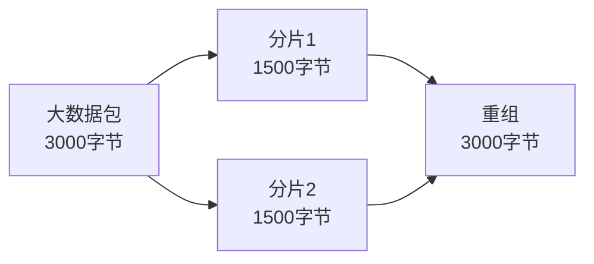

### 网络字节序

不同的计算机系统可能使用不同的字节序（Byte Order）：

- **大端序（Big-Endian）**：高位字节存储在低地址
- **小端序（Little-Endian）**：低位字节存储在低地址

**网络字节序**：TCP/IP协议规定使用大端序。

**字节序转换函数**：

```c
#include <arpa/inet.h>

// 主机字节序 → 网络字节序
uint32_t htonl(uint32_t hostlong);    // 32位
uint16_t htons(uint16_t hostshort);   // 16位

// 网络字节序 → 主机字节序
uint32_t ntohl(uint32_t netlong);     // 32位
uint16_t ntohs(uint16_t netshort);    // 16位
```

**使用示例**：

```c
// 设置服务器地址
struct sockaddr_in server_addr;
server_addr.sin_family = AF_INET;
server_addr.sin_port = htons(8080);  // 端口号转换为网络字节序
server_addr.sin_addr.s_addr = inet_addr("192.168.1.100");
```

### TCP状态机

TCP连接有多个状态，理解状态转换有助于诊断网络问题。

**TCP状态**：
- **CLOSED**：关闭状态
- **LISTEN**：监听状态（服务器）
- **SYN_SENT**：已发送SYN（客户端）
- **SYN_RECEIVED**：已收到SYN（服务器）
- **ESTABLISHED**：连接建立
- **FIN_WAIT_1**：已发送FIN
- **FIN_WAIT_2**：已收到FIN的ACK
- **CLOSE_WAIT**：等待关闭
- **CLOSING**：双方同时关闭
- **LAST_ACK**：等待最后的ACK
- **TIME_WAIT**：等待2MSL
- **CLOSED**：连接关闭

**TIME_WAIT状态**：

客户端在发送最后一个ACK后进入TIME_WAIT状态，等待2MSL（Maximum Segment Lifetime，最大段生存时间）后才真正关闭连接。

**为什么需要TIME_WAIT？**
1. 确保最后的ACK能够到达服务器
2. 防止旧连接的数据包干扰新连接

**MSL通常为2分钟**，所以TIME_WAIT持续4分钟。

### 常见网络问题诊断

#### 问题1：连接超时

**可能原因**：
- 服务器未启动
- 防火墙阻止
- 网络不通
- IP地址或端口错误

**诊断方法**：
```bash
# 测试网络连通性
ping 192.168.1.100

# 测试端口是否开放
telnet 192.168.1.100 8080

# 查看路由
traceroute 192.168.1.100
```

#### 问题2：连接被拒绝

**可能原因**：
- 服务器端口未监听
- 防火墙规则
- 服务器主动拒绝

**诊断方法**：
```bash
# 查看监听端口
netstat -an | grep 8080

# 查看防火墙规则
iptables -L
```

#### 问题3：数据传输慢

**可能原因**：
- 网络拥塞
- TCP窗口太小
- 丢包率高
- 延迟大

**诊断方法**：
```bash
# 测试带宽
iperf -c 192.168.1.100

# 查看网络统计
netstat -s
```


## 常见问题

**Q1: TCP和UDP应该如何选择？**

A: 根据应用需求选择：
- **选择TCP**：需要可靠传输、数据完整性重要（文件传输、网页浏览、邮件）
- **选择UDP**：对实时性要求高、可以容忍少量丢包（视频流、语音通话、在线游戏）

**Q2: 为什么TCP需要三次握手，不能两次？**

A: 两次握手无法防止旧的重复连接请求导致的问题。三次握手确保：
- 双方都确认对方的接收和发送能力
- 同步双方的初始序列号
- 防止已失效的连接请求突然又传送到服务器

**Q3: lwIP和标准TCP/IP协议栈有什么区别？**

A: lwIP是轻量级实现，主要区别：
- **内存占用**：lwIP更小，适合嵌入式系统
- **功能**：lwIP功能相对简化
- **性能**：lwIP针对嵌入式优化
- **API**：lwIP提供多种API选择

**Q4: Socket编程中的阻塞和非阻塞模式有什么区别？**

A: 
- **阻塞模式**：函数调用会等待直到操作完成
- **非阻塞模式**：函数立即返回，可能返回错误码EWOULDBLOCK

```c
// 设置非阻塞模式
int flags = fcntl(sockfd, F_GETFL, 0);
fcntl(sockfd, F_SETFL, flags | O_NONBLOCK);
```

**Q5: 如何提高TCP传输性能？**

A: 几个优化方向：
- 增大TCP窗口大小
- 启用TCP_NODELAY（禁用Nagle算法）
- 调整发送/接收缓冲区大小
- 使用零拷贝技术
- 减少系统调用次数

**Q6: 什么是粘包问题？如何解决？**

A: TCP是流式协议，多个小数据包可能被合并（粘包）或一个大数据包被拆分。

**解决方法**：
- 固定长度消息
- 使用分隔符（如换行符）
- 消息头包含长度信息
- 使用应用层协议（如HTTP）

**Q7: IPv4地址不够用怎么办？**

A: 解决方案：
- **NAT（网络地址转换）**：多个设备共享一个公网IP
- **IPv6**：128位地址，地址空间巨大
- **私有地址**：内网使用私有地址段

**Q8: 如何在嵌入式系统中节省内存？**

A: lwIP内存优化技巧：
- 减少TCP/UDP连接数
- 调小缓冲区大小
- 使用静态内存池
- 禁用不需要的功能
- 优化pbuf使用


## 总结

通过本文，你学习了：

- ✅ TCP/IP协议栈的四层结构和各层功能
- ✅ 网络接口层的以太网和ARP协议
- ✅ 网络层的IP协议和ICMP协议
- ✅ 传输层的TCP和UDP协议
- ✅ 应用层的常见协议（HTTP、DNS等）
- ✅ TCP三次握手和四次挥手的原理
- ✅ lwIP协议栈在嵌入式系统中的应用
- ✅ Socket编程的基本方法
- ✅ 数据封装、字节序、状态机等深入概念
- ✅ 常见网络问题的诊断方法

TCP/IP协议栈是网络通信的基础，掌握它对于嵌入式网络开发至关重要。建议多动手实践，通过编写代码和抓包分析来加深理解。


## 延伸阅读

### 推荐书籍

1. **《TCP/IP详解 卷1：协议》** - W. Richard Stevens
   - 经典之作，深入讲解TCP/IP协议
   - 适合系统学习网络协议

2. **《UNIX网络编程 卷1：套接字联网API》** - W. Richard Stevens
   - Socket编程圣经
   - 包含大量实例代码

3. **《嵌入式TCP/IP协议栈lwIP应用开发》**
   - 专注于lwIP协议栈
   - 适合嵌入式开发者

4. **《图解TCP/IP》**
   - 图文并茂，易于理解
   - 适合初学者入门

### 在线资源

1. **RFC文档**
   - RFC 791: Internet Protocol (IP)
   - RFC 793: Transmission Control Protocol (TCP)
   - RFC 768: User Datagram Protocol (UDP)
   - RFC 2616: HTTP/1.1

2. **lwIP官方网站**
   - [https://savannah.nongnu.org/projects/lwip/](https://savannah.nongnu.org/projects/lwip/)
   - 源代码、文档、邮件列表

3. **Wireshark**
   - [https://www.wireshark.org/](https://www.wireshark.org/)
   - 网络协议分析工具
   - 学习协议的最佳工具

4. **TCP/IP Guide**
   - [http://www.tcpipguide.com/](http://www.tcpipguide.com/)
   - 在线TCP/IP教程

### 实践工具

1. **Wireshark**：抓包分析工具
2. **tcpdump**：命令行抓包工具
3. **netcat (nc)**：网络调试工具
4. **iperf**：网络性能测试工具
5. **nmap**：网络扫描工具

### 相关课程

1. **计算机网络**（大学课程）
2. **网络协议分析**
3. **嵌入式网络编程**
4. **物联网通信技术**


## 下一步学习

建议继续学习以下内容：

1. **MQTT协议应用开发** - 学习物联网消息协议
2. **HTTP/HTTPS协议应用** - 深入学习Web通信
3. **WebSocket实时通信** - 学习双向实时通信
4. **CoAP轻量级协议** - 学习物联网专用协议
5. **网络安全基础** - 学习TLS/SSL、加密等

---

**反馈与支持**：
- 如果你在学习过程中遇到问题，欢迎在评论区留言
- 发现文档错误或有改进建议，请提交Issue
- 想要分享你的项目，欢迎投稿

**版权声明**：
本文采用 CC BY-NC-SA 4.0 许可协议，欢迎分享和改编，但请注明出处。
