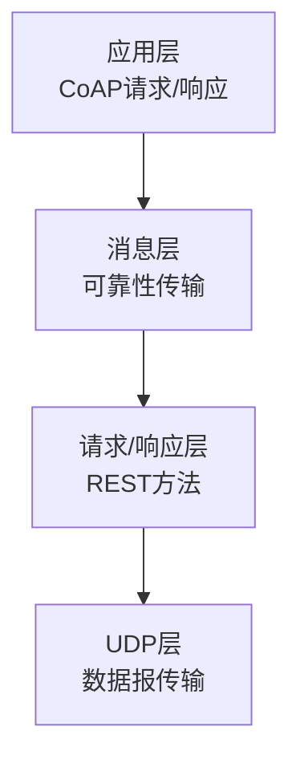
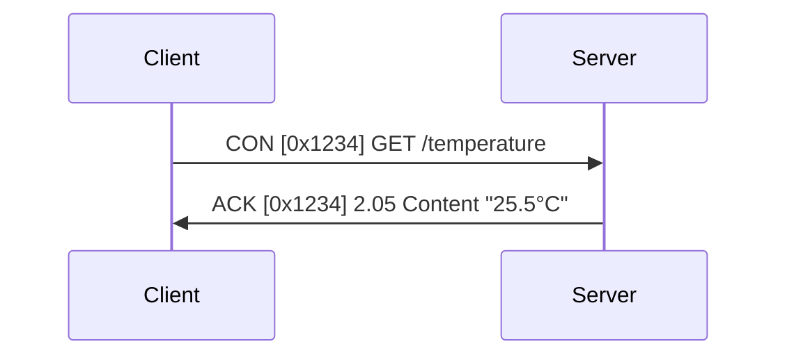
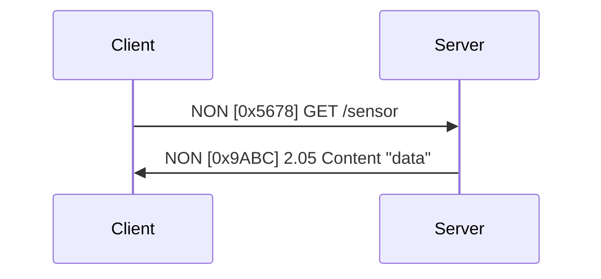
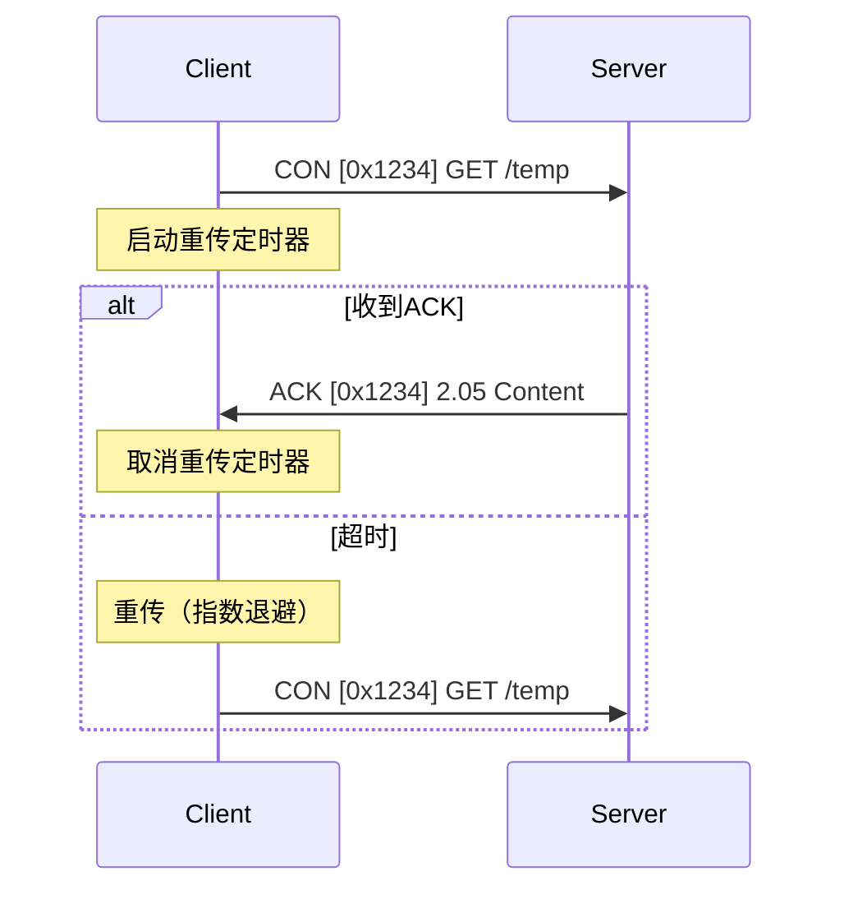
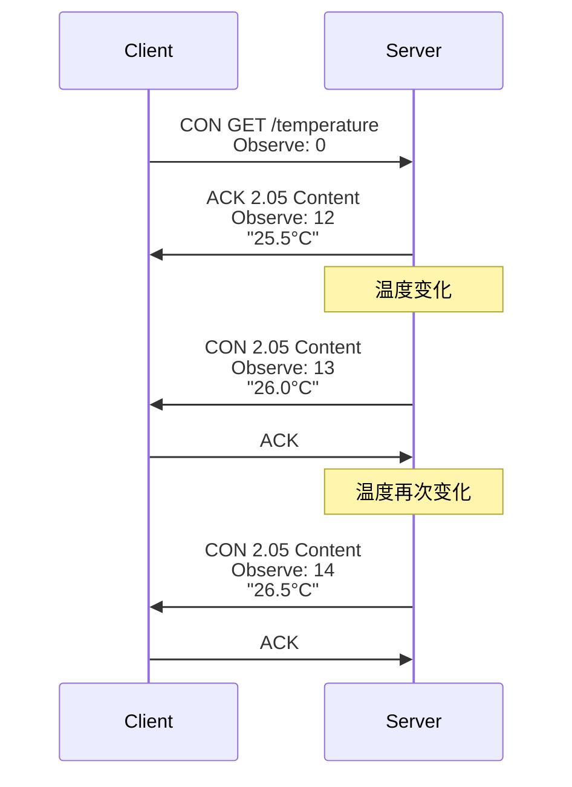
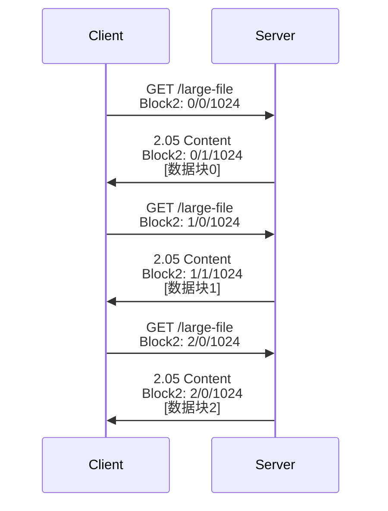
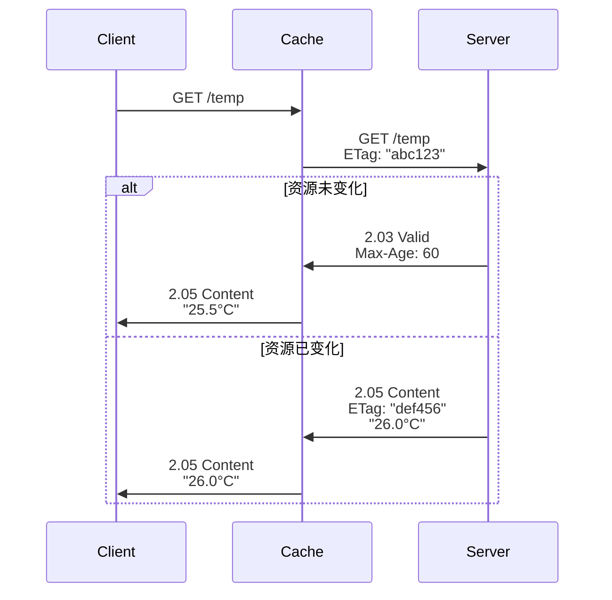

# CoAP轻量级协议详解与应用


## 概述

CoAP (Constrained Application Protocol，受限应用协议) 是专为资源受限的物联网设备设计的轻量级应用层协议。它基于UDP协议，采用类似HTTP的RESTful架构，但针对低功耗、低带宽的嵌入式环境进行了优化。

**为什么需要CoAP？**

传统的HTTP协议虽然功能强大，但对于资源受限的物联网设备来说过于"重量级"：
- HTTP基于TCP，需要维护连接状态，消耗内存
- HTTP头部信息冗长，增加带宽开销
- HTTP不适合低功耗、间歇性连接的场景

CoAP应运而生，它提供了：
- **轻量级**：协议开销小，适合低带宽网络
- **低功耗**：基于UDP，减少连接维护开销
- **RESTful**：采用熟悉的REST架构，易于理解
- **可靠性**：提供可选的确认机制
- **资源发现**：内置服务发现功能
- **观察模式**：支持服务器主动推送

**学习目标**：

完成本文学习后，你将能够：
- 理解CoAP协议的设计理念和核心特点
- 掌握CoAP消息格式和交互模式
- 了解RESTful API在CoAP中的应用
- 理解资源发现和观察模式的工作原理
- 知道CoAP的典型应用场景


## 背景知识

### REST架构风格

REST (Representational State Transfer，表述性状态转移) 是一种软件架构风格，广泛应用于Web服务设计。

**REST核心概念**：
- **资源（Resource）**：网络上的一个实体，用URI标识
- **表述（Representation）**：资源的具体表现形式（JSON、XML等）
- **状态转移（State Transfer）**：通过HTTP方法操作资源状态

**REST的四个基本方法**：
- **GET**：获取资源
- **POST**：创建资源
- **PUT**：更新资源
- **DELETE**：删除资源

### UDP vs TCP

CoAP选择UDP而非TCP作为传输层协议，原因如下：

| 特性 | TCP | UDP | CoAP选择 |
|------|-----|-----|----------|
| 连接 | 面向连接 | 无连接 | UDP（减少开销） |
| 可靠性 | 可靠传输 | 不可靠 | UDP+应用层确认 |
| 开销 | 较大 | 较小 | UDP（节省资源） |
| 适用场景 | 可靠数据传输 | 实时通信 | 物联网设备 |

CoAP在UDP基础上实现了可选的可靠性机制，在轻量级和可靠性之间取得平衡。

### HTTP vs CoAP对比

| 特性 | HTTP | CoAP |
|------|------|------|
| 传输层 | TCP | UDP |
| 消息格式 | 文本 | 二进制 |
| 头部大小 | 数百字节 | 4字节 |
| 方法 | GET, POST, PUT, DELETE等 | GET, POST, PUT, DELETE |
| 状态码 | 3位数字（200, 404等） | 类似但更紧凑 |
| 内容协商 | 支持 | 支持 |
| 缓存 | 支持 | 支持 |
| 观察模式 | 需要WebSocket | 内置支持 |
| 资源发现 | 无标准 | 内置支持 |


## CoAP协议详解

### 协议架构

CoAP协议栈分为四层：



**各层功能**：
1. **应用层**：处理CoAP请求和响应
2. **消息层**：处理消息的可靠传输（重传、去重）
3. **请求/响应层**：实现REST方法和资源操作
4. **UDP层**：提供基础的数据报传输

### 消息格式

CoAP消息采用紧凑的二进制格式，最小头部仅4字节：

```
 0                   1                   2                   3
 0 1 2 3 4 5 6 7 8 9 0 1 2 3 4 5 6 7 8 9 0 1 2 3 4 5 6 7 8 9 0 1
+-+-+-+-+-+-+-+-+-+-+-+-+-+-+-+-+-+-+-+-+-+-+-+-+-+-+-+-+-+-+-+-+
|Ver| T |  TKL  |      Code     |          Message ID           |
+-+-+-+-+-+-+-+-+-+-+-+-+-+-+-+-+-+-+-+-+-+-+-+-+-+-+-+-+-+-+-+-+
|   Token (if any, TKL bytes) ...
+-+-+-+-+-+-+-+-+-+-+-+-+-+-+-+-+-+-+-+-+-+-+-+-+-+-+-+-+-+-+-+-+
|   Options (if any) ...
+-+-+-+-+-+-+-+-+-+-+-+-+-+-+-+-+-+-+-+-+-+-+-+-+-+-+-+-+-+-+-+-+
|1 1 1 1 1 1 1 1|    Payload (if any) ...
+-+-+-+-+-+-+-+-+-+-+-+-+-+-+-+-+-+-+-+-+-+-+-+-+-+-+-+-+-+-+-+-+
```

**字段说明**：

- **Ver (Version, 2位)**：协议版本，当前为1
- **T (Type, 2位)**：消息类型
  - 0: CON (Confirmable) - 需要确认
  - 1: NON (Non-confirmable) - 不需要确认
  - 2: ACK (Acknowledgement) - 确认消息
  - 3: RST (Reset) - 重置消息
- **TKL (Token Length, 4位)**：Token长度（0-8字节）
- **Code (8位)**：请求方法或响应状态码
- **Message ID (16位)**：消息标识符，用于去重和匹配响应
- **Token**：用于匹配请求和响应
- **Options**：可选的头部信息
- **Payload**：消息负载（数据）

### 消息类型

CoAP定义了四种消息类型：

#### 1. CON (Confirmable) - 可确认消息

需要接收方发送ACK确认的消息，用于可靠传输。



#### 2. NON (Non-confirmable) - 不可确认消息

不需要确认的消息，用于不重要的数据或高频率更新。



#### 3. ACK (Acknowledgement) - 确认消息

对CON消息的确认响应。

#### 4. RST (Reset) - 重置消息

表示无法处理收到的消息。

### 请求方法

CoAP支持四种REST方法：

| 方法 | Code | 说明 | 等价HTTP |
|------|------|------|----------|
| GET | 0.01 | 获取资源 | GET |
| POST | 0.02 | 创建资源 | POST |
| PUT | 0.03 | 更新资源 | PUT |
| DELETE | 0.04 | 删除资源 | DELETE |

### 响应码

CoAP响应码采用类似HTTP的分类：

| 类别 | 范围 | 说明 | 示例 |
|------|------|------|------|
| 成功 | 2.xx | 请求成功 | 2.05 Content |
| 客户端错误 | 4.xx | 请求错误 | 4.04 Not Found |
| 服务器错误 | 5.xx | 服务器错误 | 5.00 Internal Server Error |

**常见响应码**：
- **2.01 Created**：资源已创建
- **2.02 Deleted**：资源已删除
- **2.03 Valid**：资源有效（缓存验证）
- **2.04 Changed**：资源已更改
- **2.05 Content**：返回资源内容
- **4.00 Bad Request**：请求格式错误
- **4.04 Not Found**：资源不存在
- **4.05 Method Not Allowed**：方法不允许
- **5.00 Internal Server Error**：服务器内部错误


## CoAP核心特性

### 1. URI和资源

CoAP使用URI来标识资源，格式类似HTTP：

```
coap://example.com:5683/sensors/temperature
```

**URI组成**：
- **Scheme**：`coap://` 或 `coaps://`（加密）
- **Host**：服务器地址
- **Port**：端口号（默认5683，加密为5684）
- **Path**：资源路径

**示例**：
```
coap://192.168.1.100/sensors/temp      # 温度传感器
coap://192.168.1.100/actuators/led     # LED控制
coap://192.168.1.100/.well-known/core  # 资源发现
```

### 2. 选项（Options）

CoAP选项用于传递额外的请求/响应信息，类似HTTP头部。

**常用选项**：

| 选项号 | 名称 | 说明 |
|--------|------|------|
| 3 | Uri-Host | 目标主机 |
| 7 | Uri-Port | 目标端口 |
| 11 | Uri-Path | URI路径段 |
| 12 | Content-Format | 内容格式 |
| 15 | Uri-Query | 查询参数 |
| 17 | Accept | 接受的内容格式 |
| 35 | Proxy-Uri | 代理URI |
| 60 | Size1 | 请求负载大小 |

**内容格式**：
- 0: text/plain
- 40: application/link-format
- 41: application/xml
- 42: application/octet-stream
- 47: application/exi
- 50: application/json

### 3. 可靠性机制

CoAP在UDP基础上实现了可靠传输：

#### 确认和重传



**重传策略**：
- 初始超时：2-3秒（随机）
- 最大重传次数：4次
- 退避算法：指数退避（每次翻倍）

#### 去重

使用Message ID进行消息去重，防止重复处理。

### 4. 观察模式（Observe）

观察模式允许客户端订阅资源，服务器在资源变化时主动推送更新。



**观察模式特点**：
- 客户端发送带Observe选项的GET请求
- 服务器在响应中包含Observe选项
- 服务器主动推送资源更新
- 客户端可以取消观察（发送RST或Observe: 1）

**应用场景**：
- 传感器数据监控
- 设备状态变化通知
- 实时数据流

### 5. 资源发现

CoAP定义了标准的资源发现机制，使用`.well-known/core`端点。

**发现请求**：
```
GET coap://192.168.1.100/.well-known/core
```

**响应示例**（application/link-format）：
```
</sensors/temp>;ct=0;title="Temperature",
</sensors/humidity>;ct=0;title="Humidity",
</actuators/led>;ct=0;rt="light",
</actuators/relay>;ct=0;rt="switch"
```

**链接格式属性**：
- `ct`：Content-Type（内容类型）
- `rt`：Resource Type（资源类型）
- `if`：Interface（接口类型）
- `sz`：Size（资源大小）
- `title`：标题

**过滤查询**：
```
GET /.well-known/core?rt=temperature
```

### 6. 块传输（Block-wise Transfer）

对于大数据传输，CoAP支持分块传输。



**Block选项**：
- **Block1**：请求负载分块
- **Block2**：响应负载分块
- **格式**：块号/更多标志/块大小


## 实践示例

### 示例1：基本GET请求

使用CoAP客户端工具（如coap-cli）发送GET请求：

```bash
# 安装coap-cli
npm install coap-cli -g

# 发送GET请求
coap get coap://coap.me/test

# 带查询参数
coap get coap://coap.me/test?name=value
```

**响应示例**：
```
(2.05)  Content
Payload: Hello World!
```

### 示例2：POST创建资源

```bash
# 发送POST请求创建资源
coap post coap://192.168.1.100/sensors -p '{"type":"temperature","value":25.5}'

# 指定内容格式
coap post coap://192.168.1.100/sensors -O 50 -p '{"type":"temperature"}'
```

**响应**：
```
(2.01)  Created
Location-Path: /sensors/001
```

### 示例3：PUT更新资源

```bash
# 更新资源
coap put coap://192.168.1.100/sensors/001 -p '{"value":26.0}'
```

**响应**：
```
(2.04)  Changed
```

### 示例4：观察资源

```bash
# 观察资源变化
coap get coap://192.168.1.100/sensors/temp -o

# 输出示例：
# (2.05)  Content, Observe: 12
# Payload: 25.5
# 
# (2.05)  Content, Observe: 13
# Payload: 26.0
# 
# (2.05)  Content, Observe: 14
# Payload: 26.5
```

### 示例5：资源发现

```bash
# 发现所有资源
coap get coap://192.168.1.100/.well-known/core

# 输出：
# </sensors/temp>;ct=0;title="Temperature",
# </sensors/humidity>;ct=0;title="Humidity",
# </actuators/led>;ct=0;rt="light"

# 过滤查询
coap get coap://192.168.1.100/.well-known/core?rt=temperature
```

### 示例6：ESP32 CoAP服务器

使用ESP-IDF实现简单的CoAP服务器：

```c
#include "coap3/coap.h"
#include "esp_log.h"

static const char *TAG = "CoAP_Server";

// GET处理函数
static void temperature_handler(coap_resource_t *resource,
                                coap_session_t *session,
                                const coap_pdu_t *request,
                                const coap_string_t *query,
                                coap_pdu_t *response) {
    // 读取温度（这里使用模拟值）
    float temperature = 25.5;
    
    // 构建响应
    char buf[32];
    snprintf(buf, sizeof(buf), "%.1f", temperature);
    
    // 设置响应码
    coap_pdu_set_code(response, COAP_RESPONSE_CODE_CONTENT);
    
    // 设置内容格式（text/plain）
    coap_add_option(response, COAP_OPTION_CONTENT_FORMAT,
                   coap_encode_var_safe(buf, sizeof(buf), 
                   COAP_MEDIATYPE_TEXT_PLAIN), (uint8_t *)buf);
    
    // 添加负载
    coap_add_data(response, strlen(buf), (uint8_t *)buf);
    
    ESP_LOGI(TAG, "Temperature requested: %.1f", temperature);
}

void coap_server_init(void) {
    coap_context_t *ctx = NULL;
    coap_address_t serv_addr;
    coap_resource_t *resource = NULL;
    
    // 初始化CoAP上下文
    coap_address_init(&serv_addr);
    serv_addr.addr.sin.sin_family = AF_INET;
    serv_addr.addr.sin.sin_port = htons(COAP_DEFAULT_PORT);
    serv_addr.addr.sin.sin_addr.s_addr = INADDR_ANY;
    
    ctx = coap_new_context(NULL);
    if (!ctx) {
        ESP_LOGE(TAG, "Failed to create CoAP context");
        return;
    }
    
    // 创建端点
    coap_endpoint_t *ep = coap_new_endpoint(ctx, &serv_addr, COAP_PROTO_UDP);
    if (!ep) {
        ESP_LOGE(TAG, "Failed to create endpoint");
        return;
    }
    
    // 创建资源
    resource = coap_resource_init(coap_make_str_const("sensors/temp"), 0);
    coap_register_handler(resource, COAP_REQUEST_GET, temperature_handler);
    
    // 设置资源属性（用于资源发现）
    coap_add_attr(resource, coap_make_str_const("ct"), 
                 coap_make_str_const("0"), 0);
    coap_add_attr(resource, coap_make_str_const("title"),
                 coap_make_str_const("\"Temperature\""), 0);
    
    // 添加资源到上下文
    coap_add_resource(ctx, resource);
    
    ESP_LOGI(TAG, "CoAP server started on port %d", COAP_DEFAULT_PORT);
}
```

**代码说明**：
- 创建CoAP上下文和端点
- 注册`/sensors/temp`资源
- 实现GET请求处理函数
- 返回温度数据（text/plain格式）
- 添加资源属性用于发现

### 示例7：ESP32 CoAP客户端

```c
#include "coap3/coap.h"
#include "esp_log.h"

static const char *TAG = "CoAP_Client";

// 响应处理函数
static void response_handler(coap_session_t *session,
                            const coap_pdu_t *sent,
                            const coap_pdu_t *received,
                            const coap_mid_t mid) {
    const uint8_t *data;
    size_t data_len;
    
    // 获取响应码
    coap_pdu_code_t code = coap_pdu_get_code(received);
    ESP_LOGI(TAG, "Response code: %d.%02d", 
            COAP_RESPONSE_CLASS(code), code & 0x1F);
    
    // 获取负载
    if (coap_get_data(received, &data_len, &data)) {
        ESP_LOGI(TAG, "Received: %.*s", (int)data_len, data);
    }
}

void coap_client_request(const char *uri) {
    coap_context_t *ctx = NULL;
    coap_session_t *session = NULL;
    coap_pdu_t *pdu = NULL;
    coap_uri_t coap_uri;
    
    // 解析URI
    if (coap_split_uri((const uint8_t *)uri, strlen(uri), &coap_uri) < 0) {
        ESP_LOGE(TAG, "Invalid URI");
        return;
    }
    
    // 创建上下文
    ctx = coap_new_context(NULL);
    if (!ctx) {
        ESP_LOGE(TAG, "Failed to create context");
        return;
    }
    
    // 创建会话
    coap_address_t dst_addr;
    coap_address_init(&dst_addr);
    dst_addr.addr.sin.sin_family = AF_INET;
    dst_addr.addr.sin.sin_port = htons(coap_uri.port);
    inet_pton(AF_INET, coap_uri.host.s, &dst_addr.addr.sin.sin_addr);
    
    session = coap_new_client_session(ctx, NULL, &dst_addr, COAP_PROTO_UDP);
    if (!session) {
        ESP_LOGE(TAG, "Failed to create session");
        return;
    }
    
    // 创建GET请求
    pdu = coap_pdu_init(COAP_MESSAGE_CON, COAP_REQUEST_CODE_GET,
                       coap_new_message_id(session), coap_session_max_pdu_size(session));
    
    // 添加URI路径
    coap_add_option(pdu, COAP_OPTION_URI_PATH,
                   coap_uri.path.length, coap_uri.path.s);
    
    // 注册响应处理函数
    coap_register_response_handler(ctx, response_handler);
    
    // 发送请求
    coap_send(session, pdu);
    
    ESP_LOGI(TAG, "CoAP request sent to %s", uri);
}
```


## 深入理解

### CoAP vs MQTT对比

CoAP和MQTT都是物联网协议，但设计理念不同：

| 特性 | CoAP | MQTT |
|------|------|------|
| 架构模式 | 请求/响应（RESTful） | 发布/订阅 |
| 传输层 | UDP | TCP |
| 消息开销 | 4字节头部 | 2字节头部 |
| 可靠性 | 可选确认 | QoS 0/1/2 |
| 资源发现 | 内置 | 无 |
| 观察模式 | 内置 | 通过订阅实现 |
| 代理 | 可选 | 必需（Broker） |
| 缓存 | 支持 | 不支持 |
| 适用场景 | 点对点、RESTful API | 多对多、消息队列 |

**选择建议**：
- **选择CoAP**：需要RESTful API、点对点通信、资源发现
- **选择MQTT**：需要发布订阅、多对多通信、消息队列

### 安全性：CoAPS

CoAPS是CoAP的安全版本，使用DTLS（Datagram TLS）加密。

**CoAPS特点**：
- 基于DTLS 1.2
- 默认端口：5684
- 支持PSK（预共享密钥）和证书认证
- 提供数据加密和完整性保护

**URI格式**：
```
coaps://192.168.1.100:5684/sensors/temp
```

**安全模式**：
1. **NoSec**：无安全（默认）
2. **PreSharedKey**：预共享密钥
3. **RawPublicKey**：原始公钥
4. **Certificate**：X.509证书

### 代理和缓存

#### CoAP代理

CoAP支持两种代理模式：

1. **正向代理（Forward Proxy）**：
   - 客户端通过代理访问服务器
   - 使用Proxy-Uri选项

```
Client -> Proxy -> Server
```

2. **反向代理（Reverse Proxy）**：
   - 服务器前的代理
   - 负载均衡、缓存

#### 缓存机制

CoAP支持HTTP风格的缓存：

**缓存控制选项**：
- **Max-Age**：缓存有效期（秒）
- **ETag**：实体标签，用于缓存验证

**缓存验证**：


### 组播支持

CoAP支持IPv4和IPv6组播，用于资源发现和组通信。

**组播地址**：
- IPv4: 224.0.1.187
- IPv6: FF0X::FD（X为范围）

**组播示例**：
```bash
# 组播资源发现
coap get coap://224.0.1.187/.well-known/core
```

**应用场景**：
- 设备发现
- 批量配置
- 组控制（如控制一组灯）

### 性能优化

#### 1. 消息大小优化

- 使用紧凑的数据格式（CBOR、EXI）
- 避免冗长的URI路径
- 合理使用选项

#### 2. 重传策略优化

```c
// 调整重传参数
#define ACK_TIMEOUT 2.0      // 初始超时（秒）
#define ACK_RANDOM_FACTOR 1.5  // 随机因子
#define MAX_RETRANSMIT 4     // 最大重传次数
```

#### 3. 观察模式优化

- 设置合理的通知间隔
- 使用NON消息减少确认开销
- 实现智能通知（仅在值变化时发送）

#### 4. 块传输优化

- 选择合适的块大小（16/32/64/128/256/512/1024字节）
- 考虑网络MTU
- 使用早期协商（Early Negotiation）


## 应用场景

### 1. 智能家居

**场景**：控制和监控家居设备

```
GET coap://light.local/status          # 查询灯状态
PUT coap://light.local/power -p "ON"   # 开灯
GET coap://sensor.local/temp -o        # 观察温度变化
```

**优势**：
- 轻量级，适合资源受限设备
- RESTful API易于理解和使用
- 观察模式实现实时监控

### 2. 工业物联网

**场景**：设备监控和数据采集

```
GET coap://machine.local/.well-known/core  # 发现设备资源
GET coap://machine.local/sensors/pressure  # 读取压力传感器
POST coap://machine.local/config -p "{...}" # 配置设备
```

**优势**：
- 低延迟
- 支持组播批量操作
- 资源发现简化设备管理

### 3. 智慧农业

**场景**：环境监测和自动控制

```
GET coap://soil.local/moisture -o      # 观察土壤湿度
PUT coap://valve.local/state -p "OPEN" # 开启灌溉阀门
```

**优势**：
- 低功耗，延长电池寿命
- 适合间歇性连接
- 观察模式减少轮询

### 4. 智能城市

**场景**：路灯控制、停车管理

```
# 组播控制一组路灯
PUT coap://[FF05::FD]/lights/brightness -p "50"

# 查询停车位状态
GET coap://parking.local/spaces/A01
```

**优势**：
- 组播支持批量控制
- 低带宽需求
- 易于集成到现有系统

### 5. 可穿戴设备

**场景**：健康数据采集

```
GET coap://watch.local/heartrate -o   # 观察心率
GET coap://watch.local/steps          # 读取步数
```

**优势**：
- 低功耗
- 小数据包
- 适合移动场景


## 常见问题

### Q1: CoAP和HTTP有什么区别？

**A**: 主要区别：
- **传输层**：CoAP使用UDP，HTTP使用TCP
- **消息格式**：CoAP是二进制，HTTP是文本
- **开销**：CoAP头部4字节，HTTP头部数百字节
- **适用场景**：CoAP适合资源受限设备，HTTP适合通用Web应用

### Q2: 什么时候使用CON消息，什么时候使用NON消息？

**A**: 
- **使用CON**：重要数据、控制命令、需要确认送达
- **使用NON**：高频率数据、不重要的传感器读数、允许偶尔丢失

### Q3: CoAP如何保证可靠性？

**A**: CoAP通过以下机制保证可靠性：
- CON消息需要ACK确认
- 超时重传机制（指数退避）
- Message ID去重
- 可选的块传输确认

### Q4: 观察模式和轮询有什么区别？

**A**: 
- **观察模式**：服务器主动推送，减少网络流量，实时性好
- **轮询**：客户端定期请求，增加网络负担，有延迟

观察模式更高效，特别适合资源变化不频繁的场景。

### Q5: CoAP支持哪些数据格式？

**A**: CoAP支持多种内容格式：
- text/plain (0)
- application/json (50)
- application/cbor (60)
- application/xml (41)
- application/octet-stream (42)

推荐使用CBOR（Concise Binary Object Representation）以减小数据大小。

### Q6: 如何实现CoAP的安全通信？

**A**: 使用CoAPS（CoAP over DTLS）：
- 使用coaps://协议
- 配置DTLS加密
- 选择认证方式（PSK或证书）
- 默认端口5684

### Q7: CoAP适合实时应用吗？

**A**: CoAP适合对实时性有一定要求的应用：
- 基于UDP，延迟低
- 观察模式支持推送
- 但不保证绝对实时（可能丢包、重传）

对于严格实时要求，可能需要结合其他机制。

### Q8: CoAP和MQTT应该如何选择？

**A**: 
- **选择CoAP**：
  - 需要RESTful API
  - 点对点通信
  - 资源发现
  - 缓存支持
  
- **选择MQTT**：
  - 发布订阅模式
  - 多对多通信
  - 需要消息队列
  - 已有MQTT基础设施


## 总结

通过本文，你学习了：

- ✅ CoAP协议的设计理念和核心特点
- ✅ CoAP消息格式和四种消息类型
- ✅ RESTful方法和响应码
- ✅ 观察模式实现服务器推送
- ✅ 资源发现机制
- ✅ 块传输处理大数据
- ✅ CoAP与MQTT的对比
- ✅ 安全性和性能优化
- ✅ 典型应用场景

**关键要点**：
- CoAP是专为物联网设计的轻量级协议
- 基于UDP但提供可靠性选项
- 采用RESTful架构，易于理解
- 观察模式支持实时数据推送
- 内置资源发现简化设备管理
- 适合资源受限的嵌入式设备


## 延伸阅读

### 推荐资源

1. **RFC 7252: The Constrained Application Protocol (CoAP)**
   - CoAP协议官方规范
   - https://tools.ietf.org/html/rfc7252

2. **RFC 7641: Observing Resources in CoAP**
   - 观察模式详细规范
   - https://tools.ietf.org/html/rfc7641

3. **RFC 7959: Block-Wise Transfers in CoAP**
   - 块传输规范
   - https://tools.ietf.org/html/rfc7959

4. **libcoap库**
   - C语言CoAP实现
   - https://libcoap.net/

5. **Californium**
   - Java CoAP框架
   - https://www.eclipse.org/californium/

6. **CoAP.me**
   - 公共CoAP测试服务器
   - http://coap.me/

### 相关文章

- [TCP/IP协议栈详解](01-tcpip-stack.html) - 理解网络基础
- [MQTT协议应用开发](02-mqtt-protocol.html) - 学习另一种物联网协议
- [HTTP/HTTPS协议应用](04-http-https.html) - 学习Web通信
- [WebSocket实时通信](../intermediate/01-websocket.html) - 学习双向通信

### 工具和库

1. **coap-cli**：命令行CoAP客户端
   ```bash
   npm install coap-cli -g
   ```

2. **Copper (Cu)**：Firefox CoAP插件

3. **libcoap**：C语言CoAP库

4. **aiocoap**：Python异步CoAP库

5. **node-coap**：Node.js CoAP库


## 参考资料

1. RFC 7252 - The Constrained Application Protocol (CoAP)
2. RFC 7641 - Observing Resources in the Constrained Application Protocol (CoAP)
3. RFC 7959 - Block-Wise Transfers in the Constrained Application Protocol (CoAP)
4. RFC 7967 - Constrained Application Protocol (CoAP) Option for No Server Response
5. RFC 8323 - CoAP (Constrained Application Protocol) over TCP, TLS, and WebSockets
6. IETF CoRE Working Group - https://datatracker.ietf.org/wg/core/
7. Eclipse Californium - https://www.eclipse.org/californium/
8. libcoap Documentation - https://libcoap.net/doc/

---

**练习题**：

1. 解释CoAP为什么选择UDP而不是TCP作为传输层协议？
2. 描述CoAP观察模式的工作流程，并说明其优势。
3. 比较CoAP和MQTT的适用场景，给出选择建议。
4. 设计一个智能家居场景，说明如何使用CoAP实现设备控制和监控。
5. 解释CoAP如何在UDP基础上实现可靠传输。

**下一步**：建议学习 [HTTP/HTTPS协议应用](04-http-https.html)，了解Web通信的标准协议。

---

**反馈与支持**：
- 如果你在学习过程中遇到问题，欢迎在评论区留言
- 发现文档错误或有改进建议，请提交Issue
- 想要分享你的CoAP项目，欢迎投稿

**版权声明**：
本文采用 CC BY-NC-SA 4.0 许可协议，欢迎分享和改编，但请注明出处。
