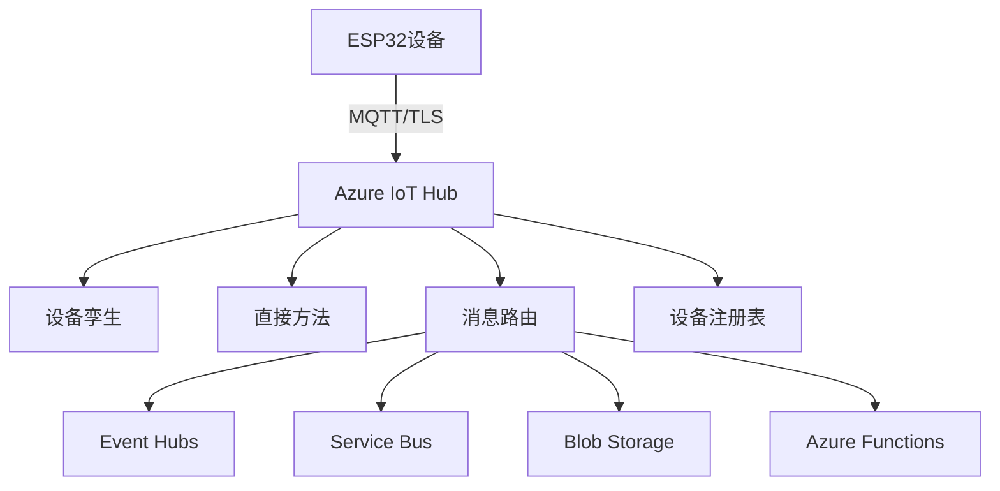

# Azure IoT Hub平台应用实战

## 学习目标

完成本教程后，你将能够：

- [ ] 理解Azure IoT Hub的核心概念和架构
- [ ] 掌握Azure IoT设备注册和连接字符串管理
- [ ] 使用ESP32通过MQTT连接到Azure IoT Hub
- [ ] 实现设备孪生（Device Twin）功能
- [ ] 使用直接方法（Direct Method）进行设备控制

## 前置要求

在开始本教程之前，你需要：

**知识要求**：
- 了解MQTT协议基础知识
- 熟悉C语言编程
- 理解JSON数据格式
- 了解基本的云计算概念

**技能要求**：
- 能够使用Arduino IDE或ESP-IDF开发ESP32
- 会配置WiFi网络连接
- 有Azure账号（可使用免费套餐）

**账号准备**：
- Azure账号（注册地址：https://azure.microsoft.com/）
- 信用卡（用于账号验证，免费套餐不收费）

## 准备工作

### 硬件准备

| 名称 | 数量 | 说明 | 参考链接 |
|------|------|------|----------|
| ESP32开发板 | 1 | ESP32-DevKitC或类似型号 | - |
| DHT11温湿度传感器 | 1 | 用于数据采集 | - |
| LED灯 | 2 | 用于演示远程控制 | - |
| 电阻 | 2 | 220Ω，LED限流电阻 | - |
| Micro USB数据线 | 1 | 用于供电和程序下载 | - |

### 软件准备

- **开发环境**：Arduino IDE 2.0+ 或 ESP-IDF v4.4+
- **Azure IoT库**：
  - Arduino: `Azure IoT Hub` by Microsoft
  - ESP-IDF: Azure IoT SDK for C
- **依赖库**：
  - `PubSubClient`：MQTT客户端
  - `ArduinoJson`：JSON处理
  - `WiFiClientSecure`：TLS连接

### Azure IoT Hub免费套餐

Azure IoT Hub提供永久免费套餐（F1层）：
- 每天8,000条消息
- 每月最多500个设备
- 基础设备管理功能
- 设备孪生和直接方法

**注意**：超出免费额度后会产生费用，建议设置预算告警。

## Azure IoT Hub基础概念

### 什么是Azure IoT Hub？

Azure IoT Hub是微软提供的托管云服务，为IoT应用程序和设备之间提供可靠、安全的双向通信。

**核心特点**：
- **多种认证方式**：支持SAS令牌和X.509证书
- **设备孪生**：设备状态的JSON文档，支持云端和设备同步
- **直接方法**：从云端直接调用设备上的方法
- **消息路由**：将设备消息路由到不同的Azure服务
- **高可用性**：99.9% SLA保证，支持数百万设备

### Azure IoT Hub架构



### 核心组件

**1. 设备注册表（Device Registry）**
- 存储设备身份和元数据
- 管理设备连接字符串
- 支持设备启用/禁用

**2. 设备孪生（Device Twin）**
- 设备状态的JSON文档
- 包含tags（标签）、properties（属性）
- 支持reported（设备上报）和desired（期望状态）

**3. 消息传输**
- 设备到云（D2C）：遥测数据上传
- 云到设备（C2D）：命令和通知下发
- 支持MQTT、AMQP、HTTPS协议

**4. 直接方法（Direct Method）**
- 同步调用设备上的方法
- 支持请求-响应模式
- 适合需要立即确认的操作

**5. 消息路由（Message Routing）**
- 基于查询语法过滤消息
- 将消息路由到不同端点
- 支持多个路由规则

## 步骤1：创建Azure IoT Hub

### 1.1 登录Azure门户

1. 访问 https://portal.azure.com/
2. 登录你的Azure账号
3. 在搜索栏中输入"IoT Hub"
4. 选择"IoT Hub"服务

### 1.2 创建IoT Hub实例

1. 点击"创建"按钮
2. 填写基本信息：
   - **订阅**：选择你的订阅
   - **资源组**：创建新资源组 `rg-iot-tutorial`
   - **区域**：选择离你最近的区域（如East Asia）
   - **IoT Hub名称**：`iot-hub-esp32-demo`（必须全局唯一）
3. 点击"下一步：网络"
4. 保持默认设置（公共访问）
5. 点击"下一步：管理"
6. 定价和缩放层：
   - **定价和缩放层**：选择 `F1: 免费层`
   - **IoT Hub单位**：1
   - **设备到云分区**：2（默认）
7. 点击"查看 + 创建"
8. 检查配置后点击"创建"

**等待部署**：部署通常需要2-3分钟。

### 1.3 获取IoT Hub连接信息

部署完成后：

1. 进入创建的IoT Hub资源
2. 在左侧菜单选择"设置" -> "共享访问策略"
3. 点击"iothubowner"策略
4. 复制"主连接字符串"（后续配置消息路由时使用）
5. 记录IoT Hub主机名，格式：`iot-hub-esp32-demo.azure-devices.net`

**预期结果**：
- 成功创建IoT Hub实例
- 获取IoT Hub主机名
- 获取管理连接字符串

## 步骤2：注册IoT设备

### 2.1 创建设备身份

1. 在IoT Hub页面，选择"设备管理" -> "设备"
2. 点击"添加设备"
3. 填写设备信息：
   - **设备ID**：`ESP32_Device_001`
   - **身份验证类型**：选择"对称密钥"
   - **自动生成密钥**：勾选
   - **连接到IoT Hub**：启用
4. 点击"保存"

### 2.2 获取设备连接字符串

1. 在设备列表中点击刚创建的设备`ESP32_Device_001`
2. 复制"主连接字符串"
3. 连接字符串格式：
   ```
   HostName=iot-hub-esp32-demo.azure-devices.net;DeviceId=ESP32_Device_001;SharedAccessKey=xxxxxxxxxxxxxx
   ```

**重要**：妥善保存此连接字符串，它包含设备的认证信息！

### 2.3 理解连接字符串

连接字符串包含三个部分：

```text
HostName=<IoT Hub名称>.azure-devices.net
DeviceId=<设备ID>
SharedAccessKey=<设备密钥>
```

- **HostName**：IoT Hub的MQTT端点
- **DeviceId**：设备的唯一标识符
- **SharedAccessKey**：用于生成SAS令牌的密钥

### 2.4 生成SAS令牌（可选）

如果需要手动生成SAS令牌，可以使用以下Python脚本：

```python
import base64
import hmac
import hashlib
import time
from urllib.parse import quote_plus

def generate_sas_token(uri, key, policy_name, expiry=3600):
    ttl = time.time() + expiry
    sign_key = "%s\n%d" % ((quote_plus(uri)), int(ttl))
    signature = base64.b64encode(
        hmac.new(
            base64.b64decode(key),
            sign_key.encode('utf-8'),
            hashlib.sha256
        ).digest()
    )
    
    rawtoken = {
        'sr': uri,
        'sig': signature,
        'se': str(int(ttl))
    }
    
    if policy_name is not None:
        rawtoken['skn'] = policy_name
    
    return 'SharedAccessSignature ' + '&'.join(
        ['%s=%s' % (k, quote_plus(v)) for k, v in rawtoken.items()]
    )

# 使用示例
uri = "iot-hub-esp32-demo.azure-devices.net/devices/ESP32_Device_001"
key = "你的SharedAccessKey"
token = generate_sas_token(uri, key, None, 3600)
print(token)
```

**预期结果**：
- 成功创建设备身份
- 获取设备连接字符串
- 理解SAS令牌认证机制

## 步骤3：准备ESP32开发环境

### 3.1 安装Arduino库

在Arduino IDE中安装以下库：

1. **AzureIoTHub**：Azure IoT Hub客户端库
2. **AzureIoTUtility**：Azure IoT工具库
3. **AzureIoTProtocol_MQTT**：MQTT协议支持
4. **ArduinoJson**：JSON解析库

安装方法：
- 打开 工具 -> 管理库
- 搜索并安装上述库

### 3.2 创建配置文件

创建 `config.h` 文件，包含WiFi和Azure配置：

```c
#ifndef CONFIG_H
#define CONFIG_H

// WiFi配置
const char* WIFI_SSID = "你的WiFi名称";
const char* WIFI_PASSWORD = "你的WiFi密码";

// Azure IoT Hub配置
// 完整的设备连接字符串
const char* CONNECTION_STRING = "HostName=iot-hub-esp32-demo.azure-devices.net;DeviceId=ESP32_Device_001;SharedAccessKey=xxxxxxxxxxxxxx";

// 或者分开配置
const char* IOT_HUB_HOSTNAME = "iot-hub-esp32-demo.azure-devices.net";
const char* DEVICE_ID = "ESP32_Device_001";
const char* DEVICE_KEY = "你的SharedAccessKey";

#endif
```

**安全提示**：
- 不要将此文件上传到公共代码仓库
- 使用`.gitignore`排除此文件
- 生产环境应使用安全存储方案

### 3.3 理解Azure IoT MQTT主题

Azure IoT Hub使用特定的MQTT主题格式：

**设备到云（D2C）消息**：
```
devices/{device_id}/messages/events/
```

**云到设备（C2D）消息**：
```
devices/{device_id}/messages/devicebound/#
```

**设备孪生更新**：
```
$iothub/twin/PATCH/properties/reported/?$rid={request_id}
$iothub/twin/PATCH/properties/desired/#
```

**直接方法**：
```
$iothub/methods/POST/{method_name}/?$rid={request_id}
$iothub/methods/res/{status}/?$rid={request_id}
```

## 步骤4：实现基础Azure IoT连接

### 4.1 创建Arduino项目

创建新项目：`ESP32_Azure_IoT_Basic`

### 4.2 包含必要的库

```c
#include <WiFi.h>
#include <WiFiClientSecure.h>
#include <PubSubClient.h>
#include <ArduinoJson.h>
#include "config.h"

// LED引脚
const int LED_PIN = 2;

// MQTT客户端
WiFiClientSecure wifiClient;
PubSubClient mqttClient(wifiClient);

// Azure IoT Hub MQTT配置
const char* MQTT_SERVER = IOT_HUB_HOSTNAME;
const int MQTT_PORT = 8883;

// MQTT主题
String telemetryTopic = "devices/" + String(DEVICE_ID) + "/messages/events/";
String c2dTopic = "devices/" + String(DEVICE_ID) + "/messages/devicebound/#";

// 函数声明
void connectWiFi();
void connectAzureIoT();
void messageCallback(char* topic, byte* payload, unsigned int length);
void publishTelemetry();
String generateSasToken();
```

### 4.3 WiFi连接函数

```c
void connectWiFi() {
    Serial.print("连接到WiFi: ");
    Serial.println(WIFI_SSID);
    
    WiFi.mode(WIFI_STA);
    WiFi.begin(WIFI_SSID, WIFI_PASSWORD);
    
    while (WiFi.status() != WL_CONNECTED) {
        delay(500);
        Serial.print(".");
    }
    
    Serial.println("\nWiFi连接成功");
    Serial.print("IP地址: ");
    Serial.println(WiFi.localIP());
}
```

### 4.4 生成SAS令牌函数

```c
#include <base64.h>
#include <mbedtls/md.h>

String generateSasToken() {
    // 计算过期时间（当前时间 + 1小时）
    unsigned long expiryTime = (unsigned long)time(nullptr) + 3600;
    
    // 构建签名字符串
    String stringToSign = String(IOT_HUB_HOSTNAME) + "/devices/" + 
                         String(DEVICE_ID) + "\n" + String(expiryTime);
    
    // 解码设备密钥
    int keyLength = strlen(DEVICE_KEY);
    int decodedKeyLength = base64_dec_len(DEVICE_KEY, keyLength);
    char decodedKey[decodedKeyLength];
    base64_decode(decodedKey, DEVICE_KEY, keyLength);
    
    // 使用HMAC-SHA256计算签名
    byte hmacResult[32];
    mbedtls_md_context_t ctx;
    mbedtls_md_type_t md_type = MBEDTLS_MD_SHA256;
    
    mbedtls_md_init(&ctx);
    mbedtls_md_setup(&ctx, mbedtls_md_info_from_type(md_type), 1);
    mbedtls_md_hmac_starts(&ctx, (const unsigned char*)decodedKey, decodedKeyLength);
    mbedtls_md_hmac_update(&ctx, (const unsigned char*)stringToSign.c_str(), 
                          stringToSign.length());
    mbedtls_md_hmac_finish(&ctx, hmacResult);
    mbedtls_md_free(&ctx);
    
    // Base64编码签名
    String signature = base64::encode(hmacResult, 32);
    signature.replace("\n", "");
    
    // URL编码
    signature.replace("+", "%2B");
    signature.replace("=", "%3D");
    signature.replace("/", "%2F");
    
    // 构建SAS令牌
    String sasToken = "SharedAccessSignature sr=" + String(IOT_HUB_HOSTNAME) + 
                     "%2Fdevices%2F" + String(DEVICE_ID) +
                     "&sig=" + signature +
                     "&se=" + String(expiryTime);
    
    return sasToken;
}
```

### 4.5 Azure IoT连接函数

```c
void connectAzureIoT() {
    // 配置TLS（Azure IoT Hub需要TLS连接）
    wifiClient.setInsecure(); // 开发环境可用，生产环境应验证证书
    
    // 配置MQTT服务器
    mqttClient.setServer(MQTT_SERVER, MQTT_PORT);
    mqttClient.setCallback(messageCallback);
    mqttClient.setBufferSize(512); // 增加缓冲区大小
    
    Serial.print("连接到Azure IoT Hub...");
    
    // 生成SAS令牌作为密码
    String sasToken = generateSasToken();
    
    // MQTT用户名格式：{iothubhostname}/{device_id}/?api-version=2021-04-12
    String mqttUsername = String(IOT_HUB_HOSTNAME) + "/" + String(DEVICE_ID) + 
                         "/?api-version=2021-04-12";
    
    // 连接到MQTT代理
    while (!mqttClient.connected()) {
        if (mqttClient.connect(DEVICE_ID, mqttUsername.c_str(), sasToken.c_str())) {
            Serial.println("已连接!");
            
            // 订阅云到设备消息主题
            mqttClient.subscribe(c2dTopic.c_str());
            Serial.print("已订阅主题: ");
            Serial.println(c2dTopic);
        } else {
            Serial.print("连接失败, 错误代码=");
            Serial.print(mqttClient.state());
            Serial.println(" 5秒后重试");
            delay(5000);
        }
    }
}
```

**连接说明**：
- 使用8883端口（MQTT over TLS）
- 用户名包含API版本信息
- 密码使用SAS令牌
- 客户端ID使用设备ID

### 4.6 消息处理回调函数

```c
void messageCallback(char* topic, byte* payload, unsigned int length) {
    Serial.print("收到消息 [");
    Serial.print(topic);
    Serial.print("]: ");
    
    // 将payload转换为字符串
    String message = "";
    for (int i = 0; i < length; i++) {
        message += (char)payload[i];
    }
    Serial.println(message);
    
    // 解析JSON消息
    StaticJsonDocument<200> doc;
    DeserializationError error = deserializeJson(doc, message);
    
    if (error) {
        Serial.print("JSON解析失败: ");
        Serial.println(error.c_str());
        return;
    }
    
    // 处理LED控制命令
    if (doc.containsKey("led")) {
        String ledState = doc["led"];
        if (ledState == "ON") {
            digitalWrite(LED_PIN, HIGH);
            Serial.println("LED已打开");
        } else if (ledState == "OFF") {
            digitalWrite(LED_PIN, LOW);
            Serial.println("LED已关闭");
        }
    }
}
```

### 4.7 发布遥测数据

```c
void publishTelemetry() {
    // 创建JSON文档
    StaticJsonDocument<200> doc;
    doc["deviceId"] = DEVICE_ID;
    doc["temperature"] = 25.5 + random(-50, 50) / 10.0;
    doc["humidity"] = 60.0 + random(-100, 100) / 10.0;
    doc["timestamp"] = millis();
    
    // 序列化为字符串
    char jsonBuffer[512];
    serializeJson(doc, jsonBuffer);
    
    // 发布消息到Azure IoT Hub
    Serial.print("发布遥测数据: ");
    Serial.println(jsonBuffer);
    
    if (mqttClient.publish(telemetryTopic.c_str(), jsonBuffer)) {
        Serial.println("消息发布成功");
    } else {
        Serial.println("消息发布失败");
    }
}
```

### 4.8 时间同步函数

```c
#include <time.h>

void syncTime() {
    // 配置NTP服务器
    configTime(0, 0, "pool.ntp.org", "time.nist.gov");
    
    Serial.print("等待NTP时间同步: ");
    time_t now = time(nullptr);
    while (now < 8 * 3600 * 2) {
        delay(500);
        Serial.print(".");
        now = time(nullptr);
    }
    Serial.println("\n时间同步完成");
    
    struct tm timeinfo;
    gmtime_r(&now, &timeinfo);
    Serial.print("当前时间: ");
    Serial.println(asctime(&timeinfo));
}
```

### 4.9 主程序

```c
void setup() {
    Serial.begin(115200);
    delay(1000);
    
    // 初始化LED
    pinMode(LED_PIN, OUTPUT);
    digitalWrite(LED_PIN, LOW);
    
    // 连接WiFi
    connectWiFi();
    
    // 同步时间（SAS令牌生成需要准确时间）
    syncTime();
    
    // 连接Azure IoT Hub
    connectAzureIoT();
    
    Serial.println("初始化完成");
}

void loop() {
    // 保持MQTT连接
    if (!mqttClient.connected()) {
        connectAzureIoT();
    }
    mqttClient.loop();
    
    // 每10秒发布一次遥测数据
    static unsigned long lastPublish = 0;
    unsigned long now = millis();
    
    if (now - lastPublish > 10000) {
        lastPublish = now;
        publishTelemetry();
    }
}
```

## 步骤5：测试Azure IoT连接

### 5.1 编译和上传

1. 确保`config.h`文件配置正确
2. 选择开发板：ESP32 Dev Module
3. 选择端口
4. 点击上传
5. 打开串口监视器（波特率115200）

**预期输出**：
```
连接到WiFi: YourWiFi
.....
WiFi连接成功
IP地址: 192.168.1.100
等待NTP时间同步: ......
时间同步完成
当前时间: Sat Mar  8 10:30:45 2026
连接到Azure IoT Hub...已连接!
已订阅主题: devices/ESP32_Device_001/messages/devicebound/#
初始化完成
发布遥测数据: {"deviceId":"ESP32_Device_001","temperature":25.3,"humidity":62.5,"timestamp":10234}
消息发布成功
```

### 5.2 使用Azure门户监控消息

#### 方法1：使用内置监控

1. 在Azure门户打开你的IoT Hub
2. 选择"概述"页面
3. 查看"设备到云消息"图表
4. 应该能看到消息计数增加

#### 方法2：使用Azure CLI

安装Azure CLI后，运行：

```bash
# 登录Azure
az login

# 监控设备消息
az iot hub monitor-events --hub-name iot-hub-esp32-demo --device-id ESP32_Device_001
```

**预期输出**：
```json
{
    "event": {
        "origin": "ESP32_Device_001",
        "module": "",
        "interface": "",
        "component": "",
        "payload": "{\"deviceId\":\"ESP32_Device_001\",\"temperature\":25.3,\"humidity\":62.5,\"timestamp\":10234}"
    }
}
```

### 5.3 发送云到设备消息

#### 使用Azure门户：

1. 在IoT Hub中选择"设备管理" -> "设备"
2. 点击设备`ESP32_Device_001`
3. 点击"向设备发送消息"
4. 消息正文：
   ```json
   {
     "led": "ON"
   }
   ```
5. 点击"发送消息"
6. 观察ESP32的LED是否点亮

#### 使用Azure CLI：

```bash
az iot device c2d-message send \
  --hub-name iot-hub-esp32-demo \
  --device-id ESP32_Device_001 \
  --data '{"led":"ON"}'
```

**预期结果**：
- 能在Azure CLI中看到ESP32发送的数据
- 能通过门户或CLI控制ESP32的LED

## 步骤6：实现设备孪生功能

### 6.1 什么是设备孪生？

设备孪生（Device Twin）是设备状态的JSON文档，包含：
- **tags**：后端应用设置的标签（设备不可见）
- **properties.desired**：后端应用设置的期望属性
- **properties.reported**：设备上报的实际属性

### 6.2 设备孪生文档结构

```json
{
  "deviceId": "ESP32_Device_001",
  "etag": "AAAAAAAAAAE=",
  "version": 2,
  "tags": {
    "location": "Building 43",
    "floor": "2"
  },
  "properties": {
    "desired": {
      "telemetryInterval": 10,
      "ledState": "ON",
      "$metadata": {...},
      "$version": 1
    },
    "reported": {
      "telemetryInterval": 10,
      "ledState": "ON",
      "temperature": 25.5,
      "humidity": 60.0,
      "$metadata": {...},
      "$version": 1
    }
  }
}
```

### 6.3 添加设备孪生主题定义

```c
// 设备孪生MQTT主题
String twinGetTopic = "$iothub/twin/GET/?$rid=0";
String twinPatchTopic = "$iothub/twin/PATCH/properties/reported/?$rid=";
String twinDesiredTopic = "$iothub/twin/PATCH/properties/desired/#";
String twinResponseTopic = "$iothub/twin/res/#";

// 请求ID计数器
int requestId = 0;
```

### 6.4 订阅设备孪生主题

修改`connectAzureIoT()`函数：

```c
void connectAzureIoT() {
    // ... 前面的代码保持不变 ...
    
    if (mqttClient.connect(DEVICE_ID, mqttUsername.c_str(), sasToken.c_str())) {
        Serial.println("已连接!");
        
        // 订阅云到设备消息
        mqttClient.subscribe(c2dTopic.c_str());
        
        // 订阅设备孪生主题
        mqttClient.subscribe(twinResponseTopic.c_str());
        mqttClient.subscribe(twinDesiredTopic.c_str());
        
        Serial.println("已订阅所有主题");
        
        // 请求当前设备孪生状态
        mqttClient.publish(twinGetTopic.c_str(), "");
        Serial.println("已请求设备孪生状态");
    }
    // ... 后面的代码保持不变 ...
}
```

### 6.5 处理设备孪生消息

修改`messageCallback()`函数：

```c
void messageCallback(char* topic, byte* payload, unsigned int length) {
    Serial.print("收到消息 [");
    Serial.print(topic);
    Serial.print("]: ");
    
    String message = "";
    for (int i = 0; i < length; i++) {
        message += (char)payload[i];
    }
    Serial.println(message);
    
    String topicStr = String(topic);
    
    // 处理设备孪生响应
    if (topicStr.startsWith("$iothub/twin/res/")) {
        // 提取状态码
        int statusStart = topicStr.indexOf("/res/") + 5;
        int statusEnd = topicStr.indexOf("/", statusStart);
        String statusCode = topicStr.substring(statusStart, statusEnd);
        
        Serial.print("设备孪生响应状态码: ");
        Serial.println(statusCode);
        
        if (statusCode == "200") {
            Serial.println("设备孪生操作成功");
            // 解析完整的设备孪生文档
            parseTwinDocument(message);
        } else {
            Serial.println("设备孪生操作失败");
        }
    }
    // 处理期望属性更新
    else if (topicStr.startsWith("$iothub/twin/PATCH/properties/desired")) {
        Serial.println("收到期望属性更新");
        handleDesiredProperties(message);
    }
    // 处理云到设备消息
    else if (topicStr.startsWith("devices/" + String(DEVICE_ID) + "/messages/devicebound")) {
        handleC2DMessage(message);
    }
}

void parseTwinDocument(String message) {
    StaticJsonDocument<1024> doc;
    DeserializationError error = deserializeJson(doc, message);
    
    if (error) {
        Serial.print("解析设备孪生文档失败: ");
        Serial.println(error.c_str());
        return;
    }
    
    // 读取期望属性
    if (doc.containsKey("desired")) {
        JsonObject desired = doc["desired"];
        handleDesiredProperties(desired);
    }
}

void handleDesiredProperties(String message) {
    StaticJsonDocument<512> doc;
    DeserializationError error = deserializeJson(doc, message);
    
    if (error) {
        Serial.print("解析期望属性失败: ");
        Serial.println(error.c_str());
        return;
    }
    
    handleDesiredProperties(doc.as<JsonObject>());
}

void handleDesiredProperties(JsonObject desired) {
    // 处理LED状态
    if (desired.containsKey("ledState")) {
        String ledState = desired["ledState"];
        bool newLedState = (ledState == "ON");
        
        digitalWrite(LED_PIN, newLedState ? HIGH : LOW);
        Serial.print("LED状态更新为: ");
        Serial.println(ledState);
        
        // 上报新状态到设备孪生
        updateReportedProperties(newLedState);
    }
    
    // 处理遥测间隔
    if (desired.containsKey("telemetryInterval")) {
        int interval = desired["telemetryInterval"];
        Serial.print("遥测间隔更新为: ");
        Serial.print(interval);
        Serial.println("秒");
        // 这里可以更新全局变量来改变发送频率
    }
}

void handleC2DMessage(String message) {
    StaticJsonDocument<200> doc;
    DeserializationError error = deserializeJson(doc, message);
    
    if (error) {
        Serial.print("JSON解析失败: ");
        Serial.println(error.c_str());
        return;
    }
    
    if (doc.containsKey("led")) {
        String ledState = doc["led"];
        digitalWrite(LED_PIN, (ledState == "ON") ? HIGH : LOW);
    }
}
```

### 6.6 更新上报属性

```c
void updateReportedProperties(bool ledState) {
    // 创建上报属性JSON
    StaticJsonDocument<512> doc;
    doc["ledState"] = ledState ? "ON" : "OFF";
    doc["temperature"] = 25.5;
    doc["humidity"] = 60.0;
    doc["timestamp"] = millis();
    
    // 序列化
    char jsonBuffer[512];
    serializeJson(doc, jsonBuffer);
    
    // 构建主题（包含请求ID）
    String topic = twinPatchTopic + String(requestId++);
    
    // 发布到设备孪生更新主题
    Serial.print("更新上报属性: ");
    Serial.println(jsonBuffer);
    mqttClient.publish(topic.c_str(), jsonBuffer);
}
```

### 6.7 定期上报状态

在`loop()`函数中添加：

```c
void loop() {
    // ... 保持连接的代码 ...
    
    // 每30秒更新一次设备孪生
    static unsigned long lastTwinUpdate = 0;
    unsigned long now = millis();
    
    if (now - lastTwinUpdate > 30000) {
        lastTwinUpdate = now;
        
        bool currentLedState = digitalRead(LED_PIN);
        updateReportedProperties(currentLedState);
    }
    
    // ... 其他代码 ...
}
```

### 6.8 测试设备孪生

#### 在Azure门户查看设备孪生：

1. 进入IoT Hub
2. 选择"设备管理" -> "设备"
3. 点击"ESP32_Device_001"
4. 选择"设备孪生"标签页
5. 查看完整的设备孪生文档

#### 更新期望属性：

1. 在设备孪生页面点击"编辑"
2. 在`properties.desired`中添加：
```json
{
  "properties": {
    "desired": {
      "ledState": "ON",
      "telemetryInterval": 15
    }
  }
}
```
3. 点击"保存"
4. 观察ESP32的LED是否点亮
5. 查看`properties.reported`是否更新

#### 使用Azure CLI更新：

```bash
az iot hub device-twin update \
  --hub-name iot-hub-esp32-demo \
  --device-id ESP32_Device_001 \
  --desired '{"ledState":"ON","telemetryInterval":15}'
```

## 步骤7：实现直接方法

### 7.1 什么是直接方法？

直接方法（Direct Method）允许云端应用程序直接调用设备上的方法，并获得即时响应。

**特点**：
- 同步调用（请求-响应模式）
- 支持超时设置
- 适合需要立即确认的操作
- 可以传递参数和返回结果

### 7.2 添加直接方法主题

```c
// 直接方法MQTT主题
String methodRequestTopic = "$iothub/methods/POST/#";
String methodResponseTopic = "$iothub/methods/res/";
```

### 7.3 订阅直接方法主题

修改`connectAzureIoT()`函数：

```c
void connectAzureIoT() {
    // ... 前面的代码 ...
    
    if (mqttClient.connect(DEVICE_ID, mqttUsername.c_str(), sasToken.c_str())) {
        Serial.println("已连接!");
        
        // 订阅所有主题
        mqttClient.subscribe(c2dTopic.c_str());
        mqttClient.subscribe(twinResponseTopic.c_str());
        mqttClient.subscribe(twinDesiredTopic.c_str());
        mqttClient.subscribe(methodRequestTopic.c_str()); // 订阅直接方法
        
        Serial.println("已订阅所有主题");
    }
    // ... 后面的代码 ...
}
```

### 7.4 处理直接方法调用

修改`messageCallback()`函数，添加直接方法处理：

```c
void messageCallback(char* topic, byte* payload, unsigned int length) {
    // ... 前面的代码 ...
    
    String topicStr = String(topic);
    
    // 处理直接方法调用
    if (topicStr.startsWith("$iothub/methods/POST/")) {
        handleDirectMethod(topicStr, message);
    }
    // ... 其他处理 ...
}

void handleDirectMethod(String topic, String payload) {
    // 提取方法名和请求ID
    int methodStart = topic.indexOf("/POST/") + 6;
    int methodEnd = topic.indexOf("/?$rid=");
    String methodName = topic.substring(methodStart, methodEnd);
    
    int ridStart = topic.indexOf("/?$rid=") + 7;
    String requestId = topic.substring(ridStart);
    
    Serial.print("收到直接方法调用: ");
    Serial.println(methodName);
    Serial.print("请求ID: ");
    Serial.println(requestId);
    Serial.print("参数: ");
    Serial.println(payload);
    
    // 根据方法名调用相应的处理函数
    int statusCode = 200;
    String response = "";
    
    if (methodName == "setLED") {
        response = handleSetLED(payload, statusCode);
    } else if (methodName == "getStatus") {
        response = handleGetStatus(payload, statusCode);
    } else if (methodName == "reboot") {
        response = handleReboot(payload, statusCode);
    } else {
        statusCode = 404;
        response = "{\"error\":\"Method not found\"}";
    }
    
    // 发送响应
    sendMethodResponse(requestId, statusCode, response);
}
```

### 7.5 实现具体的方法处理函数

```c
String handleSetLED(String payload, int& statusCode) {
    StaticJsonDocument<200> doc;
    DeserializationError error = deserializeJson(doc, payload);
    
    if (error) {
        statusCode = 400;
        return "{\"error\":\"Invalid JSON\"}";
    }
    
    if (!doc.containsKey("state")) {
        statusCode = 400;
        return "{\"error\":\"Missing 'state' parameter\"}";
    }
    
    String state = doc["state"];
    if (state == "ON") {
        digitalWrite(LED_PIN, HIGH);
        statusCode = 200;
        return "{\"result\":\"LED turned ON\"}";
    } else if (state == "OFF") {
        digitalWrite(LED_PIN, LOW);
        statusCode = 200;
        return "{\"result\":\"LED turned OFF\"}";
    } else {
        statusCode = 400;
        return "{\"error\":\"Invalid state value\"}";
    }
}

String handleGetStatus(String payload, int& statusCode) {
    StaticJsonDocument<512> doc;
    doc["deviceId"] = DEVICE_ID;
    doc["ledState"] = digitalRead(LED_PIN) ? "ON" : "OFF";
    doc["uptime"] = millis() / 1000;
    doc["freeHeap"] = ESP.getFreeHeap();
    doc["wifiRSSI"] = WiFi.RSSI();
    
    char jsonBuffer[512];
    serializeJson(doc, jsonBuffer);
    
    statusCode = 200;
    return String(jsonBuffer);
}

String handleReboot(String payload, int& statusCode) {
    Serial.println("收到重启命令，3秒后重启...");
    statusCode = 200;
    
    // 延迟重启，先发送响应
    delay(100);
    ESP.restart();
    
    return "{\"result\":\"Rebooting...\"}";
}

void sendMethodResponse(String requestId, int statusCode, String response) {
    // 构建响应主题
    String topic = methodResponseTopic + String(statusCode) + "/?$rid=" + requestId;
    
    Serial.print("发送方法响应 [");
    Serial.print(statusCode);
    Serial.print("]: ");
    Serial.println(response);
    
    mqttClient.publish(topic.c_str(), response.c_str());
}
```

### 7.6 测试直接方法

#### 使用Azure门户调用：

1. 在设备页面选择"直接方法"标签页
2. 方法名称：`setLED`
3. 有效负载：
   ```json
   {
     "state": "ON"
   }
   ```
4. 点击"调用方法"
5. 查看响应结果

#### 使用Azure CLI调用：

```bash
# 调用setLED方法
az iot hub invoke-device-method \
  --hub-name iot-hub-esp32-demo \
  --device-id ESP32_Device_001 \
  --method-name setLED \
  --method-payload '{"state":"ON"}'

# 调用getStatus方法
az iot hub invoke-device-method \
  --hub-name iot-hub-esp32-demo \
  --device-id ESP32_Device_001 \
  --method-name getStatus \
  --method-payload '{}'
```

**预期响应**：
```json
{
  "status": 200,
  "payload": {
    "result": "LED turned ON"
  }
}
```

## 步骤8：配置消息路由

### 8.1 什么是消息路由？

消息路由允许你将设备消息自动路由到不同的Azure服务，如：
- Event Hubs（事件中心）
- Service Bus Queue/Topic（服务总线）
- Blob Storage（Blob存储）
- Cosmos DB（通过Azure Functions）

### 8.2 创建存储账户

1. 在Azure门户搜索"存储账户"
2. 点击"创建"
3. 填写信息：
   - 资源组：`rg-iot-tutorial`
   - 存储账户名称：`iotstoragedemo`（必须全局唯一）
   - 区域：与IoT Hub相同
   - 性能：标准
   - 冗余：LRS（本地冗余存储）
4. 点击"查看 + 创建"，然后"创建"

### 8.3 创建Blob容器

1. 进入创建的存储账户
2. 选择"数据存储" -> "容器"
3. 点击"+ 容器"
4. 名称：`telemetry-data`
5. 公共访问级别：私有
6. 点击"创建"

### 8.4 配置消息路由

1. 返回IoT Hub
2. 选择"消息路由" -> "路由"
3. 点击"+ 添加"
4. 填写路由信息：
   - 名称：`TelemetryToStorage`
   - 端点：点击"+ 添加端点" -> "存储"
     - 端点名称：`storage-endpoint`
     - 选择容器：`telemetry-data`
     - 编码：JSON
     - 文件名格式：`{iothub}/{partition}/{YYYY}/{MM}/{DD}/{HH}/{mm}`
     - 批处理频率：100秒
     - 块大小：100MB
   - 数据源：设备遥测消息
   - 路由查询：`true`（接受所有消息）
5. 点击"保存"

### 8.5 添加温度告警路由

创建第二个路由，只保存高温数据：

1. 点击"+ 添加"
2. 名称：`HighTemperatureAlert`
3. 端点：创建新的存储端点或使用Event Hub
4. 路由查询：
   ```sql
   temperature > 30
   ```
5. 点击"保存"

**路由查询语法**：
- 基本比较：`temperature > 30`
- 逻辑运算：`temperature > 30 AND humidity < 40`
- 字符串匹配：`deviceId = 'ESP32_Device_001'`
- 函数：`IS_DEFINED($body.temperature)`

### 8.6 验证消息路由

1. 等待ESP32发送几条消息
2. 进入存储账户的容器
3. 浏览文件夹结构，找到JSON文件
4. 下载并查看内容

**文件内容示例**：
```json
{"deviceId":"ESP32_Device_001","temperature":25.3,"humidity":62.5,"timestamp":10234}
{"deviceId":"ESP32_Device_001","temperature":26.1,"humidity":61.2,"timestamp":20468}
```

## 步骤9：添加真实传感器

### 9.1 连接DHT11传感器

```c
#include <DHT.h>

#define DHTPIN 4
#define DHTTYPE DHT11
DHT dht(DHTPIN, DHTTYPE);

void setup() {
    // ... 其他初始化 ...
    dht.begin();
}
```

### 9.2 读取真实数据

```c
void publishTelemetry() {
    // 读取传感器
    float temperature = dht.readTemperature();
    float humidity = dht.readHumidity();
    
    // 检查读取是否成功
    if (isnan(temperature) || isnan(humidity)) {
        Serial.println("读取DHT传感器失败!");
        return;
    }
    
    // 创建JSON
    StaticJsonDocument<200> doc;
    doc["deviceId"] = DEVICE_ID;
    doc["temperature"] = temperature;
    doc["humidity"] = humidity;
    doc["timestamp"] = millis();
    
    char jsonBuffer[512];
    serializeJson(doc, jsonBuffer);
    
    // 发布
    Serial.print("发布遥测数据: ");
    Serial.println(jsonBuffer);
    mqttClient.publish(telemetryTopic.c_str(), jsonBuffer);
    
    // 同时更新设备孪生
    updateReportedProperties(digitalRead(LED_PIN));
}
```

### 9.3 添加消息属性

Azure IoT Hub支持在消息中添加自定义属性：

```c
void publishTelemetryWithProperties() {
    float temperature = dht.readTemperature();
    float humidity = dht.readHumidity();
    
    if (isnan(temperature) || isnan(humidity)) {
        return;
    }
    
    // 创建消息
    StaticJsonDocument<200> doc;
    doc["deviceId"] = DEVICE_ID;
    doc["temperature"] = temperature;
    doc["humidity"] = humidity;
    doc["timestamp"] = millis();
    
    char jsonBuffer[512];
    serializeJson(doc, jsonBuffer);
    
    // 构建带属性的主题
    // 格式：devices/{device_id}/messages/events/property1=value1&property2=value2
    String topicWithProps = telemetryTopic;
    topicWithProps += "$.ct=application%2Fjson&$.ce=utf-8";
    
    // 添加自定义属性
    if (temperature > 30) {
        topicWithProps += "&alert=high-temperature";
    }
    
    topicWithProps += "&sensorType=DHT11";
    
    mqttClient.publish(topicWithProps.c_str(), jsonBuffer);
}
```

**消息属性用途**：
- 消息路由过滤
- 消息分类
- 告警标记
- 元数据传递

## 故障排除

### 问题1：无法连接到Azure IoT Hub

**可能原因**：
- 连接字符串错误
- SAS令牌过期或生成错误
- 时间不同步
- 网络问题

**解决方法**：

1. **验证连接字符串**：
   - 确保HostName、DeviceId、SharedAccessKey都正确
   - 检查是否有多余的空格或换行符

2. **检查时间同步**：
   ```c
   void setup() {
       // ...
       syncTime();
       
       // 验证时间
       time_t now = time(nullptr);
       Serial.print("当前时间戳: ");
       Serial.println(now);
       
       if (now < 1000000000) {
           Serial.println("时间同步失败!");
           while(1) delay(1000);
       }
   }
   ```

3. **增加调试信息**：
   ```c
   void connectAzureIoT() {
       Serial.println("=== 连接调试信息 ===");
       Serial.print("MQTT服务器: ");
       Serial.println(MQTT_SERVER);
       Serial.print("MQTT端口: ");
       Serial.println(MQTT_PORT);
       Serial.print("设备ID: ");
       Serial.println(DEVICE_ID);
       Serial.print("用户名: ");
       Serial.println(mqttUsername);
       Serial.print("SAS令牌: ");
       Serial.println(sasToken.substring(0, 50) + "...");
       Serial.println("====================");
       
       // ... 连接代码 ...
   }
   ```

### 问题2：消息发布失败

**可能原因**：
- 消息过大
- 主题格式错误
- 连接不稳定
- 超出配额限制

**解决方法**：

1. **检查消息大小**：
   ```c
   void publishTelemetry() {
       // ...
       char jsonBuffer[512];
       int len = serializeJson(doc, jsonBuffer);
       
       Serial.print("消息大小: ");
       Serial.print(len);
       Serial.println(" 字节");
       
       if (len > 256 * 1024) {  // Azure IoT Hub限制256KB
           Serial.println("消息过大!");
           return;
       }
       
       // ...
   }
   ```

2. **添加重试机制**：
   ```c
   bool publishWithRetry(const char* topic, const char* payload, int maxRetries = 3) {
       for (int i = 0; i < maxRetries; i++) {
           if (mqttClient.publish(topic, payload)) {
               return true;
           }
           Serial.print("发布失败，重试 ");
           Serial.println(i + 1);
           delay(1000);
       }
       return false;
   }
   ```

3. **检查配额**：
   - 免费层限制：8,000条消息/天
   - 在Azure门户查看"指标"页面
   - 设置告警监控使用量

### 问题3：设备孪生更新失败

**可能原因**：
- JSON格式错误
- 请求ID重复
- 网络延迟

**解决方法**：

1. **验证JSON格式**：
   ```c
   void updateReportedProperties(bool ledState) {
       StaticJsonDocument<512> doc;
       doc["ledState"] = ledState ? "ON" : "OFF";
       
       // 验证JSON
       if (doc.overflowed()) {
           Serial.println("JSON文档溢出!");
           return;
       }
       
       char jsonBuffer[512];
       int len = serializeJson(doc, jsonBuffer);
       
       // 验证序列化
       if (len == 0) {
           Serial.println("JSON序列化失败!");
           return;
       }
       
       // ...
   }
   ```

2. **使用唯一请求ID**：
   ```c
   // 使用时间戳作为请求ID
   String topic = twinPatchTopic + String(millis());
   ```

### 问题4：直接方法无响应

**可能原因**：
- 方法名不匹配
- 响应超时
- 响应格式错误

**解决方法**：

1. **添加超时处理**：
   ```c
   String handleSetLED(String payload, int& statusCode) {
       unsigned long startTime = millis();
       
       // 处理逻辑...
       
       unsigned long duration = millis() - startTime;
       Serial.print("方法执行时间: ");
       Serial.print(duration);
       Serial.println("ms");
       
       return response;
   }
   ```

2. **验证响应格式**：
   - 响应必须是有效的JSON
   - 状态码必须是HTTP标准代码
   - 及时发送响应（默认超时30秒）

## 总结

通过本教程，你学习了：

- ✅ Azure IoT Hub的核心概念和架构
- ✅ 创建和配置IoT Hub和设备
- ✅ 使用ESP32通过MQTT连接到Azure IoT Hub
- ✅ 实现设备孪生功能进行状态同步
- ✅ 使用直接方法进行设备控制
- ✅ 配置消息路由处理设备数据
- ✅ 集成真实传感器采集数据

**关键要点**：
- Azure IoT Hub支持多种认证方式（SAS令牌、X.509证书）
- 设备孪生实现设备状态的云端同步
- 直接方法提供同步的设备控制能力
- 消息路由可以将数据自动分发到不同服务
- 时间同步对SAS令牌生成至关重要

## 进阶挑战

尝试以下挑战来巩固学习：

1. **挑战1**：实现设备预配服务（DPS）自动注册
2. **挑战2**：使用X.509证书认证替代SAS令牌
3. **挑战3**：集成Azure Stream Analytics进行实时数据分析
4. **挑战4**：使用Azure Functions处理设备消息
5. **挑战5**：实现设备固件OTA更新

## Azure IoT Hub与AWS IoT对比

| 特性 | Azure IoT Hub | AWS IoT Core |
|------|---------------|--------------|
| 认证方式 | SAS令牌、X.509证书 | X.509证书 |
| 协议支持 | MQTT、AMQP、HTTPS | MQTT、HTTPS、WebSocket |
| 设备状态 | 设备孪生（Device Twin） | 设备影子（Device Shadow） |
| 设备控制 | 直接方法（Direct Method） | 发布到特定主题 |
| 消息路由 | 内置路由引擎 | 规则引擎（SQL语法） |
| 免费套餐 | 永久免费（8000条/天） | 12个月（250000条/月） |
| 定价模式 | 按消息数和单位数 | 按消息数 |
| 设备管理 | 内置设备管理 | 需要额外服务 |
| 边缘计算 | IoT Edge | Greengrass |

**选择建议**：
- 如果已使用Azure生态系统 → Azure IoT Hub
- 如果需要更灵活的规则引擎 → AWS IoT Core
- 如果需要强大的设备管理 → Azure IoT Hub
- 如果需要更多的协议支持 → Azure IoT Hub

## 安全最佳实践

### 1. 认证和授权

- **使用X.509证书**：生产环境优先使用证书认证
- **定期轮换密钥**：定期更新SharedAccessKey
- **最小权限原则**：只授予设备必要的权限
- **禁用不用的设备**：及时禁用或删除不再使用的设备

### 2. 网络安全

- **始终使用TLS**：使用8883端口，不使用1883
- **IP过滤**：配置IP筛选器限制访问
- **私有端点**：敏感环境使用私有端点
- **VNet集成**：将IoT Hub集成到虚拟网络

### 3. 设备安全

- **安全启动**：启用ESP32的安全启动功能
- **固件加密**：加密存储的固件
- **安全存储**：使用ESP32的NVS加密存储密钥
- **看门狗定时器**：防止设备挂起

### 4. 数据安全

- **敏感数据加密**：传输前加密敏感数据
- **数据完整性**：使用消息属性验证数据完整性
- **访问控制**：使用Azure RBAC控制数据访问
- **审计日志**：启用诊断日志记录所有操作

### 5. 使用Azure Security Center

1. 在IoT Hub中启用"Azure Defender for IoT"
2. 配置安全建议
3. 监控安全告警
4. 定期查看安全评分

## 成本优化

### 免费套餐限制

- 消息数：8,000条/天
- 设备数：最多500个
- 设备孪生操作：包含在消息配额中
- 直接方法：包含在消息配额中

### 优化建议

1. **减少消息频率**：
   - 使用合理的上报间隔（如5-10分钟）
   - 只在数据变化时上报
   - 批量发送多个数据点

2. **优化消息大小**：
   - 使用紧凑的JSON格式
   - 移除不必要的字段
   - 使用缩写字段名

3. **使用设备孪生**：
   - 状态同步使用设备孪生而不是频繁消息
   - 减少不必要的孪生更新

4. **监控使用量**：
   - 设置Azure Monitor告警
   - 定期检查成本分析
   - 使用Azure Cost Management

### 升级到付费层

当免费套餐不够用时，可以升级到S1层：
- 400,000条消息/天/单位
- 可以添加多个单位
- 支持更多高级功能

## 完整代码

### 完整的ESP32 Azure IoT代码

```c
#include <WiFi.h>
#include <WiFiClientSecure.h>
#include <PubSubClient.h>
#include <ArduinoJson.h>
#include <DHT.h>
#include <time.h>
#include <base64.h>
#include <mbedtls/md.h>
#include "config.h"

// 硬件配置
#define LED_PIN 2
#define DHTPIN 4
#define DHTTYPE DHT11

// MQTT配置
const char* MQTT_SERVER = IOT_HUB_HOSTNAME;
const int MQTT_PORT = 8883;

// MQTT主题
String telemetryTopic = "devices/" + String(DEVICE_ID) + "/messages/events/";
String c2dTopic = "devices/" + String(DEVICE_ID) + "/messages/devicebound/#";
String twinGetTopic = "$iothub/twin/GET/?$rid=0";
String twinPatchTopic = "$iothub/twin/PATCH/properties/reported/?$rid=";
String twinDesiredTopic = "$iothub/twin/PATCH/properties/desired/#";
String twinResponseTopic = "$iothub/twin/res/#";
String methodRequestTopic = "$iothub/methods/POST/#";
String methodResponseTopic = "$iothub/methods/res/";

// 对象实例
WiFiClientSecure wifiClient;
PubSubClient mqttClient(wifiClient);
DHT dht(DHTPIN, DHTTYPE);

// 全局变量
int requestId = 0;

// 函数声明
void connectWiFi();
void syncTime();
String generateSasToken();
void connectAzureIoT();
void messageCallback(char* topic, byte* payload, unsigned int length);
void handleDirectMethod(String topic, String payload);
void handleDesiredProperties(JsonObject desired);
void publishTelemetry();
void updateReportedProperties(bool ledState);

void setup() {
    Serial.begin(115200);
    delay(1000);
    
    pinMode(LED_PIN, OUTPUT);
    digitalWrite(LED_PIN, LOW);
    
    dht.begin();
    
    connectWiFi();
    syncTime();
    connectAzureIoT();
    
    Serial.println("初始化完成");
}

void loop() {
    if (!mqttClient.connected()) {
        connectAzureIoT();
    }
    mqttClient.loop();
    
    static unsigned long lastPublish = 0;
    static unsigned long lastTwinUpdate = 0;
    unsigned long now = millis();
    
    if (now - lastPublish > 10000) {
        lastPublish = now;
        publishTelemetry();
    }
    
    if (now - lastTwinUpdate > 30000) {
        lastTwinUpdate = now;
        bool currentLedState = digitalRead(LED_PIN);
        updateReportedProperties(currentLedState);
    }
}

void connectWiFi() {
    Serial.print("连接到WiFi: ");
    Serial.println(WIFI_SSID);
    
    WiFi.mode(WIFI_STA);
    WiFi.begin(WIFI_SSID, WIFI_PASSWORD);
    
    while (WiFi.status() != WL_CONNECTED) {
        delay(500);
        Serial.print(".");
    }
    
    Serial.println("\nWiFi连接成功");
    Serial.print("IP地址: ");
    Serial.println(WiFi.localIP());
}

void syncTime() {
    configTime(0, 0, "pool.ntp.org", "time.nist.gov");
    Serial.print("等待NTP时间同步: ");
    time_t now = time(nullptr);
    while (now < 8 * 3600 * 2) {
        delay(500);
        Serial.print(".");
        now = time(nullptr);
    }
    Serial.println("\n时间同步完成");
    struct tm timeinfo;
    gmtime_r(&now, &timeinfo);
    Serial.print("当前时间: ");
    Serial.println(asctime(&timeinfo));
}

String generateSasToken() {
    unsigned long expiryTime = (unsigned long)time(nullptr) + 3600;
    String stringToSign = String(IOT_HUB_HOSTNAME) + "/devices/" + 
                         String(DEVICE_ID) + "\n" + String(expiryTime);
    
    int keyLength = strlen(DEVICE_KEY);
    int decodedKeyLength = base64_dec_len(DEVICE_KEY, keyLength);
    char decodedKey[decodedKeyLength];
    base64_decode(decodedKey, DEVICE_KEY, keyLength);
    
    byte hmacResult[32];
    mbedtls_md_context_t ctx;
    mbedtls_md_type_t md_type = MBEDTLS_MD_SHA256;
    
    mbedtls_md_init(&ctx);
    mbedtls_md_setup(&ctx, mbedtls_md_info_from_type(md_type), 1);
    mbedtls_md_hmac_starts(&ctx, (const unsigned char*)decodedKey, decodedKeyLength);
    mbedtls_md_hmac_update(&ctx, (const unsigned char*)stringToSign.c_str(), 
                          stringToSign.length());
    mbedtls_md_hmac_finish(&ctx, hmacResult);
    mbedtls_md_free(&ctx);
    
    String signature = base64::encode(hmacResult, 32);
    signature.replace("\n", "");
    signature.replace("+", "%2B");
    signature.replace("=", "%3D");
    signature.replace("/", "%2F");
    
    String sasToken = "SharedAccessSignature sr=" + String(IOT_HUB_HOSTNAME) + 
                     "%2Fdevices%2F" + String(DEVICE_ID) +
                     "&sig=" + signature +
                     "&se=" + String(expiryTime);
    
    return sasToken;
}

void connectAzureIoT() {
    wifiClient.setInsecure();
    mqttClient.setServer(MQTT_SERVER, MQTT_PORT);
    mqttClient.setCallback(messageCallback);
    mqttClient.setBufferSize(512);
    
    Serial.print("连接到Azure IoT Hub...");
    
    String sasToken = generateSasToken();
    String mqttUsername = String(IOT_HUB_HOSTNAME) + "/" + String(DEVICE_ID) + 
                         "/?api-version=2021-04-12";
    
    while (!mqttClient.connected()) {
        if (mqttClient.connect(DEVICE_ID, mqttUsername.c_str(), sasToken.c_str())) {
            Serial.println("已连接!");
            mqttClient.subscribe(c2dTopic.c_str());
            mqttClient.subscribe(twinResponseTopic.c_str());
            mqttClient.subscribe(twinDesiredTopic.c_str());
            mqttClient.subscribe(methodRequestTopic.c_str());
            Serial.println("已订阅所有主题");
            mqttClient.publish(twinGetTopic.c_str(), "");
        } else {
            Serial.print("连接失败, rc=");
            Serial.print(mqttClient.state());
            Serial.println(" 5秒后重试");
            delay(5000);
        }
    }
}

void messageCallback(char* topic, byte* payload, unsigned int length) {
    String message = "";
    for (int i = 0; i < length; i++) {
        message += (char)payload[i];
    }
    
    String topicStr = String(topic);
    
    if (topicStr.startsWith("$iothub/methods/POST/")) {
        handleDirectMethod(topicStr, message);
    } else if (topicStr.startsWith("$iothub/twin/PATCH/properties/desired")) {
        StaticJsonDocument<512> doc;
        deserializeJson(doc, message);
        handleDesiredProperties(doc.as<JsonObject>());
    }
}

void handleDirectMethod(String topic, String payload) {
    int methodStart = topic.indexOf("/POST/") + 6;
    int methodEnd = topic.indexOf("/?$rid=");
    String methodName = topic.substring(methodStart, methodEnd);
    
    int ridStart = topic.indexOf("/?$rid=") + 7;
    String requestId = topic.substring(ridStart);
    
    int statusCode = 200;
    String response = "{\"result\":\"OK\"}";
    
    if (methodName == "setLED") {
        StaticJsonDocument<200> doc;
        deserializeJson(doc, payload);
        String state = doc["state"];
        digitalWrite(LED_PIN, (state == "ON") ? HIGH : LOW);
        response = "{\"result\":\"LED turned " + state + "\"}";
    }
    
    String responseTopic = methodResponseTopic + String(statusCode) + "/?$rid=" + requestId;
    mqttClient.publish(responseTopic.c_str(), response.c_str());
}

void handleDesiredProperties(JsonObject desired) {
    if (desired.containsKey("ledState")) {
        String ledState = desired["ledState"];
        digitalWrite(LED_PIN, (ledState == "ON") ? HIGH : LOW);
        updateReportedProperties(digitalRead(LED_PIN));
    }
}

void publishTelemetry() {
    float temperature = dht.readTemperature();
    float humidity = dht.readHumidity();
    
    if (isnan(temperature) || isnan(humidity)) {
        return;
    }
    
    StaticJsonDocument<200> doc;
    doc["deviceId"] = DEVICE_ID;
    doc["temperature"] = temperature;
    doc["humidity"] = humidity;
    doc["timestamp"] = millis();
    
    char jsonBuffer[512];
    serializeJson(doc, jsonBuffer);
    
    mqttClient.publish(telemetryTopic.c_str(), jsonBuffer);
}

void updateReportedProperties(bool ledState) {
    StaticJsonDocument<512> doc;
    doc["ledState"] = ledState ? "ON" : "OFF";
    doc["timestamp"] = millis();
    
    char jsonBuffer[512];
    serializeJson(doc, jsonBuffer);
    
    String topic = twinPatchTopic + String(requestId++);
    mqttClient.publish(topic.c_str(), jsonBuffer);
}
```

## 下一步

建议继续学习：

- 阿里云IoT平台开发 - 学习国内主流云平台
- Azure IoT Edge - 学习边缘计算和离线场景
- Azure Digital Twins - 学习数字孪生技术
- Azure Time Series Insights - 学习时序数据分析

## 参考资料

1. Azure IoT Hub文档 - https://docs.microsoft.com/azure/iot-hub/
2. Azure IoT SDK for C - https://github.com/Azure/azure-iot-sdk-c
3. ESP32 Azure IoT示例 - https://github.com/Azure/azure-iot-arduino
4. Azure IoT Hub MQTT支持 - https://docs.microsoft.com/azure/iot-hub/iot-hub-mqtt-support
5. 设备孪生文档 - https://docs.microsoft.com/azure/iot-hub/iot-hub-devguide-device-twins
6. 直接方法文档 - https://docs.microsoft.com/azure/iot-hub/iot-hub-devguide-direct-methods
7. 消息路由文档 - https://docs.microsoft.com/azure/iot-hub/iot-hub-devguide-messages-d2c
8. Azure IoT安全最佳实践 - https://docs.microsoft.com/azure/iot-hub/iot-hub-security-best-practices
9. Azure IoT Hub定价 - https://azure.microsoft.com/pricing/details/iot-hub/
10. Azure IoT开发者中心 - https://azure.microsoft.com/develop/iot/

## 常见Azure IoT术语

- **IoT Hub**：Azure的托管IoT服务
- **Device Identity**：设备在IoT Hub中的唯一标识
- **Device Twin**：设备孪生，设备状态的JSON文档
- **Direct Method**：直接方法，同步调用设备方法
- **D2C Message**：设备到云消息
- **C2D Message**：云到设备消息
- **Message Routing**：消息路由，将消息分发到不同端点
- **Endpoint**：端点，消息路由的目标服务
- **SAS Token**：共享访问签名令牌，用于认证
- **Connection String**：连接字符串，包含认证信息
- **DPS**：设备预配服务，自动注册设备
- **IoT Edge**：边缘计算平台

## 附录：使用Azure CLI管理IoT Hub

### 安装Azure CLI

```bash
# Windows (使用PowerShell)
Invoke-WebRequest -Uri https://aka.ms/installazurecliwindows -OutFile .\AzureCLI.msi
Start-Process msiexec.exe -Wait -ArgumentList '/I AzureCLI.msi /quiet'

# macOS
brew update && brew install azure-cli

# Linux
curl -sL https://aka.ms/InstallAzureCLIDeb | sudo bash
```

### 常用CLI命令

```bash
# 登录Azure
az login

# 创建IoT Hub
az iot hub create \
  --name iot-hub-esp32-demo \
  --resource-group rg-iot-tutorial \
  --sku F1 \
  --location eastasia

# 创建设备
az iot hub device-identity create \
  --hub-name iot-hub-esp32-demo \
  --device-id ESP32_Device_001

# 获取设备连接字符串
az iot hub device-identity connection-string show \
  --hub-name iot-hub-esp32-demo \
  --device-id ESP32_Device_001

# 监控设备消息
az iot hub monitor-events \
  --hub-name iot-hub-esp32-demo \
  --device-id ESP32_Device_001

# 发送C2D消息
az iot device c2d-message send \
  --hub-name iot-hub-esp32-demo \
  --device-id ESP32_Device_001 \
  --data '{"led":"ON"}'

# 查看设备孪生
az iot hub device-twin show \
  --hub-name iot-hub-esp32-demo \
  --device-id ESP32_Device_001

# 更新设备孪生
az iot hub device-twin update \
  --hub-name iot-hub-esp32-demo \
  --device-id ESP32_Device_001 \
  --desired '{"ledState":"ON"}'

# 调用直接方法
az iot hub invoke-device-method \
  --hub-name iot-hub-esp32-demo \
  --device-id ESP32_Device_001 \
  --method-name setLED \
  --method-payload '{"state":"ON"}'

# 查看IoT Hub指标
az monitor metrics list \
  --resource /subscriptions/{subscription-id}/resourceGroups/rg-iot-tutorial/providers/Microsoft.Devices/IotHubs/iot-hub-esp32-demo \
  --metric "d2c.telemetry.ingress.allProtocol"
```

---

**反馈**：如果你在学习过程中遇到问题，欢迎在评论区留言或提交Issue！

**版权声明**：本教程遵循CC BY-NC-SA 4.0协议，欢迎分享和改编，但请注明出处。
