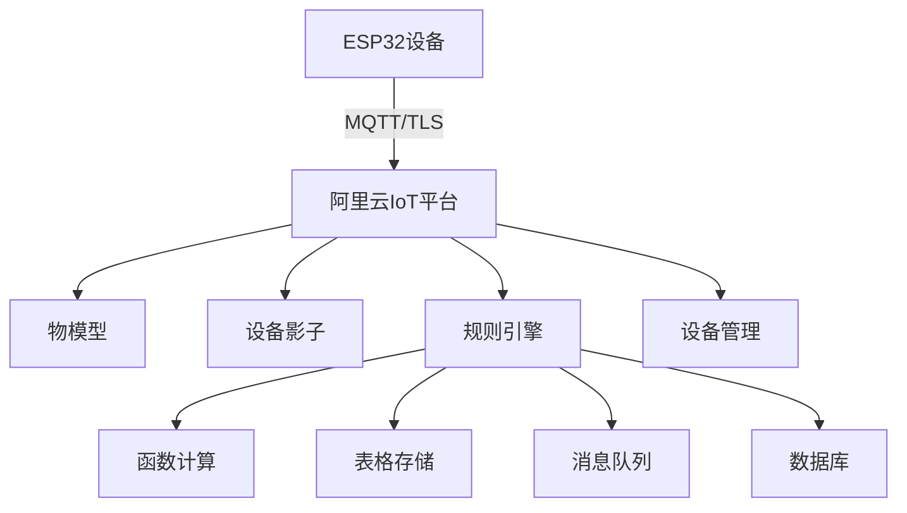

# 阿里云IoT平台设备接入实战

## 学习目标

完成本教程后，你将能够：

- [ ] 理解阿里云物联网平台的核心概念和架构
- [ ] 掌握设备注册和三元组认证方式
- [ ] 定义和使用物模型（TSL）进行数据建模
- [ ] 使用ESP32通过MQTT连接到阿里云IoT平台
- [ ] 实现属性上报、事件上报和服务调用
- [ ] 配置规则引擎进行数据流转

## 前置要求

在开始本教程之前，你需要：

**知识要求**：
- 了解MQTT协议基础知识
- 熟悉C语言编程
- 理解JSON数据格式
- 了解基本的云计算概念

**技能要求**：
- 能够使用Arduino IDE或ESP-IDF开发ESP32
- 会配置WiFi网络连接
- 有阿里云账号

**账号准备**：
- 阿里云账号（注册地址：https://www.aliyun.com/）
- 完成实名认证（国内云平台要求）

## 准备工作

### 硬件准备

| 名称 | 数量 | 说明 | 参考链接 |
|------|------|------|----------|
| ESP32开发板 | 1 | ESP32-DevKitC或类似型号 | - |
| DHT11温湿度传感器 | 1 | 用于数据采集 | - |
| LED灯 | 2 | 用于演示远程控制 | - |
| 电阻 | 2 | 220Ω，LED限流电阻 | - |
| Micro USB数据线 | 1 | 用于供电和程序下载 | - |

### 软件准备

- **开发环境**：Arduino IDE 2.0+ 或 ESP-IDF v4.4+
- **阿里云IoT库**：
  - Arduino: `AliyunIoTSDK` by xinyu198736
  - 或使用标准MQTT库：`PubSubClient`
- **JSON库**：`ArduinoJson` v6.x
- **DHT传感器库**：`DHT sensor library`

### 阿里云IoT平台免费额度

阿里云物联网平台提供免费额度：
- 每月100万条消息（设备到云）
- 每月100万条消息（云到设备）
- 每月1000万次规则引擎执行
- 设备数量无限制

**注意**：超出免费额度后会产生费用，建议在控制台设置费用告警。

## 阿里云IoT平台基础概念

### 什么是阿里云物联网平台？

阿里云物联网平台（IoT Platform）是阿里云提供的设备管理平台，为设备提供安全可靠的连接通信能力，向下连接海量设备，支撑设备数据采集上云；向上提供云端API，服务端可通过调用云端API将指令下发至设备端，实现远程控制。

**核心特点**：
- **物模型（TSL）**：标准化的设备功能定义
- **三元组认证**：ProductKey、DeviceName、DeviceSecret
- **一型一密/一机一密**：灵活的设备认证方式
- **规则引擎**：数据流转和处理
- **设备影子**：设备状态的云端副本
- **OTA升级**：远程固件升级

### 阿里云IoT平台架构



### 核心组件

**1. 产品（Product）**
- 一类设备的集合
- 定义设备的功能（物模型）
- 管理设备的认证方式
- 设置设备的通信协议

**2. 设备（Device）**
- 产品下的具体设备实例
- 拥有唯一的三元组
- 继承产品的物模型
- 可以有自己的标签和属性

**3. 物模型（TSL - Thing Specification Language）**
- 属性（Property）：设备的状态，如温度、湿度
- 事件（Event）：设备主动上报的信息，如故障告警
- 服务（Service）：云端可调用的设备功能，如开关控制

**4. 设备影子（Device Shadow）**
- 设备状态的JSON文档
- 包含desired（期望值）和reported（上报值）
- 支持设备离线时的状态同步

**5. 规则引擎（Rule Engine）**
- 使用SQL语法处理设备数据
- 将数据流转到其他阿里云服务
- 支持数据过滤和转换

## 步骤1：创建产品和设备

### 1.1 登录阿里云IoT控制台

1. 访问 https://iot.console.aliyun.com/
2. 登录你的阿里云账号
3. 选择"公共实例"（免费版）或创建企业实例
4. 选择地域（建议选择离你最近的地域，如华东2-上海）

### 1.2 创建产品

1. 在左侧菜单选择"设备管理" -> "产品"
2. 点击"创建产品"按钮
3. 填写产品信息：
   - 产品名称：`智能环境监测器`
   - 所属品类：选择"自定义品类"
   - 节点类型：选择"直连设备"
   - 连网方式：选择"WiFi"
   - 数据格式：选择"ICA标准数据格式（Alink JSON）"
   - 认证方式：选择"设备密钥"
   - 其他选项保持默认
4. 点击"确认"创建产品

**产品创建成功后，会生成ProductKey**，格式类似：`a1AbCdEfGhI`

### 1.3 定义物模型

物模型是设备功能的抽象描述，定义设备的属性、事件和服务。

#### 添加属性：

1. 进入产品详情页
2. 选择"功能定义"标签页
3. 点击"添加自定义功能"
4. 选择"属性"

**添加温度属性**：
- 功能名称：`温度`
- 标识符：`temperature`
- 数据类型：`float`（单精度浮点）
- 取值范围：-40 ~ 80
- 步长：0.1
- 单位：摄氏度（℃）
- 读写类型：只读

**添加湿度属性**：
- 功能名称：`湿度`
- 标识符：`humidity`
- 数据类型：`float`
- 取值范围：0 ~ 100
- 步长：0.1
- 单位：百分比（%）
- 读写类型：只读

**添加LED状态属性**：
- 功能名称：`LED状态`
- 标识符：`led_status`
- 数据类型：`bool`（布尔型）
- 布尔值：0-关闭，1-开启
- 读写类型：可读可写

#### 添加事件：

点击"添加自定义功能" -> 选择"事件"

**添加高温告警事件**：
- 功能名称：`高温告警`
- 标识符：`high_temp_alert`
- 事件类型：`告警`
- 输出参数：
  - 参数名称：`当前温度`
  - 标识符：`current_temp`
  - 数据类型：`float`

#### 添加服务：

点击"添加自定义功能" -> 选择"服务"

**添加LED控制服务**：
- 功能名称：`LED控制`
- 标识符：`set_led`
- 调用方式：`异步`
- 输入参数：
  - 参数名称：`LED状态`
  - 标识符：`led_switch`
  - 数据类型：`bool`
- 输出参数：无

5. 点击"发布上线"使物模型生效

### 1.4 添加设备

1. 在左侧菜单选择"设备管理" -> "设备"
2. 点击"添加设备"
3. 选择刚创建的产品：`智能环境监测器`
4. 填写设备信息：
   - DeviceName：`ESP32_Device_001`（设备名称，唯一标识）
   - 备注名称：可选，如"测试设备1"
5. 点击"确认"

**设备创建成功后，会显示设备的三元组信息**：

```text
ProductKey: a1AbCdEfGhI
DeviceName: ESP32_Device_001
DeviceSecret: xxxxxxxxxxxxxxxxxxxxxxxxxxxxxxxx
```

**重要**：DeviceSecret只显示一次，请立即复制保存！

### 1.5 获取MQTT连接参数

阿里云IoT平台的MQTT连接参数：

**MQTT Broker地址**：
```text
${ProductKey}.iot-as-mqtt.${RegionId}.aliyuncs.com
```

例如：`a1AbCdEfGhI.iot-as-mqtt.cn-shanghai.aliyuncs.com`

**端口**：
- 1883：TCP明文连接（不推荐）
- 8883：TLS加密连接（推荐）

**ClientID格式**：
```text
${ClientId}|securemode=3,signmethod=hmacsha256,timestamp=1234567890|
```

**Username格式**：
```text
${DeviceName}&${ProductKey}
```

**Password计算**：
```text
hmacsha256(content, DeviceSecret)
其中content = clientId${ClientId}deviceName${DeviceName}productKey${ProductKey}timestamp${timestamp}
```

**预期结果**：
- 成功创建产品和设备
- 获取了设备三元组
- 定义了完整的物模型

## 步骤2：准备ESP32开发环境

### 2.1 安装Arduino库

在Arduino IDE中安装以下库：

1. **PubSubClient**：MQTT客户端库
2. **ArduinoJson**：JSON解析库（v6.x）
3. **DHT sensor library**：DHT传感器库
4. **Crypto**：用于HMAC-SHA256计算（ESP32内置）

安装方法：
- 打开 工具 -> 管理库
- 搜索并安装上述库

### 2.2 创建配置文件

创建 `aliyun_config.h` 文件：

```c
#ifndef ALIYUN_CONFIG_H
#define ALIYUN_CONFIG_H

// WiFi配置
#define WIFI_SSID "你的WiFi名称"
#define WIFI_PASSWORD "你的WiFi密码"

// 阿里云IoT三元组
#define PRODUCT_KEY "a1AbCdEfGhI"
#define DEVICE_NAME "ESP32_Device_001"
#define DEVICE_SECRET "xxxxxxxxxxxxxxxxxxxxxxxxxxxxxxxx"

// 区域ID（根据你的实例所在区域修改）
#define REGION_ID "cn-shanghai"

// MQTT服务器地址
#define MQTT_SERVER PRODUCT_KEY ".iot-as-mqtt." REGION_ID ".aliyuncs.com"
#define MQTT_PORT 1883  // 使用TLS时改为8883

// MQTT主题（Alink JSON格式）
// 属性上报
#define ALINK_TOPIC_PROP_POST "/sys/" PRODUCT_KEY "/" DEVICE_NAME "/thing/event/property/post"
#define ALINK_TOPIC_PROP_POST_REPLY "/sys/" PRODUCT_KEY "/" DEVICE_NAME "/thing/event/property/post_reply"

// 事件上报
#define ALINK_TOPIC_EVENT_POST "/sys/" PRODUCT_KEY "/" DEVICE_NAME "/thing/event/high_temp_alert/post"
#define ALINK_TOPIC_EVENT_POST_REPLY "/sys/" PRODUCT_KEY "/" DEVICE_NAME "/thing/event/high_temp_alert/post_reply"

// 服务调用
#define ALINK_TOPIC_SERVICE_INVOKE "/sys/" PRODUCT_KEY "/" DEVICE_NAME "/thing/service/set_led"

#endif
```

**安全提示**：
- 不要将此文件上传到公共代码仓库
- 使用`.gitignore`排除此文件

### 2.3 实现MQTT认证

阿里云IoT使用HMAC-SHA256签名认证，需要计算Password。

创建 `aliyun_mqtt.h` 文件：

```c
#ifndef ALIYUN_MQTT_H
#define ALIYUN_MQTT_H

#include <Arduino.h>
#include "mbedtls/md.h"

// 计算HMAC-SHA256
String hmac_sha256(const String& data, const String& key) {
    byte hmac[32];
    mbedtls_md_context_t ctx;
    mbedtls_md_type_t md_type = MBEDTLS_MD_SHA256;
    
    mbedtls_md_init(&ctx);
    mbedtls_md_setup(&ctx, mbedtls_md_info_from_type(md_type), 1);
    mbedtls_md_hmac_starts(&ctx, (const unsigned char*)key.c_str(), key.length());
    mbedtls_md_hmac_update(&ctx, (const unsigned char*)data.c_str(), data.length());
    mbedtls_md_hmac_finish(&ctx, hmac);
    mbedtls_md_free(&ctx);
    
    // 转换为十六进制字符串
    String result = "";
    for (int i = 0; i < 32; i++) {
        char hex[3];
        sprintf(hex, "%02x", hmac[i]);
        result += hex;
    }
    
    return result;
}

// 生成MQTT连接参数
void generateMqttParams(String& clientId, String& username, String& password) {
    // 获取时间戳（毫秒）
    unsigned long timestamp = millis();
    
    // ClientID格式：${ClientId}|securemode=3,signmethod=hmacsha256,timestamp=${timestamp}|
    clientId = String(DEVICE_NAME) + "|securemode=3,signmethod=hmacsha256,timestamp=" + 
               String(timestamp) + "|";
    
    // Username格式：${DeviceName}&${ProductKey}
    username = String(DEVICE_NAME) + "&" + String(PRODUCT_KEY);
    
    // 计算Password
    // content = clientId${ClientId}deviceName${DeviceName}productKey${ProductKey}timestamp${timestamp}
    String content = "clientId" + String(DEVICE_NAME) + 
                     "deviceName" + String(DEVICE_NAME) + 
                     "productKey" + String(PRODUCT_KEY) + 
                     "timestamp" + String(timestamp);
    
    password = hmac_sha256(content, String(DEVICE_SECRET));
}

#endif
```

**认证说明**：
- `securemode=3`：表示使用设备密钥认证
- `signmethod=hmacsha256`：签名算法
- `timestamp`：时间戳，用于防重放攻击
- Password使用HMAC-SHA256计算

## 步骤3：实现基础连接

### 3.1 创建Arduino项目

创建新项目：`ESP32_Aliyun_IoT_Basic`

### 3.2 包含必要的库

```c
#include <WiFi.h>
#include <PubSubClient.h>
#include <ArduinoJson.h>
#include <DHT.h>
#include "aliyun_config.h"
#include "aliyun_mqtt.h"

// 硬件配置
#define LED_PIN 2
#define DHTPIN 4
#define DHTTYPE DHT11

// 创建对象
WiFiClient espClient;
PubSubClient mqttClient(espClient);
DHT dht(DHTPIN, DHTTYPE);

// 全局变量
String g_clientId;
String g_username;
String g_password;
```

### 3.3 WiFi连接函数

```c
void connectWiFi() {
    Serial.print("连接到WiFi: ");
    Serial.println(WIFI_SSID);
    
    WiFi.mode(WIFI_STA);
    WiFi.begin(WIFI_SSID, WIFI_PASSWORD);
    
    while (WiFi.status() != WL_CONNECTED) {
        delay(500);
        Serial.print(".");
    }
    
    Serial.println("\nWiFi连接成功");
    Serial.print("IP地址: ");
    Serial.println(WiFi.localIP());
}
```

### 3.4 MQTT连接函数

```c
void connectAliyun() {
    // 生成MQTT连接参数
    generateMqttParams(g_clientId, g_username, g_password);
    
    Serial.println("MQTT连接参数:");
    Serial.print("Server: ");
    Serial.println(MQTT_SERVER);
    Serial.print("ClientID: ");
    Serial.println(g_clientId);
    Serial.print("Username: ");
    Serial.println(g_username);
    Serial.print("Password: ");
    Serial.println(g_password);
    
    // 设置MQTT服务器
    mqttClient.setServer(MQTT_SERVER, MQTT_PORT);
    mqttClient.setCallback(mqttCallback);
    
    Serial.print("连接到阿里云IoT平台...");
    
    while (!mqttClient.connected()) {
        if (mqttClient.connect(g_clientId.c_str(), 
                               g_username.c_str(), 
                               g_password.c_str())) {
            Serial.println("已连接!");
            
            // 订阅属性设置主题
            mqttClient.subscribe(ALINK_TOPIC_PROP_POST_REPLY);
            // 订阅服务调用主题
            mqttClient.subscribe(ALINK_TOPIC_SERVICE_INVOKE);
            
            Serial.println("已订阅主题");
        } else {
            Serial.print("连接失败, rc=");
            Serial.print(mqttClient.state());
            Serial.println(" 5秒后重试");
            delay(5000);
        }
    }
}
```

**连接说明**：
- 使用三元组生成的ClientID、Username和Password
- 订阅属性上报回复主题和服务调用主题
- 连接失败会自动重试

### 3.5 MQTT消息回调函数

```c
void mqttCallback(char* topic, byte* payload, unsigned int length) {
    Serial.print("收到消息 [");
    Serial.print(topic);
    Serial.print("]: ");
    
    // 将payload转换为字符串
    String message = "";
    for (int i = 0; i < length; i++) {
        message += (char)payload[i];
    }
    Serial.println(message);
    
    // 解析JSON消息
    StaticJsonDocument<512> doc;
    DeserializationError error = deserializeJson(doc, message);
    
    if (error) {
        Serial.print("JSON解析失败: ");
        Serial.println(error.c_str());
        return;
    }
    
    // 处理服务调用（LED控制）
    if (String(topic) == ALINK_TOPIC_SERVICE_INVOKE) {
        handleServiceInvoke(doc);
    }
    // 处理属性上报回复
    else if (String(topic) == ALINK_TOPIC_PROP_POST_REPLY) {
        int code = doc["code"];
        if (code == 200) {
            Serial.println("属性上报成功");
        } else {
            Serial.print("属性上报失败，错误码: ");
            Serial.println(code);
        }
    }
}

// 处理服务调用
void handleServiceInvoke(JsonDocument& doc) {
    Serial.println("收到服务调用");
    
    // 获取服务参数
    if (doc.containsKey("params")) {
        JsonObject params = doc["params"];
        
        if (params.containsKey("led_switch")) {
            bool ledSwitch = params["led_switch"];
            digitalWrite(LED_PIN, ledSwitch ? HIGH : LOW);
            
            Serial.print("LED状态设置为: ");
            Serial.println(ledSwitch ? "开启" : "关闭");
            
            // 回复服务调用结果
            replyServiceInvoke(doc["id"], 200, "success");
        }
    }
}

// 回复服务调用
void replyServiceInvoke(const char* id, int code, const char* message) {
    StaticJsonDocument<256> doc;
    doc["id"] = id;
    doc["code"] = code;
    doc["data"] = JsonObject();
    
    char jsonBuffer[256];
    serializeJson(doc, jsonBuffer);
    
    // 发布到服务调用回复主题
    String replyTopic = String(ALINK_TOPIC_SERVICE_INVOKE) + "_reply";
    mqttClient.publish(replyTopic.c_str(), jsonBuffer);
}
```

### 3.6 属性上报函数

```c
void postProperties() {
    // 读取传感器数据
    float temperature = dht.readTemperature();
    float humidity = dht.readHumidity();
    
    // 检查读取是否成功
    if (isnan(temperature) || isnan(humidity)) {
        Serial.println("读取DHT传感器失败!");
        return;
    }
    
    // 获取LED状态
    bool ledStatus = digitalRead(LED_PIN);
    
    // 构建Alink JSON格式消息
    StaticJsonDocument<512> doc;
    doc["id"] = String(millis());  // 消息ID
    doc["version"] = "1.0";
    
    // 添加属性参数
    JsonObject params = doc.createNestedObject("params");
    params["temperature"] = temperature;
    params["humidity"] = humidity;
    params["led_status"] = ledStatus ? 1 : 0;
    
    // 添加方法名
    doc["method"] = "thing.event.property.post";
    
    // 序列化为字符串
    char jsonBuffer[512];
    serializeJson(doc, jsonBuffer);
    
    // 发布消息
    Serial.print("上报属性: ");
    Serial.println(jsonBuffer);
    
    if (mqttClient.publish(ALINK_TOPIC_PROP_POST, jsonBuffer)) {
        Serial.println("属性上报成功");
    } else {
        Serial.println("属性上报失败");
    }
}
```

**Alink JSON格式说明**：
- `id`：消息ID，用于追踪消息
- `version`：协议版本，固定为"1.0"
- `params`：属性参数，包含物模型中定义的属性
- `method`：方法名，属性上报固定为"thing.event.property.post"

### 3.7 主程序

```c
void setup() {
    Serial.begin(115200);
    delay(1000);
    
    // 初始化硬件
    pinMode(LED_PIN, OUTPUT);
    digitalWrite(LED_PIN, LOW);
    dht.begin();
    
    // 连接WiFi
    connectWiFi();
    
    // 连接阿里云IoT
    connectAliyun();
    
    Serial.println("初始化完成");
}

void loop() {
    // 保持MQTT连接
    if (!mqttClient.connected()) {
        connectAliyun();
    }
    mqttClient.loop();
    
    // 每10秒上报一次属性
    static unsigned long lastPost = 0;
    unsigned long now = millis();
    
    if (now - lastPost > 10000) {
        lastPost = now;
        postProperties();
    }
}
```

## 步骤4：测试设备连接

### 4.1 编译和上传

1. 确保`aliyun_config.h`文件配置正确
2. 选择开发板：ESP32 Dev Module
3. 选择端口
4. 点击上传
5. 打开串口监视器（波特率115200）

**预期输出**：
```
连接到WiFi: YourWiFi
.....
WiFi连接成功
IP地址: 192.168.1.100
MQTT连接参数:
Server: a1AbCdEfGhI.iot-as-mqtt.cn-shanghai.aliyuncs.com
ClientID: ESP32_Device_001|securemode=3,signmethod=hmacsha256,timestamp=12345|
Username: ESP32_Device_001&a1AbCdEfGhI
Password: abc123...
连接到阿里云IoT平台...已连接!
已订阅主题
初始化完成
上报属性: {"id":"10234","version":"1.0","params":{"temperature":25.3,"humidity":62.5,"led_status":0},"method":"thing.event.property.post"}
属性上报成功
```

### 4.2 在控制台查看设备状态

#### 查看设备在线状态：

1. 进入阿里云IoT控制台
2. 选择"设备管理" -> "设备"
3. 找到"ESP32_Device_001"
4. 查看设备状态，应显示"在线"

#### 查看设备属性：

1. 点击设备名称进入设备详情
2. 选择"物模型数据"标签页
3. 选择"运行状态"
4. 查看温度、湿度和LED状态的实时值

#### 查看设备日志：

1. 在设备详情页选择"日志服务"标签页
2. 选择"设备行为分析"
3. 查看设备的上线、下线、属性上报等日志

### 4.3 在线调试

使用阿里云提供的在线调试工具测试设备：

1. 在设备详情页选择"在线调试"标签页
2. 选择"调试真实设备"

#### 测试属性获取：

1. 功能类型：选择"属性"
2. 选择要获取的属性：temperature、humidity、led_status
3. 点击"发送指令"
4. 查看返回的属性值

#### 测试服务调用：

1. 功能类型：选择"服务"
2. 选择服务：set_led
3. 输入参数：
   ```json
   {
     "led_switch": 1
   }
   ```
4. 点击"发送指令"
5. 观察ESP32的LED是否点亮
6. 发送`{"led_switch": 0}`测试关闭

**预期结果**：
- 设备显示在线状态
- 能在控制台看到实时属性值
- 能通过服务调用控制LED

## 步骤5：实现事件上报

### 5.1 什么是事件？

事件是设备主动上报的信息，通常用于告警、故障等场景。与属性不同，事件是非周期性的，只在特定条件触发时上报。

### 5.2 添加事件上报函数

```c
void postEvent(float currentTemp) {
    // 构建Alink JSON格式消息
    StaticJsonDocument<512> doc;
    doc["id"] = String(millis());
    doc["version"] = "1.0";
    doc["method"] = "thing.event.high_temp_alert.post";
    
    // 添加事件参数
    JsonObject params = doc.createNestedObject("params");
    params["current_temp"] = currentTemp;
    
    // 序列化
    char jsonBuffer[512];
    serializeJson(doc, jsonBuffer);
    
    // 发布到事件上报主题
    Serial.print("上报事件: ");
    Serial.println(jsonBuffer);
    
    if (mqttClient.publish(ALINK_TOPIC_EVENT_POST, jsonBuffer)) {
        Serial.println("事件上报成功");
    } else {
        Serial.println("事件上报失败");
    }
}
```

### 5.3 在主循环中检测高温

修改`postProperties()`函数，添加高温检测：

```c
void postProperties() {
    // 读取传感器数据
    float temperature = dht.readTemperature();
    float humidity = dht.readHumidity();
    
    if (isnan(temperature) || isnan(humidity)) {
        Serial.println("读取DHT传感器失败!");
        return;
    }
    
    // 检测高温告警（温度超过30度）
    static bool lastAlertState = false;
    bool currentAlertState = (temperature > 30.0);
    
    if (currentAlertState && !lastAlertState) {
        // 温度首次超过阈值，上报告警事件
        Serial.println("检测到高温，上报告警事件");
        postEvent(temperature);
    }
    lastAlertState = currentAlertState;
    
    // 获取LED状态
    bool ledStatus = digitalRead(LED_PIN);
    
    // 构建属性上报消息
    StaticJsonDocument<512> doc;
    doc["id"] = String(millis());
    doc["version"] = "1.0";
    
    JsonObject params = doc.createNestedObject("params");
    params["temperature"] = temperature;
    params["humidity"] = humidity;
    params["led_status"] = ledStatus ? 1 : 0;
    
    doc["method"] = "thing.event.property.post";
    
    char jsonBuffer[512];
    serializeJson(doc, jsonBuffer);
    
    Serial.print("上报属性: ");
    Serial.println(jsonBuffer);
    mqttClient.publish(ALINK_TOPIC_PROP_POST, jsonBuffer);
}
```

### 5.4 测试事件上报

#### 方法1：修改代码模拟高温

临时修改代码，强制上报高温：

```c
// 在postProperties()函数中
float temperature = 35.0;  // 模拟高温
```

#### 方法2：加热传感器

用手捂住DHT11传感器，使温度升高到30度以上。

#### 查看事件记录：

1. 在设备详情页选择"物模型数据"标签页
2. 选择"事件管理"
3. 查看"high_temp_alert"事件的历史记录
4. 可以看到事件触发时间和参数值

## 步骤6：配置规则引擎

### 6.1 什么是规则引擎？

规则引擎可以将设备数据流转到其他阿里云服务，实现数据存储、分析和处理。

**支持的目标服务**：
- 表格存储（Table Store）
- 云数据库RDS
- 消息队列MQ
- 函数计算FC
- 消息服务MNS
- 时序数据库TSDB

### 6.2 创建规则：保存数据到表格存储

#### 创建表格存储实例：

1. 打开表格存储控制台
2. 创建实例：
   - 实例名称：`iot-data-store`
   - 实例类型：高性能实例
   - 地域：与IoT平台相同
3. 创建数据表：
   - 表名：`sensor_data`
   - 主键：
     - 第一主键：`device_id`（字符串）
     - 第二主键：`timestamp`（整数）

#### 创建数据流转规则：

1. 返回IoT控制台
2. 选择"规则引擎" -> "云产品流转"
3. 点击"创建规则"
4. 填写规则信息：
   - 规则名称：`SaveSensorData`
   - 数据格式：JSON

5. 编写SQL：

```sql
SELECT 
    deviceName() as device_id,
    timestamp('yyyy-MM-dd HH:mm:ss') as time,
    temperature,
    humidity,
    led_status
FROM 
    "/sys/a1AbCdEfGhI/+/thing/event/property/post"
WHERE 
    temperature > 0
```

**SQL说明**：
- `deviceName()`：获取设备名称
- `timestamp()`：格式化时间戳
- `FROM`：订阅属性上报主题，`+`表示通配所有设备
- `WHERE`：过滤条件，只保存有效数据

6. 添加数据流转操作：
   - 选择"表格存储（Table Store）"
   - 实例名称：`iot-data-store`
   - 数据表名：`sensor_data`
   - 主键：
     - `device_id`：`${device_id}`
     - `timestamp`：`${timestamp()}`
   - 角色：创建新角色或选择已有角色

7. 点击"启动"规则

### 6.3 创建规则：高温告警通知

#### 创建消息服务主题：

1. 打开消息服务MNS控制台
2. 创建主题：`iot-temp-alert`
3. 创建订阅：
   - 订阅名称：`email-subscription`
   - 推送类型：邮件
   - 接收邮箱：你的邮箱地址

#### 创建告警规则：

1. 在IoT控制台创建新规则
2. 规则名称：`HighTempAlert`
3. SQL语句：

```sql
SELECT 
    deviceName() as device_id,
    current_temp,
    timestamp('yyyy-MM-dd HH:mm:ss') as alert_time
FROM 
    "/sys/a1AbCdEfGhI/+/thing/event/high_temp_alert/post"
```

4. 添加操作：
   - 选择"消息服务（MNS）"
   - 主题：`iot-temp-alert`
   - 消息内容：
   ```
   设备${device_id}检测到高温告警！
   当前温度：${current_temp}℃
   告警时间：${alert_time}
   ```

5. 启动规则

**测试告警**：
触发高温事件，检查是否收到邮件通知。

### 6.4 创建规则：数据转发到函数计算

使用函数计算处理设备数据，实现自定义业务逻辑。

#### 创建函数：

1. 打开函数计算控制台
2. 创建服务：`iot-service`
3. 创建函数：
   - 函数名称：`process-sensor-data`
   - 运行环境：Python 3.9
   - 函数代码：

```python
import json
import logging

logger = logging.getLogger()

def handler(event, context):
    logger.info("收到IoT数据: " + event)
    
    # 解析事件数据
    evt = json.loads(event)
    
    device_id = evt.get('device_id')
    temperature = evt.get('temperature')
    humidity = evt.get('humidity')
    
    # 自定义业务逻辑
    if temperature > 28:
        logger.warning(f"设备{device_id}温度偏高: {temperature}℃")
        # 可以在这里调用其他服务，如发送钉钉通知
    
    # 数据处理
    result = {
        'device_id': device_id,
        'temp_fahrenheit': temperature * 9/5 + 32,  # 转换为华氏度
        'humidity': humidity,
        'status': 'normal' if temperature <= 30 else 'alert'
    }
    
    return json.dumps(result)
```

#### 配置规则：

1. 创建新规则：`ProcessSensorData`
2. SQL语句：

```sql
SELECT 
    deviceName() as device_id,
    temperature,
    humidity
FROM 
    "/sys/a1AbCdEfGhI/+/thing/event/property/post"
```

3. 添加操作：
   - 选择"函数计算（FC）"
   - 服务：`iot-service`
   - 函数：`process-sensor-data`

4. 启动规则

### 6.5 查看规则执行情况

1. 在规则详情页面，选择"监控"标签页
2. 查看：
   - 规则触发次数
   - 成功执行次数
   - 失败次数
3. 点击"查看日志"查看详细执行日志

## 步骤7：使用设备影子

### 7.1 什么是设备影子？

设备影子是设备在云端的虚拟表示，用于存储和同步设备状态。即使设备离线，应用也可以通过影子获取设备最后的状态，或设置期望状态。

**设备影子包含**：
- `reported`：设备上报的实际状态
- `desired`：应用设置的期望状态

### 7.2 设备影子主题

```c
// 更新设备影子
#define SHADOW_UPDATE "/shadow/update/" PRODUCT_KEY "/" DEVICE_NAME

// 获取设备影子
#define SHADOW_GET "/shadow/get/" PRODUCT_KEY "/" DEVICE_NAME
```

### 7.3 上报设备状态到影子

```c
void updateDeviceShadow() {
    // 读取当前状态
    float temperature = dht.readTemperature();
    float humidity = dht.readHumidity();
    bool ledStatus = digitalRead(LED_PIN);
    
    if (isnan(temperature) || isnan(humidity)) {
        return;
    }
    
    // 构建影子更新消息
    StaticJsonDocument<512> doc;
    doc["method"] = "update";
    
    JsonObject state = doc.createNestedObject("state");
    JsonObject reported = state.createNestedObject("reported");
    
    reported["temperature"] = temperature;
    reported["humidity"] = humidity;
    reported["led_status"] = ledStatus ? 1 : 0;
    reported["timestamp"] = millis();
    
    doc["version"] = 1;
    
    char jsonBuffer[512];
    serializeJson(doc, jsonBuffer);
    
    Serial.print("更新设备影子: ");
    Serial.println(jsonBuffer);
    
    mqttClient.publish(SHADOW_UPDATE, jsonBuffer);
}
```

### 7.4 订阅影子更新

在`connectAliyun()`函数中添加：

```c
// 订阅影子更新主题
mqttClient.subscribe(SHADOW_UPDATE);
```

### 7.5 处理影子期望状态

修改`mqttCallback()`函数，添加影子处理：

```c
void mqttCallback(char* topic, byte* payload, unsigned int length) {
    // ... 前面的代码 ...
    
    // 处理设备影子更新
    if (String(topic).indexOf("/shadow/update/") >= 0) {
        if (doc.containsKey("state") && doc["state"].containsKey("desired")) {
            JsonObject desired = doc["state"]["desired"];
            
            // 处理LED期望状态
            if (desired.containsKey("led_status")) {
                int ledDesired = desired["led_status"];
                digitalWrite(LED_PIN, ledDesired ? HIGH : LOW);
                
                Serial.print("根据影子期望状态设置LED: ");
                Serial.println(ledDesired ? "开启" : "关闭");
                
                // 上报新状态
                updateDeviceShadow();
            }
        }
    }
}
```

### 7.6 在控制台操作设备影子

1. 进入设备详情页
2. 选择"设备影子"标签页
3. 查看当前影子文档
4. 点击"更新影子"
5. 设置期望状态：

```json
{
  "desired": {
    "led_status": 1
  }
}
```

6. 观察设备LED状态变化
7. 查看影子文档，`reported`应该更新为新状态

## 故障排除

### 问题1：无法连接到阿里云IoT平台

**可能原因**：
- 三元组配置错误
- MQTT参数计算错误
- 网络连接问题
- 时间戳问题

**解决方法**：

1. **检查三元组**：
   - 确认ProductKey、DeviceName、DeviceSecret正确
   - 注意DeviceSecret区分大小写
   - 确认设备在控制台中已创建

2. **验证MQTT参数**：
   ```c
   // 在connectAliyun()中添加调试输出
   Serial.println("=== MQTT连接参数 ===");
   Serial.println("Server: " + String(MQTT_SERVER));
   Serial.println("Port: " + String(MQTT_PORT));
   Serial.println("ClientID: " + g_clientId);
   Serial.println("Username: " + g_username);
   Serial.println("Password: " + g_password);
   ```

3. **检查网络连接**：
   ```c
   // 测试DNS解析
   IPAddress serverIP;
   if (WiFi.hostByName(MQTT_SERVER, serverIP)) {
       Serial.print("服务器IP: ");
       Serial.println(serverIP);
   } else {
       Serial.println("DNS解析失败");
   }
   ```

4. **同步时间**（如使用TLS）：
   ```c
   #include <time.h>
   
   void syncTime() {
       configTime(8 * 3600, 0, "ntp.aliyun.com", "ntp1.aliyun.com");
       Serial.print("等待时间同步");
       time_t now = time(nullptr);
       while (now < 8 * 3600 * 2) {
           delay(500);
           Serial.print(".");
           now = time(nullptr);
       }
       Serial.println("\n时间同步完成");
   }
   
   // 在setup()中调用
   void setup() {
       // ...
       connectWiFi();
       syncTime();  // 在连接IoT平台之前
       connectAliyun();
   }
   ```

### 问题2：属性上报失败

**可能原因**：
- JSON格式错误
- 物模型定义不匹配
- 主题权限不足

**解决方法**：

1. **验证JSON格式**：
   ```c
   // 使用在线JSON验证工具检查格式
   // 确保所有字段名与物模型定义一致
   ```

2. **检查物模型**：
   - 确认属性标识符与代码中一致
   - 确认数据类型匹配
   - 确认取值范围合理

3. **查看错误日志**：
   - 在控制台"日志服务"中查看详细错误信息
   - 根据错误码定位问题

### 问题3：服务调用无响应

**可能原因**：
- 未订阅服务调用主题
- 回调函数处理错误
- 服务定义不正确

**解决方法**：

1. **确认订阅**：
   ```c
   // 在connectAliyun()中确认订阅了服务主题
   mqttClient.subscribe(ALINK_TOPIC_SERVICE_INVOKE);
   ```

2. **添加调试输出**：
   ```c
   void mqttCallback(char* topic, byte* payload, unsigned int length) {
       Serial.println("=== 收到MQTT消息 ===");
       Serial.print("主题: ");
       Serial.println(topic);
       Serial.print("内容: ");
       // ... 打印payload
   }
   ```

3. **检查服务定义**：
   - 确认服务标识符正确
   - 确认输入参数定义正确
   - 在控制台"在线调试"中测试

### 问题4：设备频繁掉线

**可能原因**：
- WiFi信号不稳定
- Keep-Alive设置不当
- 内存不足导致重启

**解决方法**：

1. **优化WiFi连接**：
   ```c
   void connectWiFi() {
       WiFi.mode(WIFI_STA);
       WiFi.setAutoReconnect(true);  // 启用自动重连
       WiFi.begin(WIFI_SSID, WIFI_PASSWORD);
       // ...
   }
   ```

2. **设置Keep-Alive**：
   ```c
   mqttClient.setKeepAlive(60);  // 60秒心跳
   ```

3. **监控内存**：
   ```c
   void loop() {
       // 定期打印可用内存
       static unsigned long lastMemCheck = 0;
       if (millis() - lastMemCheck > 60000) {
           lastMemCheck = millis();
           Serial.print("可用内存: ");
           Serial.println(ESP.getFreeHeap());
       }
       // ...
   }
   ```

4. **添加重连机制**：
   ```c
   void loop() {
       if (!mqttClient.connected()) {
           Serial.println("MQTT连接断开，尝试重连...");
           connectAliyun();
       }
       mqttClient.loop();
       // ...
   }
   ```

## 总结

通过本教程，你学习了：

- ✅ 阿里云物联网平台的核心概念和架构
- ✅ 创建产品、定义物模型和添加设备
- ✅ 使用三元组认证连接到阿里云IoT平台
- ✅ 实现属性上报、事件上报和服务调用
- ✅ 配置规则引擎进行数据流转
- ✅ 使用设备影子进行状态同步

**关键要点**：
- 物模型是阿里云IoT的核心，定义了设备的标准功能
- 三元组（ProductKey、DeviceName、DeviceSecret）用于设备认证
- Alink JSON是阿里云IoT的标准数据格式
- 规则引擎提供强大的数据流转能力
- 设备影子实现设备状态的云端同步

## 进阶挑战

尝试以下挑战来巩固学习：

1. **挑战1**：实现设备OTA固件升级功能
2. **挑战2**：使用一型一密动态注册设备
3. **挑战3**：集成阿里云时序数据库TSDB存储历史数据
4. **挑战4**：使用Link Visual实现视频接入
5. **挑战5**：实现设备分组和批量管理

## 安全最佳实践

### 1. 设备认证

- **使用一机一密**：每个设备有独立的DeviceSecret
- **定期轮换密钥**：定期更新DeviceSecret
- **使用TLS加密**：生产环境必须使用8883端口
- **保护设备密钥**：不要硬编码，使用安全存储

### 2. 通信安全

- **启用TLS**：使用加密通信
- **验证服务器证书**：防止中间人攻击
- **使用QoS 1**：确保消息可靠传输
- **限制主题权限**：只授予必要的发布/订阅权限

### 3. 数据安全

- **敏感数据加密**：传输前加密敏感信息
- **数据脱敏**：日志中不记录敏感数据
- **访问控制**：使用RAM策略控制API访问
- **审计日志**：启用操作审计

### 4. 设备安全

- **安全启动**：启用ESP32安全启动
- **固件加密**：加密存储的固件
- **禁用调试接口**：生产环境禁用JTAG
- **看门狗保护**：防止设备挂起

## 成本优化

### 免费额度

- 消息数：每月200万条（上行+下行）
- 规则引擎：每月1000万次执行
- 设备数量：无限制
- 设备影子：免费

### 优化建议

1. **减少消息频率**：
   - 合理设置上报间隔（建议5-10分钟）
   - 只在数据变化时上报
   - 使用批量上报

2. **优化消息大小**：
   - 精简JSON字段
   - 使用短字段名
   - 压缩大数据

3. **规则引擎优化**：
   - 使用WHERE子句过滤数据
   - 合并相似规则
   - 避免复杂的SQL操作

4. **监控使用量**：
   - 设置费用告警
   - 定期检查账单
   - 使用费用分析工具

## 完整代码

### 主程序代码

```c
#include <WiFi.h>
#include <PubSubClient.h>
#include <ArduinoJson.h>
#include <DHT.h>
#include "aliyun_config.h"
#include "aliyun_mqtt.h"

// 硬件配置
#define LED_PIN 2
#define DHTPIN 4
#define DHTTYPE DHT11

// 创建对象
WiFiClient espClient;
PubSubClient mqttClient(espClient);
DHT dht(DHTPIN, DHTTYPE);

// 全局变量
String g_clientId;
String g_username;
String g_password;

// 函数声明
void connectWiFi();
void connectAliyun();
void mqttCallback(char* topic, byte* payload, unsigned int length);
void handleServiceInvoke(JsonDocument& doc);
void replyServiceInvoke(const char* id, int code, const char* message);
void postProperties();
void postEvent(float currentTemp);
void updateDeviceShadow();

void setup() {
    Serial.begin(115200);
    delay(1000);
    
    pinMode(LED_PIN, OUTPUT);
    digitalWrite(LED_PIN, LOW);
    dht.begin();
    
    connectWiFi();
    connectAliyun();
    
    Serial.println("初始化完成");
}

void loop() {
    if (!mqttClient.connected()) {
        connectAliyun();
    }
    mqttClient.loop();
    
    static unsigned long lastPost = 0;
    unsigned long now = millis();
    
    if (now - lastPost > 10000) {
        lastPost = now;
        postProperties();
    }
}

void connectWiFi() {
    Serial.print("连接到WiFi: ");
    Serial.println(WIFI_SSID);
    
    WiFi.mode(WIFI_STA);
    WiFi.setAutoReconnect(true);
    WiFi.begin(WIFI_SSID, WIFI_PASSWORD);
    
    while (WiFi.status() != WL_CONNECTED) {
        delay(500);
        Serial.print(".");
    }
    
    Serial.println("\nWiFi连接成功");
    Serial.print("IP地址: ");
    Serial.println(WiFi.localIP());
}

void connectAliyun() {
    generateMqttParams(g_clientId, g_username, g_password);
    
    mqttClient.setServer(MQTT_SERVER, MQTT_PORT);
    mqttClient.setCallback(mqttCallback);
    mqttClient.setKeepAlive(60);
    
    Serial.print("连接到阿里云IoT平台...");
    
    while (!mqttClient.connected()) {
        if (mqttClient.connect(g_clientId.c_str(), 
                               g_username.c_str(), 
                               g_password.c_str())) {
            Serial.println("已连接!");
            mqttClient.subscribe(ALINK_TOPIC_PROP_POST_REPLY);
            mqttClient.subscribe(ALINK_TOPIC_SERVICE_INVOKE);
            Serial.println("已订阅主题");
        } else {
            Serial.print("连接失败, rc=");
            Serial.print(mqttClient.state());
            Serial.println(" 5秒后重试");
            delay(5000);
        }
    }
}

void mqttCallback(char* topic, byte* payload, unsigned int length) {
    Serial.print("收到消息 [");
    Serial.print(topic);
    Serial.print("]: ");
    
    String message = "";
    for (int i = 0; i < length; i++) {
        message += (char)payload[i];
    }
    Serial.println(message);
    
    StaticJsonDocument<512> doc;
    DeserializationError error = deserializeJson(doc, message);
    
    if (error) {
        Serial.print("JSON解析失败: ");
        Serial.println(error.c_str());
        return;
    }
    
    if (String(topic) == ALINK_TOPIC_SERVICE_INVOKE) {
        handleServiceInvoke(doc);
    }
    else if (String(topic) == ALINK_TOPIC_PROP_POST_REPLY) {
        int code = doc["code"];
        if (code == 200) {
            Serial.println("属性上报成功");
        } else {
            Serial.print("属性上报失败，错误码: ");
            Serial.println(code);
        }
    }
}

void handleServiceInvoke(JsonDocument& doc) {
    Serial.println("收到服务调用");
    
    if (doc.containsKey("params")) {
        JsonObject params = doc["params"];
        
        if (params.containsKey("led_switch")) {
            bool ledSwitch = params["led_switch"];
            digitalWrite(LED_PIN, ledSwitch ? HIGH : LOW);
            
            Serial.print("LED状态设置为: ");
            Serial.println(ledSwitch ? "开启" : "关闭");
            
            replyServiceInvoke(doc["id"], 200, "success");
        }
    }
}

void replyServiceInvoke(const char* id, int code, const char* message) {
    StaticJsonDocument<256> doc;
    doc["id"] = id;
    doc["code"] = code;
    doc["data"] = JsonObject();
    
    char jsonBuffer[256];
    serializeJson(doc, jsonBuffer);
    
    String replyTopic = String(ALINK_TOPIC_SERVICE_INVOKE) + "_reply";
    mqttClient.publish(replyTopic.c_str(), jsonBuffer);
}

void postProperties() {
    float temperature = dht.readTemperature();
    float humidity = dht.readHumidity();
    
    if (isnan(temperature) || isnan(humidity)) {
        Serial.println("读取DHT传感器失败!");
        return;
    }
    
    // 检测高温告警
    static bool lastAlertState = false;
    bool currentAlertState = (temperature > 30.0);
    
    if (currentAlertState && !lastAlertState) {
        Serial.println("检测到高温，上报告警事件");
        postEvent(temperature);
    }
    lastAlertState = currentAlertState;
    
    bool ledStatus = digitalRead(LED_PIN);
    
    StaticJsonDocument<512> doc;
    doc["id"] = String(millis());
    doc["version"] = "1.0";
    
    JsonObject params = doc.createNestedObject("params");
    params["temperature"] = temperature;
    params["humidity"] = humidity;
    params["led_status"] = ledStatus ? 1 : 0;
    
    doc["method"] = "thing.event.property.post";
    
    char jsonBuffer[512];
    serializeJson(doc, jsonBuffer);
    
    Serial.print("上报属性: ");
    Serial.println(jsonBuffer);
    mqttClient.publish(ALINK_TOPIC_PROP_POST, jsonBuffer);
}

void postEvent(float currentTemp) {
    StaticJsonDocument<512> doc;
    doc["id"] = String(millis());
    doc["version"] = "1.0";
    doc["method"] = "thing.event.high_temp_alert.post";
    
    JsonObject params = doc.createNestedObject("params");
    params["current_temp"] = currentTemp;
    
    char jsonBuffer[512];
    serializeJson(doc, jsonBuffer);
    
    Serial.print("上报事件: ");
    Serial.println(jsonBuffer);
    mqttClient.publish(ALINK_TOPIC_EVENT_POST, jsonBuffer);
}

void updateDeviceShadow() {
    float temperature = dht.readTemperature();
    float humidity = dht.readHumidity();
    bool ledStatus = digitalRead(LED_PIN);
    
    if (isnan(temperature) || isnan(humidity)) {
        return;
    }
    
    StaticJsonDocument<512> doc;
    doc["method"] = "update";
    
    JsonObject state = doc.createNestedObject("state");
    JsonObject reported = state.createNestedObject("reported");
    
    reported["temperature"] = temperature;
    reported["humidity"] = humidity;
    reported["led_status"] = ledStatus ? 1 : 0;
    reported["timestamp"] = millis();
    
    doc["version"] = 1;
    
    char jsonBuffer[512];
    serializeJson(doc, jsonBuffer);
    
    Serial.print("更新设备影子: ");
    Serial.println(jsonBuffer);
    
    String shadowTopic = "/shadow/update/" + String(PRODUCT_KEY) + "/" + String(DEVICE_NAME);
    mqttClient.publish(shadowTopic.c_str(), jsonBuffer);
}
```

完整的项目代码可以在GitHub上找到：

```text
GitHub仓库: https://github.com/embedded-knowledge/aliyun-iot-esp32-tutorial
```

项目包含：
- 基础连接代码
- 物模型实现
- 规则引擎示例
- 设备影子实现
- DHT11传感器集成

## 下一步

建议继续学习：

- 腾讯云IoT平台集成 - 学习另一个国内主流云平台
- AWS IoT平台接入 - 学习国际云平台
- 阿里云Link SDK - 使用官方SDK开发
- 边缘计算Link Edge - 学习边缘计算方案
- 设备管理最佳实践 - 学习大规模设备管理

## 参考资料

1. 阿里云物联网平台文档 - https://help.aliyun.com/product/30520.html
2. 物模型（TSL）说明 - https://help.aliyun.com/document_detail/73727.html
3. Alink协议文档 - https://help.aliyun.com/document_detail/90459.html
4. 设备认证方式 - https://help.aliyun.com/document_detail/73742.html
5. 规则引擎使用指南 - https://help.aliyun.com/document_detail/42733.html
6. 设备影子服务 - https://help.aliyun.com/document_detail/53930.html
7. Link SDK for C - https://help.aliyun.com/document_detail/96623.html
8. 阿里云IoT定价 - https://www.aliyun.com/price/product#/iot/detail

## 常见阿里云IoT术语

- **产品（Product）**：一类设备的集合，定义设备功能
- **设备（Device）**：产品下的具体设备实例
- **三元组**：ProductKey、DeviceName、DeviceSecret
- **物模型（TSL）**：Thing Specification Language，设备功能定义
- **属性（Property）**：设备的状态数据
- **事件（Event）**：设备主动上报的信息
- **服务（Service）**：云端可调用的设备功能
- **Alink JSON**：阿里云IoT的标准数据格式
- **规则引擎**：数据流转和处理引擎
- **设备影子**：设备状态的云端副本
- **一型一密**：同一产品的设备使用相同的ProductSecret
- **一机一密**：每个设备有独立的DeviceSecret

## 阿里云IoT与其他平台对比

| 特性 | 阿里云IoT | AWS IoT Core | Azure IoT Hub |
|------|-----------|--------------|---------------|
| 认证方式 | 三元组 | X.509证书 | 证书/SAS令牌 |
| 数据格式 | Alink JSON | 自定义 | 自定义 |
| 设备模型 | 物模型（TSL） | Device Shadow | Device Twin |
| 协议支持 | MQTT, CoAP, HTTP | MQTT, HTTPS | MQTT, AMQP, HTTPS |
| 规则引擎 | SQL语法 | SQL语法 | 路由查询 |
| 边缘计算 | Link Edge | Greengrass | IoT Edge |
| 定价模式 | 按消息数 | 按消息数 | 按消息数 |
| 免费额度 | 200万条/月 | 25万条/月 | 8000条/天 |
| 区域支持 | 主要在中国 | 全球多区域 | 全球多区域 |
| 文档语言 | 中文为主 | 英文为主 | 英文为主 |

## 附录：物模型JSON示例

### 完整的物模型定义

```json
{
  "schema": "https://iot-tsl.oss-cn-shanghai.aliyuncs.com/schema.json",
  "profile": {
    "productKey": "a1AbCdEfGhI",
    "deviceName": "ESP32_Device_001"
  },
  "properties": [
    {
      "identifier": "temperature",
      "name": "温度",
      "accessMode": "r",
      "required": false,
      "dataType": {
        "type": "float",
        "specs": {
          "min": "-40",
          "max": "80",
          "unit": "℃",
          "unitName": "摄氏度",
          "step": "0.1"
        }
      }
    },
    {
      "identifier": "humidity",
      "name": "湿度",
      "accessMode": "r",
      "required": false,
      "dataType": {
        "type": "float",
        "specs": {
          "min": "0",
          "max": "100",
          "unit": "%",
          "unitName": "百分比",
          "step": "0.1"
        }
      }
    },
    {
      "identifier": "led_status",
      "name": "LED状态",
      "accessMode": "rw",
      "required": false,
      "dataType": {
        "type": "bool",
        "specs": {
          "0": "关闭",
          "1": "开启"
        }
      }
    }
  ],
  "events": [
    {
      "identifier": "high_temp_alert",
      "name": "高温告警",
      "type": "alert",
      "required": false,
      "outputData": [
        {
          "identifier": "current_temp",
          "name": "当前温度",
          "dataType": {
            "type": "float",
            "specs": {
              "min": "-40",
              "max": "80",
              "unit": "℃",
              "unitName": "摄氏度"
            }
          }
        }
      ]
    }
  ],
  "services": [
    {
      "identifier": "set_led",
      "name": "LED控制",
      "required": false,
      "callType": "async",
      "inputData": [
        {
          "identifier": "led_switch",
          "name": "LED状态",
          "dataType": {
            "type": "bool",
            "specs": {
              "0": "关闭",
              "1": "开启"
            }
          }
        }
      ],
      "outputData": []
    }
  ]
}
```

## 附录：Alink JSON消息格式

### 属性上报

```json
{
  "id": "123456",
  "version": "1.0",
  "params": {
    "temperature": 25.5,
    "humidity": 60.0,
    "led_status": 0
  },
  "method": "thing.event.property.post"
}
```

### 属性上报回复

```json
{
  "id": "123456",
  "code": 200,
  "data": {}
}
```

### 事件上报

```json
{
  "id": "123457",
  "version": "1.0",
  "params": {
    "current_temp": 35.5
  },
  "method": "thing.event.high_temp_alert.post"
}
```

### 服务调用

```json
{
  "id": "123458",
  "version": "1.0",
  "params": {
    "led_switch": 1
  },
  "method": "thing.service.set_led"
}
```

### 服务调用回复

```json
{
  "id": "123458",
  "code": 200,
  "data": {}
}
```

---

**反馈**：如果你在学习过程中遇到问题，欢迎在评论区留言或提交Issue！

**版权声明**：本教程遵循CC BY-NC-SA 4.0协议，欢迎分享和改编，但请注明出处。
