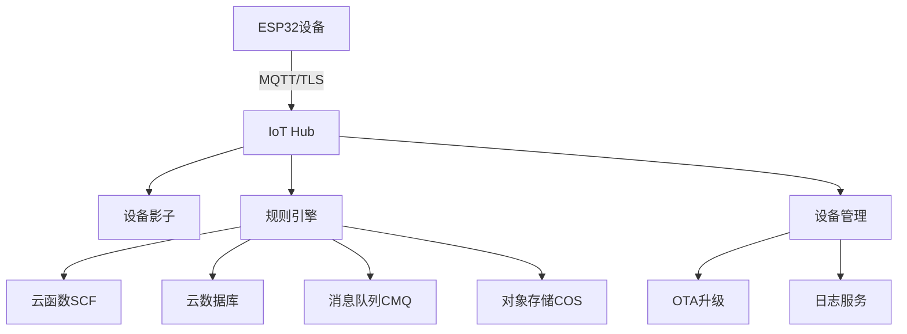
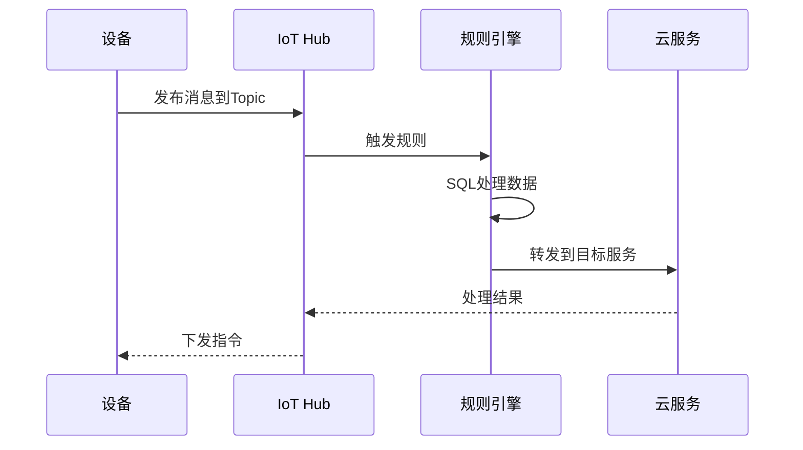

# 腾讯云IoT平台集成实战

## 概述

腾讯云物联网通信（IoT Hub）是腾讯云提供的面向物联网领域的通信平台，为设备和应用程序之间提供安全、稳定、高效的连接服务。本文将介绍腾讯云IoT平台的核心概念、设备接入方法、数据转发机制和典型应用场景。

完成本文学习后，你将能够：

- 理解腾讯云IoT Hub的核心架构和功能特点
- 掌握设备认证和安全连接方式
- 了解数据转发和规则引擎的配置方法
- 熟悉腾讯云IoT的典型应用场景

## 背景知识

### 腾讯云IoT生态

腾讯云物联网解决方案包含多个产品：

- **IoT Hub（物联网通信）**：设备连接和消息通信平台
- **IoT Explorer（物联网开发平台）**：低代码开发平台，提供可视化配置
- **IoT Video（物联网视频服务）**：视频设备接入和管理
- **LPWA（低功耗广域网）**：NB-IoT/LoRa设备接入

本文重点介绍IoT Hub，它是腾讯云IoT生态的核心组件。

### 与其他云平台的对比

| 特性 | 腾讯云IoT Hub | AWS IoT Core | 阿里云IoT |
|------|---------------|--------------|-----------|
| 认证方式 | 证书/密钥 | X.509证书 | 三元组 |
| 协议支持 | MQTT, CoAP, HTTP | MQTT, HTTPS, WebSocket | MQTT, CoAP, HTTPS |
| 数据模型 | 自定义Topic | Device Shadow | 物模型（TSL） |
| 规则引擎 | SQL语法 | SQL语法 | SQL语法 |
| 定价模式 | 按消息数 | 按消息数 | 按消息数 |
| 区域支持 | 国内多区域 | 全球多区域 | 主要在中国 |

## 核心概念

### 1. 产品和设备

**产品（Product）**：
- 一类设备的集合
- 定义设备的通信协议和认证方式
- 管理设备的权限和配置

**设备（Device）**：
- 产品下的具体设备实例
- 拥有唯一的设备名称和密钥
- 继承产品的配置和权限

### 2. 设备认证

腾讯云IoT支持两种认证方式：

**密钥认证**：
- 使用设备密钥（DeviceSecret）进行认证
- 适合设备数量较少的场景
- 安全性较高，密钥需妥善保管

**证书认证**：
- 使用X.509证书进行双向认证
- 适合对安全要求高的场景
- 支持证书吊销和更新

### 3. Topic模型

腾讯云IoT使用基于Topic的发布/订阅模型：

**系统Topic**：
- 由平台定义，用于特定功能
- 格式：`$sys/{ProductID}/{DeviceName}/...`
- 例如：设备影子、OTA升级

**自定义Topic**：
- 由用户定义，用于业务数据
- 格式：`{ProductID}/{DeviceName}/...`
- 支持通配符订阅

### 4. 设备影子

设备影子是设备状态的JSON文档，包含：

- **state.reported**：设备上报的实际状态
- **state.desired**：应用设置的期望状态
- **metadata**：状态更新的元数据

设备影子支持设备离线时的状态同步。

### 5. 规则引擎

规则引擎用于处理和转发设备数据：

- 使用SQL语法筛选和转换数据
- 支持转发到多种腾讯云服务
- 提供数据清洗和格式转换功能

**支持的目标服务**：
- 云数据库MySQL
- 时序数据库CTSDB
- 消息队列CMQ
- 云函数SCF
- 对象存储COS

## 平台架构

### 整体架构



### 数据流转



## 设备接入流程

### 1. 创建产品

在腾讯云IoT控制台创建产品：

1. 登录腾讯云控制台
2. 进入"物联网通信"服务
3. 点击"创建产品"
4. 填写产品信息：
   - 产品名称：如"智能传感器"
   - 认证方式：选择"密钥认证"或"证书认证"
   - 数据格式：选择"自定义"
   - 通信方式：选择"WiFi"

### 2. 添加设备

在产品下添加设备：

1. 进入产品详情页
2. 点击"设备列表" -> "添加设备"
3. 填写设备名称：如"sensor_001"
4. 系统自动生成设备密钥

**设备信息示例**：
```json
{
  "ProductID": "ABCDEFGHIJ",
  "DeviceName": "sensor_001",
  "DeviceSecret": "xxxxxxxxxxxxxxxxxxxxxxxxxxxxxxxx"
}
```

### 3. MQTT连接参数

**Broker地址**：
```text
{ProductID}.iotcloud.tencentdevices.com
```

**端口**：
- 1883：TCP明文连接
- 8883：TLS加密连接（推荐）

**ClientID格式**：
```text
{ProductID}{DeviceName}
```

**Username格式**：
```text
{ProductID}{DeviceName};{SDKAppID};{ConnID};{Expiry}
```

**Password计算**：
```text
base64(hmac_sha256(DeviceSecret, "deviceName={DeviceName}&nonce={Nonce}&productId={ProductID}&timestamp={Timestamp}"))
```

### 4. ESP32连接示例

```c
#include <WiFi.h>
#include <PubSubClient.h>
#include "mbedtls/md.h"

// 腾讯云IoT配置
#define PRODUCT_ID "ABCDEFGHIJ"
#define DEVICE_NAME "sensor_001"
#define DEVICE_SECRET "xxxxxxxxxxxxxxxxxxxxxxxxxxxxxxxx"

// MQTT服务器
#define MQTT_SERVER PRODUCT_ID ".iotcloud.tencentdevices.com"
#define MQTT_PORT 1883

// 创建客户端
WiFiClient espClient;
PubSubClient mqttClient(espClient);

// 生成MQTT连接参数
void generateMqttParams(String& clientId, String& username, String& password) {
    // ClientID
    clientId = String(PRODUCT_ID) + String(DEVICE_NAME);
    
    // 生成随机数和时间戳
    uint32_t nonce = random(100000, 999999);
    uint32_t timestamp = millis() / 1000;
    uint32_t expiry = timestamp + 86400;  // 24小时有效期
    
    // Username
    username = String(PRODUCT_ID) + String(DEVICE_NAME) + 
               ";12010126;12345;" + String(expiry);
    
    // 计算Password
    String content = "deviceName=" + String(DEVICE_NAME) + 
                     "&nonce=" + String(nonce) + 
                     "&productId=" + String(PRODUCT_ID) + 
                     "&timestamp=" + String(timestamp);
    
    password = hmacSha256(content, String(DEVICE_SECRET));
}

// HMAC-SHA256计算
String hmacSha256(const String& data, const String& key) {
    byte hmac[32];
    mbedtls_md_context_t ctx;
    mbedtls_md_type_t md_type = MBEDTLS_MD_SHA256;
    
    mbedtls_md_init(&ctx);
    mbedtls_md_setup(&ctx, mbedtls_md_info_from_type(md_type), 1);
    mbedtls_md_hmac_starts(&ctx, (const unsigned char*)key.c_str(), key.length());
    mbedtls_md_hmac_update(&ctx, (const unsigned char*)data.c_str(), data.length());
    mbedtls_md_hmac_finish(&ctx, hmac);
    mbedtls_md_free(&ctx);
    
    // Base64编码
    return base64Encode(hmac, 32);
}

// 连接到腾讯云IoT
void connectTencentIoT() {
    String clientId, username, password;
    generateMqttParams(clientId, username, password);
    
    mqttClient.setServer(MQTT_SERVER, MQTT_PORT);
    
    Serial.print("连接到腾讯云IoT...");
    if (mqttClient.connect(clientId.c_str(), username.c_str(), password.c_str())) {
        Serial.println("已连接!");
    } else {
        Serial.print("连接失败, rc=");
        Serial.println(mqttClient.state());
    }
}
```

## 数据通信

### 1. 发布消息

设备发布消息到自定义Topic：

```c
// 定义Topic
#define PUB_TOPIC PRODUCT_ID "/" DEVICE_NAME "/data"

void publishData() {
    // 构建JSON消息
    StaticJsonDocument<256> doc;
    doc["temperature"] = 25.5;
    doc["humidity"] = 60.0;
    doc["timestamp"] = millis();
    
    char jsonBuffer[256];
    serializeJson(doc, jsonBuffer);
    
    // 发布消息
    mqttClient.publish(PUB_TOPIC, jsonBuffer);
    Serial.println("消息已发布");
}
```

### 2. 订阅消息

设备订阅Topic接收云端指令：

```c
// 定义订阅Topic
#define SUB_TOPIC PRODUCT_ID "/" DEVICE_NAME "/control"

void mqttCallback(char* topic, byte* payload, unsigned int length) {
    Serial.print("收到消息 [");
    Serial.print(topic);
    Serial.print("]: ");
    
    String message = "";
    for (int i = 0; i < length; i++) {
        message += (char)payload[i];
    }
    Serial.println(message);
    
    // 解析JSON
    StaticJsonDocument<256> doc;
    deserializeJson(doc, message);
    
    // 处理控制指令
    if (doc.containsKey("led")) {
        bool ledState = doc["led"];
        digitalWrite(LED_PIN, ledState ? HIGH : LOW);
    }
}

void setup() {
    // ...
    mqttClient.setCallback(mqttCallback);
    connectTencentIoT();
    mqttClient.subscribe(SUB_TOPIC);
}
```

### 3. 设备影子

使用设备影子同步设备状态：

**更新影子Topic**：
```text
$shadow/operation/{ProductID}/{DeviceName}
```

**更新影子消息格式**：
```json
{
  "type": "update",
  "state": {
    "reported": {
      "temperature": 25.5,
      "humidity": 60.0
    }
  },
  "version": 1
}
```

**获取影子Topic**：
```text
$shadow/operation/result/{ProductID}/{DeviceName}
```

## 规则引擎配置

### 1. 创建规则

在控制台创建数据转发规则：

1. 进入"规则引擎"页面
2. 点击"创建规则"
3. 填写规则信息：
   - 规则名称：如"SaveSensorData"
   - 规则描述：保存传感器数据到数据库

### 2. 配置SQL

编写SQL语句筛选和转换数据：

```sql
SELECT 
    deviceName() as device_id,
    temperature,
    humidity,
    timestamp() as time
FROM 
    "ABCDEFGHIJ/+/data"
WHERE 
    temperature > 0 AND humidity > 0
```

**SQL函数说明**：
- `deviceName()`：获取设备名称
- `timestamp()`：获取当前时间戳
- `+`：通配符，匹配任意设备

### 3. 配置转发

选择数据转发目标：

**转发到云数据库**：
- 选择数据库实例
- 指定数据库和表名
- 配置字段映射

**转发到云函数**：
- 选择云函数
- 配置触发参数
- 处理返回结果

**转发到消息队列**：
- 选择CMQ队列
- 配置消息格式
- 设置重试策略

### 4. 规则示例

**示例1：温度告警**

SQL语句：
```sql
SELECT 
    deviceName() as device_id,
    temperature,
    timestamp() as alert_time
FROM 
    "ABCDEFGHIJ/+/data"
WHERE 
    temperature > 30
```

转发到云函数，发送告警通知。

**示例2：数据聚合**

SQL语句：
```sql
SELECT 
    deviceName() as device_id,
    avg(temperature) as avg_temp,
    max(temperature) as max_temp,
    min(temperature) as min_temp
FROM 
    "ABCDEFGHIJ/+/data"
GROUP BY 
    deviceName(), 
    window(5m)
```

每5分钟聚合一次数据，转发到时序数据库。

## 应用场景

### 1. 智能家居

**场景描述**：
- 多个传感器设备采集环境数据
- 云端分析数据并控制设备
- 用户通过APP远程监控和控制

**技术方案**：
- 设备通过MQTT连接到IoT Hub
- 使用设备影子同步设备状态
- 规则引擎转发数据到云函数
- 云函数处理业务逻辑并下发指令

### 2. 工业监控

**场景描述**：
- 工业设备实时上报运行数据
- 云端存储历史数据并分析
- 异常情况及时告警

**技术方案**：
- 设备使用证书认证确保安全
- 规则引擎转发数据到时序数据库
- 配置告警规则触发云函数
- 云函数发送告警到企业微信

### 3. 车联网

**场景描述**：
- 车载设备上报位置和状态
- 云端分析驾驶行为
- 提供远程诊断和OTA升级

**技术方案**：
- 使用CoAP协议降低流量消耗
- 规则引擎转发数据到对象存储
- 使用OTA服务远程升级固件
- 设备影子管理车辆状态

### 4. 农业物联网

**场景描述**：
- 传感器监测土壤和环境
- 自动控制灌溉和施肥
- 数据分析优化种植方案

**技术方案**：
- 使用LPWA接入偏远地区设备
- 规则引擎转发数据到云数据库
- 云函数实现自动化控制逻辑
- 数据分析服务提供决策支持

## 最佳实践

### 1. 安全性

**使用TLS加密**：
- 生产环境必须使用8883端口
- 启用证书认证提高安全性
- 定期更新设备密钥

**权限控制**：
- 为不同设备分配不同的Topic权限
- 使用CAM（访问管理）控制API权限
- 启用操作审计记录所有操作

### 2. 可靠性

**消息QoS**：
- 重要消息使用QoS 1确保送达
- 非关键消息使用QoS 0降低开销
- 实现消息去重机制

**断线重连**：
- 实现自动重连机制
- 使用指数退避算法避免频繁重连
- 保存未发送消息，重连后补发

### 3. 性能优化

**减少消息频率**：
- 合理设置上报间隔（建议5-10分钟）
- 只在数据变化时上报
- 使用批量上报减少消息数

**优化消息大小**：
- 精简JSON字段
- 使用短字段名
- 考虑使用二进制协议（如Protobuf）

### 4. 成本控制

**免费额度**：
- 每月100万条消息（上行+下行）
- 规则引擎免费
- 设备数量无限制

**优化建议**：
- 监控消息使用量
- 设置费用告警
- 优化数据上报策略
- 使用数据压缩

## 常见问题

### Q1: 如何选择认证方式？

**A**: 
- **密钥认证**：适合设备数量较少、对安全要求一般的场景，配置简单
- **证书认证**：适合对安全要求高的场景，支持证书吊销，但配置复杂

建议生产环境使用证书认证。

### Q2: 设备频繁掉线怎么办？

**A**: 可能原因和解决方法：
- **网络不稳定**：优化WiFi连接，使用自动重连
- **Keep-Alive设置不当**：调整心跳间隔（建议60-120秒）
- **内存不足**：优化代码，减少内存占用
- **认证失败**：检查设备密钥和时间戳

### Q3: 如何调试MQTT连接问题？

**A**: 调试步骤：
1. 使用MQTT客户端工具（如MQTTX）测试连接
2. 检查ClientID、Username、Password是否正确
3. 查看设备日志和云端日志
4. 确认Topic权限配置正确
5. 使用抓包工具分析网络通信

### Q4: 规则引擎不触发怎么办？

**A**: 检查项：
- SQL语句是否正确
- Topic是否匹配
- WHERE条件是否满足
- 目标服务是否配置正确
- 查看规则引擎日志

## 总结

腾讯云IoT Hub提供了完整的物联网设备接入和管理能力，具有以下特点：

**优势**：
- 国内访问速度快，延迟低
- 与腾讯云其他服务深度集成
- 提供丰富的SDK和开发工具
- 支持多种认证和通信协议
- 规则引擎功能强大

**适用场景**：
- 智能家居和消费电子
- 工业物联网和设备监控
- 车联网和智慧交通
- 智慧农业和环境监测

**关键要点**：
- 选择合适的认证方式确保安全
- 使用规则引擎实现数据流转
- 利用设备影子管理设备状态
- 优化消息频率和大小控制成本
- 实现可靠的断线重连机制

## 延伸阅读

推荐进一步学习的资源：

- [腾讯云IoT Hub官方文档](https://cloud.tencent.com/document/product/634) - 完整的产品文档
- [腾讯云IoT Explorer](https://cloud.tencent.com/document/product/1081) - 低代码开发平台
- AWS IoT Core平台接入实战 - 学习AWS IoT平台
- 阿里云IoT平台设备接入实战 - 学习阿里云IoT平台
- MQTT协议应用开发 - 深入学习MQTT协议

## 参考资料

1. 腾讯云物联网通信产品文档 - https://cloud.tencent.com/document/product/634
2. 腾讯云IoT SDK - https://github.com/tencentyun/qcloud-iot-sdk-embedded-c
3. MQTT协议规范 - https://mqtt.org/
4. 腾讯云IoT最佳实践 - https://cloud.tencent.com/document/product/634/11913
5. 腾讯云IoT定价说明 - https://cloud.tencent.com/document/product/634/11911

---

**下一步**：建议学习 [私有云IoT平台搭建](../advanced/01-private-iot-platform.html)，了解如何搭建自己的IoT平台。
