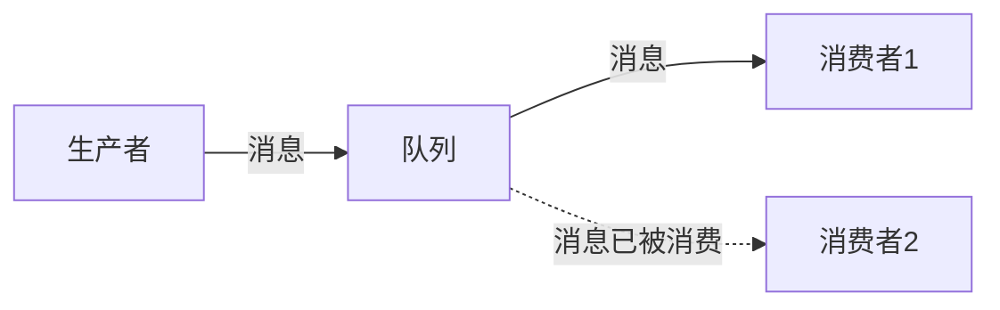
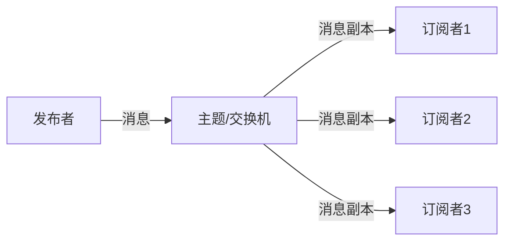
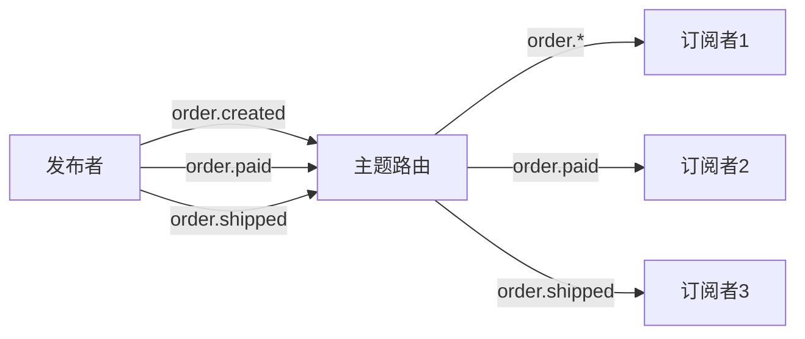
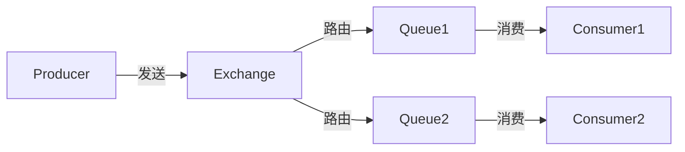
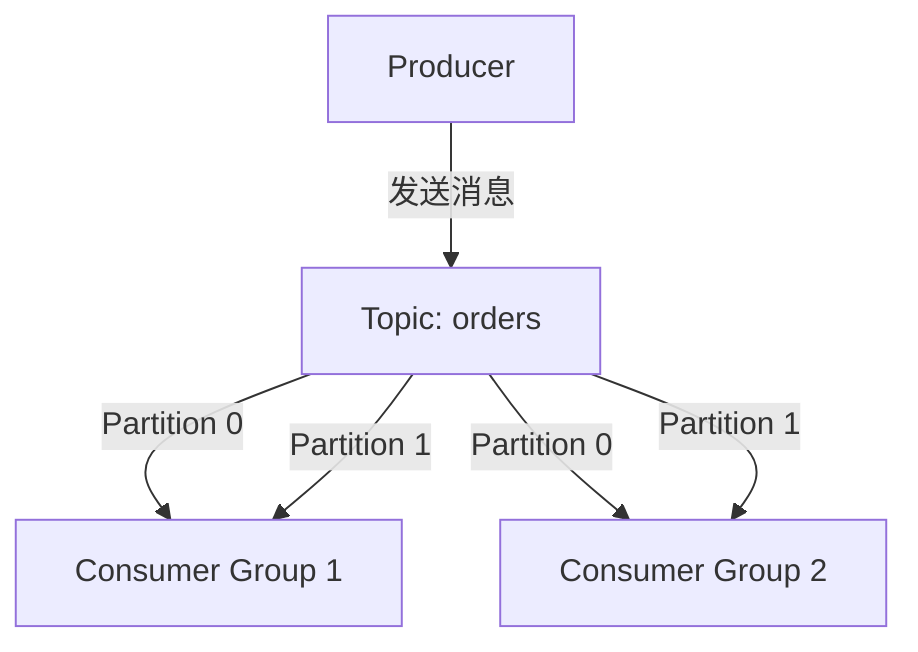
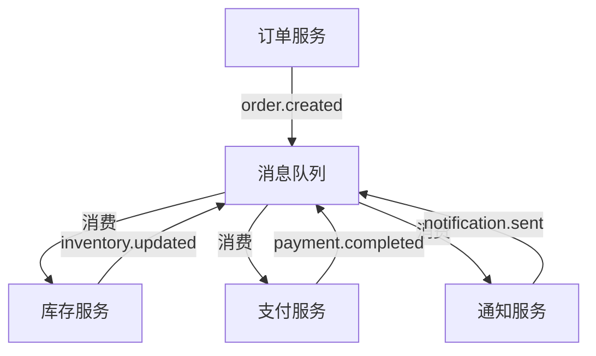

# 消息队列应用实践：RabbitMQ与Kafka入门到实战


## 学习目标

完成本教程后，你将能够：

- [ ] 理解消息队列的核心概念和工作原理
- [ ] 掌握RabbitMQ的安装、配置和基本使用
- [ ] 掌握Kafka的安装、配置和基本使用
- [ ] 理解不同的消息模式（点对点、发布订阅、主题）
- [ ] 实现异步任务处理和系统解耦
- [ ] 应用消息队列实现削峰填谷
- [ ] 处理消息可靠性和幂等性问题
- [ ] 在实际项目中选择合适的消息队列方案

## 前置要求

在开始本教程之前，你需要：

**知识要求**：
- 熟悉Python或Java编程语言
- 了解RESTful API设计
- 理解微服务架构基本概念
- 了解Docker基础知识（推荐）

**技能要求**：
- 能够使用命令行工具
- 会使用文本编辑器或IDE
- 了解基本的网络通信概念
- 能够阅读和理解技术文档


## 概述

消息队列（Message Queue）是现代分布式系统和微服务架构中的核心组件。它通过异步消息传递实现系统解耦、削峰填谷和可靠通信。

**为什么需要消息队列？**

在传统的同步调用中，服务A直接调用服务B，如果服务B不可用或响应慢，会直接影响服务A。消息队列通过引入中间层，实现了：

- **异步处理**：提高系统响应速度
- **系统解耦**：服务之间松耦合
- **削峰填谷**：应对流量高峰
- **可靠通信**：保证消息不丢失
- **负载均衡**：多个消费者分担负载

**消息队列的应用场景**：

- 订单处理系统
- 日志收集和分析
- 实时数据流处理
- 邮件和短信发送
- 任务调度系统
- 物联网数据采集


## 背景知识

### 什么是消息队列？

消息队列是一种应用程序间的通信方法，通过在消息的传输过程中保存消息来实现异步通信。

**核心组件**：


- **生产者（Producer）**：发送消息的应用程序
- **消息队列（Queue）**：存储消息的中间件
- **消费者（Consumer）**：接收和处理消息的应用程序
- **消息（Message）**：传输的数据单元

### 消息队列 vs 直接调用

#### 同步调用（传统方式）

```python
# 订单服务直接调用库存服务
def create_order(order_data):
    # 创建订单
    order = save_order(order_data)
    
    # 同步调用库存服务（阻塞）
    inventory_service.deduct_stock(order.product_id, order.quantity)
    
    # 同步调用支付服务（阻塞）
    payment_service.create_payment(order.id, order.amount)
    
    return order
```

**问题**：
- 响应时间长（需要等待所有服务完成）
- 服务耦合度高
- 任何一个服务故障都会影响整体
- 无法应对流量高峰

#### 异步调用（消息队列）

```python
# 订单服务通过消息队列异步通知
def create_order(order_data):
    # 创建订单
    order = save_order(order_data)
    
    # 发送消息到队列（非阻塞）
    message_queue.publish('order.created', {
        'order_id': order.id,
        'product_id': order.product_id,
        'quantity': order.quantity
    })
    
    # 立即返回
    return order
```

**优势**：
- 快速响应（不等待其他服务）
- 服务解耦（通过消息通信）
- 容错性强（消息持久化）
- 可以削峰填谷

### 消息队列的特性

#### 1. 异步通信

生产者发送消息后立即返回，不需要等待消费者处理。

#### 2. 解耦

生产者和消费者不需要知道对方的存在，只需要知道消息格式。

#### 3. 削峰填谷

在流量高峰期，消息暂存在队列中，消费者按照自己的处理能力消费。

```
流量高峰：1000 req/s → 消息队列 → 消费者处理：100 req/s
```

#### 4. 可靠性

消息持久化到磁盘，即使系统崩溃也不会丢失。

#### 5. 顺序保证

某些消息队列可以保证消息的顺序性。


## 消息模式

### 1. 点对点模式（Point-to-Point）

一个消息只能被一个消费者消费。



**特点**：
- 每条消息只被消费一次
- 消费者之间竞争消息
- 适合任务分发场景

**应用场景**：
- 任务队列
- 订单处理
- 邮件发送

### 2. 发布订阅模式（Publish-Subscribe）

一个消息可以被多个消费者消费。



**特点**：
- 每个订阅者都收到消息副本
- 发布者和订阅者解耦
- 适合广播场景

**应用场景**：
- 系统通知
- 日志收集
- 数据同步

### 3. 主题模式（Topic）

基于主题的路由，消费者订阅感兴趣的主题。



**特点**：
- 支持通配符匹配
- 灵活的路由规则
- 适合复杂的消息分发

**应用场景**：
- 事件驱动架构
- 微服务通信
- 实时数据流


## 准备工作

### 环境准备

本教程将使用Docker来快速搭建RabbitMQ和Kafka环境。

**软件要求**：
- Docker Desktop 或 Docker Engine
- Python 3.8+ 或 Java 11+
- 文本编辑器或IDE

### 安装Docker

如果还没有安装Docker，请参考官方文档：
- Windows/Mac: [Docker Desktop](https://www.docker.com/products/docker-desktop)
- Linux: [Docker Engine](https://docs.docker.com/engine/install/)

验证Docker安装：

```bash
docker --version
docker-compose --version
```

### 创建项目目录

```bash
mkdir message-queue-tutorial
cd message-queue-tutorial
```

### 安装Python依赖

创建虚拟环境并安装依赖：

```bash
# 创建虚拟环境
python -m venv venv

# 激活虚拟环境
# Windows:
venv\Scripts\activate
# Linux/Mac:
source venv/bin/activate

# 安装依赖
pip install pika kafka-python
```

**依赖说明**：
- `pika`: RabbitMQ的Python客户端
- `kafka-python`: Kafka的Python客户端


## 步骤1：RabbitMQ入门

### 1.1 启动RabbitMQ

使用Docker启动RabbitMQ服务：

```bash
docker run -d --name rabbitmq \
  -p 5672:5672 \
  -p 15672:15672 \
  rabbitmq:3-management
```

**参数说明**：
- `-d`: 后台运行
- `--name rabbitmq`: 容器名称
- `-p 5672:5672`: AMQP协议端口
- `-p 15672:15672`: Web管理界面端口
- `rabbitmq:3-management`: 带管理界面的镜像

**验证安装**：

访问管理界面：http://localhost:15672
- 用户名：`guest`
- 密码：`guest`

### 1.2 RabbitMQ基本概念

**核心组件**：



- **Exchange（交换机）**：接收消息并路由到队列
- **Queue（队列）**：存储消息
- **Binding（绑定）**：Exchange和Queue之间的路由规则
- **Routing Key（路由键）**：消息的路由标识

**Exchange类型**：

| 类型 | 说明 | 使用场景 |
|------|------|----------|
| Direct | 精确匹配routing key | 点对点消息 |
| Fanout | 广播到所有绑定的队列 | 发布订阅 |
| Topic | 通配符匹配routing key | 主题订阅 |
| Headers | 根据消息头路由 | 复杂路由 |

### 1.3 创建生产者

创建 `rabbitmq_producer.py` 文件：

```python
import pika
import json
import time

class RabbitMQProducer:
    def __init__(self, host='localhost'):
        # 建立连接
        self.connection = pika.BlockingConnection(
            pika.ConnectionParameters(host=host)
        )
        self.channel = self.connection.channel()
        
        # 声明队列
        self.channel.queue_declare(
            queue='task_queue',
            durable=True  # 队列持久化
        )
    
    def send_message(self, message):
        """发送消息到队列"""
        self.channel.basic_publish(
            exchange='',
            routing_key='task_queue',
            body=json.dumps(message),
            properties=pika.BasicProperties(
                delivery_mode=2,  # 消息持久化
            )
        )
        print(f"[x] 发送消息: {message}")
    
    def close(self):
        """关闭连接"""
        self.connection.close()

# 使用示例
if __name__ == '__main__':
    producer = RabbitMQProducer()
    
    # 发送10条消息
    for i in range(10):
        message = {
            'task_id': i,
            'task_type': 'process_order',
            'data': f'Order #{i}',
            'timestamp': time.time()
        }
        producer.send_message(message)
        time.sleep(1)
    
    producer.close()
    print("[✓] 所有消息已发送")
```

**代码说明**：
- `queue_declare(durable=True)`: 声明持久化队列
- `delivery_mode=2`: 设置消息持久化
- `json.dumps()`: 将消息序列化为JSON

### 1.4 创建消费者

创建 `rabbitmq_consumer.py` 文件：

```python
import pika
import json
import time

class RabbitMQConsumer:
    def __init__(self, host='localhost'):
        # 建立连接
        self.connection = pika.BlockingConnection(
            pika.ConnectionParameters(host=host)
        )
        self.channel = self.connection.channel()
        
        # 声明队列（确保队列存在）
        self.channel.queue_declare(
            queue='task_queue',
            durable=True
        )
        
        # 设置公平分发（每次只处理一条消息）
        self.channel.basic_qos(prefetch_count=1)
    
    def callback(self, ch, method, properties, body):
        """消息处理回调函数"""
        message = json.loads(body)
        print(f"[x] 接收到消息: {message}")
        
        # 模拟处理任务
        task_type = message.get('task_type')
        print(f"[*] 处理任务: {task_type}")
        time.sleep(2)  # 模拟耗时操作
        
        print(f"[✓] 任务完成: {message['task_id']}")
        
        # 手动确认消息
        ch.basic_ack(delivery_tag=method.delivery_tag)
    
    def start_consuming(self):
        """开始消费消息"""
        self.channel.basic_consume(
            queue='task_queue',
            on_message_callback=self.callback,
            auto_ack=False  # 手动确认
        )
        
        print('[*] 等待消息。按 CTRL+C 退出')
        self.channel.start_consuming()
    
    def close(self):
        """关闭连接"""
        self.connection.close()

# 使用示例
if __name__ == '__main__':
    consumer = RabbitMQConsumer()
    try:
        consumer.start_consuming()
    except KeyboardInterrupt:
        print('\n[!] 停止消费')
        consumer.close()
```

**代码说明**：
- `basic_qos(prefetch_count=1)`: 公平分发，每次只取一条消息
- `auto_ack=False`: 关闭自动确认，改为手动确认
- `basic_ack()`: 手动确认消息已处理

### 1.5 测试运行

**启动消费者**（在一个终端）：

```bash
python rabbitmq_consumer.py
```

**启动生产者**（在另一个终端）：

```bash
python rabbitmq_producer.py
```

**预期结果**：
- 生产者发送10条消息
- 消费者逐条接收并处理消息
- 每条消息处理耗时约2秒


## 步骤2：RabbitMQ发布订阅模式

### 2.1 创建发布者

创建 `rabbitmq_publisher.py` 文件：

```python
import pika
import json
import sys

class RabbitMQPublisher:
    def __init__(self, host='localhost'):
        self.connection = pika.BlockingConnection(
            pika.ConnectionParameters(host=host)
        )
        self.channel = self.connection.channel()
        
        # 声明fanout类型的交换机
        self.channel.exchange_declare(
            exchange='logs',
            exchange_type='fanout'
        )
    
    def publish(self, message):
        """发布消息到交换机"""
        self.channel.basic_publish(
            exchange='logs',
            routing_key='',  # fanout类型忽略routing_key
            body=json.dumps(message)
        )
        print(f"[x] 发布消息: {message}")
    
    def close(self):
        self.connection.close()

# 使用示例
if __name__ == '__main__':
    publisher = RabbitMQPublisher()
    
    # 发布日志消息
    log_levels = ['INFO', 'WARNING', 'ERROR']
    for i in range(5):
        message = {
            'level': log_levels[i % 3],
            'message': f'这是第 {i+1} 条日志',
            'service': 'order-service'
        }
        publisher.publish(message)
    
    publisher.close()
```

### 2.2 创建订阅者

创建 `rabbitmq_subscriber.py` 文件：

```python
import pika
import json
import sys

class RabbitMQSubscriber:
    def __init__(self, host='localhost', subscriber_name='subscriber'):
        self.subscriber_name = subscriber_name
        self.connection = pika.BlockingConnection(
            pika.ConnectionParameters(host=host)
        )
        self.channel = self.connection.channel()
        
        # 声明交换机
        self.channel.exchange_declare(
            exchange='logs',
            exchange_type='fanout'
        )
        
        # 声明临时队列（独占队列，连接断开后自动删除）
        result = self.channel.queue_declare(queue='', exclusive=True)
        self.queue_name = result.method.queue
        
        # 绑定队列到交换机
        self.channel.queue_bind(
            exchange='logs',
            queue=self.queue_name
        )
    
    def callback(self, ch, method, properties, body):
        """消息处理回调"""
        message = json.loads(body)
        print(f"[{self.subscriber_name}] 收到消息: {message}")
    
    def start_consuming(self):
        """开始订阅"""
        self.channel.basic_consume(
            queue=self.queue_name,
            on_message_callback=self.callback,
            auto_ack=True
        )
        
        print(f'[*] [{self.subscriber_name}] 等待消息。按 CTRL+C 退出')
        self.channel.start_consuming()
    
    def close(self):
        self.connection.close()

# 使用示例
if __name__ == '__main__':
    subscriber_name = sys.argv[1] if len(sys.argv) > 1 else 'subscriber'
    subscriber = RabbitMQSubscriber(subscriber_name=subscriber_name)
    
    try:
        subscriber.start_consuming()
    except KeyboardInterrupt:
        print(f'\n[!] [{subscriber_name}] 停止订阅')
        subscriber.close()
```

### 2.3 测试发布订阅

**启动多个订阅者**：

```bash
# 终端1
python rabbitmq_subscriber.py subscriber1

# 终端2
python rabbitmq_subscriber.py subscriber2

# 终端3
python rabbitmq_subscriber.py subscriber3
```

**发布消息**：

```bash
# 终端4
python rabbitmq_publisher.py
```

**预期结果**：
- 所有订阅者都收到相同的消息
- 每个订阅者独立处理消息


## 步骤3：RabbitMQ主题模式

### 3.1 创建主题发布者

创建 `rabbitmq_topic_publisher.py` 文件：

```python
import pika
import json

class TopicPublisher:
    def __init__(self, host='localhost'):
        self.connection = pika.BlockingConnection(
            pika.ConnectionParameters(host=host)
        )
        self.channel = self.connection.channel()
        
        # 声明topic类型的交换机
        self.channel.exchange_declare(
            exchange='events',
            exchange_type='topic'
        )
    
    def publish(self, routing_key, message):
        """发布消息到指定主题"""
        self.channel.basic_publish(
            exchange='events',
            routing_key=routing_key,
            body=json.dumps(message)
        )
        print(f"[x] 发布到 {routing_key}: {message}")
    
    def close(self):
        self.connection.close()

# 使用示例
if __name__ == '__main__':
    publisher = TopicPublisher()
    
    # 发布不同类型的事件
    events = [
        ('order.created', {'order_id': 1, 'amount': 100}),
        ('order.paid', {'order_id': 1, 'payment_id': 'PAY001'}),
        ('order.shipped', {'order_id': 1, 'tracking': 'TRACK001'}),
        ('user.registered', {'user_id': 1, 'email': 'user@example.com'}),
        ('user.login', {'user_id': 1, 'ip': '192.168.1.1'}),
    ]
    
    for routing_key, message in events:
        publisher.publish(routing_key, message)
    
    publisher.close()
```

### 3.2 创建主题订阅者

创建 `rabbitmq_topic_subscriber.py` 文件：

```python
import pika
import json
import sys

class TopicSubscriber:
    def __init__(self, host='localhost', binding_keys=None):
        self.connection = pika.BlockingConnection(
            pika.ConnectionParameters(host=host)
        )
        self.channel = self.connection.channel()
        
        # 声明交换机
        self.channel.exchange_declare(
            exchange='events',
            exchange_type='topic'
        )
        
        # 声明队列
        result = self.channel.queue_declare(queue='', exclusive=True)
        self.queue_name = result.method.queue
        
        # 绑定多个routing key
        if binding_keys:
            for binding_key in binding_keys:
                self.channel.queue_bind(
                    exchange='events',
                    queue=self.queue_name,
                    routing_key=binding_key
                )
                print(f"[*] 订阅主题: {binding_key}")
    
    def callback(self, ch, method, properties, body):
        """消息处理回调"""
        message = json.loads(body)
        print(f"[x] 收到 {method.routing_key}: {message}")
    
    def start_consuming(self):
        """开始订阅"""
        self.channel.basic_consume(
            queue=self.queue_name,
            on_message_callback=self.callback,
            auto_ack=True
        )
        
        print('[*] 等待消息。按 CTRL+C 退出')
        self.channel.start_consuming()
    
    def close(self):
        self.connection.close()

# 使用示例
if __name__ == '__main__':
    # 从命令行参数获取订阅的主题
    binding_keys = sys.argv[1:] if len(sys.argv) > 1 else ['#']
    
    subscriber = TopicSubscriber(binding_keys=binding_keys)
    
    try:
        subscriber.start_consuming()
    except KeyboardInterrupt:
        print('\n[!] 停止订阅')
        subscriber.close()
```

### 3.3 测试主题模式

**订阅所有订单事件**：

```bash
python rabbitmq_topic_subscriber.py "order.*"
```

**订阅所有用户事件**：

```bash
python rabbitmq_topic_subscriber.py "user.*"
```

**订阅所有事件**：

```bash
python rabbitmq_topic_subscriber.py "#"
```

**订阅特定事件**：

```bash
python rabbitmq_topic_subscriber.py "order.created" "order.paid"
```

**发布事件**：

```bash
python rabbitmq_topic_publisher.py
```

**通配符说明**：
- `*`: 匹配一个单词
- `#`: 匹配零个或多个单词

**示例**：
- `order.*`: 匹配 `order.created`, `order.paid`
- `*.created`: 匹配 `order.created`, `user.created`
- `order.#`: 匹配 `order.created`, `order.paid.success`
- `#`: 匹配所有消息


## 步骤4：Kafka入门

### 4.1 启动Kafka

使用Docker Compose启动Kafka和Zookeeper。

创建 `docker-compose.yml` 文件：

```yaml
version: '3'
services:
  zookeeper:
    image: confluentinc/cp-zookeeper:latest
    environment:
      ZOOKEEPER_CLIENT_PORT: 2181
      ZOOKEEPER_TICK_TIME: 2000
    ports:
      - "2181:2181"
  
  kafka:
    image: confluentinc/cp-kafka:latest
    depends_on:
      - zookeeper
    ports:
      - "9092:9092"
    environment:
      KAFKA_BROKER_ID: 1
      KAFKA_ZOOKEEPER_CONNECT: zookeeper:2181
      KAFKA_ADVERTISED_LISTENERS: PLAINTEXT://localhost:9092
      KAFKA_OFFSETS_TOPIC_REPLICATION_FACTOR: 1
```

**启动服务**：

```bash
docker-compose up -d
```

**验证安装**：

```bash
# 查看运行状态
docker-compose ps

# 查看日志
docker-compose logs kafka
```

### 4.2 Kafka基本概念

**核心组件**：



- **Topic（主题）**：消息的分类，类似于数据库的表
- **Partition（分区）**：Topic的物理分组，提高并行度
- **Producer（生产者）**：发送消息到Topic
- **Consumer（消费者）**：从Topic读取消息
- **Consumer Group（消费者组）**：多个消费者组成的组，共同消费Topic
- **Offset（偏移量）**：消息在分区中的位置

**Kafka vs RabbitMQ**：

| 特性 | Kafka | RabbitMQ |
|------|-------|----------|
| 消息模型 | 发布订阅 | 多种模式 |
| 吞吐量 | 极高 | 中等 |
| 延迟 | 较低 | 很低 |
| 消息顺序 | 分区内有序 | 队列内有序 |
| 持久化 | 默认持久化 | 可选持久化 |
| 适用场景 | 大数据、日志、流处理 | 任务队列、RPC |

### 4.3 创建Kafka生产者

创建 `kafka_producer.py` 文件：

```python
from kafka import KafkaProducer
import json
import time

class KafkaMessageProducer:
    def __init__(self, bootstrap_servers='localhost:9092'):
        # 创建生产者
        self.producer = KafkaProducer(
            bootstrap_servers=bootstrap_servers,
            value_serializer=lambda v: json.dumps(v).encode('utf-8'),
            key_serializer=lambda k: k.encode('utf-8') if k else None
        )
    
    def send_message(self, topic, message, key=None):
        """发送消息到指定主题"""
        future = self.producer.send(
            topic,
            value=message,
            key=key
        )
        
        # 等待发送完成
        record_metadata = future.get(timeout=10)
        
        print(f"[x] 消息已发送到 {topic}")
        print(f"    Topic: {record_metadata.topic}")
        print(f"    Partition: {record_metadata.partition}")
        print(f"    Offset: {record_metadata.offset}")
        
        return record_metadata
    
    def close(self):
        """关闭生产者"""
        self.producer.flush()
        self.producer.close()

# 使用示例
if __name__ == '__main__':
    producer = KafkaMessageProducer()
    
    # 发送订单事件
    for i in range(10):
        message = {
            'order_id': i,
            'user_id': 100 + i,
            'product_id': 200 + i,
            'amount': 99.99 * (i + 1),
            'status': 'created',
            'timestamp': time.time()
        }
        
        # 使用order_id作为key，确保同一订单的消息进入同一分区
        producer.send_message(
            topic='orders',
            message=message,
            key=str(message['order_id'])
        )
        
        time.sleep(0.5)
    
    producer.close()
    print("[✓] 所有消息已发送")
```

**代码说明**：
- `value_serializer`: 消息值序列化器
- `key_serializer`: 消息键序列化器
- `key`: 用于分区选择，相同key的消息进入同一分区

### 4.4 创建Kafka消费者

创建 `kafka_consumer.py` 文件：

```python
from kafka import KafkaConsumer
import json

class KafkaMessageConsumer:
    def __init__(self, topic, group_id, bootstrap_servers='localhost:9092'):
        # 创建消费者
        self.consumer = KafkaConsumer(
            topic,
            bootstrap_servers=bootstrap_servers,
            group_id=group_id,
            value_deserializer=lambda m: json.loads(m.decode('utf-8')),
            auto_offset_reset='earliest',  # 从最早的消息开始消费
            enable_auto_commit=True,  # 自动提交offset
            auto_commit_interval_ms=1000
        )
        self.group_id = group_id
    
    def consume_messages(self):
        """消费消息"""
        print(f'[*] [{self.group_id}] 开始消费消息...')
        
        try:
            for message in self.consumer:
                print(f"\n[{self.group_id}] 收到消息:")
                print(f"  Topic: {message.topic}")
                print(f"  Partition: {message.partition}")
                print(f"  Offset: {message.offset}")
                print(f"  Key: {message.key.decode('utf-8') if message.key else None}")
                print(f"  Value: {message.value}")
                
                # 处理消息
                self.process_message(message.value)
                
        except KeyboardInterrupt:
            print(f'\n[!] [{self.group_id}] 停止消费')
        finally:
            self.consumer.close()
    
    def process_message(self, message):
        """处理消息的业务逻辑"""
        order_id = message.get('order_id')
        amount = message.get('amount')
        print(f"  [*] 处理订单 #{order_id}, 金额: ${amount:.2f}")

# 使用示例
if __name__ == '__main__':
    import sys
    
    group_id = sys.argv[1] if len(sys.argv) > 1 else 'order-consumer-group'
    
    consumer = KafkaMessageConsumer(
        topic='orders',
        group_id=group_id
    )
    
    consumer.consume_messages()
```

**代码说明**：
- `group_id`: 消费者组ID，同组消费者共享消费进度
- `auto_offset_reset`: 从哪里开始消费（earliest/latest）
- `enable_auto_commit`: 是否自动提交offset

### 4.5 测试Kafka

**启动消费者**（在一个终端）：

```bash
python kafka_consumer.py consumer-group-1
```

**启动生产者**（在另一个终端）：

```bash
python kafka_producer.py
```

**启动多个消费者测试负载均衡**：

```bash
# 终端1
python kafka_consumer.py consumer-group-1

# 终端2（同一个组）
python kafka_consumer.py consumer-group-1

# 终端3（不同的组）
python kafka_consumer.py consumer-group-2
```

**预期结果**：
- 同一消费者组的消费者会分担消息（负载均衡）
- 不同消费者组的消费者会收到所有消息（发布订阅）


## 步骤5：实战案例 - 订单处理系统

### 5.1 系统架构

我们将构建一个完整的订单处理系统，包含以下服务：



### 5.2 订单服务（生产者）

创建 `order_service.py` 文件：

```python
from kafka import KafkaProducer
import json
import time
import uuid

class OrderService:
    def __init__(self):
        self.producer = KafkaProducer(
            bootstrap_servers='localhost:9092',
            value_serializer=lambda v: json.dumps(v).encode('utf-8')
        )
    
    def create_order(self, user_id, product_id, quantity, amount):
        """创建订单"""
        order_id = str(uuid.uuid4())
        
        order = {
            'order_id': order_id,
            'user_id': user_id,
            'product_id': product_id,
            'quantity': quantity,
            'amount': amount,
            'status': 'created',
            'created_at': time.time()
        }
        
        # 保存订单到数据库（这里省略）
        print(f"[订单服务] 创建订单: {order_id}")
        
        # 发布订单创建事件
        self.producer.send('order-events', {
            'event_type': 'order.created',
            'order': order
        })
        
        print(f"[订单服务] 发布事件: order.created")
        
        return order
    
    def close(self):
        self.producer.close()

# 使用示例
if __name__ == '__main__':
    service = OrderService()
    
    # 创建几个测试订单
    orders = [
        {'user_id': 1, 'product_id': 101, 'quantity': 2, 'amount': 199.98},
        {'user_id': 2, 'product_id': 102, 'quantity': 1, 'amount': 299.99},
        {'user_id': 3, 'product_id': 103, 'quantity': 3, 'amount': 149.97},
    ]
    
    for order_data in orders:
        service.create_order(**order_data)
        time.sleep(1)
    
    service.close()
```

### 5.3 库存服务（消费者）

创建 `inventory_service.py` 文件：

```python
from kafka import KafkaConsumer, KafkaProducer
import json

class InventoryService:
    def __init__(self):
        # 消费者
        self.consumer = KafkaConsumer(
            'order-events',
            bootstrap_servers='localhost:9092',
            group_id='inventory-service',
            value_deserializer=lambda m: json.loads(m.decode('utf-8')),
            auto_offset_reset='earliest'
        )
        
        # 生产者（用于发布库存更新事件）
        self.producer = KafkaProducer(
            bootstrap_servers='localhost:9092',
            value_serializer=lambda v: json.dumps(v).encode('utf-8')
        )
        
        # 模拟库存数据
        self.inventory = {
            101: 100,
            102: 50,
            103: 200
        }
    
    def process_order_created(self, order):
        """处理订单创建事件"""
        product_id = order['product_id']
        quantity = order['quantity']
        order_id = order['order_id']
        
        print(f"\n[库存服务] 处理订单: {order_id}")
        print(f"[库存服务] 商品ID: {product_id}, 数量: {quantity}")
        
        # 检查库存
        if product_id in self.inventory and self.inventory[product_id] >= quantity:
            # 扣减库存
            self.inventory[product_id] -= quantity
            print(f"[库存服务] 库存扣减成功，剩余: {self.inventory[product_id]}")
            
            # 发布库存更新事件
            self.producer.send('order-events', {
                'event_type': 'inventory.updated',
                'order_id': order_id,
                'product_id': product_id,
                'remaining': self.inventory[product_id],
                'status': 'success'
            })
        else:
            print(f"[库存服务] 库存不足")
            
            # 发布库存不足事件
            self.producer.send('order-events', {
                'event_type': 'inventory.insufficient',
                'order_id': order_id,
                'product_id': product_id,
                'status': 'failed'
            })
    
    def start(self):
        """开始消费消息"""
        print('[库存服务] 启动，等待订单事件...')
        
        try:
            for message in self.consumer:
                event = message.value
                event_type = event.get('event_type')
                
                if event_type == 'order.created':
                    self.process_order_created(event['order'])
                    
        except KeyboardInterrupt:
            print('\n[库存服务] 停止')
        finally:
            self.consumer.close()
            self.producer.close()

# 使用示例
if __name__ == '__main__':
    service = InventoryService()
    service.start()
```

### 5.4 支付服务（消费者）

创建 `payment_service.py` 文件：

```python
from kafka import KafkaConsumer, KafkaProducer
import json
import time

class PaymentService:
    def __init__(self):
        self.consumer = KafkaConsumer(
            'order-events',
            bootstrap_servers='localhost:9092',
            group_id='payment-service',
            value_deserializer=lambda m: json.loads(m.decode('utf-8')),
            auto_offset_reset='earliest'
        )
        
        self.producer = KafkaProducer(
            bootstrap_servers='localhost:9092',
            value_serializer=lambda v: json.dumps(v).encode('utf-8')
        )
    
    def process_inventory_updated(self, event):
        """处理库存更新事件"""
        if event.get('status') != 'success':
            return
        
        order_id = event['order_id']
        
        print(f"\n[支付服务] 处理订单: {order_id}")
        print(f"[支付服务] 开始处理支付...")
        
        # 模拟支付处理
        time.sleep(2)
        
        # 假设支付成功
        print(f"[支付服务] 支付成功")
        
        # 发布支付完成事件
        self.producer.send('order-events', {
            'event_type': 'payment.completed',
            'order_id': order_id,
            'payment_id': f'PAY-{order_id[:8]}',
            'status': 'success'
        })
    
    def start(self):
        """开始消费消息"""
        print('[支付服务] 启动，等待库存事件...')
        
        try:
            for message in self.consumer:
                event = message.value
                event_type = event.get('event_type')
                
                if event_type == 'inventory.updated':
                    self.process_inventory_updated(event)
                    
        except KeyboardInterrupt:
            print('\n[支付服务] 停止')
        finally:
            self.consumer.close()
            self.producer.close()

# 使用示例
if __name__ == '__main__':
    service = PaymentService()
    service.start()
```

### 5.5 通知服务（消费者）

创建 `notification_service.py` 文件：

```python
from kafka import KafkaConsumer
import json

class NotificationService:
    def __init__(self):
        self.consumer = KafkaConsumer(
            'order-events',
            bootstrap_servers='localhost:9092',
            group_id='notification-service',
            value_deserializer=lambda m: json.loads(m.decode('utf-8')),
            auto_offset_reset='earliest'
        )
    
    def send_notification(self, event_type, order_id):
        """发送通知"""
        notifications = {
            'order.created': f'订单 {order_id} 已创建',
            'inventory.updated': f'订单 {order_id} 库存已确认',
            'inventory.insufficient': f'订单 {order_id} 库存不足',
            'payment.completed': f'订单 {order_id} 支付成功'
        }
        
        message = notifications.get(event_type, f'订单 {order_id} 状态更新')
        print(f"\n[通知服务] 📧 发送通知: {message}")
    
    def start(self):
        """开始消费消息"""
        print('[通知服务] 启动，等待事件...')
        
        try:
            for message in self.consumer:
                event = message.value
                event_type = event.get('event_type')
                order_id = event.get('order_id') or event.get('order', {}).get('order_id')
                
                if order_id:
                    self.send_notification(event_type, order_id)
                    
        except KeyboardInterrupt:
            print('\n[通知服务] 停止')
        finally:
            self.consumer.close()

# 使用示例
if __name__ == '__main__':
    service = NotificationService()
    service.start()
```

### 5.6 运行完整系统

**启动所有服务**：

```bash
# 终端1: 库存服务
python inventory_service.py

# 终端2: 支付服务
python payment_service.py

# 终端3: 通知服务
python notification_service.py

# 终端4: 创建订单
python order_service.py
```

**预期流程**：

1. 订单服务创建订单并发布 `order.created` 事件
2. 库存服务接收事件，扣减库存，发布 `inventory.updated` 事件
3. 支付服务接收事件，处理支付，发布 `payment.completed` 事件
4. 通知服务接收所有事件，发送相应通知

**系统优势**：

- ✅ 服务解耦：各服务独立开发和部署
- ✅ 异步处理：订单服务快速响应
- ✅ 可扩展：可以轻松添加新的服务
- ✅ 容错性：某个服务故障不影响其他服务
- ✅ 可追溯：所有事件都有记录


## 步骤6：消息可靠性保证

### 6.1 消息持久化

**RabbitMQ持久化**：

```python
# 队列持久化
channel.queue_declare(queue='task_queue', durable=True)

# 消息持久化
channel.basic_publish(
    exchange='',
    routing_key='task_queue',
    body=message,
    properties=pika.BasicProperties(
        delivery_mode=2,  # 持久化消息
    )
)
```

**Kafka持久化**：

Kafka默认将消息持久化到磁盘，可以配置副本数：

```python
# 创建带副本的Topic
from kafka.admin import KafkaAdminClient, NewTopic

admin_client = KafkaAdminClient(bootstrap_servers='localhost:9092')

topic = NewTopic(
    name='orders',
    num_partitions=3,
    replication_factor=2  # 2个副本
)

admin_client.create_topics([topic])
```

### 6.2 消息确认机制

**RabbitMQ手动确认**：

```python
def callback(ch, method, properties, body):
    try:
        # 处理消息
        process_message(body)
        
        # 手动确认
        ch.basic_ack(delivery_tag=method.delivery_tag)
    except Exception as e:
        # 处理失败，拒绝消息并重新入队
        ch.basic_nack(delivery_tag=method.delivery_tag, requeue=True)

# 关闭自动确认
channel.basic_consume(
    queue='task_queue',
    on_message_callback=callback,
    auto_ack=False  # 手动确认
)
```

**Kafka手动提交offset**：

```python
consumer = KafkaConsumer(
    'orders',
    enable_auto_commit=False  # 关闭自动提交
)

for message in consumer:
    try:
        # 处理消息
        process_message(message.value)
        
        # 手动提交offset
        consumer.commit()
    except Exception as e:
        print(f"处理失败: {e}")
        # 不提交offset，下次会重新消费
```

### 6.3 消息幂等性

确保消息被重复消费时不会产生副作用。

**方法1：使用唯一ID**

```python
processed_messages = set()

def process_message(message):
    message_id = message['id']
    
    # 检查是否已处理
    if message_id in processed_messages:
        print(f"消息 {message_id} 已处理，跳过")
        return
    
    # 处理消息
    do_business_logic(message)
    
    # 记录已处理
    processed_messages.add(message_id)
```

**方法2：使用数据库唯一约束**

```python
def process_order(order):
    try:
        # 使用order_id作为主键，重复插入会失败
        db.execute(
            "INSERT INTO orders (order_id, user_id, amount) VALUES (?, ?, ?)",
            (order['order_id'], order['user_id'], order['amount'])
        )
        print(f"订单 {order['order_id']} 处理成功")
    except IntegrityError:
        print(f"订单 {order['order_id']} 已存在，跳过")
```

### 6.4 死信队列

处理无法正常消费的消息。

**RabbitMQ死信队列**：

```python
# 声明主队列，配置死信交换机
channel.queue_declare(
    queue='main_queue',
    arguments={
        'x-dead-letter-exchange': 'dlx_exchange',
        'x-dead-letter-routing-key': 'dead_letter'
    }
)

# 声明死信交换机和队列
channel.exchange_declare(exchange='dlx_exchange', exchange_type='direct')
channel.queue_declare(queue='dead_letter_queue')
channel.queue_bind(
    exchange='dlx_exchange',
    queue='dead_letter_queue',
    routing_key='dead_letter'
)

# 消息处理失败时拒绝消息
def callback(ch, method, properties, body):
    try:
        process_message(body)
        ch.basic_ack(delivery_tag=method.delivery_tag)
    except Exception as e:
        # 拒绝消息，不重新入队，进入死信队列
        ch.basic_nack(delivery_tag=method.delivery_tag, requeue=False)
```

### 6.5 消息重试机制

```python
import time

def process_with_retry(message, max_retries=3):
    """带重试的消息处理"""
    retry_count = 0
    
    while retry_count < max_retries:
        try:
            # 处理消息
            process_message(message)
            return True
        except Exception as e:
            retry_count += 1
            print(f"处理失败，重试 {retry_count}/{max_retries}: {e}")
            
            if retry_count < max_retries:
                # 指数退避
                time.sleep(2 ** retry_count)
            else:
                # 达到最大重试次数，记录错误
                log_error(message, e)
                return False
```


## 步骤7：性能优化

### 7.1 批量发送

**RabbitMQ批量发送**：

```python
def send_batch(messages):
    """批量发送消息"""
    for message in messages:
        channel.basic_publish(
            exchange='',
            routing_key='task_queue',
            body=json.dumps(message)
        )
    
    # 等待所有消息确认
    channel.confirm_delivery()
```

**Kafka批量发送**：

```python
producer = KafkaProducer(
    bootstrap_servers='localhost:9092',
    batch_size=16384,  # 批量大小（字节）
    linger_ms=10,  # 等待时间（毫秒）
    compression_type='gzip'  # 压缩
)

# 发送多条消息
for message in messages:
    producer.send('orders', message)

# 刷新缓冲区
producer.flush()
```

### 7.2 并发消费

**多线程消费**：

```python
import threading

def consume_worker(worker_id):
    """消费者工作线程"""
    consumer = KafkaConsumer(
        'orders',
        group_id='order-processors',
        bootstrap_servers='localhost:9092'
    )
    
    print(f"[Worker {worker_id}] 启动")
    
    for message in consumer:
        print(f"[Worker {worker_id}] 处理消息: {message.value}")
        process_message(message.value)

# 启动多个消费者线程
threads = []
for i in range(4):
    t = threading.Thread(target=consume_worker, args=(i,))
    t.start()
    threads.append(t)

# 等待所有线程
for t in threads:
    t.join()
```

### 7.3 消息压缩

**Kafka消息压缩**：

```python
# 生产者端压缩
producer = KafkaProducer(
    bootstrap_servers='localhost:9092',
    compression_type='gzip'  # 或 'snappy', 'lz4', 'zstd'
)

# 消费者自动解压
consumer = KafkaConsumer(
    'orders',
    bootstrap_servers='localhost:9092'
)
```

### 7.4 监控和指标

**RabbitMQ监控**：

```python
import requests

def get_queue_stats(queue_name):
    """获取队列统计信息"""
    response = requests.get(
        f'http://localhost:15672/api/queues/%2F/{queue_name}',
        auth=('guest', 'guest')
    )
    
    stats = response.json()
    print(f"队列: {queue_name}")
    print(f"  消息数: {stats['messages']}")
    print(f"  消费者数: {stats['consumers']}")
    print(f"  消息速率: {stats['messages_details']['rate']}/s")

get_queue_stats('task_queue')
```

**Kafka监控**：

```python
from kafka import KafkaConsumer

def get_topic_info(topic):
    """获取Topic信息"""
    consumer = KafkaConsumer(bootstrap_servers='localhost:9092')
    
    partitions = consumer.partitions_for_topic(topic)
    print(f"Topic: {topic}")
    print(f"  分区数: {len(partitions)}")
    
    for partition in partitions:
        beginning = consumer.beginning_offsets({(topic, partition)})
        end = consumer.end_offsets({(topic, partition)})
        print(f"  分区 {partition}:")
        print(f"    起始offset: {beginning}")
        print(f"    结束offset: {end}")

get_topic_info('orders')
```


## 故障排除

### 问题1：RabbitMQ连接失败

**现象**：
```
pika.exceptions.AMQPConnectionError: Connection refused
```

**可能原因**：
- RabbitMQ服务未启动
- 端口被占用
- 防火墙阻止连接

**解决方法**：

```bash
# 检查RabbitMQ状态
docker ps | grep rabbitmq

# 查看日志
docker logs rabbitmq

# 重启RabbitMQ
docker restart rabbitmq

# 检查端口
netstat -an | grep 5672
```

### 问题2：Kafka消费者无法接收消息

**现象**：
消费者启动后没有收到任何消息。

**可能原因**：
- `auto_offset_reset` 设置为 `latest`，只消费新消息
- 消费者组已有offset记录
- Topic不存在

**解决方法**：

```python
# 方法1：从最早的消息开始消费
consumer = KafkaConsumer(
    'orders',
    auto_offset_reset='earliest'
)

# 方法2：重置消费者组offset
from kafka import KafkaAdminClient

admin = KafkaAdminClient(bootstrap_servers='localhost:9092')
# 删除消费者组（需要先停止所有消费者）
admin.delete_consumer_groups(['my-group'])
```

### 问题3：消息丢失

**现象**：
发送的消息没有被消费。

**可能原因**：
- 消息未持久化
- 消费者处理失败但确认了消息
- 队列/Topic被删除

**解决方法**：

```python
# RabbitMQ: 确保消息和队列都持久化
channel.queue_declare(queue='task_queue', durable=True)
channel.basic_publish(
    exchange='',
    routing_key='task_queue',
    body=message,
    properties=pika.BasicProperties(delivery_mode=2)
)

# 使用手动确认
channel.basic_consume(
    queue='task_queue',
    on_message_callback=callback,
    auto_ack=False
)

# Kafka: 使用手动提交
consumer = KafkaConsumer(
    'orders',
    enable_auto_commit=False
)

for message in consumer:
    try:
        process_message(message.value)
        consumer.commit()  # 处理成功后才提交
    except Exception as e:
        print(f"处理失败: {e}")
```

### 问题4：消息堆积

**现象**：
队列中消息越来越多，消费速度跟不上生产速度。

**可能原因**：
- 消费者处理速度慢
- 消费者数量不足
- 消息处理逻辑有问题

**解决方法**：

```bash
# 增加消费者数量
# 启动多个消费者实例

# 优化消息处理逻辑
# - 使用批量处理
# - 异步处理
# - 减少数据库查询

# 使用多线程/多进程消费
```

### 问题5：消息重复消费

**现象**：
同一条消息被处理多次。

**可能原因**：
- 消费者处理成功但未确认
- 网络问题导致确认失败
- 消费者重启

**解决方法**：

```python
# 实现幂等性处理
processed_ids = set()

def process_message(message):
    message_id = message['id']
    
    if message_id in processed_ids:
        print(f"消息 {message_id} 已处理")
        return
    
    # 处理消息
    do_business_logic(message)
    
    # 记录已处理
    processed_ids.add(message_id)
    
    # 或使用数据库记录
    db.execute(
        "INSERT IGNORE INTO processed_messages (message_id) VALUES (?)",
        (message_id,)
    )
```


## 总结

通过本教程，你学习了：

- ✅ 消息队列的核心概念和工作原理
- ✅ RabbitMQ的安装、配置和使用
- ✅ Kafka的安装、配置和使用
- ✅ 点对点、发布订阅、主题等消息模式
- ✅ 异步处理和系统解耦的实现
- ✅ 消息可靠性保证（持久化、确认、幂等性）
- ✅ 实战案例：订单处理系统
- ✅ 性能优化技巧
- ✅ 常见问题的排查和解决

**关键要点**：

1. **选择合适的消息队列**
   - RabbitMQ：适合任务队列、RPC、复杂路由
   - Kafka：适合大数据、日志、流处理

2. **保证消息可靠性**
   - 消息持久化
   - 手动确认机制
   - 实现幂等性
   - 使用死信队列

3. **性能优化**
   - 批量发送和消费
   - 并发处理
   - 消息压缩
   - 合理配置参数

4. **监控和运维**
   - 监控队列状态
   - 及时处理消息堆积
   - 定期清理死信队列
   - 做好日志记录


## 进阶挑战

尝试以下挑战来巩固学习：

1. **挑战1：实现延迟队列**
   - 使用RabbitMQ的TTL和死信队列实现延迟消息
   - 应用场景：订单超时自动取消

2. **挑战2：实现消息优先级**
   - 配置RabbitMQ的优先级队列
   - 高优先级消息优先处理

3. **挑战3：实现Saga模式**
   - 使用消息队列实现分布式事务
   - 处理订单创建的完整流程（含补偿）

4. **挑战4：实现消息追踪**
   - 为每条消息添加追踪ID
   - 记录消息的完整处理链路

5. **挑战5：性能测试**
   - 测试不同配置下的吞吐量
   - 对比RabbitMQ和Kafka的性能


## 完整代码

完整的项目代码可以在这里下载：

```bash
git clone https://github.com/embedded-platform/message-queue-tutorial.git
cd message-queue-tutorial
```

**项目结构**：

```
message-queue-tutorial/
├── rabbitmq/
│   ├── producer.py
│   ├── consumer.py
│   ├── publisher.py
│   ├── subscriber.py
│   └── topic_example.py
├── kafka/
│   ├── producer.py
│   ├── consumer.py
│   └── admin.py
├── order-system/
│   ├── order_service.py
│   ├── inventory_service.py
│   ├── payment_service.py
│   └── notification_service.py
├── docker-compose.yml
├── requirements.txt
└── README.md
```


## 下一步

建议继续学习：

- [微服务架构设计](../intermediate/01-microservices.html) - 深入理解微服务通信
- [分布式事务处理](link) - 学习Saga模式和两阶段提交
- [事件驱动架构](link) - 学习事件溯源和CQRS
- [Kafka Streams](link) - 学习流式数据处理
- [消息队列监控](link) - 学习Prometheus和Grafana监控


## 参考资料

### 官方文档

1. **RabbitMQ**
   - [官方文档](https://www.rabbitmq.com/documentation.html)
   - [Python客户端文档](https://pika.readthedocs.io/)
   - [管理界面指南](https://www.rabbitmq.com/management.html)

2. **Kafka**
   - [官方文档](https://kafka.apache.org/documentation/)
   - [Python客户端文档](https://kafka-python.readthedocs.io/)
   - [Kafka设计原理](https://kafka.apache.org/documentation/#design)

### 推荐书籍

1. 《RabbitMQ实战》- Alvaro Videla
2. 《Kafka权威指南》- Neha Narkhede
3. 《企业集成模式》- Gregor Hohpe

### 在线资源

1. [RabbitMQ教程](https://www.rabbitmq.com/getstarted.html)
2. [Kafka快速入门](https://kafka.apache.org/quickstart)
3. [消息队列最佳实践](https://www.cloudamqp.com/blog/index.html)

### 相关技术

- **消息队列对比**：RabbitMQ vs Kafka vs ActiveMQ vs Redis
- **消息协议**：AMQP、MQTT、STOMP
- **流处理框架**：Kafka Streams、Apache Flink、Apache Storm
- **服务网格**：Istio、Linkerd（用于微服务通信）


## 实践建议

### 学习路径

1. **基础阶段**（1-2周）
   - 理解消息队列的基本概念
   - 掌握RabbitMQ的基本使用
   - 完成简单的生产者-消费者示例

2. **进阶阶段**（2-3周）
   - 学习不同的消息模式
   - 掌握Kafka的使用
   - 实现订单处理系统案例

3. **高级阶段**（3-4周）
   - 深入理解消息可靠性
   - 学习性能优化技巧
   - 处理生产环境问题

### 实践项目建议

1. **日志收集系统**
   - 使用Kafka收集应用日志
   - 实现日志聚合和分析

2. **实时数据处理**
   - 使用Kafka Streams处理实时数据
   - 实现实时统计和告警

3. **任务调度系统**
   - 使用RabbitMQ实现分布式任务队列
   - 支持任务优先级和延迟执行

4. **事件驱动系统**
   - 使用消息队列实现事件驱动架构
   - 实现事件溯源和CQRS模式

### 生产环境注意事项

1. **高可用部署**
   - RabbitMQ集群配置
   - Kafka多副本配置
   - 使用负载均衡

2. **监控和告警**
   - 监控队列长度
   - 监控消费延迟
   - 设置告警阈值

3. **容量规划**
   - 评估消息量和峰值
   - 规划存储容量
   - 预留扩展空间

4. **安全配置**
   - 启用认证和授权
   - 使用SSL/TLS加密
   - 网络隔离和访问控制

5. **备份和恢复**
   - 定期备份配置
   - 制定灾难恢复计划
   - 测试恢复流程


## 常见应用场景

### 1. 异步任务处理

**场景**：用户上传图片后需要生成缩略图

```python
# 上传服务
def upload_image(image):
    # 保存原图
    image_id = save_image(image)
    
    # 发送消息到队列
    queue.send({
        'task': 'generate_thumbnail',
        'image_id': image_id
    })
    
    # 立即返回
    return {'image_id': image_id, 'status': 'processing'}

# 缩略图服务
def process_thumbnail_task(message):
    image_id = message['image_id']
    generate_thumbnail(image_id)
```

### 2. 系统解耦

**场景**：订单系统需要通知多个下游系统

```python
# 订单服务
def create_order(order_data):
    order = save_order(order_data)
    
    # 发布订单创建事件
    event_bus.publish('order.created', order)
    
    return order

# 各个下游服务独立订阅
# - 库存服务：扣减库存
# - 物流服务：创建配送单
# - 积分服务：增加积分
# - 通知服务：发送通知
```

### 3. 削峰填谷

**场景**：秒杀活动流量激增

```python
# 秒杀服务
def seckill(user_id, product_id):
    # 快速将请求放入队列
    queue.send({
        'user_id': user_id,
        'product_id': product_id,
        'timestamp': time.time()
    })
    
    return {'status': 'queued'}

# 订单处理服务按照自己的处理能力消费
# 流量高峰：10000 req/s → 队列 → 处理：1000 req/s
```

### 4. 日志收集

**场景**：收集分布式系统的日志

```python
# 各个服务发送日志
logger.send_to_kafka('logs', {
    'service': 'order-service',
    'level': 'ERROR',
    'message': 'Database connection failed',
    'timestamp': time.time()
})

# 日志收集服务统一处理
# - 存储到Elasticsearch
# - 触发告警
# - 生成报表
```

### 5. 数据同步

**场景**：主数据库变更同步到从数据库

```python
# 主数据库服务
def update_user(user_id, data):
    # 更新主数据库
    db.update('users', user_id, data)
    
    # 发送变更事件
    queue.send({
        'event': 'user.updated',
        'user_id': user_id,
        'data': data
    })

# 从数据库服务
def sync_user_update(message):
    user_id = message['user_id']
    data = message['data']
    
    # 更新从数据库
    slave_db.update('users', user_id, data)
```


---

**反馈**：如果你在学习过程中遇到问题，欢迎在评论区留言或提交Issue！

**贡献**：欢迎提交Pull Request改进本教程。

**许可**：本教程采用 [CC BY-SA 4.0](https://creativecommons.org/licenses/by-sa/4.0/) 许可协议。
