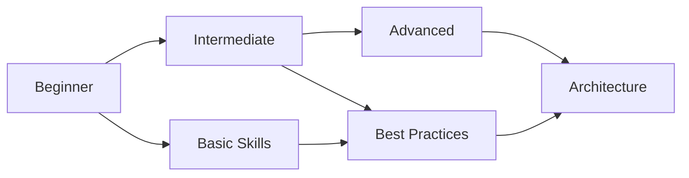

# cloud services

关于 cloud services 的详细内容和学习资源。

---

## 内容导航

- [advanced](advanced/index.html)
- [beginner](beginner/index.html)
- [intermediate](intermediate/index.html)

---

## 难度级别说明

本主题按难度分为三个级别，请根据自己的学习阶段选择：

=== "Beginner - 入门"
    
    **适合对象**
    
    - 初学者，无相关基础或基础薄弱
    - 希望系统学习基础知识
    
    **学习目标**
    
    - 掌握基础概念和核心原理
    - 理解基本操作和常用方法
    - 能够完成简单的实践项目
    
    **学习建议**
    
    - 按顺序阅读文档，循序渐进
    - 完成每个章节的练习
    - 多动手实践，加深理解

=== "Intermediate - 进阶"
    
    **适合对象**
    
    - 已掌握基础知识
    - 希望深入学习和提升技能
    
    **学习目标**
    
    - 深入理解技术原理和实现机制
    - 掌握进阶技能和最佳实践
    - 能够独立完成中等复杂度项目
    
    **学习建议**
    
    - 深入研究技术细节
    - 阅读相关源码
    - 完成综合性项目实践

=== "Advanced - 高级"
    
    **适合对象**
    
    - 有扎实基础和丰富实践经验
    - 追求专业深度和技术广度
    
    **学习目标**
    
    - 掌握高级特性和核心技术
    - 能够进行架构设计和性能优化
    - 解决复杂的实际问题
    
    **学习建议**
    
    - 研究高级特性和底层实现
    - 参与开源项目
    - 解决实际复杂问题

---

## 学习路径

### 系统学习

**推荐路径**

1. **基础阶段** - 从 beginner 开始，掌握基础概念和基本操作
2. **进阶阶段** - 学习 intermediate 内容，深入理解原理
3. **高级阶段** - 研究 advanced 主题，掌握高级技术
4. **实践应用** - 结合实际项目，应用所学知识

### 快速上手

如果时间有限，需要快速掌握：

1. 快速浏览 beginner 内容，了解基础概念
2. 重点学习 intermediate 的核心内容
3. 参考 advanced 中的最佳实践
4. 通过实际项目巩固知识

---

## 学习建议

!!! tip "有效学习方法"
    
    - **理论与实践结合** - 边学边练，通过实践加深理解
    - **循序渐进** - 不要跳过基础内容，扎实的基础是进阶的前提
    - **问题驱动** - 带着问题学习，解决实际问题
    - **持续学习** - 保持学习的连续性，定期回顾总结

!!! warning "常见误区"
    
    - 不要跳级学习 - 基础不牢，地动山摇
    - 不要只看不练 - 光看不练假把式
    - 不要急于求成 - 学习需要时间积累
    - 不要孤立学习 - 注重知识之间的联系

---

*最后更新：2026-03-16*
